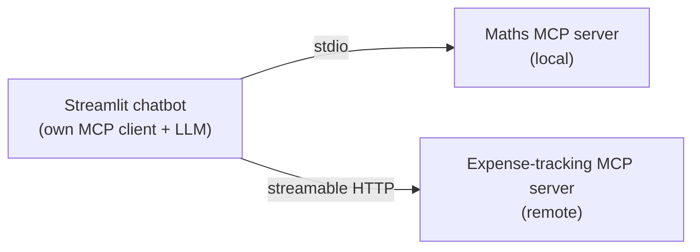
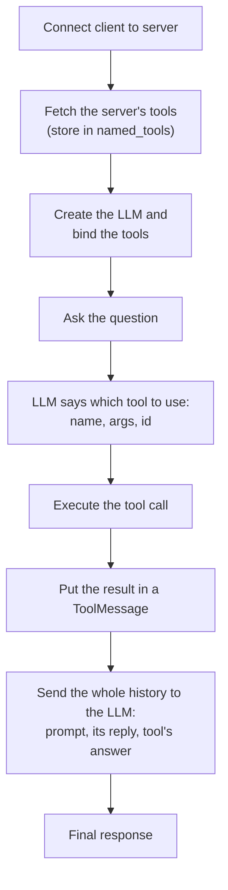

> **Video 8 of 8** · [Watch on YouTube](https://www.youtube.com/watch?v=o4ajsc-tSBc) · Translated from the
> Hindi transcript. Notes follow the video section by section, in its order.

So far every server in this playlist was used through Claude Desktop's built-in client; this video builds your own MCP client, so that your own chatbot can talk to MCP servers.

## Recap of the playlist so far

This video comes after a delay, because of a short break from YouTube. Seven videos are already in the playlist, which was planned as a mini playlist to give a basic idea of MCP, divided conceptually into three parts: **why, what, how**.

- A **trailer** video showed MCP's potential through one example: the whole process of making a newsletter with MCP.
- The **why** part covered why MCP is needed.
- The **what** part, the most detailed one, covered two important things: a deep dive into the **MCP architecture**, and the **MCP lifecycle**, how MCP works from start to end.
- The **how** part first showed how to use MCP practically, then how to build your own servers, both **local** and **remote**.

The last component of the playlist is **how to build MCP clients**. Every server built so far had to be used through Claude Desktop, which has its own client inside it. If you are building your own chatbot, you need your own client to connect that chatbot to an MCP server.

## Which library to build the client with

There are multiple libraries you can build a client with:

1. MCP's **official library**.
2. The **FastMCP** library already covered in this playlist.
3. **LangChain MCP Adapters**. Its own description: "This library provides a lightweight wrapper that makes MCP tools compatible with LangChain and LangGraph." It is a small wrapper library for building MCP clients in LangChain and LangGraph.

This video uses LangChain MCP Adapters, for two reasons. First, it felt like the simplest way to build MCP clients. Second, it is closely connected to the LangChain and LangGraph universe, which is what we have already been working with. Once you know the concepts, doing the same in the other two libraries is easy.

## The goal: an MCP chatbot

The goal is a chatbot where you can do normal chatting, but which also has MCP servers attached behind the scenes that you can talk to. It works as a nice GUI and has two servers attached:

- a **maths MCP server** for mathematical calculations, which is a **local** server;
- the **expense-tracking MCP server** for adding and tracking expenses, which is a **remote** server.

One of each gives you both flavours.



The plan of action:

1. Write code from scratch and connect the local maths server.
2. Connect the remote expense-tracking server.
3. Convert the whole code into a UI with **Streamlit**.

You can also connect other MCP servers the same way, which means any server shown in this playlist, such as the Manim server for beautiful visualisations, can be attached to your own chatbot. Watch the whole video, because the steps build on each other.

## The local maths server, tested in the MCP Inspector

The local server is a small maths server, written in FastMCP, that does arithmetic: plus, minus, multiplication and so on. It lives on the desktop, which makes it a local MCP server.

To test it, start the MCP Inspector from the terminal:

```bash
uv run fastmcp dev main.py
```

Connect to the server in the Inspector. A warning appears, but the tools work: there are **six arithmetic operations** (add, subtract, and so on). Choosing modulus with inputs 21 and 7 and clicking **Run Tool** gives the answer **0**. Close the Inspector before building the client.

## Setting up the client project

Follow these steps:

1. Install uv (already installed on the machine in the video):

   ```bash
   pip install uv
   ```

2. Create a new, empty folder (here on the desktop) and open it in VS Code.
3. Initialise uv inside the folder:

   ```bash
   uv init .
   ```

4. Install the dependencies: LangChain, LangChain OpenAI, LangChain MCP Adapters (which builds the client), python-dotenv, and Streamlit for the UI.

   ```bash
   uv add langchain langchain-openai langchain-mcp-adapters python-dotenv streamlit  # (implied, not shown in narration)
   ```

The client is built step by step in multiple versions. The first version is `client1.py`.

## Step 1: connecting the client to the server

The whole code uses Python's **async/await**. If you do not know async/await, watch a quick video on it first so this code makes more sense.

### The skeleton

Import `asyncio`, and import `MultiServerMCPClient` from `langchain_mcp_adapters.client`. The multi-server client is used because this client will be connected to multiple servers. The main function is asynchronous, hence the `async` keyword, and it is called from `if __name__ == "__main__"` through `asyncio.run`, which runs it asynchronously.

```python
import asyncio
from langchain_mcp_adapters.client import MultiServerMCPClient


async def main():
    pass


if __name__ == "__main__":
    asyncio.run(main())
```

### Giving the server's configuration

Connecting happens in two steps. First you give the configuration of the server you want to connect to. It may look scary, but you have seen it before: it is the same kind of config you pasted into Claude's config file when connecting local MCP servers to Claude Desktop.

- The server is named `math`.
- The transport is `stdio`, which means it is a **local** MCP server.
- `command` and `args` are the command that **starts** the server. `command` is the path to uv (imagine it as just `uv`). The arguments read `uv run fastmcp run <path to main.py>`, where `main.py`, inside the mcp math server folder on the desktop, holds the server's code.

The start command is needed because, as covered in the architecture video, when communication happens over stdio with a local server, it is **the client that starts the server**.

```python
servers = {
    "math": {
        "transport": "stdio",
        "command": "/path/to/uv",
        "args": [
            "run",
            "fastmcp",
            "run",
            "/path/to/Desktop/mcp-math-server/main.py",
        ],
    }
}
```

### Creating the client and fetching the tools

Second, create a `MultiServerMCPClient` instance, passing the `servers` dictionary, which gives you back a client. Then fetch all the tools on the server with `await client.get_tools()`, store them in a variable, and print them.

```python
async def main():
    client = MultiServerMCPClient(servers)
    tools = await client.get_tools()
    print(tools)
```

On running, the first thing you see is the client **starting the server** (transport stdio). The big list after that is the list of tools: `add` first, then `subtract`, then multiply, divide, power and, last, modulus. You now have access to all of them.

### Turning the list into a dictionary of named tools

Convert the list into a dictionary called `named_tools` whose keys are tool names and whose values are the tools themselves. Start with an empty dictionary, loop over the tools, and for each structured tool use its `name` attribute as the key:

```python
    named_tools = {}
    for tool in tools:
        named_tools[tool.name] = tool
    print(named_tools)
```

The output is now better structured: a tool called `add` with its full definition, a tool called `subtract` with its full definition, and so on.

So far the client is connected to the server, and it has fetched and displayed all of the server's tools.

## Step 2: giving the tools to an LLM

The tools exist, but who uses them? **The LLM.** The video uses OpenAI's LLM as before, with the OpenAI API key in a `.env` file. Two imports are needed: `load_dotenv` from `dotenv` (and call it), and `ChatOpenAI` from `langchain_openai`.

Inside `main`, create the LLM with GPT-5 (never used before through the API), then bind the tools to make a new LLM, `llm_with_tools`. Bind the **list** `tools`, not the `named_tools` dictionary; the dictionary is used later.

Then write a simple prompt, "What is the product of 12 and 15", call `ainvoke` with it inside `await`, and print the response.

```python
import asyncio
from dotenv import load_dotenv
from langchain_mcp_adapters.client import MultiServerMCPClient
from langchain_openai import ChatOpenAI

load_dotenv()

# servers = {...} as above


async def main():
    client = MultiServerMCPClient(servers)
    tools = await client.get_tools()

    named_tools = {}
    for tool in tools:
        named_tools[tool.name] = tool

    llm = ChatOpenAI(model="gpt-5")
    llm_with_tools = llm.bind_tools(tools)

    prompt = "What is the product of 12 and 15"
    response = await llm_with_tools.ainvoke(prompt)
    print(response)
```

The response tells you whether the LLM can identify and use the tools. What you need in it is the `tool_calls` attribute. On the first run **no tool call happens**: this was a simple calculation, so the LLM did it by itself.

Change the prompt to guide it a little, adding "using the math tool". This time the content is **empty**, which means a tool call happened. The response now has a `tool_calls` list (a list because several tool calls can happen together). Here there is one call, to the tool `multiply`, with the arguments the LLM wants passed: `a` is 12, and `b` the second number.

The client is connected, it has an LLM, and the LLM knows which tool to invoke. But the job is only half done: the LLM has only said "use this tool with this input". The tool still has to be run.

## Step 3: invoking the tool the LLM chose

First extract which tool the LLM wants. `response.tool_calls` is a list; take its zeroth (first) item, which is a dictionary, and read its `name`. Store it as `selected_tool`. Copy the line to get the arguments from `args` as `selected_tool_args`, and print both:

```python
    selected_tool = response.tool_calls[0]["name"]
    selected_tool_args = response.tool_calls[0]["args"]
    print(selected_tool)
    print(selected_tool_args)
```

The output says to call `multiply` with those arguments. Now do exactly that. All tools sit in `named_tools`, so fetch the one whose name is in `selected_tool`, call `ainvoke` on it with `selected_tool_args`, inside `await`, and you get the tool's result back:

```python
    tool_result = await named_tools[selected_tool].ainvoke(selected_tool_args)
    print(tool_result)
```

The tool result comes out as **180**.

Step by step so far: the client connected to the server, the LLM was given the tools, a prompt was sent, the LLM identified which tool to use with which input, that tool was called with those arguments, and the tool returned the result.

## Step 4: sending the result back to the LLM

The last step is to pass the result back to the LLM and tell it: the tool gave this result, now tell the user the answer. That needs a `ToolMessage`, imported from `langchain_core.messages`. Its content is the tool's result, and the name of the tool that produced it is already in `selected_tool`.

Then invoke `llm_with_tools` again with three things, which is basically the **whole history**: the initial prompt, the LLM's initial response (where it asked for `multiply` with these arguments), and the tool message. Print `final_response.content`, since this time there will be content. Remove the unnecessary print statements first.

```python
from langchain_core.messages import ToolMessage

    tool_message = ToolMessage(content=tool_result, name=selected_tool)

    final_response = await llm_with_tools.ainvoke([prompt, response, tool_message])
    print(final_response.content)
```

This run fails. The problem: when making a tool message you must also give the **tool call's ID**, which comes in the response's `tool_calls`. Make one more variable, `selected_tool_id`, from the `id` of `response.tool_calls[0]`, and pass it instead of the tool name. The parameter's name is `tool_call_id`:

```python
    selected_tool_id = response.tool_calls[0]["id"]

    tool_message = ToolMessage(content=tool_result, tool_call_id=selected_tool_id)
```

Now the final response comes: **180**, told by the LLM.

### The entire flow



In this process the MCP client communicated with the MCP server.

## Handling questions that need no tool

You can still chat normally, for example "What is the capital of India". The LLM understands it needs no tool and no MCP. But the code **blows up**, because the code after the first response was not needed and no tool call happened.

The fix is an `if` statement: if the first response from the LLM has no tool calls, print the response's content and return, ending `main` right there; otherwise run the rest of the code.

```python
    response = await llm_with_tools.ainvoke(prompt)

    if not response.tool_calls:
        print(response.content)
        return
```

:::note

The `tool_calls` attribute is always present on the chat model's reply; when no tool is needed it is an empty list. The check that works is therefore whether `tool_calls` is empty, as in the code above, rather than whether the attribute exists. The crash came from indexing `tool_calls[0]` on an empty list.

:::

Now "What is the capital of India" returns **New Delhi** with no error. A question such as "What is the remainder of … divided by 7" triggers a tool call, and the LLM's reply is **2** (cross-check it yourself). That completes the basic setup.

## Handling several tool calls in one reply

Before adding a second server, one more small change. The code so far handles only **one** tool call, but the LLM can suggest calling more than one tool, and then the code fails. So all the work of fetching each tool call's information and executing the tool now happens **inside a loop**, which runs as many times as there are items in the response's `tool_calls`. That is the only change, and it means the code works whether the LLM asks for one tool or five.

```python
    tool_messages = []  # (implied, not shown in narration)
    for tool_call in response.tool_calls:
        selected_tool = tool_call["name"]
        selected_tool_args = tool_call["args"]
        selected_tool_id = tool_call["id"]

        tool_result = await named_tools[selected_tool].ainvoke(selected_tool_args)
        tool_messages.append(ToolMessage(content=tool_result, tool_call_id=selected_tool_id))  # (implied, not shown in narration)

    final_response = await llm_with_tools.ainvoke([prompt, response, *tool_messages])  # (implied, not shown in narration)
    print(final_response.content)
```

## Adding the remote expense-tracking server

The remote server is exactly the one built and deployed in the last video: the expense-tracking MCP server deployed on **FastMCP Cloud**. Watch that video if you have not.

Connecting it only needs a second entry inside `servers`. The server is called `expense`, its transport is **streamable HTTP** because it is remote, and it takes a URL, which you get from FastMCP Cloud. Nothing else changes.

```python
servers = {
    "math": {
        "transport": "stdio",
        "command": "/path/to/uv",
        "args": ["run", "fastmcp", "run", "/path/to/Desktop/mcp-math-server/main.py"],
    },
    "expense": {
        "transport": "streamable_http",
        "url": "<your server URL from FastMCP Cloud>",
    },
}
```

The prompt changes to "Add an expense ₹800 for groceries on 4th November", and a small piece of code prints the names of all the named tools, to show that the tools now come from both servers:

```python
    print(named_tools.keys())  # (implied, not shown in narration)
```

The available tools now include add, subtract and multiply, and also `add_expense`, `list_expenses` and `summarize`, because the multi-server client is now connected to multiple servers. The final response reads "Your expense has been added", with the date, category and amount, followed by a further question from the LLM. The client now has two servers.

## Adding a server someone else built: Manim

The next server is **Manim's MCP server**. The "how" video showed how to make animation videos like 3Blue1Brown with it, connected to Claude Desktop. Here it is connected to your own client instead. This example matters because the first two servers were built in this playlist; this is the first one built by someone else that you can still use with your client.

There is nothing new to do. Add the configuration shown in that video as it is, with transport `stdio`, following the same setup. The server must be on your machine, and all its commands and arguments are passed as they are. If this is unclear, watch that video, especially between the 15-minute and 33-minute marks, where the full setup with Claude Desktop is shown. You only need that piece of config, attached here.

```python
    "manim": {
        "transport": "stdio",
        "command": "<command from the Manim server setup>",
        "args": ["<args from the Manim server setup>"],
    },
```

The prompt becomes "Draw a triangle rotating in place using the manim tool". The number of tools goes up: `execute_manim_code` and `cleanup_manim_temp_dir` now appear. After a wait, the animation video is generated, which shows the Manim MCP server is working.

So you can take any server from the internet and connect it to your client this way.

## Turning the client into a Streamlit GUI

The client is almost complete. One improvement remains: so far all communication with the LLM and the MCP client happens in the terminal, but the plan was a **Streamlit-based GUI**.

The code is already written in a new file, `client2.py`. The logic is the same, though it is not exactly the same code, because it is Streamlit code. It is not written from scratch in the video, because the video is about building an MCP client, not about building GUIs with Streamlit; the two logics are merged, written fairly descriptively with ChatGPT's help, and you can read through it. The server part is exactly the same, the chatbot LLM is the same, the client creation and tool fetching are the same. You need to know a little Streamlit to follow it.

Close the old terminals, open a new one, and run:

```bash
streamlit run client2.py
```

The GUI opens. Trying it out:

- A normal chat message works.
- "Show me all the expenses from last two weeks" shows the grocery expense added earlier. The one problem is that the ₹800 amount is not displayed correctly, a minor issue.
- "What is the remainder … divided by 23" returns **13** (you can check).
- "Make an animation video of a circle using manim tool" produces the video.

This GUI MCP client has three servers, and the same method lets you add as many MCP servers as you like.

## Closing and what comes next

That covers how to build MCP clients, the one video that was remaining, which many viewers had been asking for.

The focus now goes back to the **LangGraph playlist**, which has been pending even longer and which many comments ask to be completed. This MCP playlist was started precisely so that MCP could be taught within LangGraph. A few videos on more advanced MCP topics remain, **sampling, elicitation and authentication**, and they will be covered, but the LangGraph playlist comes first.
