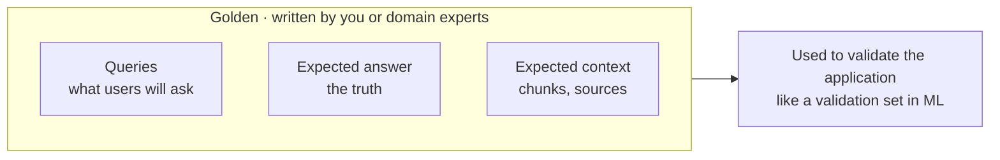
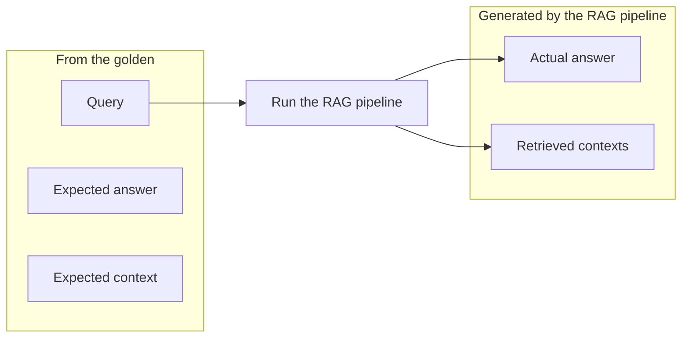
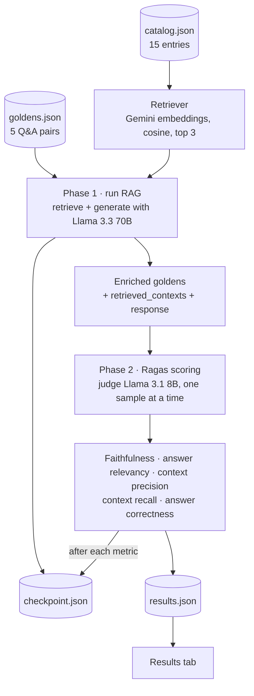

import Infographic from '@site/src/components/Infographic';
import FaithfulnessLab from '@site/src/components/viz/FaithfulnessLab';
import ContextPrecisionLab from '@site/src/components/viz/ContextPrecisionLab';
import ContextRecallLab from '@site/src/components/viz/ContextRecallLab';
import AnswerCorrectnessLab from '@site/src/components/viz/AnswerCorrectnessLab';

> **Module 2 of 4** ·
> [Watch from 1:13:30](https://www.youtube.com/watch?v=rQE3w8Qjx98&t=4410s) ·
> about 95 minutes of the 7h48m course ·
> [Code](https://github.com/divesh-sse/ragas) ·
> [Demo app](https://ragasz.streamlit.app/)
>
> From Krish Naik's *The Complete AI Security Course In 8 Hours*. This module
> is taught by Yash Patil, using an evaluator app built by Divesh. Notes
> follow the module in order. Diagrams redraw the whiteboard and the
> infographics pasted onto it; blocks marked *Not from the session* are
> additions.

A RAG app that answers well on the five questions you tried can still
invent facts, fetch the wrong chunks or dodge the question. Evaluation
turns "it looks fine" into a score for each of those failures, and this
module builds that scoring pipeline end to end.

## A RAG app with no evals

The module opens on a plain RAG chatbot in Streamlit (1:13 to 1:16). Upload
a PDF, here *Attention Is All You Need*, and the app extracts it, splits it
into chunks and ingests them into a vector store. Ask "What is attention?"
and the LLM answers from the retrieved chunks, which the app lists with
their ranks. The first attempt fails because the API key has expired; a
fresh key fixes it.

Then Yash asks the class what would stop this going to production. The
chat suggests a re-ranker and **evaluation**, and his notes from the
earlier RAG session add hybrid search. Re-rankers and hybrid search were
covered there. This module is about evaluation.

Why evals matter comes down to confidence. Right now you upload a document
and ask questions, but nothing tells you whether an answer is grounded or
hallucinated, and nobody checks every kind of response. Evals give you that
check before users find the problem.

## The demo you're building towards

Before any theory, Yash shows where the module ends up: the **TechNest RAG
Evaluator** (1:17 to 1:23). TechNest is a made-up online electronics shop.
The app has four tabs:

| Tab | What it holds |
| --- | ------------- |
| Catalog | The knowledge base: 15 entries across products, policies and FAQs, each with a category, title and content. This is what gets ingested. |
| Goldens | Five test questions, each with a reference answer and the metric it is meant to stress. |
| Run Evaluation | Phase 1 runs the RAG pipeline on every golden. Phase 2 scores the results with Ragas. |
| Results | Average score per metric, a per-golden score table, full details, and a JSON download. |

Run Phase 1 and each golden shows its retrieved chunks with rank, the RAG
response, and the reference answer, the answer that *should* come back.
For "What is TechNest's return policy?", the return-policy entry comes back
as the top chunk. Phase 2 then scores each answer with the
[Ragas](https://docs.ragas.io) framework, using a judge model and two
cooldown settings explained later.

Compare that with the raw chatbot. There, you'd read every answer and
guess whether it was grounded. Here, each answer has a score for
faithfulness, relevance and context quality, so you can see where the
application is lagging. Once it's deployed, the same setup closes the loop:
when a user's question gets a bad answer, add that question as a new test
case so the fix is checked from then on.

## What evaluation is: hiring a candidate

Yash starts from an analogy (1:23 to 1:28). No genuine company hires
without an interview, but every candidate arrives with two kinds of
evidence.

- **Predefined scores.** A fresher's 10th and 12th marks and CGPA. They are
  useful, but nobody hires on them alone.
- **The interview.** A company evaluates you against the job it wants you
  to do. Applying to Google as a GenAI engineer means a test, a reasoning
  round and one-on-one interviews, all judged on Google's own terms.

LLMs have the same two layers. When a provider launches a new model, it
publishes **benchmarks** comparing it with every other model. That tells
you how the model performs on generic tasks, but not on yours. For that you
run your own evaluation, and the practical way to do it at scale is an
**LLM as a judge**: in the interview a human judges a human, and here an
LLM judges an LLM. If the judge itself hallucinates, a human stays in the
review loop to catch it.

<Infographic
  src="/img/ai-security/m2-hiring.svg"
  alt="A candidate applying to Google has past scores and an interview; LLM evaluation likewise has benchmarks and a human or LLM judge."
  caption="Redrawn from the mentor's whiteboard, 1:23 to 1:28."
/>

The same two layers show up in how you build an LLM application:

1. **Pick the model.** A real-time voice use case needs a model with low
   latency; heavy image input needs a multimodal model. Here you compare
   models on their own, and benchmarks help.
2. **Build the application.**
3. **Test the application.** Once answers look reasonable, you need a
   proper way to test them. Ordinary unit tests don't cover free-text
   answers, so you build **custom evaluations** for your use case. This is
   the pipeline that gives you confidence before release.

## Two things you can evaluate

The slide at 1:28 makes the distinction explicit, and Yash brackets the
left-hand column as "a research point": useful to know, not where you'll
spend your time. About 90% of a developer's evaluation work is on the
right-hand side, and so is the rest of this module.

| | A) Evaluate the model | B) Evaluate the application |
| --- | --- | --- |
| Question | Which model is better? | Is my RAG or agent doing its job? |
| Where it comes from | Mostly off the shelf | Custom work: your data, your tasks, your metrics. No public benchmark fits your data. |
| Benchmarks | Knowledge: MMLU. Maths: GSM8K, MATH. Code: HumanEval, MBPP. Reasoning: HellaSwag, ARC, GPQA. Honesty: TruthfulQA. Instructions: IFEval. | |
| Leaderboards | LMArena / Chatbot Arena (Elo from human votes), HF Open LLM Leaderboard, HELM, Artificial Analysis | |
| Metrics | Reference-based: BLEU (precision, translation), ROUGE-N/L (recall, summarisation), METEOR (synonym-aware), exact match / token F1 (QA). Model-based: BERTScore, BLEURT. Perplexity (open weights only, for pre-training and fine-tuning). | A golden dataset, task-specific metrics, and an LLM judge (usually the main approach) |
| Frameworks | | RAG triad, G-Eval, DeepEval, Ragas |

<Infographic
  src="/img/ai-security/m2-two-things.svg"
  alt="Two things you can evaluate: the model (benchmarks, leaderboards, reference metrics) or the application (golden dataset, task-specific metrics, LLM-as-judge, frameworks)."
  caption="Redrawn from the slide on the mentor's board, 1:28 to 1:30."
/>

Building a custom evaluation needs three things from that right-hand
column: a golden dataset, the metrics, and a judge. The module takes them
in that order and uses Ragas for the metrics, while noting that other
frameworks exist.

## Goldens: the truth you test against

A **golden** is the truth an answer is checked against (1:30 to 1:40). You
ask "What is attention?" and the app answers, but somebody has to define
what the right answer is.

**Who writes it.** Ideally domain experts. For a medical product, the right
answers come from healthcare experts, because a developer doesn't know the
domain in that depth. But experts' time is expensive and hard to schedule,
so in practice you use it carefully and combine it with other ways of
producing goldens.

**What goes in it.** Think of the golden set as a dataset. Each row holds:

- **Queries**: the kinds of question real users will ask. Together they
  should cover every dimension of the chatbot.
- **Expected answer**: the true, ideal answer to that query.
- **Expected context**: the chunks or sources the pipeline *should*
  retrieve to build that answer. What you include here is up to you as the
  developer.

Yash's comparison is the validation set in classical ML. When you train
XGBoost, the training data fits the model and the held-out validation data
tells you whether it behaves as expected. Goldens play the validation
role for an LLM application.

*Redrawn from the mentor's whiteboard (1:33 to 1:35).*



TechNest's golden file has five entries. Each has a query (`user_input`),
an expected answer (`reference`), and a `metric_focus` naming the metric it
is designed to stress, which the app shows as a coloured badge. There is no
expected-context field; Yash points out you could add one. Five keeps the
demo small, but together they probe the application from every side.

### Complete file: `goldens.json`

```json
[
  {
    "id": "g001",
    "metric_focus": "faithfulness",
    "user_input": "What is TechNest's return policy?",
    "reference": "TechNest accepts returns within 30 days of purchase. Items must be in original packaging with all accessories. Customers pay return shipping unless the item is defective. Refunds are processed in 5 to 7 business days."
  },
  {
    "id": "g002",
    "metric_focus": "answer_relevancy",
    "user_input": "What are the RAM and storage specs of the ProBook X1?",
    "reference": "The ProBook X1 has 16GB DDR5 RAM and a 512GB NVMe SSD."
  },
  {
    "id": "g003",
    "metric_focus": "context_precision",
    "user_input": "How long is the battery life on the SoundPods Pro?",
    "reference": "The SoundPods Pro offer 8 hours of playback per charge and an additional 24 hours from the charging case, giving a total of 32 hours."
  },
  {
    "id": "g004",
    "metric_focus": "context_recall",
    "user_input": "What are TechNest's shipping options and how long do returns take to process?",
    "reference": "TechNest offers free standard shipping on orders over $50 (3 to 5 business days) and expedited shipping for $9.99 (1 to 2 business days). Returns are accepted within 30 days and refunds are processed in 5 to 7 business days after the item is received."
  },
  {
    "id": "g005",
    "metric_focus": "answer_correctness",
    "user_input": "What is the price of the PixelPhone 15?",
    "reference": "The TechNest PixelPhone 15 is priced at $899."
  }
]
```

The catalogue entries these questions are answered from have a flat shape:
`id`, `category` (`product`, `policy` or `faq`), `title` and `content`.
The return-policy entry, for example, reads "TechNest accepts returns
within 30 days of the original purchase date… Refunds are processed within
5 to 7 business days of receiving the returned item."

:::note Not from the session
Yash says there is a second way to produce goldens besides experts and
promises to cover it later, but the recording doesn't come back to it. The
usual answer is **synthetic generation**: a framework reads your documents
and drafts question and answer pairs, for example Ragas' test-set
generator or DeepEval's Synthesizer. Experts then review and correct the
drafts, which spends their time on checking rather than writing. Keep a
few goldens for questions the corpus *can't* answer, so you also test that
the app says so.
:::

## Phase 1: run the pipeline on every golden

Goldens are the truth, but to evaluate anything you need what your RAG
pipeline *actually* produces (1:40 to 1:47). Yash's analogy is marking
exam papers for ten students. You first need the master sheet: question 1
is A, question 2 is B. That is the golden. Then you take each student's
answers and compare them with it. For the RAG pipeline, the student's
answers only exist once you run it.

So Phase 1 runs every golden's query through the real pipeline and keeps
two outputs: the **actual answer** and the **retrieved contexts**. The
first run in class fails on an expired Groq key. Yash creates a new key in
the Groq console (API Keys → Create API key, name it, set an expiry) and
runs it again. Five queries means five retrievals and five LLM calls, so it
takes a while.

*Redrawn from the mentor's whiteboard (1:45 to 1:47).*



In the app, each result shows chunk 1, chunk 2 and so on, ranked for that
query, then the RAG response, generated by the LLM from those chunks plus
the query, then the reference answer from the golden. That completes
**phase 1: run your application** to collect the real answer and the real
retrieved context. Phase 2 compares them against the truth.

### Doubts · Isn't this time-consuming? · 1:42

**Krishna:** Doesn't running all this take a long time?

**Yash:** Yes, and that's accepted. You don't run the full evaluation on
every continuous-integration run on your dev branch. You run it
occasionally, for example when new queries start getting poor answers.

:::note Not from the session
A common middle ground, used in the Enterprise RAG project's
[Session 2](/docs/projects/enterprise-rag/session-2), is two suite sizes:
a small, fast set of essential goldens on every change, and the full set
nightly or before a release.
:::

### The retriever

Retrieval is deliberately simple: no vector database, just an in-memory
matrix. At start-up, every catalogue entry is embedded with Gemini as
"title. content" and normalised. At query time, the query embedding's dot
product with the matrix gives cosine similarities, and the top three
entries are returned.

#### Complete file: `rag/retriever.py`

```python
from __future__ import annotations

import numpy as np
from langchain_google_genai import GoogleGenerativeAIEmbeddings


class Retriever:
    def __init__(self, catalog: list[dict], api_key: str):
        self.catalog = catalog
        self._embedder = GoogleGenerativeAIEmbeddings(
            model="gemini-embedding-2-preview",
            google_api_key=api_key,
        )
        self._embeddings = self._embed_catalog()

    def _embed_catalog(self) -> np.ndarray:
        texts = [f"{item['title']}. {item['content']}" for item in self.catalog]
        vecs = self._embedder.embed_documents(texts)
        arr = np.array(vecs, dtype=np.float32)
        norms = np.linalg.norm(arr, axis=1, keepdims=True)
        return arr / np.where(norms == 0, 1, norms)

    def _embed_query(self, query: str) -> np.ndarray:
        vec = np.array(self._embedder.embed_query(query), dtype=np.float32)
        norm = np.linalg.norm(vec)
        return vec / (norm if norm > 0 else 1)

    def retrieve(self, query: str, top_k: int = 3) -> list[str]:
        qvec = self._embed_query(query)
        scores = self._embeddings @ qvec
        top_indices = np.argsort(scores)[::-1][:top_k]
        return [self.catalog[i]["content"] for i in top_indices]

    def retrieve_with_titles(self, query: str, top_k: int = 3) -> list[dict]:
        qvec = self._embed_query(query)
        scores = self._embeddings @ qvec
        top_indices = np.argsort(scores)[::-1][:top_k]
        return [
            {
                "title": self.catalog[i]["title"],
                "content": self.catalog[i]["content"],
                "score": float(scores[i]),
            }
            for i in top_indices
        ]
```

### The generator

The generator is Llama 3.3 70B on Groq, called through the OpenAI client
pointed at Groq's OpenAI-compatible endpoint. The system prompt restricts
it to the context and tells it to say so when the context is not enough.
Chunks are numbered `[1]`, `[2]` and so on in the user message.

#### Complete file: `rag/generator.py`

```python
from __future__ import annotations

from openai import AsyncOpenAI

GROQ_BASE_URL = "https://api.groq.com/openai/v1"
DEFAULT_MODEL = "llama-3.3-70b-versatile"

SYSTEM_PROMPT = """You are a helpful customer support assistant for TechNest, an online electronics store.
Answer the customer's question using ONLY the information provided in the context below.
If the context does not contain enough information to answer fully, say so honestly.
Keep your answer concise, factual, and friendly. Do not invent any details not present in the context."""


class Generator:
    def __init__(self, api_key: str, model: str = DEFAULT_MODEL):
        self._client = AsyncOpenAI(api_key=api_key, base_url=GROQ_BASE_URL)
        self._model = model

    async def generate(self, query: str, contexts: list[str]) -> str:
        context_block = "\n\n".join(f"[{i+1}] {c}" for i, c in enumerate(contexts))
        messages = [
            {"role": "system", "content": SYSTEM_PROMPT},
            {
                "role": "user",
                "content": f"Context:\n{context_block}\n\nCustomer question: {query}",
            },
        ]
        response = await self._client.chat.completions.create(
            model=self._model,
            messages=messages,
            temperature=0,
            max_tokens=300,
        )
        return response.choices[0].message.content.strip()
```

### Phase 1 runner

The runner loops over the goldens, retrieves, generates, and appends
`retrieved_contexts` and `response` to a copy of each golden. It waits five
seconds between goldens so the free tier's rate limit is not hit. It makes
no Streamlit calls, because the app runs it in a worker thread.

#### Complete file: `evals/runner.py`

```python
from __future__ import annotations

import asyncio
from rag.retriever import Retriever
from rag.generator import Generator


async def run_phase1(
    goldens: list[dict],
    retriever: Retriever,
    generator: Generator,
    top_k: int = 3,
    spacing_s: int = 5,
) -> list[dict]:
    """
    Phase 1: run the RAG pipeline on every golden.
    Returns enriched list with retrieved_contexts and response added.
    No Streamlit calls — safe to run inside a ThreadPoolExecutor worker thread.
    """
    enriched = []
    for i, golden in enumerate(goldens):
        contexts = retriever.retrieve(golden["user_input"], top_k=top_k)
        response = await generator.generate(golden["user_input"], contexts)
        enriched.append(
            {
                **golden,
                "retrieved_contexts": contexts,
                "response": response,
            }
        )
        if i < len(goldens) - 1:
            await asyncio.sleep(spacing_s)
    return enriched
```

## Phase 2: why you need a judge

With both halves in hand, Phase 2 is the comparison (1:47 to 1:53). Given
the query, the expected answer and the actual answer, anyone can spot the
defects: "what is X company's return policy", here is the correct answer,
here is what the app said. The **expected answer** is what you want the
application to say; the **actual answer** is what it did say, and you want
the two to be as close as possible. The retrieved chunks can be compared
with the expected chunks, and checked against the query, in the same way.

Doing that by hand for five goldens is tedious. For a hundred, it's
impossible. So the check is handed to an **LLM as a judge**.

- **Which model.** Ideally a state-of-the-art model, such as a GPT or Opus
  model. They are expensive, but still cheaper than a human expert's time.
- **A cheaper option.** For simple evaluations you can skip the LLM:
  embed both the actual and expected answer and compare them. That's fast
  but weak on complex queries, so the rest of the module uses an LLM.

<Infographic
  src="/img/ai-security/m2-goldens-judge.svg"
  alt="Goldens (queries, expected answers, expected context) and the RAG pipeline's actual answers and retrieved contexts both go to a judge LLM, which scores five metrics."
  caption="Redrawn from the mentor's whiteboard as it stood by 2:04, built up from 1:33."
/>

An LLM on its own is just a general intelligence that can read an expected
answer and say whether an actual answer is close to it. What's missing is
**structure**. To check answer relevance you have to hand it certain fields
and leave out others; to check the context you need a different set. You'd
be restating that recipe every time. **Metrics** are that structure: each
one defines which fields go in, what the judge does with them, and how the
score comes out. Frameworks such as Ragas and DeepEval ship them ready
made, and this module uses Ragas'. Ragas also sells a hosted, paid
version; the open-source library runs locally in your project.

### The judge and the cooldowns

The Phase 2 panel shows three settings (1:55 to 2:03).

- **Judge model:** `llama-3.1-8b-instant` on Groq. Any other model can be
  used.
- **Sample cooldown:** 25 seconds.
- **Experiment cooldown:** 35 seconds.

The cooldowns exist because evaluation burns through API calls. Five
goldens and five metrics, with a judge call for each pair, comes to 25 or
more LLM calls. Fire them all at once at Groq's free tier and you hit the
rate limit. So the code pauses between calls to let the limit recover.

### Doubts · Why not score everything in one LLM call? · 1:59

**From the chat:** Why not send all the metrics in a single call?

**Yash:** Because the judge would do a worse job. Give a person ten
projects at once and they manage none of them well; give them one or two
and they do each properly. An LLM is similar: the fuller its context
window, the worse it reasons, and in his experience it does best with the
window only lightly filled. The judge's reliability matters more than
anything else in the pipeline. Think of a court where the judge is already
biased. So each metric gets its own call with an almost empty context.

Yash also mentions running the metrics in parallel, asynchronously, to save
time.

:::note Not from the session: what the code actually does
Four details in the repository differ from what's said in class.

- **More calls than 25.** Several Ragas metrics make more than one judge
  call per sample. The budget in `metrics.py` is 2 calls for faithfulness,
  1 for answer relevancy, 2 each for context precision and recall, and 3
  for answer correctness. That's 10 per golden, so about 50 for five.
- **The cooldowns are the other way round.** The 25-second
  `SAMPLE_COOLDOWN` is the wait between goldens *within* one metric. The
  35-second `EXPERIMENT_COOLDOWN` is the wait between one metric and the
  next. The class describes it the other way round.
- **Sequential, not parallel.** The code is `async`, but it scores one
  sample at a time and awaits each result before sleeping. `async` here
  keeps the UI thread free; it doesn't run calls concurrently.
- **The judge is smaller than the generator.** The advice is to use a
  state-of-the-art judge, but the demo judges a 70B generator with an 8B
  model, to stay within Groq's free tier. For real results use a judge at
  least as strong as the model it grades, and check its verdicts against a
  sample of human labels.

The "only lightly filled window" guidance is a rule of thumb, not a
published threshold. The underlying point, that one focused call per
metric scores more reliably than one crowded call, holds.
:::

### Complete file: `evals/metrics.py`

This is the scoring core. `build_judge` points Ragas' `llm_factory` at
Groq. `build_embeddings` loads a local sentence-transformer, which two
metrics need. `prepare_inputs` hands each metric only the fields it needs
and truncates contexts. `_score_one` scores one sample, and on a rate-limit
error waits 65 seconds and retries once. `EXPERIMENTS` is the list of five
metrics, each with its required fields.

```python
from __future__ import annotations

"""
RAGAS evaluation with safe rate-limit handling.

Rate limits (Groq free/on_demand tier):
  llama-3.1-8b-instant : 6,000 TPM  |  30 RPM  |  500,000 TPD

Token budget per sample (approx):
  Faithfulness       : 2 calls × ~550 tok  = ~1,100 tok/sample
  Answer Relevancy   : 1 call  × ~250 tok  = ~250  tok/sample
  Context Precision  : 2 calls × ~350 tok  = ~700  tok/sample
  Context Recall     : 2 calls × ~350 tok  = ~700  tok/sample
  Answer Correctness : 3 calls × ~350 tok  = ~1,050 tok/sample

Strategy: 1 sample at a time, SAMPLE_COOLDOWN between samples,
EXPERIMENT_COOLDOWN between experiments. On 429 → wait RETRY_WAIT and retry once.
"""

import asyncio
from openai import AsyncOpenAI
from ragas.llms import llm_factory
from ragas.embeddings import HuggingFaceEmbeddings
from ragas.metrics.collections import (
    Faithfulness,
    AnswerRelevancy,
    ContextPrecision,
    ContextRecall,
    AnswerCorrectness,
)

GROQ_BASE_URL = "https://api.groq.com/openai/v1"
JUDGE_MODEL = "llama-3.1-8b-instant"

# ── Timing constants ──────────────────────────────────────────────────────────
SAMPLE_COOLDOWN = 25      # seconds between samples within one experiment
EXPERIMENT_COOLDOWN = 35  # seconds between experiments (fully resets TPM window)
RETRY_WAIT = 65           # seconds to wait after a 429 before retrying

# ── Context truncation (prevents token overflow per call) ─────────────────────
CONTEXT_CHARS = 400       # max chars per context chunk passed to metrics
CONTEXT_LIMIT = 2         # max number of context chunks passed to metrics


# ── Setup helpers ─────────────────────────────────────────────────────────────

def build_judge(api_key: str) -> object:
    client = AsyncOpenAI(api_key=api_key, base_url=GROQ_BASE_URL)
    return llm_factory(JUDGE_MODEL, provider="openai", client=client)


def build_embeddings() -> HuggingFaceEmbeddings:
    return HuggingFaceEmbeddings(
        model="sentence-transformers/all-MiniLM-L6-v2",
        use_api=False,
    )


# ── Input preparation ─────────────────────────────────────────────────────────

def _truncate_contexts(contexts: list[str]) -> list[str]:
    return [c[:CONTEXT_CHARS] for c in contexts[:CONTEXT_LIMIT]]


def prepare_inputs(enriched: list[dict], keys: list[str]) -> list[dict]:
    result = []
    for e in enriched:
        d = {}
        for k in keys:
            if k == "retrieved_contexts":
                d[k] = _truncate_contexts(e.get("retrieved_contexts", []))
            else:
                d[k] = e.get(k, "")
        result.append(d)
    return result


# ── Scoring ───────────────────────────────────────────────────────────────────

async def _score_one(
    metric,
    input_dict: dict,
    error_collector: list | None = None,
    sample_idx: int = 0,
) -> float | None:
    """
    Score a single sample. Returns None on failure.
    Appends error dicts to error_collector (a plain list) — never calls Streamlit,
    so it is safe to run inside a ThreadPoolExecutor worker thread.
    """
    try:
        results = await metric.abatch_score([input_dict])
        return float(results[0].value)

    except Exception as e:
        err_str = str(e)
        is_rate_limit = (
            "429" in err_str
            or "rate" in err_str.lower()
            or "limit" in err_str.lower()
            or "quota" in err_str.lower()
        )

        if is_rate_limit:
            if error_collector is not None:
                error_collector.append({"sample": sample_idx + 1, "error": f"Rate limit — waiting {RETRY_WAIT}s then retrying…"})
            await asyncio.sleep(RETRY_WAIT)
            try:
                results = await metric.abatch_score([input_dict])
                return float(results[0].value)
            except Exception as e2:
                if error_collector is not None:
                    error_collector.append({"sample": sample_idx + 1, "error": f"Retry failed: {str(e2)[:120]}"})
                return None

        if error_collector is not None:
            error_collector.append({"sample": sample_idx + 1, "error": f"{type(e).__name__}: {err_str[:120]}"})
        return None


async def score_experiment(
    metric,
    inputs: list[dict],
    error_collector: list | None = None,
) -> list[float | None]:
    """
    Score one metric across all samples, one at a time with SAMPLE_COOLDOWN between each.
    error_collector is a plain list that gets appended to on failure — no Streamlit calls,
    safe to run inside a worker thread.
    """
    scores = []
    for i, inp in enumerate(inputs):
        score = await _score_one(metric, inp, error_collector=error_collector, sample_idx=i)
        scores.append(score)
        if i < len(inputs) - 1:
            await asyncio.sleep(SAMPLE_COOLDOWN)
    return scores


# ── Experiment registry ───────────────────────────────────────────────────────
# Each entry: (display_name, metric_factory(llm, emb), required_input_keys)

EXPERIMENTS = [
    (
        "Faithfulness",
        lambda llm, emb: Faithfulness(llm=llm),
        ["user_input", "response", "retrieved_contexts"],
    ),
    (
        "Answer Relevancy",
        lambda llm, emb: AnswerRelevancy(llm=llm, embeddings=emb),
        ["user_input", "response"],
    ),
    (
        "Context Precision",
        lambda llm, emb: ContextPrecision(llm=llm),
        ["user_input", "reference", "retrieved_contexts"],
    ),
    (
        "Context Recall",
        lambda llm, emb: ContextRecall(llm=llm),
        ["user_input", "retrieved_contexts", "reference"],
    ),
    (
        "Answer Correctness",
        lambda llm, emb: AnswerCorrectness(llm=llm, embeddings=emb),
        ["user_input", "response", "reference"],
    ),
]

METRIC_NAMES = [name for name, _, _ in EXPERIMENTS]
```

:::warning Metrics see only two of the three retrieved chunks
The retriever returns three chunks, but `CONTEXT_LIMIT = 2` passes only
the first two to every metric. That keeps each judge call small. It also
means a fact sitting in chunk 3 counts as *not retrieved*. Golden g004
needs both the shipping and the return policy, so if the return policy
lands third, context recall drops even though the generator saw it. Raise
the limit, or match it to `top_k`, before trusting recall scores.
:::

Yash presses Run and the metrics start completing one by one, faithfulness
first. He explains each one while the next is scoring.

## Metric 1: Faithfulness (groundedness)

Faithfulness asks whether the answer the LLM gives at the end of the
pipeline is **based on the retrieved context** (2:04 to 2:12). If the
context is factually correct and the answer sticks to it, the answer is
correct too. It is the metric for catching hallucination.

The worked example is a bank's minimum-balance query. Two chunks come back
from the knowledge base: urban minimum ₹10,000 with a ₹350 + GST fee below
it; semi-urban ₹5,000 and rural ₹2,500. The LLM's answer makes four claims.

The judge first splits the answer into **atomic claims**, then asks one
question of each: *can this claim be fully inferred from the retrieved
context, yes or no?*

<Infographic
  src="/img/ai-security/m2-faithfulness.svg"
  alt="Faithfulness worked example: four atomic claims from the answer checked against two chunks; three grounded, one hallucinated, score 0.75 against a 0.8 threshold."
  caption="Redrawn from the faithfulness infographic on the mentor's board, 2:05 to 2:08."
/>

*Interactive exercise added to these notes.*

<FaithfulnessLab />

$$
\text{Faithfulness} = \frac{\text{claims supported by the context}}{\text{total claims in the answer}}
$$

Three of four claims are grounded, so the score is 0.75. With a pass
threshold of 0.8 this answer fails; with a threshold below 0.75 it would
pass. Faithfulness ignores the reference answer completely. It only checks
whether the generated text stays inside the context. In the app, the
TechNest run scores 0.97.

### Doubts · Who sets the threshold? · 2:08

**Yash:** You do, as the developer, based on how much correctness the use
case demands. Treat it as a hyperparameter.

### Doubts · How are atomic claims judged? · 2:09

**From the chat:** The judge's question is yes or no, but how are the
claims themselves produced and judged?

**Yash:** That logic is in the metric's own system prompt inside Ragas.
When you give the metric to the judge LLM, the prompt tells it to split
the answer into claims and verdict each one.

## Metric 2: Answer relevancy

Answer relevancy asks whether the **answer addresses the query** (2:12 to
2:18). It needs two inputs: the query (`user_input`, from the golden) and
the actual answer (`response`).

The judge doesn't compare them directly. It works backwards:

1. **Generate questions.** The judge reads the answer and invents *N*
   questions that this answer would answer.
2. **Similarity check.** Each generated question is compared with the
   original query by **embedding** similarity, a semantic match rather than
   a keyword match.

The score is the average similarity, between 0 and 1. For "What is
TechNest's return policy?", the Llama 3.1 8B judge reads the app's answer,
writes the questions that answer would fit, and each is compared with the
original.

<Infographic
  src="/img/ai-security/m2-answer-relevancy.svg"
  alt="Answer relevancy: the judge invents questions the answer would answer, compares them with the input by embedding similarity, and averages; off-topic, padded or incomplete answers score low."
  caption="Redrawn from the answer relevancy infographic on the mentor's board, 2:12 to 2:17."
/>

Three things pull the score down.

| Cause | What happens |
| --- | --- |
| Off-topic answer | It answers a different question, so the generated questions don't resemble the query. |
| Padded response | Filler dilutes the on-topic signal. |
| Incomplete answer | It skips part of the question. Of three generated questions, two may match while one aspect of the query is never covered. |

Yash adds that the similarity step can use a bi-encoder (fast embedding
comparison) or a cross-encoder (slower, deeper comparison).

:::note Not from the session
Ragas' answer relevancy uses embedding cosine similarity, that is, a
bi-encoder: here the local `all-MiniLM-L6-v2` passed as `embeddings=emb`.
Swapping in a cross-encoder would mean writing your own metric. Ragas'
version also checks whether the answer is **noncommittal** ("I don't
know"); a noncommittal answer scores 0 however similar its questions are.
:::

## The RAG triad

Before the next metric, Yash steps back to the **RAG triad** (2:18). The
two metrics so far judged the answer. A RAG system has three pieces, the
query, the context and the response, and three relationships between them.
Cover all three and every aspect is covered.

<Infographic
  src="/img/ai-security/m2-rag-triad.svg"
  alt="The RAG triad: query, context and response, linked by context relevance, groundedness and answer relevance."
  caption="Redrawn from the RAG triad slide on the mentor's board, 2:18 to 2:19."
/>

| Edge | Metric in this module |
| --- | --- |
| Response → query | Answer relevancy |
| Context → response | Groundedness, which is what faithfulness measures |
| Query → context | Context relevance. Context precision and recall, next, check the retrieval side. |

## Metric 3: Context precision (ranking)

Retrieval returns a **ranked** list, the top *k*. Context precision asks
whether that ranking is good: are the relevant chunks at the top and the
noise at the bottom (2:19 to 2:24)?

The example query is "What is the minimum balance for my savings
account?". Five chunks come back. The judge LLM, Llama 3.1 in this app,
decides for each chunk whether it's relevant or noise. Then the position
matters: noise in first place is the worst case; noise in last place is
acceptable. So every relevant chunk that comes after a noisy one gets
penalised.

At each relevant rank *k*, compute precision at *k*: the share of the top
*k* chunks that are relevant. Average those values over the relevant ranks
only, skipping the noisy ones.

<Infographic
  src="/img/ai-security/m2-context-precision.svg"
  alt="Context precision worked example: five ranked chunks with one noisy chunk at rank 3; precision at each relevant rank averages to 0.89."
  caption="Redrawn from the context precision infographic on the mentor's board, 2:19 to 2:23."
/>

*Interactive exercise added to these notes.*

<ContextPrecisionLab />

$$
\text{Context precision} = \frac{1}{\lvert \text{relevant ranks} \rvert}\sum_{k \,\in\, \text{relevant ranks}} \text{P@}k
$$

Chunks 4 and 5 are relevant but arrive after the noise, so they earn 0.75
and 0.80 instead of 1. Without a framework you'd have to work out nuances
like this yourself.

This metric points straight at a fix. **Re-ranking** does exactly what
context precision measures, so if the score is low after you've sorted out
ingestion and prompts, add a re-ranker. That is the wider benefit of evals:
they direct what you build next. The TechNest run scores 1.0.

:::tip Check the arithmetic yourself
*Not from the session.* A few lines reproduce the slide's number and show
how much a noisy chunk at the top costs:

```python
def context_precision(relevance: list[int]) -> float:
    hits, total = 0, 0.0
    for k, rel in enumerate(relevance, start=1):
        if rel:
            hits += 1
            total += hits / k
    return total / hits if hits else 0.0

print(round(context_precision([1, 1, 0, 1, 1]), 4))  # 0.8875, the slide's 0.89
print(round(context_precision([0, 1, 1, 1, 1]), 4))  # 0.6792, same chunks, noise first
```
:::

In the code, the metric receives `user_input`, `reference` and
`retrieved_contexts`: the judge decides each chunk's relevance against the
reference answer.

## Metric 4: Context recall

Context recall asks whether retrieval **fetched everything the ideal answer
needs** (2:24 to 2:30). Its inputs are the `reference`, the expected answer
from the golden, and the `retrieved_contexts`.

1. **Extract claims.** The judge reads the reference and splits it into
   independent atomic claims.
2. **Attribution check.** For each claim: can it be attributed to any
   retrieved chunk, yes or no?

In the example, the reference makes four claims about minimum balances and
fees. Chunks cover claims 1, 2 and 4, but no chunk mentions the rural
₹2,500 minimum, so claim 3 is missing: the retriever didn't bring that fact
back.

<Infographic
  src="/img/ai-security/m2-context-recall.svg"
  alt="Context recall worked example: four reference claims, three supported by retrieved chunks and the rural minimum missing, recall 0.75, with causes of low scores and score bands."
  caption="Redrawn from the context recall infographic on the mentor's board, 2:24 to 2:28."
/>

*Interactive exercise added to these notes.*

<ContextRecallLab />

$$
\text{Context recall} = \frac{\text{reference claims supported by the retrieved context}}{\text{total claims in the reference}}
$$

Each claim carries equal weight. That's the difference from faithfulness:
faithfulness judges the *answer's* claims against the context; recall
judges the *reference's* claims, so it tests the retriever.

| Cause of a low score | What it means |
| --- | --- |
| Missing chunks | The retriever never fetched the documents holding key facts. |
| *k* too small | The relevant chunk exists at rank 4, but you only kept 3. |
| Embedding gap | Relevant documents exist but rank too low to surface. Improve the embeddings, or re-rank. |

| Score band | Reading |
| --- | --- |
| 0.0 to 0.4 | Low: the retriever is missing critical documents |
| 0.4 to 0.7 | Medium: partial coverage |
| 0.7 to 1.0 | High: near-complete coverage |

The TechNest run scores 0.9, which Yash calls a bit low.

:::note
At 2:27 Yash sums recall up as checking whether "the actual response is
covered by the context". It's the **reference**, the expected answer,
whose claims are checked against the context. The response isn't an input
to this metric at all, as the `EXPERIMENTS` list above shows.
:::

### Doubts · Who produces the claims? · 2:27

**Yash:** The judge LLM does. It is capable enough to break the ground
truth into claims.

### Doubts · If a claim isn't supported, is the answer hallucinating? · 2:29

**Yash:** No. The claims come from the reference, which is the golden:
your ideal answer, and you don't change it. What's being tested is the
retrieved chunks. A low score means the vector store's retrieval doesn't
cover every aspect of the ideal answer. That's why the metric is called
*context* recall.

## Metric 5: Answer correctness

Answer correctness asks whether the answer is **factually right**, and it
differs from answer relevancy: an answer can be on topic and still wrong
(2:30 to 2:37). It takes three inputs: `user_input`, the `response` from
the pipeline, and the `reference` from the golden.

It blends two components.

1. **Factual F1.** The judge extracts claims from the response and from the
   reference, then sorts them. **True positives** are response claims that
   match the reference. **False positives** are response claims that are
   wrong or not in the reference. **False negatives** are reference claims
   the response missed. This catches wrong values and hallucinations.
2. **Semantic similarity.** The embedding cosine similarity between the
   response and the reference. This catches overall drift in meaning.

<Infographic
  src="/img/ai-security/m2-answer-correctness.svg"
  alt="Answer correctness: claims sorted into true positives, false positives and false negatives give a factual F1 of 0.50, blended with 0.72 semantic similarity for a score of about 0.55."
  caption="Redrawn from the answer correctness infographic on the mentor's board, 2:30 to 2:36."
/>

*Interactive exercise added to these notes.*

<AnswerCorrectnessLab />

$$
F_1 = \frac{TP}{TP + \tfrac{1}{2}(FP + FN)}
\qquad
\text{Answer correctness} = w_1 \cdot F_1 + w_2 \cdot \text{similarity}
$$

The weights *w₁* and *w₂* default to 0.75 and 0.25. The infographic has a
slider for them. Move weight towards the factual side if exact facts
matter most for your use case. Note that the similarity is 0.72 even though
half the facts are wrong: texts in the same domain look alike to an
embedding model, which is why the factual part carries most of the weight.
Unlike the other metrics, this one needs an embedding model; in the code
it's the same local sentence-transformer.

Yash uses this metric to answer the earlier "why not one call?" question:
look how many steps just this metric takes.

### Doubts · How do you choose the weights? · 2:36

**Yash:** You decide, per use case, based on what matters more. They're
another hyperparameter.

## Reviewing the results

Yash recaps the metrics with the class (2:37 to 2:39): faithfulness,
answer relevancy, context precision, context recall and answer
correctness. The [Ragas documentation](https://docs.ragas.io) lists many
more, with the formula and implementation for each.

:::note
Yash says "six" metrics were explained. The module covers **five**; the
triad's context relevance was shown but not worked through.
:::

The Results tab (2:40 to 2:43) has three parts.

- **Overall averages.** One card per metric, with a badge: green at 0.75
  or above, amber from 0.50, red below.
- **Per-golden scores.** A table with each golden's metric focus and all
  five scores. Golden g001, the faithfulness-focused return-policy question,
  scores 0.86 on faithfulness, lower than the rest, while its answer
  relevancy and context precision are good. At a glance you can see which
  golden and which aspect are lagging, which the raw chatbot could never
  tell you.
- **Per-golden detail.** For each golden: the scores, the RAG response, the
  reference, and the retrieved chunks. All of it downloads as
  `technest_eval_results.json`.

The report builder turns the enriched goldens and the score lists into
that structure.

### Complete file: `evals/reporter.py`

```python
from __future__ import annotations

import json
from evals.metrics import METRIC_NAMES


def _avg(scores: list) -> float | None:
    valid = [s for s in scores if s is not None]
    return round(sum(valid) / len(valid), 3) if valid else None


def _badge(score) -> str:
    if score is None:
        return "⬜"
    if score >= 0.75:
        return "🟢"
    if score >= 0.50:
        return "🟡"
    return "🔴"


def build_results(enriched: list[dict], scores: dict) -> dict:
    """
    Returns a structured results dict:
    {
        "per_golden": [ {id, user_input, response, reference, retrieved_contexts, scores: {metric: float}} ],
        "averages":   { metric: float }
    }
    """
    per_golden = []
    for i, e in enumerate(enriched):
        per_golden.append(
            {
                "id": e["id"],
                "metric_focus": e.get("metric_focus", ""),
                "user_input": e["user_input"],
                "response": e["response"],
                "reference": e["reference"],
                "retrieved_contexts": e["retrieved_contexts"],
                "scores": {
                    name: scores.get(name, [None] * len(enriched))[i]
                    for name in METRIC_NAMES
                },
            }
        )

    averages = {name: _avg(scores.get(name, [])) for name in METRIC_NAMES}
    return {"per_golden": per_golden, "averages": averages}


def save_results(path: str, results: dict) -> None:
    with open(path, "w", encoding="utf-8") as f:
        json.dump(results, f, indent=2, ensure_ascii=False)


def print_summary(results: dict) -> None:
    print("\n" + "═" * 72)
    print("  TECHNEST RAG — EVALUATION RESULTS")
    print("═" * 72)

    header = f"  {'Question':<32}" + "".join(
        f"  {n[:8]:<9}" for n in METRIC_NAMES
    )
    print(header)
    print("  " + "─" * 68)

    for g in results["per_golden"]:
        q = g["user_input"][:30] + ".."
        row = f"  {q:<32}"
        for name in METRIC_NAMES:
            s = g["scores"].get(name)
            row += f"  {_badge(s)} {s:.2f} " if s is not None else "  ⬜ N/A "
        print(row)

    print("  " + "─" * 68)
    avg_row = f"  {'AVERAGE':<32}"
    for name in METRIC_NAMES:
        a = results["averages"].get(name)
        avg_row += f"  {_badge(a)} {a:.2f} " if a is not None else "  ⬜ N/A "
    print(avg_row)
    print("═" * 72 + "\n")
```

A score of `None` means that sample failed to score, usually a rate-limit
error that survived the one retry. `_avg` leaves it out, so check the error
list before reading an average computed from fewer samples than you ran.

## How the app is wired

The complete pipeline, from catalogue to dashboard:

*Adapted from the repository's pipeline diagram.*



Phase 2 takes around 12 to 15 minutes for five goldens, long enough for a
hosted Streamlit session to drop. So the app writes `checkpoint.json` after
Phase 1 and after every metric. If the connection drops, the sidebar offers
**Restore from checkpoint**, and Phase 2 resumes at the next unfinished
metric.

The other piece worth knowing is how async code runs inside Streamlit. The
coroutine runs in its own worker thread with a fresh event loop, so
Streamlit's own loop is never touched, and nothing inside that thread may
call `st.*`:

```python
from __future__ import annotations

import asyncio
import concurrent.futures

def run(coro):
    """Run async coro in an isolated worker thread — never touches Streamlit's anyio loop."""
    with concurrent.futures.ThreadPoolExecutor(max_workers=1) as executor:
        future = executor.submit(asyncio.run, coro)
        return future.result(timeout=1800)  # 30-min max for long eval runs
```

## Run it yourself

The demo is bring-your-own-key: paste keys into the sidebar and they stay
in your browser session. It needs up to three.

| Key | Used for |
| --- | --- |
| `GROQ_API_KEY` | The generator, `llama-3.3-70b-versatile` |
| `JUDGE_GROQ` (optional) | The Ragas judge, `llama-3.1-8b-instant`. A second key keeps evaluation from exhausting your main key's rate limit. Falls back to `GROQ_API_KEY` if blank. |
| `GEMINI_API_KEY` | Retrieval embeddings, `gemini-embedding-2-preview` |

Yash explains the separate judge key with a second reason: it's bad
practice to judge with the same provider that generates, because a slight
bias creeps in.

:::note
In class Yash says the app generates with Gemini. In the code, Gemini only
embeds for retrieval; both the generator and the judge are Llama models on
Groq. So the demo does *not* follow the different-provider advice. To
follow it, point `build_judge` at another provider's OpenAI-compatible
endpoint.
:::

**Gemini key (free):**

1. Search for "Gemini API key" and open Google AI Studio → **Get API key**.
2. **Create API key**, name it, choose or create a project, and create it.
3. Copy the key into the app's `GEMINI_API_KEY` box and press Enter.

**Groq key (free):**

1. Go to [groq.com](https://groq.com) → **Start building** and log in.
2. Open **API Keys** → **Create API key**, name it, set an expiry, and copy
   it.
3. Paste it into the `GROQ_API_KEY` box.

To run it locally instead, clone the repository and create a `.env` with
the same three names (the app loads it with `load_dotenv()`):

```bash
git clone https://github.com/divesh-sse/ragas.git
cd ragas
python -m venv .venv && source .venv/bin/activate
pip install -r requirements.txt
cat > .env <<'EOF'
GROQ_API_KEY=gsk_your_main_key
JUDGE_GROQ=gsk_optional_second_key
GEMINI_API_KEY=your_gemini_key
EOF
streamlit run app.py
```

Then work through the tabs in order: browse the Catalog, review the
Goldens, run Phase 1 and Phase 2 on Run Evaluation, and read the Results.
The repository also has `evals.ipynb`, which teaches each metric in
isolation on hand-made good and bad samples in six domains, including a
sixth metric, tool correctness, for agents.

:::danger Keep `.env` out of Git
The repository's `.gitignore` excludes `.env`. Keep it that way, and never
paste real keys into a shared notebook or a screenshot.
:::

Yash closes by pointing to a second Streamlit project, guardrails
combined with RAG, which is the [Module 1 demo](/docs/projects/ai-security/guardrails),
and then opens the doubt session after a ten-minute break. A student asks
for the ASCII diagram on screen, and he shares it with the class.

## What comes next

With a way to measure answers in place, the course moves to how an agent
remembers: [Module 3: Agentic Memory Techniques in the source video](https://www.youtube.com/watch?v=rQE3w8Qjx98).
Notes for that module are pending. For related material already available here,
see [LLM memory](/docs/agentic-ai/llm-memory).

## Checklist

- [ ] I can explain the difference between evaluating a model (benchmarks,
      leaderboards) and evaluating an application, and why most of my work
      is the second.
- [ ] I can write a golden with a query, an expected answer and optionally
      expected context, and say who should write it.
- [ ] I can run Phase 1 to collect the actual answer and retrieved context
      for every golden, and explain why the golden alone isn't enough.
- [ ] I can say which fields each Ragas metric takes, and whether it needs
      the reference, the judge LLM or embeddings.
- [ ] I can compute faithfulness, context precision, context recall and
      answer correctness by hand from a worked example.
- [ ] I can tell from a low score where the pipeline is failing: generator,
      ranking or retrieval coverage.
- [ ] I can pace a judge within a rate limit, and explain why each metric
      gets its own call.
- [ ] I can spot where the demo departs from good practice: a judge weaker
      than the generator, the same provider, and truncated contexts.
