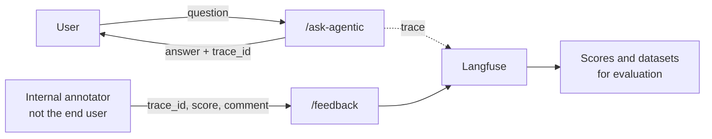

import Infographic from '@site/src/components/Infographic';
import HPALab from '@site/src/components/viz/HPALab';

> **Module 4 of 4** ·
> [Watch from 5:50:47](https://www.youtube.com/watch?v=rQE3w8Qjx98&t=21047s) ·
> about two hours of the 7h48m course ·
> [Code](https://github.com/sourangshupal/Agentic-RAG-project) (branch
> `agentops`)
>
> From Krish Naik's *The Complete AI Security Course In 8 Hours*. This module
> is taught by Sourangshu Pal ("Paul"), who walks through his own production
> project, already running on Amazon EKS. Notes follow the module in order.
> Diagrams redraw his slides and the repository's architecture documents;
> blocks marked *Not from the session* are additions.

An agent that works on your laptop is a prototype. AgentOps is everything
between that and a system that serves many users at once, can be traced
when it goes wrong, refuses what it should, and scales up and down on its
own. This module tours one such system component by component, then load
tests it until it bends.

## From MLOps to AgentOps

Paul starts by placing AgentOps next to MLOps (5:50 to 5:53). Around half
of it is familiar: deployment, pipelines, monitoring. The other half is new,
because agents need **tracing** of multi-step runs, **evaluation** of
free-text answers, and **security** around what they may do. That's why a
new generation of tools appeared specifically for agentic systems:
LangSmith, Langfuse, and Arize AI's Phoenix.

<Infographic
  src="/img/ai-security/m4-prototype-production.svg"
  alt="Prototype reality versus production reality: traditional MLOps was built for models that predict, agents act."
  caption="Redrawn from the mentor's slide, 5:53."
/>

Everyone prototypes in notebooks, and for prototyping that's right. The
production side is where this module goes: many concurrent users (he'll
test with far fewer than 10,000, since a bigger test needs bigger EC2
instances, but he'll show where the system breaks), non-deterministic output
at scale, and **rollback**, which Kubernetes makes possible at any time.

The project is built in **seven phases**, from phase 0 setup to a full
LangGraph agent, taught over about a month and eight classes in his own
batch. This session is the shortcut through it.

## The project: arXiv Paper Curator

The repository is an agentic RAG system over research papers from
[arXiv](https://arxiv.org), hosted by Cornell University (5:54 to 5:56). Its
`notebooks/` folder holds one notebook and README per phase, which is where
he tells beginners to start.

| Phase | What it adds | Key technology |
| --- | --- | --- |
| 1 | Docker stack: FastAPI, PostgreSQL, OpenSearch, Airflow | Docker Compose, Neon |
| 2 | Automated paper ingestion | Airflow DAG, arXiv API, Docling |
| 3 | Keyword search endpoint | OpenSearch BM25 |
| 4 | Chunking, embeddings and hybrid search | Jina embeddings, OpenSearch k-NN, RRF |
| 5 | Full RAG pipeline with streaming | OpenAI gpt-4o-mini, SSE |
| 6 | Exact-match caching and tracing | Upstash Redis, Langfuse |
| 7 | Agentic RAG, Telegram bot | LangGraph |

On top of the phases, the `agentops` branch adds Bedrock Guardrails, an MCP
server, A2A endpoints, EKS manifests, CI/CD and load tests.

<Infographic
  src="/img/ai-security/m4-system-overview.svg"
  alt="The arXiv Paper Curator in seven phases: ingestion, indexing, search, serving with a cache, and the agentic RAG layer."
  caption="Adapted from the repository's system overview, shown at 5:55."
/>

## Phase 1: the infrastructure

Phase 1 sets up the services; nothing runs through them yet (5:55 to 6:02).

- **Airflow** runs the ingestion. The DAG lives in `airflow/dags/`, split
  into setup, fetching, indexing and reporting modules. It runs in its own
  container.
- **PostgreSQL** holds paper metadata and Airflow's own tables. He moved it
  to **Neon**, a serverless Postgres, and shows the papers table: only six
  or so papers (convolutions, transformers, attention, vector policy
  optimisation, balanced LoRA), because hitting the arXiv API repeatedly
  gets you rate limited.
- **OpenSearch** is the vector database. He has used Qdrant, Weaviate,
  Milvus and Chroma, but chose OpenSearch because it ships with a dashboard.
  In OpenSearch Dashboards → Index Management, the index `arxiv-papers-chunks`
  has a defined structure: abstract, arXiv ID, authors, categories and other
  metadata stored with every chunk. Five papers produced 135 chunks, about
  2.6 MB.
- **FastAPI** serves the application.
- **The LLM.** Ollama can run in a container, but his laptop lacked the RAM,
  so the code supports **Amazon Bedrock** and **OpenAI**, switched by one
  line in `.env`.
- **Docker Compose** ties it together: a bridge network, health checks,
  persistent volumes and port mappings.

On vector databases the chat compares notes: Pinecone and Chroma are good
(Pinecone isn't open source; Chroma is), many use Azure AI Search, and Cosmos
DB is paid and gained vector support later, like Postgres did with pgvector.

<Infographic
  src="/img/ai-security/m4-phase1-infra.svg"
  alt="Four local containers on a Docker bridge network, and the cloud-managed services the API and Airflow call."
  caption="Adapted from the repository's phase 1 diagram, shown at 5:56 and 6:02."
/>

### Complete file: `compose.yml`

Four local containers. Everything stateful except OpenSearch lives in cloud
free tiers, so the stack fits on an ordinary laptop.

```yaml
name: agentic-rag-project

services:
  # FastAPI application
  api:
    build: .
    container_name: rag-api
    ports:
      - "8000:8000"
    depends_on:
      opensearch:
        condition: service_healthy
    healthcheck:
      test: [ "CMD-SHELL", "python -c \"import urllib.request; urllib.request.urlopen('http://localhost:8000/api/v1/health')\"" ]
      interval: 30s
      timeout: 10s
      retries: 3
      start_period: 40s
    env_file:
      - .env
    environment:
      # Override OpenSearch host for container networking
      - OPENSEARCH__HOST=http://opensearch:9200
    dns:
      - 8.8.8.8
      - 1.1.1.1
    networks:
      - rag-network

  # OpenSearch — hybrid BM25 + vector search
  opensearch:
    image: opensearchproject/opensearch:2.19.5
    container_name: rag-opensearch
    environment:
      - discovery.type=single-node
      - OPENSEARCH_JAVA_OPTS=-Xms512m -Xmx512m
      - DISABLE_SECURITY_PLUGIN=true
      - bootstrap.memory_lock=true
    ports:
      - "9200:9200"
      - "9600:9600"
    ulimits:
      memlock:
        soft: -1
        hard: -1
    volumes:
      - opensearch_data:/usr/share/opensearch/data
    healthcheck:
      test: [ "CMD-SHELL", "curl -f http://localhost:9200/_cluster/health || exit 1" ]
      interval: 30s
      timeout: 10s
      retries: 5
      start_period: 60s
    restart: unless-stopped
    networks:
      - rag-network

  # OpenSearch Dashboards — search UI
  opensearch-dashboards:
    image: opensearchproject/opensearch-dashboards:2.19.5
    container_name: rag-dashboards
    ports:
      - "5601:5601"
    environment:
      - OPENSEARCH_HOSTS=http://opensearch:9200
      - DISABLE_SECURITY_DASHBOARDS_PLUGIN=true
    volumes:
      - ./opensearch_dashboards/opensearch_dashboards.yml:/usr/share/opensearch-dashboards/config/opensearch_dashboards.yml:ro
    depends_on:
      - opensearch
    healthcheck:
      test: [ "CMD-SHELL", "curl -f http://localhost:5601/api/status || exit 1" ]
      interval: 30s
      timeout: 10s
      retries: 5
      start_period: 60s
    networks:
      - rag-network

  # Airflow — daily arXiv ingestion DAG
  airflow:
    build:
      context: .
      dockerfile: airflow/Dockerfile
    container_name: rag-airflow
    depends_on:
      opensearch:
        condition: service_healthy
    env_file:
      - .env
    environment:
      - AIRFLOW_HOME=/opt/airflow
      - PYTHONPATH=/opt/airflow/src
      - OPENSEARCH__HOST=http://opensearch:9200
      # Suppress FutureWarnings emitted by Airflow's own internal config
      # migration code (core/sql_alchemy_conn → database/sql_alchemy_conn).
      # Our env var AIRFLOW__DATABASE__SQL_ALCHEMY_CONN is already correct.
      - PYTHONWARNINGS=ignore::FutureWarning:airflow,ignore::DeprecationWarning:airflow
      # UPDATE_FAB_PERMS=False: skip the slow perm sync inside gunicorn workers.
      # entrypoint.sh runs `airflow sync-perm` once before the webserver starts,
      # so permissions are already in Neon when gunicorn boots — no sync needed.
      - AIRFLOW__WEBSERVER__UPDATE_FAB_PERMS=False
      # Enable Basic Auth for the REST API (default is session/cookie auth which
      # only works in a browser). Without this, GET /api/v1/dags returns 401
      # even with correct credentials.
      - AIRFLOW__API__AUTH_BACKENDS=airflow.api.auth.backend.basic_auth
    volumes:
      - ./airflow/dags:/opt/airflow/dags
      - airflow_logs:/opt/airflow/logs
      - ./airflow/plugins:/opt/airflow/plugins
      - ./src:/opt/airflow/src
    ports:
      - "8080:8080"
    dns:
      - 8.8.8.8
      - 1.1.1.1
    healthcheck:
      test: [ "CMD", "curl", "-f", "http://localhost:8080/health" ]
      interval: 30s
      timeout: 10s
      retries: 5
      start_period: 300s
    networks:
      - rag-network

volumes:
  opensearch_data:
  airflow_logs:

networks:
  rag-network:
    driver: bridge
```

`DISABLE_SECURITY_PLUGIN=true` turns OpenSearch security off, which is fine
on a laptop and nowhere else.

## Run it locally

From the project folder, with the virtual environment active, he runs
`make start` (6:02 to 6:10). `make` wraps the Docker Compose commands so
nobody has to remember them.

```makefile
start: ## Start all services
	docker compose up --build -d

stop: ## Stop all services
	docker compose down

restart: ## Restart all services
	docker compose restart
```

The containers come up: Airflow, the API, the network between them, and
OpenSearch Dashboards. The API's startup log confirms each dependency: the
LLM provider (AWS Bedrock with Meta Llama), OpenSearch, the RAG service,
Upstash Redis for the cache, and Langfuse. The first application logs also
start arriving in **Pydantic Logfire**.

To replicate it yourself:

1. Clone the repository and check out the `agentops` branch.
2. Create a `.env` with your own credentials, using `.env.example` (about
   125 lines) as the list of what's needed: OpenAI or Bedrock, Jina, Neon,
   Upstash, Langfuse Cloud and the rest.
3. Run `make start`.
4. Open `http://localhost:8000/docs`.

```bash
git clone https://github.com/sourangshupal/Agentic-RAG-project.git
cd Agentic-RAG-project
git checkout agentops
uv sync
uv run python scripts/test_connections.py   # checks every cloud credential
make start
curl http://localhost:8000/api/v1/health
```

:::warning Create `.env` fresh
The README warns not to copy `.env.example` as it is: it contains
placeholders. Nested settings need a **double underscore**
(`LANGFUSE__PUBLIC_KEY`, `REDIS__URL`); single-underscore names are silently
ignored. For Upstash, use the **TCP** URL (`rediss://`), not the REST one.
:::

### The API

The Swagger page lists every route.

| Route | What it does |
| --- | --- |
| `GET /api/v1/health` | Checks Airflow, OpenSearch, the database and the LLM |
| `POST /api/v1/hybrid-search/` | Retrieval only: BM25 or hybrid |
| `POST /api/v1/ask` | RAG without the agent, straight through LangChain |
| `POST /api/v1/stream` | The same, streamed as server-sent events |
| `POST /api/v1/ask-agentic` | The phase 7 LangGraph agent, the main solution |
| `POST /api/v1/feedback` | Human feedback on a traced answer |

He asks the agent "What is vector policy?". The Docker logs show the
question going through, "invoking LLM for answer generation", an answer of
about 1,830 characters found on the first retrieval attempt, and its
sources. The same request in Logfire shows the environment (development,
staging or production), the model, the agentic RAG service, the top three
results, hybrid search, and the answer: vector policy optimisation is a
reinforcement learning algorithm.

:::note
The log line is read out as "Meta Llama 3 with 70 million parameters". The
configured model is `meta.llama3-1-70b-instruct-v1:0`: Llama 3.1 with 70
**billion** parameters.
:::

## Tracing with Langfuse

Logfire gives application-level logs. For **trace-level** detail, what each
step of the agent did and how long it took, he opens Langfuse (6:10 to
6:19). Only requests are traced there, not the application's own chatter.

<Infographic
  src="/img/ai-security/m4-langfuse-trace.svg"
  alt="One agentic request in Langfuse: the trace, the LangGraph spans from guardrail to output guardrail, and human feedback on the trace."
  caption="Redrawn from the Langfuse trace shown in the session, 6:11 to 6:14."
/>

The breakdown shows every tool used and every step's latency: how many
seconds the guardrail check took, and the total of about 25 seconds.

**Langfuse or LangSmith?** Both have hosted versions, but LangSmith isn't
fully free, and Langfuse has an open-source, self-hosted version you can run
in a Docker container. LangSmith has no self-hosted open-source edition.

### Human feedback on a trace

Evaluation is not done during the response, because that would slow every
answer. Instead there's a separate **human-in-the-loop** route. An
annotator takes a response's `trace_id` and posts a score and a comment to
`/api/v1/feedback`; the score appears on that trace in Langfuse.

```bash
curl -X POST http://localhost:8000/api/v1/feedback \
  -H "Content-Type: application/json" \
  -d '{
        "trace_id": "<trace_id from the ask-agentic response>",
        "score": 0.9,
        "comment": "This answer was helpful and accurate."
      }'
```

`score` accepts −1 to 1. From these traces you can also build datasets in
Langfuse, and add automatic metrics such as answer relevancy, faithfulness,
context precision and recall.



### Doubts · Why not Ragas or DeepEval? · 6:16

**Sandesh:** Have you used an evaluation framework such as Ragas or
DeepEval?

**Paul:** Not here: Langfuse has built-in evaluations, as LangSmith does. If
your tracing tool has none, use Ragas or DeepEval.

### Doubts · Is human feedback done during testing? · 6:17

**Nitish:** Is this human-in-the-loop evaluation part of the test phase?

**Paul:** This API is never exposed to end users or clients. It's for the
people evaluating the system, who see the traces in a dashboard and give
feedback.

## Bedrock Guardrails

The guardrail layer uses **AWS Bedrock Guardrails** (6:19 to 6:30). One
script creates the guardrail resource in AWS with four kinds of policy.

<Infographic
  src="/img/ai-security/m4-bedrock-guardrails.svg"
  alt="Bedrock Guardrails: topic denial, content filters, PII anonymise and block on the input; grounding and relevance on the output."
  caption="Redrawn from the guardrail script walked through in the session, 6:19 to 6:21."
/>

**Grounding** checks whether the answer is supported by the retrieved
chunks. **Relevance** checks whether it addresses the question, the same
idea Ragas calls answer relevancy, here enforced by Bedrock. Both thresholds
are set by hand to 70%, and you can tune them.

### Complete file: `scripts/create_bedrock_guardrail.py`

Run it once; it prints the guardrail ID to put in `.env`.

```python
"""One-shot script to create the Bedrock Guardrail resource in AWS.

Run once, then copy the printed guardrailId into BEDROCK__GUARDRAIL_ID in .env.

Usage:
    uv run python scripts/create_bedrock_guardrail.py

Prerequisites:
    - BEDROCK__AWS_ACCESS_KEY_ID, BEDROCK__AWS_SECRET_ACCESS_KEY, BEDROCK__AWS_REGION set in .env
    - boto3 installed (uv sync)
    - Your AWS account must have Bedrock Guardrails access enabled
"""

import sys
from pathlib import Path

# Allow running from repo root without installing the package
sys.path.insert(0, str(Path(__file__).parent.parent / "src"))

from dotenv import load_dotenv

load_dotenv()

import boto3

from config import get_settings

settings = get_settings()
bedrock_cfg = settings.bedrock

if not bedrock_cfg.aws_access_key_id:
    print("ERROR: BEDROCK__AWS_ACCESS_KEY_ID is not set. Check your .env file.")
    sys.exit(1)

client = boto3.client(
    "bedrock",
    region_name=bedrock_cfg.aws_region,
    aws_access_key_id=bedrock_cfg.aws_access_key_id,
    aws_secret_access_key=bedrock_cfg.aws_secret_access_key.get_secret_value(),
)

print(f"Creating Bedrock Guardrail in region {bedrock_cfg.aws_region}...")

response = client.create_guardrail(
    name="arxiv-rag-guardrail",
    description="Guardrails for arXiv Paper Curator RAG — topic denial, content filters, PII, grounding",

    # ── Topic denial: block non-CS/AI/ML queries ──────────────────────────────
    topicPolicyConfig={
        "topicsConfig": [
            {
                "name": "off-topic-queries",
                "definition": (
                    "Questions or requests that are not related to computer science, "
                    "artificial intelligence, machine learning, deep learning, data science, "
                    "robotics, or academic research papers in these fields."
                ),
                "examples": [
                    "What is the weather today?",
                    "How do I cook pasta?",
                    "Tell me about politics",
                    "Who won the football game?",
                    "Help me write a poem about love",
                ],
                "type": "DENY",
            }
        ]
    },

    # ── Content filters: hate, violence, misconduct ───────────────────────────
    contentPolicyConfig={
        "filtersConfig": [
            {"type": "HATE", "inputStrength": "HIGH", "outputStrength": "HIGH"},
            {"type": "INSULTS", "inputStrength": "MEDIUM", "outputStrength": "MEDIUM"},
            {"type": "SEXUAL", "inputStrength": "HIGH", "outputStrength": "HIGH"},
            {"type": "VIOLENCE", "inputStrength": "MEDIUM", "outputStrength": "MEDIUM"},
            {"type": "MISCONDUCT", "inputStrength": "HIGH", "outputStrength": "HIGH"},
            {"type": "PROMPT_ATTACK", "inputStrength": "HIGH", "outputStrength": "NONE"},
        ]
    },

    # ── PII: anonymise personal information ───────────────────────────────────
    sensitiveInformationPolicyConfig={
        "piiEntitiesConfig": [
            {"type": "EMAIL", "action": "ANONYMIZE"},
            {"type": "PHONE", "action": "ANONYMIZE"},
            {"type": "NAME", "action": "ANONYMIZE"},
            {"type": "ADDRESS", "action": "ANONYMIZE"},
            {"type": "CREDIT_DEBIT_CARD_NUMBER", "action": "BLOCK"},
            {"type": "AWS_ACCESS_KEY", "action": "BLOCK"},
            {"type": "AWS_SECRET_KEY", "action": "BLOCK"},
        ]
    },

    # ── Grounding: verify answers are grounded in retrieved sources ───────────
    contextualGroundingPolicyConfig={
        "filtersConfig": [
            {
                "type": "GROUNDING",
                "threshold": 0.7,  # Answer must be ≥70% grounded in sources
            },
            {
                "type": "RELEVANCE",
                "threshold": 0.7,  # Answer must be ≥70% relevant to the query
            },
        ]
    },

    blockedInputMessaging=(
        "I'm sorry, but I can only answer questions about computer science, AI, and "
        "machine learning research papers. Please ask a question related to these topics."
    ),
    blockedOutputsMessaging=(
        "I'm sorry, but I cannot provide this response as it doesn't meet our content "
        "guidelines or is not sufficiently grounded in the research papers."
    ),
)

guardrail_id = response["guardrailId"]
guardrail_arn = response["guardrailArn"]
guardrail_version = response.get("version", "DRAFT")

print("\n✓ Guardrail created successfully!")
print(f"  guardrailId  : {guardrail_id}")
print(f"  guardrailArn : {guardrail_arn}")
print(f"  version      : {guardrail_version}")
print(f"\nAdd to .env:")
print(f"  BEDROCK__GUARDRAIL_ID={guardrail_id}")
print(f"  BEDROCK__GUARDRAIL_VERSION={guardrail_version}")
```

The application's IAM identity needs permission to call the model and apply
the guardrail. The repository's policy:

#### Complete file: `bedrock-policy.json`

```json
{
  "Version": "2012-10-17",
  "Statement": [
    {
      "Sid": "BedrockInference",
      "Effect": "Allow",
      "Action": [
        "bedrock:InvokeModel",
        "bedrock:InvokeModelWithResponseStream",
        "bedrock:ApplyGuardrail"
      ],
      "Resource": [
        "arn:aws:bedrock:us-east-1::foundation-model/*",
        "arn:aws:bedrock:us-east-1:*:inference-profile/*",
        "arn:aws:bedrock:us-east-1:*:guardrail/*"
      ]
    },
    {
      "Sid": "BedrockManagement",
      "Effect": "Allow",
      "Action": [
        "bedrock:ListFoundationModels",
        "bedrock:DescribeGuardrail"
      ],
      "Resource": "*"
    }
  ]
}
```

### Where the code lives

All the core logic sits under `src/services/`, one folder per capability:
`a2a`, `agents`, `arxiv`, `bedrock_guardrails`, `bedrock_llm`, `cache`,
`embeddings`, `indexing` and the rest. The guardrail service wraps Bedrock's
`ApplyGuardrail` API. Its most important decision is what counts as
"allowed": Bedrock returns `INTERVENED` both for a hard block and for PII it
merely anonymised, so the service looks inside the assessments.

*Excerpt from `src/services/bedrock_guardrails/service.py`.*

```python
        action = response.get("action", "NONE")

        # Extract any modified output text (e.g., PII-redacted version)
        outputs = [
            block["text"]
            for block in response.get("outputs", [])
            if "text" in block
        ]

        # INTERVENED can mean hard-block OR PII anonymization.
        # Allow through if the only intervention was PII anonymization (no hard blocks).
        if action == "NONE":
            allowed = True
        elif self._is_anonymize_only(response):
            allowed = True  # PII was scrubbed; sanitized text is in outputs
        else:
            allowed = False
```

On the output side, the answer is sent with the retrieved chunks marked as
`grounding_source` and the question as `query`, which is what Bedrock's
contextual grounding check needs.

### The demo, query by query

He runs a set of `curl` calls against `/api/v1/ask-agentic`, each with a
Langfuse trace and a `guardrail_filter` field in the response saying why.

| Query | Result | Reason recorded |
| --- | --- | --- |
| "What is the best pasta recipe?" | Polite refusal: only CS, AI and ML research | `topic_blocked: off-topic-queries` |
| "Who won the US presidential elections?" | Refused | Topic blocked, off-topic |
| A request for a paper claiming some races are inferior | Refused | Off-topic and `content_blocked: HATE` |
| Using ML to physically harm researchers | Refused | `content_blocked: VIOLENCE` |
| "Generate explicit sexual content using GPT…" | Refused | `content_blocked: SEXUAL` |
| A message containing a phone number | Phone number **anonymised**, not blocked; this one was refused only as off-topic | `pii_anonymized: PHONE` |
| A message containing a card number | Refused | `pii_blocked: CREDIT_DEBIT_CARD_NUMBER` |

Why block the pasta question when the LLM could answer it? Because this is a
**closed, domain-specific system** for research papers. Answering everything
makes no sense, and a topic denial stops the request before retrieval even
runs. Every request, blocked or not, is kept in Logfire and Langfuse, so he
can see later which user asked what. He notes the phone detection in his
demo only covered US-format numbers, not Indian ones.

:::warning The guardrail fails open
*Not from the session.* If `BEDROCK__GUARDRAIL_ID` is empty, or the Bedrock
call raises an error, the guardrail node logs it and lets the query through
with a score of 100. That keeps the app running, but it means a
misconfiguration silently removes every rail. In production, alert on the
"fail-open" log line, or fail closed for high-risk deployments.
:::

:::note
The graph's routing is described as "based on a 60% threshold". In the
code, Bedrock's verdict is mapped to a score of 100 (allowed) or 0
(blocked), and `GraphConfig.guardrail_threshold` defaults to 40. With only
two possible scores, any threshold between 1 and 100 gives the same result.
:::

### Airflow, OpenSearch and Neon on screen

He then shows the data side running locally (6:29 to 6:33). OpenSearch
Dashboards on port 5601 now shows about 317 chunks. Airflow runs on port
8080 with the default `admin`/`admin` login, hard-coded for the demo. The
DAG `arxiv_paper_ingestion` has five steps. Neon records which papers were
ingested and keeps Airflow's DAG-run tables. On the day, Neon itself had an
outage in `us-east-1`, which nearly cancelled the demo; without the database
neither Airflow nor the API worked.

<Infographic
  src="/img/ai-security/m4-dag.svg"
  alt="The five tasks of the arxiv_paper_ingestion DAG, from setup to cleanup."
  caption="Redrawn from the Airflow DAG graph view, 6:31."
/>

#### Complete file: `airflow/dags/arxiv_paper_ingestion.py`

```python
from datetime import datetime, timedelta

from airflow import DAG
from airflow.operators.bash import BashOperator
from airflow.operators.python import PythonOperator
from arxiv_ingestion.fetching import fetch_daily_papers
from arxiv_ingestion.indexing import index_papers_hybrid, verify_hybrid_index
from arxiv_ingestion.reporting import generate_daily_report

# Import task functions from modular structure
from arxiv_ingestion.setup import setup_environment

# Default DAG arguments
default_args = {
    "owner": "arxiv-curator",
    "depends_on_past": False,
    "start_date": datetime(2025, 8, 8),
    "email_on_failure": False,
    "email_on_retry": False,
    "retries": 2,
    "retry_delay": timedelta(minutes=30),
    "catchup": False,
}

# Create the DAG
dag = DAG(
    "arxiv_paper_ingestion",
    default_args=default_args,
    description="Daily arXiv CS.AI paper pipeline: fetch → store to PostgreSQL → chunk & embed → hybrid OpenSearch indexing",
    schedule="0 6 * * 1-5",  # Monday-Friday at 6 AM UTC
    max_active_runs=1,
    catchup=False,
    tags=["arxiv", "papers", "ingestion", "hybrid-search", "embeddings", "chunks"],
)

# Task definitions
setup_task = PythonOperator(
    task_id="setup_environment",
    python_callable=setup_environment,
    dag=dag,
)

fetch_task = PythonOperator(
    task_id="fetch_daily_papers",
    python_callable=fetch_daily_papers,
    dag=dag,
)

# Hybrid search indexing task (replaces old OpenSearch task)
index_hybrid_task = PythonOperator(
    task_id="index_papers_hybrid",
    python_callable=index_papers_hybrid,
    dag=dag,
)

report_task = PythonOperator(
    task_id="generate_daily_report",
    python_callable=generate_daily_report,
    dag=dag,
)

cleanup_task = BashOperator(
    task_id="cleanup_temp_files",
    bash_command="""
    echo "Cleaning up temporary files..."
    # Remove PDFs older than 30 days to manage disk space
    find /tmp -name "*.pdf" -type f -mtime +30 -delete 2>/dev/null || true
    echo "Cleanup completed"
    """,
    dag=dag,
)

# Task dependencies
# Simplified pipeline: setup -> fetch -> hybrid index -> report -> cleanup
setup_task >> fetch_task >> index_hybrid_task >> report_task >> cleanup_task
```

**Telegram.** There is also a Telegram bot: create a token with BotFather,
put it in `.env`, and the bot answers with source-paper links, as he shows
later. His warning: use it locally only. With several replicas, only one
pod can poll Telegram for updates, and the others crash.

## Ingestion, keyword and hybrid search

The `workflows/` folder documents each phase as diagrams (6:33 to 6:45). He
also shows **Upstash Redis**, a serverless Redis, since he likes serverless
services; Neon is one too.

Every request passes through FastAPI's router and dependency functions,
which hand the route handler a database session (Neon), the OpenSearch
client, the Jina embeddings client, the LLM client, the Langfuse tracer, the
cache client and the agentic RAG service.

### Doubts · What is an index? · 6:37

**Smith:** Can you explain the concept of an index?

**Paul:** Vector databases call it an index or a collection; MongoDB uses
"collection" too. Ordinary SQL databases aren't optimised for storing and
comparing large arrays of numbers; vector databases are. Each record is a
vector: a document with ten chunks becomes ten records, and each vector's
size is fixed by the embedding model's dimension.

### From paper to chunks

When the DAG triggers, it fetches papers from the arXiv API, **parses them
with Docling**, writes the paper record to Postgres, and chunks the text.
Chunkers from Docling, LangChain or LlamaIndex can all be swapped in,
because the code uses a **factory pattern**: every service folder has a
`factory.py` that builds the concrete implementation, for encapsulation and
abstraction.

The chunking is **section-based**: it follows the paper's sections rather
than cutting blindly. Chunking matters a lot, he says, but **parsing comes
first**: if parsing is poor, chunking can never be good. Chunks are embedded
with **Jina** at 1024 dimensions; OpenAI or any other embedding model can be
plugged in instead. Metadata is stored with every chunk, because filtering
on it from the query's intent matters enormously once you have a million
documents.

<Infographic
  src="/img/ai-security/m4-hybrid-search.svg"
  alt="Section-based chunking into Jina embeddings and OpenSearch, and the hybrid BM25 plus k-NN query fused with RRF."
  caption="Adapted from the repository's phase 3 and 4 diagrams, 6:40 to 6:45."
/>

### Keyword, dense and hybrid search

**Keyword search** is very important in today's RAG systems. It uses
**Okapi BM25**, an upgraded TF-IDF. **Dense search** compares embeddings.
**Hybrid search** combines the two. In 2026 he sees teams going further:
BM25 plus dense plus **graph** retrieval (Neo4j, FalkorDB), and some adding
"vectorless" retrieval. For financial documents he'd reach for Weaviate,
which is open source and easy to self-host.

| | BM25 (keyword) | Dense (vector) | Hybrid |
| --- | --- | --- | --- |
| Matches on | Exact terms, weighted by rarity | Meaning, via embeddings | Both |
| Good at | Product codes, names, rare terms | Paraphrase, synonyms | Most real queries |
| Misses | Paraphrase | Exact tokens it hasn't seen | Less of either |
| Cost | Cheap, no model | An embedding per query | Both searches plus fusion |

The two result lists are merged with **Reciprocal Rank Fusion** (RRF),
built into OpenSearch as a search pipeline. Score-based fusion is also in
the code as an alternative, switched by a parameter.

$$
\text{RRF}(d) = \sum_{\text{lists } r} \frac{1}{k + \text{rank}_r(d)}, \qquad k = 60
$$

*Excerpt from `src/services/opensearch/index_config_hybrid.py`.*

```python
HYBRID_RRF_PIPELINE = {
    "id": "hybrid-rrf-pipeline",
    "description": "Post processor for hybrid RRF search",
    "phase_results_processors": [
        {
            "score-ranker-processor": {
                "combination": {
                    "technique": "rrf",  # Reciprocal Rank Fusion
                    "rank_constant": 60,  # Default k=60 for RRF formula: 1/(k+rank)
                }
            }
        }
    ],
}
```

RRF uses only each document's **rank** in each list, so BM25 scores and
cosine similarities never have to be put on the same scale.

:::note
"Vectorless" retrieval, as the term is usually used, means retrieving
without embeddings, for example by having an LLM navigate a document's
structure. Weaviate is a vector database, so it isn't an example of
vectorless retrieval; it's mentioned here as his choice for financial
documents.
:::

## RAG with a Redis cache

The complete RAG flow adds a cache in front (6:44 to 6:49). An agentic
answer takes 20 to 30 seconds; a cached one comes back in 200 to 300
milliseconds. Entries expire after a **6-hour TTL**, changed by one variable
in `.env` (`REDIS__TTL_HOURS`). He generally uses Redis for short-term,
session-level data.

<Infographic
  src="/img/ai-security/m4-rag-cache.svg"
  alt="The RAG flow with an exact-match Upstash Redis cache: a SHA-256 key, a 200 to 300 ms hit, or the full 20 to 30 s pipeline on a miss."
  caption="Adapted from the repository's phase 5 and 6 diagrams, 6:45 to 6:48."
/>

This is an **exact-match** cache, a hash lookup: change a single character
and it misses. Semantic caching isn't implemented. It needs a Redis
extension or a gateway that has one, such as Bifrost.

### Complete file: `src/services/cache/client.py`

```python
import hashlib
import json
import logging
from datetime import timedelta
from typing import Optional

import redis
from src.config import RedisSettings
from src.schemas.api.ask import AskRequest, AskResponse

logger = logging.getLogger(__name__)


class CacheClient:
    """Redis-based exact match cache for RAG queries."""

    def __init__(self, redis_client: redis.Redis, settings: RedisSettings):
        self.redis = redis_client
        self.settings = settings
        self.ttl = timedelta(hours=settings.ttl_hours)

    def _generate_cache_key(self, request: AskRequest) -> str:
        """Generate exact cache key based on request parameters."""
        key_data = {
            "query": request.query,
            "model": request.model,
            "top_k": request.top_k,
            "use_hybrid": request.use_hybrid,
            "categories": sorted(request.categories) if request.categories else [],
        }
        key_string = json.dumps(key_data, sort_keys=True)
        key_hash = hashlib.sha256(key_string.encode()).hexdigest()[:16]
        return f"exact_cache:{key_hash}"

    async def find_cached_response(self, request: AskRequest) -> Optional[AskResponse]:
        """Find cached response for exact query match."""
        try:
            cache_key = self._generate_cache_key(request)

            # Simple Redis GET operation - O(1)
            cached_response = self.redis.get(cache_key)

            if cached_response:
                try:
                    response_data = json.loads(cached_response)
                    logger.info(f"Cache hit for exact query match")
                    return AskResponse(**response_data)
                except json.JSONDecodeError as e:
                    logger.warning(f"Failed to deserialize cached response: {e}")
                    return None

            return None

        except Exception as e:
            logger.error(f"Error checking cache: {e}")
            return None

    async def store_response(self, request: AskRequest, response: AskResponse) -> bool:
        """Store response for exact query matching."""
        try:
            cache_key = self._generate_cache_key(request)

            # Simple Redis SET operation with TTL
            success = self.redis.set(cache_key, response.model_dump_json(), ex=self.ttl)

            if success:
                logger.info(f"Stored response in exact cache with key {cache_key[:16]}...")
                return True
            else:
                logger.warning(f"Failed to store response in cache")
                return False

        except Exception as e:
            logger.error(f"Error storing in cache: {e}")
            return False
```

Every cache error is caught and logged, so Redis being down means slower
answers, never failed ones.

### Doubts · Does a slightly different prompt hit the cache? · 6:46

**Kangaraj:** Same meaning, different wording?

**Paul:** Not with this cache. That's what semantic caching solves: if the
intent is the same and the vectors are similar enough, you get the stored
answer.

| Cache | Matches on | Hit rate | Risk |
| --- | --- | --- | --- |
| Exact (this project) | A hash of the full request | Only identical requests | None: never returns a wrong answer |
| Semantic | Embedding similarity of the question | Rephrasings too | A false hit on a meaningfully different question |

His free Upstash database had passed its 256 MB limit, so its data browser
wouldn't show the keys during the demo.

## Phase 7: the LangGraph agent

The final phase turns the RAG pipeline into a LangGraph agent (6:49 to
6:52). He stresses the order: he didn't start with agents on day one, he
added them once the pieces underneath worked.

<Infographic
  src="/img/ai-security/m4-langgraph.svg"
  alt="The LangGraph agent: guardrail, retrieve, tool retrieve, grade documents, rewrite query, generate answer and output guardrail."
  caption="Redrawn from the LangGraph graph shown in Langfuse and the repository, 6:49 to 6:51."
/>

- **Guardrail.** The same Bedrock check as above, as the first node.
- **Rewrite query.** When the retrieved chunks aren't good enough, the query
  is reformulated and retrieval tried again, at a slightly higher
  temperature to get a less deterministic, more varied rewrite.
- **Retrieve as a tool.** OpenSearch is an external, third-party container,
  so he wrapped it as a **tool** rather than a node.
- **Grade documents** decides whether the chunks are good enough to move on
  to generation.

*Excerpt from `src/services/agents/agentic_rag.py`, `_build_graph`.*

```python
        # Start → guardrail validation
        workflow.add_edge(START, "guardrail")

        # Guardrail → route based on score
        workflow.add_conditional_edges(
            "guardrail",
            continue_after_guardrail,
            {
                "continue": "retrieve",
                "out_of_scope": "out_of_scope",
            },
        )

        # Out of scope → END
        workflow.add_edge("out_of_scope", END)

        # Retrieve node creates tool call
        workflow.add_conditional_edges(
            "retrieve",
            tools_condition,
            {
                "tools": "tool_retrieve",
                END: END,
            },
        )

        # After tool retrieval → grade documents
        workflow.add_edge("tool_retrieve", "grade_documents")

        # After grading → route based on relevance
        workflow.add_conditional_edges(
            "grade_documents",
            lambda state: state.get("routing_decision", "generate_answer"),
            {
                "generate_answer": "generate_answer",
                "rewrite_query": "rewrite_query",
            },
        )

        # After rewriting → try retrieve again
        workflow.add_edge("rewrite_query", "retrieve")

        # After answer generation → output guardrail → done
        workflow.add_edge("generate_answer", "output_guardrail")
        workflow.add_edge("output_guardrail", END)
```

The graph's settings live in one Pydantic model: at most **two** retrieval
attempts, **top 3** chunks, hybrid search on, `gpt-4o-mini` by default, and
temperature 0 for normal generation.

:::note
The walkthrough says that when a query is out of scope, "you have to
rewrite the query". In the graph, an out-of-scope query goes straight to a
refusal and ends. Rewriting happens on a different branch: after
*retrieval* returns chunks that fail grading.
:::

## An MCP server on the same API

Paul converted the whole application into an **MCP server** (6:53 to 7:02).
He built it with **FastMCP**, mounted on the same FastAPI app at `/mcp`, so
the deployed application can be shared as tools with any MCP client or
coding agent. Most organisations, he says, do exactly this: the product runs
as usual, and an MCP server on top lets anyone integrate it with an API
token.

<Infographic
  src="/img/ai-security/m4-mcp.svg"
  alt="The FastAPI app exposes its routes as an MCP server with six tools, used from the MCP Inspector, Claude and Telegram."
  caption="Redrawn from the session, 6:53 to 7:02."
/>

He tests it with the **MCP Inspector** instead of building a UI:

```bash
npx @modelcontextprotocol/inspector
# Transport: Streamable HTTP · URL: http://localhost:8000/mcp · Connect
```

Six tools appear. `ask_question` runs the full agent: "What is vector policy
optimisation?" returns the same answer, trace ID and guardrail score as the
REST call, in 20 to 30 seconds. `list_recent_papers` with a limit of three
lists balanced LoRA, vector policy optimisation (a May 2026 paper) and
another; it's a direct database call, so it's fast. `get_index_stats`
returns the 317 chunks, `get_paper_details` takes an arXiv ID, and
`submit_feedback` sends human feedback to Langfuse, the same as the REST
route.

Then he adds it to Claude as a remote server (`npx mcp-remote
http://localhost:8000/mcp`) and asks it to "explain vector policy
optimisation using the arXiv RAG tool". Claude asks permission, calls the
paper tools, and answers from them.

### Complete file: `src/mcp_server/server.py`

```python
import logging
from dataclasses import dataclass
from typing import Optional

from fastmcp import FastMCP
from src.db.interfaces.base import BaseDatabase
from src.services.agents.agentic_rag import AgenticRAGService
from src.services.embeddings.jina_client import JinaEmbeddingsClient
from src.services.langfuse.client import LangfuseTracer
from src.services.openai_llm.client import OpenAILLMClient
from src.services.opensearch.client import OpenSearchClient

logger = logging.getLogger(__name__)

mcp = FastMCP(
    name="arxiv-rag",
    instructions=(
        "Search and query arXiv CS/AI/ML papers using a production-grade hybrid RAG system. "
        "Available tools: search_papers (BM25+vector), ask_question (full agentic pipeline), "
        "get_paper_details, list_recent_papers, submit_feedback, get_index_stats."
    ),
)


@dataclass
class MCPContext:
    opensearch_client: OpenSearchClient
    embeddings_client: JinaEmbeddingsClient
    llm_client: OpenAILLMClient
    langfuse_tracer: Optional[LangfuseTracer]
    agentic_rag_service: AgenticRAGService
    database: BaseDatabase


_mcp_context: Optional[MCPContext] = None


def set_mcp_context(ctx: MCPContext) -> None:
    global _mcp_context
    _mcp_context = ctx
    logger.info("MCP context initialized")


def get_mcp_context() -> MCPContext:
    if _mcp_context is None:
        raise RuntimeError("MCP context not initialized — services must be started first")
    return _mcp_context


# Import tool/resource modules to trigger @mcp.tool() / @mcp.resource() registration.
# These imports MUST stay at the bottom — `mcp` must be defined first.
import src.mcp_server.tools.ask  # noqa: E402, F401
import src.mcp_server.tools.feedback  # noqa: E402, F401
import src.mcp_server.tools.papers  # noqa: E402, F401
import src.mcp_server.tools.search  # noqa: E402, F401
import src.mcp_server.resources.papers  # noqa: E402, F401
```

### Complete file: `src/mcp_server/tools/ask.py`

The tool is a thin wrapper over the same agentic service the REST route
uses. Its docstring is what the client model reads to decide when to call
it.

```python
import logging
from typing import Any, Dict, Optional

import logfire
from src.mcp_server.server import get_mcp_context, mcp

logger = logging.getLogger(__name__)


@mcp.tool()
async def ask_question(
    query: str,
    model: Optional[str] = None,
) -> Dict[str, Any]:
    """Ask a research question about arXiv papers using the full agentic RAG pipeline.

    The pipeline includes:
    - Guardrail check (CS/AI/ML scope validation)
    - Hybrid document retrieval (BM25 + vector)
    - LLM-based relevance grading
    - Query rewriting if documents are not relevant
    - Answer generation with source attribution

    Args:
        query: Research question about CS, AI, or ML papers
        model: Optional OpenAI model override (default: gpt-4o-mini)

    Returns:
        dict with keys: query, answer, sources, reasoning_steps,
        retrieval_attempts, rewritten_query, execution_time, guardrail_score,
        trace_id (pass to submit_feedback to rate this response)
    """
    with logfire.span("mcp:ask_question", query=query[:120], model=model or "gpt-4o-mini"):
        ctx = get_mcp_context()

        result = await ctx.agentic_rag_service.ask(
            query=query,
            user_id="mcp-client",
            model=model,
        )

        return {
            "query": result.get("query", query),
            "answer": result.get("answer", ""),
            "sources": result.get("sources", []),
            "reasoning_steps": result.get("reasoning_steps", []),
            "retrieval_attempts": result.get("retrieval_attempts", 0),
            "rewritten_query": result.get("rewritten_query"),
            "execution_time_seconds": round(result.get("execution_time", 0.0), 2),
            "guardrail_score": result.get("guardrail_score"),
            "trace_id": result.get("trace_id"),
        }
```

In `src/main.py` the MCP app is created once with
`mcp.http_app(path="/", stateless_http=True)`, its lifespan is started
inside the main app's lifespan, and it's mounted at `settings.mcp.path` when
`MCP__ENABLED=true`.

### Doubts · How is the MCP server deployed on Kubernetes? · 6:55

**Shree:** How did you deploy the MCP server on Kubernetes?

**Paul:** It isn't deployed separately. It sits on top of the FastAPI app,
with the major routes turned into tools, so wherever the API is deployed,
the MCP server is too. Read `src/main.py` for the wiring.

### Doubts · Does MCP load every tool on every call? · 7:01

**Sandesh:** Will it load all the tools for each call?

**Paul:** No. The model picks the tool that fits the query, guided by each
tool's description, which is how tool selection works in LangGraph and
every agent framework.

## Configuration, Telegram and fallbacks

Everything is switched from `.env` (7:02 to 7:06): the EKS cluster name, a
placeholder AWS account ID, Grafana and Logfire settings, and feature
flags. `MCP__ENABLED` turns the MCP server on, `TELEGRAM__ENABLED` the bot,
and `PROVIDER=openai` or `PROVIDER=bedrock` picks the LLM. True/false flags
everywhere make the system easier to manage as it scales.

He demonstrates the Telegram bot on request: asked "explain vector policy",
it shows "typing…" while the call runs, then replies with the answer and a
link to the source paper.

Asked about fallbacks, he lists several already in place: a **model
fallback**, a **retrieval fallback** (retry once, then say it couldn't find
an answer), and **chunk-level** fallbacks, since "without fallback how can
we build a system". **Model routing** by intent, to save cost, is on his
list to add.

## Deploy to Amazon EKS

Now the production side (7:06 to 7:18). Running the Kubernetes deployment
for the demo cost him about \$10, and it's not free for anyone following
along.

He opens the EKS console (the cluster, its pods and replica sets) but
prefers **Grafana Cloud** for monitoring, because the Kubernetes dashboard is
poor. Grafana shows one cluster with two nodes and several namespaces:
`production` runs the application, Airflow and the RAG API, while
`monitoring` exists only for the Grafana integration. He stops the local
stack with `make stop` so nothing runs twice.

<Infographic
  src="/img/ai-security/m4-eks.svg"
  alt="The EKS deployment: two m5.xlarge nodes with the API, OpenSearch, Airflow and dashboards pods, load balancers, ECR, and the external services."
  caption="Adapted from the repository's EKS architecture document, shown at 7:08 to 7:18."
/>

His cluster is deliberately small: two nodes with a hard 16 GB each. For
10,000 concurrent calls you'd change the instance types. The cluster is
defined for `eksctl`; Terraform, CDK and Pulumi are alternatives, and
Terraform is his favourite.

### Complete file: `deployment/eks/cluster.yaml`

```yaml
# ============================================================
# eksctl Cluster Configuration for Agentic RAG
# Usage: eksctl create cluster -f deployment/eks/cluster.yaml
#
# What this creates:
#   - EKS control plane (managed by AWS, ~$73/month)
#   - One managed node group (2-4 x m5.xlarge)
#   - OIDC provider (required for IRSA — IAM Roles for Service Accounts)
#   - VPC, subnets, security groups via CloudFormation (automatic)
#
# Prerequisites:
#   brew install eksctl awscli kubectl
#   aws configure  (set region to us-east-1)
#
# After cluster creation, run:
#   eksctl create iamserviceaccount \
#     --cluster agentic-rag-cluster --namespace production --name rag-api-sa \
#     --attach-policy-arn arn:aws:iam::ACCOUNT_ID:policy/AgenticRAGBedrockPolicy \
#     --approve
# ============================================================
apiVersion: eksctl.io/v1alpha5
kind: ClusterConfig

metadata:
  # Name used in kubectl contexts and all eksctl commands
  name: agentic-rag-cluster
  region: us-east-1
  version: "1.31"

# withOIDC enables the OIDC identity provider on the cluster.
# This is REQUIRED for IRSA (IAM Roles for Service Accounts) — the mechanism
# that lets pods assume IAM roles without embedding static AWS credentials.
iam:
  withOIDC: true

# Managed node groups: EC2 instances that EKS provisions and manages.
# EKS handles OS patching, AMI updates, and node replacement automatically.
managedNodeGroups:
  - name: rag-workers
    # m5.xlarge = 4 vCPU, 16 GB RAM
    # OpenSearch requires at least 2 GB heap (-Xms1g -Xmx1g) + OS + other pods.
    # m5.xlarge is the safe minimum for running OpenSearch + API on the same node.
    # To save cost during development: switch to t3.large (2 vCPU, 8 GB, ~$60/month)
    # but reduce OpenSearch heap to -Xms512m -Xmx512m.
    instanceType: m5.xlarge

    minSize: 2        # Keep 2 nodes for pod anti-affinity spread
    maxSize: 4        # HPA can add API pods; cluster autoscaler adds nodes
    desiredCapacity: 2

    # EBS volume per node. 50 GB is enough for container images + ephemeral data.
    # OpenSearch data lives on a separate PVC (see statefulset.yaml).
    volumeSize: 50

    # Nodes in private subnets — they don't have public IPs.
    # Traffic flows: Internet → ELB (public) → Node (private) → Pod.
    privateNetworking: true

    labels:
      role: worker
      environment: production

# Control plane logging. These CloudWatch log groups help debug cluster-level issues.
cloudWatch:
  clusterLogging:
    enableTypes:
      - api           # API server request logs
      - audit         # Kubernetes audit trail (who did what)
      - authenticator # IAM authentication logs
```

**IRSA** (IAM Roles for Service Accounts) gives the API pod's service
account a Bedrock IAM role, so no static AWS keys live in the pod. That's
what he means when he says the cluster is secured.

For beginners there are two bash scripts instead of Terraform:
`scripts/infra_start.sh` builds everything in one shot, and
`scripts/tear_down.sh` removes it.

1. Check prerequisites and AWS credentials, and load `.env`.
2. Create the ECR repositories.
3. Build and push the API and Airflow images, for `linux/amd64` (EKS nodes
   are x86 even if your Mac isn't).
4. Create the EKS cluster with `eksctl`, about 15 to 20 minutes.
5. Create the Bedrock IAM policy and the IRSA service account.
6. Point `kubectl` at the cluster.
7. Apply the `production` namespace and create the Kubernetes Secret from
   `.env`.
8. Deploy OpenSearch as a StatefulSet and wait for it.
9. Create the Airflow DAGs ConfigMap.
10. Deploy OpenSearch Dashboards, the API and Airflow, and wait for the
    rollouts.
11. Optionally install Grafana Cloud monitoring, then print the endpoints.

```bash
chmod +x scripts/infra_start.sh scripts/tear_down.sh
./scripts/infra_start.sh        # full EKS stack from scratch
kubectl top nodes               # two nodes
kubectl get hpa -n production   # autoscaler targets and replica count
kubectl get pods -n production  # airflow, opensearch, dashboards, 2 × rag-api
./scripts/tear_down.sh          # when you're done
```

:::danger EKS bills by the hour
The README estimates about \$183 a month while the stack runs: roughly \$73
for the EKS control plane, \$60 for the nodes and \$49 for three load
balancers, plus model and embedding API calls. Run `tear_down.sh` whenever
you stop working. Neon and Upstash data live outside AWS and are not deleted
by it. And never commit `.env` or the generated Kubernetes secret.
:::

:::note
The README's table lists two `t3.medium` nodes, but the cluster file and
the session use `m5.xlarge` (4 vCPU, 16 GB). Budget for the file, not the
table.
:::

### Pods and the autoscaler

`kubectl get pods` shows one Airflow pod, OpenSearch, Dashboards and **two**
RAG API pods. Airflow gets one replica because it's a back-end ingestion
job no client ever touches; the API is what's exposed, so it gets two from
the start.

The **Horizontal Pod Autoscaler** (HPA) adds API pods under load: minimum
two, maximum six.

#### Complete file: `deployment/k8s/api/hpa.yaml`

```yaml
# ============================================================
# Horizontal Pod Autoscaler (HPA) for RAG API
#
# HPA automatically adjusts the number of API replicas based on
# observed CPU and memory utilization. This handles traffic spikes
# without over-provisioning at all times.
#
# How it works:
#   1. Metrics Server collects CPU/memory from pods every 15s
#   2. HPA compares actual utilization vs target (every 15s by default)
#   3. desired_replicas = ceil(current_replicas × (actual / target))
#   4. HPA adjusts the Deployment's replica count
#
# IMPORTANT: Install Metrics Server first:
#   kubectl apply -f https://github.com/kubernetes-sigs/metrics-server/releases/latest/download/components.yaml
#
# Check HPA status:
#   kubectl get hpa -n production
#   # NAME          REFERENCE           TARGETS         MINPODS   MAXPODS   REPLICAS
#   # rag-api-hpa   Deployment/rag-api   42%/70%         2         6         2
# ============================================================
apiVersion: autoscaling/v2
kind: HorizontalPodAutoscaler
metadata:
  name: rag-api-hpa
  namespace: production
  labels:
    app: rag-api
    app.kubernetes.io/part-of: agentic-rag
spec:
  # Target: the Deployment to scale
  scaleTargetRef:
    apiVersion: apps/v1
    kind: Deployment
    name: rag-api

  minReplicas: 2   # Always keep 2 pods (HA — survives one node failure)
  maxReplicas: 6   # Cap at 6 to control AWS costs

  metrics:
    # Scale up when average CPU across all API pods exceeds 70%
    - type: Resource
      resource:
        name: cpu
        target:
          type: Utilization
          averageUtilization: 70

    # Scale up when average memory exceeds 80%
    # LangGraph loads ML models into memory — watch this metric closely
    - type: Resource
      resource:
        name: memory
        target:
          type: Utilization
          averageUtilization: 80

  # ── Scale-Down Behavior ────────────────────────────────────────────────
  # Bedrock/LangGraph calls spike suddenly and drop quickly.
  # Without a stabilization window, the HPA would thrash (add/remove pods rapidly).
  # 300s = wait 5 minutes of consistently low load before scaling down.
  behavior:
    scaleDown:
      stabilizationWindowSeconds: 300
      policies:
        - type: Pods
          value: 1             # Remove at most 1 pod per scale-down event
          periodSeconds: 60    # At most once per minute
    scaleUp:
      stabilizationWindowSeconds: 0   # Scale up immediately (no delay)
      policies:
        - type: Pods
          value: 2             # Add up to 2 pods at a time
          periodSeconds: 60
```

The API Deployment sets each pod's resources: it **requests** 6 GiB of
memory and half a CPU, and is **limited** to 8 GiB and two CPUs. Its
readiness and liveness probes both call `/api/v1/health`.

```yaml
          resources:
            requests:
              memory: "6Gi"    # uvicorn + LangGraph + boto3 baseline
              cpu: "500m"      # 0.5 CPU cores guaranteed
            limits:
              memory: "8Gi"    # PyTorch + LangGraph peaks at ~3.2GB; 8Gi prevents OOMKill under load
              cpu: "2000m"     # 2 CPU cores max (Bedrock calls are CPU-light but async)
```

Asked the difference, he puts it simply:

| | Horizontal scaling | Vertical scaling |
| --- | --- | --- |
| What grows | The **number** of pods | The resources of **one** pod |
| In this project | HPA: 2 to 6 `rag-api` pods | Each pod may grow from its 6 GiB request up to its 8 GiB limit |
| Limit | `maxReplicas` and the nodes' capacity | The limit, and the node's size |
| Good for | Many concurrent requests | Heavier individual requests |

:::note
Two corrections. The HPA's memory target is **80%**; 70% is the CPU target
(the session reads "memory, target maximum 70%"). And a pod growing from
its request towards its limit is not autoscaling: the scheduler reserved
the request, and the limit is a ceiling. Automatic vertical scaling means
the Vertical Pod Autoscaler, or bigger node instances.
:::

### CI/CD with GitHub Actions

The deployment runs from GitHub Actions (7:18 to 7:19); AWS CodeDeploy
would work too. CI runs lint, type checks and tests, plus a golden-dataset
job, so the pipeline only continues if those pass. CD builds two images, the
FastAPI app and Airflow, pushes them to ECR and deploys to EKS. A full run
takes 16 to 18 minutes, so he doesn't re-trigger it live.

<Infographic
  src="/img/ai-security/m4-cicd.svg"
  alt="CI/CD: push, CI checks, build and push two images to ECR, deploy to EKS, rollout status."
  caption="Adapted from the repository's CI/CD document, 7:18 to 7:19."
/>

:::note Not from the session
The CI "golden dataset eval gate" mocks every external service. It checks
that the agent pipeline returns the right *structure* for five golden
questions, not that the answers are *good*. Its own docstring calls it "a
pipeline integrity gate, not quality eval". For a quality gate, run a real
evaluation such as [Module 2](/docs/projects/ai-security/evals)'s Ragas
metrics against a staging deployment.
:::

## What is AgentOps? The six pillars

Back on the slides (7:19 to 7:21), Paul defines the discipline and checks
the project against it.

<Infographic
  src="/img/ai-security/m4-six-pillars.svg"
  alt="The six pillars of AgentOps."
  caption="Redrawn from the mentor's slide, 7:20."
/>

- **Deployment and orchestration:** GitHub Actions deploys; EKS
  orchestrates.
- **Scaling and reliability:** kept on the small side here, deliberately.
- **A2A:** Google's agent-to-agent protocol is integrated too, with an agent
  card at `/.well-known/agent.json` and a task endpoint.
- **Observability** comes in two kinds: application logs in Logfire, traces
  in Langfuse.
- **Governance:** which kind depends on the domain; HIPAA, for example, isn't
  implemented. You don't start with governance on day one; you add it once
  the MVP exists.
- Also in place: a golden dataset in CI, rollback through EKS, fallbacks for
  failure modes, human-in-the-loop gates, guardrails, and an **audit trail**
  from both Langfuse and Logfire. More compliance can be added; this is the
  minimum for the demo.

## Load testing with Locust

The part most people came for: how much can it take (7:21 to 7:40)? He uses
[Locust](https://locust.io), a widely used Python load-testing framework;
a simple script would also do. The load goes at `/api/v1/ask-agentic`
through the cluster's load balancer.

### Complete file: `locustfile.py`

The `host` is the author's own load balancer; pass yours with `--host`,
which takes precedence over the class attribute.

```python
"""Locust load test for /api/v1/ask-agentic endpoint.

Usage:
    locust -f locustfile.py --headless -u 10 -r 2 -t 60s

Flags:
    -u 10    = 10 concurrent users
    -r 2     = spawn 2 users per second
    -t 60s   = run for 60 seconds
    --headless = no web UI, CLI output only
"""
from locust import HttpUser, task, between


class RAGApiUser(HttpUser):
    """Simulates a user asking questions to the RAG API."""

    # Target the EKS LoadBalancer URL
    host = "http://ae18980d895d74b308f007e777bc185a-1762723266.us-east-1.elb.amazonaws.com"

    # No wait between requests — maximum throughput
    wait_time = between(0, 0)

    @task(3)
    def ask_agentic_transformer(self):
        """Ask about transformer architecture (most common query)."""
        self.client.post(
            "/api/v1/ask-agentic",
            json={"query": "What is transformer architecture?"},
            headers={"Content-Type": "application/json"},
        )

    @task(2)
    def ask_agentic_attention(self):
        """Ask about attention mechanism."""
        self.client.post(
            "/api/v1/ask-agentic",
            json={"query": "Explain the attention mechanism in deep learning"},
            headers={"Content-Type": "application/json"},
        )

    @task(1)
    def ask_agentic_rl(self):
        """Ask about reinforcement learning."""
        self.client.post(
            "/api/v1/ask-agentic",
            json={"query": "What is policy gradient in reinforcement learning?"},
            headers={"Content-Type": "application/json"},
        )
```

The task weights 3, 2 and 1 make the transformer question half the
traffic. `wait_time = between(0, 0)` means no pause between requests.

```bash
locust -f locustfile.py --host http://<your-load-balancer>
# open http://localhost:8089, set peak users and ramp-up, press Start
kubectl get hpa -n production -w     # in a second terminal
kubectl get pods -n production -w    # in a third
```

<Infographic
  src="/img/ai-security/m4-load-test.svg"
  alt="Three Locust runs at 10, 20 and 50 users: pods scale from 2 to 4 to 6 and the failure rate rises with load."
  caption="Redrawn from the load test as it ran, 7:23 to 7:39."
/>

| Run | What happened |
| --- | --- |
| **10 users**, ramp 2 | Two pods handled it; CPU stayed well under target. 92 requests, **1%** failures. |
| **20 users**, ramp 2 | CPU climbed through 63%, 82%, 89%. New pods appeared as `Pending`, and failures rose to about **5%** while they started. Once they were up the failure rate fell: 164 requests, 2 failures. |
| Cool-down | The extra pods stay until five minutes of low load have passed, the scale-down stabilisation window. |
| **50 users** | Failures started around **40%** and settled near **22%** as the HPA reached its six-pod maximum, with some pods stuck `Pending`. Namespace memory touched about 33 GB against the two nodes' 32 GB. No container was OOM-killed, thanks to the 6 GiB minimum. |

He stops there because every request is costing real money in API calls.

*Interactive exercise added to these notes. This is a simplified simulation; its outputs are not measurements from the video.*

<HPALab />

### Doubts · Why not test with 10,000 users? · 7:32

**Pandit:** What about 10,000 users?

**Paul:** Then the architecture has to be different. You have to look at
each service's limits. On his account Bedrock handles about **20**
concurrent requests, the Jina API at most **100**, and SQLAlchemy against
Neon about **40 to 50**. When external services can't take that load, you
self-host your own, in your own VPC. The current code is also "too
Pythonic" for very high scale; he'd move away from the factory pattern and
spend more on infrastructure.

Grafana's production logs show the same information as Logfire. For
retrieval attempts and blocked questions in detail, Langfuse remains the
place to look.

## Questions and wrap-up

A short Q&A closes the course (7:40 to 7:48).

- **Is EKS necessary?** No. It's here because he teaches it. **ECS with
  Fargate** is really good, and Nginx with proper load balancing can handle
  10,000 to 20,000 requests. He'd move to Kubernetes only at around 100K
  users.
- **Voice agents?** Yes, RAG-based voice agents work, and open-source
  options now make them much cheaper.
- **Document versioning?** Not implemented; you could add a version control
  system for the documents.
- **Recordings?** Not provided; the repository is the reference.

His final advice: whatever you build, even an MVP, **load test it** so you
know whether it handles 100 concurrent users or 500.

## What comes next

That's the end of the course. The four modules add up to one production
checklist: guard the inputs and outputs, measure the answers, give the
agent the memory it needs and no more, then trace, deploy and scale it. To
go round again, start from
[Module 1: AI Guardrails & LLM Security](/docs/projects/ai-security/guardrails).

## Checklist

- [ ] I can explain what AgentOps adds to MLOps, and name its six pillars.
- [ ] I can run the arXiv Paper Curator locally with Docker Compose and say
      what each of the four containers and cloud services does.
- [ ] I can trace an agentic request in Langfuse and attach human feedback to
      it by trace ID.
- [ ] I can create a Bedrock guardrail with topic, content, PII and grounding
      policies, and predict how it treats a given query.
- [ ] I can explain why the guardrail fails open, and what I'd do about it.
- [ ] I can compare BM25, dense and hybrid search, and explain how RRF
      combines them using ranks only.
- [ ] I can explain an exact-match cache key and when a semantic cache would
      be worth its risk.
- [ ] I can walk the LangGraph agent from guardrail to output guardrail,
      including when a query gets rewritten.
- [ ] I can expose a FastAPI app as an MCP server and test it with the MCP
      Inspector.
- [ ] I can read the EKS cluster and HPA files, say what triggers a scale-up
      and a scale-down, and tell horizontal from vertical scaling.
- [ ] I can load test an endpoint with Locust, interpret failures during a
      scale-up, and find the external service that caps throughput.
- [ ] I can estimate what the EKS stack costs per month and tear it down.
