import Infographic from '@site/src/components/Infographic';

> **Session 1 of 2** ·
> [Session and transcript](https://www.youtube.com/watch?v=bjkjaqUZl4E) · 8
> hours 30 minutes ·
> [Shared materials](https://docs.google.com/document/d/1wMPQL2NJTzT70GLBVYr3hKrObCmYrwhwvTgoEb0PLWk/edit?tab=t.0)

Build a technical assistant that retrieves useful enterprise documentation from
a noisy collection, remembers a conversation, and exposes its decisions through
an API, a chat interface and traces.

## Problem statement

An organisation has useful Kubernetes, networking and infrastructure knowledge
spread across PDF, HTML, text, Word and PowerPoint files. Most of the available
material is irrelevant to a particular question. A general language model cannot
reliably know which internal document to use, which version applies, or what the
user meant by a follow-up such as “How do I scale it?”

The project turns that collection into an assistant. A technical question should
retrieve evidence, reduce irrelevant context, and produce an answer grounded in
that evidence. A greeting or a question about the conversation should use the
conversation history. The application should make its route and retrieved
context visible so that a developer can investigate mistakes.

The running examples concern Kubernetes pods, autoscaling, jobs and parallel
work queues. The security demonstrations later use a separate AcmeCorp HR
assistant before returning to the technical assistant. Keeping those examples
distinct matters: the HR demo uses FAISS and a simpler chain; it is not the
Qdrant project changing its domain halfway through.

**Deliverable at this stage:** the ingestion pipeline and the LangGraph
application with retrieval, reranking, memory, FastAPI, Streamlit and
observability. Guardrails and gateways are explored through demonstrations near
the end. Their integration into the main application continues in
[Session 2](/docs/projects/enterprise-rag/session-2).

## Requirements and libraries

### Functional requirements

| Requirement                            | Implementation                            | What to inspect                                 |
| -------------------------------------- | ----------------------------------------- | ----------------------------------------------- |
| Read heterogeneous files               | Extension-based parser dispatch           | Empty text, page order, unsupported files       |
| Index useful and distracting documents | Separate `true` and `noisy` source labels | Point counts and payloads in Qdrant             |
| Find relevant evidence                 | Query embedding and cosine search         | The 15 retrieved candidates                     |
| Improve context selection              | FlashRank reranking                       | The five retained chunks                        |
| Choose whether retrieval is needed     | Planner node                              | Search query or `CONVERSATIONAL`                |
| Answer follow-up questions             | LangGraph checkpoint by thread            | History passed into planner and responder       |
| Provide a usable application           | FastAPI and Streamlit                     | Response, status, route and sources             |
| Diagnose slow or wrong answers         | Logfire and LangSmith                     | Timings, node inputs and failures               |
| Explore safety and resilience          | NeMo and Portkey demos                    | Refusals, bypasses, retries and cache behaviour |

### Environment and version boundaries

Use **Python 3.11** for the teaching environment. The session resolves an
installation problem by recreating the environment with that version. The
teaching repository does not pin a complete dependency set, so its
`requirements.txt` does not establish exact installed versions.

| Layer              | Teaching implementation                                                                                          |
| ------------------ | ---------------------------------------------------------------------------------------------------------------- |
| Environment        | `uv`, Python 3.11, `python-dotenv`, Pydantic                                                                     |
| Parsing            | `pypdf`, `pdfplumber`, Beautiful Soup, Unstructured; Office dependencies include `python-docx` and `python-pptx` |
| Embeddings         | `langchain-google-genai`; `sentence-transformers` fallback                                                       |
| Vector database    | `qdrant-client`, Qdrant Cloud or a separately configured local service                                           |
| Reranking          | `flashrank`, local ONNX model                                                                                    |
| Workflow           | `langgraph`, LangChain, `langchain-groq`                                                                         |
| API and interface  | `fastapi`, `uvicorn`, `streamlit`, `requests`                                                                    |
| Observability      | `logfire`, LangSmith                                                                                             |
| Later integrations | `nemoguardrails`, `portkey-ai`, `langchain-openai`                                                               |

The reviewed teaching revision is
[`52b771c`](https://github.com/d-hackmt/8hr-MARATHON/tree/52b771cbdea2e2215c823cc1ae522183b77a85b7).
The complete Session 1 files below are from stage 3, commit `1fae886310a4e122f9349b3ee32bf1e90a089b03`. Its `main` already contains later integrations. Use the stage branches to
reproduce the progression:

| Branch                  | Purpose                                  |
| ----------------------- | ---------------------------------------- |
| `teaching/00-scaffold`  | Initial project skeleton                 |
| `stage-1-ingestion`     | Parsers, chunks, embeddings and indexing |
| `stage-2-basic-rag`     | Basic retrieval and response             |
| `stage-3-rerank-memory` | Session 1 application checkpoint         |
| `stage-4-guardrails`    | Session 2 input/dialogue gate            |
| `stage-5-llm-gateway`   | Session 2 gateway integration            |
| `stage-6-evals`         | Session 2 evaluation pipeline            |

**`NOT from session`** Record the commit and resolved dependencies after a
successful installation. Branch names can move, and an unpinned dependency file
can resolve differently on another day. The deployment fork has a different
dependency set; do not install its versions over this environment and expect
identical behaviour.

## Repository structure

```text
8hr-MARATHON/
├── DATA/
│   ├── true_data/                 # Kubernetes and relevant technical documents
│   └── noisy_data/                # Distracting documents
├── app/
│   ├── config.py                  # Environment and provider settings
│   ├── ingestion/
│   │   ├── loaders/               # pdf.py, html.py, text.py, office.py
│   │   ├── chunking/splitter.py
│   │   └── processor.py           # Directory → points in Qdrant
│   ├── services/retrieval/
│   │   ├── embedding.py
│   │   ├── qdrant_service.py
│   │   └── ranking_service.py
│   ├── agents/
│   │   ├── state.py
│   │   ├── nodes/                 # planner.py, retriever.py, responder.py
│   │   └── graph.py
│   ├── guardrails/                # Integrated in Session 2
│   ├── gateway/                   # Integrated in Session 2
│   └── main.py
├── ui/app.py
├── notebooks/                     # Guardrail, gateway and evaluation demos
├── evals/                         # Used in Session 2
├── processed_data/                # Created during ingestion
├── .env.example
└── requirements.txt
```

The walkthrough follows the teaching sequence: architecture, ingestion
fundamentals, environment, parsers, embeddings, chunking, ingestion execution,
retrieval, agent state and nodes, API, tracing, interface, guardrails, then
gateways.

How to read it:

- **Figures** come from the session's
  [shared whiteboard](https://www.tldraw.com/f/faJganF5s9zVV-_ggRgEy?d=v-2627.-1914.9245.4810.page),
  or redraw it, and sit next to the explanation they belong to. Use
  **Expand** on an infographic or Mermaid diagram to zoom into it.
- **Complete file** blocks are whole files, in the order they enter the
  project. Save each one at the path in its heading, relative to the
  project root. Lines beginning `# Reader note:` are comments added for these
  notes; they don't change what the code does.
- **Doubts** sections paraphrase the questions asked during the session.
- **`NOT from session`** marks guidance added in these notes rather than said
  in the session.

## 1. From an LLM call to an enterprise application

### Why security enters the architecture first

An assistant processes instructions and untrusted content through the same language interface. A retrieved document can contain useful facts and a malicious instruction in adjacent paragraphs. Adding tools increases the consequences: an incorrect answer misinforms a user; an incorrectly authorised tool call can change an enterprise system.

The opening security discussion therefore separates several boundaries:

| Boundary | Practical failure | Control discussed in the architecture |
| --- | --- | --- |
| User → application | A user requests restricted information or tries to override instructions | Authentication, authorisation, input controls |
| Documents → prompt | Retrieved text tells the assistant to ignore its policy | Treat retrieved content as evidence; inspect prompt injection |
| Agent → tools | A model chooses an operation beyond the user's permissions | Tool permissions, constrained execution, approval for consequential operations |
| Application → model providers | Credentials or sensitive context leave the intended boundary | Gateway policy, credential handling, data controls |
| Response → user | Sensitive or unsupported content reaches the user | Output checks, evaluation and audit |

The reason for placing safety, observability and evaluation around the agent is that no single prompt can verify all these boundaries. A gateway manages model traffic; it cannot determine whether a user is entitled to read a particular document. A vector database finds similar content; similarity does not establish permission to use it.

The opening slide, *Why security is the biggest concern in Gen AI applications* (0:07 to 0:19), brings together the typical architecture, the seven security risks, their impact and the controls that address them:

<Infographic
  src="/img/enterprise-rag/s1-security.svg"
  alt="A Gen AI request passes through the application, model, data and tools, with seven security risks, their impacts and the controls needed at each boundary."
  caption="Redrawn from the session's opening security slide, 0:07 to 0:19."
/>

**`NOT from session`** In this repository, the later shared API key protects entry to the API but does not implement per-user document permissions. Keep the training corpus free of documents with different access entitlements until retrieval applies an authenticated access filter.

### The broader agentic architecture

The broader enterprise architecture discussed at the beginning contains several
responsibilities. The user-facing application sits above orchestration, tools,
memory, safety controls, model access, evaluation, observability and governance.
The project implements a useful subset of that architecture. Naming the other
layers helps identify where a future requirement belongs.

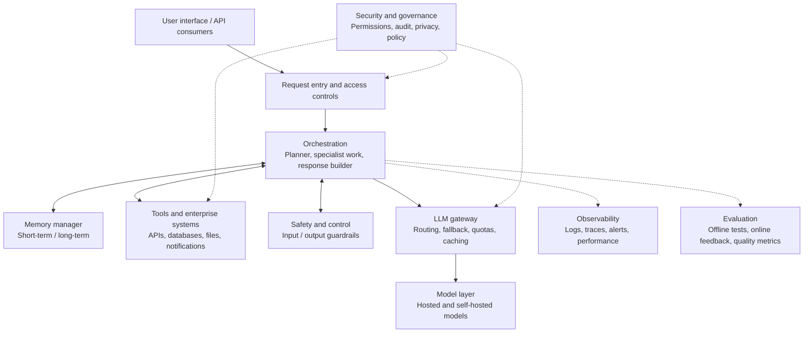

The slide behind this summary, *Architecture of agentic AI application* (0:22 to 0:32), has twelve layers, shown together in the board below:

<Infographic
  src="/img/enterprise-rag/s1-agentic-architecture.svg"
  alt="Twelve layers connect users, orchestration, tools, memory, guardrails, model access, monitoring, governance, infrastructure, delivery and human review."
  caption="Redrawn from the session's agentic architecture slide, 0:22 to 0:32."
/>

### Start with the smallest request

A plain LLM call has a short path: question, model, response.

<Infographic
  src="/img/enterprise-rag/s1-simple-llm-supplied.png"
  alt="A user question goes directly to a language model, which returns a response without retrieving external documents."
  caption="Supplied session whiteboard, 1:34."
/>

A RAG application
adds a knowledge path. The model receives both the question and relevant
evidence retrieved from a collection. The evidence is supplied at inference
time; ingesting a PDF into Qdrant does not train the language model on that PDF.

<Infographic
  src="/img/enterprise-rag/s1-simple-rag-supplied.png"
  alt="A user question retrieves relevant document context, and the language model uses that context to generate its response."
  caption="Supplied session whiteboard, 1:35 to 1:36."
/>

**`NOT from session`** A diagram with these boxes is an architectural design,
not evidence of enterprise readiness. Concurrency, access isolation, data
protection, recovery and answer quality need to be tested on the intended
workload. The live exercise does not demonstrate a million-user load test.

### What "production grade" means here

Before building anything, Divesh frames the target on the whiteboard (0:46, revisited at 1:10): an assistant for one organisation rather than the public, expected to serve heavy traffic from a collection where most documents are noise.

<Infographic
  src="/img/enterprise-rag/s1-production-goals.svg"
  alt="An organisation assistant must retrieve useful evidence among noisy documents while meeting the four goals of robustness, reliability, security and scalability."
  caption="Redrawn from the session's whiteboard, 0:46 to 0:47 and 1:10 to 1:11."
/>

### The project request path

The specific architecture shown for the technical assistant is smaller. The
planner decides whether to retrieve. Retrieval and reranking prepare context;
the responder produces the answer. Checkpointed state gives later turns access
to the conversation.

<Infographic
  src="/img/enterprise-rag/s1-request-path.svg"
  alt="A Streamlit question reaches FastAPI and the guardrail, then the planner routes it to a responder or Qdrant retrieval and FlashRank reranking, with shared conversation memory."
  caption="Redrawn from the session's whiteboard, 1:04 to 1:07, revisited 5:00 to 5:02."
/>

A request such as “What is a Kubernetes pod?” needs external context. “What was
my previous question?” usually does not. A follow-up such as “How do I autoscale
it?” needs the earlier turn to reconstruct a useful search query. This is why
the planner sees conversation history before deciding what to search.

The full target architecture the two sessions build towards (1:07, shown again at 5:02 and 5:15). It includes pieces Session 2 adds, such as the evaluation app and the gateway:

<Infographic
  src="/img/enterprise-rag/s1-full-architecture.svg"
  alt="Enterprise Agentic RAG: full target architecture"
  caption="Redrawn from the session's whiteboard, 1:07 to 1:08, 5:02 to 5:03 and 5:15 to 5:17."
/>

### From prototype to cloud

The board also lays out the route this project takes (1:09 to 1:11): prototype on a laptop with Groq and open-source pieces, then local development, then a cloud deployment on AWS with CI/CD, which is Session 2's deployment fork.

<Infographic
  src="/img/enterprise-rag/s1-prototype-to-cloud.svg"
  alt="From prototype to cloud"
  caption="Redrawn from the session's whiteboard, 1:09 to 1:11 (additions at 5:03)."
/>

**Summary**

- RAG supplies evidence to a model at request time.
- The planner controls the retrieval branch; the responder handles both
  branches.
- Memory supports follow-ups, while the vector store holds document knowledge.
- The full enterprise diagram contains more responsibilities than this exercise
  implements.

## 2. Prepare useful and distracting data

The useful corpus includes files such as `pods_autoscale.html`,
`parallel_work_queue.txt`, `monitor_job.docx`, `cronjobs.docx`,
`job_management.html` and `architecture.pptx`. The noisy corpus contains
unrelated technical books and papers. The purpose is to make retrieval
discriminate between similar-looking technical text and evidence that actually
answers the question.

The discussion uses a small useful portion and a much larger noisy portion as an
illustration. Those proportions are not an independently measured retrieval
benchmark. Noise can be completely unrelated, or it can be deceptively close: a
document about operating-system scheduling may share vocabulary with Kubernetes
scheduling while answering a different question.

### Documents, chunks and vectors

A document is too coarse when only one paragraph answers the question. A chunk
is a retrievable unit. An embedding is the model's numeric representation of
that unit. The database stores the vector for search and the text as payload so
it can return readable evidence.

The whiteboard works a concrete example through both halves (1:37 to 1:48): a chunk about a rhino becomes the vector 0.2, 0.4 on the way in; on the way out, "Which is the best laptop?" becomes 0.8, 0.4 and retrieves the laptop chunks.

<Infographic
  src="/img/enterprise-rag/s1-ingestion-retrieval.svg"
  alt="RAG: ingestion, retrieval and generation"
  caption="Redrawn from the session's whiteboard, 1:33, 1:37 to 1:48, retrieval half re-shown 4:22 to 4:25 and 4:34."
/>

The whiteboard uses animal, vehicle and laptop examples to explain semantic
proximity: dog, cat, tiger and rhino occupy a related region; cars and bikes
another; MacBook and Lenovo another. The two-dimensional sketch is a teaching
aid. Real embedding coordinates do not come with named axes such as
“animalness”.

<Infographic
  src="/img/enterprise-rag/s1-word-embedding.svg"
  alt="Words become numeric representations"
  caption="Redrawn from the session's whiteboard, 1:41 to 1:43, re-shown 1:54."
/>

The two-dimensional vector-store sketch itself (1:42 to 1:44) plots these clusters, plus AI terms and an outlier, and drops the laptop query next to MacBook and Lenovo:

<Infographic
  src="/img/enterprise-rag/s1-vector-clusters.svg"
  alt="Vector store: semantic neighbourhoods"
  caption="Redrawn from the session's whiteboard, 1:42 to 1:44, re-shown 1:54 and 4:24."
/>

If the query and indexed text use the same embedding space, cosine similarity
can provide candidate evidence. A high similarity score indicates proximity in
that representation; it does not prove that the chunk entails the answer.

### Doubts · Why add noisy data? · 04:20

<Infographic
  src="/img/enterprise-rag/s1-noisy-goal.svg"
  alt="Goal: an accurate RAG system"
  caption="Redrawn from the session's whiteboard, 5:08 to 5:09."
/>

**Omar:** Why deliberately include irrelevant documents?

**Response:** To expose the difference between a system that works on a tiny
hand-picked corpus and one that must find a small amount of useful evidence
among distractions. Inspect what enters the candidate set and what the reranker
removes.

**`NOT from session`** Keep a fixed set of questions and expected supporting
documents when comparing clean-only and noisy collections. Otherwise a
successful-looking chat cannot tell you whether retrieval improved or the test
became easier.

**Summary**

- A chunk is the unit retrieved; its vector is the search representation.
- Store text and source metadata with every vector.
- Noisy data tests selection, not just ingestion capacity.
- Similarity is a candidate-selection signal, not proof of factual support.

## 3. Create the environment and configure services

This section shows the two files that define the environment first,
`requirements.txt` and `app/config.py`. The commands that clone the project and
create the environment follow, then the credentials `config.py` reads.

Yash works through the build in this order (1:25 to 1:30), from the session's Excalidraw board:

<Infographic
  src="/img/enterprise-rag/s1-build-plan.svg"
  alt="Build plan"
  caption="Redrawn from the session's whiteboard, 1:25 to 1:30, re-shown 2:20, 2:30, 2:33 to 2:35."
/>

### Complete file: `requirements.txt`

```text
# Reader note: These dependencies reproduce this checkpoint; keep this environment separate from the later deployment fork.
# ==============================================================================
# ENTERPRISE AGENTIC RAG - REQUIREMENTS (Local, No GCP)
# ==============================================================================
# Stage 3 — Reranking + Memory. Grows one stage at a time as the course progresses.

# --- CORE API & WEB FRAMEWORK ---
fastapi                     # High-performance web framework for the API
uvicorn[standard]           # ASGI server to run the FastAPI app
python-dotenv               # For loading configuration from .env files
requests                    # HTTP library for internal/external API calls
streamlit                   # Frontend chat interface
numpy                       # Numerical processing

# --- GEMINI EMBEDDINGS ---
google-generativeai         # Gemini API — embeddings (text-embedding-004 / gemini-embedding-001)
langchain-google-genai      # LangChain integration for Gemini models

# --- VECTOR DB & RETRIEVAL ---
qdrant-client               # Vector Database for semantic search
flashrank                   # Ultra-fast local cross-encoder for semantic reranking

# --- LANGCHAIN & AGENTIC ORCHESTRATION ---
langchain                   # Core LLM orchestration
langgraph                   # State-machine logic for cyclic agent flows
langchain-groq              # Direct integration for lightning-fast Llama 3.3 models
pydantic>=2.0.0             # Data validation and settings management

# --- DATA INGESTION & DOCUMENT PARSING ---
unstructured                # Base library for DOCX/PPTX partitioning
python-pptx                 # Parser for PowerPoint files
python-docx                 # Parser for Word documents
pypdf                       # Local PDF text extraction (replaces Document AI)
beautifulsoup4              # High-speed HTML text extraction
pdfplumber                  # Fallback PDF parser for scanned/complex layouts

# --- OBSERVABILITY & DISTRIBUTED TRACING ---
langsmith                   # Specialized tracing for LangChain/LangGraph
logfire[fastapi,requests]   # Pydantic Logfire — FastAPI + requests instrumentation
loguru                      # Enhanced logging for Python

# --- EMBEDDINGS (SENTENCE TRANSFORMERS) ---
sentence-transformers       # Used by FlashRank reranker internally
```


### Complete file: `app/config.py`

```python
# Reader note: Load service names and credentials once so every client uses the same configured endpoints.
import os
from dotenv import load_dotenv

# Load environment variables
load_dotenv()

class Settings:
    # --- GEMINI EMBEDDINGS ---
    GEMINI_API_KEY = os.getenv("GEMINI_API_KEY")

    # --- VECTOR DB (QDRANT) ---
    QDRANT_URL = os.getenv("QDRANT_CLUSTER_ENDPOINT")
    QDRANT_API_KEY = os.getenv("QDRANT_API_KEY")
    QDRANT_COLLECTION = "enterprise_rag"

    # --- REASONING ENGINE (GROQ) ---
    GROQ_API_KEY = os.getenv("GROQ_API_KEY")
    GROQ_MODEL = "llama-3.3-70b-versatile"
    GROQ_FALLBACK_API_KEY = os.getenv("GROQ_FALLBACK_API_KEY")

    # --- LLM GATEWAY (PORTKEY) ---
    PORTKEY_API_KEY = os.getenv("PORTKEY_API_KEY")
    GROQ_SLUG =  "rag"     # primary: @rag/llama-3.3-70b-versatile
    GROQ_SLUG_2 = "brag"  # fallback: @brag/llama-3.1-8b-instant

    
    # --- OBSERVABILITY ---
    LANGSMITH_TRACING = os.getenv("LANGSMITH_TRACING", "true")
    LANGSMITH_API_KEY = os.getenv("LANGSMITH_API_KEY")
    LANGSMITH_PROJECT = os.getenv("LANGSMITH_PROJECT", "rag_scale_test")
    LANGSMITH_ENDPOINT = os.getenv("LANGSMITH_ENDPOINT", "https://api.smith.langchain.com")

# Apply LangChain environment variables for automatic tracing
os.environ["LANGCHAIN_TRACING_V2"] = os.getenv("LANGSMITH_TRACING", "true")
os.environ["LANGCHAIN_API_KEY"] = os.getenv("LANGSMITH_API_KEY", "")
os.environ["LANGCHAIN_PROJECT"] = os.getenv("LANGSMITH_PROJECT", "rag_scale_test")
os.environ["LANGCHAIN_ENDPOINT"] = os.getenv("LANGSMITH_ENDPOINT", "https://api.smith.langchain.com")

settings = Settings()
```


### Choosing an embedding model and a vector database

The model-selection discussion introduces the
[MTEB leaderboard](https://huggingface.co/spaces/mteb/leaderboard) and vector
database comparisons such as
[Superlinked's vector database comparison](https://superlinked.com/vector-db-comparison).
Use a leaderboard to narrow candidates, then evaluate on the project's documents
and questions. A multilingual legal corpus and English Kubernetes documentation
do not necessarily favour the same embedding model.

### Clone the project and create the environment

```bash
git clone https://github.com/d-hackmt/8hr-MARATHON.git
cd 8hr-MARATHON
git switch stage-3-rerank-memory
uv venv --python 3.11
source .venv/bin/activate
uv pip install -r requirements.txt
cp .env.example .env
```

On Windows, activate with `.venv\Scripts\Activate.ps1`. Run module commands from
the repository root so imports beginning with `app` resolve.

Create your own service credentials through the same service entry points used
in the project:

- [Groq console](https://console.groq.com/): chat inference key.
- [Google AI Studio](https://aistudio.google.com/): Gemini embedding key.
- [Qdrant Cloud](https://cloud.qdrant.io/): cluster endpoint and database key.
- [Logfire](https://logfire.pydantic.dev/): application traces.
- [LangSmith](https://smith.langchain.com/): LangChain/LangGraph inspection.

The relevant teaching configuration reads values such as:

```dotenv
GEMINI_API_KEY=your-own-key
GROQ_API_KEY=your-own-key
GROQ_FALLBACK_API_KEY=your-own-fallback-key
QDRANT_CLUSTER_ENDPOINT=https://your-cluster-endpoint
QDRANT_API_KEY=your-own-key
LANGSMITH_API_KEY=your-own-key
LANGSMITH_PROJECT=enterprise-rag
```

Use the names in the checked-out `.env.example` and `app/config.py`; gateway
variables are needed when moving to the gateway stage. `QDRANT_CLUSTER_ENDPOINT`
becomes `settings.QDRANT_URL`. The teaching collection is `enterprise_rag`.

**`NOT from session`** Provider model availability and quotas can change. A
quota failure is different from a missing package, an invalid credential or an
unavailable model. Preserve that distinction in the error message before
changing the code.

### Doubts · Can Docling be the parser? · 01:58

**Bhavesh:** Can this use Docling?

**Response:** Yes. A parser can be replaced as long as it produces the content
and metadata required by the next stage. This implementation starts with
extension-specific loaders. Complex layout and OCR are explored in Session 2.

### Doubts · Why Qdrant? Does it support BM25? · 02:09 and 03:03

**Host prompt:** What makes Qdrant suitable here?

**Discussion:** Managed or self-hosted deployment, vector search and filtering
are useful properties. Paul later corrects the suggestion that Qdrant cannot
support BM25.

**`NOT from session`** Qdrant supports sparse-vector text-search workflows,
including BM25 through its supported integrations. That capability is distinct
from this project's implementation, which performs dense cosine retrieval.
[Qdrant text-search documentation](https://qdrant.tech/documentation/search/text-search/full-text-search/).

**Summary**

- Create a Python 3.11 environment and work from the repository root.
- Keep provider credentials in the environment expected by the checked-out
  stage.
- Choose models using domain tests as well as benchmarks.
- A database capability is not automatically a feature implemented by this
  project.

## 4. Parse each file into usable text

<Infographic
  src="/img/enterprise-rag/s1-data-ingestion-supplied.png"
  alt="Data ingestion pipeline"
  caption="Supplied session whiteboard, 1:31 to 1:33, re-shown 2:00 to 2:03, 2:08, 2:14, 2:23 to 2:24, 2:32, 2:41 to 2:42, 2:52 to 2:58, 3:29 to 3:31, 4:16."
/>

The parser's job is to preserve the evidence that an answer will need. Its output is a string, but that string must retain relationships: which heading a paragraph belongs to, which table column a number belongs to, and which command flags belong on the same line.

Read the four files below as implementations of one contract: **a path enters; extracted text leaves; a failure is logged**. They do not create vectors, choose answers or make relevance decisions. The processor will choose the loader using the file extension.

**`NOT from session` · Worked inspection.** For `parallel_work_queue.txt`, inspect a paragraph explaining a Job before indexing it. If the parser preserves “parallelism” but drops the explanation of completions, retrieval can find the right subject while the responder still lacks the distinction the user asked about. For a PDF table, check a complete row, not merely whether `len(text)` is positive.

### Complete file: `app/ingestion/loaders/pdf.py`

```python
# Reader note: Extract selectable PDF text page by page; a blank page triggers a second text parser, not OCR.
import logfire
from pypdf import PdfReader


# Reader note: Text extraction cannot read pixels in a scanned page; inspect blank outputs before indexing.
def parse_pdf(file_path: str) -> str:
    """
    Extract text from a PDF locally using pypdf.
    Falls back to pdfplumber for pages that yield no text (e.g. image-heavy pages).
    """
    with logfire.span("PDF Parsing (local)", filename=file_path):
        try:
            reader = PdfReader(file_path)
            total_pages = len(reader.pages)
            logfire.info(f"PDF has {total_pages} pages.")

            text_parts: list[str] = []
            blank_pages: list[int] = []

            for i, page in enumerate(reader.pages):
                text = page.extract_text() or ""
                if text.strip():
                    text_parts.append(text)
                else:
                    blank_pages.append(i + 1)

            # Fallback: use pdfplumber for any pages pypdf returned blank
            if blank_pages:
                logfire.info(f"pypdf returned blank on pages {blank_pages} — retrying with pdfplumber.")
                try:
                    import pdfplumber
                    with pdfplumber.open(file_path) as pdf:
                        for page_num in blank_pages:
                            page = pdf.pages[page_num - 1]
                            fallback_text = page.extract_text() or ""
                            if fallback_text.strip():
                                text_parts.append(fallback_text)
                except Exception as plumber_err:
                    logfire.warning(f"pdfplumber fallback failed: {plumber_err}")

            full_text = "\n".join(text_parts)

            if not full_text.strip():
                logfire.warning(f"No text extracted from {file_path}. File may be fully image-based.")
            else:
                logfire.info(f"Extracted {len(full_text)} characters from {file_path}.")

            return full_text

        except Exception as e:
            logfire.error(f"PDF Parse Failed for {file_path}: {e}")
            raise
```


### Complete file: `app/ingestion/loaders/html.py`

```python
# Reader note: Remove executable and metadata tags before text becomes retrievable evidence.
from bs4 import BeautifulSoup 
import logfire

def parse_html(file_path: str):
    """
    Parses HTML content using BeautifulSoup.
    Cleans scripts, styles, and extracts readable text for RAG.
    """
    with logfire.span("📄 HTML Parsing", filename=file_path):
        try:
            with open(file_path, 'r', encoding='utf-8', errors='ignore') as f:
                content = f.read()
            
            soup = BeautifulSoup(content, "html.parser")
            
            # 1. Remove Junk (Scripts, Styles, Metadata)
            for script in soup(["script", "style", "meta", "noscript"]):
                script.decompose()
                
            # 2. Extract Text
            text = soup.get_text(separator="\n")
            
            # 3. Clean Whitespace (Collapse multiple newlines)
            lines = (line.strip() for line in text.splitlines())
            chunks = (phrase.strip() for line in lines for phrase in line.split("  "))
            text_clean = '\n'.join(chunk for chunk in chunks if chunk)
            
            return text_clean
        except Exception as e:
            logfire.error(f"❌ HTML Parse Failed: {e}")
            raise e
```


### Complete file: `app/ingestion/loaders/text.py`

```python
# Reader note: Keep the original text content; decoding errors are ignored by this teaching parser.
import logfire

def parse_text(file_path: str):
    """
    Parses plain text files.
    """
    with logfire.span("📄 Text Parsing", filename=file_path):
        try:
            with open(file_path, 'r', encoding='utf-8', errors='ignore') as f:
                return f.read()
        except Exception as e:
            logfire.error(f"❌ Text Parse Failed: {e}")
            raise e
```


### Complete file: `app/ingestion/loaders/office.py`

```python
# Reader note: Dispatch Office files through Unstructured and join the elements it returns.
import logfire
from unstructured.partition.auto import partition

def parse_office(file_path: str):
    """
    Parses Office documents (.docx, .pptx) using the Unstructured library.
    Unlike PDFs, these formats are structured and lightweight, so they are processed locally.
    """
    with logfire.span("📄 Office Document Parsing", filename=file_path):
        try:
            # Unstructured automatically detects if it's docx or pptx
            elements = partition(filename=file_path)
            full_text = "\n".join([str(el) for el in elements])
            
            if not full_text.strip():
                logfire.warning(f"⚠️ Unstructured returned empty text for {file_path}")
            else:
                logfire.info(f"✅ Successfully parsed {len(full_text)} characters")

            return full_text
        except Exception as e:
            logfire.error(f"❌ Office Parse Failed: {e}")
            raise e
```


The ingestion processor selects a loader using the filename extension. This is
deterministic routing; it does not need an LLM to decide that a `.pdf` should
use a PDF loader.

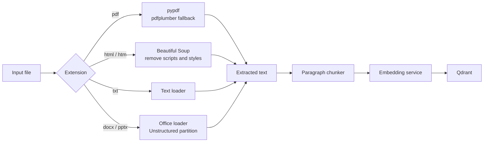

**`NOT from session`** The early whiteboard labels the Office libraries directly
and calls the chunker semantic. The reviewed implementation calls Unstructured
for Office files and packs paragraphs by character count. The redraw above uses
the implementation's labels so the diagram and executable code agree.

| Loader              | Code behaviour                                                        | Consequence                                                              |
| ------------------- | --------------------------------------------------------------------- | ------------------------------------------------------------------------ |
| `loaders/pdf.py`    | Read text with pypdf; use pdfplumber for pages without extracted text | Useful for some extraction failures, but neither step performs image OCR |
| `loaders/html.py`   | Parse HTML and remove non-content elements                            | Reduces navigation/script noise, but flattened text can lose structure   |
| `loaders/text.py`   | Read plain text                                                       | Encoding and paragraph boundaries determine the input to chunking        |
| `loaders/office.py` | Call `unstructured.partition.auto.partition` and join elements        | Office parsing relies on Unstructured and its dependencies               |

The processor's dispatch is straightforward:

```python
# Reader note: The extension dispatcher calls only the parser matching the input suffix.
from app.ingestion.loaders.pdf import parse_pdf
from app.ingestion.loaders.html import parse_html
from app.ingestion.loaders.text import parse_text
from app.ingestion.loaders.office import parse_office


def parse_document(path: str) -> str:
    extension = path.rsplit(".", 1)[-1].lower()
    if extension == "pdf":
        return parse_pdf(path)
    if extension in ("html", "htm"):
        return parse_html(path)
    if extension == "txt":
        return parse_text(path)
    if extension in ("docx", "pptx"):
        return parse_office(path)
    raise ValueError(f"Unsupported extension: {extension}")
```

This compact example exposes the dispatch already present in `process_file`; it
can be run from the repository root with the project environment installed. The
actual processor logs and skips unsupported files instead of raising this
helper's exception.

### What can go wrong before embeddings?

A scanned PDF can yield no text. Two-column text can be read in the wrong order.
A table can lose the relationship between a value and its column heading. A code
block can lose indentation. None of those failures is repaired by placing the
resulting string into a better vector database.

**`NOT from session`** The reviewed PDF loader appends fallback page text after
the primary extraction, which can change page order. Preserve page indices and
reassemble by page number before chunking. The HTML loader can produce
single-newline text while the chunker splits on double newlines; inspect the
extracted text instead of assuming meaningful paragraph boundaries survived.

### Doubts · Do we need an orchestrator to select parsers? · 02:42

**Student question:** Is parser selection itself an LLM or orchestration
problem?

**Response:** The file extension is sufficient for this project. A more complex
ingestion system may inspect document content, but this dispatch is ordinary
Python control flow.

**Summary**

- Parser selection is deterministic in this implementation.
- Text extraction and OCR are different operations.
- Inspect reading order, tables and paragraph boundaries before indexing.
- Parsing errors propagate into chunks, retrieval and the final answer.

## 5. Choose an embedding model and preserve its vector space

The embedding module is shared by ingestion and query processing. This is a correctness requirement: both sides must describe meaning in the same coordinate system. Document vectors can be generated once and reused, while the query vector is generated for every new search.

Follow three decisions in the code below:

1. `_init()` selects the backend for this process. It probes Gemini and may choose the local model if that probe fails.
2. `embed_texts()` turns a list of chunk strings into an equally long list of vectors. This is the bulk ingestion path.
3. `embed_query()` embeds the search text; `get_embedding_dim()` tells collection creation how many coordinates to expect.

**`NOT from session` · Failure trace.** Suppose ingestion used Gemini's 3,072-dimensional vectors yesterday. Today's API process cannot initialise Gemini and selects the 768-dimensional local fallback. The API may start successfully, but its query vector cannot search yesterday's collection. Padding the vector to 3,072 would hide the size mismatch without making its meaning compatible. Restore the original backend or rebuild into a separate collection with the chosen backend.

### Complete file: `app/services/retrieval/embedding.py`

```python
# Reader note: Use the same embedding family for stored passages and incoming queries.
import time
import logfire
from langchain_google_genai import GoogleGenerativeAIEmbeddings
from app.config import settings

BATCH_SIZE = 50
_GEMINI_DIM = 3072
_FALLBACK_DIM = 768  # all-mpnet-base-v2

_active_model = None
_model_type: str | None = None  # "gemini" or "fallback"


# ── Model initialisation ───────────────────────────────────────────────────────

def _probe_gemini():
    """Try one embed call to verify Gemini is reachable. Returns model or None."""
    try:
        model = GoogleGenerativeAIEmbeddings(
            model="models/gemini-embedding-2-preview",
            google_api_key=settings.GEMINI_API_KEY,
        )
        model.embed_query("probe")
        logfire.info("Gemini embeddings ready (gemini-embedding-2-preview, 3072-dim).")
        return model
    except Exception as e:
        logfire.warning(f"Gemini probe failed: {e}. Will use sentence-transformers fallback.")
        return None


def _load_fallback():
    from sentence_transformers import SentenceTransformer
    logfire.info("Loading sentence-transformers fallback (all-mpnet-base-v2, 768-dim).")
    return SentenceTransformer("all-mpnet-base-v2")


# Reader note: The provider decision happens lazily on first use, before query or passage embedding.
def _init():
    """Initialise embedding model once per process. Called lazily on first use."""
    global _active_model, _model_type
    if _active_model is not None:
        return

    gemini = _probe_gemini()
    if gemini:
        _active_model = gemini
        _model_type = "gemini"
    else:
        _active_model = _load_fallback()
        _model_type = "fallback"


# ── Public helpers ─────────────────────────────────────────────────────────────

def get_embedding_dim() -> int:
    """Return the vector dimension for the active model. Call after _init()."""
    _init()
    return _GEMINI_DIM if _model_type == "gemini" else _FALLBACK_DIM


# ── Batch embedding with retry ─────────────────────────────────────────────────

def _embed_batch(batch: list[str]) -> list[list[float]]:
    if _model_type == "gemini":
        # Exponential backoff: 1 s → 2 s → 4 s → 8 s (4 attempts total)
        for attempt in range(4):
            try:
                return _active_model.embed_documents(batch)
            except Exception as e:
                err = str(e).lower()
                is_rate_limit = any(x in err for x in ("429", "rate", "quota", "resource_exhausted"))
                if is_rate_limit and attempt < 3:
                    wait = 2 ** attempt
                    logfire.warning(
                        f"Gemini rate limit hit — retrying in {wait}s "
                        f"(attempt {attempt + 1}/4)."
                    )
                    time.sleep(wait)
                else:
                    logfire.error(f"Gemini embedding failed: {e}")
                    raise
        raise RuntimeError("Gemini rate limit persisted after 4 attempts.")
    else:
        return _active_model.encode(batch, show_progress_bar=False).tolist()


# ── Public API (same signatures as before) ─────────────────────────────────────

def embed_query(query: str) -> list[float]:
    _init()
    if _model_type == "gemini":
        return _active_model.embed_query(query)
    return _active_model.encode([query])[0].tolist()


# Reader note: Keep document batches together and preserve their input order.
def embed_texts(texts: list[str]) -> list[list[float]]:
    _init()
    all_embeddings: list[list[float]] = []
    for i in range(0, len(texts), BATCH_SIZE):
        batch = texts[i : i + BATCH_SIZE]
        with logfire.span("Embed batch", model=_model_type, start=i, size=len(batch)):
            all_embeddings.extend(_embed_batch(batch))
    return all_embeddings
```


`app/services/retrieval/embedding.py` hides provider-specific calls behind three
public operations:

```python
# Reader note: The query and document calls must use the same selected embedding family.
from app.services.retrieval.embedding import (
    embed_texts,
    embed_query,
    get_embedding_dim,
)

chunks = ["A pod is the smallest deployable unit in Kubernetes."]
document_vectors = embed_texts(chunks)
query_vector = embed_query("What is a Kubernetes pod?")
assert len(document_vectors) == len(chunks)
assert len(query_vector) == get_embedding_dim()
```

The teaching implementation first probes Gemini. If that initial probe fails, it
loads `sentence-transformers/all-mpnet-base-v2` locally. It initialises lazily
so importing the module does not immediately load a large model.

| Property                  | Gemini path in the reviewed code               | Local fallback                                   |
| ------------------------- | ---------------------------------------------- | ------------------------------------------------ |
| Model                     | `models/gemini-embedding-2-preview`            | `sentence-transformers/all-mpnet-base-v2`        |
| Configured dimensions     | 3072                                           | 768                                              |
| Execution                 | Remote API                                     | Local inference                                  |
| Main failure modes        | Credential, model availability, quota, network | Download, memory, package/runtime compatibility  |
| Query/index compatibility | Must use this same embedding space             | Requires its own consistently indexed collection |

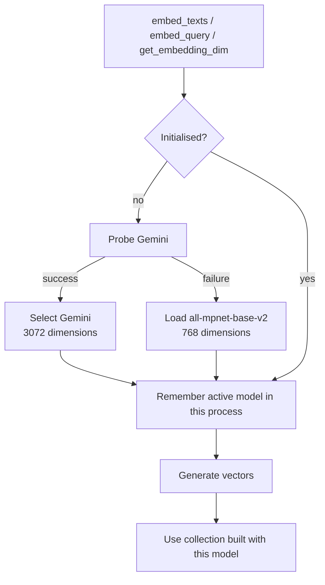

### Retries are not a fallback

On the Gemini batch path, quota/rate failures are retried with waits of 1, 2 and
4 seconds across four attempts. This is a retry strategy for one provider. It is
not permission to switch the representation of later chunks after earlier chunks
have already been indexed.

**`NOT from session`** The teaching code does not dynamically switch to the
local model after every remote batch failure; it retries and then raises. Query
embedding also does not have the same batch retry loop. A log message about
fallback during initialisation should not be interpreted as a guarantee that
every later outage is handled.

### Doubts · Can different dimensions share a collection? · 02:53

**Shiva Kumar:** What happens when one model produces 3072 dimensions and
another produces 768?

**Response:** The collection's vector configuration and the vectors must agree.
A 768-dimensional query cannot search a collection configured for
3072-dimensional vectors.

### Doubts · If dimensions match, can models be mixed? · 02:56–02:57

**Rakesh and host follow-up:** Is matching the vector length enough?

**Paul's clarification:** Avoid mixing embedding models. Reindex when changing
the model.

**`NOT from session`** Matching length is necessary but insufficient. Two models
can both return 1024 numbers while assigning unrelated meanings to their
coordinates. Store model identity and revision alongside the index
configuration, and use a separate collection when migrating. A
[viewer comment](https://www.youtube.com/watch?v=bjkjaqUZl4E) raises the same
semantic-space concern; the implementation must enforce it, not merely document
it.

A model trained with Matryoshka representation learning may support selected
shorter dimensions. That is a supported transformation within a model family,
not evidence that arbitrary truncation or cross-model mixing preserves retrieval
quality.

### Doubts · What happens when documents change? · 03:08

**Student question:** Do updated documents require ingestion again?

**Response:** Changed content needs updated vectors; obsolete chunks should be
removed or replaced. Otherwise retrieval can return an old procedure alongside
the new one.

**`NOT from session`** The current ingestion uses random UUIDs, so rerunning it
appends new points rather than identifying replacements. A small practical
improvement is a stable document identifier plus a content revision and
deterministic chunk identifiers.

**Summary**

- Index and query embeddings must come from the same compatible model space.
- Dimension checks catch some failures, but do not prove model compatibility.
- Initial provider selection, retries and runtime fallback are separate
  behaviours.
- Model migrations and document updates need deliberate reindexing rules.

## 6. Understand the actual chunking algorithm

A chunk must be small enough to retrieve selectively and large enough to carry an answer. The implementation below makes a simple, inspectable choice: split on blank lines, then pack consecutive paragraphs up to a target character count.

Trace a small example before reading the function. With a limit of 20 and paragraphs of lengths 8, 7 and 10, the first two fit together after adding the separator; the third starts another chunk. The algorithm does not ask an embedding model whether the topic changed. It also cannot split an oversized paragraph, because paragraphs are its smallest units; the edge case below shows this.

This distinction explains why the HTML loader and splitter must be inspected together. If HTML extraction produces only single newlines, a whole page may become one paragraph and defeat the intended chunk size.

### Complete file: `app/ingestion/chunking/splitter.py`

```python
# Reader note: Pack blank-line paragraphs by character count; one long paragraph can exceed the target.
from typing import List
import logfire

# Reader note: The threshold is a packing target, not a guaranteed maximum for oversized paragraphs.
def chunk_text(text: str, chunk_size: int = 1500) -> List[str]:
    """
    Simple semantic-ish chunker that splits by paragraphs.
    Ensures chunks do not exceed the specified size.
    """
    with logfire.span("✂️ Text Chunking", text_length=len(text)):
        if not text.strip(): 
            return []
            
        paragraphs = text.split("\n\n")
        chunks = []
        current_chunk = ""
        
        for p in paragraphs:
            if len(current_chunk) + len(p) < chunk_size:
                current_chunk += p + "\n\n"
            else:
                if current_chunk.strip():
                    chunks.append(current_chunk.strip())
                current_chunk = p + "\n\n"
        
        if current_chunk.strip():
            chunks.append(current_chunk.strip())
            
        valid_chunks = [c for c in chunks if c.strip()]
        logfire.info(f"✅ Generated {len(valid_chunks)} chunks")
        return valid_chunks
```


Its defaults are a **1500-character** target and **no overlap**.

The core logic in `app/ingestion/chunking/splitter.py` is:

```python
# Core algorithm from chunk_text; logging omitted for readability.
def paragraph_chunks(text: str, chunk_size: int = 1500) -> list[str]:
    if not text.strip():
        return []
    chunks = []
    current_chunk = ""
    for paragraph in text.split("\n\n"):
        if len(current_chunk) + len(paragraph) < chunk_size:
            current_chunk += paragraph + "\n\n"
        else:
            if current_chunk.strip():
                chunks.append(current_chunk.strip())
            current_chunk = paragraph + "\n\n"
    if current_chunk.strip():
        chunks.append(current_chunk.strip())
    return [chunk for chunk in chunks if chunk.strip()]
```

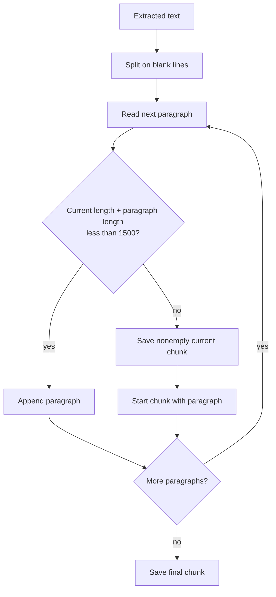

### The oversized-paragraph edge case

A single 4000-character paragraph becomes a 4000-character chunk. The code
cannot split it because paragraph splitting has already produced one unit. Even
ordinary paragraph joins add separator characters that are not fully included in
the fit check.

```python
from app.ingestion.chunking.splitter import chunk_text

text = "x" * 4000
chunks = chunk_text(text)
print([len(chunk) for chunk in chunks])  # [4000]
```

**`NOT from session`** This contradicts the docstring's strict-size guarantee.
Treat 1500 as a packing target. If the model has a strict input limit, add a
second split for oversized paragraphs and measure tokens with the intended
model's tokenizer. Character count is not token count.

| Strategy                 | Boundary                           | Strength                              | Failure to check                           |
| ------------------------ | ---------------------------------- | ------------------------------------- | ------------------------------------------ |
| This paragraph packer    | Blank-line paragraphs              | Simple and preserves short paragraphs | Long paragraph or lost blank lines         |
| Fixed-size with overlap  | Character/token windows            | Predictable size                      | Cuts procedures or code mid-unit           |
| Recursive splitter       | Hierarchy of separators            | Falls back to smaller boundaries      | Still needs evaluation for tables and code |
| Semantic chunking        | Representation-based topic changes | Can follow topic boundaries           | Extra cost and unstable/oversized chunks   |
| Structure-aware chunking | Headings, tables, functions        | Keeps meaningful units together       | Depends on parser quality                  |

### Doubts · Why no overlap? · 03:29

**Host prompt:** Was overlap deliberately omitted?

**Response:** There was no special design justification for its omission in this
implementation. It is a simple baseline.

That matters when a procedure spans a boundary: a chunk containing the command
may omit the prerequisite. Before adding overlap everywhere, inspect which
boundaries actually break the questions you care about.

**Summary**

- The implemented chunker is paragraph packing with a character target.
- It has no overlap and no semantic-boundary model.
- An oversized paragraph remains oversized.
- Chunking should be evaluated using questions whose answers cross realistic
  boundaries.

## 7. Complete the ingestion pipeline

<Infographic
  src="/img/enterprise-rag/s1-ingestion-code-flow-supplied.png"
  alt="Ingestion: data flow and Python files"
  caption="Supplied session whiteboard, 4:13 to 4:15."
/>

The processor joins the modules into one write path. Read it as a sequence of irreversible boundaries: before an upsert, all work is local or an embedding request; after an upsert, Qdrant contains new searchable records.

| Step | Input → output | What proves this step worked |
| --- | --- | --- |
| Dispatch | File path → selected parser | The expected loader runs for the extension |
| Extract | File → text | A known paragraph/table survives |
| Split | Text → ordered chunks | Answer-bearing content is not cut away |
| Save | Chunks → local JSON | You can inspect the exact embedded strings |
| Embed | N chunks → N vectors | Count and dimensions agree |
| Upsert | Vector + text + metadata → point | Qdrant returns the stored payload |

The code below is the complete implementation. After it, the commands build the useful collection first and append noise. Do not run `--wipe` for the second command: it deletes the collection rather than deleting only noisy points.

### Complete file: `app/ingestion/processor.py`

```python
# Reader note: Route each extension to a parser, save inspectable chunks, then embed and upsert points.
import os
import sys
import uuid
import json
import logfire

from qdrant_client import QdrantClient
from qdrant_client.http import models

from app.config import settings
from app.services.retrieval.embedding import embed_texts, get_embedding_dim
from app.ingestion.loaders.pdf import parse_pdf
from app.ingestion.loaders.html import parse_html
from app.ingestion.loaders.text import parse_text
from app.ingestion.chunking.splitter import chunk_text

logfire.configure(service_name="enterprise-ingestion-service")

# Local folder where parsed + chunked JSON metadata is saved (replaces GCS processed bucket)
PROCESSED_DATA_DIR = "processed_data"

# Initialize Qdrant Client
qdrant_client = QdrantClient(
    url=settings.QDRANT_URL,
    api_key=settings.QDRANT_API_KEY,
)


def save_processed_locally(data: dict, source_type: str, filename: str) -> str:
    """Save parsed chunk metadata as JSON in processed_data/<source_type>/."""
    folder = os.path.join(PROCESSED_DATA_DIR, source_type)
    os.makedirs(folder, exist_ok=True)
    dest = os.path.join(folder, f"{filename}.json")
    with open(dest, "w", encoding="utf-8") as f:
        json.dump(data, f, ensure_ascii=False, indent=2)
    return dest


# Reader note: Parsing and chunking happen before vectors are written to Qdrant.
def process_file(file_path: str, filename: str, source_type: str):
    """Parse → chunk → save locally → embed → index in Qdrant."""
    with logfire.span("Processing File", file=filename, source=source_type):
        try:
            # 1. Extract text based on file extension
            ext = filename.lower().rsplit(".", 1)[-1]
            if ext == "pdf":
                full_text = parse_pdf(file_path)
            elif ext in ("html", "htm"):
                full_text = parse_html(file_path)
            elif ext == "txt":
                full_text = parse_text(file_path)
            elif ext in ("docx", "pptx"):
                from app.ingestion.loaders.office import parse_office
                full_text = parse_office(file_path)
            else:
                logfire.warning(f"Skipping unsupported file type: {filename}")
                return

            if not full_text or not full_text.strip():
                logfire.warning(f"No text extracted from {filename} — skipping.")
                return

            # 2. Chunk text
            chunks = chunk_text(full_text)
            if not chunks:
                return

            # 3. Save processed metadata locally
            processed_data = {
                "filename": filename,
                "source_type": source_type,
                "chunks": chunks,
            }
            local_path = save_processed_locally(processed_data, source_type, filename)
            logfire.info(f"Saved processed data → {local_path}")

            # 4. Embed and index in Qdrant
            with logfire.span("Vectorizing & Indexing"):
                embeddings = embed_texts(chunks)
                points = [
                    models.PointStruct(
                        id=str(uuid.uuid4()),
                        vector=vector,
                        payload={
                            "text": chunk,
                            "source": filename,
                            "source_type": source_type,
                        },
                    )
                    for chunk, vector in zip(chunks, embeddings)
                ]

                qdrant_client.upsert(
                    collection_name=settings.QDRANT_COLLECTION,
                    points=points,
                )
                logfire.info(f"Indexed {len(points)} points to Qdrant from {filename}.")

        except Exception as e:
            logfire.error(f"Failed to process {filename}: {e}")


def process_directory(dir_path: str, source_type: str):
    """Process every file in a directory."""
    with logfire.span("Scanning Directory", path=dir_path, source=source_type):
        files = [f for f in os.listdir(dir_path) if os.path.isfile(os.path.join(dir_path, f))]
        logfire.info(f"Found {len(files)} files in {dir_path}.")
        for filename in files:
            process_file(os.path.join(dir_path, filename), filename, source_type)


# Reader note: Wiping the collection deletes existing vectors; the ordinary true/noisy labels do not.
def run_universal_ingestion(base_dir: str, explicit_source_type: str = None, wipe: bool = False):
    """
    Scan base_dir, map sub-folders to source types, and ingest all documents.
    Pass --wipe to drop and recreate the Qdrant collection before ingestion.
    """
    with logfire.span("Universal Ingestion Started", base_directory=base_dir):

        # Wipe collection if requested
        if wipe:
            with logfire.span("Wiping Collection"):
                if qdrant_client.collection_exists(settings.QDRANT_COLLECTION):
                    qdrant_client.delete_collection(settings.QDRANT_COLLECTION)
                    logfire.info(f"Collection '{settings.QDRANT_COLLECTION}' deleted.")

        # Recreate collection — dimension resolved at runtime after embedding model probe
        if not qdrant_client.collection_exists(settings.QDRANT_COLLECTION):
            dim = get_embedding_dim()
            qdrant_client.create_collection(
                collection_name=settings.QDRANT_COLLECTION,
                vectors_config=models.VectorParams(
                    size=dim,
                    distance=models.Distance.COSINE,
                ),
            )
            logfire.info(
                f"Created collection '{settings.QDRANT_COLLECTION}' "
                f"({dim}-dim, Cosine)."
            )

        # Route to sub-folders or treat the whole dir as one source
        subdirs = [
            d for d in os.listdir(base_dir)
            if os.path.isdir(os.path.join(base_dir, d))
        ]

        if not subdirs:
            if explicit_source_type:
                source_type = explicit_source_type
            else:
                base_name = os.path.basename(os.path.normpath(base_dir)).lower()
                source_type = (
                    "true" if "true" in base_name
                    else "noisy" if "noisy" in base_name
                    else "general"
                )
            logfire.info(f"No sub-folders found — processing '{base_dir}' as '{source_type}'.")
            process_directory(base_dir, source_type)
        else:
            for subdir in subdirs:
                source_type = (
                    "true" if "true" in subdir.lower()
                    else "noisy" if "noisy" in subdir.lower()
                    else subdir
                )
                process_directory(os.path.join(base_dir, subdir), source_type)


if __name__ == "__main__":
    # Usage:
    #   python -m app.ingestion.processor DATA --wipe
    #   python -m app.ingestion.processor DATA/true_data true
    wipe_requested = "--wipe" in sys.argv
    clean_args = [a for a in sys.argv if a != "--wipe"]

    target_dir = clean_args[1] if len(clean_args) > 1 else "DATA"
    explicit_type = clean_args[2] if len(clean_args) > 2 else None

    if not os.path.exists(target_dir):
        print(f"Error: path '{target_dir}' does not exist.")
        sys.exit(1)

    run_universal_ingestion(target_dir, explicit_source_type=explicit_type, wipe=wipe_requested)
    logfire.info("Ingestion job completed.")
```


`processor.py` connects the components. Read it from the smallest operation to
the entry point: `save_processed_locally`, `process_file`, `process_directory`,
`run_universal_ingestion`, then the `__main__` argument handling.

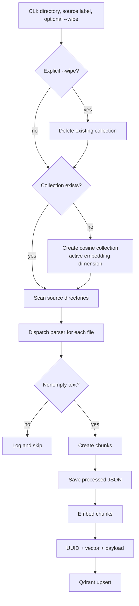

### 7.1 Save the intermediate representation

`save_processed_locally` writes a JSON file under
`processed_data/<source_type>/`. The contents are the filename, source label and
chunk strings. This gives you a place to inspect extraction before blaming
embeddings or retrieval.

```json
{
  "filename": "parallel_work_queue.txt",
  "source_type": "true",
  "chunks": ["First extracted and packed text chunk", "Second text chunk"]
}
```

### Doubts · Does `processed_data` contain vectors? · 04:18

**Student question:** What is saved in the processed-data folder?

**Response:** The parsed/chunked text and metadata are saved locally. The
vectors are sent to Qdrant. The JSON is useful for examining what the model was
asked to embed.

### 7.2 Embed chunks and construct points

For each chunk, the processor pairs its text with the corresponding embedding
and creates a Qdrant point. The payload fields are `text`, `source` and
`source_type`.

```python
# Run inside the installed project environment; this writes to the configured collection.
import uuid
from qdrant_client import QdrantClient, models
from app.config import settings
from app.services.retrieval.embedding import embed_texts

chunks = ["A Kubernetes Job runs one or more pods to completion."]
vectors = embed_texts(chunks)
points = [
    models.PointStruct(
        id=str(uuid.uuid4()),
        vector=vector,
        payload={"text": chunk, "source": "example.txt", "source_type": "true"},
    )
    for chunk, vector in zip(chunks, vectors)
]
client = QdrantClient(url=settings.QDRANT_URL, api_key=settings.QDRANT_API_KEY)
client.upsert(collection_name=settings.QDRANT_COLLECTION, points=points)
```

The vector is the search key; the payload is what makes the result useful to the
application. `source_type` can also support debugging or filtering. Do not
filter out all noisy documents during a noise-resilience experiment, because
that would remove the challenge being tested.

**`NOT from session`** Validate `len(vectors) == len(chunks)` before the `zip`.
Python otherwise silently stops at the shorter input. Also check vector
dimensions before upserting so an embedding failure is reported at the correct
boundary.

### 7.3 Create or reuse the collection


<figure style={{overflowX: "auto"}}>
<img src="data:image/png;base64,iVBORw0KGgoAAAANSUhEUgAABJIAAATWCAYAAAB+JIxlAAAQAElEQVR4AezdB3xURbsG8Gc3gSS0JJBCQhPpGLqIqIiKSBNQigX180PkoqBgAz/sDVGQqqGDdEREqkgH6RB6700gSEtISEIKyT3v4AmbJWWT7G62PH7OKXPmzLzzP4v37vubsxhDQkLSWGjAzwA/A/wM8DPAzwA/A/wM8DPAzwA/A/wM8DPAz4BLfwb43Z/5D6t8BozgPxSgAAUoQAEKUIACFKAABSjgwAIMjQIUoIDjCDCR5DjPgpFQgAIUoAAFKEABCriaAOdDAQpQgAIUcDEBJpJc7IFyOhSgAAUoQAEKWEeAvVCAAhSgAAUoQAEK3C3ARNLdJqyhAAUoQAHnFmD0FKAABShAAQpQgAIUoICNBJhIshEsu6UABfIiwHsoQAEKUIACFKAABShAAQpQwJEFmEhy5KfjDLEZCqFQyQfh6d8QniwOYVAk+GFn+OQwRgpQgAIUoAAFKEABClCAAhRwQgGjE8bMkB1JIC0FzZ99ExNm/MbiIAZhDVs50ieEsVCAAhSgAAUoQAEKUIACDiLAMChgDQGuSLKGIvvAvWU8WRzAILikBz+NFKAABShAAQpQgAKuJ8AZUYACFHAYASaSHOZRMBAKUIACFKAABShAAdcT4IwoQAEKUIACriXARJJrPU/OhgIUoAAFKEABawmwHwpQgAIUoAAFKECBuwSYSLqLhBUUoAAFKODsAoyfAhSgAAUoQAEKUIACFLCNABNJtnFlrxSgQN4EeBcFKEABClCAAhSgAAUoQAEKOLAAE0kO/HCcKzRGSwEKUIACFKAABShAAQpQgAIUoICrCxjh6jPk/ChAAQpQgAIUoAAFKEABClCAAhQAaEABKwhwRZIVENkFBRLiE4hAAQpQgAIUoAAFKEABmwmwYwpQgAKOIsBEkqM8CcaRK4F9e3Zj4FefqbJp/TpERl7A0j8Wpvexfs0qnDx+LP28//t9MGrEEFXibtxIr5eD1NRUrNPay3FeSnJKCpYsnn/XrRcunMfRI0fuqmcFBShAAQpQgAJuJcDJUoACFKAABVxKgIkkl3qc7jOZ6VMmou9Hn+N/n36pJZHO41bKLdyIjU0HiE+IR3JKcvp5CV9f9OzzvipFixXDtEkTED5iKDauW4uILZswYWw4jhw+hMnjx2Bs+AgsXjAPkmA6e+Y0Duzbiz8WzsMMbcxJ40YhMSkRZ06fwuiRwzD311nwMHqgaNGi2LZlM36dNQ3jwkfi+vXrWDTvN0yeMAbR0dHpcfCAAhSgAAWcSYCxUoACFKAABShAAQqYCzCRZC7Cc4cXkBVFZcqUg6enBwwGAzo+92KOMR87ckStRpLkjzTeuSMCPXu/i9UrlqHBA41Rp259VKteA3t270L3N3vDy8sLhw7sx+rlSxESWgYb169Dm3bPov79jbBq2Z9aImo8XnujJ4oXL4GdO7Zi3949OHPqBGrUrIVHmj4OSVA93OQxPPlUS/j5+cmQLBSggD0FOBYFKEABClCAAhSgAAUoYBMBJpJswspObSlQpGhRXLwYibS0NDWMJIXUQTabKtWqQVYkvaklj6RZaNmyKgnlXaSInCL1376k3mg04KFHHsWWjesRExODkqVKoXChQijh64fAwCDExlyHh6cnvAp7ISi4NOJi41QfsgkICoK/1j7uxu3VUWm4HaNcY7FMgK0oQAEKUIACFKAABShAAQpQwHEFjI4bGiNzMgG7hWswGNCy9dP47uvPMfyH73DqxHE19qrlS9Wqo99+maHOTTf6iiT5nSRZ0WR6TVY2XbtyBYcP7k+vltffdu/agXr1G6TX/TT8B4z+cRgeefQJ1KnXACOHDlKvr9Vr2DC9jelB6ZBQrFz6J6KjokyreUwBClCAAhSgAAUoQAEKUIACFHBaASPgtLEzcDcWePTxZuo3kmSFkbzaVrZcOYyeNE2tOur0wkto0botqlWvmS40acZsdU1WJUmSqG//T9U1ff/tD8NRrcZ90M//uXgRpUoF4IGHHlbtihYvjrfe+QBffTcEZbSxWrdtj159PsCnXw9EieIl1H2dX3wZIVrySIocBwQGQvr18/dXfXBDAQpQgAIUoAAFKEABClCgYAU4OgXyL8AVSfk3ZA8FJCArieT1MmsMbzAY1Ktuel+FCxfGO/0+gpeXt6p67fU3YDQatWJQ57Lx8Mj5j4/BcKe93MNCAQpQgAIUoAAFKECBPAnwJgpQgAIOIpDzN2EHCZRhUMCeAv4lS8L0R7JLBQbac3iORQEKUIACFKCACwlwKhSgAAUoQAFXEmAiyZWeJudCAQpQgAIUoIA1BdgXBShAAQpQgAIUoICZABNJZiA8dWyBxMSbSE21zt+EZs2+bKGWlJyU/jfT2aJ/9kkB1xbg7ChAAQpQgAIUoAAFKEABWwgwkWQLVfaZo8C1q1fQ//0+6m9dG/vTcNy6lZrjPdJg26aNuPTPRTnMc1mzcrm61xp9qY5stJn36yzExMTYqHcH7pahUYACFKAABShAAQpQgAIUoIDDCjCR5LCPxvkCy03Ekjhq0PABvPPB/+Dl7YMzp05g5bI/VRdL/1io9tMmTUD4iKHYuG6tOpeNT7Gi8PLygvm19WtW4cdhgzFz6s8q+bJty2aMGjEEe3fthKw8kvYTx4Tj0MH9mKDt12nt9b62bt6o2m7ZuB4Xzp/T+pikzk8ePyZDqhIfF4dJ40ZhXPhIxMbGwvQeaTB10nh1z4qlSzA2fASW/bk4va+RQwdBkleyP3RgH+RvhJN5TZ4wFskpKVi8YB6mT56ojfuzWoEk85W2Rw8flq5ZKEABClCAAhSgAAUoQAEKUIACDiMgiSSHCYaBuJdAxLYtWvJkkkrulA4JxUEtySIC+/bukR127ohAz97vYvWKZepcNmdOnUJCQnyGazduxGKLlgx6+92+OHP6FK5HRWHKhDF4ptPzWnLpBxw/elTd07JNOwQFlUZY7Tp49PFmWvLqFKKirmLtqhXo2ed9rNcSVhcjL8gw6PZGL8yd84s6ls3cX2fhyRat0bZDJ5w6cTzDPXE3bmC/FvMbb7+LJYsWoPubbyNi8ybEXI+Gp6cnOj3fBbt37cAbb7+DxQvnIyU5Ge07dNbGvoaTx4+qpFTH57pA/ha4Y0cOa3GsQe/3+smwLBSgAAUoQAEKUIACFKAABawpwL4okG8BJpLyTcgO8ipwX1ht1L//Adxzz70o5OWF5KQk1ZUkWuQgtGxZGAwGeBcpIqcZium1lJRb8PL2Vtd9tLaSaLpy5aqWQDqCZzp1RvWaYbj/wcaYPmUiTp8+odrpm8SbN7XkUrA6LR0cgqSbiQjWklpeXrf7Uxe0TWzMdQQEBCIwMBjyN7oFBd25JyEhAYHBwTAajZC4ZO/l46PdBZQKDEIRLaaAUoEoXKiwqvtrzQps3bQekefPa0mlFJTw9YVPER8EaH1GXbuKYC3ZJQ1Dy5aTHQsFKEABClCAAhSgAAUAEIECFKCAYwgwkeQYz8Eto5AEiyR5bibexKXISMTGxKjXwuT1s6xADJlc8PPzwz0VK0FeB4u8cB5+/iXxSNOmOHzwAI4cOgh5bW7JgnlqdVCxYsVVQkheQZO+fP38cSPuBuR3mqKirsGvpD8y++ep1m0x9PsBGPjlJ0hIuJnhnoDAwMxuybLO29sH58+fg8EoEWRs5uvnp1YqjR45DFs2bsh4kWcUoAAFKEABCjinAKOmAAUoQAEKuJAAE0ku9DCdaSqBQUHo9MJLKuR3+/ZHmXLl8MW3g9Ctx1uY+svvqr5v/08z7OWkw3MvIrRMWZheS0tLw7mzpxFWq440gX+pUpDX3F7r0Qvvffgx7q1cBR998Q3e7fcRqlWvie4930azp1pB70vavv5mb/R+v59avdSseUvVjz6GnFSuUlXrYwA+/nIAqlarpvrX75HrelvTvSTJpC9JbL3y2uvSTMUt4/bs/T6+H/oj7qtVW9XJRWkr90jM/9erD8ZPnQlfX1+5xEIBClCAAgUkwGEpQAEKUIACFKAABTIKMJGU0YNnBSzg6emR6wgMBgO6du+JCvfciy++GYRCnp6qD9O+5HUzKeqCtjGarQaS3yfSqrP9V+4x7cOSe7Lq0DS2zNrkp+/M+mMdBdxQgFOmAAUoQAEKUIACFKAABWwgwESSDVDZpf0FfIr4oFKVKuq3huw/Oke0rgB7owAFKEABClCAAhSgAAUoQAFHFWAiyVGfjDPGxZgpQAEKUIACFKAABShAAQpQgAIUcGkBlUhy6RlychRwM4E03P0j3m5GwOlSgAIUoAAFKEABClCAAlkIsJoC+RVgIim/gryfAhSgAAUoQAEKUIACFKCA7QU4AgUoQAGHEGAiySEeA4OggPUEDEizXmfsiQIUoAAFKEABKwiwCwpQgAIUoIDrCDCR5DrPkjOhAAUoQAEKUMDaAuyPAhSgAAUoQAEKUCCDABNJGTh4kleByCupYCl4g5g4rkbK62eY97meAGdEAQpQgAIUoAAFKEABClhfgIkk65u6WY9p2B+xHO+/+2GBls0rZhfo+DL/yaNHQIocF2TZs2uDs38GGT8FKEABClCAAhSgAAUoQAEKOKgAE0kO+mCcKayze2fg3N6ZOLe34MrGVbMLPIYrZ/6ClIK2SDy/1Jk+PoyVAhSgAAUoQAEKUIACFKAABZxI4HYiyYkCZqgUoAAFKEABClCAAhSgAAUoQAEK5FGAt1EgnwJMJOUTkLdTQBeIiIjQD7mnAAUoQAEKUIACFKCA1QXYIQUoQAFHEGAiyRGeAmNwGYG6deu6zFw4EQpQgAIUoAAFrCbAjihAAQpQgAIuI8BEkss8SveeCBM47v38OXsKUIACthNgzxSgAAUoQAEKUIACpgJMJJlq8NhpBcaPH+8Qse/evRvdu3dHw4YNVXGIoBgEBdxVgPOmAAUoQAEKUIACFKAABawuwESS1UnZYUEISOKmIMY1H1N+J8k0qSVxSWIpuyJtsirZ3edI17KKP6/1+n22mKPed1Z782fKcwpQgAIUoAAFKEABClCAAhS4I8BE0h0LHuVfgD38KyAJJb1IYim7orfLbJ/dfY50LbPYrVFnizmaxvXv48qwkwSTJLBkn+ECTyhAAQpQgAIUoAAFKEABClAA/yaSKEEBClDA/QRMk0qmx5LAEg0mk0SBhQIUoAAFKEABClDAtQQ4GwrkT4CJpPz58W4HEeCPbTvIg3ChMCSxxM+VCz1QToUCFKAABSjgCgKcAwUoQAEHEGAiyQEeAkPIv4D8yHX+e2EPFLgjIK+3hYWFqR9Pv1PLIwpQgAIUoEDeBHgXBShAAQpQwFUEmEhylSfJeVCAAlYV6Ny5M2rUqAHZW7VjdkYBCjibAOOlAAUoQAEKUIACFDARYCLJBIOHFKAABXSBOXPmqEN9r064cTIBhksBClCAAhSgAAUoQAEKWFuAiSRri7K/AhGQ37MpkIE5KGAoBM+SD8DTv4H1igP09fNvOyH/yN7VkUqJOAAAEABJREFU5uYT9KBMjYUCFKAABShAAQpQgAIUoECuBZhIyjUZb8hOoKCuye/ZFNTYbj9uWjKebN8TY6f+5nLl78QqLjcneU41G7Rw+48tAShAAQpQgAIUoAAFKECBvAnoiaS83c27KOAgAuPHj3eQSNw3jCrlC4PF8Q1KBxRy3w8pZ04BClCAAhSgAAUoIAIsFMiXABNJ+eLjzY4iwBVJjvIkGAcFKEABClCAAhSggO0E2DMFKECBghdgIqngnwEjsILA7t27rdALu6AABShAAQpQgAI2EmC3FKAABShAARcRYCLJRR4kp0EBClCAAhSggG0E2CsFKEABClCAAhSgwB0BJpLuWPCIAhSgAAVcS4CzoQAFKEABClCAAhSgAAWsLMBEkpVB2V3BCERERBTMwBzVRgLslgIUoAAFKEABClCAAhSgAAUcUYCJJEd8Ks4cUwHFzh/bLiB4DksBClCAAhSgAAUoQAEKUIACbiWQnkhyq1lzsi4nwB/bdrlHmqcJ3bqVisSkxDzdm5ub0tLSEB8Xh4T4hNzclmVba/WT5QC8QAEKUIACFKAABShAARMBHlIgPwJMJOVHj/dSgAI2EVi/ZhW+++ZzDB74NZYsmp/jGDt3RCAmNgbn/j6Dvbt25djetIEkn0aNGKLGGvr9AMTHx5tezvR49Mih2Ll9GxbO+xWSVMq0UQ6VqampWKfNU5rlpx+5n4UCFKAABShAAbcR4EQpQAEKFLgAE0kF/ggYAAUoYC4QnxCPZzs9j779P8XaVSvx99kzOHL4oGq29I+F2LZlM36dNQ3jwkfi8uVL+HncaPwydTIKe3nBx8cHixfMw7SfJ+D3X2dh5tRJmDRuFCRhJPdJ0mjvrp2qL9msXb0ctevWV2O1fbYTTp04jjOnT2H0yGGYq92fmpqm+ps+eaLW1884feokNq5fh+TkZPj6+cNgMEASXz8OG6yuR0dFYeWyP6VrSKwXzp9TsUhCbI827sihg7Dsz8WI2LIJE8aGa/M6pPqRG+b9+osaV8aQWPU5Xr9+XS6zUIACFKCAUwsweApQgAIUoIBrCDCR5BrP0aFn4evrixo1ati0FC5c2Kb9S/ylS5d2aGdXC27ZH4sxcewoVKpSBVHXruFSZKSa4r69e3Dm1AnUqFkLjzR9XEvIbEbjh5ugXYfOiNESLpEXzmP71s147sVXcOzoETzZsg2KFCmKU6eOY8qEMXhGS1D9OOyH9JVEZ7TEUPWaYarvKlWr4b5atTFt0ni89kZPFC9eAjt3bMXWzRvR8bku8PAwwmg0om6D+/H4k09BYrlxIxZbtOtvv9tXJaDi4uJw8MA+1Z9cj7kere5r3fYZeGtJrue7/Ae/zZqJeg0fQB0tgVWteg3VjySZvIsUwetvvqXGN53jxnVrVX/cUIACBSTAYSlAAQpQgAIUoAAF0gWYSEqn4IGtBGTlRlBQEGxZPD09bdq/xJ6SkmIrIvabiUDjRx5FqVIBqFW7rlr1k6z5y2tkKcnJqnWA9pnyL1UKcVoiRyrSkCY7VYoWLw4vby8U0xJBksgsWqw44mNv4MqVqziuJZee6dQZstJIGpcOCcXZs6flENeuXsXZM6fhoX2evAp7ISi4NOJi41BCS4b6FPFBQFAw4uNuqLb6JiXlljaWtzr10RJBBgOQnJSkzvVYg7UxpGLOzGnYvTMCkZHntUQWkJp2J+YbsTEIDA5CoUKF4KkVaR9gNkepY8mdAFtTgAIUoAAFKEABClCAAtYVMFq3O/ZGgcwFiqgv2No37MwvZ6j18PCAt/ftL+YZLtjoRGLTuzY91uu4LxABLXlTAk8/0xHz585BaJmyWDT/d4wf9SNuaQkl84jurVQZs2dMhUH7n/k1/dzXzw+PNG2KwwcP4Mihg2qVkFx74smWWLJgnnpNbtjggShapCjq1GsAeQVt0bzfUK9hQ2mWZfHT+r2nYiXVXlZDeXoWQmxMDMaGj8Chg/sz3CcJqnNnz8LX1w+eHp64duWKFs/tNrLKaemihZBX5GrVqZfhPp5QgAIUoAAFKEABClCAAhRwFAEmkhzlSbhMHJlP5KGHHkK5suUyv2hWW61aNTRv3tysNm+n99xzD8LCbr+2lFkP8prSiy++mH6pS5cu6cc8KDiBFq3bolr1mvD09MCg4T+hVEAAhvw4Rr329clX36Lziy8jJCRUFTl+8OEm6PP+h6havTqat2ytfu9Iou/V5z14eXmj7TMdUKHivZDXz17r0QvvffixXFbF28cb0ucrXbvj6+9+QKnAQLRu2x69+nyAT78eiBLFS6T316x5S8hrcPLbTXKz7GWV1LmzpxFWq45UQVZJffHtIHTr8Ram/vK7ai/3ycX+n32FV19/AzN+W6ASWd/+MBzVatyn+i9WrLiKo2fv9/F0+2fvmqPcz0IBClCAAhSgAAUoQAEKUKCgBe4kkgo6Eo7v0gIJCQm4mXgTL730Erp27YpWrVrh1VdfRevWrVGxYkU89/xz6NatGxo1apTuUKVKFfz3v/9F27ZtVV1m98qFJk2aqD4feOAB1dcLL7ygzmvWrImmTZuqIq+mdejQQY1Zvlx5+Pv7q+NOnTpJF+lFEkvPP/88XnnlFRQrVgzt27dX1x5//HF4eXmpY24KRsBoNKjfJ0IW/xgMhiyuZKyW5FTGmttnPkV8bh/8u/XwsOw/jwaDAV2790SFe+7FF98MQiFPT9VDVuOY1hsMBhgMBtVe31g6rt6eewpQgAIUoAAFKEABCuRagDdQIB8Cln1TyscAvJUCIhASEoKiRYuiZMmSmDJlCiRJNG3aNJQvXx7yGzY+3j6YNGkSGjRoIM1VkWTTpk2bEBoaiqpVq2Z6ryR76tevj7Vr16Jx48aQ14zk5tmzZ0NWQR04cADHjx9H5cqVVWJo+/bteLrt0yqBtXHjRuzZs0eapxcPDw+sX78ect9TTz2FgIAAFbfEm5iYmN6OBxQwFfDRklDyo+CyN63nMQUoQAEKUIACFLC2APujAAUoUNACxoIOgOO7l4CsTEpNTUV8fDxkn/Lv791cv34d8opQUlISPP9d0SE/OlyhQgVcuHABMTExyOxeSSRJ8kcSRadOnVIrVqKiolT/prKSYJLfXZKk1NGjR9VvMF26dAn//POPaTN1fOXKZcg1ab9//34t6dQG165dU9e4oQAFKEABClCAAnkU4G0UoAAFKEABlxBgIsklHqPjT0KSRNlFKSuT5JU3WfUjySVpLwmfsmXLQorUZXb/xYsXER0dDUkQBQYG4tatWxmaSRJKVhMdPnxYJZmkL0k+ycokeVWuY8eOGdrLuK+88h+0a9cO0kZKhQrlIauXMjTkSYEJJCbeLLCxLR04PzEmxCdYOgzbUYACdhPgQBSgAAUoQAEKUIACugATSboE9zYVmDt3LmTF0IQJE9Q45vsjR45gxozpkNfdDh48iMWLF2PRokXqfPTo0bhy5QrM79HP5ZW4WbNmYuLEidi9ezeWLVuWPoYkksLDw3Hy5EmMGTNGjTF//nz1Stu4cePU63Ryn7pB20gb6U/2ksiqVasWZIVTZGSkdpX/WlPg2tWrWPrHwlx3OXLo4FzfY88bZKVd+PAhFg154cJ5HNU++9J4zcrlssPCeb+q1XnqhJv8C7AHClCAAhSgAAUoQAEKUMCqAkwkWZWTneVFQBI2W7duRVJS8l23Z7USybxhZvfqbWSVkX5s2k5WL5le09tInSQD5FxeuZs1a5YcslhZ4FZqKm7Exqb3eub0KYweOQxzf52F1NQ07Nm1EyOHDsKyPxer89kzpmD8qB8Rc/16+j3yrObNmY2x4SNwUUv2bduyGb/OmoZx4SNx4tgxbI/YotounDdX7WXzx8J5Wn+pOHPqJHbv3IHJE8Zi1IghuHrlCuT+GVMmYq829qL5v6t+Tx4/JrepIvdKTAf27cWF8+cwc+okda+0idXmInH8NnuGaqtvdu6IUP1s+GuNShCZxrto3m/a+GMg/U0YE451a1bB188fkVqCybRvebVT9f3LDOUhCSiZo5iIgT4W9xSgAAUoQAEKUIACFKAABWwtwESSrYXdr/+7Ziy/YSRfsrMq8jtFf//9N7K6bkl9qpaUsKRdbtvs3btX/Y6S3GcwZPzbte6aKCvyJTBt0ni89kZPFC9eAjt3bIW3jw+e7/If/DZrJnbt3IYSvv74T7fuuHblcvo4O7ZvxZXLl9DsqVb4adhgLTl0AjVq1sIjTR/H4UP7sWbFcsTExuCilpjRbypc2AtHDh3A6hXL1I+pS9uw2nWxZNF8dX/tug1QI6wW/lq1Au06dIbRw0PdmpqahnsqVkKHTi9Akj4x16NVfbc3emHunF8wTyut2z6DBx58WNXrm4Vz56BF67YICg6BebwPN3kMTz7VEvfVqo2w2nXw6OPNsG/vHi1ZlrHv336ZjqfbdcCDDzXBAe36+jUrtXneh4aNHoKlyVY9Hu4pQAEKUIACFKAABShAAQrkR8AkkZSfbngvBbIWkCTMzp07Ycty8+ZNm/YvsV++fCeBkfVseSWvAh6envDSkjxBwaURFxuHOTOnYffOCERGnseNmFgEBgfBy8sbJQMC04e4duUqrl67ggvn/kaLVm1UfUBQEPxLlUJ8XBxCy5TBUi1B9HjzFuqabB565FFs3rheJS7llclF8+fi3N9ntPY35DLkfvmh97fe64uVfy7BxnVrVH2slpCaNW0yjh07gqtXb38WgkNC4aXFJA2io6NQSostIPBOfFLf54P/Ye/uXWr1UmbxpiFNmt1VTPtOTkpSiTUvH2/V7plOz0PLa2H86J/Uj9CrSm4oQAEKUIACFKAABShgsQAbUiDvAkwk5d2Od1KAAvkUWLV8qXo17LdfZqBOvQbqVTZ53atew4aQxNK5s2fh6+uHOvXvx4K5v6m2piuSHmryKFKSktUqnqio26t4TEN67ImnsPSPP1ClarX06qLFimmJoKu4/4FG8PIqjNjo64i8cAEltHH0Rok3EzFx7CgkJSdp9f6q2sPDiOSUZBw/chgV7rlX1ZluWrR+Gj8M+AqTxo02rcb0KRPVKqqSpQJgHm9pLRG1cumfiI6KQoCWhFqxdEmGe/WTZ597EVMmjsWfixaoqrWrV+LAvt0oWrQoJOmlKrmhAAUoQAEKUMA9BDhLClCAAgUswERSAT8ADk8BdxWQv2Vv9KRp6NnnfXR64SW0btsevfp8gE+/HogSxUug/2df4dXX38CM3xbAz88PX3/3A3q89S7CJ0xJJytWrDg++epb9OjVB+06dETnF19GiJackSLHZcqVw6QZs9Pb6wd9+3+qJXWaosZ9tfCxdv/7//sEL77y3/T7vby91HivduuBts90ULfJWAN/GAl5lU1iqV4zDM2at1TXpL9q1Wuqvt5+ty/e+/BjVS8bOX+5a3f0fr8fpA/TeGX10rc/DIefvz+693xbvaInfZn3fVFLdJXW5iX91QyrhTNHoEgAABAASURBVBatnsb/9XpHzd3Hx0eqWShAAQpQwAkEGCIFKEABClDAFQSYSHKFp8g5UMBFBGTVj+lUPD1v/z6RXmd+Xa83b6fXW7LPqk+517xfo9EAozHr/2xKXwaDAeb/mPdjem4w3Glv1Po3v1fOa9eth6aPP6kSVy3btJMqmPahKrihAAVsKcC+KUABClCAAhSgAAX+Fcj6G9G/DbijgDMI1K1b1xnCZIwUyLOArK6SkucO3PZGTpwCFKAABShAAQpQgAIUsKYAE0nW1GRfBSYwfvz4AhubA9tIgN1SgAIUoAAFKEABClCAAhSggMMJMJHkcI/E+QPiDChAAQpQgAIUoAAFKEABClCAAhRwTQHTRJJrzpCzcguBhg0busU8OUkKUIACFKAABShAAQpQgAJWEGAXFMizABNJeabjjY4kEBER4UjhMBYKUIACFKAABShAAQrYSIDdUoACFChYASaSCtafo1tJgCuSrATJbihAAQpQgAIUsJ0Ae6YABShAAQq4gAATSS7wEDkFCjiCwMWrqWDJ3OCfq8kOYxOXkOYIHxfGQAGnE2DAFKAABShAAQpQgAK3BZhIuu3ALQUokA+BgztXoe+7HztMmTz6J4eJ5fOPvsBv0yY5TDzynA7u2ZaPp+10tzJgClCAAhSgAAUoQAEKUMCKAkwkWRGTXVHAXQXO7pmGM3umWrnkvb/Lp1c7TCxn9s5CzMUIx4lHe04JF/50148q500BClCAAhSgAAUoQAEK5FOAiaR8AvL2TARYRQEKUIACFKAABShAAQpQgAIUoIBLCmRIJLnkDDkptxDg39rmFo/Z4kny82AxFRtSgAIUoAAFKEABCripAKdNgbwKMJGUVzne51AC/FvbHOpxFHgw/DwU+CNgABSgAAUoQAEK2E6APVOAAhQoUAEmkgqUn4NbS6Bu3brW6or9UIACFKAABShAARsJsFsKUIACFKCA8wswkeT8z9DtZyCrT8aPH+/2DgS4LSCfB77adtuCWwpQwIoC7IoCFKAABShAAQpQQAkwkaQYuLGngHzRNy0ytpyb77t37w6pNy/STopez6SBaFhWxExa6ntzY/2aXJci16VO9nIuRc5lL0U/Nt2bHkub/BS9L/M+9HrZS2yylzay5+dBFFhMBXhMAQpQgAIUoAAFKEABClhPgIkk61mypxwE9C/60ky+7OtFPzffyyojvY3pXtpJ0evkmCVrAXHXi95K7OTY3Fjq5Jpe5LrUyV6vk3PzY71O9lLkur6X4zwW6QKZ3SsXpF72Epvs9XM5ZqEABShAAQpQgAIUoAAFKEAB2wgwkWQbVzfv9e7py6oR/Yu+vr+7FWtsJSDmerHVGOyXAhSgAAUoQAEKUIACFKAABVxfIGMiyfXnyxkWkIC+aqSAhuewFKAABShAAQpQgAIUoAAFKGAqwGMK5FGAiaQ8wvE2ywX016pkb/ldbEkB1xCoV68eypcvr37vyzVmxFlQgAIUoAAFKFDQAhyfAhSgQEEKMJFUkPpuMvbLL7+MAQMGqOImU+Y0KaAEJHn6+eefo2PHjvz8KxFuKEABCri9AAEoQAEKUIACTi/ARJLTP0LHn8D06dNVkHPmzFF7bijgLgLyu1SHDh1S0+XnXzFwQwEnFmDoFKAABShAAQpQgAIiwESSKDhISfMtDM9q/rh1TxGXKlsuH8DB40cwZsUMl5qX/pzSQoo4yCeIYTiigJ5I5e+EFeDT4dAUoAAFKEABClCAAhSggNUEmEiyGmX+O0orYsTHI77B2DmTXa4UbhjscnPSn1OREN/8P3z2kKmAK1R6XNgG34398Eb9W64wHc6BAhSgAAUoQAEKUIACFHBzASaSHPADUKt0ZTh5cZv4i3g7/mokeb3KAT/mbhHSg2XSMP7r/6DsS5/h/UGDmUxyi6fOSVKAAhSgAAUoQAEKUMC1BcwSSa49Wc6OAhSggL0E9CRSyUeeVUMWKV+VySQlwQ0FKEABClCAAhSggGMIMAoK5E2AiaS8ufEuCjiFgPytYVKcIlgXCtI8iaRPjckkXYJ7ClCAAhSgAAXyJcCbKUABChSgABNJBYjPoSlgawF5rU2Krcdh/3cEskoi6S2YTNIluKcABSjgngKcNQUoQAEKUMDZBZhIcvYnyPgpkI2ArEaSkk0TXrKiQE5JJH0oJpN0Ce4p4FQCDJYCFKAABShAAQpQQBNgIklD4L8UcFUBWY0kxVXn50jzsjSJpMfMZJIuYY89x6AABShAAQpQgAIUoAAFrCXARJK1JNkPBRxQQFYjSXHA0CwLyUla5TaJpE+LySRdgnsKUIACFKAABShAAQpQwFkEmEhylidl5ThvJiYiPiHBKr3eSk1FYlJShr6yOpFxs7rGeusLcDWS9U3Ne8xrEknvh8kkXYJ7ClCAAhSgAAUoQAEKUMAZBMwTSc4QM2PMp8C58xcwZ948zF+0KF89nb8QicNHjuLM32exc9cui/oaNHy4Re3YyHoCTCZZz9K8p/wmkfT+mEzSJbinAAUoQAEKUIACFLCjAIeiQJ4EmEjKE5tj3RT5z0UMGTkSoydMRHJKCiZMnqLOf1+wUAVqfr73wD40qFsPxYoWw6YtWzF11iyMGDUK0dev4+ix4/hhxAhMmTED+w4cQFx8PMLHjcPYSZPUqqOIHTswPDwcq9et05JRv2PUxIlIvJkIH58iuBEXp9r+NG4sYm/cgIw/QYtl0rRpSEsDzmuJp8oVK94V3+jxE1Sf5vefOnNGzUPiS01NU7FKbDt274GsbBo36Wf8OHYMrsfEwjQu835kjhOmTIHcJyDzFi6CnIdr87p58ybmzr/ttHb9BqTcuiVNXKbIa21SXGZCDjQRayWR9CkxmaRLcE8BClCAAhSgQM4CbEEBClCg4ASYSCo4e6uNnJKcgs7PdkBUdBSOHj+OlWvX4J233sLVa9dw8szpu873HTiIKpUrYdfePThx6hRq1bwPjz/aFJJImTB1Cnr37Al/P39ERl7EGC1RVLdWbYSWDsHvCxdi9u+/o23r1ggJDsZjTR5Fm+bNbyeJIi9g5uxf0aZFS7Rv3QbTtOTUhi1b0OX55+BhNOL02TNaYmo/6tSufVc8O7Q4er/Z8677JXn11htvIKxGTURevIjREyfghU6dMXj4MBw5dgwJNxPwTJunkZyclCEu8zhkjpI4a1C3jjJfs2EDOrRrj0YNG2LpipU4dvI4JKG0et1f8PTwUG1cZSOrkaS4ynwcZR7WTiLp82IySZfgngIUoIALC3BqFKAABShAAScXYCLJyR+ghL989Wqs37QRf58/ryVVUhAaEqqSNyGlg3EjNu6uc/k9o0KennKrKkFBQShVqhRiY2ORmpqqJVM84ePjA/nn+MmTuBYVBQ9PI2qHhaH/+x9g1569mDh1qlxGmvY/daBtomOuIzAwUJUYrS/fEsVRROsnWOs/Li4Oew8cQJVKle6Kp1xoKIxGA8zvNxqN8CpcGNWqVoVBu37p6hUcPnoUz3foiLCaNfFQo0YYP2UKTpw8lSEu83600CBzlL2UwoU84efri2At1utazE8+/jjmzJuP6lWqyGWXKrIaSYpLTaqAJ2OrJJI+LSaTdAnuKeB4AoyIAhSgAAUoQAEKUABgIskFPgWS9Dl34QKMWrJFpnPgyCEMC/8JGzZv0ZIwVWB6LgmUCuXKSbNMywudOuG7oUOwaesWdb3PG29ic8Q2bInYjpSUFC2BNAWXL19GgJZ4Cg0JwR/LlmkJqBjVVlYiff39d/jqu+/QrnUbVWe6kdfRChcqlCGealXvJG/M73/w/oZaLEPx+YBvUKJ4cTR7tCkOHDqIA4cPqeTR3IUL4aklxIoVL5YhLvN+9Bg2b92qJdw2q9PBI4ZjyE8/4YmmTVGvTh0MHDwQzZ94Ql1zpU1ERIQrTafA52LrJJI+QSaTdAmr7dkRBShAAQpQgAIUoAAFKGAlASaSrARZkN106dwZ7/fujfAhQ1G3VhgeavgA3tYSQN999aVa0WN6fvjoEdSrffsVr8/798crL76AMiGlVZHj4ydOovZ996nfQ6pU6V5Ur1YV33z6GaRtnbAw9HvnHXR/rSv+9957CAoMwMjBP6hXxNq0aKGSVt9+/oVqX7N6NXUPtH9aNm+uJZ4CUKFsWe0Md8UnfcuFalpSyfT+dm1ao+877+CHAQNQrGhRNXavHj3wSb9+qFq5EqTtJ3374b7q1dU1PS7zfmReMsfGjRqhyUONUbxYMfTt8w6GfjsQ5bSYDh0+jC4vvITAgAAJw6WKrEZy7mSS4zwOeyWR9BkzmaRLcE8BClCAAhSgAAUoQAEKOJIAE0mO9DTyEYvpb/v07N4dWZ03bNAA99WskeVInTs8i6pVquL9t3ujUsWKqp2sdPIw3vmomPZtMKgm6Ruj0XB7ZRQy/uPnWwIdn3lGVZrHpyr/3Zjf72G8M640MR3baDZWdtfkXr3I+Kb3+vn64YM+ffTLLreXZJLLTcrOE7J3EkmfHpNJugT3FKAABShAAQpQgAIUoICjCGT8lg7AUQJjHHkXMF9ZY3ru7+enfj8pq949jEZUrVwJpUr6Z9UkT/Xe3t5qVZHcbBqPnNu7mI9ftkwovL287B2GXcaT1UhS7DKYiw5SUEkknZPJJF2CewpQgAIUoAAFKEABawuwPwrkRYCJpLyo8R4KOImArEaS4iThOlyYBZ1E0kGYTNIluKcABShAAQpQ4F8B7ihAAQoUmAATSQVGz4EpYHsBWY0kxfYjud4IjpJE0mWZTNIluKcABSjg7AKMnwIUoAAFKODcAkwkOffzY/QUyFaAq5Gy5cnyoqMlkfRAmUzSJbinQAEJcFgKUIACFKAABShAATCRxA8BBVxYQFYjMZmUuwfsqEkkfRZMJukSuduzNQUoQAEKUIACFKAABShgHQEmkqzjyF4o4LACkkxy2OByDsyuLRw9iaRjMJmkS3BPAQpQgAIUoAAFKEABCthbgIkke4tbMN6+i8fh/MU95hB/M96CJ1pwTbgayXJ7Z0ki6TNiMkmX4J4CFKAABShAAQpQgAIUsKfA3Ykke47OsTIIGOJT8dkbfdGj839ZnMgg/uy1DM/RkU64Gsmyp+FsSSR9Vkwm6RLcU4ACFKAABShAAQrkSYA3USAPAkwk5QHNVrcYrifB43Q8i5MZGK4k2uojke9+uSIpZ0JnTSLpM2MySZfgngIUoAAFKOBeApwtBShAgYISYCKpoOQ5LgXsIMAVSdkjO3sSSZ8dk0m6BPcUoAAFnEKAQVKAAhSgAAWcWoCJJKd+fAyeAhTIq4CrJJH0+TOZpEtwTwFbCrBvClCAAhSgAAUoQAEmkvgZoIALC/DVtswfrqslkfRZMpmkS2SyZxUFKEABClCAAhSgAAUoYBUBJpKswshOKOCYAq7wapu1ZV01iaQ7MZmkS3BPAQpQgAIUoAAFKEABCthCgIkkW6iyTxFgcQABrkjK+BBcPYmkz5Z93YKjAAAQAElEQVTJJF2CewpQgAIUoAAFKEABClDA2gKZJJKsPQT7owAFCkqAK5LuyLtLEkmfMZNJugT3FKAABShAAQpQgAJZC/AKBXIvwERS7s14BwWcRoArkm4/KndLIt2eNcBkki7BPQUoQAEKUMAFBTglClCAAgUkwERSAcFzWApQwD4C7ppE0nWZTNIluKcABSjgOAKMhAIUoAAFKODMAkwkOfPTY+wUyEHA3V9tc/ckkv7xYDJJl+CeAvkWYAcUoAAFKEABClDA7QWYSHL7jwABXFnAnV9tYxIp4yebyaSMHjyjAAUoQAEKUIACFKAABfImwERS3tx4FwWcQsAlViTlQZpJpMzRmEzK3IW1FKAABShAAQpQgAIUoIDlAkwkWW7FlrkUYPOCF3DHFUlMImX/uWMyKXsfXqUABShAAQpQgAIUoAAFshfILJGU/R28SgEKUMBBBZhEsuzBMJlkmRNbUYACFKAABShAATcQ4BQpkGsBJpJyTcYbKOA8Au70ahuTSLn7XDKZlDsvtqYABShAAQo4ngAjogAFKFAwAkwkFYw7R6WAXQTc5dU2JpHy9nFiMilvbryLAhSgQL4F2AEFKEABClDAiQWYSHLih8fQKUABgEmk/H0KmEzKnx/vdj8BzpgCFKAABShAAQq4uwATSe7+CeD8KeDEAkwiWefhuUkyyTpY7IUCFKAABShAAQpQgAJuLsBEkpt/ADh9Cji+QOYRMomUuUtea5lMyqsc76MABShAAQpQgAIUoIB7CTCR5F7P276z5WgFLuCqP7bNJJJtPlpMJtnGlb1SgAIUoAAFKEABClDAlQQyTSS50gQ5Fwq4s0D37t1tPn2DwWDzMUwHYBLJVMP6x0wmWd+UPVKAAhSgAAUoQAFHFmBsFMitABNJuRVjewpYScDLywtNmza1aTl69KhN+5f4g4ODrSSSczdMIuVsZI0WTCZZQ5F9UIACFKAABWwuwAEoQAEKFIgAE0kFws5BKUCB3AowiZRbsfy1ZzIpf368mwIUoED2ArxKAQpQgAIUcF4BJpKc99kxchcQKFKkCAwGy14N8/DwgLe3t91mLbHpg8m4RmPB/efCGkmkW7dSkZx8S5+STfY3byYjt+PExydaJRYZOzXVKl2ld8JkUjoFDyhwR4BHFKAABShAAQpQwM0FCu6boZvDc/oUEIGHHnoI5cqWk8McS7Vq1dC8efMc21nS4J577kFYWFiWTSVp9OKLL6Zfb9myJSpVqpR+bs+D3CSRrl6NxQef/Yz/fTkV3w2fq5I6eqx7D5zGstU79dMc95sjjiA6Jj69nSSIvv5htur742+mIy7uZvo1/eCL72fh+MlIzP9ji16V6f7WrTQsXblTJbZmz9uQaZvMKr8fMRcSg5RDR85laPLXxn2IvHgtQ93f56/gwKG/M9TJyfgpy/HF97Mxa+56Oc22uFIyKduJ8iIFKEABClCAAhSgAAUoYJEAE0kWMbERBWwjkJCQgJuJN/HSSy+ha9euaNWqFV599VW0bt0aFStWxHPPP4du3bqhUaNG6QGUKFECL7/8srrHx8cH7du1R5cuXdCxY0e88MIL6pqsXmrSpInq84EHHlB9yTUZo2bNmum/mxQUFIQOHTqoMcuXKw9/f3913KlTp/Tx9IMHH3xQ9ScJpfbt26vqxx9/3KarpP5NIqHkI8+q8XLaDB+7EO+9+Qy++/w/qBN2D/5cuQNHjp3Hl4N+wZIVt5NI6zYdwKiJS7Btx1FIEkcSKrv2noTUT5i6HJKsufhPFIaOWoixP/+ZPuQfy3egUYOqqu+XOjXF0RMXVNJowJDf8POMVTBfDXTi1EXItTnzN6o+/tp4QCVvVq7do421H4N/WoDDx86hRHEfpKUBU2atVu2lX9NYoqPj1P2y+efydXz6wfOqhISUxNyFm3Djxk1tvxlFi/rAy8tTJYe+05JoMu8Zc/7CsDELcfFiFH4ctxiDf5ynkmM1q5fHZ32fx6p1e6XbHAuTSTkSsQEFKEABClCAAhSgAAXcRoCJJLd51AUxUY6Zk0BISIiWACiKkiVLYsqUKahSpQqmTZuG8uXLw9fXFz7ePpg0aRIaNGiQ3pUkfs6ePYvo6GiVcAotE4oFCxagVKlS2LBhA5KSk1C9enXUr18fa9euRePGjeHn56funz17NmQV1IEDB3D8+HFUrlwZxYoVw/bt2/F026dVfxs3bsSePXtUe9PNxYsXMXfuXDRr1gwBAQEqbon35s27V+aY3pef47rBqfAuf5/FXVyPiUdoiL9qX6/WvSrZE64ljf7XpyMqVbz9o+DHtATQA/Wr4v56VVG1UihefeExDPpxPqS+rnbPU4/Xw/rNB/HEo2F4ufPjqi/ZHDt5HnXuqyiHqFm9HOrVvhc/jv8DH7zVHn6+RbFp2yF1Td989PV0PPfMw9i8/Qj2HTyDBX9uxRcfPo/klBQ0aXyflpSqjFo1KyBi13Fs3XEERYt4o1/vZ/GT1qdpLCvW7ta7VHtZjSRFVkRFagmvj76ZhgcbVlPxy/wXL9+uxf0YDEYDmj9WB+1bNUTkpSjEJyTiufYPIykpGQ83qo7Pv5+JHq8+pfrkhgIUoAAFKEABClCAAhSggKUCxkwbspICFLCrgKxMSk1NRXx8PGSfoiUbJIDr168jLS1N+/KfBE9PT6lC8eLFVbl165ZKBiUnJyMuLg6yv3btGhJvJqJo0aKQVUmVtUTRqVOnIK+qRUVpyQStf9XJvxtJMMnvH4WGhkL+hjc5vnTpEv75559/W9zZXb58GTExMeo3nfbv368lndpAxrvTwvpHY3Z6YEi/vog/e9Sizr28CuF6bAK2bj+K7buPo0LZIHgYjZD6MiGl0vsoHeSvzSUOo39eioNH/saly9fVNakPLOWLmNjbr7SJvbqgbcqVCcTJM7ddLl+Ngaw48vC43XdIaX/E3rh9j9ZU/Xvw2DmtTSQevL8aChXyRJmQkqq+Uf1qap+amqb2spHxSgf7a+08tOfsIVUwj0VVaht9RZL0F1ajAk6fvYyAksW1K9Du98Tn/Z7HvD82Y+W/Cai0NAMk6fXoQ2H4SUuqHTsRCfnnMe28Yf0qcphjEX95DvI8cmzMBhSgAAUoQAEKUIACziXAaCmQSwFjLtuzOQUoYEUB00RFZt3KyiR5HS0xMRGSXJL2a9asQdmyZdWqJT25ZH5vdHS0WrEkCaLAwEBI0sm0zYULF9Tqp8OHD6skk/Snr0yS1+w6duxo2lwdy8qm119/HadPn1YrmCpUKA9ZvaQu2nAjyQtJYkgyI6dh3urWGn0/+xkjx/+BV9/6CW2euh+SLPl04ExM+3VthtuNWhIoOSkF+w+fRZVKpTNck5Nqlcpi7NRlcqhK2xb345ff16tX3z79dgaKFfNGYy1JJK/GzfxtHRo/UEO1k43BYMBn73dGxO5j2LDlIEoH+kFWBA0c9htGjFukJYuMuHz1OvbsPyXNtWRTdcxZsFG9gvdADskdWY0kJWLnMfXq3uAvX4WsujIYDLiZmIShoxYgUZuXv19xlA0NwII/t6jEmsReyNMDxYv5IDExGXMXbVJj57QRd/GX55BTW16nAAUoQAEKUMC+AhyNAhSgQEEIMJFUEOockwL/CsirYrJiaMKECarGfH/kyBHMmDFdve528OBBLF68GPv378e4ceMwceJE7NixA/o9P//8M2RFk7zmJquL5JW4WbNmqna7d+/GsmXL0seQRFJ4eDhOnjyJMWPGqDHmz5+vXmmTvuVe6V/doG3k2ujRozF58mTVT61atSArnCIjb69u0ZrY9F9JYkgyQ5Ia2Q1UoXwQxg3riQnDe2LxzI9wPTYOXTo9ii/6vaDqn27REN1eaY6yZUqp3yaa+GNvfNDrWYwZ8mZ6vVyTNk88Wgtf/a9L+nA+Pl4YMfB1vN39adU+ONAPnZ95GJ9+0Bkjv+sOvxJF1O8nVatSBp3aP6SuffTuv9f8imrtnke/3h3w5f9ehPwzYcTbqH1fRXWP/E6S9P3J+8/hhQ5N7opF2ksZ+s1rqp9PP3heJci+/+JVyHjv9WyP/3Z5Qr2qJ3N55412eLFjEwQH+UHGaXR/VQz9phu+/uhlbcwKaoXWj9/3kC6zLeIt7uKfbUNepAAFKECB3AqwPQUoQAEKUMBpBYxOGzkDp4CLC0gyaOvWrUhKSr5rpmlpaXetMrqrkVaR2b1atfpX+lAH2sa0naxeMr2mXU7/V1ZFyYm8cjdr1iw5tFuRZIYkNSS5kdOgkvRp3LAaJNkjbeUVNNmbF6P2X0APD4N5dfq5IZNLRYp4pV+Xg6z6zuyaaVvpW4q004vpdb0uL3tPT21i/96ojyHzlPJvNUyP9TrTvTiLt7ib1vOYAhSgAAUoQAEKUIACFHBvgTvfNtzbgbOngN0FkpKS1OoiWWGUWdm2bZv68ezMrllal9MYlvZj3m7RokWQ+KRefjvJXniS1JDkhiQ57DWmO44jvuIs3i41f06GAhSgAAUoQAEKUIACFMi3ABNJ+SZkBxTIm4Cs+rl69SpsWcLCwmzav8QuK5jyJmD5XaYtJbkhSQ5JdpjW89g6AuIqvuJsnR7ZCwUoQAEKUIACFKAABSjgSgJMJLnS03S8uTCiAhYYP358AUdgm+ElySHJDkl62GYE9+xVPMVVfN1TgLOmAAUoQAEKUIACFKAABXISyCKRlNNtvE4BCjiDQPfu3Z0hzDzFKMkOSXpI8iNPHfCmDALiKJ7imuECTyhAAQpQgAIUoAAFXFyA06NA7gSYSMqdF1tTwKkE5G9rc6qAcxmsJD0k+SFJkFzeyuYmAuInjuJpUs1DClCAAhSgAAUcXYDxUYACFCgAASaSCgCdQ1KAAtYTkOSHJEEkGWK9Xt2nJ3ETP3F0n1lzphSgAAUKXoARUIACFKAABZxVgIkkZ31yjJsCFEgXkCSIJEMkKZJeyYMcBcRL3MQvx8ZsQAEK6ALcU4ACFKAABShAAbcWYCLJrR8/J+/qAhEREa4+xfT5STJEkiKSHEmv5EGWAuIkXuKWZSOXu8AJUYACFKAABShAAQpQgAL5FWAiKb+CvJ8CDizgMj+2baGxJEUkOSJJEgtvcctm4iNO4uWWAJw0BShAAQpQgAIUoAAFKJBnASaS8kzHGy0RYJuCFXD1H9vOTFeSI5IkkWRJZtfdvU5cxEec3N2C86cABShAAQpQgAIUoAAFci+QVSIp9z3xDgpQgAIOIiBJEkmWSNLEQUJyiDDEQ1zExyECYhAUoAAFKEABClCAAo4gwBgokCsBJpJyxcXGFKCAswhIskSSJpI8cZaYbRmnOIiHuNhyHPZNAQpQgAIUoIA9BTgWBShAAfsLMJFkf3OOSAG7CbjTj21nhipJE0meSBIls+vuUifzFwfxcJc5c54UoAAFHF6AAVKAAhSgAAWcVICJJCd9cAybApYIuNuPbWdmIskTSaJIMiWz665eJ/OW+YuDq8+V86OA0LQsDQAAEABJREFUvQQ4DgUoQAEKUIACFHBnASaS3Pnpc+4uL+COP7ad2UOVJIokUySpktl1V62T+cq8Zf6uOsdczovNKUABClCAAhSgAAUoQIF8CjCRlE9A3k4BCthDIP9jSDJFkiqSXMl/b47fg8xT5ivzdvxoGSEFKEABClCAAhSgAAUo4CwCTCQ5y5Ny1jgZNwUcSECSKpJckSSLA4Vl9VBkfjJPma/VO2eHFKAABShAAQpQgAIUoIBbC2SZSHJrFU6eAhRwWQFJrkiSRZItrjhJmZfMT+bpivPjnChAAQpQgAIUoAAFrC/AHimQGwEmknKjxbYUcDKBunXrOlnE9glXkiySbJGki31GtM8oMh+Zl8zPPiNyFApQgAIUoAAFCliAw1OAAhSwuwATSXYn54AUsJ/A+PHj7TeYk40kyRZJukjyxclCzzRcmYfMR+aVaQNWUoACFKCAgwkwHApQgAIUoIBzCjCR5JzPjVFTwCKBhg0bWtTOXRtJ0kWSL5KEcWYDiV/mIfNx5nkwdgo4jQADpQAFKEABClCAAm4swESSGz98Tp0CFAAk+SJJGEnGOKOHxC3xyzycMX57x8zxKEABClCAAhSgAAUoQIH8CTCRlD8/3k0BCthHwKajSBJGkjGSlLHpQFbuXOKVuCV+K3fN7ihAAQpQgAIUoAAFKEABCmQqwERSpiystJ4AeypIAf7YtuX6koyRpIwkZyy/q+BaSpwSr8RdcFFwZApQgAIUoAAFKEABClDA3QSyTiS5mwTnSwEXFOCPbefuoUpSRpIzkqTJ3Z32bS3xSZwSr31H5mgUoAAFKEABClCAAi4pwElRIBcCTCTlAotNKeBsAt27d3e2kAs8XknOSJJGkjUFHkwmAUhcEp/EmcllVlGAAhSgAAUo4GYCnC4FKEABewswkWRvcY5HATsK7N69246juc5QkqRZNmMuJGnjSLOSeCQuic+R4mIsFKAABSiQJwHeRAEKUIACFHBKASaSnPKxMWgKUMDWAns860JW/kjyxtZjWdK/xCHxTNkPNGzY0JJb2IYCFLCZADumAAUoQAEKUIAC7ivARJL7PnvOnAIUyEJAXgmU35eSlT+SvJEkThZN7VIt40scEk9ERAT4I+r5YOetFKAABShAAQpQgAIUoEC+BJhIyhcfb6YABewlYK9xJIlkOpYkbySJI8kc03p7Hcu4Mr7EoY8pryxyVZKuwT0FKEABClCAAhSgAAUoYE8BJpLsqe2eY3HWBSjAlSt5w5fVSKZ3ShJHkjmS1DGtt/WxjCfjyvimY8mqJNNzHlOAAhSgAAUoQAEKUIACFLCXQDaJJHuFwHEoQAFbCcjKFVv17Yr9ymok8ySSPk9J5khSR5I7ep0t9zKOjCfjZjaOJJMk3syusY4CFKAABShAAQpQgAK5E2BrClguwESS5VZsSQGnE5Bkg9MF7cABS1JHkjuS5LFlmNK/jCPjZTeOJAr5ilt2QrxGAQpQgAIUcAMBTpECFKCAnQWYSLIzOIejgD0FmGSwXFusslqNZNqLJHckySPJHtN6ax1Lv9K/jJNTn5Io5OuLOSnxOgUoQAHHFWBkFKAABShAAWcUYCLJGZ8aY6aAhQKSaLCwqVs3k1fEcpOQkSSPJHsk6WNNOOlP+pX+Le2Xq5IslWI7ClhVgJ1RgAIUoAAFKEABtxVgIsltHz0n7g4CssrGHeZpjTlashrJdBxJ9kjSR5I/pvV5PZZ+pD/pNzd9SLIwN0mw3PTtmm05KwpQgAIUoAAFKEABClAgPwJMJOVHj/dSwMEFJMng4CFaHp6NWspqpNwmkfRQJOkjyR9JAul1ednL/dKP9JeX+2VVkswjL/fyHgpQgAIUoAAFKEABClCAArkRYCIpN1psmycB3kQBVxaQ5M+fq05AkkF5mafct2zGXOzweDAvt6t7mDBUDNxQgAIUoAAFKEABClCAAnYQyC6RZIfhOQQFKGBLAb7alr2urOLJ62okvWfpo/fA8ZAVRZIU0ust2Ut7ue+tnyOQ32SQzENisWRctqEABShAAQpQgAIUoICZAE8pYLEAE0kWU7EhBSjgSgLWTrLJyiRJCklyyBInaSft5T5pb4145BU3a/Qj8bBQgAIUoAAFKOAsAoyTAhSggH0FmEiyrzdHowAFHERAVgDJKp78hiPJG70PSQpJckiSRHpdZnu5Lu2kfWbX81onc+IPb+dVj/dRgAIUKAABDkkBClCAAhRwQgEmkpzwoTFkClAgfwLyCpiU/PVy+27zxI0khyRJJMmi2y0ybqVerks70yuSBDI9z+uxJLa4KimveryPApYLsCUFKEABClCAAhRwVwEmktz1yXPeFHBjAVmJJCW/BJKwkcSNeT+SJJJkkSSNTK/JudTLddN6OZa+ZJ/fIgkp8+RWfvt0sfs5HQpQgAIUoAAFKEABClAgHwJMJOUDj7dSgAL2FLDOWLISSYo1epOEjSRuMutLkkWSNJLkkVyXvZxLvZybF+nHWsmkzJJb5uPxnAIUoAAFKEABClCAAhSgQF4EmEjKixrvyZ0AW1PAgQQkyWKN1UiWTEmSRpI8urZhnvpb3eQ8q/skiSTJpKyu56Ze+pH+cnMP21KAAhSgAAUoQAEKUIACFLBEINtEkiUdsA0FKEABZxKQVUTWileSUjn1Jcmj7p9Oheyza2vt5I8155ld3LxGAQpQgAIUoAAFKOAaApwFBSwVYCLJUim2owAFnF5AXmmz5mokS5M1W84bLLKTZJJFDS1oJEkurkqyAIpNKEABClCAAs4vwBlQgAIUsKsAE0l25eZgFLCvgDUTE/aN3DajSXLFmj1buz9JdFkrPj57a0myHwpQgAK2FGDfFKAABShAAecTYCLJ+Z4ZI6YABfIoYOkKojx2n+/brLlaSoJx9PlKjCwUcFoBBk4BClCAAhSgAAXcVICJJDd98Jy2ewhYc4WLe4gV7Cz5vOzjz1EoQAEKUIACFKAABShAgbwLMJGUdzveSQGHF7D2CpcCnnC+hpffC7L2q2j5CiiTm639vBx9vpkQsIoCFKAABShAAQpQgAIUcHABJpIc/AG5RnicBQUKVkCSSBKBtX83yNqvjulxSqzWKDJf6VMv1uiTfVCAAhSgAAUoQAEKUIAC7i2QfSLJvW04ewrcJSBfyPVK/Vh/HUn2UidFjqWdvpc6OZe9FP3YfC/XzItpH5ldkzrTfkzbS31BFYnLtEhc2RXTtubH2d2X2TX9frkmx2IgSRXZW7PIih/pX8axZr/W7Mt03nqsEq95kWvmxbyNvc/N47Hmua3nklOs1nzG7IsCFKAABShAAQpYRYCdUMBCASaSLIRiM/cWkC+F5gL6F3T9dSTZS50UOZb2+l7q5Fz2UvRj871cMy+mfWR2TepM+zFtL/UFUeRLuum4EqPElV2RNlmV7O7L7Jrej1zTj03jsdax3reMk9lnxFrj5LcfPU7ZS6yZFblmXjJrZ88683iseW7reZjGmtnzk8+L/DmRIseZtWEdBShAAQpQwFIBtqMABShgTwEmkuypzbGcXkC+HDr9JGw8AfliLF/SxUovNh7SIbq39mtuDjEpBmEVAf3Pgfle/pxIscog7IQCFHBWAcZNAQpQgAIUcDoBJpKc7pEx4IIQkC+ABTGuM44pr3s5Y9yMmQIFJcAkZEHJ53dc3k8BClCAAhSgAAXcU4CJJPd87px1LgT42kkusLSm/FKsIfBfxxZgdBSgAAUoQAEKUIACFKBAngWYSMozHW+kAAXsLcDxKOCKAlzF54pPlXOiAAUoQAEKUIACrivARJLrPltHmhljoQAFLBDgK5QWILlgE67ic8GHyilRgAIUoAAFKEABFxbIIZHkwjPn1ChAAZsIcHVF/ljlVUrzIj9gLr3q9fqxvpd6/dh0b3ps3kausVCAAhSgAAUoQAEKUOCOAI8oYJkAE0mWObGVGwtwlYgbP/wCmLp83syL/jd76fXmYUm9nigyvSZ1cs20Tj+Wa1LkPLO9efJK2pgXuZeFAhSgAAUoQAEHEGAIFKAABewowESSHbE5lHMK6F+onTN6Ru2qAnqCyHRveizz1s9Nj/U62UvJ6pp58kramha5j4UCFKAABfIvwB4oQAEKUIACzibARJKzPTHGa3cB/Qu13Qd20gH5ey9O+uByGbYklWSFUi5vY3MKuJIA50IBClCAAhSgAAXcUoCJJLd87Jx0bgT4ZTk3WmxLAWcQYIwUoAAFKEABClCAAhSgQF4FmEjKqxzvcwuB5cuXY8CAAZA9X3FzgEfOEChAAQpQgAIUoAAFKEABClCgQAWYSCpQfvcZ3FlnOmfOnPTQ+YpbOgUPKKAE5PU2dcANBShAAQpQgAIUoAAFKOA2AjklktwGghN1UAGDFlcBlvETxmsBACqhVIBxQBs7rTD/uKqHwY3DCPC1T4d5FAyEAhSgAAUoQAEKWEOAfVDAIgF+M7WIiY0KQqDcM3XR7JuXCrxsvLAXJ++JL/A4nvriZcBTyygVxMPgmBSgAAUoQAEKUIACDizA0ChAAQrYT8Bov6E4EgVyJ5CWmoYeHf+LL/7zfoGWJ5s9UaDj6/OHIQ3Q/s2dIltTgAKOLrB7925HD5HxUYACthRg3xSgAAUoQAEnEzA6WbwMlwIUoAAFHESgbt26DhIJw6BAwQhwVApQgAIUoAAFKOCOAkwkueNT55wpQAEKWEHAiVfSWGH27IICFKAABShAAQpQgALuKcBEkns+d86aAk4qwLApQAEKUIACFKAABShAAQpQoCAFmEgqSH13GptzpQAFKEABClCAAhSgAAUoQAEKUMDpBXJMJDn9DDkBClAAgYGBKFGihF3KzZs37TKOzCenRytt7FXsOW+ZU05zL1SokM2fg4eHh83HyGmevE4BClCAAhSgAAUoYD0B9kQBSwSMljRiGwpQwLkFQkJCUK9ePbuUs2fP2mWcnH7o2dfX1y5x6K72mrc+XpEiRbL9UAYFBdl8/l5eXjYfw2AwZDtPXqQABShAAQpQQAlwQwEKUMBuAkwk2Y2aA1GAAhSgAAUoQAEKUMBcgOcUoAAFKEAB5xJgIsm5nhejtYHArdRUpNy6laue09KAuPh43ExMRGqqdpKrux2/cfHixR0+yJxW5FgyAenD29sbRqPl/ynMr428Dubj45NtePkdQ+88N/3k1kEfIy97T09PyGom/V55Dvox9xRwKgEGSwEKUIACFKAABdxQwPJvT26Iwym7h8DSFStw7PjxXE12yMgR2Lp9OzZu3oKLl/7J1b3O0LhV61YwGArulaLGjRujZMmSWVJJ4qdLly5ZXrf0gvTRsmVLVKpUKdtb7rnnHoSFhankR4sWLbJtm9NFGatBgwZZNpMES37H0DvPzXO0xEHvN6d9Ts+vdu3aaNq0aXo38hzST+x0wGEoQAEKUIACFKAABShAgbwJMJGUNzfe5cAC8xYuwvfDhmHP/v04d/4CJk+foc6379p117lMYy1N7TIAABAASURBVN+BA6isJRJm/fYbBg0fjuMnT+LkmdMY8uOPmPnrr2rF0e8LFmLC5CmYNG0aTpw6hbUbNiIlKRlFixaBV2EvrFr7l7pXrkdfj5Fu7xorYscOnL8QiaTkZOzcvUe1KehNhQoV0LBhQ5VIefzxx9WPcjdp0gTxcfGQ5Mlzzz+Hbt26oVGjRiqx1KFDB7z66qsoX658eujt27XHK6+8gsqVK+Pll1/GSy+9BFlxU7NmTbz22mt47rnnUL9+fTz99NPqngceeADlypVDlSpV8N///hdt27ZV9e3bt1d9y28fSUxSbzAYYDqmv7+/atOpUyd1T04bGaNr164qBkk+Pfroo5Dzxx577K5bZd5yTeIzGAzo2LGjir9GjRqQpIcU+ZFr+VFt+f0lmavM28/PD2Lw4osv4vnnn1dOeudiIX22atVKxd26dWvI/VIk2SKWzZo1UyujJJki/RUtWlS1kXjETtoEBASgVKlSqo/OnTtD+tHHyG6vP8cXXnhBPUdJUMnzlOeh9y/xlS9/53mKmelzyWwOBoMhw3PR+5JYy5Ytqz5T8vzES5ykD9PPhCSSTOOWZyN2Mn/5HD3yyCPqsnwm1AE3FKAABShAAQpQgAIUoIDDCDCR5DCPwtUDsc/85JWze++tiBc6dsKPY8ci+nq0Kn37vIPps2cjKjoqw7m0l8TOnn374OPtgz49e6lkz7hJP+OtHj3gW6IEtu3Yjg1btqCLllTxMBrVa1AN69fDU082w0ktqXTlyhWs37wJ/d55Rzs/jYSbCWqy5mOXLl0aK1avxs7du+Hj463a2GsjX9Tvv/9+SPH391d7OU5ISIAkfOQHnO+9917UqlULUiexSrJETCZNmgRZQfPQQw+hWLFi2L59O55uezspJPGHlgnFggULIF/+5Qeno6OjVaJDEi+zZs1S/cnfGid9Svvg4GDIK1eSXNm0aRNCQ0Nx3333QZIZa9asUe3/+ecfrFm9BpJsMR1TEigbN27Enj2WJeIkSfPLL7/glPacpP/q1avj559/VkkvmZ/EI8Xby1slu9auXavGlMRZUlISZs6cCYn7gJZsPH78OC5fvqzO27Rpgy3aZ0JikQRZmbJlsHjxYqRp/5NEiPQpRVZVTZkyRSXNpmlJSIlBEk/iUbduXdXHpUuXIHHJ37Im/cmKpNLaZ6V06RAV9z7tsykO4rV+/Xrs0hKi8uPp0n9OpbTWj8wzNTUVq7XPniR5ZsyYoeZaWutfnOfNm4ennnoqvSsZR38uVatWVSvDzOcg8Zg+F+lLjCVW+SxJv/L8JAmY2Wci6lpU+nhyIK/7ydzEuU6dOuozKU5S5DoLBShAAQpQgAIUoAAFKOA4AjknkhwnVkZCgRwFErUv/z9Pn44jx47i8tUrqn2Z0DJa8scAf19f3LqVCtPzv8+fQ8XyFRATG4vgwAB4FS6EWlpSw9PDUzsuDEl6xMbe0BJKxVHExwfBQUGIi4tT/eqblFu34OPtrU6LFvFRe31jOlZpLYFy7sJ5bNm2Ta2A0tvYay8rXaTI79PIXkpKSopaQSOJlJiYWFSsWBH79+9PD+n69etI07JtklSRBJS3Nk9J/Bw9ejS9TXJyMmJiYlRySBJEtzQPSbpI8kKSUteuXVNtJVkgB/peEieyIurChQu4evUqli9frpJRkoiQdjAAkkgwHVOOJfEiiQrVJoeNxC4xHDlyBBJPfHy8ukP2Mn91om28tcSexCVJIEmISJIkKipKrQyS5IbWJMO/ehwXL16EJH7EJ1b7DF2Pvg7TfmVsfVzZi7fe0dy5cyGrnSQBt3PnTojpk08+qZ6B3kbmKYlKby3JKc9N+pOiX7d0L89RPrdyr6yG0u+TvuWazF2vM30u8lzlHoldzGQvczB/LnKvaaxyLs9PPg9SzD8TV69dVU1MN1euXIY8W/EUS0luSdLMtA2PKUABClCAAhSgAAVsLMDuKWCBgNGCNmxCAacRMBoNSE5OwmEt0VGpQkUV9x/Ll+GHESNQqlRJeHp6wPT88OEjqFu7FhrWr48FfyzBd0OHYt2GDbhfO5fX436bNx8P3H+/6ifTjcGgJZlKoFLFe9Xrc+ciL6hmnw0YoPamYxXy9ERYzftw+u+/IceqgZ02kgD466+/IEVW1cheiiR5ZHWIrKI6dOggChcurJIneliygkZefUpMTMQGzUVWNsmqFkm06G30vawmkmtyjyQ9JLEgr1HpiSFZqSTncl3ukcSJtJci7WX1kCQ0JHEh9zZv3hyyMsZ0TFkN9dJLL6nXzqSPnMr58+fVK11yjyRMZH7y2paPlhSUBJZ+vySNJD5JkslqIRlHVmdJvLI6SdrKK19yTe7ZpiUD9VfRIiIipMriIsktaSwrmYoVLQZJQsmqMFmJI89JEj5y3bysXLlSrfR67LHHzC/l+VxeSevevTsk8SedSGymz0WSRlJvXsyfi/l1/fll9Zkwf7VNxn3llf+gXbt2asWb+MrnRFY4mffNcwpQgAIUoAAFMhdgLQUoQAF7CTCRZC9pjmMXgcKFCuHHwUPwVo83MHTgt2rMFzp0wDtvvYW3/q/HXed7D+xH1SpVUbxYMXz31Zfo+847eKbt03jm6Tb4oE8fVedbojg+799f3dtSS26E1ayZft6lc2eUCQ3F6TOnUTeslmoTUKoUvvzoY3VsOnZcfAKOHj+Gnq93V9ccZbNg4QLI6hhZiTR69GgV1oQJE9ReVvLMmDEd06ZNgyRaxowZAzmfP3++ui4bva3cP27cOEycOBE7duyAtJk2bSrkdS1pN3v2bK2fqRg5ciQOHjyIRYsWaefTIGOeO3cOo0aNwuzZv6jX5OQVM3mlznxMeaVNxpBr+rjSd1ZFXjebMmWKGkMSSXLf9OnTVYxyj/Qxf/58lUiRa7NmzVTXZFyJS+6VOCWRFB4erl5tk3tkrmPHjoXEsnfvXkid9Lds2TLs3r1bDlXR6033khz5888/IeP9Ome2Gk88pC+pkzlK+zlzfoW8FiZFjuV1ths3bqh+JVGjDnLYSD8Sj8Qlq33kVT25Replv2TJEhXHqlWr1POShJLMd5r2vGX+smJJb2u6Fx/Tz4LEJ3FKkWP9+YmTzMv0MyGm8qxlBZrEIEX6krnLXhJZklg7duyYWg0n11koQAEKuLgAp0cBClCAAhRwKgEmkpzqcTFYSwRkVZIUaSs/ov1w48bw9PCQU/VKmen5qy+9BK/ChdQ12XgY7/yR8DDeOZZrWRWDAej5f/+nXkka/M0AtdpI6szH9vAw4qXnnkfVytn/DWFZjWPvevlCv3XrViQlJWcY2vzc9KKsLJHXmPQ6aSvJKOlH6uRc9noxX/Fiel360tuZ1kv/ptf0NlntzccwPze9z3QcqTdtaz6mnEuRdnktpuPJaiQpWfUlK5+kbN68Wf0eU1btLK1fs2Y1JCFlOkf93szq9Gume9P4TevlWLeRvTwzqZOSVd/STp+/JJEWLlwozVko4OACDI8CFKAABShAAQq4n4Bl35Tdz4UzdhEBby8vtdpIn475eWBAgH4pX3v5/SRJEMle78h8LDkvExqiX7brXpJC8jpSboq8SiUrVnJzj7SV3+CRvV7y2o9+f1Z7SahkhygrkLK61xb15vO2xRiymkqK9C2/WZTd/OX3m6RdVkUSNWvWrFGvD2bVJqd6W81ZVifJSjYZXxJM2c0zz9d4IwUoQAEKUIACFKAABSiQJwEmkvLExpso4FwC8oU/OTkZ9iiyqsSW45j2ndNTMG1r62N7zlvmktPcZRWQtLNlscecc5onr1OAAhSgAAUoQAEKUIAC9hVgIsm+3u48GudOAQpQgAIUoAAFKEABClCAAhSggJMLWJBIcvIZMnwKUMBuAg0bNrTbWByIAhSgAAUoQAEKUIACFLC2APujQM4CTCTlbMQWFKAABXIUqFu3bo5t2IACFKAABShAAQrYTIAdU4ACFLCTABNJdoLmMHkXSE69BXcvSbdS8g7IOylAAQpQgAIUcGgBBkcBClCAAhRwJgEmkpzpablhrEMmhaN/+AC3Lx+N+hZx0XFu+AnglClAAQo4tACDowAFKEABClCAAm4nwESS2z1y55nwuYV7sHXQfJZ/DTYN+h24leY8D5CRurxARESEE8+RoVOAAhSgAAUoQAEKUIACeRFgIikvaryHAgUhwBzSbXVuHUaAP67uMI+CgVCAAhSgAAUoQAEKUMBuAkwk2Y2aA1HAPQS4SsU9njNnSQEKUIACFKAABShAAQq4p4AliST3lOGsKUCBXAu4899ctnv37lx7OfsNTBo6+xNk/BSgAAUoQAEKUOAuAVZQIEcBJpJyJGIDClCAAtkL8BWv7H14lQIUoAAFKEABewhwDApQgAL2EWAiyT7OHIUCbiEwfvx4t5in+SRlJZa7rc5h8sz8U8BzClCAAvkQ4K0UoAAFKEABJxJgIsmJHhZDpYClAvIlP6+le/fusKRI/6bt5NzS+By9ncwls2I6X9NjV3qtTeYtz0ff68dyLkU/d7fEmcybhQKZCbCOAhSgAAUoQAEKuJsAE0nu9sQ5X5cTME1oyBd9KTlNUpIAWRVZVWRJkftN28l5TuM68nVxE0vZm8Yp89KL6XxNj+W66T3OdixzlmIat+mc5Fgv0kaOZe/kheFTgAIUoAAFKEABClCAAnkQYCIpD2i8hQKOJGCe0JAv+TkVR4o/97HY5g55PU0sze1sM5pj9arPWaKSY9mzUIACFKAABShAAQpQgAIUyEyAiaTMVFhnGwH2anUBWUFj9U7ZoVsJmK9EcqvJc7IUoAAFKEABClCAAhSgQK4FLEok5bpX3kABCthFwJV+m8cuYFkMIskUd7SUeWdBwmoKUIACFKAABShAATcV4LQpkJMAE0k5CfE6BRxQQFYiLV++HAMGDFA/jO2AITIkBxeQz5B8fqTIsYOHy/AoQAEKUIACFMhZgC0oQAEK2EWAiSS7MHMQClhXQH7LR+/R9Fiv4z73Au7220CmnxvT49zL8Q4KUIACFMi/AHugAAUoQAEKOI8AE0nO86wYaR4EDJ7FYfAKcsky5/fFkOKq85N55eGR2+SWNN9CSCvhemXO/LmQ4opzS/MtbJPPAjulwF0CrKAABShAAQpQgAJuJsBEkps9cHebbt3He6H7/6a4ZDEEt4IUV51fk3b97PZxlb+xLbvBHnmrPboOe8/lSnIDP0hxxbk1/9/z2T1SdY0bClCAAhSgAAUoQAEKUCD3Akwk5d6MdziRQEJCPFo1C8PLHWqzOJFB+5a1EB93A1n8Y/fq1Fu38MqTndDtqedZnMDgNS3GpKQku39OOCAFKEABClCAAhSgAAXcQcDoDpPkHB1FgHFQwHkFjDA4b/CMnAIUoAAFKEABClCAAhSggJUEjBb1w0YUoAAFKEABClCAAhSgAAUoQAEKuL4AZ0iBHASYSMoBiJcpQAEKUIACFKAABShAAQo4gwBjpAAFKGBlaAYEAAAQAElEQVQPASaS7KHMMShAAQpQgAIUoAAFKJC1AK9QgAIUoAAFnEaAiSSneVQMlAIUoAAFKEABxxNgRBSgAAUoQAEKUMC9BJhIcq/nzdlSgAIUoIAuwD0FKEABClCAAhSgAAUokGsBJpJyTcYbKJCzQEJ8Qs6NTFrcupWK5ORkk5rsD/X2SclJSE1Nzb7xv1flnsSkxH/P8r7L7dzyPlLWd7rqlcSkJNy8eVN7pmlWmWJ8gmWfQxk3zTpDWiVudkIBClCAAhSgAAUoQAEKOK4AE0mO+2xcMTKnnZMkYcaGj8DggV/j+2++QHRU1F1zuXDhPI4eOYLklBQsWTz/ruvZVZw5dQIrli5Jb3Lt6lUM/OozNd60nyek1+sHevulixbh3N9n9epM93pc5/4+g727dmXaxrxy66YN2L93j6p+t1cPpKTcwqmTJ7By2Z9YOO9XpDHroGysvRn2009Yv2kzLl76J19dL1+5St0/5/fftWelDrPdyLipaZYlJLPtiBcpQAEKUIACFKAABShAAZcXsDCR5PIOnCAFshVYt2YlatQMQ9/+n6Jr9zcxeeJYbNuyGb/OmoZRI4YgMvICFs37DZMnjEHcjRsoWrSo2k8aNwoTx47CjRuxWLxgHqZPnoiZU3/WvtynYc+unRg5dBCW/bn4rrGln+5vvq3GK1uuvEpcbd28UY21ZeP6u9pLLBLHXq1PSfLM+/UX/DhssEr+6HEl3kyEj48Pzpw+hdEjh2Hur7PUyhfzuKTzipWrYNeOCC1J9Tcu/XMRx48e0pJQO3Fvpcrw9fNHpJY0+2X6FBX/7p075BblocegKtx8k5ScgtETJuKHESNwRUsMbtqyFVNnzVLn5yMvwvxcuJKSk1G8eDF4FfbCuEk/Y8jIkVizbr16TpOnz8DI0aMxY/Zs7fMD/PLbXAwPD8eFixdx/kIkRowahSkzZuDkmdMYOXYsVq5ZC3/tWUm/s377DUN+/BEnTp3CufMXMHHqVBXH0eMn5DJk3K3bIu6Kb8KUKdixew82bNqi2q/btEmNLf0NGj4cx0+eRFx8PMLHjcPYSZMgK5siduxQca1ety5DXJJ7NO1HBh49foJqK8cSl8zx+2HDsF1LeEo/57V5SWy79uyVJi5b6tat67Jz48QoQAEKUIACFHBGAcZMgewFmEjK3odXKaAETp08jpphtdVxUHAwYqKicebUCVSoUBH/6fZ/KkH0cJPH8ORTLeHn54d9e/fgdy2Z07xlG7Rs3RZzZk6HJII6PtcFHh5G/H32DLy1pM7zXf6D32bNRKp8y1a9397ciIlFQGCgOnn8yafg5eWNtatWoGef97F+3VokmLyyJK9CTdESWM90el5LHv0ASex4aX33eKsPIs+fhx5XGtJUAmjapPF47Y2eWsKiBHbu2HpXXDJoUFAwLl6MVMmkvh99hp3bt+HE8aO4595Kam4x16NxXStvvdMXv/0yA/K6m2kMksySfty5pKSkoFnTpqhbuw7mLVykkjgVK9yDHt26YcLkn+86l+TSvdr1k1qyR57vNi0p+N7bvbFs5UpsjdiGwIBS6t5Vf/2FrdsjcOnyJbR+qgUGaQmdlWtWI6zmfWjc6EGUCQlF3Vq18OTjj2GX9jncsXsXivgUwdtvvIHxP09G9PVo9Vje0s5nzfkV+riSZDKPr0HdeqhRrSqWr1mFD/r0wRpt7A2bN8PH2wd9evaCJHrGTJyojVcboaVD8PvChZj9++9o27o1QrQ/J6ZxXY+5nqGfG3Fx2KHF1/vNnioeiUtK3z7vYLqWLCtdujRWrF6Nnbt3w9vbS7XhhgIUoAAFKECBHAR4mQIUoIAdBIx2GINDUMDpBUJCy+L06RNqHjExMfApWkQdBwQGo2jRYkhJvv37RmlaskZd0DbR16NQKiAQAUGBiI2NRQlfX/gU8dHOgxEfd0NLLk3Tkj4RiIw8r1Z5aLek/+vl461WMUnF8WNHcUVLGkhyR85LB4fg5s07v31zU0sqXblyFcePHsEznTojVvvCHqglggoXKqwlv8LkFi2qOz+A4+HpCVnxEhRcGnGxcXfFpW7QNiX9S+LA/j2oW78B/vnnHxQqXBhG453/ZISElNXODfD190dsbAxMY0hNvTOe1pVb/hupJeJ+WzAfZ/4+ixvxN5RBcFAQimmfl+TklLvO9+/fryWdaql62ZQLDYXBAPhon4XkW7e0ZIoPPOXZeXnh6tWruKyVs+fOoW3LVni+UyekpqbixzGjtWdxeyzpQ0qM9tkL1j6DhQsVUvdLXZmQEHhr/cix6bjm8QVp8cbHJ6C0tpe2IdpnRlZXBQcGaJ+hQqh1331qVdK1qCh4eBpROywM/d//ALKCSFY9mcZ16fKVDP1IvzJHo1GbpHSulTKhZdRnyl/7s1JaS0Sdu3AeW7ZtQ+VKlbSr/JcCFKCAawtwdhSgAAUoQAFnEbjzrdBZImacFCgAgSeaP4VlfyxWr4QN+uYLvPTqayqKWdN+xqABX6JJ08dROiQUK5f+qV5Dk4st27TD0O++wQ8Dv0GLNm2lKkORhM65s2fh6+un6g2GO1+ou/ynK7776nOMCx+JubNnoky5crihJZ/G/jQcUVHX4K8leQyG2+39S5bEI02b4vDBAzhy6CDqN3wASxcvwMghg7Bpw7r0uG5oyR4ZqE69BuqVNHnlrV7DhlKVaamttfMtcTu2YC2BcN+/K7L0xiuW/aFetStZshRklZZpDB4e/E9LIc9CiL5+HecjI+H3r+OkaVPx+bcD8MRjTRWj6fmeA/tRtUoVqOwRMv7zoPac9mnXh//0k0q0PPrII+rH2ffs2wtJ4qxcvRpyXLRoUXh5FUaQluj5Y9ky1UnD+vUxf/FitXKpfp06qs50kz6uVmkaj3aq/g0oVVL77MVhWPhPuBYdpVY6LfhjCb4bOhTrNmxAnzfexOaIbdgSsR2yCmvi1Cm4fPkyAkqVgmlcIaWDM/QjMaoBtM1nAwZoW+CP5cvUK3SltDELaUkzWWV1+u+/IceqATcUcEwBRkUBClCAAhSgAAXcSoDf9tzqcXOyeRXw8vLGx198o34f6ZtBQxFapqzqqtubb+GD/p9piZzH1ato3/4wHH7+/ujb/1NUqVoNH30xAP0/+xrVqtdQdXJTs+YtUb1mmFb/FV59/Q3M+G2B1rYqWj3dTi6rUq58BXz9/RC80rU7PvzkCy15YMTb7/bF62/2Ru/3++HeylVU+3YdOkLayrXXevTCex9+jGLFiuPTrwei1zsfoHXbZ9LjatCwEZq3bK3VtUevPh+oNiWKl7grLhWAtmnY6EG82ftd7QiQxNYTzVuoY5mbHDzT6Tn8X6930K1HTzlV8ekxqAo335QvVxYDv/wSn334Ibq+8rLSeFtLunzevz+eePTRu85vJiaicKFC6NK5M8qWCYW0k0ayv3EjTiVpqlauAlkVVLxYMXyn9d2nVy90fvYZPN2qFd556y1VJ9d6v/kmWmnJT7lXzqXt+717o0P7dgirWRMtmzeXrtUY+rhSYRrfKy++gDIhpaUa/d55B/IK2v/eew+qv6++RF+t7pm2T6N6tar45tPPVF91wsJU2+6vdYW0NY/LtB/pWOKT/ZcffSw7vNChg5rHW//XA3HxCTh6/Bh6vt5dXbPNhr1SgAIUoAAFKEABClCAArkVMOb2BrangDsLePt4p0//qdZttSRNkPrNI73SYDDoh2ovr+1IUSeZbDw9PTKpvV1lMBjUq3C3z25vs1vpY96XaVuDIWNcptdu95y7bcVKldGo8cMwH9P8PHe95qK1kzT1MN75T2zb1q3USiEP4+0603P5iazsEiYl/f20ZNR/UKN6NfT/4IP02Xt63Pn8mB5LA6PJK2Ny7mG8Pa4c68V0XNN49Oumew9jxvs9jHfOjdpYHsY756axmB5Lfx7GO+3kXIp8POX1tYcbN4beXj6jLz33PKpW5mttYsRCAQpQgAIUoAAFKEABRxG4+/+jd5TIGIdLCrjSpHx9fd32lRtZoSUrn1zpedp6Ln5mnxfTc0mkBJQqmW0IpUr6o/K998LDaL3/bJuOaxpPtoHY6KL8ZpOsdtK7l/MyoSH6qV33AQEBKFGihN1KYmKi3cbS52VXUA5GAQpQgAIUoAAFKOBSApZ+I3GpSXMyFKAABShAgawEypYti3r16tmtnDlzxm5jybxq1779N1BmNX/WU4ACFKAABSjg9gIEoEC2AkwkZcvDixSgAAUoQAEKUIACFKAABZxFgHFSgAIUsL0AE0m2N+YIbiCQmHjT6rOUPpOSk5Cammpx3wnxCRa3zayhjJlZPescUyA+IX/PW5+V/OC2fqzvpS41NU0/zdfe0r7kN5sSk5Ih7fM1oI1vLl68uE1GKFKkiFX6tVV8VgmOnVCAAlkL8AoFKEABClDASQSYSHKSB8UwC05g/ZpVGPjVZxj6/QDM+/WXTAMZOXTwXfUXLpzH0SNH7qq3tEL6XLpoEc79fTbbW/RxklNSsGTx/Gzb5nRRxsypDa87hoA87/na58Ma0Xw/dOhd3WzcvAUXL/1zV31uKpavXKWaW9rXqrVrcez4MUycMgUJCdZPzqpg8rnx8vJCixYtMvRiNBrR/N+/CS/DhVyedOnSJZd3ZN68VetWMBgy/sB+5i1Zay0B9kMBClCAAhSgAAXcSYCJJHd62pxrngTiE+LR4bkX8N6HHyMVadgesQXxcXGYNG4Upk4aj8SkRNVvWloa5s2ZjbHhI3AxMhKL5v2GyRPGIDoqKkO9aqxtzp45jfARQ/HrrGlq1dHWzRsxasQQbNm4Xrua8d9tWzara3t37YQaR0to/ThsME6dPJE+TtyNGyhatChkL7FNHDsKN27EYvGCeZg+eSJmTv1Z3Ss9S/Jp357dWpLqb2xav07FKGNc/ucfFdPSPxZKM0idxCTjXjh/TutjkorjpPZlXzXgxiKBTVu2YoKWHNm+cxeWLF+m7ln4xxKcO38BE6dOxQ8jRuDo8ROq3nQjbeR8x+49iNSezbhJP2PIyJFYs269+qH3YkWLYd7CRdrnJw0nT5/G3v0HIGNJf3KP9D/+58mYv2gx5s5fiOHh4WqcyH8uqn5GT5gISUjJGOalaNEi8CrsBdMxpc2qtX9h0PDhmDRtGqKvx2QYT1YSSfsfx47BvgMHMXLsWKxcs1b7XN7ua8OmLWqu6zZtynTu6zZtRFjNmnigQQNs2rpVhrN1ybR/g8GADh064NVXX0X5cuXRsmVLBAUFqWSRn58fbt68iQoVKqjrzz3/HJo0aYKwsDDIbw81btxY1Tdr1iy970aNGqFbt25o3bq1qpOEUdeuXfHEE0+ohI/08Z///AeFCxdW12VTsWJFvPDCC5B2NTUT+XH/l19+Ga+88gokBmljMBhUn56ennjuueekCk8//bT236d43HPPPZB+ZVwZ32C4Myf5DSjVmBsKUIACFKAABShAAQrkQYCJpDyg8Rb3Y2wxRAAAEABJREFUFbi/YSOcPHYUUyaOQ1itugguXRpL5s9TIDu2b8WVy5fQ7KlW+ElL8jzc5DE8+VRLHD9+JEO9aqxtpmp9vP5mL1SvEaYST2tXrUDPPu9j/bq1KhmkNVH/ypfWKVpC6plOz+PHYT9g984d8PLxQY+3+iDy/Hno48iXy3179+B3LcnUvGUbtGzdFnNmTockqDo+1wXy16n/ffaM6rNUQAA2bfgLWzetx/ZtW3Bg3x7IazXJycl48+13tWTWBi2GOJiOez06Wt3b7Y1emDvnF3UsmxPHjmG/Nu6lS/+oecixJLjkmu2Kc/V84tQpNKhbD7VrhakEi0S/SzOLvn7b9K033sCsOb9KdYYibaTi73PnEBt7A9u0ROJ7b/fGspUrpRpyvbBXYRw4dBBLV6xAqVKlMHriBLzQqTMGDx+GqOgoGD2MaN2yBZatWYnOHTqqz0FKcgo6P9tBXT96/Ljqy3xzUos5ISEhw5ixWrJy/eZN6PfOOzh56rR2f3SG8Y5on4WEmwl4ps3TCCkdjLq1auHJxx/T2p7CNS2hunzNKnzQpw/W/PUXIi9GqiEzm3uF8hVw6sxpdb0gNjVq1ECxYsWwfft2PN32aezatQsdO3ZEcHAw/tESeqW1P/eNHmyE89qfv/379mPnzp3a84nF3r17UbduXWzZsgWXLl1KD10cly9fjipVqsBoNEL+VrjJkyejWrVqePDBB1Xi57fffkOhQoXS75HEkZzMnj0bDz30ENq0aaP63bhxIyRZJNckqRwSEgJJYslekltFtWSyxCf3+3j7YNKkSWigJeakD31OrVq1kttZKEABClCAAhSgAAUokCcBJpLyxMab8izg5DceO3oEZcqWhyRKoqKual/KPVHz378B6dqVq7h67QounPsbLVq1UTNNQxoyq5eLBu0Lpaz4qFy1GuTLflBQsFSjdHAI5IunOtE2N7Uv81e0vo9rYz+jJQhiY64jUGtbuFBh1AwL01pAG+XOb9lEX49CqYBABAQFqi+3JXx94VPERzsP1r6w3lDtZdzUW6mIjYlBSGgoIrRkUrUaNRFatiyMRgNKaommuBuxMB03NS0VwSGh8PLyVn3om5ta4kDaJicmITk5SUtAxSJRq9Ovc39bICgoSK0+SUxKUhXJWjJHDspoiQBvLy85vKvobVJSUtS1ctqzMhgAH587z6DpI49gnZZciImNhVfhwrh09QoOHz2K57WkUWpaGqT/woUK4cN33sUff/6JNevWYfnq1Vi/aSP+1hIh+hhqgEw2pmNKHD7et8cuqn2mJGlkOp6sJnqoUSOMnzIFJ06eytCbfE5KawZSGRJcGgk3E1Vsmc1dki1pVvp9Jhkvt0USLt7aPEM176Oa5ZUrV7Q/6x64evVqeleLFy1Wf1ZkVVGJEiXS6+fOnQtJRD2iPRe9UpI4slpJVg7J3OLj49XqwGQtcVtUS/xcu3YNUifn+j2yj9KSb1IvxxKPJKcuXrwIL5PPS3R0tEoUSdJLXq87fPiwNFfl+vXrapwk7TPn7+8P6UPmdExL+KkG3FCAAhSgAAUoQAEKUCAPAhYnkvLQN2+hgMsIzJo6GcMGD8SJ40fx4MOP4vU338b2bVuxI2IrZHWHTPShJo8iJSkZ+/buQVRUNEprSZeVS//EfWG1M9RLWykNGj6AkUMGYdA3X6B4seK4EXcDY38art17DQGBgdJEFf+SJfFI06Y4fPAAjhw6iPrafUsXL1D3btqwLn0ceYVObmjZph2GfvcNfhj4DVq0aStVmZZyFe6Br68f6jZoiGjti6zpagi5wb9UqQzjehgz/8/FfbVqo9FDj6BMuXIoV76COq5e83aCS/phuSNQyNMTMVryTl4x23f44J0LWRxVqlgR3w0dmv46XGbNimmJiCtaguNB7XMRUKokmj3aVK1QOnD4EDyMt5+ZrGoLHzceSSlJ8Pf11xJRPjh34YJKhGTWp6qTjJU6uLPx9/NDpYr34vthw3Au8gLk3HQ8SR7NXbgQkjApVrwYggID8MeyZdAyaFpbf+0zHodh4T/hWnQUSvr7wfwfWWEjdRJbeS2pKccFUQ4ePKjZGCGvgElS6dlnn4WsBCpTpgxCtMSfxPTYY4+hTJmykORaXFycStLIaiRZLSSvHEryRtpJkXmV1P4cp2byw/mymknu69q1a4YVSXKfadm2bRvklTh5tS0iIiL90v79+9XYERHbIAmtAwcOpF8rX748pN/ExERs2LAhfU5Ftc9MeiMeUIACFKAABShAgUwEWEWB7ARuf8vIrgWvUcDNBVq0bosvvh2Ed/v2R49efSCviFWtVg39P/saH/T/DJJI6dv/UxTTkkGffPUtpE27Dh1VMujbH4ZDEiym9TqnJHx6vfOB6rtosWJ4+92+WoKqN3q/3081kT6lH0nOyLXXevRSv9Mk43z69UDIva3bPpM+jp+/P+SeKlWr4aMvBqj4qlWvoeqkw2bNW8I0wfN0+2fx7HMvQNrL/KSN3C/73u/1U19qTceVe6UPua63k2OWnAVeefEFlAkprRr+MGAA5HWuBTNnqd8DavnvjzR/8uGH6veDfhgxIn3f9ZWX1atgk0aNQtXKlfB5//6qj8z2jzV5RF3r98476NWjBz7p1y+9f29vbwwd+C3e6PY6Oj7TDl06d8b7vXsjfMhQ1K0VpvqdOWdO+rgSQ9OHH0HZMqHqmnQsY6alAafPnEbdsFpShQAt2Wg6nsT47edf4JO+/XBf9ero/eabaNX8KTWe9CVte7/ZE/9777302KQj6Vv2DerWU7/1tE1LlDzYqJFUFUi5ceMGxowZgxkzpmP+/PmQ187k9bYJEyYgMjISsl+yZIm6Lu1kVVB4eDj27NmjXiX7dc5sTJw4MT32sWPHYvbsXzBMS8BJ4knul4uyl9VIo7TnO3XqVIzQnr3US9m9ezeWSRJOO5F2kjCSfsaNG6deodOq1b9HjhyBjJ2kJbGHaklH0/7lmsxhmvyeVXR0+pz++OMPdS83FKAABSjgkgKcFAUoQAGbCzCRZHNiDuCqAkajQSWVYPaPp6dHeo3BYEg/Nq3XKyUppR/L3vxc6vRifr9pW4PhzjjSXmKTIsf5Lebj5rc/3g94etz5jOgeHkYj5PeDTItcy6yt1GdXsrrHtN70WPqS5JLp2GVCQ6Q6Q5GPWc//+z/ID0EP/mYAZIWVNDDty6j9uZAi9VJMj+Xcw2iUXaalbetWKKklRDu0bw/fEsUzbWPPSknOZDee6XVZdSRF2pvWy7mUzOqkXi+3bt3SD7PcS/9SsmxgckFeydu6dSvMxzU/N7mFhxSgQIELMAAKUIACFKCAcwhk/f/RO0f8jJICFKAABewoUMTHR62Okr21h/UwGuHn64uAUiWt3XWu+jt06JD6YWv50Wx7lHvvvdfq461evRpLly7NtN+IiDuvxuUKho2zFuAVClCAAhSgAAUo4EYCTCS50cPmVClAAQpQIKNAZmfym0L2LPKbUvYcT8bKbN6sowAFKEABClCAAhSggCUCTCRZosQ2FLCxwK1bqUhMSrRolNy0tahDrVFi4k1t61T/MlgKUIACFKAABShAAQpQgAIUKAABJpIKAN29h+TsMxM49/cZ7N21K7NLd9Xlpu1dN2dSIX+TVPjwIZlcKdiqNGT83aeCjYajO5uAMY3/583ZnhnjpQAFKEABClCAAhRwDgHL/z9t55gPo6SAwwv8uXihinHOrOlITknB8j//QKFCnvDx8cEfC+dhxpSJmDRulFqhdPbMaYweOQxLFi2A/k9hLy/VdueOCIwNH4ENf63RL2HzhvW4cSMWV69cgVyXoreRH+mdN2e2uudiZCRiY2PV8W+zZ6TfzwMKUIACFKAABShAAQpQgAIgAQWyEWAiKRscXqKALQRirkfhwoXzWL1iGY4eOoiDB/ZpSZ0biNTqNq5fhzbtnkX9+xth1bI/MWTgN2jdtj327NqBM6dPqXBirl9XbRfOnYMWrdsiKPjO36516uQxJN5MRFzcDZw7cxambXZs34orly+h2VOt8NOwwZg35xet72fwwIMPq365yV4gFWlISU1lcQKD5NRbSDWkZv9AeZUCFKAABSjgogKcFgUoQAFbCzCRZGth9k8BM4F69z+IGVMm4bUevbBq+VKUK1c+vUXhQoVQwtcPgYFBiI25jhMnjqkEUp169VG8eIn0dnLQ54P/Ye/uXZg5dZKcppfk5GSkaEUqTNtcu3IVV69dwYVzf6NFqzaIjo5CqYBABAQGSlOWbARSklPwyZhv8dGYASxOYCDPKjk+KZsnyksUoAAFHFKAQVGAAhSgAAWcQsDoFFEySAq4kEDlKlWwacM61G1wPy79cxH1GjSEQfufPsWfhv+A0T8OwyOPPoGevd/D/r27sWPbVnh4eqometvpUybi2pXLKFkqQNXLJqxWXYSPGIJff5kupzBt81CTR5GSlIx9e/cgKioaLVo/jR8GfIVJ40arttxkLRAxZBE2D5zH4kwG38/L+oHyCgWsLsAOKUABClCAAhSggPsIMJHkPs+aM3UQAaPRiHl/rEAhLTH0zaChuLdyFVStXh3NW7ZG0eLF8dY7H+Cr74agTLlykNfaerz1Lj79eiB8fX3VDPS2b7/bFy937Y7e7/dT9bKpXa8+vhgwCP/75Eu069ARpm2KFSuOT776Fj169VHXqlWviY+1c2nz3ocfy+0sFHA/Ac6YAhSgAAUoQAEKUIACFMiVABNJueJiYwrYVuC119+AJJqMRkP6QB4eWf8x9fT0SG+nH5i3N29jei5tDYY7Y+l9OMOeMVKAAhSgAAUoQAEKUIACFKCA/QWy/oZq/1g4onsIcJbZCJTi7xVlo8NLFKAABShAAQpQgAIUoAAFKFDQArlIJBV0qByfAhSgAAUoQAEKUIACFKAABShAAdsLcAQKZC3ARFLWNrxCAQpQgAIUsLnA7t27bT4GB6AABShAATcS4FQpQAEK2FiAiSQbA7N7ClAgbwIGpOXtRt5FAQpQgAIUcFIBhk0BClCAAhRwBgEmkpzhKTFGClCAAhSgAAUcWYCxUYACFKAABShAAbcRYCLJbR41J0oBClCAAncLsIYCFKAABShAAQpQgAIUyI0AE0m50WJbpxMoWrQY5i7cjnHTtjlMWfjHDoeJRXdxtJhmzY3I+bPGFhRwEYG6deu6yEw4DQpQgAIUoAAFKEABdxBgIskdnrKDzdGe4excOQwzhr3sUGXIpy86VDzic/30UoeLaceyH+z2UeGPHduNmgNRgAIUoAAFKEABClCAAk4ukJtEkpNPleG7o0DarQSk3YpzqHJ//ZoOFY/4IC3Z4WJKu3XDHT+ynDMFKEABClCAAhSgAAUcQYAxUCBLASaSsqThBQrYRiAigq9t2UY2f702bNgwfx3wbgpQgAIUoAAFKOAQAgyCAhSggG0FmEiyrS97p8BdAkxY3EXCCgq4tQBfrXTrx8/JU/xS/4AAABAASURBVCCjAM8oQAEKUIACTiDARJITPCSGSAFbC7j7F1muErP1J4z9ZyfAH9vOTsd5rjFSClCAAhSgAAUo4C4CTCS5y5PmPB1GwFGTFu6+Uopf5h3mj4i9A+F4FKAABShAAQpQgAIUoEAuBJhIygUWm1LAGgKOmLCR5JYkUrp37w7zIvHmt1jD7e4+rFsjq7JknjJ/2ZsX647G3lxNwPzzktO5fM6kSLvx48e7GgfnQwEKUIACFKAABSjgwgJMJLnww3XYqbl5YJK0cUQC+TKbWZF4peQnZvmynFWRL9PZFblPruv7/MSR3b0yRyliIHvztjK+FIlFL/q5eVueO7+A/mz1Z226l2vmxdIZy2dLinzOpMixpfeyHQUoQAEKUIACFKAABRxBIFeJJEcImDFQwNkF5AuoM85BvvDaosiX6eyKjCnX9b18obeHn4yXWZFY9CLX9ZVM9oiJY9hPQFbo6c/ZfC/PPa/FfjPgSBSgAAUoQAEKUCB/ArybAlkJMJGUlQzrKUABClggIAkFSTpY0JRNnERAkpWSPHKScBkmBShAAQpQwFyA5xSgAAVsKsBEkk152TkF7haQxMPdtaxxZgFZleTM8TN2ClCAAhRwFAHGQQEKUIACFHB8ASaSHP8ZMUIXE3DWV9sc4TGMGDECnTt3xvLly9WPgjtCTBLLgAEDHComR3Bx5hiYGHTmp1eAsXNoClCAAhSgAAUo4CYCTCS5yYPmNB1HgCuS8v4spk+fnn6zo7x6NGfOHIeLKT0gHlgkwEYUoAAFKEABClCAAhSggOUCTCRZbsWWFLCKgFOtSDIUssqcrdWJJOEOHTqEf5M31uo2X/3oCS1HikkmZPDwkR1LHgT4m1d5QOMtFKAABShAAQpQgAJuI8BEkts8akeaKGNxFgHPkvejRdfJDlX2RwbibMrDDhXTlv03HC6mNq+NAYzezvJRY5wUoAAFKEABClCAAhSggJMI5C6R5CSTYpgUcGQBWVXjyPFliC01CZ2fbYqP32nuMOWVFx0rHrF5rFkjh/GReKR4ehYC0m5leJw8oQAFKEABClCAAhSggMUCbEiBLASMWdSzmgIUsJGAU73aZiMDdksBClCAAhSgAAUoYDsB9kwBClDAlgJMJNlSl31TIBMBp1qRlEn8rKIABShAAQpQwGYC7JgCFKAABSjg8AJMJDn8I2KAribAFUmu9kQ5HwpQgAIiwEIBClCAAhSgAAXcQ4CJJPd4zpylAwlwRZIDPQyGQgERYKEABShAAQpQgAIUoAAFLBZgIsliKjakAAUcTYDxUIACFKAABShAAQpQgAIUoIB9BZhIsq83R7st4NZbvtrm1o+fk6cABShAAQpQgAIUoAAFKODUArlMJDn1XBk8BRxCgK+2OcRjYBAUoAAFKEABClCAAhSgQLYCvEiBzAWYSMrchbUUsJkAVyTZjPaujpOSk5CamnZXvbUqbt1KRXJyMhITb1rcpdyTmJRocXs2tL/A7t277T8oR6QABShAAQpYU4B9UYACFLChABNJNsRl1xTITMAdVyRJ8mTUiCEYPPBrDP1+AOLj4zOjybRuzcrlmdbrlYcO7MPArz7D4G+/wpJFC/RqtZ/36yxcuXxJHVuyMR9r357dqm/pf9P6dXd1cebUCaxYugQjhw6+65p5xc4dEYiJjcG5v89g765d5pd5TgEKUIACFFAC3FCAAhSgAAUcXYCJJEd/QoyPAi4gsHb1ctSuWx99+3+Kts92wqkTx7F4wTxMHDsKly9dwrw5szE2fAQuRkbin4sXET5iKCZPGIuTWrsJY8Kxbs0qnD1zGqNHDrsrWTR54jh8oPXb96PPcPzoEXX/xnVrteTOIBw9fFjpTR4/BtK/ad/JKSmYNmmCGkvaS//6WOombTN9ykT0/ehz/O/TLxEZeR5paWmY9+svKo7Tp05qLe78q66ZzCM+Lg6Txo3CuPCRuHrlCn4eNxq/TJ2Mwl5e8PHxwZnTp1Q/c7Vkl6yaEo/pkydi5tSf1Th3euYRBSjgJAIMkwIUoAAFKEABCriFABNJbvGYOUlHEnDHV9vOaEmX6jXD1GOoUrUa7qtVG9u3bsaLL7+KM2dOqlVDzZ5qhZ+GDUZKcjLad+iMqKhrSE5OQljtOnj08WYYMvAbtG7bHnt27YAkYaSzuBs3UKZMORQqVEhOUadeAxw/dhjr161B7/f6qTrZ7Nm9C93f7J2h75PHj0JWCfXs/S5Wr1iG8hXuSR9L7tH79vT0gMFgQMfnXtTG3gnvIkXw+ptvaUmo8dIsvezYvjXDPCRB9GSL1mjboROuXLmMxg83QTttXjHXryPywnl1/2tv9ETx4iW0OLZi6+aN2hhd4OFhxN9nz6T3ywN7CHAMClCAAhSgAAUoQAEKUMBSASaSLJViOwpYScAdX20rHRKKs2dPK8FrV6+q1UVFixdHkaJFce3KVVy9dgUXzv2NFq3a4K81K7B103pEnj+vJX5S1D2yOXHimEog1alXXyVfpK5osWK4eDFS/Q6SvHp2/NgR+Pr6IziotFxGaNly/+7Lwmg03NV3aNmyKkkkySHV0GQjsUnfstJIqiXpdCM2BoHBQSpx5flv8kquSTGfR2zMdQQEBCIwMBhltHGkTRrSZKeKh6cnvAp7ISi4NOJi41DC1xc+RXwQEBSM+Lgbqg03FKAABShAAQpQgAIUoAAFHE2AiSRHeyJuEo87T9MdVyQ98WRLLFkwT73mNWzwQBQtUjT9I/BQk0eRkpSMfXv3ICoqGt7ePjh//hwMWuJHGkkyRn6HqGfv97B/727s2LYVkoSRa1LatG2Pb7/4GO/0+j+MDR+pVhXJaiZ5DW7Lxg3SJL2Y951+4d8DfSw5NRgMaNn6aXz39ecY/sN36nW8ug3ux9JFC/HjsMGoVaeeNFOJKDkwn8dTrduq34Ma+OUnuHD+Au6tVBmzZ0yFQfuftK9Tr4F6/W7RvN9Qr2FDqWKhAAUoQAEKUIACFKAABSjg8AK5TSQ5/IQYIAUcXcAdVyR5+3jjk6++xStdu+Pr735AqcBA9XtJ8qyKFSuurvXo1QftOnREh+deRM/e7+P7oT+qV+C693wb8tqbvNbW46138enXA+Hr6yu3qvLwo4+h/+ffYP32Pfh28DDID3u/9+HH+D+tv/FTZyIoODh9LPO+5TebpBN9r48ldVLklbq+H32ON3u/C3m1TY9V4nu6/bO4t3IVtHq6nepfv6bPo3KVqvjoiwH4+MsBqFqtGh58uAn6vP8hqlavjuYtW6vX9Hr1+UDNp0TxEqoPGbNZ85bQXwOUcxYKUIACFKAABShAAQoUkACHpUCmAkwkZcrCSgrYTsAdVyTpmvLqln5svpffItLrTI+lTl5Lk72HR+b/yZJ6eU3syRat1G8MZdfWvG9pa1r0sfQ6aS996+eyl/Fkn1mR9nq99GU03onZYDDol9Q+u35UA24oQAEKUIACFKBAngR4EwUoQAHbCdz5hmO7MdgzBShAAQpQgAIUoAAFKGCJANtQgAIUoAAFHFyAiSQHf0AMz/UE3PHVNtd7ipwRBShAgbsFWEMBClCAAhSgAAXcQYCJJHd4ypyjQwm486tt9ngQCfEJNhkmKTkJqampFvWdmHgzQzs5l5KaeudvbcvQgCcFLcDxKUABClCAAhSgAAUoQAELBZhIshCKzShgLQF3XZE0ftSP6YTjwkemH+fv4PbdqVqCZ92aVepk4bxfkZZm/YTN0kWLcO7vs2qM7DYSS/jwIelN9PNtmzbi0j8X0+t5QAEKUIACFKAABShAAQpQwBkFmEhyxqfmCjG78RzcdUXSlSuX05/61atXICt0pk2agIljwhETG4OzZ05j9MhhWLJoQXq7C+fPYdrPE7S6+Vj6x0JVv3fXTi0h8w/k3vARQ7Fx3VpEbNmECWPDceTwIfj6+SPywnnMnDoJI4cOwpqVy9X+0IF9iI+Lw6RxozB10ngkJiWq/mSzbctmjBoxBNK3jJnZvdJuxdIlqt35v/9Wyap5c2ZjbPgIXIyMRGxsrDr+bfYMaXrXuU+xovDy8soQtzRcryXAfhw2WIv3Z8TExEgVCwUoQAEKUIACFKAABShAAYcVyHUiyWFnwsAoYAWB0NBQNG7c2KbF09PTpv1L/EWKFLGChm27OHHsGBIS4tGyTTskJyZhyMBv0Lpte+zZtQNnTp9Sg8dcj1Z/C1vrts9g3949qu7cub9xQ0s87dwRgZ6938XqFcvQ4IHGqFO3PqpVr6HayX3i3On5Ltit9ffG2+9g8cL5mDJxHMJq1UVw6dJYMn+e6u9mwk1MmTAGz3R6Hj8O+wHXo6OR2b3SuErVavjv629g2pQJ2LF9K65cvoRmT7XCT1oiaN6cX7T4n8EDDz4sTWF+fubUKTVf07hv3IjFls0b8fa7fdWcbybY5rU8FRA3FKAABShAAQpQgAIUyKUAm1MgMwEmkjJTYZ3bCshrSIULF4azl1u3bjncM0xJTk6PSY5rhtXC/Q82xvQpE3H69AmcOHFMJVPq1KuP4sVLpLcNDglVx3KPHKSkpMgOoWXLwmAwwPvfpFmq2etspQKDIAm1gFKBKFyosLrn1MkTiIq6qiWnPFGzdm1VFx8fhytXruL40SNaMqkzUtNSkdm90jgoOBhFihbFrZRbuKbdc/XaFVzQElstWrVBdHQUSgUEIiAwUJreda4qtY1p3ClaP17e3lot4PPvPNQJNxSgAAUoQAEKUCB/ArybAhSggM0EmEiyGS07dlaB4sWLWxy6t5YEMBrt88dIVsnIq1F6cJIk0Y+dYX9/o8YY/O1XGDzwa9Rv+ABOHj+GJQvmqdU/xYoVR8/e72H/3t3YsW0rPDw975rSPRXvxcghg7Bq2Z93XfP09NASO1dw+OD+u66ZVrz+5tvYrvW/I2IrUpJvJ6RKliqFR5o21e49gCOHDsLDmPXznDNrhor/oUcexUNNHkVKUrJaARUVFY0WrZ/GDwO+wqRxo9WQ5ucGVZtx4+fnh3sqVlKv3snreOA/FKAABShAAZCAAhSgAAUo4NgCWX9jcuy4GR0FbCbQqnUrtdLFkgFatmyJSpUqWdI0xzbySlrJkiWzbFe7dm001RIeeoMuXbroh06xb/V0O7zTtz/e+eB/aNPuWdxbuQo++uIbvNvvI1SrXhPyWluPt97Fp18PhK+vr5pT9ZphaNa8pTp+8ZX/omef9zFizAR1b9/+n6p6ff/tD8NRrcZ9kHP9Pj//knjltdfT21WtVg39P/saH/T/DPfVur0iSS7Kq2Wv9eiF9z78GFnd265DRxXbe/0+xuNPPgVJfn3y1bfo0asP5JrM4WPtXPqSfszPOzz3IkLLlFXxyZh9tfjlR8HPnT2NsFp1pAr+WlJLHXBDAQo4pwCjpgAFKEABClCAAm4gwESSGzxkTjF3AvFx8bjnnnvwwgsvoFu3bmjRooXa169fH02aNMFzzz2Hrl27onz58ulDr83MAAAQAElEQVQdV6lSBf/973/Rtm1bVffSSy+pNq1atcKrr76K1q1bq+RUhw4d1Hn5cuXT+5LrZcuWhfwIt9xfokQJvPzyy5A+fHx8ULNmTbz22muQRBJM/pGVUM8//zxeeeUVVK5cGY888oi62r59e7V3xE2hQoUgRY9N5iBFP/fwyP4/SbLySG9rvjcYDMrYvN783Gg0ILNxsusbJv+Y32t6n1wzGAzprc3P0y/8e2AwGNC1e09UuOdefPHNIBTKZCXWv025s7EAu6cABShAAQpQgAIUoAAFLBPI/lubZX2wFQVcSqB06dJqRYz8XtLq1ashSZ4ZM2ZAEkmlS4fgn3/+wbx58/DUU0+lz1sSRps2bUJoaCiqVq0KWVk0ZcoUSIJp2rRpKukkK46KFSuG7du34+m2T0P6OnXqFPbt24d69eqpftesXgNJNp09exbR0dEqASWrkGbNmoWoa1Hp48mBh4cH1q9fjwMHDqBOnToq4eTn5wc/rch1NylOP02fIj6opCUiZe/0k+EEKEABClCAAhSgAAUoQAGXF2AiyeUfsaNO0PHjun79OuLi4pCQkICbN2+mB3zlyhXINUnk6JWyyqZChQq4cOECYmJi1D2SiIqPj4fsU1JSVILH29sbkmw6evSoulWSUtKft7ePOocBkN9okiI/mH38+HF1v8Rw9drV221MtleuXMalS5cgv50UGxurklu7du0yacFDClCAAhSgAAUoQAEKUIACFKCA9QRyn0iy3tjsiQJOKSCvt3Xv3h2S5JEJyO/cSGJIVi5JkaSR1JsXWbFkNBrVCidZmWR+XZJKzZs3x5o1a1QbeXVOfmBb6uUVO/NX22TcV175D9q1a6dWOW3btk2tfJIVTuZ9u8N5UnKSlnRLQ0J8glWma61+rBIMO6EABShAAQpQgAIUoEBBCHBMCmQiwERSJiiscm+BCRMmYPfu3Vi2bJla7TNz5kwFIvVysGTJEkyaNAmrVq3C/PnzVUJp0aJFkFfYRo8eDVlhpLc13curamPGjMGMGdPVfXPm/Ap5hU2KHK9du1b1u3//fowbNw4TJ07Ejh07VNspU6Zg1KhRWL58uYSgivQlccheElnyW0rHjh2DJJhUAzfbzPt1Fi5GnseSxfOtMvOF8351W0urALITClCAAhSgAAUKVICDU4ACFLCVABNJtpJlvy4psGbNavVbRpmtOsqsLjOEpKTkzKpVnZ4Ekr282qYqtU1WfUs7eXVOawJJIi1cuFAO3apsXLcWI4cOwtHDh+HpWQhFixbFti2b8evMqRgbPgJL/1iIH4cNxrWrV3H2zGmMHjkMSxYtgPwzbdIEhI8YCulDzhfN/13dc/L4Mfj6+cNgMGDr5o0YNWIItmxcjwvnz2Hm1EnqXNrIPSwUoAAFKEABKwuwOwpQgAIUoIBDCzCR5NCPh8HZW0B+0+jMmTPIqsgKIVn9k9V1S+qTk5Oz7N+S+7NqIyuoTp8+rfrWk0v29rP3ePK81q9bg97v9Usfet/ePThz6gRq1amHeytVgZe3D554sgUitm7CkIHfoHXb9tizawfOnD6FnTsi0LP3u1i9Yhnkufy1agXadegMo4cHpB95vW2tVtezz/tYryWsLkZeUON0e6MX5s75RR1zQwEKUOCOAI8oQAEKUIACFKCA6wswkeT6z5gzzIWA/FD2aS0ZY8siCQtb9i99yxi5mLbTNk2Ij0dwUGkVf2jZcmqvb/xKllKrk/z9S6JI0aKQVV0nThxTCaQ69eqjePESCC1bVq068i5SBPKD6W+91xcr/1yCjVpySvpJSIhHUFCwHKJ0cAiSbiYiOCQUXl7eqo4bFxLgVChAAQpQgAIUoAAFKEABiwSYSLKIiY0oQAFHFCgVEICoqGvqdbUtGzdkGaLBYFDXevZ+D/v37saObVvh4emp6vRNopYkmjh2FORHu0v4+qvqkqVK4UbcDYz9aThkHL+St+vVRW4oQAEKUIACFKAABShAAQq4oQATSW740B1kygyDAlYReO/Dj/F/vfpg/NSZCAoORt/+n6Lziy8jJCQUDzVpirr1G+CeiveiTbtn1WttPd56F59+PRC+vr6qrQQh93h5e+Hr737Aq916oO0zHdKvvf1uX7z+Zm/0fr8fqtcMQ7PmLeWW9OvqhBsKUIACFKAABShAAQpQgAJuIpCHRJKbyHCaFKCA0wh4eFj+n7Kc2np6etw175zuuesGB6hITbu9CssBQmEIFKAABShAAQpQgAJOK8DAKXC3gOXfvu6+lzUUoAAFKEABClCAAhSgAAUo4IgCjIkCFKCAjQSYSLIRLLulAAUoQAEKUIACFKBAXgR4DwUoQAEKUMCRBZhIcuSnw9goQIFcCSTEJ+SqvTS+dSsVySkpyMu9cj8LBShAARMBHlKAAhSgAAUoQAGXF2AiyeUfMSfoaAJ169Z1tJAcNp5rV69i4FefYfDArzHt5wk5xrlw3q9IS0vLsZ1pgyOHDmDD2tXI7N6dOyIQExtj2txpjj0MqU4Tq2MEyigoQAEKUIACFKAABShAAUsEmEiyRIltKGBFgd27d1uxN9fuavKEMej+5tvqb0grW648oqOisHXzRowaMQRbNq5HYuJNTJs0ARPHhKuEj6+fPyIvnMfMqZNUm5PHj6nE0rw5szE2fAQuRkamg8m1H4cNxl+rV6o6uTcpKRHT/u3vyuXL+HncaPwydTL+uXgR4SOGYvKEsWr1krSR843r1qp7t23ehJFDB2HT+r8QHxeHSeNGYeqk8UjU+lMNuKEABShAAQpQgAIUoAAFKOAiAkwkuciDdMZpMGYK5CRwIyYWAYGBqtnjTz4FLy9vrF21Aj37vI/1WhJn/949SEiIR8s27ZCcmIR92nnM9WjVvtsbvTB3zi/YsX0rrly+hGZPtcJPWuJIXdQ2M6ZMwv/16o1yFe7RzqDuPXHsWHp/BoMBjR9ugnYdOiMlORnttX1U1DWcPH4UslKpZ+93sXrFMsgrcatWLEXv9/ohOTkFUyaOQ1itugguXRpL5s9TfXNDAQpQgAIUoAAFKEABClDAVQTykkhylblzHhSggIMLePl448aNWBXl8WNHVUIoKChYnZcODkGFe+7F/Q82xvQpE3H69AlVL5vgkFB4aUknOb525SquXruCC+f+RotWbaRKFaOHB7wKe2kJnxDo/9QMq3VXf2lIw19rVmDrpvWIPH9eSyqlILRsWRgMBngXKQJJZEnSSPqoU68+Tp08gaioq/Dw8ETN2rWlmoUCFKAABShAAQpQgALOKsC4KXCXABNJd5GwggIUcBSBLv/piu+++hzjwkdi7uyZKFOuHG7E3cDYn4ZryZprkNVHSxbMg6enJ4oVK55p2A81eRQpSclqxVFU1O3VStKwVp16GP7Dd1gw91c5VeXk8WMw7e/eSpUxe8ZUeHv74Pz5czAYDaqd6aZkqVK4mZCgYpo6aTxef/NtbN+2FTsitiIlOcW0KY8pQAEKUIACFKCAHQU4FAUoQAHbCBht0y17pQAFKJB/gXLlK+Dr74fgla7d8eEnX8BoNOLtd/tqyZre6P1+P9xbuQo++uIbvNvvI1SrXlP9llL1mmFo1rylGrxv/09VgumTr75Fj1590K5DR1Uvm3bPdtT66odvBg2FvDYnbc37e/DhJujz/ofo8NyL6Nn7fXw/9EfcV6u2Gkf6kHtkL6/avf7m7ZiqVquG/p99jQ/6f6baynUWClCAAhSgQK4E2JgCFKAABSjgwAJMJDnww2FoFKAA1CtkPkV8YPqPh8ed/3QZteSSFNPrmR17enrcVW3aj35R+pKinxsMt1chZXa/3kb2pn0ZjQaYnoP/UIACbiPAiVKAAhSgAAUoQAFXF7jzbczVZ8r5UYACFKAABbIW4BUKUIACFKAABShAAQpQwAIBJpIsQGITClDAkQUYGwUoQAEKUIACFKAABShAAQrYS4CJJHtJc5y7BVhDAQrYTCANt1/Js9kA7JgCFKAABShAAQpQgAIUcEuBPCWS3FKKk6YABShAAQpQgAIUoAAFKEABCriZAKdLAXMBJpLMRXhOARsLRERE2HgEdk8BClCAAhSgAAUoQAGQgAIUoIBNBJhIsgkrO6VA1gINGzbM+iKvUIACFKAABShAAZCAAhSgAAUo4LgCTCQ57rNhZC4q4Iwrks5E3gKLcxm46B8fTosCji/ACClAAQpQgAIUoICLCzCR5OIPmNNzPAFnWpF0K/ESevfoih5d/+MwZezQzx0mFt1l05+THC6mVYsmAUb+Jz43/wVgWwpQgAIUoAAFKEABClAgZwF+y8jZiC0o4LYCafF/Iz5yrUOVDct/No+nwM9T4s8XeAzmzyn23ErgVqLbfnY5cQpQgAIUoAAFKEABClDANgJMJNnGlb1aJMBGFMi9gDOt6Mr97HgHBShAAQpQgAIUoAAFKEABxxbIWyLJsefE6Cjg0AJ169Z16PgcPThn/I0pRzdlfBSgAAUoQAEKUIACFMhSgBcoYCbARJIZCE8pYGuB8ePH23oI9m9ngd27d9t5RA5HAQpQgAIUoAAFchZgCwpQgAK2EGAiyRaq7JMCWQjIa1lSsrjMagsEHNXPUeOygJRNKEABClDA8QQYEQUoQAEKUMBhBZhIcthHw8BcUUBey5LiinOz15wc0U+PqXv37pCEkhR7eXAcClDA0QQYDwUoQAEKUIACFHBtASaSXPv5cnZ2EjBNIEgSQYrU6cPLuRT9nPu8CziqoySTTF9blDilyOfAkiJtLSmW9GXrNtnFmdPY+r15/wTY8E52TQEKUIACFKAABShAAQrkKMBEUo5EbECBrAXkS7FclQSCJBJMi9TJNSl6vRyz5E9ALM17cKRzic+0yOfAkmJ6T3bHlvRl6zb5iU/uleclf3akyDELBShAAQpQgAIUoAAFKOA8AkwkOc+zcsVInXpOsvLCqSfgpMEz+eCkD84kbEkm6YXP0wSGhxSgAAUoQAEKUIACFHACgTwmkpxgZgyRAjYWkFUf8mXYxsOwewq4tEDdunVden6cHAUoQAEKUIACFHB+Ac6AAhkFmEjK6MEzClgkIKuRRowYAdlzRYVFZFZrxOSd1SgLvCP58xMWFuZQf44kppdfflnFVOBADIACFKAABSiQXwHeTwEKUMAGAkwk2QCVXbq+gHz5rVGjBjp37gwmNuz7vJm4s6+3LUdzxD9H8mda/mzbct7smwIUoIAlAmxDAQpQgAIUcFQBJpIc9ckwLocWmD59uopvzpw5as+N/QSYuLOfta1HcsQ/R/wzbeun7hb9c5IUoAAFKEABClDApQWYSHLpx1vwk0srWRilHq2E4o3KuVQ5bLyIw2eP45e9S11qXvpzSq1YrOA/PFlEwBVJWcBYUF2yUjuUquw45WRUCI6dvIDf1/zjIHG1U7EsXL5d7R3Jyqd0UwueMJtQgAIUoAAFKEABClDA9gJMJNne2K1HSPMw4LX33sCoiWNc+eqLnwAAEABJREFUrvg/WMHl5qQ/p5JlA53rc8toLRK4t1oD/DjqJ4cq/vc+4VDxiM9DT73scDFVqFzHomfMRhSgAAUoQAEKUIACFLC1ABNJthZm/0rgHt8QZFZY53guBoNj/2eBr7apP1J53vgWN6JssAeLExn4eBny/Lx5IwUoQAEKUIACFKAABawtkNdvjNaOg/1RgAIUsEiAr7ZZxMRGFKAABShAAQpQgAIUsJYA+6FABgEmkjJw8IQCFHB0Aa5IcvQnxPgoQAEKUIACFHAcAUZCAQpQwPoCTCRZ35Q9UoACNhTgiiQb4rJrClCAAhRwHAFGQgEKUIACFHBQASaSHPTBMCwKUCBzAa5IytyFtRSggOMIMBIKUIACFKAABSjgygJMJLny0+XcKEABClAgNwJsSwEKUIACFKAABShAAQrkIMBEUg5AvEwBCjiWQOavtjlWjIyGAhSgAAUoQAEKUIACFKCAqwowkeSqT9ZZ5mXFOG8mJiI+IcFqPVral4xrtUHZUY4CfLUtRyI2yEIgId56/33IYghWU4ACFKAABShAAQpQwOUF8pxIcnkZTtCpBM6dv4A58+Zh/qJF+Yr7/IVIHD5yFMkpKRb3NWj48HyNyZtzJ8AVSbnzsnfrmVMnYej3AzDwq88QExuTp+HHhY/M9X0XLpzH0SNH0u9bv2aVikFimffrL6p+4bxfkZaWpo5z2qSmpmKd1kdO7XidAhSgAAUoQAEKuIMA50gBUwEmkkw1eOwwApH/XMSQkSMxesJEldSZMHmKOv99wUIVo/n53gP70KBuPRQrWgybtmzF1FmzMGLUKERfv66VGAwPD8f0X2Zj8Z9/Ii4+HuHjxmHspElITEpCxI4d6vrqdeu0ZNTvGDVxIm7cuKH6uhEXp9r+NG4sYrU6GV/GnjRtmvaFFDivJZ4qV6yIeQsXYcKUKaqt9Cnt5J5TZ86qOjmW+/WxJbaY2FgV6w8jRmDH7j2QlU3jJv2MH8eOwfWY2Axxmcchc5Tx5D4BkXOZs/QlMc2df9tp7foNyk/auErhiiTHfZKpqWnYs3sX3u33Ebp2fxPxN+Jw9sxphI8Yil9nTUNCQgImTxiLUSOG4OqVK9i2ZbOql8TRde3Pqj6zq1ev4ML5c5CklLQ9efxYels5j4y8gM0b1mt/TmNVPzt3RGDRvN+0vscgOjpadROfEI8Oz72A9z78GKlIw/aILfD184fBYMDk8WMwNnyEim30yGFYsmiBumfb5k0YOXQQNq3/CxFbNmHC2HAcOXwIWzdvVDFv2bhetdPvX7xgHlK1hJPM8cC+veoaNxSgAAUoQAEHE2A4FKAABawuwESS1UnZoTUEUpJT0PnZDoiKjsLR48excu0avPPWW7h67RpOal9Mzc/3HTiIKpUrYdfePThx6hRq1bwPjz/aFJJImTH7F3Rs3x5NHnoIu/ftwxgtUVS3Vm2Elg7B7wsXYvbvv6Nt69YICQ7GY00eRZvmzeHv56f6mjn7V7Rp0RLtW7fBNC05tWHLFnR5/jl4GI04ffYM9h3Yjzq1a2PNhg3o0K49GjVsiD+XLcembVvR9eVXsGLVqgz3S3+tW7RAJ21ux0+cwuiJE/BCp84YPHwYjhw7hoSbCXimzdNITk7KEJfcZxqHzFESZw3q1oH8I+cVK9yDHt26aQmtyTh28jhu3ryJ1ev+QiFPT2nCQgGbCxiNBrRs3Raf9e+LBb//ihK+vpg6cRxef7MXqtcIw5XLl/BI08cRVruulryZjzOnTqBGzVqqbuO6tRnii7l+OyHU7Y1emDvnF9W2QoWK+E+3/8P0yRNx6uQxJN5MRFzcDZzTErYPN3kMTz7VEn5+fhn6kZP7GzbCyWNHsU/774OcS7Kr+5u9MWTgN2jdtj327NqhEkarVixF7/f6aX/+UtDggcaoU7c+ype/B2tXrUDPPu9jvRZjnJZQ1u/38vLCIe2/AauXL0VIaBnpmoUCFKCAFQXYFQUoQAEKUMAxBZhIcszn4vZRLV+9Gus3bcTf58+rL3WhIaEqeRNSOhg3YuNgfi6rgEwTJkFBQShVqhRiY2ORpCVlfHx84O3trVyPnzyJa1FR8PA0onZYGPq//wF27dmLiVOnqutpuPPqS3TMdQQGBqoiK4h8SxRHEa2vYK3/uLg47D1wAFUqVULhQp7w8/VFsNb2unZP8WLFULRIEZjfL9eCtDbBQYEoVdIPl65eweGjR/F8h44Iq1kTDzVqhPFTpuDEyVMZ4jLvRwIN0mKQvV4kJlmRlawl4Z58/HHMmTcf1atU0S+7zL6hlqxzmcm42EQSkxJxb+Uq+Pq7H1C1ek2sW7MSBqMRXoW9ULlqNVy8GIlF8+fi3N9nEK8lgGT6Adrn2F/7sxp3I1ZOM5Rg7c+9l5d3el1AYDCKFi2GlORkVZes7fVjqUgz+bMr53o5dvQIypQtr58itGxZGLWk14kTx3Dm9CnUqVcfnlrCNbh0adVGzuUgNS0NCQnxCAoKllOUDg7RzhPS73/okUchq5RiYmJQUpuDasQNBUSAhQIUoAAFKEABCriwABNJLvxwnXlqkvg5d+GC+rIn8zhw5BCGhf+EDZu3oFrVKjA9lwROhXLlpFmm5cVOz6lVSPMXL1LX+7zxJjZHbMOWiO1ISUnREkhTcPnyZQRoXwRDQ0Lwx7JliIqOVm1lJdLX33+Hr777Du1at1F1pht5Ha1woUKqavCI4Rjy0094omlTdS4b8/ulj6+//x6ffPmV9oX0Jpo92hQHDh3EgcOHVPJo7sKF6gttseLFMsRl3o/0LWXz1q1awm2zHGLStKn4/NsBeOKxpqhXpw4GDh6I5k88oa650iYiIsKVpuNScylcqDBmTZ+MiWNHYfWKZahVux4aNHwAI4cMwqBvvlDJ4Njo64jU/myX8PXLcu4GLcmT2cVZ037GoAFfoomsaqpVF+EjhuDXX6arpqW1pNPKpX8iWksSqwptM2vqZAzT/hycOH4UDz78qFaT8d+evd/D/r27sWPbVgQEBuFmQgLG/jQcUyeN1/4ceuDalSu49E8kbmhJL6mPirqmtQtM76SoljDevWsH6tVvkF7HAwpQgAIUoAAFKEABCri6ABNJrv6EnXR+XTp3xvu9eyN8yFDUrRWGh7Qvo29rCaDvvvoSXoULZzg/fPQI6tW+/YrX5/3745UXX0CZkNKqyPGFyEhIgkgoat8XhurVquKbTz+DtK0TFoZ+77yD7q91xf/eew9BgQEYOfgH9WqbXK+mJa2+/fwL1b5m9WrqHumnZfPmWuIpABXKlpVTFNe+UPbt8w6GfjsQ5bQ6uVcumN9ftUplSH/ffvGFikPG7tWjBz7p1w9VK1dS1z7p2w/3Va+eIS7zfmReMsfGjRqhyUONZSi8rfnIuE88+igOHT6MLi+8hMCAAHXNlTZZrEhypSk67VwMBgP+98mXePGV/+LLbwejTLlyaNmmHXq98wG++HYQ6t//AD7+6lu8/79PVJvOL76MEC0BJEWO9YlLH9VrhqFZ85aqqm//T9W+25tv4YP+n6lX4WrXq48vBgxS47Xr0FEleL79YTj8/P1V2xat26ox3+3bHz169YGHhxF9/+1H38trbT3eeheffj0Qvr6+6vW119/sjd7v91N9SH/VatyHt9/tC9N6/f5/Ll5EqVIBeOChh1V7bihAAQpQgAIUoAAFKOAOAkwkucNTdug5Zh2cp4dH+sWe3bsjq/OGDRrgvpo10tuaH9SvWwfNH38crZ96Cu3atFaX5bUWD+Odj79p39p3YdVG3xiNBkiB2T9+viXQ8ZlnVK3EJ22kqAqTjdRJ0avkWIp+bjq21Eux5JreRvZtW7dSSTAP4+05+fn64YM+feSSyxWuSHL8R1qkSJEMf2YkiaNHbXqs11myf0pLDMmqIdP7TY+lD4PBILtcFfM+TM8NBoP6cW7p0LRezqUU1pLa7/T7CF4mr99JPQsFKEABClCAAhSgAAVcWeD2t868zJD3UMCOAuYra0zP5YexPYzZf5RllZAUa4Ysv7lUrGhR1aVpPKrCzhs/X98MP6pdtkwovL287BwF1JfuGjVqwJbl4Ycftmn/Env58uXBfxxLQFYMmf4OmiNE51+yJPz8/BwhFMZAAQpQgAIUoAAFbCvA3ilgIpD9t2+ThjykAAUoYIlAUFAQbFnkR5Ft2b/0fevWLUumyjYUoAAFKEABClDA4QUYIAUoQAFrCzCRZG1R9kcBNxeQ15oMBoNFCh4eHul/m55FN+SzkcSmdyEryow5rGTT23Lv2ALJKSlITLyJhPgE3LqViuTkZKsGLH1btUN2RgEKUMAyAbaiAAUoQAEKOKQAE0kO+VgYFAWcV+Chhx5CubLlLJpAtWrV0Lx5c4va5tTonnvuQVhYWJbNJGn04osvpl9v2bIlKlWqlH7OA9sKjAsfiR+HDcaQ775BxNYtmQ62ZuXyTOtNK1NTU7FuzSrTKnzS712cPXMGC+f9itMnT2DF0iWw5j8jhw62Znfsyy0EOEkKUIACFKAABSjgugJMJLnus+XMKFAgAgkJCbiZeBMvvfQSunbtilatWuHVV19F69atUbFiRTz3/HPo1q0bGjVqlB5fiRIl8PLLL6t7fHx80L5de3Tp0gUdO3bECy+8oK7J6qUmTZqoPh944AHVl1yTMWrWrImmTZuqIq+mdejQQY1Zvlx5+Pv7q+NOnTqlj6cfPPjgg6o/SSi1b99eVT/++OMwXbmkKrnJt8DVq1fU3372br+P8ceC3xETG6Mlf05j9MhhWLJogTqeMCZcJYnOnrlTLwNv27wJI4cOwqb1fyFiyyZMGBuOI4cPySVs2bgekRfO41ZKMnz9/KEvhjPvY9H83zE2fAROHj+m7pPNnl07Vb/L/lyMC+fPYebUSRg1Yohqk5qahtkzpmD8qB8Rc/26NGehAAUoQAEKUIACFKAABTQBJpI0BP5LAQpYTyAkJARFixZFyZIlMWXKFFSpUgXTpk2D/IC1r68vfLx9MGnSJDRo0CB9UEn8nD17FtHR0SrhFFomFAsWLECpUqWwYcMGJCUnoXr16qhfvz7Wrl2Lxo0bQ/+R49mzZ0NWQR04cADHjx9H5cqVUaxYMWzfvh1Pt31a9bdx40bs2bMnfTz94OLFi5g7dy6aNWuGgIAAFbfEGx8frzfh3soCRqMBDR9sjPNnz2DIwG/Qum177Nm1A2lpaQirXQePPt4sQ70kjFatWIre7/VDcnIKGjzQGHXq1ke16rf/psYHGj+MuvUaoHrNMOzbe+cZm/Z94tgx/LVqBdp16Ayjx52/DdJbS1o+3+U/+G3WTERHXVMz7fZGL8yd8wt279qOEr7++E+37rh25bK6xg0FKEABClCAAhSgAAUoABiJQAFbCxgNRqzYvymrwnoHszl69oRVPhKyMik1NRWSlJF9SkqK6vf69esqaZCUlAT54WypLF68OKTIj1xLMkh+4yYuLk5LHCTj2hOHOckAABAASURBVLVrSLyZqJI8sipJEkWnTp2CvKoWFRWl+pc+9OLn56d+dyk0NBRHjx5Vx5cuXcI///yjN0nfX758GTExMTAYDNi/f7+WdGqjxktvwAObCBw8sB/BpUNx4sQxnDl9CnXq1deef4n0sUzr5TMSXLq0uibt5CBVSzrJPrti2of87WpvvdcXK/9cgo3r1qTfNmfmNOzeGYHIyPNI02qDQ0Lh5eWtHQFx2uciMDgIXtp5yYBAVccNBShAAQpQgAIUoAAFKJCvRBL5KJCzgOFGMga+8TG+eO0DFicyiDoWmfPDzaKFrCzJ4pKqlpVJ8jpaYmIiJLkk7desWYOyZcuqVUuSOFANzTbR0dFqxZIkiAIDAyFJJ9MmFy5cUKufDh8+rJJM0p++Mumll15Sr8mZtpdjWdn0+uuv4/Tp02oFU4UK5SGrl+Qai/UF5DeSBg/8GmG16qBkqVLo2fs97N+7Gzu2bYWHpycCtISN/L6RaX1AYBBuJiRg7E/DMXXSeC356IFrV67g8MH9WQZoMBgy9J1yKwUTx45SK9tklZF+o4x57uxZ+Pr66VXp+zr3N8SCub9h1Igh2niX0+t5QAEKUIACFKAABdxTgLOmwB0Brki6Y8EjGwgYElJhjLzJ4mQGhos38/xpkFfFZMXQhAkTVB/m+yNHjmDGjOnqdbeDBw9i8eLFajXQuHHjMHHiROzYsQP6PT///LNacSSvucnqInklbtasmard7t27sWzZsvQxJJEUHh6OkydPYsyYMWqM+fPnq1fapG+5V/pXN2gbuTZ69GhMnjxZ9VOrVi3ICqfIyEjtKv+1tkD/z75Sv5HUt/+naPV0O9W9vNbW46138enXAyGvPXbv+TaaPdVKve5mWt+zz/t4/c3e6P1+P3Xftz8MR7Ua96ljWZn23ocfq2Pp+97KVVT/pn0HBQXj6+9+wKvdeqDtMx1UW9lITK++/gZm/LYA94XVRrPmLaUa0k+J4iXUPRJH+IQpqp4bClCAAv/P3nkARlG0b/y5JBB670VEkF4iiNh7A2kfYq+oWBGsfJ/+7b2ioKhU6YigIIiKDUVEIIAUQekdpPeWBPjvM2HD5rgkd8ndZe/uUd6dnZl3Zt73N7t7t+/NbkRABERABERABEQAerRNB4EIiED4CDAYNHPmTKSkpJ40KFcmea8yOknJKvDV1io2/9iH2bE2Tj3266yzqjP+cVUUM3zkbtSoUdyVhJFAfHzm3zP4DiUO713uzHs8HvM4IvWyE2cb6iUknHg/EvMUX2Ust8W7D7tcacQRkMEiIAIiIAIiIAIiIAJBIpD5G3yQOlU3IiACsUkgPj4ee/fuzVL4nqJ169ZlWZ9dW7uO71uy94OZLliwwLxHiX3G5uy51WvZJQIiIAIiIAIiIAIiIAIi4CYCCiS5aTZkiwhEOAGu7pk7dy6MhCg9dOhQSPun7Rs2bIjwmZD5IiACIiACIiACIiACIiACIhAaAgokhYZrRPcq40VABERABERABERABERABERABERABKKfQG48VCApN9TURgREIN8IJCUl5dvYGjgyCUz58fvINFxWi4AIiIAIiIAIiEDWBFQjAvlGQIGkfEOvgUVABHJDoH///rlppjYuJTB3TjL69umFab9OAV+IPu7zz/Bx7/ewetVK/DHtN+zbtxfbt20D9WbN+AMjhgzE/LlzQL0P3nsbq1auwIH9+zGo30cYOqg/DqcczuTp2jWrMeCTPvj1558wcfyXpm76b7/in78X4bPhQ9C751uYZ/Vnxh4z2tjyr/5yn+GkjQiIgAiIQKgIqF8REAERiGwCCiRF9vzJehGIOQItWrSIOZ+j2eEJX4zBVa3bokLFypj/51wUKlIE9zzQFcOsoNCqlctw+NBh7N+/D+vXrMWaVSvQJKk5jllAEgsXxn1du2PThg0YMrAfGjVOQsVKlfDN+HFW7Yl/p9Q4FY2aNMVFl16GVSuWm/5+s4JWVtQKu3fvQtdHnsTYz0ZgdvJMbNu6BZdd2QofWgGqEz1oTwREQAQcBLQrAiIgAiIgAiIABZJ0EIiACIiACOQbge5P/A8L5v2JkUMHYd/ePShfsQIKFCiABEtoVGpqKtIs4T6lXIUK6XoVKqJggYJo0KiRWZW0c+d2xMcnoEGTJlTzKRdechkmjBuD2nXqmvrKlashLs6DkqVLY9uWLdi+Yxs2rl+Hq1pdY+q1iS4C8kYEREAEREAEREAERCA4BBRICg5H9SICIiACIpALAsOHDMSObVtRpmw5JDU/E99NnAA+sta46RlmlVGfXu/i88+GZ+rZ6H39FXq/+xamT5uKex54GLNnzcSc5JlW0Cktky4z5cqVxw/ffQP2+fbrr+DiSy5nMX6YPAkf9XoXZcqUxQUXX4K0lFQsXDAfO3fuMvXaiIAIiIAIiIAIiIAIiIAInExAgaSTmahEBEQgKATUiQjkTODhR5/ErZ27oNvjPVCsWHE889JreLDb42jT/j9ockYzvPDqW/jfMy+iXcdrcd1Nt6Jy5SpG79mXX8dDjzyB1m07oE7dunjquZfxxFPPYf/+/SY4xAARZc7smejy4MPmkbVlSxbjxltuQ9ny5Y1hHTpdj3sfegR33/eg6ZNj3/dQdzOWUdBGBERABERABERABERABETgJAIKJJ2ERAUQAhFwMYHk5GQXWyfTckMgISE+U7P4+BMfTc79TEpWxlnHR9SYP+vsc/Bg98czpPmZLS1NmEfYSpQsZQWfHjf5mrVqo+U558F7bO+8UdZGBERABERABERABERABKKVQC78OvFtPReN1UQEREAEwk2gS5cu4R5S40UJgSpVqyExsZDxhilXQJmMNiIgAiIgAiIgAiIQgQRksgjkFwEFkvKLvMYVARHIFYF58+blqp0aiYAIiIAIiIAIiIBLCMgMERABEYhoAgokRfT0yXgREAEREAEREAEREIHwEdBIIiACIiACIiACCiTpGBABERABERABEYh+AvJQBERABERABERABEQgKAQUSAoKRnUiAiIgAiIQKgLqVwREQAREQAREQAREQAREwD0EFEhyz1zIEhGINgLyRwREQAREQAREQAREQAREQAREIMoIKJAUZRMaHHfUiwi4l0BycrJ7jYsAy9LSjmHnnqMukjQX2eImLidsiYDDSiaKgAiIgAiIgAiIgAhELIHADVcgKXBmaiECIiACEUlg7erlePq5910jzzzfC1+N+QLPvdjbNTa5iY9tyzMvvI91a1ZH5DEno0VABERABERABEJIQF2LQD4RUCApn8BrWBEQgdwRaNGiRe4aqhW2LB6GRVPedY0s/PkdbFv9C/6a0tM1Ni1yER+nLfvXTdARLAIiIAIiEEUE5IoIiIAIRDIBBZIiefZkuwiIgAhEOIGEhATXeaBgpeumRAaJgJsIyBYREAEREAERiHkCCiTF/CEgACIgAiIgAiIQCwTkowiIgAiIgAiIgAiIQDAIKJAUDIrqQwREQAREIFcE0tLScm4nDREQAREQAREQAREQAREQAdcQUCDJNVMhQ0Qg+giEwqOkpKRQdKs+RUAEREAEREAEREAEREAEREAE/CCgQJIfkGJQRS6LgCsJ8N01/fv3d6VtMiq6CPBYiy6P5I0IiIAIiIAIiIAIiIAI+CQQcKECSQEjUwMREIHcELBvzLt06QLuO4Vl7JNldsp9CuuYUpKTk1ktEYGQEuBxRuEgPO6cwjLnMck6ltmpvc88hfms9FnvLdTPqsyuc6bc99W/rzL2S32mFO5LREAEREAEREAEIpmAbBeB/CGgQFL+cNeoIhBTBHjTat+Yc0UR953CMgJhmZ1yn8I6phTWSUQgnAR43DmFYzuPSdaxzE7tfeYpzGelz3pvoX5WZXadM+W+r/59lVHXFo7BfZ6bvsSus1Onjl3GVCICIiACIpBLAmomAiIgAhFMQIGkCJ48mS4CbibAG0/bPvum1c4rFQERCD8B+zy0U1rAfV9i19mpU4dlFPscd65+ssvtOuYlIhBtBOSPCIiACIiACMQ6AQWSYv0IkP8iIAIiIAIiECABO7DEZs7VT8w76xhQ8hYGnqiXD6IhRUAEREAEREAEREAEgkBAgaQgQFQXIiACmQnwxpEldsp9iQh4E+DxUbVqVZx55pneVV55ZSOVgB1UcqYMPNEfzj+F+3ZwiXkKyyQiIAIiIAIiIAIiIALuJKBAkjvnRVaJQEQTePXVV2HESiPaERkfUgI8Rv7zn//g5ZdfDuk46tydBOzgEq2zg0vOMjugxJRCPYkIiIAIiIAIiIAIiED+E1AgKf/nwJUWyCgRyAuBMWPGmOZ2ajLaiIAXAfv4sFOvamVjnACDSkTAlMJ9O6Bkr2BimUQEREAEREAEREAERCBvBAJtrUBSoMSkLwI+CBytWhhHq0hsBn0nDTeUmNplSgsDNUsYLtqkE7BXodhpeqm2IpA1ATugxGPGDiplra0aERABERABEYh6AnJQBPKFgAJJ+YJdg0YbgdrnN8Erg9+TOBjMwErxcPDg8dH4ihbRdujn2Z8NX/XA/c2O5LkfdRB7BOygku05A0tOscuVioAIiIA7CcgqERABEYhcAgokRe7cyXKXEWhUow4uqX+WRAx8HgPNT2vksiM2/80Z/fbtuLL7c3j8rbcVTMr/6Yh4CxhYsoXOKKhECpKQEFCnIiACIiACIhDjBBRIivEDQO6LgAiIQH4QYBDp/PYdzNBFTqmjYJIhoU2wCNgBJTtlvwwsUbgvEQEREAEREAEREAERyD0BBZJyz04tRUAEREAEckHAGUSym+cQTLLVlIpArgnYQSUGkyi57kgNRUAEREAEREAERCDGCSiQFOMHgNwXgdASUO8ikJmAryCSraFgkk1CaSgJ2AEljsGAEoX7EhEQAREQAREQAREQAf8IKJDkH6fY05LHIiACIhBkAtkFkeyhFEyySSgNBwFnUKlLly7hGFJjiIAIiIAIiIAIiID7CARokQJJAQKTugiIgAiIQOAE/Aki2b0qmGSTUBpOAv3794e9OklBpXCS11giIAIiIAJ5IaC2IpAfBBRIyg/qGlMEREAEYohAIEEkG4uCSTYJpeEkwBVKHG/evHlMMgJLJqONCIiACASXgHoTAREQgYgloEBSxE6dDBeBwAgcOnwYBw4eDKxRFtpHjh7F4ZSULGozF3PczCXKxRKB3ASRbD4KJtkklIabgB1QstNwj6/x3E5A9omACIiACIhAbBNQICm251/exwiB9Rs2Ysy4cRg/cWKePN6wcRP+WbIUa9atxdw//8yxL4775YQJOepJIToJ5CWIZBNRMMkmoTQoBHLZCR95o+SyuZqJgAiIgAiIgAiIQFQRUCApqqZTzsQKgTnz5uHN997D199+a1weMHgI3u3dG19+lR608c4vWLQQzZPOQLGixTB9xkwMHTUKvT76CLt278bSZcvxTq9eGDJiBBYuWoRVa9bg3Q8+wPivJ5m+vxhZ08UzAAAQAElEQVQ/Ae/36YOly1dYwagv8dHAgTh86DAKFy6ClWtWG92Rn3+Oo0ePmfEHWLYMGjYMx44BHDepcROwzGnfx/0HmD737d+PPv364cN+fbF33770sS0/aB/7o620bc68+eDKpn6DPsUHfT/B7j174bTLux+2GzBkCOZY7ejEuAkTwXwfa6xDhw6Ztiz/5bdp2LlrF3clQSYQjCCSbRKDSY+/9Tbub3bELlIqAmElwJVJFAaTKGEdXIOJgAiIgAiIgAiIgMsIKJDksgmROSLgD4HChQrj9ptvwvDRo00A58dfpuCRrl2xfccOE9zxzi9ctBin166FPxfMx4pVq9C4QUNccuFFYCBlwNAh6PbggyhdqjQ2bfoXL7/5Jv7Tti1mz51rBY+WY/KUH3Fdx2sRHx+Hiy+4ENdccYUJEm3YtBEM7HS97z6ULFECs+bMxrQZM3DzDdcjPi4Oq9eusQJTi8243vbMsezo9sCDGDn6c1xz1dVo3/oaDLOCW30HDULX++9Ho/oNsOnff/HxwAG4sdN1ePv997Bk2TIcPHQQHa5pgwMH92eyy7sf+tjcCpw1T2pqcE6ZNg0d27VHyxYt8N0PP2LZyuVgQOnnqb9afpcyOtoEj0Awg0i2VQom2SSU5icBBpMo+WmDxhYBERABERABERCB/CagQFJ+z4Brx5dhbiYwdNRIzJ7zJ9ZZwZxjOIYqlauY4E3lShWxb+/+k/J8n1GBhIQMlypUqICyZcti7969ViDqKBLiE1C4cGHwvyUrlmPlqtU484wzUKZ0Gfz3kUcx6dtvMWXqVFZbox0zKTdsl1iwICpWrGj1tc8KKBVHEaufilb/+/fvN+9R4rje9lWvUgVxcR7s2rMb5cuXN7LHsiUuLg7sr26dOvBY9Vu2b8M/S5fiBiuQ1ahBA5zbsiX6DxmCtWvXZ7LLux/aRh+ZUgoWSECpkiVR0RprtzXm5ZdcgjHjxqPe6aezWhJEAqEIItnmKZhkk1DqBgJcmURxgy2yQQREQAREQAREQATyRiCw1gokBcZL2iLgCgIM4KxetwalS6Svplm05G+81+dDTPtjBurWOR3OPAMoNapXz9LuGzt1whs938X0mTOMzpMPd8e8BfMxIzkZR46koU+//khJS0HpkqWtAFVlTJo82Qoa7TG6ZzZrZh6xG2sFZc4680xTZm+27dgBe1ynPbTP1uFKpJfffAMvvfEG2rW+Bmef2cKypSeef/UVlCheHJddeBEW/b0Yi/75GytWrsIXEyYgwQqIFShYMJNd3v3Y/f8xcyZ+m/6Hyb7d6328++GHuPSii3BG06Z4/e3XccWll5q6cG1OhODCNWJ4xwllEMn2pMgpdaDH3GwaSvOTgL0yScGk/JwFjS0CIiACIgAhEIF8IKBAUj5A15AikFcCrzz3LB64pwu+HvO5WYl0bouz8PD9D+CNl140K3qc+X+WLsEZTdIf8Xr+qadw2003omrlSka4v3zFSjRp2NCsHqpV6zR0aHMNHn34YdMXVxb1fP013H/3Pbi2QztUKF8Ovd9+xzwids1VVxndJ7p3N7olSxQH+4f139VXXIGUw4czxnXawxVHtl5dK+j12vMv4JVnn0ODenXR7prWePKRR/DOq6+iWNGi6GHtP3TffXimRw/UqV0L1H3myR5o1rQJnHZ590O/6OM5LVvignPPQfFixfBk90fQ87XXUb1aNfz9zz+4+cZbUL5cOei/4BAIRxDJtlTBJJuE0vwmwGAShcEkSn7bo/FFQAQii4CsFQEREIFIJaBAUqTOnOyOeQIJ8fEZDB7s0gVZ5Vs0b46GDepn6HrvXNfxP6hzeh08/nA31KpZ01THx2W+NDj79niMSsYmPi6zrl3hHNfbPluHaVycBxQc/y8+LnN/zrHjvHSzqzvenUk4vrNtqZKlwACYqdQmzwTCGUSyjVUwySah1A0EGEyiHQomkUJMiJwUAREQAREQgZgmkPmOLaZRyHkRiFwC3itrnPnSpUqZVUtZeRcfF4c6tWuhbJnSWankqtw5rtOeXHWWx0be41erWgWFEhPz2Kuak0B+BJE4LkXBJFKQBEYgdNoMJiUlJYVuAPUsAiIgAiIgAiIgAi4hoECSSyZCZoiACIhApBEIaxApCzgKJmUBRsX5QqB///7gqiRKvhigQUVABERABERABEQgDAQUSAoDZA0hAsEicOToUaQdORJwd2zHv9wWaMNDhw8H1OTAwYMn6WdX4OzfuZ9dm8MpqTh6NOfXVtPn1LS0jK7sfKA2ZnSgnUwE3BBEsg1SMMkmodQNBLgyiXYomEQKEhEQAREQAREQgWgkoEBSNM5qcHxSLy4k8N0PP2DZ8uUBW7Zm3VrM/fPPgNu99f77WbZJnjMHu/fszahn0Gb8xIkZeX923uzZ06it37ARX06YYPZz2kyYNAn0Jye9RYv/xpRffs1Qs/NjvvwSx3KOQ2W0087JBNwURLKtUzDJJqHUDQQYTKJ06dLFDebIBhEQAREQAREQARHIiUBA9QokBYRLyiIQXALjJkzEm++9h/l//QUGUwYPH2Hys62gj3eeIy9ctAhFixRBr48+wpARI0xAZPqMmXinVy/MmTff9NH/08Fgv19+lR6YmTL1Nxw+dBiFCxfB/gMH0KdfP9N+z969cLbliqB+gz7FB30/MQGiDRs3oXbNmmA/H/bri9Vr1pq2fQcNAtv2GTAAg4cPyxhz0rffoVjRYsamz8Z+gff79MGGTf+a9rSddvy7eQs+HjDQ2Ltt+3YWG1mwaCGSGjfJZA/9Hzh0qOHx/Y8/mZT+s8Gkyd+ZPtatX5/hE+06nJKCpctXgAGwH6b8TNWT8qVLlcaGjRvBvsmN+lzhRPa9P/4YI0aPNu24IZ+ho0aZsWxfqLtqzRqsWLWKKjEnbgwi2ZOgYJJNQqlbCNiPurnFHtkhAiIgAiIQjQTkkwiEn4ACSeFnrhFFwBDgqpjTTquJG6/tZAVv+mLX7l1Gnuz+CIZbwYydu3ZmylM/JTUVU6ZORaMGDXFOy7OtgM8efDxwAG7sdB3efv89sE1cfBz+064tlq5YDgaHfp76qwnubNi0ESNHf47WV12FTv/piOUrVmVqu2TZMhw8dBAdrmmD1NQULFz0F5o2sYI7s2ai86234YsJX5lgT5VKlTFp8mRceO65uK5jR2Mjx+zQtg3+XDAfM2cnY8vWLWh95VV4u9f7mewoXLgwLrvoIiQ1aWqCXQaEtVm4aDGqVa2ayR76kpCQgFuuvwGz5/2JRx7qmrFqqd7pdfGA9Ut/v8GD8cnAgRl2cVXTICv41P3BB1HzlBpWz4B3njaSNSu73n8/Ro35HDOTZ6F8ubK47+678dOvJ1YxMVhUs8appnzA4E+RWCgRCxcvwnff/4ByZcuyi5iS0W/fjvPbd3C1zwomuXp6YtI4rkzSY24xOfVyWgRyJiANERABEYhQAnERarfMFoGIJ3A45TA+HT4cS5Ytxdbt24w/VatURVycB6VLlsSRI0fhzK/bsN4ER27o1AlHjx7FB598bAVstmKL1fafpUtxQ8drcdSKNlWtXNn0dfkll2DMl+PQsF59k+dm957dqFC+PCpWKI+yZUplatuoQQOc27Il+g8ZghUrV2HBokU4vVYtFC9WzKyCWr5yJXbs3In4hDg0adSI3ZkAFXfsMbm/fft2y5/tWLt+Pdpe3QpOO5ZZwa2xX403j6btO7CP6ka4kiglJSWTPfSlomVrkSJFUK5MWSQWLAD7v0oVKxibjhw5Am+7GNRKLFgQlStVNOreeVNobWhzoeN/uS3V6qdQocJg4CrxeJmlYv5VrFDBrLRKTU3DReefj6m/T8PuvXtQskQJUx8rm0gIItlzoWCSTUKpWwgkJSW5xRTZESQC6kYEREAEREAEYpmAAkmxPPvyPV8JeDwes/KHQaBaNWoaWyZ9P9k8RlW2bBkrqBEPZ/6ff5YgqUlj/Pjzz5i/cAGKFi1qgiWXXXgRFv29GIv++RvxcSdO6TOaNsXwMaNNIMcayvTfrvU1ePnNN/HMiy/h4MFDcLZl8OiLCROscRNQrHgxs5qpYIETwZvu9z+AP5JnYUbybKSlpaG2FWQaOmK46de5udAKtqSmphobGXhy2sEAz67du7Fh0yaUKlHKNNu0eTNqVK+OcpbPTnvi4+JMva/N8M9G48XXX8fF550Pb7uaNU3C6++8g9Hjxpmm3nlT6LU5u0ULswLr/Q8/NIG87Tt2go/KUW3QsKF4/rVXcenFF1kBpaLmEcIWzZqzKmZkdASsRPKeDAWTvIkof5xAviT2I25amZQv+DWoCIiACIiACIhAkAlkfacW5IHUnQiIQGYCDKp88Pa76Hrf/ej5+mum8saOHfFI167oeu99J+UXLPoLdU6vgzatWhmdN1580awW6vHII3jovvvwTI8e4Kqiq6+4AvwvPi4Ok78cZwI09evWxTVXXWW1r43Xnn8Br73wAurVrQNn2zq1a5m6Z57sgbKly6BGtWrsBs8/9ZRJqf/Ks8+ZfNNGjcyjbf97/IlMY1KXK5hoW/eHHsJ1/+lgglu2HY0bNsTrlt3P/fe/6HzbraavhX/9hTOaNDVjOO2xfSlTuhTuvauzqWf/7PONl17EM1YfV15+mfHDaVenDu3R47HH8P4bb4D13nn2YffNTpnft2+/CY7VqX06KleshLJlSuPeznexGg/f/4Cx89ILL8Smzf+iXJkyOO+cs01dLGzcE0QKnLaCSYEzU4vQEUhOTg5d5+pZBERABERABERABMJIIC6MY2koERABLwJxcR6zAgbWf1zhc9455yAhPt7Kwaz4cebvuOWWjMe7bB2jaG2881ZRlv+cY1LJ2dauK1WyBK7t0IHVmYT18XEnLhv2SqdMSsczGf0ez9tJfNyJ9ixr0bw5Gjaoz10jWbUzlY5NfNyJfuIsjvFxJ/LxcSf22SQ+LnOeZU5hsKrzbbejfr26eOqJJ0wVfWvbuhUqlC9ngmEsLFggEf/35JOwH4ljWTRLJAeR7HlRMMkmodQNBBhM0qokN8yEbBABERABERABEcgLgezvrvLSs9pGPAE5EF4CDE5wNY89qne+fLlydlXI00KFCpnHuEI+kDVA6VKlMgI1Vjbf/nEVUu3TTstkS6mSJVEgISHDJurQ3oyCKN6JhiCSPT0KJtkklIqACIiACIiACIiACIiAbwKBlCqQFAgt6YqACIhADBCIpiCSPV0KJtkklOY3Aa1Kyu8Z0PgiIAIiEHUE5JAIhJ2AAklhR64BRUAERMC9BKIxiGTTVjDJJqE0vwkomJTfM6DxRcAtBGSHCIiACEQmAQWSInPeZLUIiIAIBJ1ANAeRbFgKJtkklIqACOSJgBqLgAiIgAiIQAwTUCAphidfrouACISXgCe8wwU0WiwEkWwgCibZJGIzdYvXXJXUpUsXt5gjO0RABERABERABETAbwIKJPmNSooiIAIiEJ0Ei3o6egAAEABJREFUIiSIFFT4CiYFFac6yyWB/v37Q8GkXMJTMxEQAREQAREQgXwjoEBSvqHXwNFIYPvBPZB4M1Cex0Tq0TRXHvKxGESyJ0LBJJuE0vwkMG/evPwcXmOLgAiIgAiIgAiIQMAEFEgKGFkMNZCrfhNYu3IV/vvKs3jy5f+TiEGWx8CaFav9PqbCoRjLQSSbr4JJNgml+UWAj7jl19gaVwREQAREQAREQAQyCASwo0BSALCkKgJZEUhL3oJlw36XiEG2x8Cen1ZkdQiFvVxBpBPIFUw6wUJ7+UegRYsW+Te4RhYBERABEYhoAjJeBMJNQIGkcBPXeCIgAiKQzwQURDp5AhRMOpmJSkRABERABEJOQAOIgAiIQEQSUCApIqdNRouACIhA7ggoiJQ1NwWTsmajmvAQ0Kqk8HAOzijqRQREQAREQARil4ACSbE79/JcBEQgxggoiJTzhCuYlDOjiNdwqQN6V5JLJ0ZmiYAIiIAIiIAInERAgaSTkKhABERABKKPQDQEkcI1KwomhYu0xhEBERABERABERABEYhEAgokReKsyWYRiCwCsjafCSiIFPgEKJgUODO1yDsBrkrS421556geREAEREAEREAEQktAgaTQ8o3w3mW+CIhApBNQECn3M6hgUu7ZqaUIiIAIiIAIiIAIiECkEfDfXgWS/GclTREQARGIKAIKIuV9uhRMyjtD9SACIiACIiACIhBiAupeBMJMQIGkMAPXcCIgAiIQDgIKIgWPsoJJwWMZCz01adIESUlJuZbU1FRccMEFuW6flIex7bbNmjWLhamSjyLgCgIyQgREQAQikYACSZE4a7JZBERABLIhMPrt23F++w7ZaKgqUAIKJgVKLHb109LSULJkyTxJXFxcntrndfyCBQvG7gT677k0RUAEREAERCBmCSiQFLNTL8dFQASikUCkBJEOHDiMI0eOIjX1SNimgeMdPpya6/EUTMo1Opc1DL05xYsX93uQIkWK+K2bV8VChQrB4/FkdBPOsTMG1Y4IiIAIiIAIiEDEE1AgKeKnUA6IgAiIQDoBf4NIb/b6Ai+/MxqPPj0Qfy5Ymd44m+3Xk5OzqQXKnn5HRn/bt+/1qTv5p7l47JlBRm/Kbwsx/PNfsGzFRoyfNMOnPgvv7vaB0aete/cdAlh4XP5IXoJdew4cz/mXrFqzGbPmLvNPOQstBZOyAKPiDAIJCQm46qqrMvI57dx88805qfhdf+WVV2ar2659O1SrVi1DJ5hjZ3SqHREQAREQAREQgagnoEBS1E+xHBSB/CcgC0JPwN8gEi3ZvHU3nn3iBrz6zK0YPOpnLF+5Ca++OxafjvgJR48CX0yYTjXMmrMUDNi8/eF4fPfjXKxY9a/RGzP+d1Nvb+644SLT30XnNcL8Rasw6ovfTNWPv8zHjh37zP6+/Ydx502XGb1LLmiMsmWKZ6yM2GcFid7tMx69+34N54qhkiWKGn3aesQyjHZRd9SXv6HnRxPQ99NvcewYMOSzKXjj/S+wYeMOTJ2+CAOGfg8Gy3bt2m/sZ933U/5EocSCKFK44En+ftDva7zy7uf44Zd5xtacNgom5UQotuv5aNuhQ4fMe46uv/563HHHHWjTpg3uuusuVKxYEe3atcONN96IW2+9FYULF86Axfcide7cGWeddRZq1qxpdO6++24TlGLK9xaVKFHCtLvllltM2/bt2uOmm27CDTfcgDp16qBhw4a44oorcPrpp+POO+9E27ZtTf+XXnop2EfZMmVN3t5wfOp17NgR55xzDmrUqAGuWrr44ottFaUiIAIiIAIiIAIicBIBBZJOQqICBwHtioAIRACBx65rFvA7kRhsefGtz9Dqsmb4oP8kPNG1PUqVLIrps/5G8p/Ljddr1m1FmVLF0LxpLVx9eTM8/fJwXN/hPPwxe4kJxhglazNk9K9m5dAH/b9B3drV8M+y9Th4KAWTreBNmTLFLI30f59YgR+uLvp7yfqMMVjTywognZl0OqpWLovPrCARyyiL/1ln+mWQq1SJIti0eSeefmUYLjynIS69sBFuve4S/D7zb/y7ZSfat2qJF9/+zKxySmp8Gq685AwTGBo2ego6tj0HVSqVxc7d+7Buw/aT/J2evBT/99j1mPhdMof1SxhMeqjrnTi7qhXJ8quFlGKJQKVKlVCpUmUsX74cW7ZsQUpKCubPn48zzzwT1atXx88//4xly5bh8ssvN1iKFSsGBop++eUXE9ApVaqUFdQ9avSqVauGESNGmHoGfNauXYtdu3ahdevWqFqtKr7++msc4/9WVPXAgQP44Ycf0KpVK0yfPh1VqlRB06ZNUbt2bQwcONCM5dzwXUwjR44AV1ElJiai5dkt0bx5cxw8eNCppn0REAEREAEREIHYIOC3l3F+a0pRBERABETAlQR6jpmLaV+ND8i2jm3OxVHrxjOpcU3Ex8chMbEAKlcqjb37DiAlNc30lZqW+f1Fi60A0YpVm3D2mXVR0go6GSVrY69I+vTDhzF8zBS0soJOI8f8igZ1qlu1J/7d37mVWWFUv261E4XW3pLlG7Bt+x7Ljnic0aSWVZL+r0G96kb//x7vZAoa1a+B1Wu3olyZ4iZ/zLJ/67bdoKxZtwXXtjnblFeqUBrly5bEnr0H8NJTN2O2FRj7aOA3po4bb39rVCsHvjamSOFEVvslB9YuRZ8PB2PGBo9f+lKKTQLbtm0DVyft2bMHDPLEx8fj6NGjYPnWrVtRuEhhA4aBJNYx4LNq1SrExcVh9+7d2L9/vwnqsA8q8t1LlCNHjpggFQNUe/fuxe5du1G0aFGqGClQoIBZXbRx40ZwhRTHZsW+ffuYZEhqaipSUlJNYIrBo+LFipug07x58zJ0tCMCIiACIhAJBGSjCISXgAJJ4eWt0URABEQgJARueHKo38GkuDgPuFKo271t0Lvf1zjHCgy98OZojBw7FeecVR91alXB82+MwlffzDK2VqxQCuMnzcRzj1+H5HnLMG3GYhSwbohNpbWxVyTx8bDLL2qKFmecjh4vDUfrK5tbtdn/83g8+G+3jqbP32ctBm+Q7Rb2iiSuYtq4aSe+/XEO3n7xDvSxgkJ1a1VD36GTcZk1Hl/YPXv+cmzbsddumpFSd/PWXShfrqQVLEoP+nj7m6Hs5w6DSO/2eBKfzI33s4XURABg4NPmwEfYrr76asxOnm2K/v33XxPM4Qqi8uXLZzoPjMLxzZQpU8w7jk455RSziuh4cUbCYBBXIy1dutTocTXT5s2brUBxIu68807rvC+TocsdrkJiea1atfDXX3+Z1VMMSB0+fJjVEhEQgXAQ0BgiIAIiEIEEFEiKwEmTySIgAiLgi4C/waR3XupsmlevWg6vPXsbrutwHp594jr0fqML+AjZ/Z2vtvI3YPSgJ1D39Kom0NOuVUuj9/Sjx/VKnVj9sH3ZEKPf770H0TypNv76ew3uv+MKVCxfyozDzbXtzkGThjW4a+SN5283fXdqfy4a1q+Od1+5G288dzvOaHKaqefmu7HPm375jqQqlUvjzRfuMG0ee7A9Lr2wMV76380oUbwwer1+D/7XvRNuue4i3H3bFahWtawR7j/f40Y83KUNXvzfTWhU/xR0uKal8cPpL23heHbK/axEQaSsyKjcSWDAgAEYM+Zz8DE0Bn9mzJiBf/75BxMmTABXAX366af4+OOPsXLlSlCXbQcNGoRRo0aaR9C4Imjy5MkmsDNy5EhWGz0Ge/r162d05syZY8pYSV22GTp0KL777jtMnDgRw4YNM2Nw9RMfaxs+fDh69eqFdevWsYmR9957DyynLVwRVd4KYvHxOlOpTY4EpCACIiACIiACsUpAgaRYnXn5LQIiEJUE/A0meTsfH5/54yAhIXM+7njWW8+7H+ZLlypuAkDc91fYvz99O/vzpC8wMkXe9prC4xtfdYGOxa4URCKFqJB8dWLSpEng423Hjh07yQ4+ZnZSoVcB2zlX7nlVZ6x84iNtzjrvvF1nlzP96aefsHjxYrtKqQiIgAiIgAiIgAj4JHD81sBnnQpFQAREQAQikEBug0nBcvWUauVQqFCBYHXn6Cf/dhVEyj/2kTayx+PBzp07sxQGarKr965j0Mi7LBT5DRs2gKua2Lf9TqZIYy97RUAEREAEREAEwkNAgaTwcNYoIhDbBOR92AnkdzAp7A6HcEAFkUIINwq7XrRoERYsWBA0mTZtmnnHUTD7zKkvBpSicGrkkgiIgAiIgAiIQJAIKJAUJJDR2o38EgERiFwCCiblfe4URMo7Q/WQNwItWrRAcnJy3jpRaxEQAREQAREQARHwg4C/Kgok+UtKeiIgAiIQgQQUTMr9pCmIlHt2ahk8AgwiMZgUvB7VkwiIgAiIQBQSkEsiEFYCCiSFFbcGEwEREIHwE1AwKXDmCiIFzkwtREAEREAEckNAbURABEQg8ggokBR5cyaLRUAERCBgAgom+Y9MQST/WUlTBGKagJwXAREQAREQgRgloEBSjE683BYBEYg9Agom5TznCiLlzCgaNCLNBz3eFmkzJntFQAREQAREILoJKJAU3fMr70RABEQgE4EIDyZl8iXYGQWRgk1U/QWTAINJwexPfYmACIiACIiACIhAbgkokJRbcmonAiIQAAGpuomAgkknz4aCSCczUYm7COiF2+6aD1kjAiIgAiIgArFMQIGkWJ59f3yXjgiIQFQSUDDpxLQqiHSChfZEQAREQAREQAREQARimICfriuQ5CcoqYmACIhAtBFQMAlQECnajmr5IwIiIAIiIAKxSUBei0A4CSiQFE7aGksEREAEXEYgloNJCiK57GCUOdkS0DuSssWjShGIZAKyXQREQAQijoACSRE3ZTJYBERABIJLIBaDSQoiBfcYUm8iEJsE5LUIiIAIiIAIxCYBBZJic97ltQiIgAhkIhBLwSQFkTJNfWxmItRrvXA7QidOZouACIiACIhAlBFQICnKJlTuiIAIiEBuCURCMCm3vtntFESySSgVAREQAREQAREQAREQgdwRUCApd9zUSgREIDAC0o4QAtEcTFIQKUIOQpkpAiIgAiIgAiIgAiLgagIKJLl6etxgnGwQARGINQLRGExSECnWjmL5KwIiIAIiIAIiIAIiEDgB/1ookOQfJ2mJgAiIQEwRiKZgkoJIMXXoylkREAEREAERiE0C8loEwkhAgaQwwtZQIiACIhBJBKIhmKQgUiQdcbI1JwLJycnQC7dzoqR6EYg8ArJYBERABCKNgAJJkTZjslcEREAEwkggkoNJCiKF8UDRUGEjwGBS2AbTQDkRUL0IiIAIiIAIxCQBBZJictrltAiIgAj4TyASg0kKIvk/v7GpGblea0VS5M6dLBcBERABERCBaCGgQFK0zKT8EAEREIEQEnBNMMkPHxVE8gOSVCKWgFYkRezUyXAREAEREAERiBoCCiRFzVTKERFwNwFZF/kEIiGYpCBS5B9n8ksKpyQAABAASURBVCB7AlqRlD0f1YqACIiACIiACISegAJJoWcc6SPIfhEQARHIIPDj0kRM+2p8Rt5NOwwiTR7xBT6ZG+8ms2SLCIiACIiACIiACIiACEQKAb/sVCDJL0xSEgEREAER4EqI/v37w40rkxhEerfHk+j6qf6qlY5UERABERABERCBWCQgn0UgfAQUSAofa40kAiIgAhFNwPluFjcFk+wgknMlEoNeEQ1bxouACIiACMQOAXkqAiIgAhFGQIGkCJswmSsCIiAC+UHAV2DGDcEkX0EkBrySkpLyA5PGFIGQE+DxHfJBNIDfBKQoAiIgAiIgArFIQIGkWJx1+SwCIiACARDo0qULsrp5zc9gkq8gEo7/x0fwaPfxrBIR8CYQsXlfQd2IdUaGi4AIiIAIiIAIRCQBBZIictpktAiIgAiEjwCDMtmNFt5gUrol2QWR0jWAefPmQcEkm4bSaCGQVVA3WvyTHyIgAiIgAiIgAu4noECS++dIFopAdBCQF1FNIJx/zc0OIs2JPztbpvYNt1ZwZItJlSIgAiIgAiIgAiIgAiIQEAEFkgLCFZvK8loERCA2Cfi7mod6XLUUjpVJdhCJL9b25z1ItMsfvdicYXkdiQQYGKVEou2yWQREQAREQAREwP0E/LFQgSR/KElHBERABGKMAG9U+WhYoG6HMpjkDCLRLtpHO7mfnTCYxGBXdjqqE4FIIcCVdpRIsVd2ioAIiIAIhI2ABhKBsBFQIClsqDWQCIiACEQOAd6oUnKymAEaBmqceqEIJnkHkTge7fN3tZG/QSf2KxEBNxNg8JTiZhtlmwiIQKAEpC8CIiACkUVAgaTImi9ZKwIiIAIhJxDITap3EMk2LpjBJF9BJHscfwNEDDrZbZSKQCQT4LFMiWQfosp2OSMCIiACIiACMUhAgaQYnHS5LAIiIAJZEeAKI39vUhlwon5WfQUjmJRdEInj0lZ/VyVRNzt72Z8kdgjIUxEQAREQAREQAREQgdwRUCApd9zUSgREQASikkBWK4x8OcsATk76eQkmZRFE8mWK32X+rmDyu0MpikA+EGAQNx+G1ZAiIAIiIAIiIAIiYAgokGQwaCMCIhB6AhrB7QRCdXOam2BSIEGkQIJDXJXEAJjb50L2iYAIiIAIiIAIiIAIiIBbCSiQ5NaZcZNdskUERCDqCfCRLwZZ/HWU+jmtRnL29ePSREz7aryzKMt9BpHWLliOT+bGZ6njrKDdgQSHaDftd/ahfREQAREQAREQAREQAREQAQB+QFAgyQ9IUhEBERCBaCfA4EogPgaqz1VD/qxMYhDp3R5P4n+j5gdiDho1ahSQPu0J1QqsgAyRsgjkggCDp7lopiYiIAIiIAJRTkDuiUC4CCiQFC7SGkcEREAEXEogNwGV3K7oyS6YZAeR/F2J5MQ5fPhwBOIHb8QDWcXkHEv7IpDfBAI51vPbVo0vAiLgFwEpiYAIiEBEEVAgKaKmS8aKgAiIQP4TYBAp0BVJzqCNr2CSryBSIDfLuQkMaVVS/h9LskAEIp+APBABERABERCB2COgQFLszbk8FgEREIFMBBiEyVSQQ4YBmBxUcqx2BpN8BZFy7CAICvTbGeAKQpfqIpIIyFYREAEREAEREAEREIFcEVAgKVfY1EgEREAEooNAIKt+bI9zE3zxFXyyg0l8J1Igj7PZdninvsbw1vHOs01uGHj3o7wIiIAIiIAIiIAIiIAIxAoBBZJiZablpwjkPwFZ4EICXJUTarOyC9QwmBSMIJLtQ3Zj2TrOlP7nJjDm7EP7IiACIiACIiACIiACIhBLBBRIiqXZzrWvaigCIiAC6QQYqOEqnvScu7YMCuXGIvpDv3LTVm1EQAREQAREQAREQAREILoI5OyNAkk5M5KGCIiACEQdgdwGTrh6J7cBm3BApH2BjuNmfwL1RfqxQUDHbGzMs7wUAREQgYAJqIEIhImAAklhAq1hREAERCCWCbj9xjc3AahYnk/5nr8EchsIzl+rNboIiEB2BFQnAiIgApFEQIGkSJot2SoCIiACMULA7YGnGJkGuelSAjo/XDUxMkYEREAEREAEYo6AAkkxN+VyWAREQARyT4DvEwq0dSSs9smNX4FykL7bCESuPVqRFLlzJ8tFQAREQAREIBoIKJAUDbMoH0RABCKGgH0D6Eyd+3SEeYq97yv1LstOn3XektsVDa4ICtH5IAt5dOnSBbZ48/LOB3l4dScCIiACIiACIiACIiACEUNAgaSImarQGmrfJHEU7jPlDRVT5m1hnsK8nXI/K2Efvup8tWWZL31fZd59si3LmFLsfWfq3Ld1/C2jPsVbn7bZ5ayj+FtGXbalPvedwjJfddmVsS63fbCdPSb3ncJ+Wecs4z7LWMd9W3yVsY56rGPKvC12GVO7jCn1/CmjLvV86TvruG+LrW/nmTrL2BfLmFLsfTv1VcY6iq867zIGLFjmFJbZ7e1yu4ypXeZMqW/XMaWw3lfKMm+hriQzgf79+8MW8spcmzlH/t7C4yi/xNsWX/nsbLP1nTosy+y1cm4hkNPx6RY7ZYcIiIAIiIAIiEB0ElAgKTrnNSCv7JsF+4upnfKGih0lJyeDZRTmKfY+0+yEffiqt/tw1rHMl76vMmc77rOtnTr37TKmFO86f8vYjuKtT9vsctZR/C2jLttSn/tOYZmvuuzKWJfbPtjOHpP7TmG/rHOWcZ9lrOO+Lb7KWEc9X3V2GVPq2WLr23mmvspYzrY51VHPFlvfzjN1lrEvljGl2Pt26quMdRRfdf6WsT0lEH3qSjITCOYjapyPQITHUX6JP3ZmZ5vd3qnD1Wf250NmysrlNwHNS37PgMYXAREQAREQgagmkKNzCiTliCg2FHgTERueyksREIG8EAhmoCYvdmTXVjfZ2dHxv45BJf+1pRlOAvrMDidtjSUCIiACkURAtopAeAgokBQezhpFBERABCKeQLgDNFwRE/HQItwBzYE7JzDc56I7KcgqEYgyAnJHBERABCKIgAJJETRZMlUEREAEREAEREAERMBdBGSNCIiACIiACMQaAQWSYm3GffirX5x9QFGRCIjASQR4rXD7IzVut+8kqCrITwIRO7aO84idOhkuAiIgAiIgAlFBQIGkqJjGvDmh92DkjZ9ai0AsEOCjNO55P1IsEJePIpA1AZ6PWdeqRgREQAREQAREQARCS0CBpNDyVe8i4EoCvAkJpTj/hHim/S5dECv5UPENNj9vO737t+t5IEfKKgjaST9oO1MK921hPiexdel3LIuCh+6cfR7j7rRMVomACIiACIiACMQCAQWSYmGWc/CRN0w5qED1kUeA8+p9s8wySm684Y2Lv8JVbrEu/rIKVC/YXL3H9+7fWZ+b44Zt8iMYQT9oO1MK921hPiehLm23z6HcnjfsQyICwSag4zHYRNWfCIiACIiACIiAk0BO+wok5UQoBurtG6YYcDWmXOT7bLxvljnXuZWYgidnRcAiwHPFPod4PllFMfcvVv2OuYmWwyIgAiIgAtFCQH6IQFgIKJAUFszuHYS/alLca6Esyw0Bzml+rALJja1qIwIiIAIiEBgBBjkDayFtERAB9xOQhSIgAiIQOQQUSIqcuQqJpfwySglJ5+pUBERABCwCWtViQdA/EQgiAf5YEMTu1FVeCai9CIiACIiACMQYAQWSYmzCvd3Vl1FvItGTV4AweuYy0j3R6rhIn8HotT9SPdP1PVJnTnaLgAiIgAiIQHQQUCApOuYx117wy6iCSbnG59qGWgHi2qmJScNCcDzGJEc5LQI2AX1u2ySUioAIiIAIiIAI5AcBBZLyg7rLxmQwyWUmyZyoJSDHIoUAb1RzK/ZfOrNTvrA6UvyWnSIQCQT0uR0JsyQbRUAEREAERCB6CSiQFL1z65dn9o1ijspSEAERCCkB+1y0gy92mlW5Xe9vavfjb5obZ3lzS2HgyCm56UttREAEREAEREAEREAEREAE8olADsMqkJQDoGiv5k0fJdr9lH8i4GYCDAbxPKQ4AzDcZxmF+3kR9hFqcTNj2SYC0USAAeFo8ke+iIAIiIAIBI+AehKBcBBQICkclF08Br+MUlxsokwTAREQAREQARFwEGBQ2JHVrgiIQHQQkBciIAIiEDEEFEiKmKkKjaH8MkoJTe/qVQREwB8C+qtm/lDKXx3NUf7y1+iZCegHoMw88j8nC0RABERABEQgtggokBRb832St/oyehISFYiACIiACMQKgQjzk5/ZvXr1wq233gqmEWa+zBUBERABERABEYgSAgokRclEyg0REIHIJZCUlBS5xueT5RpWBGKRgL2CuH79+vjrr79iEYF8FgEREAEREAERcAEBBZJcMAn5aYL9pTQ/bdDYwSfg4sdwgu+sehQBERCBGCIwfPhw4y1fvm92tBEBERABERABERCBMBNQICnMwN02HJfJ+2eTtERABERABGKNQCQHpUtdWBMte7SPOom7pAo+nftV1Pllz9XRComxdprJXxEQAREQARFwIYHsTVIgKXs+UV+rFUlRP8VyUAREQARikoAHHjx8x/147aFnok7uuenOqPPp1QefxgXnnAcci8nDVU6LgAiIQPAIqCcRCAMBBZLCANnNQ2hFkptnR7aJgAi4iYCul26aDf9tKRgXD4n7GSTGF4D+E4FYJyD/RUAERCBSCCiQFCkzFSI7tSIpRGDVrQiIgAiIgAiIQKwQkJ8iIAIiIAIiEFMEFEiKqemWsyIgAm4kEMnvoXEjT9kkAv4TkKYIiIAIiIAIiIAIiECgBBRICpRYlOnrUY0om1C5IwKxQkB+ioAIiIAIiIAIiIAIiIAI5AsBBZLyBbt7BtWjbe6Zi1ixRH6KgAiIgAiIgAiIgAiIgAiIgAhELgEFkiJ37oJieQArkoIynjoJD4GkpKTwDKRRREAEREAEREAEREAEREAEREAEoo1Atv4okJQtnuiv1Iqk6J9jeehuAgrmunt+ZJ0IiIAIiIAIiIAIRBYBWSsCoSegQFLoGWsEERABERABERCBKCVw5OhRHE5JMRIMFw8dPoyjR4/51RV1/VKUkgiIQGQQkJUiIAIiECEEFEiKkIkKlZldunQJVdfqVwREQAREQASinsB3P/yAqdN+x9w//8yTr8lz5mD3nr34/Y8Z+HfL5hz7Wr9hI76cMCFHPSmEh4BGEQEREAEREIFYIqBAUizNtg9f582b56NURZFCwOPxRIqpsjPEBBISEkI8Qmi7j4+PD+0AEdp7gQIFItTyiDH7JEPnzJuHN997D19/+y0YrBk8fITJz7YCRd55Nl64aBHq1jkdhQsXwZdfTcCAwUMwaNgwHDsG/PTLr3jr/fdNftfuPVi1Zg3e/eADjP96Epvii/ET8H6fPvhr8WL0GTAAg4cPQ9GiRZBYMBEr16w2uiM//9ysUOo36FO827s3pkz9zbRdsGghKlesZLUZkcm+/p8OxviJX5/UngEq+vXLb9PFEgSHAAAQAElEQVSMbZ+N/cKMvfHff7Fh4yb0+ugjDBkxwtTZdi1dvuKkfujjh/36YsvWbcaOAZa/tIvlmzZvxh8zZ5py2mB2tBEBERABERABEYg6AgokuXhKCxUqhAsuuCCkUrhw4ZD2T/vLly/vYsqRbdoZZ5zhc/6WLVvms5z6ke2xu6yvV6+eT8487v0VnoMUf/Wz0qtWrZq74ARoDd8V5e2br+P4RLc57xUrVizP82PbxDmi2Pm8pGeeeWbOxh/XqFGjRtB8yI3NwfI5N2PbbcqWLXucRniSwoUK4/abb8Lw0aOxY+dO7Nq9C092f8Tkd+7KnGewKCU1Ffv27ceGTRsxbcYM3HzD9YiPi8Oiv//Gb39MR49HHsHKVatx8NBBvPzmm/hP27aYPXculi5fjslTfsR1Ha+1glCFceG551r7HS3dVTh48CAYOOp6330oWaIEZs2ZjVl/zsVjD3fD5B9/NCAWLlqM0qVKnWRfXHwcOrRtk6n91OnT8e0PP+C/jz6KVMvembOTrUDQFrS+8ioT6Ppxys9o1KAhzml5NvYfOJBhV7zVl7cd02fNROdbb0OF8uWMHT/+MgWPdO2K7Tt2WG3341vLvr379mH9xg2mXhsREAEREAEREIHoIxAXfS5Fl0dx1pfRUIrH40Eo+2ff0H8hJUDG3nLMurvxLmM+pIb423mU6ZFrXsTj8cDj8eT5PEQU/OfN0fs49ng8AXvp3Wdu8x6PJyjzxPEDdYJt8ks8Hk+ej8282o4w/zd01EjMnvMn1lmBoWM4hqpVqloMPChdsiSOHDmaKb9uw3rUPKVGhoUlSxRHEesHmooVKmDv3j0obP0gxMqiRQozwZIVy61A0Wqcaf0IUKZ0Gfz3kUcx6dtvMWXqVFNvXbpNyk1CfAISCxZExYoVrb72oXqVKtYxCBQuXIjV5p1MCQnxmewx9lWubOqd7Xds347KlSqa8jObnYHtVn6rJWvXr0fbq1vhhk6dcPToUXzwycc4dOhQJruc/ezduw/FrQBt0SJFTF/cVKlcxQTO2P+B/QdxStVqGDdxIi6/+BJWS0RABERABERABKKQgAJJLp/UItaXNY/H45eV8fHx4Comv5RzoeTdhLbZZc59u0ypOwjYc5OYmBjW48Md3ofPCpuzvyN663vnw30++2t3pOvxEUCeC7n1w3uecttPNLTzZuGdj1QfGThZvW4NSpcoZVyY9P1kvNOrF8qWLQMGbpz5f/5ZgqQmjU2Axyg7NsWLF0etmqeZx87WW0EpVj35cHfMWzAfM5KTraBUGvr064+UtBSULlkatWvVwtARw2F3dmazZqbt2HHjcZbXKjY+QlajenXwP6c9tI9lFGf7yy65xKxyeq/Ph+g7aBAuPP98szJp/sIFZtXVjz//DO4XLVoUDOA67XL247SDj7Rts4JRi5b8DfY77Y8Z5hG/Ky+7DG+8/Ya1X4dmSERABERABERABCKUQHZmK5CUHR0X1J177rmoXi39y2JO5tStWxdXXHFFTmp+1Z966qlo1KhRlrr8hfmmm27KqL/55psz9rXjLgL23PDF6pWP/1LtLgujwxqbM73h+ZHTuejUZxvvvPf57E+f7CfSJatrzznnnIMyZcrk2b0mTZrgoosuylU/NWvWRKtWrQJqe2oO19KAOgujck5283h0fgbQNO9jmGWBSE5jBtJXXnRfee5ZPHBPF3w95nOz0ubGjh3BR7e63nuf6daZX7DoL9Q5vQ7qW5+/11x1FZ5/6imjc7X1WdywfgOsXrMaSY0am7JyZcuiQ5tr8OjDD+ONl14EVy31fP013H/3Pbi2QzvzaNv/Hn8CN193HapVrWJ0n+je3ehypZPdN9OFf/2FM5o0Nf067WnUoAE4Nis4lrM997s98CD+99hjZlXRGy++iO4PPYTr/tMBbazjmj6yrHy5snDa5d0Px2f/d99xB+jTuS3OwsP3P2Ds5AqqufPn4+XnXrbjYdB/IiACIiACYSegAUUg5AQUSAo54rwNwPckHDp8CLfccgs6d+5sbmLusL68tW7dGrypuf6G63H33XejZcuWGQOdfvrpuPPOO9G2bVtT5qstK/j+CfZ51llnmb5uvPFGM0YD64sob7QoFSpUQEfrSzTHPKX6KShdujS436lTJ3aRIbypuOGGG3DbbbeB7yVp3769qbvE+hU0nKukzKAxuPE+FjweD3hs3H777ShYsCAuvvhi8KW9XOUSg3jC4nLhwoXN+dOmTRvzThsGYhm0yOr8cxp16qmnYteuXc4is1+lShVzfjdv3jzgPk0HEbjhdYdy3nnnge8SatiwIRhE4juUrrnmmlx7xOvaXXfdBc4JO6lTpw54neS1zOPx4MILLzSsec1q2rRpxti0gfoUvhOL723ivi28jl5//fVm7k855RQzT848faHUqlULPDZKlChhdODnf7y2Xn311Uab7bnDgA2v3Zdeeim4Coh5XnsZaLN1eF2vXr06GOyhbvt26ddk7zz9Zj2vEez71ltuBa/xtJni72fAqV7HMLmwX9rB6xM/X/hZdZUVbGHarFkzw8EXK547559/Ps2B/VliMmHcJMTHm9G4Sug8K4iZVf4O67M5sWABo+u9sQ4rPHjvvebz9e1XXkWB4y/Ej4/L/NXL7pvt2YapLfFxmXXt8hbWNaFhg/pmFZPTPrveTuPjMrePj8ucd47t3Gd7Zz4+LnM71tu2PtilC5y6jRs2QMf27agiEQERCJiAGoiACIhAZBA4+ZtBZNgdM1ZyBQmXmvMGYciQIWCQaNiwYeANS8mSJVG4UGEMGjQIvNG0ofAX8+nTp4M3obxZ8tWWwR5+kf/ll1/MTVqpUqVM89GjR4OroBYtWoTly5ejdu3aJjA0e/ZstGnbBgxg/f7775hv/eJoGhzfMEDx22+/ge2uvPJKlCtXDrSb9vJ9C8fVlISIgPexcPbZZ+PA/gMYO3YsGECaOnUq9uzZY+Y0RCbEfLcejweDBw8Gb95nzZqFvXv3YsGCBWYVjfe56w2Lq4+8AxTU2b9vP0aMGAHejP/xx/SA+mT7SBReQ3jtmTFjhrmuMaA0d+5cbN68Gb9Y16vc+sSgyKhRo7Bzx07TBYMwvN4dOHDArFCqX78+Bg4caJ0vCfjrr78yxl64cKHR54bX1CVLlnA3QypVqmxsGzduHHjt887b/qxYsQIMIjGw6GuuMzr02vF4PKhataoprVSpkkl5feWxxuOGwS2e47wu85E9W4fv1eGjVQwEDR06FEWLFQU/D5x5BtXY/tNPPzXXel5HypQtA+rbdvv7GUBbbL98fb7w/Ts///wz+FJ4HtP8/Knkxc4ec/HixWhg/aBRqlQplLLEOJ1Pm0KJiWb1jj28d7689Vln1/lK+b6kOrVrmfcm+arPbVlpi0t8XBy87cltf3lp582gVs2asbkaKS8Q1VYEREAEREAEIoyAAkkRMmFcmcQv4rzpYZqWlmYs3717t3mfQUpKCvjuDxbypoJ/6Wfjxo0meOCrLb/oM/jDm4RVq1aBv3rv3LkT7J992MIv8VxRxBuopUuXmnfsbNmyxdw42Tp2um3bVrCO+rwRa936GuzYscOuVhpiAs5jgTeQZM/55F/oCfHQ6t4iQNZ8twjPRZ5bVpH55+v8MxWODQMF3gEKVu/es9u8+NZ7Dv3pk+0jWY4cOQIG0pgePnzYuOLxeEyamw2vm+S2fcd205xzxTzPEwZ49u/fb8r//HMeOKb32Kz0eDywbWHelm3btoHnnz3v3nlbb/369WaFIK+1dpk/qceT7rfdv32s8bhgkI3X5ssvv9ysfLF17JQ69Icr3njdd+a5wpR90QamDP4zJRuWUfz9DHAewxyH4zs/X8iHjMnc+eOCL1acKwZiGZj7888/aUZIRZ2LgAiIgAiIgAiIgAgERkCBpMB4hV3b+YXe1+BcmcTHB3hzw+AS9XlTwV99KSzz1e7ff/81j9IwQFS+fHlz4+TUYxCKq4n++ecfE2RiX7w54Mok/qJ+7bXXOtVNMOu2225Hu3btQB1KjRqngL+SZ1JUJqgEeCPI+WCnzmOB/JOSkszjNgwsQv+FjMC99957Ut887xhQ5RycVOmjgIFc58213SfPZ1s9JSXVBHL97dNuFylp2bJlzSO89rWHjzYdTjkMBhq4zxVJDJY4/PFrl225Gont+UgVV+GwIcdh/owzzsC0adPA8+TOO+801zAydo5Nfa4046o+7lO4ssc+9/gYF99BxpVUrHPmOQ6vpaeddhq4aueHH35AIH4wCETb+LgZH2Nj/07hyh0+isfgCwM1DBjRL14PqMfjkH7VqFEDf//9tzmG7DxXzhUsWBDM89FM2so2FO7Tbn8/A5zHcE6fL+zfFl+s+JlE2+iDc0WY3UZpOoFDVoCVcvTosfSCEG05RkpqKkI9TojMV7ciIAIiIAIiIAIhIKBAUgigBrPLL774AlwxNGDAANOtd8pVDCNGDAcfd+PjAF9//TUmTpxo8h9//LG5CfNuY+f5SNyoUSPN4xzz5s3D5MmTM8bgTUSfPn2wcuVKfPLJJ+AY48ePN4+09evXzzxOx8dATANrQx32x5SBrMaNG4O/um/atMmq1b9QESDjkSNHmu6dxwJXWXz00UfmEZVevXpZNwBHzTwbxXzfRJcB/fv3Nw7Z5xXPCwaFeP7wEVC7PKuUQdo9e/eYPuwN+7TPZ5bZbXPqk7qRKtu3bwePZfvaw+DOmDFj8NVXX5lADx9r4yNYgfrHfn799Vfw+jVkyBDwvPj+++/NdZKPh/E6yfOFfQ8fPtycJ7weOsfmmHz0zQ4UMc/Vl7SX+9988425Jv7000/Mwpm3/eG11J7XSZMmGT1/N7SR1+r33nvPNLGPB6Y8TuxrMo83Pq43bNhQ9O7dG6xj8GvkyBFgH1wN5J3nddv2m52zT6ZOu3ldz+4zwNcxzH5pM88H8uTni5OZPY4vVlu3bjWPtvFROWcwlXZJ0gkwqMO/JPf7HzPw75bN6YV+bL//Mf0Y9UPVqBw5ehR9+vbF1q3bMHb8OFOmjQiIgAiIgAiIgAgokBTBxwADNjNnzgRXKni7wRUR3mW+8r7a2nrOL/BG73gFfyF31h0vNquSjlpfOpnnYwyjRo3iriTEBDgXWR0LnKsQDx/z3ZO/Lwgsp/iqc5YxGDj5u/Qgrl2eVTuWU2y9aEtt3+zU27+syr31ssp7Xxe9zw/vemc/fMSK77xyltGeKVN+No/62m2989SnHtO8iPMa7N0Pr7sUu9ypy6BVdnm2sW3nvlOcdjv7IDdnna9jmP042zDvLdmxYhBpwoQJ3k1cl58+YyaGWp91DOps2PQvmB9gBSznzJuPadNngOVTp0+3Ph+BUWPH4q3338dy6wea/QcOoI/1o0zfQYNwOCUFyXPm4H3rx5ufp07Fho2b0OujjzBkxAjTzun0nr17jd7w0Z+Z4qJFiyCxYCK+/GoCPuzXF6vXrM3Uht4KQAAAEABJREFU76o1a/CuFVSkjStXr0ZvKyj045RfsHLNarz7wQcY+fnn1g8NxzLaf//Tz2Z8rkD6+ttvsfCvRWjcoCGqVqmMhYsXmzG1EQEREAEREAERiBEC2bipQFI2cPK7il/uucokK+GNDQNJWdX7U86XefujF6jOd999B9rHdrzJyG+W0To+Vw2QMVk7j4Ws5pWPCUUri/zwiwFT8s+L8FEkzkte+mBbrqrJDwbBGnO1dZNLP5zC9/k48wyYejzp7wvyZ1w+8utsn5d9nmtc0ePdBx/fZYDJLvfO2+XOlCtz/LGfOjw+nG0D3edKLmcb77yzztc+54Diq84u43ua+Cianfc3zY4VV6LxsTr2xfOMLNwoK1atQs0ap+K+u+/GgMGfgvnmSWegft06+H7KT3iie3dM+fVXTPvjD/PHMbo/+JAJ1HwycCCSGjdBlUqV8aUVMBv95Zdo27o1KlesiB+t4GQjK3hzTsuzkZKaksntUWPGoEObtjjv7LNN+UprfB6X02fNROdbb8MXE77K1C8DVV3vvx+N6jdAyRIlrbrGuPySi9Fv0Kfoet99VlkJzJozG3b7BvXq4Yeff8bcefNQrFhxrLYCUafWqGHGKlqkiBX0SjX72oiACIiACLibgKwTgVATUCAp1ITz0D8DSXzXRCjls88+Qyj7Z9/0Iw8Y1DQbAuTrS/iybV/l69aty6Y3VQVKgI9u+uIcSBlv0imBtPGly0eWArXfTfq+fPLFxbkSJif7fbX3NY4/ZeyL4o9uTjpr167NyfSMegYZc+ovlPX0mRLKMXLq2+2fIRUrVECxosWQmpr+RzD4/qwDBw6iklXOiaxcsRK2bd+OiuXLIbFgATRu2NCsStqxcyfiE+LQpFEjPPX4E/hz/gIMHDoUN3TqBK4w++CTj7F37z52kSG7du8G3yFVoXz5jDLuFC9WDAz0cLWTs1++uyqxYEHUrVPHCgwVpaqRhPgEy5aC4F/34xh2+2pVq2D9xg2YMWsWzml5lrHD/hNs7OvYsaOmvTYiIAIhI6CORUAERCAiCCiQFBHTFDojW7RoEbrO1bMIiIAIiIAIRDmBQcOG4vnXXsWlF1+U4Wm5smWwb/9+vNfnQ+zYtdOsAvpq0jd4o2dPTJ02Dd3vfwB/JM/CjOTZYKBs4NAh4LuhypUtix9//hnzFy5A0aJFkZhYMKNP7rRp1Qovvv4aPjr+bjY7yMM6ine/Z5/Zwoz5/KuvWIGuVFSwglmTJk/Gmc2a4c333sPYceNx1plnsmmGcDXUautHBwagqleragJLrNy7bx8KJSZyV+KTgApFQAREQAREIHYIKJAUO3MtT0VABERABERABLwJ5DH/8P0P4PmnnsKlF16I2266EVUrVzI99njkEXR74EH877HHwBU/b7z0Ip60yjq0bYN6devglWefM+2aNmoE6na5q7PRbWMFix7p2hVvvPiieUcR37Nky769+/C6Vd7jkUfxTI8euPm668BVRByfg3r32+6a1mbMd159FcWswFS3Bx5AqyuuRIc215jH7mhTyRLFjR1sv//AQSxdvgwP3tOFWTRp3AQLFi7Etu07cFqNU02ZNiIgAiIgAiIgAiKgQJKOAREQAREQgYgkIKNFIL8JtG3dyqzyiY/z/XUqPi5zeXzciXxcnAfxcSfyCfHxsP+z9889u6UJ+DzRvbtJW7Y407TJ7lVhcV79xsedGIP9x1n1TOPjMpebsvg43HL9DahTuxaz4KN4t954E7gy6uYbbjBl2oiACIiACIiACIjAyd8ixEQEREAEQktAvYuACIhAVBAoVbIkCiQkRIUvdIKPrvEvtHHflnJly5gVVQwq2WVKRUAEREAEREAEYpuAAkmxPf9ITk4OgIBURUAEREAEREAEREAEREAEREAEREAEop9A1h4qkJQ1m5io6dIl/T0IMeGsnBQBERCBXBJQ0D2X4NRMBERABERABEQg/AQ0ogiEmIACSSEG7Pbu582b53YTZZ8IiIAIiIAIiIAIiIAIxAQBOSkCIiACkUBAgaRImCXZKAIiIAIiIAIiIAIi4GYCsk0EREAEREAEYoaAAkkxM9VyVAREQAREQAQCIxAbj/QFxkTaIiACIiACIiACIhDrBBRIivEjQDcJMX4AyH0RiGQCsl0EsiGQkFAAU5KnYfBPX0gihMGe/fuymVFViYAIiIAIiIAIuIWAAklumYl8skMv284n8DE+rNwXAREQgVAT2DxjBQZ0f1sSQQz6PvQG4nakhPrQUP8iIAIiIAIiIAJ5JKBAUh4BRnrzAF+2Henuyn4REIEIIpCUlBRB1kavqZE6D3EH0uDZnSKJMAY4cix6TyZ5JgIiIAIiIAKRRSBLaxVIyhKNKkRABERABERABERABERABERABEQg0gjIXhEILQEFkkLLV72LgAiIgAhECYFIXZkTJfjlhgiIgAjEBgF5KQIiIAIRQECBpAiYJJkoAiIgAiIgAiIgAiLgbgKyTgREQAREQARihYACSbEy01n4qV/YswCjYhEQAREQgVghID9FQAREQAREQAREQAQCIKBAUgCwolG1f//+0eiWfBIBEYgJAnIyHAT4RxlatGiBLl26gCmF+1kJ690q4eClMURABERABERABEQg2gkokBTtM5yDf/yyn4OKqkUg+ATUowiIQMQQSE5OBoU/PDClcD8rYb0vcYPD/Mxzi2QViIvWcn+5++O/sy+nPsvdcJzJBhEQAREQARGIdgIKJEX7DAfZP3UnAiIgAiIgArkh4Cu4FMtlWQXiorXc37n2x39nX059Pq6vYFJuzk61EQEREAEREAHfBLIqVSApKzIqFwEREAEREAEHAT7i5chqVwREwGUEGFRiMMllZskcERABEcgPAhpTBEJKQIGkkOJV5yIgAiIgAtFCQDeo0TKT8kMEREAE3ExAtomACIiA+wkokOT+OQqphVweHtIB1LkIiIAIiIAIiIAIxAIB+SgCIiACIiACMUJAgaQYmeis3ORLKrOqU7kIiIAIiIAIxAIB+SgCIiACIiACIiACIuA/AQWS/GcVlZp650dUTqucEoFYIRBWP3m9ZPBdL/MNK3YNJgIiIAIiIAIiIAIi4DICCiS5bEJkjgjEBgF5KQI5E2DgJmet8GnwUWC+zJcjMphEYWApK2G9L8lKPz/KfdkXzLJw+JSTvZwvSewQcNt1I3bIy1MREAEREIFYIqBAUizNdjB8VR8iIAIiEOMEGFCyhYGlrMTW8U6z0s+Pcm/bgp0Ph0/eNnsfngw0OQNa3vXKi4AIiIAIiIAIiIAIZEEgi2IFkrIAEyvF/AIeK77KTxEQgcgioL+SFlnz5RZr+bnmLXZAS6tV3DJLskMEREAERCDUBNS/CISSgAJJoaQbAX3zV9oIMFMmioAIiIAIiEBQCHCFUlA6UieuJKAAtCunRUYFRkDaIiACIuB6AgokuX6KQmugfp0NLV/1LgIiIAIiIAIiECsE5KcIiIAIiIAIxAYBBZJiY57lpQiIgAhEHAEFuiNuylxvMB9582mkCkVABERABERABERABPwmoECS36ikKAIiIAIiEG4COT2GFG57NJ4IiIAIiIAIiIAIiIAIxDoBBZJi/AjQr7MxfgDkn/saWQRyJMDrE993wne5MaDE1CksC5bkaIwUooYAj6mocUaOiIAIiIAIiIAIiEA+EFAgKR+gu2lI3pQFZo+0RUAERCB8BOy/tsWgkr1vpyyjBMMaXwEpXh99CXVZbqfBGF99iIAIiIAIiIAIiIAIiID7CPi2SIEk31xippQ3ZDHjrBwVARGISgIMJoVCeH30JRyL5UyjEqicEgEREAEREAERiHwC8kAEQkhAgaQQwo2ErvmLeiTYKRtFQAREwI0EGFDSddSNMyObREAERCByCchyERABEXA7AQWS3D5Dsk8EREAERMDVBPTOHVdPj4wTgXAS0FgiIAIiIAIiEBMEFEiKiWn27WSvXr3w6quv4vvvvwff9+FbS6UiIAIiIAIiEO0E5F80EOD3meuuu07fa6JhMuWDCIiACIiAqwkokOTq6QmtccOHD88YgI9nZGS0IwIiIAKRQsAFds6bN88FVsgEERCBMWPGZEDQ95oMFNoRAREQAREQgaATUCDJX6TxHiDKJHnubPz9998YM9b64hVlvpm58ndupZcvBDSoCIiACIhA/hAoYA0bH4UyqH9/yytgrBVQikb/6FOC8VAbERABERABEchfAgok+cH/WImCuOr1O3HZS7dEncz3bMDKGgcD8StidBt0vtiP2ZWKCIiACOSNgN6RlDd+ah1eAoWt4fpeey36tWsXlbInORktN2+OSt84Zw0TFEqyDmH9EwEREAERCB8BnyMpkOQTS+bCY8eOoWyp0njh9seiTjr/58ao84nz1PW6u3H48OHME6mcCIiACIiACMQ4gSOW/3Hx8bj6//4vKuWcyy+PSr84X+d16ICj1vzpnwiIgAj4R0BaIhA6AgokhY6tehYBERABERABERABERABERCBwAhIWwREQARcTkCBJJdPkMwTgUAJtGjRwjSxU5PRxpUEOEd8LIrCfVcaKaOyJWDPm51mq6zKfCXAOaI0atQITPPVGA0etQTkmAiIgAiIgAjEAgEFkmJhluVjzBDgzdGrr74K/vljpjHjeIQ6euutt5q54nwxmBShbsSs2TrfIm/qeV2sX78+mHpZr6wIiIAIiIAIiIAIiICfBBRI8hOU1EQgEggkJyebv8RHW51/Bpl5ifsIDB8+PMMo/anqDBQB7uSfus63/GOfm5E1XyeoeY7qTTsnaGhPBERABERABEQgUAIKJAVKTPoi4CDgKVgenkJVXCUjP59kLBwwbJKr7ErnVNXYZjYBbDwJxV3oS97nffbCDfj7n+UYM+6bqPSPcw5PgQBm+oSqJ7FyRDBx9/nm+xg9Qdn/PU9CyYiYDx5z2Ukkzld2/vg/g9IUAREQAREQAREQgeARUCApeCxjpic5eoJAvZY34MFnhrhKzmz1JKb/7XGVTTajmk1anYAXwF6BEnVc6Y/tV17SpXtOR8Gq10Slf92eH474IqcGMNMnVM9p9VBEMHHz+ebruKzR8IoTkAPYK121WUTMhy+fnWWRNl9O2733r+3SC/AkQP+JgAiIgAiIgAiIQCgJ+OpbgSRfVPKx7NDhwzhw8GDQLPC3L44btEFjqKMjqWm49IJ6uKFtA1fJpRe7yx7yufi8ejiSlparo+PokaNoVL+GqxjTJ0n2x1mZUsVyNd9sdGDfflx1ifvOLV9z7sbzzZedF55TD2nWNYt8A5U9e3YjqfFpUXEORsp8+ZpDZ1lqWmqg0xgV+impqTjieDRvfwDfmaibduQIUnL5WRQVAOWECIhALBGQryIQMgIKJIUMbe46fuv99zHmyy9x7Fju2rPV0aPH8OOUX5BqfVEaP3Eii3IUjpujkhREQAREQAREQAREIIwEfpk5B4+/9h66v/wOFlj/O6gAABAASURBVC1bgTHf/ojV6zcYC1LSjuDzST+YfV+b76ZON21f/nAApsyYjRFffYNlq9di/A9TfKmrTARcRECmiIAIiIC7CSiQFML52bxlC97t3RsfDxhogjrjJkzEgCFD0KdfPxxOSYF3fsPGTahdsyZKlyqNDRs3YuDQoXinVy8sXb4Cu3bvwft9+mD4Z6Px9bffYv+BA6afvoMGmb6S58wx9T9PnYrfZ8zAB/37YpnVrljRYti3f7/R/bBfX+zdtw/TZ8zE0FGj0Oujj6x+d1tjpY/rbc+XX00A22zeshWjxo7Fux98gBWrVmWMzfZ79u7FqjVrTN34rycZml+Mn2Bsod1Ouxgcc/azfsNG9P90MMZP/Nq0s+2izxs2/QuOz6AY+9++Y6fR0UYEREAEREAERCB2CHz+zfd45bEH8WaPbkg9kpbh+MSfpmLLtu0oXqwo1m78F31HfYEXe/fDjHkLM3S4AumOa9vg2a734JKzz0SZUqXg8XhM/Yq16/DqRwPx+bdZB6KMYqAb6YuACIiACIhADBBQICmEk5xm/VJ23X86YueunVYwaDmmTJuGju3ao2WLFvh28vcn5Rcu+gtNmzTBnwvmWwGeXcayrvffj1FjPseI0Z/h2vbtccG552LewoX4ZOBAJDVugiqVKuPLCRMw+ssv0bZ1a1SuWBHntDwLzZsmoUG9uqavkaM/xzVXXY32ra/BMCuAxGBQ4wYNccmFF+GX36bBHtfbvumzZqLzrbdh3Yb1KFK4CB62bGHgh/21vuoqdLJ8YzDo5TffxH/atsXsuXONn5On/IjrOl6L+Pi4THbNmfdnpn527d6FOEunQ9s2xlfaVbPGqbjv7rsxYPCnSCyUiIWLF+G7739A0SKFjY42IiACIiACIhAKAurTnQQevOU6/PetXnihd1+ULFbcGPnR8LFISIhHtUoVMHvhYuzYsxs7d++1AkZdMGjsVzjGX66MJvDJyLHgiqS/l680useL8fQ7fXD9NVdi5p9/YbkVVLLLlYqACIiACIiACORMQIGknBnlWuOXab/ht+m/W4GYDUhNTUPBAgkoVbIkKpYvj93Wlx7v/IJFi3B6rVoZ41WtXBmFEhNNPiU1BYULF0ahQoVMfvnKldixcyfiE+LQpFEjPPX4E/hz/gKziokKx44eZWJklzVWeWtMClcQsbBChQooW7Ys9u7dC3tcb3uKFytmBXCKgG0qVihv2V8ACQkJxvYKVn8sq16tKpasWI6Vq1bjzDPOQJnSZfDfRx7FpG+/xZSpUzPZ5d0P7aCPTG2paNnFVVTkddH552Pq79Owe++eDL9tPaUiIAIicJyAEhGISQJHj6WvrIkF53s/1wPd7rgRHw4dbdz9dfZc67vBPrNvb6pXqYi4OA/KWN+zUo8ctYtx/82drADTPahf+7SMMu78vXINlq9ei7OSGloBqmIskoiACIiACIiACPhJQIEkP0HlRq1wYiGs37jRfLGx27/d6328++GHuPSii0yRM88XXhcs4PtPZd/U6XqzCmn81xNNu+73P4A/kmdhRvJspKWlWQGkIdi6dSvKWcGhhPh4bNu+HX8tXmx0uRLp5TffwEtvvIF2ra8xZc6Nc1ynPbZOi2bNMP7rr8H3KDVr2tT08fKbb+KZF1/Chg0b8eTD3TFvwXzLlmQcOZKGPv36IyUtBaVLls5kl3c/dv98bI2P6DE/aNhQPP/aq7j04otQrGhRzJk3Hy2aNWeVJOoIyCEREAEREAERyJ7ArAWLzCNr7w0aiasvPMcoj37/NaxatxF/Ll5i8tyM++EXs/KoXOlSKJgQz6IsxQMPnnnoLsxe+Dd+nz3P+lEuIUtdVYiACIiACIiACJxMQIGkk5kEraRj+3Z4vFs39Hm3J5IaNwJX+DzZ/RH0fO11VK9WLVO+QIGCqGGVcfDnn3oKjRo0wNVXpP+ZZuY3btqEKpUrsxpNGjZCvbp18Mqzz4F1TRs1Qo9HHkGXuzrjf489ZnR6v/0OGtZvYOrr1jkdrz3/gtFvUK8ubrvpRlStXMnIFZdemjGut33sm52x/I0XXzS+0Kc6p9c2/b32wgvGjg5trsGjDz+MN156EVxR1PP113D/3ffg2g7tMtnl3Y/tY9kypXFv57s4FB62AmQc99ILL8Smzf+iXJkyOO+cs02dNiIgAiIgAiIgArFF4K5O7fHf++7Eq090xRXnn41b2rVCrVOq46kHOuOMBnXxxpMPGyC3d2iN/z1wJ5645zaT5+baqy5Dk7qnc9cIdeuddiqua3U5rm91hemDq53KlChu6rURAREQAREQARHwQcBHkQJJPqAEs4irg+z+HuzSxaxO4tJrljnzpUqWsAIvHVjsU5olNcUVl1yC1ldeiXbXtDY67Cc+7sQUOsfiuyQpRtHaxMV5zNjw+s85rtMeLzWTjY87MVacV3/xcSfqqOy0xbnPuvi4zLoso61tW7dChfLlEB+XXl+wQCL+78knMx7vo55EBERABERABEiAf5n08OFD5n04B/bvB/f5BxpYJ4kuAoUSC2a7yqhezZq4+OzmKBAf2Moi7+8n0UVN3oiACIgAIAYiECoC6Xfsoepd/WYiUL5cuSzzfPcRH+XKpOCV4SomildxnrLOcb3ty1PHuWhcqmRJFEg48SWQK5VKlyqVi54iu8mmTRtxVpN66PnmqxjU7yPwxuipx7ujd8+3TNnGDetBHZZ91OtdjP1sRIbDX381Dl1uvxlvvPI8fv5hcka5doJL4LcpP2Hl8mWm0w3r1uHHyd/i497v4Zkej+H1l57DuM8/wzcTv8LIoYOMDjd9evXEtF+noP9HHzCbSTif3nOeSUGZkBGYN3cOeB49fN9dJuV8ZjXY3DnJ2LN3T0a1zrcMFCHf+WbieLz92kvm/Ppn8V9mvGd6PIq1a9ZY515PzJ09C7Om/44tm/+FP//xOsl5f/nZp7B82VJ/mkjHxQQYaCpRVO85cvEUybTACaiFCIiACLiagAJJrp4eGReLBI6kHUGPp5/FY//9P+uXdmDj+nUoYQXZuj3WA10e7Gbd7PYEdZq3OAsPdn8cnW68JQNTgQIJeOLpZ/C/Z17Ed5MmYvO//4IBjMED+oK/3g/u/wn69umFjRs3oF+f3hg9Yog1xjHMmvGH1e+7WPDnXDBQNezTAVYgZHxGv9rJTODAwQMWz1RTmJqWin179+KBbo/ivAsvRsfrb8J/rr8R8fFxGNi3rxUIPAq+LH/IwH5Gf9u2rSZ1bjifzjlfvXI5OGe80d2+bZuZnxFDBmL2rBkYNmgABn7SxwQ01q5Zbd1Ev2fN1Vemu8HH59dktPGLQFKz5uY8qlK1mkmPHD2SwXTJP4vx14L5WLFsGRhE+rTfx/hs6OCMfnW+ZaAI6c6/mzZh+dKlePLp5/DEU89iyMD+mPH7b9hkXcfWrV2N33+bitTUVBQuVhSJiYmY9cd0E3if/tuv5vo2bsxo8LrHfmxDT6td28z3o/99GmNGDcd869rHYP3kb7/OdA3kvLMtg8D8S2DOvnjd5HnJ66bdr1IRAMRABERABERABKKfgAJJ0T/H8jACCfz2yxSzemXJ34tRxrGSrXjx4ihcpIgVnDiCn77/zgR/pk75KcPDQwcP4fepv+D7byehRIkSSEtNRfuO12Hnzh1YuXwp5s/7E10e6IbfpvyI+g0aokXLc01AYsiAT9Ch0w344L13sHvXLhMEad0260ctMwaM4Z1RVkCBgZ5hg/pnSeHWO+60AhCzMHPab3iga/cs9VjhnPOixUvg/IsuQaMmSVaQaDzWrFqBJknNUaRIURy0glhXX9MOqYdT8O7rr6B12/bWTfAcrFm9KmN+2Z8kdwScTPnuuonjv8DY0SPQuOkZOOe8C9DOOp/snnW+2SRCm65buwYM+HGUAgUKoGLlymhkzUfSGc1x6eVXIan5mbjk8iut82SVda3bjp9++A4MvPOvf86ZPRPbtm7BZVe2wofvvc0ujKy3+pydPAPjPh+NevUaoFDhwrjh5tsxdtRI7LKulwwE8xo44YsxuKp1W1SoWBnefdnnZZMzmpk+tREBERABERABERCBWCGgQFKszHQe/Ny7bx+OHD2Kwykp4F9489VV2pEj4IqXFCtw4ateZYERKFSkMEqWKo1nX37dCh4UyWickpqC/fv3Iy4u3roxuhpckXThJZdl1Hs8ceYX+VNq1ECPZ1/Ar1N+wMzpv2HThg1WUCkNVapVQ1ycxwSNjh4D+n/8IbZt2YJt27Zbv/gvscqvw9FjR60btSoZfWrHN4Gbbr/T8L/tri6+FazS8y68BL9ZQcEZM6ajxdnnWiVZ/3PO+aYN68EAxvp1a3Bg/z7TqFyFCmjQqDHOPPscDB8yEKtXr8CKFctMAKmpdSNb3Ao+2fNrGsTQJpiuOpmWss7BypWrmOCt/djtMVgnzvEBdb4dBxHipJIVOFpx/PEzPuq7edOmTNdF5/CHDx1CxUqVTBHPix3WtW37jm3YuH4drmp1jSnnJi4+HgUSCuK8Cy9Ch+tuwJiRwzBvbjI2bdpgZriiNe/U6/7E/7DACsDzMVVfffG8pJ4kMggcsgLwkWGprBQBERABERABdxOIc7d5si6/Cfz0y6/oN2gQ1qxbi7l//ok3e/b0aVLfgQNx4MBBfPDJJz7rVRgYgRZnnY3GTZPAFUhsuWzJEvOoxtuvvoTbO9/NIp+SWKggzmx5Duo1aISCBQqiUKHC2GAFJTxW8MjZ4Jeff8SihfNQtGhRc9N1/kUX4Z/Fi8AVUPFxcQjTf1E/TIGCBVCxYiXUqVMPHo8nw1+uZKLw0TS70DnniYkFsXfXbmzauBElSpayVbBy+TJ889U4JCQkoFix4niw22P4a8E8zJk1E/FWWYaidgImYJ8jTqYMKhUrXhw1T6uN5JkzcFqt2hg9YmhG34k63zJYhHKn+ik1TPd89Oy1F/4PbTtca/LeG55hDMAfOngQfT98H0MH9ce5F1yItJRULFwwHzt37spoUrV6dTDQdFrt0825yfNn/dq1KOk436jMoO2ObVtRpmy5LPuinuQEgbf6DcnIjP9hClZv2JiRD+UOf/D69tffsx3ihd59M+rXbdqMRctWZOS1IwIiIAIiIAIi4D+BOP9VpekGAgMGD8G7vXvjy68mGHM+7j8A7/fpg33796NPv374sF9fcAXRqjVrjN7QUaPAX3Cnz5iJd3r1wpx5882qon6DPsUHfT/B7j17kTxnjunj56lTTZ/25oD1ZXzY6M8Qb/1ym1iwEAoXLmKqjh0DPhv7hWmz8d9/ccj6BZjjlyxRHHxh+Lbt242eNrkjUM26wXG+94i9DBox2jyq8X8vvGKCRL50qMdHMOrWa8BdI3xfz4PdHrcCgB+gYeMmePKpZ035Va3a4N6HHsEzL71mAhIPP/ok7rrvIfNeJgahLrviaqOnjW8CTs6n1jwNHTpdbxRbtWmHuvXqm33q1DytFm5rCCQtAAAQAElEQVS+vTPaX3ud4c/H1Z567iVwJRnllBqnGl3v+azfsDH+z5qbx//3DG667U5cd9OtqFy5CnjT+7R1DDza42lrnAbmsbb7uj5qVq6VLFkyY35Np9oERIDvFWMDPipoM2Vwj+di2w4d0aLl2Tj7vAvQ/fH/Us0I51jnm0ER8k3nex/AfV27g8c/g0NxVsCb75HjwPZ1jdc7+11X9zzQDd0e72Gub7zO3fdQd7TreCIAZc8321N4Xt5xz/0YMfYrNGzUBPY1kNfGWzt38dmXfV6yveQEgc3bdmRk9uzbj9S0I/js68n4cNhofDxijHlv1aiJ3+GNTwbjn5Wr8dMfs7Bn/z5s2b4D0+cuwGeTvkef4Z/j3YHDzUpo7/zytevw6kcD8enYCeb7Dft+Z8AwfPXDL3jHarNwyXL8mjwHL384ALPm/2V0+n32BRjg2rl3b4ZtI776Fu99OhJ/L1+JqclzTTntYtsBo8eZ9uv+3Wx9vzpgbOk1ZJSxxyham19mpo/x84xkKwe8N2i48clktBEBERABERCBqCJwsjMKJJ3MxNUlP/4yBY907YrtO3Zg5ZrVmGP9ytrtgQcxcvTnuOaqq9G+9TUYZgWP+g4ahK73349G9RtgkxXs+XjgANzY6Tq8/f57WLJsGQ4eOogO17RBamoKRn/5Jdq2bo3KFStm8r1I4cK45PzzcUOnTti9ezc2bEr/VXHm7GRs2boFra+8Cm+9/z42bv4Xp55yimlby7qpXrNuvdnXxh0EEhLifRriXe6d99lIhWEjEB8f53OsOOsGmmJXZqVn1ysNnEB2TD0ernvJus+sziPvcu981j2qxiaQWDARzmPfLveVes+hP7yz0vEu9877Gl9lmQlMmTUHnTu1s36YisOSlWvw9ZRpuKVDKzOfS6xg0qFDKdi7fz9Wrd+AH3+fiRuvuRLnNW+K8T/+clL+gyGj8cQ9t6GU9ePV9LnzTBDo/puuRdvLL0TLJo1Qq0Y1vD94FO7o2AYvfdgfM+YtQGkr0N7tjptMsMq27PLzW6L9ZRehzmmnYuJPv5lg1poN/2LZqrVWH9XRvfON6DPsczCA1LxxfVSrVAEMWrH9fuuHtkmWD892vQff/zbD2J688G/0uPcOVktEQAREwD0EZIkIhIiA7zuVEA2mbvNOoErlKoiPi0PlShWxb+9+VK9Sxfoi5sGuPbtRvnx5I3usX9z4ZTuxYEHUrVMHnjiP9eVpG/5ZuhQ3WL/INmrQAOe2bIn+Q4ZgxcpVeOrxJ/Dn/AUYOPTEIxvZWbp9+3ZstWTt+vVoe3UrHDt6DHFx6cGKuPg4HDt2NLvmqhMBERABERABEYhSAsWLFjGreOjezj17UaRQIZQuXhxFrR+nKpUvh0Oph/F8t3sxbvLP+GHaDPC/lNQ0s3KJ+wULJKBUyRKoVL6sWTXtnU+Ijwe/31SuUA579h1AiWLFUMwaE9Z/fMff/gMHrR+7dpjH1m7tcA12WTZUtvoqlFgQFcqWsbRO/DuGY+Y7VY2qlfD51z/gmkvON5Ucu3iRotaPbWlYsmoNtu/chQTr+80ZDeuZ+gMHD6FyhbJmv4plx34rf0qVStZ3oewDzaaBNiLgJwGpiYAIiICbCcS52TjZdjKBRUv+xnt9PsS0P2ZYQaLTMxS4EunlN9/AS2+8gXatr8HZZ7bAGz174vlXX0EJ6wvcZRdehEV/L8aif/42waMvJkxIf89K8WJWAGkItm7dinJl078UZXTq2PE4vhtdeP751perVMxfuAA7du5EpYoVsXb9OqO9Zs1aVKlc2exrIwIiIAIiIAIiEFsErmt9OR57vad5zGvLth2oWrF8JgCHD6fi3UHDweBRGStgdGajBnj5owEY+Pn4DL1XPhyA1z4ehCsvOMeUOfMtz2iEF3v3w8gJ3+Lc5k1NPTcF4hOwZccObNiyBVddcDYW/LMMCy05t3kShlm6fNRty/YdVDXCFUZc8bR9124rgHQB/vtuHzSqU8vUfTLyC/R4szeuuvBs/PfeOzBt9p+WLEBa2hFTX75MaRMse/3jT7Fj1x5UKpfp+5PR0UYEREAEREAEopmAAkkRNrvntjgLD9//AN546UXzi9zzTz0F/le3zul47fkX8Mqzz6FBvbpod01rPPnII3jn1VetX+qKooe1/9B99+GZHj1Qp3Yto/vMkz3QsF49U9flrs7p+r16mXcp8X1KlDtuuQV85K1+3bq45qqrwPGKW7/+vfHii+j+0EO47j8dULRIEfMr3KFDh7F56xZUOf4Xc6D/REAEMhE4fPhQpjwz3mXeeepIQk8gO+78a4lHjx7NZAT1jx49lqksGJl9+/bC7ptpMPpUH/4ROHLkaEagwL8W+awV/MMvKA41PL0WPnnp/9Dtzhvx6uMPmT7fePJhk7a77CK0bNoIfV96Gt0734Sb2l6Ns6x8n+f/i7f/9whuadcKXGH0TNd7TB+nVq1yUv76Vlfg/x66G72f64FS1o9hdt8cYOBrz6Fp3Tp47uF78dg9t5rxqcPxnnqgM8b1eYdqRhj8oX7ZUiWRvHARPnz2CfPidVY+0eU2vP5kV1x5/jmgP+8+9bjJNzu+Iok6HOPJe2/HC93vYxZOO0yBNiIgAiIgAiIQxQTioti3qHTtwS5dkBAf79O3uDiPCejg+H/xcZmn19kuzkuXdfFxcXiie/dMcrwrnwnb2BX3dr4LaUfS8MA9XewipdkQeOrx7vio17tG9u/bl0lz48YNWLpkSaay7DLe+ps2bcRZTeqh55uvYlC/j7Bxw3pwvN7vvoW+fXrhsBXwow7LaMPYz0ZkdD93TjL27N2Tkfe14z2eLx23lPXr09swpp/Lj//5cNu2o1ZgYOqUn+xsjmmg+r467N3z7ZOKvcu8884Gv1n28i+3sWzDunX4cfK3mDRhHN5+7SUzx/TzayvPP1VOHUqfXj0x7dcpcLZluS1Tfvze3s0y5XGxN4fjIsvG4ahwjGEf16+/9Bx27jix+sChctIu57bP+++eVG4XfDdxItavW2tnTTpr+u/Ysvlfs++9YX/+HFve7DlHQwb2h913dseC95huzYf6HOR89+75lrne8VpHDt9MHG/OCR4D/yz+i0WYMO4LU/bKc09j3do1+OG7bzA7eYapG/hJH+zYvh0///Adkmf8nun6edQKFvJ6yjHeeOV5c338uPd71o8yj4H9j/v8M3ON2b5tGxj4e+/t13HUurawY3+vld7HAdtGusRZ3zH4SFt2fnAFkV3v/D7xaOebzeNm7IP13nmWOfWZt8Xj8WQEg5z9s95XG4/Hwyok1a+LG9tcZfY7Xn05KpYrl+m7Fm3x1d5XmelEGxEQAREQARGIcgKZIw1R7mw0uFfe+nLjRj+4KqlY0aLgX25zo31us6lEyZIZf7nryLGj+G7SBBzYvx+Tv5mIiePGYvCAT7Dkn8UY9ukA8KZo/p9zwRuZyd9+jWPHjoE3Lx+89zZWrVyRob9r1y7j5pG0I+jx9LPmL7BZqthgBZKatzjL/NWhiy+7EiOGDgR1WMa/HMa/SsWGvAn6tN/H+GzoYGMLg1D889ksHzNquLk54rgTvxxj7EtNTWWzPEmoG2/fvi2Dc63ap8Ppx8zp0zCgbx+L898Y3P8TE2Tb/O+/YOBl8IC+SE1Lw6w/phvu03/71brBnJ6hb9ttt1u7ZjV4c/nNxK9MFYM7nK9FCxdY3I5h9Igh6P/RB9ize7e52WT/DPrw5vPokSMYOfRT8GaWQT7TgbWZNeMPc4O6wJp7K2v+HTh4wLIrnXtqWir27d2La9r9BzfeegfObHm28bVAQgIG9u1rjXsUXEkzZGC/k9qaAmtDuwdYN9EMenDf9oHH3l8L5mPFsmVgEInHxecjhlkt3P/PPreuuqYtpk/7FU6/aL1zbvZa/BhcHTv6RDCVOmT/+ahhhj+DriyjONsWLlYUiYmJ+PqrcRg+eKCZQ56b1EueceJYYV+ca86jk+uP338Lmz3bHDxwEJ9bQd2EhHjYfbOcfY4bM9ocn/9u2gQGJxic4THFerdLqM9Bzne3x3qgy4PdrPnqCTJavnQpnnz6OTzx1LMYYgXmyGz92tWmjH/pbfFfC3DJ5Vdh/JjP8ZMVPKpQqTLKlC2Lvxf9hSrVqme6fm5cvw7/6XQ9OMZlV7TC9Km/4IFuj+K8Cy9Gx+tvwn+uvxGdbrwVn3z4PkYMGYS2Ha61ftBJ/2plX8t37doF53HAADCDnDzvFs6fZ46DpUv+cftUhs2+il6PiXnnQ2FInVNPyQhAlSlRHAWt8zAU46hPERABERABEYgWAunfdqLFG/kRLgIaJ48Eli1ZYt30vGuCDyWKl8DWLVvw7huvIKlZC5x3wcW4/Mqrccz6VTs+Pg6t23ZAocKFccPNt2PsqJGYN3c2Eq38fV27Y9OGDRn6pUqVyrDqt1+mmFUoS/5ejFKlTrxctG69+li/Zq3R++n774wNvJlhQWJiIZxz3gVo1/E66+arHxo1TkLFSpXwzVfjUatOXTz3vydQsXJl6wbqEmNfgQIF2Mz1wpt4ypbNmzP50eLs89A0qRnIZP68P9HlgW5IS01Fe8v/nTt3gDebvMnkDWRqahqan3VOhr7ttN3u3ddfseapPeb/OQerV63EqTVroWOnG80N4rw/Z6NEydK4/e4u2LFtKw6npOD8iy5BoyZJJkh48MABXNmqDc694EKTZ9+HDh7CECuY2KHTDfjgvXfAYALLKaOGDjbzNmxQf2Z9yq133GkFgGZh5rTf8EDX7j51WHhKjVMtO5riwksug9OHAgUKYuL4L8AAS+OmZ5jjoo11g8w2bpe1q1fh85FDMfazkdYx3DSTX95zM27MZ9a8dcBZ1rHg9GvNqhWoUaOmNWf3miAR6zgHznlds2oVDlqBvZl//I5rr78ZPFe50oW69rHCPpzzWKt23QyuF116RQZ7tilcpDDOv/AiK2hxI+y+WT5n9kxs27oFl13ZCh9awePfpvyI+g0aokXLc3HkyFGquF54/lFCcQ7azhcvXhyFixTBWmv+k5o1N8W8RvGatXLZUot1kikrYv3gcVXrtmDAjkHYpx5/BExZmZqaYs1jApzXzzLWjzfz5s41QeXJVsC/Zq3aVM0kFSpWREErqJhsBX9rn14no86+lheyrq3O4+CM5i3MXC5ftgSNmyZZtjVFnbr1MtppRwREQAREQAREQARcRuAkcxRIOgmJCkQg9AROr1sXXA3EX7Y5Wh0rwMPHMkqVKc0sjln/c6di5SpMMGbkMCuAlIxNmzZg7549KF/BunGxbvYbNGpk6m19k7E2hayb0pKlSuPZl19HYSvoZBWZf/xlvlyF9BefXmYFq2jDhZdcZursDfviSqedO7ebm6oGTZqgRo2aWLRoIU459TSjRh2zEwEb+khhUMzbj6NcsmX5UKVaNfDRhV+n/ICZ038zAboD+/aBbaxqND2jGRPY+iZjbex2VLGPJwAAEABJREFUK1YswxrrBpZ6Ho8Ho4YNxjLrJnH79q3Yz/mqWAGJ1s1kmXLlsXLZMhNMWL9uDQ7s32cxjkep0mVQtnwF8P04Vrc4cGA/tm3bjuVLl6BDp+tw9OgxFhu56fY7zbFz211dTN7X5rwLLzE3wzNmTEeLs8/1pXJSmdOHUtaxU9k69gpbN+YFEhKMLgMpZsflm8qVq4IrRxiIrXbKqXD65fFknptdu3airDUn5cqXP8mrcuUromjRYia4yMr9+/ZmmleWUbgihkGgctY5yflkGYXHivc8ejweVPbiSt3sZId1HGzfsQ1cGXNVq2vA4CIPh/4ff5hhW3bt3VDH84/C8ynY56DtH1ff7d+/H5WrVsUKK3DEcp43mzdtQnUrYLraCvCyjME3rg5j3Y+Tv8Hd995vBYmmmZVMDKxSp5Dj+lnEOgcYdEosVMiseqpbrwFVMglXHHG1YdVq1bFly+ZMdbxWeh8HxUuWxD7r3K9uHZ+ZlJURAREQAREQgaATUIciEBoCCiSFhqt6FYFsCdgrktJ/pf8XU6f8ZB67GDl4ECpZN5o/fvct9uzZm9FHvHUzv37tWpQsWQpNm7XAd19/Bb7zaPq0qRn6u3buzNBvcdbZ5pdu/krPQq4+ov7QQf1w8x13s8innGb92j56xFDc88DDmD1rJuYkz7RuVtMw4JMP0ffT4Rj0SR+Ut359p32pqak++3BbIRlT+I4kpx8ejwc7tm2D/Q4V2l2oUGHzKKAnzoMSFutDBw+i74fvY+ig/mYFg7c+21Ae7PYY/lowD3MsZlzNw8fOli/5BzWswFvTM1vgqy/GmlVEXJGUmFgQe3ftxqaNG80YHo8HH/V+Fx/0fNusDGJ/ZcqWxfkXXWTZtghcVcbVLiz3VwoULICKFSuhTp16GY9rsK29momP9TFPKWcFUvi+GKcPDL4UK14cNU+rjeSZM8DjYsxnw6nueilYOBFlrcDQFVe3xpQfJ8PpVwEr+Oqcm6tat8E7r76EQf0+PsmvUcM+xVuvvogLLrrE1MXHJ5jHCu159ZhS3xsGHnisbNm8KdM8LluyGE6uNnvvXpx9c6VaWkoqFi6Yj507d+GXn3/EooXzrCBXUcTFR8ZHOM8/SijOQV5L+Rjp29Y83t75blQ/pYbBybLXXvg/86hZjVNrIjUlxZyDLKPCpAnjcPlVra1rXTfzeCKvd42aNGUVvK+fjZOSTDCZgTCj4LXp/1FvPPzok2Cw7KP3381YQWhfy+Pi4jIdB3w8uPM992Hen3OwnX8x1ToH+VidV7fKBkhg+twF2LV3X5atvv55apZ1dkVOfdh6SkUgLAQ0iAiIgAi4mEBkfAt1MUCZJgK5ITBoxGhz08EbjwrWDT/f53Fa7dPR+d4HwNURr73zPs46+xxcdsXVpvunnnsJd9xzP0aM/QolS5YwK40eeuQJ81iOrV+qdPpqpmrVq8N+7xEbM//xoGHo9ngP/O+ZF1GqVCmwzKlDPcrZ512A7o//F3Xq1sVTz72MJ556Dg0bN8F/n3kBFSpUxHOvvmECFLSPj42wjZvlKYsbGVP4yInTDwZn6Efd+g3x5FPPGjc6Xn8THuz2ON7s+YHxm+3ueaCbYUcFW5/7FLtd67btcV/XR828VKlaFa+/0xt33/8QXn7jHfDRRaas7zNgCOo3bIz/e+k1PP6/Z3DTbXfiGWu/6yNP4sXX3rICTzUzbOGN6V33PWTedcWxKFe1bgt7RcSpNU9Dh07Xs9jcPF9r2c4MdWqeVgs3394Z7a+9zvjBR+lY/oI1Bn1qee75VDXS5cGHzWNTTh94I83jo22HjmjR8mzwuOhqHW+mgcs3PMZp4qVXXGUFClpZ50jWc0OWnAuy5rtz2M6Wux/oao5/smvX8VrUrd8g07zyWKlStVrGfPFcrdcgfYUg+3jNOofrWscW+7bnkfVOrjZ76lNuuOUO8DEpZ9/FihU3x8h9D3UH7biqVRvc+9AjpkznIMBrKR8//b8XXgH5kiOvo3z092mrjIE4lvF8pDz9wqtockYzK8DUEeecfwF4HXjlrZ5Yu3oF+Aivr2ujfUyxH1tatWkHPhbLPK/fnDcGgHmOeTzpoUDntdl5HFx7w83GVl4/GPTkcVCvQUN2JbEIcPXj0HFf441PBmP9v1vwa/Ic9B/9pcmP/e4nvPRBP2zdsROfTfoefYZ/jncHDsduK4DU89MR6DtyLBgMWrdpM1LS0vDl9z9bPQIr1q7DWwOH4dtffzf7r340EJ9/+4MJPLHPffsPYNTXk2H3YRrlYaOmIiACIiACIhDtBBRIivYZln8RScDjSb8RcRrPVQ7OPG+A7LzHc7K+XRdo6vGk9xUX5zE3WfDxn8eTruOjKqKKPB5PphU7ND4nzh6Ph2oniXM+yI6rEJxKznrnPnV86bPc2xaWhUI4Pvv1totltng8vv22692cOv2ir865YZ3Hk9m3K62AXbnyFU46/r3bZuezx+PJOLaym0f2mV0/dp2zD+e+XR+pqcdzgpPtg7d/nCO7zuM5Wd+uc6aJBRPhnGfW8fFSZ18ss4XvoCtYoKCdDVrq8Xgy+vL2K6PC2vF4TuhZWb/+JXiO+qUXaUq/z5mHf7duR/vLL8RLH/bDslVrcWaThqhXqwYKJRZEm0svxNTkufjx95m48ZorcV7zpvjut+m47OwzcUv71qhWqQK++WUaZs1biBJFixr3a51SHS0aNkCri87D0+/0wfVWu5l//oVtO3di05atePrdD3Fhi2YZfZhG2oiACIiACIiACGRJQIGkLNGcqPBYN9QpKSno+UV/SYQwGPrN5yhQIP3dLidmUnsiIALRSSC4XpUsWRL2u6GC27N6cysBrgxyq22xZtfWHbvMiqPVGzah45WXGvfLlS6FYkWKgGnRIoWRmnYEBa3P+FIlS6BS+bLYffxR8GM4hlOqVMLajf9i2uz5uKDFGfD+7++Va7B89VqcldQQJYsVQ+O6p4NjlStd0qiyD7OjjQiIgAiIgAiIQJYE4rKsUUUGAc/uFIx57CN82aOvJIIY/D1iWsYcaselBGSWCIiACIiACDgIXHZeC6SkpmHOX/9g+67djpr0XY/nxOqtVz4cgNc+HoQrLzgHdWudiv6ffWmUmjaog5Xr1yOxYEGT56ZiuTIY/8MUPPPQXZi98G/8PnseDh4+bB53e+u/3c1jcs4+2EYiAiIgAiIgAiLgm4ACSb65nFTqSTkKyQkGEcEi7dhJ86gCERABERABEYgKAifiKVHhju1EiaLF0OvZJ/Df++/ALe1a4Z7r/4PqlSri8vNa4uykxqhz6inmkbYSxYrhma734JOX/g+nVq2CS89ugRe73499Bw7in+Wr8Nhdt9pdmrTHvXeg3WUX4/pWV+CpBzqj93M9cErlSnizRzfUO+1Uo2/3YRpoIwIiIAIiIAIikEHAe0eBJG8iyouACIiACIiACIiACOQrgQLxCdmO/2jnmxEfF4e4uBMRNY/Hg4T4eHTu1N4Eh7w7sHWp411n5z2eE/3ZZUpFQAREIIIJyHQRCAkBBZJCglWdioAIiIAIiIAIiEDoCBxFbAc8KpYr6xMuX8hdvXJFn3UqFIHIIiBrRUAERMC9BBRIcu/cyDIREAEREAEREAEREIFIIyB7RUAEREAERCDKCSiQFOUTLPfCQyA1DZBkzyAYMyHG2TN2Gx/NubvmS/OR83y47RzKyp7DqcGYTfUhAiIgAiIgAiIgArkjoEBS7riplQgYAkeOAR989AVefmtMSGXY8G9D2j/tD/UYfT75Art37zPcAt0kFiuN0Z9/E3IG5OCvhJqXv3Y49dxm06zkBYFOdYZ+2pEj6Nnb73MrKMdGuPmN++J7vP3+l0Gx3XkcZLX/cb8vsGfPngzGgewULloaI0ZODJutWfkQ7jlyqx2vvj0G+3ZvC2QKM+kei9PXv0xAlBEBERABERABEQiIgL5JBIRLyiKQmcCKmZ/gl9GPhFwGv3dPSMfYv3IEFk3rG9IxyGnXirGZAcK/7P4NP4fcNtoXiIR6TgKxxdYtsG+mqzhNGnQPjuxf5t8ke2n9NeWtsPsSjnPAniumK/78HDO/fi6sfu5ZPdGLtH/Zvet/Cqud5ONL3HKMu+H8/2lkN+BYmn8TKC0REAEREAEREAERCCIBBZKCCDOmupKzYSPQokULUMI2oAbyi4DmxC9MEaWUlJQUUfbK2PwhwHOfkj+ja1QREAEREAEREAERyAcCXkMqkOQFRFkRcBuB5ORkUNxml+wRgWgj0L9//2hzSf6EgACvx5QQdB22LgsnJmLppElRKUt+/z0q/eJ8bVq9OmzHiAYSARGIHgLyRARCQUCBpFBQVZ8iEEQC+uU7iDCD2FWk30gGEUXUdNWlS5eo8UWOhI4Ar8mU0I0Q2p5TrO57jBiBO195JSrlnc8/j0q/7Plac+SINYP6FyME5KYIiIAIuJaAAkmunRoZJgLpBBSwSOfgtm0k30i6jaVb7Jk3b55bTJEdLiYQDdfkNUePIlplqxVoyX/fQsd3z7FjLj47ZJoIiIAIiECsEFAgKVZmWn5GLAEFLNw5ddFwM+lOsrJKBPKRgJ9D6/z3E1Q+qGlu8gG6hhQBERABEYg5AgokxdyUy+FII6AXALtzxtwY4IvlFTXBOEp0rgWDYmj7cMMxznOfElpP1XtuCWhucktO7URABERABETAfwIKJPnPSpoikC8EovwFwPnCNFoHVSAkbzOrcy1v/MLR2g3HOFe8UMLhr8YInIDmJnBmaiECIiACIiACgRJQIClQYtI/TkBJuAjo19VwkQ5sHDferLhhtUZgFN2lrZdtu2s+vK3h/LjhGOc1meJtn/LuIMDjxB2WyAoREAEREAERiCYCmX1RICkzD+VEICQE7JsO75SDZVXGcoobAxa0O9aFc+M2BjxWaBdvpGxh3h9xmy/5YY8bghT54bcbxszpGO3Vqxc4PzzG89teN9iQ3wzcML59zNAW7tupVhaShEQEREAEHAS0KwIhIKBAUgigxmqXzi9yZMA8b2aZOsW7zNaljr3vnbLOFtb56sO7jPos86WfXZ2tz5R6trAve9+Z2nrO1LlPXd54MGW5U3yVsZ76tjAfauFYoR4j2vp3KzPaxRspW5in5MSfx6I/wvPAjRIM2/nYFPtx+pcTNzfX277YqdMve5913mLXhSL1HsvOZ8WRxy6le/fuYJqVXjjLabNbbAmn386xyIB5pk7xVcZ6Hku+6ljmq84us1P2QV2Kc9+eB++UehIRiAYC8kEEREAE3EpAgSS3zkwE2WV/qfP+Isc8b2aZOsW7jK7a9fa+d2rXM2Wdrz68y6jLMl/62dXZ+kypZwv7svedqa3nTJ371LXzzv2sylgucT8B+7h3v6XpFvLYC4bwPHCj+ONbTnbbK16cevaNbDrFyNnaxyd9IRumvoR13uJLL1hl3mPllHcrcZuvW+0LpV30nfPGMZg6xVcZ66sgkuQAABAASURBVHn8+Kpjma86u8xO2Qd1Kfa+nbLMhSKTREAEREAERCCqCSiQFNXTK+dEwH8CXI3hv7Y0dRMTfceArzllcIk3zpHmLc9nX/5Emh/htzfnEcmVkrNm9GnwXIhV36NvNuWRCIiACIiACOSegAJJuWenliIgAjFMgDdUMey++1wPgkW+Vh/xpplBmSB0H9YuGAAL64AxNBjPfUoMuSxXRUAEREAEREAERCATAQWSMuFQRgRil0B+3XjGLnF57jYC9mM0brMrUHsU5AiUWGD6DC5SAmslbREQAREQAREQARGIHgIKJEXPXIbbk4zx9IU6A0VE70TiqouIBi7jXUcgqwCMgqyum6p8NSir4yRfjdLgIiACIiACIiACIhBaApl6VyApEw5lckPA1+MguelHbfKXAG+WOZe6ScrfedDo7iOgIKv75iS/LdJ1Mr9nQOOLgAiIgAj4T0CaIhB8AgokBZ9pzPXIAETMOR2FDnNlmf1oD2+SGFTKSljvS7LSD1W5LxvCVcbgAscKlW+R3C+5hEKi8LQLmUs8n0PWeYx3TLaUWMTA614s+i2fRSDfCGhgERABEXApAQWSXDoxMksE8osAb5AoDCplJaz3JVnph6rclw3hKmMAlWOFyrdI7pdc/JFAj3FncMoZaGM584H2J30RyA0BHm+U3LSN9Da8LkW6D+GyX+OIgAiIgAiIQDQTUCApmmdXvomACISMAAMlIes8Rjomw9wKb2htYR8M7OX15p79xAh6uZk1gRxreJxQclSUggiIgAiIgAiIgAhEKQEFkqJ0YsPplr5Qh5O2xnILgbwGLdziR7TYkZycnGdXNKd5RhgTHcTycRLLvsfEwS0nRUAEREAERMBPAgok+QlKalkT0BfLrNmoxg8CEaqiAKr7Jk7vb0mfE3FI5xCqLc/9WP3co++h4qp+RUAEREAEREAEIoeAAkmRM1eus1QGiUAsE4jVG8lonnPdJEfz7AbXt1g8VnjNowSXpHoTAREQAREQARGIFAJOOxVIctLQfq4IxOIX6lyBUqOoIaCbqaiZykyOaF4z4VAmCwI8TihZVEdtMT/rKVHroBwTAREQgeglIM9EIOgEFEgKOtLY6zAWv1DH3iy722P7GGRKobXeqb9lbEfxpc9yCut0Q0UK7hK+cDsvFmlO80IvdtryOKHEjsfpntrXvvSctiIgAuEhoFFEQAREwJ0EFEhy57xElFWx+IU6oiYoD8byxsFb2B3L7JT7trCsS5cusPNM7TKmzNtCPbvMTlln73unWdVRzylZHY92e6cuy7z1madQz1fKMgrrJdFDgMcCJXo8kiehIsDjhBKq/t3cb6z6nas5USMREAEREAERiGICCiRF8eSGwzV+qaSEYyyNEX4CDJh4C61gmZ1y3xaW9e/fH3aeqV3GlHlbqGeX2Snr7H3vNKs6bz3mKb70fZVRl2LXcV8SewQ4/5TY81weexPIKR+rxwn9puTER/UiIAIiIAIiIALRT0CBpOif45B6yC+VlJAOos7DSkCBwbDi1mDBI4C8/LUyHveUIJqjrqKYQCx+7vH8oETxtMo1ERABERABERABPwkokOQnKKn5JqAvlb65qDQQAtIVAXcQiMXggDvIR5YV/NyjRJbVebeW5wcl7z2pBxEQAREQAREQgUgnoEBSpM9gftpvjc0vlbH4hdpyPWr/cU6j1jk5JgJZENBxnwUYFZ9EgMcK5aSKKC/gZz0lyt2UeyIgAiIgAiIgAlkRcJQrkOSAod3cEYjFL9S5I+X+VrxJoLjfUlkoAsElYL/8Pbi9qrdoJMBrJCUafcvOJ33WZ0dHdSIgAiLgbgKyTgSCTUCBpGATjbH++GWaEmNuR627vFGgRK2DckwEfBDgNWzevHk+alQkAicT4DWScnJN9JfEqt/RP7Py0MUEZJoIiIAIuJKAAkmunJbIMYpfKimRY7EszY4Ab6izq4/FOpuJd0oWdpm9moUpy2yhjncZ67Iqoz7rnalz31nn3Ld1fJX5Gsupx31vcfbnb52vcfwt4xhZjendh63HlOJs26hRIzDvFOpk1wd1eQ2jUFciAjkR4DGTk0401tNvSjT6Fhqf1KsIiIAIiIAIRC8BBZKid27D4hm/VFLCMpgGCQsBzWc6ZnKgMMDANL0085Z1LOnfvz8TMGWZLSz0LmNdVmXUZ70zde4765z7to6vMl9jOfW47y3O/vyt8zWOv2UcI6sxvfuw9ZhSnG3/+usvMO8U6mTXB3WpIxGBDAJ+7GR1TfCjacSq8FyhRKwDMlwEREAEREAERCBoBBRIChrK2OxIXyqja945n5To8ip33pADha2ZUux9phL3EZBFIhAOArwWUMIxlpvGYPCM4iabZIsIiIAIiIAIiED+EFAgKX+4R82o/FIZi1+oo2YCvRzhfFK8ikOddV3/fBTKdUbJIBEQAVcQ4DWS4gpjwmgEP+spYRxSQ4mACIiACIiACLiUgAJJLp2YyDAr3cpY/EKd7nn0bXmTQIk+zwLzSC9eDoyXG7QZ/OM7kpgG85rE/kLV73nnnYebb77ZvNcpWAxDZW+w7IuGfmL1GhnM8yoajgP5IAIiIAIiIAKxR+CExwoknWChvVwQ4BdqSi6aqokLCehGwYWTIpP8InDdddehfv36YBrMaxKDSKHq96yzzkL79u3Ne538ctIPJae9SUlJfrSQSqAEeJ0M5jEW6Pj5qU/f83N8jS0CIiACIpBLAmomAkEmoEBSkIHGWnf8UkmJNb+j1d9YvTmK1vmMJb/GjBlj3LVTkwnCZvjw4aaXUPU7duxY03+wNk57+ZLxYPWrfjITiMXPPX4+UDKTUE4ERCDUBNS/CIiACLiRgAJJbpyVCLJJXyojaLJkqgi4gUB8IgpVvAAFyrYMqgz+coHxjmkw+563Mg7/LF2DUPX76Rfzg8rBtjeuUMWg9mszjS9S3XCO5Q0/9yixxoDBM0qs+Z0Hf9VUBERABERABKKWgAJJUTu14XGMXypj8Qt1eOiGfxTOZ/hHdd+IeiQodHPi8RTEDXc+gf7DPg+6bEyrG/Q+aWeJ066MuH7PadUl6Da/+k5fHIsvFrqDwzU9Z28Ir5OU7LWir5af9ZTo80weiYAIiIAIiIAIBEpAgaRAiUn/JAKx+IX6JAhRUqCbhPSJ1Mu20zmEcnta1QQEXdRnSJmG8niIpL55naREks3BsFWf9cGgqD5EQAREQAREIDoIKJAUHfOYb17wyzQl3wzQwEElkF83CkF1Qp2JgAiIQAgJxOp1Up/1ITyo1LUIiIAIiIAIRBgBBZIibMJcZi74hZriNrtkjwjkhYBumPJCT21FILoJ8PoQi597sehzdB/J8k4EREAEREAEAiaQ0UCBpAwU2skNAX6hpuSmrdqIgFsJ6IbJrTMju0TAHQT0ueeOeZAVIiACIiAC/hKQnggEl4ACScHlGXO96YY7uqY8KSkpuhzKpTe6ScwlODUTgRggwM89Sgy4mslFXRcz4VBGBMJHQCOJgAiIgAsJKJDkwkmJJJP4xTIWv1BH0hwFYmv//v0DUZeuCIiACMQcAX7uUWLNcX3WBz7jaiECIiACIiAC0UpAgaRondkw+hWLX6jDiDesQ+lGIR23OKRzCNX22LFQ9ax+RSAoBLLthNcHSrZKUVipz/oonFS5JAIiIAIiIAK5JKBAUi7BqVk6AX6ZpqTntBUBERCB/CSQ/2MfPnzIbyOOHDmK1NRUv/Wl6A4CDKhQ3GGNrBABERABERABERCB8BNQICn8zKNqRH6ZpkSVU3Im/AQ0ogjkE4F5c+fgo17v4uH77jLphnXrsrRk48YNWLpkSUY9A0Fs+/brL6Pnm6/iwIED6N3z7Yz6nHbWrFqBH777Jic11buMQKz+eBKrfrvs8JM5IiACIiACIuAKAgokuWIaItcIfrGkRK4HstxJQC/bdtLQfiwQSGrWHA92fxxVqlYz6ZGjR/Bx7/fwzcSvsGfvHnw3aQIO7N+Pyd9MxMRxYzF4wCfYtWuXQfPLz9+jSVIzPPnUs2j7n05YtWI5jh45gpFDP8XAvh/h8OHD+HHyt0aX/XBn2KAB6NOrJ36f+guzRpb88zfmzJ6JtWtWZ4zNisH9P0HfPr24K3ERAf54Eoufe/TbRdMgU0RABERABERABPKBgD2kAkk2CaW5IsAvlpRcNVYj1xHQy7ZdNyVRaZDH41633n39FbRu2x7z/5yDndu3Y+uWLXj3jVeQ1KwFzrvgYlx+5dUoVaqUcWDNqpWo16CR2T+9Tl00bNwEKVbwqF3HTihTugyWL/sHixctNPULF8w36dw5yXiw26P4+YfJ6fnkmSbYdEazs+Ace83qVZg/7090eaCb0dPGXQRi8XMvFoNn7jrqZI0IiIAI5ImAGotAUAkokBRUnLHXmb5YRtecaz7T5zMpKSl9R9uYI7BixTIwiNP0jGYoXrwE6tSrj40b1qNUmdKGxTGceFN4pcpVsHbtalO+wwo6cUVRoSJFUKxYcZQrX94KKqUgNSXF1KcdfxdSlWrV4PF4QD1WzPjjd+zbu8cqA7zHpm5cnIujbnQgBoXXSUqsuR6LwbNYm2P561YCsksEREAE3EdAgST3zUnEWRSLX6gjbpJkcEAEtDIrIFxRoew5HrB5sNtj+GvBPMyZNROHDh3C1Ck/4cmnn8PIwYPAwNGP332LXTt3Gp8vvfxqfPPVOPTr0xvvvf06ihYpasrtTXx8Avbu2WMeT/t78V92cab0oe6P47wLLsIXo0fCOXZ8QkImPWXcQ4ABFYp7LAqPJfqszwVnNREBERABERCBKCWgQFKUTmy43OKXaUq4xtM4IhAOArphCgdld43xv2deNAbxsbb7uj6KZ19+HVWqVjVBpNNqn47O9z5gVhm99s77KFU6fXVSocKF8MxLr+G2zl3w8hvvoGz58uZ9SezogksuQ5OkM/DCa2/h7vu6YuhnX7I4o57vVWK/rdq0w/kXXYJON95iHqmzxy5ZsmSGrmmoTVgJZDcYrw+U7HRUJwIiIAIiIAIiIALRTECBpGie3TD4xi/TlDAMpSFEQAREICcCQamPj8/6o9HjOflRs8JFCmc7bkJCfLb1zsrsxnbqaT//CPDHE0r+WZA/I8eiz/lDWqOKgAiIgAiIgPsJZP1t2f22y0I/CJx++ukIpfCvF1FCOUaNGjX88DT6VYoUKRLSueQchnouOUaZMmV8TJb/RfXq1Qs5h4IFC4Z0jLp16/rvsDRFQAQCIlC/fv2Qnr/nnXdeSPvndZISiNOJiYkhtykcflepUiUQt6UrAiIgAiIgAiKQTwQUSMon8OEatlKlSuAXs5CJ9aUv1H3Hxekw5fGSkJAQ8XPJY4W+5EUYUGM/oZRQsy5cuHBeEKitCIhANgRKlSoV0mtlqK8PvLbFx/u/io0ojhw5ElKfaVM4/KYvEhEQAREQAREQARcTOG6a7tCPg4jWhDfdHs/Jj2Jk5S/1s6q//ImJAAAQAElEQVQLdrlzrEKFCkEBo5wJFy9ePGel4xq8ESHX49mQJ875dO4He2AeJ4EEYkJpi7dv5O3xpJ9v4ebvbYvyoSNw+PCh0HWunvNMgOeeW68RzusRrxe8nuXZ4eMdsG+PJ/36c7woy4SMOH6WCkGuoG12lxw3mH7b/SoVAREQARHInoBqRSCYBBRICiZNF/bVsmVLVK9W3W/Lbr75Zr91s1Pkl8QrrrgiOxU4x7r66qtRq1atbPVVCbRq3Qoej383Cnx8Kqc58JfpqaeeikaNGmWpzvm+6aabMuqdc5tRGKSdatWqoXnz5n73FkxbrrzyymzHbde+HWgflYLJn/1JsiZwVpN66N3zLbzxyvPYs3dP1opBqund8+0g9ZRzN1N++gEvPN3DKPb98H181OtdI6lpaeYvyr39+ssY1O8jU79m9Sq8/tJzePOVF3DgwAFTFoubU045JV+uEbwO5nTNdV6Pgv25d+655/r9eR/M61Ognw/B9jsWj3H5HHME5LAIiIAIuI6AAkmum5LgGnTw4EEcsn49v+WWW9C5c2e0atUKd9xxB1q3bm0G4s0/y9u3a2/y3JQoUQK33nor2Ia/6rKOX36vvfZa3HjjjaaOv2ZecMEFps+zzjoLNWvWNHXsq0GDBmAdAw9NmjQx+yynnsfjwfU3XI/bb78dfA8Nx7Pl7LPPNv2ddtpp4Jj8Us73RFStWtVWifn0wP4DOHbsmJkbMnXOJ+eAbO+++24wgGjDIsM777wTbdu2NUWcV++2Ho8HHTt2NMfGKdVPMXN2/fXXm3y5cuVw0UUXGalQoUImvdKlSxudTp06wfkf5+6GG27AbbfdhmLFiqF9+/Tj65JLLjlp3p3t/NlPSUnBoUOHwGPE13HZrl07cyzyGObxyz49nqz9a9OmDe666y5UrFjRvGPEyYr9k9Wll15q6ho2bAjeKHozZT25ly1TlsNlSOXKlcFy3uCdc8454Pu++Gu8c34ylLWTawL/6XQ9uj3WA5dd0QrTp/6C+X/ONYGlyd9+jY0b1mPYpwPwzcTxmcqPHj2Kz4YPQf+PPsAXo0easQf3/wR9+/TKpMeK4YMHok+vnvj6q3HMYuvmzSb/3aQJJu/cTJowzoy9aOECfPt1ev2YUcPBwM/3307Cpo0bTNvBA/qaMnvMA/v3m4DQ0EH9cTjlsOly3769iI+LQ2KhQibPTYfrbsTd9z+EAgkJ+PmHyeYvuxUrXhyrV63E2M9GoPsT/0P7jp3w0/ffUT0mJadrRF4+97zPfec1Ipife6eeemrAc5fd531Wnw/B+LwP9POBjtmf9/wByfn5wOsj66NH5IkIiIAIiIAIRCcBBZKic14zvOLNcdGiRcEXHA8ZMsTcDA8bNgz8xZZKDAwMHToURYsVRZ06dVhkAgVr167Frl27TMCpStUq+Oqrr1C2bFlMmzYNKakp4AuPmzVrhl9++QW8QS5VqpRpO3r0aPCm+Y8/pmPv3r1YuXIlnHr88shgyNixY1GgQAHTxt78+++/+OKLL3D55ZebMc444wy0PKsl9uzZY6vEfFqpUiXDwNd8lixZEoULFcagQYMy/RrPYNP06dPN+zM4x77acg4Z8Jk9ezbatG2DSpUqY9WqVVi4cKGZ30WLFmH58uWoXbu2CQzZegxI/v7775g/f76xy94w0Pjbb7+B7biKh8EoHoe8CeNNnq2Xm5R2li9fHr6OS958Va9eHT///DOWLVtmjiWO4cs/+rNlyxbQHtp/5plnmkCrkxXtHjx4MPjrPfvjKo8ffvghk17Tpk0Nl4EDB3KoTML3lnA+kpKSwLFant3SzM3hw4cz6SmTNwLz5s7FLOuaM9kK7NSsVRuFChfGDTffjrGjRmLXzh2Ij49D67YdMpXPnjUDZcqWw+333IupU342Bsyf9ye6PNAtkx4DTr/+/BPu7/oIdu7YDq76SU1NxQMPP4oZv0/Drt278deC+UaOHj2GU2vWQsdON2LAJ32wZ/dObLQCRwz4LP17MRYvWoijR45agZ7rsNOya+XypbDHHDKwHxo1TkJF6xz/Zvw4Y0+xYsVx4SWXmX1u/vn7b8yZNRMvPvMUtm3dijJWkJflp5xyKjZv2mgCrHyEqHLV6lYAbR2rYlL4CHB21wi/Pvd8fO6deuqpmc59Xk+d14hgfu7t3Lkz4Llj4JrXWV/X+Kw+H/gDQl4/7xcF+PlAx+zP+8suuwxkSLv5+cAfCVgvEQEREAEREAERcDeBOHebJ+uCRYC/VB61foHnjTDTtLQ00zVviHizy6BRsWLFTBm/hFNYzptt6uy3fi1numPHDhw+dBj80hcfH29uoFdZAYc461dzfvFl/6aT4xv26dQrXrwY2Af12N9xNZNstW6MGDTyeDzgzTxXNiUWSjQBKaOgTQaBrOZzt3VTyxVLDI7wxahswIAdV8Js3LjRBOV8tS1VqhQKFSoEvlB16dKlbIbNmzdj27ZtVnlhk+fGW49tGCChLuudsm3bVhM8oc5ff/1lBSWvMXPv1MnLPo8f7+OSxxqPb9rN46nw8T/L7m03x6UOb1p4zPF4ZFtvViwnT47FNrY49XguUY91+/btY5Ihe/bsNSvIGDjijVNxKzDAYNzfVkAgQ0k7eSbAP6/PVTtdHuyGuvUaYMzIYZg3NxmbNm3AMav3ipXT/xKUszzNCgYVto75hPgCGSt+qlSrhrg4T+b2VgeVqlQxwagKVpBnvzXHth4DOWkpKdi/b6+RvXv3YNSwwVYQcwm2b9+KM848GyOGDMJd9z1kVghVr34Kfp3yA2ZO/w2bNmxAWmoa7L5WrVxhBZe2W+MkoEGTJpbVmf/xOHyw+2No26EjLr70cmzd8i92Hw82bLECoqXLlAPPeR6r27duQfnyFTJ3EIM5svB1jWA5P98C/dzz9xoRjM89XstzO2W+rvHsi33yOHJ+PhQvXhwU8sjr5733dZbXfh6bvj4feH3eY/1I5PF4EIrPB/orEQEREAEREAERCB0BBZJCxzYieuYXvTvvvBMMNNg3t1OmTAHf88JVS7wx8eUIv4BTqlg3WPzll19CnXopKalWAKIQKlk3Xk692bPngKsz+LgQb8adbbhq5J577sHq1avBL7x8bGrNmjVOFe3nQIBzRrYMXDDAwZsGBoY4nxSW+eqCgTsGA6nDmyBvHQah+GvxP//8Y91ox5njg3qzZ882j9nxsUdnG4572223o127dqAOpUaNU8DVS049x77fu+w7J2Uy4Hs4ZifPNqo5+Wf3mRMr3qBxhZdTjzdJiYmJ4HlUpkwZM569qVy5knlck+cHb2h5U8UgLOfH1lGadwKNk5LQ9IxmZjUPe4tPSMD6tWtRsmQpZjPEWd68xdlYvPgvfPLh+/BYwaMMJWvHqWdlsdQ67vl+olnTf0et4ys3WU4pWaoUWp57vpH4+DikpqVi+ZJ/UOPU01D79NMxfdpUJDU/E1s2/4szmrewrouFsWHD+pPGvOeBhzF71kzMSZ5pAkzs2xba5/F48ON335jH32ZOn4bTap+ORo2bmvclLflnMWpbdrVp3xHvvP4yPh3QF5decZXdXKkXgUJWAJHna40aNRDI5x67cZ773tfT/P7cs69jtNOX+Pp8CMbnfaCfD7TN+XkfzM8H9i0RAREQAREQAREIPQEFkkLPOF9H4CNpXDE0YMAAY4d3yl8ER44cgY8//hi8SWY9fx3s168f+KjOnDlzwDI2/vTTT80LXNknv0zzkZ1Ro0YavXnz5mHy5MlUy9Dv06cP+MiQU4+rkT766CMMHToUvXr1MvrcjB8/3tgwePBg0w8fT+KvxgwAsF6STsCei6zSJUuWYMSI4Rg2bJh1k7wYX3/9NSZOnGjynGOuwvHVlsG+Tz75xLTlXIwZ8zn4uAOF+7xR4HyuXLkSTj3OL48VzjGPl3QrYXRYRl0eK40bNwZXrG3atMlWyXW6YsUKfPvttxnHmfdxyeOGZfSX9tLfrPzjTdSMGTPAANmECRNyZMXj9rvvvjtJj74PHz7cHNPr1qU/UrR48WL07t3bsOdxzXeRMOj6yy+/5Np3NfRN4H/PvJip4qnnXsId99yPEWO/QsNGTXDZFVebemf5wYP7cSQtzQR7KlasZOqffOpZkzr1GBw6s2VL3H3/w3j25deRWDDRvJeIinwvkzMgXqxYcbz+Tm9L9yG8/MY7iIuLw7hJP4DvM3rlrZ4m+NPx+pvwYLfH8WbPD9CwcZOMvurUrYunnnsZTzz1nCln/7bY/j3Q7VHcdGvndDsSC+E/199oxnrSsptjsb8nrP0XX3sbpUpnDmrafcVCyvM5u2tEXj73crqe8jrJ6yKvf6NGjTSfj+H63OOj4dl93vv6fAjG532gnw/jvT7vg/n5EAvHt3wUAREQAREQgfwlkD66AknpHGJ2O2nSJPBXVG8A/GWTqyi8y73zvtraOuyDwry3XlZ927/wcsUG36NkPzLEPiTZE2DAZubMmT7n0+aafQ/w2dZuY88l88755Fw661hPYRkfM+M+V5iNGjWKuyEXHtMcl+N7D+a027vOzufEyu7XW887790f63/66ScT4LPrlIaOAB9389W7Xc5Ay023dUadeg3Q/YmnTlK19VhxlxWUcuZZlpXExXlMAAnZ/JdVX2zLwFU2TWE/rmnrJFoBJXufKQNb7If7Et8EeI3wdS3guc3rme9WJ0p5Lp/IZd5jHxSWeo+RVd92f6H83Mvu84H2ZmUb/bDF2x+7nCn7YEpx6rFfZx3rbbH9Dufngz22UhEQARGISQJyWgSCSECBpCDCdFtXHo/HCgykmBew8l0wvoS/Xvoqz+8yroThyg7aER8f7za0+WIPOZBHVsJfvfkenqzq/SnnF35/9ALV4eMjtI/tuHIiLwA9Hk/Ij+lQcKD/XBEQDAZ54ae2JwiULlMGNU+rhfj4uBOFPvbKli/vo1RFbiWQ0/mb18+9nPrnOZ4bcX7ueTyegPDGW5+T2Y3J609ePx+y6z8vdc7Ph4CclrIIxBABuSoCIiACbiOQ/bdnt1krewIiwC+7XKESSuHKj1D2z775AtCAHI9SZT4aRh6hFD7eGMr+2Tcfr8vLFPFxS/YTSgk1h7lz5+YFgdqKgAhkQ4CPq4by+jB16lSE+rOPwZVsXDypiquZQulzuPrmY3InORfZBbJeBERABERABKKSgAJJUTmt4XMqOTk5fINppJAT0HymIxaHdA6xvD18+FCu3U9JTTGBBn87yMtY/o4hvUAJZK8fi9eIFi1aZA9FtSIgAiIgAiIgAjFDQIGkmJnq0DiqL5ah4ZpfvXbp0iW/hnbVuOLgqukIzJggaffu+Xaue/pu4kSsX7fW7/Z5GcvvQaQYNAL83KMErcMI6SgWg2cRMjUyUwREQAREQATCTkCBpLAjj64Bk5KSosuhGPeGf30vvxC4adz+/fu7yRzZEgYCB/bvx6B+H6Ffn97Yu3cvtm7ejD69euK7Eh4kogAAEABJREFUSRPM6JMmjEPvnm9h0cIFmDXjD4wYMhAL/kx/RJGPEY/7/DN88N7bWLVyhdH/4btv0Pvdt7B969aMPqi/xer366/GYfjggRg59FOwLRvwLwuyfOPGDcaG0SOGZNSxXuIeAgyoUNxjUXgsicXgWXjIahQREAEREAERiDwCCiRF3py5yuL+/fu7yh4ZkzcCsXhz5IuYbph8UYnusi8+H4XLr2qNth07YeOG9UhNTcUDDz+KGb9PQ2paGk6tWQsdO92IAZ/0wZpVK9AkqTmanNHMQJlvBZQSCxfGfV27Y9OGDaYsqXlzXN2mPab89D0WLphvytavX4d9e/dg5h+/49rrbzYv+V63do0JWn1oBakuuewK/DblR9Rv0BAtWp4LPiJnGmrjKgK8PlBcZVQYjNHnQxggawgREAEREAERcD8BY6ECSQaDNrkloEeAckvOne1i8ebInTMhq8JNYO+e3ShXrjzKl6+IqtWqoYolcXEelClXDnt27sSoYYOxbNkSbN++1ZhWrkIFk3LD4FD5ChVRsEBBNGjUiEWmn7JlyyIl5TDSrKAUC9OsgBTTEiVLonCRwihntTmwfx/mJCdj65YtOGb936HTDTh6DOj/8YfYv3cf1SUuIxCrARV9PrjsQJQ5IiACIhAwATUQgeARUCApeCxjsic9ChVd0x6rN0jRNYvyJjcErmzdFj3ffBWvv/gMNm7YmKmL+IQEpKalYvmSf1Dj1NMy1TGT1PxMfPf1V+ZRtunTprIIHo/HpNycWvM0U/fT5G+ZPUmubtMG/332Bbz/1uuY8uMPWLRwHooWLYqCiQVP0lWBOwjoWumOeZAVIhAzBOSoCIiACLiMgAJJLpsQmSMC+UlAvzjnJ32NnZ8Eap9eB0+/8Cr+78VXUaduXTz51LPGnG6P9UCp0qXx+ju9cff9D+HlN97BdTfdisqVq5h6booVK45nX34dDz3yBFq37YB2Ha9F9VNqoGy5crj59rtw02134sHuj6PXJwNwWu3TM/q+7IqrUa9BI5OvUrUannnpNVx9TVvc+9AjZp/9sn+JuwjwOklxl1Wht0bBs9wxVisREAEREAERiEYCCiRF46zKJxHIJQHdKKSDE4d0DrG25aNscXG+Pxbj4jzIqg7H/4uP992W1QkJ8Uz8kkB0/epQSrkhkGUbXh8oWSpEaUUsBs+idCrllgiIgAiIgAjkmUDW33rz3LU6iAUCsfhlOhbmNdZ91Lu/IvkIkO0iEFoCDKhQQjuK+3rX57375kQWiYAIiIAIiEB+EVAgKb/IR8m4uuGOkok87ka+3hwdt8ENSf/+/d1ghmwQARFwIQEGVCguNC2kJunzIaR41bkIiIAIiIAIRBQBBZIiarrcZyxvuN1nlSzKLYFYvDnyxUo3TL6oqEwERIAEdH0gBYkIiIAIiIAIiECsEqDfCiSRgiTXBPSFOtfoXNlQ8+nKaZFRIiACLiIQqwH3WPXbRYeeTBEBERCBvBJQexEIGgEFkoKGUh2JgAiIgAiIgAiIQHQS0A8N0Tmv8ipSCMhOERABEXAXAQWS3DUfskYE8pVAUlJSvo6vwUVABETA7QRiNaCiFUm5PDLVTAREQAREQASikIACSVE4qeF0SYGHcNIO/Vjz5s0L/SARMIJumEI/SfsOHIMkshiE/qhw1whZWROr14dYDaBldRyoXAREQAREQARimYACSbE8+0HwXS/bDgJEdeE6AvprhKGdkr8XLcALr34aKsnU7/ChX2DY0C8zlYVy7HCORT/COd7YLyYioWCR0B4cEdC7AioRMEkyUQREQAREQAREIKQEFEgKKV51LgIi4D8B92hqZVbo5uJY2l7M+vrZsMnIj7tj1Mfdwjbe8tnDwjYWORZLWxjW8VK2zwndwaGeXU0gVldiuXpSZJwIiIAIiIAI5BMBBZLyCXy0DGt+mY0WZ+SHCIhA1BHgNYoSdY7JoXwjEKsBFa3UzLdDTgOLgAiIgAiIgLsIWNYokGRB0D8REIF0ArF6g5TuvbbRSIDHNCUafZNP+UMgVgMqWqmZP8ebRhUBERCBYBJQXyIQLAIKJAWLpPoRgSggoJUb6ZOowEM6h2jYRvsxrZv78B+lejdg+JlrRBEQAQiBCIiACLiKgAJJrpoOGSMC+UtAf4UvnX+srjhI917bSCKgczb8sxXtwcnwE432EeWfCIiACIiACEQfAQWSom9O5ZEI5IoAb460uiEdnTikc4j0LY/pSPchJ/t5rDLwGQu+5sQi6PXqUAREQAREQAREQAREwCcBBZJ8Yjm50P6SbqfUsPft1FcZ6yh2Hff5pd+Zz6qM5dTzpZ9dHfVZ7xSWsS+WOVPnPuuyE/bhrGfbWHgEiD7TV2fq3HfWOfdtHV/cvMuoyzK2Z8q8U1jGupzKWG/reaesy044lxS2k4iAmwjwuKU9dsrzgfveYuvY5cxH+zFN/+xHrWy/yccfsfV9pf60zw8dX7aGu4yrwLzHzA8W4R7z1ltvRbjH1HhdXMvc+xxQvgXCzYCfcRIREAERyC8CCiQdJ29f/JnlFxemLHOm3LeFdfwCz7ydOvftMqYUu4779pd+7tviq4x1bBdoHfXZ1iksY18sc6bOfdZlJ+zDWc+20SacV1voG/fpM/edwjJnHfN2vb1vp764eZdRl2XsgynzTmEZ63IqY72t552yLjuhfj6LhheBTAR4jlHsQh6/3Of5wH1vYZ2vMpZHuzj9Jh9/xNnGe9+f9vmh421nfuR5LHmPmx8swj1m9+7dEe4xNV5/1zL3PgciNc/zOVKFn485Ce9pAhFnf3a7SOUju0VABEJLQIEkB19+CDLLLy5M7TxTincZ8xISiA7hhyc94VxT7H2mFO8yO886SXQR0Ny6Zz45FxT3WCRLYp2A/R0h1jjYn5Gx5rf8jW4C/HyJZuH1KhBxsrDb6dyP7nNA3olA7ggACiRZ5HSBtCDoH+wPT6EQAf4KJwoiIAIiIAIiIAIiEOsE+DhvrDOIKv/ljAgEiYACScdBMohwfFdJjBJQQDFGJ96H2/wVzkexisJMQNflMAPXcH4R0GeFX5ikJAIiEGQC6k4EREAE3ERAgSQ3zYZsEQERcAUB3Sjm/zRoDvJ/DmSBCDgJaFWCk0ZA+1IWAREQAREQgagjoECSNaX6cmRB0D/zaJswiIAIiEBeCOjzJC/03NZW9jgJaKWmk4b2RSB2CMybNy92nJWnIiACfhNQIMlCpS9HFgT9M3+2VRhEQASigIBcEIEcCNgr3phSqO5MnfvedbH6yKXNhDwkIiACIiACIiACsU1AgSRr/vXlyIKgfyLgAgJuMUGrStwyE7LDTQT4WWmL/UJ6pnYZU9prp8596tl51lPsMqbM20I97zLWsSynOupRhynF3rdTu4x5W3wFhlhGXabU805ZJhEBERCBWCCg70SxMMvyUQQCJ6BAUuDM1OJkAioRgagioFWKUTWdciaIBBhQodjnCFPmbeFQ3GdKsfepZ+dZRrHLmDJvC/W8y1jHspzqqEcdphR73059lbGOkl0d6yUiIAIiIAIiIAIiIAKGABRIsjjYXx6tXf0TAREQAT3m6IJjQL+AumASHCY4V+c4irUbQwR0TsbQZMtVERCBKCYg10QgOAQUSLI48guyleifCIiACIiASwhE6ss9I9Vul0y7zHAxAXtFmItNlGkiEN0E5J0IiIAIuIiAAknWZGhFkgVB/0RABERABIJCQD9OBAWjOnEZAfsdVS4zKyLMkZEiIAIiIAIiEG0EFEiyZlRf+i0I+icCIpBBQI9wZKDQjgjEMgH57iCg1XYOGNoVAREQAREQgf9n7zwAoyjaMPzeXSCh9w4iHamhFwsqKk1QEexdsYCAiuCPBRsISkcB6R2kdxVFQEB6IPTeCb0EEgJJSPLPN2HD5ki5lEuuvOjs7vRvnm927/a92Y2XE6CQpCYAVyQpCPyfBEggjgAf4YhDwYMUEpDPExEi5QcKc0hhMy5XXMblckbRIBIgARIgARJIBQFWIQESSDsBCklpZ8gWPIQAb5Q8xJHpMAw+wpEOEL24CREi7a8nZlFJ5ldqgrkNR45T00didYYOHYrE8twx3RF+3lgmKV+KQJpUPvM6OHyOZNbc8oDLModAAiRAAiTgIgQoJClHyAe62vF/LyfAeeDlE8A0fD7CYYKRSYf2QkwmmZGmbmUMCQURmlITEmorqbTU9JFYna5duyKxPHdMT4qbN+c5z5djPGr+pJVTaudYmi5IqrJ8zzEHe/FP8iRNFeX/JEACJEACJJAkAQpJCo98oKsd/ycBEiABEiABEjATuH0sN5i3D7nzUgIUGDLf8fJ9NT2DvSAmbfOHlMz3My0gARIgAXcgQCFJeYlfkBUE/k8CJOBRBNx9MLwuu7sHab+nEaDA4GkeTXw8vP4mzoY5JEACJEACsQS8XkgyPiyNfSwWbr2NgOF/Y5+J42fXmUhA/C9BTDD2csyQ8QTkl/GM75U92hOQ80CCpBt7OWbwLgLie3lHkuy9a+QcLQl4NwHjnDf23k2DoycBEjAT8Hoh6ZVXXkGfPn10MINJ+TFruDMBYw7I3p3HQdvTTkDmgAS5aUp7a2whtQT4pTW15NK/npwPEnhOpD9bd2lRviu1b99ef1fiI27u4rXU2UkRP3XcPLUWz31P9SzHlT4EvLsVrxeSpk6dqmfA7Nmz9Z4b7yRg+N/YeycFjlq+QO/du1eDkHdH6ANuMoWA+CJTOman8QiIH3hOxEPilRHju5IMntdGocBAAt5BwDj35fuxR5373uE+jpIEnEogWSEpJm8WRJfM5rFh45ld2HNoP0b9MdVjx6j9V8wvVRMpJrdn+1+zUfNb/C+AZG+kefJe/CrjTWmILp3ds88TNRem/DkLs36f7/HjlPkNmyWlUyDDyrvyqofoUjm8Yn7IHJHgTeeEjNcIqZrs6pzyxOuk8V3JU6+N1ntzpcrdnlrJlVcfeipzVx2X+ccEV7WRdpEACWQOgeSFpHy+GDR9pEeHW9VyefT4xH/lHqyeqhkWk8sHfScN9Xg+wmiH32mvGOf34wchJqdPquZDhcY1PJ7RCz07oHLbBh4/znY93kKMuulN1UTIgEqu/GLfe+tV9vj5IddEI3jLOWGMV/YPd2iTqlku51S7bm965PyQ70ppuDa6NJP7HquTKn+zEgl4A4HcByYgV3CANwyVYyQBEkgBgWSFJGkrV85caFCmBoObMihT5B5xY5oC/e858z9NE0FVLlekNK8FbnotMJ/HypX8Pw0EShcp6SXngedc+8zzP6nj+ur8TsPU0FWTap95rjWnKhUvp33GDQmQwN0EJnTyxxNde6Fbny/xSfvadxdgCgmQgNcScEhI8lo6HDgJkAAJuCsB2k0CJEACJEACJEACqSRgiEhGdYpJBgnuSYAEhACFJKHAQAIuRICmkAAJkAAJuC+BGMS4r/G0nARIgAQUAXsRSSXp/ykmaQzckI+eousAABAASURBVAAJKAIUkhSEdPqfzZAACZAACZAACXg5AQssXk6AwycBEnBnAomJSMaYKCYZJLgnAXg1AgpJXu1+Dp4ESIAEXJOA/KUY17SMVpEACZAACZCAZxJITkQyRu3+YpIxEu5JgARSS4BCUmrJsR4JkAAJkIDTCHTo0MFpbbNhEiABEiABNyVAs51GwFERyTCAYpJBgnsS8E4CFJK80+8cNQmQAAm4NIHAwECXto/GkQAJpIwAS5MACbgugZSKSMZIKCYZJLgnAe8j4FJCUtiNGwiPiEgXL0RFRzvc1s3wcEhwtOPwiEhERzv+Mk2x5VZUVKLNG31H3rqVIjsSbdBNM4SDzIH0MF+Yhzs4l6RfCY72K22Lr1JSXmyJiIx0tAqkj5SUd7hhNyko478eFpai8yypoYl/HTlnpd+U+kraTqpv+zxpP8bxy4d9dca9iIAxH2XOpMewZa6m4jxwqGtp26GCtwvJmBI6D0JCQ3WJGzdu6utgen0m6EY9bCPM05OPo20l5jsPw+vVw6GQ713un9DJH0907ZXqQVNMSjU6ViQBtybgMkLSqaDTGDtpIrZu25YmoEGnz2Df/gM4fvKEQ21Jv/MWLcKPgwY53O9vs2fh3IXzDpf/8++/cfDQoUTLG31/9FkPHD9+ItFynpwhfpg9fz4WLF6cpmFmhP9379mLlav+ddhO8f+qf1fj92V/xdUx7IxLsDs4fORovPJ22R4fFWaz583H2fPn0jTWzQEBuHotBP+t3+BQW9Kvva+SM8A4f5MrZ+QP/uUXbNqyWdtlpCW0lxv+5StXJZTlYBqLuTsBmY+r1/7n0GdZUmN11fMgOiY6ntn/qOvq6PHjcebcWfT89htcvHQ5zZ8J8TrwsMhPQ4Zg9rx5SEiQc3SoxnVGfhxx9PNXrmH2vnO0P5YjARJwLQJpFZGM0VBMMkhwTwLeQ8BpQlJAYCB+HDwYS/74Q9McO3ESBg4bhnkLFyUY37F7J2pUrYFs2bJj3YaNmDxjBoaOGIHgq1dx4OAhDBg6FJOmTcPO3btx9PhxDPz5ZyxYslS3NXfBIgwZPhwHDh3G7PnzMGLcOITfDNdtHTl+TJedPmuWXt0g/Y9VtoyfMkV/+ZJ+/avX0O2EXr+O4aNH45fRoyC/isqXWbF55NhxkC9ZK1ev0WPaq4QqqSB2il0BgdshQsiYCRPVl94lkC/tYs+K1aulmLZZvhDLmKR80Jmz2hYZz7CRI/UN5ep163DqzBnVT+yqFWnbXF7sli98MvYrwVd1u668CQhMuf/r+NdCzhw509X/9j4Vjon5X76Mz5gzR8+Xw0eP6psZs/9lfv2kvrj/vXKFRi++MM/DkWPG6nmYkP9L33MPtmzdin5KsAzcuStunl4JDsYodeMk82LpsmW6/pLb54zu5PZm/qLFSmidpOfniZOnsH7jRp0jc18fuPhG7JfrwfZdu/S5MnHqNH0ubVHCsZw75rgMRc7zCuXLwTerr75mmH0mN5viBzmHg69e0/NF+AWo81B+oR89fgJ+HvUrzl+4hOFjx2Li1CnIkSO7bmvtug36WiLnm/QjZcXHcm5LXPoVX8mx/bUjwDSn5Vw0n78yd36bM1f77/TZs9qmsZMmIUDZJD6S64HMH2n3xs2bGKl8LnaZ68l1YcqM3/S1Qebh2vXr8fOYUdizb79U02GsunaJvTKPZZ4FKeE8IjISMi5dwIM2nviy7dScB5UqVtCfZeJz8b/Me5k3rngeyPSTzy7jfJRz2/hctD8PZN7euHFDX9PkM/f8hQuYMvM32Gw2zFTnkpxjNqtVfybI6sTh6rNZvhNcCwm56zuA9Ct9ma8j5vNDhGQp48pBVvnIdw1hd/HSJchckWuIjFvy7ONy7pcvUwb58uZD0OnTGDd5sr62yXVGrotyzZn620z9HczgJ5810laQum4IS7mG/bch9jpzUH1/ks9fmVty/ZHPNvkcFH/KdxEpL9/HhKH4bpH6/mW2T+bnL+q707nzF2Cub/Qt9RPynXleiM/EbvnuZG+H+NeYS2KDYZfwkmun9C9zRj6XL1y8KEUYSIAEkiEwIY0rkeyb79bnS3zSvrZ9MuMkQAIeSsBpQlI2v2x47aUXMXXmTH1jtHzVSnz04Ye4dPky5AbNPr5z9x7kz58XQWdOQ768VK9SFY881ASr1qzF2MmT0KVjR/2F6YwSYb7/8Uc807q1vjE/cOgQlq1cjvZtn1VfQK14+MGH0Orxx7VIJG3JjeKH772HPLlzY1PAFqzdsAEvPf8cbFYrjp04rkSePZAbVvHv9Jmz0KpZczzVshWmzJiBW5G30P6ZtrgSfAU71A3witX/4rOPP5aiuKmEqpHjxuKFdu3Rf8hgXcZqs+Lp1k9ipvqFsHXLlihWpIguG6Fu9I4p8atM6Xvx3ttvY+zECQjYthV51RfAd996CxcuXsADDRuhnhJSqlWpousIA3N5Xz9f7NyzG3/+9TeyZ8+my7jyJjX+Fz9s27E9Xf1v79Ok/B8QuA3ZlZDZ+f33IV9Yzf6XeTZefVHv2rEjytxTWqM3z0OZ0wHK9i4fdEzQ/1abDSWKFcMnnTvjt9mz4+Zpvrx5Ebhzp0rvgvlLlkDqi426A9Nm5dq1aNvmKTSoV0/NnW34Y/lyLXaeDDppKuWah3JDULZsGbzwbDsl8IxC8NVgHbp3/UhfH+T8kjQjLuXlnDl+4gTkRlN4GOfs7r17sWb9OvT46CMcOXpMnXfBMJ+H+w8exI2bN/B0qyehTnE81Lixuja0VWWP4vKVK/hr5T/4tGtXrPz3X4jIuEmdh5907oJliqfQk36tNpscwv7aYZ7Tm7cGxDt/N27ZrISr82j5RDOIyCXnbx11PlevWiXe9UlueCqULRdnl7le/6FDUFmJBp983lNdO4qiccMGqFPTH1UqV9L2yGa56Tp6K+oW/l6xAluVwOUO1wSxPyWhnprrKSnv6mVlXqfmPAgNva4/F93hPJDH0czno5zbVvW52LJ5s7vOg7Kl74X5+jxnwQI88sADeL5dOzza5GE8+cQTKFggP+QzQcq1bNYM7dTnsQgK9tde8b1cQyQY15GiRYvGnR/yA5WUceUQERGJpk2awL9GTS0ima/5fyz7C/bxnbt3oWaNGpqPjFvG9qH67JoxexamKUHu2aeewoPq+iefL7+qH9fkB7PiRYtBVmAvVz+GVFPfsRo1aIg6tWrFXWeEtf3noFzLzN/H5BomvrO3Z92mjXjzlVdxMuhUvM/RpHwnn6vm72/m7072dsgYZS7JdywZq9iV2HckEcSkDAMJkEDiBCZ08k/T42yJtUwxKTEyTPdUAt48LquzBj95xnRsCdiGk0oYikEMihcrrsWbYkWLIDTk+l1x+ZXMx+YTZ07hwoVRoEABhKhfH6OjoyF52bLFCij7Dx9SN4bHUFd9AcqfLz8+++hjLP3jD6y8vQJI+jMaknq+WbOiiBJ1QkJClaCUS33JyYYiqv3r16/r9yhl8YntN/jaVRQqVEgH+eXsL3WTtmbdf+qLUZC+aTeEoZIli+ub1fOXLmLfgQN4XolY0eouoYQSCqTfnt0+xbbtO/QvhLI6ocxt4UH6lC84kUqguqZsKVK4EPx8fVGoYCGpdlcwl2+ivmCv/m8troZcg4znrsIulpAa/xt+kKEUVv5JD//b+zRP7sT9Lz4vonySNUsW+Kg5Yfa/+Ey+xAp7mcNio3ke5s6ZG6WKF1fihQWJ+b+Ymh/SdrZsfpB/Meq8kH1RNVar1RJXP5tfbL7kGSFrFh/kzZMHRdT8vKbmwD0lSmL+4sV4ouljRhGX3YeHh2PC1KnYf/AALqhzRgwtUbyEZpVPjSkqKhrmuNyIGOeMlDX7LESN3eCTQwmqIhqZz8NqSoht3KABxkyaBHk8UOqrU1N2Svy9AWEtkWJFiiIs7IZmbrEA4hPzuSpl7K8d5jl97VoIZK743T5/L126pMZ2CSdOnULr5i2kOgorv2ZVc8l8fdqlBGn/GtV1vthlX6/Mvfdiu7pBLKv2UihGXftkb4Tiputojuw5cep0EDZs2oRqSrAyynDvmgTCIzz/PJDVJ+bz0fhcTOw8sL8+J+a5q+qzubC69hVR1+dSJUvA/tpr1DNfR4qqz/w758d9RhGX3R87fgxzFi7A8ZMnEBoWiqyma76M3z6+Y/duVChXLm48JdTni1yPJCEiMkJd07LB7/ZnyaEjR7SQbvOxoka1alqsk+9VP/86EnItM19nrqnvXMI5q7p2yeegtFdYXcuMz2PjGpbVzr5cOXMiR/bssK8vtifmO/vvb+bPTvt2xA4Zo+yNkNh3JLmeG2W4JwESuJvABCeJSEZPbiImGeZyTwIkkEoC1lTWS7aa3IQdO3kc+XLn1WV379+LwcN/wdr1GyBL9c1xuUEuXaoU5IZOF7bbvKB+oew3aCDWbdygc7p37orAHduxYfNmRKlf5YePHoOIWxHIlyefEqiKQR4RkhtOKVy3dm39CM2c+QtQv25dSYoLFy9fhvRrJDzVshW+/7EfvuvXD23UcTYlXJ06fVrf8ObNk1d/EZPl3mvXrYesJGn6UBPs3rsHu/ft1SKZ0c64yZNw4cIF9WtqAezatVv9whh74zh+ymR8/UMfPPpwE4hds+bN10vRZUWSUffS5Sv6USeJm8vnzJFDPyZTr3YdyXL5kBr/JzaotPjf3qfmPuz9X0/NlQVLlugVJbVr1tRfxA3/S73aNf3Rd8AAzJw/X6Iwz0Mfn9hVLJKRmP8tFqVYSAEViqsv/TJPrwQHq1jC/1ssFoydOAnymIOUkBUrA3/5Rf1a30QJSE3Rr38/3FepkmS5dLAokSxS3diI6FqudBlt69K/lum5X6BAfgg7c3zfvv2x54wavy5s2uTKlQvlypTV5/QpJVLbn4ciHs1dtEi16YOcuXKivLrRmjxtKuTiki9vPr0KSa5Dl4OvoHChgjD/M5+rFotFn6PyOJ5x7TDPafvz9yEl9EZGRmL7zh36OmG0e/PmTZivTyISVaxQIc4u+3rDfv0VM8aO14/XWiwW7ftde/agV58+uknzdVOuo9WqVMWxkyfVTWcWnc+N6xKwWq2ITMV5oKbBXYNy1fNAVhAl9LmY2HmQ1PXZPGj5PP7+xx/x5bffISjo9F3XXuP8MF9H5IcJdzo/smbJiuCrVxF05gzy3v7eZL7mCw9zXB7jzZol4fP+xXbPQVYhLViyWKqh6/sfYP3mTeo70xbcunULy9WPZHKtyqG+V+TIkT3uOiOF7T8HJc0cjGuYpJntkbgE+/pJ+c7++5v5s9O+HWlbgqd8R5KxMKSWAOulhYCzRSTDtm58zM1AwT0JeCwBq7NG1rvXV/jgnQ5YMnuWFlka16uPzurLTL/vvtUraszxfQf2o1aNmvqmuFWzZnj1xRdQolhRHeT40OEjqFG1ql49VK5cWTz9ZCt83LkzpC35RWpQ3x/w/tvv4Nmn2+iHZn+HAAAQAElEQVSbw2H9B+hHgKQtKftp1666rKxs+LpnT8i/5o8/jojwcN2vxCW9UsUK+OHrb9D7q176cZKX2rdHty5dMHzgIPhXr4Yve/TAR5064beJEyGrk3p89BE6vfeeTq9WpQqkTWlL0ju89Sb+98kn2LF7FypWqCjJevzSz6MPPaRXRondMo4pY8bAqm62pf0C+fPh3Tffuqu8vK+pYP78uL9RQ53n6pvU+F/GJHzE5+nlf3ufSvvSj/jK3v/yi2q/b7/VPm/7VBvY+7/d00+hh/LpECU0PvFYU8jcEv/JPBQx1Gg7If9XLF8OT7VqKV1DyomIIfM0X968Oi4Zkm7sjfJvv/66FiTFNnlkY9APfVGqZEls3b4d3/f6XvQRqeLSQVZx/dx/ID58733InBdjX2jbVj/q+uG770kU5rhxzgj/kiWKx/ERn1W9rwrkl3v/arHibMECBfRjbp1un4fCTc7hL7v3QNXKlfUjZP/r9qn2pbQlvpHHB+XclI7NzI1+pQ3xlfjXfO0wz+l8efPosYj/5fwV/8jc6aquD+2feRrGHJYVATJm4/pk3Pw91LgxxC77et998QWKFimMn77/Xl83ZY7ImL/9/AsxF+br5q1bUThw6CA6quuszuTGpQnITX9qzgMRi+WzzJirrnweiAPkHDPOR+NzMbHzwP76/PrLL+vP1hrVqkKusdKejLtihfL6s/mHb75B5UoV77r2GueH+TpyPeyGW50fwqKv+vzp9dlnePPVVyDXBvM13xzPokSn0upzwOBjcDbip5UYJT9WSLxG1WqamXyvEZY1q1XDky1a6OuvXLOkXeM6I/kSl3T57iOfg8a1TD6T5di4hkk5s31SV/qTdHP9eL6z85399zeZO8Z3J/t2jDE66ztSjBjPQAIeTiCjRCQDI8UkgwT3JOCZBJwmJAkuH9udVRodO3RAYvF6deqgapX7pEqCoX3bZ7QY061zF5QrE7uiwWaNb7q5bftfcG3W+GWNThLq16oEHQlGGXO7kmazxm/LPl/KSDDS5Yuxb9YsaN2yhRa5bNb49W3W+HGpK/bbl8+axRdfdO+uH4WTMu4QDAZia2b632rnU7FHQkL+l3Sb9Y5PzGOwz0soLmkSjHqG/yXNPoif7dPs40YZ4Wc1jaN61SqQL/n25V01brZdVgnd36hR3PXAPp4cs47vvosy6jrQv3cfyKoDGbPBW47NfUncYCjHEmzWO/6VuBES6tdmjV/W3I/Us1mTzpcyEqSePMpmFn3Mdkm+lLMPUsYIkifzwChrs1nx8nPPQ4QvyWNwfQJW0zlsP+/t4wnNR2OEMicy8jywWZOe5zZr0vmG3TJ37c8Dq4mJUS6hvX05m/VOn8LDnp87nh82650xybluNbExx/Pmya1+OHs6IUw6rbZ/TTz+yCNo+cQTaHP7Bwxpy2a90774QhdWG+EnQR3G/W+z3ilrJJp9Z7bHyDfvbdY79a2mcUgZm/VOnsTNtpiPJc9mjV9W0sRWT/iOJGNhIIGMIpDRIpIxLopJBgnuScDzCNz9Ce2kMRYqGP8xEnNcVmXYrImbYrNa9c2S/BKVnuYl12969GWMM2+ePHE3vY60a19exi72OlLXFcsYHAzbzHEZl83q2f43xp3avZmXtCGCqnyZlmN3C/IeD/m12bDbPm4/VqOcsc+eLZu+HsjeSEuPfXL9prUP8VfBAvnT1IzZRuFWonixpNpz6zx/f3+3tj8548V/PA+So+R4fkI83fn8MJ/rQsEclxVe8ri7pCcWZOWqhMTyU5NuvoaZ7UlNW2mt42nfkdLKg/VJICkCmSUiGTZRTDJIcE8CnkUg8bt3zxonR0MCbkSAppIACYwZM4YQSIAESIAESIAE0kAgs0Ukw3SKSQYJ7knAcwhQSEpPX7ItEiABEiCBdCFQr169dGmHjZAACZAACZCANxJwFRHJYE8xySDBvUcR8OLBUEjyYudz6CRAAiRAAiRAAiRAAiRAAp5FwNVEJIOuK4lJhk3ckwAJpI4AhaTUcWMtEiABEiABEiABEiABEiCBjCXA3pIh4KoikmE2xSSDBPck4N4EKCS5t/9oPQmQAAmQAAmQAAm4AQGaSAIk4GwCri4iGeOnmGSQ4J4E3JeAw0LSgSsnweCeDILDQ9I8Q+l79/R9Qn5L62S4HH6N1wIPuB6mdR54e/1r4de95zzwgPme0LUwsbSDarxpnd+Jtc101/ssPR92GZa0Opz1ScAFCLiLiGSgophkkOCeBNyTQLJCkuVqBD546W10eO51BjdmcHTbgdTN0PBofNWpB33vxr63P3f79fgWlrCoVM0HmUf27THuutfGpHyzZOxsICYmVfPA2ysd37af10QPuiYmdJ5s+31d6qa5OqcWjJjG+eFm82Pv+h2p8zdrkYCLEHA3EcnARjHJIME9CbgfgeSFpMsRiN4XzODmDHDwaqpmp/ViOH2f8b53KvMbgWdhCY5I1XyI3nfZqbbxWpNx19qIHedhiaSQlJoTwXI0lOeBh10X7a89IRtPpmZq6HPKvi3GM+66lmrWuy+nyt+eWsnf399Th+aR43JXEclwBsUkgwT3JOBeBJIVktxrOJltLfsnARIgARIgARIgARIgARIgAecTcHcRySBEMckgwb37EfBeiykkea/vOXISIAESIAESIAESIAESIAE3JOApIpKBPsPFJKNj7kmABFJFgEJSqrCxEgmQAAmQAAmQAAmQAAmQQEYTYH+Ap4lIhk8pJhkkuCcB1ydAIcn1fUQLSYAESMDrCPAdHV7ncg7Y8wlwhCRAAulAwFNFJAMNxSSDBPck4NoEKCS5tn9oHQmQAAl4JYHAwECvHLdrDppWkQAJkAAJuAIBTxeRDMYUkwwS3JOA6xKgkOS6vqFlJEACJJA2AqxNAiRAAiRAAiTgEQS8RUQynEUxySDBPQm4JgEKSa7pF1rl5QQ4fBIgARIgARIgARIgARIQAt4mIsmYJVBMEgoMJOCaBCgkpa9f2BoJkAAJkAAJkAAJkAAJkAAJpAsBbxWRDHgUkwwS3LsoAa81i0KS17qeAycBEiABEiABEiABEiABEnBVAt4uIhl+cY6YZLTOPQmQQGoIUEhKDTXWIQESIAESIAESIAESIAESyHgCXtIjRaT4jqaYFJ8HYySQ2QQoJGW2B9g/CZAACZAACZAACXgBAQ6RBEjAMQIUkRLmRDEpYS5MJYHMIEAhKTOos08SIAESIAEScB8CtJQESIAESCCDCFBESho0xaSk+TCXBDKKAIWkjCLNfkiABEggwwmwQxIgARIgARIgAXchQBHJMU9RTHKME0uRgDMJUEhyJl22TQKpJcB6JEACJEACJEACJEACXkOAIlLKXE0xKWW8WJoE0psAhaR0JsrmSIAESIAE0k5g8+bNaW+ELZAACZAACZCAGxCgiJQ6J1FMSh031kpfAt7aGoUkb/U8x00CJEACLkygXr16LmwdTSMBEiABEiCB9CFAESltHNMgJqWtY9YmAS8nQCHJyycAh08CJEACJEACJEACJEAC7kPAcyyliJQ+vqSYlD4c2QoJpIQAhaSU0GJZEiABEiABEiABEiCB1BFgLRIggTgCFJHiUKTLAcWkdMHIRkjAYQIUkhxGxYIkQAIkQAIk4J0EOGoSIAESIIH0I0ARKf1YmluimGSmwWMScC4BCknO5cvWSYAESCAzCbBvEiABEiABEnCIgLybbujQoWjfvj1k71AlFkoxAYpIKUaWogoUk1KEi4VJINUEKCSlGh0rkoAzCbBtEvBuAvyrbd7tf46eBEgg4wmYr7u7du3KeAO8oEeKSBnjZIpJGcOZvXg3AQpJ6e1/tkcCJEACJEACJEACJEACbkhg6tSpbmi1e5hMESlj/UQxKWN5e3VvXjp4Ckle6ngOmwRIgARcmYA8YuHK9tE2EiABErDlqIDHXhqG+k9+7zHBUqQNJszfh+1n7vGYMRn+sfjkybRJSxEpc9AnJyZljlXslQQ8gwCFJM/wI0dBAiRAAh5FwPyIhUcNjIMhARLwIAJRaNioLr754k2PCq++1tbVx5Ni+6pU9westkyZexSRMgV7XKcUk+JQ8IAE0pUAhaR0xcnGSIAESIAE0oMAVySlB0W2QQKuRsAz7cmZ3QIG12aQWTOPIlJmkY/fL8Wk+DwYI4H0IEAhKT0osg0SIAESIIF0JcAVSemKM+2NsQUSIAESIIEUEaCIlCJcTi9MMcnpiNmBlxGgkORlDudwSYAEvIsAR0sCJEACJEACJJCxBDJDRLp5M9KhQUZFRSMyMiqurBEPCwuPS0vvA0dtM/cbEXEL0dHmlLQfU0xKO0O2QAIGAQpJBgnuScC1CNAaEvBqAny0zavdz8GTAAmQgNsSSG8R6VTQJbzd5Wd8P2AmRoz/I1Eu3/w4I9E8c8aO3cewbMXWuCQjPnXWKsTExCUnefDbvDVo9UJv/O/byZi14L8ky0qmo7ZJWSNMnP4Pzp67YkTTbU8xKd1QsiEvJ0AhKd0nABskARIgARJIKwE+2pZWgqxPAiRAAiSQ0QTSW0QS+29FReH++vfhq0+fR8e3WmD1ut0YM+kv9BsyF3MXrcO3P/2GC5euISo6GiMn/IH+P8/HjZsRCA29iYHDF2DYqCUID4/E/oNBuuzvf8eKSPbxAvlz4WTQRS1WiWgl+cFXr+t+xk9djnmLN4g5OmTx8UHfr15Fv69fwx9/B0BWHA35dZEWu85fvIrDR8+i98BZGDv5L0RFxapTV66EQgQoe7skbfjYpdp2EbL+XhWIb36ciV37Tui+nLGhmOQMqt7cpneOnUKSd/qdoyYBEiABlybAFUku7R4aRwIkQAIkYEfAGSKS0cWC3zdpkUZEl4OHT6Ne7QqoXKEk/Pyyok3z+lj9325cv34TbVs1wuMP++tVQkOVgFTXvwJKFCugBZzh437H/7o+i3Jliuhm7eObtx3CleAQndf9w7aYMP0fjJv6N15s+yAeebA6ArYf0nmykXIffzEe73cbicoVS+BmRCSaPVIb9VR/s+avxbDRS9D9w2dQs1oZ3ebps1fwzU+/odUT9WBv16r/duHNlx6DzWLFrr0nsGzFNnzz2fPSjVODFpPa13ZqH2ycBDyZAIUkT/Yux0YCJEACbkqAK5Lc1HE0mwRIgAQygICrdeFMEUnG+nTL+npF0gtK1JF4wfy5kTOHH2QVUY4cvrgVFQUfH5uK50aRQnkREhKG/YeCcPHSNdhsNtSqUQ42qxW+vlm0sCRt2Kzx45ImoWSxgkqgyiKHkPcUZcvui2xKsNIJtzf58ubC4D5v4deBH+Di5RAEbDuI6XP/xZET5xASegNWi0X3VaVSKeTKmQ3/bdqPs+eCERMTc5ddeXPnQHbVR9Ei+ZW9V1G8aH7dyz0lC+m9MzcUk5xJl217OgGrpw+Q4yMBEiABEnA/AlyR5H4+o8Uk4AABFvEAAhGREYiOjknXkUTJC6BvaLGv8QAAEABJREFU3UrXNjOqsQmd/PFE115O7c5YkZTwO5Isum+LxYLeA2fj2/6/oXnT2visS1us3bBHiTh7EKWEJlnF9FXf6Zgya5Uubx/XiXabN15siqG/LtYrnMxZsiKp8/9G44veU7VAJYLWleDrOBV0Efny5sQDDe/D1/1moPvXExERGYX2bRqi/3dv4KsfpqF752fi2WVuN3++nLikhKk+A+dg5dpd5iynHVNMchpaNuzhBCgkebiDOTwSIAESIAESSDsBtkACJJCeBKZPHo9BP/ZB3+964VrItRQ3vWThfHR47SX06/01Vvy9LMX101Jh/qwZuHjhvG7izJnT2g4dUZutAZvxY+9v1FH8/yU9qXHu37sba1etiF9JxVYu/0ttXff/jBCR7r2nMBZN/1yvSJJ3JL396uMoWaIAHnu4JhrWrYSK5Yrj+WcewNC+76BX9+cx/Kf3Ub5sMVS9rxQG9n4b/Xq9hlo1yuKldg/hmx4vYPTgjniyWb274vK+I3kUrU2Lehq4xE+dvqj7koTaqg3ZS3jntSfw7+I+6PPlK5By/tXL6v5/+OpVvP9mczzbprG2ZcSA95Erp58uc0/JgrpM9Sr3xLNL6kub0q/0L23+76O2WPrblyheLJ9kOT1QTHI6YnbggQQoJHmgUzkkEiABEogj4KYHfLTNTR1Hs0mABJIlIKt5tgduw8c9PsebHT5AWOh1LF00H8MG/YTdO3fo4+joaBw/egR7du3Epg3rMWLoQOzYFvuSZOkgSxYffPr5l/jfl9/iz6WLcTroFKZMGIvfFy/AxvX/6fIb/lsjRbFp/Trd9ro1/+pHi+bPnolRw4fi7JkzOH06CKOHD8PMaZNw8+ZNTBk/FuN+Ha7FrRPHj2HksMGqzYW6nf9Wr9LtHNi3T8dlE3UrCtsDt+p2JD7nt+mw2mwIu34d40ePwOTxYxCihLIJo0fit8kTER5+ExPHjtL2Xbp4EUcOHcTPg/vj3xXLpTq2qzEKh2V/LIH0P1bZsnrlP/HSdUEX2GSEiJTSYVrVnZ3NFrtCSerGxlWiRFSw2e4cqyjs45JmDrJqqWXTOniqRX0tDpnz7I/t27KPm8vb22XOk+Ok6kq+MwLFJGdQZZueTCD+1cSTR8qxkYCbEaC5JOCqBKpWrYrGjRs7NTz00ENObb9Ro0auipd2kQAJeDgBq9WC5i1bo1fP7lg4bxZy5cqFe8uUQ9t2L0CEk6xZfSErdGSlUf4CBTBp7K94ut3zSnAZoIUgwXPzxk2IsPPXH0uRO3duXLsarEWBR5o2w6p//kbHrt2wRgk/ly5cwD9//4kun/RAZOQtBGzZqFcTNX2iBX5RAs6alctxX5WqqNegse7zxo0wNG/VBpHhERjYtzdatn5KiTgB2L9vj2pvpW5H+jeH9zp1wfI/f8eFC+dRsVJl+Pn5YdK40ahW3R9FihbF8j9+R6P7H0Sbtu0RHhGBB5o8gmo1/JVAtQDTJo3Hu6p+qdL36ib9smXD8y+9hjkzpqNkqXtUuZp46JGmMKdHp/NjdbrjFG5cUURK4RAcLl76nsKQ4HAFNy5IMcmNnUfTM5wAhaT0R84WSYAESMCjCci7FrJkyQJnBovF4tT2PdpBHBwJkIBLEwiPCEfZ8hXwfb8BqFi5Cv76YwlmTJmIgwf349KlC2j8wENY/98ahISEQESlixcv4dCB/UpMah/3biKLxQpfX1/cU7o0enwV+yhZkWLFIUJQ4cJF9PiLFimGy5cvazFHEmrWqo3Lqq1Lly/i9KmTaNaiFUSgEl1mzMhfUOqee1G3YSNMnTQOx44dxuHDB3H82FFIPZstC4oULirNoHjJUnpvbAoXKYrgK1eweP4cPNHySZ189MhhXLlyCTabD6rUqKHTYhCDIwcPYvGCuTh18jjCrofCarPBVwlnRYoWg/ybPX0KArduxpkzQUo0k5TYYE6PTcm8rTeJSJlHOfN6ppiUeezduGevNJ1Ckle6nYMmARIggbQRkF/QHW0he/bsjhZNczn5JdxiscS1k5F9x3XKAxIgARJIgkDWLFkxY+pEjBs1Qr/fqGqNWoi8FYlD+/eh9L1lkSNnTiUoXULd+g0gK5IeaNIE+/bsxv69e2A88uPrlxV1GzRC5SrVIO0Z3Un5UCXQjPpliBJyLqNCpUq4eeMGJC6PmTV+8CHciojEzh3bVX4wVq1Yjt07A5EjRw7I43G/L5wPHx8f5MyZCx27fIJdOwIRsGkjChUurMpf1o+6bfhvrdFd3P6Rx57A0SNHUESJV5L4zgedsUXVC9i8Ebcib6FsufKYOW0yfH2zIiT4Ks6cPo3cefKies1aGDKgHxbOnSXVYFN9nzpxAnlUniQULFgIf//5+13pkpcZwZNFJP3C88goh7GGhYU7XNZ1CyZsGcWkhLkwlQTMBKzmCI9JgARIgARIIDkCNvULcrNmzZIrFpf/0ksvxR2n9eCJJ55Isok2T7VByZIl48qkZ99xjfKABEiABNJAwGKx6HcbvfjqG/j2h/6oqMSevgOG4e33O+lVStJ0955fofGDTeQQnT/ujrfe64RPPvtCx2XTrGVrVKpcRQ51EEGp6ePN9bGUf+eDLujSrYeOy2NuRlwEoi+/+wHvdeqKNm2fRbMWT+LdTh9B0qrVqInPv+mt390kbctjbe99+DG++r4v8uTJo/t/V9UbM3k6CheJXfVUslQptH66rRKE/LXtNptV21tRjalnr+/xac9eqFq9Bhre/yC6dvsM91Wtji9U/93+9yVk/G2eeVaV74HePw2CiFE9e32H1995H9PmLNSiWYeOnSGP4ZnT5dFA6JFl7MYTRCT5q2/yl9Y++XI8gq+FxQN46MgZLFi6IV5aQpElyzbr5KmzVsVbNaYTPWhDMcmDnMmhOIUAhSSnYGWjJEACJOC5BOTRNnkp64MPPojnnnsOr7/+Op588km89dZb6tfoImjTpg1eeOEFvPLKK8iWLVscCCn/5ptvon79+ihTpowu8/bbb0NEKdnXrl0b8q4Pqffyyy/ruk+1eQovvvginn/+eVSsWBHyfqbHH38cFSpUwBtvvIHWrVvr9h999FFIGwXyF9BxYyP9S7m2bdtC3otUunRpyKqlRx55xCjCPQmQQAYSYFd3CMiKSUMUkb3VmvjXch8f252KDhyJoGMuZh83t2c+FhskGHXt69nHjXIJ7a1WixaDcPufxRK7WtS+Dfu42R6pKu3I3j5d0jIqeIKIFB0NbA44iN5fvIJuHZ/G9dCbWL1uN74fMBObAg7EoQxV6QOHL8CwUUsQHh6Jw0fPovfAWRg7+S8cPHwa/X9ZgD+Xb0WB/Ll0nUkzVqDPwDk4oPJOnLoIEaukzf0Hg3S+O28oJrmz92i7swkk/onl7J7ZPgmQAAmQgNsSKFq0KIoWLYZDhw7h/PnziIiIwPbt21G3bl2UUr9Qr1ixAgcPHsRjjz2mx5gzZ06IULRq1Sot6OTNmxfR6lutlJMVRNOmTdP5IvicOHECwcHBaNmyJUqULIElS5YgRv6LiUFYWBj+/vtvtGjRAuvWrUPx4sVRs2ZNlC9fHuPGjdN9mTdyQzR9+jT9qIavry8aNGyAOnXq6L9OZC7H42QJsAAJkAAJeCWBhiViULdOdbcfu1Xd9T3bphE++HQkpsxaCV9fHwz5dTFef6Epvu0/CzHqM1YGOVQJSHX9K6BEsQL4bd4aDBu9BN0/fAY1q5VBvrw5UadmOTR/rDY2bzuEjQH7kSO7H3p0eQa/jFmKK8Eh0oQq3xYTpv+jj91982aLqu4+BNpPAk4hoC4pTmmXjZIACZAACbgEAecacfHiRS3KXLt2TYs8NptNC0SSfuHCBWTLHrsiSYQkyRPB5+jRoxCB5+rVq7h+/Tpu3Lih2xBL5d1LEmTVk4hUIlDJC2evBl9Fjhw5pIgO8qJvWV10+vRp3Lp1S/ctGaGhobKLC5GRkUrkitTClPSTK2cuLTpt3bo1rgwPSIAESIAESCAxAhuCLBj+y0RcXjs/sSJukS6riypXKIlfB36A6lVKY/Gfm3DuwlXs2XcCrz3/MKLkretqJPsPBeHipWuQz+xaNcrBarEo0SkLqlQqhVw5Yz/TVTH9/7WQMBQtkg9ZstjUDzY2nVayWEH4+WXRx+6+EZ93+Gqyuw+D9pOAUwhYndIqGyUBEkg7AbZAAm5GwPg1U8yWR9iaN2+OLZu3SBRnz57VYo6sICpUqBBEKNIZdpuVK1fqdxzdc8896kupj10utOgkq5EOHDigy8lqpnPnzqkvub76Ubf8+fPHqyOrkN544w2UK1cOu3bt0qunRJAKDw+PV44REiABEnAlAjfCbmSqObEvXo502Ibw8JvJlnWkjLkRw4aU1jO3kV7Hv261ub2YlDVrFvw68U8M+GUBFi/bjEcfrIEnHqmJ7buPYsfuY/CxWWGxWPBZl7ZYu2EP/tu0R39WP9DwPnzdbwa6fz0REZFRKFI4LxYs3ajRNqxbGbMX/odvf/oN9WtX0GmesjFEJBESPWVMHAcJpCcBa3o2xrZiCXBLAiRAAp5OYOzYsZg9exbkMTQRfzZs2IB9+/Zh0aJFkFVAEyZMwMiRI3HkyBFIWeExfvx4zJgxXT+CFhgYiGXLlmlhZ/r06ZKty4nYM3r0aF0mICBAp0mmlJU6kydPxp9//onFixdjypQpug9Z/SSPtU2dOhVDhw7FyZMnpYoOgwcPhqSLLfLrqohY8nidzuSGBEiABDKBgPz1NBGKzp45g4H9emsLlv2+GCeOH9PHslk0f5a+iV+9MvnHg2ZOm4TQ0BBMnzweg37sg77f9cK1kGsIvnIZ/Xp/jf59v8eo4UNVe9EYPXwY9u/bI11g5T9/4/ixo/rYfnP86GH919Ls0xOLDxvUP7GsuHRHysQVVgeGDSmtp6o65X93F5OURoQB372JD95sjhH9P0Dpewrj6x4voFunZ9Dny1dQqUIJtHuqMareVwoDe7+Nfr1eQ60aZfFsm8bo1f15jBjwPnLl9NNCU5sWDdDv69eQO1c2DO37Dr7s9hxeaPugfvytTYt6mr/k6wM33FBEckOnZbLJ3tg9hSRv9DrHTAIkQAJOJLB06VLI+4/MK5SM7iIikv+FW+oltmJJ2pF82csjbbI3gn3cPl3y//nnH+zZs8fI4p4ESIAEMpxAqdL3ajFn+7Yt2KeuRxGREQjcGgCr1YYpE8bi98ULkCdvPmzZuB5jRw1XZfdi04b1GDF0IHZsu/uxXHmnnKze2R64Tf/FtTc7fICw0OuYMHYU3urQEd17foXK91XD6pXLcfb0aYwZ/jNu3riJsOuhWvg3AGxavw7DBv2EdWv+1UnbtwVg2MCfsHvnDqxfu0aLVZcuXsTWgM3anlkzpmhhSh5Tlgpiw7xZMyCPOk8ZPxbjfh0OEbQkzwjXQ0MxfvQIjBs1QrcXdv26jovAJY8xL100X9sgfRp1ZC99nj4dpO2VYzQEkAgAABAASURBVEnLjODuYpIwy5HDT801OYoNPj533w7K+5Rstjvp5mOpJfmyN4J9vpHuBvu7TKSIdBcSJpBAggTuXCESzGYiCZAACZAACcQnIH+xTd5zlFiQl2AnludouqxqcrSso+V2796NVatWQcrL+5vij4oxEiABEsgYAjX9a2PXjkDs37sXr7/dAXt27oS89y005Crkhrxl66exc8d21KnfCFK2dOkymDT2Vzzd7nn8PHhA3EuRzdZarBY0b9kavXp2x8J5s5A7Tx6EXruGwkWK6GJVqlfHsSOH4ZvNDx9+0l2JN8N1urGRFVL//P0nunzSQ4k1t3RysWLF8UGXjyHi0NEjBxF+MxzXlfh06vgJyGqh+6pUxwNNHsF/q1fhVmQkhg7oizr1GuDUieO4cSMMzVu1QWR4hG7L2Myb9Rseb94KYuvs6VMxVwlPjzVridZt2+H0qZO4t0w5tG33AsYqEcqoI/uiRYth9Yrl2B4YgGx+fgAkNXOCJ4hJmUPO9XuliOT6PqKFrkOAQpLr+IKWkAAJkIBbEDh27Jh+pE0ea3NWEDHKWW1Lu/Iib7eATSNJwNMIcDzIX6AAzpw5DV/frPCvUxfTJ09A1Ro1NZkiSrzRB7c30TExCAu7josXL+HQgf1KTGqP6NsvRT539qwuFRERgaiISJQtXwHf9xuAipWrQFYfZfX1hazykULHjhxB8ZIl5VCJNWVRVPWzZME8HZeNCD9FihaVQ9SsVVvvCyvxRgQuv+zZdVwEfhGMdERtChYujHxqLNdDQ3Di2FGcPHECkbduoUq16qjbsBGmThqHY8cOq5J3/g++egUFChZCwcKFtG0h166ioIoXKlQEuXLnxowpE3Hw4H5cunThTiV1VLxESZwOOoWATRtRvtJ9KiVz/6eYlLn8ndE7RSRnUGWbnkyAQpIne5djIwESIAE3JVCvXuw7FtzUfI80m4MiARJIPwIFlABTvWZt5MyZCyLQ1PSvc1fjPj42XL54EefPncEDTZpg357d2L93j161JIXXrPpHP3p2/tw55M2fHzOmTtSPjK34exmq16iFV15/Gz9+/zVGDhuM5ct+x8NNH5dqOsjqJqvp+SQRt27euIFRvwzB5PFjdBmLxaL3sqlW3R/Dhw7ErN+mSvSuULZCRfQbNBSTxo3G9m1b8fvC+foPJsj4zIVlldKgfr0xoG9vNGvVGk+0bB37Xqdvv8SF8+eVEBWJQ/v3ofS9ZXU1i+WODZWrVMPJ48eRxefuP8SgC2fwxl3EpJs3I51KJiws/K72pc/o6DvJkZFRkLSEyt4plXlHFJEyjz17dl8CFJLc13e0nARIgAQcIeCWZTZv3uyWdtNoEiABEnCEwFvvdkTjBx/SRQcPH4WixYpBhJKmjzfXafJeIzn4YcAQVLqvKjp/3B1vvdcJn3z2hSTr0O6Fl/H2ex31KiSLxYL/ffktXnz1DXz7Q3+UKFVKh94/DYK8M6lnr+/g6+uHz778RtcVEWn42EkoX6GijsumY9dueOeDLujSrQdkdVOLJ9tIsn7HUo1atfFNn590H23aPov2L76CYsWK6yDHYq+0LyuiZEXT59/01u9rqlS5im5DNlKmQsVK+PybPujZ63tUqnyf7l/iX3zbR6+E6jtgGN5+v5Mek2GD1AsLC8PhQwfw1rsfSFMuEzJLTDoVdAkFKryOL3pPxcDhC2AWbezhfPPjDPukBONzFq7DZ99MQsdPf0XgzoRfwp5QxamzViEmJn7Ov//txJmzl+MS3/1oOI4cO4uEyhqFTgZdxO69J41ohu0pImUYanbkYQQoJHmYQzkcTyLAsZCA9xLgiiTv9T1HTgIkcIeAxWKBxWLRCbJCSR+YNjly5jTFgOzZs8NqjS1vZPhlc/ydQvKOJqOe/T6pPPuyIlRJsE+XuNgnQY4lyLFR1nwseUaQvp99/iUtcBlprrLPDDHpVlQU+n/9qv5rayLirN+8F7+MWYpZC/7DoSNn0GfgHEyY9o8WmE6fvYK+g+dg8syVGtnqdbvx/YCZ2BRwQMdlE3TmMnbuPY4fv3kdQ354B7v3nUBo6E0tUg0btQTh4ZH4bd4a3cfE6SswYvwfOi8qKhoF8ueCiECSJu3uPxiEHDmywdc3duXYitU7cUIJX/LYo1HWsHXG3DXoN2QupM602f9i8K+LcOVKqJiUIYEiUoZgZiceSoBCkjMcyzZJgARIgARIgARIgARIgATShYCvrx+KFy+RLm05o5HMEJOWrQjEXyu3Ycfu47BZbbDarHju6fvxsxKUPv3wKeTNkwPrNu3FpSsh6N65LcJvRmLr9sMY8utivP5CU3zbf1bcSiJZLdS4XiXcuBmBidP/QVR0NIYqAamufwWUKFZAi0giQL396uPYvf8EnmnZEDmVWCQC0uZth3AlOERj7f5hW0xQ9Q8ePo2wGxE6rcn91dCwbgXUrFYGRlmx9ZlWDbHkry14pf3DsCjx8/GHa+KpFvWQL198cVQ34oQNRSQnQPXmJr1w7FYvHDOHTAIkQAIk4OIE+GibizuI5pEACZAACcQjkNFiUvZsWZE/by78/NO7yJYtC0oWK6jtsSlBydc3C4oVzYeQ0DCUKlEAPj5WFC+WH+cvXcW5C1exZ98JvPb8w4hWgpFUKlI4Dw4fOwvfrFmVGPUAVq/bg/2HgnDx0jXYbDbUqlEOuXNlRza/rMiTOzvy5c2p4/LuI6kvQfr388sih8kGKZsliw1f93ge85eux/JVgZB/MTEW2Tk9mEUkp3fGDkjAQwlYPXRcHBYJkAAJkIAbE+CjbW7sPJpOAiRAAs4n4JI9ZKSY9GCjKqhbqzzy5MoWj0WjupXwzY8zMX3OajSqfx/2HjilH3Vb+tcWNGlcDU88UhPbdx/Fjt3HlEgUeytYsVwJXAu5gT6DZuLLH6bhhWcewGdd2mLthj34b9MeREVFxesjuYjFkrwgJKufBo1YiPCIW0qYyoWSxQti4R8bcPlyaHLNpymfIlKa8LEyCcQRiL16xEV5QAIkQAIkQAKZT4ArkjLfB7SABJxDgK2SgGcTyAgx6d57CuOtVx6LAymPjbVpUU/H2z99P776tD2G9euAvLmz49/FffC/j9pixID39Yqir3u8gG6dntHvV9IVbm/+99Gz+PTDZ/Q7kh57uCaq3lcKA3u/jX69XkOtGmXR7+vXdMkvuz0HWXn04rMPokK5Yjrd3L+Ue+OlR3FPSWOFlCWuL8kzymbzy4pfB36Aj95vA2mrSOG8GDu0M/Lnd96jbRSRtAu5IYF0IUAhKV0wshESIAESIIH0JMAVSelJM53aYjMkQAIkQAIOEcgIMSkpQ2y2+Ld49nF51C2h+iLumPOsqhn7ugnVS0uauT8HFjKluiuKSKlGx4okkCABdXlIMJ2JJEACJEACHkLAHYfBFUnu6DXaTAIkQAIkYBDIbDHJsIN7gCISZwEJpD8BCknpz5QtkkB6EWA7JEACJEACJEACLkwgJiYGy/495lFh4+YjHjUe8U+WLFkyZRZRTMoU7PE6pYgUDwcjJJBuBCgkpRtKc0M8JgESIAESSAsBPtqWFnqsSwIkkBEEom+eQ7+er3pcmDvxJ48b0/iBHRETcSUjpsVdfVBMugtJhiVQRMow1OwI3oeAQpL3+ZwjJgESIAGXJ8BH21zeRTSQBLyeQEzUdURdP+J5Ifys541J+QmIybQ5SzEp49E7LCJlvGnskQQ8ggCFJI9wIwdBAiRAAp5FgCuSPMufHA0JkAAJpDcBd2uPYlLGeYwiUsaxZk/eS4BCkvf6niMnARIgAZclwBVJLusaGkYCaSXA+iTgtQQoJjnf9RSRnM+YPZCAEKCQJBQYSIAESIAEXIoAVyS5lDtuG8MdCZCANxCgkO9cL1NMch5fikjOY8uWScCeAIUkeyKMkwAJkICnEeB4SIAESIAESMBBAhTyHQSVhmIUk9IAL5GqFJESAcNkEnASAQpJTgLLZkkgPQiwDRLwVgL8RdxbPc9xkwAJkIB3EKCYlH5+poiUfizZEgk4SoBCkqOkUlaOpUmABEiABNJAgL+IpwEeq5IACZAACbgFAYpJaXcTRaS0M2QL6ULA6xqhkOR1LueASYAESMD1CXBFkuv7iBaSAAmQAAmknQDFpNQzTB8RKfX9syYJeDMBCkne7H2OnQRIgARclABXJLmoY2gWCZAACbgKAQ+yg2JSyp1JESnlzFiDBNKTAIWk9KTJtkiABEiABEiABEiABJIkwEwSIIG7CVBMuptJYikUkRIjw3QSyDgCFJIyjjV7IgESIAEScJAAH21zEFTGFmNvJEACJEACTiRAMSl5uBSRkmfEEiSQEQQoJGUEZfZBAiRAAplKwP0656Nt7uczWkwCJEACJJB2AhSTEmdIESlxNswhgYwmQCEpo4mzPxJICQGWJQEvJcAVSV7qeA6bBEgg0wn4+/tnug3ebgDFpLtnAEWku5kwhQQykwCFJCfRZ7MkQAIkQAKpJ8AVSalnx5okQAIkkBYCY8aMSUt11k0nAhST7oCkiHSHBY9cl4C3WUYhyds8zvGSAAmQgBsQ4IokN3ASTSQBEvBIAhTyXcetFJOADBCRXMfhtIQE3IgAhSQ3chZNJQESIAFvIcAbGW/xNMdJAiRAAqkl4B31vFlMoojkHXOco3RPAhSS3NNvtJoESIAESIAESIAE3JMArSYBEkgRAW8UkygipWiKsDAJZDgBCkkZjpwdkgAJkAAJJEeAj7YlRyhz8tkrCZAACZBA5hDwJjGJIlLmzDH2SgIpIUAhKSW0WJYESIAE3JOA21nNR9vczmU0mARIgARIwMkEvEFMoojk5EnE5kkgnQhQSEonkGyGBJxDgK2SgHcS4Iok7/Q7R00CJJD5BPz9/TPfCFqQKAFPFpMoIiXqdmaQgMsRoJDkLJewXRIgARIggVQT4IqkVKNjRRIgARJIE4HAwMA01Wdl5xPwRDGJIpLz5w17cDIBL2ueQpKXOZzDJQESIAESIAESIAESIAEScG8CniQmZbaI5N4zgdaTQOYQoJCUOdzZKwmQAAmQQBIE+GhbEnCYRQIkQAJOJOBG118nUnCPpj1BTKKI5B5zjVaSgD0BCkn2RBgnARIgARLIdAJ8tC3TXUADSMCJBNi0KxPg9deVvXO3be4sJlFEutufTCEBdyFAIcldPEU7SYAESMCLCPAXcRd1Ns0iARLweAK8/rqfi91RTKKI5H7zjBaTgJkAhSQzDR6TAAmQgIcScLdh8Rdxd/MY7SUBEvAUArz+uqcnRUz6d80+iEDj6iMQG3+etx8bgiyubirtIwESSIQAhaREwDCZBFyEAM0gAa8kwF/EvdLtHDQJkAAJkEAqCYgA+OGEzRj+y0SXFpNEROrw1WRsOxcDsTmVw2U1EiCBTCZAIclpDmDDJEACJEACqSXAL5epJcd6JEACJJA2AhTy08Yvs2vLyiRXFZMMEUlWIsk88/f3z2x2Mv6nAAAQAElEQVRc7J8E0pGAdzVFIcm7/M3RkgAJkAAJkAAJkAAJkECiBCjkJ4rGZTM6dOgAEWZw+58riklmEem2mQgMDHSNVUmGQdyTAAk4TIBCksOoWJAESIAESCCjCJi/EGdUn+yHBEiABEgA8QQJV+dB+2IJiCATe3Rn60piUkIiklgqn/VclSQkGEjA/QhQSHI/n9FiEiABEvB4AvxF3ONdzAF6NwGO3oUJ8Prrws5JwDTxlwgyCWTBFcSkxEQkw14RwWQMRpx7EiAB9yBAIck9/EQrSYAESMCrCCT2pdirILjkYGkUCZCApxPg9dezPJyZYlJyIpKQlvnGVUlCgoEE3IsAhST38hetJQESIIHUEWAtEiABEiABEiABjyIgK3lEiEluUJkhJjkiIhl2c1WSQYJ7EnAfAhSS3MdXtNRLCXDYJOCNBOTLsTeOm2MmARIggcwmwOtvZnvAOf1npJiUEhFJRitiGFclCQkGEnAfAhSSnOcrtkwCJEACJJBKAvKlMpVVWY0ESIAESCANBHj9TQO8DKxq/5faHOk6I8SklIpIht1clWSQ4N6NCXiV6RSSvMrdHCwJkAAJuAcB/iLuHn6ilSRAAp5HgNdf9/DpmDFjUmWoM8Wk1IpIMhARMDNvVZJYwEACJJASAhSSUkKLZUmABEiABDKEgHyhzJCO2AkJkAAJkEA8Am51/Y1nufdE0ir2OUNMSouIZHiOq5IMEtyTgOsToJDk+j6ihSRAAiRAAiRAAiTgUQQ4GNclkFaRwnVHRsvMBNJTTEoPEUlsExGTq5KEBAMJuD4BCkmu7yNaSAIkQAJeR4A3Mi7rchpGAiRAAiSQyQREcEkPE9JDTEovESk9xsM2SIAEMo4AhaSMY82eSIAESCATCbhX1+n1Jdm9Rk1rSYAESCDzCfD6m/k+SMoCecl2UvkpzUuLmOQMEUne/ZTeY0wpE5YnARJIngCFpOQZsQQJZC4B9k4CXkiAK5K80OkcMgmQgEsQ4E28S7ghQSPks1GElgQz05CYGjHJGSJSGobAqiRAAhlMgEKSE4GzaRIgARIggdQR4C/iqePGWiRAAiSQVgLywuO0tsH6ziHgzM/GlIhJzhaRZA6KaOYcimyVBJxHwJtappDkTd7mWEmABEjATQjwC6SbOIpmkgAJkAAJZAgB+VyU4MzOHBGTnC0iyfhEMMvgl25LtwwkQAIpIEAhKQWwWJQESIAESIAESIAESIAEPJmAe93Ae7In7h6bCCx3p6ZvSlJiUkaISMZouCrJIME9CbgmAQpJrukXWkUCJEACXk0gI74sezVgDp4EMpsA+3dZAs54B4/LDpaGJUggITEpI0UkMUq+B1DUFBIMJOCaBCgkuaZfaBUJkAAJeDUBZy/f92q4aRw8q5MACXg2Ab5s2/X8Kz4RYSUjLTOLSRktImXkONkXCZBA6ghQSEodN9YiARIgAXcj4Fb2ZvQXZreCQ2NJgARIwIkEuCLJiXBT2XRm+UTEpH/X7EOHryZjQ5Alldanvhofb0s9O9YkAWcToJDkbMJsnwTSTIANkID3EeCKJO/zOUdMAiTgGgR4/XUNP5itkBVJ5nhGHm/38c8UEUnGKD8q8fE2IcFAAq5HgEKSM33CtkmABEiABFJFQL48pqoiK5EACZAACZCABxEQYS+zViR5EEYOhQQyhoAX9UIhyYuczaGSAAmQAAmQAAmQAAmQQFIEKOQnRYd5nkqA4yIBEkgZAQpJKePF0iRAAiRAAhlAQH6BzYBu2AUJkAAJkICJgFx7JZiSXP2Q9nk4Ab4nycMdzOG5LQEKSW7rOhpOAiRAAp5LgL+Ie65vOTISiCXArasS4PXXtTxDf7iWP2gNCZBALAEKSbEcuCUBEiABEnAhAvxF3IWcYW8K4yRAAiRAAhlCQD4LM/NF2xkyyGQ6ESGNL9xOBhKzSSATCFBIygTo7JIESIAEMoOAO/UpXxzdyV7aSgIkkD4E5MbZaMk4Nu/Nx1LOHDcfG3lpSUuqDcmTIO0bQeLGTb+RZuyNPCMu+6TSJE/KGMFoV/ZGmuzty0maEYw8Y2+kJ7SXdqWcqwaxWWwz9uZjI032EuzzHE0z6pnLy7HBRo7NQcpLXnJpki/lpLwcG0HiEoy4eW+ky54v2gaEgTCUYHCS44SCkW+/T6hsZqfZ2+gOcZmTDCQgBCgkCQUGEnBtArSOBEiABEiABNySgHFjJMYbx3LzZsSNveTJsREknpCgLGmSZ5Qz7yXPHJdjSZPysjfi5uOk0pLLM+cbbcoNr326OU+OjSDlpLwRl72RJnuJG0HKSZrsjTTZS5rsEwpGnrFPqIyRJu0a5WSf0UF8JEH6lb0RJJ5QkPyE0mU85nSJS5A08958nFSelDOzkbgRpJ7kGXHZJ5Qm6VJO8uTYCBKXYMTNe3O6HDPEiknC0eAkxwkFI99+n1DZzE6ztzE9486aM3LumYNcz+2DkS/pzrKD7WY+AQpJTvUBGycBEiABEkgNAfkSkpp6rEMCJOBaBIwbI7HKOJabNyNu7CXPODbvzcfmMuZjcxnzsX0ZyWNwPQJyvRdfSRDrZG8EiUuQuP0+oTQpI8HIk2MGEvBGAnIOZESQ67l9MPqVdDm/vYu/94yWQpL3+JojJQESIAG3ISBfQtzGWBpKAiRAAiRAAiTg3gRovVMI8P1WTsHqEo1SSHIJN9AIEiABEiABMwH+gmWmwWMScE8CPI/d028ZbXVafzjIaHvZHwmQAAmQAEAhibOABEiABEjAZQjIjedff/2FPn36QPYuYxgNIQESSG8CbI8ENAG57usDbkiABEiABNyGAIUkt3EVDSUBEiABzycgv0zv3btXD3T27Nl6z42rEaA9JEACJJB+BPjoS/qxZEskQAIkkFEEKCRlFGn2QwIkQAIOEojJmxUxebKkf3CTNqfOm6FJjZ410WsZGP7XILghARIgAQ8mEBgY6MGj49BIwLsJ8Pz2XP9TSPJc33JkHkSAQ/EuAk0+aou3h3b32lD9zUex8tJ2rx2/4fsyj9X0ronP0XocAVlh6HGD4oBIgARIgARIgAT4jiQnzwE2TwIkQAIpJhAZEYFXHnkGbzZt57Wh5QNNvXbs4vfmDR/BrVuRKZ47rEACrkSA775xJW/QFhIgARLIeAJe+OhqxkPOpB65IimTwLNbEiABEkiKgMViSSqbeSRAAiRAAiRAAiRAAulGgA2RAAmkhACFpJTQYlkSIAESIAESIAESIAGHCPDRNocweX2hNK9Y8HqCBEACJEACGU+AQlLGM2ePJEACJEACJEACJODRBOSxNglJDZJ5JCAExowZIzsGEiABEiABNyJAIcmNnEVTSYAESIAESMAFCNAEEkiWgKxGkpBsQRYgARIgARIgARJwOwIUktzOZTSYBEiABFJLgPVIgARIALDZbLjnnnucGho3bgwJzuynSJEidKeTCZQvX96p80Tmh7Pnyb333utkSpnXfNGiRZ3unytXrji9DxlH5lH0np6zZMnidF/KOW0OGTF/zP3JcaFChbzHqZk4UgpJmQifXZOAwwRYkARIgARIgATSiUBUVBRKly6NMmXKOC3IDYsEZ/aRPXv2dCLCZhIjIDdkzvShtO3seeLn55fY8Nw+3dfX12nnsPhGwoULF5zeB8/ljJmK8iOC+DQjQ0bMH/vxePI5nzEzxbFeKCQ5xinVpViRBEiABFyVQHhEBG7evIno6Jh0MTHsxg2H2pF+Y+y6vBke7lBdKRQVHY2IyEg51MHRfqXeLXUDrSslshE7pJzYmEgRJpOARxCQGzeLxeLwWKS8w4XTWNDcl9wQWK38uppGpKmuLjee2bJlc7i+2XcOV0plQXNfnCcph5iYb3PlypXyxlQNqZeQH6QfSVdF9P/2cZ3IjVsQEB/bG5pQmn2ZlMZljsh1x3yOG23IXDJ/JtjHjXKZufeWvvnJ7C2e5jhJgARIwI7A4F9+wZp163H2/Dm7nJRF/1r+j64we9482AtEOsNuI/1Gx0THS/1x0KB48aQih48cxe/L/oor4mi/f/79Nw4eOhRXL6EDseP4yRPYum0bNgcE4Oq1EASdPoN9+w8kVJxpJOC2BBo0aIBSJUs5bP9LL73kcNmkCsoNwOOPP55UEZj7at68OcqVK5dkeWY6j4A8JlKnTh2HOzD7zuFKCRTkPEkASiJJsmrs3XffhYQ33ngDPj4+iZSMnyznlb1vZYVTs2bN4hd0IGbUS+h8rVSpEsznvH3cgeYzqohX9CMizeuvv44OHTrgvffeg6OPCBs+tofUomULWCyO/yhhXz+huDE3E7qe2M8x+3hC7THNOQQoJDmHK1slARIggQwlICt0Ro4dhwFDh+LipUtYt2EjJs+YoeNBZ87eFRfjpE6uXDnhm9UXo8dPwMBhw7By9Rq9Qmni1GkYNnIkps2cqcWh3+bMxZDhw3H67FktrAwdMQKTpk3DkePHMGzUKCxfuQr58uaTZjFjzhwM/PlnHD56FKeCTmPc5MnajgOHDut86VdWQg0fPRrSzrWQEMgqoPFTpuCX0aMgq4J+/2uZLrto6e96b7ZPJ6jNnn37sXHzFt1v0On4/cgqK/MYVHHs3L0bObJn132K7SJ6jZ04CTLueQsXSREdfLP66S/iw8eOxcSpUzB7/jyMGDcOV4KDYeYgjMdOmoSAwO26nsTNzKVNsePo8eM4f+GiLsMNCbgKgRs3bqhz7SZefvllvPnmm2jRogXk5qJly5baxBdffFGnP9XmKR2XTe7cufHKK6/oOvJrseTJF/1nn30WL7zwgs6Tm5QHH3xQ161fvz7kkQPJkz6qVKkCyatWrRpq1KihjyVdylksFjz3/HN47bXXkDVrVukuLjRs2FC3V7ZsWUifIjJUqFABxYsXjyvDA+cQCA8Ph1yvhXtCvk7LPBEfivDRunVrbby0L/Ph0Ucf1XPD8XmiqyOxeXLvvffGFvDQbZs2bfD7779jtPpMPaR+LJHxynkmLOXcMs7Bt99+GyISyb527drar4ZvxY/PP/88Im6vVDZQieAs5eW60KhRI/1+HVkBInFznjFPjHpik9QzhKpixYpB4vI+LKOMvf+NdO6dS6Bp06Y4rb4zyV9LXLZsGSpXrgx7XyT0uWD4WObWc889pz8vChYsiLDrYep7Yuwy84cffhh58+aF+Fvmi31Z85yRfBGqE5pPMi8lGCTs55P5XDfK2I/BSOfeeQQoJDmPLVsmARIggQwjcOvWLTRt0gT+NWpi/qLFWsQpU/pevKe+OI6dOOGuuIhLZVX+ESX2yA3lpm1b8UnnLli2fLkSZzahUMECuu4///6LjVs2KyHkPFo+0Qw/DRmiRKMVqFalKho1aIgSxYrDv3p1PPbIw9i2Y7sSVbYhe7bs6Pz++xgzYSKCrwZrBh+q+IzZs2D0O33mLLRUv3q2e6atFpsiwiPQ/plnUCB/Aew7cFCJPnt0PWlTDsz2SXzD5k34Q4lNtrNZtgAAEABJREFU9dQv5VLGvp+NKt88BqkjAtbK1avjbI+IjMDyVSvx0Ycf4tLly1oUk3JXr17F+YsX8VDjxmjfti0efvAhtHr8cew/eDAeBxHK6vjXQh3/mlLtLsa+fr7YuWc3/vzrb+TKmVOX4YYEXIVA0aJFkSNHDuTPnx+TlCAqX8KnKDFXvtiLjYULF8ZkJQLnyJkDFStWlCS0VefDiRMnEBwcDLmRLF6iOBYuXIgCBQpg7dq1kHNKbkrkJnXVqlWQG4W8efPqujOVKC03kevXr0OIEo+PHDmC2upm1ignNwZyQzJnzhzIO3N0pdubs0rAnjt3Lh577DHdR61atdCgfgNcu3btdgnunEVAxENZ8ZKQr++9916kdp5I3RZKvFy3bp0WBGWOyU3pxIkTIStW0nOeyMt+ncXHFdoV4fXUqVP65fbip1y5csH+HIyOjsaKFStQsmRJTFM/Akm+nJvi2xIlS2DJkiWIUf/Jy9Xl2mCMS74f/PXXX1poOHfunBbr6tati7CwMJjzRNw16lksFgQFBeFf9f3h/vvv103Je9nGjx8Pf39/SFlJNPtf7JA0BucTkBVIu3btgvi6foP6ejWR2RdyLib2uSA+Llq0GI6q7447d+7U1/ii6rPEsFqO5UeGnOo7j/RT1K6sec4kNZ/y5csHY05YLHfPJ/NngtG3eQxS30jn3nkErM5rmi2TAAmQAAlkFIHTZ85gzsIFkMeyQsNCdbdF1I1gzhw5ERl56664fInwr1Fdp8umlPplX31WI1s2P0RGRcHPL5telSNLmS9duoQLKpxQX1RbN2+B59u1g3wp/fnXkeqGMLYvaUOCrC4qUrgQsmbJoutLWgn1S6Sfr68cwuj36rWrKFyoEKRsKfUlVvrNpb54FC5YCJER4TDeUWTYbrZPGlqzYT2uqptRi+XOcmpzP/ZjkJVUZe4pfZftxZUQZrNaUaxoEYSGXJem4wVZtSQJ8gXbnoOkF1aMZW8EM/MmDzyA1f+tVXZe01yNMp6w5xg8h4B8sZfzWW4MZS+itIwuMjIScvMnopHcFEia3KBKkHRZ+SBlrl+/DtlfVmJs+M1wLU7JqiS5SZGbDblplBt5aV/aMIK0aS6XK1dOSBtSTtozysleXtYqopHFYoEID7KyyVcJtaGh8a8/UpbBOQTEJ/a+Fv9JusyH4OBgiE+l91xKyJAg6YnNE6krgqG89F1WR4h/xfcx6qIrbUo7EqRNKWvMp1ypmCfy44C05alBOOfJkwfbt2/Xq0NkpZ6ZmZyDwkD8J+e7eaWHMImIiFCf5SG4GnxVn7+SZgQRf2X1oDwuJyJyLuVb8cWGDRu0cGXkSR9GHfGZrDyRFYRih6RfuxaiV63IqhZpS9LM/re3SfIZnEPgmhLgS5UqhZMnT2J74HbcqwRhsy8kX+aJfB7IOSl743PBsEhEoIvqBzf5rmikGfssPlni/RhgLuvofLJY7ny3kx8q7OeT+TMhrl/1vdO4nsg8M9K5dx4BCknOY8uWSYAESCDDCMgHd/DVqwhSglLe3Hl1v+OnTMbXP/TBow83MeJx8e27d6FihQpQP0XB/l/DevWwU+UP+eUX9cuhBQ8pQUS+2G/fuQOXr1zBcvWrphzLagZf36xKECqIpcuW6Wbq1a6NBeqXTVm5VLtm7EodnXF7Y/TbpmUrfP/jj/jy2+/UL5enb+fG7mw2H73SQB6l27kvdmVSbM6dbY8uH+HhBx/Uj97dSb1zZD+GXbt2Q4Qze9t379+LwcN/wdr1G1CpouKhmjC+v5QvVw6Tp01FcSWEyfhqVKuub5hl7MJBFdX/r9+4EfKuKYmYmefMkQMB6ktavdqOv19E2mAggYwgIDfsSfXj5+eHN954A/LFfO/evbroypUr9YoGWbVk3AzqDNNGBAUJcjMrvyjLTa4pGxERkZC2i6pfsc3ltmwJ0KsV3nzzzXg3IVJXVja98847OHbsGOSGWH5tPn78uGQxOJmAs+aJmH3gwAE9n2SVjP2NKueJEHIsrFq1Sj9u2k79yCMCgZyn5nPL/hw0Wk3Ot1JOysjqFBETJH5GfceQNBF+ZG/Ok3wJ0p8IS3KOGzf0xYoVhZzbkhehhCupa/a/0b7UZ3AuAZkf8sihPJ4mqzzXrFkDsy/sz8WUWCMrTZ9s/SQeUN8bE6onfjfPGUfmk9hjP5/MnwnSj7RrHgPnk1BxfqCQ5HzG7IEE0oEAmyCBpAmUvqcU+n77LXp99hnefPUVXbjz+x/g65498ehDD90Vl/cQZVW/3rzUvj1Kliiuy0khKR8aeh3ywV2xfAUUK1JUP5bVT7XdtVMntH/maTzZogXkcTBJk1VEXT74AC0ef0K3IXFJ79alC9o+1QbVqlRB88cfl6Z1vtFvxQrl8cPX3+CHb75B5UoVdZ4UaqpEr9r+NTGgTx/I43ALp8+Q5Lh8sa9i+XJ4qlVLPa5XXnhe59n3Yz+GHUoYq1ih4l22N65XH8Kp33ffwjdrVt3WfZUqoVWzZvrRtv91+1QLZcP6D4CsnJKxGRxeffEFlFBfjhs1aIAHGzeC/Ov8/h3mZ86dRcH8+XF/o4aSxUACLkVAHkmTFUNjx47Vdtnv5Vfp6dOnYeTIkfoRFsnftWuXfg/LuHHjEBAQAEmTyhMmTNCPukib8mVeHmGZMWM6pFxgYCDkPRxSzig/fPhwyOoJczlZjTRixAj9ON3QoUOluA4LFizQNkycOFG3IzfKImzLyiRdgBunEti/fz/++OOPRH2dlnmyePFiTJkyRftXVjcY88PYc5445lo55+Q8XXD7XJFVJOZzyzgHz58/j+nTp+tGhbE8mmT2rZynUlbydCG1GTVqFGbO/A2DBw/W3wvkXUyTJk1SOYB9ntQTG+TcFt9NnToVck7v2bMHw4YN076W81ji8iid2f+yWko3yo3TCcg5K/NFrtfin8OHD8Psi4TORfGtGCb72bNnQVanSZBjSZM8CZs2bdKfEfK+LpkLki/lJMix/ZxJbD7JPDTmpoii5vkk7Yr9MpdkzkpcVj6axyBCp9jD4FwCVuc2z9ZBBCRAAiSQQQRs1juX9NYtW2gBxGaNTTPHY2KAju90SNSq/PnyKjHqNdxXuRJ6fvppXDkfmy3BY0m0Wu8sQ5a4zRrbrxwbwb5fq6ojwci335v7s89LLm4/htdfflkJRVl0NXO7HTt0gDmuC5g2xuokYy9ZiZU3M5ZyWbP44ovu3eF3+7E+SWMgAXchsHTpUr16yN5e+eVXVhXYp9vHIyIi7ZPi4tKGBEmwL5dY2yJuS3lZ4SDvUZKbZYkzZC6BtM4Tw68JjULmiATJ4zwRCokH4SSr9cwl7JmZ81JynFQ7ieWJPfarQhLydUJpKbGNZVNPQAQl8ZPRQnr5Irl2EpszYkdieWKnW80nGYwXhLu/6XvBoDlEEiABEvB0Annz5EEWH5+4YZrjIooULJA/Li+hgwL586F82bKwWdPvY8KRfhOyJbVp5jEUKlgwwWYSS0+wcDKJZsZSVPrPlzevHDKQgEsRkPeWiGAjK3sSC/ILcmJ5jqTLF38JjpRNSRl5ia+8U0fqyDhcCqyHGiOsEwtpnSeJtZvWdPM8kcdiPNQ1kLGllVVy9eU8S65MWvNdxT+eboc8kpxWX6W0fkbMH3ubPN2PrjK+9LtDcJUR0Q4SIAESIAESIAESIIFECYiIJI+GOTOsXr0aEpzZhzzOkOggmZEuBNavX69fcO4sPxo3gGlsP0kb5VGqdIHhgo2IkOdMdtJ2uXLlkuQrZdIa5N06LojX40wKDQ11ui/t50JGzB/7PuWvGHqc81xwQBSSXNApNIkESIAESIAESIAE3JlAvXr1ICHpMTDX2wls3rzZ2xGkafwiCqepAQcqy/tqHCjGIiTgMgRkNazLGOPBhlBI8mDncmgkQAIkQAIk4BQCbJQEkiEgAoGEZIox28sJiNjIeeLlk4DDJwEScEsCFJLc0m00mgRIgARSR4C1SIAESCAjCIhAkBH9sA/3J8C54v4+5AhIgAS8jwCFJO/zOUfsngRoNQmQAAmQAAm4FQEKBG7lrkwxVlYjSciUztkpCZAACZBAqglQSEo1OkcrshwJkAAJpJzA5RvXcD4smMFLGaR8xrAGCbgWAREHJLiWVbTG1QiI2CjB1eyiPfEJ0EfxeTBGAkkT8I5cCkne4WeOkgRIwI0InN5/HJ9+9RmDFzP4rNfnOH08yI1mLU0lgfgE5MZTQvxUxkggPgGKjfF5MJbJBNg9CZCAwwQoJDmMigVJgARIIGMIHJ8bgKOzNjN4OYPowIsZM+HYCwk4gYAIBBKc0DSb9CACIjamxzzxICQcCgmQAAm4BQEKSW7hJhpJAiRAAiRAAiRAAu5DQAQCCclYzGwvJyAiEueJl08CDp8ESMAtCVBIcku30WgSIAESIAESyEwC7JsEkiYgAkHSJZhLArEEOFdiOXBLAiRAAu5EgEKSO3mLtpIACZBAWgmwPgmQAAlkAAFZZUKBIANAu3kXMk8kuPkwPNp8nsce7V4OjgRSTYBCUqrRsSIJZCwB9kYCJEACJEAC7kSAAoE7eStzbBWRQkLm9M5eHSXg7+/vaFGWIwES8BICFJKc72j2QAIkQAIkQAIkQAJeRUDEAQleNWgONsUEKDamGBkrkAAJuD4Br7CQQpJXuJmDJAESIAESIAESIIGMI0CBIONYu3tPnCuu78ExY8agQ4cOOoi/jGPZS9wcJC2xYJRz3RHTMhIgAUcJUEhylBTLkQAJkAAJkAAJkAAJOERAViPJTaNDhVnIawnIPJGQZgBswOkEREySIP6SvREkbg5GekJ7KSeGGkKTHDOQAAm4JwEKSe7pN1pNAiRAAiRAAiRAAi5NwLhpTMpI5nk3AREbJXg3Be8avVwXRGQKDAz0roFztCTgYQQoJHmYQzkcEiABEiABEsgAAuyCBJIkIOKAhCQLMdPrCYioIMHrQXgpAF4jvNTxHLZHEKCQ5BFu5CBIgARIwFECLEcCJEACziVgvjk0Hzu3V7bubgRkbsgjTrKX4G720960EaCAmDZ+7lDbOK+NvTvYTBsdJ0AhyXFWLEkCmUuAvZMACZAACZCAGxDw9/dHnz59dJBjNzCZJmYCAZkb7du35zzJBPbskgQygsArr7wC4xwX0Tgj+mQfGUeAQlIGsGYXJEACJEACJEACJOAtBOT9J8ZYzcdGGvckIATMc8N8LHkM3kFAxETvGKl3jnLq1KlxA/e2czxu4B58QCHJg53LoZEACZAACZAACbgwAYsF0aVyILpENo8Ls36fDwmeODafyvlTNalifJS/PdDXafGxzBEJaWnDE+vGZPdJ1RxjpTQTyIQGLLDmrq5CNY8LAftvYO/+Y5iz8B+PG5s1d6y/fHLfB2/9RyHJWz3PcZMACZAACZAACWQuAfUt7PH3n0G/KcM8LpRtUxsSPHFstVvdn7p5kyMLOvT5xON8nRYfyxyRkLY8AgEAABAASURBVJY2Yut6zjnUc0RvxOSkkJS6k8wda8WgyZMf4Mefp3lkiMjdABXqv+SRYxOf5S9a2R0nXbrYrL7CpEs7bIQESIAESIAESIAESCAVBB6sUAdeG9xs7A3K1kyFh+NXoa8535OaA/FnC2PeQqBO9YJo4M/gTgxKFk/d6lRPmdMUkjzFkxwHCZAACZAACWQgAXZFAiRAAiRAAiRAAiTgnQQoJHmn3zlqEiAB7yXAkZMACZAACZAACZBAphGoV68e5K94VatWTe8zzRB2TAIkkGoCFJJSjY4VSSCjCbA/EiABEiABEiABEiABEnB/Au3bt8d993nvi4rd34McgbcToJCUETOAfZAACZAACZAACZAACZAACZAACWDz5s3Yu3evJjFmzBi954YEPIqAFwyGQpIXOJlDJAESIAESIAESIAESIAES8GwCecu2QeGKz7hFWLLiEJb8HeBytibFz5a9tGdPII6OBFJAgEJSCmCxKAmQAAmQAAmQAAmQAAmQgMsRoEGKQJkKNTF0+DC3CG992AONnnjFLWwVph989BlgyQr+IwESiCVAISmWA7ckQAIkQAIkQAIk4LEEwiMicD3sRrqNL+yGY21JvzExSXXLPGcQuBkenqpmHfWrufGo6GjciooyJyV5LLZFR6dsUkgdaTQl88moI/WSCvblJC5jkr6SqueqeTlzWFCisJUhnRm4qr9Ta1d4+E2HqkZFRSMyMhIRkRGIVue6o/Wk8ZSUlfLmYPRnTkvoWNt361ZclhG/kY6fd3GN8yAeAQpJ8XAwQgIkQAIkQAIk4BABFnIrAoN/+QWz5s5FWkSdaHXzv3zlKj3u2fPmOdSW9BsdE63rcJNxBH4aMiRVnTnqV3Pjf/79Nw4eOmROijs2zxkj8b/1G3D2/Dkj6tD+x0GDdLmUzCejjq6YxMa+nMSPnzyBrdu2JVGLWSSQ+QTWrPwHRw4dTJUhwwb1j6t35sxp9OzWFSOGDsSc36bFpcvB8aOH8fefv+PPxYtxSp0X5nqSn1RIqKy5r+mTxyda3egv0QK3M/bv3Y21q1bcjgFGfNH8WeozKmWCdVwjPHCIAIUkhzCxEAmQAAl4DgGOhARIwL0JRKhfh0eOHYcBQ4fi4qVLmL9oMcZOmoTho0dDVlHYx2W0UqdA/vwIOn0a4yZP1nUPHDqsfmGOwcSp0zBs5EhMmzlTffEGfpszF0OGD8fps2dV+TMYOmIEJk2bhv82rMfPY0Zhz779yJc3nzSLGXPmYODPP+Pw0aM4FRS/bSkg/W7ctBmTZ8zQfQadOYt1GzZqe7dsC4xXX0QuaU9EkENHjuDo8eO67QVLlkpTmLtgkbZL7A46fccuqbd23Qbd/up167QdYyZMxILFS3Q9sUvG+OPgwdiixIF5CxfpcUv7MkZdyIU3Z86dw8BhwyA+j1S/vNv71z4ubMqXKYPNAQGa14rVq3E9LEzPj1Hjx+s5Igx+GT0Kf/2zAuKT8IhILPnjD+1XiwUQsUd4rVqz9q665nYF287du5E9W3YYzMW/MjcDArerObMhbs4YfcrqBt+svvH8K22a7QgIDIT0LzZJH0aQ+XTz5s27xiJ9T589W8/t4eo8kBVFZ8+fx+Dhv2Dm3Lm6utkuEbhkTsu8v3otRM8Hc9w3qx+yqTFJHZm7cg4EX72KAwcP6XkmZWXcumG1GTtxkvaRjFH8tX7jRpUKPWf1ATck4AQCYTfCEHkrMq7l48eOYuSwwZg7a4ae05vWr8OwQT9h3Zp/IauDJo4dpcWiSxcvxtWRg6hbUahTrz46du2Gdi+8jO3btup6y/6IvYZKGSNcUNejUb8MwYI5s3TS0kXzddndO3eoz48YzJ/1G34e3B9HjxzW+bJCaJ6yR/qXBHNfL732Fjapz5VZ0ydj1PCh+HPpIl33svpck7IiYI1Q4lbQyZMIu34d40ePwOTxY9Q1LFwLaNLPvyuWS9G74nnUZ9SZ00EQsUraEMEtOjoav02dhDEjfsbcmdM1kynjx2Lcr8NxLeSabocbxwlQSHKcFUuSQGYTYP8kQAIkQAIkoB8zaNqkCfxr1NQi0sq1a9G2zVNoUK8e/lj2F+zjcoNetvS92LZjO4KvBmuCH77/PmbMnoWNmzehUMECeO/tt/HPv/9i45bNOH/hPFo+0Qwi6CxfuQLVqlRFowYNUadWLdSp6Y8qlSvptgICt2kBobNqS27k7ds2+j2sRKYyqn/pY+zECVp0quNfS9kRE6++tJfNLxu6duwEEUO+//FHPNO6NbZs3YoDhw5h2crlaN/2WdhsVpjtunrtKv5Sv8x/2rUrVqoxnDl7BlZV5unWT6o+ALFLQveuH2GqEst8fbNi557d+POvv5End25dxpU3UUo8av9MW1wJvqI52PvXPr5z9y7UrFEDM+fNQ+uWLVGsSBH8Om4c/KvXQPGixTBv0SKs27QRb77yqvJlZc1yq7pxzJ07j/Zr2I0b+OPvv/HZxx/ruWZf19yucBNxJyQ0RDNv9thjGDluLF5o1x79hwxGw/r14uaM0eflK5dxQ/Vh9u+tqFvx7JB58NpLL2p/RUfHriow5pO9PdLuqy++gH0HDqBVs+bIkT0HgpSoeeXKFXR+/wPIo2rbd+6KZ5fMqbzqRvPdt97ChYsXEKDGb45fVaJR0JnTeq5WV/P/kYeaQES1sZMnoUvHjlpwO6NEURm/hOWrVuKjDz/EpcuXlfB2HX8sX46Q0FCcDDop2QwkkCEEpiiR5a33OyJXrtzY8N9q/PP3n+jySQ91Ht9S4ksEHmjyCKrV8MfvixfcZc8/f/2pRabV6lrqly0bnn/pNcyZMR3RotSbSl+5fBlvv98ZERE3cWD/PtxbphzatnsBY5UYIwKUr6r73oddcSYoCLfUjx5DB/RVIlUD+Pr6xbVi9LVk4XwcP3oY1WvWQtlyFeCrrv+PPtYMmzeu02UrVKyEN955H1MmjcWkcaNRrbo/ihQtit8XzMe0SePxbqcuKKU+W6SwfXyn+ry7djX28+7t9zth7uzfEKA+7/IXKIjX3nkXq9Vn2+GDB9W1KAzNW7VBZHiENMOQAgLWFJRl0VQTYEUSIAESIAESIAESSB8CJ0+ewpyFCyCP34SGhSJrFh/kzZMHRQoVgogq9vFdu3bBv0b1uM5LFCsGP19fHY+MioKf+vLu4+MDX5V2Sf0SfEGFE6dOoXXzFni+XTtER0fj519H4tq1EMSoY11Rba6FhKBI4UKq/yyQ+ioJ5rbN/RYpXBg5c+TUNzRSrrCK29fX8UIF4Zs1C6pXrYr9hw/hyNFjqFurFvLny4/PPvoYS//4AytXr45n1/kLF1FUtSftFitSFDduhms7JG6EEsVLwGq1IJ/i1LhhQ6z+by2uql+gc2TPbhRx2f0/q1Zhzbr/lCgRpPnZ+9c+vmP3blQoVw49u32Kbdt36FU6ssLrshJWbD5W1KhWDbly5lSCS3aULFFciXansUEJiCJECoSwsBsoVrSIHKJu7Vqwr2tuV1Z0lbmntC4rvr8eFobzly5qUed5JfrJ3DHmjNGnLqw2Zv9WUDeRQafv2DFZ3cBuCdiGk0rMiUGMKg0Y88neHmnXz88PeXLlQt68edTYckGEqeLFisPHZtNCmsxps11Xr13Tc9dPzflCBQvhWkgoiqi57Hc7rju8vSms5laBAgUQoua7jMfH5oNs6mYZpn/Sl81q1dzCrt/APSVKYv7ixXii6WOmUjwkAecSsMl1PKsvCqvr4GUl+IjoIj3WrFUbR5RosnjBXJw6eRxh10MlOV5o+kRzvSLpoUeaYvb0KQjcuhlnzgTBTkdC0eLqvPKxoVCRYpDVSTOmTMTBg/tx6dIFhKpraqHCRdRnQlZUUdeZE8eO4uSJE5CVlObOjL6efOoZnZw3fwHkyJED+dR1Prva31LiuWQUViK4xKNuRUFWOF25ckn9kOCDKjVqwGqzqc8KXyUsFYP8s9ps8eK4/a+Iug743haxom5FIpu6VvjYssBX7atUq466DRth6qRxOHbs8O0a6bXz/HYoJHm+jzlCEiABEiABEiABDyKQRQktwXrFxBnkzZ1Xj6z/0CEY+MsveLRJk7vi23fvQsUKFXS6/aZhvXqQFSxDVF2rEloeeuABJVZEYvvOHbishIflK1boY/mSnyNHdv0o3a49e3Qz9WrXxoIlS/TKpdo1a+o088bc7/gpk/H1D33w6MOx9kk5+/oSX7j0d/QbNAir165F985dEah+Vd6weTOiom5h+OgxiLgVocSgfDDbJaJH6PXr+jGmy8FXlOgUy+TS5SuQR7mkr6V/LdOPJBUokB/58uZFQOB21KtdR7JcPvgp0eKUElnEP4axSflbVuBkzZJFCUiTcOHCBRRUIkjX9z/AevVr/IbNW2DcpBlt1VCindVihQh4klZQMbpx44bmKfzs646bfKfdXbt2wyxSSt2mDzXB7r17sHvfXtVm1nhzRtqHPDunDsz+9VE3pmY7fJRYc0zd8Oa7Pb9VcRjzyd4eyUsoyCo2eezyLzWHH2jYAGa76teti1nz5us5ISuS6qq5bI7fNvGuZl9Qwmq/QQOxbuMGnTd24iQ9vt3792pea9dvQKWKFZSA1BT9+vfDfZUq6XLcuBEBNzN1xuSJeiXRxnVrUbNWHf2Y2eL5c/DQo01xU53H8hja5PFj4OubFSHBV3FGXUty58mb5ChFkDqlBKA8t8tZLBZd3mKx6EfI5PG5f//5G/dVqapEokgc2r8Ppe8tC/86dfHnkoUYNvAnrFu7GmUrVFTX86F6NVFwcLBuQzbGiiR57Ezi5mCxxPYlabNnTEP/vt+j8QMP4Z0POmPLpo0I2LwRtyJv6VVMQwb0w8K5s6ToXXGdaLepU78h9uzZhV9/GQKL+ryTx91+Xzgf8kNIzpy57EozmhwBCknJEWI+CZAACZAACZAACbgQgXJlyqDvt9+i12ef4c1XX4GsyJDHtgb90BelSpa8K24IC1/37IlqVaqg+eOP69FIPDT0uhYWKpavAFnNI231U2137dQJ7Z95Gk+2aKEf2ZE0yRvWfwCq3lcFUlfikt6tSxe0farNXW0b/Upn8oiR1Hn0oYcgjyGVKFZU22mur9v77lt0/+gjPN36STz9ZCt83Lkz+qk0WdE0qO8PeP/td/Ds023usquHqtPlg4743yefxNlRIH8+vPvmW9I9XmjbVo/jw3ffw5lzZ1Ewf37c36ihznP1zfPKdmE8fOAg+FePXU2UmL+zZMmK0moOyJiESYe33oQwqVypInp/1Uv7rWa1anovZSSIj7t27CiHcemfdu0Kg6d9XXO7O7RIWTGOuTQi+Z3eew9f9ughUZjnjCS81L69Xgll9q+sqDPb0bvXV/jgnQ5YMnsWbFartsuYT/b2yLySdoWRrCiS+VH23nt13Y/UPB7Qpw9kxZLZrjy5c0Hmk8yvKWPGwD4uAlCrZs3i5qrMV5m3hw4fgQgOEjDoAAAQAElEQVRe4RERKFeuLN5+/XUUVEJd43r1IXNc5qpv1qzYun07vu/1vaGZgf9IwBkEmrVsjW9++EmvJGrQ+AG0bP0UOnX9FF993xe5c+XW6e980AVduvXAfVWr44vvfkC3/32JF199A917fhVnUslSpSDvRjISevb6Dq+/8z6mzVmIChUrosWTbdCm7bModU9pnfZup6663/wFC6LvgGGQR8e+7zcAIsZI350++lTZ8rTuw9fXD5KXN29e3bz0NXL8FG3bS6+9hfYvvoJixYqj8YNN4F+7Du4tUxat2jyj+5O2PunxBR557AlUVKJsT3VOfdqzF6pWr4E2zzyLzh/3QO+fBul8+3h3Nb7KVaqh6ePNdb8Svx4agqhbt1Be/bBSpEhRlFWfe59/0xsf9/gclSpX0eW4cZyA1fGiLEkCJEACJEACJEACJOAKBGzWO1/hOnboAKv6dVWC2GaOy2MJHdUNuaQnFPLny6vEqNdwX+VK6Pnpp3FF5JEgI2I+tqgfiyUYebK3We/YInEJ5n5bt2yBwoUKakFA8uzCXek26532bNY7x1LPbIv5WPJs1vhlJU1sLV+unBKNGsEonzWLL77o3h0iOkgZdwiG7WKr2b/28bx5ciuh7WlJ1sFcz6rmiM16NyNdMIGNzXqnrNWurtHu6y+/DN+sWe6qbeRLhvhAghzbB5v1Th/2eeY2zPNJylnt7JG0hILNGr99c5tS3maNn2+zxo9LGXNo3/YZVKxQEd06d4EIusa4xCfmtqtXraLFVXNdTzyWFyhH336HlTG+qKhohEeEG1GH9lJHXsLuSGHp01xO4lI/pX2a2/CkY3mHnHk85rj52FwmoWNZJZhQuqSZ27Gqc9FqjX/emPOlfFqCuS2r6sscNx9LH/ZxSTOHvPnyKxHtTVRUolHXT3vqLLFdgo5wkyIC8b2eoqosTAIkQAIkQAIk4L0EOHJXIVBI/SpstsUclxvdggXym7PvOpaVO+XLlr1L0LmrYAoSzP3mzZMHWXx8UlA7fYuKYCSrnYxWZbz58uY1om63N/tXjDfHZeVNzhw5JDlDgrlvZ3Zonk/O7Ce5tm1WKyqWLweZQ+ay9hzMIpO5nKse79uzC32/66XD0kXzHTZz07r/cP7c2Xjl5R08O7Zti0sbPXyYfvRqxNCBOHTwQFy6+UBeuCx/ocucltjxsEH942VJ3L7PeAUYIQETgXz586NM2XJITnQyVeFhIgSsiaQzmQRIgARIwFMJcFwkQAIkQAIkQAIkcJvApHFj8OnnvdCz13f6/TOyOmjThvVaANqxbStOB52CvM9m2KCfsHL5X/o9PHt370S2nDng6+uLKePHYvjQQfhv9SpkVXHzy8gvXbqoH2Pq2LUbyleoCHlfj4hKIhyNGj4Uy/5Yoq3YuX2bfrfOls2x758y9y+rnmZOm4QxI37GtatXYR83+lyycD6mThynbJ2AmJgYLVxJX1JX7N0asBnS59p/V+o+uSEBEkg9AQpJqWfHmiSQ4QTYIQmQAAmQAAl4EoGo6GjY/0UfGZ+8D0f2KQlSJzwiUt9k2tdT95SQPCljn+fN8bAbN+4avjCSG3Vzxq2oKO2niMhIc7I+lvL6IA2b9Ggjue4TGquR5s3zQx4JK1aihF41+Pvihbh5MwzBwVcwaeyveLrd8/h58ABcDQ7WLyRu9/xLCNwWgPc7f4Qlixbg+NGjuHEjDCLQdOzyMVb8vUwLPWdOB8Vzh4g5Es6dPYtdO7ar+h9D+urwQWdsXr9Ol82WLTs6f9IdC+fOwfXQ6/H6l78gljtPPrz2dgdcvnhB2bAF5riIS9LnxvX/4dnnXtKrTU6eOI7pE8ejQ8cuyJM3H86eOYNFc2dD3itUuEgx3Sc3qSPAxwlTx83TalFIyhiPshcSIAESIAESIAESIAE7Arv37MXKVf/apQI/Dhp0V1pyCVJn0dKlOH7yxF1F/1m1CgcPHcS4SZPUje/Nu/K9NWH2vHkQEcU8/v/Wb8DZ8+fw1/J/4pJHjRuHsLAb+PnXX+PSjIOfhgwxDlO9F9+lurIDFUWsXLB48V0ljfF78/zImiWrFlkEzkOPPIoTJ04gNCQEFy9ewqED+/F0u/aIjolGgUKFkT17dhQsUAhSB6Z/xUuWhMVigZ/KNyXHHcpqJAlFihZFoSJFIO+kkTqy982WTZcrVry4bqNAwYK4du1qvP5Drl1T9QrD19cP+QsWwnW7uG5AbXLnyYNs2bOhYOEiCLsequ222WzIli2HygW6fvo/7AjcBlldpRO8bCPinQh6/Xp/jaWL5iPo5En9OGPvXp9D/oKZiHz9f/gOP/b+RuclhCdaif/DhwzEqZPHscP0CGNCZVOSJu2uXnnnmpOSui5a1uPNopDk8S7mAEmABEiABEiABDyVwOaAAAwZPhwrVq+GrOoYOXYcBgwdigsXL2LewkV62CtXr0GQ+jV++OjRGDV+PMIjInS6eTN24iQMHDYsrs7IMWN1u6HXr0Pq/TJ6FEJCQ3H0+HFdbvKMGYiOjsG6DRt1fwGB23X/o8dPwM+jfsXVayEw23Y9LEy3Y/R/4NBhiADx98oVZjPiHYvAMWPOHAz8+WccPnpUCx4Sl3qHjhxBQGAgfhw8GEv++MOuXgzmLogd+6o1a3ElOBir1/2n/7JY/Tp1sG7jxnjlvTmSL28+BJ0+jXGTJ2s/il9y5MiOc+cuYNioUVi+chVu3rwJmQfyl81y5siBi5cuxSELOn0G5cuUiYubD04FncbEqdO0j7aoG06Jj5kwEQsWL8GR48e0X6fPmqXn0dnz5zF4+C+YOXeubsI8r3SCaXPg4CFt66Rp07Bz9+7YOanmyIIlS3UpmWNyDixdtkzPYZkf8o6unDlyQtqVuTt0xAgEX70KGb/SP7x6flgsFjRv+SRETBg/aiQKFCig3yHzQJMm2LdnN/bv3QObNeFbRosmHn9jgSV+goqNGDpQPyaX2DuSVBGsXrVCPx6Xzc8PIiqZ+69Vr75eqSTtXL54ATXr1osXtyTQp7QpK6qGDvwRmzaukyimThqnVzTlL1BQxxPeeG6q/FU3EfRKFC8F/1p1MXvmNLz+9rt4s8MH8MmSBf8qIUdWcMlfQAvctiUeiBAlLspjgXNUHckwP044ZcJYzJs1Qwt040ePQFRUtBSBrFySxx7H/Toc10Ku4YQ670cOG6xXo0kByRt++5HIzRvWYeyo4di/by/MjzUaj1WK70XskkcW58/6DT8P7o+jRw7f1aa0y5AxBBK+KmRM3+yFBEiABEiABEiABEggDQRmzpuH1i1bopj6lT88PAJN1c2ff42a+mb9wOFDuBkerkSmf/GbEmT8q9dA8aLFMG/Rort6XL5qJT768ENcunxZ3+QH7NiOLh90xPSZs9CqWXM81bIVpijxSG7SP3z/fVS7rwrOnD2LkePG4oV27dF/yGDsP3gQN27ewNOtnkRkZATMtv06bhzM/Y9XwkXXjh1R5p7Sd9liJAQEbkN2edxF9ScChMSz+WVD146dlPhxBnL82ksvYurMmVqMMOpZLBYcPHIIIoCsWP2vEgvyGlkorfo7evxYXNzbD7YpPwdfDdYYxK8zZs/CESXaFSpYQPmrOh575GGcPncW995zjy5TrkxZHD95Sh/LZufuXahZo4Yc3hWkXQndu36kfXQl+AqsNiuebv0kRHD88L33kCd3bmwK2IIrV67oP58v83X7zl3x5pUIiubGx06ehC5q7uRTItiZM2fx/Y8/4pnWrbFl61Y9dwN37sQnnbtg/pIleg6v3RD7zh0ZqwiS1atUxSMPNYGIjJJmbttb58dDjzTF/3p9j/c6dcVb73bUSDp/3B1vvdcJn3z2BSpXqYamjzeH/NWrV996R+d37/kV2j73IoqXKAk5lkTZV6xcGY83bylRHXr2+i7eO5KkjGSY92XLV1AC9Hi8/+FHeE8FyTf3nztXbnzfb4DK+xjDx06Cfdzo02hTbBWbj6prYJVq1RGhroNlypWHtPnKmx3QpVsP6cIrQ7A6164EX0aJUqWwecN6LFu6GAvnzcKJY0fR8P770fOTzuj/Q2/U8K+tV6rJKiURbObP/g0tWz+N+g3v19yMxwm3bFyP5158FQcP7MdjzVshe/YckMcMpdBh+Uy4EYbmrdogUn0+DezbW7XxFLZvC8Bx1Z/5kcg69RuhpuqzdOky8R5rlMcqpa233++EucqG7du2QlaxvfdhV5wJCoK5TbFT7JVwXf3wIfUYnEeAQpLz2LJlEiABEiABEiABEnAqgZ7dPsW27Tv0ipKD6qZpzsIF6kb/BELDQpUI8Ahmz5uPqpXvg6zguaxuIGw+VtSoVu0um4oXK65XHRQrWgShIddRqnhxWK0WBF+7ikKFCulwTf0ibbVa4Zs1KypVrAiLyj9/6SL2HTiA59s+q1f8NG7QAGMmTcLhI0dhts2+fxEUpB3p7y5jbidIf0UKF0JW9Uu5j4+P+kU7BEUKFVT9Z0H1qlUxecZ0bAnYhpNnTiNG/Xe7mt499oga+/wFqFyhgo4bG7E/JjrGiHJ/m0CJYsUgf93udjTeTnhZrTadJn6LiYldbSAJO3bvRoVy5eQwwVCieAlY1TzJlyePXqUg/UhBH5uP8mNWFFECaEhIKIqr+edjs2lB9MKlSzDPK3msSuoYITo6GlI/2+1HovareX/k6DHUrVULuXPmRtHChXWfxhzO5udnVNX7wipfVt3ICgudYNpYrVbIeE1JXnPo42ODr58vzP8kzRx39rHNZo3XhX3/9vn28XiVVaRN2/aoUKESOnb5BPcqEVQlwb5NSfOmMG/2DMi7rmTMNuXz195+D2926IjNmzZgwZzZ+GXMJAwaPgpzZk7XPwhcDw1BuPqBIFgJwQUKFkJB9XkgdY2QI1cuPW9yKrEvjzrPc+TMhahbkTpbRLy6DRvplWDHjh3G4cMHtYBUs1Zt5FLli9s9EhmtVOOwsOuwf6yyiLo++PrGnsehIddQqHAR9bmQFVXUZ5m5TbFB7JUQZbpOaWO4SXcC8c/WdG+eDZIACZAACZAACXgoAQ7LBQiMmzwJFy5cQMECBSDCTPDVq5DH2PLmzotaNWti6uyZWlDq+v4HWL95EzZs3oJbt27dZfnu/Xv1o0Vr129QItEd8eWplq3w/Y/98F2/fmijjhvWrYd+gwbh6z69kVvdQDR9qAl2792D3fv2avFo7qJFENEnZ66cSty6Y5t9/7Vr+qPvgAGYOX/+XbYYCfVq18aCJUsgj7LVVmOR+MKlv+v+V69dq8WEYyePI58aq1FH9hZY9Nj79u+Lxx99VJIQo25Q5ODU6dO4R928yDFDIgQsFp1RWIl28nhYUSX2nDh1UqcdP35CiT7F9LFsZAWRCH1ynFBY+tcy/RhagQL51byIFaOkXF3lW3kscc78Bahfty4OHDqkH3X7a8UKPNCwAczzymaNf7vyQrt2ag4MxLqNsSuNunfuKimszwAAEABJREFUisAd29Xc3hyvD+nH0cD54Sgp9yonQpOsdsqXP797Ge4kay8rkTZUhNsSJXUPn/T4Aj/1+QYD+32PJ5q3QoNG9+PnwT9h5LBBePDhR1DqntJo0PgBvSKtWcsnMaDPdxg/eqSua1HXWX2QxEYeRft94Xx1XvogpxKYRNDbtSMQAZs2wqZ+HDBXFYHv8sWLOH/uDMyPNdqsVnMx+Nepiz+XLNR/4W/d2tVaJDTazKp+5BB7JciqtXgVGUl3AvE9k+7Ns0ESIAESIAHXI0CLSIAEPIVAj48+Qoe33sT/PvlEr9Lp++236PXZZ3jz1Vf0CqNl8+YrkSk/KleqiN5f9cLXPXsiX568+uZe3iMjYba6mW9cr75+tKjfd99qQUrKQf2rVLECfvj6G123SuVKaNOqJbp/9JG6oegDeV+O9N/pvffwZY8eqFi+nC77ZfceqFq5MiTPsM3cf031K3K7p59CD2XzECVQVa5U6S57pP9cOXOinxpPty5d0PapNtBxZZ/0L49H9e71FT54pwOWzJ6lxyp12j/zNO4tfQ/27tuHl154GYUKFoT8q+NfC0eOHcOmzZvRsEEDSfK6cOLkqQQ5V6tSBc0ff1zzEIYvtW+PkiWKo8sHH6DF408gR/bseoXPzZvhOHfhPIoXLarLnj13HqVLxt6QSsL02bPjtX/+wkW80LYt5JHJD999T69Ya367n6efbIVPu3aFzDd595L48KNOnfS88vPz03PHmFf27W4O2IoaVavqd32VK1cW0tbHnTvrtvLmyaPnuNgjY7Hfv/riCyhRrKgOcmyUqcP5IagYPJxAfvWDg/mxPv/addCt55f4rNd3qFq9Bp586hl8+FF3fPblN6hbr2E8GpUqV8EX3/2gHw+Uxx0rqmu8PMJoPE7Yqesn8PX1Q+un26L07dVfIuJ9/k1vfNzjc1RS9Vu2fko/nvjV930hq5eMusb+hwFDUOm+qroP+8cqxRgpJ4KU1O/00aeQR+3s25RyDBlDgEJSxnBmLySQPgTYCgmQAAmQAAnYEZBHgowkmzXxr3ZWq0ULLveUKqlv4uVGXoKILx07dIC5HZj+ST0JRpLNGr8Pcz2r6kOCUdY+z2a9U9dmjT1OyB6jvuxt1thycizBZr0TN7cveUbImyevHqMRb92yBfLny6cEqacgwoWR7k375DgnxMKq/Cnp7775Fm5F3YIIdxKXkDdPbjz79NNyqMNLSoCS+WSExg0b4P5GjRKdVzbrHT9KAzZr/LjhW/t231XCacUKFdGtcxeUu/2ib5s1fl1pLyWB8yMltFJeNioqGvKX826E3Uh5ZdZwKoGsWbJCXkZvdCIrg6yJnE82mxUWi8Uo6tDeqtqSYBSWNoxj+73FYolrX+ywzzfHze2Yj81leOxcAlbnNs/WDQLckwAJkAAJkAAJkICrEjBW7riqfSm1S1bU+Pn6xlWzWa3ImyePXp0Vl8gDhwnIqiRZgWYW4WTlkKQl1ojwl1VkieWnNt1mterVbwXy50ttE3fVs1k5Pwwou3fuQP++36Nf769x7uxZhN8MR/8fvkPf73pBP6q0eKH+C2ySv3TRfP0XtqS85IeGhhjNxNvv37sba1etwKL5s+IeM41XIJWRrQGbcS3kWiprsxoJOJeAp7dOIcnTPczxkQAJkAAJkAAJkAAJkAAJkIADBMIjwtHtsy/Q9PEW2LNrB1at+AvNWjwJeZ/O3FkzII8Smf+E/M0bYfqvttWt3xCHDhyI14MITz8P7o9/VyzX6XnkL+2dDtJ/Jn7YoJ+wcvlfkP3e3Tt1fnR0DJYsnK+P/1u9CvIXxubPngn5s/Nnz5xB2PXrGD96BEYPH4ZLFy9iwuiR+G3yRMhf6JL0caNGQMQs+fPx0yaNw5ZNGyB/Yt748/O64eQ3LEECJOAAAQpJDkBiERIgARIgARIgARIgARIgAVcmQNvSg0DtOvXw++KFWqypWasOzgQFoUSpe/Rf5oqIiNBdiMBzJfiySi+Fhx5pqoWc9WtW476qVXH44EHs2rEd58+fw7RJ4/Fupy4oVfpeXW+nSr92NVi/fFn+cljgtgC83/kjLFm0QOdbrRa96ik8/CbWrF6JQ4f24+KF82j6RAv8ogQpEbIea9YSrdu2w8WLF9Do/gfRpm17zJv1Gx5v3grNW7bG7OlTcfzoYdTwr4Ps2XPghhK6mrdqg8jwWNt1R9yQAAmkmYA1zS2wARIgARIgARIgARIgARJILQHWIwEScBkCB/bt0y9d/vLb3vhz6UIUKFRYiTbncetWFGw+Nm3nvNkzIEKQRET0+XlIf3zwUezLlm/evKGEpRAt3FhtNvhm9UWRosVg/idtZs+eHQULFIK8owemfyJMLZo3B5UqVcHli5dw6fJFnD51Es1atELItasoWLAQChUqghK3X/QegxgEX72CAiq9YOFCCAkJ0a0VLFwYVapVR92GjTB10jgcO3ZYp3OTMQRkZVjG9MReMosAhaTMIs9+SYAESIAESMDNCdB8EiABEiABzyJw7OhhyONo06dMRO269dHk0ccwdeJ4DOz3PVq0egqXL11CaEgoipcoqQf+y+ABOH7kCGZPnwJ5RE3++leDxg+gRKlSqF6zFoYM6IeFc2fpso5spM6cmb/pfhs/+BBuRURCVjJduRKMJ1q2xqAf+6Dvt1/idNBplC1XHjOnTYasOBrUrzcG9O2NZq1ax3Ujj9b9vnA+fHx8IH/tKy6DB0kSOH06CAf270+yTFKZa1b+g0njxiRVhHkeQMDqAWPgEEiABEiABFJGgKVJgARIgARIgARI4C4CT7RohQ86f4LPvvwWlatUQ+7cufHtD/3x8Wefo2at2shfoAC6dOsRV6/b/77EyPFTIO9Nuq9q9bh0OWjzzLPo/HEP9P5pEB557An9LiVps+njzZE3X368+tY7Ukyn6wO1sdmsmLlgie5HxJ8vv/sB73XqijZtn0X5ChXx+Td98MW3fVCxUiU0vP9BdO32GSpUrKTTe/b6HpUq34f2L76CYsWKo2z5Ciq9Nz7u8blKr6Ja5/+OEFg8fw4mjv0V+/ftwZQJY/H74gXYvm2rfp/Vsj+W6Cbk3VPDhw7Cf6tXQValSVzeRXX+/HnM+m2aEu9ssH93lbz/St5jtXvHjgTfk2W8A2vy+DGQd3UZ5YNOnYTRPl+urvG7xIZCkku4gUaQgKMEWI4ESIAESMDTCFwMuwoG92BwLfx6mqcffe0evs4sP6V5gqVDAz4+Nsj7ioym5Nj+ETQjL7m9CEPJlUkuX+wxyogtVqvViMJisehjq9USz2bc/idlJdyOcucAgfsffBiPPdEcMdHREP+1bP00/LJlw/MvvYY5M6YjWqXLX8zr2OVjrPh7mX4vlvEuKpvVigceaoJn2r1w17urtmxcjxdfeR02HytklZg8Hhloek/WpHGjUa26P4oULYrfF8yHUf5qcDDfdQXX+3fnLHQ92zzLIo6GBEiABEiABEiABMwEomJwfM9hfPpNTwY3YnD+5FmzFx0/jozGqmX/0Ndu5OvMODcXzl2AGN6hOX5esaRTCMi7p6ThIsWKy04/uhi4dTPOnAlCTAxQvGRJLeL5Zc+e6Luo7N9dlSNXLmTPkUO3l9B7so4eOYwrVy4p8coHVWrUQI5cseXd9l1XeqSeu+FlynN9y5GRAAmQAAmQAAm4OIFD09bj8IwNDG7E4NiszamaVZawW/SzG/k5s87LfZPXwHb2ZqrmGCulDwFvb6WoEo+W//kHrl0LiUNh8/HBqRMnkCdP3rg04yCxd1El9u4qo579/p0POmPLpo0I2LwRtyJvxWUn1n5cAR5kCgEKSZmCnZ2SAAmQAAmQAAmQAAmQAAmkIwE2RQIkkA4EChYqhB8GDEH9ho0g77OSJnv2+g6vv/M+ps1ZCJvNGvdeq+49v7rrXVTPv/w6Chcpcte7q6SstJXYe7LkvVc9e32PT3v2gry0vbtqW8rzXVdCwfUChSTX8wktIgESIAESIAESIAEvIsChkgAJkAAJuBIBiyX23VNmm8zvqjKny7HVaoUEOTYHayLvrjKXMR9LeRGqzGlyLG1LkGMG1yBAIck1/EArSIAESIAESMD9CNBiEiABEiABEiABEiABryNAIcnrXM4BkwAJkABABiRAAiRAAiRAAiRAAiRAAiSQGgIUklJDjXVIIPMIsGcSIAESIAESIAESIAESSJDAlWvROHYmiiGdGSQIm4kk4MUEKCRlmPPZEQmQAAmQAAmQAAmQAAmQAAk4h8C+wFV4/83XMjSs/2N8hvYn48uMPof+1AuICnWO49iqhxLw7GFRSPJs/3J0JEACJEACJEACJEACJEACXkDgxrk1CDuzKkPDlnVLM7Q/Gd+tsCDn9pkAw+BjfyHq5hkvmEUcIgk4RoBCkmOcWIoESIAESIAESIAESIAESMCFCdA0EnBXAjExwK0oBndi4K5zLb3sppCUXiTZDgmQAAmQAAmQAAmQQGoIsA4JkICbEvD393dTy13H7KjIcPQeuBDfD2BIjMGwkb9j7px/XIrR6AmLEaP+c52ZlLGWUEjKWN7sjQRIgARIgAQ8iACHQgIkQAIk4M0ExowZ483DT5exr579MVZO7+hSIfTgBJeyZ8Pir7Bv4ySXskl8duHAgnSZA+7YCIUkd/QabSYBEiCBtBJgfRIgARIgARIgARJII4EOHTqksQVWJwEScEcCFJLc0Wu02asJcPAkQAIkQAIkQAIkQAIk4AoEuCLJFbyQ/jZs3rw5/Rtlix5FgEJSxrmTPZEACZAACZAACZAACZAACZAACZCASxPgSrN0cY9HN0IhyaPdy8GRAAmQAAmQAAmQAAmQAAmQAAk4ToAludKMcyA5AhSSkiPEfBIgARIgARIgARIgARIgAdcnQAszlEC9evUgIUM7VZ0FBgaqLf93FoHM8KmzxsJ2nUeAQpLz2LJlEiABEiABEiABEiABBwiwiOcQMG5CZS9BRma/TyjNKJNQXkJpUl6CfZ6jaVJPQkrKS1kJqa0ndY1HhuTYCAmlSZ70I3lybISE0hLLk7pGedkb5WRv5MmxkWfsJS2xIGWMunLs7HfpiB3Sj/0+oTQpI8E+L6E0KSPBPi+hNCkjIaV5CZUXdtKWEaSMfZrkSZrkybERjDTZG2myl3L2aZIuaZInx/Z7SUsoSDkGEnCEAIUkRyixDAmQAAmQAAmQQEIEmEYCJOBBBBK6sZQ0GaLsjSBxCRJPaC9pEkRkkDKyl7gRJM04tt8nlJdQmtSTdu3zJE3yjCBxCRK33yeUJmUkOCNP2jUeGZJjIySUJnlig+TJsRESSkssT+oa5WVvlJO9kSfHRp6xl7TEgpSxrytpjgTxlQQpa4gcspc0CZIuwTiWvdghafZB8uzTJC7l7fMSSpOy9uUkTYKUt98nlGaUSSzPyDfvhZ2UN4Lk2adJnqRJnhwbwUiTvZEmeylnnybpkiZ5cmy/l+jeAtQAABAASURBVLSEgrmcHDOQQGIEKCQlRobpJEACJODRBDg4EiABEiABErhDQG6qE7qxlDQpJXsjSFyCxO33CaVJGQnmPPOxI3kpKW9uT44ZMp+AeX6JNYbIIXvxrQRJl2AcG3tH04zyspdgX8+RNKnDQAIkkDwBCknJM2IJEnAtArSGBEiABEiABEiABNKRgNzkp2NzbIoE7iJgiDh3ZTCBBEjALQlQSMpAt7ErEiABEiABEiABEiABEnA1AnKTL8HV7KI9nkOAYqXn+JIjcZyAJ5ekkOTJ3uXYSIAESIAESIAESIAESCAZArzJTwYQs12KQAaIni41XhpDAq5IgEKSK3qFNpEACZAACZAACZAACZAACaSQAIt7CwF/f39vGSrHSQIuSYBCkku6hUaRAAmQAAmQAAmQgBcR4FBJgARIIIUE5C++GUFW1SUWUtgsi5MACThAgEKSA5BYhARIgARIgARIIGECTCUBEnB/Alzd4f4+dPURpPfjaPLX3swhqfYTEpgMAcoV9gnZl5K0lI7B3LZ9Xclz9blE+1yDAIUk1/ADrSABEiCBjCbA/kiABEiABEhAE5Abcn3ADQk4iUBGCBQiJjkaZM67SnDU5sTKpXQc5nbs64r7M8JX0g+DexOgkOTe/qP1XkmAgyYBEiABEiABEiCB9CPAG8f0Y8mWEiYg4kXCOUx1JQKGn3hNcCWvuKYtFJIy0i/siwRIgARIgARIgARIgARIgAS8iABFCfdytohJfNw1nXzmwc1QSPJg53JoJEACJEACJEACJEACJJAcAblxTK4M80kgtQRkfrmbmJTasbp7PfHT0KFD0b59e8jeFcYjNn3V6yu8/PLLLmOTK3DJbBsoJGW2B9g/CZAACZAACZAACZAACWQiAblRy8Tu07NrtuWiBERMclHTaJaJgNlPu3btMuVk3qHYVKF8BZQsWRKuYlPm0XCdnikkuY4vaAkJkAAJkAAJkAAJeCkBDjszCciNWmb2z749m4AIlRI8e5SeM7qpU6e63GBmz56tbZKXg+sDbjKdAIWkTHcBDSABEiABEiABNyZA00mABNyeAG/y3d6FLj0AESoluLSRmWhctUc+hSuFGzmbYNRvW7D+UB6XsUts+WfdUZexx/BXzpLNMnHmZG7XFJIylz97JwESIIFMI8COSYAESIAESIAESMDZBESolODsfty1/ULFyqLPd11dKrz25qsuZY/wady0pUvZ9MXnXZE9e3Z3nXZptptCUpoRsgESyHAC7JAESIAESIAESIAESIAE3IIAVyMl76ZcOazIl5vBnRgk71XPLkEhKUP9y85IgARIgARIgARIgARIgARIwHsIyGokikne42+O1EzAc48pJHmubzkyEiABEiABEiABEiABEiABEsh0AiImZboRKTGAZUmABJIkQCEpSTzMJAESIAESIAESIAESIAEScBcCtNP1CMhqJAmuZxktIgESSC0BCkmpJcd6JEACJEACJEACJEAC6UWA7WQiAd7kZyJ8L+haViNJ8IKhcogk4DUEKCR5jas5UBIgARIgARJwBgG2SQIk4O4EeJPv7h50bftFqJTg2lbSOhIggZQQoJCUElosSwIkQAKeRIBjIQESIAESIAESIAEnE6BQmTTgGPCWPGlCzHVFApy1rugV2kQCyRBgNgmQAAmQAAmQAAmQAAm4AwFZjUQxyfU9FRUVjfCIcISH34xnbERkBKKjY+KlJRZJSdnE2kgq/UbYjaSymZeBBCgkZSBsAOyNBEiABEiABEiABEiABEiABLyKgIhJXjVgFxzsmTOnUb9GZQwb+BNGDB2ImJj44tCpk8exY9s2DBvUP57182fNwMUL5+PSfl+8AP1/+A59v+uFfXt2xaXLgX1ZSUssREdHY/XKf+Jla/sG/YR+vb/GtZBr8fIib93C70sWxEuTyNaAzXeVlXQXCR5rBoUkj3UtB0YCJEACJEACJEACJEACJEACmUtAViNJyFwrUtq755WPuhWFHp9/hS7deiAkJARXg4OxfNkfeqB/Ll2ErL6+yJYtm47L5r/Vq5So9BMO7NsnUR3OnjmDQwcOoPvnvfBpz68wadwYnW5fduKYXzFq+FCcO3sWw4cOwsSxoyBC0JTxY3Vcym/esA5jRw3H/n17dRuyeabdc+jySQ80fbwF1qn+N67/T4teG/5bgyw+PsiRIwc2bViPWTOmYPTwYbigBK4Jo0fit8kTcfp0kE6bOW3SXSKZtM2QvgQoJKUvT7ZGAiRAAiRAAiRAAiRAAiSQWQTYr8sRkNVIElzOMBcxyILoDLPkpx++R/++3+PCuXPwzeqLPbt36r537tiOa1ev4owSYyQhLCwMa1av1KKOxI1w8sRx+Neuo6NZsmRBkWLFcOnixbvKbg/chg4fdMGtyEg81bY9rly5jCOHDkBWD3Xs8jFW/L0Mdeo3Qk3/2qhU+T7dnmwCt27FpvXrsEwJW8VKlMSqf/5Gx67dVPurcD00FGLn8aOHcV+V6nigySPYrESlRvc/iDaqjzUrl6v0qqjXoDHkETtpj8F5BCgkOY8tWyYBEiABEiABEiABEnCQAIuRAAl4JgGuRnIdv8qKpO49v0KzVq2xbdtmREZEaONE8NEHtzc3lJBUpHBRHStespTey6aoEo4OHzwAEZpEFDp35owkw75s8ZIlYbVa8O/Kv7Fx3RqcCQpSotItSLrFYoFf9uy6XrTd43U+Pjb4+vmhQ8cuKFWqNAoXLgL5V7RIMdy4cef9SAULF0a+AgWUuBQi2YhR/z3d7nnIq5zGjPwF10NCdTo3ziNAIcl5bNkyCZAACZAACXgDAY6RBEiABEiABJIkQDEpSTwZlikrkoYN+gmrV62ArOoJuXZNP4K2d88uWNR/hiEFChbUq4hGDhuMDf+tNZJR6p7S+njsr7/g/TdfRaX7qiCxslLQzy8bgoJOwaJEJYmbg4hGly9ejPeeper+/qhZqzaKFC2K/EooCr0eilG/DNG2FCxUyFw97rhsufKYOW0yVq1Yjt07A/Xjb1l9s8bl88A5BCgkOYcrWyUBEiABNyBAE0mABEiABEiABEjAuQTksTYJzu2FrSdHoGSpUti0Y59+XO37fgOQL39+fPPDT3j7vQ8x+bd5qFi5Mh5v3hKyYkna+uSzL/Bup64YM3k6CheJXRkk6W+++wHe+7Ar/t2wDWXKlpck2Jc12mj73Ivo2KUbfhz0M6pWrxHXtpH/w4AhSoyqqtuQzf++/FZ2caHzx93xzgddIO91kkSp1/7FV1CsWHEd5Ljh/Q+ia7fP0KzFk8rej/Dldz8gZ85cUpzBiQQoJDkRLpsmAacRYMMkQAIkQAIkQAIkQAIk4AYEZDWSBDcw1StNlJVBiQ3cZktYLpD3K2XLng1NHm0aVzWxskm1b7FYYLFY4tpI6CCxds1lLZbYNpLqy1yex2knkPDMSHu7bCERAkwmARIgARIgARIgARIgAUcJVKhQAbVr13ZqyJ8/v1PbF/sdHS/LZSwBeWGy+MeZISoqChKc2UfZsmUzFhx7IwEHCXhqMQpJnupZjosESIAESIAESIAESMDtCcTExCBXrlxODTdv3nRq+9lvv1jX7Z3hgQOIjIxEzpw5nep/Z89faf/WrVvp7R22RwIkkAQBCklJwGEWCZAACZAACZAACZAACWQ2AblRdtQGPz8/WK0Z8xXfx8cHvr6+caa5hmAUZw4PHCQgfrNYYh8NSq6KzWaDzLHkyqVXvthmtCX9ZtTcNvrkngRIIGECGfMpk3DfTCUBEiABEiABEiABEiCBWALcJkhAbtybNWuWYF5Cic2bN0e5cuUSykpxWqNGjSCPvSVWsUaNGmjSpElc9ksvvRR3zAP3IdC4cWOUKlnKIYMrVaqExx9/3KGyyRW69957Ua1atUSLiWj04osvxuWn59yOa9TND8aM+DluBH//+TuCTp6EOW308GE6X/ZrVv6Dvt/1wqAf+2D+rN90emo30dHRWK3ac7T+6dNBOLB/f7LFVy7/K9kyLOAaBCgkuYYfaAUJkAAJkAAJuC0BGk4CJOA8AvJuGXn0rEyZMnjhhRfw9ttvQ4Ql2cs7Zx588EE899xzePPNN3HPPffEGSLpkla/fn0kVjd37tx45ZVX8PLLLyNbtmx4qs1TkBv3559/Hjly5IC8ILl169awL1elShW89dZbECEprkN1IG288cYbaNu2LUqVKoUHHnhApQItWrTQe25ck8CNGzdwM/ymngcyZ8Rfr7/+Olq2bKnnznPPP6fnXYMGDeIGYD8nZO6IkPjss8/qeSrzSkTQhOah9CFzSERICYULF9ZzRvq8p9Q9yJcvH+S4Xbt2cf0ZBw0bNtRzXcTSp556Sic/8sgjev7qiJdtLl68EDfi0JAQ3LoVCXPapUsXdb7sw26Eoe1zL+i/sBaNGGzZvEHnGZutAZtx5sxpRERGYNkfS3Di+DGMHDYYvy9eqItsWr8Owwb9hHVr/sXmDeswdtRw7N+3FxvX/4cRQwdiw39rcDroFKZMGKvqLNB1jM3i+XMwceyvCL5yBfNnz8So4UNx9swZLF/2B65cvqxFqZ3bAzH21+H62Khn7BcvmKfrHDl0EMePHdV2zZ01A9HRMfhz6SJdbMe2rTh/7hwmjvlVlw27fh3jR4+AiGghis2mDeu1nVJOV+AmTQQoJKUJHyuTAAmQgFsToPEkQAIkQAJuQKBo0aLIkyePummKxooVK1CyZElMmzZNvyC7aNFiOKdunubPn48nnnhCj8bP10/nrVq1CrKqKG/evAnWFcHnxIkTCA4O1qJBiZIlsGTJEnWLGYPixYvrdleuWKlv8s3l5OZ/xowZ6gbwiu7P2MgKkunTp0EeeZM+RSyQvQSjDPeuR6Coml8iHMrqs0mTJkFe8D5lyhQtTMq8y+aXDePHj0edOnXijLefO8VLFMfChQtRoEABrF27VosRlStXvmseSgMzZ86ErILavXs3Dh06hPLly+v3NG3ZsgVPtn5Sz8X//vsP27dvl+LxwtmzZzF37lw0bdoUBQsW1IKn2CtiWLyCjCRJoG69Bjhy8EC8MkXVtWTNyuXYvnUrcufKg4F9e6Nl66ewfVuAFoz++ftPdPmkByIjb6FO/Uao6V9bzZF7seqfv9GxazesWb1KiUOnYbNZVb2n47V9/4MP47Enmit/78fFC+fR9IkW+GVwf9SuW1/vDx3cj+o1/VGtRk089MidvwQnjch7vP5VfbRp2x5Wmw1Txo/BW+93RK5cubE1YCN27oidJ6dOnURoyDVsD9yGDh90gQhNjzVridZt2+HY4cOYNPZXPN3uefw8eADk3XPSNkPqCVBISj071iSBTCTArkmABEiABEiABLyNwNWrV3Fd/couN82ySskY/8WLFyF5NnWTJWl+2fzUzZxN36AfPXoUVqtV59vXlXcvSZBVT3JDHxERAfnl/mrwVX2DLm3BAnXDlksHo1x0dDTEhkvijTS8AAAQAElEQVSXL+kixkZu+CIiIrUwJe+2kbZE3EpIEDDqcO86BMSn4tuwsDAtPBovsJa5JTfeEWp+iEgoFsu8kWDMCfG9zC/ZX758GeE3w/UckjkpQpExD69cuQJpX9owggiN8v4jES8PHDig38F0/vx5LWQaZYz9hQsXcO3aNVgsFuzatUuJTq0g/Rn53rbPkSMnZOWNjDtEiSh+2bLjVmSkRHUwH+uE25uDB/ajRMl7bsdid8VLlERQUBC2bt6AOg0a4PDh2NU/NWvV1uJwESU4SkmJyz46JkZdB8JQuHARiaJokWKIUH4vUqy4jttvYpREffniJVy6fBGnlejTrEUr5MmbD6HXQ1Hqnnvti8fF5S8LfvhJdyz/43f8t3olbPJutqy+KFykKK6HXI8brzFfiyuh3Wq1IOTaVSU2FkKhQkWQN38+XFR9H1LjfrpdezW/Y+La50HqCFBISh231NdiTRIgARIgARIgARIgARJIRwLy+FCHDh3Ur/2HdKtysy6rjOTGvFChQpCbfZ1ht1m5cqVe3SSPxBkCgbmIrHSS9+HYl5N0ebSuRo0a5uL6xdtvvPGGfkeT3ORv2rQJ0vbevXvjlWPEvQiID+VxtPDwcMjNuohK9nMioRHJHJSQ2Dw8ffq0Xv20b98+LXbKSjv5C3KyMkket5TH5OzblRV277zzDo4dOwYpV7r0PZDVS/blvCXe/Mmn8MO3X+lHuWSlj4g9dRs0Qv8fvkP/vt+jdr36GoVFCStyMGPyRAzu3xeHDx1Aw/sfwvTJ4yU5LlSpVl2JdFZkzZIVHbt8gl07AhGwaSMKFiqMmzduYNQvQzB5/BglLNlwWQnY58+dgQhBkn7lymUt2BiNmdsuqsSl5X/+garVauCWEptlFdGVK8FYMOc3vPnOewjcFoBLSiQsWLAQ5F1Pc2dOR3hEuG5KRMlxo0boVW658+RDzVp19CN28rhcrXr1cG+Zshg28Cf8s+wPXd7YPNGytX4fVN9vv1SC10080KQJ9u3Zjf179yBYieDyWJ1R1ql7D22cQpKHOpbDIgESIAESIAESIAES8AwCY8eORWBgIJYtWwZZqTF9+nQ9MEmXg99//10/evTPP/9gwYIFWlCSR5FmzJiOcePGJVpXxJ7Ro0frMgEBATDak36kv1WrVul27cstUH1MmjQJI0aMwF9//SUm6DB48GBMnToVI0eO1Cun5NG2gwcP8jESTcd1N/KomKwYMvxvv9+/fz+mTZsKedxtz549+vFH+zlh1JkwYYJecSSPuR04cEDPH/t5KCSkvAhJw4cPx5EjR/Drr7/qPmRubd++HTIvZQ7L/JXyEiRP5tbEiRP1uVC9enVcuXIFZ86ckex0D+7QYMVKlfBdv4F4/a339LuPxOYWT7bBR9174qNP/4dWbZ6RJPzvy2/RTAkr3/zwEz5Wee916gpZrRShRB1d4PamWYsn8W6nLjomj7W99+HH+Or7vvrRWnl87Z0PuqBLtx46/4cBQ1Dpvqro/HF3GOmVq1RD08eb6xVp5rYLKkFbypcoVQpffvcDpP82bZ/Fs8+/BKnTvedXKKDKdOjYWT/2dvbsWfhm9dX9+Pr54vt+A/D62++h9dNtIXZ16vqptit3rtx48dU3ILYN/XUsypavAGlLKpavUBGff9MHX3zbBxUVJ7Hzrfc6aU4nT55A/oIFpRhDKglQSEolOFYjARIgARIgARIgARIggcwmsHLlCv0IkKwUsbfFfCNnn2fEZXVJYiuWpIzkG3tzuYT6k3LmdBGRFi1aJMkZGdhXOhIQMWjjxo1IaC7J3DDPicS6TaiuUVbaMI7N5aRdc55RRvbGHJNH7mbMmCFJXh3kMS55nNUMQR4Hk2BOsz+2+ti0kGOfbo7bbPHlAnPcYrHAYrHo4uZ0SUiobYsltqzk+6i+ZZ9QkPG8+Mrrd2WZ69j3Z84zV5S2rNY7YzDKlVMiU/WatcxFeZxCAneoprAii5MACZAACZAACZAACZBA+hFgS4kRkFVIiQVZIXLy5Em9UimxMsmly415cmVSk7969Wotcl26dCmxoTHdBQhcuHAh0fkjj5CJmJQa/zu7jghcYp/0YxYLXACpW5iQxcdHv/vMGcamte38BQo4w6y4NuX9XmJjXAIPUkzAmuIarEACJEACJEACJEACZgI8JgEScBoBeQm2vGPImSEiIgLObF/adhogNpxmAuIfZwZ575Ez25e2RVBKMwg2QAIk4DABCkkOo2JBEiABEvA8AhwRCZAACZAACZAACTiTwObNm53ZPNsmARLIBAIUkjIBOrskgXQgwCZIgARIgARIgARIIF0I8EY/XTCykUQI1KtXL5EcJnsrgejoaKxe+Y+3Dt8jxk0hKcPdyA5JgARIgARIgARIgARIwHUI8EbfdXzhiZZQqHQ/r24N2IxRw4di7b8rcT00FONHj8C4USMQGhqC9WvX6P2lixch5ZYsnK/zLpw/j/mzfsPPg/vj6JHDOHH8GEYOG4zfFy+8C8DmDeswdtRw7N+7B4sXzNP569b8i317d+O3qZMwbNBPCNwaoP/i4/zZM7UtZ932r/Pp4XnchkKSx7mUAyIBEiABEiABEiABEiABEiAB1yDgtkKla+DLFCsWzZ2NZi1bo3CRYpinxKHHm7dCcxWfPX2qEokOIvxmOK5fD8Wp4yewZeN6yF9ZCzp1Er7ZsuG9D7viTFAQBvbtjZatn8L2bQE4fuxovHHUqd8INf1ro9J9VXD08CHd3holWinlCFevBuPDj7pjzm/TsGXzRly8cB5Nn2iBX5RAFa8RRjKVAIWkTMXPzkmABEiABEiABEiABEiABNKTANsiARJIG4Gun/4POwK3Yfrk8Qi+egUFChZCwcKFEBISohuOjIzELRUkkiNXLmTPkQOhIddQqHARZM2SFVWqVcPhwwe1gFSzVm3kypVbisYL0TExOv7QI02xaP5slK9YSceLFSsJq9WCPPny4eL587h0+SJOK5GqWYtWOp8b1yBAIck1/EArSIAESIAESIAESMDbCXD8JEACHkiAj7a5n1OnThqHyxcvIH+Bgmjeqg0G9euNAX17o1mr1qhW3R/Dhw7ErN+mxhuYf526+HPJQgwb+BPWrV2Njl0+wa4dgQjYtBE2H594ZX18bKr9i9i3Zxeq16yF/qrthx95TJf5e9lSjFDt589fAA8+/AhuRURi547tuHIlWOdz4xoEKCS5hh9oBQmQAAmQAAm4MQGaTgIk4M4EeKPvzt5zfdv5aJvr+8jews4fd8crb3ZAl249UKFiJXz+TR/07PU9KlW+DzVq1cY3fX7C/778Fm3aPovuPb/S1XPmzIWvvu+LTh99ipatn1bhKbz34cc6bf/ePVocEoFIQsCWjfhhwBBUuq8qDu7fgxdefhUFChXS7Tzd7jm82+kjvP1eR0ibX373A97r1FX3pQtw4xIEKCS5hBtoBAmQAAlkEgF2SwIkQAIk4PUEeKPv9VPAqQAoVDoVr9Mal1VDRuPyqJkEI26zJS4jmPOM4/oNG6Fj125xoU7dBrBYLDrkzpNXiU/ddNNlypVHg0b3w9y3ZNjHJY0hcwkkPgMy1y72TgIkkAwBZpMACZAACZAACZAACZCAqxOgUOnqHspc+4qXKAlfXz9thOxlFZKOcOPSBCgkZbx72CMJkAAJkAAJkAAJkAAJkAAJeAUBrkjyCjdzkIkT8MgcCkke6VYOigRIgARIgARIgARIgARIgARIIPUEWJMESCAxAhSSEiPDdBIgARIgARIgARIgARIgAfcjQItdigAfbXMpd9AYEkgXAhSS0gUjGyEBEiABEiABEiABEkgrAdbPHAL+/v6Z0zF79QoCfLTNK9zMQXoZAQpJXuZwDpcESIAESIAEnECATZIACbgxgcDAQDe2nqa7OgGuSHJ1D9E+Ekg5AQpJKWfGGiRAAiTgQQQ4FBIgARIgARIgARJwHgGuSEqe7dmLUTh1jsGdGMTExCTvWA8uQSHJg53LoXk4AQ6PBEiABEiABEiABEiABEjArQns2LgUnT/o6FJh7M/9XMoe4bNu2RSXs+nSucNuPffSYjyFpLTQS2VdViMBEiABEiABEiABEiABEiABbyDAR9uS9vKlw0tx6fASlworFo9wKXuET/i1Yy5nU9TVHUk793auJ+4oJHmiVzkmEiABEiABEiABEiABEnCQAF+27SAoFksVATd+tC1V4/WEShT/PMGLzh0DhSTn8mXrJEACJEACJEACJEACJODSBDzvZdsujdvrjKMo4X4up/jnfj7LaIspJGU0cfZHAiRAAiRAAiRAAiSQMAGmkgAJeBwBihLu51KKf+7ns4y2mEJSRhNnfyRAAiRAAiTggQQ4JBIgARIgARIgAc8gQPHPM/zozFFQSHImXbZNAiRAAq5PgBaSAAmQAAmQAAmQgNMIcHWL09B6VcPyCG6HDh3A+eQabqeQ5Bp+oBUkkAoCrEICJEACJEACJEACJEACrk2Aq1tc2z8JWeeKYo3MozFjxmhzxT4RleyDpJuDfX5a4+a2zceJtWuU0UZ72IZCUmY4lH2SAAmQAAmQAAmQAAmQAAmQgBcQkJtpLximRw1RRBtXHZDYJkFEJfsg6eZgn5/WuLlt83Fi7UoZ4djBA1dSUUgSzzKQAAmQAAmQAAmQAAmQAAmQAAmkOwHjZjrdG86ABr21C4p/6ed5mf8iNEmLnsSVQpJ4lIEESIAESIAESIAESIAESMBTCHAcLkTAk26eXQirU00R8cOpHXhh48LU39/fY0ZOIcljXMmBkAAJkAAJkAAJkIC7E6D9GU1A3u3xyiuvQPa84c9o+p7fn8wpzi/387P4zf2sdm2L5RpbrVo1fa11bUsds45CkmOcWIoESIAESIAESCApAswjARJwSwLt27fHfffdB9nLL+ZuOQga7bIEZAWGMb/k2GUNpWEk4GQCco01zgUnd5UhzVNIyhDM7IQESIAEXJcALSMBEiABEvBeArNnz9aDN/Y6wg0JpBMB490wMr+M43Rqms04kQBF5fSHK+eAtGrs5didA4Ukd/Yebfd2Ahw/CZAACZAACZBACgnYqhdE1uqFGG4zmLRhgSYoe3K5My+slfJpLindRBfy5dy6PbeM+TR3xRJYC2QjFzsuMVld91acj7al9MyPLV/S9yEkFv6YvF8Xkn1iZXQBN9m47ux1E4CpM5O1SIAESIAESIAESIAEMoNAlcb+GDVtHIOJQVDRm+Rh4iHzo7R/hdRNTyUO9BrcmzxNPBu+9BgkCFeG2GtP246vALbUTbGMqOXNK5LMIk/dvJ9CQrtHe6JT81k69OsxHxLGfXEERlg2/QQkjJswFQmH2PSYi5WTzJc2JBjtGnvpT4Jhg9gjdkkw25sRc8Pog0KSQYJ7EiABEiABEiABEiABryBQOEd+lM9XkoEMEpwDeXxzIq3/OL885Pxy0jmS1vnl7PqeviLJEF9EkDHEGRFt4XVFJAAAEABJREFUtIhzWwz6c+MMTFz1sQ7fDPoQH/S7X4cnX6oPCQ3a+8IIJarYkJ7BaNfYS38SDBvEHsM2sTNOvLotbonoJGOre1sIk/Gm95yhkJTeRNkeCZAACZAACZAACZAACZBAphJg5yRAAiQgBEREEUHFEIwMsUgEGBFkDHFGRBuzGCR13SUYdssYJIjoJGMzxCYtNCmRySwwCZe0jI9CUlrosS4JkAAJkAAJkAAJkEB6EnB+WzHO74I9kAAJkIA7E3D3R9tEJBHhyBCNRFAxBCNDdHFn/6TUdhmzvcBkiEvGyqWUtkkhKaXEWJ4ESIAESIAESCABAkwiARIgARIgARLwBALu+mibrDySR9RktZEIRyKgSPAEn6T3GISLiEvGyiXhJvwc7YdCkqOkWI4ESIAEPJUAx0UCJEACJEACJEACJEACtwm444okeWxLVh6JOHJ7GNylgIBwE36yksuRahSSHKHEMiTgogRoFgmQAAmQAAmQAAmQAAmQAAmkJwF3W5EkK2lq+ddJTwRe21btOnUhjwYmB4BCUnKEnJPPVkmABEiABEiABEiABEiABEiABEjA5Qi444qkU7tvuRxHk0FucRi0Jwond0Q6ZCuFJIcwsRAJkAAJkAAJkAAJkAAJOE4gPCICMal4sXdUdDSkruM9xZa8GR4ee+DgNuzGDQdLxhYz2hf7bkVFxSYmszXqJFMM0mbkrTs3gUY8pTYm14+n5TvK137cqeEqczIl81lsi452/AQQn0dExt7ASl17mxOKm+sklG9Os29T4lJfxmUud/cxU9yFgDyatXF2OCSIIOIudruCncJLuIktjV7MJrtkA4WkZBGxAAmQAAmQAAmQAAmQAAmkjMDgX35BdEx0yiqp0sdPnsDWbdvUUcr+/2nIkEQrbA4IwNVrIXH5ItosWLw4Lu7IwY+DBulif/79Nw4eOqSPk9sYdZIrt3vPXqxc9W9cMSM+e968VIlxuiEP35wKOo15ixalapSp4ZrUfBbBaPnKVfFs+W/9Bpw9fy5eWlKRw0eO4vdlf+kiSc1lXeD2xlzndlKCO7FvwNChcXlGPLXnWlxDHnzgbo+2Ga4QMUmCrE4SYcQIRj73dwgY4tGcr0J1onCTF3DriAMbCkkOQGIREiABEiABEiABEiCBjCHgqr3MX7QYPw4ejO27dmHdho2YPGMG5OY06MzZu+IyBlldcfbsOQwdMQKTpk3TgojUkzoBgdshQsCYCRMh7c5bGCsIrFy9BuE3w5EtW3YcPX4cA4cN0/3Ija+5rqymGD1+An4e9asWiIJOn0H5MmUwcsxYDBk+HNfDwjB89GiMGj8e10JCMHzsWEycOkXbOXbSJOzYtRs5c+SMV+7mzZsw23H23HmMHDtOj/HipUsyJB127t6N8uXK4bc5c3Vfp8/Gjn/S9Ok6vmjp7xAh4OKly3ql0fgpU7Sd0r7ZLlkJcuDQYV3275UrdNv28Xx58yHo9GmMmzxZ2yH5wVev6X6m/jYTS/74Q9eTjfAx+0TGItyE4/ETJ6WIS4eAwEA9v4wxjZ04SftfxiGG28d37N4J/+o1MHfBIs1D2Njzlbq/jB6Fv/5ZAZmn4RGRmplwlTZnzJmj+R86ciTeXAiPiICIjzKXVqxeLUUh83njps2Q+ROg5q/wNubyfxs24Ocxo7Bn3/64OZgjR3b4ZvXVc84oJ22a7ZC5b5xTuhO1Cbo9l8VvA3/+GQuWLFWp0HNZ2lm6bJker8Fp6/ZA9FMi54bNm/U5Zp6XMvdlDFNn/qbbsI/7ZvXT55pwGqt4y1yVVVf/KFHzpyFDIHGZb7qy2kgZOSelvB6LslW4GLaoIh7zvzs+2maGL6KIEUpW9dGrlERUMsQT2ZvLe/KxjFWCjN8IEpcxC6N23+dESgQkqSeBQpJQYCABEiABEiABEkgrAdYnAY8lIDeXZcuWwQvPtlOiyCgcPnoUZUrfi/fefhtjJ064Ky43y2VV/nIlkFSrUhWNGjRUgs81jBw3Fi+0a4/+QwbjSvAVWG1WPNOmNQ4cPgQRh1as/lffDAedOa1vnD98/31Uu68Kziixxlx3/8GDuHHzBp5u9SQiIyOwc/cu1KxRAwE7tqPLBx3x67hxWmQoXrQY5Mb7ocaN0b5tW21nHf9aqONfE9tUWXO5+UuWxLMjW7ZsaNqkCfxr1NRil+FcuXEO2LYN5y+cR8snmmkhQnjUrlkTFcqXh5+fL5o99hjWb9yIMCVoPdm8BR5+4EEtCJj7k9U045VA1LVjR5S5p7Ru3j4uNgZfDdZ5wmLG7FmYpkSBZ596Cg+qMQXu3KnzZCM2mH3iq+zYuWc3/vzrb+TLn0+KuHTI5pcNr730IqbOnAkRwJavWomPPvwQ/2fvPuCqqvs/gH84FwUHggMVXJkzVMSVWaapqbnNrdlTZjw5cpUj/5VmuSpz5khFc2uWmmk+2rDMXDhw7z1TcaGCiPD/fX908HLBgax7L59e/c767fc59Hr4Pr9zCL1yBcdOnoDt+e69+/BUkcJYvfZXdW9bwqKeJVvfDVs2o1PH1+FXujTkWdy+Yzty5PDU935byA5In726dYcEb2zrLlqyBE0aNoRPvnwwn2cxlufHr1SpeM/yc89WQaXyAaqfUnHP4DH1M3JFPePWz23+/PnjxuHhkQPWP1PmzTGf5c8+/xyvNmmCrdu36/nLvX6vR0/IcyrP+HoVvJI6WdVzOqDPe/huyVL9zFk/lwsWL0bzxk3wwnPPSVHYnl+/fl3N7RykrQ5t28BiGNi7fz/+2rgB/Xv3xrHjJ/TPma6sNtb3IOpeFH75/XdsVwHA7Nk9VK5z/euoK5ISuwsSJJGAiSTzWPYSTDEDK7K3PpdjSYm1Z0/XZIzWSeZhnSTPHK/M30wyf0lm3pPsjSepxDoUoAAFKEABClCAAhTIKAKymmbm3Lk4ePgQLoVe1tPOlzevXtVz927st32sz/fs2aMCMOXQtlUrFRSIxoQpk1Xg5RIuqroHDh1C2xYtEa2iUwV8fHRbL9eqhcVLlqJM6Wf0uWwM9UutW+bMKFWyJFwMl3h1y/r54fmqVTFt1izI6z279u5FiWLFUMjXF4YqKytMrly9CourAf+yZaU5HaCSg7xq3LKXZFvOehyHVXDr+x+XQV7/uXn7phSHrD6SoE9oaKhyCMWpM2fQRAWKJDNXrtzIljUbcuXKpfZZERUVBVeLqzrPCe883ggLC4NtfxJIkzn65M8nTcD2XF9UG3Fyd3NTR0CkCpxJkMvd3V2fW2+s70HN6tWx7u/1uB52AzmyZ7cuZpfHsxfMx9ZtO3BaBRFjEANfH18d2BCbm2G3EpzLqiEdROndBytXrcLadesS+HqoeWfLmhUFC/ji7Llz2LQ1GFWrVNHzl9U5+bzzwC1zJpQrUyZB3YHv98WOnbv0arA9e/YgwL+crifPzy0VIIz3LEdHI0YlKWA+g3IcER4e77n1Vc+7OY5nSpWG7c+U1DGf5YPq+TumAjmVK1RQ9y8H8qvnVp5ts/0s/97/AsrJxQXwzp0L/1y8GO+5vKYCRd7e3sirkrRtey7XJHnm8IBYyvMTpp4Xs+1sWbNIdlyyvifZsmbHmXNnsWnLFhUofjaujLMcOPqKpMe5DwX8LDADK7K3PjfrSyDGNjBjnkueJPPcdi95SUkPqm973TyXts1xyt56/DIfSXLNTFImJZORko2xLQpQgAIUoAAFKODYAhw9BRIKuKjgjKz8kSBQsSJFdYEZc2Zj8PBhqP1SzQTnO/fuQckSJfDr779j5+5dyJYtGyQgUKdGTezdvw97D+zXQQJdUW0qlC+PuYsXQQI58kuxuoTnKlfRr+wMHjYUOTw8YF1Xgkc/LF8OV1dXZPfIrlczZc6USarp1KtLV2wM3oJNwVt1QEdeRZs9b67Os97YlrMehwR45Bfvs+fPwyuHl662Z89eHVCooYI0d+/e1XOTgJXOtNq4uKjf7OVc7eRVoC/GjkWd2i/Btr+K5QMwYtQoLFq6VErD9lxftNm0b9VGr7hatuInnRN65apevSUn1vckuzKXV7CqVKwkWXafJOh24vRJ5PzXeu/B/Rgz8Wus37hJBRNLwPrcy9MTRQoVggQ4J06dhsioSOT0zJnAF1b/+KtgkeFi6MCRXK5SsSJ+XPmzfsbWrV+foG7Q7Fm4dOkS8uTODfN5lnqS8qigjfXzKM+KvP64Z98+yY5N6hnI6ZUz3nNrMVRg899xZMniplfTWf9Mubi4QFbmybPcr0cvhOzaqZ7hYPWcW2LbTGT727o/9SuA7lnc8XLtWqrN+89l4wYNMGTEcEyaNk3XtD1X3enr1hsP9bNWrOjT+jXDMyqoJ3mDhg2TXbx7UKpkCZT1K4MTp08r08w6nxvnETCDL7Kv2totLuBkfS7HkqzzrY8lzzaJkO0189y6rhw/6LrkSTLzzb20nZbJSMvO2BcFKEABClAg1QTYMAUoQIFUEpDVMBO+/ArvvtMFo9UvptJNjy5dMXjgQNSuUUNOYX1u/jLcWP0iK68njRwyBLI6RF6X6f7OO/iof3/1S6gfXqlbV9e1GAZWL1mqfmnPhWdKlUKj+vXRtFFD9OvdG6PUL7ESFLGuW7J4MQwf/Ak+6tcfuXPmQpGCBXU7Mh45KF2qJIZ+PEiPr3zZsqjx/PP44P2+eL19OxTwyS9FdJ5tOYtxfxyySmWEGvegAQPQ6fWOuvwuHSArqecic+rVvTtav9o8rt2XXqwOWUFSrGhR/cqelOnXK3YO8qqfbX+tmjdD//few9iRI1Hv5TqwPZf5lPW77yTn51Rgy9fHR8/Bv0xZ5M6VE//t9JY+79Hl/j05/88F5MmVCy9Ui32tSRew483QQR+j69uBWLH4Ox1kfL7Ks/qZGvnpEB2osD4/cOggKviXh6zKkuexS+e30bJ5U9j6ihf+/aexehZ7deumz+S6PI/Sdj/1jDVv0jhBXXneAt/qhA/U/TGfZ+vnR/LNZ1kaHf/lKJR5xk8/J3LeoXVryEoo23LmOKR/658peaarVq4c9yw3b9wIfXr0gIxRAmcyZmnXei91vp08GfIz1qf7uwmeyzKlS0Oe4f69++ifOdtz82fNbFN+HmUOJ06eQEDZ2BVYeVQgbcj/fShdw/oeREXdw6Ejh9FN3TOd6WQbZ3q1zZ5uTQG/BwdF7WmcjzMW43EKsQwFKECB1BRg2xSgAAUoQAF7FzAMF0iC+qdJwwbI651H/8KvTmF9HhODeL9culri/+Jgey71H5QsRvz/qW5d1/h3PF6eOVQQoXmCJiTfYtyvn9jqC6lkqHYsxv1ycs1MFiP+9Tdee00FNe6vfLIej1nHdm+o9iWZ1+XYYtxv12LcP5YyFiP+uVyzThUDyqNurVpoWK+eDrZJnszN+h7ItcyZ3PBhv36QIKCcO0Ky9uwWGIgHnVepVAll/J6Jm5J1OUN5W4yHG8ZVVAcW435Zw6autGv7PKsqcYPb+NsAABAASURBVP9Kvnki90CSeW69ty5nfV36k2Res32WLcb9sZllEttbjPjlrPuzGAasx2Ux4p/btidlu/33vyiqgqFfDh2GTK6ucfWt74nFYuC1Nm0hwSzbNpzhPDg42BmmwTmkooCRim2zaecX4AwpQAEKUIACFKBAhhPw8vTUv2CaE7c+l19E8+TOZWal+l5WpciKpVTvSHXgnSeP2qb/v4UKFoQk65FY3wO5LiuVcnp5yaFDJltr63OZl8VIm1/j0vJ5Tstn+WEPhXwvSQJEsrcuZ30PJEBZwNfHOtupjrkiyaluZ0pOJq6ttPkvUFx3PKAABShAAQpQgAIUoAAFKEABClDgSQQk4CbfR0tackVSyu/YsSNJ5ZPStln2SebOOvYjwECS/dwLjoQCFKAABShAAQpQgALJFpBv2jxOI49b7nHaMstE3buHu1FRiLx717zEfXIE0qHunci7iI6OeeyeH/Qchd2M/Wt/1g1J2XvR0fr5SEo/Zh3btuQ5S8pYres76nHhwoXxwgsvOHR69tlnHZWf4/5XgIGkfyG4owAFKEABClCAAhSgQEoJpGc7n48e/VjdJ1bu7LnzOHDw0CPrr/n1t0TLfBMUhNu3wzFhypRE83nR/gWWr1yJk6dPPdZAJYgzaty4BGV/++NPTJ0xI8F1eebkrw7+vHoNktKPWcdsUAJLE7/5BpcuXcb3y5aal7mnQJoKRNyJSNH+ktpeUsun5GAZSEpJTbZFAQpQgAIUoICjC3D8FLBbgeMnT+KrCROwbMVKPcZv1C/q8kv8ytWrMXbiRKxYtUpfv3DxIsZM/BqLfvhBn2/YtBlSblvITr3SZNa8eRg/eTKu3wjT+dabxUuXYJIKBl29dg0Lv/9Bt3vuwgX8vGY1Qq9cxa9r/8D2kF0Yr36Jl+Pgbdt0md/XrUNERARu3roFzxwekO82XQ4NtW6axw4msH7DJv3crNuwARF37mDy9CB9Lvf1RliYvu9zFy1MMKvb4eGYo65bLBbIX8/7avx4XVdWqtkWXrn6f7rN02fOJCj798ZN+HzMGPzx1/q4avsOHMTm4K3YvWcvyvmVgXynaPe+fXH5GeXAw8Pjsacqr8IZafRNLXltzc3NLW5sWbNmjTt2xIOrV69g0NDB+HTEZ+p5H4d796LjphEdHa2e3a/izh91sGVbMG6E3YgrJm2NGveVbnvoF8NUAP42vhj9ZVz+ow6S2v+j2ktqPgNJSRVjeQpQgAIUsFMBDosCFKCAcwt89vnneLVJE2zdvh3HTp5AyO7deK9HTyxdsQI9u3bD+k2bNMDVq1fRo0tX/cv/zt17MDloOtq1ao0vx47Rdb28cuK/b72FS5cv6fLWm5derIFGdevi4OHDuHjpIhrWq48vxo7Fs5WqqPpj1fVDqBjgj4By5fByrZewaMkSNGnYED758uHcPxfwVOHCurliRZ/GydNn9DE3jicgQcE1a39D3169sPbPP3FFPVN1atZEgH95LF3+ExYsXozmjZvgheeeSzA5+Uh1rerV0bZVK0TdjULrV1vg6rWrOHTkSIKypUuUQtfAQEz99tt4ZSVQtOqXXzCgTx/c/fc1yU3BW7BKBTSrVKqEEyqo+lSRIrq9bCpYIa/J6ZMMsJEAXf369R97pq+88gqKFSv22OUfVrBevXoPy4a/vz9qqufELNShQwfz0CH3k4O+QbfAbhg08GOU9SuL3/74FWE6iDoO8xbN03PasHkjgmYFqQD7dvWzsVQFP7/Arj27INfnLJiDcZPG459LFzFp2mTMnPOtriObX35fg0oBFXXbrZu3wpFjsT8fMTExWLh4IUZPGINjx4/hxKmT2Htgn1TB8pXLE/SvM9JhY6RDn+ySAhSgQHwBnlGAAhSgAAUo8EiBg0ePqF8sTqByhQrIkT0H8ufNC8NwQSFfX73P4u6u2/D18YWrxaKDO5dCQ3Ex9DIOHDqEti1a4vqNG8iX1xvubm7wzuOty9tuYhCDUFVP6p46cwZNXmmAnDm9EHYrDOYv72adge/3xY6duxA0ezZiomPUOCw6y7AYiImJ1sfcOJ5AePgd/XzJyH3y5cfeffvx/Y/LIK+83bx9E9euX4e3tzfyqiRlHpTW/P47/trwN06fPasCQlEJiuXPlxcSCLp37x6sy4bdugmf/Pl0+coVK+j9X5s24rr6Jd7FxQWyGgNqLxmGkbGeNbGSQN+LL76INm3a4I033kDjxo3xlgoO51MB3aZNm6Jdu3bo2LEjsmTJIkQ6SflOnTpBvk9UtGhRXaZz586QoJTsK1asiBw5cuh6r732mq7brGkztG/fHm3btkXJkiVRpkwZ1FWBZttyfn5+un8JJOnO/t1I/2+++SZatGiBQoUKoboKMEqWBLdkb+/phvrvZX5lKuMsV7acCvYcVUHUhWjepLkKor4gl9V/k4+qgFAlBPhXQLGni6mgfTt8PWWivl7Orxxq16iFjSrYVPMFdb9atNZ1ZHNUBYnEU45LlSwF/7L+cohtO7YjiwqO9ujyLqbOnIarV67gwoXzOi9k184E/euMdNgY6dAnu3QiAU6FAhSgAAUoQAEKUCBtBPr16AX5RWJTcDBcXS0P7FRWfsgrcPKLefXnqqJOjZrYu3+f+n+19+PZypXx3ZKlkFfdEluR5Ovjg5WrV6tfasqpX/zvYufuXXo1ysLFi9G189t6RdOly5dVACGPLhc0exYuXbqEPLlzQ37hOnXmtB7XyZOnIG3pE24cTiCXChzKa4ryiuSVa1fVvc2rg0dnz5+HVw4vNG7QAENGDMekadMeOjcJJJw5d04FGF3ilXNxiT2fu3CRamcEXnqhug5cmGU9c3giPDxcv6Ipr3BK5f49e+MlFTyZt2gRChUsgDPnzsplyEe9JTCqTzLIJn/+/Mif3wdHjhzBxYsXERkZiZ07d6Ky+vmWgM3vKoB3+PBhvPzyy1rE3c0dEij6448/UK1aNXh5eelgnJQrWLAg5s2bp/Ml4HPq1Clcu3YNDRs2RAHlvGLFChVajlGB4Rj9+tUvv/yiA0PW5WQV0oIFC1TQ46ruz9xIkG/+/Hnqv1euuk8JOEnfEogyy9jzXl7TkxVIEtzZuSsEhQoUxNXrV5FXBeGtg6h5VVBfXluTFUeHDh3EpdBLelpyPbf6b+PNm7GvEcfE3P+IfQEV8D9x8qQuJ4H74ydP6OOwsBvIr9rLlCkTJLm4uCAqKkr73426m2j/umIabcxuDPOAewpQgAIUoAAFKEABClDAfgWaN26EPj16YOSnQ+Dl6YnBAwfqwdruVyz+Dr27d8eoYcPg7u6O/r17o/s77+Cj/v3194tGqwCAtDNHBQHmqwCRBJXMJK8Rjf9ylP5FfeSQIeil2mn9anO81rYtyvr56T698+RBz65d0aBuPd124Fud8MF77+mVJYbhgoiIO5BXOXzVL7t6gNzYrYB8tNq89+Ze7vdTRQrreyuvTMq9LVemDEao52HQgAHo9HpHlCldWp/3790HA/v21YFJs77s33jtNb0irkPr1ni/Z09M/Go0AsqV1c9PyeLF0KxRQ0g/8ix/pNqs93Id2JaV1+rM/s06tWvUQMd2beFfzh+7du/G5dAreLrIU3brm9oDu6yCuhEREZCVM7dv34a89iarteS6BHizZM2ih+CexV3nFS9eHMePH1eBPQPXr1/HrVu3dMBO2pCC8u0lSbLqSYJUEqAKCwvD9WvXkS1bNimik5SRZJaTPiXwF3ol/nfR5L8nkZF3dWBKvpckbcnrcbvVvdMN2fnm7f901t9IkpVB3d7ribp16qogamMMGf4pJk6bHG/0rhYD8lcE9x86gKJPPR0vT06KP10cs+bNlkOd6r/8Cpb+uFS/+jZs1Aj9XTnJqFKpMpb9tBxfjP0SFfwroEiRp/DDsiUYP3mCfv2zcYPE+5e6aZkYSEpLbfZFAQpQgAIUoAAFKECBZAhYjMf7n+8WI345V0v8FUwWIzZffnmXX9jNJB8vVv8HeNwIbevFZagDQwWN1E6/Rid7Sf/t9Bai7kWh69uBcsqUbIHUbcBiGDDvvbm37tFixD4ncs1i3D82z+VZsRgPb+Nhz5DZjuwl2Za1GPH7lDKS3DJnUgGl9nBzy4wOKsgp1xwpxa7HStkRW692kVfY5PWxrcFbdSfy3TRZZeTr66tfSZQAkM6w2axduxayQqlw4cJ6FZFNtg46NWjQALbl/vnnH8jrcbavtrm5ueHNN9+EfKNpz5492LJlC6TtAwcO2DZtl+eyumvM56Mx9vMxmD9jjv4+UZnSfhg+ZLgKtPZTwfkP1XPYEfI6cfbsHpgwajzefac7Ro8YFXdd8jq264gXX3gRH7w/IG6eWbK4Y8SnwxH4ZqAu753HW38vSdqR6+/3eB8tmr2KnF5emDJ+CuRVN7lu239cg2l8kPhPZhoPgt1RgAIUoAAFKEABClDAqQQy6GTkezfyF9s8c3hkUAFOO60E8uTOBY/s2SFBpbTq0176mT59OhYv/g7yepkEdTZt2gQJzixfvly/kjpz5kxMnjwZx44dw7Jly/QrcDNmzMCCBfMRFBSEkJAQrF69Wr8WN3/+fD0taVOCPVOnTtVltm3bBrkmmVJW6syePRv/+9//YFtumepj1qxZmDRpEtasWSNVdBozZgzmzp2rxyKrn+TVNnnlzjropQva+UaCPs9WqgIJ9shQLRYDLi4uchgvGSq4bhhGvGvWJy4uCetk/XfVmHU5OZY+ZC/JsGlX8lxcErYlZdMqPXiWaTUC9kMBClCAAhSgAAXsSIBDoQAFKEABCqSmQEwqNr5y5Ur9/aPEgjXymtmjupZ6D1qxJHUl39xbl5Pv+Mh122R9XYJIEuyyLcNzxxNgIMnx7hlHTAEKUIACiQvwKgUoQAEKUIACFHBqgXPnzukVRbJCKLG0atWqh+YnVsf22p07d5Ldhm2bcr5w4ULs2LEDBw8edOp7lBEmx0BSRrjLnCMF7F6AA6QABShAAQpQgAIUoAAFHiVw8+ZNyIeyUzPJq3Kp2X5oaOijpmm3+bdvh6fr2CLuRCDybqRedfa4A0mNMTOQ9Lj6LJe4AK9SgAIUoAAFKEABClCAAhSggNMIVKlSxWnmkthE1vx2/ztOieU/7Nripd/BfL3vYeVSK++L0V/ixxU/4eTpUw/tQv6S3q9rf4O8WrhsxbKHlk1S5r+FGUj6F4I7ClCAAhSgAAUoQIEMIJC+3yfNAMCcIgUoYI8CGWlMt2/dwsSpkzB1xjTcibyDJT8uxfRZ0zFzzkwcP3Ec46dMhARZ5APgtuW+/mYSdu7eiW/nzcLnY77A1u3bcPbsGUz7djqW/bQMOb1y6janzpyOr1U7N8Ju4PjJExg9YQyWrfgxAfOGzRsRNCsI20O2Y+nypbrNXXt26RVF0sf4yRMwb1HsB8+lsjmmcZPG678SJ+OVtud/t0DVif91Ldt+N2zaoNv/468/IccTp07EoSMJpu4AAAAQAElEQVSHIX8AQVayyVxlfjdvhkHGNWfBHEg/svpM+k5KYiApKVosSwEKUIACFKAABSjg8AJXwm/gxPULTDRI9Bm4dTci2c94Cj5fiY6R7Tv2z2+yH7BUbiA4ODiVe0jd5qepwE0F/wD45M+PpSqItH7T3+jQ+jXov6jm4oIK/uXxcq06+GbGVHV8v9xGFfTp1PENWCwWXLt2Df169VNBnnm4oo4thoHmTZojZNdOyEfDw8Nvo1mjpoi8E4nPRg5Vec2wbcc2SODHenbHjh9FpYBKCPCvgGJPF0O7Vu10AGpz8BZ4586Ddzr/F7/98XtclfmLF6Bh/YZo/WornFYBLAmGdX+nGzxz5EDwts1x5eTAut/9B/Zj1S//w4A+/fUqpGrPVkPFgIrwK/2MHvP8xQvR6JVGaNawCWYvmAsZVzm/cqhdoxb+/HudNJekxEBSkrhYmAIUoAAFKEABClDAkQWO7TyA7oHd0iCxD0d2Pr3v2BM95i73YvDFxyP4fPFn7KHPwOqFy4F7T/SIpUklR3+17eixYwi9EqoCQq4oV84fXjk8kTVrFuTLmw+3bt2MMzxy7Gi8ch4eHsiWLZvOL+BbUAWeXPQKpOh79+Dr46uvy6Zc2XKoVrUaps8OwtETR3H46GEVmDmuAkYVkcMjhxSJl/LmzQtZuTRzzrc4dOggLoVeUsGeu3B3d4erJZPemxVkdVDePN7I550PhQsWhGsmV7hldlNjz4+wm7fMYnpv3a+rqyvy58uvr0sASQ5iomNkp9O161ch7Xrn9dYrneSijCt37ty4GRYmp0lKRpJKszAFKEABClCAAhRwdgHOz6kFbm06gxsbTzDR4KHPQNTuy0/0c+ByIeKh7fLZ48+ePANX/zwKl8joJ3rGWOnRAt3/2w2btmzG5q2bcS8qKkEFbxWoWbn6Z/Ts0uOB5VauXolR475Crly5YXG1xGvj8JHDeqWTBG+yZ/fA+z3fQ8iuEGwK3qzKusYra564WgxE3r2L/YcOoOhTT+O5Z5/D7r17MHbiWLi4uJjF0LRhEwz9fBg+/PQjnDl7DpUqVNKvq32/7Hs8W7lKXDkXF5d4/Xp750V4eDjGfD0W02ZOU+OwqIDVZezZt0fXadawqV459dmIoWii+tAXk7FhICkZeKxKAQpQgAL2JcDRUIACFKAABShAAQpkbIFSJUvis0GfYdAHg+Bf1h+DBn6sQV6p+wrK+pVFz6490KBuA5QuVSrRclK4Xcs26NO9N959p5uuI3XlurRVongJDPtkKD7s938oU9oPzRs3Q593+2DkpyOwSgWoJABlplo1aunVTBJwmjBqvGqvO0aPGAX5TlGUCnKVVG3JK3jStqSSJUqqtodh+CfD9Pik7b49++q2ZbWT9N/61ZZ4qnCReP16eXqib6/31dx6YsB7/aUpjP9yLMo8U0bPv1TJUrpdcfEr/Qw6tuuoxyUrrTq07aDLJ2VjJKUwy1KAAhRIJQE2SwEKUIACFKAABShAAQrYgUBAQIAdjCJ5QzAMF1gsDw53SD7UP7K3LVe8WHFUr/YCbFciqeJx/xqGAUnmBYsltq/2bdrrgI4EdSQV8C1gFlHlXVSKLZczZy689Xon+KlA1MD3B8L6H0ON3TBiy8l1s205tk22edbnLi4u8VY7GbpdF9smnuj8/uieqDorUYACFKAABShAAQpQgAIUoAAFKOAsAtOmTXOWqTzRPNzd3CEriJ6ochIq5cqVS3+A2zr4k4Tq6VQ0tlsGkmIduKUABShAAQpQgAIUoAAFKEABCjinQBJmFRgYmITSLJoRBRhIyoh3nXOmAAUoQAEKUIACFKAABRxCgIOkQFoLhISEpHWXyervQviWZNVn5aQLMJCUdDPWoAAFKEABClCAAhSgwKMEmE8BClCAAmkgcObOOqyYz2BSSlD/snUaxPNRbTGQ9Cgh5lOAAhSgAAUokMEEOF0KUIACFKAABRxJ4IMvXsWbL43B5sV3HGnYdjPWs/vu4ZP3vsao0Z891pgYSHosJhaiAAUoQAGHEOAgKUABClCAAhSgAAUypMDWa6PQedjTOqAkK5QYVHr4YyDBo8kf/I1XqrZH504d8f3vIx5ewSqXgSQrDB5SgALpJ8CeKUABClCAAhSgAAUoQIH0FwgICEj/QSRjBBJQkhVKZlBJVtqYgSUJniSjaYetKvOWwJoEjiRJ8Kh+h8KY+L82+lW2x3mdzXryDCRZa/D4SQRYhwIUoAAFKEABClCAAhSgAAWcRMDRPrb9MHYJKslKGzOwJCtv5BU4SRJQMQNMEmSRYMvD2rLnPBm7mWQuMjdJMk8JGsm8JbAmgSNJSQ0cWc1dHzKQpBm4oQAFKEABClCAAhSgAAUoQAEKOKsA5yUCEkCR4JIkCajEBZiGPa1f75KgiwRfzCSrmSQgYx1wkkCNJDNwk9he+nrclFh985r0YyYZg4zFTOYYZcw6UNSpI2SVkXXASOYpc5b0uON5nHIMJD2OEstQgAIUoAAFKEABClCAAhRIDwH2SQEKpImABFskSfDFTLKaKUHASYJOKknQRpIZxLHeS3DncZN1PfNY2pUkQSEzSdBLxmImc4wyZjOlCZTqhIEkhcB/KUABClCAAhSgAAUokNICbI8CFKCAIwoEBwc74rDTbcxmECcl9+k2mcfsmIGkx4RiMQpQgAIUoAAFMowAJ0oBClCAAhTIkAJVqlSBpAw5+VSetDO5MpCUyg8Lm6cABShAgbQUYF8UoAAFKEABClCAAk8qIKuRJD1pfdZ7sIAzuTKQ9OD7zBwKUCAtBdgXBShAAQpQgAIUoAAFKJCuAs60aiZdIRPp3JlsGUhK5AbzUtIEWJoCFKAABShAAQpQgAIUoAAFKEAB5xeQGTKQJApMFKAABShAAQpQgAIUoAAFKEAB5xV45MxkxYwzvX71yAmnYQFns2UgKQ0fHnZFAQpQgAIUoAAFKEABClAgaQIsTYHHF5CAhZSWvSTz2NzLNetkfZ1BJNF4/GQ6BgYG6krmue1eMp3NloEkuatMFKAABShAAQpQgAIUSGkBtkcBClAgjQQkeCFdmQEL2UtK7JpcN5OZL+dyzPRoAbGWJGaSpk2bpivJcWJJZzrZhoEkJ7uhnA4FKEABClCAAskXYAsUoAAFKEABRxGQFTESwHCU8TryOK0DSI48j+SOnYGk5AqyPgUoQAEK2JMAx0IBClCAAhSgAAUylEBISEiGmm96TjYgICA9u7ebvhlIsptbwYFQIKMLcP4UoAAFKEABClCAAhSgQFIEZIWMBDdkn5R6LPtkAuZrbE9W23lqMZDkPPcy/WbCnilAAQpQgAIUoAAFKEABClAgzQWGDRuG1q1bQ/Zp3jk7zJgCatYMJCkE/ksBClCAAhSgAAUoQAEKUIACFHA0gcWLF+shm3t98oANLydfgCu/Yg0ZSIp14JYCFKAABShAAQpQgAIUoIA9CnBMKSAQnSsz7hXJ6nRpypp5Wkf2zji/GHXf9AS5sSsBBpLs6nZwMBSgAAUoQAEKUIACziPAmVCAAnYj4JkZE78Lcsp0wDPUKec1bt4UxGTLZDePEAdyX4CBpPsWPKIABShAAQpQgAKxAtxSgAIUoIDTCbhnyowKvqWYHMTA6R5AJ5oQA0lOdDM5FQpQgAIUAGhAAQpQgAIUoAAFKEABCqSeAANJqWfLlilAgaQJsDQFKEABClCAAhSgAAUoQAG7FQgODrbbsaXlwBhISkttp+2LE6MABShAAQpQgAIUoAAFKEABCji3AP9qm9xfgIGkWAduKUABClCAAhSgAAUoQAEKUIACzivAmSVbgCuSYgkZSIp14JYCFKAABShAAQpQgAIUoIBdCnBQFKBA0gTy5MkDf3//FE/Vq1dP8TaLFi2atMnZQWkGkuzgJnAIFKAABShAAQpQgAJOKcBJUYACFKBAOghER0cjZ86cKZ4sFkuKt3nv3r10EEpelwwkJc+PtSlAAQpQgAIUcEoBTooCFKAABSjwZAK3w8NxJzLyySrb1LqnAiKP21bEnTs2tXmaFAE3NzdkzZoVHh4eSan2wLLSlplpfWxec+S94ciD59gpQAEKUIACCQR4gQIUoAAFKEABCqSTwJmz5zB91rfYvmNHskZw9tx5HDh4CCdPn3qstqTfJcuXJ6vPjF45MDAQJUuWRP369ZNNYRgG2rdvH9dOhw4d4o6d4YCBJGe4i5wDBZxEgNOgAAUoQAEKUIACFKCAPQlsCwnB52PGYMWqVXpY07+dha/Gj8eSH2ODNrbnu/buhn8Zf2TJkhUbNm3G7AULMG7SJFy7fh2HDh/BqHHjMGvePOzeuxfHT57EVxMmYNmKlbrtH5Ytx9iJE3HoyFEsXroEk4KCcCfijm7r2MkTuuz8775DdHSM7n+6GsuMOXMQEwNIvwHl/CHXrMc3edp03aZtfd23moeMT9qTscrYtoXshKxsmjpjJiZ8MwXXb4TBelw3b93CxKlT8fXUbxB286YehxxfvHRZz2Hp8p8wfdYsXebU6TPYuHmzvi5t6IM03JQoUQKdOnVCmzZtIIGdGjVq6POXXnpJj0KCO5Jfu3ZtyLVMmTLp6xEREcidOzfeeOMNtG7dGg0bNtT5Xl5e8PHxQbVq1fDiiy+iXbt2qFq1Klq0aKHLFi5UWL/2JvVatWql2zI30n/btm3x+uuvI3v27GjWrJnOqlWrlrq/WfSxI20YSHKku2W/Y+XIKEABClCAAhSgAAUoQAEKOJ1AFvcs+E+H9pi7aJEO4Pz6x1r0fvddhF65AgnO2J7v3rsPuXJ54ez5czh6/DjK+ZVBrRo18cdf6zF99iz07NYNOb1y4vz5C/js88/xapMm2Lp9uwoeHcHqtb+idYuWsFgMvPRiDTSqW1cHiaQtCey8+8478MyRA1u2bcX6TZvQoW0bWAwDJ06dVIGpfShRvBhsx7Nt10707NoNtvW/mTED73bpgrLP+OH8hQuYHDQd7Vq1xpdjx+Dg4cMIjwhH80aNcTv8VrxxzV/0HRrVfwXNGjbCHBUk27BlMzp1fB15vfPoe792/Xq0aNoMVatUwbYdO7Dq1191wOn02dM6Py03derUwcKFC3Fc3YfChQujdOnSmDlzJooXLw5PT0/IB7m//fZblCpVCuvWrcONGzcQEhKC/Pnzo0GDBvjrr7+wQ81BgkdyLUuWLDoIlC9fPlXGB0ePHoXFYtHXtm7disZNGuug099//42dO3fGm6qUk/b2qgBivXr1dN/ZsmWDBLvCw8PjlXWAEzCQ5Ah3iWOkAAUoQAEKUIACFKAABShAgTQXmL1gPrZu24HTKjAUgxj4+vjCYhjwyZ8PN8NuJTiX7xm5Wlzjxpk3b169uiUsLEwFoqIheRKQkAIHjx7BseMnULlCBeTKmQsDevfBylWrsFYFNSRf+pO9JKnnljkzJIgRFnYTnjk8kFUFNvKp9m/duqW/yZTJ1TXBeAr5+sIwXHS/EL+JMgAAEABJREFUbpnv1zcMA9JeqZIl4aLyL4ZexoFDh9BWBbLK+vnh+apVMW3WLJw6dSbeuK7duA5vb2+dbqg5eWTPjmxZs8oQdcqcyRVeKkiTT5W5EXYDhQsUxNKffkK9Oi/r/LTcxMTEQII0Bw8e1Pa3b9/W3ctegjiylzJ3797V1603rspS6koyr2dyzQRz1ZJc++effyCrlNzd3eGrnA8pPzm+ePEiJE/KWKfLly9B8qTMnj17VNCpEa6ogKR1GUc5ZiDJUe4Ux0kBClCAAhSgAAUoQAEKZEwBzjrdBCSAc+L0SeTM4aXHsPfgfoyZ+DXWb9yEUiVLwPpcAihFChWCi4summDTrlUrjBz9FTZs3qTz+vXohZBdO7EpOBj37kVh4tRpiIyKRE7PnCog5IOVq1cjTAVjpHDlihX1K3bfL12GZytXlktx6bIKRki/csF6PDI+uSbJtv5zlauosYzG4GFDkcPDA3Vq1MTe/fuw98B+HD12HD8sXw4JpmTKnDneuGQl0mefj8SnI0eiacNG0rRO07+dhcuhofr4y3Fj8dXXX6N2zZoqgFQHI78ciWdKldJ5abk5e/YsOnfujNdeew3Xr19HZjWXN998U79Kdu7cuYcO5ddff1WBnthX2qTgsWPH9Iqj6tWry2lc2rBhAyQoV7BgwbiVSdJfy5Yt48rIgQSsXn/9P2jatClk9ZKkIkUKQ1YvSb6jJQaSHO2OcbwUoAAFKEABClCAAg4jwIFSgAKOLTB00Mfo+nYgViz+Tq9Eer7Ks+jRpStGfjpEr+ixPj9w6CAq+JfXQZNG9evj9fbtUMAnv05yfOToMfiXKaNXDxUr9jSaN26EPj166LZkZdHoEcPRpfPbaNm8qX5VbPyXo/QrYtKWlO3bq5cuK6uRBg8cCPnnlbp1EXnnju5Xzq3HIyuOzHK29Zs2aoh+vXtj1LBhyJ4tG/qr4+7vvIOP+vdHyeLFMHzwJ/ioX39ULO8P63GVUsEzyRv68SD4lS4Fs/3Ob7yBPLlzQ1Yo9evVG6OHj0AhFVzZvnMnPhv02QODazLm1EorVqzArFmzMHnyZB1ImjFjBubOnYugoCDd5fTp0+P20dHR8a7L62w3b97U+bK6aMuWLZg6dapOy5Ytw2L1PJw6dQrXrl3DlClTMG/eXMh1eaVNyklfZj/SiJSRa7KXlUvlypXD1atXcf78ecl2uMRAksPdMg6YAhSgAAUoQIE0EGAXFKAABShAAS3garHovWy6BQbiQedVKlVCGb9npFiiqXWLV1GyREm836MnihUtqstYjPi/klu3bbuyyWLEL6sbUBvrfm3Hp7Lj/rUY8etbjPjn1n0bhgsk4d9/HpYnRcyxSv9ST5JcL1fGDy2aNZXDdElRUVHx+rU9j5dpdRIcHAxJGzduhASkJOthdSMj778ed+/ePcgKJKljneSaBKzkmqyQWrBggRw6ZIr/5DjkFDhoClCAAhSggLUAjylAAQpQgAIUoEDqCHjnif2otNm69XlOLy+9asnMs91bDAOy2id3rpy2Wck6t+7XejzJavQJK9v2LwEzM8j0hE0+UTU3Nze9CkkCNk+a5EPbkqzry7eVrM+f9Fg+6i2rkaS+vBr3RJNMx0oMJKUjPrumAAVsBHhKAQpQgAIUoAAFKEABClAgmQISpJFgTUqnS5cu6b/slpLtnjhxIpmzTfvqDCSlvblT9shJUYACFKAABShAAQpQgAIUoAAFKOD8AgwkOf895gwpQAEKUIACFKAABShAAQpQgAIUoECKCDCQlCKMbIQCFKAABShAAQpQgAIUoEBqCbBdClCAAvYjwECS/dwLjoQCFKAABShAAQpQwNkEOB8KUIACFHAagYCAAKeZS3ImwkBScvRYlwIUoAAFKEABpxXgxChAAQpQwLkEYtR09l06DibHMFC3y+7+lY9s292g0mFADCSlAzq7pAAFKECBVBVg4xSgAAUoQAEKUCCegMvVSAS2fIPJgQx6v94NxrXIePeRJ/YhwECSfdwHjoICFNAC3FCAAhSgAAUoQAEKUCDlBVxUQMI4fhNMjmWAsLsp/zCwxWQLMJCUbEI2oAW4oQAFKEABClCAAhSgAAUoQAEKUMDpBQynnyEnSAEKUIACFKAABShAAQpQgAIUoABIQIGUEOCKpJRQZBsUoAAFKEABClCAAhSgAAVST4AtU4ACdiAQHBxsB6NI/yEwkJT+94AjoAAFKEABClCAAhRwWgFOjAIUoAAFnEUgMDDQWaaSrHkwkJQsPlamAAUoQAEKUMBpBTgxClCAAhSgAAUoYCUQEhJidZZxDxlIyrj3njOnAAUo4LQCnBgFKEABClCAAhSgAAUokDoCDCSljitbpQAFnkyAtShAAQpQgAIUoAAFKEABCtilQEBAgF2OK60HxUBSWos7bX+cGAUoQAEKUIACFKAABShAAQpQwHkFpk2b5ryTS8LMDCShMItSgAIUoAAFKEABClCAAhSgAAUo4KACHHayBPix7Vg+rkiKdeCWAhSgAAUoQAEKUIACFKCA3QpwYBSgQPoJVKlSBWYQydyn32jSv2cGktL/HnAEFKAABShAAQpQgALOK8CZUYACFKCAEwi0bt0akpxgKsmeAgNJySZkAxSgAAUoQAEKOKcAZ0UBClCAAhSgAAWA4OBg7N+/X1PwO0kAA0n6UeCGAhSgAAWcSoCToQAFKEABClCAAhSwG4GYXJnh26As8r5c2mHT8t1r8dPGXx12/KZ99uqFk/1cMJCUbEI2QAEKpKQA26IABShAAQpQgAIUoAAFnEsgxsUFrd5sj7Hjxzls6vxeV1RrXcdhx2/aFy//TLIfLgaSkk3IBv4V4I4CFKAABShAAQpQgAIUoAAFKPBAgUIe3mBKP4M8WT0feG+SkmEASSnOshSgAAUoQAEKUIACFKAABShAAQo4pgBHTYHkC3BFUvIN2QIFKEABClCAAhSgAAUoQIHUFWDrFKAABexEgIEkO7kRHAYFKEABClCAAhSggHMKcFYUoAAFKEABZxJgIMmZ7ibnQgEKUIACFKBASgqwLQpQgAIUoAAFKEABGwEGkmxAeEoBClCAAs4gwDlQgAIUoAAFKEABClCAAqkhwEBSaqiyTQpQ4MkFWJMCFKAABShAAQpQgAIUoAAF7FaAgSS7vTWONzCOmAIUoAAFKEABClCAAhSgAAUo4KgCEXfuJHnod6OiIPVuh4cnua6jVpBAkqOOneOmAAUoQAEKUIACFKAABShAAQpQ4PEFWPIhAl+MHfuQ3MSzeg/oj6PHjmHZTz8lXsAJrzKQ5IQ3lVOiAAUoQAEKUIACFKAABZxNgPOhAAWSIiCrhCZPD8KoceNwOTQUS5f/hOmzZmHi1Km4ExmZ4PzsufMoXrQojp88ia/Gj8fsBQsQHR2D9Rs26TbWbdiAM2fPIWj2bH1+6MhR6GvnzyMmJgbZs2XHtes3MHbiRMxduAgrVq2KG+6GTZt1ezIW6eeHZct13h9/rcfVa9f0sSNtGEhypLvFsVKAAhSgAAUoQAEKOJ4AR0wBClCAAmkucOdOJOrUrIkA//I6aLR2/Xq0aNoMVatUwarVa2B7vnvvHpT398c3M2bg3S5dUPYZP5w7fwFr1v6Gvr16Ye2ff+L8hfN6HpK/YPF3qP5cNVQJqICyfn7YsWsn5i1aiJbNmuHF559HyO7duqxsjh4/jqJFnsI7nTurYNa3OHzsCCIiIvD7uj+R08tLijhUYiDJoW4XB0sBClCAAhSgQFoKsC8KUIACFKAABRxT4PDRI/j+x2U4efoUbt6+icyZXOHl6Yl83t64fuN6gvNde/eiRLFiMAwDbpkzo1TJkjAsLsifN68G8MmXH+ERd1DAxwfubm76mu0m8m4ksmTJAnd3d9ss5FPtyKqlu3ej8HKtWli8dBlKlyiRoJwjXGAgyRHuEsdIAQpQgAJJFWB5ClCAAhSgAAUoQIEMLCDBoGvXr+Ps+fPwyhG76ufLcWPx1ddfo3bNmlrG+jzizh0VXMqE5ypXwcjRozF42FDk8PDAzVu3MGbi17hy7Spy5YxtR1dOZNO+VRtMCQrCshU/6dyNmzfjrw0b9fGMObMxePgw1H6pJiqUL48RX45A3dq1dZ6jbRhIcrQ7xvFSwOkFOEEKUIACFKAABShAAQpQgALJEyhXpgxGDBmCQQMGoNPrHeGRPTv69eqN0cNHoFDBgvHOM2XKjCLqmvTYtFFD9OvdG6OGDUP2bNnQXx337NoNH7z3nn6F7ZW6daUYBg8cCMNwwUf9+8edn1NBK18fH33uX6YsqlWtihefr6bPe3TpquvUrlED+w8cQId2r8E7Tx6d52gbBpIc7Y7Z83g5NgpQgAIUoAAFKEABClCAAhSggJ0IWIz7IY9ugYE68GOo4I8Mz/rcyzMHWjZvLpd1shj368kFixH/XK4llioGlEfdWrXQsF49SEDKLNOkYQPk9c4DixHbjpenl/7ukpnvaHs9C0cbNMdLAQpQgAIUoAAFKEABClCAAhSgQNIFMmoN29U/1ufyTSNZfZQSNrLaSZJ1W16ensjk6hp3qWAB3wd+ZymukB0fMJBkxzeHQ6MABShAAQpQgAIUoAAFKPCvAHcUoAAF7EKAgSS7uA0cBAUoQAEKUIACFKCA8wpwZhSgAAUoQAHnEWAgyXnuJWdCAQpQgAIUoEBKC7A9ClCAAhSgAAXSTeBedDTGTpyIISNGYNCwYbh67Rp+++NPfPTpZxj6xRdY8P33emxy7eOhQ3W5ZT+t0Nekrl/F8oiIiNDn4yZNwt4DB/Txmt9+Q/D2bRg1bhze7NpV7zds2qzzzI3Ul3zpW/q6dTscV65eg9mPjEvKjJ882ayi99KPPlCbs+cvoEffvrr9oNmz1RXg+2U/4hM1nw8GD8aJk6fw1YQJ6P3BB3pOMh+zvd179+prUnbZipW6rrRtPYd/Ll7S19N6w0BSWouzPwpQgAIUSBMBdkIBClCAAhSgAAUo4NgCv/2+FmX9yui/dtb17bcxZfp03L59G+3btNZ/LS1GBZo2BQfra+1atdLlVv/+m570jp070aplG6zfuEmfnz1/HuMmT0J4eARu3boNTw9P/cHrgj6+ev/8c1V1OXPziwo2VaxQQbfZuvmrOHLsKKYETYd8pFv+YluZZ/wg47t46bJZRe8vXQ7Ve9nci4pC1cpVdPud//MfnD13XgWPTuCTgQPx8YABkGDR+z16oNaLNdChTRu0V3Mw25syIwiDBn6gyx44dBDn/7kA2zlE3bsn3aR5YiApzcnZIQUo8AgBZlOAAhSgAAUoQAEKUIACFMBhFbzxL1tWS/jky4er16/rY3Pz3LPP4uDhw/r0p59/xtdTv0Gp4sX1uQSC+vXqhXUb/tbn8kHtAb37YKIqoy88YnP0+HGUVcEiKVaqZAmUV+O4cSMMPmocck3GdeT4MTl8aPr5lzV6RdKSH5fj1OlTCPAvr8tny5oV8rZHSncAAAWoSURBVNfc9InN5uatWyhUoCAyZ8qkcyoFVMDJU6eR1DnoyqmwYSApFVAzbpOcOQUoQAEKUIACFKAABShAAQpQIGUECqpgyrETx1UA5gxCdu9BVhV8sW5ZVuoULlhIX6r5wgvwzp1HB2pu3b6NOfPnYMbs2fj+h+9wOTR2lVCxokXh6+uLxT8u03Ueting46uCNyd1kcuhV3D85ElkdsuMG2Fh+toxFUSSYI8+ecimYd16ekVSi2ZNkS9/PhxV9aS4vBa3LWSnHCZI8hfkzl34B9HRMTrv0JHD8M3vo4+TMgddIRU2sYGkVGiYTVKAAhSgAAUoQAEKUIACFKAABShgZwIONJz6L9fB8p9/xuwF89HhjdfQoVVrPfqZc+Zg+KhROHT4CGpUf0Ffy+HpiZbNm2PRkh/wx7p1CJo8Fb26dcP387/DL2vX6jKyadeyFSzG/VCIi+EilxOk+i+/jB+WL4d8l0j6kuBO4Btv6G81yXeNVq5eg7p1aut68i0lSRJs2n/4oF6BJOd3o+7CXJEk30h6ushTiLwbqfM//GSIrmu7McfzauPG+L8hn+DzMWNgGBYULlQwrqjtHOIy0ujgvl4adchuKEABClCAAhSgAAUoQAEKUCDpAqxBgYwm4O7mhuGDB+P9Hj2xevlKRNy5o18HGzVsGP6vb1/07t5dB4XkFbEypUvD1WLBZBV4afTKK6hWNfabR36lS+lvD3364Yeaz1CBoznTpqFkidhX4D776CN9ff7ixTrAIwEgSVeuXsXIIUMQ2KkTRo8YDu88eVCoYEGMHTkS3d4OxNBBH0PGJ/u+vXrpVUdFixTBD3Pm6mO5JquH5gcF6XP5RpJ01OOdLni3SxcM+2QwKgXEvubWrFFDyDgl3xxPrRovYpiau8yx69udJQu2cyjgk19fT+sNA0lpLc7+KEABClCAAhSgAAUymgDnSwEKUIACyRDIksVdB3H8y5ZJRisPr9qhdWsd8JEAkKQCvrGvkmXNkiVBRRlPgotJuCABKIvx6HCMxTDgljlzElpOm6KPHnnajIO9UIACFKAABShAATsU4JAoQAEKUIACFKCA8whEI/a7S8mZEQNJydFjXQpQgAIUsF8BjowCFKAABShAAQpQgAIUSHEBBpJSnJQNUoACyRVgfQpQgAIUoAAFKEABClCAAhSwTwEGkuzzvjjqqDhuClCAAhSgAAUoQAEKUIACFKAABexUwIBLskdmxLbALQUoQAEKUIACFKAABShAAQpQgALOL8AZUiB5AgwkJc+PtSlAAQpQgAIUoAAFKEABCqSNAHuhAAUoYAcCDCTZwU3gEChAAQpQgAIUoAAFnFuAs6MABShAAeDAlVNM6Whw8vqFFHkMGUhKEUY2QgEKUIACFKCAkwpwWhSgAAUoQAEKJFPAJfwexg4cgc6vdmRKZ4M9f25L5t0EGEhKNiEboAAFKEAB+xTgqChAAQpQgAIUoAAF7EHA5XYUjGM3mezAIGrP5WQ/EgwkJZuQDVCAAikuwAYpQAEKUIACFKAABShAAQpQwC4FGEiyy9viuIPiyClAAQpQgAIUoAAFKEABClCAAhRwXgEzkOS8M+TMKEABClCAAhSgAAUoQAEKUIACFDAFuKdAsgQYSEoWHytTgAIUoAAFKEABClCAAhRIKwH2QwEKUCD9BRhISv97wBFQgAIUoAAFKEABCji7AOdHAQpQgAIUcBIBBpKc5EZyGhSgAAUoQAEKpI4AW6UABShAAQpQgAIUuC/AQNJ9Cx5RgAIUoIBzCXA2FKAABShAAQpQgAIUoEAKCzCQlMKgbI4CFEgJAbZBAQpQgAIUoAAFKEABClCAAvYowECSPd4VRx4Tx04BClCAAhSgAAUoQAEKUIACFKCA0wrEBZKcdoacGAUoQAEKUIACFKAABShAAQpQgAJxAjygQHIE/h8AAP//oeQRKQAAAAZJREFUAwBZK+L2DOlEAAAAAABJRU5ErkJggg==" style={{maxWidth: "none", width: "1170px"}} alt="Detailed ingestion branch diagram: collection exists, wipe, create, parse, chunk, embed, upsert" loading="lazy" />
<figcaption>Collection lifecycle and embedding branches. Reproduced from the supplied whiteboard.</figcaption>
</figure>

When no collection exists, the processor asks the embedding module for its
active dimension and creates a cosine collection. When a collection already
exists, the teaching code reuses it. It does not verify that the active model
still matches that collection.

`process_directory` processes files in a directory. `run_universal_ingestion`
either handles that directory directly or treats its immediate subdirectories as
source groups. It is not a general recursive crawler: nested directories and
files beside source subdirectories need explicit consideration.

### 7.4 Run clean ingestion, then append noise

The
[shared command sheet](https://agenticai-session.notion.site/Data-Ingestion-Commands-3925a934f2cf803b802ed0b6483257f4)
provides these commands:

```bash
python -m app.ingestion.processor DATA/true_data true
python -m app.ingestion.processor DATA/noisy_sample_10 noisy
python -m app.ingestion.processor DATA/noisy_sample_15 noisy
```

The last two require those sample folders to exist. The repository includes
`DATA/noisy_data`; a local sample directory used in the live demonstration is
not guaranteed to be checked in.

**`NOT from session`** The command sheet says the first command wipes Qdrant,
but the reviewed parser only wipes when `--wipe` is present. `true` is a source
label, not a Boolean deletion switch. For a deliberately fresh training
collection, use:

```bash
# Deletes this project's configured collection before rebuilding it.
python -m app.ingestion.processor DATA/true_data true --wipe
# Append noise without deleting the useful corpus.
python -m app.ingestion.processor DATA/noisy_data noisy
```

A small local noise sample can be prepared without changing the source files:

```python
# NOT from session: create the ten-file sample expected by the command sheet.
from pathlib import Path
import shutil

source = Path("DATA/noisy_data")
target = Path("DATA/noisy_sample_10")
target.mkdir(exist_ok=True)
allowed = {".pdf", ".html", ".htm", ".txt", ".docx", ".pptx"}
files = sorted(p for p in source.iterdir() if p.suffix.lower() in allowed)
for path in files[:10]:
    shutil.copy2(path, target / path.name)
```

### Live debugging sequence

The implementation walkthrough encounters import-path mistakes, missing
entry-point execution and command-line argument handling. Diagnose each at its
own layer:

| Symptom                                               | Check                                                                       |
| ----------------------------------------------------- | --------------------------------------------------------------------------- |
| `ModuleNotFoundError` for an embedding module         | The actual filename is `embedding.py`; run from the repository root         |
| Script imports successfully but does no work          | Verify the `if __name__ == "__main__":` entry point                         |
| `--wipe` is mistaken for a directory or label         | Remove flags before reading positional arguments                            |
| Gemini quota error followed by a local model download | Initialisation has selected the local model; check collection compatibility |
| Clean documents disappear after noisy ingestion       | Check whether `--wipe` was used for the second run                          |
| “Completed” but some documents are missing            | Inspect per-file error logs; `process_file` catches exceptions              |

**`NOT from session`** A completion log is not an ingestion success report.
Count discovered, skipped, failed and indexed files, and record the resulting
point count. Retrying a partially failed run currently creates new UUIDs for
successful files too.

**Summary**

- Ingestion is parse → chunk → save JSON → embed → create points → upsert.
- `--wipe` is the only deletion flag in the reviewed command parser.
- Append noise after the useful corpus without wiping it.
- Intermediate JSON helps diagnose parsing; Qdrant payloads help diagnose
  indexing.
- Per-file errors and random UUIDs make completion counts and reruns important.

## 8. Retrieve candidates, then rerank them

Retrieval and reranking solve different problems. The vector index cheaply narrows the whole corpus to candidates. The reranker then scores each query–candidate pair with more attention to the actual question. It cannot recover a relevant passage that never entered the candidate list.

The full board below contrasts two panels (4:26 to 4:32). **The problem:** a query with `top_k = 25` returns 25 records from the vector DB, and the relevant ones are scattered through the list, some near the bottom. **The solution:** a reranker takes those 25 and moves the three most relevant to the top.

<Infographic
  src="/img/enterprise-rag/s1-reranking.svg"
  alt="ReRanking"
  caption="Redrawn from the session's whiteboard, 4:26 to 4:32."
/>

**`NOT from session` · Worked ranking example.** Ask “How does a Kubernetes Job divide work across parallel pods?” A generic paragraph about CPU scheduling may share several terms and rank highly in vector search. A lower-ranked paragraph explaining `.spec.parallelism` and a shared queue may answer the question better. Reranking should promote the latter. Inspect the before/after text; a higher numeric reranker score alone does not prove the answer became better.

The project retrieves **15 candidates and retains five**. The whiteboard separately illustrates **25 → 3**. These are two examples of the same two-stage design, not two settings that should both be applied to one call.

### Complete file: `app/services/retrieval/qdrant_service.py`

```python
# Reader note: The query vector must match the collection model and dimension before Qdrant can search.
import logfire
from qdrant_client import QdrantClient
from qdrant_client.http import models
from app.config import settings
from app.services.retrieval.embedding import embed_query


# Initialize Qdrant Client
client = QdrantClient(
    url=settings.QDRANT_URL,
    api_key=settings.QDRANT_API_KEY
)

# Reader note: Include payload so the responder can read the matched text, not only scores.
def search_enterprise_knowledge(query: str, limit: int = 8):
    """
    Performs a high-precision search in the enterprise knowledge base.
    Uses the modern query_points interface.
    """
    try:
        query_vector = embed_query(query)

        # Using query_points - the modern standard for Qdrant
        response = client.query_points(
            collection_name=settings.QDRANT_COLLECTION,
            query=query_vector,
            limit=limit,
            with_payload=True # JSON
        )

        results = []
        for res in response.points:
            results.append({
                "content": res.payload.get("text", ""),
                "source": res.payload.get("source", "Unknown"),
                "score": res.score
            })
        
        return results
    except Exception as e:
        logfire.error(f"❌ Qdrant Search Failed: {e}")
        return []
```


### Complete file: `app/services/retrieval/ranking_service.py`

```python
# Reader note: Rerank only the short candidate list returned by Qdrant, then pass ordered text onward.
import time
import logfire
from flashrank import Ranker, RerankRequest

# Lazy initialization - Ranker is loaded on first use to ensure logfire.configure() has run
_ranker = None


def _get_ranker() -> Ranker:
    """
    Initializes the FlashRank engine lazily. 
    FlashRank uses a local ONNX model (ms-marco-MiniLM-L-6-v2) for ultra-fast reranking.
    """
    global _ranker
    if _ranker is None:
        logfire.info("🧠 Initializing FlashRank Model (TinyBERT) locally...")
        try:
            # We use a specific cache directory to avoid permission issues in production
            _ranker = Ranker(cache_dir="/tmp/flashrank")
        except Exception:
            _ranker = Ranker()
    return _ranker


# Reader note: A reranker changes ordering; it cannot recover a passage that retrieval omitted.
def rerank_documents(query: str, documents: list[str], top_n: int = 5) -> list[str]:
    """
    Refines retrieval results by re-scoring documents against the query semantically.
    
    Why FlashRank? 
    Standard vector search (Cosine Similarity) is fast but mathematically "fuzzy."
    FlashRank uses a Cross-Encoder approach which is much more precise but usually slow.
    FlashRank solves this by using highly optimized, quantized ONNX models locally.
    """
    if not documents:
        return []

    start_time = time.time()
    logfire.info(f"📡 [Reranker] Sending {len(documents)} docs to FlashRank Cross-Encoder...")

    try:
        ranker = _get_ranker()
        
        # FlashRank expects a list of dictionaries with 'id' and 'text'
        passages = [
            {"id": i, "text": doc}
            for i, doc in enumerate(documents)
        ]

        request = RerankRequest(query=query, passages=passages)
        results = ranker.rerank(request)
        
        # Results are returned sorted by highest semantic score first
        reranked_docs = []
        for res in results[:top_n]:
            reranked_docs.append(res['text'])

        duration = time.time() - start_time
        top_score = results[0]['score'] if results else 'N/A'
        logfire.info(f"✅ [Reranker] Done in {duration:.2f}s. Top semantic score: {top_score}")
        
        return reranked_docs

    except Exception as e:
        logfire.error(f"❌ [Reranker] Semantic Reranking Failed: {e}")
        # Fallback to the original Qdrant order to ensure the user still gets an answer
        return documents[:top_n]
```


The query follows the same embedding space as the documents.
`search_enterprise_knowledge` sends that vector to Qdrant and requests payloads
with the nearest points. Although the service has its own default limit, the
retriever node explicitly asks for **15 candidates**.

A bi-encoder represents query and documents independently. That makes indexing
reusable and nearest-neighbour search fast. A cross-encoder examines the query
and one candidate together, allowing more detailed relevance scoring. Applying
that expensive comparison to 15 candidates is much cheaper than applying it to
the entire corpus.

Yash's board puts the two side by side (4:30 to 4:31), with the same query and chunk in both. The bi-encoder embeds them separately and compares with cosine similarity: no token in the query ever sees a token in the chunk. The cross-encoder reads them as one sequence, so self-attention runs across both, which is more accurate but has to run once per candidate.

<Infographic
  src="/img/enterprise-rag/s1-encoders.svg"
  alt="Bi-encoders vs cross-encoders"
  caption="Redrawn from the session's whiteboard, 4:30 to 4:31."
/>

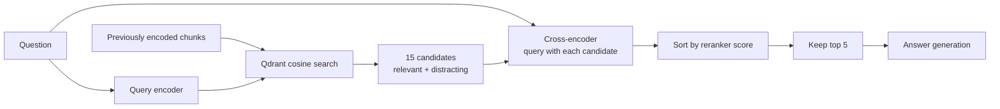

The whiteboard's green and dark chunks show the same idea: retrieval supplies
a candidate pool; reranking changes the order and keeps a smaller set.

### FlashRank implementation

Divesh's tool board (5:05 to 5:06) names the choice for each component. Reranking runs locally with FlashRank. Jina is the hosted alternative that supplies both embeddings and a reranker, which is what the Session 2 deployment switches to. Guardrails use NeMo, and the gateway is Portkey.

<Infographic
  src="/img/enterprise-rag/s1-tool-choices.svg"
  alt="Tool choices in the session"
  caption="Redrawn from the session's whiteboard, 5:05 to 5:06."
/>

`ranking_service.py` creates a `Ranker` on first use, builds passage
dictionaries, calls `rerank`, and returns the top texts.

```python
# Reader note: FlashRank scores only these supplied passages; the collection is not scanned here.
from flashrank import Ranker, RerankRequest

ranker = Ranker(cache_dir="/tmp/flashrank")
passages = [
    {"id": 0, "text": "Horizontal Pod Autoscaler adjusts pod replicas."},
    {"id": 1, "text": "A database query planner chooses a SQL execution plan."},
]
results = ranker.rerank(
    RerankRequest(query="How do I autoscale Kubernetes pods?", passages=passages)
)
for result in results:
    print(result["id"], result["score"], result["text"])
```

**`NOT from session`** `cache_dir` caches model assets; it is not a cache of
retrieved documents or answers. The repository's log and docstring name
different model families while the constructor leaves the model unspecified.
Record the installed FlashRank version and explicitly select a supported model
when making reproducible comparisons.

If reranking raises an exception, the wrapper returns the first `top_n`
documents in the original retrieval order. That keeps the application available,
but the returned answer has lost the reranking step. Inspect the error trace
instead of assuming every answer used a cross-encoder.

### Reranking versus rank fusion

| Operation               | Inputs                                          | Result                          | Used by this retriever? |
| ----------------------- | ----------------------------------------------- | ------------------------------- | ----------------------- |
| Dense retrieval         | Query vector and stored vectors                 | Candidate list                  | Yes                     |
| Cross-encoder reranking | Query and candidate texts                       | New relevance order             | Yes                     |
| Reciprocal rank fusion  | Multiple ranked lists, such as dense and sparse | Combined ranking based on ranks | No                      |

RRF is discussed as another retrieval technique. It does not perform the same
operation as the FlashRank cross-encoder. A hybrid pipeline can fuse dense and
sparse lists, then rerank the combined candidates.

### Doubts · What about code, legal documents and multilingual data? · 04:35–04:57

**Students:** Can one chunker and embedding model handle every domain?

**Paul's discussion:** Code benefits from language/file-aware boundaries. Legal
work may require domain-specific evaluation. Multilingual search may need a
multilingual model or a carefully tested translation step. Metadata filters can
narrow the search space. Graph and sparse retrieval offer other representations.

**`NOT from session`** These are alternatives to evaluate, not components
already implemented here. Graph-based RAG can still use text chunks. SPLADE
produces sparse lexical representations; it should not be described as the same
multi-vector late-interaction mechanism as ColBERT. The distinction becomes
useful in Session 2's visual retrieval discussion.

### Preserve evidence identity

The project converts result objects into strings before reranking and then
stores `CONTENT: ...` strings. This is enough to demonstrate grounding, but
loses source identifiers that a citation UI needs.

**`NOT from session`** Keep a mapping from passage ID to its original result:

```python
def restore_sources(ranked_passages: list[dict], original_results: list[dict], top_n: int = 5):
    return [
        {**original_results[int(item["id"])], "rerank_score": float(item["score"])}
        for item in ranked_passages[:top_n]
    ]
```

Use it immediately after reranking, while IDs still refer to the candidate list.
A source filename, page/chunk ID and document revision let a user verify an
answer; a repeated paragraph alone does not provide that traceability.

**Summary**

- Retrieve broadly enough to include evidence, then rerank a small candidate
  set.
- The project uses 15 candidates and keeps five.
- A reranker cannot recover evidence missing from the candidate set.
- Model caching, answer caching and reranking are different mechanisms.
- Preserve source identity if answers need verifiable citations.

## 9. Define the shared agent state

State is the object you inspect when the application takes the wrong route. Each field has an owner: the planner prepares the search query, the retriever supplies evidence, and the responder creates the answer. The checkpoint retains the merged state between requests with the same thread ID.

**`NOT from session` · Two-turn trace.** Turn one asks “What is a Kubernetes Job?” and stores its user/assistant messages. Turn two asks “How do I run several pods in parallel?” The new user message is appended to the previous messages. The planner can then resolve the follow-up to Kubernetes rather than searching for generic operating-system processes. Current documents must be refreshed for turn two; an earlier answer in history is not a substitute for fresh evidence.

### Complete file: `app/agents/state.py`

```python
# Reader note: Messages accumulate across graph nodes; ordinary state fields are replaced on update.
from typing import TypedDict, List, Annotated
import operator


class AgentState(TypedDict):
    # Using Annotated with operator.add ensures that messages
    # are appended to the history rather than replaced.
    messages: Annotated[List[dict], operator.add]
    current_query: str
    documents: List[str]
    plan: List[str]
    status: str
    final_answer: str
```


`operator.add` is a reducer for the message list. A node can return only its new
assistant message, and LangGraph appends it to the existing messages. Without
understanding that merge rule, it is easy to return the whole history again and
accidentally duplicate it.

The other fields represent current working state. The incoming request resets
documents and the starting plan so stale evidence is not intentionally carried
over as the current retrieval result. Conversation history remains available
through the checkpoint.

### Doubts · Why both `messages` and `final_answer`? · 05:18

**Suraj:** If the assistant's answer is in messages, why store `final_answer`
too?

**Response:** They serve different consumers. `messages` is the history for
later turns. `final_answer` is a convenient output field for the API and
interface. They may contain the same answer text, but are not interchangeable
responsibilities.

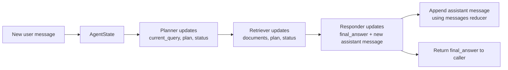

**Summary**

- State is the shared data contract between graph nodes.
- The message reducer appends updates; it does not require a node to return all
  history.
- `documents` is current evidence, while `messages` is conversation history.
- `final_answer` makes the response easy for the API to consume.

## 10. Implement planner, responder and retriever

Before the planner code, Divesh contrasts ordinary software with AI-enabled software (5:22 to 5:24). In rule-based software the developer fixes the order of steps: step 4, then 1, then 2, every time. In an agent, the model decides at run time which function to call next: should I run this one, or that one? The planner below is the smallest version of that idea, choosing between two branches.

<Infographic
  src="/img/enterprise-rag/s1-rules-vs-agent.svg"
  alt="Software → AI-enabled software"
  caption="Redrawn from the session's whiteboard, 5:22 to 5:24."
/>

### 10.1 Planner: decide whether fresh evidence is needed

<Infographic
  src="/img/enterprise-rag/s1-agentic-behaviour.svg"
  alt="Agentic behaviour: let the planner route"
  caption="Redrawn from the session's whiteboard, 5:19 to 5:22."
/>

The planner is a model call with a small output contract: emit `CONVERSATIONAL` or a search query. Its input includes history, so it can turn a context-dependent question into a self-contained search. Its output controls the graph edge, making planner mistakes operationally significant.

On the board (5:19 to 5:22) the planner and the responder are both marked as LLM calls. A casual question, Divesh's example is about coffee, takes the conversational branch straight to the responder. A Kubernetes question takes the technical branch: Qdrant returns 15 unordered candidates, the reranker picks the few relevant ones, and only those reach the responder.

For “What did I ask earlier?”, retrieval would add irrelevant document evidence. For “How do I configure that Job?”, answering from conversation alone could miss an important configuration detail. Inspect `current_query` and `plan` before changing the responder prompt when either symptom occurs.

### Complete file: `app/agents/nodes/planner.py`

```python
# Reader note: The planner chooses a conversational answer or produces a retrieval query.
from app.agents.state import AgentState
from app.config import settings
from langchain_groq import ChatGroq
import logfire

# Direct Groq call — the LLM Gateway (Portkey routing/fallback/caching) arrives in a later stage
llm = ChatGroq(api_key=settings.GROQ_API_KEY, model=settings.GROQ_MODEL, temperature=0)

# Reader note: The route depends on the model output, so repeated questions can still trigger retrieval.
def planner_node(state: AgentState):
    """
    The Planner determines if a search is needed based on the ENTIRE conversation.
    """
    # Get the conversation history (excluding the latest message)
    history = ""
    for msg in state["messages"][:-1]:
        role = "User" if msg["role"] == "user" else "Assistant"
        history += f"{role}: {msg['content']}\n"

    user_message = state["messages"][-1]["content"] if state["messages"] else ""

    prompt = f"""
    You are an intelligent Assistant Planner.
    Analyze the conversation history and the latest user message.

    CONVERSATION HISTORY:
    {history}

    LATEST MESSAGE:
    "{user_message}"

    Task:
    1. If the latest message is a greeting (hi, hello) or a question that can be answered using ONLY the conversation history above (e.g., "what is my name"), respond with 'CONVERSATIONAL'.
    2. If it is a technical question about Kubernetes, Intel, or Networking that requires fresh documentation, output a refined search query.

    Output ONLY 'CONVERSATIONAL' or the search query.
    """

    with logfire.span("🧠 Planner Decision"):
        decision = llm.invoke(prompt).content.strip()
        logfire.info(f"Intent identified: {decision}")

    if decision == "CONVERSATIONAL":
        return {
            "current_query": "CONVERSATIONAL",
            "status": "Handling conversationally (using memory)...",
            "plan": ["Intent: Conversational/Memory", "Retrieval: Skipped"]
        }

    return {
        "current_query": decision,
        "status": f"Technical research needed. Searching for: {decision}",
        "plan": ["Intent: Technical", f"Search Term: {decision}"]
    }
```


The planner reads the previous messages and the latest user message. The prompt
asks for one of two outputs:

- Exactly `CONVERSATIONAL` for greetings or questions answerable from history.
- A refined technical search query when fresh documentation is required.

The technical output is the query text itself, not a literal `TECHNICAL` label.
For example, a follow-up about scaling can become a search about Kubernetes pod
autoscaling with the necessary nouns restored.

The decisive implementation branch is:

```python
# Reader note: This small state update shows the two planner outputs used by the graph route.
def planner_update(decision: str) -> dict:
    decision = decision.strip()
    if decision == "CONVERSATIONAL":
        return {
            "current_query": "CONVERSATIONAL",
            "status": "Handling conversationally (using memory)...",
            "plan": ["Intent: Conversational/Memory", "Retrieval: Skipped"],
        }
    return {
        "current_query": decision,
        "status": f"Technical research needed. Searching for: {decision}",
        "plan": ["Intent: Technical", f"Search Term: {decision}"],
    }
```

In the stage-3 branch, the model call uses `ChatGroq`. Session 2 replaces the
client with `get_langchain_llm(feature="planner")`, retaining the `.invoke()`
interface and the routing contract.

**`NOT from session`** Every other output follows the retrieval path, including
an empty string or explanatory prose that violates the prompt. A small
improvement is to validate the decision and require a nonempty query; a
structured response can make the contract explicit. This is separate from
deciding whether the answer is correct.

### 10.2 Responder: combine history and evidence

The responder has two input channels with different purposes. History explains the conversation; retrieved documents support factual claims. The prompt must preserve that distinction. A previous assistant answer may itself have been wrong, so repeated history is not independent evidence.

Read the context assembly before the model invocation. It accepts chunks until the character budget is exhausted, then constructs messages and calls the model. The returned update contains only the new assistant message because the reducer appends it. Returning the complete history here would duplicate previous messages.

### Complete file: `app/agents/nodes/responder.py`

```python
# Reader note: Build the final answer from conversation history plus the selected evidence.
import logfire
from app.agents.state import AgentState
from app.config import settings
from langchain_groq import ChatGroq

# Direct Groq call — the LLM Gateway (Portkey routing/fallback/caching) arrives in a later stage
llm = ChatGroq(api_key=settings.GROQ_API_KEY, model=settings.GROQ_MODEL, temperature=0.1)


# Reader note: The context is bounded before generation; inspect what was actually included.
def generate_node(state: AgentState):
    """
    Synthesizes a response using both Documentation Context AND Conversation History.
    """
    query = state["current_query"]

    history_str = ""
    for msg in state["messages"][:-1]:
        role = "User" if msg["role"] == "user" else "Assistant"
        history_str += f"{role}: {msg['content']}\n"

    user_msg = state["messages"][-1]["content"] if state["messages"] else ""

    if query == "CONVERSATIONAL":
        logfire.info("Generating conversational response using memory.")
        prompt = f"""
        You are a friendly and helpful Enterprise AI Assistant.
        Answer the user's latest message using the CONVERSATION HISTORY below.

        CONVERSATION HISTORY:
        {history_str}

        LATEST MESSAGE:
        "{user_msg}"
        """
    else:
        logfire.info("Generating technical RAG response.")
        max_context_chars = 25000
        full_context = ""

        for doc in state["documents"]:
            if len(full_context) + len(doc) < max_context_chars:
                full_context += doc + "\n\n"
            else:
                logfire.warning("Context truncated to fit Groq TPM limits.")
                break

        prompt = f"""
        You are a Senior Technical Architect.
        Answer the question using the TECHNICAL CONTEXT provided.

        TECHNICAL CONTEXT:
        {full_context}

        CONVERSATION HISTORY:
        {history_str}

        USER QUESTION:
        "{user_msg}"
        """

    with logfire.span("✍️ LLM Synthesis"):
        try:
            content = llm.invoke(prompt).content
            logfire.info("✅ Response synthesised via LLM.")

            return {
                "final_answer": content,
                "status": "Response generated.",
                "plan": state["plan"],
                "messages": [{"role": "assistant", "content": content}]
            }

        except Exception as e:
            logfire.error(f"LLM Generation failed: {e}")
            raise e
```


The conversational prompt uses the conversation history and latest message. The
technical prompt adds the retrieved context and asks for a senior technical
architect's answer using it.

The code accumulates documents up to `max_context_chars = 25000`. It stops when
another document would exceed that bound. It then sends the prompt to the model
and returns the generated content as both `final_answer` and a new assistant
message.

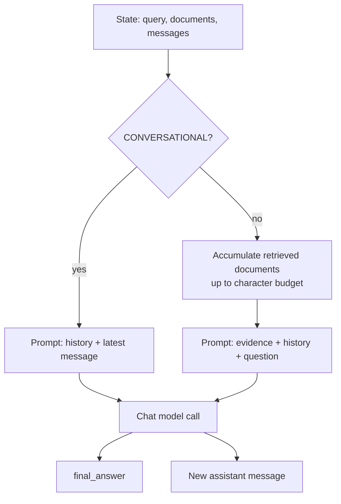

**`NOT from session`** The character cap does not budget the whole request.
History and prompt text also consume tokens, and token-per-minute quotas are
different from a model's context-window limit. A robust budget reserves output
tokens, counts history and instructions, then selects evidence within the
remaining input allowance. If the first document is oversized, this loop can
stop before adding any context.

The prompt also needs an explicit behaviour when the evidence is insufficient.
Otherwise a capable model may fill gaps using prior knowledge while the
interface makes the answer look grounded.

### 10.3 Retriever: connect search to reranking

### Complete file: `app/agents/nodes/retriever.py`

```python
# Reader note: Retrieve candidates first, rerank them second, and write the selected context to state.
import logfire
from app.agents.state import AgentState
from app.services.retrieval.qdrant_service import search_enterprise_knowledge
from app.services.retrieval.ranking_service import rerank_documents

# Reader note: The first-stage search can return more candidates than the final answer receives.
def retrieve_node(state: AgentState):
    """
    Performs vector search and semantic reranking for technical queries.
    """
    query = state["current_query"]

    with logfire.span("🔍 Knowledge Retrieval"):
        logfire.info(f"Searching Qdrant for: {query}")
        raw_results = search_enterprise_knowledge(query, limit=15)
        logfire.info(f"Retrieved {len(raw_results)} candidates from Vector DB")

        doc_contents = [doc['content'] for doc in raw_results]

        with logfire.span("⚖️ Semantic Reranking"):
            reranked_contents = rerank_documents(query, doc_contents, top_n=5)
            logfire.info("Reranking complete. Kept top 5 most relevant chunks.")

        formatted_docs = [f"CONTENT: {doc}" for doc in reranked_contents]

    return {
        "documents": formatted_docs,
        "status": f"Found technical context.",
        "plan": state["plan"] + ["Context Retrieved"]
    }
```


The complete central operation in `retrieve_node` is small enough to follow in
one pass:

```python
# Reader note: The snippet preserves the search-then-rerank order of the full retriever file.
from app.services.retrieval.qdrant_service import search_enterprise_knowledge
from app.services.retrieval.ranking_service import rerank_documents


def retrieve_node(state):
    query = state["current_query"]
    raw_results = search_enterprise_knowledge(query, limit=15)
    contents = [document["content"] for document in raw_results]
    selected = rerank_documents(query, contents, top_n=5)
    return {
        "documents": [f"CONTENT: {text}" for text in selected],
        "status": "Found technical context.",
        "plan": state["plan"] + ["Context Retrieved"],
    }
```

The original wraps search and reranking in Logfire spans. It does not implement
query decomposition, multi-hop search, a retrieval retry loop or tool selection
among dozens of tools. The planner makes a single conditional decision in this
graph.

**`NOT from session`** The search service catches errors and returns an empty
list. That conflates “no matching evidence” with “database unavailable”.
Preserve a separate error state so the responder does not turn a service outage
into an unsupported answer.

**Summary**

- The planner returns a route marker or a rewritten query.
- The responder has separate conversation and evidence-grounded prompt paths.
- The retriever connects 15-candidate search to five-chunk reranking.
- Validate planner outputs, budget all prompt tokens, and distinguish empty
  retrieval from failures.

## 11. Compile the graph and attach conversation memory

<Infographic
  src="/img/enterprise-rag/s1-graph-loop.svg"
  alt="Entry point → planner"
  caption="Redrawn from the session's whiteboard, 5:44 to 5:45."
/>

The graph encodes the allowed workflow; the planner's output chooses one of its permitted branches. There is no open-ended tool loop in this application. The technical path is planner → retriever → responder; the conversational path skips the retriever.

A checkpointer associates state with a thread ID. Reusing that ID continues the conversation. Generating a new ID starts a separate conversation. Running two API processes with independent `MemorySaver` instances does not create shared memory, which motivates PostgreSQL checkpoints in Session 2.

### Complete file: `app/agents/graph.py`

```python
# Reader note: Wire node transitions and checkpoint state under a conversation thread ID.
from langgraph.graph import StateGraph, END
from langgraph.checkpoint.memory import MemorySaver
from app.agents.state import AgentState
from app.agents.nodes.planner import planner_node
from app.agents.nodes.retriever import retrieve_node
from app.agents.nodes.responder import generate_node


# 1. Initialize the State Graph
workflow = StateGraph(AgentState)


# 2. Define the Nodes
workflow.add_node("planner", planner_node)
workflow.add_node("retriever", retrieve_node)
workflow.add_node("responder", generate_node)

# 3. Define the Edges & Routing Logic
# Reader note: This branch checks the planner decision stored in graph state.
def route_planner(state: AgentState):
    """
    Routes the workflow based on the planner's decision.
    """
    if state["current_query"] == "CONVERSATIONAL":
        return "responder"
    return "retriever"

workflow.set_entry_point("planner")


# Conditional Edge: Planner -> Router -> (Retriever OR Responder)
workflow.add_conditional_edges(
    "planner",
    route_planner,
    {
        "retriever": "retriever",
        "responder": "responder"
    }
)


workflow.add_edge("retriever", "responder")
workflow.add_edge("responder", END)


# --- MEMORY UPGRADE ---
# MemorySaver allows the agent to remember conversations based on 'thread_id'
checkpointer = MemorySaver()


# 4. Compile the Graph with Memory
rag_agent = workflow.compile(checkpointer=checkpointer)
```


The part of `graph.py` that registers the three nodes, their edges and the
checkpointer:

```python
# Reader note: The graph uses an in-memory checkpointer keyed by thread ID.
from langgraph.graph import END, StateGraph
from langgraph.checkpoint.memory import MemorySaver
from app.agents.state import AgentState
from app.agents.nodes.planner import planner_node
from app.agents.nodes.retriever import retrieve_node
from app.agents.nodes.responder import generate_node

workflow = StateGraph(AgentState)
workflow.add_node("planner", planner_node)
workflow.add_node("retriever", retrieve_node)
workflow.add_node("responder", generate_node)
workflow.set_entry_point("planner")


def route_planner(state):
    return "responder" if state["current_query"] == "CONVERSATIONAL" else "retriever"

workflow.add_conditional_edges(
    "planner", route_planner,
    {"retriever": "retriever", "responder": "responder"},
)
workflow.add_edge("retriever", "responder")
workflow.add_edge("responder", END)
rag_agent = workflow.compile(checkpointer=MemorySaver())
```

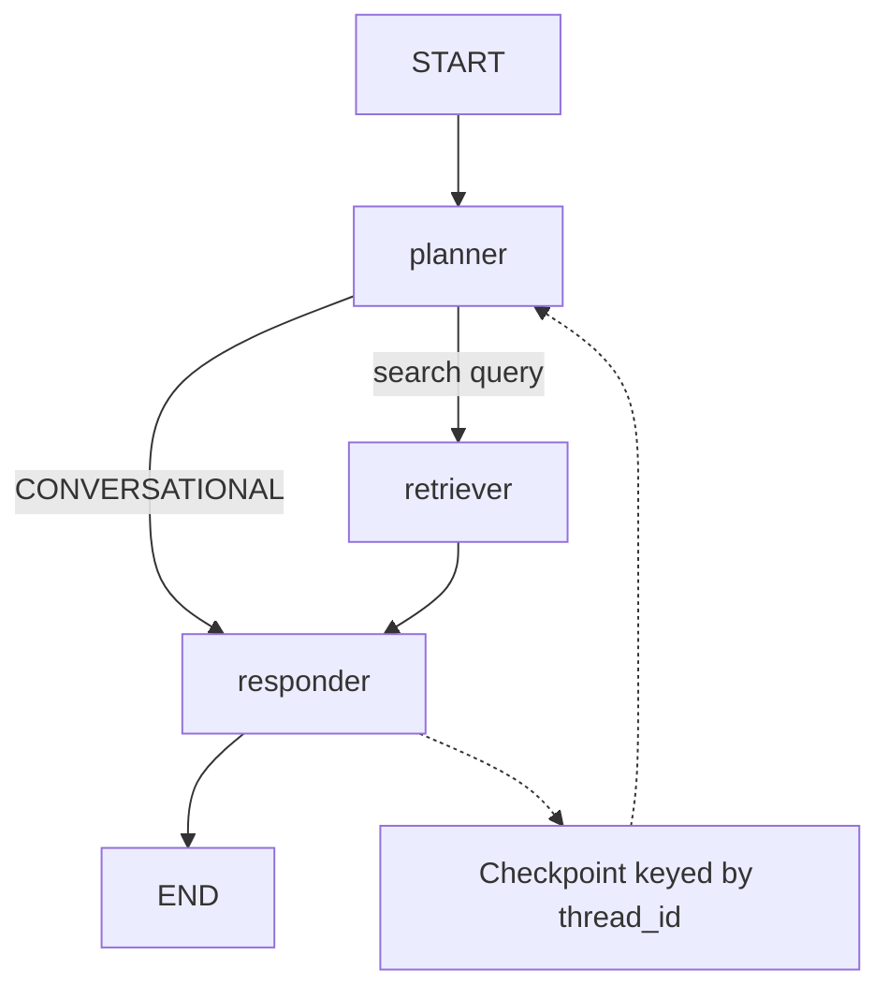

The session compares the thread ID to the ID in a chat app's URL: it groups
the turns of one conversation. It does not authenticate the caller or prove
that they own the conversation.

### What memory means here

| Mechanism                  | Stores                         | Lifetime / purpose             |
| -------------------------- | ------------------------------ | ------------------------------ |
| Qdrant                     | Document vectors and payloads  | Persistent knowledge retrieval |
| `MemorySaver`              | Graph checkpoints and messages | Current Python process         |
| Streamlit session state    | UI messages and thread ID      | UI session                     |
| Gateway cache, added later | Reusable model responses       | Depends on cache configuration |

The memory board (5:39 to 5:44) puts this checkpointer in a wider picture. What the graph keeps is **conversational memory**, a buffer of recent turns; longer-lived memory splits into **episodic** memory (what happened in earlier sessions) and **semantic** memory (facts learnt about the user or domain). Divesh numbers the turns, user 1, AI 1, user 2, AI 2, and says a conversation window typically holds about 10 to 15 of them. For production-grade long-term memory he names mem0, LangMem and Neo4j as a graph database.

<Infographic
  src="/img/enterprise-rag/s1-memory.svg"
  alt="Conversational memory"
  caption="Redrawn from the session's whiteboard, 5:39 to 5:44."
/>

**`NOT from session`** `MemorySaver` does not automatically forget after 10 or
15 questions. A process restart loses its in-memory checkpoints. Separately, an
increasingly long history can exceed the model's context or quota budget.
Persistent storage solves durability; trimming or summarisation solves prompt
growth.

**Summary**

- Both graph paths end at the responder.
- Reusing a thread ID resumes a conversation checkpoint.
- In-memory checkpoints disappear on process restart.
- Storage durability, model context length and cache reuse are separate
  concerns.

## 12. Expose the application through FastAPI

The API converts an HTTP request into an initial graph update and converts the graph's final state into JSON. Keep these contracts distinct: the external request has `q` and `thread_id`; internal state has messages, query, documents, plan, status and answer.

Divesh's board (5:46 to 5:49) reduces the backend to two functions in `main.py`. The **query** function triggers the graph; the **graph** function shows it.

<Infographic
  src="/img/enterprise-rag/s1-fastapi.svg"
  alt="main.py → FastAPI backend"
  caption="Redrawn from the session's whiteboard, 5:46 to 5:49."
/>

Follow one request through the file: validate its shape, choose the checkpoint thread, initialise current-turn fields, invoke the graph, and return the answer plus diagnostic context. The `sources` field currently contains retrieved text strings, so the name does not imply verified document citations.

### Complete file: `app/main.py`

```python
# Reader note: The API is the entry point: validate a request, invoke the graph, and return its route and answer.
# ============================================================
# CRITICAL: logfire MUST be configured before ALL other imports
# so that spans from all modules are captured from the start.
# ============================================================
import logfire
import os
from dotenv import load_dotenv

load_dotenv()
logfire.configure(token=os.getenv("LOGFIRE_TOKEN"))

# Now safe to import app modules - logfire is already active
from fastapi import FastAPI, Response
from app.agents.graph import rag_agent

from pydantic import BaseModel
from typing import Optional


# Initialize FastAPI
app = FastAPI(title="Enterprise Agentic RAG API")


class QueryRequest(BaseModel):
    q: str
    thread_id: Optional[str] = "default_user"


@app.get("/")
def home():
    return {"message": "Enterprise LangGraph RAG API is live."}


@app.get("/graph")
def get_graph_image():
    """
    Returns the Mermaid image of the agent's workflow.
    """
    try:
        png_bytes = rag_agent.get_graph().draw_mermaid_png()
        return Response(content=png_bytes, media_type="image/png")
    except Exception as e:
        return {"error": f"Could not generate graph image: {e}"}


@app.post("/query")
# Reader note: A thread ID selects conversation history; callers must not share one across users.
def query(request: QueryRequest):
    """
    Executes the LangGraph RAG flow with memory using a POST request.
    """
    q = request.q
    thread_id = request.thread_id

    initial_state = {
        "messages": [{"role": "user", "content": q}],
        "current_query": q,
        "documents": [],
        "plan": ["Start"],
        "status": "Initializing Graph..."
    }

    # Configuration for Memory (Thread ID)
    config = {"configurable": {"thread_id": thread_id}}

    try:
        final_output = rag_agent.invoke(initial_state, config=config)

        return {
            "question": q,
            "answer": final_output.get("final_answer"),
            "thought_process": final_output.get("plan"),
            "status": final_output.get("status"),
            "sources": final_output.get("documents", [])
        }
    except Exception as e:
        logfire.error(f"❌ Backend Execution Failed: {e}")
        return {
            "question": q,
            "answer": "I apologize, but I encountered an internal error while processing your request. Please try again later.",
            "thought_process": ["Error encountered during execution."],
            "status": "error",
            "sources": []
        }
```


`app/main.py` defines the request model and passes a new user message into the
graph. The relevant request shape is:

```json
{
  "q": "How do I autoscale Kubernetes pods?",
  "thread_id": "local-rag-demo-1"
}
```

The graph receives the message, reset working fields and a checkpoint
configuration:

```python
initial_state = {
    "messages": [{"role": "user", "content": question}],
    "current_query": question,
    "documents": [],
    "plan": ["Start"],
    "status": "Initializing Graph...",
}
config = {"configurable": {"thread_id": thread_id}}
# Inside the endpoint, with the compiled project graph:
# final_output = rag_agent.invoke(initial_state, config=config)
```

The returned object maps `final_answer` to `answer`, `plan` to
`thought_process`, and `documents` to `sources`. Here `thought_process` is a
list of application route/status labels; it is not access to the model's hidden
reasoning.

Start the backend and open its interactive API documentation:

```bash
uvicorn app.main:app --reload --port 8000
# Open http://localhost:8000/docs
```

From another terminal:

```bash
curl -sS http://localhost:8000/query \
  -H 'Content-Type: application/json' \
  -d '{"q":"What is a Kubernetes pod?","thread_id":"local-rag-demo-1"}'

curl -sS http://localhost:8000/query \
  -H 'Content-Type: application/json' \
  -d '{"q":"What was my previous question?","thread_id":"local-rag-demo-1"}'
```

Use the same thread for the follow-up, then repeat it with a new thread to
observe isolation. The response text is generated, so inspect the route and
evidence rather than expecting a byte-for-byte fixed answer.

### Doubts · What does the thread ID do? · 05:52

**Host explanation:** It groups messages like the identifier of a chat
conversation. The same ID lets the graph recover earlier messages.

**`NOT from session`** The request model defaults to `default_user`. Multiple
clients that omit the field can share that checkpoint. Generate an ID per
conversation and, in an authenticated application, bind it to the authenticated
user's allowed conversations. A UUID alone is not authorisation.

### API failure semantics

<Infographic
  src="/img/enterprise-rag/s1-rendered-graph.svg"
  alt="GET /graph: the compiled LangGraph"
  caption="Redrawn from the app's GET /graph browser render, 6:03."
/>

The teaching application returns a structured error object from its exception
handler, but can still send HTTP 200. An HTTP client therefore cannot rely only
on `raise_for_status()` to detect a failed RAG request.

**`NOT from session`** Return an appropriate non-2xx status for infrastructure
failures and preserve a request ID for debugging. Session 2's deployment fork
changes the main failure response to HTTP 500 with a generic message.

`GET /graph` returns a rendered representation of the graph. It helps verify
that the compiled flow matches the design, but it does not exercise retrieval or
prove that credentials work.

**Summary**

- `/query` is the main application endpoint.
- Reuse a thread for follow-ups and change it for a new conversation.
- The response exposes route labels and retrieved strings, not hidden model
  reasoning.
- A useful API distinguishes successful answers, handled refusals and service
  failures.

## 13. Trace the whole request with Logfire

Divesh defines three terms on the board before opening Logfire (6:12 to 6:16). A **span** is one unit of execution; LangSmith calls the same thing a *run*. A **trace** is the whole record of one application request. The **waterfall** is the timeline view of a trace's spans.

<Infographic
  src="/img/enterprise-rag/s1-observability.svg"
  alt="Observability: span, trace, waterfall"
  caption="Redrawn from the session's whiteboard, 6:12 to 6:16."
/>

A slow answer can result from embedding, database search, model download,
reranking or generation. A single total-duration log does not reveal which one
caused the delay. Logfire spans let you view these operations in a request
timeline.

The application configures Logfire early, before work in imported modules
begins. In the local walkthrough, authenticate/configure the project through the
Logfire setup flow, then run the backend and send a request.

```bash
logfire auth
```

The code uses nested spans around operations:

```python
# Reader note: Child spans appear under the parent query span in the trace waterfall.
import logfire

logfire.configure(service_name="enterprise-rag-demo")
with logfire.span("query", thread_id="trace-demo"):
    with logfire.span("retrieval", candidate_limit=15):
        logfire.info("Inspect the actual search operation here")
    with logfire.span("reranking", retained_chunks=5):
        logfire.info("Inspect the actual reranker operation here")
```

This standalone example demonstrates span nesting without calling providers. In
the application, the real retrieval and model operations run inside those
scopes.

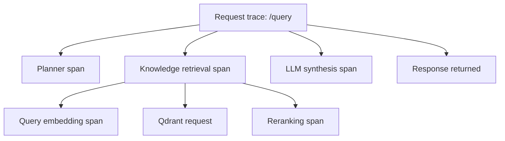

**`NOT from session`** A trace contains spans; nested operations are normally
child spans, not separate nested traces. Cross-service continuity requires
propagation of trace context. The teaching UI's requests instrumentation is
commented out, so do not assume the UI and backend automatically form one
distributed trace.

| Tool                | What it helps inspect here                                         |
| ------------------- | ------------------------------------------------------------------ |
| Logfire             | Application operations, exceptions and latency across the pipeline |
| LangSmith           | LangChain/LangGraph runs, prompts, outputs and node behaviour      |
| Portkey logs, later | Provider requests, routing, cache and gateway metadata             |

The first two rows come from an earlier board (5:03 to 5:05): trace the *application's* execution with Logfire, and the *LLM's* with LangSmith, whose graph view is LangGraph Studio. LangChain and LangGraph calls report to LangSmith directly.

<Infographic
  src="/img/enterprise-rag/s1-trace-tools.svg"
  alt="Trace execution of…"
  caption="Redrawn from the session's whiteboard, 5:03 to 5:05."
/>

### Read the waterfall diagnostically

For the first request, a long reranker span may include model download and
initialisation. Compare it with a warm request before concluding that every
request pays that cost. A long synthesis span with a rate-limit error points to
a provider/quota problem. A fast empty retrieval can be a hidden database
failure if the service converts exceptions into `[]`.

**`NOT from session`** Avoid logging full confidential documents and credentials
just to make traces detailed. Source IDs, lengths, timings and controlled
samples often answer the debugging question with less exposure.

**Summary**

- Use spans to attribute latency and failures to a stage.
- Compare cold and warm requests.
- Logs, application traces, graph traces and gateway logs answer different
  questions.
- Trace visibility does not itself prove that the answer is correct.

## 14. Build the Streamlit conversation interface

The UI keeps display history in Streamlit session state and sends a separate thread ID to the backend. These are two different stores. Clearing the visible chat creates a new backend thread; it does not erase records belonging to the old thread.

The complete file below makes one blocking HTTP request per user turn. Its character-by-character display happens after the JSON response arrives. This matters when investigating latency: animating an already completed answer does not reduce the time spent waiting for retrieval and model generation.

### Complete file: `ui/app.py`

```python
# Reader note: Keep Streamlit display state separate from the graph checkpoint stored by the API.
import os
import streamlit as st
import requests
import time
import uuid
import logfire
from dotenv import load_dotenv


# Load environment variables explicitly from the root directory
env_path = os.path.abspath(os.path.join(os.path.dirname(__file__), "..", ".env"))
load_dotenv(dotenv_path=env_path)


# Initialize Logfire
try:
    token = os.getenv("LOGFIRE_TOKEN")
    if not token:
        print("ERROR: LOGFIRE_TOKEN is empty or None!")
    logfire.configure(token=token)
    # logfire.instrument_requests() # Disabled due to OpenTelemetry bug on Windows: MeterProvider.get_meter() got multiple values for argument 'version'
    LOGFIRE_STATUS = "Connected & Tracing"
except Exception as e:
    print(f"Logfire Init Error in UI: {e}")
    LOGFIRE_STATUS = f"Standby (Error: {e})"
    


# --- PAGE CONFIG ---
st.set_page_config(
    page_title="Enterprise Agentic RAG",
    page_icon="🤖",
    layout="wide",
)

# --- AVATARS ---
AI_AVATAR = "🤖"
USER_AVATAR = "👤"


# --- SESSION MANAGEMENT ---
if "session_id" not in st.session_state:
    st.session_state.session_id = str(uuid.uuid4())
    logfire.info(f"✨ New User Session Created: {st.session_state.session_id}")

if "messages" not in st.session_state:
    st.session_state.messages = []


# --- SIDEBAR ---
with st.sidebar:
    st.title("🧠 Agent OS")
    st.markdown("---")
    st.success(f"Logfire: {LOGFIRE_STATUS}")
    st.info(f"Memory ID: {st.session_state.session_id[:8]}")
    
    if st.button("🗑️ Clear History & Memory", width="stretch", type="primary"):
        logfire.warn(f"🗑️ Memory Wipe Triggered for session: {st.session_state.session_id}")
        st.session_state.messages = []
        st.session_state.session_id = str(uuid.uuid4())
        st.rerun()

# --- MAIN CHAT ---
st.title("🤖 Enterprise Agentic Assistant")


# Display history
for message in st.session_state.messages:
    avatar = AI_AVATAR if message["role"] == "assistant" else USER_AVATAR
    with st.chat_message(message["role"], avatar=avatar):
        st.markdown(message["content"])

# Chat Input
if prompt := st.chat_input("Ask about your documentation..."):
    # START TRACE: User Interaction
    with logfire.span("💬 User Chat Interaction", user_query=prompt, session_id=st.session_state.session_id):
        
        st.session_state.messages.append({"role": "user", "content": prompt})
        with st.chat_message("user", avatar=USER_AVATAR):
            st.markdown(prompt)

        # Assistant Response
        with st.chat_message("assistant", avatar=AI_AVATAR):
            with st.status("🔍 Agent is thinking...", expanded=True) as status:
                try:
                    # DISTRIBUTED TRACE: Calling Backend
                    with logfire.span("📡 Calling RAG Backend"):
                        # Get backend URL from env, or default to local if not set
                        base_url = os.getenv("BACKEND_URL", "http://localhost:8000")
                        url = f"{base_url}/query"
                        payload = {"q": prompt, "thread_id": st.session_state.session_id}
                        response = requests.post(url, json=payload, timeout=60)
                        data = response.json()
                    
                    # Show Reasoning Steps from Backend
                    steps = data.get("thought_process", [])
                    for step in steps:
                        st.write(f"⚙️ {step}")
                    
                    status.update(label="✅ Answer Synthesized", state="complete", expanded=False)
                    
                    # --- SHOW SOURCES (NESTED EXPANDABLES) ---
                    sources = data.get("sources", [])
                    if sources:
                        with st.expander("📄 View Retrieved Context (Sources)"):
                            for i, source in enumerate(sources):
                                # Create a preview title for each chunk
                                preview = source[:100].replace("\n", " ") + "..."
                                with st.expander(f"Chunk {i+1}: {preview}"):
                                    st.info(source)
                except Exception as e:
                    logfire.error(f"❌ UI-Backend Connection Failed: {e}")
                    status.update(label="❌ Connection Failed", state="error")
                    st.error("Backend Offline.")
                    st.stop()

            # Final Answer Streaming
            answer_placeholder = st.empty()
            full_answer = data.get("answer", "No response.")
            
            curr_text = ""
            for char in full_answer:
                curr_text += char
                answer_placeholder.markdown(curr_text + "▌")
                time.sleep(0.005)
            
            answer_placeholder.markdown(full_answer)
            st.session_state.messages.append({"role": "assistant", "content": full_answer})
            logfire.info("✅ Chat cycle completed successfully.")
```


`ui/app.py` owns the browser-session experience. It creates a UUID for the
conversation, stores messages in `st.session_state`, posts the latest question
to the API, and renders the answer along with the application route and sources.

```bash
streamlit run ui/app.py
# Open http://localhost:8501 while FastAPI remains running on port 8000.
```

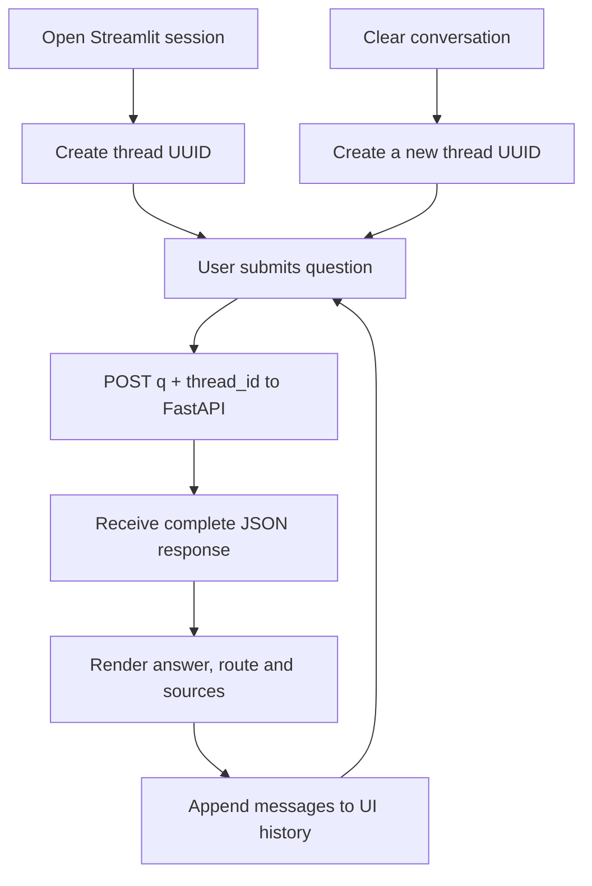

The UI waits up to 60 seconds for each API response.

**`NOT from session`** The typing effect is simulated display streaming, not
server token streaming. A timeout may occur while the backend is still working. If real
streaming is required later, the API and client must use a streaming protocol
and handle cancellation and partial responses.

### A failure worth reproducing: identity override

The demonstration asks the assistant to adopt the identity of a YouTuber. The
unguarded assistant follows the instruction, and the conversation history can
keep that unwanted identity active in later turns. A subsequent technical
question does not automatically repair the earlier instruction-following
mistake.

This is the transition into guardrails: memory preserves useful context, but it
can also preserve harmful or misleading context. A chat interface that remembers
everything has not automatically become a safer assistant.

**Summary**

- Streamlit keeps UI history and a conversation ID.
- The backend remains responsible for retrieval and generation.
- The typing effect is not network streaming.
- Conversation memory can preserve a bad instruction as well as a useful fact.

## 15. Explore guardrails through the HR and technical demos

<Infographic
  src="/img/enterprise-rag/s1-security-guardrails.svg"
  alt="LLM security: guardrails enforce policy"
  caption="Redrawn from the session's whiteboard, 6:49 to 6:51."
/>

Open the supplied
[HR guardrail demonstration](https://guardthisrag.streamlit.app/) and
[technical guardrail demonstration](https://guardrailz.streamlit.app/). Their
purpose is to make allowed, blocked and bypassed interactions visible.

### 15.1 HR policies make the boundary concrete

The AcmeCorp examples include remote-work eligibility after a 90-day probation
period and a vacation request submitted ten business days in advance. A correct
HR answer should use those policy facts. A request for pancakes or Netflix
recommendations is outside that assistant's scope.

The HR demo's own "What this demo shows" panel (6:38) lays out its pipeline in four stages, and its sidebar warns that every message makes **two** separate LLM calls. Its knowledge base is six HR documents, cut into segments of about 500 characters and indexed in FAISS with `BAAI/bge-small-en-v1.5` embeddings.

<Infographic
  src="/img/enterprise-rag/s1-hr-policy.svg"
  alt="HR Policy Assistant: NeMo + FAISS RAG"
  caption="Redrawn from the HR Policy Assistant demo app, 6:38 to 6:42."
/>

The demonstration also explores sensitive information and attempts to change the
assistant's identity. The guarded version is not perfectly immune: a bypass is
observed. Preserve that outcome when evaluating the design. A framework
installation is not a proof that every malicious prompt is rejected.

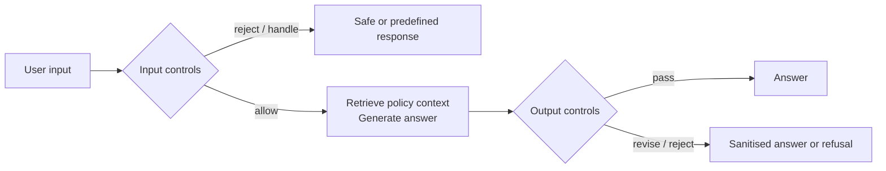

Divesh's compact version of the same idea (6:52 to 6:55) is one line: user → g → LLM → g → user, a guardrail on each side of the model. The input side catches things like PII typed into the question. He describes NeMo Guardrails as still developing, though its output is clean.

<Infographic
  src="/img/enterprise-rag/s1-input-output-rails.svg"
  alt="Input and output rails"
  caption="Redrawn from the session's whiteboard, 6:52 to 6:55."
/>

This redraw represents the input/output guardrail concept. The main project
integration in Session 2 implements an input/dialogue gate before the graph; it
does not automatically implement every output control shown here.

### 15.2 Distinguish the controls

| Control                 | Question it answers                                          | Example explored                                 |
| ----------------------- | ------------------------------------------------------------ | ------------------------------------------------ |
| Topic restriction       | Is the request within the assistant's supported domain?      | Kubernetes question versus entertainment request |
| Jailbreak handling      | Is the user trying to override the assistant's instructions? | “Forget your system prompt”                      |
| Dialogue handling       | Is this a known conversational interaction?                  | Greeting, farewell, capabilities                 |
| Sensitive-data handling | Should particular information be withheld or transformed?    | Personal information in a request/response       |
| Output control          | Is the proposed answer suitable to return?                   | Sanitisation or refusal after generation         |

The technical demo, *NeMo Guardrails Classroom* (6:47 to 7:08), stacks these controls one experiment at a time: a baseline with no protection, then input rails (topic guard, jailbreak shield, sensitive-topic block, dialog rails), custom actions and output rails. Its guard model is Llama 3.3 70B. It starts from the problem, a raw LLM with no filtering:

<Infographic
  src="/img/enterprise-rag/s1-progressive-rails.svg"
  alt="NeMo Guardrails Classroom"
  caption="Redrawn from the NeMo Guardrails Classroom demo app, 6:47 to 7:08."
/>

The topic guard adds the first branch: an intent check (LLM call 1) refuses off-topic messages and passes the rest to the answer model (LLM call 2). By the dialog-rails experiment the same intent check has five branches, shown in the third panel of the NeMo Guardrails Classroom board above.

Output rails fire after the model answers and before the user sees it. In the demo, a message containing an API token or a card number is blocked as sensitive, and a request to "write a config snippet where api_key=abc123xyz" gets its answer withheld by the output rail.

An on-topic request can still be unsafe. A request to compromise a cluster
contains Kubernetes terms, but topic matching alone does not decide whether the
requested action is appropriate. Likewise, a greeting handled by a dialogue rule
is not an attack.

### 15.3 Colang: user intent, bot response and flow

<Infographic
  src="/img/enterprise-rag/s1-colang.svg"
  alt="Rails in Colang: define user, bot and flow"
  caption="Redrawn from the session's Colang demonstration, 7:09 to 7:16."
/>

The rule structure separates examples of user utterances from the bot's response
and the sequence connecting them:

```text
# Colang structure illustrated by the session's rules.
define user express greeting
  "hi"
  "hello"

define bot express greeting
  "Hello! I can help with enterprise technical questions."

define flow greeting
  user express greeting
  bot express greeting
```

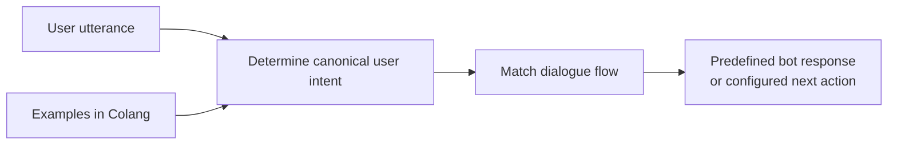

**`NOT from session`** NeMo's standard intent flow retrieves similar examples
and uses an LLM to determine a canonical intent; configuration can change that
behaviour. It is not simply an exact string lookup. FastEmbed is an embedding
library, not the vector database itself.
[NeMo's architecture](https://docs.nvidia.com/nemo/guardrails/0.18.0/architecture/README.html)
explains the intent and flow stages.

The next two boards (7:16 to 7:19) answer how the matching works and what the alternative is. NeMo embeds the user message and the Colang example sentences with **FastEmbed**, locally, so no separate database, authentication or endpoint is needed for that step. **Llama Guard** takes a different approach: it is itself a model trained for safety, and its verdict is binary, safe or unsafe, which a rail can act on.

<Infographic
  src="/img/enterprise-rag/s1-fastembed-llama-guard.svg"
  alt="Intent matching and safety classification"
  caption="Redrawn from the session's whiteboard, 7:16 to 7:19."
/>

### Doubts · Which production guardrail tools can be used? · 06:54

**Host question:** What options exist beyond this demonstration?

**Discussion:** NeMo Guardrails, Guardrails AI and managed controls such as
Amazon Bedrock Guardrails are raised. The relevant decision is which controls
the application needs and whether those controls work on its real traffic.

### Doubts · What happens after rotating a key? · 07:08

**Harsh:** How does key rotation affect the application?

**Response:** Update the credential used by the service.

**`NOT from session`** In this repository, settings are loaded into the running
process. Updating `.env` alone does not guarantee an already constructed client
sees the new value; restart/recreate the relevant client and verify the old
credential has been revoked where intended.

### Host interaction · What should come next? · 07:19

The host offers to integrate guardrails immediately or continue to the new
gateway topic. The audience chooses gateways. Therefore the application
checkpoint at the end of this session is still the reranking/memory stage;
Session 2 performs the guardrail integration.

**Summary**

- Test topic restrictions, instruction overrides, sensitive data and dialogue
  separately.
- An on-topic request can still require refusal.
- Colang connects user intents to dialogue flows and bot actions.
- The demo includes bypasses; no absolute safety claim follows from installing a
  framework.
- Main-project guardrail integration happens in Session 2.

## 16. Put model access behind an LLM gateway

The gateway discussion begins with a practical failure: a model request hits a
quota or provider error. If each application directly embeds provider-specific
retry and routing logic, the same policy gets copied into many places. A gateway
centralises model access and request policy.

The gateway was first sketched early on (0:28 to 0:31), during the architecture tour: many clients, one gateway, several providers behind it.

<Infographic
  src="/img/enterprise-rag/s1-gateway-sketch.svg"
  alt="Why an LLM gateway?"
  caption="Redrawn from the session's whiteboard, 0:28 to 0:31."
/>

The rest of this section follows the dedicated gateway discussion. It opens (7:21) on the gateway app's home page, which frames the choice in two words. Calling a model directly, you are **blind**: no logs, no retries, no fallback, no caching. Through a gateway you have **full control** over all four, transparently to the application. Divesh's one-line definition on the board (7:29) is a backup layer in front of the LLMs.

<Infographic
  src="/img/enterprise-rag/s1-gateway-intro.svg"
  alt="What is an LLM gateway?"
  caption="Redrawn from the LLM Gateway Explorer app, 7:21, and the session's whiteboard, 7:29."
/>

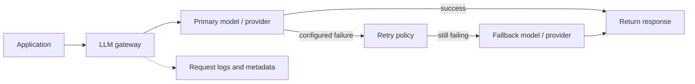

Portkey, LiteLLM, Bifrost and Cloudflare's gateway are discussed as options. The
hands-on demonstration uses [Portkey](https://portkey.ai/) and the supplied
[gateway app](https://letsgateway.streamlit.app/).

### Routing, fallback and load balancing are different

| Policy                  | Decision                              | Example in the discussion                               |
| ----------------------- | ------------------------------------- | ------------------------------------------------------- |
| Task routing            | Which model fits this request?        | Coding question versus support question                 |
| Fallback                | What should happen after a failure?   | Try another model when the first route fails            |
| Weighted load balancing | How should traffic be distributed?    | 70/30, then 50/50 across two targets                    |
| Retry                   | Should this operation be tried again? | Transient quota/server failures within a bounded policy |

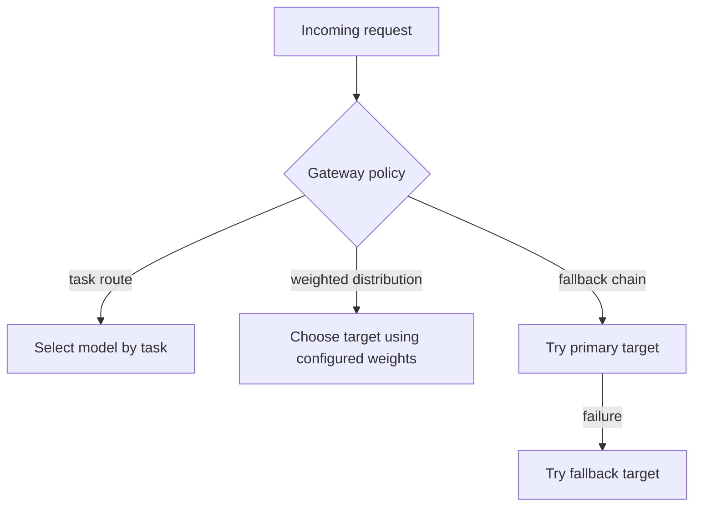

The board behind this table (7:35 to 7:38) is headed *fault tolerant, robust*. One gateway fans out to several providers, OpenAI, Gemini, Anthropic and an open-source model, so that one failing provider doesn't take the service down. For task routing, Divesh's example is a deep-research request going to a reasoning model and a request to write a mail going to a small open-source model. Who decides which is which? Either the UI, with a button the user presses, or the planner.

<Infographic
  src="/img/enterprise-rag/s1-gateway-routing.svg"
  alt="Fault tolerant, robust: fallback and model routing"
  caption="Redrawn from the session's whiteboard, 7:35 to 7:38."
/>

The demonstration intentionally uses invalid target slugs to trigger a fallback.
It then makes both targets invalid and observes failure. Some errors are not
immediately visible in the dashboard during the demo, so the dashboard behaviour
should not be presented as a fully verified monitoring guarantee.

### Provider credentials and slugs

The gateway stores provider integration credentials. The application uses a
gateway key and refers to configured integrations through slugs such as `rag`
and `brag`. An integration slug is a routing identifier; it is not the provider
secret itself.

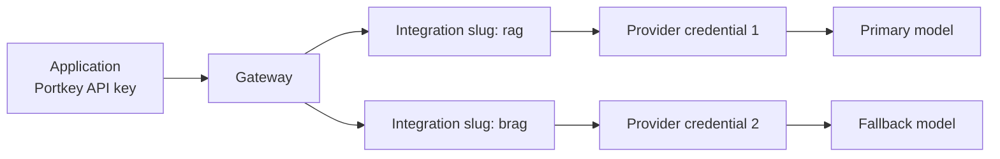

The virtual-keys board (7:45 to 7:53) draws the before and after. Without a gateway, ten provider API keys sit in the application's `.env`. With one, the application holds a single gateway key, and the gateway maps named virtual keys, Divesh's xyz, abc and pqr, to the real credentials and diverts each request to the right LLM.

<Infographic
  src="/img/enterprise-rag/s1-virtual-keys.svg"
  alt="Virtual keys"
  caption="Redrawn from the session's whiteboard, 7:45 to 7:53."
/>

The metadata demo labels requests by feature, environment and user. That makes
it possible to distinguish a customer-support call from a code-assistant call in
gateway logs even when both use the same provider.

### Doubts · What if the gateway itself is down? · 07:38

<Infographic
  src="/img/enterprise-rag/s1-gateway-options.svg"
  alt="LLM gateway options"
  caption="Redrawn from the session's whiteboard, 7:39 to 7:40."
/>

**Balkrishna:** Does adding a gateway introduce another point of failure?

**Response:** Yes, it is another service dependency. Provider fallback behind it
does not automatically make the gateway itself highly available.

**`NOT from session`** A gateway outage needs its own availability design.
Decide explicitly whether the application should return an error, use another
gateway endpoint, or use a controlled direct-provider fallback. Those paths must
preserve the policies the gateway normally applies.

### Exact and semantic caching

The repeat-question analogy explains why a previously computed answer can save
work. Exact caching reuses an equivalent request; semantic caching looks for a
sufficiently similar earlier request. Similar wording alone is not enough to
guarantee that reusing the answer is correct.

The board's examples (7:40 to 7:43): "What is K8s?" asked again, or a repeated question about the NLP course, is served straight from a cache database, like an exact SQL lookup. But "Tell me about NLP" after "What is NLP?" shares no exact key, so, in Divesh's words, simple caching will not work there; only a semantic cache matches it.

<Infographic
  src="/img/enterprise-rag/s1-caching.svg"
  alt="Simple cache vs semantic cache"
  caption="Redrawn from the session's whiteboard, 7:40 to 7:43."
/>

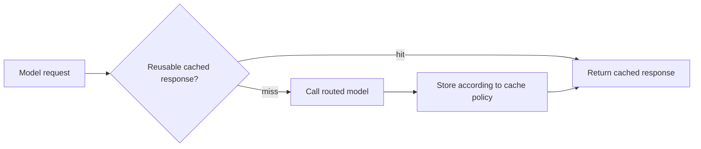

| Cache                   | Matching basis                         | Risk                                                    |
| ----------------------- | -------------------------------------- | ------------------------------------------------------- |
| Exact/simple            | Configured request-key equality        | History, model or parameters change and cause a miss    |
| Semantic                | Similarity plus configured constraints | False hit on a meaningfully different request           |
| Conversation checkpoint | Same thread ID                         | Not a response cache; a new model call may still happen |

### Doubts · Fifteen years versus twenty years · 07:47

**Ganesh:** Should questions with the same structure but different numbers reuse
an answer?

**Response:** A changed number can change the question materially, so these
should not be treated as equivalent merely because most words match.

**`NOT from session`** Dates, quantities, permissions, document revisions and
user identity can all determine cache validity. Use an expiry and invalidation
policy. Do not assume the cache stores an answer forever, and do not let one
user's protected evidence become another user's cache hit.

### Doubts · Is it safe to give a gateway provider keys? · 07:58

**Student question:** What is the trust implication of storing provider
credentials with a gateway?

**Response:** The gateway becomes part of the application's trust boundary.

**`NOT from session`** A vendor being well known is not proof that risk is zero.
Limit the keys' permissions and scope, understand where prompts and logs are
retained, and rotate credentials through the organisation's normal process.
Self-hosting changes responsibilities; it does not automatically remove security
work.

The repeated NLP prompt later demonstrates a cache hit in the gateway demo. That
is a result for that request and configuration, not proof that the whole RAG
pipeline is cached. Retrieval, guardrails or planner calls may still run before
a cached synthesis response is returned.

**Summary**

- A gateway centralises model access and request policy.
- Routing, retry, fallback, load balancing and caching solve different problems.
- Provider fallback does not solve a gateway outage.
- Slugs name integrations; gateway keys and provider credentials have different
  roles.
- Cache validity depends on more than similar wording.

## 17. Verify the Session 1 application before continuing

**`NOT from session`** This compact acceptance run makes the completed stage
reviewable. It uses the demonstrated behaviours and records their outcomes
without claiming they have all passed on your machine.

| Check              | Action                                                        | Evidence to record                                       |
| ------------------ | ------------------------------------------------------------- | -------------------------------------------------------- |
| Ingestion          | Inspect one processed file and matching Qdrant payload        | Correct text, source label, dimension and point count    |
| Technical route    | Ask about pod autoscaling                                     | Refined query, retrieved candidates and retained context |
| Conversation route | Ask for your previous question                                | Same-thread memory and skipped retrieval where selected  |
| Thread separation  | Ask the memory question in a fresh thread                     | No history from the original conversation                |
| Reranker           | Compare original and reranked candidate order                 | Relevant evidence retained; errors visible               |
| Cold versus warm   | Repeat with the same running process                          | Model initialisation separated from request work         |
| Grounding          | Ask something unsupported by the corpus                       | Whether the assistant admits insufficient evidence       |
| Failure handling   | Use a controlled unavailable dependency in a test environment | Failure distinguishable from an empty valid result       |

The main code path is now continuous: file loaders feed the chunker; the
embedding service and processor populate Qdrant; the query uses the same
embedding space; the retriever reranks candidates; the graph combines that
evidence with history; FastAPI returns it; Streamlit displays it; traces explain
the work.

### Session summary

- I can trace a file from parser to chunk, embedding, Qdrant point and returned
  evidence.
- I can explain why equal dimensions do not make different embedding models
  compatible.
- I can demonstrate the paragraph chunker's oversized-input behaviour.
- I can ingest clean data and append noise without accidentally wiping the
  collection.
- I can distinguish candidate retrieval, cross-encoder reranking and rank
  fusion.
- I can explain each `AgentState` field and the message reducer.
- I can follow both planner routes and identify what reaches the responder.
- I can test same-thread memory and explain why it disappears on restart.
- I can use API responses and traces to separate model, retrieval and
  infrastructure problems.
- I can distinguish simulated UI streaming from server streaming.
- I can explain the guardrail demo's controls and observed limitations.
- I can distinguish gateway routing, retries, fallback, load balancing and
  caching.

Continue with
[Session 2: guardrails, gateways, evaluation, deployment and multimodal documents](/docs/projects/enterprise-rag/session-2).

### Source and code map

- [Complete Session 1](https://www.youtube.com/watch?v=bjkjaqUZl4E), including
  its transcript and public discussion.
- [Resource document](https://docs.google.com/document/d/1wMPQL2NJTzT70GLBVYr3hKrObCmYrwhwvTgoEb0PLWk/edit?tab=t.0),
  [whiteboard](https://www.tldraw.com/f/faJganF5s9zVV-_ggRgEy?d=v-2627.-1914.9245.4810.page),
  [ingestion command sheet](https://agenticai-session.notion.site/Data-Ingestion-Commands-3925a934f2cf803b802ed0b6483257f4).
- [Stage-3 application](https://github.com/d-hackmt/8hr-MARATHON/tree/stage-3-rerank-memory),
  [reviewed final teaching snapshot](https://github.com/d-hackmt/8hr-MARATHON/tree/52b771cbdea2e2215c823cc1ae522183b77a85b7),
  including `app/ingestion`, `app/services/retrieval`, `app/agents`,
  `app/main.py`, `ui/app.py` and the demonstration notebooks.
- [HR controls](https://guardthisrag.streamlit.app/),
  [technical controls](https://guardrailz.streamlit.app/),
  [gateway demonstration](https://letsgateway.streamlit.app/). Hosted
  demonstrations may require a wake-up or fresh provider credentials; their
  availability is independent of the local project.
