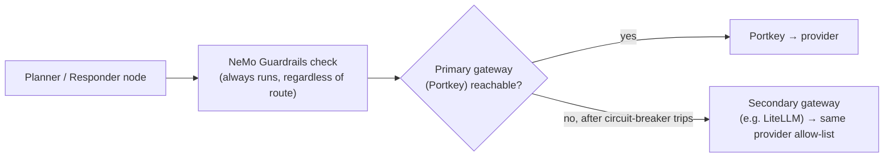

:::note Not from the sessions
Everything here is an addition, checked against both
[Session 1](/docs/projects/enterprise-rag/session-1) and
[Session 2](/docs/projects/enterprise-rag/session-2) so it doesn't repeat
ground they already cover. Session 2 already builds a real amount of
production maturity — an LLM gateway (Portkey), NeMo guardrails, Ragas
evaluation, containerised ECS Fargate deployment with autoscaling, Secrets
Manager, and TLS via ACM. This chapter only covers what those two sessions
either left as an open question or never touched at all — several of which
the source material names itself, as `` `NOT from session` `` asides, without
resolving.
:::

## 1. Authenticated, per-document access control

The source is explicit about this one — Session 1 warns: "the shared API
key protects entry to the API but does not implement per-user document
permissions. Keep the training corpus free of documents with different
access entitlements until retrieval applies an authenticated access
filter." That filter never gets built in either session. It's the first
thing to add before indexing anything with mixed sensitivity.

**Fix:** tag every point in Qdrant with an access-entitlement payload field
at ingestion time, and turn every retrieval query into a filtered query, not
just a similarity search:

```python
# at ingestion — every point gets the entitlements of its source document
client.upsert(
    collection_name=COLLECTION,
    points=[
        PointStruct(
            id=point_id,
            vector=embedding,
            payload={"text": chunk, "source": doc_id, "allowed_roles": ["eng", "sre"]},
        )
    ],
)

# at retrieval — filter is mandatory, not optional
results = client.search(
    collection_name=COLLECTION,
    query_vector=query_embedding,
    query_filter=Filter(
        must=[FieldCondition(key="allowed_roles", match=MatchAny(any=user.roles))]
    ),
    limit=15,
)
```

`user.roles` should come from a verified JWT claim, not a header the client
sets — which is exactly the next gap.

## 2. Multi-tenant isolation, beyond a shared bearer key

Session 2 names this too, without fixing it: "shared-key authentication does
not by itself isolate conversations between users." One `RAG_API_KEY` for
every caller means any client holding it can restore *any* LangGraph
thread's checkpoint, not just their own.

**Fix:** move from a shared static key to per-user auth (OAuth2/OIDC via
your IdP, or at minimum a signed JWT per user), and check thread ownership
before restoring a checkpoint:

```python
async def get_thread(thread_id: str, user: AuthenticatedUser = Depends(get_current_user)):
    owner = await checkpoint_store.get_thread_owner(thread_id)
    if owner is not None and owner != user.id:
        raise HTTPException(status_code=403, detail="Thread does not belong to this user")
    ...
```

Combine this with the access-filter change above and the two gaps close
together: who you are determines both which documents you can retrieve and
which conversations you can resume.

## 3. PII detection at ingestion, not just at the model boundary

Neither session runs any PII detection — the corpus in the demo is
Kubernetes/infra documentation, so it never came up. A real enterprise
corpus (support tickets, HR docs, incident postmortems with names and
emails in them) will contain PII, and once it's embedded into a vector, you
cannot selectively redact half of a vector after the fact.

**Fix:** redact **before chunking and embedding**, not after retrieval —
the opposite order from a chat-style redaction layer, and worth noting
explicitly because it's easy to copy the wrong pattern from a different
project:

```python
from presidio_analyzer import AnalyzerEngine
from presidio_anonymizer import AnonymizerEngine

analyzer, anonymizer = AnalyzerEngine(), AnonymizerEngine()

def scrub_before_chunking(raw_text: str) -> str:
    results = analyzer.analyze(text=raw_text, language="en")
    return anonymizer.anonymize(text=raw_text, analyzer_results=results).text

# processor.py — call this right after parsing, before chunk_text()
clean_text = scrub_before_chunking(parsed_text)
chunks = chunk_text(clean_text)
```

If retrieved evidence still needs a second, cheaper pass before it reaches
the responder node (belt-and-suspenders, since no detector is perfect), add
it there too — but ingestion-time redaction is the control that actually
matters, because it's the only one that determines what a vector *contains*.

## 4. Audit logging

There's rich request tracing (Logfire, LangSmith) for **debugging**, but
nothing that answers "who asked what, about which documents, and did
guardrails intervene" for **compliance** — a different, and currently
unmet, requirement once real users and real documents are involved.

**Fix:** a dedicated, append-only audit record per request, separate from
debug tracing:

```python
await audit_log.write({
    "user_id": user.id,
    "thread_id": thread_id,
    "question": query,
    "retrieved_doc_ids": [c.source for c in retrieved_chunks],
    "guardrail_verdict": guard_result.verdict,
    "gateway_route": response.metadata.get("provider"),
    "timestamp": datetime.utcnow(),
})
```

Keep it in its own table/store with no `UPDATE`/`DELETE` grants for the
application role — an audit log that the application itself can silently
edit isn't one a reviewer will trust.

## 5. Infrastructure as code

Session 2's entire AWS deployment (§11.1-11.17 — VPC, ECS, ALB, Secrets
Manager, IAM, autoscaling) is a long, well-organised sequence of **raw AWS
CLI commands**, run by hand. That's an excellent way to learn what each
resource is for; it's also configuration drift waiting to happen the first
time it's rebuilt slightly differently by a second engineer, or needs a
second environment (staging next to prod).

**Fix:** codify it once it's understood — Terraform or AWS CDK, split along
the same boundaries the manual walkthrough already uses:

```text
infra/
├── network/       # VPC, subnets, NAT (§11.2)
├── security/      # security groups, IAM roles (§11.3, 11.8)
├── secrets/       # Secrets Manager entries (§11.7)
├── ecs/           # cluster, task defs, services, autoscaling (§11.9-11.13)
└── alb/           # target groups, listeners, ACM cert (§11.11, 11.14)
```

The payoff isn't just repeatability — it's that `terraform destroy` replaces
Session 2's own §11.17 manual teardown checklist, and a `terraform plan`
makes every future change to this stack reviewable as a diff instead of a
new sequence of commands someone has to trust was typed correctly.

## 6. Data-tier HA and residency

The deployment intentionally uses external managed SaaS for state — Neon
(Postgres) and Upstash (Redis) — reached from inside the VPC over NAT rather
than AWS-native RDS/ElastiCache. That's a completely reasonable choice for a
teaching deployment; it also means the project inherits whatever HA,
backup, and data-residency posture those vendors provide, without that
being an explicit decision.

**Fix, if the client needs the data to stay inside their own cloud
boundary** (common in regulated or data-residency-sensitive engagements):
swap in **RDS PostgreSQL Multi-AZ** and **ElastiCache for Redis** inside the
same VPC, with automated backups and point-in-time recovery enabled, and
write down an explicit **RPO/RTO** target rather than inheriting whatever a
third party's SLA happens to offer. This is a deployment-config change, not
an application-code one — the `langgraph-checkpoint-postgres` and Redis
client code doesn't need to change, only the connection endpoints and the
Terraform module from item 5.

## 7. Vector index tuning at real scale

The retrieval chapter treats the vector index as a given — "the vector
index cheaply narrows the whole corpus to candidates" — with no discussion
of tuning, because the teaching corpus is small enough that defaults are
invisible. At enterprise scale (millions of chunks, many tenants), Qdrant's
HNSW parameters and payload indexing start to matter directly.

**Fix:**

```python
client.create_collection(
    collection_name=COLLECTION,
    vectors_config=VectorParams(
        size=768, distance=Distance.COSINE,
        hnsw_config=HnswConfigDiff(m=16, ef_construct=200),
        quantization_config=ScalarQuantization(
            scalar=ScalarQuantizationConfig(type=ScalarType.INT8, always_ram=True)
        ),
    ),
)
# index the field you filter on (Section 1's allowed_roles, or a tenant_id)
# so filtered search doesn't fall back to a full scan
client.create_payload_index(COLLECTION, field_name="allowed_roles", field_schema="keyword")
```

Scalar quantization trades a small recall hit for a large memory reduction —
worth measuring against your own eval set (Session 2's Ragas harness is
exactly the right tool to quantify that trade-off before committing to it).

## 8. Gateway high availability

Session 1's own Doubts section asks the right question and leaves it open:
"a gateway outage needs its own availability design... those paths must
preserve the policies the gateway normally applies." Right now, if Portkey
is unreachable, there's no defined fallback.

**Fix:** define the fallback explicitly, and make sure it still goes through
guardrails — a direct-provider bypass that skips Portkey but also skips
NeMo Guardrails would fix availability while quietly reopening the safety
gap Session 2 spent a whole section closing:



Guardrails sit in front of *both* paths — the fallback changes which
gateway forwards the request, never whether the request was allowed to be
made at all.

## 9. Turn declared eval/observability tooling into a running pipeline

`DeepEval` and `Langfuse` are both pinned dependencies, and both are named
in passing, but neither gets the step-by-step treatment Ragas does. Right
now they're closer to "we intend to use this" than "this runs."

**Fix, two separate pieces:**

- **DeepEval** for synthetic golden-set expansion on a schedule (e.g. weekly)
  — generating new question/reference pairs from newly-ingested documents,
  reviewed by a human before merging into the golden set Session 2's Ragas
  suite runs against, so the eval set grows with the corpus instead of
  going stale.
- **Langfuse** for **live production monitoring** — a standing dashboard of
  real-traffic faithfulness/latency/cost, distinct from Logfire/LangSmith's
  dev-time request tracing. The CI job Session 2 builds explicitly skips
  the paid Ragas suite on every PR (lint + mocked tests only, for speed and
  cost) — add a **separate, scheduled** GitHub Actions job that runs the
  full Ragas suite nightly against production-shaped traffic and posts a
  regression report, so evaluation quality is monitored continuously
  instead of only when someone remembers to run it by hand.

## 10. Dollar-cost governance (FinOps)

Every "budget" reference in both sessions is about the **prompt/context
token budget** (how much text fits in a context window) — there is no
actual **spend** tracking anywhere: no per-tenant cost attribution, no
budget alarms, nothing surfacing what a given gateway route or model choice
actually costs in dollars.

**Fix:** Portkey and most gateways already return per-request cost metadata
— pipe it into a CloudWatch custom metric (or your metrics stack of choice)
tagged by tenant/route, and set a billing alarm:

```python
response = await portkey_client.chat.completions.create(...)
cloudwatch.put_metric_data(
    Namespace="RAGApp/Cost",
    MetricData=[{
        "MetricName": "LLMSpendUSD",
        "Dimensions": [{"Name": "TenantId", "Value": tenant_id}],
        "Value": response.usage.cost_usd,
        "Unit": "None",
    }],
)
```

This is cheap to add because the gateway is already the single choke point
for every model call — exactly the same reason Session 1 gave for adopting
a gateway in the first place (centralised routing) applies just as well to
centralised cost observability.

## Priority, if you can only do a few

1. **Authenticated access filtering + thread ownership checks.** Both gaps
   are already named in the source material itself as unresolved — close
   them before this goes anywhere near a corpus with mixed-sensitivity
   documents or more than one real user.
2. **PII detection at ingestion.** Cheap to add now, effectively impossible
   to retrofit cleanly once sensitive text is already embedded into a live
   vector store.
3. **Infrastructure as code for the AWS stack.** Protects the deployment
   Session 2 already built from silently drifting the first time it's
   rebuilt or replicated into a second environment.
4. Everything else — data-tier HA, index tuning, gateway failover, cost
   governance, continuous eval — meaningfully improves operability and
   resilience, but doesn't gate whether the system is safe to point at real
   users and real data the way items 1-3 do.
