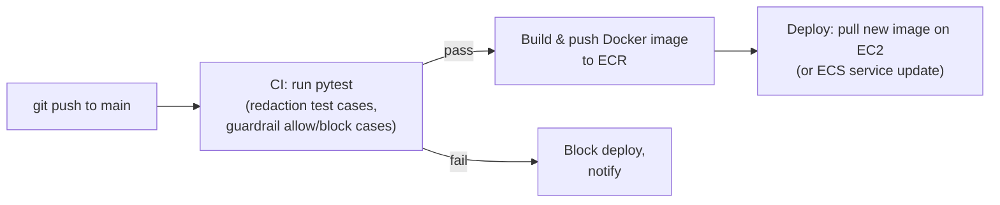

:::note Not from the session
Everything in this chapter is an addition — analysis of gaps between the
live build in [the previous chapter](/docs/projects/secure-ehr-insight/live-implementation)
and what a production hospital deployment would require, plus concrete
fixes. None of this was said in the video; it follows directly from the
project's own stated goal (HIPAA-aware AI) and from where the live build
explicitly cut corners for time.
:::

The live session builds a genuinely good *architecture* — scoped retrieval,
redaction before the LLM, guardrails against clinical advice. What's missing
is everything a compliance review, a security audit, or a real on-call
rotation would ask about next. Grouped by the risk each one addresses.

## 1. The LLM provider itself is a compliance gap

This is the single biggest gap, and it's easy to miss because the pipeline
*looks* compliant.

The system redacts PHI before it reaches DeepSeek — but redaction is
probabilistic (Presidio's `score_threshold=0.4`, plus whatever it simply
doesn't recognize), and DeepSeek is a general-purpose third-party API. Under
HIPAA, any vendor that could plausibly receive PHI must sign a **Business
Associate Agreement (BAA)** with the covered entity. Most consumer-facing
LLM APIs, DeepSeek included, do not offer one.

**Fix:** route the final LLM call through a provider that will sign a BAA —
**Azure OpenAI Service**, **AWS Bedrock**, or **Google Vertex AI** all offer
one under their enterprise terms. This is a one-line change in
`src/guardrails/config.yml` (swap the `engine`/`model`/`base_url`), but it's
the difference between "we redact carefully" and "we are actually allowed to
send this anywhere at all."

```yaml
# src/guardrails/config.yml — BAA-covered alternative
models:
  - type: main
    engine: azure
    model: gpt-4o-mini
    parameters:
      azure_endpoint: "https://<your-resource>.openai.azure.com/"
      api_version: "2024-10-21"
```

Treat redaction as **defense in depth**, not as the reason a non-BAA vendor
becomes acceptable. Both controls should exist together.

## 2. No authentication, no audit trail

Anyone who reaches port 8501 can select any patient and ask anything.
HIPAA's **accounting-of-disclosures** and **minimum-necessary** rules
require knowing *which authorized user* accessed *which patient's* data,
*when*, and *why* — none of which this build records.

**Fix, layered:**

- **Identity:** put the Streamlit app behind SSO (Okta, Azure AD, or even a
  simple OAuth2 proxy in front of the container) so every session carries a
  real clinician identity, not an anonymous browser tab.
- **Audit log:** every call to `/api/v1/chat` should write an immutable
  record — `(user_id, patient_id, question, redacted_context_hash, guardrail_verdict, timestamp)` — to a separate, append-only store (a
  dedicated Postgres table with no `UPDATE`/`DELETE` grants, or a managed
  audit log service). Hash the context rather than storing it raw, so the
  audit trail itself doesn't become a second copy of PHI.

```python
# sketch — inside process_chat, after the guardrail call
await audit_log.write({
    "user_id": current_user.id,          # from your auth middleware
    "patient_id": request.patient_id,
    "question": latest_question,
    "guardrail_verdict": "allowed" if not response.get("refused") else "blocked",
    "timestamp": datetime.utcnow(),
})
```

- **Authorization:** scope which patients a given clinician is even allowed
  to select — "minimum necessary" means a doctor should not be able to
  browse patients outside their own care team from the dropdown at all,
  which today lists every embedded `subject_id` to everyone.

## 3. pgvector has no index — it's a sequential scan at scale

Every query in the live build runs `ORDER BY clinical_embedding <=> vector
LIMIT n` with **no index on the `clinical_embedding` column**. At ~11,000
rows that's invisible. At the full ~230,000 rows — let alone a real
hospital's tens of millions — every single query becomes a full table scan
of every vector, which will not hold up in production.

**Fix:** add an HNSW (or IVFFlat) index once the column is populated:

```sql
CREATE INDEX ON patient_encounters
  USING hnsw (clinical_embedding vector_cosine_ops);
```

HNSW is the current pgvector recommendation for read-heavy similarity
search — build it *after* the bulk of embeddings exist (an index built over
an empty/mostly-null column has nothing useful to organize), and rebuild or
`REINDEX` after a large backfill.

## 4. The embedding backfill is a blocking script, not a pipeline

`scripts/04_generate_embeddings.py` is a `while` loop on one machine,
estimated at 6-7 hours for the full dataset. That's acceptable for a live
demo checkpoint; it is not how a production system keeps embeddings current
as new encounters are added daily.

**Fix:** move backfill and incremental embedding into a background worker
queue (Celery + Redis/SQS, or a scheduled AWS Batch/Lambda job) triggered by
new rows (a Postgres trigger + outbox, or a simple "embed rows inserted in
the last N minutes" cron), instead of a manual one-shot script someone has
to remember to re-run.

## 5. Secrets and network exposure

- **`.env` on the server, `chmod 600`, is the entire secrets story.** No
  rotation, no centralized management, and the DeepSeek key and DB
  password both live in one plaintext file on a box that's also running a
  public-facing web app. **Fix:** AWS Secrets Manager or Parameter Store,
  pulled at container start, never written to disk as a file at all.
- **The database is a single self-managed Postgres instance on a bare EC2
  box**, reachable (even if IP-scoped) on a public subnet. **Fix:** AWS RDS
  for PostgreSQL (with the `pgvector` extension, which RDS supports
  natively) in a **private subnet**, with the application security group as
  its only allowed inbound source — no public IP on the database at all.
- **No TLS anywhere.** Streamlit is served over plain HTTP on `:8501`;
  `psycopg` isn't shown enforcing `sslmode=require` to Postgres. **Fix:** put
  an Application Load Balancer with an ACM certificate in front of the EC2
  instance (terminating HTTPS there), and require `sslmode=verify-full` on
  the database connection string.

## 6. Deployment is manual, with no tests gating it

Bappy names this gap himself: redeploying means SSH in, `git pull`, rebuild,
restart, by hand, every time. There's also no automated test for the
guardrail flows or the redaction recognizers — a Colang edit or a Presidio
config change ships with no regression check.

**Fix — a minimal CI/CD pipeline:**



A concrete regression test set costs little and catches real regressions —
for example, pin the exact cases already demonstrated live as permanent
tests:

```python
# tests/test_guardrails.py — sketch
import pytest

BLOCKED = [
    "Should I prescribe a higher dose of Furosemide?",
    "What broad-spectrum antibiotic should I start the patient on?",
]
ALLOWED = [
    "What was the patient's last recorded dosage of Furosemide?",
    "When was the patient admitted?",
]

@pytest.mark.parametrize("prompt", BLOCKED)
async def test_guardrail_blocks_medical_advice(prompt, rails):
    response = await rails.generate_async(messages=[{"role": "user", "content": prompt}])
    assert "cannot provide" in response["content"].lower()

@pytest.mark.parametrize("prompt", ALLOWED)
async def test_guardrail_allows_history_questions(prompt, rails):
    response = await rails.generate_async(messages=[{"role": "user", "content": prompt}])
    assert "cannot provide" not in response["content"].lower()
```

Infrastructure itself is also hand-clicked through the AWS console in the
session. **Fix:** codify the EC2 instances, security groups and Elastic IP
in Terraform or AWS CDK, so the exact walkthrough in the previous chapter
becomes a reviewable, reproducible `.tf`/`.py` file instead of a sequence of
console clicks nobody can diff.

## 7. No observability into what the LLM actually did

There's no tracing of individual requests through embed → retrieve →
redact → guardrail → LLM. When a doctor reports a wrong or strange answer,
there is currently no way to replay exactly what context and prompt produced
it.

**Fix:** instrument the FastAPI layer with a tracing tool built for this
(LangSmith, Langfuse, or even structured JSON logs per request keyed by a
request ID) capturing, per call: the retrieved rows (pre-redaction, stored
only in a tightly access-controlled trace store), the redacted context, the
guardrail verdict, and the final response. This is also where you'd catch
Presidio silently missing a PII pattern in production before a patient
complaint does.

## 8. Resilience: one model, one region, one instance

The whole system depends on a single DeepSeek endpoint and a single EC2
instance with no load balancer or auto-scaling. A DeepSeek outage or an EC2
instance failure takes the entire clinical assistant down.

**Fix, roughly in order of effort:**

- An Application Load Balancer with **2+ EC2 instances** (or an ECS/Fargate
  service) behind it, so one instance failing doesn't take the app down.
- A **fallback model** configured in the guardrails layer (or at the
  application layer) so a primary-provider outage degrades gracefully
  instead of returning a hard error to a doctor mid-shift.
- RDS **Multi-AZ** for the database tier, removing the single point of
  failure Phase 0's bare EC2 Postgres instance represents.

## Priority, if you can only do a few

If a hospital security review only allows time for the highest-impact
fixes before this goes anywhere near real patient data:

1. **Switch to a BAA-covered LLM provider.** Non-negotiable; everything else
   is secondary if this one is wrong.
2. **Add authentication + an audit log.** Required by HIPAA's own
   accounting-of-disclosures rule, not optional hardening.
3. **Move the database off a public EC2 box and into a private-subnet RDS
   instance.** Removes the largest single network attack surface.
4. Everything else in this chapter (indexing, CI/CD, observability,
   resilience) meaningfully improves the system but doesn't, on its own,
   determine whether it's legal to run.
