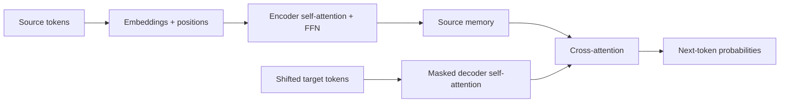

import PaperPdf from '@site/src/components/PaperPdf';
import AttentionLab from '@site/src/components/viz/AttentionLab';
import CodeWalkthrough from '@site/src/components/viz/CodeWalkthrough';

> **Vaswani et al. · 2017** · [Read the embedded paper](#original-paper) ·
> [Download PDF](/papers/research-papers/transformer.pdf) · Notes follow the
> paper section by section, §1 to the appendix.

## Paper in one minute

**Problem.** Recurrent sequence models process tokens one after another, making
training hard to parallelise and creating long paths between distant words.

**Key idea.** Let every token read relevant information directly from other
tokens through attention, then build the entire encoder–decoder from attention,
feed-forward layers, residual connections and normalization.

**Why it matters.** This design became the architectural foundation for BERT,
GPT, LLaMA and most modern language models. The paper proves its case on sequence
transduction; it does not by itself introduce a general-purpose chatbot.

### Architecture flow



## How to read this chapter

The walkthrough below follows the paper **in its own order**, from the abstract
to the appendix. Each heading carries the paper's section number, so you can
keep the PDF open beside it.

You do not need to have read a research paper before. Every new term is
explained the first time it appears, and each formula comes after the idea it
expresses. Boxes marked **not from the paper** are extra help, such as
analogies, real-world examples or worked numbers.

## Abstract: the four claims

The paper is about **sequence transduction**: turning one sequence into
another, such as an English sentence into a German one. The abstract makes four
claims, and the rest of the paper sets out to prove them:

1. You can build a translation model **out of attention alone**, without the
   recurrent or convolutional layers everyone used at the time.
2. On the WMT 2014 English→German test, it scores **28.4 BLEU**, more than 2
   points above the best earlier system.
3. On WMT 2014 English→French, it scores **41.8 BLEU** after 3.5 days of
   training on eight GPUs, much cheaper than earlier systems.
4. It also works on a different task, **English constituency parsing**
   (breaking a sentence into its grammatical parts).

Two terms to know:

- **WMT 2014** is a public translation competition. Its test sets let
  researchers compare systems fairly.
- **BLEU** is a score from 0 to 100 for how closely a machine translation
  matches human translations of the same sentence. In 2017, a gain of 2 BLEU was
  a big jump.

## §1 Introduction: reading one word at a time is slow

Before this paper, the best translation systems used **recurrent neural
networks (RNNs)**, usually the LSTM or GRU kinds. An RNN reads a sentence one
word at a time, like reading with a finger under each word. At each word it
updates a running summary, called the hidden state $h_t$, from the previous
summary $h_{t-1}$ and the current word.

That creates a problem. Word 50 cannot be processed until word 49 is done, so
the computer cannot work on all the words **at the same time**. GPUs are fast
precisely because they do many things at once, so RNNs waste most of that
power. Earlier tricks made RNNs faster, but the paper points out that the basic
one-step-at-a-time limit remained.

Researchers already used **attention**, a way for one word to look directly at
any other word, but always as an add-on to an RNN. This paper's idea is to
**remove the RNN completely** and use attention alone. The result reached a new
state of the art after only **twelve hours on eight GPUs**.

:::tip Intuition: why a word needs its neighbours (not from the paper)

Take _“The animal did not cross the street because it was tired.”_ To
understand **it**, the model needs to know about **the animal**. In an RNN,
that information has to survive every step between the two words. With
attention, “it” can look straight back at “animal” in one step.

:::

## §2 Background: why not convolutions?

Some earlier models (ByteNet and ConvS2S, for example) avoided the
one-word-at-a-time problem by using **convolutions**. A convolution looks at a
small window of neighbouring words, and every window can be processed at once.

The weakness is distance. To connect two words far apart, the model has to
stack many windows on top of each other. The further apart the words, the more
layers the signal must pass through, and the harder the link is to learn.

In the Transformer, **any two words are connected in a single step**, however
far apart they are. The paper is honest about the cost: blending many words
into one average can blur the detail. Its fix is **multi-head attention**
(§3.2.2), which lets the model look in several ways at once.

The section also defines **self-attention**: attention where the words of one
sentence look at each other, rather than at a different sentence. The paper
claims to be the first translation model built entirely on self-attention.

## §3 Model architecture

The Transformer has two halves, like most translation models of the time:

- The **encoder** reads the whole input sentence and turns each word into a
  vector (a list of numbers) that captures its meaning in context.
- The **decoder** writes the output sentence **one word at a time**. Each new
  word is chosen using the encoder's vectors and the words already written.
  Generating one step at a time, based on what came before, is called
  **auto-regressive** generation.

In the paper's notation, the encoder turns input symbols $(x_1,\ldots,x_n)$
into vectors $z=(z_1,\ldots,z_n)$, and the decoder produces output symbols
$(y_1,\ldots,y_m)$.


_Figure 1 from the original paper, PDF page 3.
[Source PDF](/papers/research-papers/transformer.pdf#page=3)._

The left tower is the **encoder** and the right tower is the **decoder**. The
arrow between them carries the encoder's output into the decoder.

:::tip In the real world (not from the paper)

Google's 2020 update to Google Translate uses a Transformer **encoder** to read
your sentence, paired with a different kind of decoder
([Google Research](https://research.google/blog/recent-advances-in-google-translate/)).
So the left half of this figure is running every time someone translates a
sentence there.

:::

### §3.1 Encoder and decoder stacks

**Encoder.** The encoder is a stack of $N=6$ identical layers. Each layer does
two jobs in order:

1. **Multi-head self-attention**: every word gathers information from the other
   words.
2. **Feed-forward network**: every word's vector is processed on its own.

Around each job the paper adds two helpers. A **residual connection** adds the
job's input back to its output, so information is never lost. **Layer
normalisation** then rescales the numbers so they stay in a sensible range. The
paper writes this as:

$$
\operatorname{LayerNorm}(x+\operatorname{Sublayer}(x)).
$$

In words: do the job, add back what you started with, then tidy up the scale.
Every vector in the model has the same width, $d_{\text{model}}=512$ numbers, so
these additions line up.

**Decoder.** Also 6 layers, with a **third job** in the middle: attention over
the encoder's output, so the decoder can look at the input sentence. The
decoder's self-attention is also **masked**: when predicting word $i$, it may
only look at words before $i$. Otherwise it could cheat by peeking at the word
it is supposed to predict.

:::note Post-norm is the 2017 choice

Here normalisation comes _after_ the addition (called post-norm). Most later
large models, GPT-2 and LLaMA among them, moved it _before_ each job (pre-norm)
because deep stacks train more stably that way. When a later paper says
"Transformer block", check which one it means.

:::

#### How the decoder is trained (not from the paper)

The paper says the decoder's inputs are "offset by one position". The usual
name for this is **teacher forcing**. During training, the decoder is fed the
_correct_ previous words, and at each position its target is the next correct
word:

| Decoder input | `<start>` | Ich | liebe |
| ------------- | --------- | --- | ----- |
| Target        | Ich       | liebe | dich |

At inference there is no correct answer to feed in, so the model feeds back its
own guesses. One early mistake can then throw off later words. Training loss
alone will not show you this.

Two different masks are involved. A **causal mask** hides future words. A
**padding mask** hides the blank filler added so that short sentences match long
ones in a batch. The teaching code below uses fixed-length sequences, so it
needs only the causal mask.

### §3.2 Attention

The paper's definition: attention takes a **query** and a set of
**key–value pairs**, and returns a **weighted average of the values**. Each
value's weight depends on how well its key matches the query.

:::tip Intuition: a library search (not from the paper)

Think of looking for a book in a library.

| Attention quantity | In the library           | In the model                               |
| ------------------ | ------------------------ | ------------------------------------------ |
| Query, Q           | Your search request      | What this word is looking for              |
| Key, K             | A catalogue card         | What another word offers                   |
| Value, V           | The book's contents      | The information that gets passed along     |

Suppose three words have value vectors $v_1, v_2, v_3$, and the current word
gives them weights 0.6, 0.3 and 0.1. Its new vector is
$y = 0.6v_1 + 0.3v_2 + 0.1v_3$. The mixing is simple. The clever part is
choosing the weights so they depend on the sentence. The model learns how to
make queries and keys from data; nobody writes search rules by hand.

:::

#### §3.2.1 Scaled dot-product attention

Here is the recipe in words:

1. **Score** each pair of words by multiplying the query of one with the key of
   the other and adding up the results (a **dot product**). A higher score
   means a better match.
2. **Shrink** every score by dividing by $\sqrt{d_k}$, where $d_k$ is the
   length of a key vector. The reason is explained below.
3. **Turn scores into weights** with **softmax**, a function that makes every
   number positive and makes each row add up to 1.
4. **Mix** the value vectors using those weights.

Doing this for all words at once, with the queries, keys and values stacked
into matrices, gives the paper's **Equation 1**:

$$
\operatorname{Attention}(Q,K,V)=\operatorname{softmax}\left(\frac{QK^T}{\sqrt{d_k}}\right)V.
$$

In one sentence: compare every word with every other word, turn the scores into
weights, and take the weighted average of their values.

The shapes for five words, keys of length 8 and values of length 6:

| Object             | Shape   | What one row means                      |
| ------------------ | ------- | --------------------------------------- |
| Q and K            | `5 × 8` | The query or key for one word           |
| Scores and weights | `5 × 5` | How much one word looks at each word    |
| V                  | `5 × 6` | The information one word offers         |
| Output             | `5 × 6` | The context one word collected          |

Queries and keys must be the same length so they can be multiplied. Values can
have a different length.

**Why this kind of score?** The paper compares it with **additive attention**,
which scores pairs using a small neural network. Both are similar in theory,
but the dot product is much faster in practice, because GPUs are built for
exactly this kind of matrix multiplication.

**Why divide by $\sqrt{d_k}$?** When vectors are long, dot products become very
large numbers. Softmax then puts almost all the weight on one word, and
learning slows down, because the model gets almost no signal about the other
words. The paper's footnote 4 shows the size: if each number in $q$ and $k$ is
random with average 0 and spread 1, their dot product has an average of 0 and
a **variance of $d_k$**. Dividing by $\sqrt{d_k}$ brings the spread back to 1.

:::tip Worked number (not from the paper)

The base model uses $d_k=64$, so unscaled scores have a spread (standard
deviation) of $\sqrt{64}=8$. Two scores 16 apart is quite normal at that
spread, yet softmax would give the larger one about **8.9 million times** the
weight of the smaller. After dividing by 8, the gap is 2 and the ratio is about
7.4. Both words still get a say.

:::

#### §3.2.2 Multi-head attention

One attention pass gives each word one weighted average. But a word may need
several kinds of information at once: which noun "it" refers to, and which verb
goes with it. **Multi-head attention** runs several smaller attention passes
side by side, each with its own learned queries, keys and values. The results
are joined together and mixed once more:

$$
\begin{aligned}
\operatorname{MultiHead}(Q,K,V)&=\operatorname{Concat}(\text{head}_1,\ldots,\text{head}_h)\,W^O\\
\text{where}\quad \text{head}_i&=\operatorname{Attention}(QW_i^Q,\;KW_i^K,\;VW_i^V)
\end{aligned}
$$

In words: each head $i$ has its own projection matrices $W_i^Q, W_i^K, W_i^V$
that pick out what it looks for. $\operatorname{Concat}$ glues the heads'
outputs together side by side, and $W^O$ mixes them back into one vector of
width $d_{\text{model}}$.

The base model uses $h=8$ heads. Each head works with vectors of length
$d_k=d_v=512/8=64$. Because each head is smaller, eight heads cost about the
same as one full-size head.

The paper's reason ties back to §2: with a single head, "averaging inhibits"
the model from attending to different kinds of information at different
positions.

The heads are not given jobs by anyone. If one head ends up tracking grammar,
that is something it learned, not something it was told to do (see the
appendix).

#### §3.2.3 Applications of attention in the model

The same attention block is used in three places:

| Where                     | Queries come from | Keys and values come from | Can it see future output words? |
| ------------------------- | ----------------- | ------------------------- | ------------------------------- |
| Encoder self-attention    | The input sentence | The input sentence       | Not relevant, the input is known |
| Decoder self-attention    | The output so far | The output so far         | No, a mask blocks them          |
| Encoder–decoder attention | The decoder       | The encoder's output      | Sees the whole input            |

The mask works by setting blocked scores to $-\infty$ before softmax. Softmax
turns $-\infty$ into a weight of exactly zero.

:::tip In the real world (not from the paper)

The decoder self-attention row, with its mask, is the heart of every
GPT-style chatbot. When ChatGPT or Claude writes a reply, each new token is
chosen by masked self-attention over everything written so far. Those models
simply leave out the encoder.

:::

### §3.3 Position-wise feed-forward networks

Attention moves information **between** words. Each layer also has a small
neural network that processes **each word on its own**, using the same weights
for every word. It is two linear layers with a **ReLU** in between (ReLU keeps
positive numbers and turns negatives into zero). This is **Equation 2**:

$$
\operatorname{FFN}(x)=\max(0,\,xW_1+b_1)\,W_2+b_2.
$$

In words: expand the vector, drop the negative parts, and shrink it back. The
vector goes in with 512 numbers, grows to $d_{ff}=2048$ in the middle, and
comes out with 512 again. Each layer has its own weights.

### §3.4 Embeddings and softmax

An **embedding** turns each token (a word or piece of a word) into a vector the
model can work with. At the other end, a linear layer plus softmax turns the
decoder's final vector into a probability for every token in the vocabulary.

Two details are easy to miss:

- **Weight tying.** The input embeddings, the output embeddings and that final
  linear layer all **share one matrix**. This is possible because §5.1 uses one
  shared vocabulary for both languages. It saves parameters.
- **Scaling.** The embedding values are multiplied by $\sqrt{d_{\text{model}}}$
  (about 22.6) before use.

### §3.5 Positional encoding

Attention on its own has no idea of word order. To it, “dog bites man” and
“man bites dog” contain the same words. So the paper **adds a position signal**
to each word's embedding before the first layer.

The signal is built from sine and cosine waves of different speeds. Some
numbers in the signal change quickly from one position to the next, others
slowly, a bit like the second, minute and hour hands of a clock. Together they
give every position a unique pattern:

$$
PE_{(pos,2i)}=\sin\!\left(pos/10000^{2i/d_{\text{model}}}\right),\qquad
PE_{(pos,2i+1)}=\cos\!\left(pos/10000^{2i/d_{\text{model}}}\right).
$$

In words: even-numbered dimensions use sine, odd-numbered ones use cosine, and
the wave gets slower as $i$ grows. The wavelengths range from $2\pi$ up to
$10000\cdot2\pi$ positions.

Why waves? The authors **guessed** it would make relative positions ("three
words back") easy to learn, because shifting by a fixed amount $k$ is the same
simple calculation wherever you are in the sentence.

:::tip Why a shift is simple (not from the paper)

Take one sine/cosine pair with speed $\omega$. The school angle-addition rules
give

$$
\begin{pmatrix}\sin\omega(p+k)\\ \cos\omega(p+k)\end{pmatrix}
=
\begin{pmatrix}\cos\omega k & \sin\omega k\\ -\sin\omega k & \cos\omega k\end{pmatrix}
\begin{pmatrix}\sin\omega p\\ \cos\omega p\end{pmatrix}.
$$

The matrix depends only on the shift $k$, not on the position $p$. So "move $k$
steps" is the same rotation everywhere in the sentence.

:::

The authors also tried **learned** position vectors and got almost identical
results (Table 3, row E). They kept the waves because they "may allow the model
to extrapolate", meaning handle sentences longer than any seen in training. The
paper does not test this; it is a hope.

:::tip In the real world (not from the paper)

Modern models such as LLaMA use **RoPE**, which takes the rotation idea above
and applies it directly inside attention instead of adding it to the embedding.
How far a model can read beyond its training length is still a major practical
question for long-document chat assistants.

:::

## §4 Why self-attention

This section argues that self-attention is a better building block than RNNs
or convolutions. It compares them on three things:

1. **Work per layer**: how much computing each layer needs.
2. **Waiting**: how many steps must happen one after another (fewer means more
   can run in parallel).
3. **Path length**: how many steps a signal takes to travel between two distant
   words (shorter makes long-range links easier to learn).

The paper's Table 1, with $n$ the number of words, $d$ the vector width and $k$
the convolution window size:

| Layer type     | Work per layer         | Steps in a row | Path between two words |
| -------------- | ---------------------- | -------------- | ---------------------- |
| Self-attention | $O(n^2\cdot d)$        | $O(1)$         | $O(1)$                 |
| Recurrent      | $O(n\cdot d^2)$        | $O(n)$         | $O(n)$                 |
| Convolutional  | $O(k\cdot n\cdot d^2)$ | $O(1)$         | $O(\log_k n)$          |

What this shows: self-attention connects any two words in one step and needs no
waiting. Its cost grows with $n^2$, the number of word pairs.

The paper's argument, point by point:

- Self-attention is **cheaper than an RNN when the sentence is shorter than the
  vector width** ($n<d$). That is usually true for sentences in translation.
- For very long inputs, attention could be limited to nearby words. The paper
  leaves that for future work.
- Convolutions need many stacked layers to connect distant words, and are
  usually more expensive than RNNs.
- As a bonus, attention weights can be inspected, which may make the model
  easier to interpret (see the appendix).

<details>
<summary>Full Table 1 row and convolution detail from the paper</summary>

Table 1 also lists **restricted self-attention**, where each word looks only at
a neighbourhood of size $r$: work $O(r\cdot n\cdot d)$, steps $O(1)$, path
$O(n/r)$.

For convolutions, a window $k<n$ needs $O(n/k)$ stacked layers (or
$O(\log_k n)$ with dilated convolutions) to connect all positions. Separable
convolutions reduce the work to $O(k\cdot n\cdot d+n\cdot d^2)$. Even with
$k=n$, that equals one self-attention layer plus one feed-forward layer, which
is the Transformer's design.

</details>

:::warning The n < d condition cuts both ways (worked number, not from the paper)

With $d=512$, a 50-word sentence gives $n^2d\approx1.3$ million against
$nd^2\approx13$ million, so self-attention is about ten times cheaper. At
1,000 tokens it is $512$ million against $262$ million, and self-attention is
now **twice as expensive**. Doubling to 2,000 tokens quadruples each head's
table of scores, from one million to four million entries. This is why chat
apps have context limits, and why so much later research makes attention
cheaper for long inputs.

:::

## §5 Training

### §5.1 Training data and batching

| Task           | Data                                 | Vocabulary                                              |
| -------------- | ------------------------------------ | ------------------------------------------------------- |
| English→German | WMT 2014, about 4.5 million sentence pairs | About 37,000 sub-word tokens, **shared** by both languages |
| English→French | WMT 2014, 36 million sentences       | 32,000 sub-word tokens                                  |

**Sub-word tokens** split rare words into common pieces, such as “unhappiness”
into “un”, “happi” and “ness”, so the vocabulary stays small. The paper uses
byte-pair encoding (BPE) for German and word-pieces for French.

Sentences of **similar length are batched together**, about 25,000 source and
25,000 target tokens per batch. Otherwise a batch mixing a 5-word and a 60-word
sentence would waste effort on padding.

### §5.2 Hardware and schedule

Everything ran on one machine with **8 NVIDIA P100 GPUs**.

| Model | Time per step | Steps   | Total time |
| ----- | ------------- | ------- | ---------- |
| Base  | about 0.4 s   | 100,000 | 12 hours   |
| Big   | about 1.0 s   | 300,000 | 3.5 days   |

### §5.3 Optimiser

The **optimiser** is the rule that updates the weights after each batch. The
paper uses **Adam** ($\beta_1=0.9$, $\beta_2=0.98$, $\epsilon=10^{-9}$). The
**learning rate**, how big each update step is, follows a special schedule:

1. **Warm up**: start tiny and grow steadily for the first 4,000 steps, while
   the model is still random and big steps would be unstable.
2. **Cool down**: then shrink slowly for the rest of training, so the model can
   settle.

The paper's **Equation 3**:

$$
\mathit{lrate}=d_{\text{model}}^{-0.5}\cdot
\min\!\left(\mathit{step\_num}^{-0.5},\;\mathit{step\_num}\cdot\mathit{warmup\_steps}^{-1.5}\right).
$$

In words: take whichever of the two terms is smaller. Early on, the second term
is smaller and rises in a straight line. After step 4,000, the first term is
smaller and falls with one over the square root of the step.

:::tip Worked number (not from the paper)

With $d_{\text{model}}=512$, the peak at step 4,000 is
$512^{-0.5}\times4000^{-0.5}\approx0.0442\times0.0158\approx7.0\times10^{-4}$.
By step 100,000 it has fallen to about $1.4\times10^{-4}$. These numbers suit
this model and batch size; a small model usually needs its own values.

:::

:::tip In the real world (not from the paper)

Warm-up is now standard. The Hugging Face `Trainer`, which most fine-tuning
tutorials use, has a `warmup_steps` setting for exactly this reason.

:::

### §5.4 Regularisation

**Regularisation** means tricks that stop the model from memorising the
training data instead of learning general rules. The paper uses two.

**Residual dropout.** **Dropout** randomly switches off some numbers during
training, so the model cannot rely on any single one. The paper applies it to
each job's output, just before it is added back and normalised, and also to the
embedding-plus-position sum. The base model drops 10% ($P_{drop}=0.1$).

**Label smoothing.** Normally the training target says "the next word is
_Haus_ with 100% certainty". **Label smoothing** ($\epsilon_{ls}=0.1$) changes
that to "about 90% _Haus_, with the rest spread over other words". This teaches
the model not to be overconfident. The paper admits the trade-off: it makes
**perplexity** worse but **BLEU** better.

:::note Why the two scores can disagree

**Perplexity** measures how surprised the model is by the correct next word
(lower is better). BLEU scores the whole translation the model writes. A model
that is less sure about each exact word can still write better sentences. Table
3 row (D) shows this: without smoothing, perplexity improves (4.67 against
4.92) but BLEU drops (25.3 against 25.8).

The paper says it uses "three types of regularization" but describes two
headings. The dropout heading covers two places where dropout is applied.

:::

## §6 Results

### §6.1 Machine translation

The headline rows of Table 2 (BLEU on the 2014 test sets):

| Model                       | English→German | English→French | Training cost (EN→DE) |
| --------------------------- | -------------- | -------------- | --------------------- |
| Best earlier single model (MoE) | 26.03      | 40.56          | 2.0 · 10¹⁹ FLOPs      |
| Best earlier ensemble (ConvS2S) | 26.36      | 41.29          | 7.7 · 10¹⁹ FLOPs      |
| **Transformer (base)**      | **27.3**       | 38.1           | **3.3 · 10¹⁸ FLOPs**  |
| **Transformer (big)**       | **28.4**       | **41.8**       | 2.3 · 10¹⁹ FLOPs      |

What this shows: even the small base model beat every earlier English→German
system, including **ensembles** (several models combined), while costing a
fraction to train. **FLOPs** counts computer arithmetic operations; smaller
means cheaper.

<details>
<summary>Full Table 2 from the paper</summary>

| Model                      | EN-DE BLEU | EN-FR BLEU | Cost EN-DE | Cost EN-FR |
| -------------------------- | ---------- | ---------- | ---------- | ---------- |
| ByteNet                    | 23.75      |            |            |            |
| Deep-Att + PosUnk          |            | 39.2       |            | 1.0 · 10²⁰ |
| GNMT + RL                  | 24.6       | 39.92      | 2.3 · 10¹⁹ | 1.4 · 10²⁰ |
| ConvS2S                    | 25.16      | 40.46      | 9.6 · 10¹⁸ | 1.5 · 10²⁰ |
| MoE                        | 26.03      | 40.56      | 2.0 · 10¹⁹ | 1.2 · 10²⁰ |
| Deep-Att + PosUnk Ensemble |            | 40.4       |            | 8.0 · 10²⁰ |
| GNMT + RL Ensemble         | 26.30      | 41.16      | 1.8 · 10²⁰ | 1.1 · 10²¹ |
| ConvS2S Ensemble           | 26.36      | 41.29      | 7.7 · 10¹⁹ | 1.2 · 10²¹ |
| Transformer (base)         | 27.3       | 38.1       | 3.3 · 10¹⁸ |            |
| Transformer (big)          | 28.4       | 41.8       | 2.3 · 10¹⁹ |            |

The paper reports one cost per Transformer model rather than one per language
pair.

</details>

The paper's own reading:

- The big model beats every earlier English→German result, ensembles included,
  by more than 2 BLEU.
- On English→French, the big model beats every earlier **single** model at less
  than a quarter of the previous best's training cost. That run used 10%
  dropout instead of 30%.

**How the translations were produced.** The final model is an average of the
last few saved checkpoints (5 for base, 20 for big), which smooths out noise.
Output is generated with **beam search**: instead of keeping only the single
best next word, the model keeps the 4 best partial translations and extends
each. A **length penalty** ($\alpha=0.6$) stops it favouring translations that
are too short. Output may be at most 50 tokens longer than the input.

:::tip Check the cost column yourself (not from the paper)

The paper estimates cost as hours × GPUs × each GPU's speed (9.5 trillion
operations per second for a P100). Base: $12\text{ h}\times3600\times8\times9.5\times10^{12}\approx3.3\times10^{18}$.
Big: $3.5\text{ days}\times86{,}400\times8\times9.5\times10^{12}\approx2.3\times10^{19}$.
Both match Table 2, so the cost column is an estimate from running time.

:::

:::note The paper disagrees with itself on English→French

The abstract and Table 2 give **41.8 BLEU**. The text of §6.1 in the same arXiv
version (v5) says **41.0**. The 41.8 figure is the one normally quoted; the
41.0 is most likely left over from an earlier version of the paper.

:::

### §6.2 Model variations

To find out which parts matter, the authors changed one thing at a time in the
base model and measured English→German on a separate **development set**
(newstest2013). This kind of experiment is called an **ablation**. Headline
rows from Table 3:

| Change from the base model           | BLEU (dev) | Difference |
| ------------------------------------ | ---------- | ---------- |
| None (base model)                    | 25.8       |            |
| (A) One head instead of eight        | 24.9       | −0.9       |
| (C) Two layers instead of six        | 23.7       | −2.1       |
| (D) No dropout                       | 24.6       | −1.2       |
| (E) Learned positions instead of waves | 25.7     | −0.1       |
| Big model                            | 26.4       | +0.6       |

What this shows: multiple heads, depth and dropout all matter. The choice of
position method barely matters.

The paper's reading of each group:

- **(A) Number of heads.** One head is 0.9 BLEU worse, but **too many heads also
  hurt**. With a fixed total width, more heads means each head is smaller.
- **(B) Key length.** Shorter keys hurt. The authors suggest that deciding how
  well two words match is harder than it looks, and a better scoring function
  than the dot product might help.
- **(C) Size.** Bigger models do better, as expected.
- **(D) Regularisation.** Dropout is "very helpful in avoiding over-fitting".
- **(E) Positions.** Learned and wave-based positions perform nearly the same.

<details>
<summary>Full Table 3 from the paper</summary>

Perplexity (PPL) is per word-piece. Blank cells are the same as the base model.

| Row  | Change from base                                   | PPL (dev) | BLEU (dev) | Params |
| ---- | -------------------------------------------------- | --------- | ---------- | ------ |
| base | $N=6$, $d_{\text{model}}=512$, $d_{ff}=2048$, $h=8$, $d_k=d_v=64$ | 4.92 | 25.8 | 65 M |
| (A)  | $h=1$, $d_k=d_v=512$                               | 5.29      | 24.9       |        |
| (A)  | $h=4$, $d_k=d_v=128$                               | 5.00      | 25.5       |        |
| (A)  | $h=16$, $d_k=d_v=32$                               | 4.91      | 25.8       |        |
| (A)  | $h=32$, $d_k=d_v=16$                               | 5.01      | 25.4       |        |
| (B)  | $d_k=16$                                           | 5.16      | 25.1       | 58 M   |
| (B)  | $d_k=32$                                           | 5.01      | 25.4       | 60 M   |
| (C)  | $N=2$                                              | 6.11      | 23.7       | 36 M   |
| (C)  | $N=4$                                              | 5.19      | 25.3       | 50 M   |
| (C)  | $N=8$                                              | 4.88      | 25.5       | 80 M   |
| (C)  | $d_{\text{model}}=256$, $d_k=d_v=32$               | 5.75      | 24.5       | 28 M   |
| (C)  | $d_{\text{model}}=1024$, $d_k=d_v=128$             | 4.66      | 26.0       | 168 M  |
| (C)  | $d_{ff}=1024$                                      | 5.12      | 25.4       | 53 M   |
| (C)  | $d_{ff}=4096$                                      | 4.75      | 26.2       | 90 M   |
| (D)  | $P_{drop}=0.0$                                     | 5.77      | 24.6       |        |
| (D)  | $P_{drop}=0.2$                                     | 4.95      | 25.5       |        |
| (D)  | $\epsilon_{ls}=0.0$                                | 4.67      | 25.3       |        |
| (D)  | $\epsilon_{ls}=0.2$                                | 5.47      | 25.7       |        |
| (E)  | Learned positional embedding                       | 4.92      | 25.7       |        |
| big  | $d_{\text{model}}=1024$, $d_{ff}=4096$, $h=16$, $P_{drop}=0.3$, 300 K steps | 4.33 | 26.4 | 213 M |

These runs use beam search but no checkpoint averaging, so the numbers are
lower than Table 2's.

</details>

### §6.3 English constituency parsing

To show the model is not only good at translation, the authors tried
**constituency parsing**: turning a sentence into a tree of its grammatical
parts, written out as a sequence of brackets. For example, “The cat sat” becomes
something like `(S (NP The cat) (VP sat))`. This is hard for sequence models
because the output must follow strict rules and is much longer than the input.

They trained a **4-layer Transformer** ($d_{\text{model}}=1024$) in two ways:

| Setting         | Training data                                   | Vocabulary |
| --------------- | ----------------------------------------------- | ---------- |
| WSJ only        | About 40,000 hand-labelled newspaper sentences  | 16,000     |
| Semi-supervised | Adds about 17 million automatically labelled sentences | 32,000 |

Very little was tuned: only dropout, learning rate and beam size. Everything
else was copied from the translation model. Beam size was 21 and outputs could
be up to 300 tokens longer than the input.

Results (Table 4, F1 score, where 100 is perfect): **91.3** with WSJ only and
**92.7** semi-supervised. Even with only 40,000 sentences it beat the
well-known Berkeley Parser (90.4), something earlier RNN translation-style
models had not managed.

:::note Read Table 4 against its sentence

The text says the Transformer beats every earlier model "with the exception of
the Recurrent Neural Network Grammar" (93.3). But Table 4 also lists Luong et
al. (2015) at **93.0** with multi-task training, which is higher than 92.7. The
claim only holds if you treat multi-task training as a separate category.

:::

## §7 Conclusion

The authors restate their result: the first translation model built entirely on
attention, faster to train than RNN or convolution models and the best on both
WMT 2014 tasks.

They list three things to try next. All three became major research areas:

1. Use Transformers for **images, audio and video**, not just text. (Vision
   Transformers, speech models such as Whisper, and video models followed.)
2. Use **local, restricted attention** for very long inputs. (Longformer and
   many long-context methods followed.)
3. Make **generation less sequential**, so output is not written strictly one
   word at a time.

The code was released in [Tensor2Tensor](https://github.com/tensorflow/tensor2tensor).

## Appendix: attention visualisations

The last pages show pictures of attention weights from layer 5 of the encoder:

- **Figure 3:** many heads link the word “making” to a distant word, completing
  the phrase “making … more difficult”.
- **Figure 4:** two heads seem to work out what “its” refers to, a task called
  **anaphora resolution**. Their attention from “its” is very sharp.
- **Figure 5:** different heads seem to follow different parts of sentence
  structure.

Notice the careful wording in the captions: "apparently" and "seems related".
These are hand-picked examples. One nice-looking picture does not prove that a
head always does that job.

## Real-world uses and worked examples

### Documented use: translation in Google Translate

Google's 2020 description of Translate explains that it replaced an earlier
system with a **Transformer encoder and an RNN decoder**. This is a useful
example of a paper influencing a deployed product through an adapted
architecture. It would be inaccurate to say that this particular deployment
copied the original encoder–decoder Transformer unchanged.
[Google Research's deployment account](https://research.google/blog/recent-advances-in-google-translate/).

**Worked example.** A traveller types “I left my bag by the bank of the river.”
A translation system needs to represent “bank” using the surrounding sentence
before choosing its translation.

1. The encoder builds contextual representations, allowing “bank” to use
   information from “river”.
2. The decoder conditions on those representations and the translation generated
   so far.
3. It produces the target-language sentence one token at a time.

This illustrates why **contextual encoding and cross-attention** matter.
Translating isolated dictionary entries would lose the relationship that
disambiguates the sentence. The example illustrates the mechanism; it is not a
recorded Google Translate output.

### Another application: summarising a support conversation

An encoder–decoder model can read a conversation and generate a shorter account
of the issue, attempted fixes and outcome. Attention connects the summary to
relevant source messages even when they are far apart.

For example, a customer may report a failed payment at the beginning and confirm
a successful retry near the end. A useful summary must combine both. The
architecture provides connections between these positions; suitable training and
evaluation are still needed to prevent a summary that invents a refund or omits
the resolution.

## Interactive lab

Change the sentence, attention temperature and causal mask. Hover over cells to
connect the numeric row weights to the Q–K–V explanation above.

<AttentionLab />

## Complete code: train an encoder–decoder Transformer

<CodeWalkthrough paper="transformer" />

**Teaching implementation.** This self-contained program implements multi-head
attention, sinusoidal positions, post-normalised encoder and decoder layers,
cross-attention, teacher-forced training, label smoothing and autoregressive
generation. It learns to reverse short token sequences so the complete path can
be checked without a translation dataset.

Save as `attention.py`, install PyTorch with `python -m pip install torch`, and
run `python attention.py`.

<details>
<summary>Complete runnable script</summary>

```python
"""Train a small encoder-decoder Transformer to reverse token sequences.
Implements the original post-norm structure, sinusoidal positions and teacher forcing.
"""
import math
import torch
from torch import nn
import torch.nn.functional as F

torch.manual_seed(7)
torch.set_num_threads(1)

class Attention(nn.Module):
    def __init__(self, width, heads):
        super().__init__()
        assert width % heads == 0
        self.heads, self.size = heads, width // heads
        self.q = nn.Linear(width, width)
        self.k = nn.Linear(width, width)
        self.v = nn.Linear(width, width)
        self.out = nn.Linear(width, width)

    def forward(self, query, memory=None, causal=False):
        memory = query if memory is None else memory
        b, t, d = query.shape
        def split(x):
            return x.reshape(b, -1, self.heads, self.size).transpose(1, 2)
        q, k, v = split(self.q(query)), split(self.k(memory)), split(self.v(memory))
        scores = q @ k.transpose(-2, -1) / math.sqrt(self.size)
        if causal:
            mask = torch.ones(t, k.size(-2), dtype=torch.bool, device=query.device).triu(1)
            scores = scores.masked_fill(mask, float('-inf'))
        context = scores.softmax(-1) @ v
        return self.out(context.transpose(1, 2).reshape(b, t, d))


class Positions(nn.Module):
    def __init__(self, width=32, length=32):
        super().__init__()
        pos = torch.arange(length).float()[:, None]
        freq = torch.exp(torch.arange(0, width, 2).float() * (-math.log(10000)/width))
        pe = torch.zeros(length, width)
        pe[:, 0::2], pe[:, 1::2] = torch.sin(pos*freq), torch.cos(pos*freq)
        self.register_buffer('pe', pe)
    def forward(self, x):
        return x + self.pe[:x.size(1)]

class Encoder(nn.Module):
    def __init__(self):
        super().__init__()
        self.attn = Attention(32, 4)
        self.ff = nn.Sequential(nn.Linear(32, 128), nn.ReLU(), nn.Linear(128, 32))
        self.n1, self.n2 = nn.LayerNorm(32), nn.LayerNorm(32)
    def forward(self, x):
        x = self.n1(x + self.attn(x))
        return self.n2(x + self.ff(x))

class Decoder(nn.Module):
    def __init__(self):
        super().__init__()
        self.self_attn, self.cross_attn = Attention(32, 4), Attention(32, 4)
        self.ff = nn.Sequential(nn.Linear(32, 128), nn.ReLU(), nn.Linear(128, 32))
        self.norm = nn.ModuleList([nn.LayerNorm(32) for _ in range(3)])
    def forward(self, x, memory):
        x = self.norm[0](x + self.self_attn(x, causal=True))
        x = self.norm[1](x + self.cross_attn(x, memory))
        return self.norm[2](x + self.ff(x))

class Transformer(nn.Module):
    def __init__(self):
        super().__init__()
        self.embedding, self.positions = nn.Embedding(12, 32), Positions()
        self.encoders = nn.ModuleList([Encoder() for _ in range(2)])
        self.decoders = nn.ModuleList([Decoder() for _ in range(2)])
        self.output = nn.Linear(32, 12)
    def encode(self, source):
        x = self.positions(self.embedding(source)*math.sqrt(32))
        for layer in self.encoders: x = layer(x)
        return x
    def decode(self, target, memory):
        x = self.positions(self.embedding(target)*math.sqrt(32))
        for layer in self.decoders: x = layer(x, memory)
        return self.output(x)
    def forward(self, source, target):
        return self.decode(target, self.encode(source))

def batch(n):
    source = torch.randint(3, 12, (n, 4))
    # ID 1 starts decoding; ID 2 ends it. Fixed lengths require no padding mask.
    target = torch.cat((torch.ones(n, 1, dtype=torch.long), source.flip(1),
                        torch.full((n, 1), 2)), dim=1)
    return source, target

model = Transformer()
optim = torch.optim.Adam(model.parameters(), lr=.003)
for step in range(600):
    source, target = batch(32)
    logits = model(source, target[:, :-1])
    loss = F.cross_entropy(logits.reshape(-1, 12), target[:, 1:].reshape(-1), label_smoothing=.1)
    optim.zero_grad(); loss.backward(); optim.step()
model.eval()
source, target = batch(64)
with torch.no_grad():
    memory = model.encode(source)
    generated = torch.ones(64, 1, dtype=torch.long)
    for _ in range(5):
        next_id = model.decode(generated, memory)[:, -1].argmax(-1, keepdim=True)
        generated = torch.cat((generated, next_id), dim=1)
print('Source:', source[0].tolist(), 'generated:', generated[0].tolist())
print('Held-out exact sequence accuracy:', (generated == target).all(1).float().mean().item())
assert generated.shape == target.shape
torch.save(model.state_dict(), 'transformer-demo.pt')
```

</details>

### Follow one batch

`source` has shape **32 × 4**. Each target adds a start token before the
reversed sequence and an end token after it. The decoder sees all target tokens
except the last; the loss scores all target tokens except the first.

Inside `Attention`, each projected tensor is split into heads. Queries determine
the number of output positions; keys and values determine the memory positions.
This is why the same class can implement self-attention and cross-attention.

The encoder runs once during generation. The decoder repeatedly reads that
memory and its growing target prefix. The checked run correctly reversed all 64
newly sampled evaluation sequences. This small test verifies the learned
transformation, not translation quality.

The program uses two narrow layers, fixed lengths, constant learning rate and
greedy decoding. It omits original-scale training, dropout and beam search;
their roles are explained above. It writes `transformer-demo.pt` with the
learned weights.


### Paper-to-code map

| Paper section                     | Where it lives in `attention.py`                                                   |
| --------------------------------- | ---------------------------------------------------------------------------------- |
| §3.2.1 Equation 1                 | `Attention.forward`: `q @ k.transpose(-2, -1) / math.sqrt(self.size)`, softmax, `@ v` |
| §3.2.2 heads and $W^O$            | `split` reshapes into heads; `self.out` is $W^O$                                   |
| §3.2.3 masking with $-\infty$     | `scores.masked_fill(mask, float('-inf'))` when `causal=True`                       |
| §3.2.3 encoder–decoder attention  | `Decoder.cross_attn(x, memory)`: queries from the decoder, keys/values from `memory` |
| §3.1 post-norm residuals          | `self.n1(x + self.attn(x))` and the three `LayerNorm`s in `Decoder`                |
| §3.3 FFN (Equation 2)             | `nn.Sequential(nn.Linear(32, 128), nn.ReLU(), nn.Linear(128, 32))`                 |
| §3.4 embedding scale              | `self.embedding(source) * math.sqrt(32)`                                           |
| §3.5 sinusoidal positions         | `Positions`: `sin` on even and `cos` on odd dimensions, base 10000                 |
| §3.1 offset-by-one outputs        | `model(source, target[:, :-1])` scored against `target[:, 1:]`                     |
| §5.4 label smoothing              | `F.cross_entropy(..., label_smoothing=.1)`                                         |

### Where this program departs from the paper

| Paper (base model)                                        | This program                        | Why it matters                                                 |
| --------------------------------------------------------- | ----------------------------------- | -------------------------------------------------------------- |
| $N=6$, $d_{\text{model}}=512$, $h=8$, $d_{ff}=2048$         | 2 layers, width 32, 4 heads, FFN 128 | Enough for sequence reversal; Table 3 (C) shows size matters for translation |
| Both embeddings **and** pre-softmax layer share weights (§3.4) | One embedding shared by source and target; separate `self.output` | Shows the information flow, not every parameter-sharing choice |
| Adam $\beta_2=0.98$, $\epsilon=10^{-9}$, warm-up schedule (Eq. 3) | Adam defaults, constant `lr=.003` | The warm-up constants are tuned for the original scale          |
| Residual and embedding dropout, $P_{drop}=0.1$ (§5.4)       | No dropout                          | Synthetic data does not overfit in 600 steps                   |
| Beam 4, $\alpha=0.6$, checkpoint averaging (§6.1)           | Greedy decoding, final weights      | Reversal has one correct answer, so greedy suffices            |
| Length-grouped batches of ~25 K tokens, BPE (§5.1)          | 32 fixed-length integer sequences   | No padding mask needed                                         |

## How this differs from the papers that follow

| Paper       | Part of the architecture it emphasises | Learning task                       |
| ----------- | -------------------------------------- | ----------------------------------- |
| Transformer | Encoder plus decoder                   | Translate one sequence into another |
| BERT        | Bidirectional encoder                  | Recover selected missing tokens     |
| GPT family  | Causal decoder-style stack             | Predict the next token              |

The Transformer paper supplies architectural machinery. BERT and GPT choose
different ways to train and use that machinery.

## Summary

Attention computes context-dependent weighted mixtures. Queries and keys
determine the weights; values provide the content. The complete Transformer adds
multiple heads, positional information, feed-forward layers, residual paths and
normalisation around that operation.

**Read next:** [BERT](/docs/research-papers/bert), which uses bidirectional
attention for language understanding.

The authors’ original implementation was released through
[Tensor2Tensor](https://github.com/tensorflow/tensor2tensor).

## Checklist

- [ ] I can derive the shapes of Q, K, attention weights and output.
- [ ] I can explain why the causal mask is triangular.
- [ ] I can distinguish self-attention from cross-attention.
- [ ] I can explain why parallel training does not make autoregressive
      generation fully parallel.
- [ ] I can explain, from footnote 4, why scores are divided by $\sqrt{d_k}$.
- [ ] I can read Table 1 and say when self-attention is cheaper than an RNN.
- [ ] I can reproduce Table 2's training-cost estimate from GPU hours.
- [ ] I can say what each row group (A)–(E) of Table 3 shows.
- [ ] I can list where the teaching code departs from the paper's base model.

## Further reading and future evolution

- [Transformer-XL](https://arxiv.org/abs/1901.02860) adds recurrence across
  segments and a relative positional formulation, targeting dependencies beyond
  one fixed context window.
- [Longformer](https://arxiv.org/abs/2004.05150) replaces full attention with a
  mixture of local and selected global attention for long documents.
- [FlashAttention](https://arxiv.org/abs/2205.14135) computes exact attention with
  an IO-aware algorithm, reducing memory traffic without changing the attention
  function being learned.

Together they illustrate three different upgrade paths: change the memory,
change the attention pattern, or compute the same attention more efficiently.

## Scenario-based interview questions

Use these as spoken design exercises. State your assumptions, draw the tensor
shapes, discuss failure modes, and finish with a measurement plan.

### 1. A support summariser misses details from the start of long conversations. What would you investigate?

**Strong answer.** First separate a context-window problem from an attention or
data problem. Check whether the early messages survive tokenisation and
truncation, whether padding and causal masks are correct, and whether the model
was trained on conversations of comparable length. Dense attention costs
$O(n^2)$ in sequence length, so simply increasing the limit may be expensive.
Possible remedies include better chunking, hierarchical summarisation, retrieval
of salient turns, or a long-context architecture. Evaluate factual coverage by
conversation position, not only aggregate ROUGE, and manually inspect omissions
and invented resolutions.

### 2. Your attention input is `[batch=8, tokens=128, width=512]` with eight heads. Give the important shapes.

**Strong answer.** Each head has width 64. After projection and head splitting,
Q, K and V have shape `[8, 8, 128, 64]`. `Q @ Kᵀ` produces `[8, 8, 128, 128]`;
softmax is applied over the final key dimension. Multiplying by V returns
`[8, 8, 128, 64]`. Concatenating heads restores `[8, 128, 512]`, followed by the
output projection. A padding mask must broadcast over heads and query positions;
a decoder also needs a triangular causal mask.

### 3. Training loss is good, but generation repeats phrases and deteriorates. Why can that happen?

**Strong answer.** Teacher forcing trains on correct target prefixes, whereas
inference conditions on the model's own earlier outputs. A small mistake can
therefore move generation into prefixes not seen during training. Also inspect
decoding: greedy search can enter repetition loops, while an unsuitable beam or
sampling configuration can harm quality. Verify the shifted targets and causal
mask first, then compare greedy, beam and controlled sampling. Measure
repetition, task accuracy and factuality rather than assuming lower token loss
solves the deployment symptom.

### 4. Would you choose an encoder-only, decoder-only, or encoder-decoder Transformer for translating contracts?

**Strong answer.** Translation is naturally conditional generation, so an
encoder-decoder is the clearest default: bidirectional source encoding plus
causal target generation and cross-attention. A decoder-only model can also
serialize source and target, but spends causal-context capacity on the source
and offers less explicit separation. An encoder-only model is suitable for
classification or span extraction, not free-form translation without a decoder.
The final choice also depends on available pretrained checkpoints, latency,
maximum source length, terminology constraints and parallel-corpus quality.

### 5. Latency doubles when input length grows from 1,000 to 2,000 tokens. Is that surprising?

**Strong answer.** Not necessarily; full self-attention's score matrix grows
from one million to four million entries per head, so its attention component is
quadratic. End-to-end latency need not be exactly four times larger because
FFNs, I/O, kernels and hardware utilisation also contribute. Profile prefill and
token-by-token decode separately. Consider batching, KV caching for generation,
length bucketing, retrieval or sparse/local attention only after identifying the
actual bottleneck.

### 6. How would you prove that a new positional method is better than sinusoidal encoding?

**Strong answer.** Hold model size, data, optimiser, token budget and decoding
constant. Compare in-distribution quality and lengths longer than those used in
training, because extrapolation is often the claimed benefit. Report multiple
seeds, memory and throughput as well as task metrics. Include a no-position
control to verify that the task actually needs order. A single attention plot or
one favourable benchmark is not enough evidence.

## Project: a small English→German translator

:::note Not from the paper

This project is an addition, a way to practise the paper's ideas on a real
translation task.

:::

**What you will build.** A working English→German translator trained from
scratch, using the encoder–decoder in this chapter's teaching script. You will
feed it real sentences and score its output with BLEU, the same metric as the
paper.

**Why it matters.** This is the paper's own experiment at a size that fits a
free GPU. Once it works, you understand every moving part inside Google
Translate-style systems: tokenising, masking, teacher forcing, decoding and
evaluation.

**Data.** [Multi30k](https://huggingface.co/datasets/bentrevett/multi30k)
(`bentrevett/multi30k` on Hugging Face): about 29,000 short English–German
image-caption pairs, with ready-made validation and test splits.

**Steps.**

1. Load the data and look at 20 sentence pairs. Note the typical length (§5.1).
2. Build one shared sub-word vocabulary for both languages with the Hugging Face
   `tokenizers` library, about 8,000 tokens (§5.1). Sharing it lets you tie the
   embedding weights (§3.4).
3. Scale up `attention.py`: 3 layers, width 256, 8 heads, feed-forward 1024
   (§3.1, §3.2.2, §3.3). Change the vocabulary size from 12 to yours.
4. Add a **padding mask**, because real sentences have different lengths. Use
   `-inf` for padded keys, exactly like the causal mask (§3.2.3).
5. Train with Adam ($\beta_2=0.98$), the warm-up schedule from Equation 3,
   dropout 0.1 and label smoothing 0.1 (§5.3, §5.4). Batch sentences of similar
   length together (§5.1).
6. Translate the test set with greedy decoding, then with a beam of 4 (§6.1).
7. Score both with `sacrebleu` and compare.

**How you know it works.** A BLEU score above **20** on the Multi30k test set
means the model is translating, not guessing. Well-tuned small models reach the
mid-30s. Beam search should beat greedy decoding by a point or more.

**Starter code.**

```python
from datasets import load_dataset
import sacrebleu

data = load_dataset("bentrevett/multi30k")
print(data)  # train / validation / test splits
pair = data["train"][0]
print(pair["en"], "->", pair["de"])

# Later, score your model's translations against the references.
hypotheses = ["Ein Mann fährt Fahrrad."]
references = [["Ein Mann fährt ein Fahrrad."]]
print(sacrebleu.corpus_bleu(hypotheses, references).score)
```

Install with `python -m pip install torch datasets sacrebleu tokenizers`.

**Stretch goals.**

- Re-run Table 3 row (A) at your scale: train with 1, 4 and 8 heads and compare
  BLEU.
- Replace the sine/cosine positions with learned ones and check whether you
  also see "nearly identical results" (§3.5, Table 3 row E).
- Plot the attention weights for one sentence, as in the paper's appendix, and
  look for a head that links German articles to their nouns.

## Original paper

<PaperPdf slug="transformer" title="Attention Is All You Need" />
