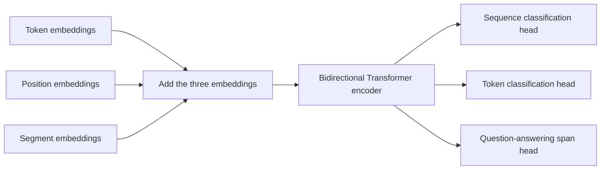

import PaperPdf from '@site/src/components/PaperPdf';

> **Devlin et al. · 2018** · [Read the embedded paper](#original-paper) · [Download PDF](/papers/research-papers/bert.pdf)


BERT learns a representation of a word using context on both sides, then adapts those representations to language-understanding tasks.

## Why looking in one direction can be limiting

Consider *“He went to the bank to deposit his salary.”* Before we reach the phrase “deposit his salary”, the word **bank** is ambiguous. The words after it make the intended meaning much clearer.

For understanding a sentence that is already available, there is no reason to hide its right-hand context. But ordinary next-token prediction has a problem: if a model can see the token it is asked to predict, it can simply copy the answer.

BERT resolves this by **hiding selected token information and asking the model to recover it**. It can use both the left and right context around the selected position.

## The main idea: masked language modelling

Start with an ordinary sentence:

```text
Original: The cat sat on the mat.
Input:    The [MASK] sat on the mat.
Target:   cat
```

The training label comes from the original text, so nobody needs to manually label “cat”. This is a self-supervised learning task.

The original procedure selects 15% of WordPiece positions. Of those selected positions, 80% are replaced with `[MASK]`, 10% with a random token, and 10% remain unchanged. The percentages are nested: **80% of the selected 15%**, not 80% of the whole sentence. The prediction loss is applied at the selected positions. See Section 3.1.

Why not replace every selected position with `[MASK]`? Downstream text normally contains actual words rather than mask markers. Mixing replacement strategies reduces the mismatch between pre-training and later use.

### A concrete count

In a batch containing 1,000 eligible token positions, selecting exactly 150 would give approximately:

| Treatment | Number of positions | Prediction target |
|---|---:|---|
| Replace with `[MASK]` | 120 | Original token |
| Replace with a random token | 15 | Original token |
| Leave unchanged | 15 | Original token |
| Not selected | 850 | No masked-token loss at that position |

These numbers illustrate the proportions. A particular random batch need not contain exactly these counts.

**An unscored position is still useful context.** “The” and “sat” help predict “cat”, even when we do not score their own predictions.

## Read the original pre-training and fine-tuning figure


*Figure 1 from the original paper, PDF page 3. [Source PDF](/papers/research-papers/bert.pdf#page=3).*

The left side shows pre-training objectives above the shared BERT encoder. The right side shows a question-answering task using that encoder. The important connection is the reuse of the learned representation, not reuse of the original prediction head.

BERT also uses **next sentence prediction**, or NSP. Its training pairs include actual consecutive segments and randomly paired segments. A classifier predicts which kind it received. This is a feature of the original BERT recipe; later encoder research changed or removed it.

### What goes into the encoder?

A token representation combines three embeddings:

$$
x_i=e_{\text{token},i}+e_{\text{position},i}+e_{\text{segment},i}.
$$

The token embedding represents the subword. The position embedding identifies its place. The segment embedding distinguishes the two input segments. Special tokens include `[CLS]` for a sequence-level representation and `[SEP]` for boundaries.



The branches are alternative downstream tasks. A sentiment classifier may use the `[CLS]` representation; named-entity recognition predicts a label at each token; extractive question answering predicts start and end positions in a passage.

## Bidirectional does not mean two independent models

A common misunderstanding is to imagine one network reading left to right, another reading right to left, and concatenating their outputs. BERT’s self-attention jointly uses the available tokens in every encoder layer.

That distinction matters for interaction. A word’s representation can use both sides before being passed into the next layer, where it participates in another round of contextualisation.

## Real-world uses and worked examples

### Documented use: understanding Google Search queries

In 2019, Google described using BERT for Search ranking and featured snippets. One example concerned a Brazilian traveller asking about travel to the United States: interpreting the direction of travel depended on a small connecting word, not just matching the two country names. [Google's BERT announcement](https://blog.google/products-and-platforms/products/search/search-language-understanding-bert/).

**What BERT contributes:** bidirectional context helps distinguish the relationships between query words. Search still needs retrieval and ranking machinery around that representation. BERT itself is not a web crawler or an answer-generating chat assistant.

### Worked example: routing customer-support tickets

Consider these two messages:

| Ticket | Intended route | Why keyword matching struggles |
|---|---|---|
| “I was charged twice, but my order arrived.” | Billing | “Order” also appears, but delivery succeeded |
| “The payment worked, but my order never arrived.” | Delivery | “Payment” appears, but it is not the complaint |

A BERT-based classifier can tokenise the complete message, run the encoder, and pass the `[CLS]` representation to a head trained on labelled ticket categories. The head learns which contextual patterns indicate billing or delivery issues. This is an illustrative application of BERT fine-tuning, not a claim about a named company's ticketing system.

### Another application: extracting an answer from a document

Given a returns policy and the question “How many days do I have?”, an extractive QA head can select the answer span “30 days” from the passage. The start/end heads identify text that already exists in the input. If the policy does not contain the answer, the application needs an explicit no-answer behaviour rather than treating the highest-scoring span as reliable evidence.

## Complete code: pre-train and fine-tune a bidirectional encoder

**Teaching implementation.** This script includes token, position and segment embeddings; bidirectional Transformer layers; the 80/10/10 corruption rule; MLM and NSP heads; pre-training; and downstream classification fine-tuning.

Save as `bert.py`, install PyTorch, then run `python bert.py`. Its generated sentence pairs use two small token groups as topics. They let us test the objectives without downloading BERT or a corpus.

```python
"""Train MLM + NSP, then fine-tune a small bidirectional encoder.
Teaching adaptation: integer tokens and synthetic sentence pairs, no WordPiece.
"""
import math
import torch
from torch import nn
import torch.nn.functional as F

torch.manual_seed(7)
torch.set_num_threads(1)

class Attention(nn.Module):
    def __init__(self, width, heads):
        super().__init__()
        assert width % heads == 0
        self.heads, self.size = heads, width // heads
        self.q = nn.Linear(width, width)
        self.k = nn.Linear(width, width)
        self.v = nn.Linear(width, width)
        self.out = nn.Linear(width, width)

    def forward(self, query, memory=None, causal=False):
        memory = query if memory is None else memory
        b, t, d = query.shape
        def split(x):
            return x.reshape(b, -1, self.heads, self.size).transpose(1, 2)
        q, k, v = split(self.q(query)), split(self.k(memory)), split(self.v(memory))
        scores = q @ k.transpose(-2, -1) / math.sqrt(self.size)
        if causal:
            mask = torch.ones(t, k.size(-2), dtype=torch.bool, device=query.device).triu(1)
            scores = scores.masked_fill(mask, float('-inf'))
        context = scores.softmax(-1) @ v
        return self.out(context.transpose(1, 2).reshape(b, t, d))

class Block(nn.Module):
    def __init__(self, width=32, heads=4, pre_norm=True):
        super().__init__()
        self.attn = Attention(width, heads)
        self.n1, self.n2 = nn.LayerNorm(width), nn.LayerNorm(width)
        self.ff = nn.Sequential(nn.Linear(width, 4*width), nn.GELU(), nn.Linear(4*width, width))
        self.pre_norm = pre_norm

    def forward(self, x, causal=True):
        if self.pre_norm:
            x = x + self.attn(self.n1(x), causal=causal)
            return x + self.ff(self.n2(x))
        x = self.n1(x + self.attn(x, causal=causal))
        return self.n2(x + self.ff(x))


# Specials: PAD=0, CLS=1, SEP=2, MASK=3. Two topics occupy disjoint token groups.
def batch(n):
    topic = torch.randint(2, (n,))
    is_next = torch.randint(2, (n,))
    other_topic = torch.where(is_next.bool(), topic, 1-topic)
    first = torch.randint(4, (n, 3)) + 4 + topic[:, None]*4
    second = torch.randint(4, (n, 3)) + 4 + other_topic[:, None]*4
    ids = torch.cat((torch.ones(n, 1, dtype=torch.long), first, torch.full((n, 1), 2),
                     second, torch.full((n, 1), 2)), dim=1)
    return ids, 1-is_next, topic  # NSP label 0 means IsNext.

def corrupt(ids):
    selected = (torch.rand(ids.shape) < .15) & (ids >= 4)
    # Ensure this tiny batch always has a supervised token.
    if not selected.any(): selected[0, 1] = True
    labels = ids.clone().masked_fill(~selected, -100)
    draw = torch.rand(ids.shape)
    inputs = ids.clone()
    inputs[selected & (draw < .8)] = 3
    random_tokens = torch.randint(4, 12, ids.shape)
    random_mask = selected & (draw >= .8) & (draw < .9)
    inputs[random_mask] = random_tokens[random_mask]
    return inputs, labels

class Bert(nn.Module):
    def __init__(self):
        super().__init__()
        self.word, self.pos, self.segment = nn.Embedding(12, 32), nn.Embedding(9, 32), nn.Embedding(2, 32)
        self.input_norm = nn.LayerNorm(32)
        self.blocks = nn.ModuleList([Block(pre_norm=False) for _ in range(2)])
        self.mlm_transform = nn.Sequential(nn.Linear(32, 32), nn.GELU(), nn.LayerNorm(32))
        self.mlm = nn.Linear(32, 12)
        self.mlm.weight = self.word.weight
        self.pool = nn.Sequential(nn.Linear(32, 32), nn.Tanh())
        self.nsp = nn.Linear(32, 2)
    def hidden(self, ids):
        segments = torch.tensor([0,0,0,0,0,1,1,1,1])
        x = self.input_norm(self.word(ids) + self.pos(torch.arange(9)) + self.segment(segments))
        for layer in self.blocks: x = layer(x, causal=False)
        return x
    def forward(self, ids):
        x = self.hidden(ids)
        return self.mlm(self.mlm_transform(x)), self.nsp(self.pool(x[:, 0]))

model = Bert()
optim = torch.optim.AdamW(model.parameters(), lr=.003)
for step in range(300):
    ids, next_labels, _ = batch(32)
    inputs, targets = corrupt(ids)
    mlm, nsp = model(inputs)
    loss = F.cross_entropy(mlm.reshape(-1, 12), targets.reshape(-1)) + F.cross_entropy(nsp, next_labels)
    optim.zero_grad(); loss.backward(); optim.step()
print('Pre-training loss:', round(loss.item(), 3))
# Fine-tune the whole encoder for topic classification of the first sentence.
head = nn.Linear(32, 2)
optim = torch.optim.AdamW(list(model.parameters()) + list(head.parameters()), lr=.001)
for step in range(100):
    ids, _, topic = batch(32)
    loss = F.cross_entropy(head(model.hidden(ids)[:, 0]), topic)
    optim.zero_grad(); loss.backward(); optim.step()
with torch.no_grad():
    ids, _, topic = batch(256)
    accuracy = (head(model.hidden(ids)[:, 0]).argmax(-1) == topic).float().mean()
print('Held-out topic accuracy:', accuracy.item())
assert torch.isfinite(loss)
torch.save({'encoder': model.state_dict(), 'head': head.state_dict()}, 'bert-demo.pt')
```

### Understand the labels and gradients

`corrupt` preserves the original token IDs as labels at selected positions and writes `-100` elsewhere. Cross-entropy ignores those unselected targets. That does not freeze their input embeddings: selected positions can attend to unselected context, propagating gradients through those interactions.

The masking draw chooses between a mask token, a random ordinary token and the unchanged original. The script masks on every generated batch. The original data-preparation pipeline generated masked training instances beforehand; both implement the same corruption proportions, but the data pipelines differ.

`Bert.hidden` adds three embedding sources and uses attention without a causal mask. The MLM head transforms each token state and predicts vocabulary logits. The NSP head reads the pooled first-token state. During fine-tuning, a new topic head uses that same encoder and updates its weights.

NSP here distinguishes matching-topic from different-topic pairs. That is an intentionally easy proxy; the original task samples actual consecutive and random segments from a corpus. The checked run achieved full topic accuracy on fresh synthetic examples, which does not measure language understanding.

## From pre-training to a task

Suppose our task is classifying product reviews. We first load a pretrained encoder, attach a classification head, and train on labelled reviews. Fine-tuning adjusts the encoder as well as the head unless we deliberately freeze it.

BERT-Base has 12 layers and 110 million parameters; BERT-Large has 24 layers and 340 million. The paper reports strong results across eleven NLP tasks. Its question-answering results concern finding answer spans in supplied passages, not freely chatting about arbitrary topics. The preprint appeared in 2018; the conference publication was NAACL 2019.

## Downstream heads: what exactly is predicted?

| Task | Input | Prediction | Loss labels |
|---|---|---|---|
| Single-sentence classification | One segment | Class from `[CLS]` | One class per example |
| Sentence-pair classification | Two segments with boundaries | Relationship class | One class per pair |
| Token labelling | A token sequence | Label at each relevant token | Entity/tag sequence |
| Extractive QA | Question plus passage | Start and end token positions | Two span indices |

For extractive QA, two learned scoring vectors produce start and end logits over positions. The selected span must lie in the supplied passage and satisfy decoding constraints. This is different from generating an answer token by token.

WordPiece tokenisation can split one word into several pieces. A token-labelling application must decide how word-level labels align to those pieces, and how special tokens and padding are excluded from its loss.

## Sections 4–5: results and ablations

An ablation removes or changes one ingredient to see how performance changes under comparable conditions. The paper compares bidirectional masked training with directional alternatives, studies the next-sentence objective, examines model size, and investigates feature extraction versus full fine-tuning.

**Feature extraction** freezes the encoder and trains a downstream component on its representations. **Fine-tuning** updates the encoder for the new task. Both reuse pre-training, but they allow different adaptation and incur different optimisation costs.

The original recipe trains on BooksCorpus and English Wikipedia, uses shorter sequences for most pre-training followed by longer sequences, and combines the two pre-training losses. The appendix contains task-specific preprocessing, settings and comparisons. These are part of interpreting the benchmark tables, especially when small dataset differences change the evaluation.

Removing NSP in one later encoder paper does not retroactively make the original BERT setup an MLM-only model. Conversely, BERT's ablation is not a universal proof that every bidirectional encoder needs NSP.

## BERT versus GPT

| Question | BERT | GPT-style causal model |
|---|---|---|
| What context can a token use? | Both sides of the supplied input | Earlier positions and itself |
| Typical pre-training target | Selected hidden tokens | Next token |
| Natural output | Contextual representations | Continuation probabilities |
| Typical use in these original papers | Fine-tuned understanding tasks | Generative modelling and transfer |

Neither column means the architecture can perform only one task forever. The comparison explains their original training choices.

## Pre-training details and the experiments behind the claims

### The next-sentence task is a balanced classification problem

The original construction uses two kinds of segment pairs: half contain the actual following segment, and half use a random segment from the corpus. The classifier reads the `[CLS]` representation and predicts which kind it received. A “sentence” here can be a text segment rather than exactly one grammatical sentence.

The full training loss combines masked-token prediction with next-sentence classification. A model can solve one objective better than the other; their sum is not a single measure of downstream understanding.

A useful distinction from ELMo is **where directions interact**. ELMo combines representations from separately trained directional language models. BERT's bidirectional attention allows left and right context to interact within each encoder layer. GPT-1 instead keeps the causal restriction during its representation computation.

### WordPiece, segment boundaries and training length

WordPiece breaks text into vocabulary pieces, including pieces that continue a word. Segment embeddings mark whether a token belongs to segment A or B; `[SEP]` marks boundaries. These signals are complementary: a separator is one token position, while a segment embedding accompanies each relevant token.

The original pre-training recipe uses shorter sequences for most updates and longer sequences near the end. Short examples make training less expensive; longer examples train the model to use the remaining position range. This is a data/compute choice, not a claim that a pretrained model can extend to unlimited positions.

The appendix also compares different masking mixtures. Using only mask markers can create a larger mismatch with downstream inputs. Leaving everything unchanged makes copying easier. The 80/10/10 mix balances these concerns, while the loss still targets all selected positions.

### How BERT decides that a passage has no answer

SQuAD 1.1 expects an answer span in the passage. SQuAD 2.0 includes questions for which no answer is present. BERT represents the no-answer option using the `[CLS]` position for both span boundaries.

Let the start and end scores at token i be $s_i$ and $e_i$. Compare:

$$
S_{\mathrm{span}}=\max_{j\geq i}(s_i+e_j),\qquad
S_{\mathrm{null}}=s_{\mathrm{CLS}}+e_{\mathrm{CLS}}.
$$

The model returns an answer only when the best permitted span beats the no-answer score by a threshold tuned on development data. In an actual implementation, span candidates must respect passage boundaries and length constraints.

For example, a paragraph listing a shop's opening hours does not answer who founded the shop. Choosing the most probable passage span anyway would turn a missing answer into a false one. The null comparison gives the system a learned alternative.

### What the task suite and ablations establish

| Evaluation | Output being evaluated | Important distinction |
|---|---|---|
| GLUE tasks | Classification or similarity scores | Different datasets test different relationships and use different metrics |
| SQuAD 1.1 | An answer span | Exact match and token-level F1 are not identical |
| SQuAD 2.0 | A span or no answer | Abstention threshold affects the result |
| SWAG | One of four plausible continuations | Rank candidate sequences rather than freely generate a continuation |
| Feature extraction | Labels from frozen representations | Tests reuse without updating the encoder |

The original ablations compare removing NSP and replacing bidirectional MLM with left-to-right training under matched conditions. These experiments support the original recipe within those comparisons. They do not isolate every possible interaction with data size, optimisation or later improvements.

For a clean reading of the appendix, separate **more parameters**, **more pre-training steps**, and **different corruption rules**. Each can change results for a different reason. A fair model comparison states which of them changed. [Original paper, Sections 3–5 and Appendices A–C](/papers/research-papers/bert.pdf).

## Summary

BERT turns recovering hidden tokens into a way to learn bidirectional representations. The representation is reused for downstream tasks, while the task head and training labels change.

The [authors’ code](https://github.com/google-research/bert) contains the original TensorFlow implementation and pre-training data preparation. **Read next:** [GPT-1](/docs/research-papers/gpt-1) to compare a causal pre-training objective with BERT’s masked objective.

## Checklist

- [ ] I can distinguish selected positions from positions replaced with `[MASK]`.
- [ ] I can explain why unmasked tokens still matter during training.
- [ ] I can distinguish pre-training from downstream fine-tuning.
- [ ] I can explain what BERT’s extractive question-answering head predicts.


## Original paper

<PaperPdf slug="bert" title="BERT: Pre-training of Deep Bidirectional Transformers for Language Understanding" />
