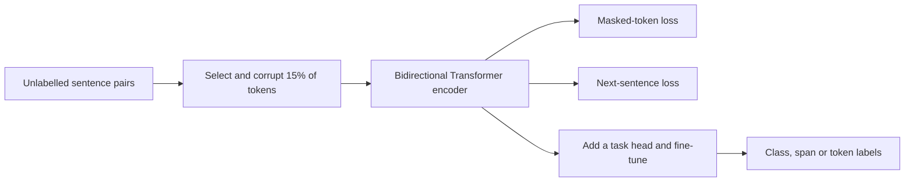
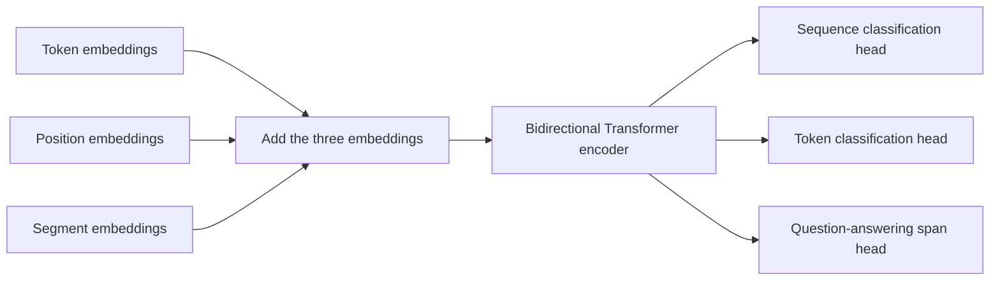

import PaperPdf from '@site/src/components/PaperPdf';
import CodeWalkthrough from '@site/src/components/viz/CodeWalkthrough';
import ResearchPaperLab from '@site/src/components/viz/ResearchPaperLab';

> **Devlin et al. · 2018** · [Read the embedded paper](#original-paper) ·
> [Download PDF](/papers/research-papers/bert.pdf) · Notes follow the paper
> section by section, §1 to Appendix C.

## Paper in one minute

**Problem.** A left-to-right language model cannot use future words when forming
the representation of a token, even when the whole sentence is available.

**Key idea.** Corrupt selected tokens and train a Transformer encoder to recover
them from both left and right context, then fine-tune the representation with a
small task-specific output head.

**Why it matters.** BERT made large-scale bidirectional pre-training a practical
default for classification, extraction and language understanding. It is an
encoder, not an autoregressive text generator.

### Training-to-task flow



## How to read this chapter

The walkthrough below follows the paper **in its own order**, from the abstract
to the appendix. Each heading carries the paper's section number, so you can
keep the PDF open beside it. Equations use the paper's notation. Boxes marked
**not from the paper** are teaching aids, such as analogies, derivations or
worked numbers, added to make a step easier to follow.

## Abstract: the three claims

The abstract makes three claims. The rest of the paper sets out to support
them.

1. BERT learns **deep bidirectional** representations. Every layer looks at
   words on both the left and the right of each position at the same time.
2. After pre-training, you add **just one output layer** and fine-tune. You do
   not need to design a new architecture for each task.
3. It sets a new **state of the art on eleven tasks**. "State of the art" means
   the best published result at the time.

The headline numbers come from four benchmarks. GLUE is a bundle of nine
sentence-understanding tasks. MultiNLI asks whether one sentence follows from
another. SQuAD asks the model to find the answer to a question inside a
paragraph, and F1 scores how much the predicted answer overlaps the correct one.

| Benchmark            | BERT's score | Gain claimed      |
| -------------------- | ------------ | ----------------- |
| GLUE score           | 80.5         | +7.7 points       |
| MultiNLI accuracy    | 86.7%        | +4.6 points       |
| SQuAD v1.1 Test F1   | 93.2         | +1.5 points       |
| SQuAD v2.0 Test F1   | 83.1         | +5.1 points       |

**What this shows:** the gains are large on every kind of task, from sentence
pairs to answer finding, and the same pre-trained model produced all of them.

:::tip Worked number: check the gains (not from the paper)

Each gain is BERT's score minus the best earlier score in the paper's own
tables: GLUE $80.5-72.8=7.7$ (OpenAI GPT, §4.1), MultiNLI $86.7-82.1=4.6$
(GPT, Table 1), SQuAD v1.1 $93.2-91.7=1.5$ (the top leaderboard ensemble, Table
2) and SQuAD v2.0 $83.1-78.0=5.1$ (the top leaderboard system, Table 3). All four
match.

:::

Keep these in mind: §3 builds the model, §4 supplies the evidence and §5 asks
which ingredients produced it.

## §1 Introduction: one-directional models are the bottleneck

Pre-training a language model on plain text, then reusing it, was already known
to help many tasks. Some tasks judge a whole sentence or a pair of sentences,
such as deciding whether one sentence follows from another. Others need an
answer for each token, such as tagging names or picking out an answer span.

The paper describes **two ways to reuse** a pre-trained model:

| Approach      | Example | What happens downstream                                                  |
| ------------- | ------- | ------------------------------------------------------------------------ |
| Feature-based | ELMo    | Freeze the model, feed its outputs as extra features into a task model   |
| Fine-tuning   | GPT     | Add a few new parameters and keep training **all** the pre-trained ones  |

Both learned their representations with a **unidirectional** (one-direction)
language model. The authors argue this is the main limitation. In GPT, each
token can only attend to tokens on its left. For sentence-level tasks that is
"sub-optimal". For token-level tasks such as question answering it can be
"very harmful", because the right-hand context often matters.

:::tip Intuition: why the right-hand words matter (not from the paper)

Consider _“He went to the bank to deposit his salary.”_ Before we reach the
phrase “deposit his salary”, the word **bank** is ambiguous. The words after it
make the intended meaning much clearer.

For understanding a sentence that is already available, there is no reason to
hide its right-hand context. But ordinary next-token prediction has a problem:
if a model can see the token it is asked to predict, it can simply copy the
answer.

BERT resolves this by **hiding selected token information and asking the model
to recover it**. It can use both the left and right context around the selected
position.

:::

BERT's fix is a **masked language model** (MLM). It hides some input tokens at
random and asks the model to predict them from the words around them. The idea
comes from the **Cloze task** (Taylor, 1953), a fill-in-the-blank test. BERT
also adds a **next sentence prediction** (NSP) task so that it learns how two
pieces of text relate.

The paper lists three contributions:

1. It shows that **bidirectional pre-training matters**. This contrasts with
   GPT (one direction) and with ELMo, which only glues together two separately
   trained one-direction models.
2. It shows that one pre-trained model **removes the need for many
   hand-designed task architectures**.
3. It **advances the state of the art on eleven NLP tasks**, and releases the
   code and models.

:::tip In the real world (not from the paper)

Fill-in-the-blank is a classic school exercise: `The cat sat on the ____.`
You use the words on **both** sides of the gap to guess it. BERT's pre-training
task is the same exercise, repeated billions of times on books and Wikipedia.

:::

## §2 Related work

### §2.1 Unsupervised feature-based approaches

Word embeddings, such as word2vec and GloVe, give each word one fixed vector
learned from unlabelled text. Later work extended the idea to sentences and
paragraphs. **ELMo** went further: it produces a _context-sensitive_ vector for
each token by joining a left-to-right model's output with a right-to-left
model's output. The paper stresses that ELMo is feature-based and "not deeply
bidirectional": the two directions never interact inside the network.

### §2.2 Unsupervised fine-tuning approaches

Here a whole encoder is pre-trained on unlabelled text and then fine-tuned on a
labelled task (Dai and Le; ULMFiT; OpenAI GPT). The advantage is that few
parameters must be learned from scratch. GPT used this recipe to reach the
previous best results on many GLUE tasks. BERT belongs to this family.

### §2.3 Transfer learning from supervised data

Transfer also works from large _labelled_ datasets, such as natural language
inference or machine translation. Computer vision showed the same pattern:
fine-tuning models pre-trained on ImageNet.

:::tip In the real world (not from the paper)

The ImageNet recipe is still the standard way to build a small image
classifier. A team with only a few hundred labelled photos starts from an
ImageNet-trained network and fine-tunes it. BERT brought that "start from a
pre-trained model" habit to language.

:::

## §3 BERT

The framework has **two steps**:

1. **Pre-training.** Train on unlabelled text with two tasks.
2. **Fine-tuning.** Start from the pre-trained weights and train **all**
   parameters on labelled data. Each task gets its own fine-tuned copy.

A distinctive feature is the **unified architecture**: the pre-trained model
and the final task model are almost the same network. The question-answering
example in Figure 1 serves as the running example.


_Figure 1 from the original paper, PDF page 3.
[Source PDF](/papers/research-papers/bert.pdf#page=3)._

The left side shows pre-training objectives above the shared BERT encoder. The
right side shows a question-answering task using that encoder. The important
connection is the reuse of the learned representation, not reuse of the
original prediction head.

**Model architecture.** BERT is a multi-layer **bidirectional Transformer
encoder**, almost identical to the original Transformer's encoder
(see [the Transformer chapter](/docs/research-papers/transformer)). The paper
names three sizes: $L$ is the number of layers, $H$ the hidden size (the width
of each token's vector) and $A$ the number of attention heads. The feed-forward
inner size is always $4H$ (footnote 3).

| Model      | $L$ | $H$  | $A$ | Feed-forward size | Parameters |
| ---------- | --- | ---- | --- | ----------------- | ---------- |
| BERT-Base  | 12  | 768  | 12  | 3072              | 110 M      |
| BERT-Large | 24  | 1024 | 16  | 4096              | 340 M      |

**What this shows:** Large is twice as deep and a third wider, giving about
three times the parameters.

BERT-Base was **chosen to match GPT's size**, so the two can be compared fairly.
The critical difference is the attention: BERT's self-attention sees both
sides, while GPT's is constrained to the left. Footnote 4 notes the naming
convention this created: the bidirectional version is often called a
"Transformer encoder" and the left-only version a "Transformer decoder".

:::tip Worked number: count the parameters (not from the paper)

For BERT-Base, one layer has four $768\times768$ attention projections plus a
$768\to3072\to768$ feed-forward network, about 7.09 M weights with biases and
layer norms. Twelve layers give 85.1 M. The embeddings add
$(30{,}000+512+2)\times768\approx23.4$ M, and the pooler about 0.6 M. The total
is about **109 M**, which rounds to the paper's 110 M.

The same count for BERT-Large gives about **335 M**, a little under the 340 M
the paper states. Treat both figures as rounded.

:::

#### Bidirectional does not mean two independent models (not from the paper)

A common misunderstanding is to imagine one network reading left to right,
another reading right to left, and concatenating their outputs. BERT’s
self-attention jointly uses the available tokens in every encoder layer.

That distinction matters for interaction. A word’s representation can use both
sides before being passed into the next layer, where it participates in another
round of contextualisation.

### Input/output representations

BERT has to accept either **one sentence** or **a pair of sentences** (for
example a question and a passage) as a single token sequence. In the paper a
"sentence" means any stretch of contiguous text, not a grammatical sentence.

- **WordPiece** tokenisation with a **30,000-token** vocabulary. WordPiece
  splits rare words into pieces; a piece that continues a word starts with
  `##`, as in `play ##ing`.
- The first token is always **`[CLS]`** (classification). Its final hidden
  vector, called $C\in\mathbb{R}^H$, summarises the whole sequence for
  classification tasks.
- Two sentences are separated by **`[SEP]`**, and each token also gets a learned
  **segment embedding** saying whether it belongs to sentence A or sentence B.
- The final hidden vector of the $i$-th token is $T_i\in\mathbb{R}^H$. The input
  embedding is written $E$.

A token's input is the **sum** of three embeddings (Figure 2 of the paper):

$$
x_i=e_{\text{token},i}+e_{\text{position},i}+e_{\text{segment},i}.
$$

In words: what the piece is, plus where it sits, plus which sentence it belongs
to. The paper states this in prose and in Figure 2; the equation is our
shorthand. Figure 2's example is `[CLS] my dog is cute [SEP] he likes play ##ing
[SEP]`, where the first five tokens get segment A and the rest segment B.

The token embedding represents the subword. The position embedding identifies
its place. The segment embedding distinguishes the two input segments.



The branches are alternative downstream tasks. A sentiment classifier may use
the `[CLS]` representation; named-entity recognition predicts a label at each
token; extractive question answering predicts start and end positions in a
passage.

:::tip Intuition: separator and segment do different jobs (not from the paper)

WordPiece breaks text into vocabulary pieces, including pieces that continue a
word. Segment embeddings mark whether a token belongs to segment A or B; `[SEP]`
marks boundaries. These signals are complementary: a separator is one token
position, while a segment embedding accompanies each relevant token.

:::

### §3.1 Pre-training BERT

BERT does **not** use a left-to-right or right-to-left language model. It uses
two unsupervised tasks instead. "Unsupervised" here means the labels come from
the text itself, not from human annotators.

#### Task #1: Masked LM

**Why not just train left-to-right and right-to-left together?** A normal
language model predicts the next word. If you let every layer see both sides,
each word could indirectly "see itself" through the layers, and the model would
simply copy the answer. So standard language models must be one-directional.

**The fix.** Hide some input tokens and predict only those. The paper calls this
a **masked LM** (MLM). The final hidden vectors at the hidden positions go into
a softmax over the vocabulary, as in a normal language model. In every
experiment, **15% of the WordPiece tokens** in each sequence are chosen at
random. Unlike a denoising auto-encoder, BERT predicts only the chosen tokens,
not the whole input.

:::tip Worked example: one masked sentence (not from the paper)

```text
Original: The cat sat on the mat.
Input:    The [MASK] sat on the mat.
Target:   cat
```

The training label comes from the original text, so nobody needs to manually
label “cat”. This is a self-supervised learning task.

:::

**The mismatch problem.** The `[MASK]` token appears in pre-training but never
in fine-tuning, when the model sees real text. To soften this, a chosen token is
not always replaced by `[MASK]`. If the $i$-th token is chosen, the data
generator replaces it with:

1. the `[MASK]` token **80%** of the time,
2. a **random** token **10%** of the time,
3. the **unchanged** $i$-th token **10%** of the time.

Then $T_i$ predicts the original token with a cross-entropy loss. The
percentages are nested: **80% of the selected 15%**, not 80% of the whole
sentence. Appendix C.2 compares other mixtures.

:::tip Worked number: a concrete count (not from the paper)

In a batch containing 1,000 eligible token positions, selecting exactly 150
would give approximately:

| Treatment                   | Number of positions | Prediction target                     |
| --------------------------- | ------------------: | ------------------------------------- |
| Replace with `[MASK]`       |                 120 | Original token                        |
| Replace with a random token |                  15 | Original token                        |
| Leave unchanged             |                  15 | Original token                        |
| Not selected                |                 850 | No masked-token loss at that position |

These numbers illustrate the proportions. A particular random batch need not
contain exactly these counts.

**An unscored position is still useful context.** “The” and “sat” help predict
“cat”, even when we do not score their own predictions.

:::

#### Task #2: Next Sentence Prediction (NSP)

Tasks such as question answering and natural language inference depend on how
**two sentences relate**. A language model does not learn that directly. So
BERT adds a simple binary task. For each training pair A and B:

- **50%** of the time B really follows A, labelled **IsNext**;
- **50%** of the time B is a random sentence from the corpus, labelled
  **NotNext**.

The `[CLS]` vector $C$ makes this prediction. A "sentence" here can be a text
segment rather than exactly one grammatical sentence. The final model reaches
**97–98% accuracy** on NSP (footnote 5). Footnote 6 adds a warning: $C$ is
**not a meaningful sentence representation without fine-tuning**, because it
was trained only for NSP.

The paper claims NSP is "very beneficial" to both QA and NLI, and points to
§5.1. It also contrasts BERT with earlier sentence-representation work: those
methods transferred only sentence embeddings, while BERT transfers **all**
parameters.

The full training loss combines masked-token prediction with next-sentence
classification. A model can solve one objective better than the other; their
sum is not a single measure of downstream understanding.

:::note Later work changed the verdict on NSP

RoBERTa (2019) found that removing NSP, and training on longer runs of
contiguous text, matched or improved downstream results. BERT's own §5.1
ablation shows the opposite for its setup. Both can be true: the finding
depends on how the training examples are built. Removing NSP in one later
encoder paper does not retroactively make the original BERT setup an MLM-only
model. Conversely, BERT's ablation is not a universal proof that every
bidirectional encoder needs NSP.

:::

#### Pre-training data

| Corpus            | Size             |
| ----------------- | ---------------- |
| BooksCorpus       | 800 M words      |
| English Wikipedia | 2,500 M words    |

For Wikipedia the authors keep only text passages and drop lists, tables and
headers. They call it "critical" to use a **document-level** corpus rather than
shuffled single sentences (such as the Billion Word Benchmark), so the model
can see long contiguous sequences. NSP needs real neighbouring sentences, which
a shuffled corpus destroys.

### §3.2 Fine-tuning BERT

Fine-tuning is simple because self-attention can model one text or a pair of
texts just by changing the input. Older systems encoded the two texts
separately and then added a "cross-attention" step between them. BERT puts the
pair into **one sequence**, so self-attention already lets every word in A look
at every word in B, in both directions.

For each task you plug in task inputs and outputs and fine-tune **all**
parameters end to end. Sentence A and B map onto tasks like this:

| Task type                    | Sentence A | Sentence B       |
| ---------------------------- | ---------- | ---------------- |
| Paraphrase                   | Sentence 1 | Sentence 2       |
| Entailment                   | Premise    | Hypothesis       |
| Question answering           | Question   | Passage          |
| Classification or tagging    | The text   | Empty (∅)        |

On the output side, token vectors $T_i$ feed a layer for token-level tasks
(tagging, answer spans), and $C$ feeds a layer for classification (entailment,
sentiment).

Fine-tuning is **cheap** next to pre-training. Every result in the paper can be
reproduced in at most **1 hour on a single Cloud TPU**, or a few hours on a GPU,
from the same pre-trained model. Footnote 7 gives an example: the SQuAD model
trains in about 30 minutes on one Cloud TPU to a Dev F1 of 91.0%.

#### From pre-training to a task (not from the paper)

Suppose our task is classifying product reviews. We first load a pretrained
encoder, attach a classification head, and train on labelled reviews.
Fine-tuning adjusts the encoder as well as the head unless we deliberately
freeze it.

BERT-Base has 12 layers and 110 million parameters; BERT-Large has 24 layers
and 340 million. The paper reports strong results across eleven NLP tasks. Its
question-answering results concern finding answer spans in supplied passages,
not freely chatting about arbitrary topics. The preprint appeared in 2018; the
conference publication was NAACL 2019.

#### Downstream heads: what exactly is predicted? (not from the paper)

| Task                           | Input                        | Prediction                    | Loss labels           |
| ------------------------------ | ---------------------------- | ----------------------------- | --------------------- |
| Single-sentence classification | One segment                  | Class from `[CLS]`            | One class per example |
| Sentence-pair classification   | Two segments with boundaries | Relationship class            | One class per pair    |
| Token labelling                | A token sequence             | Label at each relevant token  | Entity/tag sequence   |
| Extractive QA                  | Question plus passage        | Start and end token positions | Two span indices      |

For extractive QA, two learned scoring vectors produce start and end logits
over positions. The selected span must lie in the supplied passage and satisfy
decoding constraints. This is different from generating an answer token by
token.

WordPiece tokenisation can split one word into several pieces. A token-labelling
application must decide how word-level labels align to those pieces, and how
special tokens and padding are excluded from its loss. (The paper's own NER
experiment in §5.3 uses the first sub-token of each word.)

:::tip In the real world (not from the paper)

The Hugging Face `transformers` library packages exactly this step. Loading
`BertForSequenceClassification` gives you the pre-trained encoder with one new
linear layer on top of the pooled `[CLS]` output, ready to fine-tune. That is §3.2
turned into one line of code.

:::

## §4 Experiments

This section reports fine-tuning results on **11 NLP tasks**: the eight GLUE
tasks in Table 1, SQuAD v1.1, SQuAD v2.0 and SWAG. Each task uses a different
output and metric, so it helps to know what is being scored.

| Evaluation         | Output being evaluated              | Important distinction                                                     |
| ------------------ | ----------------------------------- | ------------------------------------------------------------------------- |
| GLUE tasks         | Classification or similarity scores | Different datasets test different relationships and use different metrics |
| SQuAD 1.1          | An answer span                      | Exact match and token-level F1 are not identical                          |
| SQuAD 2.0          | A span or no answer                 | Abstention threshold affects the result                                   |
| SWAG               | One of four plausible continuations | Rank candidate sequences rather than freely generate a continuation       |
| Feature extraction | Labels from frozen representations  | Tests reuse without updating the encoder                                  |

:::tip Worked number: where "eleven tasks" comes from (not from the paper)

GLUE contributes eight tasks in Table 1 (MNLI, QQP, QNLI, SST-2, CoLA, STS-B,
MRPC, RTE). Add SQuAD v1.1, SQuAD v2.0 and SWAG and you get eleven. The NER
experiment in §5.3 is not one of them: there BERT is "competitive", not the
best.

:::

### §4.1 GLUE

**GLUE** (General Language Understanding Evaluation) is a collection of
sentence and sentence-pair tasks. Appendix B.1 describes each one.

To fine-tune, BERT uses the `[CLS]` vector $C\in\mathbb{R}^H$ as the summary of
the input. The **only new parameters** are a classification matrix
$W\in\mathbb{R}^{K\times H}$, where $K$ is the number of labels. The loss is the
standard classification loss:

$$
\log\left(\operatorname{softmax}(CW^T)\right).
$$

In words: multiply the summary vector by $W$ to get one score per label, turn
the scores into probabilities, and reward a high probability for the correct
label.

**Settings.** Batch size 32, 3 epochs, and the best learning rate among 5e-5,
4e-5, 3e-5 and 2e-5 on the Dev set. BERT-Large was sometimes unstable on small
datasets, so the authors ran several random restarts (same checkpoint,
different data shuffling and classifier initialisation) and kept the best on
Dev. They made only one submission per model to the test server (footnote 9).

Headline results from Table 1 (GLUE test set):

| System          | MNLI-m | CoLA | RTE  | Average |
| --------------- | ------ | ---- | ---- | ------- |
| Pre-OpenAI SOTA | 80.6   | 35.0 | 61.7 | 74.0    |
| OpenAI GPT      | 82.1   | 45.4 | 56.0 | 75.1    |
| BERT-Base       | 84.6   | 52.1 | 66.4 | 79.6    |
| BERT-Large      | 86.7   | 60.5 | 70.1 | 82.1    |

**What this shows:** BERT-Base, the same size as GPT, already beats it on every
column. BERT-Large adds most on CoLA (+8.4 over Base, 8.5 k training examples)
and RTE (+3.7, 2.5 k examples). The pattern is not universal: on MRPC, also
small, Large adds only 0.4.

<details>
<summary>Full Table 1 from the paper</summary>

GLUE test results. The number under each task is its training-set size. F1 for
QQP and MRPC, Spearman correlation for STS-B, accuracy for the rest. The
"Average" excludes WNLI.

| System             | MNLI-(m/mm) | QQP  | QNLI | SST-2 | CoLA | STS-B | MRPC | RTE  | Average |
| ------------------ | ----------- | ---- | ---- | ----- | ---- | ----- | ---- | ---- | ------- |
| (training size)    | 392k        | 363k | 108k | 67k   | 8.5k | 5.7k  | 3.5k | 2.5k | -       |
| Pre-OpenAI SOTA    | 80.6/80.1   | 66.1 | 82.3 | 93.2  | 35.0 | 81.0  | 86.0 | 61.7 | 74.0    |
| BiLSTM+ELMo+Attn   | 76.4/76.1   | 64.8 | 79.8 | 90.4  | 36.0 | 73.3  | 84.9 | 56.8 | 71.0    |
| OpenAI GPT         | 82.1/81.4   | 70.3 | 87.4 | 91.3  | 45.4 | 80.0  | 82.3 | 56.0 | 75.1    |
| BERT-Base          | 84.6/83.4   | 71.2 | 90.5 | 93.5  | 52.1 | 85.8  | 88.9 | 66.4 | 79.6    |
| BERT-Large         | 86.7/85.9   | 72.1 | 92.7 | 94.9  | 60.5 | 86.5  | 89.3 | 70.1 | 82.1    |

</details>

The paper's reading:

- Both models beat all systems on all tasks, with average gains of **4.5 and
  7.0 points** over the prior state of the art.
- BERT-Base and GPT are nearly identical apart from the attention mask, so the
  gap points to bidirectionality.
- On MNLI, the largest task, BERT gains **4.6 points**.
- On the official GLUE leaderboard BERT-Large scores **80.5**, against GPT's
  **72.8**.
- BERT-Large beats BERT-Base on every task, most of all on small datasets
  (explored in §5.2).

:::note Two cautions when reading Table 1

**Two different "GLUE" numbers.** The abstract's 80.5 is the official
leaderboard score. Table 1's "Average" of 82.1 is the authors' own mean, which
drops the problematic WNLI task. They are not the same measurement.

**"By a substantial margin" is not true of every cell.** On SST-2, BERT-Base's
93.5 is only 0.3 above the earlier 93.2. The 4.5 and 7.0 gains are measured
against GPT's 75.1 average ($79.6-75.1$ and $82.1-75.1$), not the "Pre-OpenAI
SOTA" row. The average also mixes accuracy, F1 and correlation, so it is a
summary, not one physical unit.

:::

:::tip In the real world (not from the paper)

GLUE's QQP task comes from Quora's own question pairs, released by Quora to help
detect duplicate questions on its site. When two people ask "How do I learn
Python?" and "What is the best way to start with Python?", the site wants to
merge them so the answers are not split. That is sentence-pair classification
on $C$.

:::

### §4.2 SQuAD v1.1

**SQuAD v1.1** has 100 k crowd-sourced question and answer pairs. Given a
question and a Wikipedia passage that contains the answer, the model must
point to the **answer span** in the passage.

The question gets segment A and the passage segment B. Fine-tuning adds only a
**start vector** $S\in\mathbb{R}^H$ and an **end vector** $E\in\mathbb{R}^H$.
The probability that word $i$ starts the answer is a softmax over the paragraph:

$$
P_i=\frac{e^{S\cdot T_i}}{\sum_j e^{S\cdot T_j}}.
$$

In words: score every token by how well it matches the start vector, then turn
the scores into probabilities. The end works the same way with $E$. A candidate
span from $i$ to $j$ scores $S\cdot T_i+E\cdot T_j$, and the prediction is the
best span with $j\ge i$. Training maximises the log-likelihood of the correct
start and end. Settings: 3 epochs, learning rate 5e-5, batch 32.

The top leaderboard systems had no public descriptions and could use any data,
so the authors also fine-tune first on **TriviaQA** as modest data
augmentation.

| System (Table 2)              | Test EM | Test F1 |
| ----------------------------- | ------- | ------- |
| Human                         | 82.3    | 91.2    |
| #1 Ensemble, nlnet            | 86.0    | 91.7    |
| BERT-Large (single) + TriviaQA | 85.1   | 91.8    |
| BERT-Large (ensemble) + TriviaQA | 87.4 | 93.2    |

EM (exact match) counts answers that match the reference exactly.

**What this shows:** one BERT model already edges past the best ensemble on F1,
and the BERT ensemble beats it by 1.5.

<details>
<summary>Full Table 2 from the paper</summary>

SQuAD 1.1 results. The BERT ensemble is 7 systems that use different
pre-training checkpoints and fine-tuning seeds. A dash means not reported.

| System                    | Dev EM | Dev F1 | Test EM | Test F1 |
| ------------------------- | ------ | ------ | ------- | ------- |
| Human                     | -      | -      | 82.3    | 91.2    |
| #1 Ensemble, nlnet        | -      | -      | 86.0    | 91.7    |
| #2 Ensemble, QANet        | -      | -      | 84.5    | 90.5    |
| BiDAF+ELMo (single)       | -      | 85.6   | -       | 85.8    |
| R.M. Reader (ensemble)    | 81.2   | 87.9   | 82.3    | 88.5    |
| BERT-Base (single)        | 80.8   | 88.5   | -       | -       |
| BERT-Large (single)       | 84.1   | 90.9   | -       | -       |
| BERT-Large (ensemble)     | 85.8   | 91.8   | -       | -       |
| BERT-Large (single + TriviaQA)   | 84.2 | 91.1 | 85.1 | 91.8    |
| BERT-Large (ensemble + TriviaQA) | 86.2 | 92.2 | 87.4 | 93.2    |

</details>

Without TriviaQA, the authors lose only **0.1–0.4 F1** and still beat every
existing system.

:::note What Table 2 can and cannot confirm

The text claims **+1.3 F1 as a single system** over the top leaderboard single
system, but Table 2 does not list that system, so the figure cannot be checked
from the paper. The claim that one BERT model "outperforms the top ensemble" is
true for F1 (91.8 against 91.7) but not for EM (85.1 against 86.0).

:::

### §4.3 SQuAD v2.0

**SQuAD 2.0** adds questions whose answer is **not in the passage**, which is
more realistic. BERT's extension is small: an unanswerable question is treated
as a span that starts and ends at `[CLS]`. The start and end probabilities are
extended to include the `[CLS]` position.

At prediction time the model compares two scores:

$$
s_{\text{null}}=S\cdot C+E\cdot C,\qquad
\hat{s}_{i,j}=\max_{j\ge i}\,S\cdot T_i+E\cdot T_j.
$$

It predicts a real answer only when $\hat{s}_{i,j}>s_{\text{null}}+\tau$. The
threshold $\tau$ is chosen on the Dev set to maximise F1. In words: answer only
if the best real span beats "no answer" by a clear margin. In an actual
implementation, span candidates must respect passage boundaries and length
constraints. Settings: no TriviaQA, 2 epochs, learning rate 5e-5, batch 48.

:::tip Worked example: a passage with no answer (not from the paper)

A paragraph listing a shop's opening hours does not answer who founded the
shop. Choosing the most probable passage span anyway would turn a missing
answer into a false one. The null comparison gives the system a learned
alternative.

:::

| System (Table 3)        | Test EM | Test F1 |
| ----------------------- | ------- | ------- |
| Human                   | 86.9    | 89.5    |
| #1 Single, MIR-MRC (F-Net) | 74.8 | 78.0    |
| unet (ensemble)         | 71.4    | 74.9    |
| BERT-Large (single)     | 80.0    | 83.1    |

**What this shows:** a gain of **+5.1 F1** over the previous best system, from a
small change to the SQuAD v1.1 model. BERT-Large's Dev scores were 78.7 EM
and 81.9 F1. Systems that use BERT as a component are excluded.

### §4.4 SWAG

**SWAG** (Situations With Adversarial Generations) has 113 k examples. Given a
sentence, the model picks the most plausible of **four** continuations. It
tests common-sense inference.

BERT builds **four sequences**, each the given sentence (A) plus one candidate
(B). The only new parameter is a vector whose dot product with $C$ scores each
choice; a softmax over the four scores picks one. Settings: 3 epochs, learning
rate 2e-5, batch 16.

| System (Table 4)      | Dev  | Test |
| --------------------- | ---- | ---- |
| ESIM+ELMo             | 59.1 | 59.2 |
| OpenAI GPT            | -    | 78.0 |
| BERT-Large            | 86.6 | 86.3 |
| Human (expert)        | -    | 85.0 |
| Human (5 annotations) | -    | 88.0 |

**What this shows:** BERT-Large beats ESIM+ELMo by **27.1** points and GPT by
**8.3** ($86.3-59.2$ and $86.3-78.0$), and lands above the single-expert human
score. The paper also lists ESIM+GloVe (51.9 / 52.7) and BERT-Base (81.6 Dev).
Human figures come from only 100 samples.

:::tip In the real world (not from the paper)

Multiple-choice scoring like SWAG is how many model benchmarks still work: show
each candidate answer with the question, score each pair, and pick the highest.
The same pattern ranks candidate replies in a customer-service tool that
suggests one of several canned answers.

:::

## §5 Ablation studies

An **ablation** removes or changes one ingredient and measures the effect under
comparable conditions. This section asks which parts of BERT matter. More
ablations are in Appendix C.

### §5.1 Effect of pre-training tasks

The authors keep the **same data, fine-tuning scheme and hyperparameters** as
BERT-Base and change only the pre-training objective:

- **No NSP:** masked LM, but no next sentence prediction.
- **LTR & No NSP:** a standard left-to-right (LTR) language model, like GPT,
  with no NSP. The left-only mask is kept at fine-tuning too, because removing
  it hurt results. This is "directly comparable to OpenAI GPT" but with BERT's
  larger data, input representation and fine-tuning scheme.
- **+ BiLSTM:** the LTR model with a randomly initialised BiLSTM added on top
  during fine-tuning, as a good-faith attempt to give it right-hand context.

Table 5 (Dev set):

| Model         | MNLI-m (Acc) | QNLI (Acc) | MRPC (Acc) | SST-2 (Acc) | SQuAD (F1) |
| ------------- | ------------ | ---------- | ---------- | ----------- | ---------- |
| BERT-Base     | 84.4         | 88.4       | 86.7       | 92.7        | 88.5       |
| No NSP        | 83.9         | 84.9       | 86.5       | 92.6        | 87.9       |
| LTR & No NSP  | 82.1         | 84.3       | 77.5       | 92.1        | 77.8       |
| + BiLSTM      | 82.1         | 84.1       | 75.7       | 91.6        | 84.9       |

**What this shows:** removing NSP costs most on QNLI (3.5 points). Switching from
masked to left-to-right costs far more, especially on MRPC (9.0) and SQuAD
(10.1). A BiLSTM on top recovers part of the SQuAD loss but hurts GLUE.

The paper's reading:

- **NSP:** removing it "hurts performance significantly" on QNLI, MNLI and
  SQuAD 1.1.
- **Bidirectionality:** the LTR model is worse on every task, with big drops on
  MRPC and SQuAD. For SQuAD this is expected: an LTR token has no right-hand
  context when the answer depends on it.
- **BiLSTM:** it helps SQuAD a lot (77.8 to 84.9) but stays far below the
  bidirectional models, and it hurts the GLUE tasks.

The original ablations compare removing NSP and replacing bidirectional MLM with
left-to-right training under matched conditions. These experiments support the
original recipe within those comparisons. They do not isolate every possible
interaction with data size, optimisation or later improvements.

**Why not ELMo-style LTR + RTL?** The authors say one could train separate
left-to-right and right-to-left models and concatenate them, but (a) that costs
twice as much as one bidirectional model, (b) it is odd for QA, because the
right-to-left model cannot condition the answer on the question, and (c) it is
"strictly less powerful" than a deep bidirectional model, which uses both sides
at every layer.

:::note What the ablation does not measure

"Significantly" is used without error bars or repeated runs. The MNLI drop from
NSP removal is only 0.5 points (84.4 to 83.9) and SQuAD's is 0.6. The claim that
the BiLSTM "hurts performance on the GLUE tasks" does not hold on MNLI, where
both rows read 82.1. And argument (c) against LTR + RTL is reasoned, not tested:
the paper never trains an ELMo-style concatenation of two Transformers.

:::

### §5.2 Effect of model size

The authors train BERT models of different depths and widths with otherwise the
same recipe. Each Dev score is the **average of 5 fine-tuning restarts**. "LM
(ppl)" is the masked-LM **perplexity** on held-out training data: lower means
the model predicts hidden tokens better.

| $L$ | $H$  | $A$ | LM (ppl) | MNLI-m | MRPC | SST-2 |
| --- | ---- | --- | -------- | ------ | ---- | ----- |
| 3   | 768  | 12  | 5.84     | 77.9   | 79.8 | 88.4  |
| 12  | 768  | 12  | 3.99     | 84.4   | 86.7 | 92.9  |
| 24  | 1024 | 16  | 3.23     | 86.6   | 87.8 | 93.7  |

**What this shows:** every step up in size improves every task, even MRPC, which
has only about 3,600 training examples.

<details>
<summary>Full Table 6 from the paper</summary>

Ablation over BERT model size, Dev set accuracy. #L layers, #H hidden size, #A
attention heads.

| #L  | #H   | #A  | LM (ppl) | MNLI-m | MRPC | SST-2 |
| --- | ---- | --- | -------- | ------ | ---- | ----- |
| 3   | 768  | 12  | 5.84     | 77.9   | 79.8 | 88.4  |
| 6   | 768  | 3   | 5.24     | 80.6   | 82.2 | 90.7  |
| 6   | 768  | 12  | 4.68     | 81.9   | 84.8 | 91.3  |
| 12  | 768  | 12  | 3.99     | 84.4   | 86.7 | 92.9  |
| 12  | 1024 | 16  | 3.54     | 85.7   | 86.9 | 93.3  |
| 24  | 1024 | 16  | 3.23     | 86.6   | 87.8 | 93.7  |

</details>

The paper's reading: larger models give "a strict accuracy improvement".
Bigger models were known to help large tasks such as translation. The authors
believe this is the first convincing demonstration that **extreme size also
helps very small tasks**, provided the model is well pre-trained. For scale,
the largest Transformer in the original Transformer paper had about 100 M
encoder parameters, and the largest the authors found anywhere had 235 M
(Al-Rfou et al., 2018). BERT-Large has 340 M.

They explain why earlier feature-based studies saw mixed results from growing
the model: when you fine-tune directly and add only a few new parameters, the
task can benefit from a bigger pre-trained representation even with little
data. This is stated as a **hypothesis**.

:::note "Four datasets" versus three columns

The text says larger models improve accuracy "across all four datasets", but
Table 6 reports only three tasks (MNLI-m, MRPC, SST-2). The fourth column is the
LM perplexity. Also note the BERT-Base row reads 92.9 on SST-2 here but 92.7 in
Table 5; Table 6 averages five restarts, which likely explains the gap.

:::

### §5.3 Feature-based approach with BERT

So far every result used **fine-tuning**. The **feature-based** approach freezes
BERT and feeds its activations into a separate model. It has two advantages:
some tasks need an architecture a Transformer encoder cannot express, and you
can compute the expensive features **once** and then run many cheap experiments
on top.

**Feature extraction** freezes the encoder and trains a downstream component on
its representations. **Fine-tuning** updates the encoder for the new task. Both
reuse pre-training, but they allow different adaptation and incur different
optimisation costs.

The test is **CoNLL-2003 named-entity recognition** (NER), tagging people,
places and organisations. The setup uses a case-preserving WordPiece model,
the maximal document context, no CRF output layer, and the **first sub-token**
of each word as input to the tagger. For the feature-based runs, activations
from one or more layers go into a randomly initialised two-layer 768-dimensional
BiLSTM before the classifier.

Table 7 (scores averaged over 5 restarts):

| System                                      | Dev F1 | Test F1 |
| ------------------------------------------- | ------ | ------- |
| CSE (best earlier)                          | -      | 93.1    |
| Fine-tuning BERT-Large                      | 96.6   | 92.8    |
| Fine-tuning BERT-Base                       | 96.4   | 92.4    |
| Features: concat last four layers (Base)    | 96.1   | -       |
| Features: embeddings only (Base)            | 91.0   | -       |

**What this shows:** frozen features from the top four layers come within
**0.3 F1** of full fine-tuning (96.1 against 96.4), so BERT works both ways.

<details>
<summary>Full Table 7 from the paper</summary>

CoNLL-2003 NER. Hyperparameters chosen on Dev; scores averaged over 5 random
restarts.

| System                                 | Dev F1 | Test F1 |
| -------------------------------------- | ------ | ------- |
| ELMo                                   | 95.7   | 92.2    |
| CVT                                    | -      | 92.6    |
| CSE                                    | -      | 93.1    |
| Fine-tuning: BERT-Large                | 96.6   | 92.8    |
| Fine-tuning: BERT-Base                 | 96.4   | 92.4    |
| Feature-based (Base): Embeddings       | 91.0   | -       |
| Feature-based: Second-to-last hidden   | 95.6   | -       |
| Feature-based: Last hidden             | 94.9   | -       |
| Feature-based: Weighted sum last four  | 95.9   | -       |
| Feature-based: Concat last four hidden | 96.1   | -       |
| Feature-based: Weighted sum all 12     | 95.5   | -       |

</details>

The paper calls BERT-Large "competitive" with the state of the art here, and
the test column confirms the wording: 92.8 is below CSE's 93.1.

:::tip In the real world (not from the paper)

The "compute once, reuse many times" advantage is how many search and
recommendation systems use encoders today. They run every document through a
frozen model once, store the vectors, and train or tune small models on top
without touching the encoder again.

:::

## §6 Conclusion

Transfer learning with language models had shown that rich unsupervised
pre-training helps, even for low-resource tasks, using **unidirectional**
architectures. The paper's main contribution is to extend this to **deep
bidirectional** architectures, so that one pre-trained model handles a broad set
of NLP tasks.

## Appendix A: additional details for BERT

### A.1 Illustration of the pre-training tasks

**Masked LM.** Take the sentence `my dog is hairy` and suppose the 4th token,
`hairy`, is chosen:

| Share | What happens            | Example                   |
| ----- | ----------------------- | ------------------------- |
| 80%   | Replace with `[MASK]`   | `my dog is [MASK]`        |
| 10%   | Replace with a random word | `my dog is apple`      |
| 10%   | Keep it unchanged       | `my dog is hairy`         |

The unchanged case exists "to bias the representation towards the actual
observed word". The advantage of the mix: the encoder does not know which words
it will be asked to predict or which were swapped, so it must keep a good
contextual representation of **every** token. Random replacement hits only
**1.5%** of all tokens (10% of 15%), which "does not seem to harm" language
understanding.

Why not replace every selected position with `[MASK]`? Downstream text normally
contains actual words rather than mask markers. Mixing replacement strategies
reduces the mismatch between pre-training and later use.

Because MLM predicts only 15% of tokens per batch, it may need more
pre-training steps than a left-to-right model. Appendix C.1 finds it converges
only slightly slower, and the accuracy gain "far outweighs" the extra cost.

**Next sentence prediction.** The paper's two examples, with masking applied:

```text
Input = [CLS] the man went to [MASK] store [SEP] he bought a gallon [MASK] milk [SEP]
Label = IsNext

Input = [CLS] the man [MASK] to the store [SEP] penguin [MASK] are flight ##less birds [SEP]
Label = NotNext
```

### A.2 Pre-training procedure

Each training input is two spans of text, called "sentences" although they are
usually much longer than one sentence. The first gets the A embedding and the
second the B embedding. Half the time B is the real next span. The pair is
sampled so the combined length is **at most 512 tokens**. Masking happens after
WordPiece tokenisation at a uniform 15%, with no special handling of partial
word pieces.

| Setting                  | Value                                                         |
| ------------------------ | ------------------------------------------------------------- |
| Batch                    | 256 sequences (256 × 512 = "128,000 tokens/batch")            |
| Steps                    | 1,000,000, "approximately 40 epochs" over 3.3 B words         |
| Optimiser                | Adam, learning rate 1e-4, $\beta_1=0.9$, $\beta_2=0.999$      |
| Weight decay             | L2, 0.01                                                      |
| Learning-rate schedule   | Warm-up over the first 10,000 steps, then linear decay        |
| Dropout                  | 0.1 on all layers                                             |
| Activation               | GELU (following OpenAI GPT) instead of ReLU                   |
| Loss                     | Mean MLM likelihood + mean NSP likelihood                     |
| Hardware, Base           | 4 Cloud TPUs in Pod configuration (16 TPU chips), 4 days      |
| Hardware, Large          | 16 Cloud TPUs (64 TPU chips), 4 days                          |

**Two sequence lengths.** Attention cost grows with the square of the sequence
length, so long sequences are expensive. The authors pre-train at length
**128 for 90% of the steps**, then at **512 for the last 10%** "to learn the
positional embeddings".

Short examples make training less expensive; longer examples train the model to
use the remaining position range. This is a data and compute choice, not a claim
that a pretrained model can extend to unlimited positions.

:::note The "40 epochs" figure assumes full-length batches

$256\times512=131{,}072$ tokens, which the paper rounds to 128,000. Then
$10^6\times128{,}000\approx1.28\times10^{11}$ tokens over 3.3 B words is about
39 passes, matching "approximately 40 epochs". But 90% of the steps use length
128, where a batch holds only $256\times128=32{,}768$ tokens. The real total is
about $0.9\times10^6\times32{,}768+0.1\times10^6\times131{,}072\approx4.3\times10^{10}$
tokens, roughly **13 passes**. The paper also mixes "tokens" and "words" for
the same batch (A.2 against A.4 and C.1). The epoch count describes a
512-token-only schedule, not the one actually described.

:::

### A.3 Fine-tuning procedure

Most hyperparameters stay as in pre-training. Dropout stays at 0.1. Only batch
size, learning rate and number of epochs change. The best values are
task-specific, but these ranges worked well across all tasks:

| Setting              | Values tried           |
| -------------------- | ---------------------- |
| Batch size           | 16, 32                 |
| Learning rate (Adam) | 5e-5, 3e-5, 2e-5       |
| Epochs               | 2, 3, 4                |

Large datasets (100 k+ labelled examples) were far less sensitive to these
choices than small ones. Since fine-tuning is fast, the authors suggest simply
trying every combination and keeping the best on the Dev set.

### A.4 Comparison of BERT, ELMo and OpenAI GPT

Figure 3 of the paper draws the three architectures side by side. BERT uses a
bidirectional Transformer, GPT a left-to-right Transformer, and ELMo a
concatenation of separately trained left-to-right and right-to-left LSTMs. Only
BERT conditions on both sides **in all layers**. BERT and GPT are fine-tuning
approaches; ELMo is feature-based.

A useful distinction from ELMo is **where directions interact**. ELMo combines
representations from separately trained directional language models. BERT's
bidirectional attention allows left and right context to interact within each
encoder layer. GPT-1 instead keeps the causal restriction during its
representation computation.

Many BERT design choices were made **deliberately close to GPT** so the two
could be compared. The paper lists the other differences:

| Difference                  | GPT                                      | BERT                                        |
| --------------------------- | ---------------------------------------- | ------------------------------------------- |
| Pre-training data           | BooksCorpus (800 M words)                | BooksCorpus + Wikipedia (2,500 M words)     |
| `[SEP]`, `[CLS]`, A/B embeddings | Introduced only at fine-tuning       | Learned during pre-training                 |
| Batch and steps             | 1 M steps, 32,000 words per batch        | 1 M steps, 128,000 words per batch          |
| Fine-tuning learning rate   | 5e-5 for every task                      | Chosen per task on Dev                      |

To isolate these effects the authors point to §5.1. They conclude that most of
the improvement comes from the two pre-training tasks and the bidirectionality
they enable.

:::note The GPT comparison is only partly controlled

§5.1's "LTR & No NSP" row controls for data, input format and fine-tuning. It
does not reproduce GPT's exact recipe. So Table 1's BERT-Base against GPT gap mixes objective, data
and batch size (BERT's batches hold four times as many words); only Table 5
separates the objective.

:::

### A.5 Illustrations of fine-tuning on different tasks

Figure 4 shows four fine-tuning set-ups, each adding one output layer: (a)
sentence-pair classification such as MNLI, (b) single-sentence classification
such as SST-2, (c) question answering such as SQuAD, and (d) single-sentence
tagging such as NER. (a) and (b) are sequence-level and read $C$; (c) and (d)
are token-level and read the $T_i$.

## Appendix B: detailed experimental setup

### B.1 The GLUE benchmark tasks

| Task  | What it asks                                                                    | Metric in Table 1 |
| ----- | ------------------------------------------------------------------------------- | ----------------- |
| MNLI  | Does sentence 2 follow from, contradict, or say nothing about sentence 1?       | Accuracy          |
| QQP   | Are two Quora questions asking the same thing?                                  | F1                |
| QNLI  | Does this sentence contain the answer to this question? (from SQuAD)            | Accuracy          |
| SST-2 | Is this movie-review sentence positive or negative?                             | Accuracy          |
| CoLA  | Is this English sentence grammatically acceptable?                              | Accuracy (per caption) |
| STS-B | How similar in meaning are two sentences, from 1 to 5?                          | Spearman          |
| MRPC  | Are two news sentences paraphrases?                                             | F1                |
| RTE   | Does sentence 2 follow from sentence 1? (like MNLI, much less data)             | Accuracy          |
| WNLI  | A small pronoun-resolution inference set                                        | Excluded          |

**WNLI** is excluded. The GLUE site notes problems with how it was built, and
every submitted system had scored below the 65.1 majority-class baseline. For
their GLUE submission the authors always predicted the majority class.
Footnote 14 adds that all results are single-task; multi-task training with
MNLI gave "substantial improvements" on RTE, but those results are not
reported.

The appendix contains task-specific preprocessing, settings and comparisons.
These are part of interpreting the benchmark tables, especially when small
dataset differences change the evaluation.

:::note CoLA's metric

Table 1's caption says every task other than QQP, MRPC and STS-B reports
accuracy. The official GLUE metric for CoLA is Matthews correlation, and the
GPT paper labels the same 45.4 as "mc". The caption appears to be loose on this
column.

:::

## Appendix C: additional ablation studies

For a clean reading of the appendix, separate **more parameters**, **more
pre-training steps**, and **different corruption rules**. Each can change
results for a different reason. A fair model comparison states which of them
changed.

### C.1 Effect of number of training steps

Figure 5 plots MNLI Dev accuracy after fine-tuning from checkpoints pre-trained
for $k$ steps. It answers two questions:

1. **Does BERT really need 1 M steps?** Yes. BERT-Base gains almost **1.0%**
   on MNLI at 1 M steps compared with 500 k.
2. **Does MLM converge more slowly than LTR, since it predicts only 15% of
   tokens?** Slightly, yes. But the MLM model starts to beat the LTR model in
   absolute accuracy "almost immediately".

### C.2 Ablation for different masking procedures

The masking mix exists to reduce the pre-train and fine-tune mismatch. The
authors test it on MNLI and NER. For NER they also test the **feature-based**
approach (concatenating the last four layers), where they expect the mismatch
to hurt more because the model cannot adjust its representations.

In Table 8, MASK means replace with `[MASK]`, SAME means keep the token, RND
means replace with a random token.

| MASK | SAME | RND  | MNLI (fine-tune) | NER (fine-tune) | NER (feature-based) |
| ---- | ---- | ---- | ---------------- | --------------- | ------------------- |
| 80%  | 10%  | 10%  | 84.2             | 95.4            | 94.9                |
| 100% | 0%   | 0%   | 84.3             | 94.9            | 94.0                |
| 0%   | 0%   | 100% | 83.6             | 94.9            | 94.6                |

**What this shows:** fine-tuning barely cares about the mix. Using only
`[MASK]` hurts the feature-based NER most (94.0), and using only random tokens
is clearly worse too.

<details>
<summary>Full Table 8 from the paper</summary>

Ablation over masking strategies, Dev set results.

| MASK | SAME | RND  | MNLI fine-tune | NER fine-tune | NER feature-based |
| ---- | ---- | ---- | -------------- | ------------- | ----------------- |
| 80%  | 10%  | 10%  | 84.2           | 95.4          | 94.9              |
| 100% | 0%   | 0%   | 84.3           | 94.9          | 94.0              |
| 80%  | 0%   | 20%  | 84.1           | 95.2          | 94.6              |
| 80%  | 20%  | 0%   | 84.4           | 95.2          | 94.7              |
| 0%   | 20%  | 80%  | 83.7           | 94.8          | 94.6              |
| 0%   | 0%   | 100% | 83.6           | 94.9          | 94.6              |

</details>

The paper's reading: fine-tuning is "surprisingly robust" to the masking
strategy; MASK-only is "problematic" for the feature-based approach; RND-only
is "much worse" than BERT's mix.

Using only mask markers can create a larger mismatch with downstream inputs.
The 80/10/10 mix balances this against the noise of random tokens, while the
loss still targets all selected positions. A mix that leaves every selected
token unchanged would let the model copy its input; Table 8 does not test that
case, so this last point is reasoning rather than a measured result.

:::note Table 8 does not quite match Tables 5 and 7

On MNLI, 80/10/10 scores 84.2, but 100% MASK scores 84.3 and 80/20/0 scores 84.4:
the chosen mix is not the best fine-tuning setting, though every gap is tiny.
Table 8's own 80/10/10 row also differs from the same configuration elsewhere:
MNLI 84.2 here against 84.4 in Table 5, NER fine-tuning 95.4 against 96.4 in
Table 7, and concat-last-four features 94.9 against 96.1. The paper does not
explain the differences; the ablation was probably run with a shorter or
otherwise different setup, so compare rows within Table 8 only.

:::

## Real-world uses and worked examples

### Documented use: understanding Google Search queries

In 2019, Google described using BERT for Search ranking and featured snippets.
One example concerned a Brazilian traveller asking about travel to the United
States: interpreting the direction of travel depended on a small connecting
word, not just matching the two country names.
[Google's BERT announcement](https://blog.google/products-and-platforms/products/search/search-language-understanding-bert/).

**What BERT contributes:** bidirectional context helps distinguish the
relationships between query words. Search still needs retrieval and ranking
machinery around that representation. BERT itself is not a web crawler or an
answer-generating chat assistant.

### Worked example: routing customer-support tickets

Consider these two messages:

| Ticket                                             | Intended route | Why keyword matching struggles                  |
| -------------------------------------------------- | -------------- | ----------------------------------------------- |
| “I was charged twice, but my order arrived.”       | Billing        | “Order” also appears, but delivery succeeded    |
| “The payment worked, but my order never arrived.”  | Delivery       | “Payment” appears, but it is not the complaint  |

A BERT-based classifier can tokenise the complete message, run the encoder, and
pass the `[CLS]` representation to a head trained on labelled ticket categories.
The head learns which contextual patterns indicate billing or delivery issues.
This is an illustrative application of BERT fine-tuning, not a claim about a
named company's ticketing system.

### Another application: extracting an answer from a document

Given a returns policy and the question “How many days do I have?”, an
extractive QA head can select the answer span “30 days” from the passage. The
start/end heads identify text that already exists in the input. If the policy
does not contain the answer, the application needs an explicit no-answer
behaviour rather than treating the highest-scoring span as reliable evidence.

## Interactive lab

Switch among the three MLM corruption cases and keep track of the unchanged
prediction target. This makes the often-misremembered 80/10/10 rule concrete.

<ResearchPaperLab lab="bert" />

## Complete code: pre-train and fine-tune a bidirectional encoder

<CodeWalkthrough paper="bert" />

**Teaching implementation.** This script includes token, position and segment embeddings; bidirectional Transformer layers; the 80/10/10 corruption rule; MLM and NSP heads; pre-training; and downstream classification fine-tuning.

Save as `bert.py`, install PyTorch, then run `python bert.py`. Its generated sentence pairs use two small token groups as topics. They let us test the objectives without downloading BERT or a corpus.

<details>
<summary>Complete runnable script</summary>

```python
"""Train MLM + NSP, then fine-tune a small bidirectional encoder.
Teaching adaptation: integer tokens and synthetic sentence pairs, no WordPiece.
"""
import math
import torch
from torch import nn
import torch.nn.functional as F

torch.manual_seed(7)
torch.set_num_threads(1)

class Attention(nn.Module):
    def __init__(self, width, heads):
        super().__init__()
        assert width % heads == 0
        self.heads, self.size = heads, width // heads
        self.q = nn.Linear(width, width)
        self.k = nn.Linear(width, width)
        self.v = nn.Linear(width, width)
        self.out = nn.Linear(width, width)

    def forward(self, query, memory=None, causal=False):
        memory = query if memory is None else memory
        b, t, d = query.shape
        def split(x):
            return x.reshape(b, -1, self.heads, self.size).transpose(1, 2)
        q, k, v = split(self.q(query)), split(self.k(memory)), split(self.v(memory))
        scores = q @ k.transpose(-2, -1) / math.sqrt(self.size)
        if causal:
            mask = torch.ones(t, k.size(-2), dtype=torch.bool, device=query.device).triu(1)
            scores = scores.masked_fill(mask, float('-inf'))
        context = scores.softmax(-1) @ v
        return self.out(context.transpose(1, 2).reshape(b, t, d))

class Block(nn.Module):
    def __init__(self, width=32, heads=4, pre_norm=True):
        super().__init__()
        self.attn = Attention(width, heads)
        self.n1, self.n2 = nn.LayerNorm(width), nn.LayerNorm(width)
        self.ff = nn.Sequential(nn.Linear(width, 4*width), nn.GELU(), nn.Linear(4*width, width))
        self.pre_norm = pre_norm

    def forward(self, x, causal=True):
        if self.pre_norm:
            x = x + self.attn(self.n1(x), causal=causal)
            return x + self.ff(self.n2(x))
        x = self.n1(x + self.attn(x, causal=causal))
        return self.n2(x + self.ff(x))


# Specials: PAD=0, CLS=1, SEP=2, MASK=3. Two topics occupy disjoint token groups.
def batch(n):
    topic = torch.randint(2, (n,))
    is_next = torch.randint(2, (n,))
    other_topic = torch.where(is_next.bool(), topic, 1-topic)
    first = torch.randint(4, (n, 3)) + 4 + topic[:, None]*4
    second = torch.randint(4, (n, 3)) + 4 + other_topic[:, None]*4
    ids = torch.cat((torch.ones(n, 1, dtype=torch.long), first, torch.full((n, 1), 2),
                     second, torch.full((n, 1), 2)), dim=1)
    return ids, 1-is_next, topic  # NSP label 0 means IsNext.

def corrupt(ids):
    selected = (torch.rand(ids.shape) < .15) & (ids >= 4)
    # Ensure this tiny batch always has a supervised token.
    if not selected.any(): selected[0, 1] = True
    labels = ids.clone().masked_fill(~selected, -100)
    draw = torch.rand(ids.shape)
    inputs = ids.clone()
    inputs[selected & (draw < .8)] = 3
    random_tokens = torch.randint(4, 12, ids.shape)
    random_mask = selected & (draw >= .8) & (draw < .9)
    inputs[random_mask] = random_tokens[random_mask]
    return inputs, labels

class Bert(nn.Module):
    def __init__(self):
        super().__init__()
        self.word, self.pos, self.segment = nn.Embedding(12, 32), nn.Embedding(9, 32), nn.Embedding(2, 32)
        self.input_norm = nn.LayerNorm(32)
        self.blocks = nn.ModuleList([Block(pre_norm=False) for _ in range(2)])
        self.mlm_transform = nn.Sequential(nn.Linear(32, 32), nn.GELU(), nn.LayerNorm(32))
        self.mlm = nn.Linear(32, 12)
        self.mlm.weight = self.word.weight
        self.pool = nn.Sequential(nn.Linear(32, 32), nn.Tanh())
        self.nsp = nn.Linear(32, 2)
    def hidden(self, ids):
        segments = torch.tensor([0,0,0,0,0,1,1,1,1])
        x = self.input_norm(self.word(ids) + self.pos(torch.arange(9)) + self.segment(segments))
        for layer in self.blocks: x = layer(x, causal=False)
        return x
    def forward(self, ids):
        x = self.hidden(ids)
        return self.mlm(self.mlm_transform(x)), self.nsp(self.pool(x[:, 0]))

model = Bert()
optim = torch.optim.AdamW(model.parameters(), lr=.003)
for step in range(300):
    ids, next_labels, _ = batch(32)
    inputs, targets = corrupt(ids)
    mlm, nsp = model(inputs)
    loss = F.cross_entropy(mlm.reshape(-1, 12), targets.reshape(-1)) + F.cross_entropy(nsp, next_labels)
    optim.zero_grad(); loss.backward(); optim.step()
print('Pre-training loss:', round(loss.item(), 3))
# Fine-tune the whole encoder for topic classification of the first sentence.
head = nn.Linear(32, 2)
optim = torch.optim.AdamW(list(model.parameters()) + list(head.parameters()), lr=.001)
for step in range(100):
    ids, _, topic = batch(32)
    loss = F.cross_entropy(head(model.hidden(ids)[:, 0]), topic)
    optim.zero_grad(); loss.backward(); optim.step()
with torch.no_grad():
    ids, _, topic = batch(256)
    accuracy = (head(model.hidden(ids)[:, 0]).argmax(-1) == topic).float().mean()
print('Held-out topic accuracy:', accuracy.item())
assert torch.isfinite(loss)
torch.save({'encoder': model.state_dict(), 'head': head.state_dict()}, 'bert-demo.pt')
```

</details>

### Understand the labels and gradients

`corrupt` preserves the original token IDs as labels at selected positions and writes `-100` elsewhere. Cross-entropy ignores those unselected targets. That does not freeze their input embeddings: selected positions can attend to unselected context, propagating gradients through those interactions.

The masking draw chooses between a mask token, a random ordinary token and the unchanged original. The script masks on every generated batch. The original data-preparation pipeline generated masked training instances beforehand; both implement the same corruption proportions, but the data pipelines differ.

`Bert.hidden` adds three embedding sources and uses attention without a causal mask. The MLM head transforms each token state and predicts vocabulary logits. The NSP head reads the pooled first-token state. During fine-tuning, a new topic head uses that same encoder and updates its weights.

NSP here distinguishes matching-topic from different-topic pairs. That is an intentionally easy proxy; the original task samples actual consecutive and random segments from a corpus. The checked run achieved full topic accuracy on fresh synthetic examples, which does not measure language understanding.

### Paper-to-code map

| Paper section                                 | Where it lives in `bert.py`                                                                 |
| --------------------------------------------- | ------------------------------------------------------------------------------------------- |
| §3 bidirectional self-attention               | `Bert.hidden`: `layer(x, causal=False)`, so no triangular mask                              |
| §3 post-norm encoder layers                   | `Block(pre_norm=False)`: `self.n1(x + self.attn(x, causal=causal))`                         |
| §3 footnote 3, feed-forward size $4H$         | `nn.Linear(width, 4*width)` in `Block.ff`                                                   |
| A.2 GELU activation                           | `nn.GELU()` in `Block.ff` and `mlm_transform`                                               |
| §3 input representation (Figure 2)            | `self.word(ids) + self.pos(torch.arange(9)) + self.segment(segments)`                       |
| §3 segments A and B                           | `segments = torch.tensor([0,0,0,0,0,1,1,1,1])`                                              |
| §3 `[CLS]` first, `[SEP]` between and after   | `batch`: `torch.ones(n, 1, ...)` (CLS=1) and `torch.full((n, 1), 2)` (SEP=2)                |
| §3.1 choose 15% of tokens                     | `selected = (torch.rand(ids.shape) < .15) & (ids >= 4)`                                     |
| §3.1 80% `[MASK]`                             | `inputs[selected & (draw < .8)] = 3`                                                        |
| §3.1 10% random, 10% unchanged                | `random_mask = selected & (draw >= .8) & (draw < .9)`; the rest keep their ID               |
| §3.1 predict only chosen tokens from $T_i$    | `labels = ids.clone().masked_fill(~selected, -100)`                                         |
| §3.1 NSP, 50% IsNext                          | `is_next = torch.randint(2, (n,))`; label `1-is_next` (0 means IsNext)                      |
| §3.1 NSP read from $C$                        | `self.nsp(self.pool(x[:, 0]))`                                                              |
| A.2 loss = mean MLM + mean NSP                | `F.cross_entropy(mlm.reshape(-1, 12), ...) + F.cross_entropy(nsp, next_labels)`             |
| §4.1 new classifier $W$ on $C$, all params tuned | `head = nn.Linear(32, 2)`; optimiser over `list(model.parameters()) + list(head.parameters())`; `head(model.hidden(ids)[:, 0])` |

### Where this program departs from the paper

| Paper setting                                                             | This program                                                        | Why it matters                                                                                  |
| ------------------------------------------------------------------------- | ------------------------------------------------------------------- | ----------------------------------------------------------------------------------------------- |
| BERT-Base: $L=12$, $H=768$, $A=12$ (§3)                                   | 2 layers, width 32, 4 heads, FFN 128                                | Enough to show the mechanics; Table 6 shows size matters on real tasks                          |
| WordPiece, 30,000 tokens (§3)                                             | 12 integer IDs, 4 of them special                                   | No tokeniser to download; sub-word alignment issues never arise                                 |
| Up to 512 positions; length 128 for 90% of steps, then 512 (A.2)          | Fixed length 9, `nn.Embedding(9, 32)`                               | No two-phase schedule needed                                                                    |
| NSP on real neighbouring spans from documents (§3.1)                      | Same-topic against different-topic synthetic groups                 | A much easier proxy; high NSP accuracy says nothing about discourse                             |
| MLM output is $T_i$ into a vocabulary softmax (§3.1)                      | `mlm_transform` (Linear, GELU, LayerNorm), then tied `self.mlm.weight = self.word.weight` | Follows the released code; the paper text does not describe the transform or tying |
| Paper silent on a pooler; fine-tuning reads $C$ directly (§4.1)           | NSP reads `self.pool` (Linear + Tanh); the fine-tuning head reads raw `x[:, 0]` | The pooler comes from the released code                                                    |
| Adam, lr 1e-4, warm-up 10 k steps, linear decay, dropout 0.1, 1 M steps of 256 sequences (A.2) | `AdamW`, constant `lr=.003`, no dropout, 300 steps of 32  | Synthetic data needs no schedule or regularisation                                              |
| Fine-tuning: lr 2e-5 to 5e-5, batch 16 or 32, 2–4 epochs (A.3)            | `AdamW`, `lr=.001`, 100 steps                                       | Larger rate suits a tiny model trained from scratch                                             |
| Masked instances generated by a data generator (§3.1)                     | `corrupt` draws a new mask on every batch                           | Dynamic masking, later popularised by RoBERTa; same proportions                                 |

## BERT versus GPT

| Question                             | BERT                             | GPT-style causal model            |
| ------------------------------------ | -------------------------------- | --------------------------------- |
| What context can a token use?        | Both sides of the supplied input | Earlier positions and itself      |
| Typical pre-training target          | Selected hidden tokens           | Next token                        |
| Natural output                       | Contextual representations       | Continuation probabilities        |
| Typical use in these original papers | Fine-tuned understanding tasks   | Generative modelling and transfer |

Neither column means the architecture can perform only one task forever. The
comparison explains their original training choices.

## Summary

BERT turns recovering hidden tokens into a way to learn bidirectional
representations. The representation is reused for downstream tasks, while the
task head and training labels change.

The [authors’ code](https://github.com/google-research/bert) contains the
original TensorFlow implementation and pre-training data preparation. **Read
next:** [GPT-1](/docs/research-papers/gpt-1) to compare a causal pre-training
objective with BERT’s masked objective.

## Checklist

- [ ] I can distinguish selected positions from positions replaced with
      `[MASK]`.
- [ ] I can explain why unmasked tokens still matter during training.
- [ ] I can distinguish pre-training from downstream fine-tuning.
- [ ] I can explain what BERT’s extractive question-answering head predicts.
- [ ] I can explain, from §3.1, why a bidirectional model cannot be trained as
      an ordinary language model.
- [ ] I can write the SQuAD 2.0 decision rule from §4.3 with $s_{\text{null}}$
      and $\tau$.
- [ ] I can read Table 5 and say which drop comes from NSP and which from
      bidirectionality.
- [ ] I can explain why Table 1's 82.1 average and the abstract's 80.5 GLUE
      score are different numbers.
- [ ] I can say what Table 8 shows about the 80/10/10 mix, and what it does not.

## Further reading and future evolution

- [RoBERTa](https://arxiv.org/abs/1907.11692) revisits BERT's training recipe
  with more data, longer training, dynamic masking and no next-sentence
  prediction.
- [ALBERT](https://arxiv.org/abs/1909.11942) reduces parameters through
  factorized embeddings and cross-layer sharing while introducing sentence-order
  prediction.
- [DeBERTa](https://arxiv.org/abs/2006.03654) separates content and position in
  attention and changes the masked-token decoder.

These follow-ups are useful because they improve different parts of the system:
the recipe, parameter efficiency and the representation of position.

## Scenario-based interview questions

### 1. Build a ticket-routing model with 2,000 labelled examples and millions of unlabelled tickets. How would BERT help?

**Strong answer.** Start from a pretrained encoder and fine-tune a classifier on
the `[CLS]` representation, using a stratified train/validation/test split and a
metric such as macro-F1 if classes are imbalanced. Domain-adaptive
masked-language pre-training on the unlabelled tickets is worth testing, but it
must use only the training-era corpus to avoid leakage. Compare against a
frozen-encoder baseline and a simpler TF-IDF model. Inspect errors by ticket
length, product and rare class rather than reporting accuracy alone.

### 2. Fifteen percent of 1,000 input tokens are selected for MLM. How many become `[MASK]`, random, and unchanged on average?

**Strong answer.** About 150 positions receive an MLM target. Of those, 80%, or
120 tokens, become `[MASK]`; 10%, or 15 tokens, are replaced by random
vocabulary tokens; and 10%, or 15 tokens, remain unchanged. The loss is
computed on all 150 selected positions, not only on visible mask markers. The
mixture reduces the mismatch between pre-training, where `[MASK]` exists, and
fine-tuning, where it usually does not.

### 3. An extractive QA service always returns a span, even when the document lacks the answer. Fix the design.

**Strong answer.** Train with unanswerable examples and give the model a null
candidate, commonly the `[CLS]` start/end pair. At inference compare the best
valid span score with the null score and tune the difference threshold on a
development set. Enforce passage boundaries and maximum answer length. Report
answerable and unanswerable performance separately, then monitor false answers
because abstention is a product decision as well as a modelling decision.

### 4. Why is a bidirectional encoder inappropriate for ordinary left-to-right text generation?

**Strong answer.** BERT's hidden state can attend to tokens on both sides, so a
next-token training setup without masking would leak the answer from the
future. MLM predicts selected tokens from corrupted complete context; it does
not define an autoregressive probability factorisation for generating a
sequence one token at a time. BERT can score or fill masks and can participate
in an encoder-decoder system, but a causal decoder is the natural component for
open-ended generation.

### 5. Fine-tuning is unstable across random seeds. What would you check?

**Strong answer.** Small datasets make optimisation and example order important.
Verify label balance and preprocessing, lower the learning rate, add warm-up,
clip gradients, and try more than one seed. Check whether all encoder layers
need updating; gradual unfreezing or a frozen baseline can diagnose destructive
updates. Select settings on validation data, report the distribution across
seeds, and never choose the best test run after seeing its score.

### 6. A multilingual customer name splits into many WordPieces. What are the consequences?

**Strong answer.** More pieces consume context length and may produce weaker
representations if those fragments were rare during pre-training. The tokenizer
and embedding matrix are coupled, so swapping tokenizers without retraining is
not valid. Measure sequence length and performance by language or script, and
consider a suitable multilingual checkpoint or a deliberately retrained
tokenizer/model. Do not assume byte coverage alone implies equal quality.

## Project: a review-sentiment classifier for an online shop

:::note Not from the paper

This project is an addition, to practise the chapter's ideas on a real dataset.

:::

**What you will build.** A classifier that reads a short product or film review
and says whether it is positive or negative. You will fine-tune a pre-trained
BERT exactly as §3.2 and §4.1 describe, then compare it with the frozen,
feature-based approach from §5.3.

**Why it matters.** Shops, app stores and support teams receive far more
reviews than anyone can read. A sentiment model lets them sort complaints to
the top, track satisfaction over time, and spot a bad product release within a
day.

**Data.** SST-2 from GLUE, the same task as Table 1's SST-2 column: Hugging Face
dataset `nyu-mll/glue`, config `sst2`. It has about 67 k training sentences and
872 validation sentences. The test labels are hidden, so use validation as your
test set and hold out part of training for tuning.

**Steps.**

1. **Tokenise and inspect.** Load the `bert-base-uncased` tokenizer. Print the
   tokens for a few reviews and find `[CLS]`, `[SEP]` and any `##` pieces (§3,
   input representation).
2. **See the pre-training task.** Run the `fill-mask` pipeline on a sentence
   with one `[MASK]` and look at the top guesses (§3.1, Task #1).
3. **Add the head.** Load `AutoModelForSequenceClassification` with
   `num_labels=2`. This is the matrix $W$ on top of $C$ (§4.1).
4. **Fine-tune.** Train all parameters with batch size 32, 3 epochs, and try
   learning rates 5e-5, 3e-5 and 2e-5 (§4.1, A.3). On a free Colab GPU one epoch
   takes minutes; on a laptop CPU, subsample to 10 k sentences or use a smaller
   BERT such as `google/bert_uncased_L-4_H-256_A-4`.
5. **Repeat with seeds.** Run the best setting with three seeds and report the
   mean and spread, as the paper does with restarts (§4.1, §5.2).
6. **Try feature-based.** Freeze BERT, extract the `[CLS]` vector or the
   concatenation of the last four layers, and train a logistic regression on top
   (§5.3, Table 7).
7. **Read your errors.** List 20 misclassified reviews. Look for negation
   ("not bad"), sarcasm and mixed reviews, where both-sided context matters
   (§1).

```python
from datasets import load_dataset
from transformers import AutoTokenizer, AutoModelForSequenceClassification, pipeline

name = "bert-base-uncased"
data = load_dataset("nyu-mll/glue", "sst2")
tok = AutoTokenizer.from_pretrained(name)

example = data["train"][0]["sentence"]
print(tok.convert_ids_to_tokens(tok(example)["input_ids"]))  # [CLS] ... [SEP]

fill = pipeline("fill-mask", model=name)
print([p["token_str"] for p in fill("the film was [MASK] and i loved it .")[:3]])

model = AutoModelForSequenceClassification.from_pretrained(name, num_labels=2)
batch = tok(["a gripping, funny film", "a dull mess"], padding=True, return_tensors="pt")
print(model(**batch).logits.shape)  # torch.Size([2, 2]): one score per label
```

**How you know it works.** Fine-tuned `bert-base-uncased` should reach at least
**91% validation accuracy**; the paper's Dev figure for BERT-Base is 92.7
(Table 5). The small 4-layer model should clear **82%**. Your feature-based
model should land a little below fine-tuning, as in Table 7.

**Stretch goals.**

- Change the teaching script's `corrupt` function to 100% `[MASK]` and to 100%
  random, and compare the pre-training loss (Appendix C.2).
- Remove the NSP loss from the teaching script and check whether fine-tuning
  accuracy changes (§5.1).
- Swap SST-2 for a pair task such as `nyu-mll/glue` config `mrpc`, feeding the
  two sentences as segments A and B (§3.2).

## Original paper

<PaperPdf slug="bert" title="BERT: Pre-training of Deep Bidirectional Transformers for Language Understanding" />
