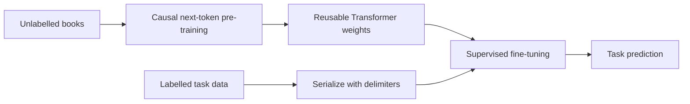

import PaperPdf from '@site/src/components/PaperPdf';
import CodeWalkthrough from '@site/src/components/viz/CodeWalkthrough';
import ResearchPaperLab from '@site/src/components/viz/ResearchPaperLab';

> **Radford, Narasimhan, Salimans and Sutskever · 2018** ·
> [Read the embedded paper](#original-paper) ·
> [Download PDF](/papers/research-papers/gpt-1.pdf) · Notes follow the paper
> section by section, §1 to §6.

## Paper in one minute

**Problem.** Many NLP tasks have too little labelled data to train a large model
well from random initialization.

**Key idea.** Learn general language structure by predicting the next token in
unlabelled text, then adapt the same causal Transformer to each labelled task
through a consistent text format and supervised fine-tuning.

**Why it matters.** GPT-1 established the pretrain-then-fine-tune recipe for a
generative Transformer. Its main contribution is transfer through weight
updates, not the later idea of solving tasks only through few-shot prompts.

### Transfer-learning flow



## How to read this chapter

The walkthrough below follows the paper **in its own order**, from the abstract
to the conclusion. Each heading carries the paper's section number, so you can
keep the PDF open beside it. Equations use the paper's notation. Boxes marked
**not from the paper** are teaching aids, such as analogies, derivations or
worked numbers, added to make a step easier to follow.

## Abstract: the three claims

Natural language understanding covers many tasks: entailment (does one sentence
follow from another?), question answering, judging whether two sentences mean
the same, and classifying documents. Unlabelled text is plentiful, but
**labelled** examples for each task are scarce. The abstract makes three
claims:

1. **Generative pre-training** of a language model on unlabelled text, followed
   by **discriminative fine-tuning** on each task, gives large gains.
   "Generative" means the model learns to produce text. "Discriminative" means
   it learns to pick a label for an input.
2. **Task-aware input transformations** let one model handle very different
   tasks with minimal changes to its architecture.
3. This single **task-agnostic** model beats models designed for each task,
   improving the state of the art (the best published result) on **9 of the 12
   tasks** studied.

| Task (benchmark)                     | Absolute gain claimed |
| ------------------------------------ | --------------------- |
| Commonsense reasoning (Story Cloze)  | +8.9%                 |
| Question answering (RACE)            | +5.7%                 |
| Textual entailment (MultiNLI)        | +1.5%                 |

**What this shows:** the biggest gains come on tasks that need reasoning over
several sentences, which is where long-range pre-training should help most.

:::tip Worked number: check the gains (not from the paper)

From the paper's own tables: Story Cloze $86.5-77.6=8.9$ (Table 3), RACE
$59.0-53.3=5.7$ (Table 3), and MultiNLI matched $82.1-80.6=1.5$ (Table 2). All
three match. Note that these are **percentage points**, not percentages of the
old score.

:::

Keep these in mind: §3 builds the method, §4 supplies the evidence and §5 asks
why it works.

## §1 Introduction: labelled data is the bottleneck

Most deep learning methods need a lot of hand-labelled data, which many domains
do not have. Learning from **unlabelled** text is a valuable alternative. Even
when labels exist, representations learned without labels can give a big boost.
Until then, the best evidence was **pre-trained word embeddings**.

:::tip Intuition: why labels are expensive (not from the paper)

Suppose we want a sentiment classifier for movie reviews. We can collect many
reviews, but someone must label which ones are positive or negative. If we train
a large network only on that small labelled collection, we ask it to learn
vocabulary, syntax and task-specific decisions at the same time.

A useful division of labour is to learn general patterns from abundant text
first, then use the limited labels to teach the final task. This is **transfer
learning**.

:::

Going beyond word-level information is hard for **two reasons**:

1. It is unclear **which training objective** learns the most transferable
   representations. Language modelling, translation and discourse coherence had
   each won on different tasks.
2. There is no agreement on **how to transfer** what was learned. Existing
   methods changed the architecture per task, used complicated training
   schemes, or added extra objectives.

The paper's answer is a **semi-supervised** approach: unsupervised pre-training
followed by supervised fine-tuning. The goal is one **universal
representation** that transfers with little adaptation. The target tasks do
**not** need to be in the same domain as the unlabelled text.

The paper’s recipe has two stages: causal language-model pre-training, followed
by supervised fine-tuning. It is important to keep both stages in the picture.
The original GPT work was not simply “write a prompt and get an answer”.

The model is the **Transformer**, which the authors say gives "a more
structured memory for handling long-term dependencies" than recurrent networks.
During transfer, **traversal-style** input adaptations turn structured inputs
into one continuous token sequence. The evaluation covers four task types:
natural language inference, question answering, semantic similarity and text
classification. The authors also report zero-shot behaviour (the pre-trained
model used without fine-tuning) in **four settings**.

:::note The GLUE gain in §1 does not match §4.2

The introduction claims an absolute improvement of **5.5%** on the GLUE
benchmark. §4.2 reports GLUE **72.8** against a previous best of **68.9**, a gain
of $72.8-68.9=3.9$ points. The paper does not explain the 5.5.

:::

:::tip In the real world (not from the paper)

Labelling cost is why this recipe spread. A hospital that wants to flag urgent
patient messages may have only a few thousand examples labelled by nurses, whose
time is expensive. Starting from a model pre-trained on ordinary text means
those few thousand labels only have to teach the final decision.

:::

## §2 Related work

**Semi-supervised learning for NLP.** Early methods computed word or phrase
statistics from unlabelled data and used them as features. Word embeddings
improved many tasks, but they transfer mostly **word-level** information. The
paper aims for higher-level meaning. Sentence and phrase embeddings had also
been tried.

**Unsupervised pre-training.** This is the special case where unlabelled data
is used to find a **good starting point**, rather than to change the supervised
objective. Earlier work showed pre-training acts like a regulariser in deep
networks. The closest work is Dai and Le, and ULMFiT (Howard and Ruder): both
pre-train a language model and then fine-tune it. The paper argues their LSTMs
limit them to **short-range** prediction, while a Transformer captures
longer-range structure. Other methods (ELMo and CoVe among them) feed a
pre-trained model's hidden states as **extra features**, which needs many new
parameters per task.

**Auxiliary training objectives.** Adding an extra unsupervised objective during
supervised training is another option. Collobert and Weston used tasks such as
part-of-speech tagging; Rei added a language-modelling objective. GPT-1 also
uses an auxiliary objective (§3.2), but notes that pre-training already learns
much of what the target tasks need.

GPT-1 was an influential demonstration of generative pre-training, not the first
appearance of transfer learning or language-model pre-training in NLP. The paper
itself discusses that earlier work.

:::note A claim supported only in part

The "LSTMs are short-range" argument is asserted here and tested only once, in
§5: a single-layer 2048-unit LSTM in the same framework scores 5.6 points lower
on average. That compares two particular models, not the two architecture
families in general.

:::

:::tip In the real world (not from the paper)

Word-level transfer is still common. The pre-trained word vectors that ship with
spaCy's `en_core_web_md` model give each word one fixed vector, whatever sentence
it appears in. GPT-1's point is that a whole network, not just a word table, can
be carried over to a new task.

:::

## §3 Framework

Training has **two stages**. First, learn a high-capacity language model on a
large text corpus. Then fine-tune it on a labelled, discriminative task.

### §3.1 Unsupervised pre-training

A **language model** learns to predict the next token from the tokens before it.
Ordinary text supplies these examples for free.

:::tip Worked example: one sentence, four training examples (not from the paper)

Take a sequence:

```text
The movie was surprisingly good
```

It supplies several training examples without manual labels:

| Available context          | Target       |
| -------------------------- | ------------ |
| The                        | movie        |
| The movie                  | was          |
| The movie was              | surprisingly |
| The movie was surprisingly | good         |

The model learns to give a high probability to the actual next token.

:::

Given an unlabelled corpus of tokens $\mathcal{U}=\{u_1,\ldots,u_n\}$, the
paper maximises (**Equation 1**):

$$
L_1(\mathcal{U})=\sum_i \log P(u_i\mid u_{i-k},\ldots,u_{i-1};\Theta)
$$

In words: add up, over the corpus, how much log-probability the model gives to
each real token when it sees the $k$ tokens before it. $k$ is the **context
window** and $\Theta$ the network's parameters, trained by stochastic gradient
descent.

The same objective is often written as a loss to minimise:

$$
\mathcal L_{\text{LM}}=-\sum_t\log p_\theta(x_t\mid x_{<t}).
$$

The notation $x_{<t}$ means the tokens before position $t$. A causal attention
mask enforces this restriction inside the network.

**The model** is a multi-layer **Transformer decoder**: multi-headed
self-attention over the context, then position-wise feed-forward layers, then a
distribution over the next token (**Equation 2**):

$$
\begin{aligned}
h_0 &= UW_e+W_p\\
h_l &= \texttt{transformer\_block}(h_{l-1})\quad\forall i\in[1,n]\\
P(u) &= \operatorname{softmax}(h_nW_e^T)
\end{aligned}
$$

In words: look up each token's embedding in $W_e$ and add a position embedding
$W_p$; pass the result through $n$ Transformer blocks; then score every
vocabulary word by comparing the top layer with the **same** embedding matrix
$W_e$. Here $U=(u_{-k},\ldots,u_{-1})$ is the context and $n$ the number of
layers. Reusing $W_e$ at the output is called **weight tying**.

**The target already exists in the text.** “Unsupervised” in the paper’s
terminology does not mean there is no prediction target; the target is
constructed from the data rather than supplied by a human annotator.

:::note Notation slips in Equations 1 and 2

The paper reuses symbols. $n$ is both the corpus length in $\mathcal{U}$ and the
number of layers in Equation 2, and $U$ is both the corpus and the context
vector. Equation 2 also says "$\forall i\in[1,n]$" where it means
$\forall l\in[1,n]$, since $l$ is the layer index. And §3.1 says "stochastic
gradient descent" while §4.1 actually uses Adam, a variant of it.

:::

### §3.2 Supervised fine-tuning

After pre-training, the parameters are adapted to a labelled dataset
$\mathcal{C}$. Each example is a token sequence $x^1,\ldots,x^m$ with a label
$y$. The sequence goes through the pre-trained model, and the **last token's
final activation** $h_l^m$ feeds a new linear layer $W_y$ (**Equation 3**):

$$
P(y\mid x^1,\ldots,x^m)=\operatorname{softmax}(h_l^mW_y).
$$

In words: read the top-layer vector at the last position, multiply by $W_y$ to
get one score per label, and turn the scores into probabilities. The last
position is used because, in a left-to-right model, only it has seen the whole
input. Training maximises (**Equation 4**):

$$
L_2(\mathcal{C})=\sum_{(x,y)}\log P(y\mid x^1,\ldots,x^m).
$$

**The auxiliary objective.** The authors found that also keeping the
language-modelling objective during fine-tuning helped, by (a) improving
generalisation and (b) speeding up convergence. They optimise (**Equation 5**):

$$
L_3(\mathcal{C})=L_2(\mathcal{C})+\lambda\cdot L_1(\mathcal{C}).
$$

In words: the task score plus a weighted language-modelling score. Note the
argument: $L_1$ is computed on the **labelled task text** $\mathcal{C}$, not on
the original books. The task loss teaches the label. The auxiliary
language-model loss continues to reward the text-prediction behaviour learned
earlier.

The paper writes maximised log-likelihood objectives; in the equivalent
minimised form this is
$\mathcal L_{\text{fine-tune}}=\mathcal L_{\text{task}}+\lambda\mathcal L_{\text{LM}}$.

The **only extra parameters** fine-tuning needs are $W_y$ and the embeddings of
the delimiter tokens introduced in §3.3.

#### Why the extra task head is small (not from the paper)

Most of the useful representation already lives in the shared network. For a
binary task, a linear head can map the last hidden vector to two class logits.
It does not need to reconstruct the whole language-processing system.

If the hidden vector has 768 features, a two-class head needs a matrix with
`768 × 2` weights, plus optional biases. That is small compared with the shared
Transformer. The example illustrates why reusing a representation can be
cheaper than building every task system from scratch.

:::tip In the real world (not from the paper)

The Hugging Face `transformers` library ships this exact set-up for the original
checkpoint as `OpenAIGPTDoubleHeadsModel`: one head predicts the next token
($L_1$) and one scores a choice ($L_2$), sharing the same Transformer.
Fine-tuning code adds the two losses, as in Equation 5.

:::

### §3.3 Task-specific input transformations

Text classification can be fine-tuned directly. But entailment needs an
**ordered pair** of sentences, and question answering needs a **triplet** of
document, question and answers. The pre-trained model only ever saw continuous
text, so these inputs must be reshaped.

Earlier work built new task-specific layers on top of the transferred model.
The paper objects that those extra layers get no benefit from pre-training.
Instead it uses a **traversal-style** approach: turn each structured input into
**one ordered token sequence**. Every sequence gets randomly initialised start
and end tokens, written ⟨s⟩ and ⟨e⟩, and parts are separated by a delimiter
token written `$`.


_Figure 1 from the original paper, PDF page 4.
[Source PDF](/papers/research-papers/gpt-1.pdf#page=4)._

The left side shows the shared stack and its two outputs: text prediction and
task classification. The right side shows how tasks with different input
structures are converted into token sequences.

A classifier receives one text. Entailment needs a premise and a hypothesis.
Multiple-choice answering needs a context, a question and a candidate answer.
Rather than inventing a new architecture for every task, the paper serialises
these pieces with delimiter tokens and applies the shared model.

| Task                        | How the input is built                                                         | How the output is read                                  |
| --------------------------- | ------------------------------------------------------------------------------ | ------------------------------------------------------- |
| Classification              | ⟨s⟩ text ⟨e⟩                                                                   | Linear layer on the last token                          |
| Textual entailment          | ⟨s⟩ premise $p$ `$` hypothesis $h$ ⟨e⟩                                          | Linear layer on the last token                          |
| Similarity                  | Both orders: ⟨s⟩ A `$` B ⟨e⟩ and ⟨s⟩ B `$` A ⟨e⟩, each run separately          | The two $h_l^m$ vectors are **added**, then linear layer |
| Question answering, commonsense | One sequence per answer: `[z; q; $; a_k]` (document, question, delimiter, answer $k$) | Each scored separately, then softmax over the answers |

**What this shows:** four very different tasks become "read one sequence, score
the last token", so the same network can handle all of them.

#### Similarity and entailment do not have the same symmetry (not from the paper)

For duplicate-question detection, swapping the two questions should not change
the desired similarity judgement. The paper handles similarity by processing
both input orders and combining the resulting representations before
classification.

Entailment is directional. “A poodle is running” supports “A dog is running”,
but “A dog is running” does not establish that the dog is a poodle. Premise and
hypothesis therefore retain their distinct roles when serialised.

For multiple-choice QA, the model builds and scores one sequence per candidate
answer. Softmax then compares the candidate scores. It is not enough to say
“GPT-1 uses a classifier”: the way the task becomes a sequence determines what
the classifier is allowed to learn. Delimiters and output heads preserve those
task relationships within a common sequence interface.

#### A concrete multiple-choice example (not from the paper)

Imagine the passage says that Maya left an umbrella beside the door because rain
was expected. The question asks why she took an umbrella.

Construct one sequence for each candidate:

```text
Passage + Question + delimiter + Candidate A: rain was expected
Passage + Question + delimiter + Candidate B: the umbrella was broken
```

Each sequence goes through the same model and scoring head. The training
objective teaches the correct candidate to receive the better score. We are
reusing one representation system while changing the structured input.

Do not confuse this task classifier with free-form generation. Both can use a
causal backbone, but their output interpretation differs.

:::tip In the real world (not from the paper)

Today's chat models use the same trick. Their prompt templates insert special
tokens that mark where the system instructions, the user's message and the
assistant's reply begin. Like ⟨s⟩, `$` and ⟨e⟩, these markers let one network
tell the parts of a structured input apart without any new layers.

:::

## §4 Experiments

### §4.1 Setup

**Unsupervised pre-training data.** The language model trains on
**BooksCorpus**: over **7,000 unique unpublished books** in genres such as
adventure, fantasy and romance. What matters is that it has **long stretches of
contiguous text**, so the model learns to use long-range context. The
alternative, the 1B Word Benchmark used by ELMo, is about the same size but is
**shuffled at the sentence level**, which destroys that long-range structure.
The model reaches a token-level **perplexity of 18.4** on BooksCorpus.
Perplexity measures how surprised the model is by real text: lower is better,
and 18.4 means it is roughly as unsure as if choosing among about 18 equally
likely tokens.

:::tip Intuition: why contiguous books help (not from the paper)

Long stretches of coherent text provide relationships across sentences.
Randomly shuffled isolated sentences remove much of that context. The paper's
choice of BooksCorpus fits its interest in learning transferable long-range
representations.

Subword tokenisation handles words through reusable pieces. Learned position
embeddings identify locations within the finite context window. The model's
capacity to learn long-range relationships is still limited by the actual
tokens presented together during training.

:::

**Model specifications.** The model "largely follows" the original Transformer.

| Setting               | Value                                                                       |
| --------------------- | --------------------------------------------------------------------------- |
| Architecture          | 12-layer decoder-only Transformer, masked self-attention                    |
| Width and heads       | 768-dimensional states, 12 attention heads                                  |
| Feed-forward size     | 3072                                                                        |
| Optimiser             | Adam, maximum learning rate 2.5e-4                                          |
| Learning-rate schedule | Linear warm-up from 0 over 2,000 updates, then cosine decay to 0          |
| Training              | 100 epochs, minibatches of 64 random contiguous sequences of 512 tokens     |
| Initialisation        | $N(0,0.02)$, enough because layer norm is used throughout                    |
| Vocabulary            | Byte-pair encoding (BPE) with 40,000 merges                                 |
| Regularisation        | Residual, embedding and attention dropout of 0.1; modified L2 with $w=0.01$ on all non-bias, non-gain weights |
| Activation            | GELU                                                                        |
| Positions             | Learned position embeddings, not the original sinusoids                     |
| Text cleaning         | `ftfy` to clean text and standardise punctuation, then the spaCy tokenizer  |

**Byte-pair encoding** starts from characters and repeatedly merges the most
frequent adjacent pair into a new token, so common words become one token and
rare words split into pieces. The "modified L2" follows Loshchilov and Hutter,
the method now called **decoupled weight decay** (AdamW).

:::tip Worked number: how big is GPT-1? (not from the paper)

The paper never states a parameter count. Each layer holds four $768\times768$
attention projections and a $768\to3072\to768$ feed-forward network, about
7.09 M weights with biases and layer norms, so 12 layers give 85.1 M. A
vocabulary of about 40,000 tokens adds $40{,}000\times768\approx30.7$ M, and 512
positions add 0.4 M. The total is about **116 M**. The GPT-2 paper later lists
its smallest, GPT-1-sized model at 117 M.

:::

:::note The training length does not add up across papers

GPT-1 states 100 epochs but no step count. The BERT paper (Appendix A.4) says
GPT trained for 1 M steps with batches of about 32,000 words, and indeed
$64\times512=32{,}768$ tokens. Together these imply
$10^6\times32{,}768/100\approx3.3\times10^8$ tokens per epoch, while BERT puts
BooksCorpus at 800 M words. At least one of these figures is approximate; treat
"100 epochs" as indicative.

:::

**Fine-tuning details.** Unless stated otherwise, pre-training settings are
reused.

| Setting                | Value                                              |
| ---------------------- | -------------------------------------------------- |
| Classifier dropout     | 0.1                                                |
| Learning rate          | 6.25e-5 for most tasks                             |
| Batch size             | 32                                                 |
| Epochs                 | 3 was enough for most cases                        |
| Schedule               | Linear decay, with warm-up over 0.2% of training   |
| Auxiliary weight $\lambda$ | 0.5                                            |

:::tip In the real world (not from the paper)

Byte-pair encoding became the standard for GPT models. OpenAI's open-source
`tiktoken` library is a fast BPE tokenizer used for its later models. You can
run it on a sentence and watch a rare word split into several pieces.

:::

### §4.2 Supervised fine-tuning

The paper tests four kinds of task on 12 datasets (Table 1). Several are part
of the then-new **GLUE** benchmark, a shared collection of language
understanding tasks.

| Task type                  | Datasets                                         |
| -------------------------- | ------------------------------------------------ |
| Natural language inference | SNLI, MultiNLI, Question NLI, RTE, SciTail       |
| Question answering         | RACE, Story Cloze                                |
| Sentence similarity        | MSR Paraphrase Corpus, Quora Question Pairs, STS Benchmark |
| Classification             | Stanford Sentiment Treebank-2, CoLA              |

#### Natural language inference

**NLI** (also called recognising textual entailment) reads a pair of sentences
and decides whether the second is **entailed** by, **contradicts**, or is
**neutral** to the first. It is hard because of lexical entailment, coreference
and ambiguity. The five datasets come from image captions (SNLI), speech,
fiction and government reports (MNLI), Wikipedia (QNLI), science exams (SciTail)
and news (RTE). All use accuracy.

| Dataset (Table 2) | Previous best | GPT-1 | Gain |
| ----------------- | ------------- | ----- | ---- |
| MNLI-m            | 80.6          | 82.1  | +1.5 |
| SNLI              | 89.3          | 89.9  | +0.6 |
| SciTail           | 83.3          | 88.3  | +5.0 |
| QNLI              | 82.3          | 88.1  | +5.8 |
| RTE               | 61.7          | 56.0  | −5.7 |

**What this shows:** GPT-1 wins on four of the five, often against ensembles of
several models. It loses on RTE, one of the smallest datasets (2,490 examples).

<details>
<summary>Full Table 2 from the paper</summary>

Natural language inference results, accuracy. "5x" means an ensemble of 5
models. A dash means not reported.

| Method                              | MNLI-m | MNLI-mm | SNLI | SciTail | QNLI | RTE  |
| ----------------------------------- | ------ | ------- | ---- | ------- | ---- | ---- |
| ESIM + ELMo (5x)                    | -      | -       | 89.3 | -       | -    | -    |
| CAFE (5x)                           | 80.2   | 79.0    | 89.3 | -       | -    | -    |
| Stochastic Answer Network (3x)      | 80.6   | 80.1    | -    | -       | -    | -    |
| CAFE                                | 78.7   | 77.9    | 88.5 | 83.3    | -    | -    |
| GenSen                              | 71.4   | 71.3    | -    | -       | 82.3 | 59.2 |
| Multi-task BiLSTM + Attn            | 72.2   | 72.1    | -    | -       | 82.1 | 61.7 |
| Finetuned Transformer LM (GPT-1)    | 82.1   | 81.4    | 89.9 | 88.3    | 88.1 | 56.0 |

</details>

The paper's reading: GPT-1 "significantly outperforms the baselines on four of
the five datasets", which shows it can reason over several sentences and handle
ambiguity. On RTE it scores 56% against 61.7% for a **multi-task** biLSTM. The
authors think multi-task training would help GPT-1 too, but "have not explored
this".

:::note Two cautions on Table 2

"Significantly" comes with no error bars or repeated runs, and the SNLI gain is
0.6 points. The RTE explanation, that multi-task training would close the gap,
is a hypothesis the paper does not test.

:::

:::tip In the real world (not from the paper)

Entailment models are used to check generated summaries. Treat the source
document as the premise and each summary sentence as a hypothesis: if the model
does not find the sentence entailed, the summary may have invented something.
This is an illustration of the task, not a claim about a specific product.

:::

#### Question answering and commonsense reasoning

**RACE** contains English passages and questions from middle-school and
high-school exams, with more reasoning-type questions than datasets such as CNN
or SQuAD. **Story Cloze** asks the model to choose the correct ending of a short
story from two options. Both are multiple choice, using the `[z; q; $; a_k]`
format from §3.3.

| Method (Table 3)            | Story Cloze | RACE-m | RACE-h | RACE |
| --------------------------- | ----------- | ------ | ------ | ---- |
| val-LS-skip                 | 76.5        | -      | -      | -    |
| Hidden Coherence Model      | 77.6        | -      | -      | -    |
| Dynamic Fusion Net (9x)     | -           | 55.6   | 49.4   | 51.2 |
| BiAttention MRU (9x)        | -           | 60.2   | 50.3   | 53.3 |
| GPT-1                       | 86.5        | 62.9   | 57.4   | 59.0 |

RACE-m is the middle-school part and RACE-h the high-school part.

**What this shows:** a single GPT-1 beats 9-model ensembles on RACE by 5.7
points and the best Story Cloze system by 8.9. The authors read this as proof
the model "handle[s] long-range contexts effectively".

#### Semantic similarity and classification

**Semantic similarity** (paraphrase detection) asks whether two sentences mean
the same thing. The three datasets are MRPC (news sentences), QQP (Quora
questions) and STS-B. The two classification tasks are **CoLA**, expert
judgements of whether a sentence is grammatical, and **SST-2**, binary movie
review sentiment. Table 4's metrics differ by column: Matthews correlation (mc)
for CoLA, accuracy for SST-2, F1 for MRPC and QQP, and Pearson correlation for
STS-B.

| Task (Table 4) | Previous best | GPT-1 |
| -------------- | ------------- | ----- |
| CoLA (mc)      | 35.0          | 45.4  |
| SST-2 (acc)    | 93.2          | 91.3  |
| MRPC (F1)      | 86.0          | 82.3  |
| STS-B (pc)     | 81.0          | 82.0  |
| QQP (F1)       | 66.1          | 70.3  |
| GLUE score     | 68.9          | 72.8  |

**What this shows:** big jumps on CoLA and QQP, a small win on STS-B, and losses
on SST-2 and MRPC.

<details>
<summary>Full Table 4 from the paper</summary>

Semantic similarity and classification results, all evaluated on the GLUE
benchmark. mc = Matthews correlation, acc = accuracy, pc = Pearson correlation.

| Method                               | CoLA (mc) | SST-2 (acc) | MRPC (F1) | STS-B (pc) | QQP (F1) | GLUE |
| ------------------------------------ | --------- | ----------- | --------- | ---------- | -------- | ---- |
| Sparse byte mLSTM                    | -         | 93.2        | -         | -          | -        | -    |
| TF-KLD                               | -         | -           | 86.0      | -          | -        | -    |
| ECNU (mixed ensemble)                | -         | -           | -         | 81.0       | -        | -    |
| Single-task BiLSTM + ELMo + Attn     | 35.0      | 90.2        | 80.2      | 55.5       | 66.1     | 64.8 |
| Multi-task BiLSTM + ELMo + Attn      | 18.9      | 91.6        | 83.5      | 72.8       | 63.3     | 68.9 |
| Finetuned Transformer LM (GPT-1)     | 45.4      | 91.3        | 82.3      | 82.0       | 70.3     | 72.8 |

</details>

The paper's reading: state of the art on two of the three similarity tasks, with
a 1-point gain on STS-B and a 4.2-point gain on QQP. CoLA's jump from 35.0 to
45.4 shows "the innate linguistic bias learned by our model". SST-2 at 91.3 is
"competitive". The GLUE score of 72.8 is "significantly better" than the
previous 68.9.

**Overall**, the approach sets new state-of-the-art results on **9 of the 12**
datasets, often beating ensembles. It works across dataset sizes, from STS-B
(about 5.7 k training examples) to SNLI (about 550 k).

:::tip Worked number: count the 9 wins (not from the paper)

Wins: MNLI, SNLI, SciTail, QNLI (Table 2); RACE, Story Cloze (Table 3); CoLA,
STS-B, QQP (Table 4). That is 9. Losses: RTE, SST-2 and MRPC. That is 3. The
total of 12 matches Table 1, so the headline claim checks out.

:::

## §5 Analysis

### Impact of number of layers transferred

The authors transfer only the first few layers of the pre-trained model and
train the rest from scratch. Figure 2 (left) plots MultiNLI and RACE accuracy
against the number of layers transferred.

- Transferring just the **embeddings** already helps, the "standard result".
- **Each extra Transformer layer** adds more, up to **9%** for full transfer on
  MultiNLI.

The paper concludes that "each layer in the pre-trained model contains useful
functionality" for the target tasks.

### Zero-shot behaviours

**Why** does language-model pre-training work? The authors' **hypothesis**: to
predict text better, the model has to learn to do many of the evaluated tasks
anyway. They also suggest the Transformer's more structured attentional memory
transfers better than an LSTM's.

To test this they design **heuristic** ways to use the pre-trained model on a
task **without any fine-tuning**, which is what "zero-shot" means here. The four
settings:

| Task                         | How the pre-trained model is used                                                                                     |
| ---------------------------- | --------------------------------------------------------------------------------------------------------------------- |
| CoLA (grammaticality)        | Score a sentence by its average token log-probability; predict "acceptable" above a threshold                         |
| SST-2 (sentiment)            | Append the word "very", restrict the next-word choice to "positive" or "negative", and take the more probable one     |
| RACE (question answering)    | Given the document and question, pick the answer with the highest average token log-probability                     |
| DPRD (Winograd schemas)      | Replace the pronoun with each candidate referent; pick the one that gives the rest of the sentence a higher average log-probability |

**What this shows:** each task is turned into "which text does the language
model find more likely?", with no labelled training at all.

Figure 2 (right) tracks these scores during pre-training, **normalised** so 0 is
a random guess and 1 is the best single-model result at the time. The scores
rise **steadily and stably** as pre-training continues, which the authors read
as generative pre-training learning "a wide variety of task relevant
functionality". An LSTM shows **higher variance** in its zero-shot scores, which
they take as a sign the Transformer's inductive bias helps transfer.

These probes are an early indication that the generative objective can acquire
useful task information. They are not the same as the paper's fine-tuned
benchmark results, and they are not yet GPT-3's broad comparison of zero-, one-
and few-shot prompting. Understanding this avoids the oversimplified history
that GPT-1 only had fine-tuning and task behaviour first appeared in GPT-2.

:::tip In the real world (not from the paper)

The RACE heuristic is how many language-model benchmarks are still run. Tools
such as EleutherAI's `lm-evaluation-harness` score a multiple-choice question
by computing the log-probability the model gives each answer and picking the
highest. GPT-1's zero-shot section is an early version of that practice.

:::

### Ablation studies

An **ablation** removes one ingredient to see how much it mattered. Table 5
reports three ablations on the GLUE tasks. "Avg. score" is an unweighted average
of all eight columns.

| Method (Table 5)             | Avg. score | CoLA (mc) | MRPC (F1) | MNLI (acc) | QNLI (acc) | RTE (acc) |
| ---------------------------- | ---------- | --------- | --------- | ---------- | ---------- | --------- |
| Transformer w/ aux LM (full) | 74.7       | 45.4      | 82.3      | 81.8       | 88.1       | 56.0      |
| Transformer w/o pre-training | 59.9       | 18.9      | 79.4      | 75.7       | 71.2       | 53.8      |
| Transformer w/o aux LM       | 75.0       | 47.9      | 84.9      | 81.1       | 86.9       | 54.4      |
| LSTM w/ aux LM               | 69.1       | 30.3      | 83.2      | 73.7       | 81.1       | 54.6      |

**What this shows:** pre-training is the big win (−14.8 without it). The
Transformer beats the LSTM (−5.6). The auxiliary LM loss is mixed: it helps the
three NLI tasks and QQP, and hurts the other four.

<details>
<summary>Full Table 5 from the paper</summary>

Ablations on the GLUE tasks. Avg. score is an unweighted average of all
results. mc = Matthews correlation, acc = accuracy, pc = Pearson correlation.

| Method                       | Avg. | CoLA (mc) | SST-2 (acc) | MRPC (F1) | STS-B (pc) | QQP (F1) | MNLI (acc) | QNLI (acc) | RTE (acc) |
| ---------------------------- | ---- | --------- | ----------- | --------- | ---------- | -------- | ---------- | ---------- | --------- |
| Transformer w/ aux LM (full) | 74.7 | 45.4      | 91.3        | 82.3      | 82.0       | 70.3     | 81.8       | 88.1       | 56.0      |
| Transformer w/o pre-training | 59.9 | 18.9      | 84.0        | 79.4      | 30.9       | 65.5     | 75.7       | 71.2       | 53.8      |
| Transformer w/o aux LM       | 75.0 | 47.9      | 92.0        | 84.9      | 83.2       | 69.8     | 81.1       | 86.9       | 54.4      |
| LSTM w/ aux LM               | 69.1 | 30.3      | 90.5        | 83.2      | 71.8       | 68.1     | 73.7       | 81.1       | 54.6      |

</details>

The paper's reading of each ablation:

1. **Without the auxiliary LM** during fine-tuning: it helps the NLI tasks and
   QQP. "Overall, the trend suggests that larger datasets benefit from the
   auxiliary objective but smaller datasets do not."
2. **LSTM instead of Transformer** (a single-layer 2048-unit LSTM in the same
   framework): the average drops by **5.6**. The LSTM beats the Transformer on
   only one dataset, **MRPC**.
3. **No pre-training** (the Transformer trained directly on each task): it is
   worse on **every** task, a **14.8** drop in average score.

:::tip Worked number: check the averages (not from the paper)

The full model's eight scores sum to
$45.4+91.3+82.3+82.0+70.3+81.8+88.1+56.0=597.2$, and $597.2/8=74.65$, which
rounds to 74.7. The drops are $74.7-59.9=14.8$ and $74.7-69.1=5.6$. Table 5's
MNLI of 81.8 is not in Table 2; it matches the mean of Table 2's matched and
mismatched scores, $(82.1+81.4)/2=81.75$, though the paper does not say so.

:::

:::note The auxiliary loss is weaker than §3.2 suggests

§3.2 says the auxiliary objective improves generalisation. In Table 5 the model
**without** it has the higher average, 75.0 against 74.7, and wins on CoLA,
SST-2, MRPC and STS-B. The "larger datasets benefit" trend also has an
exception: RTE, the smallest dataset here (about 2.5 k examples), gains 1.6
points from the auxiliary loss. And the paper's "14.8% decrease" is 14.8
**points** of the average score, a relative drop of about 20%.

:::

The auxiliary loss is especially easy to overstate. It helps several tasks in
the paper, but the aggregate table does not show that adding it wins
everywhere; on average it slightly loses. On a small labelled dataset, the
language loss can compete with the task-specific objective. The coefficient
determines the balance.

A model can improve over random initialisation even when its pre-training and
downstream text distributions differ. That is the transfer-learning claim. It
does not mean any pre-training corpus is equally suitable or that every layer
transfers equally well.

Also inspect the metric before comparing columns: accuracy, F1, correlation and
linguistic-acceptability scores measure different properties. An unweighted
average over those columns is a benchmark summary, not a single physical unit of
“understanding”.

#### What changed in the ablations? (not from the paper)

| Comparison                                | Question                                   | Reading of the result                                                  |
| ----------------------------------------- | ------------------------------------------ | ---------------------------------------------------------------------- |
| More pretrained layers transferred        | Is useful information only in embeddings?  | Deeper transferred layers also help the studied tasks                  |
| Random initialisation versus pre-training | Does unlabelled-text learning matter?      | Removing pre-training substantially hurts the reported task suite      |
| Transformer versus the tested LSTM        | Does the backbone affect transfer?         | The Transformer performs better overall in that controlled setup       |
| With versus without auxiliary LM loss     | Should fine-tuning keep predicting text?   | Its benefit depends on the task; it is not a universal improvement     |

## §6 Conclusion

The paper presents a framework for strong language understanding with **one
task-agnostic model**, trained by generative pre-training and discriminative
fine-tuning. Pre-training on a diverse corpus with long stretches of contiguous
text gives the model "significant world knowledge" and the ability to handle
long-range dependencies. These transfer to question answering, similarity,
entailment and classification, improving the state of the art on 9 of 12
datasets.

The authors say the work "offers hints" about what works best: **Transformers**
as the model, and **text with long-range dependencies** as the data. They hope it
encourages more research into unsupervised learning, in language and beyond.

:::note Later work took the hint further

Both hints held up. GPT-2 kept the Transformer and moved to a much larger and
more varied web corpus, then tested tasks without fine-tuning. GPT-3 turned the
zero-shot probes of §5 into systematic few-shot prompting. The left-to-right
objective was soon challenged by BERT's bidirectional one, which kept GPT-1's
fine-tuning recipe.

:::

## Real-world uses and worked examples

### Documented uses: sentiment, duplicate questions and entailment

The original paper applies its pre-train-then-fine-tune recipe to tasks
including SST-2 sentiment classification, Quora Question Pairs and textual
entailment. These are documented research evaluations, not evidence that Quora
deployed GPT-1 in its product.
[Original paper, Sections 4–5](/papers/research-papers/gpt-1.pdf#page=5).

### Worked example: finding duplicate help-centre questions

Suppose a support site receives:

```text
Existing question: How do I reset my password?
New question:      I forgot my login password. How can I replace it?
```

A system following the paper's similarity-task approach can turn both texts into
model inputs, obtain a learned pair score, and predict whether they express the
same intent. Fine-tuning uses labelled matching and non-matching pairs. It
changes the backbone and task head, unlike simply putting two demonstrations
into a prompt.

The product could then suggest an existing answer instead of creating another
duplicate entry. For a large help centre, a separate retrieval stage would first
find candidate questions; scoring every possible pair would be unnecessarily
expensive.

### Another application: review sentiment

A review such as “The opening was slow, but the ending made the film worthwhile”
contains both criticism and praise. The causal backbone's final representation
can read the whole preceding review, and a supervised classifier can map it to
an overall label.

**The practical lesson:** language pre-training supplies a starting
representation, while examples labelled for your actual task teach the decision
boundary. This is the contribution to carry into an application. GPT-1 was an
early research model; the chapter does not recommend treating that original
checkpoint as a modern customer-facing assistant.

## Interactive lab

Compare what carries the task from pre-training to deployment. For GPT-1 the
critical step is the supervised weight update, unlike the prompt-only interface
of the papers that follow.

<ResearchPaperLab lab="gpt1" />

## Complete code: pre-train first, then fine-tune

<CodeWalkthrough paper="gpt1" />

**Teaching implementation.** This program trains a causal Transformer on a small text corpus, adds a sentiment head, then fine-tunes the shared backbone with task loss plus an auxiliary language-model loss. Save as `gpt1.py`, install PyTorch, and run `python gpt1.py`.

<details>
<summary>Complete runnable script</summary>

```python
"""Small GPT-style pre-training followed by supervised task fine-tuning.
Teaching adaptation: word tokens, two narrow layers and a synthetic corpus.
"""
import math
import torch
from torch import nn
import torch.nn.functional as F

torch.manual_seed(7)
torch.set_num_threads(1)

class Attention(nn.Module):
    def __init__(self, width, heads):
        super().__init__()
        assert width % heads == 0
        self.heads, self.size = heads, width // heads
        self.q = nn.Linear(width, width)
        self.k = nn.Linear(width, width)
        self.v = nn.Linear(width, width)
        self.out = nn.Linear(width, width)

    def forward(self, query, memory=None, causal=False):
        memory = query if memory is None else memory
        b, t, d = query.shape
        def split(x):
            return x.reshape(b, -1, self.heads, self.size).transpose(1, 2)
        q, k, v = split(self.q(query)), split(self.k(memory)), split(self.v(memory))
        scores = q @ k.transpose(-2, -1) / math.sqrt(self.size)
        if causal:
            mask = torch.ones(t, k.size(-2), dtype=torch.bool, device=query.device).triu(1)
            scores = scores.masked_fill(mask, float('-inf'))
        context = scores.softmax(-1) @ v
        return self.out(context.transpose(1, 2).reshape(b, t, d))

class Block(nn.Module):
    def __init__(self, width=32, heads=4, pre_norm=True):
        super().__init__()
        self.attn = Attention(width, heads)
        self.n1, self.n2 = nn.LayerNorm(width), nn.LayerNorm(width)
        self.ff = nn.Sequential(nn.Linear(width, 4*width), nn.GELU(), nn.Linear(4*width, width))
        self.pre_norm = pre_norm

    def forward(self, x, causal=True):
        if self.pre_norm:
            x = x + self.attn(self.n1(x), causal=causal)
            return x + self.ff(self.n2(x))
        x = self.n1(x + self.attn(x, causal=causal))
        return self.n2(x + self.ff(x))

class LanguageModel(nn.Module):
    def __init__(self, vocab, context=64, width=32, pre_norm=True):
        super().__init__()
        self.context = context
        self.token = nn.Embedding(vocab, width)
        self.position = nn.Embedding(context, width)
        self.blocks = nn.ModuleList([Block(width, pre_norm=pre_norm) for _ in range(2)])
        self.norm = nn.LayerNorm(width) if pre_norm else nn.Identity()
        self.head = nn.Linear(width, vocab, bias=False)
        self.head.weight = self.token.weight

    def hidden(self, ids):
        assert ids.size(1) <= self.context
        x = self.token(ids) + self.position(torch.arange(ids.size(1), device=ids.device))
        for block in self.blocks:
            x = block(x)
        return self.norm(x)

    def forward(self, ids):
        return self.head(self.hidden(ids))

    @torch.no_grad()
    def generate(self, ids, count, temperature=1., top_k=None):
        self.eval()
        for _ in range(count):
            logits = self(ids[:, -self.context:])[:, -1] / temperature
            if top_k is not None:
                cutoff = logits.topk(min(top_k, logits.size(-1))).values[:, -1:]
                logits = logits.masked_fill(logits < cutoff, float('-inf'))
            token = torch.multinomial(logits.softmax(-1), 1)
            ids = torch.cat((ids, token), dim=1)
        return ids

def lm_loss(model, rows):
    logits = model(rows[:, :-1])
    return F.cross_entropy(logits.reshape(-1, logits.size(-1)), rows[:, 1:].reshape(-1))

words = '<pad> <start> good bad film story happy sad <end>'.split()
vocab = {word: i for i, word in enumerate(words)}
texts = ['<start> good film happy <end>', '<start> good story happy <end>',
         '<start> bad film sad <end>', '<start> bad story sad <end>']
rows = torch.tensor([[vocab[w] for w in text.split()] for text in texts])
labels = torch.tensor([1, 1, 0, 0])
model = LanguageModel(len(words), pre_norm=False)
optim = torch.optim.AdamW(model.parameters(), lr=.003)
for step in range(160):
    loss = lm_loss(model, rows)
    optim.zero_grad(); loss.backward(); optim.step()
print('Pre-training loss:', round(loss.item(), 3))
# A new classification head is trained together with the pre-trained backbone.
classifier = nn.Linear(32, 2)
optim = torch.optim.AdamW(list(model.parameters()) + list(classifier.parameters()), lr=.001)
for step in range(100):
    logits = classifier(model.hidden(rows)[:, -1])
    task = F.cross_entropy(logits, labels)
    loss = task + .5 * lm_loss(model, rows)
    optim.zero_grad(); loss.backward(); optim.step()
with torch.no_grad():
    predictions = classifier(model.hidden(rows)[:, -1]).argmax(-1)
print('Sentiment predictions:', predictions.tolist(), 'targets:', labels.tolist())
assert torch.equal(predictions, labels)
torch.save({'backbone': model.state_dict(), 'classifier': classifier.state_dict(),
            'vocab': vocab}, 'gpt1-demo.pt')
```

</details>

### Follow the two stages

The first optimiser trains the language model before the classifier exists. `lm_loss` shifts the sequence by one token, so each position predicts its successor. The causal mask prevents the answer from leaking into its input representation.

The second optimiser includes both the existing model and new classification head. Its task loss reads the final sequence state, while the LM term reads all predictive positions. Both gradients reach the same backbone. This is an actual two-stage optimisation, rather than two losses evaluated once on random weights.

The small corpus contains explicit sentiment words, so it is deliberately easy. Evaluation checks that the training examples receive their intended labels. It does not claim held-out sentiment generalisation. The checkpoint stores the backbone, classifier and vocabulary, all of which are needed to interpret the learned weights later.

### Paper-to-code map

| Paper section                                  | Where it lives in `gpt1.py`                                                                  |
| ---------------------------------------------- | -------------------------------------------------------------------------------------------- |
| §3.1 Equation 1, next-token objective          | `lm_loss`: `model(rows[:, :-1])` scored against `rows[:, 1:]`                                |
| §3.1 Equation 2, $h_0=UW_e+W_p$                | `LanguageModel.hidden`: `self.token(ids) + self.position(torch.arange(...))`                 |
| §3.1 Equation 2, stacked `transformer_block`   | `for block in self.blocks: x = block(x)`                                                     |
| §3.1 masked (causal) self-attention            | `Block.forward(x, causal=True)` → `scores.masked_fill(mask, float('-inf'))` in `Attention`  |
| §3.1 Equation 2, $\operatorname{softmax}(h_nW_e^T)$ | `self.head.weight = self.token.weight` (tied output layer)                              |
| §4.1 learned position embeddings               | `self.position = nn.Embedding(context, width)`                                               |
| §4.1 GELU, feed-forward 4 × width (3072 = 4 × 768) | `nn.Sequential(nn.Linear(width, 4*width), nn.GELU(), nn.Linear(4*width, width))`         |
| Post-norm, as in the original Transformer      | `LanguageModel(len(words), pre_norm=False)`                                                  |
| §3.2 Equation 3, $W_y$ on $h_l^m$              | `classifier = nn.Linear(32, 2)` applied to `model.hidden(rows)[:, -1]`                       |
| §3.2 Equation 4, $L_2$                         | `task = F.cross_entropy(logits, labels)`                                                     |
| §3.2 Equation 5, $L_2+\lambda L_1$ on the task text, $\lambda=0.5$ | `loss = task + .5 * lm_loss(model, rows)`                                |
| §3.3 start and end tokens ⟨s⟩, ⟨e⟩             | `<start>` and `<end>` in `words`                                                             |

### Where this program departs from the paper

| Paper setting                                                         | This program                                          | Why it matters                                                                  |
| --------------------------------------------------------------------- | ----------------------------------------------------- | ------------------------------------------------------------------------------- |
| 12 layers, 768 wide, 12 heads, FFN 3072 (§4.1)                        | 2 layers, width 32, 4 heads, FFN 128                  | Enough to show both stages; Figure 2 (left) shows depth matters on real tasks   |
| BPE with 40,000 merges, `ftfy` and spaCy cleaning (§4.1)              | 9 whole-word tokens                                   | No tokeniser to train; nothing is split into pieces                             |
| Context 512; batches of 64 contiguous 512-token sequences (§4.1)      | Context 64; four five-token rows                      | The corpus is tiny and fully visible                                            |
| BooksCorpus, over 7,000 books, 100 epochs (§4.1)                      | Four synthetic sentences, 160 steps                   | Pre-training learns a toy distribution, not language                           |
| Adam, max lr 2.5e-4, 2,000-step warm-up, cosine decay (§4.1)          | `AdamW`, constant `lr=.003`                           | Schedules matter at scale, not for a toy run                                    |
| $N(0,0.02)$ initialisation (§4.1)                                     | PyTorch default initialisation                        | Small networks train fine either way                                            |
| Dropout 0.1 on residuals, embeddings, attention and classifier (§4.1) | No dropout                                            | Nothing to regularise on four sentences                                         |
| Modified L2, $w=0.01$, on non-bias, non-gain weights only (§4.1)      | `AdamW` default decay 0.01 on **all** parameters      | Biases and layer-norm gains are also decayed here                               |
| Fine-tuning: lr 6.25e-5, batch 32, 3 epochs, 0.2% warm-up (§4.1)      | `lr=.001`, full batch of 4, 100 steps                 | Larger rate suits a tiny model                                                  |
| Delimiter `$` and multi-part inputs (§3.3)                            | Single-sentence task only; no delimiter token         | Pair and multiple-choice formats are not exercised                              |
| Evaluation on held-out test sets (§4.2)                               | Checks the four training sentences                    | Shows the pipeline runs, not that it generalises                                |
| No text sampling in the paper                                         | `generate` with `temperature` and `top_k`             | Added for experimentation; not used by the script's two stages                  |

## Different from BERT, different from GPT-2

| Model | Pre-training view                                  | Main adaptation story in the paper                                   |
| ----- | -------------------------------------------------- | -------------------------------------------------------------------- |
| BERT  | Bidirectional masked-token recovery                | Fine-tune an encoder and task head                                   |
| GPT-1 | Left-to-right next-token prediction                | Fine-tune a causal model and task head                               |
| GPT-2 | Left-to-right next-token prediction at larger scale | Test tasks through text conditioning without task-specific fine-tuning |

GPT-1 was an influential demonstration of generative pre-training, not the first
appearance of transfer learning or language-model pre-training in NLP. The paper
itself discusses that earlier work.

## Summary

The central idea is to separate learning language patterns from learning a
particular labelled task. Pre-training supplies a reusable causal
representation; supervised fine-tuning adapts it.

The [original code release](https://github.com/openai/finetune-transformer-lm)
contains the historical implementation. **Read next:**
[GPT-2](/docs/research-papers/gpt-2), which changes the emphasis from supervised
adaptation to zero-shot transfer.

## Checklist

- [ ] I can construct next-token targets from ordinary text.
- [ ] I can explain the roles of the LM loss and task loss.
- [ ] I can explain why task-specific inputs are serialised with delimiters.
- [ ] I can distinguish GPT-1 fine-tuning from later few-shot prompting.
- [ ] I can write Equations 1, 3 and 5 and say what each term means.
- [ ] I can build the §3.3 input for entailment, similarity and multiple choice.
- [ ] I can list the 9 wins and 3 losses behind the "9 of 12" claim in §4.2.
- [ ] I can read Table 5 and say why the auxiliary LM result is weaker than §3.2
      suggests.
- [ ] I can describe one of the four zero-shot heuristics from §5.

## Further reading and future evolution

- [GPT-2](https://openai.com/index/better-language-models/) scales the causal
  objective and studies tasks expressed as text continuations without supervised
  fine-tuning.
- [XLNet](https://arxiv.org/abs/1906.08237) proposes permutation language
  modelling as another way to learn bidirectional context while retaining an
  autoregressive formulation.
- [T5](https://arxiv.org/abs/1910.10683) casts many NLP problems into one
  text-to-text framework and systematically studies transfer-learning choices.

Read them as three branches from GPT-1's transfer recipe: scale prompting,
change the pre-training objective, or unify tasks with an encoder–decoder
format.

## Scenario-based interview questions

### 1. You have a small labelled entailment dataset. Describe a GPT-1-style solution.

**Strong answer.** Serialize premise and hypothesis in their directional order
with learned delimiter tokens, pass the sequence through the pretrained causal
Transformer, and classify from the final representation. Fine-tune the
pretrained weights with the supervised objective; optionally retain a weighted
language-model loss as a regulariser. Tune that weight because it can help
transfer but can also compete with the task objective. Compare with frozen
features and random initialisation to establish that transfer, not only model
size, creates the gain.

### 2. Why does next-token pre-training create training examples without human labels?

**Strong answer.** In a token sequence $x_1,\ldots,x_T$, every prefix supplies
an input and the following token supplies its target. The loss is
$-\sum_t\log p(x_t\mid x_{<t})$, so ordinary text produces many supervised
prediction events automatically. The labels are self-derived, not absent.
Corpus selection still determines what patterns and biases the model can learn.

### 3. Duplicate-question detection changes when the two questions are swapped. What is wrong?

**Strong answer.** Similarity should be symmetric, but a causal serialization is
order-sensitive. GPT-1 handles this kind of task by processing both orders and
combining them before classification. Alternatively use a symmetric feature
function or train with swapped pairs. Do not apply that symmetry to entailment:
premise implying hypothesis is directional. The required invariance comes from
the task, not from a universal preprocessing rule.

### 4. Pre-training loss keeps improving while downstream accuracy stops improving. Explain.

**Strong answer.** Next-token likelihood is only a proxy for transferable task
features. Later updates may improve prediction of corpus-specific details
without helping the target labels; context length, domain mismatch and task-head
capacity may also limit transfer. Save checkpoints and evaluate a fixed
downstream protocol over training. Avoid selecting on the final test set and
report both language-model and task metrics.

### 5. When would you keep the auxiliary LM loss during fine-tuning?

**Strong answer.** It is useful to test when labelled data is scarce and
catastrophic forgetting is a concern, especially if the fine-tuning text still
resembles the pre-training domain. It adds an objective on the same sequence and
may preserve general language structure. But it can distract from labels or
overweight long examples. Tune its coefficient on validation data and include an
ablation rather than treating it as always beneficial.

### 6. A hiring manager calls GPT-1 a few-shot prompting model. How do you correct the claim?

**Strong answer.** GPT-1's main recipe is generative pre-training followed by
supervised task-specific fine-tuning: its weights change for each downstream
task. It also includes zero-shot probes, but that is not the systematic
in-context few-shot setup later studied by GPT-3. Clarifying training, prompt
contents and whether weights change prevents several generations of GPT research
from being collapsed into one idea.

## Project: a paraphrase checker for a help centre

:::note Not from the paper

This project is an addition, to practise the chapter's ideas on a real dataset.

:::

**What you will build.** A model that reads two sentences and says whether they
mean the same thing. You will fine-tune the original GPT-1 checkpoint using the
paper's own similarity recipe: both sentence orders, the delimiter token, and
the auxiliary language-model loss.

**Why it matters.** Help centres, forums and newsrooms fill up with near
duplicates: the same question asked in new words, or the same story from two
wire services. A paraphrase checker lets them merge duplicates and point people
to an answer that already exists.

**Data.** The Microsoft Research Paraphrase Corpus, the MRPC column of Table 4:
Hugging Face dataset `nyu-mll/glue`, config `mrpc`. It has 3,668 training pairs
and 408 validation pairs, small enough for a laptop CPU. Use validation as your
test set.

**Steps.**

1. **Load and extend.** Load `openai-community/openai-gpt` and its tokenizer.
   Add start, delimiter, end and padding tokens, then resize the embeddings.
   These new embeddings and the head are the only new parameters (§3.2, §3.3).
2. **Serialise both orders.** For each pair build ⟨s⟩ A `$` B ⟨e⟩ and ⟨s⟩ B `$` A
   ⟨e⟩ (§3.3, similarity).
3. **Add the head.** Take the final-layer state at each sequence's last real
   token, add the two vectors element-wise, and apply `nn.Linear(768, 2)`, the
   $W_y$ of Equation 3 (§3.2, §3.3).
4. **Build the loss.** Cross-entropy on the label is $L_2$ (Equation 4). Pass
   `labels=input_ids`, with padding set to -100, to get the language-model loss
   $L_1$. Add them with $\lambda=0.5$ (Equation 5).
5. **Train with the paper's settings.** Learning rate 6.25e-5, batch 32 (or 8
   with gradient accumulation on a CPU), 3 epochs, linear decay with warm-up over
   0.2% of steps, classifier dropout 0.1 (§4.1, fine-tuning details).
6. **Evaluate.** Report accuracy and F1 on validation, and compare with Table 4's
   MRPC F1 of 82.3 on the test set (§4.2).
7. **Ablate.** Retrain with $\lambda=0$, and once from a randomly initialised
   model built with `OpenAIGPTLMHeadModel(config)`. Compare with Table 5's rows
   (§5, ablation studies).

```python
import torch
from datasets import load_dataset
from transformers import OpenAIGPTLMHeadModel, OpenAIGPTTokenizer

name = "openai-community/openai-gpt"
tok = OpenAIGPTTokenizer.from_pretrained(name)
tok.add_special_tokens({"bos_token": "<s>", "sep_token": "<$>",
                        "eos_token": "<e>", "pad_token": "<pad>"})
model = OpenAIGPTLMHeadModel.from_pretrained(name)
model.resize_token_embeddings(len(tok))  # new rows for the added tokens (§3.2)

pair = load_dataset("nyu-mll/glue", "mrpc")["train"][0]
a, b = pair["sentence1"], pair["sentence2"]
texts = [f"<s> {a} <$> {b} <e>", f"<s> {b} <$> {a} <e>"]  # both orders (§3.3)
batch = tok(texts, padding=True, return_tensors="pt")

with torch.no_grad():
    out = model(**batch, output_hidden_states=True)
last = batch["attention_mask"].sum(1) - 1              # index of <e> in each row
h = out.hidden_states[-1][torch.arange(2), last]       # h_l^m for each order
features = h.sum(0)                                    # element-wise sum (§3.3)
print(features.shape)  # torch.Size([768]) -> feed to nn.Linear(768, 2), the W_y
```

**How you know it works.** About 68% of MRPC validation pairs are paraphrases,
so always answering "paraphrase" already scores about 68% accuracy and about 81
F1. Your model must beat both. Aim for **at least 75% accuracy and 83 F1**. The
$\lambda=0$ run may come out close, as it does in Table 5; the random-init run
should be clearly worse.

**Stretch goals.**

- Transfer only the first $k$ layers (re-initialise the rest) for
  $k=0,3,6,12$ and plot accuracy, reproducing the shape of Figure 2 (left).
- Try the SST-2 zero-shot heuristic from §5: append "very" and compare the
  probabilities of "positive" and "negative" on `nyu-mll/glue` config `sst2`.
- Swap in a sample of `nyu-mll/glue` config `qqp`, the Quora duplicate
  questions, for a closer match to a real help centre.

## Original paper

<PaperPdf slug="gpt-1" title="Improving Language Understanding by Generative Pre-Training" />
