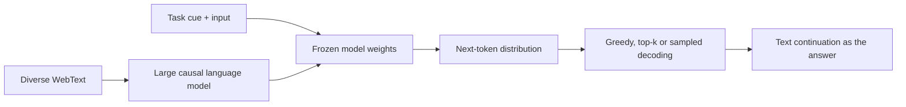
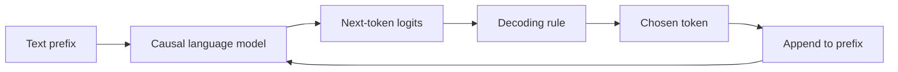

import PaperPdf from '@site/src/components/PaperPdf';
import CodeWalkthrough from '@site/src/components/viz/CodeWalkthrough';
import ResearchPaperLab from '@site/src/components/viz/ResearchPaperLab';

> **Radford et al. · 2019** · [Read the embedded paper](#original-paper) ·
> [Download PDF](/papers/research-papers/gpt-2.pdf) · Notes follow the paper
> section by section, §1 to the appendix.

## Paper in one minute

**Problem.** A separately fine-tuned model for every task requires labelled data,
task-specific training and a growing collection of checkpoints.

**Key idea.** Train a larger causal language model on diverse web text and express
downstream tasks as text continuations, leaving the weights unchanged at
evaluation time.

**Why it matters.** GPT-2 made zero-shot transfer and prompting central research
questions. Its results also show the limits: fluent continuation is not the same
as reliable task performance or factual accuracy.

### Task-as-text flow



## How to read this chapter

The walkthrough below follows the paper **in its own order**, from the abstract
to the appendix. Each heading carries the paper's section number, so you can
keep the PDF open beside it.

You do not need to have read a research paper before. Every new term is
explained the first time it appears, and each formula comes after the idea it
expresses. Boxes marked **not from the paper** are extra help, such as
analogies, real-world examples or worked numbers.

## Abstract: the five claims

A **language model** is a program that predicts the next piece of text from the
text before it. The abstract claims that a big enough language model, trained on
enough varied web pages, starts to do other tasks without being taught them:

1. Language models **begin to learn tasks such as question answering,
   translation and summarisation with no task-specific training**, when trained
   on a new dataset of millions of web pages called **WebText**.
2. Given a document and questions about it, the model reaches **55 F1** on the
   CoQA reading test. That matches or beats 3 of the 4 baseline systems, which
   were trained on more than 127,000 labelled examples. GPT-2 saw none.
3. **Size is essential.** Making the model bigger improves results across tasks
   "in a log-linear fashion": each time the size multiplies, the score rises by a
   roughly steady amount.
4. The largest model, **GPT-2, has 1.5 billion parameters**. Without any
   training on them, it sets the best score on **7 of 8** standard
   language-modelling test sets, yet it still **underfits** WebText, meaning it
   has not even learned its own training data fully.
5. Its **samples** (text it writes) contain coherent paragraphs.

Three terms to know:

- **Zero-shot** means using the model on a task with no examples of that task
  and no extra training. You just give it text and read what it writes.
- **F1** is a score from 0 to 100 for how much an answer's words overlap with
  the correct answer's words.
- A **parameter** is one adjustable number inside the model. 1.5 billion
  parameters means 1.5 billion numbers set during training.

## §1 Introduction: narrow experts, not generalists

Machine learning systems of 2019 were very good at the one task they were
trained for. Change the input a little, or the task a little, and they often
broke. The paper calls them "narrow experts rather than competent generalists".

The usual recipe was: collect examples of the right behaviour for one task,
train a model to copy them, and test it on similar held-out examples. The
authors suspect that **training on one task in one domain** is a major reason
these systems do not generalise.

**Multitask learning**, training one model on many tasks at once, is a
promising fix. But the most ambitious efforts so far had used only 10 and 17
(dataset, objective) pairs. The paper makes a sharp point here: if you think of
each (dataset, objective) pair as **one training example** of "how to do a
task", then 17 examples is far too few. Models normally need hundreds or
thousands of examples to generalise, and nobody can hand-build that many
datasets.

The best language systems at the time used **pre-training plus fine-tuning**.
First a model learns from lots of plain text; then it is trained further on
labelled data for one task. The paper traces the trend: from word vectors, to
transferred recurrent networks, to transferring whole stacks of self-attention
blocks (GPT-1 and BERT). All of these still need supervised training for each
task.

This paper takes the next step. It shows language models can do tasks **in a
zero-shot setting, "without any parameter or architecture modification"**.
Results range from "promising" to "state of the art" depending on the task.

:::tip Intuition: what zero-shot does and does not mean (not from the paper)

Suppose we evaluate summarisation. The model's training has already happened.
At evaluation time we supply a prefix and generate a continuation. We do not
train it on the summarisation benchmark before testing it.

That is different from saying the model has never encountered a summary
anywhere. A large web-text corpus may contain articles, explanations,
translations and question-answer pairs. Zero-shot describes the task adaptation
procedure, not proof that every relevant pattern was absent from pre-training.

It also does not mean the model is an instruction-following assistant. A base
language model predicts plausible continuations; it may continue a conversation
in a role or style we did not intend.

:::

:::tip In the real world (not from the paper)

Before this line of work, a company that wanted spam filtering, sentiment
detection and ticket routing would typically label data and train **three
separate models**. Today many teams send all three jobs, written as plain text,
to one general language model. GPT-2 is an early step on that road.
_(Illustration.)_

:::

## §2 Approach: every task is "predict the next word"

At the core is **language modelling**. You give the model text, and it gives a
probability for every possible next symbol. Your phone keyboard's next-word
suggestions are a small version of the same idea.

A sentence can be scored one symbol at a time: the probability of the whole
sentence is the probability of the first symbol, times the probability of the
second given the first, and so on. The paper's **Equation 1**:

$$
p(x)=\prod_{i=1}^{n} p(s_n\mid s_1,\ldots,s_{n-1}).
$$

In words: the chance of a whole text is the product of the chances of each
symbol given everything before it. This is easy to compute and easy to sample
from, one symbol at a time.

:::note A typo in Equation 1

The index inside the product should be $i$, not $n$: the intended formula is
$p(x)=\prod_{i=1}^{n}p(s_i\mid s_1,\ldots,s_{i-1})$. As printed, every factor
is the same. The paper also uses $n$ both for the number of examples
$(x_1,\ldots,x_n)$ and for the number of symbols $(s_1,\ldots,s_n)$.

:::

**Adding the task.** A model built for one task learns
$p(\text{output}\mid\text{input})$. A general system should also know _which_
task to do, so it should learn

$$
p(\text{output}\mid\text{input},\text{task}).
$$

In words: the answer depends on the input **and** on what you were asked to do
with it. Earlier work put the task into the architecture (task-specific
encoders) or into the training algorithm (MAML). The paper's point, following
McCann et al. (2018), is that **language itself can name the task**. A
translation example can be written as the sequence
`(translate to french, english text, french text)`, and a reading test as
`(answer the question, document, question, answer)`.

A prefix can encode the input and indicate the task through ordinary text. The
network still uses the same next-token objective. It has not acquired a separate
software function named "summarise" or "translate".

:::tip Intuition: one prediction task, many apparent tasks (not from the paper)

A next-token model appears to have one job: predict what comes next. But the
text before the prediction can specify very different situations.

```text
Article: ...
TL;DR:
```

The natural continuation is a summary. After a passage followed by a question
and `Answer:`, the natural continuation may be an answer. The model still
predicts tokens, but the prefix changes which continuation is useful.

:::

**Why plain language modelling could be enough.** In a supervised task, the
model is trained to predict only the _output_ part of such a sequence. A
language model is trained to predict _every_ symbol, output included. So the
supervised objective is just the language-modelling objective scored on a
subset of positions. The paper argues that the best possible language model is
therefore also the best possible model for the supervised task. The open
question is whether we can train it well enough in practice. Preliminary
experiments showed large models can learn this way, but **much more slowly**
than with direct supervision.

The authors then move from this tidy setting to "language in the wild". The
internet contains huge amounts of text in which tasks are demonstrated
naturally. Their speculation: a model with enough capacity will learn to infer
and perform those tasks **because doing so helps it predict the text**. If
that happens, it is doing **unsupervised multitask learning**. They test this by
measuring zero-shot performance on many tasks.

This is the central question behind the paper: **can a model trained on
sufficiently varied text learn patterns that transfer to tasks without
task-specific parameter updates?**

:::tip In the real world (not from the paper)

This "write the task as text" idea is how people use chat assistants today. You
type "Summarise this email:" and paste the email. No one retrains the model for
your email. GPT-2 is where that way of working was first tested at scale.

:::

### §2.1 Training dataset: WebText

Most earlier language models trained on **one kind of text**: news, Wikipedia or
fiction. This paper wants tasks demonstrated in as many settings as possible,
so it needs a **large and varied** dataset.

The obvious source is **Common Crawl**, a public scrape of billions of web
pages. But much of it is junk; earlier work found many documents "whose content
are mostly unintelligible". Picking only pages similar to a target task would
work, but it assumes you know the tasks in advance, which the authors want to
avoid.

Their solution uses people as a quality filter. They collected every outbound
link posted on **Reddit** (a discussion site) that received **at least 3
karma** (Reddit's upvote score). The paper treats this as a rough sign that
someone found the link "interesting, educational, or just funny".

| Step                   | What the paper did                                  |
| ---------------------- | --------------------------------------------------- |
| Collect links          | 45 million outbound Reddit links with 3+ karma      |
| Extract text from HTML | Dragnet and Newspaper content extractors            |
| Cut-off                | No links created after December 2017                |
| Clean                  | De-duplication and heuristic cleaning               |
| Remove Wikipedia       | All Wikipedia pages dropped, to avoid test overlap  |
| Result                 | Slightly over **8 million documents, 40 GB** of text |

Wikipedia was removed because many test sets are built from it, which would
blur the line between training and test data.

**Table 1** of the paper shows why web text can teach tasks. It lists sentences
found in WebText where English and French appear side by side, such as a writer
quoting a French phrase and then giving its English meaning. Nobody labelled
these as translation examples; they occur naturally.

A popularity threshold is not a neutral quality oracle. It selects according to
the communities, languages and interests represented in that source. Removing
one benchmark-rich source also does not remove every possible evaluation
duplicate elsewhere on the web.

:::note A filter mentioned only later

§3.7 says the authors "deliberately removed non-English webpages from WebText as
a filtering step". §2.1 does not describe any language filter. The paper also
never released WebText itself, so the exact filtering cannot be checked.

:::

:::tip In the real world (not from the paper)

Because WebText was not released, researchers rebuilt it. **OpenWebText**
follows the same recipe (Reddit links with 3+ karma) and is available on
Hugging Face. Many small open GPT-2 reproductions, including popular teaching
repositories, train on it.

:::

### §2.2 Input representation: byte-level BPE

A general language model should be able to give a probability to **any**
string, including emoji, code and rare names. Many models of the time
lower-cased text, split it into fixed words and replaced unknown words with a
special unknown token. All of that limits which strings the model can handle.

There are two extremes:

- **Bytes.** Every piece of text is a sequence of bytes (the numbers 0 to 255
  that computers store). A byte-level model can read anything, but such models
  were **not competitive** with word-level models on large datasets. The
  authors saw the same gap on WebText.
- **Words.** Efficient for common words, but anything outside the vocabulary is
  lost.

**Byte Pair Encoding (BPE)** sits in the middle. It starts from small units and
repeatedly **merges the most frequent adjacent pair** into a new token. Common
words end up as a single token; rare words are spelled out from smaller pieces.

An ordinary word vocabulary faces a choice when it sees a new word: reject it,
map it to an unknown token, or split it into smaller units. Byte-level BPE
begins with byte-level coverage and learns useful merges, making it possible to
represent arbitrary input strings as token sequences.

The paper's twist is to run BPE on **bytes** rather than on Unicode characters:

| Choice of base units           | Base vocabulary before any merges |
| ------------------------------ | --------------------------------- |
| Unicode characters (code points) | Over 130,000                    |
| Bytes                          | 256                               |
| Typical full BPE vocabulary    | 32,000 to 64,000                  |

What this shows: starting from Unicode would use up the whole vocabulary budget
before a single merge. Starting from bytes costs only 256 slots.

**One fix to plain BPE.** Run naively, BPE wastes slots on variants such as
`dog.`, `dog!` and `dog?`, because they are all frequent. The authors **block
merges across character categories** (letters, punctuation and so on), with an
exception for spaces. So `dog` and `!` stay separate tokens.

The payoff: the model gets the efficiency of word-level models with the
coverage of byte-level models. Since it can score any Unicode string, it can be
evaluated on **any** dataset, whatever that dataset's own preprocessing.

Starting from byte coverage avoids an unknown-word bottleneck. Repeatedly
merging frequent adjacent symbol pairs creates useful longer pieces, reducing
sequence length for common patterns. Encoding applies the learned merge rules;
decoding reverses the token-to-byte representation.

The model does not learn a new token ID whenever a user types a novel word. It
decomposes the input into known pieces. Byte-level coverage, segmentation
quality and semantic understanding are three separate properties. Byte-level
BPE solves a representation problem, not an understanding problem. Being able to
encode a rare name or a Unicode string does not imply that the model understands
what it refers to.

A **token** is therefore not reliably the same thing as a word. A context budget
of 1,024 tokens is a limit on the encoded sequence, not a promise of 1,024 whole
words.

:::tip Worked number (not from the paper)

The final vocabulary of 50,257 tokens (§2.3) is 256 byte tokens, plus 50,000
learned merges, plus one special end-of-text token. The paper gives only the
total; the breakdown comes from the released tokeniser files.

:::

:::tip In the real world (not from the paper)

GPT-2's tokeniser is still in daily use. OpenAI's `tiktoken` library ships it as
the `gpt2` encoding, Hugging Face's `GPT2TokenizerFast` loads it, and RoBERTa
reused the same byte-level BPE. When an app counts "tokens" to bill you, it is
counting pieces like these, not words.

:::

### §2.3 Model

The model is a Transformer that "largely follows" GPT-1: a stack of
decoder-style blocks, each with **masked self-attention** (every position may
look only at earlier positions) followed by a feed-forward network. The paper
lists what changed:

1. **Layer normalisation moves to the input of each sub-block** (pre-norm), like
   a pre-activation ResNet. Layer normalisation rescales a vector's numbers to a
   standard range.
2. **One extra layer normalisation** is added after the final self-attention
   block.
3. **A new initialisation** accounts for signals piling up along the residual
   path as the model gets deeper. The weights of residual layers are scaled at
   the start by $1/\sqrt{N}$, where $N$ is the number of residual layers.
4. The **vocabulary** grows to **50,257** tokens.
5. The **context** grows from 512 to **1,024 tokens**, and the **batch size** is
   **512**.

GPT-2 moves layer normalisation before sublayers, adds a final normalisation,
and adjusts residual-path initialisation for depth. Those choices help train the
larger model family; the broad objective remains autoregressive likelihood.
Parameter count is therefore one experimental axis within a concrete data and
optimisation recipe, not a complete explanation by itself.

**Table 2** gives the four model sizes:

| Parameters (as printed) | Layers | $d_{\text{model}}$ (vector width) |
| ----------------------- | ------ | --------------------------------- |
| 117M                    | 12     | 768                               |
| 345M                    | 24     | 1024                              |
| 762M                    | 36     | 1280                              |
| 1542M (GPT-2)           | 48     | 1600                              |

What this shows: the four models roughly double in size each step, by adding
both layers and width.

:::tip Worked number: the $1/\sqrt{N}$ scale (not from the paper)

Each block has two residual sub-layers (attention and feed-forward). For the
48-block GPT-2, counting both gives $N=96$ and a scale of
$1/\sqrt{96}\approx0.10$. So each residual layer starts about ten times smaller
than normal, which stops 96 additions from making the signal explode. The paper
does not say whether $N$ counts blocks or sub-layers.

:::

:::tip Worked number: checking Table 2 (not from the paper)

A block of width $d$ has about $12d^2$ weights (attention plus a feed-forward
layer four times wider). Add the token table ($50{,}257\times d$) and the
position table ($1{,}024\times d$). For the largest model:
$48\times12\times1600^2\approx1.47$ billion, plus about 82 million for the two
tables, gives about **1.56 billion**. For the smallest:
$12\times12\times768^2\approx85$ million plus about 39 million gives about
**124 million**, not 117 million.

:::

:::note The printed parameter counts were later corrected

OpenAI's released model files later noted that the original counts were wrong.
The four models are usually listed today as **124M, 355M, 774M and 1558M**. The
worked number above agrees with the corrected figures. Architectures and results
are unchanged; only the labels moved.

:::

:::tip In the real world (not from the paper)

Pre-norm is now the default. GPT-3 kept it, and LLaMA uses the same "normalise
first, then add back" layout (with a simpler normaliser called RMSNorm). If you
open almost any modern open-weight model's code, you will find GPT-2's block
shape.

:::

## §3 Experiments

The authors trained **four models** with sizes spread evenly on a log scale
(Table 2). The smallest is the same size as the original GPT. The second matches
the largest BERT. The largest, which they call GPT-2, has more than ten times
GPT's parameters.

The learning rate of each model was tuned by hand for the best perplexity on a
5% held-out sample of WebText. **All models still underfit WebText**: held-out
perplexity kept improving with more training time.

:::note What the paper does not report

There is no training-steps figure, no learning-rate value, no compute budget and
no hardware description (the acknowledgements only thank Google staff for
training infrastructure). Only the architecture (Table 2), batch size and
context length are given. A reader cannot reproduce the training run from the
paper alone.

:::


_Figure 1 from the original paper, PDF page 2.
[Source PDF](/papers/research-papers/gpt-2.pdf#page=2)._

Figure 1 is printed in the introduction, but it summarises §3. Each panel is a
different evaluation task: reading comprehension (CoQA), translation (WMT-14
French→English), summarisation (CNN and Daily Mail) and question answering
(Natural Questions). The horizontal axis increases model size. The curves let us
ask whether the same broad trend appears across tasks.

The vertical axes do **not** all measure the same thing. A reading-comprehension
score, BLEU score and question-answer accuracy cannot be averaged by casually
reading their heights. Reference lines also represent different baselines in
different panels.

The broad finding is improving zero-shot performance with scale, with
substantial variation by task. It does not establish that every capability
appears suddenly at a single model size, or that every task matches specialised
systems.

### How the tasks are posed (not from the paper)

The report evaluates language modelling, children's-book completion,
commonsense-style questions, reading comprehension, summarisation, translation
and question answering. Some are scored by assigning probabilities to candidate
completions; others require free generation and answer extraction.

| Evaluation style   | What the model does                        | Why formatting matters                                  |
| ------------------ | ------------------------------------------ | ------------------------------------------------------- |
| Language modelling | Scores the observed continuation           | Tokenisation affects likelihood comparisons             |
| Candidate ranking  | Scores each answer option                  | Length and shared prefix must be handled consistently   |
| Free generation    | Produces new text                          | Stop rules and extraction determine the scored answer   |
| Summarisation      | Continues an article with a summary prefix | Fluency alone does not establish factual faithfulness   |

A single training objective can support multiple task interfaces, but weak
performance on some tasks remains part of the evidence. The report's
data-overlap analysis (§4) also matters: a web corpus can contain evaluation
passages without being labelled as a benchmark.

**Generation: choosing the next token.** The free-generation tasks need a rule
for turning the model's scores into text. The model produces logits, one score
per vocabulary item. We still need a decoding rule to choose a token.

**Greedy decoding** always picks the highest-scoring token. It is simple, but
repeated locally likely choices can produce repetitive text. The paper uses it
for reading comprehension (§3.5) and translation (§3.7).

**Sampling** draws from a probability distribution. Temperature changes how
concentrated that distribution is. **Top-k sampling** restricts it to the k
highest-scoring candidates before sampling. The paper uses top-k with $k=2$ for
summaries (§3.6) and $k=40$ for the samples in the appendix. These are decoding
choices; they do not retrain the model.



The loop explains why generation requires multiple model steps. After we choose
a token, the next distribution must condition on the updated sequence.

### §3.1 Language modelling

The first test is the job the model was trained for: predicting text. But here
the text comes from **other** standard datasets the model never trained on.
This is "zero-shot domain transfer".

Results are reported in the usual units:

- **Perplexity (PPL)**: roughly, how many choices the model is torn between at
  each step. Lower is better. A perplexity of 20 means the model is about as
  unsure as if it were picking among 20 equally likely words.
- **Bits per byte (BPB) or per character (BPC)**: how many bits of information
  the model needs, on average, to encode each byte or character. Lower is
  better.

Because the model works on bytes, it can score any dataset. The authors compute
the dataset's total log-probability under GPT-2 and divide by the number of the
dataset's own units (words, characters or bytes), so the numbers are comparable
with earlier work. Without that step, different tokenisations would make raw
perplexities hard to compare, because each model would be scoring different
units.

Many of these datasets are **odd** compared with web text: heavily standardised,
with split-off punctuation, shuffled sentences, and even the string `<UNK>`
(unknown word), which appears only **26 times in 40 billion bytes** of WebText.
So the authors use **invertible de-tokenisers** that undo these artefacts.
"Invertible" means the original can be recovered exactly, so the probability is
still valid. They describe this as a simple form of domain adaptation. It gains
GPT-2 **2.5 to 5 perplexity**.

Headline rows of **Table 3** (no training or fine-tuning on any of these):

| Dataset (metric)            | Previous best | 117M  | 1542M (GPT-2) |
| --------------------------- | ------------- | ----- | ------------- |
| LAMBADA (PPL)               | 99.8          | 35.13 | **8.63**      |
| WikiText-2 (PPL)            | 39.14         | 29.41 | **18.34**     |
| Penn Treebank (PPL)         | 46.54         | 65.85 | **35.76**     |
| enwik8 (BPB)                | 0.99          | 1.16  | **0.93**      |
| One Billion Word (PPL)      | **21.8**      | 75.20 | 42.16         |

What this shows: the biggest model beats the previous best on every dataset
here except One Billion Word, even though those previous best models were
trained on each dataset.

<details>
<summary>Full Table 3 from the paper</summary>

ACC is accuracy (higher is better); PPL, BPB and BPC are lower-is-better.

| Dataset (metric)  | SOTA  | 117M  | 345M  | 762M   | 1542M |
| ----------------- | ----- | ----- | ----- | ------ | ----- |
| LAMBADA (PPL)     | 99.8  | 35.13 | 15.60 | 10.87  | 8.63  |
| LAMBADA (ACC)     | 59.23 | 45.99 | 55.48 | 60.12  | 63.24 |
| CBT-CN (ACC)      | 85.7  | 87.65 | 92.35 | 93.45  | 93.30 |
| CBT-NE (ACC)      | 82.3  | 83.4  | 87.1  | 88.0   | 89.05 |
| WikiText-2 (PPL)  | 39.14 | 29.41 | 22.76 | 19.93  | 18.34 |
| PTB (PPL)         | 46.54 | 65.85 | 47.33 | 40.31  | 35.76 |
| enwik8 (BPB)      | 0.99  | 1.16  | 1.01  | 0.97   | 0.93  |
| text8 (BPC)       | 1.08  | 1.17  | 1.06  | 1.02   | 0.98  |
| WikiText-103 (PPL) | 18.3 | 37.50 | 26.37 | 22.05  | 17.48 |
| 1BW (PPL)         | 21.8  | 75.20 | 55.72 | 44.575 | 42.16 |

The SOTA column comes from several earlier papers, named in the table's caption.

</details>

The paper's reading:

- WebText models transfer well: **7 of 8 datasets** improve on the state of the
  art. LAMBADA and CBT each appear twice in the table with different metrics, so
  ten columns cover eight datasets.
- The biggest gains are on **small datasets** such as Penn Treebank and
  WikiText-2, which have only 1 to 2 million training tokens, and on datasets
  built to test **long-range dependencies** (LAMBADA and CBT).
- GPT-2 is still much worse on the **One Billion Word Benchmark**. The authors
  blame its size and its preprocessing: 1BW shuffles its sentences, which
  destroys all long-range structure that GPT-2 is good at using.

:::tip In the real world (not from the paper)

Language-model probabilities became a tool of their own. In 2019, researchers
built **GLTR**, a demo that coloured each word of a text by how likely GPT-2
found it, to help people spot machine-written text. Data teams still use
perplexity from a small language model to filter out junk pages when building
training sets.

:::

### §3.2 Children's Book Test

The **Children's Book Test (CBT)** takes sentences from children's books and
removes one word. The model must pick the missing word from **10 choices**. The
test is split by word type; the paper reports common nouns (CN) and named
entities (NE).

GPT-2 scores each choice by filling it in and computing the probability of the
**choice plus the rest of the sentence**. It picks the most probable one.

:::tip Worked example (not from the paper)

Say the passage has been about a fox called Reynard, and the gap is "____ ran
into the wood". For each of the 10 candidate names, the model computes the
probability of "Reynard ran into the wood", "Tom ran into the wood" and so on.
The highest-probability sentence wins. Local plausibility may miss a distant
entity reference: every name fits the sentence, so only the earlier story tells
you which is right.

:::

As **Figure 2** shows, accuracy rises steadily with model size and closes most
of the gap to human performance. GPT-2 sets new records of **93.3%** on common
nouns and **89.1%** on named entities.

One detail shows the authors' care. Their overlap check (§4) found that one CBT
**test** book, _The Jungle Book_ by Rudyard Kipling, is in WebText. So they
report results on the **validation** set, which has no significant overlap. A
de-tokeniser removed the dataset's old-style tokenisation artefacts.

:::note Read Table 3 against the text

The text rounds Table 3's 89.05 to 89.1. Also, on common nouns the 762M model
(93.45) scores slightly **higher** than the 1542M model (93.30), so "steadily
improves" is true of the trend, not of every step.

:::

### §3.3 LAMBADA

**LAMBADA** tests long-range memory. The model must predict the **last word** of
a passage, and the passages were chosen so that a human needs at least 50
tokens of context to get it right.

| Measure            | Previous best | GPT-2            |
| ------------------ | ------------- | ---------------- |
| Perplexity         | 99.8          | 8.6              |
| Accuracy (plain)   | 19%           | 52.66%           |
| Accuracy (with stop-word filter) | 59.23% (restricted setting) | **63.24%** |

What this shows: GPT-2 is far less surprised by the final word than any earlier
model, and with one extra trick it also beats the best accuracy.

Looking at GPT-2's mistakes, the authors found that most predictions were
**valid continuations** of the sentence but **not valid final words**. The
model was not using the fact that the word must end the sentence. Adding a
**stop-word filter** (throwing away words like "the" or "and", which rarely end
a sentence) raised accuracy to 63.24%, about 4 points above the previous best.

The previous best used a different trick: it only allowed words that appeared
earlier in the passage. For GPT-2 that restriction hurts, because **19% of
answers are not in the context**.

The LAMBADA analysis is particularly instructive: the report improves results
using an extra output constraint approximated by filtering stop words. That gain
belongs to the **model plus evaluation procedure**, not to a new training run. A
plausible next word is not necessarily a valid sentence-ending answer.

:::note Two numbers that are easy to misread

Table 3's LAMBADA accuracy (63.24) is the **filtered** result, even though the
caption says no training or fine-tuning was done. The "4%" improvement is in
percentage points ($63.24-59.23\approx4.0$). And the two "19%" figures in this
section mean different things: the previous LM accuracy, and the share of
answers missing from the context.

:::

### §3.4 Winograd Schema Challenge

The **Winograd Schema Challenge** tests common sense through ambiguous
pronouns. A classic example (not from this paper): "The trophy would not fit in
the suitcase because **it** was too big." What is too big? A human knows it is
the trophy.

Following earlier work (Trinh and Le, 2018), GPT-2 replaces the pronoun with
each candidate and checks which version it finds more probable. **Figure 3**
shows two ways of scoring this ("full" and "partial"). GPT-2 reaches
**70.70%**, 7 points above the previous best.

The paper itself warns that the dataset is **tiny, only 273 examples**, and
points readers to a critique of this benchmark. Small evaluation sets give
uncertain estimates.

:::tip Worked number (not from the paper)

With 273 examples, one question is worth $1/273\approx0.37$ points. A rough
standard error at 70% accuracy is $\sqrt{0.7\times0.3/273}\approx0.028$, about
**±2.8 points**. So the 7-point gain is real but its exact size is not precise.

:::

### §3.5 Reading comprehension

**CoQA** (Conversational Question Answering) pairs documents from 7 domains
with a conversation about each document. Some questions only make sense given
earlier turns, such as "Why?".

GPT-2 is given the document, the conversation so far and then a final `A:`. It
answers with **greedy decoding**. This scores **55 F1** on the development set,
matching or beating **3 of 4** baseline systems that were trained on 127,000+
hand-collected question-answer pairs. The best supervised system, based on BERT,
is close to the **89 F1** that humans score.

The authors add a caution from inspecting the answers: GPT-2 often uses **simple
retrieval heuristics**, such as answering a "who" question with any name from
the document. Extracting the scored answer from generated text matters too. The
appendix shows two CoQA examples (Tables 16 and 17).

:::tip In the real world (not from the paper)

A help-centre assistant that reads a product manual and answers "How do I reset
it?" then "Why?" is doing the same task as CoQA. Today such tools usually add
retrieval and a fine-tuned or instruction-tuned model, because 55 F1 is far from
the reliability a customer expects. _(Illustration.)_

:::

### §3.6 Summarisation

The test uses the **CNN and Daily Mail** news dataset. To make GPT-2 summarise,
the authors add the text `TL;DR:` after the article ("too long; didn't read",
the internet's shorthand for "summary follows"). They then generate 100 tokens
using **top-k sampling with $k=2$**, which repeats less than greedy decoding,
and keep the **first 3 sentences** as the summary.

Scores use **ROUGE**, which counts how many words (R-1), word pairs (R-2) and
longest shared word sequences (R-L) overlap with a human summary. **Table 4**:

| Method                      | R-1   | R-2   | R-L   | R-AVG |
| --------------------------- | ----- | ----- | ----- | ----- |
| Bottom-Up Sum (best system) | 41.22 | 18.68 | 38.34 | 32.75 |
| Lede-3 (first 3 sentences)  | 40.38 | 17.66 | 36.62 | 31.55 |
| Seq2Seq + Attention         | 31.33 | 11.81 | 28.83 | 23.99 |
| GPT-2 with `TL;DR:`         | 29.34 | 8.27  | 26.58 | 21.40 |
| Random-3 (3 random sentences) | 28.78 | 8.63 | 25.52 | 20.98 |
| GPT-2, no hint              | 21.58 | 4.03  | 19.47 | 15.03 |

What this shows: GPT-2's summaries are only just better than picking three
random sentences, and far behind simply copying the article's first three
sentences. But removing `TL;DR:` makes them much worse.

The paper's reading: the outputs **look like summaries** (Table 14 shows
examples), but they often focus on the article's most recent content or
**confuse details**, such as how many cars were in a crash, or whether a logo was
on a hat or a shirt. The **6.4-point drop** without the hint shows that a few
words of natural language can switch on task-specific behaviour.

:::tip Worked number (not from the paper)

From Table 4: $21.40-15.03=6.37$, the 6.4-point drop in the text. And
$21.40-20.98=0.42$, the margin by which GPT-2 "just barely outperforms" Random-3.

:::

The summarisation experiment uses a summary cue and a particular sampling and
output-extraction recipe. The authors report factual detail errors and weak
performance relative to stronger task-specific systems. Removing the task cue
worsens the result, showing that the prefix affects behaviour even when the
overall task performance remains limited. The model can confuse details despite
fluent wording.

:::tip In the real world (not from the paper)

`TL;DR` is a real Reddit convention: posters add it before a one-line summary of
a long post. That is exactly why the cue works. WebText comes from Reddit links,
so the model has seen "long text, then TL;DR, then a short summary" many times.

:::

### §3.7 Translation

To help GPT-2 realise it should translate, the context is filled with **example
pairs** in the format `english sentence = french sentence`, followed by one
final `english sentence =`. The model continues with greedy decoding, and the
first generated sentence is taken as the translation.

Scores use **BLEU**, a 0 to 100 measure of how closely a translation matches a
human one:

| Direction        | GPT-2 BLEU | Comparison                                                  |
| ---------------- | ---------- | ----------------------------------------------------------- |
| English→French   | 5          | Slightly worse than word-by-word dictionary substitution    |
| French→English   | 11.5       | Beats several unsupervised baselines; far below the best (33.5) |

What this shows: GPT-2 translates **into** English much better than **out of**
it, because its English language model is so strong.

The result surprised the authors, because non-English pages had been removed.
A language detector found only **10 MB of French** in WebText, about **500
times smaller** than the French corpora normally used in unsupervised
translation research. Table 15 in the appendix shows example translations.

:::tip Worked number (not from the paper)

$10\text{ MB}\times500=5\text{ GB}$: the typical French corpus in earlier
unsupervised translation work. WebText's whole 40 GB was mostly English.

:::

:::note "Zero-shot", with examples in the prompt

Although GPT-2 is strongly associated with zero-shot transfer, its translation
experiment supplies example sentence pairs in the context. The same is true of
question answering (§3.8). It therefore uses demonstrations to establish the
pattern. "No task-specific gradient updates" is not identical to "no examples in
any prompt". GPT-3 later calls this setting **few-shot**. A few successful
examples do not imply strong translation quality.

:::

### §3.8 Question answering

How much knowledge is stored in the weights? **Natural Questions** is a dataset
of real questions people typed into Google, with short answers. As with
translation, the context is seeded with **example question-answer pairs** so the
model picks up the short-answer style.

- GPT-2 answers **4.1%** correctly by **exact match** (the answer must match the
  reference exactly).
- The smallest model does not beat a trivial baseline that returns the most
  common answer for each question type (who, what, where and so on), which gets
  **1.0%**. GPT-2 answers **5.3 times** as many questions correctly.
- The model's confidence is **well calibrated**: on the 1% of questions it is
  most confident about, it is right **63.1%** of the time.
- Retrieval-based open-domain systems score **30 to 50%**, so GPT-2 is still
  "much, much, worse".

Headline rows of **Table 5**, the 30 answers GPT-2 was most confident about:

| Question                                          | GPT-2's answer | Correct? | GPT-2's probability |
| ------------------------------------------------- | -------------- | -------- | ------------------- |
| Who wrote the book the origin of species?         | Charles Darwin | Yes      | 83.4%               |
| Who is the founder of the ubuntu project?         | Mark Shuttleworth | Yes   | 82.0%               |
| Largest state in the us by land mass?             | California     | No       | 59.2%               |
| What us state forms the western boundary of montana? | Montana     | No       | 52.3%               |
| Who plays ser davos in game of thrones?           | Peter Dinklage | No       | 52.1%               |

What this shows: even its most confident answers are sometimes confidently
wrong. 8 of the 30 are marked incorrect.

<details>
<summary>Full Table 5 from the paper</summary>

| Question | Answer | Correct? | Probability |
| --- | --- | --- | --- |
| Who wrote the book the origin of species? | Charles Darwin | Yes | 83.4% |
| Who is the founder of the ubuntu project? | Mark Shuttleworth | Yes | 82.0% |
| Who is the quarterback for the green bay packers? | Aaron Rodgers | Yes | 81.1% |
| Panda is a national animal of which country? | China | Yes | 76.8% |
| Who came up with the theory of relativity? | Albert Einstein | Yes | 76.4% |
| When was the first star wars film released? | 1977 | Yes | 71.4% |
| What is the most common blood type in sweden? | A | No | 70.6% |
| Who is regarded as the founder of psychoanalysis? | Sigmund Freud | Yes | 69.3% |
| Who took the first steps on the moon in 1969? | Neil Armstrong | Yes | 66.8% |
| Who is the largest supermarket chain in the uk? | Tesco | Yes | 65.3% |
| What is the meaning of shalom in english? | peace | Yes | 64.0% |
| Who was the author of the art of war? | Sun Tzu | Yes | 59.6% |
| Largest state in the us by land mass? | California | No | 59.2% |
| Green algae is an example of which type of reproduction? | parthenogenesis | No | 56.5% |
| Vikram samvat calender is official in which country? | India | Yes | 55.6% |
| Who is mostly responsible for writing the declaration of independence? | Thomas Jefferson | Yes | 53.3% |
| What us state forms the western boundary of montana? | Montana | No | 52.3% |
| Who plays ser davos in game of thrones? | Peter Dinklage | No | 52.1% |
| Who appoints the chair of the federal reserve system? | Janet Yellen | No | 51.5% |
| State the process that divides one nucleus into two genetically identical nuclei? | mitosis | Yes | 50.7% |
| Who won the most mvp awards in the nba? | Michael Jordan | No | 50.2% |
| What river is associated with the city of rome? | the Tiber | Yes | 48.6% |
| Who is the first president to be impeached? | Andrew Johnson | Yes | 48.3% |
| Who is the head of the department of homeland security 2017? | John Kelly | Yes | 47.0% |
| What is the name given to the common currency to the european union? | Euro | Yes | 46.8% |
| What was the emperor name in star wars? | Palpatine | Yes | 46.5% |
| Do you have to have a gun permit to shoot at a range? | No | Yes | 46.4% |
| Who proposed evolution in 1859 as the basis of biological development? | Charles Darwin | Yes | 45.7% |
| Nuclear power plant that blew up in russia? | Chernobyl | Yes | 45.7% |
| Who played john connor in the original terminator? | Arnold Schwarzenegger | No | 45.2% |

Questions are copied as printed, including their lower-case spelling. The
caption notes that none of these questions appear in WebText, using the
procedure of §4.

</details>

A footnote adds a human touch: the first author, who "thought of himself as
good at random trivia", answered 17 of 100 sampled questions in the same
setting. He actually got 14 right, "but he should have gotten those other 3".
Most questions may remain unanswered even if some outputs are impressive.

:::tip Worked number (not from the paper)

If GPT-2 gets 4.1% and that is 5.3 times the smallest model, the smallest model
gets about $4.1/5.3\approx0.77\%$. That is consistent with "does not exceed the
1.0% baseline".

:::

:::tip In the real world (not from the paper)

The lesson that a model's weights are a poor encyclopaedia led to
**retrieval-augmented generation**: look the facts up first, then let the model
write the answer. See the [RAG chapter](/docs/research-papers/rag). Good
calibration is useful too: a system can answer when confident and say "I don't
know" otherwise. _(Illustration.)_

:::

## §4 Generalisation vs memorisation

Big web datasets can quietly contain the **test data**. The paper cites
CIFAR-10, an image dataset where 3.3% of test images have near-duplicates in
the training set. If a model has seen the test, its scores overstate how well it
generalises. So the authors measure how much test text also appears in WebText.

**How.** They use **8-grams**: runs of 8 consecutive words. Every 8-gram in
WebText's training set is stored in a **Bloom filter**, a compact data structure
that can answer "have I seen this before?" very quickly. It may occasionally say
"yes" wrongly but never says "no" wrongly. Text is normalised to lower-case
letters and digits with single spaces. The false-positive rate is bounded by
$1/10^8$, and a test with 1 million random strings found zero false hits.

**Table 6**, the percentage of each test set's 8-grams that appear in a training
set:

| Test set     | Overlap with its own training split | Overlap with WebText train |
| ------------ | ----------------------------------- | -------------------------- |
| PTB          | 2.67%                               | 0.88%                      |
| WikiText-2   | 0.66%                               | 1.63%                      |
| enwik8       | 7.50%                               | 6.31%                      |
| text8        | 2.34%                               | 3.94%                      |
| WikiText-103 | 9.09%                               | 2.42%                      |
| 1BW          | 13.19%                              | 3.75%                      |

What this shows: WebText overlaps the test sets by about **3.2%** on average,
but the datasets overlap **their own** training sets even more, about **5.9%**
on average.

:::tip Worked number (not from the paper)

WebText column: $(0.88+1.63+6.31+3.94+2.42+3.75)/6\approx3.2\%$. Own-training
column: $(2.67+0.66+7.50+2.34+9.09+13.19)/6\approx5.9\%$. Both match the text.

:::

:::note "Between 1–6%" is approximate

The text says the test sets have "between 1-6% overlap with WebText train". The
table's range is actually 0.88% (PTB) to 6.31% (enwik8).

:::

Manual checks found many overlaps are just common phrases, but some longer
matches are true duplicates, and not only in WebText. WikiText-103's test set
contains an article that is also in its training set; with only 60 test
articles, that alone is at least 1.6% overlap. 1BW overlaps its own training set
by nearly 13.2%.

Task by task:

| Task       | What the overlap check found                                                        |
| ---------- | ----------------------------------------------------------------------------------- |
| Winograd   | Only 10 schemas had any 8-gram overlap; 2 were spurious; only 1 gave away the answer |
| CoQA       | About 15% of news documents are in WebText, worth about 3 F1 on those; about 0.5–1.0 F1 overall. No questions or answers leaked, because CoQA was released after WebText's cut-off |
| LAMBADA    | Average overlap 1.2%. Removing every overlapping example moves perplexity from 8.6 to 8.7 and accuracy from 63.2% to 62.9% |

What this shows: overlap gives a **small but consistent** boost, but for most
datasets it is no worse than the overlap already built into the standard
training and test splits.

The authors recommend **n-gram overlap checks** as a routine sanity step when
building new datasets, and suggest fuzzier matching would help.

A second check is **Figure 4**: GPT-2's perplexity on WebText's training and
held-out sets is similar and improves together as the models grow. If the model
were memorising, training perplexity would pull ahead. Instead, the paper
concludes that even GPT-2 is **still underfitting** WebText.

The section ends by noting that GPT-2 can write news articles about the
discovery of talking unicorns (Table 13, discussed in the appendix below).

:::tip In the real world (not from the paper)

Contamination checks are now standard. The GPT-3 paper ran a 13-gram overlap
analysis on every benchmark it reported, and most model reports since then
include a similar section. The CoQA detail above shows the cleanest defence: a
benchmark released **after** the training data's cut-off date cannot have
leaked into it.

:::

## §5 Related work

The paper places itself in several lines of work:

- **Scaling studies.** Earlier work scaled recurrent language models on the One
  Billion Word Benchmark, and built a much larger CBT training set from Project
  Gutenberg. A study of how performance changes with model and dataset size had
  found smooth trends. GPT-2's results, "much noisier across tasks", suggest
  similar trends for sub-tasks and continue them past 1 billion parameters.
- **Surprising learned skills.** Individual cells in a recurrent language model
  were found to track line width and quotes. A model trained to generate
  Wikipedia articles also learned to **translate names** between languages,
  which the authors call "more inspirational" to this work.
- **Building web corpora** (such as the iWeb corpus) and **pre-training
  methods** (GloVe, Skip-thought vectors, ULMFiT-style fine-tuning, and others).
- **Pre-trained language models inside other systems**, such as initialising
  sequence-to-sequence models, or fine-tuning for dialogue.

## §6 Discussion

The authors see **unsupervised task learning** as a promising new research
area. It may also help explain why pre-training works so well: in the limit,
pre-training starts to learn tasks directly.

They are frank about the limits:

- On **reading comprehension**, zero-shot GPT-2 is competitive with supervised
  baselines.
- On **summarisation**, it performs the task in a qualitative sense, but the
  numbers are "only rudimentary".
- For practical use, "the zero-shot performance of GPT-2 is still far from
  use-able".
- There are "undoubtedly many practical tasks" where GPT-2 is no better than
  random. Even on question answering and translation, it only beats trivial
  baselines once the model is large enough.

Fluent generation is not the same as reliable factual knowledge. A plausible
continuation can be wrong, and a task-like prefix may fail to induce the
intended behaviour. Evaluation can also be affected by overlap between training
text and benchmarks.

Those limitations are part of understanding the result. The report is a step
towards general transfer through language modelling, not evidence that
task-specific methods or careful evaluation became unnecessary.

**What next.** Zero-shot results are a floor, not a ceiling. The authors plan to
**fine-tune** GPT-2 on benchmarks such as decaNLP and GLUE. They are unsure
whether its extra data and size can make up for the weakness of reading text
**only left to right**, which BERT had shown to be a disadvantage. They also note
that GPT-2's fully written-out answers differ from the "point at a span in the
document" systems that led many question-answering benchmarks.

:::note What later work did

The next paper in the series, [GPT-3](/docs/research-papers/gpt-3), did not
follow the fine-tuning plan. It scaled the model about a hundredfold and
systematically studied examples placed in the prompt instead.

:::

## §7 Conclusion

A large language model trained on a large and varied dataset performs well
across many domains. GPT-2 reaches the state of the art on 7 of 8 language
modelling datasets zero-shot. The range of tasks it can attempt suggests that
high-capacity models trained to predict varied text "begin to learn how to
perform a surprising amount of tasks without the need for explicit
supervision".

A footnote says preliminary code for downloading and using the **small** model
was released.

:::tip In the real world (not from the paper)

That footnote reflects OpenAI's **staged release**. In February 2019 it
published only the smallest model, citing misuse concerns, and released larger
ones over the following months. The full 1.5 billion parameter model came out
in November 2019. It was one of the first public debates about whether to
release a model's weights.

:::

## Appendix A (§8): samples

The appendix shows what the models actually write. Unless stated otherwise,
samples use **top-k sampling with $k=40$**.

**§8.1 Model capacity.** Tables 7 to 11 put completions from the
**smallest** model and from **GPT-2** side by side, for random unseen WebText
test articles. The contexts are 768 tokens long and the completions 256 tokens.
These are explicitly **not cherry-picked**. They complement the perplexity
gains of Figure 4 with text you can read and judge yourself.

**§8.2 Text memorisation.** GPT-2 does memorise text that is repeated many
times. Given the first sentence and a half of the **Gettysburg Address**, which
appears about 40 times in WebText, greedy decoding recovers the speech. Even
with untruncated sampling it copies for a while, then **drifts** within 100 to
200 tokens and becomes more varied.

To measure how common this is, the authors compared the 8-gram overlap of
GPT-2's samples with that of the real held-out continuations (**Figure 5**).
Most samples have **less than 1%** overlap with WebText's training set, and
more than 30% have none. The real test-set text has a median overlap of
**2.6%**. So GPT-2 copies training text **less** often than genuine new articles
do.

**§8.3 Diversity.** Table 12 shows several completions of one context
(384 tokens in, 128 tokens out), showing how varied the outputs are with
standard sampling.

**§8.4 Robustness.** Table 13 is the famous **talking unicorns** news
story, generated from an out-of-distribution prompt. The model can handle
unusual contexts, but the quality of such samples is "generally lower".

The remaining tables give task examples: summaries against reference summaries
(Table 14), translations in both directions (Table 15) and two CoQA
conversations (Tables 16 and 17).

The paper checks overlap between WebText and evaluation material and discusses
generalisation rather than assuming that all generated content is new. Its
appendix shows samples with different capacities and behaviours. Samples help
reveal repetition, incoherence and diversity, but a selected sample collection
cannot replace an unbiased task evaluation.

:::note The unicorn story is a cherry-pick

Tables 7 to 11 are random and un-curated, but Table 13's caption says it is a
"cherry pick of 10 samples": the best of ten tries. The unicorn story became the
best-known GPT-2 example, so it is worth remembering it was selected.

:::

The main conclusion is that a broad language objective supports multiple task
behaviours to varying degrees. The paper also supplies evidence against treating
those behaviours as uniformly reliable.
[Original report, Sections 2–4 and sample appendix](/papers/research-papers/gpt-2.pdf).

## Real-world uses and worked examples

### Documented use: the original AI Dungeon 2

AI Dungeon 2 used a fine-tuned GPT-2 model to continue text adventures. Its archived project describes formatting stories as actions and results, then fine-tuning the large GPT-2 model. This was a real use of GPT-2, but it was **fine-tuned**, whereas the paper's central task-transfer experiments emphasised zero-shot evaluation. [The original AI Dungeon project](https://github.com/latitudegames/AIDungeon).

### Worked example: a player changes the story

Imagine the current story ends outside a locked tower. The player writes “I ask the guard whether another entrance exists.” The application constructs a prefix from the story context and the new action, then samples a continuation.

| Step | What happens | Connection to the chapter |
|---|---|---|
| Build the prefix | Include the current story and player action | Text supplies the task and context |
| Predict next tokens | Generate the guard's response and consequences | Causal language modelling |
| Choose a continuation | Use a decoding strategy to vary the story | Temperature and sampling |
| Continue the session | Add accepted text to the next prompt | Context grows across turns |

These are illustrative story details, not a transcript from the game. A text generator can contradict earlier events or invent an item the player never acquired; maintaining game state is an additional application responsibility.

### Another application: writing suggestions

A completion tool can accept “Our delivery has been delayed because…” and propose a continuation. The model extends the supplied text rather than necessarily obeying a conversational instruction. A user edits the suggestion before using it.

This makes the distinction between **continuation quality and factual correctness** concrete: a fluent explanation of the delay may be invented unless the true reason is supplied in the context.

## Interactive lab

Vary the prefix demonstrations and decoding temperature. The indicator is an
intuition aid: it separates task specification from output randomness rather
than pretending to predict benchmark accuracy.

<ResearchPaperLab lab="gpt2" />

## Complete code: train the model and generate from a task prefix

<CodeWalkthrough paper="gpt2" />

**Teaching implementation.** The program below trains a pre-normalised causal Transformer on a small character corpus and runs both greedy and top-k continuation. It includes tokenisation, batches, model layers, the loss, optimisation, stopping by length and a saved checkpoint.

Save as `gpt2.py`, install PyTorch, and run `python gpt2.py`.

<details>
<summary>Complete runnable script</summary>

```python
"""Train a complete tiny causal LM, then compare greedy and top-k decoding.
Teaching adaptation: character tokens replace GPT-2's byte-level BPE.
"""
import math
import torch
from torch import nn
import torch.nn.functional as F

torch.manual_seed(7)
torch.set_num_threads(1)

class Attention(nn.Module):
    def __init__(self, width, heads):
        super().__init__()
        assert width % heads == 0
        self.heads, self.size = heads, width // heads
        self.q = nn.Linear(width, width)
        self.k = nn.Linear(width, width)
        self.v = nn.Linear(width, width)
        self.out = nn.Linear(width, width)

    def forward(self, query, memory=None, causal=False):
        memory = query if memory is None else memory
        b, t, d = query.shape
        def split(x):
            return x.reshape(b, -1, self.heads, self.size).transpose(1, 2)
        q, k, v = split(self.q(query)), split(self.k(memory)), split(self.v(memory))
        scores = q @ k.transpose(-2, -1) / math.sqrt(self.size)
        if causal:
            mask = torch.ones(t, k.size(-2), dtype=torch.bool, device=query.device).triu(1)
            scores = scores.masked_fill(mask, float('-inf'))
        context = scores.softmax(-1) @ v
        return self.out(context.transpose(1, 2).reshape(b, t, d))

class Block(nn.Module):
    def __init__(self, width=32, heads=4, pre_norm=True):
        super().__init__()
        self.attn = Attention(width, heads)
        self.n1, self.n2 = nn.LayerNorm(width), nn.LayerNorm(width)
        self.ff = nn.Sequential(nn.Linear(width, 4*width), nn.GELU(), nn.Linear(4*width, width))
        self.pre_norm = pre_norm

    def forward(self, x, causal=True):
        if self.pre_norm:
            x = x + self.attn(self.n1(x), causal=causal)
            return x + self.ff(self.n2(x))
        x = self.n1(x + self.attn(x, causal=causal))
        return self.n2(x + self.ff(x))

class LanguageModel(nn.Module):
    def __init__(self, vocab, context=64, width=32, pre_norm=True):
        super().__init__()
        self.context = context
        self.token = nn.Embedding(vocab, width)
        self.position = nn.Embedding(context, width)
        self.blocks = nn.ModuleList([Block(width, pre_norm=pre_norm) for _ in range(2)])
        self.norm = nn.LayerNorm(width) if pre_norm else nn.Identity()
        self.head = nn.Linear(width, vocab, bias=False)
        self.head.weight = self.token.weight

    def hidden(self, ids):
        assert ids.size(1) <= self.context
        x = self.token(ids) + self.position(torch.arange(ids.size(1), device=ids.device))
        for block in self.blocks:
            x = block(x)
        return self.norm(x)

    def forward(self, ids):
        return self.head(self.hidden(ids))

    @torch.no_grad()
    def generate(self, ids, count, temperature=1., top_k=None):
        self.eval()
        for _ in range(count):
            logits = self(ids[:, -self.context:])[:, -1] / temperature
            if top_k is not None:
                cutoff = logits.topk(min(top_k, logits.size(-1))).values[:, -1:]
                logits = logits.masked_fill(logits < cutoff, float('-inf'))
            token = torch.multinomial(logits.softmax(-1), 1)
            ids = torch.cat((ids, token), dim=1)
        return ids

def lm_loss(model, rows):
    logits = model(rows[:, :-1])
    return F.cross_entropy(logits.reshape(-1, logits.size(-1)), rows[:, 1:].reshape(-1))

text = ('question: sky colour? answer: blue.\n'
        'question: grass colour? answer: green.\n') * 40
alphabet = sorted(set(text))
vocab = {c: i for i, c in enumerate(alphabet)}
data = torch.tensor([vocab[c] for c in text])
model = LanguageModel(len(alphabet), context=48)
optim = torch.optim.AdamW(model.parameters(), lr=.003)
for step in range(300):
    starts = torch.randint(len(data)-49, (16,))
    rows = torch.stack([data[s:s+49] for s in starts])
    loss = lm_loss(model, rows)
    optim.zero_grad(); loss.backward(); optim.step()
prompt = torch.tensor([[vocab[c] for c in 'question: sky colour? answer:']])
for k in (1, 5):
    result = model.generate(prompt, 12, temperature=.8, top_k=k)
    print('top_k =', k, repr(''.join(alphabet[i] for i in result[0])))
print('Final training loss:', round(loss.item(), 3))
assert torch.isfinite(loss)
torch.save({'model': model.state_dict(), 'vocab': vocab}, 'gpt2-demo.pt')
```

</details>

### Follow training into generation

Random starting positions produce overlapping sequence windows. Each input window is shifted against its next-token labels. The model predicts all positions during training, but the causal mask ensures that each prediction sees only its permitted prefix.

`generate` reads the logits at the final position. Dividing by temperature changes their concentration. Top-k removes all but the largest k logits, then multinomial sampling draws a token. With `k=1`, this becomes greedy decoding.

The selected token is appended to the prefix. The model then recomputes the next distribution from the updated context. A fixed output-length limit bounds the loop; a production decoder should also respect end tokens and application-specific stops.

The checked model continues the sky-colour question with “blue”. That exact pattern is in the tiny training corpus. This shows model training and decoding, **not** a zero-shot generalisation result. The tokenizer uses characters instead of GPT-2's byte-level BPE, and the script does not load released GPT-2 weights.

### Paper-to-code map

| Paper section                                  | Where it lives in `gpt2.py`                                                                   |
| ---------------------------------------------- | --------------------------------------------------------------------------------------------- |
| §2 Equation 1, next-symbol prediction          | `lm_loss`: `model(rows[:, :-1])` scored by `F.cross_entropy` against `rows[:, 1:]`            |
| §2 the task written as text                    | `prompt` built from `'question: sky colour? answer:'`                                         |
| §2.2 input representation                      | `alphabet` and `vocab` map characters to IDs (a stand-in for byte-level BPE)                  |
| §2.3 layer norm at the input of each sub-block | `Block.forward` with `pre_norm=True`: `x + self.attn(self.n1(x), causal=causal)`              |
| §2.3 extra layer norm after the last block     | `self.norm = nn.LayerNorm(width) if pre_norm else nn.Identity()`                              |
| §2.3 fixed context size                        | `context=48`, `assert ids.size(1) <= self.context`, and `ids[:, -self.context:]` in `generate` |
| Masked self-attention (inherited from GPT)     | `Attention.forward` with `causal=True`: a `triu(1)` mask filled with `float('-inf')`          |
| §3.5, §3.7 greedy decoding                     | `for k in (1, 5)`: `model.generate(prompt, 12, temperature=.8, top_k=k)` with `k=1`           |
| §3.6 and Appendix A top-k sampling             | `logits.topk(...)`, `masked_fill(logits < cutoff, ...)`, then `torch.multinomial`             |
| Tied input and output embeddings (from GPT; not described in this paper) | `self.head.weight = self.token.weight`                              |

### Where this program departs from the paper

| Paper setting                                                   | This program                                   | Why it matters                                                                 |
| --------------------------------------------------------------- | ---------------------------------------------- | ------------------------------------------------------------------------------ |
| 48 layers, $d_{\text{model}}=1600$, 1.5 B parameters (Table 2)  | 2 blocks, width 32, 4 heads                    | Capacity is the paper's central variable; a tiny model can only memorise        |
| Byte-level BPE with 50,257 tokens (§2.2)                        | One ID per character in the corpus             | Cannot encode any character missing from the two training lines                |
| 40 GB of WebText, 8 million documents (§2.1)                    | Two question lines repeated 40 times           | There is no variety, so no task can be learned "in the wild"                   |
| 1,024-token context, batch size 512 (§2.3)                      | 48-character windows, batch of 16              | Long-range results such as LAMBADA need long contexts                           |
| Residual weights scaled by $1/\sqrt{N}$ at initialisation (§2.3) | PyTorch's default initialisation              | Matters for a 96-sub-layer stack, not for 2 blocks                              |
| Learning rate tuned per model on 5% held-out WebText (§3)       | AdamW with a fixed `lr=.003` for 300 steps     | The paper gives no value to copy                                                |
| Zero-shot: test tasks absent from training (§3)                 | The prompt pattern is in the training text     | "blue" is recall, not transfer                                                  |
| Greedy for CoQA and translation; top-k $k=2$ for summaries, $k=40$ for samples | `top_k=1` and `top_k=5` at temperature 0.8 | Shows both decoding families; the $k$ values are illustrative               |

## GPT-1 versus GPT-2

| Dimension           | GPT-1 emphasis                 | GPT-2 emphasis                 |
| ------------------- | ------------------------------ | ------------------------------ |
| Transfer            | Supervised fine-tuning         | Zero-shot task evaluation      |
| Data                | Book-length text               | A broader web-text collection  |
| Context window      | 512 tokens                     | 1,024 tokens                   |
| Largest model scale | Roughly 117 million parameters | Roughly 1.5 billion parameters |

The argument is not merely that a bigger network writes longer paragraphs. It is
that one broadly trained objective can support useful behaviours across tasks.
See [GPT-1](/docs/research-papers/gpt-1) for the fine-tuning recipe GPT-2 set
aside.

## Summary

GPT-2 moves the discussion towards using the prefix as a task interface. The architecture remains causal language modelling; scale and varied pre-training make more zero-shot behaviours useful.

The [official repository](https://github.com/openai/gpt-2) contains model and sampling code. **Read next:** [GPT-3](/docs/research-papers/gpt-3), which systematically studies demonstrations placed in the prompt.

## Checklist

- [ ] I can explain what zero-shot evaluation does and does not imply.
- [ ] I can distinguish pre-training, prompting and decoding.
- [ ] I can explain why tokens are not necessarily words.
- [ ] I can read the scaling figure without treating different metrics as interchangeable.
- [ ] I can write Equation 1 correctly and explain how
      $p(\text{output}\mid\text{input},\text{task})$ turns a task into text (§2).
- [ ] I can explain why byte-level BPE needs only 256 base symbols, and why
      merges are blocked across character categories (§2.2).
- [ ] I can read Table 3 and name the one dataset where GPT-2 did not beat the
      state of the art, and the paper's reason (§3.1).
- [ ] I can explain why the LAMBADA accuracy of 63.24% depends on a stop-word
      filter (§3.3).
- [ ] I can explain what Table 6 measures and why overlap gave only a small
      benefit (§4).

## Further reading and future evolution

- [Scaling Laws for Neural Language Models](https://openai.com/index/scaling-laws-for-neural-language-models/)
  quantifies how loss changes with model size, data and compute.
- [GPT-3](https://openai.com/index/language-models-are-few-shot-learners/)
  turns prompting into a systematic zero-, one- and few-shot evaluation at much
  larger scale.
- [InstructGPT](https://openai.com/index/instruction-following/) adds supervised
  demonstrations and human-preference optimisation so the continuation model
  behaves more like an instruction-following assistant.

The progression is not architecture alone: scale, the prompt interface and the
post-training objective each change what the model is useful for.

## Scenario-based interview questions

### 1. A zero-shot summariser produces fluent but incorrect details. How do you improve it?

**Strong answer.** First treat this as a factuality failure, not a fluency
failure. Make the task and output boundary explicit in the prompt, constrain the
input length deliberately, and compare decoding settings because high randomness
can increase unsupported details. If correctness is essential, use a supervised
or retrieval-grounded system rather than relying on zero-shot continuation.
Evaluate entity and claim consistency with human review; ROUGE alone can reward
overlap while missing invented facts.

### 2. Explain why GPT-2's byte-level BPE can represent an unseen word.

**Strong answer.** Text can fall back to byte-derived symbols, so the tokenizer
does not require an unknown-word token for arbitrary byte strings. Frequent byte
sequences are merged into larger reusable pieces, keeping common text shorter.
Representability is not understanding: an unusual name may use many tokens and
have weak learned semantics. Token count affects cost, context usage and latency.

### 3. Perplexity differs between two models that use different tokenizers. Can you rank them directly?

**Strong answer.** Usually not from the raw numbers alone. Perplexity is the
exponential of average negative log probability per prediction unit; changing
the tokenization changes those units and sequence lengths. Compare on a common
unit such as bits per byte/character when appropriate, or use downstream metrics
under a controlled evaluation. Also verify whether the reported likelihood has
the same normalization and context protocol.

### 4. Generated text becomes incoherent with greedy decoding but wild with unrestricted sampling. What would you try?

**Strong answer.** Greedy decoding commits to the local maximum and can repeat;
unrestricted sampling admits very low-probability tokens. Test temperature with
top-k or nucleus truncation, defining a validation rubric for coherence,
diversity, repetition and safety. The decoding policy changes outputs without
changing model weights, so record it as part of the deployed system. There is no
single best configuration independent of the product.

### 5. Design a fair test of the claim that a larger model has better zero-shot transfer.

**Strong answer.** Use identical prompts, preprocessing, context limits, answer
extraction and decoding across sizes. Check train/evaluation overlap and report
uncertainty, especially for small test sets. Include task-specific baselines and
show individual task metrics rather than averaging incompatible units. Increased
capacity and increased training compute may change together, so word the causal
claim carefully.

### 6. A stakeholder says zero-shot means the model never saw related data. Respond.

**Strong answer.** Zero-shot describes the downstream interface: no labelled
examples or gradient updates for that task at evaluation time. The model was
still pretrained on a large corpus that may contain related instructions,
examples or even benchmark overlap. Data audits and contamination checks are
therefore essential. The term does not guarantee novelty or causal generalisation.

## Project: test a real GPT-2 on news summaries and last-word prediction

:::note Not from the paper

This project is an addition, a way to practise the paper's ideas on real
benchmarks with the released model.

:::

**What you will build.** A small evaluation harness that runs the real,
pretrained GPT-2 small model zero-shot on two of the paper's tasks: predicting
the last word of LAMBADA passages (§3.3) and summarising news articles with
`TL;DR:` (§3.6). You will then check whether the paper's patterns hold at your
scale.

**Why it matters.** Before a team adopts a language model for a job, someone has
to measure it honestly: fixed prompts, fixed decoding, baselines and
contamination checks. This project is that job in miniature, and it is exactly
what §3 and §4 of the paper do.

**Data.**

- [`EleutherAI/lambada_openai`](https://huggingface.co/datasets/EleutherAI/lambada_openai)
  on Hugging Face, config `en`, split `test` (5,153 passages).
- [`abisee/cnn_dailymail`](https://huggingface.co/datasets/abisee/cnn_dailymail)
  on Hugging Face, config `3.0.0`, split `test`: news articles with
  human-written highlights.

**Steps.**

1. Load `openai-community/gpt2` (the paper's "117M", really about 124M). Tokenise
   a sentence with an emoji and a rare name, and look at the pieces (§2.2).
2. Run the starter code below on 200 LAMBADA passages with greedy decoding
   (§3.3). Note the accuracy.
3. Add a stop-word filter: generate several candidate next words and skip any
   that are stop words. Measure the change, as the paper did (§3.3).
4. Summarise 100 CNN/Daily Mail articles: truncate each article to fit the
   1,024-token context with room to spare, append `TL;DR:`, sample 100 tokens
   with top-k $k=2$, and keep the first 3 sentences (§2.3, §3.6).
5. Build the baselines from Table 4: Lede-3 (the first 3 sentences of the
   article), Random-3, and GPT-2 with no hint (§3.6).
6. Score everything with ROUGE using the Hugging Face `evaluate` library (§3.6).
7. For each GPT-2 summary, compute the share of its 8-grams that appear in the
   article, to see how much it copies (§4, §8.2).

**How you know it works.** Your ROUGE table should reproduce the **order** of
Table 4: Lede-3 above GPT-2 with `TL;DR:`, and `TL;DR:` clearly above no hint
(the paper saw about 7 ROUGE-L points with the largest model). The stop-word
filter should raise LAMBADA accuracy, and switching to `openai-community/gpt2-medium`
should raise it again, as in Table 3.

**Starter code.**

```python
import torch
from datasets import load_dataset
from transformers import AutoModelForCausalLM, AutoTokenizer

tok = AutoTokenizer.from_pretrained("openai-community/gpt2")
model = AutoModelForCausalLM.from_pretrained("openai-community/gpt2").eval()
rows = load_dataset("EleutherAI/lambada_openai", "en", split="test[:200]")

correct = 0
for row in rows:
    context, target = row["text"].rsplit(" ", 1)
    ids = tok(context, return_tensors="pt").input_ids
    with torch.no_grad():
        out = model.generate(ids, max_new_tokens=5, do_sample=False,
                             pad_token_id=tok.eos_token_id)
    words = tok.decode(out[0, ids.shape[1]:]).split()
    guess = words[0].strip(".,!?;:'\"") if words else ""
    correct += guess == target
print(f"Last-word accuracy on {len(rows)} passages: {correct / len(rows):.1%}")
```

Install with `python -m pip install torch transformers datasets evaluate rouge_score`.
Everything runs on a laptop CPU; the summaries take the longest.

**Stretch goals.**

- Repeat the LAMBADA and summary runs with `gpt2-medium` and `gpt2-large` and
  plot score against model size, like Figure 1.
- Measure how calibrated the model is (§3.8): bucket LAMBADA guesses by the
  probability GPT-2 gave them, and check that higher-confidence buckets are
  right more often.
- Put two English=French example pairs before a new English sentence and try
  the translation prompt from §3.7 on a few sentences.

## Original paper

<PaperPdf slug="gpt-2" title="Language Models are Unsupervised Multitask Learners" />
