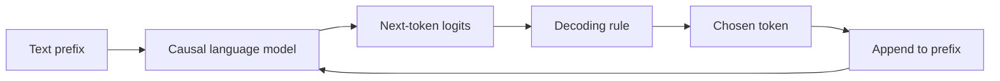

import PaperPdf from '@site/src/components/PaperPdf';

> **Radford et al. · 2019** · [Read the embedded paper](#original-paper) · [Download PDF](/papers/research-papers/gpt-2.pdf)


GPT-2 investigates how many tasks a larger language model can perform by continuing the right text, without a separate fine-tuning run for each task.

## From one prediction task to many apparent tasks

A next-token model appears to have one job: predict what comes next. But the text before the prediction can specify very different situations.

```text
Article: ...
TL;DR:
```

The natural continuation is a summary. After a passage followed by a question and `Answer:`, the natural continuation may be an answer. The model still predicts tokens, but the prefix changes which continuation is useful.

This is the central question behind the paper: **can a model trained on sufficiently varied text learn patterns that transfer to tasks without task-specific parameter updates?**

## What zero-shot means here

Suppose we evaluate summarisation. The model’s training has already happened. At evaluation time we supply a prefix and generate a continuation. We do not train it on the summarisation benchmark before testing it.

That is different from saying the model has never encountered a summary anywhere. A large web-text corpus may contain articles, explanations, translations and question-answer pairs. Zero-shot describes the task adaptation procedure, not proof that every relevant pattern was absent from pre-training.

It also does not mean the model is an instruction-following assistant. A base language model predicts plausible continuations; it may continue a conversation in a role or style we did not intend.

## What changed from GPT-1?

The report trains a family of causal Transformers on WebText. The largest reported model has about 1.5 billion parameters. It uses a 1,024-token context, byte-level BPE, pre-layer normalisation and a 50,257-token vocabulary. These details appear in Sections 2.1–2.3.

| Dimension | GPT-1 emphasis | GPT-2 emphasis |
|---|---|---|
| Transfer | Supervised fine-tuning | Zero-shot task evaluation |
| Data | Book-length text | A broader web-text collection |
| Context window | 512 tokens | 1,024 tokens |
| Largest model scale | Roughly 117 million parameters | Roughly 1.5 billion parameters |

The argument is not merely that a bigger network writes longer paragraphs. It is that one broadly trained objective can support useful behaviours across tasks.

## Read the original scaling figure carefully


*Figure 1 from the original paper, PDF page 2. [Source PDF](/papers/research-papers/gpt-2.pdf#page=2).*

Each panel is a different evaluation task. The horizontal axis increases model size. The curves let us ask whether the same broad trend appears across tasks.

The vertical axes do **not** all measure the same thing. A reading-comprehension score, BLEU score and question-answer accuracy cannot be averaged by casually reading their heights. Reference lines also represent different baselines in different panels.

The broad finding is improving zero-shot performance with scale, with substantial variation by task. It does not establish that every capability appears suddenly at a single model size, or that every task matches specialised systems.

## Why tokenisation matters

An ordinary word vocabulary faces a choice when it sees a new word: reject it, map it to an unknown token, or split it into smaller units. Byte-level BPE begins with byte-level coverage and learns useful merges, making it possible to represent arbitrary input strings as token sequences.

That solves a representation problem, not an understanding problem. Being able to encode a rare name or a Unicode string does not imply that the model understands what it refers to.

A **token** is therefore not reliably the same thing as a word. A context budget of 1,024 tokens is a limit on the encoded sequence, not a promise of 1,024 whole words.

## Generation: choosing the next token

The model produces logits, one score per vocabulary item. We still need a decoding rule to choose a token.

**Greedy decoding** always picks the highest-scoring token. It is simple, but repeated locally likely choices can produce repetitive text.

**Sampling** draws from a probability distribution. Temperature changes how concentrated that distribution is. **Top-k sampling** restricts it to the k highest-scoring candidates before sampling. These are decoding choices; they do not retrain the model.



The loop explains why generation requires multiple model steps. After we choose a token, the next distribution must condition on the updated sequence.

## Real-world uses and worked examples

### Documented use: the original AI Dungeon 2

AI Dungeon 2 used a fine-tuned GPT-2 model to continue text adventures. Its archived project describes formatting stories as actions and results, then fine-tuning the large GPT-2 model. This was a real use of GPT-2, but it was **fine-tuned**, whereas the paper's central task-transfer experiments emphasised zero-shot evaluation. [The original AI Dungeon project](https://github.com/latitudegames/AIDungeon).

### Worked example: a player changes the story

Imagine the current story ends outside a locked tower. The player writes “I ask the guard whether another entrance exists.” The application constructs a prefix from the story context and the new action, then samples a continuation.

| Step | What happens | Connection to the chapter |
|---|---|---|
| Build the prefix | Include the current story and player action | Text supplies the task and context |
| Predict next tokens | Generate the guard's response and consequences | Causal language modelling |
| Choose a continuation | Use a decoding strategy to vary the story | Temperature and sampling |
| Continue the session | Add accepted text to the next prompt | Context grows across turns |

These are illustrative story details, not a transcript from the game. A text generator can contradict earlier events or invent an item the player never acquired; maintaining game state is an additional application responsibility.

### Another application: writing suggestions

A completion tool can accept “Our delivery has been delayed because…” and propose a continuation. The model extends the supplied text rather than necessarily obeying a conversational instruction. A user edits the suggestion before using it.

This makes the distinction between **continuation quality and factual correctness** concrete: a fluent explanation of the delay may be invented unless the true reason is supplied in the context.

## Complete code: train the model and generate from a task prefix

**Teaching implementation.** The program below trains a pre-normalised causal Transformer on a small character corpus and runs both greedy and top-k continuation. It includes tokenisation, batches, model layers, the loss, optimisation, stopping by length and a saved checkpoint.

Save as `gpt2.py`, install PyTorch, and run `python gpt2.py`.

```python
"""Train a complete tiny causal LM, then compare greedy and top-k decoding.
Teaching adaptation: character tokens replace GPT-2's byte-level BPE.
"""
import math
import torch
from torch import nn
import torch.nn.functional as F

torch.manual_seed(7)
torch.set_num_threads(1)

class Attention(nn.Module):
    def __init__(self, width, heads):
        super().__init__()
        assert width % heads == 0
        self.heads, self.size = heads, width // heads
        self.q = nn.Linear(width, width)
        self.k = nn.Linear(width, width)
        self.v = nn.Linear(width, width)
        self.out = nn.Linear(width, width)

    def forward(self, query, memory=None, causal=False):
        memory = query if memory is None else memory
        b, t, d = query.shape
        def split(x):
            return x.reshape(b, -1, self.heads, self.size).transpose(1, 2)
        q, k, v = split(self.q(query)), split(self.k(memory)), split(self.v(memory))
        scores = q @ k.transpose(-2, -1) / math.sqrt(self.size)
        if causal:
            mask = torch.ones(t, k.size(-2), dtype=torch.bool, device=query.device).triu(1)
            scores = scores.masked_fill(mask, float('-inf'))
        context = scores.softmax(-1) @ v
        return self.out(context.transpose(1, 2).reshape(b, t, d))

class Block(nn.Module):
    def __init__(self, width=32, heads=4, pre_norm=True):
        super().__init__()
        self.attn = Attention(width, heads)
        self.n1, self.n2 = nn.LayerNorm(width), nn.LayerNorm(width)
        self.ff = nn.Sequential(nn.Linear(width, 4*width), nn.GELU(), nn.Linear(4*width, width))
        self.pre_norm = pre_norm

    def forward(self, x, causal=True):
        if self.pre_norm:
            x = x + self.attn(self.n1(x), causal=causal)
            return x + self.ff(self.n2(x))
        x = self.n1(x + self.attn(x, causal=causal))
        return self.n2(x + self.ff(x))

class LanguageModel(nn.Module):
    def __init__(self, vocab, context=64, width=32, pre_norm=True):
        super().__init__()
        self.context = context
        self.token = nn.Embedding(vocab, width)
        self.position = nn.Embedding(context, width)
        self.blocks = nn.ModuleList([Block(width, pre_norm=pre_norm) for _ in range(2)])
        self.norm = nn.LayerNorm(width) if pre_norm else nn.Identity()
        self.head = nn.Linear(width, vocab, bias=False)
        self.head.weight = self.token.weight

    def hidden(self, ids):
        assert ids.size(1) <= self.context
        x = self.token(ids) + self.position(torch.arange(ids.size(1), device=ids.device))
        for block in self.blocks:
            x = block(x)
        return self.norm(x)

    def forward(self, ids):
        return self.head(self.hidden(ids))

    @torch.no_grad()
    def generate(self, ids, count, temperature=1., top_k=None):
        self.eval()
        for _ in range(count):
            logits = self(ids[:, -self.context:])[:, -1] / temperature
            if top_k is not None:
                cutoff = logits.topk(min(top_k, logits.size(-1))).values[:, -1:]
                logits = logits.masked_fill(logits < cutoff, float('-inf'))
            token = torch.multinomial(logits.softmax(-1), 1)
            ids = torch.cat((ids, token), dim=1)
        return ids

def lm_loss(model, rows):
    logits = model(rows[:, :-1])
    return F.cross_entropy(logits.reshape(-1, logits.size(-1)), rows[:, 1:].reshape(-1))

text = ('question: sky colour? answer: blue.\n'
        'question: grass colour? answer: green.\n') * 40
alphabet = sorted(set(text))
vocab = {c: i for i, c in enumerate(alphabet)}
data = torch.tensor([vocab[c] for c in text])
model = LanguageModel(len(alphabet), context=48)
optim = torch.optim.AdamW(model.parameters(), lr=.003)
for step in range(300):
    starts = torch.randint(len(data)-49, (16,))
    rows = torch.stack([data[s:s+49] for s in starts])
    loss = lm_loss(model, rows)
    optim.zero_grad(); loss.backward(); optim.step()
prompt = torch.tensor([[vocab[c] for c in 'question: sky colour? answer:']])
for k in (1, 5):
    result = model.generate(prompt, 12, temperature=.8, top_k=k)
    print('top_k =', k, repr(''.join(alphabet[i] for i in result[0])))
print('Final training loss:', round(loss.item(), 3))
assert torch.isfinite(loss)
torch.save({'model': model.state_dict(), 'vocab': vocab}, 'gpt2-demo.pt')
```

### Follow training into generation

Random starting positions produce overlapping sequence windows. Each input window is shifted against its next-token labels. The model predicts all positions during training, but the causal mask ensures that each prediction sees only its permitted prefix.

`generate` reads the logits at the final position. Dividing by temperature changes their concentration. Top-k removes all but the largest k logits, then multinomial sampling draws a token. With `k=1`, this becomes greedy decoding.

The selected token is appended to the prefix. The model then recomputes the next distribution from the updated context. A fixed output-length limit bounds the loop; a production decoder should also respect end tokens and application-specific stops.

The checked model continues the sky-colour question with “blue”. That exact pattern is in the tiny training corpus. This shows model training and decoding, **not** a zero-shot generalisation result. The tokenizer uses characters instead of GPT-2's byte-level BPE, and the script does not load released GPT-2 weights.

## Sections 3–4: the task suite and its limits

The report evaluates language modelling, children's-book completion, commonsense-style questions, reading comprehension, summarisation, translation and question answering. Some are scored by assigning probabilities to candidate completions; others require free generation and answer extraction.

| Evaluation style | What the model does | Why formatting matters |
|---|---|---|
| Language modelling | Scores the observed continuation | Tokenisation affects likelihood comparisons |
| Candidate ranking | Scores each answer option | Length and shared prefix must be handled consistently |
| Free generation | Produces new text | Stop rules and extraction determine the scored answer |
| Summarisation | Continues an article with a summary prefix | Fluency alone does not establish factual faithfulness |

A single training objective can support multiple task interfaces, but weak performance on some tasks remains part of the evidence. The report's data-overlap analysis also matters: a web corpus can contain evaluation passages without being labelled as a benchmark.

### Byte-level BPE, a little more carefully

Starting from byte coverage avoids an unknown-word bottleneck. Repeatedly merging frequent adjacent symbol pairs creates useful longer pieces, reducing sequence length for common patterns. Encoding applies the learned merge rules; decoding reverses the token-to-byte representation.

The model does not learn a new token ID whenever a user types a novel word. It decomposes the input into known pieces. Byte-level coverage, segmentation quality and semantic understanding are three separate properties.

### Architecture details behind the scaling result

GPT-2 moves layer normalisation before sublayers, adds a final normalisation, and adjusts residual-path initialisation for depth. Those choices help train the larger model family; the broad objective remains autoregressive likelihood. Parameter count is therefore one experimental axis within a concrete data and optimisation recipe, not a complete explanation by itself.

## What this paper does not establish

Fluent generation is not the same as reliable factual knowledge. A plausible continuation can be wrong, and a task-like prefix may fail to induce the intended behaviour. Evaluation can also be affected by overlap between training text and benchmarks.

Those limitations are part of understanding the result. The report is a step towards general transfer through language modelling, not evidence that task-specific methods or careful evaluation became unnecessary.

## Data construction, task conditioning and the weaker results

### How WebText was selected

The report constructs WebText from linked pages shared on Reddit, using a minimum score as a rough signal that other people found a link useful. It then extracts text, removes duplicates and cleans the collection. Wikipedia is excluded to reduce overlap with common evaluation sources.

A popularity threshold is not a neutral quality oracle. It selects according to the communities, languages and interests represented in that source. Removing one benchmark-rich source also does not remove every possible evaluation duplicate elsewhere on the web.

### A task can be part of the conditioning context

A useful notation for the paper's argument is:

$$
p(\mathrm{output}\mid\mathrm{input},\mathrm{task}).
$$

A prefix can encode the input and indicate the task through ordinary text. The network still uses the same next-token objective. It has not acquired a separate software function named “summarise” or “translate”.

**A nuance in the report:** although GPT-2 is strongly associated with zero-shot transfer, its translation experiment supplies example sentence pairs in the context. It therefore uses demonstrations to establish the translation pattern. “No task-specific gradient updates” is not identical to “no examples in any prompt”.

### A task-by-task reading of the evidence

| Task | What is tested | What can go wrong |
|---|---|---|
| Language modelling | Probability assigned to held-out text | Different tokenisations make raw perplexities hard to compare |
| Children's Book Test | Select a missing word using surrounding story context | Local plausibility may miss a distant entity reference |
| LAMBADA | Predict a passage's final word | A plausible next word is not necessarily a valid sentence-ending answer |
| Winograd-style resolution | Choose a referent consistent with context | Small evaluation sets give uncertain estimates |
| CoQA | Answer conversational questions about a passage | Extracting the scored answer from generated text matters |
| CNN/Daily Mail summarisation | Produce a short account of an article | The model can confuse details despite fluent wording |
| Translation | Continue a pattern of bilingual examples | A few successful examples do not imply strong translation quality |
| Open-domain QA | Produce answers from learned knowledge | Most questions may remain unanswered even if some outputs are impressive |

The LAMBADA analysis is particularly instructive: the report improves results using an extra output constraint approximated by filtering stop words. That gain belongs to the **model plus evaluation procedure**, not to a new training run.

The summarisation experiment uses a summary cue and a particular sampling/output extraction recipe. The authors report factual detail errors and weak performance relative to stronger task-specific systems. Removing the task cue worsens the result, showing that the prefix affects behaviour even when the overall task performance remains limited.

### Memorisation, samples and evidence

The paper checks overlap between WebText and evaluation material and discusses generalisation rather than assuming that all generated content is new. Its appendix shows samples with different capacities and behaviours. Samples help reveal repetition, incoherence and diversity, but a selected sample collection cannot replace an unbiased task evaluation.

The main conclusion is that a broad language objective supports multiple task behaviours to varying degrees. The paper also supplies evidence against treating those behaviours as uniformly reliable. [Original report, Sections 2–4 and sample appendix](/papers/research-papers/gpt-2.pdf).

## Summary

GPT-2 moves the discussion towards using the prefix as a task interface. The architecture remains causal language modelling; scale and varied pre-training make more zero-shot behaviours useful.

The [official repository](https://github.com/openai/gpt-2) contains model and sampling code. **Read next:** [GPT-3](/docs/research-papers/gpt-3), which systematically studies demonstrations placed in the prompt.

## Checklist

- [ ] I can explain what zero-shot evaluation does and does not imply.
- [ ] I can distinguish pre-training, prompting and decoding.
- [ ] I can explain why tokens are not necessarily words.
- [ ] I can read the scaling figure without treating different metrics as interchangeable.


## Original paper

<PaperPdf slug="gpt-2" title="Language Models are Unsupervised Multitask Learners" />
