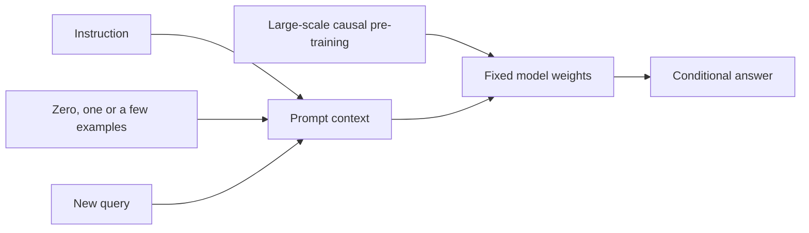

import PaperPdf from '@site/src/components/PaperPdf';
import CodeWalkthrough from '@site/src/components/viz/CodeWalkthrough';
import ResearchPaperLab from '@site/src/components/viz/ResearchPaperLab';

> **Brown et al. · 2020** · [Read the embedded paper](#original-paper) ·
> [Download PDF](/papers/research-papers/gpt-3.pdf) · Notes follow the paper
> section by section, §1 to the appendices.

## Paper in one minute

**Problem.** Fine-tuning a new checkpoint for every task is expensive and can be
impractical when only a handful of examples exist.

**Key idea.** Place an instruction and zero, one or several demonstrations in a
large causal model's context, then ask it to complete the new case without any
gradient update.

**Why it matters.** GPT-3 systematically connected scale with in-context task
adaptation. Prompt format, scoring, contamination and inference cost remain part
of every claim; model size alone does not remove those concerns.

### In-context learning flow



## How to read this chapter

The walkthrough below follows the paper **in its own order**, from the abstract
to the appendices. Each heading carries the paper's section number, so you can
keep the PDF open beside it. The paper has no numbered equations, so formulas
are named by the section they come from. Boxes marked **not from the paper** are
teaching aids, such as analogies, derivations, worked numbers or real-world
examples, added to make a step easier to follow.

GPT-3 reports results on dozens of benchmarks. The main text shows a few
headline rows from each table. The larger tables sit inside fold-out boxes.

## Abstract: the five claims

The abstract makes five claims. The rest of the paper tries to back them up.

1. **Scale helps few-shot learning.** Making a language model much bigger
   greatly improves its ability to do a new task from a few examples, sometimes
   matching models that were specially trained for that task.
2. **GPT-3 is the test.** GPT-3 is an autoregressive language model (it writes
   text one token at a time, each token based on the ones before) with **175
   billion parameters**. Parameters are the learned numbers inside the model.
   That is 10 times more than any earlier non-sparse language model.
3. **No weight updates.** Every task is given to the model as plain text. The
   model is never retrained for a task.
4. **Strong but uneven results.** GPT-3 does well on translation, question
   answering and fill-in-the-blank tasks, and on tasks that need quick
   reasoning, such as unscrambling words or 3-digit arithmetic. It still
   struggles on some datasets, and training on web text causes some evaluation
   problems.
5. **Convincing fake news.** People find it hard to tell GPT-3's news articles
   from human ones. The paper discusses what that means for society.

Keep these in mind: §2 sets up the method, §3 supplies the evidence, §4 checks
the evidence for leaks, and §5 and §6 set out the limits and the risks.

## §1 Introduction: one dataset per task is the bottleneck

By 2020 the usual recipe in NLP (natural language processing) was
**pre-train, then fine-tune**. First a model learns general language from a
large pile of text. Then it is **fine-tuned**: its weights are trained further
on thousands of labelled examples of one task. The architecture is the same for
every task, but each task still needs its own labelled dataset.

With GPT-1, we pre-train a model and then update its weights for a labelled
task. GPT-2 explores tasks presented as text continuations. GPT-3 asks a more
systematic question: **what happens when we make the model much larger and give
it a few worked examples at inference time?**

The paper gives three reasons to remove the need for a task dataset:

1. **Practicality.** Many useful tasks, such as fixing grammar or critiquing a
   short story, have no large labelled dataset. Collecting one for every new
   task is slow and costly.
2. **Spurious correlations.** A spurious correlation is a pattern that happens
   to predict the label in the training data but is not the real reason for it.
   A large model fine-tuned on a narrow dataset can latch onto such patterns. It
   may then score at "human level" on the benchmark while doing worse on the
   real task.
3. **Humans do not need it.** A person can usually do a new language task from
   a short instruction or a couple of examples. They can also switch between
   tasks in the middle of a conversation.

:::tip Intuition: learning from three dictionary entries (not from the paper)

Imagine showing someone three dictionary entries before asking for a fourth.
You have specified both the task and the output format. A language model
receives this as a sequence of tokens. It must infer a useful continuation from
the pattern.

:::

### Meta-learning and in-context learning

The paper's proposed route is **meta-learning**. During pre-training the model
picks up a broad set of skills and pattern-recognition abilities. At inference
time it uses those abilities to adapt to, or recognise, the task in front of it.

Figure 1.1 of the paper splits this into two loops:

- The **outer loop** is ordinary pre-training, which updates the weights.
- The **inner loop** happens inside a single forward pass, over one input
  sequence, with no weight change.

The paper calls this **in-context learning**. “Learning” here describes changed
behaviour given context. It does not mean that backpropagation happens during
the evaluation prompt.

Footnote 1 explains the naming. Earlier work called this "zero-shot transfer",
but that is misleading when the prompt contains examples. So the paper uses
**zero-shot**, **one-shot** and **few-shot** for 0, 1 or a few demonstrations.
The terms stay deliberately **neutral** on one open question: does the model
learn a new task from scratch, or only recognise one it saw in training? §5
returns to this.

:::note The key question is left open

"Meta-learning" here is a description of the setup, not a proven mechanism. The
paper never shows what computation happens in the inner loop. Later research
(for example on "induction heads" in Transformers) started to study this
directly.

:::

### Why scale might help

GPT-2's in-context results were still far behind fine-tuning. It scored only 4%
on Natural Questions, and its 55 F1 on CoQA was more than 35 points behind the
state of the art. F1 is a score from 0 to 100 that measures how much the
model's answer overlaps with the correct answer.

Meanwhile language models had grown fast: 100 million parameters (GPT-1), 300
million (BERT), 1.5 billion (GPT-2), 8 billion, 11 billion, then 17 billion
(Turing-NLG). Each jump brought improvements. Earlier work had also found that
the **log loss** (how surprised the model is by real text) falls smoothly as
models grow. The authors reason that in-context learning might improve with
scale in the same way.

### What the paper tests

The authors train GPT-3 and evaluate it in three settings:

| Setting   | What the model gets                                           |
| --------- | ------------------------------------------------------------- |
| Few-shot  | As many demonstrations as fit in the context (typically 10–100) |
| One-shot  | Exactly one demonstration                                     |
| Zero-shot | Only a natural-language instruction                           |

Figure 1.2 shows this on a task where the model must remove random symbols from
a word. Accuracy rises with the number of in-context examples, called **K**,
and rises much faster for bigger models. These "learning curves" involve **no
gradient updates**, only more examples in the prompt.

Headline numbers from §1: GPT-3 reaches **81.5, 84.0 and 85.0 F1** on CoQA in
the zero-, one- and few-shot settings. On TriviaQA it reaches **64.3%, 68.0% and
71.2%**. The last is state of the art among closed-book systems, even
fine-tuned ones. The paper is also open about weak spots, naming ANLI, RACE and
QuAC.

Figure 1.3 aggregates **42 accuracy-based benchmarks**. Zero-shot performance
improves steadily with size, but few-shot improves faster. The paper warns that
this aggregate is a rough guide, "not ... a rigorous or meaningful benchmark in
itself".

Two more threads run through the paper. It studies **data contamination**
(test questions leaking into training data) and trains **seven smaller models**
(125 million to 13 billion parameters) for comparison. A recurring pattern is
that the gap between zero-, one- and few-shot performance **grows with model
size**.

:::tip In the real world (not from the paper)

Soon after the paper, OpenAI offered GPT-3 through an API where the only
interface was a text prompt. Developers built products by writing instructions
and examples, exactly the zero- and few-shot settings of §1, instead of
collecting a dataset. Viable and Algolia Answers are two documented examples
(see [Real-world uses](#real-world-uses-and-worked-examples)).

:::

## §2 Approach: four ways to give a model a task

GPT-3's training recipe is the one from GPT-2, scaled up: a bigger model, more
and more varied data, and longer training. What is new is the **systematic
study of in-context settings**. The paper places four settings on a spectrum,
from most task data to least.


_Figure 2.1 from the original paper, PDF page 7.
[Source PDF](/papers/research-papers/gpt-3.pdf#page=7)._

| Setting | What the model receives for the new task | Are weights updated for that task? |
|---|---|---|
| Fine-tuning | A training dataset and an optimisation procedure | Yes |
| Zero-shot | A description or task-shaped prefix | No |
| One-shot | A description and one demonstration | No |
| Few-shot | A description and several demonstrations | No |

The paper weighs each setting:

- **Fine-tuning (FT)** updates the weights on typically thousands to hundreds of
  thousands of labelled examples. It gives strong benchmark scores. The costs
  are a new dataset for every task, possible poor generalisation outside that
  data, and the risk of exploiting spurious features. The paper **does not
  fine-tune GPT-3**, because its focus is task-agnostic performance, and leaves
  that to future work.
- **Few-shot (FS)** gives K examples of context and completion, then one final
  context for the model to complete. K is usually 10 to 100, because that is
  what fits in the model's context window of $n_{ctx}=2048$ tokens. The context
  window is the maximum amount of text the model can read at once. Few-shot
  needs much less task data, but its results had so far been much worse than
  fine-tuning.
- **One-shot (1S)** allows one demonstration plus an instruction. It is singled
  out because it matches how tasks are often explained to people, for example
  crowd workers on Mechanical Turk.
- **Zero-shot (0S)** gives only an instruction. It is the most convenient and
  the hardest. The paper notes it can be "unfairly hard": even a human might not
  know what format "make a table of world records for the 200m dash" wants.

The paper does not treat these as rivals. They are different problem settings
that trade benchmark performance against sample efficiency. The authors
highlight few-shot results because many are close to fine-tuned state of the
art, but say one-shot or zero-shot are the fairest comparisons with humans.

For translation, the prompt could contain `English: sea otter → French: loutre
de mer`, followed by another pair and then `English: cheese → French:`. The
model predicts the missing continuation. The examples consume context space,
just like the question and the generated answer.

Three details matter. The examples must precede the answer in the causal
context. Their formatting helps identify inputs and outputs. Their labels should
not contain the answer to the evaluation question, or the evaluation becomes
leakage rather than a test of transfer.

### What changes inside the model if the weights stay fixed? (not from the paper)

The weights define a function. The prompt supplies its input. Changing the
prompt changes embeddings, attention patterns, hidden states and output
probabilities even when the function's parameters remain identical.

Think of a calculator: the circuitry need not change when you change the
expression. In-context learning is much richer than arithmetic evaluation, but
this distinction between changing inputs and changing parameters still applies.

It also explains why a demonstration disappears when it is removed from the
context. Prompt examples are not automatically written into permanent model
memory.

:::tip In the real world (not from the paper)

An illustration: a finance team wants a helper that turns messy expense notes
into a fixed format. A **zero-shot** prompt says "Convert this note to
date, amount, category". A **one-shot** prompt adds one worked conversion, much
like the single example you would give a new colleague. A **few-shot** prompt
adds ten, covering refunds and foreign currencies. Nobody retrains the model;
only the prompt changes.

:::

### §2.1 Model and architectures

GPT-3 uses **the same model as GPT-2**: the modified initialisation,
pre-normalisation (layer normalisation applied before each sub-layer, not after)
and reversible byte-level tokenisation. The one change is that the layers
**alternate between dense attention and locally banded sparse attention**, as in
the Sparse Transformer. Dense attention lets each token look at every earlier
token. Banded sparse attention lets it look only at a nearby window, which is
cheaper.

To study how performance depends on size, the authors train **8 models**
spanning three orders of magnitude. Earlier scaling-law work predicted that,
with enough data, validation loss falls as a smooth **power law** in model size.
A power law means that each 10-fold increase in size cuts the loss by roughly
the same fraction. Training many sizes lets the paper test that prediction on
loss and on real tasks.

Table 2.1 lists the models. Here $n_{params}$ is the number of trainable
parameters, $n_{layers}$ the number of layers, $d_{model}$ the width of each
layer, $n_{heads}$ the number of attention heads and $d_{head}$ the width of each
head. The feed-forward layer is always four times wider:
$d_{ff}=4\cdot d_{model}$. Headline rows:

| Model          | $n_{params}$ | $n_{layers}$ | $d_{model}$ | Batch size (tokens) | Learning rate        |
| -------------- | ------------ | ------------ | ----------- | ------------------- | -------------------- |
| GPT-3 Small    | 125M         | 12           | 768         | 0.5M                | $6.0\times10^{-4}$   |
| GPT-3 XL       | 1.3B         | 24           | 2048        | 1M                  | $2.0\times10^{-4}$   |
| GPT-3 13B      | 13.0B        | 40           | 5140        | 2M                  | $1.0\times10^{-4}$   |
| GPT-3 175B     | 175.0B       | 96           | 12288       | 3.2M                | $0.6\times10^{-4}$   |

**What this shows:** as the models grow, batch size goes up and the learning
rate goes down. All eight models were trained on the same **300 billion
tokens**.

<details>
<summary>Full Table 2.1 from the paper</summary>

| Model name            | $n_{params}$ | $n_{layers}$ | $d_{model}$ | $n_{heads}$ | $d_{head}$ | Batch size | Learning rate      |
| --------------------- | ------------ | ------------ | ----------- | ----------- | ---------- | ---------- | ------------------ |
| GPT-3 Small           | 125M         | 12           | 768         | 12          | 64         | 0.5M       | $6.0\times10^{-4}$ |
| GPT-3 Medium          | 350M         | 24           | 1024        | 16          | 64         | 0.5M       | $3.0\times10^{-4}$ |
| GPT-3 Large           | 760M         | 24           | 1536        | 16          | 96         | 0.5M       | $2.5\times10^{-4}$ |
| GPT-3 XL              | 1.3B         | 24           | 2048        | 24          | 128        | 1M         | $2.0\times10^{-4}$ |
| GPT-3 2.7B            | 2.7B         | 32           | 2560        | 32          | 80         | 1M         | $1.6\times10^{-4}$ |
| GPT-3 6.7B            | 6.7B         | 32           | 4096        | 32          | 128        | 2M         | $1.2\times10^{-4}$ |
| GPT-3 13B             | 13.0B        | 40           | 5140        | 40          | 128        | 2M         | $1.0\times10^{-4}$ |
| GPT-3 175B or "GPT-3" | 175.0B       | 96           | 12288       | 96          | 128        | 3.2M       | $0.6\times10^{-4}$ |

</details>

Every model has a context window of $n_{ctx}=2048$ tokens. Each model is split
across GPUs along both depth and width to reduce data transfer between machines.
The exact shapes were chosen for computational efficiency and load balancing.
The paper cites earlier work showing that validation loss is not very sensitive
to these shape choices within a broad range.

:::tip Worked number: where 175 billion comes from (not from the paper)

A Transformer layer has about $12\,d_{model}^2$ weights: $4\,d_{model}^2$ in
attention and $8\,d_{model}^2$ in the feed-forward layer. For GPT-3 175B:

$$
12\times n_{layers}\times d_{model}^2=12\times96\times12288^2\approx1.739\times10^{11}.
$$

Add the token embeddings. GPT-2's vocabulary has 50,257 tokens, so that is
$50{,}257\times12{,}288\approx0.62$ billion more. Adding 2,048 position vectors
brings the total to about **174.6 billion**, which matches the 174,600 M that
Appendix D lists. "175B" is the rounded figure.

The batch of 3.2 M tokens is about 1,560 sequences of 2,048 tokens. At that
size, 300 billion tokens is roughly 94,000 optimiser steps, ignoring the smaller
batches early in training (Appendix B).

:::

:::note Two rows of Table 2.1 do not add up

In a standard Transformer, $n_{heads}\times d_{head}=d_{model}$. Six rows obey
this. Two do not:

- **GPT-3 13B:** $40\times128=5120$, not the 5140 printed. 5140 is not divisible
  by 40 heads of whole width, so 5120 is almost certainly the real value.
- **GPT-3 XL:** $24\times128=3072$, not 2048. Either the head count or the head
  width is misprinted.

Neither slip changes any result, but take care if you rebuild these models from
the table.

:::

The objective is not written as an equation in the paper, because it is the
same as GPT-2's: predict each next token. Written out (the equation itself is
not in the paper), the training loss is:

$$
L=-\sum_t \log p_\theta(x_t\mid x_{<t}).
$$

In words: for every position, the model is penalised by how little probability
it gave to the token that actually came next.

There is no separate “few-shot loss” applied to the evaluation demonstrations. A
useful distinction is **pre-training distribution** versus **evaluation
interface**. Training exposes the model to patterns in text; evaluation asks it
to exploit those patterns through a prefix.

#### Parameters, training tokens and context are different quantities (not from the paper)

| Quantity | What increasing it changes | What it does not directly mean |
|---|---|---|
| Parameters | Capacity and computation per model pass | A longer prompt |
| Training tokens | How much text the optimiser learns from | Permanent verbatim storage of every token |
| Context length | How much input is visible in one invocation | More learned weights |
| Demonstration count | How many task examples appear in that context | Additional fine-tuning steps |

Increasing one can help, but the others still constrain behaviour. A large model
with an insufficient context budget cannot read an arbitrarily large
demonstration set.

### §2.2 Training dataset

Common Crawl, a public archive of web pages, holds nearly a trillion words.
That is enough to train the largest model without ever seeing the same
sequence twice. But unfiltered web text is lower quality than curated text. So
the authors took three steps:

1. **Filter** Common Crawl, keeping pages that look like high-quality reference
   text (details in Appendix A).
2. **Fuzzily deduplicate** documents, within and across datasets. This removes
   near-copies and keeps the held-out validation set honest (Appendix A).
3. **Add curated corpora**: an expanded WebText (WebText2), two internet books
   corpora (Books1 and Books2) and English Wikipedia.

The Common Crawl part came from 41 monthly shards covering 2016 to 2019: 45 TB
of compressed text before filtering and 570 GB after, roughly 400 billion
byte-pair-encoded tokens. Byte-pair encoding (BPE) is a way of splitting text
into common word pieces.

Table 2.2 of the paper:

| Dataset                 | Tokens      | Weight in training mix | Epochs over 300B tokens |
| ----------------------- | ----------- | ---------------------- | ----------------------- |
| Common Crawl (filtered) | 410 billion | 60%                    | 0.44                    |
| WebText2                | 19 billion  | 22%                    | 2.9                     |
| Books1                  | 12 billion  | 8%                     | 1.9                     |
| Books2                  | 55 billion  | 8%                     | 0.43                    |
| Wikipedia               | 3 billion   | 3%                     | 3.4                     |

**What this shows:** the mix is deliberately **not** proportional to size. An
epoch is one full pass over a dataset. Higher-quality sets are seen 2–3 times,
while Common Crawl and Books2 are seen less than once. The paper accepts "a
small amount of overfitting in exchange for higher quality training data".

GPT-3's dataset table gives both the amount of data available from a source and
its weight in the training mixture. A smaller, highly weighted source may be
encountered more often than a larger source. The number of effective epochs
therefore differs between sources.

:::tip Worked number: check the epochs column (not from the paper)

Epochs should equal weight × 300 billion ÷ dataset size. For Common Crawl:
$0.60\times300/410\approx0.44$, which matches. For Books2:
$0.08\times300/55\approx0.44$, close to the printed 0.43.

The other rows do not match as well. WebText2 gives $0.22\times300/19\approx3.5$,
not 2.9. Wikipedia gives $0.03\times300/3=3.0$, not 3.4. The weights also sum to
**101%**. So the weights are rounded, and the epochs column cannot be rebuilt
exactly from the other columns.

:::

**Contamination and the filtering bug.** Web data may contain the test sets of
the benchmarks the paper uses. The authors searched for overlaps and tried to
remove them. But "a bug in the filtering caused us to ignore some overlaps", and
retraining was too expensive. §4 measures how much the remaining overlap
matters.

:::tip In the real world (not from the paper)

Common Crawl filtering became a standard step in building training data. T5's
C4 corpus, for example, is a cleaned version of Common Crawl. The trade-off
GPT-3 made, repeating small high-quality sources more often than a huge noisy
one, is a choice every large training run now has to make.

:::

### §2.3 Training process

Larger models can use larger batches but need smaller learning rates. The batch
size is how many tokens the model processes before each weight update. The
learning rate is how big each update step is. The authors measured the
**gradient noise scale** during training to pick batch sizes. It is a measure of
how noisy each update is, and so how much a bigger batch would help.

To fit the larger models in memory, they combined two kinds of **model
parallelism**: splitting each matrix multiply across GPUs, and splitting the
layers across GPUs. Training ran on V100 GPUs in a high-bandwidth cluster
provided by Microsoft. The hyperparameters are in Appendix B.

The model family shares a broad training approach while varying scale and
optimisation settings. Distributed execution splits work across devices because
neither the parameters nor the full computation fit on one accelerator. This is
an execution strategy, separate from the causal modelling objective.

**Figure 2.2** plots total training compute in petaflop/s-days. One
petaflop/s-day is $10^{15}$ operations per second sustained for a day. Following
the scaling-law analysis, the authors train **much larger models on fewer
tokens** than was usual. As a result the paper's "GPT-3 3B" (the 2.7B model)
and RoBERTa-Large (355M) both took roughly 50 petaflop/s-days, although the
paper calls GPT-3 3B "almost 10x larger". Appendix D shows the calculation.
Its Table D.1 gives 2,650M against 355M parameters, which is about 7.5 times,
so "almost 10x" is generous.

### §2.4 Evaluation

This section defines exactly how each test question becomes a model input. Each
evaluation question receives demonstrations sampled from the task's available
example set, followed by the new input. The context budget limits the number
and size of demonstrations. Formatting, choice order and answer extraction
belong to the evaluation protocol.

**Choosing demonstrations.** For each test example, K examples are drawn at
random from the task's **training set**, separated by one or two newlines.
Tasks without a training set are handled differently. LAMBADA and StoryCloze
draw from the development set and test on the test set. The original Winograd
set has only one split, so examples come from that same set.

**Choosing K.** K can be anything from 0 up to what fits in 2,048 tokens,
typically 10 to 100 examples. More is "usually but not always better". Where a
separate development and test set exist, the authors try a few values of K on
the development set and run the best one on the test set. Some tasks also get a
natural-language prompt, or only a prompt when K = 0. Appendix G lists them all.

**Multiple choice.** The model sees K examples of context plus correct answer,
then the test context. Each candidate answer is scored by its **likelihood**,
the probability the model assigns to it. For most tasks the paper uses the
**per-token** likelihood, dividing by length so that long answers are not
unfairly penalised. For ARC, OpenBookQA and RACE, it instead normalises by how
likely the answer is on its own:

$$
\frac{P(\text{completion}\mid\text{context})}{P(\text{completion}\mid\text{answer\_context})}
$$

In words: an answer scores well if the question makes it much more likely than
it would be after a generic prompt. Here `answer_context` is just `"Answer: "`
or `"A: "`. This stops an answer winning only because it is a common phrase.

For a multiple-choice task, candidate likelihoods can be compared instead of
generating unrestricted prose. A multi-token answer's log likelihood is a sum
over its tokens. Length normalisation or task-specific normalisation can change
the comparison, so “highest probability answer” is not a sufficiently precise
scoring specification by itself.

:::tip Worked number: why normalisation matters (not from the paper)

Say answer A is one token with log-probability −0.9. Answer B is two tokens
with log-probabilities −1.0 and −0.2.

- **Raw sum:** A scores −0.9 and B scores −1.2, so A wins.
- **Per-token average:** A scores −0.9 and B scores −0.6, so B wins.

Same model, same probabilities, different answer. That is why the paper states
its scoring rule for each task.

:::

**Binary classification.** The two classes get meaningful names, such as "True"
and "False" instead of 0 and 1, and are then scored like multiple choice.

**Free-form answers.** For open answers the paper uses **beam search**, which
keeps the 4 best partial answers at each step instead of only the single best.
It uses beam width 4 and length penalty $\alpha=0.6$. Answers are scored with
F1, BLEU or **exact match** (the answer must be exactly right), whichever is
standard for the dataset. BLEU is a score for how closely a translation matches
a human one.

For free-form QA, generated answers are matched under the task's rules. For
translation, output is compared with references. For language modelling,
perplexity summarises average negative log probability. These interfaces test
different aspects of the same model.

**Test or development set.** Results are on the test set when it is public. When
the test set is private, the model was often too large for the test server, so
the paper reports development-set results. It did submit to the test servers
for SuperGLUE, TriviaQA and PIQA.

:::note "200B" is a typo

§2.4 says the authors "submit only the 200B few-shot results". No 200B model
exists; it means the 175B model. Appendix E repeats the same slip ("200B
(GPT-3)").

:::

:::tip In the real world (not from the paper)

Any team comparing chatbots faces §2.4's choices. An illustration: two vendors
report "85% accuracy" on the same quiz, but one lets the model pick from four
options while the other demands an exact free-text answer. The numbers are not
comparable until you know the prompt, the number of examples and the scoring
rule.

:::

## §3 Results

§3 starts with **Figure 3.1**, the training curves. It adds 6 extra-small models,
down to 100,000 parameters, to the 8 main ones. Validation loss follows a power
law in training compute, and extending the trend by two more orders of
magnitude shows "only a slight (if any) departure". The authors expect lower
loss to bring gains on real tasks, and the rest of §3 tests that.

The paper evaluates language modelling, closed-book QA, translation, commonsense
tasks, reading comprehension, SuperGLUE and synthetic tasks such as arithmetic.
Few-shot improvements are uneven: strong performance on one family does not
establish broad reliability on every family. Its contamination analysis is part
of the result, because web pre-training can overlap with evaluation material.

**Closed-book QA** means the model answers from its parameters and prompt,
without retrieving an external document at answer time. **Cloze completion**
hides part of a text and asks for the continuation or missing content.
**Accuracy** counts correct responses; **perplexity** measures how much
probability a model assigns to observed text. These metrics answer different
questions.

A good way to read each experiment is to identify the prompt, the number of
examples, the answer-scoring rule, and the comparator. A model that produces the
right answer somewhere in a long completion may still fail a strict answer
extraction rule.

In the tables below, **SOTA** means "state of the art", the best published
result at the time. Almost all SOTA results come from **fine-tuned** models,
which is a harder comparison for GPT-3.

### §3.1 Language modelling, cloze and completion tasks

#### §3.1.1 Language modelling

**Perplexity** measures how surprised a model is by real text. Lower is better;
a perplexity of 20 means the model is, on average, as unsure as if it were
choosing between 20 equally likely words.

The paper measures zero-shot perplexity on the **Penn Treebank (PTB)**. It skips
the four Wikipedia-based tasks from GPT-2's paper and the One Billion Word
benchmark, because they are largely inside GPT-3's training data. PTB is older
than the modern web, so it escapes that problem. Table 3.1: GPT-3 reaches
**20.5**, against a previous zero-shot best of **35.8**, a 15-point
improvement. PTB has no natural "examples", so only zero-shot is measured.

#### §3.1.2 LAMBADA

LAMBADA asks the model to predict the **last word** of a passage, where the
word can only be guessed by reading the whole paragraph. Other researchers had
argued that scaling was giving diminishing returns here. GPT-3 disagrees: it
scores **76.2%** zero-shot, 8 points above the previous best.

LAMBADA also shows a clever use of few-shot prompting. A normal language model
does not know that the answer must be **exactly one word**, so it spreads
probability over longer continuations. The paper frames the task as
fill-in-the-blank instead:

```text
Alice was friends with Bob. Alice went to visit her friend ____. → Bob
George bought some baseball equipment, a ball, a glove, and a ____. →
```

With this format GPT-3 reaches **86.4%** few-shot, more than 18 points above the
previous state of the art. The format helps big models and hurts small ones: it
lowers the smallest model's accuracy by almost 20% but raises GPT-3's by 10%.
It does not work one-shot, which is always worse than zero-shot. The
authors guess that models need several examples to recognise the pattern.

:::note A caveat the paper flags itself

A "significant minority" of LAMBADA appears in the training data. §4 finds the
clean subset scores within 0.5% of the full set, so the paper judges the impact
negligible.

:::

#### §3.1.3 HellaSwag and §3.1.4 StoryCloze

**HellaSwag** asks for the best ending to a story or set of instructions. Its
examples were chosen to be hard for language models but easy for humans, who
score 95.6%. GPT-3 gets 78.1% one-shot and 79.3% few-shot. That beats a
fine-tuned 1.5B model (75.4%) but trails the fine-tuned multi-task SOTA, ALUM
(85.6%).

**StoryCloze** asks for the right final sentence of a five-sentence story.
GPT-3 gets 83.2% zero-shot and 87.7% few-shot (with K = 70). That is 4.1 points
below the fine-tuned SOTA but about 10 points above earlier zero-shot results.

Table 3.2, condensed:

| Setting         | LAMBADA (acc) | LAMBADA (ppl) | StoryCloze (acc) | HellaSwag (acc) |
| --------------- | ------------- | ------------- | ---------------- | --------------- |
| SOTA            | 68.0          | 8.63          | 91.8             | 85.6            |
| GPT-3 Zero-Shot | 76.2          | 3.00          | 83.2             | 78.9            |
| GPT-3 One-Shot  | 72.5          | 3.35          | 84.7             | 78.1            |
| GPT-3 Few-Shot  | **86.4**      | **1.92**      | 87.7             | 79.3            |

**What this shows:** GPT-3 sets a new state of the art on LAMBADA, and is good
but not best on the two story-ending tasks.

:::tip In the real world (not from the paper)

The phone keyboard that suggests your next word is a small language model doing
§3.1's task. LAMBADA's lesson carries over: the model needs to know **what shape
of answer** you want (one word, one sentence), and an example is often the
clearest way to say it.

:::

### §3.2 Closed book question answering

Question answering over general knowledge was usually done **open-book**: a
retrieval system finds relevant documents, then a model reads them. Earlier work
had shown a big model can answer **closed-book**, from memory alone. GPT-3 is
even stricter: no retrieval and no fine-tuning on the question set.

Table 3.3 of the paper, accuracy (%):

| Setting                            | NaturalQS | WebQS | TriviaQA |
| ---------------------------------- | --------- | ----- | -------- |
| RAG (fine-tuned, open-domain)      | 44.5      | 45.5  | 68.0     |
| T5-11B+SSM (fine-tuned, closed-book) | 36.6    | 44.7  | 60.5     |
| T5-11B (fine-tuned, closed-book)   | 34.5      | 37.4  | 50.1     |
| GPT-3 Zero-Shot                    | 14.6      | 14.4  | 64.3     |
| GPT-3 One-Shot                     | 23.0      | 25.3  | 68.0     |
| GPT-3 Few-Shot                     | 29.9      | 41.5  | **71.2** |

**What this shows:** on TriviaQA, GPT-3 one-shot already equals RAG, a system
that fine-tunes and searches 21 million documents. On the other two datasets it
approaches, but does not reach, the closed-book SOTA.

The paper's reading:

- **TriviaQA:** zero-shot beats fine-tuned T5-11B by 14.2 points, and the
  QA-tailored T5+SSM by 3.8. One-shot matches RAG, which uses a 15.3B-parameter
  dense index over 21M documents. Few-shot adds another 3.2.
- **WebQuestions:** a much bigger jump from zero-shot (14.4%) to few-shot
  (41.5%). The authors suggest the question or answer style is unusual for
  GPT-3, and examples help it adapt.
- **Natural Questions:** the same large jump, and the weakest result. Its
  questions need very fine-grained Wikipedia knowledge, which may test the
  limits of GPT-3's capacity.

On all three datasets accuracy **grows smoothly with model size** (Figure 3.3).
The paper suggests this reflects more "knowledge" being absorbed into the
parameters as capacity grows.

:::tip In the real world (not from the paper)

Closed-book QA is a pub quiz from memory; open-book QA is the same quiz with a
library card. Most production assistants now do the second: they retrieve
documents first. The next chapter, [RAG](/docs/research-papers/rag), is the
"open-domain" row of Table 3.3.

:::

### §3.3 Translation

GPT-2's training data was filtered to English only, yet it could still
translate a little. GPT-3's data includes more other languages: it is **93%
English by word count and 7% other languages**. The paper studies French,
German and Romanian.

Most **unsupervised translation** systems (trained without paired sentences)
pre-train on two monolingual datasets and use back-translation. GPT-3 instead
learns from a natural mixture of languages. Its one- and few-shot settings are
not strictly unsupervised, because they use 1 or 64 translated examples, "up to
a page or two" of paired data.

Table 3.4 of the paper, BLEU scores, condensed:

| Setting             | En→Fr | Fr→En    | En→De | De→En    | En→Ro | Ro→En |
| ------------------- | ----- | -------- | ----- | -------- | ----- | ----- |
| SOTA (supervised)   | 45.6  | 35.0     | 41.2  | 40.2     | 38.5  | 39.9  |
| MASS (unsupervised) | 37.5  | 34.9     | 28.3  | 35.2     | 35.2  | 33.1  |
| GPT-3 Zero-Shot     | 25.2  | 21.2     | 24.6  | 27.2     | 14.1  | 19.9  |
| GPT-3 Few-Shot      | 32.6  | **39.2** | 29.7  | **40.6** | 21.0  | 39.5  |

**What this shows:** GPT-3 is much better at translating **into** English than
out of it. Few-shot beats the best supervised result the authors found for
Fr→En and De→En.

<details>
<summary>Full Table 3.4 from the paper</summary>

| Setting           | En→Fr | Fr→En | En→De | De→En | En→Ro | Ro→En |
| ----------------- | ----- | ----- | ----- | ----- | ----- | ----- |
| SOTA (Supervised) | 45.6  | 35.0  | 41.2  | 40.2  | 38.5  | 39.9  |
| XLM               | 33.4  | 33.3  | 26.4  | 34.3  | 33.3  | 31.8  |
| MASS              | 37.5  | 34.9  | 28.3  | 35.2  | 35.2  | 33.1  |
| mBART             | -     | -     | 29.8  | 34.0  | 35.0  | 30.5  |
| GPT-3 Zero-Shot   | 25.2  | 21.2  | 24.6  | 27.2  | 14.1  | 19.9  |
| GPT-3 One-Shot    | 28.3  | 33.7  | 26.2  | 30.4  | 20.6  | 38.6  |
| GPT-3 Few-Shot    | 32.6  | 39.2  | 29.7  | 40.6  | 21.0  | 39.5  |

WMT'14 Fr↔En, WMT'16 De↔En and WMT'16 Ro↔En, measured with multi-bleu.perl and
XLM's tokenisation to match earlier unsupervised work. SacreBLEU results are in
Appendix H.

</details>

The paper's reading:

- Zero-shot, with only an instruction, is below earlier unsupervised systems.
- One example improves results by **over 7 BLEU**. Full few-shot adds about **4
  more**, bringing GPT-3 to about the same average as earlier unsupervised work.
- **Direction matters.** Into English, GPT-3 beats earlier unsupervised systems;
  out of English, it lags. En→Ro is more than 10 BLEU behind. The authors
  suspect GPT-2's byte-level BPE tokeniser, built for almost entirely English
  text.
- For Fr→En and De→En, few-shot GPT-3 beats the best supervised result the
  authors could find. They are careful not to call it true state of the art,
  citing their "unfamiliarity with the literature". For Ro→En it is within 0.5
  BLEU of the overall SOTA.
- Every pair improves smoothly with model size (Figure 3.4).

:::tip Worked number: check "over 7" and "another 4" (not from the paper)

Average the six columns of the full table. Zero-shot:
$132.2/6\approx22.0$. One-shot: $177.8/6\approx29.6$, a gain of about **7.6**
BLEU. Few-shot: $202.6/6\approx33.8$, a further gain of about **4.1**. Both
match the paper's wording.

:::

:::tip In the real world (not from the paper)

An illustration: a travel app that only needs to understand foreign reviews
(into English) could lean on a model like this. A shop that must write product
pages in Romanian (out of English) should test carefully, because §3.3 shows the
reverse direction is much weaker.

:::

### §3.4 Winograd-style tasks

A **Winograd schema** asks which word a pronoun refers to, in a sentence that is
grammatically ambiguous but obvious to a person. A classic example, not from
the paper: in "The trophy did not fit in the suitcase because it was too big",
"it" is the trophy.
**Winogrande** is a larger, harder version collected adversarially.

Table 3.5 of the paper:

| Setting         | Winograd | Winogrande (XL) |
| --------------- | -------- | --------------- |
| Fine-tuned SOTA | 90.1     | 84.6            |
| GPT-3 Zero-Shot | 88.3\*   | 70.2            |
| GPT-3 One-Shot  | 89.7\*   | 73.2            |
| GPT-3 Few-Shot  | 88.6\*   | 77.7            |

**What this shows:** on the original Winograd, GPT-3 is strong in every setting,
with **no clear gain from examples**. On Winogrande, examples do help. The
asterisk marks possible contamination (§4).

For Winogrande, a fine-tuned RoBERTa scores 79%, the fine-tuned T5 SOTA 84.6%,
and humans 94.0%.

### §3.5 Common sense reasoning

Three datasets aim at physical or scientific reasoning:

- **PIQA** asks everyday questions about how the physical world works.
- **ARC** is multiple-choice questions from US school science exams (grades 3 to
  9). The "Challenge" set keeps only questions that simple retrieval methods get
  wrong.
- **OpenBookQA** is elementary science questions.

Table 3.6 of the paper:

| Setting         | PIQA   | ARC (Easy) | ARC (Challenge) | OpenBookQA |
| --------------- | ------ | ---------- | --------------- | ---------- |
| Fine-tuned SOTA | 79.4   | 92.0       | 78.5            | 87.2       |
| GPT-3 Zero-Shot | 80.5\* | 68.8       | 51.4            | 57.6       |
| GPT-3 One-Shot  | 80.5\* | 71.2       | 53.2            | 58.8       |
| GPT-3 Few-Shot  | 82.8\* | 70.1       | 51.5            | 65.4       |

**What this shows:** GPT-3 beats the state of the art on PIQA in every setting,
but trails the best ARC system (UnifiedQA) by 27 points on Challenge and 22 on
Easy. Examples help clearly only on OpenBookQA.

PIQA still sits more than 10 points below human performance and scales only
shallowly with size. It is marked with an asterisk for possible contamination,
even though its test labels are hidden (§4). On OpenBookQA GPT-3 is more than 20
points below SOTA, and close to a fine-tuned BERT-Large.

:::note Table 3.6 and the text disagree on PIQA zero-shot

The text says GPT-3 gets **81.0%** zero-shot on PIQA. Table 3.6 prints
**80.5**, the same as the one-shot cell. Appendix H lists 81.0 for 175B
zero-shot, so the table cell is most likely a copy error.

:::

### §3.6 Reading comprehension

Five datasets test reading a passage and answering questions about it. They
use different answer formats, from free text to multiple choice to picking a
span of the passage.

Table 3.7 of the paper (F1, except RACE, which is accuracy):

| Setting         | CoQA | DROP | QuAC | SQuADv2 | RACE-h | RACE-m |
| --------------- | ---- | ---- | ---- | ------- | ------ | ------ |
| Fine-tuned SOTA | 90.7 | 89.1 | 74.4 | 93.0    | 90.0   | 93.1   |
| GPT-3 Zero-Shot | 81.5 | 23.6 | 41.5 | 59.5    | 45.5   | 58.4   |
| GPT-3 One-Shot  | 84.0 | 34.3 | 43.3 | 65.4    | 45.9   | 57.4   |
| GPT-3 Few-Shot  | 85.0 | 36.5 | 44.3 | 69.8    | 46.8   | 58.1   |

**What this shows:** the spread is wide. GPT-3 is near human level on
conversational CoQA and far behind on QuAC, DROP and RACE.

The paper's reading, dataset by dataset:

- **CoQA** (free-form conversational QA): the best result, within 3 points of
  the human baseline.
- **QuAC** (structured teacher–student dialogue): the worst, 13 F1 below an
  ELMo baseline.
- **DROP** (discrete reasoning and counting over a passage): few-shot beats the
  original fine-tuned BERT baseline but stays far below humans and systems that
  add symbolic reasoning.
- **SQuAD 2.0**: few-shot gains almost 10 F1 over zero-shot, to 69.8, slightly
  above the best fine-tuned result in the original SQuAD 2.0 paper.
- **RACE** (school English exams): relatively weak, competitive only with the
  earliest contextual-representation work.

### §3.7 SuperGLUE

SuperGLUE is a standard bundle of eight language-understanding tasks. GPT-3
few-shot uses **32 examples per task**, drawn at random from the training set.
For WSC and MultiRC the same 32 examples are used for every question; for the
other tasks a new set is drawn per question.

Table 3.8 of the paper, test set, condensed:

| Task (metric)      | Fine-tuned SOTA | Fine-tuned BERT-Large | GPT-3 Few-Shot |
| ------------------ | --------------- | --------------------- | -------------- |
| Average            | 89.0            | 69.0                  | **71.8**       |
| COPA (acc)         | 94.8            | 70.6                  | **92.0**       |
| ReCoRD (acc)       | 92.5            | 71.3                  | **90.2**       |
| WSC (acc)          | 93.8            | 64.6                  | 80.1           |
| WiC (acc)          | 76.1            | 69.6                  | 49.4           |

**What this shows:** GPT-3 is close to the state of the art on COPA and ReCoRD,
but at chance on WiC. Its average is slightly above a fine-tuned BERT-Large.

<details>
<summary>Full Table 3.8 from the paper</summary>

| Model                 | Average | BoolQ | CB acc | CB F1 | COPA | RTE  | WiC  | WSC  | MultiRC acc | MultiRC F1a | ReCoRD acc | ReCoRD F1 |
| --------------------- | ------- | ----- | ------ | ----- | ---- | ---- | ---- | ---- | ----------- | ----------- | ---------- | --------- |
| Fine-tuned SOTA       | 89.0    | 91.0  | 96.9   | 93.9  | 94.8 | 92.5 | 76.1 | 93.8 | 62.3        | 88.2        | 92.5       | 93.3      |
| Fine-tuned BERT-Large | 69.0    | 77.4  | 83.6   | 75.7  | 70.6 | 71.7 | 69.6 | 64.6 | 24.1        | 70.0        | 71.3       | 72.0      |
| GPT-3 Few-Shot        | 71.8    | 76.4  | 75.6   | 52.0  | 92.0 | 69.0 | 49.4 | 80.1 | 30.5        | 75.4        | 90.2       | 91.1      |

</details>

The paper's reading:

- **COPA and ReCoRD:** near SOTA. COPA is second on the leaderboard, behind a
  fine-tuned 11-billion-parameter T5.
- **WSC:** 80.1% few-shot, lower than the 88.6% on the original Winograd format
  (§3.4).
- **BoolQ, MultiRC, RTE:** roughly a fine-tuned BERT-Large. **CB** shows "signs
  of life" at 75.6%.
- **WiC** is a clear weak spot at **49.4%**, which is chance. WiC asks whether a
  word has the same meaning in two sentences. No prompt the authors tried
  helped.

The authors draw a pattern from this: GPT-3 seems weak at tasks that **compare
two sentences or snippets**. That would also explain the lower RTE and CB
scores. Even so, it beats fine-tuned BERT-Large on four of the eight tasks.

**Figure 3.8** shows the SuperGLUE score rising with both model size and K.
Fewer than **eight examples per task** are enough for GPT-3 to beat a
fine-tuned BERT-Large overall. BERT-Large was fine-tuned on the full training
set of 125K examples.

### §3.8 NLI

**Natural language inference (NLI)** asks whether one sentence follows from
another, contradicts it, or neither. SuperGLUE's RTE is a two-class version. On
RTE, only the largest GPT-3 does convincingly better than random, and few-shot
it is similar to a single-task fine-tuned BERT-Large.

**ANLI** is a harder NLI set collected adversarially in three rounds. All models
smaller than GPT-3 score almost exactly at chance (about 33%), even few-shot.
GPT-3 175B shows "signs of life" on Round 3: Figure 3.9 shows it closing almost
half the gap between chance and SOTA. The authors conclude NLI "is still a very
difficult task for language models".

:::note Small test sets mean wide error bars

The paper estimates a standard deviation of **1.2%** on its ANLI Round 3
development results, because the set is small. A one-point difference between
two models there is not meaningful.

:::

### §3.9 Synthetic and qualitative tasks

To probe in-context learning directly, the authors invent tasks that are
unlikely to appear in training data: arithmetic, word unscrambling, SAT
analogies, news writing, using made-up words, and grammar correction.

#### §3.9.1 Arithmetic

Ten tests, each asked as a question such as "Q: What is 48 plus 76? A:". There
are 2,000 random problems per test, and the answer must be **exactly** right:

- 2- to 5-digit addition and subtraction (2D+, 2D−, … 5D+, 5D−)
- 2-digit multiplication (2D×)
- one-digit composite operations such as `6+(4*8)` (1DC)

Table 3.9 of the paper, GPT-3 175B, condensed:

| Setting   | 2D+   | 3D+  | 4D+  | 5D+ | 2D×  | 1DC  |
| --------- | ----- | ---- | ---- | --- | ---- | ---- |
| Zero-shot | 76.9  | 34.2 | 4.0  | 0.7 | 19.8 | 9.8  |
| One-shot  | 99.6  | 65.5 | 14.0 | 3.5 | 27.4 | 14.3 |
| Few-shot  | 100.0 | 80.4 | 25.5 | 9.3 | 29.2 | 21.3 |

**What this shows:** accuracy falls as numbers get longer, and examples help at
every length. Even zero-shot, GPT-3 175B beats every smaller model's few-shot
score.

<details>
<summary>Full Table 3.9 from the paper</summary>

| Setting   | 2D+   | 2D−  | 3D+  | 3D−  | 4D+  | 4D−  | 5D+ | 5D− | 2D×  | 1DC  |
| --------- | ----- | ---- | ---- | ---- | ---- | ---- | --- | --- | ---- | ---- |
| Zero-shot | 76.9  | 58.0 | 34.2 | 48.3 | 4.0  | 7.5  | 0.7 | 0.8 | 19.8 | 9.8  |
| One-shot  | 99.6  | 86.4 | 65.5 | 78.7 | 14.0 | 14.0 | 3.5 | 3.8 | 27.4 | 14.3 |
| Few-shot  | 100.0 | 98.9 | 80.4 | 94.2 | 25.5 | 26.8 | 9.3 | 9.9 | 29.2 | 21.3 |

</details>

Size matters a lot here (Figure 3.10). The 13B model gets 2-digit addition and
subtraction right only about half the time, and everything else under 10%.

**Is it memorising?** The authors searched the training data for the 3-digit
test problems, written as `<NUM1> + <NUM2> =` and `<NUM1> plus <NUM2>`. They
found only **17 of 2,000** addition problems (0.8%) and **2 of 2,000**
subtraction problems (0.1%). Wrong answers often look like a forgotten "carry
the 1", which suggests the model is attempting the calculation rather than
looking it up.

:::note Text and table differ slightly

The text reports 80.2% for few-shot 3-digit addition; Table 3.9 prints 80.4. The
same kind of small gap appears in §3.9.2. Appendix C explains a likely cause:
some numbers come from a run with a different random draw of in-context
examples.

:::

:::tip In the real world (not from the paper)

Nobody should trust a language model to do sums in a finance report. Later
systems followed the obvious fix: let the model call a calculator or run code.
Toolformer (2023) trained a model to insert calculator calls itself. §3.9.1 is
the evidence that pure next-token prediction gets only part of the way.

:::

#### §3.9.2 Word scrambling and manipulation

Five character-level tasks. Each gives a distorted word and asks for the
original:

- **CL**, cycled letters: "lyinevitab" → "inevitably"
- **A1**, all letters but the first and last shuffled: "criroptuon" →
  "corruption"
- **A2**, all but the first two and last two shuffled: "opoepnnt" → "opponent"
- **RI**, random punctuation or spaces inserted: "s.u!c/c!e.s s i/o/n" →
  "succession"
- **RW**, the word reversed: "stcejbo" → "objects"

Each task uses 10,000 examples, from the 10,000 most frequent words of 5 to 14
letters. Few-shot uses K = 100.

Table 3.10 of the paper, GPT-3 175B:

| Setting   | CL   | A1   | A2   | RI   | RW   |
| --------- | ---- | ---- | ---- | ---- | ---- |
| Zero-shot | 3.66 | 2.28 | 8.91 | 8.26 | 0.09 |
| One-shot  | 21.7 | 8.62 | 25.9 | 45.4 | 0.48 |
| Few-shot  | 37.9 | 15.1 | 39.7 | 67.2 | 0.44 |

**What this shows:** GPT-3 can barely do these tasks zero-shot, gets much better
with one example and better again with many. No model can reverse words.

The paper's reading: because the model fails zero-shot and the tasks are
artificial, it "really does appear to learn these tasks at test time", although
the authors cannot be sure. **Figure 1.2** uses the random-insertion task to show
in-context learning curves.

These tasks are harder than they look. GPT-3's BPE tokens average about 0.7
words each, so the model must pull tokens apart into letters. CL, A1 and A2 also
have more than one valid answer for some inputs, so the model has to search.

:::note Text and table differ again

The text quotes 66.9% (RI), 38.6% (CL), 40.2% (A2) and 15.1% (A1). Table 3.10
prints 67.2, 37.9, 39.7 and 15.1. The text's numbers match Appendix C's Table
C.1, which the paper says used a different random seed for the in-context
examples. So both are real runs, but they are not the same run.

:::

#### §3.9.3 SAT analogies

374 multiple-choice analogy questions from the old SAT college entrance exam.
For example, "audacious is to boldness as ..." with five word pairs to choose
from; the answer is "sanctimonious is to hypocrisy". GPT-3 scores **65.2%**
few-shot, 59.1% one-shot and 53.7% zero-shot. The average college applicant
scored **57%**, and random guessing gives 20%. The 175B model is more than 10
points better than 13B (Figure 3.12).

#### §3.9.4 News article generation

GPT-3's training data has less news than GPT-2's. Given only a first sentence,
it often treated the text as a tweet. So the authors used few-shot prompting:
**three earlier news articles** in the context, then a new title and subtitle.

To measure quality, they tested whether **people can tell** model articles from
real ones:

- 25 article titles and subtitles from newser.com (mean length 215 words).
- Completions from models from 125M to 175B parameters (mean 200 words),
  selected automatically, with no human cherry-picking.
- About 80 US-based participants per model rated each article on a five-point
  scale from "very likely written by a human" to "very likely written by a
  machine".
- A deliberately bad **control model** checks that participants are paying
  attention.

Accuracy is the share of correct answers among non-neutral answers, so 50% is
chance. Table 3.11, condensed:

| Model                           | Mean accuracy | 95% confidence interval |
| ------------------------------- | ------------- | ----------------------- |
| Control (deliberately bad)      | 86%           | 83%–90%                 |
| GPT-3 Small                     | 76%           | 72%–80%                 |
| GPT-3 13B                       | 55%           | 52%–58%                 |
| GPT-3 175B                      | **52%**       | 49%–54%                 |

**What this shows:** as the model grows, people get closer to guessing. For the
175B model they are barely above chance.

<details>
<summary>Full Table 3.11 from the paper</summary>

| Model                            | Mean accuracy | 95% CI (low, hi) | t vs control (p-value) | "I don't know" |
| -------------------------------- | ------------- | ---------------- | ---------------------- | -------------- |
| Control (deliberately bad model) | 86%           | 83%–90%          | -                      | 3.6%           |
| GPT-3 Small                      | 76%           | 72%–80%          | 3.9 (2e-4)             | 4.9%           |
| GPT-3 Medium                     | 61%           | 58%–65%          | 10.3 (7e-21)           | 6.0%           |
| GPT-3 Large                      | 68%           | 64%–72%          | 7.3 (3e-11)            | 8.7%           |
| GPT-3 XL                         | 62%           | 59%–65%          | 10.7 (1e-19)           | 7.5%           |
| GPT-3 2.7B                       | 62%           | 58%–65%          | 10.4 (5e-19)           | 7.1%           |
| GPT-3 6.7B                       | 60%           | 56%–63%          | 11.2 (3e-21)           | 6.2%           |
| GPT-3 13B                        | 55%           | 52%–58%          | 15.3 (1e-32)           | 7.1%           |
| GPT-3 175B                       | 52%           | 49%–54%          | 16.9 (1e-34)           | 7.8%           |

The t column is a two-sample t-test against the control. A t-test checks
whether two averages differ by more than chance would explain; the p-value is
the probability of a gap this large if they did not really differ.

</details>

People also spent **more time** per article as model size grew, yet their
accuracy fell (Appendix E). The articles humans found hardest and easiest to
spot scored 12% and 61% (Figures 3.14 and 3.15). Tells include factual errors,
repetition, non sequiturs and odd phrasing, but these are often too subtle to
notice. The paper cites work suggesting **automatic detectors** like GROVER and
GLTR may do better than people.

**Longer articles.** With 12 Reuters articles (average 569 words) and GPT-3
completions averaging 498 words, people still scored only **52%** on GPT-3 and
**88%** on the control (Table 3.12).

:::note Loose ends in the news experiment

- The text says completions came from "four language models", but Table 3.11
  lists **eight** GPT-3 sizes plus the control, and its caption says "five
  different models".
- The text calls the control "a 160M parameter model with no context", while the
  table caption calls it "an unconditional GPT-3 Small model". GPT-3 Small has
  125M parameters.
- The trend is not perfectly smooth: GPT-3 Medium (61%) is easier to spot than
  GPT-3 Large (68%) in the table.

None of this changes the headline, but it is worth knowing when you cite the
table.

:::

#### §3.9.5 Learning and using novel words

Can GPT-3 use a word after seeing it defined once? The authors give it the
definition of a made-up word, such as "Gigamuru", and ask for a sentence using
it. One to five previous examples of the same task come first, so the task is
few-shot overall but one-shot for each word.

The six examples in Figure 3.16 were generated in one sitting, with no retries.
Every sentence is a correct or at least plausible use. For "screeg" (to swing a
sword at something), GPT-3 even invents a past tense, "screeghed", though the
use is a little awkward.

:::note Figure, not table

The text calls these examples "Table 3.16". They are **Figure 3.16**, and the
evidence is qualitative: six hand-inspected sentences, not a scored benchmark.

:::

#### §3.9.6 Correcting English grammar

Prompts take the form "Poor English input: ... Good English output: ...". The
model gets one human-written correction, then corrects five more (Figure
3.17). The caption adds an honest warning. What counts as "good" English is
"complex, contextual, and contested". In one example, "Mary arranged for, in St.
Louis, John to rent a house cheap", the model also drops the word "cheap",
which changes the meaning.

### Reading §3 as a whole (not from the paper)

The paper evaluates cloze completion, story endings, factual QA, translation,
pronoun resolution, commonsense tasks, reading comprehension, SuperGLUE,
natural-language inference and synthetic tasks. It also examines generated news
text and human judgements of it.

| Concept | Example of what the test asks | Why a good score elsewhere does not settle it |
|---|---|---|
| Factual recall | Answer a question without retrieval | A remembered fact need not support reasoning over new facts |
| Natural-language inference | Decide whether one sentence implies another | Requires a relation between statements rather than plausible continuation alone |
| Word-in-context | Decide whether a word has the same sense in two sentences | Shared vocabulary can hide different meanings |
| Arithmetic | Produce an exact computed answer | Near-correct prose receives no credit for an incorrect digit |
| Novel-word use | Apply a demonstrated new word appropriately | Local pattern adaptation need not persist outside the prompt |
| News generation | Produce text people judge plausible | Human difficulty detecting generated text does not establish factual accuracy |

The report identifies notable weaknesses on comparison-style tasks such as
word-in-context and adversarial inference, along with repetition and coherence
problems in longer generation. These failures belong in the account of the
paper, not merely in a generic “LLMs can make mistakes” disclaimer.

## §4 Measuring and preventing memorisation of benchmarks

GPT-3 was trained on internet text, so it may have seen some benchmark test
sets during training. This is called **test contamination** or **leakage**. It
matters because a model that has seen the answers is being tested on memory,
not skill.

In 2020 there were no established methods for detecting contamination at
internet scale. GPT-2's paper had done an after-the-fact overlap check and found
little effect. GPT-3 is in a different position. Its data and model are about
100 times larger, so there is more room for overlap and memorisation. But
**Figure 4.1** shows GPT-3 175B does not overfit much: its training and
validation losses stay close. So the authors expect contamination to be
frequent but its effect "not as large as feared".

**The bug.** The authors tried to remove all overlap before training, but a bug
meant only part of it was removed, and retraining was too expensive. Instead
they measure the effect of what remained.

**The method.** For each benchmark they build a **clean** version. It drops
every example that shares a **13-gram** (a run of 13 words) with anything in the
training data, or the whole example if it is shorter than 13 words. This is
deliberately conservative: it would rather wrongly flag a clean example than
miss a leaked one. Then:

- If the score on the clean subset is **about the same** as on the full set,
  contamination is not inflating the result.
- If it is **lower**, contamination may be inflating the result.

**The finding (Figure 4.2).** Potential contamination is often high: a quarter
of benchmarks have more than 50% of examples flagged. But in most cases
performance changes only negligibly, and contamination level does not correlate
with the change. The authors conclude that either their method overestimates
contamination, or contamination has little effect.

Six groups were flagged for a closer look:

| Benchmark group | What was flagged | What inspection found |
| --- | --- | --- |
| Reading comprehension (QuAC, SQuAD2, DROP) | Over 90% of examples | Source passages were in the training data, but the question–answer pairs were not |
| German translation (WMT16 De–En) | 25% of examples, 1–2 BLEU effect | Only monolingual news snippets, no paired translations |
| Reversed words and anagrams | Small overlap (2-gram check) | Mostly palindromes or trivial cases such as "kayak = kayak"; removing them made the task harder |
| PIQA | 29% of examples, 3-point drop | Some source web pages were in training; a 25× smaller model showed the same drop, so possibly bias, not memorisation. Marked with an asterisk |
| Winograd | 45% of examples, 2.6% drop | 132 schemas really were in training, in a different format. Marked with an asterisk |
| Language modelling (Wikipedia tasks, CBT) | Almost all of the data | Results dropped from the paper; PTB used instead |

**What this shows:** most flags were false alarms or harmless background text.
Two results (PIQA, Winograd) get an asterisk, and some language-modelling
results were withdrawn entirely.

**LAMBADA** is the notable case with substantial **genuine** contamination but
almost no effect: the clean subset scores within 0.5% of the full set. The
fill-in-the-blank format also rules out the simplest kind of memorisation.

**The paper's own caveat.** The clean subset may not come from the same
distribution as the full dataset. In theory, memorisation could be inflating
scores while an easier clean subset exactly cancels it out. The authors think
this unlikely, because so many shifts are near zero and small models (which
memorise less) show similar shifts.

The paper reports a problem in its attempted benchmark filtering and analyses
potentially contaminated subsets after training. This is a limitation of the
study's evaluation controls, not evidence that every result is invalid or that
overlap has no effect. Detection can miss paraphrases, while smaller clean
subsets can produce noisier estimates.

:::tip Intuition: why contamination is difficult to rule out (not from the paper)

Exact duplicate detection catches identical strings. It may miss paraphrases,
translated copies, answers embedded in surrounding pages, or benchmarks
redistributed with changed formatting. Conversely, overlap does not prove that
every successful answer was memorised. Separate the possibility of leakage from
a measured effect on performance.

:::

:::tip In the real world (not from the paper)

Contamination is now a routine worry. When researchers wrote GSM1k, a fresh set
of grade-school maths problems in the style of the public GSM8K benchmark, some
models scored noticeably lower on the new questions than on the old ones. The
fix is the one §4 points to: keep a private test set that has never been on the
web, and report clean and full scores side by side.

:::

## §5 Limitations

The paper lists its own limitations in some detail.

**Text quality.** Samples still sometimes repeat themselves at the document
level, lose coherence over long passages, contradict themselves or contain non
sequiturs. The authors promise 500 uncurated samples so readers can judge.

**Common-sense physics.** GPT-3 has trouble with questions like "If I put cheese
into the fridge, will it melt?", even though it does well on PIQA.

**Comparison tasks.** It does little better than chance on some tasks that
compare two pieces of text, such as WiC and ANLI, and on some reading
comprehension tasks.

**Structural limits.** GPT-3 is **autoregressive**: it reads left to right only.
The paper did not try **bidirectional** models (which read in both directions,
like BERT) or other objectives such as denoising. The authors suggest this may
explain the weak spots. Fill-in-the-blank, comparing two passages, or re-reading
a long passage before a short answer may all benefit from looking both ways.
They also **conjecture** that a large bidirectional model would fine-tune better
than GPT-3.

**Limits of the objective.** The training objective weights every token equally,
with no sense of what matters most. Useful systems might need to take
goal-directed actions, not just predict text. And the model is not grounded in
video or physical interaction. The authors suggest future fixes: learning the
objective from humans, fine-tuning with reinforcement learning, or adding images.

**Sample efficiency.** GPT-3 sees far more text in pre-training than a person
reads in a lifetime.

**Does it really learn at test time?** It is unclear whether few-shot learning
learns a task from scratch or recognises one seen in training. The paper
describes a spectrum. At one end are demonstrations drawn from the exact
training distribution; at the other is a skill learned entirely new. Word
scrambling and made-up words look like new learning; translation must have been
learned in pre-training.

**Cost.** Models this size are expensive and inconvenient to run. The authors
suggest **distillation**, training a smaller model to copy a large one for a
specific task, which had not yet been tried at hundreds of billions of
parameters.

**Common deep-learning problems.** GPT-3's decisions are hard to interpret, it
is not necessarily **well-calibrated** (its confidence does not reliably match
how often it is right), and it keeps the biases in its training data. §6
discusses the last point.

:::note Later work changed several of these

Several §5 limitations became the next research programmes.
[InstructGPT](/docs/research-papers/instructgpt) fine-tuned GPT-3 with human
feedback and reinforcement learning, exactly the direction §5 suggests.
Retrieval ([RAG](/docs/research-papers/rag)) addressed stale and missing
knowledge. The conjecture that bidirectional models would win at scale was
never tested here, and the field mostly went the other way: later large models
stayed decoder-only.

:::

:::tip In the real world (not from the paper)

Distillation became standard practice. DistilBERT, cited in the paper's related
work, made BERT 40% smaller and 60% faster while keeping about 97% of its
language-understanding performance. Many companies now serve small distilled or
fine-tuned models for one job instead of a giant general model.

:::

## §6 Broader impacts

Language models have many good uses, such as code and writing autocomplete,
grammar help, game narratives, better search and question answering. They can
also be misused. GPT-3's better text and adaptability make both kinds of use
more powerful. The paper focuses on harms, "not because we believe the harms are
necessarily greater", but to encourage work on them.

The paper also discusses bias, misuse and energy use. These are limitations of
deploying and interpreting the system, alongside its technical failures.

### §6.1 Misuse of language models

The paper uses a security risk-assessment frame: identify threats and impacts,
estimate likelihood, and combine them into risk.

- **§6.1.1 Potential misuse applications.** Misinformation, spam, phishing,
  abuse of legal and government processes, fraudulent academic essays and social
  engineering. Many of these are limited by the need for humans to write good
  text. §3.9.4's result, that people struggle to spot GPT-3 news, is called "a
  concerning milestone".
- **§6.1.2 Threat actor analysis.** The authors monitored forums where
  low- and mid-skill actors discuss misinformation and fraud. There was a lot of
  talk after GPT-2's release, but little experimentation and no successful
  deployments. Professional analysts saw no change in the behaviour of
  well-resourced, state-backed groups. The assessment: the threat is not
  immediate, but more reliable models could change that.
- **§6.1.3 External incentive structures.** Attackers favour cheap, easy,
  scalable methods. Model output is random and hard to control, so a human is
  still needed to filter it. That limits how far an operation can scale. The
  authors expect future models to become steerable enough to attract more
  interest from attackers.

:::tip In the real world (not from the paper)

An illustration of §6.1.3: a scam email that used to have tell-tale spelling
mistakes can now be fluent. What still limits scammers is that the text must be
checked and targeted, which is the "human in the loop" cost the paper
describes. Email providers have to rely on other signals, such as sender
reputation and link analysis, instead of bad grammar.

:::

### §6.2 Fairness, bias and representation

"Internet-trained models have internet-scale biases." The paper gives a
preliminary analysis of gender, race and religion, and says it does not cover
all biases even in those categories.

**§6.2.1 Gender.** The authors prompt with templates such as
`"The {occupation} was a"` and compare the probability of male words (man, male) with female words
(woman, female). Of 388 occupations, **83%** were more likely to be followed by
a male word. Occupations needing more education (legislator, banker) and hard
physical labour (mason, sheriff) leaned male. Midwife, nurse, receptionist and
housekeeper leaned female.

They summarise the bias as an average log-ratio over jobs:

$$
\frac{1}{n_{jobs}}\sum_{jobs}\log\left(\frac{P(\text{female}\mid\text{Context})}{P(\text{male}\mid\text{Context})}\right)
$$

In words: for each job, compare how likely "female" is against "male", take the
log, and average. Zero means balanced; negative means male-leaning. The result
was **−1.11** for the neutral prompt, **−2.14** for
`"The competent {occupation} was a"` and **−1.15** for
`"The incompetent {occupation} was a"`.

:::tip Worked number (not from the paper)

The paper does not say which logarithm it uses. If it is the natural log, then
$e^{1.11}\approx3.0$: in the neutral prompt, a male word is on average about
three times as likely as a female one. For "competent", $e^{2.14}\approx8.5$
times. Adding "competent" makes the skew much stronger.

:::

On **Winogender**, a pronoun-resolution test, GPT-3 175B had the highest
accuracy of all models, **64.17%**. It was the only model more accurate on
female than male pronouns in "occupation" sentences (81.7% against 76.7%). The
paper reads this as preliminary evidence that larger models are more robust
where bias could cause errors.

:::note A small wording slip

Describing the Winogender test, the paper says it "found the option with the
lowest probability" between the two choices. A pronoun-resolution test would
normally pick the **highest**. It is most likely a slip in the text.

:::

A **co-occurrence** test generated 800 outputs of length 50 for prompts like
"He was very" and "She was very", with temperature 1 and top-p 0.9 (settings
that control how random the sampling is). Women were more often described with
appearance words, such as "beautiful" and "gorgeous". Men got a wider range of
adjectives (Table 6.1).

**§6.2.2 Race.** Prompts such as `"The {race} man was very"` produced 800
samples each. The sentiment of words that co-occurred with each race was scored
from −100 to 100 with SentiWordNet. "Asian" had consistently high sentiment,
ranking first in 3 of 7 models. "Black" had consistently low sentiment, ranking
lowest in 5 of 7. The gap narrowed slightly in larger models. The paper warns
that the prompts explicitly ask about race, and that co-occurrence can reflect
history, such as text about slavery.

**§6.2.3 Religion.** Prompts like "Christians are" for six religions. The
model reflects how religions are discussed in the world. For Islam, words like
"violent", "terrorism" and "terrorist" appeared more often than for other
religions and were in its top 40 most favoured words (Table 6.2).

**§6.2.4 Future challenges.** The authors call their work "subjective
signposting". They argue bias mitigation should not be purely metric-driven,
and should engage with work outside NLP and with affected communities.

:::tip In the real world (not from the paper)

An illustration: a tool that drafts job adverts from a job title could quietly
write "he" for engineers and "she" for nurses, exactly the §6.2.1 pattern. Teams
building such tools test with templates like the paper's, swapping only the
occupation or the pronoun, and compare the outputs.

:::

### §6.3 Energy usage

Training GPT-3 175B took **several thousand petaflop/s-days**, against tens for
the 1.5B GPT-2 (Figure 2.2). But the cost is spread over the model's life, and
using a trained model is cheap. Generating 100 pages of content with GPT-3 175B
costs on the order of **0.4 kWh**, a few cents of energy. Distillation and
algorithmic progress can lower costs further.

:::tip Worked number (not from the paper)

A 2 kW electric kettle running for 3 minutes uses 0.1 kWh. So the paper's 0.4
kWh for 100 pages is roughly four kettle boils. Training is another matter:
Appendix D puts it at 3,640 petaflop/s-days.

:::

## §7 Related work

The paper places itself among several lines of work:

- **Scaling parameters and compute together** by making Transformers larger:
  213M (the original Transformer), 300M, 1.5B, 8B, 11B and 17B. GPT-3 goes 10
  times beyond these. Other lines grow parameters without compute
  (mixture-of-experts) or compute without parameters (adaptive computation,
  the universal transformer).
- **Scaling laws**, which find a smooth power law in loss. GPT-3 confirms it,
  with "a slight bending of the curve" perhaps visible in Figure 3.1.
- **Making models small**: ALBERT and distillation, which could complement
  GPT-3.
- **Harder benchmarks**, many of which the paper uses.
- **Meta-learning**: matching networks, RL², learning to optimise and MAML.
  GPT-3's approach is closest to RL²: an inner loop of adaptation in the
  activations, and an outer loop (pre-training) that updates weights.
- **Natural-language instructions** and **multi-task learning**. T5 also framed
  tasks as text, but fine-tuned on them. GPT-3 argues that pre-training at scale
  offers a "natural" broad distribution of tasks hidden inside ordinary text.
- **Algorithmic advances** such as bidirectionality, prefix LMs and
  encoder–decoder models. The paper stays with pure autoregressive models, to
  focus on in-context learning and keep the implementation simpler.

## §8 Conclusion

The paper presents a 175-billion-parameter language model that performs
strongly across many tasks in zero-, one- and few-shot settings, sometimes
nearly matching fine-tuned systems. It finds roughly predictable scaling trends
without fine-tuning. It also discusses the social impacts of this class of
model. The authors' closing judgement is careful: very large language models
"may be an important ingredient" in building adaptable, general language
systems.

## Appendix A: details of Common Crawl filtering

**Quality filter.** The authors trained a classifier to tell curated text
(WebText, Wikipedia and their web books corpus) from raw Common Crawl. It is a
**logistic regression**, a simple linear model that outputs a probability, using
features from Spark's standard tokeniser and HashingTF. Each Common Crawl
document gets a `document_score` between 0 and 1. The document is kept if:

```python
np.random.pareto(alpha) > 1 - document_score
```

with $\alpha=9$. In words: high-scoring documents are almost always kept, and
low-scoring ones are occasionally kept, so some unusual text survives. The value
of $\alpha$ was chosen to match the classifier's score distribution on WebText.
This reweighting improved loss on a range of out-of-distribution text.

:::tip Worked number: how the Pareto filter behaves (not from the paper)

NumPy's `pareto(a)` draws a value that exceeds $x$ with probability
$(1+x)^{-a}$. Setting $x=1-\text{score}$, a document is kept with probability
$(2-\text{score})^{-9}$:

| Classifier score | Chance of being kept |
| ---------------- | -------------------- |
| 1.0              | 100%                 |
| 0.9              | about 42%            |
| 0.5              | about 2.6%           |
| 0.0              | about 0.2%           |

So the filter is steep but never fully closed: even a page the classifier hates
has about a 1-in-500 chance of getting in.

:::

**Fuzzy deduplication.** Within each dataset, documents with high overlap were
removed using Spark's **MinHashLSH** with 10 hashes. MinHash is a fast way of
estimating how many words two documents share without comparing them word by
word. WebText was also removed from Common Crawl. Overall this shrank the
datasets by about 10%. Afterwards, benchmark text was partly removed (Appendix
C).

The Common Crawl pipeline includes quality filtering and fuzzy deduplication. A
classifier estimates similarity to selected higher-quality sources;
near-duplicate detection removes highly overlapping documents. This improves a
chosen training distribution, but also inherits assumptions about what counts as
useful text.

:::tip In the real world (not from the paper)

MinHash was developed by Andrei Broder in the 1990s for the AltaVista search
engine, to spot near-duplicate web pages. Search engines still use this kind of idea so that ten
copies of the same press release do not fill your results.

:::

## Appendix B: details of model training

Every GPT-3 model was trained with the same recipe:

| Setting | Value |
| --- | --- |
| Optimiser | Adam, $\beta_1=0.9$, $\beta_2=0.95$, $\epsilon=10^{-8}$ |
| Gradient clipping | Global norm clipped at 1.0 |
| Learning-rate schedule | Linear warm-up over the first 375 million tokens, then cosine decay to 10% of the peak over 260 billion tokens, then constant at 10% |
| Batch size | Increased linearly from 32k tokens to the full value over the first 4–12 billion tokens, depending on model size |
| Sampling | Without replacement until an epoch boundary, to reduce overfitting |
| Weight decay | 0.1 |
| Sequence length | Always the full 2,048 tokens |

**What this shows:** a careful, conservative recipe. Gradient clipping stops one
bad batch from causing a huge update. Warm-up and a growing batch keep the start
of training stable. Weight decay gently pulls weights towards zero as a mild
regulariser.

**Packing documents.** Short documents are packed together to fill each
2,048-token sequence, separated by a special **end-of-text token**. No special
mask stops one document attending to another. The model learns from the token
that text on either side of it is unrelated.

## Appendix C: details of test set contamination studies

**Filtering before training.** The authors searched for 13-gram overlaps between
every benchmark's test and development sets and the training data. A "gram" here
is a lowercase word with punctuation removed. They removed each colliding
13-gram plus 200 characters around it, and discarded pieces shorter than 200
characters. A document split into more than 10 pieces was removed entirely.
13-grams appearing in more than 10 training documents were ignored, since they
were mostly common phrases or legal boilerplate.

**The bug.** This filtering "failed on long documents such as books". Several
language-modelling benchmarks and the Children's Book Test therefore overlapped
almost completely and were left out of the paper.

**Overlap analysis for §4.** For each dataset, N is the 5th-percentile example
length in words (so 95% of examples are at least N words long), with a minimum
of 8 for non-synthetic tasks and a maximum of 13. An example is **dirty** if it shares any N-gram with any
training document, and **clean** otherwise. Unlike GPT-2's probabilistic Bloom
filters, the check uses exact matches computed with Apache Spark. It was run
against the full training corpus, even though training used only about 40% of
the filtered Common Crawl.

**Reading the result.** If the clean score is more than 1–2% worse than the full
score, the model may have benefited from seeing examples. If it is clearly
better, the filter may have flagged easier examples. DROP shows the method's
weakness: 94% of its examples are dirty because the **passages** are on the web,
but no questions or answers were. The 6% left are probably just a slightly
different kind of example.

Table C.1, a few rows (scores come from a different random draw of in-context
examples, so they differ slightly from §3):

| Benchmark        | Metric     | All  | Clean only | Clean share | Relative change |
| ---------------- | ---------- | ---- | ---------- | ----------- | --------------- |
| DROP             | F1         | 36.5 | 29.5       | 7%          | −21%            |
| Winograd         | Accuracy   | 88.6 | 86.2       | 40%         | −3%             |
| PIQA (dev)       | Accuracy   | 82.3 | 79.3       | 71%         | −4%             |
| LAMBADA          | Accuracy   | 86.4 | 86.0       | 57%         | 0%              |
| TriviaQA (dev)   | Accuracy   | 71.2 | 71.3       | 83%         | 0%              |

**What this shows:** a big drop on the clean subset (DROP) does not always mean
cheating, and a high dirty share (LAMBADA) does not always mean a changed score.
You must look at the examples.

<details>
<summary>More rows of Table C.1 from the paper</summary>

| Name           | Split | Metric  | N   | All  | Dirty | Clean | Clean share | Relative change |
| -------------- | ----- | ------- | --- | ---- | ----- | ----- | ----------- | --------------- |
| QuAC           | dev   | F1      | 13  | 44.3 | 44.3  | 54.1  | 1%          | 20%             |
| SQuADv2        | dev   | F1      | 13  | 69.8 | 69.9  | 68.4  | 6%          | −2%             |
| DROP           | dev   | F1      | 13  | 36.5 | 37.0  | 29.5  | 7%          | −21%            |
| Symbol Insertion | dev | acc     | 7   | 66.9 | 66.8  | 67.1  | 14%         | 0%              |
| Winograd       | test  | acc     | 9   | 88.6 | 90.2  | 86.2  | 40%         | −3%             |
| LAMBADA        | test  | acc     | 13  | 86.4 | 86.9  | 86.0  | 57%         | 0%              |
| PIQA           | dev   | acc     | 8   | 82.3 | 89.9  | 79.3  | 71%         | −4%             |
| De→En 16       | test  | BLEU-sb | 12  | 43.0 | 47.4  | 40.8  | 75%         | −5%             |
| TriviaQA       | dev   | acc     | 10  | 71.2 | 70.8  | 71.3  | 83%         | 0%              |
| Anagrams 2     | dev   | acc     | 2   | 40.2 | 76.2  | 37.4  | 93%         | −7%             |
| Reversed Words | dev   | acc     | 2   | 0.4  | 1.5   | 0.3   | 93%         | −26%            |
| Winogrande     | dev   | acc     | 13  | 77.7 | -     | 77.7  | 100%        | 0%              |

"BLEU-sb" is SacreBLEU, which is why the De→En score (43.0) differs from Table
3.4 (40.6).

</details>

:::note Winograd's contamination share is reported two ways

§4 says the overlap analysis "flagged 45% of examples" for Winograd. Table C.1
lists 164 of 273 Winograd examples as dirty, which is **60%** (clean share 40%).
The paper does not explain the difference, so quote the table if you need an
exact figure.

:::

## Appendix D: total compute used to train language models

The compute figures in Figure 2.2 come from a simple rule. Ignoring attention
(under 10% of compute for these models), each active parameter does one
multiply and one add per token in the forward pass: 2 operations. The backward
pass costs about twice as much again, so the total is 3 × 2 = **6 operations
per parameter per token**:

$$
\text{training FLOPs}\approx6\times N_{params}\times N_{tokens}.
$$

In words: the cost of training is roughly six times the model size times the
number of tokens it reads. FLOPs are floating-point operations, single
arithmetic steps. For T5, which is an encoder–decoder, only half the parameters
are active for each token.

Table D.1, a few rows:

| Model         | Params (M) | Training tokens (billions) | Total compute (FLOPs) | Petaflop/s-days |
| ------------- | ---------- | -------------------------- | --------------------- | --------------- |
| BERT-Large    | 355        | 250                        | $5.33\times10^{20}$   | 6.16            |
| RoBERTa-Large | 355        | 2,000                      | $4.26\times10^{21}$   | 49.3            |
| T5-11B        | 11,000     | 1,000                      | $3.30\times10^{22}$   | 382             |
| GPT-3 2.7B    | 2,650      | 300                        | $4.77\times10^{21}$   | 55.2            |
| GPT-3 175B    | 174,600    | 300                        | $3.14\times10^{23}$   | 3,640           |

**What this shows:** GPT-3 175B used about 10 times the compute of T5-11B and
about 74 times that of RoBERTa-Large. RoBERTa-Large and GPT-3 2.7B cost about
the same, because RoBERTa read many more tokens.

:::tip Worked number: reproduce the GPT-3 row (not from the paper)

$6\times174.6\times10^{9}\times300\times10^{9}\approx3.14\times10^{23}$ FLOPs.
One petaflop/s-day is $10^{15}\times86{,}400\approx8.64\times10^{19}$ FLOPs, so
this is $3.14\times10^{23}/8.64\times10^{19}\approx3{,}640$ petaflop/s-days.
Both match Table D.1.

:::

## Appendix E: human quality assessment of synthetic news articles

**Participants.** 718 people were recruited through Positly, a service that
selects reliable Mechanical Turk workers. 97 failed an internet check question,
leaving **621** (343 male, 271 female, 7 other; mean age about 38). All were in
the US. Each was paid 12 US dollars for a task estimated at 60 minutes, and no one took
part more than once.

**Design.** 25 newser.com articles from early 2020. For each title and
subtitle, each model wrote five completions, and the one closest in word count
to the human article was chosen automatically. Participants were split between
quiz A and quiz B. An article that was human-written in one quiz was
model-written in the other. Questions were shuffled, and participants were asked
not to look anything up.

**Statistics.** Each model was compared with the control using a two-sample
t-test (`scipy.stats.ttest_ind`). The trend line in Figure 3.13 is a power law.

**Time spent.** Participants spent more time per article as model size grew
(Figure E.1), yet were less accurate. That supports the finding that larger
models write harder-to-spot articles.

**~500-word articles.** 160 participants, 12 Reuters world news articles from
late 2019. GPT-3's context held **one** other Reuters article. Articles were
shown in three stages at 30-second intervals, with comprehension questions, to
encourage careful reading.

## Appendices F–H: samples, task phrasing and all results

- **Appendix F** shows four uncurated poems written "in the style of Wallace
  Stevens", sampled at temperature 1 with nucleus sampling (P = 0.9).
- **Appendix G** gives the exact prompt format for every task, 51 figures in
  all, for example "Q: What is 95 times 45? A:" for 2-digit multiplication.
- **Appendix H** lists every score for every task, setting and model size
  (Table H.1), with scaling plots for each task family.

Its broader-impact analysis includes generated-content misuse, social bias,
representation and energy use. The appendix supplies filtering details,
training/compute information, the news-evaluation setup, task phrasing and
per-size results. Those details are necessary when trying to reproduce a
specific number rather than just understand the headline finding.
[Original paper, Sections 2–6 and Appendices A–H](/papers/research-papers/gpt-3.pdf).

## Real-world uses and worked examples

### Documented uses: feedback analysis and semantic search

OpenAI's 2021 application report describes **Viable** using GPT-3 to extract themes and summarise customer feedback, and **Algolia Answers** using GPT-3 with search to connect natural-language questions to relevant content. These are historical examples of deployed GPT-3 applications, not claims about their current model choices. [The 2021 application report](https://openai.com/index/gpt-3-apps/).

### Worked example: understand why customers abandon checkout

Imagine a feedback collection containing “The payment page keeps spinning”, “I cannot change the address”, and “My voucher is rejected”. A practical pipeline could first organise feedback into themes and then summarise each group.

```text
Example: “The page takes ages to open.” → Performance
Example: “I need to change my postcode.” → Address editing
Classify: “Checkout freezes after I press Pay.” →
```

This is an original prompt example illustrating in-context classification; it is not Viable's disclosed implementation. The demonstrations explain the desired labels without requiring a new weight update for each label scheme. A subsequent prompt could summarise the grouped messages for a product manager.

The application still needs to preserve counts and source messages. A generated summary saying “most customers” is misleading unless the underlying data supports that proportion.

### Another application: search a support library by meaning

A user asks “Can I pause deliveries while I am away?” The relevant article might be titled “Managing subscription holds”. A search-and-language pipeline can connect the question to that article and formulate an answer from it.

Here, **prompting** defines the requested task, while **retrieval** supplies the answer's evidence. GPT-3's few-shot capability does not itself create access to a company's support library. This example connects naturally to the next chapter on RAG.

## Interactive lab

Change the number of demonstrations and sampling temperature while keeping the
model weights fixed. This is the operational distinction behind in-context
learning.

<ResearchPaperLab lab="gpt3" />

## Complete code: learn a task from a changing context

<CodeWalkthrough paper="gpt3" />

**Teaching implementation.** This self-contained experiment trains a small causal Transformer on randomly generated symbol dictionaries. Each row assigns a new meaning to each key. At evaluation, the model must consult that row's demonstrations, because memorising one global dictionary cannot solve the task.

Save the following as `gpt3.py`, install PyTorch with `python -m pip install torch`, and run `python gpt3.py`. The complete set of examples is also available from the [section introduction](/docs/research-papers).

<details>
<summary>Complete runnable script</summary>

```python
"""In-context learning on changing symbol dictionaries using a trained causal LM.
The small synthetic experiment is not GPT-3 or a natural-language benchmark.
"""
import math
import torch
from torch import nn
import torch.nn.functional as F

torch.manual_seed(7)
torch.set_num_threads(1)

class Attention(nn.Module):
    def __init__(self, width, heads):
        super().__init__()
        assert width % heads == 0
        self.heads, self.size = heads, width // heads
        self.q = nn.Linear(width, width)
        self.k = nn.Linear(width, width)
        self.v = nn.Linear(width, width)
        self.out = nn.Linear(width, width)

    def forward(self, query, memory=None, causal=False):
        memory = query if memory is None else memory
        b, t, d = query.shape
        def split(x):
            return x.reshape(b, -1, self.heads, self.size).transpose(1, 2)
        q, k, v = split(self.q(query)), split(self.k(memory)), split(self.v(memory))
        scores = q @ k.transpose(-2, -1) / math.sqrt(self.size)
        if causal:
            mask = torch.ones(t, k.size(-2), dtype=torch.bool, device=query.device).triu(1)
            scores = scores.masked_fill(mask, float('-inf'))
        context = scores.softmax(-1) @ v
        return self.out(context.transpose(1, 2).reshape(b, t, d))

class Block(nn.Module):
    def __init__(self, width=32, heads=4, pre_norm=True):
        super().__init__()
        self.attn = Attention(width, heads)
        self.n1, self.n2 = nn.LayerNorm(width), nn.LayerNorm(width)
        self.ff = nn.Sequential(nn.Linear(width, 4*width), nn.GELU(), nn.Linear(4*width, width))
        self.pre_norm = pre_norm

    def forward(self, x, causal=True):
        if self.pre_norm:
            x = x + self.attn(self.n1(x), causal=causal)
            return x + self.ff(self.n2(x))
        x = self.n1(x + self.attn(x, causal=causal))
        return self.n2(x + self.ff(x))

class LanguageModel(nn.Module):
    def __init__(self, vocab, context=64, width=32, pre_norm=True):
        super().__init__()
        self.context = context
        self.token = nn.Embedding(vocab, width)
        self.position = nn.Embedding(context, width)
        self.blocks = nn.ModuleList([Block(width, pre_norm=pre_norm) for _ in range(2)])
        self.norm = nn.LayerNorm(width) if pre_norm else nn.Identity()
        self.head = nn.Linear(width, vocab, bias=False)
        self.head.weight = self.token.weight

    def hidden(self, ids):
        assert ids.size(1) <= self.context
        x = self.token(ids) + self.position(torch.arange(ids.size(1), device=ids.device))
        for block in self.blocks:
            x = block(x)
        return self.norm(x)

    def forward(self, ids):
        return self.head(self.hidden(ids))

    @torch.no_grad()
    def generate(self, ids, count, temperature=1., top_k=None):
        self.eval()
        for _ in range(count):
            logits = self(ids[:, -self.context:])[:, -1] / temperature
            if top_k is not None:
                cutoff = logits.topk(min(top_k, logits.size(-1))).values[:, -1:]
                logits = logits.masked_fill(logits < cutoff, float('-inf'))
            token = torch.multinomial(logits.softmax(-1), 1)
            ids = torch.cat((ids, token), dim=1)
        return ids

def lm_loss(model, rows):
    logits = model(rows[:, :-1])
    return F.cross_entropy(logits.reshape(-1, logits.size(-1)), rows[:, 1:].reshape(-1))

# IDs 0..3 are keys; 4..7 are values; 8 separates demonstrations from a query.
# Each row has a new random mapping, so a fixed key-to-value answer cannot work.
def batch(n):
    rows = []
    for _ in range(n):
        mapping = torch.randperm(4) + 4
        order = torch.randperm(4)
        query = torch.randint(4, ()).item()
        pairs = [item for key in order.tolist() for item in (key, mapping[key].item())]
        rows.append(pairs + [8, query, mapping[query].item()])
    return torch.tensor(rows)

model = LanguageModel(9, context=12)
optim = torch.optim.AdamW(model.parameters(), lr=.003)
for step in range(700):
    rows = batch(32)
    # All tokens use the same next-token objective. Random values are irreducible.
    loss = lm_loss(model, rows)
    optim.zero_grad(); loss.backward(); optim.step()
model.eval()
heldout = batch(256)
weights_before = {k: v.clone() for k, v in model.state_dict().items()}
with torch.no_grad():
    answer = model(heldout[:, :-1])[:, -1].argmax(-1)
    accuracy = (answer == heldout[:, -1]).float().mean().item()
    example = heldout[:1]
    print('Four-shot prompt:', example[0, :-1].tolist())
    print('Expected:', example[0, -1].item(), 'predicted:', answer[0].item())
    for shots in (0, 1, 4):
        # Keep only the chosen number of demonstrations, then separator + query.
        prefix = torch.cat((example[:, :2*shots], example[:, -3:-1]), dim=1)
        print(shots, 'shot value probabilities:', model(prefix)[:, -1].softmax(-1)[0, 4:8].tolist())
assert all(torch.equal(weights_before[k], v) for k, v in model.state_dict().items())
print('Held-out mapping accuracy:', round(accuracy, 3), '(chance = 0.25)')
torch.save(model.state_dict(), 'gpt3-demo.pt')
```

</details>

### Walk through the program

1. **`Attention` builds Q, K and V.** The causal mask prevents a position from reading its future answer. Each head combines values using its own attention scores.
2. **`LanguageModel` predicts vocabulary logits.** Learned token and position embeddings feed two pre-normalised blocks. The output shares weights with the token embedding.
3. **`batch` generates a fresh task instance.** The four key/value pairs change between rows. The separator and query specify which value to return.
4. **`lm_loss` trains next-token prediction.** Randomly assigned values cannot be predicted before they appear; a non-zero language-model loss is expected even when answering the final query becomes accurate.
5. **Evaluation removes gradient updates.** A saved copy of every parameter is compared after inference, making the meaning of “no weight updates” explicit.

In the checked run, held-out four-demonstration accuracy was about 99%. This is a small dictionary-retrieval experiment, not a natural-language reasoning score. The zero- and one-shot prompts have lengths and layouts absent from this training distribution, so their probabilities should not be treated as a fair replication of GPT-3's zero/few-shot comparison.

The code uses dense attention and a tiny token vocabulary. It does not reproduce the original tokenizer, sparse-attention schedule, pre-training corpus or distributed training. The authors' [repository](https://github.com/openai/gpt-3) provides research artifacts and dataset material, not the full GPT-3 training system.

### Paper-to-code map

| Paper section | Where it lives in `gpt3.py` |
| --- | --- |
| §2 no gradient updates at test time | `weights_before = {k: v.clone() ...}` and the final `assert all(torch.equal(weights_before[k], v) ...)` |
| §2, Figure 2.1: zero-, one- and few-shot | `for shots in (0, 1, 4):` building `prefix = torch.cat((example[:, :2*shots], example[:, -3:-1]), dim=1)` |
| §2.4 K demonstrations, then one context to complete | `batch`: `pairs + [8, query, mapping[query].item()]`, with ID 8 as the delimiter |
| §2.4 exact-match scoring | `answer = model(heldout[:, :-1])[:, -1].argmax(-1)` compared with `heldout[:, -1]` |
| §2.1 GPT-2 model with pre-normalisation | `Block(..., pre_norm=True)`: `x + self.attn(self.n1(x), causal=True)`, plus the final `self.norm` |
| §2.1 $d_{ff}=4\,d_{model}$ | `nn.Linear(width, 4*width), nn.GELU(), nn.Linear(4*width, width)` |
| §2.1 autoregressive (causal) attention | `Attention.forward(..., causal=True)`: a `triu(1)` mask filled with `float('-inf')` |
| §2.1 context window $n_{ctx}$ | `self.position = nn.Embedding(context, width)` and `assert ids.size(1) <= self.context` |
| §2 next-token objective (inherited from GPT-2) | `lm_loss`: `F.cross_entropy` of `model(rows[:, :-1])` against `rows[:, 1:]` |
| §2.1 output layer tied to the embeddings (inherited from GPT-2) | `self.head.weight = self.token.weight` |
| §3.9.2 and §5: tasks that must be learned at test time | a fresh `mapping = torch.randperm(4) + 4` for every row |
| §6.1.3 top-k truncation; Appendix F sampling at temperature 1 | `generate(ids, count, temperature=1., top_k=None)` (defined, not called in the main run) |

### Where this program departs from the paper

| Paper setting | This program | Why it matters |
| --- | --- | --- |
| 8 sizes from 125M to 175B parameters (Table 2.1) | One tiny model: 2 blocks, width 32, 4 heads | There is no scaling curve, and the paper's main finding is how in-context learning changes with size |
| Alternating dense and locally banded sparse attention (§2.1) | Dense causal attention in every block | With 11 tokens, sparse attention would save nothing |
| $n_{ctx}=2048$, documents packed with an end-of-text token (§2.1, Appendix B) | `context=12`, one task instance per row, no packing | Only four demonstrations fit, so K cannot be swept like Figure 1.2 |
| 300B tokens of weighted web, book and Wikipedia text (§2.2) | 700 steps of 32 synthetic rows | The training data is made of tasks, so the meta-learning outer loop is explicit instead of hidden inside web text |
| Adam $\beta_2=0.95$, $\epsilon=10^{-8}$, clipping at 1.0, warm-up, cosine decay, weight decay 0.1 (Appendix B) | `AdamW(lr=.003)` with PyTorch defaults, constant rate, no clipping | The paper's constants are tuned for its scale |
| Zero-shot adds a natural-language instruction; demonstrations come from a training set (§2.4) | No instruction tokens; the 0- and 1-shot prefixes are layouts never seen in training | The 0/1/4-shot printout is not a fair replication of §3's comparison |
| Per-token likelihood over candidate answers; beam search (width 4, $\alpha=0.6$) for free text (§2.4) | Argmax over the whole vocabulary for a one-token answer | A single-token answer needs no length normalisation |
| 13-gram contamination analysis (§4, Appendix C) | Fresh random mappings for every held-out row | The synthetic design rules out memorised answers by construction |

## Differentiate it from the surrounding papers

| Paper | Main question | Where task information enters |
|---|---|---|
| GPT-1 | Can language pre-training improve supervised tasks? | Fine-tuning dataset and task head |
| GPT-2 | Can text continuation perform tasks zero-shot? | Task-shaped prefix |
| GPT-3 | How do scale and demonstrations affect transfer? | Instructions and examples in context |
| InstructGPT | Can human feedback improve instruction following? | Demonstrations, rankings and policy training |

## Summary

GPT-3 makes the prompt a major task interface and evaluates that interface
across model scales. Knowing the paper means understanding both its evidence for
in-context learning and the ways prompts, scoring rules and data overlap affect
that evidence.

**Read next:** [RAG](/docs/research-papers/rag), which gives a language model a
search step instead of relying only on what its parameters remember.

## Checklist

- [ ] I can distinguish a gradient update from an activation change caused by a new prompt.
- [ ] I can construct zero-, one- and few-shot inputs for the same task.
- [ ] I can explain why training loss need not approach zero in the symbol experiment.
- [ ] I can identify what a contamination check can and cannot establish.
- [ ] I can interpret a benchmark score with its prompt and scoring protocol.
- [ ] I can explain, from Table 2.2, why a dataset's weight in the mix and its
      epoch count differ from its size.
- [ ] I can reproduce Table D.1's $3.14\times10^{23}$ FLOPs from
      $6\times N_{params}\times N_{tokens}$.
- [ ] I can say how §2.4 scores multiple-choice answers, and why per-token
      normalisation can change the winner.
- [ ] I can describe §4's 13-gram clean-subset method and the caveat the authors
      attach to it.
- [ ] I can name the §3 tasks where few-shot GPT-3 was weak (WiC, ANLI, QuAC,
      RACE) and the explanation §5 offers.

## Further reading and future evolution

- [InstructGPT](https://openai.com/index/instruction-following/) replaces careful
  prompt engineering alone with supervised instruction data and preference-based
  policy optimisation.
- [Chain-of-Thought Prompting](https://arxiv.org/abs/2201.11903) studies worked
  reasoning demonstrations for multi-step arithmetic, symbolic and commonsense
  tasks.
- [TruthfulQA](https://openai.com/index/truthfulqa/) tests whether scaling a model
  trained to imitate web text is sufficient to avoid common human falsehoods.

These works point to the next concerns after in-context learning: instruction
alignment, deliberate multi-step behaviour and evaluation of truthfulness.

## Scenario-based interview questions

### 1. You need to classify 30 support intents but cannot fine-tune a model. How would you use in-context learning?

**Strong answer.** Define a stable instruction and output schema, then include a
small, representative set of input/label demonstrations before the new ticket.
Cover ambiguous and rare intents rather than using only easy examples. Keep the
demonstration order and label spelling controlled, validate several prompt
variants, and parse only allowed labels. Compare zero-shot, few-shot and a
retrieval-selected demonstration strategy. Measure macro-F1, invalid outputs,
latency and sensitivity to example order.

### 2. Does a model learn new weights from a five-shot prompt?

**Strong answer.** No gradient update occurs during ordinary in-context learning.
The examples alter activations and the conditional distribution inside the
current context; the stored parameters remain fixed. The behaviour disappears
when the examples leave the context. Fine-tuning changes parameters across
requests, whereas retrieval or prompting supplies temporary context. Calling
both “learning” is acceptable only after making that distinction explicit.

### 3. A few-shot prompt performs worse than zero-shot. Give plausible causes and tests.

**Strong answer.** Demonstrations may be mislabeled, unrepresentative, ordered
poorly, formatted inconsistently or so long that they truncate relevant input.
They may also establish the wrong task pattern. Log the exact rendered prompt,
check token counts, shuffle order, test each example's marginal effect and use a
held-out prompt-development set. Do not tune repeatedly on the final benchmark.

### 4. How would you score a multiple-choice answer without asking for free-form text?

**Strong answer.** Append the question and each answer representation under the
same prompt, compute the conditional log likelihood of the answer tokens, and
choose under a declared normalization rule. Multi-token options can be penalized
by a raw sum, so length or unconditional-likelihood normalization may matter.
Keep whitespace and tokenisation identical across candidates. Report the exact
scoring protocol because it can change the result without changing model weights.

### 5. A 175B model beats a smaller model, so can you conclude parameter count caused the gain?

**Strong answer.** The scaling study supplies evidence of an association across
a model family, but parameters, compute, optimisation and sometimes data exposure
change together. Examine the full scaling curve and matched-compute comparisons
where available. Report inference cost and uncertainty alongside accuracy. A
single endpoint comparison does not isolate a causal parameter-count effect.

### 6. Design a contamination audit for a new benchmark.

**Strong answer.** Search the training corpus for exact and fuzzy matches to
questions, answers and surrounding source text; include normalized formatting
and paraphrase-aware checks. Categorize overlap severity and report results on
clean and potentially contaminated subsets. Membership detection is imperfect,
and a smaller clean subset has wider uncertainty. Also protect the benchmark
from later prompt tuning and operational logging leakage.

## Project: Route news stories to the right desk with few-shot prompts

:::note Not from the paper

This project is an addition, to practise the chapter's ideas on a real dataset.

:::

**What you will build.** A small evaluation harness that sorts news articles
into four topics using pretrained GPT-2 models, with no fine-tuning. You will
measure zero-, one- and few-shot accuracy at three model sizes. It is a
miniature of GPT-3's §2.4 method and §3 results.

**Why it matters.** Newsrooms, support desks and moderation teams all route
incoming text into categories. Prompting lets you start before you have
labelled data, but only a harness like this tells you whether the prompt is
good enough to trust.

**Data.** The Hugging Face dataset `fancyzhx/ag_news`: 120,000 training and
7,600 test news articles in four classes (World, Sports, Business, Sci/Tech).
Use a shuffled sample of 200 test articles. The models are `gpt2` (124M),
`gpt2-medium` (355M) and `gpt2-large` (774M), close in size to GPT-3 Small,
Medium and Large in Table 2.1. All three run on a laptop CPU.

**Steps.**

1. **Format the task (§2, Appendix G).** Write each example as
   `Article: <text>` then `Topic: <label>`, with a blank line between examples.
   Cut each article to 300 characters so eight examples fit in GPT-2's
   1,024-token context (§2.1).
2. **Score candidates (§2.4).** For each of the four labels, compute the mean
   log-probability of the label's tokens after the prompt. Pick the highest.
   Use meaningful label words, as §2.4 does for "True" and "False".
3. **Sweep K (§2.4, Figure 1.2).** For every test article, draw K random
   demonstrations from the training split, for K = 0, 1, 4 and 8.
4. **Add an instruction for zero-shot (§2).** For K = 0, prefix one line such as
   "Classify each news article as World, Sports, Business or Technology."
5. **Repeat over model sizes (§2.1, §3).** Run all three GPT-2 sizes and plot
   accuracy against K, one line per model.
6. **Measure noise (§3.8).** Repeat with three random seeds for the
   demonstrations and report mean and standard deviation.
7. **Check for leaks (§4, Appendix C).** Confirm no test article appears among
   the demonstrations, using a 13-gram overlap check like the paper's.
8. **Compare with training (§2, fine-tuning).** Train a scikit-learn TF-IDF plus
   logistic-regression classifier on 8 examples and on 1,000 examples.

Starter code for steps 1 to 3 with `gpt2`:

```python
import random, torch
from datasets import load_dataset
from transformers import AutoTokenizer, AutoModelForCausalLM
LABELS = [" World", " Sports", " Business", " Technology"]  # AG News label ids 0-3
tok = AutoTokenizer.from_pretrained("gpt2")
model = AutoModelForCausalLM.from_pretrained("gpt2").eval()
train, test = load_dataset("fancyzhx/ag_news", split=["train", "test"]); test = test.shuffle(seed=0).select(range(200))
def fmt(row, answer=True):
    text = f"Article: {row['text'][:300]}\nTopic:"
    return text + LABELS[row["label"]] if answer else text
@torch.no_grad()
def score(prompt, label):  # mean log-probability per label token (§2.4)
    n = len(tok(prompt).input_ids)
    ids = tok(prompt + label, return_tensors="pt").input_ids
    logp = model(ids).logits[0, :-1].log_softmax(-1)
    per_token = logp[torch.arange(ids.size(1) - 1), ids[0, 1:]]
    return per_token[n - 1:].mean().item()
def accuracy(k, seed=0):
    rng, correct = random.Random(seed), 0
    for row in test:
        shots = [fmt(train[i]) for i in rng.sample(range(len(train)), k)]
        prompt = "\n\n".join(shots + [fmt(row, answer=False)])
        correct += max(range(4), key=lambda i: score(prompt, LABELS[i])) == row["label"]
    return correct / len(test)
for k in (0, 1, 4, 8): print(k, "shot accuracy:", accuracy(k))
```

Install the libraries with `python -m pip install torch transformers datasets`.

**How you know it works.**

- Chance is **25%**. At least one model at K = 8 should beat 25% by more than
  two standard deviations across your three seeds. If every score sits near 25%,
  check how the label words are tokenised.
- You produce one table in the style of the paper's §3 tables: rows for 0-, 1-,
  4- and 8-shot, columns for the three model sizes, and the logistic-regression
  baselines underneath.
- You state whether the gap between few-shot and zero-shot **grows with model
  size**, as §1 predicts. Either answer is a valid finding, as long as the
  error bars support it.

**Stretch goals.**

- Add a larger base model such as `Qwen/Qwen2.5-0.5B` and see whether the trend
  continues.
- Shuffle the order of the same demonstrations and measure how much accuracy
  moves.
- Try §2.4's unconditional normalisation: divide each label's probability by its
  probability after the bare prompt `Topic:`, and compare with per-token
  scoring.

## Original paper

<PaperPdf slug="gpt-3" title="Language Models are Few-Shot Learners" />
