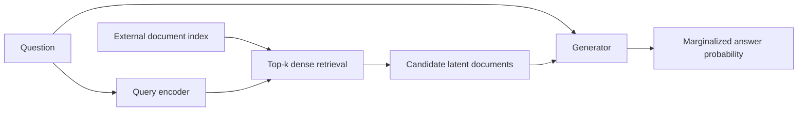
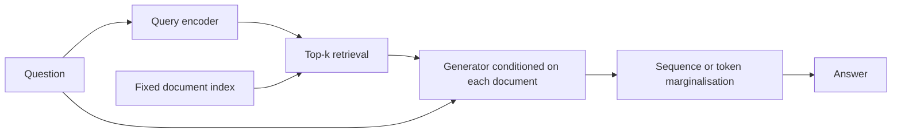

import PaperPdf from '@site/src/components/PaperPdf';
import CodeWalkthrough from '@site/src/components/viz/CodeWalkthrough';
import RetrievalLab from '@site/src/components/viz/RetrievalLab';

> **Lewis et al. · 2020** · [Read the embedded paper](#original-paper) ·
> [Download PDF](/papers/research-papers/rag.pdf) · Notes follow the paper
> section by section, §1 to the appendix.

## Paper in one minute

**Problem.** Facts stored only in model weights are difficult to update, trace to
a source or extend with private knowledge.

**Key idea.** Retrieve a small set of documents with a learned dense retriever and
treat document identity as a latent variable while a generator produces the
answer.

**Why it matters.** RAG separates language generation from an editable external
memory. Retrieval improves access to evidence, but does not automatically make
the final answer correct, grounded or authorized.

### Retrieval-to-answer flow



## How to read this chapter

The walkthrough below follows the paper **in its own order**, from the abstract
to the appendix. Each heading carries the paper's section number, so you can
keep the PDF open beside it.

You do not need to have read a research paper before. Every new term is
explained the first time it appears, and each formula comes after the idea it
expresses. Boxes marked **not from the paper** are extra help, such as
analogies, real-world examples or worked numbers.

The embedded PDF is **arXiv version 1** (May 2020). Later versions, including
the NeurIPS 2020 one, reword and extend some sections, so section letters and a
few details may differ if you read another copy.

## Abstract: the four claims

The paper is about **knowledge-intensive tasks**: tasks a person could not do
well without looking something up, such as answering trivia questions or
checking whether a claim is true. The abstract makes four claims:

1. A general recipe, **retrieval-augmented generation (RAG)**, can combine a
   pre-trained text generator with a searchable index of Wikipedia, and
   fine-tune the two together.
2. There are two ways to do it: use the **same retrieved passages for the whole
   answer** (RAG-Sequence), or allow a **different passage for each word**
   (RAG-Token).
3. RAG sets the **state of the art on three open-domain question-answering
   tasks**, beating both models that answer from memory alone and specialised
   "retrieve then extract" systems.
4. On generation tasks, RAG writes text that is **more specific, more diverse
   and more factual** than BART, a strong generator that has no retrieval.

Two terms to know:

- **State of the art** means the best published result on a benchmark at the
  time.
- **Fine-tuning** means taking a model that was already trained on general data
  and training it a little more on one task.

The introduction adds a fifth claim that the paper tests in §4.7: you can
**update what the model knows by swapping its index**, without retraining.

## §1 Introduction: knowledge locked inside weights

Large language models learn a surprising number of facts during pre-training.
The paper calls this knowledge **parametric**, because it is stored in the
model's **parameters** (its learned weights). Think of it as a student who has
memorised a textbook.

That memory has three downsides, according to the paper:

- It is hard to **expand or correct**. Changing one fact means more training.
- It is hard to **inspect**. You cannot easily see why the model gave an answer.
- The model may **hallucinate**: produce fluent text that sounds right but is
  false.

:::tip Intuition: a museum's opening hours (not from the paper)

Suppose a model answers questions about a museum. Its opening time changes. If
that fact lives only in the model's weights, correcting it may require
training, and it can be difficult to inspect where the answer came from.

An external document collection provides a different route: retrieve the
current opening-hours page and condition the answer on it. The model still
needs language ability, but some factual information can live outside its
parameters.

The original paper studies this idea using Wikipedia and knowledge-intensive
NLP tasks. It is not specifically a private-company-document product. Modern
enterprise RAG systems adapt the broad idea to different sources and workflows.

:::

The fix the paper builds on is a **hybrid** memory. Keep the parametric memory,
and add a **non-parametric** one: a collection of documents that the model
searches. Two earlier systems, REALM and ORQA, had done this, but only for
**extractive** question answering, where the answer must be copied as a span
of words from a retrieved document.

This paper brings hybrid memory to **sequence-to-sequence (seq2seq)** models,
which read one piece of text and write another. The paper calls seq2seq "the
workhorse of NLP", because translation, summarising and question answering can
all be framed that way.

### Two kinds of memory (not from the paper)

The table below summarises the two memories in this chapter's own words.

| Memory         | What is stored                    | How it is accessed         | How it changes                              |
| -------------- | --------------------------------- | -------------------------- | ------------------------------------------- |
| Parametric     | Patterns encoded in model weights | Neural-network computation | Training or fine-tuning                     |
| Non-parametric | Documents and their index         | Retrieval                  | Edit documents and rebuild/update the index |

“Non-parametric” does not mean the retriever has no neural parameters. It
describes the external memory. Both the query encoder and generator can still
be trained.

The paper's recipe has three parts:

1. A **retriever** called DPR (Dense Passage Retriever) finds Wikipedia passages
   related to the input.
2. A **generator** called BART reads the input plus a passage and writes the
   output.
3. The model does not know which passage is the right one, so it
   **marginalises** over them: it averages the generator's predictions,
   weighted by how relevant each passage looked. This is done either once per
   answer or once per answer word.

Unlike earlier memory networks, which were trained from scratch for one task,
**both memories here start pre-trained**. The retriever already knows how to
find passages, and the generator already knows how to write.

The introduction previews the results: state of the art on Natural Questions,
WebQuestions and CuratedTrec; strong results on TriviaQA; more factual and
specific generation on MS-MARCO and Jeopardy questions; FEVER fact checking
within 4% of complex pipeline systems; and an index that can be swapped to
update the model's facts.

:::tip In the real world (not from the paper)

Most "chat with your documents" products follow this split. The company's help
articles or policies sit in a search index, and a language model writes the
reply from what the search returns. Microsoft documents this pattern for
[Azure AI Search](https://learn.microsoft.com/en-us/azure/search/retrieval-augmented-generation-overview).
When a policy changes, the team edits the document, not the model.

:::

## §2 Methods: a retriever, a generator and a hidden choice

RAG uses the input text $x$ to retrieve passages $z$, then uses them as extra
context when it writes the target text $y$. Two components do the work:

- A **retriever** $p_\eta(z\mid x)$ with parameters $\eta$. Given a query $x$,
  it gives a probability to each passage, keeping only the top $K$.
- A **generator** $p_\theta(y_i\mid x,z,y_{1:i-1})$ with parameters $\theta$.
  It predicts the next token $y_i$ from the input $x$, one passage $z$ and the
  tokens $y_{1:i-1}$ it has already written.

A **token** is a word or piece of a word. The vertical bar $\mid$ reads "given",
so $p_\eta(z\mid x)$ is "the probability of passage $z$ given query $x$".


_Figure 1 from the original paper, PDF page 2.
[Source PDF](/papers/research-papers/rag.pdf#page=2)._

Read the figure as a probability model. A query selects several plausible
documents. A generator predicts the answer while conditioned on each
query/document pair. The system combines these predictions using the retrieval
probabilities.

The figure shows three uses of one architecture: answering "Define middle ear",
generating a Jeopardy clue for "The Divine Comedy", and labelling "Barack Obama
was born in Hawaii" as supported. The arrow at the bottom says training updates
the query encoder $q$ and the generator $p_\theta$, but not the document index.

The key trick is to treat the retrieved passage as a **latent variable**: a
choice the model makes internally that the training data never labels. The
paper offers two ways to add up over that hidden choice.

### §2.1 Models

#### RAG-Sequence

**The idea in words.** Pick one passage and write the **whole answer** from it.
Do that for each of the top passages, then take a weighted average of the
results, where the weights are the retriever's probabilities.

The paper's formula:

$$
p_{\text{RAG-Sequence}}(y\mid x)=\sum_{z\in\text{top-}k(p(\cdot\mid x))}p_\eta(z\mid x)\prod_{i}^{N}p_\theta(y_i\mid x,z,y_{1:i-1}).
$$

In plain words: for each passage, multiply the probabilities of all $N$ answer
tokens, then weight that by the passage's retrieval probability and add across
passages. The sum runs over the top $k$ passages only, which the paper calls a
**top-K approximation** of a sum over all of Wikipedia.

“Latent” means the training example gives the answer but need not label which
retrieved document should explain it. We sum over that unknown choice.

#### RAG-Token

**The idea in words.** For **each token** of the answer, let every top passage
vote, weighted by its retrieval probability. The next token can therefore draw
on a different passage than the previous one.

$$
p_{\text{RAG-Token}}(y\mid x)=\prod_{i}^{N}\sum_{z\in\text{top-}k(p(\cdot\mid x))}p_\eta(z_i\mid x)\,p_\theta(y_i\mid x,z_i,y_{1:i-1}).
$$

In plain words: the sum over passages has moved **inside** the product over
tokens. The paper's aim is to let the generator "choose content from several
documents when producing an answer."

Different documents can contribute to different answer tokens. This does
**not** mean a fresh corpus search must run after every generated token: the
retrieved top-k set for the input can remain the same.

:::note Notation quirk

The sum is written over $z$, but the terms use $z_i$. Read $z_i$ as "the
passage used for token $i$", with $z_i$ ranging over the same top-$k$ set. The
top-$k$ set is retrieved once from $x$, and $p_\eta(z_i\mid x)$ does not change
from token to token.

:::

:::tip Worked number: two documents and two tokens (not from the paper)

Suppose retrieval weights are 0.6 and 0.4. For the target answer, document A
gives conditional token probabilities 0.9 and 0.2; document B gives 0.3 and 0.8.

- RAG-Sequence: `0.6 × (0.9 × 0.2) + 0.4 × (0.3 × 0.8) = 0.204`.
- RAG-Token: `(0.6 × 0.9 + 0.4 × 0.3) × (0.6 × 0.2 + 0.4 × 0.8) = 0.2904`.

In the token variant, A helps strongly with the first token and B with the
second. These are conditional probabilities given the answer prefix, not an
assumption that natural-language tokens are independent.

:::

#### Classification is a one-token answer

The paper notes that RAG can also **classify**. Treat the class label as a target
"sequence" of length one. With a single token there is only one term in the
product, so moving the sum inside it changes nothing: **RAG-Sequence and
RAG-Token become identical**. This is why FEVER results (§4.4) show one number
for both.

### §2.2 Retriever: DPR

**The idea in words.** Turn the question into a list of numbers (a
**vector**), turn every passage into a vector too, and score each passage by
how well the two vectors line up. Similar meanings should give similar vectors.

DPR is a **bi-encoder**: two separate networks, one for queries and one for
documents. Both are BERT-base models (BERT is a pre-trained Transformer that
turns text into vectors), with different weights. The retriever's probability
is:

$$
p_\eta(z\mid x)\propto\exp\langle d(z),q(x)\rangle.
$$

In plain words: the relevance score is the **dot product** $\langle d(z),q(x)\rangle$
of the document vector $d(z)$ and the query vector $q(x)$. The sign $\propto$
means "proportional to": after exponentiating, the scores are normalised over
the top-$k$ passages so they sum to one, which is a softmax.

Written as a score and a softmax, as this chapter's code does:

$$
s(x,z)=q(x)^T d(z),\qquad
p_\eta(z\mid x)=\operatorname{softmax}_{z\in\mathrm{top}\text{-}k}s(x,z).
$$

:::tip Worked number (not from the paper)

Take a query vector $q=(1,0,2)$ and two documents $d_1=(0.5,1,1)$ and
$d_2=(1,0,0)$. The dot products are $0.5+0+2=2.5$ and $1$. The softmax gives
$e^{2.5}/(e^{2.5}+e^{1})\approx0.82$ for $d_1$ and $0.18$ for $d_2$. Document
1 gets most of the weight because it points the same way as the query.

:::

Scoring 21 million passages one by one for every question would be slow. DPR
uses **Maximum Inner Product Search (MIPS)**: an index, built with Meta's FAISS
library, that finds the vectors with the largest dot product quickly and
approximately.

The retriever is not trained from scratch. The paper takes DPR's pre-trained
bi-encoder, which was trained to find passages containing answers to TriviaQA
and Natural Questions, and uses it both to start the retriever and to build the
document index.

A vector index finds promising documents efficiently. It does not prove that
those documents are correct, current or sufficient. Retrieval quality remains a
separate source of error.

:::tip In the real world (not from the paper)

FAISS, the library the paper uses, is open source and widely used for
similarity search. Vector databases and search services do the same job in
production RAG systems: store one vector per chunk of text and return the top
$k$ closest vectors for each query.

:::

### §2.3 Generator: BART

The generator can be any **encoder-decoder** model: one part reads the input,
the other writes the output. The paper uses **BART-large**, a pre-trained
seq2seq Transformer with **400M parameters**.

Combining the question with a passage is simple: the two texts are
**concatenated** (joined end to end) and fed to BART as one input.

BART was pre-trained as a **denoising** model: it was shown text with parts
scrambled or deleted and learned to restore the original. From here on, the
paper calls BART's parameters $\theta$ the **parametric memory**.

:::tip In the real world (not from the paper)

The Hugging Face `transformers` library ships the paper's models as
`RagSequenceForGeneration` and `RagTokenForGeneration`, with released
checkpoints such as `facebook/rag-sequence-nq` and `facebook/rag-token-nq`.
You can load the same DPR-plus-BART combination the paper describes.

:::

### §2.4 Training

The retriever and generator are trained **together**, and nobody tells the
model which document it should have retrieved. Each training example is just an
input and its correct output, $(x_j,y_j)$.

The loss is the **negative marginal log-likelihood**:

$$
\sum_j -\log p(y_j\mid x_j).
$$

In plain words: make the correct answer as likely as possible, where
"likely" already includes the weighted sum over retrieved passages from §2.1.
The paper optimises it with stochastic gradient descent using Adam.

During training, the answer is known. Teacher forcing provides its previous
tokens, and the loss is the negative log probability of the full target.
`logsumexp` computes the document mixture without multiplying tiny
floating-point probabilities directly.

The top-k document selection is discrete. Gradients can adjust scores for the
retrieved set and train the generator, but do not differentiate through the
identity of an arbitrary excluded document.

**What stays frozen.** Updating the **document encoder** would change every
passage vector, so the whole index would need rebuilding. REALM does this
periodically during pre-training. The authors found it unnecessary for strong
results, so they **keep the document encoder and index fixed** and fine-tune
only the **query encoder** and the **generator**.

A question encoder and BART generator are adapted using answer supervision,
without requiring a gold document for every answer.



:::tip In the real world (not from the paper)

Production teams face the same trade-off. Re-embedding millions of chunks with a
new embedding model can take hours of compute, so many systems keep the
document embeddings fixed and change the query side, the ranking or the prompt
instead.

:::

### §2.5 Decoding

**Decoding** means producing an answer at test time, when the correct answer is
unknown. The goal is the most probable output, $\arg\max_y p(y\mid x)$. The two
variants need different methods.

**Beam search**, used below, is a common way to decode. Instead of always taking
the single most likely next token (greedy decoding), it keeps the few best
partial answers (the "beam") at every step and extends each of them.

#### RAG-Token

RAG-Token behaves like an ordinary token-by-token generator. Its probability for
the next token is:

$$
p'_\theta(y_i\mid x,y_{1:i-1})=\sum_{z\in\text{top-}k(p(\cdot\mid x))}p_\eta(z_i\mid x)\,p_\theta(y_i\mid x,z_i,y_{1:i-1}).
$$

In plain words: mix the passages' next-token predictions, then treat that
mixture as a normal next-token distribution. It plugs straight into a standard
beam decoder.

#### RAG-Sequence

RAG-Sequence does not split into one number per token, because the passage is
shared by the whole answer. A single beam search cannot handle it. Instead:

1. Run beam search **separately for each passage** $z$. This produces a set of
   candidate answers $Y$.
2. Some candidates appear in one passage's beam but not another's. **Thorough
   Decoding** runs an extra forward pass to score each candidate under every
   passage where it is missing, weights by $p_\eta(z\mid x)$ and adds up.
3. For long outputs, $Y$ grows large and the extra passes get expensive. **Fast
   Decoding** skips them and assumes a candidate has probability zero under any
   passage whose beam did not produce it.

:::tip Intuition: why the extra passes matter (not from the paper)

Imagine document A proposes “Paris” during beam search, while document B's beam
proposes “Lyon”. To score “Paris” under RAG-Sequence, we need its probability
under **both** documents, weighted by their retrieval probabilities. A candidate
missing from B's beam does not mathematically have zero probability under B.

**Thorough decoding** forms candidates from document-conditioned beams, then
performs additional scoring passes where a candidate was absent. **Fast
decoding** omits those extra passes and approximates the absent candidate's
contribution as zero. The trade-off is computation versus fidelity to the
mixture score.

:::

RAG-Token combines document-conditioned next-token probabilities at every step,
which can be used directly by an autoregressive beam decoder. The teaching
program's greedy sequence-posterior update demonstrates a possible mixture
calculation; it is not either of the paper's beam-search approximations.

:::tip In the real world (not from the paper)

A search assistant that answers "Who wrote _The Sun Also Rises_?" from five
snippets faces the same choice. It can write one full answer per snippet and
pick the best-supported one (RAG-Sequence style), or blend the snippets as it
writes (RAG-Token style). Most modern systems simply paste all snippets into
one prompt, which is a third option the paper does not test.

:::

## §3 Experiments: one Wikipedia index for every task

Every experiment uses the **same knowledge source**: the December 2018 English
Wikipedia dump, following earlier work. The set-up:

| Setting                  | Value                                                           |
| ------------------------ | --------------------------------------------------------------- |
| Passages                 | Each article split into disjoint 100-word chunks: **21,015,324** |
| Passage vectors          | DPR document encoder                                            |
| Index                    | One FAISS MIPS index using Hierarchical Navigable Small World    |
| Passages per query, training | $k\in\{5,10\}$                                              |
| Passages per query, test | Chosen on validation data                                       |

**Hierarchical Navigable Small World (HNSW)** is a way of organising vectors as
a layered graph, so a search can hop quickly towards the nearest vectors instead
of checking all 21 million.

The paper refers readers to DPR for how Wikipedia was cleaned and split. DPR's
own preprocessing prepends each article's title to its passages.

:::note Correction to the earlier version of this chapter

An earlier version of these notes described the passages as "roughly
100-word" with titles included. The paper says **disjoint 100-word chunks** and
does not itself mention titles; title handling comes from DPR's preprocessing.

:::

### The four task families (not from the paper)

| Task family                  | Input → output                  | What retrieval is supposed to contribute       |
| ---------------------------- | ------------------------------- | ---------------------------------------------- |
| Open-domain QA               | Question → short answer         | A passage containing relevant facts            |
| Abstractive QA               | Question → generated answer     | Evidence the generator can restate or combine  |
| Jeopardy question generation | Answer entity → question/clue   | Specific facts about that entity               |
| FEVER                        | Claim → verification label      | Evidence supporting or contradicting the claim |

### §3.1 Open-domain question answering

**Open-domain** means the system gets only the question, not a passage that
contains the answer. It must find the evidence itself. The paper treats each
question and answer as a plain input-output text pair and trains RAG to make
the answer likely.

RAG is compared with two families:

- **Extractive QA** ("open book"): retrieve documents, then copy the answer as a
  span from one of them. This relies mainly on the documents.
- **Closed-book QA**: generate the answer from the model's weights alone, with
  no retrieval. T5 is the main example.

Four datasets are used: **Natural Questions (NQ)**, real Google search
questions; **TriviaQA (TQA)**, trivia questions; **WebQuestions (WQ)**; and
**CuratedTrec (CT)**.

CuratedTrec gives its answers as **regular expressions** (text patterns), not
as plain answers, which is awkward for a generator. The paper's fix: retrieve
the top 1,000 documents for each question and use the most frequent match of
the pattern as the training target. If nothing matches, it falls back to a
simple heuristic that expands the pattern into plain strings.

CT and WQ are small, so their models start from the trained NQ model, as DPR
did. The metric is **Exact Match (EM)**: the share of answers that match a
reference answer exactly after normalisation. For TriviaQA, the paper also
reports the separate TriviaQA Wiki test set, to compare with T5 (see
Appendix B).

### §3.2 Abstractive question answering

**Abstractive** answers are written in the model's own words, rather than copied
from a document. The paper uses the **MS-MARCO** Natural Language Generation
task v2.1: real search-engine questions, each with ten search snippets and a
full-sentence human answer.

RAG ignores the supplied snippets and uses only the questions and answers, so
it must retrieve its own evidence. The paper calls this **Open-MSMARCO** and
warns about two handicaps:

- Some questions cannot be answered like the reference without the original
  snippets. Its example is "What is the weather in volcano, CA?"
- Some questions cannot be answered from Wikipedia at all. For those, RAG can
  fall back on the knowledge in BART's weights.

### §3.3 Jeopardy question generation

To test generation beyond question answering, the paper flips the task. In the
game show Jeopardy, players see a **fact** and must name the **entity** it
describes. The paper's example: "The World Cup" is the answer to "In 1986 Mexico
scored as the first country to host this international sports competition
twice." Here the model gets the entity and must **write the clue**.

The data comes from SearchQA: **97,391** training, **13,713** development and
**26,848** test examples. Since the task is new, the authors also train a BART
baseline.

Two ways of scoring:

- **Q-BLEU-1**, a variant of BLEU-1 that gives extra weight to matching entities
  and agrees better with human judgement for question generation. **BLEU-1**
  counts how many single words of the output also appear in the reference.
- **Human evaluation**. Assessors see one entity and two clues, one from BART and
  one from RAG, and pick one of four options: A is better, B is better, both are
  good, or neither is good. They judge **factuality** (is it true?) and
  **specificity** (is it about this entity rather than generic?) separately.

### §3.4 Fact verification

**FEVER** asks whether a claim is **supported** or **refuted** by Wikipedia, or
whether there is **not enough information**. The system must find evidence and
then reason about it.

Each label becomes a single output token, and RAG trains on claim-label pairs.
Unlike most FEVER systems, it gets **no supervision about which evidence to
retrieve**. The paper reports two versions: the standard 3-way task and a 2-way
task (supports or refutes) from earlier work. The metric is **label accuracy**,
the share of claims labelled correctly.

:::tip In the real world (not from the paper)

Fact-checking tools work the same way at a small scale. Given a claim such as
"this medicine was approved in 2019", the tool retrieves articles and records,
then decides whether they support the claim. As in FEVER, the retrieved
evidence matters as much as the final label.

:::

### §3.5 Implementation details

The number of retrieved passages and the decoding method differ by task:

| Task                    | Model        | Passages at test | Decoding                      |
| ----------------------- | ------------ | ---------------- | ----------------------------- |
| Open-domain QA          | RAG-Token    | 15               | Greedy                        |
| Open-domain QA          | RAG-Sequence | 50               | Greedy, Thorough Decoding     |
| MS-MARCO and Jeopardy   | RAG-Token    | 10               | Beam size 4                   |
| MS-MARCO and Jeopardy   | RAG-Sequence | 10               | Beam size 4, Fast Decoding    |

The reasons given: QA answers are short, so Thorough Decoding is affordable;
beam search did not improve QA; and Thorough Decoding did not help on the
generation tasks. A BART-large baseline is trained for MS-MARCO and Jeopardy.

:::note Greedy plus Thorough Decoding

§2.5 defines Thorough Decoding with a beam per passage. For QA the paper uses
greedy decoding, which is a beam of size one, so each passage proposes a single
candidate that is then rescored under every other passage. The paper does not
spell this combination out.

:::

## §4 Results

Before the numbers, it helps to know what can go wrong. When a RAG system
answers badly, the fault can sit at different points in the chain.

### A chain of evidence for reading results (not from the paper)

| Failure                           | What to inspect                  | Possible consequence                 |
| --------------------------------- | -------------------------------- | ------------------------------------ |
| Relevant document missing         | Recall of the retrieved top-k    | Generator never receives the answer  |
| Irrelevant document scored highly | Retrieval ranking                | Wrong evidence dominates             |
| Correct document, wrong answer    | Generator use of context         | Hallucination despite good retrieval |
| Old source returned               | Corpus and index freshness       | Fluent but outdated answer           |
| Answer contains no provenance     | Citation mechanism               | Difficult verification               |

The original marginalisation model does not automatically create reliable
sentence-level citations. A product must separately ensure that its displayed
citations support its claims.

Read task-specific metrics separately: exact match, generation quality and
factuality are not interchangeable measures.

### §4.1 Open-domain question answering

Table 1 of the paper, test-set Exact Match. For TriviaQA the left number is the
usual open-domain split and the right is the TriviaQA Wiki test set.

| Model                     | NQ   | TQA       | WQ   | CT   |
| ------------------------- | ---- | --------- | ---- | ---- |
| T5-11B (closed book)      | 34.5 | – / 50.1  | 37.4 | –    |
| T5-11B + SSM (closed book) | 36.6 | – / 60.5 | 44.7 | –    |
| REALM (open book)         | 40.4 | – / –     | 40.7 | 46.8 |
| DPR (open book)           | 41.5 | 57.9 / –  | 41.1 | 50.6 |
| **RAG-Token**             | 44.1 | 55.2 / 66.1 | **45.5** | 50.0 |
| **RAG-Sequence**          | **44.5** | 56.1 / **68.0** | 45.2 | **52.2** |

What this shows: a 626M-parameter RAG model beats the 11-billion-parameter T5,
which answers from memory, on NQ and WQ. It also beats the retrieve-and-extract
systems REALM and DPR on NQ, WQ and CT.

The paper's reading:

- RAG combines the **flexibility of generation** with the **accuracy of
  retrieval**.
- Unlike REALM and T5 + SSM, it needs no expensive **salient span masking**
  pre-training (a special objective that hides named entities and dates during
  pre-training). It uses off-the-shelf parts.
- RAG's retriever does start from DPR, which **was** trained with retrieval
  supervision on NQ and TriviaQA.
- DPR's QA system uses a BERT re-ranker plus an extractive reader. RAG shows that
  **neither is necessary** for state-of-the-art results.

Why generate when you could extract? Two reasons from the paper. A document can
contain **clues** to the answer without the exact answer words, and still
push probability towards the right answer. And RAG answered correctly in
**11.8%** of NQ cases where **no retrieved document contained the answer**. An
extractive model would score 0% there, since it can only copy.

:::note Three tasks or four?

The abstract claims state of the art on **three** open-domain QA tasks. §4.1
says **all four**, "in the case of TQA only on the T5-comparable split". On the
usual TriviaQA split, DPR's 57.9 is higher than RAG-Sequence's 56.1, so the
fourth claim depends on which test set you count.

:::

:::tip In the real world (not from the paper)

Ask a search assistant "What year did the Berlin Wall fall?" and it may answer
"1989" even if the snippets it found only say "the Wall came down in November,
thirty years before 2019". That is the §4.1 advantage in practice: a generator
can combine clues, while an extractor can only copy words that are there.

:::

### §4.2 Abstractive question answering

**ROUGE-L** measures the longest run of words that the output shares, in order,
with the reference answer. **BLEU-1** counts shared single words. Higher is
better for both. The MS-MARCO columns of Table 2:

| Model        | ROUGE-L | BLEU-1 |
| ------------ | ------- | ------ |
| SotA (uses the gold passages) | 49.8 | 49.9 |
| BART         | 38.2    | 41.6   |
| RAG-Token    | 40.1    | 41.5   |
| RAG-Sequence | **40.8** | **44.2** |

What this shows: RAG-Sequence beats BART by **2.6 points** on both metrics.
It does not reach the best system, but that system reads the passages that were
used to write the reference answers.

<details>
<summary>Full Table 2 from the paper</summary>

Test scores. An asterisk marks systems that use gold context or evidence. For
FEVER the two RAG variants are the same model (§2.1), so one number is shown.

| Model        | Jeopardy B-1 | Jeopardy QB-1 | MS-MARCO R-L | MS-MARCO B-1 | FEVER-3 | FEVER-2 |
| ------------ | ------------ | ------------- | ------------ | ------------ | ------- | ------- |
| SotA         | –            | –             | 49.8\*       | 49.9\*       | 76.8    | 92.2\*  |
| BART         | 15.1         | 19.7          | 38.2         | 41.6         | 64.0    | 81.1    |
| RAG-Token    | 17.3         | 22.2          | 40.1         | 41.5         | 72.5    | 89.5    |
| RAG-Sequence | 14.7         | 21.4          | 40.8         | 44.2         | 72.5    | 89.5    |

SotA for MS-MARCO is PALM, for FEVER-3 a pipeline system, and for FEVER-2 a
RoBERTa classifier given the gold evidence.

</details>

The paper calls this result impressive because the best systems (i) see the
passages that hold the answer, (ii) face questions that are unanswerable
without those passages, and (iii) include questions unanswerable from Wikipedia.

Table 4 of the paper shows sample outputs. Asked to "define middle ear", BART
wrote "The middle ear is the part of the ear between the middle ear and the
nose", which is wrong. RAG-Sequence wrote "The middle ear includes the tympanic
cavity and the three ossicles." Qualitatively, the authors find RAG
**hallucinates less** and is factually correct more often than BART.

:::note Only one variant beats BART on BLEU-1

RAG-Token's BLEU-1 (41.5) is fractionally **below** BART's (41.6). The 2.6-point
BLEU gain is RAG-Sequence's alone. On ROUGE-L both variants beat BART.

:::

### §4.3 Jeopardy question generation

The Jeopardy columns of Table 2:

| Model        | BLEU-1 | Q-BLEU-1 |
| ------------ | ------ | -------- |
| BART         | 15.1   | 19.7     |
| RAG-Token    | **17.3** | **22.2** |
| RAG-Sequence | 14.7   | 21.4     |

What this shows: RAG-Token is best here, and both RAG models beat BART on
Q-BLEU-1. Note that RAG-Sequence is slightly **below** BART on plain BLEU-1; the
paper's claim is carefully worded around Q-BLEU-1.

The human evaluation (Table 3) used **452 pairs** of generations from BART and
RAG-Token:

| Outcome        | Factuality | Specificity |
| -------------- | ---------- | ----------- |
| BART better    | 7.1%       | 16.8%       |
| RAG-Token better | **42.7%** | **37.4%**  |
| Both good      | 11.7%      | 18.8%       |
| Both poor      | 17.7%      | 6.9%        |
| No majority    | 20.8%      | 20.1%       |

What this shows: when judges preferred one system on facts, they picked RAG six
times as often as BART (42.7% against 7.1%). They also strongly preferred RAG
for specificity.

:::note A number in the text does not match Table 3

The text says "both RAG and BART were factual in a further **17%** of cases".
Table 3's "Both good" factuality figure is **11.7%**; the 17.7% figure is "Both
poor". The text's 17% appears to have picked up the wrong cell.

:::

Table 4's Jeopardy example for "Washington": BART wrote "This state has the
largest number of counties in the U.S.", which is wrong. RAG-Token wrote "It's
the only U.S. state named for a U.S. president", and RAG-Sequence wrote "It's
the state where you'll find Mount Rainier National Park."

**Why RAG-Token wins here.** The authors **hypothesise** that Jeopardy clues often
combine two separate facts about the entity, and RAG-Token can take each fact
from a different passage. Figure 2 of the paper shows this for the input
"Hemingway", with 5 retrieved passages:

- While generating "A Farewell to Arms", the posterior (the model's updated
  belief about which passage it is using) puts most weight on **document 1**,
  which mentions that novel.
- While generating "The Sun Also Rises", **document 2** dominates.
- After the **first token** of each title, the posterior flattens again. The
  generator finishes the title without leaning on any passage.

The authors test this by giving BART alone the partial text "The Sun". BART
completes it as "The Sun Also Rises", showing that the title is stored in BART's
weights. Their conclusion: the retrieved passage **steers** the generation, and
the parametric memory **fills in** what it already knows. The two memories work
together.

:::tip In the real world (not from the paper)

A quiz-writing tool for a teacher could work like this. Given "Marie Curie", it
retrieves passages about her two Nobel prizes and her discovery of radium, then
writes one clue that combines both facts. RAG-Token's per-token mixing is built
for exactly that kind of two-source sentence. This is an illustration, not a
product the paper describes.

:::

### §4.4 Fact verification

The FEVER columns of Table 2 (label accuracy, %):

| Model                        | FEVER-3 | FEVER-2 |
| ---------------------------- | ------- | ------- |
| SotA                         | 76.8    | 92.2 (uses gold evidence) |
| BART                         | 64.0    | 81.1    |
| RAG                          | 72.5    | 89.5    |

What this shows: RAG comes within **4.3 points** of the best 3-way system and
**2.7 points** of the best 2-way system, while retrieving its own evidence and
getting no evidence supervision.

The paper points out that the 3-way state of the art is a complex pipeline with
domain-specific design and **intermediate supervision**. The 2-way comparison is
a RoBERTa classifier that is **handed the gold evidence sentence**. RAG gets only
the claim.

Does RAG find the right evidence? The authors compare the Wikipedia articles it
retrieves with FEVER's annotated evidence. The **top** retrieved article is a
gold article **71%** of the time, and a gold article appears in the **top 10**
**90%** of the time.

:::note Percent or percentage points?

The paper writes "within 4.3%" and "within 2.7%". These are differences in
**percentage points** of accuracy: 76.8 − 72.5 = 4.3 and 92.2 − 89.5 = 2.7. The
introduction rounds the first to "within 4%".

:::

### §4.5 Ablations

An **ablation** removes or swaps one part of a system to see how much that part
matters. All ablations are on the **development sets**, so the numbers differ
slightly from the test results above. Table 5, condensed:

| Model and retriever      | NQ (EM)  | TQA (EM) | WQ (EM)  | FEVER-3  |
| ------------------------ | -------- | -------- | -------- | -------- |
| RAG-Token, BM25          | 29.7     | 41.5     | 32.1     | **75.1** |
| RAG-Token, frozen DPR    | 37.8     | 50.1     | 37.1     | 72.9     |
| RAG-Token, learned       | 43.5     | 54.8     | **46.5** | 74.5     |
| RAG-Sequence, frozen DPR | 41.2     | 52.1     | 41.8     | 72.9     |
| RAG-Sequence, learned    | **44.0** | **55.8** | 44.9     | 74.5     |

What this shows: letting the query encoder learn during fine-tuning adds 5.7 EM
points on NQ for RAG-Token and 2.8 for RAG-Sequence, compared with a frozen DPR
retriever. Keyword search (BM25) is much worse for QA, but is **best for
FEVER**.

<details>
<summary>Full Table 5 from the paper</summary>

Development-set scores. FEVER is a classification task, so the Token and
Sequence variants share one FEVER number.

| Model            | NQ   | TQA  | WQ   | CT   | Jeopardy B-1 | Jeopardy QB-1 | MS-MARCO R-L | MS-MARCO B-1 | FVR-3 | FVR-2 |
| ---------------- | ---- | ---- | ---- | ---- | ------------ | ------------- | ------------ | ------------ | ----- | ----- |
| RAG-Token-BM25   | 29.7 | 41.5 | 32.1 | 33.1 | 17.5         | 22.3          | 55.5         | 48.4         | 75.1  | 91.6  |
| RAG-Seq-BM25     | 31.8 | 44.1 | 36.6 | 33.8 | 11.1         | 19.5          | 56.5         | 46.9         | 75.1  | 91.6  |
| RAG-Token-Frozen | 37.8 | 50.1 | 37.1 | 51.1 | 16.7         | 21.7          | 55.9         | 49.4         | 72.9  | 89.4  |
| RAG-Seq-Frozen   | 41.2 | 52.1 | 41.8 | 52.6 | 11.8         | 19.6          | 56.7         | 47.3         | 72.9  | 89.4  |
| RAG-Token        | 43.5 | 54.8 | 46.5 | 51.9 | 17.9         | 22.6          | 56.2         | 49.4         | 74.5  | 90.6  |
| RAG-Seq          | 44.0 | 55.8 | 44.9 | 53.4 | 15.3         | 21.5          | 57.2         | 47.5         | 74.5  | 90.6  |

</details>

#### Using more documents

Models trained with 5 or 10 retrieved passages performed about the same. At
**test** time the number can be changed freely, and it does matter. Figure 3 of
the paper shows:

- On NQ, more passages **steadily improve** RAG-Sequence, but RAG-Token **peaks
  at 10**.
- **Answer recall at K**, the share of questions whose answer appears somewhere
  in the top $K$ passages, rises with $K$. The learned retriever has higher
  recall than the fixed one; BM25 is also plotted for comparison.
- On MS-MARCO, more passages raise RAG-Token's ROUGE-L but lower its BLEU-1. The
  effect is smaller for RAG-Sequence.

#### Retrieval

To test whether learning to retrieve helps, the authors **freeze** the
retriever, so no gradients reach it. Learned retrieval improves results on every
task, most of all on question answering. That is notable, because DPR was
already trained with strong, document-level supervision on NQ and TriviaQA.

They also swap DPR for **BM25**, a classic keyword-matching search that scores
documents by how often they contain the query's words, with rare words
counting more. The BM25 scores are used as logits for $p_\eta(z_i\mid x)$. BM25
wins on FEVER, "perhaps" because FEVER claims are **heavily entity-centric**
(built around names), which keyword matching handles well. On every other task
dense retrieval helps, and for QA it is crucial.

#### What each ablation is testing (not from the paper)

Replacing dense retrieval with BM25 asks whether learned semantic retrieval
helps beyond term matching. Freezing the retriever asks whether downstream
training improves which passages are chosen. Increasing the number of retrieved
documents asks whether more potential evidence translates into better final
predictions.

These are different tests. Higher **answer recall at k** means the answer
appears somewhere among the retrieved passages. It does not mean the generator
used the right passage or produced the right answer. Additional documents can
improve recall while also increasing inference cost or distraction.

:::note "In each case" has one tie

The text says learned retrieval improves results "in each case". In Table 5 the
MS-MARCO BLEU-1 for RAG-Token is **49.4** with both the frozen and the learned
retriever, a tie rather than a gain. Every other frozen-versus-learned pair
favours learning.

:::

:::tip In the real world (not from the paper)

Search teams see the FEVER effect every day. A query like "error E42" or a
product code needs exact word matching, which BM25 does well, while "my screen
goes black after the update" needs meaning, which dense vectors do well. Many
production systems run both and merge the results, which the lab below lets you
try.

:::

### §4.6 Generation diversity

§4.3 showed RAG is more factual and specific. Is it also less repetitive? The
paper measures **diversity** as the ratio of **distinct tri-grams** (unique
three-word sequences) to all tri-grams generated. A model that repeats the same
phrases scores low. Table 6, development set:

| Dataset             | Gold (human) | BART  | RAG-Token | RAG-Sequence |
| ------------------- | ------------ | ----- | --------- | ------------ |
| MS-MARCO            | 89.6%        | 70.7% | 77.8%     | **83.5%**    |
| Jeopardy generation | 90.0%        | 32.4% | 46.8%     | **53.8%**    |

What this shows: RAG-Sequence is the most diverse, and both RAG variants are far
more diverse than BART, without any special decoding trick to encourage variety.

The paper also evaluates generation specificity, factuality and diversity.
Human judgements and automatic overlap metrics provide complementary evidence;
more varied wording does not establish greater factual accuracy.

### §4.7 Hot-swapping indices

A big advantage of non-parametric memory is that it can be **replaced at test
time**. A model like T5 or BART would need more training to learn new facts.

The test: build a second index from an older Wikipedia dump (the DrQA dump of
**December 21, 2016**) and compare it with the main index (**December 20,
2018**). The authors list **82 heads of state** who changed between those dates
and ask the NQ-trained RAG model questions from the template
`Who is {position}?`, such as "Who is the prime minister of the UK?".

| Index used | Leaders asked about | Accuracy |
| ---------- | ------------------- | -------- |
| 2016       | 2016 leaders        | **70%**  |
| 2018       | 2018 leaders        | **68%**  |
| 2018       | 2016 leaders        | 12%      |
| 2016       | 2018 leaders        | 4%       |

What this shows: the model answers according to **whichever index it is
given**. Only **21%** of its predictions were the same across the two indices.
Swapping the documents updated its knowledge with no retraining.

The index-swapping experiment probes whether changing external memory can
change an answer without changing the model's parameters. This is evidence that
non-parametric memory can influence output. It is not a guarantee that an
updated index always overrides conflicting parametric knowledge.

:::tip In the real world (not from the paper)

This is the main reason companies use RAG. When a return policy changes from 30
days to 14, the support team updates one document and re-indexes it. The next
customer question is answered from the new text, with no model training run.

:::

## §5 Related work

The paper places itself among four lines of work:

- **Single-task retrieval.** Retrieval had helped many tasks one at a time:
  question answering, fact checking, dialogue, translation, language modelling
  and more. RAG shows **one** retrieval architecture can do well across several
  tasks.
- **General-purpose architectures.** BERT, GPT-2, BART and T5 showed one
  pre-trained model can handle many tasks without retrieval. RAG adds a learned
  retrieval module to such a model.
- **Learned retrieval.** Other work trained retrievers for one downstream task,
  using search, reinforcement learning or latent variables. RAG uses the latent
  variable approach, but for many tasks.
- **Memory-based architectures.** The document index is like the external memory
  of memory networks. A key difference is that RAG's memory is **raw text**, not
  learned vectors, so people can **read** it (interpretability) and **write** it
  (editing the index to update the model).

## §6 Discussion

The authors sum up: state-of-the-art open-domain QA; human judges prefer RAG's
generations to BART's and find them more factual; learned retrieval is
validated in detail; outputs are more diverse; and the index can be hot-swapped
without retraining.

For future work, they ask whether the retriever and generator could be
**pre-trained together from scratch**, with a denoising objective like BART's or
another objective. They also point to open questions about how parametric and
non-parametric memories interact.

:::note What later work did with this

Joint retrieval pre-training did follow. RETRO and Atlas, listed under further
reading, train language models with retrieval built in from the start.

:::

## Appendix A: Human evaluation

The annotation interface is shown in Figure 4 of the paper. To avoid position
bias, which system appeared as "sentence A" was chosen at random for each
example. Annotators could research the topic online and had detailed
instructions and worked examples.

The authors mixed in some **gold sentences** with known answers to check
annotator accuracy. Two annotators did poorly on these, and their annotations
were removed.

## Appendix B: Further details on open-domain QA

**Multiple answers.** Many questions have several acceptable answers. For NQ and
WQ, RAG trains on each (question, answer) pair separately, which gave a small
accuracy gain. TriviaQA's alternatives include unsuitable targets such as emoji
or spelling variants, so answers that do not appear in the top 1,000 retrieved
documents are filtered out.

**TriviaQA test sets.** Open-domain QA papers usually test on the public
TriviaQA **Web development** split, which DPR also uses. T5 used the official
**Wikipedia test** set instead. RAG reports both, which is why Table 1 has two
TQA numbers. RAG scores much higher on the Wiki set, which the authors put down
to its questions being simpler to answer from Wikipedia.

## Appendix C: Further details on FEVER

For classification, the paper follows BART's practice: the model **regenerates
the claim**, classifies it from the final hidden state, and then marginalises
across documents to get class probabilities.

FEVER also has a second sub-task, extracting the Wikipedia **sentences** that
serve as evidence. The paper does not attempt it, because FEVER uses a different
Wikipedia dump from RAG's index.

## Appendix D: "Null document" probabilities

REALM has a **null document**: an empty passage the model can "retrieve" when
nothing useful exists. The authors tried adding one to RAG, marginalising over
$k+1$ predictions, and modelled its logit in three ways: a learned document
embedding, a learned bias, or a small neural network.

None improved results, so they left it out. On Open MS-MARCO, where useful
passages are not always available, the model **learned to retrieve a particular
fixed set of documents** for questions that retrieval could not help. The
authors take this as a sign a null document may not be necessary.

## Appendix E: Parameters

| Component                                   | Parameters                    |
| ------------------------------------------- | ----------------------------- |
| DPR query encoder (BERT-base)               | 110M, trained                 |
| DPR document encoder (BERT-base)            | 110M, **not** trained         |
| BART-large generator                        | 406M, trained                 |
| Total the paper reports as trainable        | 626M                          |
| Document index                              | 21M vectors, 15.3B values, not trainable |

For comparison, the best closed-book model, T5-11B, has **11 billion**
trainable parameters. T5-large (770M), the closest in size to RAG, scores
**28.9 EM** on NQ against RAG-Sequence's **44.5**. The paper's conclusion is
that hybrid models need far fewer trainable parameters for strong open-domain
QA.

:::note Two small inconsistencies

**626M counts a part that is not trained.** 110M + 110M + 406M = 626M, but §2.4
says the document encoder is kept fixed. The parameters actually updated are
110M + 406M = **516M**. (§2.3 also rounds BART-large to 400M.)

**728 dimensions.** The paper says the index holds "21M 728 dimensional
vectors". BERT-base produces **768**-dimensional vectors, so 728 is probably a
typo. Oddly, 21,015,324 × 728 ≈ 15.3B, the paper's own figure, so the arithmetic
was done with the typo; with 768 dimensions it is about 16.1B values.

:::

:::tip Worked number (not from the paper)

How big is the index on disk? About 16.1 billion values stored as 32-bit floats
(4 bytes each) is roughly $16.1\times10^9\times4\approx64$ GB. That is larger
than the 626M-parameter model itself, which is why production systems often
compress vectors.

:::

## Appendix F: Retrieval collapse

In early experiments on some tasks, such as **story generation**, retrieval
**collapsed**: the retriever learned to return the same documents whatever the
input. Once that happened, the generator learned to **ignore** the documents,
and RAG behaved exactly like BART.

The authors offer two possible causes: those tasks need facts less explicitly,
and their long target texts may give the retriever less informative gradients.
Earlier work had also found spurious retrieval when a retriever was trained
only through a downstream task.

A generator with enough capacity can reduce loss through its own parameters
instead of making retrieval useful.

:::tip Diagnosing collapse (not from the paper)

A practical diagnostic is to compare outputs with relevant, irrelevant and
missing documents. If the answer barely changes when the evidence changes, the
system may not be using retrieval as intended. This diagnostic is an application
of the failure mechanism, not an extra experiment reported by the paper.

:::

## Real-world uses and worked examples

### Documented implementation: Azure AI Search with a generator

Microsoft documents RAG architectures in which a retrieval service supplies relevant material to a language model. This is a concrete implementation of the broader retrieve-and-generate pattern. It should not be described as an exact deployment of the original paper's jointly trained DPR/BART model or its document-marginalisation equations. [Microsoft's RAG overview](https://learn.microsoft.com/en-us/azure/search/retrieval-augmented-generation-overview).

### Worked example: answer an employee's policy question

An employee asks, “Can I carry unused leave into next year?” The answer depends on the employee's location and the current policy version.

1. Index policy passages with metadata such as region, effective date and document permissions.
2. Restrict retrieval to sources the employee may access, and retrieve the applicable carry-over section.
3. Provide those passages and the question to the generator.
4. Return an answer with supporting source references; if the relevant rule is missing, say what information is unavailable.

The example is an illustrative design, not a report about a particular employer. **External memory matters** because the policy can change without requiring a new language-model training run. The document index still needs to be updated after the source changes.

### Another application: troubleshooting a product version

A support assistant receives “Error E42 after upgrading to version 3.” Retrieval should find the version-3 manual or release note, rather than an older page containing the same error string. Metadata filters and precise term matching can help alongside embedding similarity.

A plausible answer based on the wrong software version is still wrong. This example shows why a RAG system needs source selection and answer-grounding checks in addition to an LLM and a vector store.

## Interactive lab

Try queries that require exact wording and queries that use paraphrases. Compare
lexical, dense and fused rankings before deciding what evidence reaches a
generator.

<RetrievalLab />

## Complete code: jointly train retrieval and generation

<CodeWalkthrough paper="rag" />

**Teaching implementation.** The script builds four documents, a frozen document index, a trainable query encoder, an encoder–decoder generator, both RAG objectives, and generation. Save as `rag.py` and run `python rag.py` after installing PyTorch.

<details>
<summary>Complete runnable script</summary>

```python
"""Train a tiny dense retriever and conditional generator with both RAG losses.
Teaching adaptation: exhaustive search over four documents, small Transformer.
"""
import math
import torch
from torch import nn
import torch.nn.functional as F

torch.manual_seed(7)
torch.set_num_threads(1)

class Attention(nn.Module):
    def __init__(self, width, heads):
        super().__init__()
        assert width % heads == 0
        self.heads, self.size = heads, width // heads
        self.q = nn.Linear(width, width)
        self.k = nn.Linear(width, width)
        self.v = nn.Linear(width, width)
        self.out = nn.Linear(width, width)

    def forward(self, query, memory=None, causal=False):
        memory = query if memory is None else memory
        b, t, d = query.shape
        def split(x):
            return x.reshape(b, -1, self.heads, self.size).transpose(1, 2)
        q, k, v = split(self.q(query)), split(self.k(memory)), split(self.v(memory))
        scores = q @ k.transpose(-2, -1) / math.sqrt(self.size)
        if causal:
            mask = torch.ones(t, k.size(-2), dtype=torch.bool, device=query.device).triu(1)
            scores = scores.masked_fill(mask, float('-inf'))
        context = scores.softmax(-1) @ v
        return self.out(context.transpose(1, 2).reshape(b, t, d))

class Block(nn.Module):
    def __init__(self, width=32, heads=4, pre_norm=True):
        super().__init__()
        self.attn = Attention(width, heads)
        self.n1, self.n2 = nn.LayerNorm(width), nn.LayerNorm(width)
        self.ff = nn.Sequential(nn.Linear(width, 4*width), nn.GELU(), nn.Linear(4*width, width))
        self.pre_norm = pre_norm

    def forward(self, x, causal=True):
        if self.pre_norm:
            x = x + self.attn(self.n1(x), causal=causal)
            return x + self.ff(self.n2(x))
        x = self.n1(x + self.attn(x, causal=causal))
        return self.n2(x + self.ff(x))

class LanguageModel(nn.Module):
    def __init__(self, vocab, context=64, width=32, pre_norm=True):
        super().__init__()
        self.context = context
        self.token = nn.Embedding(vocab, width)
        self.position = nn.Embedding(context, width)
        self.blocks = nn.ModuleList([Block(width, pre_norm=pre_norm) for _ in range(2)])
        self.norm = nn.LayerNorm(width) if pre_norm else nn.Identity()
        self.head = nn.Linear(width, vocab, bias=False)
        self.head.weight = self.token.weight

    def hidden(self, ids):
        assert ids.size(1) <= self.context
        x = self.token(ids) + self.position(torch.arange(ids.size(1), device=ids.device))
        for block in self.blocks:
            x = block(x)
        return self.norm(x)

    def forward(self, ids):
        return self.head(self.hidden(ids))

    @torch.no_grad()
    def generate(self, ids, count, temperature=1., top_k=None):
        self.eval()
        for _ in range(count):
            logits = self(ids[:, -self.context:])[:, -1] / temperature
            if top_k is not None:
                cutoff = logits.topk(min(top_k, logits.size(-1))).values[:, -1:]
                logits = logits.masked_fill(logits < cutoff, float('-inf'))
            token = torch.multinomial(logits.softmax(-1), 1)
            ids = torch.cat((ids, token), dim=1)
        return ids

def lm_loss(model, rows):
    logits = model(rows[:, :-1])
    return F.cross_entropy(logits.reshape(-1, logits.size(-1)), rows[:, 1:].reshape(-1))

# The corpus is public toy data; IDs represent whole words.
words = '<bos> <eos> france germany italy spain capital paris berlin rome madrid'.split()
vocab = {w: i for i, w in enumerate(words)}
def encode(text): return [vocab[w] for w in text.split()]
documents = torch.tensor([encode(s) for s in ['france capital paris', 'germany capital berlin',
                                             'italy capital rome', 'spain capital madrid']])
queries = torch.tensor([encode(s) for s in ['france capital', 'germany capital', 'italy capital', 'spain capital']])
answers = torch.tensor([[7, 1], [8, 1], [9, 1], [10, 1]])

class RAG(nn.Module):
    def __init__(self):
        super().__init__()
        self.query = nn.Embedding(len(words), 32)
        self.document = nn.Embedding(len(words), 32)
        self.document.weight.requires_grad_(False)
        self.generator = nn.Transformer(d_model=32, nhead=4, num_encoder_layers=1,
            num_decoder_layers=1, dim_feedforward=64, dropout=0., batch_first=True)
        self.tokens, self.positions = nn.Embedding(len(words), 32), nn.Embedding(16, 32)
        self.output = nn.Linear(32, len(words))
        # Build once: the original system likewise keeps its document index fixed.
        self.register_buffer('index', self.document(documents).mean(1).detach())
    def retrieve(self, query, k):
        scores = self.query(query).mean(1) @ self.index.T
        scores, doc_ids = scores.topk(k, dim=-1)
        return scores.log_softmax(-1), doc_ids
    def token_log_probs(self, query, doc_ids, prefix):
        b, k = doc_ids.shape
        source = torch.cat((query[:, None].expand(-1,k,-1), documents[doc_ids]), -1).reshape(b*k,-1)
        target = prefix[:, None].expand(-1,k,-1).reshape(b*k,-1)
        src = self.tokens(source) + self.positions(torch.arange(source.size(1)))
        tgt = self.tokens(target) + self.positions(torch.arange(target.size(1)))
        mask = torch.ones(target.size(1), target.size(1), dtype=torch.bool).triu(1)
        logits = self.output(self.generator(src, tgt, tgt_mask=mask))
        return logits.log_softmax(-1).reshape(b,k,target.size(1),-1)
    def loss(self, query, answer, mode):
        log_docs, doc_ids = self.retrieve(query, k=4)
        prefix = torch.cat((torch.zeros(len(query),1,dtype=torch.long), answer[:,:-1]),-1)
        log_tokens = self.token_log_probs(query, doc_ids, prefix)
        chosen = log_tokens.gather(-1, answer[:,None,:,None].expand(-1,4,-1,1)).squeeze(-1)
        if mode == 'sequence':
            log_likelihood = torch.logsumexp(log_docs + chosen.sum(-1), dim=1)
        else:
            log_likelihood = torch.logsumexp(log_docs[:,:,None] + chosen, dim=1).sum(-1)
        return -log_likelihood.mean()
    @torch.no_grad()
    def generate(self, query, mode):
        log_docs, doc_ids = self.retrieve(query, 4)
        prefix = torch.zeros(len(query),1,dtype=torch.long)
        posterior = log_docs.clone()
        for _ in range(2):
            conditional = self.token_log_probs(query, doc_ids, prefix)[:,:,-1]
            mixed = torch.logsumexp(posterior[:,:,None] + conditional, dim=1)
            token = mixed.argmax(-1)
            if mode == 'sequence':
                # A shared latent document: update p(document | generated prefix).
                evidence = conditional.gather(-1, token[:,None,None].expand(-1,4,1)).squeeze(-1)
                posterior = (posterior + evidence).log_softmax(-1)
            prefix = torch.cat((prefix, token[:,None]), -1)
        return prefix[:,1:]

for mode in ('sequence', 'token'):
    model = RAG()
    optim = torch.optim.AdamW((p for p in model.parameters() if p.requires_grad), lr=.005)
    for step in range(200):
        loss = model.loss(queries, answers, mode)
        optim.zero_grad(); loss.backward(); optim.step()
    model.eval()
    result = model.generate(queries, mode)
    print(mode, 'loss:', round(loss.item(), 3))
    print([' '.join(words[i] for i in row) for row in result])
    assert model.document.weight.grad is None
    torch.save(model.state_dict(), 'rag-' + mode + '-demo.pt')
```

</details>

### How the pieces correspond to the equations

`retrieve` returns log retrieval probabilities and document IDs. Exhaustive search is sufficient for four documents; a large corpus would need an efficient index. `token_log_probs` expands the batch so each query/document pair receives its own generator prediction.

In `loss`, `chosen` has shape **batch × documents × answer length**. The sequence branch sums across answer positions before mixing documents. The token branch mixes documents before summing across positions. This ordering is the mathematical difference between the variants.

For sequence generation, the code updates the posterior weight of each document using the generated prefix. For token generation, it retains the query-conditioned mixture at each step. Both use greedy choices and stop after the toy answer's fixed two-token length.

The checked run produces the four capital names and end tokens for both variants. Those are training queries. This verifies a functioning optimisation and decoding pipeline; it is not evidence of generalisation to unseen countries. The generator may memorise this tiny corpus, which is why retrieval ablations matter in a real experiment.

### Paper-to-code map

The script also defines `Attention`, `Block`, `LanguageModel` and `lm_loss`, shared scaffolding from other chapters. The `RAG` class does not use them; its generator is PyTorch's `nn.Transformer`.

| Paper section                          | Where it lives in `rag.py`                                                                 |
| -------------------------------------- | ------------------------------------------------------------------------------------------ |
| §2.2 dot-product score $\langle d(z),q(x)\rangle$ | `RAG.retrieve`: `self.query(query).mean(1) @ self.index.T`                      |
| §2.2 top-$k$ and softmax over it       | `scores.topk(k, dim=-1)` then `scores.log_softmax(-1)`                                     |
| §2.4 fixed document encoder and index  | `self.document.weight.requires_grad_(False)` and `self.register_buffer('index', ...)`      |
| §2.3 concatenate input and passage     | `torch.cat((query[:, None].expand(-1,k,-1), documents[doc_ids]), -1)` in `token_log_probs` |
| §2.3 encoder-decoder generator         | `self.generator = nn.Transformer(...)`                                                     |
| §2.1 RAG-Sequence                      | `torch.logsumexp(log_docs + chosen.sum(-1), dim=1)`                                        |
| §2.1 RAG-Token                         | `torch.logsumexp(log_docs[:,:,None] + chosen, dim=1).sum(-1)`                              |
| §2.4 negative marginal log-likelihood  | `return -log_likelihood.mean()`                                                            |
| §2.4 only query encoder and generator train | `torch.optim.AdamW((p for p in model.parameters() if p.requires_grad), ...)`; `assert model.document.weight.grad is None` |
| §2.5 RAG-Token transition $p'_\theta$  | `mixed = torch.logsumexp(posterior[:,:,None] + conditional, dim=1)`                        |
| §2.5 RAG-Sequence shared document      | `posterior = (posterior + evidence).log_softmax(-1)` in `generate`                         |

### Where this program departs from the paper

| Paper setting                                              | This program                                                  | Why it matters                                                          |
| ---------------------------------------------------------- | ------------------------------------------------------------- | ----------------------------------------------------------------------- |
| BERT-base query and document encoders (§2.2)               | Mean of word embeddings, `self.query(query).mean(1)`          | Shows the bi-encoder shape without a 110M-parameter encoder             |
| Pre-trained DPR retriever and index (§2.2)                 | Randomly initialised `nn.Embedding`, frozen at random         | The query encoder must learn to match a fixed, meaningless index        |
| BART-large, 406M, pre-trained (§2.3)                       | One-layer `nn.Transformer`, width 32, random start            | No parametric knowledge; the toy answers must be learned from 4 examples |
| 21M passages, FAISS HNSW MIPS (§3)                         | Exhaustive `@ self.index.T` over 4 documents                  | At scale, approximate search can miss the best passage                  |
| $k\in\{5,10\}$ in training, 10 to 50 at test (§3, §3.5)    | `k=4`, all documents                                          | Top-$k$ never discards anything, so truncation errors cannot appear     |
| Beam search with Thorough or Fast Decoding (§2.5, §3.5)    | Greedy choice with a posterior update                         | Fine for two-token answers; not either of the paper's approximations    |
| Separate train, dev and test questions (§3)                | The same 4 queries for training and generation                | Checks the pipeline runs, not that it generalises                       |

## Differentiate the original paper from a common modern pipeline

| Original RAG model | Common retrieve-then-prompt application |
|---|---|
| Trained query encoder and generator | Often frozen embedding model and hosted LLM |
| Explicit probability mixture over documents | Often concatenate selected chunks into one prompt |
| Two defined marginalisation variants | Many chunking, reranking and context-packing designs |
| Wikipedia-based research experiments | Can use many document collections |

Both combine retrieval and generation, but reproducing the 2020 equations requires more than adding a vector database to a chatbot. The [DPR repository](https://github.com/facebookresearch/DPR) is the authors' retriever implementation, not the entire RAG training system.

## Summary

RAG gives a pre-trained generator an editable memory. A dense retriever scores
Wikipedia passages by dot product, the generator reads the question with each
passage, and the model adds up over the unknown passage choice, either once per
answer (RAG-Sequence) or once per token (RAG-Token). Only the query encoder and
generator are fine-tuned.

The evidence: state-of-the-art open-domain QA with 626M parameters against an
11B closed-book model, more factual and more diverse generation than BART, a
learned retriever that beats a frozen one, and an index that can be swapped to
update facts. Retrieval still does not guarantee a correct, cited or
authorised answer.

**Read next:** [LoRA](/docs/research-papers/lora), which adapts a large model
cheaply by learning a small low-rank change to its weights.

## Checklist

- [ ] I can explain parametric versus external memory.
- [ ] I can calculate the two-document example by hand.
- [ ] I can locate the different `logsumexp` operations in the code.
- [ ] I can explain which components receive gradients and why the index stays fixed.
- [ ] I can distinguish retrieval failure, generation failure and missing provenance.
- [ ] I can write the RAG-Sequence and RAG-Token formulas from §2.1 and say why
      they coincide for a one-token label.
- [ ] I can explain Thorough versus Fast Decoding (§2.5) and which tasks used
      each (§3.5).
- [ ] I can read Table 1 and explain why the "state of the art on TriviaQA"
      claim depends on the test split.
- [ ] I can use Table 5 to say what freezing the retriever and swapping in BM25
      each cost, and why BM25 wins on FEVER.
- [ ] I can describe the hot-swap experiment of §4.7 and what its 70%, 68%, 12%
      and 4% results show.

## Further reading and future evolution

- [Fusion-in-Decoder](https://arxiv.org/abs/2007.01282) encodes retrieved passages
  separately and lets the decoder combine their evidence, improving open-domain
  question answering.
- [RETRO](https://arxiv.org/abs/2112.04426) brings retrieval into language-model
  pre-training at very large scale rather than adding it only for a downstream
  task.
- [Atlas](https://arxiv.org/abs/2208.03299) studies retrieval-augmented few-shot
  learning and how to train the retriever and generator with limited supervision.

These are natural upgrades to study when the original latent-document model is
not enough: stronger evidence fusion, retrieval during pre-training and better
few-shot adaptation.

## Scenario-based interview questions

### 1. Design a policy assistant whose answers must reflect documents updated every day.

**Strong answer.** Keep policy text in an external, versioned index and retrieve
relevant chunks for each question; this avoids retraining the generator whenever
a document changes. Store title, section, effective date and access-control
metadata with each chunk. Generate only from authorized evidence, return
citations, and abstain when retrieval confidence or evidence coverage is weak.
Evaluate retrieval recall, grounded answer correctness, citation precision,
latency and behavior after an index update.

### 2. Retrieval recall@10 is high, but answer accuracy is low. Where can the pipeline fail?

**Strong answer.** The correct passage may be ranked too low, truncated, mixed
with contradictory versions, or ignored by the generator. Inspect recall at the
actual number of chunks passed to generation, reranker quality, chunk boundaries
and prompt ordering. Run oracle-context generation to isolate generator quality,
and feed irrelevant or swapped evidence to test whether the answer is evidence-
sensitive. Retrieval success is necessary but not sufficient.

### 3. Explain RAG-Sequence versus RAG-Token with a concrete answer.

**Strong answer.** For “Paris is in France,” RAG-Sequence treats one retrieved
document as the latent support for the whole output and sums sequence probability
over candidate documents. RAG-Token performs the document marginalization at
each output token, so different tokens may receive support from different
documents. Token-level flexibility can combine evidence but makes decoding more
complex. With a one-token output, the two formulations coincide.

### 4. The retriever returns nearly the same passages for every query. Diagnose it.

**Strong answer.** This resembles retrieval collapse. Check query-embedding
variance, similarity distributions, index correctness and whether gradients
reach the query encoder. The generator may minimize loss by ignoring documents,
leaving little useful retrieval signal. Compare learned retrieval with BM25,
freeze and unfreeze components deliberately, add hard negatives, and measure
query-conditioned document diversity and answer sensitivity.

### 5. A user asks about a confidential policy they cannot access. Where must authorization happen?

**Strong answer.** Filter candidates using the user's permissions before their
contents enter the model context; hiding citations after generation is too late.
Propagate tenant and ACL metadata through indexing, retrieval, caches and logs.
Use defense in depth and test cross-tenant queries. Relevance scoring must never
override authorization, and the system should reveal neither document text nor
the existence of restricted material.

### 6. When would you prefer BM25 to dense retrieval?

**Strong answer.** BM25 is a strong baseline for exact identifiers, error codes,
names and rare terminology, is easier to inspect, and needs no embedding model.
Dense retrieval helps paraphrases and semantic similarity but costs more and can
hide failure causes. A hybrid followed by reranking is often practical. Choose
using retrieval metrics on real queries, including exact-match and paraphrase
slices, rather than assuming one method dominates.

## Project: a Wikipedia question-answering assistant with an editable memory

:::note Not from the paper

This project is an addition, a way to practise the paper's ideas on real
questions and a real document collection.

:::

**What you will build.** A small RAG system that answers questions from a
collection of Wikipedia passages. You will compare dense retrieval with BM25,
combine a generator's answers across the top passages as RAG-Sequence does, and
prove that editing a passage changes the answer.

**Why it matters.** This is the core of every "ask our documents" assistant:
help-desk bots, internal policy search, product manuals. Measuring retrieval
and answers separately, as the paper does, is how real teams find out which
half is failing.

**Data.** [rag-mini-wikipedia](https://huggingface.co/datasets/rag-datasets/rag-mini-wikipedia)
(`rag-datasets/rag-mini-wikipedia` on Hugging Face): a few thousand Wikipedia
passages (`text-corpus` configuration) and several hundred questions with short
answers (`question-answer` configuration). It is small enough to index on a
laptop CPU in minutes.

**Steps.**

1. Load both configurations and read 10 questions with their answers. Decide how
   you will normalise answers for Exact Match (lower case, strip punctuation)
   (§3.1).
2. Encode every passage once with the small embedding model
   `sentence-transformers/all-MiniLM-L6-v2` and keep the vectors fixed. This is
   your frozen document index (§2.2, §2.4).
3. For each question, take the top 5 passages by dot product and turn their
   scores into probabilities with a softmax, $p_\eta(z\mid x)$ (§2.2).
4. Measure **answer recall at 5**: how often the answer string appears in any
   of the top 5 passages. Repeat with BM25 using the `rank_bm25` package and
   compare, as in Table 5 (§4.5).
5. Generate an answer from each passage with `google/flan-t5-base`, using the
   prompt "question + passage" (§2.3). Also score each candidate answer's
   log-probability under every passage and combine them with the retrieval
   weights, RAG-Sequence style (§2.1, §2.5).
6. Report Exact Match for three systems: no retrieval (closed book), top-1
   passage only, and your RAG-Sequence mixture (§4.1).
7. Hot-swap test: pick 10 questions, edit the key fact in the passage that
   answers each one, re-encode only those passages, and check whether the
   answers change (§4.7).

**How you know it works.** Dense retrieval should reach a clearly higher answer
recall at 5 than the closed-book model's Exact Match, and your RAG system's
Exact Match should beat closed book by at least 10 points. In the hot-swap test,
at least 8 of the 10 edited facts should flip the answer. If they do not, you
have found a small case of the parametric memory overriding the documents.

**Starter code.**

```python
from datasets import load_dataset
from sentence_transformers import SentenceTransformer

corpus = load_dataset("rag-datasets/rag-mini-wikipedia", "text-corpus")
qa = load_dataset("rag-datasets/rag-mini-wikipedia", "question-answer")
print(corpus, qa)  # shows the split and column names
passages = corpus["passages"]["passage"]
questions = qa["test"]

encoder = SentenceTransformer("sentence-transformers/all-MiniLM-L6-v2")
index = encoder.encode(passages, convert_to_tensor=True, normalize_embeddings=True)

question = questions[0]["question"]
query = encoder.encode(question, convert_to_tensor=True, normalize_embeddings=True)
scores, ids = (index @ query).topk(5)   # inner-product search (§2.2)
p_z = scores.softmax(-1)                # retrieval probabilities over the top 5
for p, i in zip(p_z.tolist(), ids.tolist()):
    print(round(p, 2), passages[i][:80])
print("Gold answer:", questions[0]["answer"])
```

Install with `python -m pip install datasets sentence-transformers rank_bm25 transformers torch`.
If the split names differ in the version you download, the first `print` shows
them. This model is trained for normalised vectors, so the dot product here is a
cosine similarity; the paper's DPR uses the raw inner product.

**Stretch goals.**

- Plot Exact Match against the number of retrieved passages (1, 3, 5, 10, 20) and
  see whether it keeps rising, as for RAG-Sequence in Figure 3 (§4.5).
- Add a "null passage" option: let the generator answer with no passage and give
  that option its own weight, as Appendix D tried. Does it help on questions the
  corpus cannot answer?
- Implement RAG-Token decoding with the generator's next-token probabilities, and
  compare its answers with your RAG-Sequence mixture on multi-fact questions
  (§2.1, §4.3).

## Original paper

<PaperPdf slug="rag" title="Retrieval-Augmented Generation for Knowledge-Intensive NLP Tasks" />
