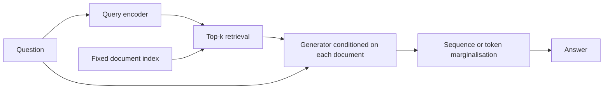

import PaperPdf from '@site/src/components/PaperPdf';

> **Lewis et al. · 2020** · [Read the embedded paper](#original-paper) · [Download PDF](/papers/research-papers/rag.pdf)


RAG gives a generator access to an external collection of documents and trains it to use retrieved evidence when producing an answer.

## The problem: a model's weights are an awkward knowledge store

Suppose a model answers questions about a museum. Its opening time changes. If that fact lives only in the model's weights, correcting it may require training, and it can be difficult to inspect where the answer came from.

An external document collection provides a different route: retrieve the current opening-hours page and condition the answer on it. The model still needs language ability, but some factual information can live outside its parameters.

The original paper studies this idea using Wikipedia and knowledge-intensive NLP tasks. It is not specifically a private-company-document product. Modern enterprise RAG systems adapt the broad idea to different sources and workflows.

## Section 2: two kinds of memory

| Memory | What is stored | How it is accessed | How it changes |
|---|---|---|---|
| Parametric | Patterns encoded in model weights | Neural-network computation | Training or fine-tuning |
| Non-parametric | Documents and their index | Retrieval | Edit documents and rebuild/update the index |

“Non-parametric” does not mean the retriever has no neural parameters. It describes the external memory. Both the query encoder and generator can still be trained.


*Figure 1 from the original paper, PDF page 2. [Source PDF](/papers/research-papers/rag.pdf#page=2).*

Read the figure as a probability model. A query selects several plausible documents. A generator predicts the answer while conditioned on each query/document pair. The system combines these predictions using the retrieval probabilities.

### Dense retrieval: compare vectors

A query encoder produces $q(x)$ and a document encoder produces $d(z)$. Their dot product is a relevance score:

$$
s(x,z)=q(x)^T d(z),\qquad
p_\eta(z\mid x)=\operatorname{softmax}_{z\in\mathrm{top}\text{-}k}s(x,z).
$$

The original implementation uses DPR encoders, an indexed Wikipedia collection and maximum-inner-product search, with BART as the generator. The document encoder and index remain fixed while the query encoder and generator are fine-tuned. Re-encoding the whole corpus every optimisation step would be expensive.

A vector index finds promising documents efficiently. It does not prove that those documents are correct, current or sufficient. Retrieval quality remains a separate source of error.

## RAG-Sequence: one latent document for the whole answer

Let the answer contain tokens $y_1,\ldots,y_T$. If one document supports the whole answer, its probability is:

$$
p(y\mid x)\approx\sum_z p_\eta(z\mid x)
\prod_{t=1}^{T}p_\theta(y_t\mid x,z,y_{<t}).
$$

“Latent” means the training example gives the answer but need not label which retrieved document should explain it. We sum over that unknown choice.

For each document, multiply the probabilities of all answer tokens. Then weight that complete-answer probability by the document's retrieval probability. Finally add across documents.

## RAG-Token: marginalise the document at each token

The second variant moves the sum inside the product:

$$
p(y\mid x)\approx\prod_{t=1}^{T}\sum_z p_\eta(z\mid x)
p_\theta(y_t\mid x,z,y_{<t}).
$$

Different documents can contribute to different answer tokens. This does **not** mean a fresh corpus search must run after every generated token: the retrieved top-k set for the input can remain the same.

### Work through two documents and two tokens

Suppose retrieval weights are 0.6 and 0.4. For the target answer, document A gives conditional token probabilities 0.9 and 0.2; document B gives 0.3 and 0.8.

- RAG-Sequence: `0.6 × (0.9 × 0.2) + 0.4 × (0.3 × 0.8) = 0.204`.
- RAG-Token: `(0.6 × 0.9 + 0.4 × 0.3) × (0.6 × 0.2 + 0.4 × 0.8) = 0.2904`.

In the token variant, A helps strongly with the first token and B with the second. These are conditional probabilities given the answer prefix, not an assumption that natural-language tokens are independent.

## Training and decoding are different problems

During training, the answer is known. Teacher forcing provides its previous tokens, and the loss is the negative log probability of the full target. `logsumexp` computes the document mixture without multiplying tiny floating-point probabilities directly.

The top-k document selection is discrete. Gradients can adjust scores for the retrieved set and train the generator, but do not differentiate through the identity of an arbitrary excluded document.

During decoding, the answer is unknown. RAG-Token supplies a token distribution that can be used in beam search. RAG-Sequence requires scoring candidates under the shared-document mixture; the paper discusses thorough and fast decoding approximations. Greedy decoding in a teaching example does not reproduce those search procedures.



## Real-world uses and worked examples

### Documented implementation: Azure AI Search with a generator

Microsoft documents RAG architectures in which a retrieval service supplies relevant material to a language model. This is a concrete implementation of the broader retrieve-and-generate pattern. It should not be described as an exact deployment of the original paper's jointly trained DPR/BART model or its document-marginalisation equations. [Microsoft's RAG overview](https://learn.microsoft.com/en-us/azure/search/retrieval-augmented-generation-overview).

### Worked example: answer an employee's policy question

An employee asks, “Can I carry unused leave into next year?” The answer depends on the employee's location and the current policy version.

1. Index policy passages with metadata such as region, effective date and document permissions.
2. Restrict retrieval to sources the employee may access, and retrieve the applicable carry-over section.
3. Provide those passages and the question to the generator.
4. Return an answer with supporting source references; if the relevant rule is missing, say what information is unavailable.

The example is an illustrative design, not a report about a particular employer. **External memory matters** because the policy can change without requiring a new language-model training run. The document index still needs to be updated after the source changes.

### Another application: troubleshooting a product version

A support assistant receives “Error E42 after upgrading to version 3.” Retrieval should find the version-3 manual or release note, rather than an older page containing the same error string. Metadata filters and precise term matching can help alongside embedding similarity.

A plausible answer based on the wrong software version is still wrong. This example shows why a RAG system needs source selection and answer-grounding checks in addition to an LLM and a vector store.

## Complete code: jointly train retrieval and generation

**Teaching implementation.** The script builds four documents, a frozen document index, a trainable query encoder, an encoder–decoder generator, both RAG objectives, and generation. Save as `rag.py` and run `python rag.py` after installing PyTorch.

```python
"""Train a tiny dense retriever and conditional generator with both RAG losses.
Teaching adaptation: exhaustive search over four documents, small Transformer.
"""
import math
import torch
from torch import nn
import torch.nn.functional as F

torch.manual_seed(7)
torch.set_num_threads(1)

class Attention(nn.Module):
    def __init__(self, width, heads):
        super().__init__()
        assert width % heads == 0
        self.heads, self.size = heads, width // heads
        self.q = nn.Linear(width, width)
        self.k = nn.Linear(width, width)
        self.v = nn.Linear(width, width)
        self.out = nn.Linear(width, width)

    def forward(self, query, memory=None, causal=False):
        memory = query if memory is None else memory
        b, t, d = query.shape
        def split(x):
            return x.reshape(b, -1, self.heads, self.size).transpose(1, 2)
        q, k, v = split(self.q(query)), split(self.k(memory)), split(self.v(memory))
        scores = q @ k.transpose(-2, -1) / math.sqrt(self.size)
        if causal:
            mask = torch.ones(t, k.size(-2), dtype=torch.bool, device=query.device).triu(1)
            scores = scores.masked_fill(mask, float('-inf'))
        context = scores.softmax(-1) @ v
        return self.out(context.transpose(1, 2).reshape(b, t, d))

class Block(nn.Module):
    def __init__(self, width=32, heads=4, pre_norm=True):
        super().__init__()
        self.attn = Attention(width, heads)
        self.n1, self.n2 = nn.LayerNorm(width), nn.LayerNorm(width)
        self.ff = nn.Sequential(nn.Linear(width, 4*width), nn.GELU(), nn.Linear(4*width, width))
        self.pre_norm = pre_norm

    def forward(self, x, causal=True):
        if self.pre_norm:
            x = x + self.attn(self.n1(x), causal=causal)
            return x + self.ff(self.n2(x))
        x = self.n1(x + self.attn(x, causal=causal))
        return self.n2(x + self.ff(x))

class LanguageModel(nn.Module):
    def __init__(self, vocab, context=64, width=32, pre_norm=True):
        super().__init__()
        self.context = context
        self.token = nn.Embedding(vocab, width)
        self.position = nn.Embedding(context, width)
        self.blocks = nn.ModuleList([Block(width, pre_norm=pre_norm) for _ in range(2)])
        self.norm = nn.LayerNorm(width) if pre_norm else nn.Identity()
        self.head = nn.Linear(width, vocab, bias=False)
        self.head.weight = self.token.weight

    def hidden(self, ids):
        assert ids.size(1) <= self.context
        x = self.token(ids) + self.position(torch.arange(ids.size(1), device=ids.device))
        for block in self.blocks:
            x = block(x)
        return self.norm(x)

    def forward(self, ids):
        return self.head(self.hidden(ids))

    @torch.no_grad()
    def generate(self, ids, count, temperature=1., top_k=None):
        self.eval()
        for _ in range(count):
            logits = self(ids[:, -self.context:])[:, -1] / temperature
            if top_k is not None:
                cutoff = logits.topk(min(top_k, logits.size(-1))).values[:, -1:]
                logits = logits.masked_fill(logits < cutoff, float('-inf'))
            token = torch.multinomial(logits.softmax(-1), 1)
            ids = torch.cat((ids, token), dim=1)
        return ids

def lm_loss(model, rows):
    logits = model(rows[:, :-1])
    return F.cross_entropy(logits.reshape(-1, logits.size(-1)), rows[:, 1:].reshape(-1))

# The corpus is public toy data; IDs represent whole words.
words = '<bos> <eos> france germany italy spain capital paris berlin rome madrid'.split()
vocab = {w: i for i, w in enumerate(words)}
def encode(text): return [vocab[w] for w in text.split()]
documents = torch.tensor([encode(s) for s in ['france capital paris', 'germany capital berlin',
                                             'italy capital rome', 'spain capital madrid']])
queries = torch.tensor([encode(s) for s in ['france capital', 'germany capital', 'italy capital', 'spain capital']])
answers = torch.tensor([[7, 1], [8, 1], [9, 1], [10, 1]])

class RAG(nn.Module):
    def __init__(self):
        super().__init__()
        self.query = nn.Embedding(len(words), 32)
        self.document = nn.Embedding(len(words), 32)
        self.document.weight.requires_grad_(False)
        self.generator = nn.Transformer(d_model=32, nhead=4, num_encoder_layers=1,
            num_decoder_layers=1, dim_feedforward=64, dropout=0., batch_first=True)
        self.tokens, self.positions = nn.Embedding(len(words), 32), nn.Embedding(16, 32)
        self.output = nn.Linear(32, len(words))
        # Build once: the original system likewise keeps its document index fixed.
        self.register_buffer('index', self.document(documents).mean(1).detach())
    def retrieve(self, query, k):
        scores = self.query(query).mean(1) @ self.index.T
        scores, doc_ids = scores.topk(k, dim=-1)
        return scores.log_softmax(-1), doc_ids
    def token_log_probs(self, query, doc_ids, prefix):
        b, k = doc_ids.shape
        source = torch.cat((query[:, None].expand(-1,k,-1), documents[doc_ids]), -1).reshape(b*k,-1)
        target = prefix[:, None].expand(-1,k,-1).reshape(b*k,-1)
        src = self.tokens(source) + self.positions(torch.arange(source.size(1)))
        tgt = self.tokens(target) + self.positions(torch.arange(target.size(1)))
        mask = torch.ones(target.size(1), target.size(1), dtype=torch.bool).triu(1)
        logits = self.output(self.generator(src, tgt, tgt_mask=mask))
        return logits.log_softmax(-1).reshape(b,k,target.size(1),-1)
    def loss(self, query, answer, mode):
        log_docs, doc_ids = self.retrieve(query, k=4)
        prefix = torch.cat((torch.zeros(len(query),1,dtype=torch.long), answer[:,:-1]),-1)
        log_tokens = self.token_log_probs(query, doc_ids, prefix)
        chosen = log_tokens.gather(-1, answer[:,None,:,None].expand(-1,4,-1,1)).squeeze(-1)
        if mode == 'sequence':
            log_likelihood = torch.logsumexp(log_docs + chosen.sum(-1), dim=1)
        else:
            log_likelihood = torch.logsumexp(log_docs[:,:,None] + chosen, dim=1).sum(-1)
        return -log_likelihood.mean()
    @torch.no_grad()
    def generate(self, query, mode):
        log_docs, doc_ids = self.retrieve(query, 4)
        prefix = torch.zeros(len(query),1,dtype=torch.long)
        posterior = log_docs.clone()
        for _ in range(2):
            conditional = self.token_log_probs(query, doc_ids, prefix)[:,:,-1]
            mixed = torch.logsumexp(posterior[:,:,None] + conditional, dim=1)
            token = mixed.argmax(-1)
            if mode == 'sequence':
                # A shared latent document: update p(document | generated prefix).
                evidence = conditional.gather(-1, token[:,None,None].expand(-1,4,1)).squeeze(-1)
                posterior = (posterior + evidence).log_softmax(-1)
            prefix = torch.cat((prefix, token[:,None]), -1)
        return prefix[:,1:]

for mode in ('sequence', 'token'):
    model = RAG()
    optim = torch.optim.AdamW((p for p in model.parameters() if p.requires_grad), lr=.005)
    for step in range(200):
        loss = model.loss(queries, answers, mode)
        optim.zero_grad(); loss.backward(); optim.step()
    model.eval()
    result = model.generate(queries, mode)
    print(mode, 'loss:', round(loss.item(), 3))
    print([' '.join(words[i] for i in row) for row in result])
    assert model.document.weight.grad is None
    torch.save(model.state_dict(), 'rag-' + mode + '-demo.pt')
```

### How the pieces correspond to the equations

`retrieve` returns log retrieval probabilities and document IDs. Exhaustive search is sufficient for four documents; a large corpus would need an efficient index. `token_log_probs` expands the batch so each query/document pair receives its own generator prediction.

In `loss`, `chosen` has shape **batch × documents × answer length**. The sequence branch sums across answer positions before mixing documents. The token branch mixes documents before summing across positions. This ordering is the mathematical difference between the variants.

For sequence generation, the code updates the posterior weight of each document using the generated prefix. For token generation, it retains the query-conditioned mixture at each step. Both use greedy choices and stop after the toy answer's fixed two-token length.

The checked run produces the four capital names and end tokens for both variants. Those are training queries. This verifies a functioning optimisation and decoding pipeline; it is not evidence of generalisation to unseen countries. The generator may memorise this tiny corpus, which is why retrieval ablations matter in a real experiment.

## Sections 3–4: what to inspect in the evaluation

The paper tests open-domain question answering, abstractive question answering, question generation and fact verification. It compares retrieval/generation choices and includes analysis of changing the document index. Read task-specific metrics separately: exact match, generation quality and factuality are not interchangeable measures.

To understand why a system failed, inspect a chain of evidence:

| Failure | What to inspect | Possible consequence |
|---|---|---|
| Relevant document missing | Recall of the retrieved top-k | Generator never receives the answer |
| Irrelevant document scored highly | Retrieval ranking | Wrong evidence dominates |
| Correct document, wrong answer | Generator use of context | Hallucination despite good retrieval |
| Old source returned | Corpus and index freshness | Fluent but outdated answer |
| Answer contains no provenance | Citation mechanism | Difficult verification |

The original marginalisation model does not automatically create reliable sentence-level citations. A product must separately ensure that its displayed citations support its claims.

## Differentiate the original paper from a common modern pipeline

| Original RAG model | Common retrieve-then-prompt application |
|---|---|
| Trained query encoder and generator | Often frozen embedding model and hosted LLM |
| Explicit probability mixture over documents | Often concatenate selected chunks into one prompt |
| Two defined marginalisation variants | Many chunking, reranking and context-packing designs |
| Wikipedia-based research experiments | Can use many document collections |

Both combine retrieval and generation, but reproducing the 2020 equations requires more than adding a vector database to a chatbot. The [DPR repository](https://github.com/facebookresearch/DPR) is the authors' retriever implementation, not the entire RAG training system.

## Decoding, ablations and retrieval collapse

### Why the paper needs two sequence-decoding approximations

Imagine document A proposes “Paris” during beam search, while document B's beam proposes “Lyon”. To score “Paris” under RAG-Sequence, we need its probability under **both** documents, weighted by their retrieval probabilities. A candidate missing from B's beam does not mathematically have zero probability under B.

**Thorough decoding** forms candidates from document-conditioned beams, then performs additional scoring passes where a candidate was absent. **Fast decoding** omits those extra passes and approximates the absent candidate's contribution as zero. The trade-off is computation versus fidelity to the mixture score.

RAG-Token combines document-conditioned next-token probabilities at every step, which can be used directly by an autoregressive beam decoder. The teaching program's greedy sequence-posterior update demonstrates a possible mixture calculation; it is not either of the paper's beam-search approximations.

### The corpus and task definitions

The original external memory is a Wikipedia snapshot divided into roughly 100-word passages, with titles included in the document representation. The retriever's document encoder creates the fixed searchable index. A question encoder and BART generator are adapted using answer supervision, without requiring a gold document for every answer.

| Task family | Input → output | What retrieval is supposed to contribute |
|---|---|---|
| Open-domain QA | Question → short answer | A passage containing relevant facts |
| Abstractive QA | Question → generated answer | Evidence the generator can restate or combine |
| Jeopardy question generation | Answer entity → question/clue | Specific facts about that entity |
| FEVER | Claim → verification label | Evidence supporting or contradicting the claim |

For an output represented by just one classification token, the sequence and token marginalisations coincide: there is only one token over which to move the sum. This explains why the two model variants are equivalent in the paper's classification setup.

### What the ablations are testing

Replacing dense retrieval with BM25 asks whether learned semantic retrieval helps beyond term matching. Freezing the retriever asks whether downstream training improves which passages are chosen. Increasing the number of retrieved documents asks whether more potential evidence translates into better final predictions.

These are different tests. Higher **answer recall at k** means the answer appears somewhere among the retrieved passages. It does not mean the generator used the right passage or produced the right answer. Additional documents can improve recall while also increasing inference cost or distraction.

The paper also evaluates generation specificity, factuality and diversity. Human judgements and automatic overlap metrics provide complementary evidence; more varied wording does not establish greater factual accuracy.

### Hot-swapping memory and learning to ignore it

The index-swapping experiment probes whether changing external memory can change an answer without changing the model's parameters. This is evidence that non-parametric memory can influence output. It is not a guarantee that an updated index always overrides conflicting parametric knowledge.

Appendix F describes **retrieval collapse**: in preliminary tasks such as story generation, the retriever could return essentially the same documents regardless of input, while the generator learned to ignore them. A generator with enough capacity can reduce loss through its own parameters instead of making retrieval useful.

A practical diagnostic is to compare outputs with relevant, irrelevant and missing documents. If the answer barely changes when the evidence changes, the system may not be using retrieval as intended. This diagnostic is an application of the failure mechanism, not an extra experiment reported by the paper. [Original paper, Sections 2.5, 3–4 and Appendices A–F](/papers/research-papers/rag.pdf).

## Summary and self-check

- [ ] I can explain parametric versus external memory.
- [ ] I can calculate the two-document example by hand.
- [ ] I can locate the different `logsumexp` operations in the code.
- [ ] I can explain which components receive gradients and why the index stays fixed.
- [ ] I can distinguish retrieval failure, generation failure and missing provenance.


## Original paper

<PaperPdf slug="rag" title="Retrieval-Augmented Generation for Knowledge-Intensive NLP Tasks" />
