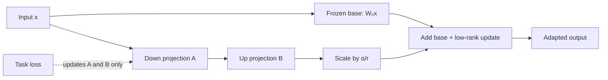

import PaperPdf from '@site/src/components/PaperPdf';
import CodeWalkthrough from '@site/src/components/viz/CodeWalkthrough';
import ResearchPaperLab from '@site/src/components/viz/ResearchPaperLab';

> **Hu et al. · 2021** · [Read the embedded paper](#original-paper) ·
> [Download PDF](/papers/research-papers/lora.pdf) · Notes follow the paper
> section by section, §1 to the appendix.

## Paper in one minute

**Problem.** Full fine-tuning stores and optimizes a complete copy of a large
model for every task, creating substantial memory and deployment cost.

**Key idea.** Freeze each selected base matrix and learn its update as the product
of two much smaller low-rank matrices. The update can remain separate or be
merged into the base weight for inference.

**Why it matters.** LoRA makes task-specific adaptation dramatically cheaper to
train and store. It constrains only the update—not the pretrained model itself—and
is not the same operation as quantization.

### Adaptation flow



## How to read this chapter

The walkthrough below follows the paper **in its own order**, from the abstract
to the appendix. Each heading carries the paper's section number, so you can
keep the PDF open beside it.

You do not need to have read a research paper before. Every new term is
explained the first time it appears, and each formula comes after the idea it
expresses. Boxes marked **not from the paper** are extra help, such as
analogies, real-world examples or worked numbers.

The embedded PDF is **arXiv version 1** (June 2021). Later versions change some
details, for example the scale factor (see §3), and add experiments on RoBERTa
and DeBERTa. When a table number here does not match your copy, check the
version.

## Abstract: the five claims

The paper is about **adaptation**: taking one large pre-trained language model
and making it good at a particular task, such as writing SQL or summarising
chats. The abstract makes five claims:

1. Ordinary **fine-tuning**, which retrains every weight, becomes impractical at
   the scale of GPT-3 (175 billion parameters). Each task would need its own
   175-billion-parameter copy.
2. **LoRA** instead **freezes** the pre-trained weights and adds small trainable
   **rank decomposition matrices** to each Transformer layer.
3. On GPT-3 this cuts the number of trainable parameters by **10,000 times** and
   the hardware requirement (mainly GPU memory) by **3 times**.
4. Quality is **on par with or better than** fine-tuning on GPT-3 and GPT-2,
   with higher training throughput and **no extra inference latency** (no
   slowdown when the model is used).
5. An empirical study of **rank deficiency** in the updates explains why LoRA
   works.

Two terms to know:

- **Parameters** (or weights) are the numbers a network learns. GPT-3 has 175
  billion of them.
- The **rank** of a matrix is the number of independent directions it can
  produce. A rank-1 matrix squashes every input onto a single line; a full-rank
  matrix can reach every direction.

## §1 Introduction: one model, many tasks

Many products use **one** pre-trained model for **many** tasks. The usual way to
adapt it is fine-tuning, which updates all its parameters. The downside: each
fine-tuned model is as big as the original. For GPT-2 or BERT-large that was an
inconvenience. For GPT-3, with 175 billion trainable parameters, it becomes a
"critical deployment challenge".

:::tip Intuition: why fine-tuning needs more memory than the weights (not from the paper)

A model with billions of parameters is expensive to adapt separately for many
tasks. Full fine-tuning usually requires gradients and optimiser state for
trainable weights, as well as activations needed by backpropagation. Storing
another full model for every task adds another cost.

Suppose one layer maps a 4,096-dimensional vector to another 4,096-dimensional
vector. That single matrix has 16,777,216 entries. Could a useful task-specific
change occupy a much smaller space?

:::

Researchers had tried two cheaper routes, and the paper finds both lacking:

- **Adapters** add small extra layers inside the network. They make the model
  deeper, so every prediction takes longer: **inference latency**.
- **Prompt-based methods** learn special input tokens. Those tokens take up
  room in the model's input, reducing the **usable sequence length**.

Both also sometimes fail to match full fine-tuning, forcing a trade-off between
efficiency and quality.

The inspiration for LoRA is earlier work showing that large models have a low
**intrinsic dimension**: although they have millions of parameters, the useful
changes during learning live in a much smaller space. The paper's
**hypothesis** is that the **change** to each weight matrix during adaptation
also has a low "intrinsic rank".

LoRA tests that possibility. It does not claim that the entire pre-trained
matrix has low rank. Its hypothesis concerns the **change needed during
adaptation**.

The paper reports that for GPT-3, a rank $r$ of **one or two** is enough, even
though the full rank $d$ is 12,288. It lists four advantages:

1. **Share one base model.** Keep a single copy in GPU memory and switch tasks
   by swapping the small matrices $A$ and $B$.
2. **Cheaper training.** No gradients or optimiser state for most parameters,
   which lowers the hardware needed "by 3 times".
3. **No inference latency.** The update can be merged into the original weights
   before deployment.
4. **Combines with other methods**, such as prefix tuning (Appendix D).

**Terminology.** The paper writes $d_{\text{model}}$ for the Transformer's
hidden size; $W_q$, $W_k$, $W_v$, $W_o$ for the query, key, value and output
projection matrices in self-attention; $W$ or $W_0$ for a pre-trained weight;
$\Delta W$ for its update during adaptation; and $r$ for LoRA's rank.

A footnote adds that fine-tuning still matters for GPT-3, despite its few-shot
ability, because it "boosts its performance significantly" (Appendix A).

:::tip In the real world (not from the paper)

Hugging Face's PEFT library implements LoRA, and the Hugging Face Hub hosts
thousands of LoRA adapters, each a small file that only works on top of the
base model it was trained for. That is advantage 1 at internet scale: one
download of the base model, many tiny task add-ons.

:::

## §2 Problem statement

The paper's method does not depend on the training objective, but it focuses
on **language modelling**: predicting the next token. It starts from a
pre-trained **autoregressive** language model $p_\Phi(y\mid x)$ with parameters
$\Phi$. Autoregressive means it writes text one token at a time, each token
based on the ones before it.

A downstream task is a set of **context-target pairs** $\mathcal{Z}=\{(x_i,y_i)\}_{i=1,\ldots,N}$.
In text-to-SQL, $x_i$ is a question and $y_i$ the SQL query that answers it; in
summarisation, $x_i$ is an article and $y_i$ its summary.

**Full fine-tuning** starts from the pre-trained weights $\Phi_0$ and moves them
to $\Phi_0+\Delta\Phi$ by maximising the probability of each target token
(**Equation 1**):

$$
\max_{\Phi}\sum_{(x,y)\in\mathcal{Z}}\sum_{t=1}^{|y|}\log\big(p_\Phi(y_t\mid x,y_{<t})\big).
$$

In plain words: for every example, add up the log-probability the model gives
each correct target token, given the context and the target tokens before it,
and push that total up.

The problem is size. The update $\Delta\Phi$ is as large as $\Phi_0$ itself,
so for GPT-3 each task needs another 175 billion numbers.

The **parameter-efficient** alternative encodes the update with a much smaller
set of parameters $\Theta$, so $\Delta\Phi=\Delta\Phi(\Theta)$ with
$|\Theta|\ll|\Phi_0|$ (**Equation 2**):

$$
\max_{\Theta}\sum_{(x,y)\in\mathcal{Z}}\sum_{t=1}^{|y|}\log\big(p_{\Phi_0+\Delta\Phi(\Theta)}(y_t\mid x,y_{<t})\big).
$$

In plain words: the same objective, but the optimiser can only move the small
set $\Theta$; the big update is computed from it. For GPT-3, the paper says
$|\Theta|$ can be as small as **0.01%** of $|\Phi_0|$.

:::tip Worked number (not from the paper)

0.01% of 175 billion is $175\times10^9\times10^{-4}=17.5$ million parameters.
That is close to the 18.8M LoRA configuration used later (§5.2, §6.1).

:::

:::tip In the real world (not from the paper)

Think of an analytics team that wants a "question to SQL" helper for its own
database. The training data is a few thousand pairs of questions and the SQL
that answers them. Equation 1 would retrain the whole model for that one team;
Equation 2 trains a small add-on instead. This is an illustration, not a
system from the paper.

:::

## §3 Our method

The principles apply to any **dense layer**, a layer that multiplies its input
by a weight matrix. The experiments only apply LoRA to some Transformer weights,
for practical reasons.

### Low-rank constraint on the update

**The idea in words.** Leave the original weight matrix alone. Next to it, add
a thin "detour": squeeze the input down to just $r$ numbers with a matrix $A$,
then expand it back to full size with a matrix $B$. Add the detour's output to
the original output. Only $A$ and $B$ are trained.

Formally, for a pre-trained weight $W_0\in\mathbb{R}^{d\times k}$, the update is
written as a product of two smaller matrices:

$$
W_0+\Delta W=W_0+BA,\qquad B\in\mathbb{R}^{d\times r},\quad A\in\mathbb{R}^{r\times k},\quad r\ll\min(d,k).
$$

$W_0$ is **frozen**: it gets no gradient updates. $A$ and $B$ hold the trainable
parameters. Both $W_0$ and $BA$ multiply the same input $x$, and the outputs are
added (**Equation 3**):

$$
h=W_0x+\Delta Wx=W_0x+BAx.
$$

In plain words: the layer's output is the original output plus a low-rank
correction.


_Figure 1 from the original paper, PDF page 1.
[Source PDF](/papers/research-papers/lora.pdf#page=1)._

The original path still computes $W_0x$. The additional path first reduces the
input to r dimensions through A, then maps it to the output width through B.
Adding both paths gives the adapted output. The figure draws a square
$d\times d$ weight; the text uses the general $d\times k$.

:::tip Worked number: count the parameters yourself (not from the paper)

Full adaptation of that matrix trains $dk$ entries. LoRA trains $r(k+d)$
entries. With `d=k=4096` and `r=8`:

| Method       | Trainable entries for this matrix |
| ------------ | --------------------------------: |
| Full matrix  |                        16,777,216 |
| LoRA A and B |                            65,536 |

That is 256 times fewer **for this selected matrix**. It is not automatically
the reduction for the entire model: the answer depends on which layers receive
adapters and what else remains trainable.

:::

A rank-r update has at most r independent directions. If a task requires
changes outside that space, the chosen rank or target layers may be
insufficient.

#### Initialisation and scaling

The paper initialises $A$ with **random Gaussian** values and $B$ with
**zeros**, so $\Delta W=BA$ is zero when training starts. It then scales
$\Delta Wx$ by $\frac{1}{r}$, "to keep the coordinates of $\Delta Wx$ roughly
$\Theta(1)$ in $r$". Here $\Theta(1)$ means "about the same size whatever $r$
is", so changing the rank does not change how big the update is.

Initialise A randomly and B to zero. Then BA is zero, so the initial output
equals the original model's output. This is useful because adaptation starts
from a known function.

:::tip Intuition: why not start both at zero? (not from the paper)

The gradient for A depends on B, and the gradient for B depends on A. If both
are zero, neither receives a useful first update. With random A and zero B, B
can move first, after which A can also learn.

:::

Freezing W₀ means it receives no parameter gradients or optimiser updates. It
does not mean the whole base-model computation disappears. Intermediate
activations may still be needed to propagate gradients into trainable adapters.

:::note The scale factor changed between versions

This v1 text scales by $1/r$, and its citation for that choice is broken (it
prints as "[?]"). Yet Appendix C's Table 8 lists a hyperparameter "LoRA
$\alpha$ = 32" for GPT-2 that the v1 text never defines. Later versions define
the scale as $\alpha/r$, which is what the diagram at the top of this chapter
shows and what libraries such as PEFT use. Write $h=W_0x+sBAx$ with $s$ the
scale, and always check which convention an implementation uses.

:::

### Weight decay to pre-trained weights

**Weight decay** is a regulariser that shrinks weights a little towards zero at
every step. With LoRA, it shrinks $A$ and $B$, and so shrinks the **update**,
pulling the model back towards the pre-trained weights. The paper notes that
decaying back to pre-trained weights has been studied as a defence against
**catastrophic forgetting**, when a model loses general skills while learning a
new task.

Decaying A and B tends to reduce their product, pulling the adapted function
towards the frozen base. Full fine-tuning weight decay acts on the complete
trainable matrix instead. Adapter regularisation and base-weight regularisation
are therefore not automatically equivalent.

The paper's evidence is one example: LoRA with $r=d_{\text{model}}=1024$ beats
full fine-tuning on GPT-2 Medium (§5.3 and Appendix G.2). In Table 14, that
setting scores 69.37 BLEU on E2E, against 68.2 for full fine-tuning in Table 2.

:::note Stated as a belief, not tested

The authors say that isolating this effect is "out-of-scope" and that they
"believe" it "might provide some regularization advantages". Treat it as a
plausible explanation, not a finding of the paper.

:::

### No additional inference latency

Before deployment, compute $W=W_0+BA$ once and use it as an ordinary weight
matrix. The model then runs exactly as fast as the original.

To switch tasks, subtract $BA$ to recover $W_0$, then add a different $B'A'$.
The paper says this briefly raises peak memory, and takes no longer than one
forward pass. Inference itself gets no extra latency.

:::tip In the real world (not from the paper)

Hugging Face Diffusers trains LoRA adapters for image models, and a common
workflow is to merge one into the base weights before generating images, so
generation runs at the base model's speed. Keeping the adapter separate instead
lets you swap styles without reloading the base.

:::

### §3.1 Applying LoRA to Transformer

In principle LoRA can go on **any subset** of weight matrices. A Transformer
layer has four in self-attention ($W_q$, $W_k$, $W_v$, $W_o$) and two in the
**MLP** (the feed-forward block). The paper treats $W_q$, $W_k$ and $W_v$ each
as one $d_{\text{model}}\times d_{\text{model}}$ matrix, even though the
outputs are later split into attention heads.

The paper **only adapts attention weights** and freezes the MLP. Its reason:
applying LoRA to the MLP would give "4 times the number of trainable
parameters given the same rank $r$". §6.1 studies which attention weights to
choose.

:::note Checking the "4 times" (not from the paper)

The MLP matrices are $4\times$ wider ($d_{\text{model}}\times4d_{\text{model}}$
in GPT-3). A full MLP matrix does have 4 times the entries of an attention
matrix. But LoRA's cost is $r(d+k)$, so an MLP matrix needs
$r(d+4d)=5dr$ against $2dr$ for an attention matrix: **2.5 times** more, not
4. The paper's reason stands; its multiplier describes the full matrices.

:::

The paper investigates attention projection matrices and different allocations
of an adaptation budget. Query and value projections are a prominent
configuration. Applying LoRA to every linear layer is an implementation choice,
not a requirement of the definition.

#### Choices you make when applying LoRA (not from the paper)

| Decision                   | What it controls                      | What to inspect                               |
| -------------------------- | ------------------------------------- | --------------------------------------------- |
| Rank                       | Capacity of each update               | Validation performance versus adapter size    |
| Target matrices            | Where adaptation can act              | Attention/MLP task requirements               |
| Scale                      | Magnitude of the adapter contribution | Stable optimisation and inference consistency |
| Learning rate              | Speed and stability of adaptation     | Loss curves and held-out performance          |
| Frozen/trainable selection | Optimiser state and task flexibility  | Actual `requires_grad` values                 |

A small rank working well on one model/task does not establish a universal best
rank.

:::note Later work changed the default

The paper's choice of attention-only LoRA was driven by its parameter budget.
QLoRA (2023) later reported that applying LoRA to **all** linear layers of the
Transformer block, MLP included, was needed to match full fine-tuning in its
setting.

:::

### Practical benefits and limitations

**Memory.** Because optimiser state is not kept for frozen weights, GPU memory
(VRAM) during training falls by **2/3** when $r\ll d_{\text{model}}$. For GPT-3
it drops from **1.2 TB to 350 GB**.

**Checkpoint size.** The saved file shrinks by roughly
$\frac{d_{\text{model}}}{2\gamma r}$ times, where $\gamma$ is the fraction of
weights that get LoRA. With $r=4$ and $\gamma=1/6$, the paper says GPT-3's
checkpoint goes from **350 GB to 35 MB**, about **10,000×** smaller.

:::tip Worked numbers: checking §3's figures (not from the paper)

- **350 GB** is 175 billion parameters at 2 bytes each (16-bit numbers). That
  frozen copy is still needed to run the model.
- **10,000×**: $12288/(2\times\frac16\times4)=9216$, which rounds to "roughly
  10,000".
- **$\gamma=1/6$** only works if you count by parameters. Each GPT-3 layer has
  four $d^2$ attention matrices and two $4d^2$ MLP matrices, $12d^2$ in all.
  $W_q$ and $W_v$ are $2d^2$ of that, one sixth. By number of matrices it
  would be 2 of 6, one third.
- **35 MB**: the $r_q=r_v=4$ configuration has 18.8M parameters (§5.2). At 2
  bytes each that is about 37.7 MB. The paper does not state the precision.

:::

The paper's footnote spells out the storage benefit: 100 adapted models need
$350\text{ GB}+35\text{ MB}\times100\approx354$ GB, instead of
$100\times350\text{ GB}=35$ TB.

Other benefits: training uses **far fewer GPUs**, tasks can be swapped by
loading only megabytes, and training runs about **25% faster**, because most
gradients are never computed.

**Limitation.** It is not straightforward to **batch** inputs for different
tasks, each with its own $A$ and $B$, into one forward pass, if $A$ and $B$
have been merged into $W$ to avoid latency.

:::tip In the real world (not from the paper)

Serving systems have since tackled that limitation. Engines such as vLLM keep
the adapters **unmerged** and can serve requests for many different LoRA
adapters in the same batch on one copy of the base model. A company with 50
customer-specific adapters can run them all on one GPU server.

:::

## §4 Related works

The paper places LoRA among four lines of work:

- **Transformer language models.** From GPT-1 and BERT to GPT-3 (175B, the
  largest at the time), pre-train then fine-tune became the standard recipe.
- **Prompt engineering and fine-tuning.** GPT-3 can adapt from a few examples
  in its prompt, but results depend heavily on how the prompt is written.
  Fine-tuning GPT-3 is hard because each checkpoint is huge and the memory
  needed is the same as for pre-training.
- **Parameter-efficient adaptation.** Adapter layers resemble LoRA's
  bottleneck, but **cannot be merged**, so they add latency. Prompt and prefix
  methods optimise input embeddings, but can only grow by adding special
  tokens, which use up sequence length.
- **Low-rank structures.** Low rank is common in machine learning, and some
  work trains networks with low-rank weights. To the authors' knowledge, none
  applies a low-rank **update** for adaptation. Theory work suggests neural
  networks do well when the target has low-rank structure.

The chapter's comparison table of LoRA, adapters, prompt tuning and
quantisation is further down, after the code.

## §5 Empirical experiments

LoRA is tested on two model families:

| Model   | Tasks                                                                | GPUs (NVIDIA V100)               |
| ------- | -------------------------------------------------------------------- | -------------------------------- |
| GPT-3 175B | WikiSQL (question to SQL), MultiNLI (does one sentence follow from another?), SAMSum (summarise a chat) | 96 for fine-tuning, 24 for LoRA |
| GPT-2 Medium and Large | E2E NLG (describe a restaurant from a list of facts); DART and WebNLG in Appendix E | 1 |

The embedded 2021 v1 paper studies GPT-3 adaptation on tasks including WikiSQL
and MultiNLI, and GPT-2 adaptation on data-to-text benchmarks such as E2E.
Appendices extend the task comparisons, low-data analysis and combinations with
prefix tuning. Later versions of the paper have different experiment coverage,
so use the version in the embedded PDF when following tables.

**WikiSQL** maps a natural-language question and table context to SQL.
**MultiNLI** classifies relationships between sentences. **Data-to-text
generation** turns structured fields into a description. These tasks test
different output behaviours; adapter size alone does not say which behaviour
was learned successfully.

The paper's reported savings depend on the model, selected matrices and
training configuration. Examine quality and trainable-parameter counts together
rather than treating a small adapter as sufficient evidence of success.

### §5.1 Baselines

Each method trains a different set of parameters. With $L$ layers,
$d_{\text{model}}$ the hidden size, $l_p$ and $l_i$ the numbers of prefix and
infix tokens, $n$ the adapter's hidden size and $r$ the LoRA rank:

| Method           | What is trained                                              | Trainable parameters                            |
| ---------------- | ------------------------------------------------------------ | ----------------------------------------------- |
| Fine-Tune        | Everything                                                   | All                                             |
| FT-Top2          | Only the last two layers                                     | Those layers                                    |
| Bias only        | Only the bias vectors                                        | The biases                                      |
| PrefixEmbed      | Embeddings of special tokens added before or after the prompt | $d_{\text{model}}\times(l_p+l_i)$              |
| PrefixLayer      | The activations of those tokens after every layer            | $L\times d_{\text{model}}\times(l_p+l_i)$       |
| Adapter          | Two small matrices per adapter layer, with a nonlinearity    | $4\times L\times d_{\text{model}}\times n$      |
| LoRA             | $A$ and $B$ on $W_q$ and $W_v$                               | $2\times L\times d_{\text{model}}\times r$      |

"Prefixing" puts the special tokens before the prompt; "infixing" puts them
after it. The paper implemented both prefix methods on GPT-3 itself, following
the prefix-tuning paper; the other GPT-2 baselines come from that paper's code.

The comparisons include full fine-tuning, training selected layers, adapter
methods and prefix-based methods. Training only the final layers changes where
adaptation can happen. LoRA can spread a smaller number of trainable parameters
across projections throughout the network.

:::note The LoRA formula counts one matrix per layer

$2\times L\times d_{\text{model}}\times r$ is the count for **one** adapted
matrix per layer. With both $W_q$ and $W_v$ adapted it doubles. For GPT-3
($L=96$, $d_{\text{model}}=12288$) with $r_q=r_v=2$, the formula gives 4.7M,
but Table 9 lists 9.4M, and it lists 4.7M for $r_v=2$ alone. Later versions of
the paper fix this by counting adapted matrices instead of layers.

:::

:::tip Worked number (not from the paper)

PrefixEmbed with $l_p=256$ and $l_i=8$ on GPT-3: $12288\times264\approx3.24$M,
exactly Table 9's figure. PrefixLayer with $l_p=l_i=8$:
$96\times12288\times16\approx18.9$M, while the paper reports 20.2M without
explaining the difference.

:::

### §5.2 Performance on GPT-3

**Hyperparameters.** AdamW for 2 epochs, batches of about 100,000 tokens,
sequence length 768, weight decay 0.1, with the learning rate tuned for every
method and dataset (Appendix C). The best prefix settings were $l_p=256$,
$l_i=8$ for PrefixEmbed (3.2M parameters) and $l_p=l_i=8$ for PrefixLayer
(20.2M). Two LoRA configurations are reported.

:::tip Worked number (not from the paper)

Table 7 gives GPT-3's batch size as 128. At sequence length 768 that is
$128\times768=98{,}304$ tokens, the "100k tokens" of the text.

:::

Table 1 of the paper. **ROUGE-1/2/L** score a summary by its overlap with a
human summary: shared single words, shared word pairs, and the longest shared
sequence.

| GPT-3 175B method | Trainable parameters | WikiSQL accuracy | MNLI-m accuracy | SAMSum R1/R2/RL    |
| ----------------- | -------------------- | ---------------- | --------------- | ------------------ |
| Fine-Tune         | 175,255.8M           | 73.0             | 89.5            | 52.0 / 28.0 / 44.5 |
| Bias only         | 14.2M                | 71.3             | 91.0            | 51.3 / 27.4 / 43.5 |
| PrefixEmbed       | 3.2M                 | 63.1             | 88.6            | 48.3 / 24.2 / 40.5 |
| PrefixLayer       | 20.2M                | 70.1             | 89.5            | 50.8 / 27.3 / 43.5 |
| **LoRA**          | **4.7M**             | 73.4             | 91.3            | 52.1 / 28.3 / 44.3 |
| **LoRA**          | **37.7M**            | **73.8**         | **91.7**        | **53.2 / 29.2 / 45.0** |

What this shows: LoRA matches or beats full fine-tuning while training a tiny
fraction of the parameters, about 1/4,600 for the larger configuration. WikiSQL results vary by ±0.3% between runs and MNLI-m by ±0.1%, so
small gaps are within noise. **MNLI-m** is MultiNLI's "matched" validation set,
whose topics match the training data.

The paper's reading: "on all three datasets, LoRA outperforms the fine-tuning
baseline." Giving prefix methods more parameters does **not** help. Figure 2
shows performance **drops** beyond 256 special tokens for PrefixEmbed and 32
for PrefixLayer. The authors suspect that many special tokens push the input
too far from what the model saw in pre-training.

:::note Two problems with Table 1

**The 4.7M row.** The text says the two LoRA configurations are
$r_q=r_v=4$ (**18.8M**) and $r_q=r_v=8$ (37.7M), but the table's first LoRA row
says **4.7M**. By Table 9, 4.7M is $r_q=r_v=1$, and its scores (73.4 and 91.3)
match the $r=1$ column of Table 4. So the row is most likely the rank-1 model,
and the "18.8M" in the text does not belong to any row of Table 1.

**"All three datasets."** The 4.7M LoRA scores 44.3 ROUGE-L on SAMSum, below
fine-tuning's 44.5. Only the 37.7M configuration beats fine-tuning on every
number. Also notice that plain Bias-only training beats fine-tuning on MNLI-m
(91.0 against 89.5).

:::

:::tip Worked number (not from the paper)

The abstract's "10,000 times" matches the 18.8M configuration:
$175{,}255.8/18.8\approx9{,}300$. For the two rows that are in Table 1 the
reductions are about 37,000× (4.7M) and 4,600× (37.7M).

:::

:::tip In the real world (not from the paper)

Text-to-SQL is a common business use. A LoRA adapter trained on a company's own
question-and-query pairs can teach a model the table names and query style of
that one warehouse, while the base model's general SQL knowledge stays frozen
and shared. This is an illustration of the WikiSQL result, not a named
deployment.

:::

### §5.3 Performance on GPT-2

Does LoRA also work on smaller, less over-parameterised models? The authors copy
the prefix-tuning paper's set-up for a direct comparison on the **E2E NLG
Challenge**: turn a list of restaurant facts into a sentence. They train with
AdamW, a linear learning-rate schedule and 5 epochs, with the batch size,
learning rate and beam size from the prefix-tuning paper (Table 8 lists LoRA's).

The metrics all compare the generated text with human references: **BLEU**
(shared word sequences), **NIST** (like BLEU, with rarer words counting more),
**METEOR** (allows synonyms), **ROUGE-L** (longest shared sequence) and
**CIDEr** (consensus with several references). Higher is better for all.

| Method        | Trainable parameters | BLEU     | ROUGE-L  |
| ------------- | -------------------- | -------- | -------- |
| GPT-2 M, Fine-Tune | 354.92M         | 68.2     | 71.0     |
| GPT-2 M, Prefix    | 0.35M           | 69.7     | 71.4     |
| GPT-2 M, **LoRA**  | 0.35M           | **70.4** | **71.8** |
| GPT-2 L, Fine-Tune | 774.03M         | 68.5     | 69.9     |
| GPT-2 L, **LoRA**  | 0.77M           | **70.4** | **72.0** |

What this shows: on a smaller model too, LoRA beats full fine-tuning and prefix
tuning, with about 1/1,000 of the parameters.

<details>
<summary>Full Table 2 from the paper</summary>

E2E NLG Challenge, GPT-2 Medium (M) and Large (L).

| Method             | Trainable parameters | BLEU | NIST | METEOR | ROUGE-L | CIDEr |
| ------------------ | -------------------- | ---- | ---- | ------ | ------- | ----- |
| GPT-2 M (Fine-Tune) | 354.92M             | 68.2 | 8.62 | 46.2   | 71.0    | 2.47  |
| GPT-2 M (Adapter)  | 11.48M               | 68.9 | 8.71 | 46.1   | 71.3    | 2.47  |
| GPT-2 M (FT-Top2)  | 25.19M               | 68.1 | 8.59 | 46.0   | 70.8    | 2.41  |
| GPT-2 M (Prefix)   | 0.35M                | 69.7 | 8.81 | 46.1   | 71.4    | 2.49  |
| GPT-2 M (LoRA)     | 0.35M                | 70.4 | 8.85 | 46.8   | 71.8    | 2.53  |
| GPT-2 L (Fine-Tune) | 774.03M             | 68.5 | 8.78 | 46.0   | 69.9    | 2.45  |
| GPT-2 L (Prefix)   | 0.77M                | 70.3 | 8.85 | 46.2   | 71.7    | 2.47  |
| GPT-2 L (LoRA)     | 0.77M                | 70.4 | 8.89 | 46.8   | 72.0    | 2.47  |

</details>

:::note The GPT-2 parameter counts do not reproduce (not from the paper)

Table 8 says GPT-2 LoRA uses $r_q=r_v=4$. GPT-2 Medium has 24 layers of width
1,024, so two adapted matrices give $4\times24\times1024\times4\approx0.39$M,
not 0.35M. GPT-2 Large (36 layers, width 1,280) gives about 0.74M, not 0.77M.
The paper does not show its count, so treat the "same parameter budget" as
approximate.

:::

## §6 Understanding the low-rank updates

With LoRA shown to work, the paper asks **why**. The low rank also makes the
updates easy to study. Three questions:

1. With a fixed parameter budget, **which weight matrices** should get LoRA?
2. Is the best update $\Delta W$ really **rank-deficient** (low rank)? If so,
   what rank should you use?
3. How does $\Delta W$ relate to $W$? Is it **correlated** with $W$, and how
   **large** is it?

The authors say answers to (2) and (3) shed light on how pre-trained language
models are adapted in general.

These analyses are evidence about the studied updates. They are not a proof
that every useful weight change must be low rank.

### §6.1 Which weight matrices in Transformer should we apply LoRA to?

The budget is fixed at **18M parameters** (about 35 MB) on GPT-3 across all 96
layers. That buys rank 8 on one type of attention weight, or rank 4 on two.
Table 3, validation accuracy:

| Weights adapted | Rank $r$ | WikiSQL (±0.3%) | MultiNLI (±0.1%) |
| --------------- | -------- | --------------- | ---------------- |
| $W_q$           | 8        | 70.4            | 91.0             |
| $W_k$           | 8        | 70.0            | 90.8             |
| $W_v$           | 8        | 73.0            | 91.0             |
| $W_o$           | 8        | 73.2            | 91.3             |
| $W_q, W_k$      | 4        | 71.4            | 91.3             |
| $W_q, W_v$      | 4        | **73.7**        | 91.3             |

What this shows: spending the whole budget on $W_q$ or $W_k$ is clearly worse.
Adapting $W_q$ and $W_v$ at rank 4 is best overall.

The paper's conclusion: even rank 4 captures enough of $\Delta W$ that it is
better to **adapt more types of matrix at a lower rank** than one type at a
higher rank.

:::tip Worked number (not from the paper)

Rank 8 on one matrix type: $2\times96\times12288\times8\approx18.9$M. Rank 4 on
two types: $2\times2\times96\times12288\times4$, the same 18.9M. At 2 bytes per
parameter that is about 38 MB, the paper's "roughly 35MB".

:::

#### Rank and placement are two independent choices (not from the paper)

Suppose the budget allows either rank 8 on the query matrix alone or a lower
rank on both query and value matrices. Those choices change different
computations: Q influences attention matching; V influences what information is
passed through the resulting weights.

The paper's experiments investigate this allocation rather than assuming that
rank is the only hyperparameter. Strong performance at small ranks in the tested
configurations suggests a low-dimensional useful update. It does not prove that
a rank-1 update can solve an arbitrary new task or adapt every matrix equally
well.

:::tip In the real world (not from the paper)

In Hugging Face's PEFT library, the default LoRA targets for LLaMA-style models
are the query and value projections, `q_proj` and `v_proj`. That default is a
direct legacy of Table 3.

:::

### §6.2 What is the optimal rank r for LoRA?

The authors vary the rank for $W_q$ and $W_v$ together, and for $W_q$ alone.
Table 4, validation accuracy:

| Setting              | $r=1$ | $r=2$ | $r=4$ | $r=8$ | $r=64$ |
| -------------------- | ----- | ----- | ----- | ----- | ------ |
| WikiSQL, $W_q, W_v$  | 73.4  | 73.3  | 73.7  | 73.8  | 73.5   |
| WikiSQL, $W_q$ only  | 68.8  | 69.6  | 70.5  | 70.4  | 70.0   |
| MultiNLI, $W_q, W_v$ | 91.3  | 91.4  | 91.3  | 91.7  | 91.4   |

What this shows: with $W_q$ and $W_v$ adapted, **rank 1 is already almost as
good as rank 64**. $W_q$ alone needs a larger rank. The paper calls this
surprising, and takes it as a sign that $\Delta W$ has a very small intrinsic
rank.

:::note The paper's own caveat

A footnote warns that a small $r$ will not work for every task. If the new task
were in a **different language** from pre-training, retraining the whole model
(like LoRA with $r=d_{\text{model}}$) "could certainly outperform" a small
rank.

:::

#### Subspace similarity between different r

Can we check that rank 64 is not hiding useful extra directions? The authors
compare the learned $A$ matrices at $r=8$ and $r=64$ (same pre-trained model).

A matrix can be decomposed into singular directions and strengths. A
**singular value decomposition (SVD)** splits a matrix into directions it acts
along (**singular vectors**) and how strongly it acts along each (**singular
values**). Concentrated singular values suggest an update uses relatively few
strong directions.

They take the right-singular vectors of $A_{r=8}$ and $A_{r=64}$, called
$U_{A_{r=8}}$ and $U_{A_{r=64}}$, and ask: how much of the space spanned by the
top $i$ directions of one is contained in the top $j$ directions of the other?
The measure is a normalised **subspace similarity** (**Equation 4**):

$$
\phi(A_{r=8},A_{r=64},i,j)=\frac{\big\lVert U_{A_{r=8}}^{i\top}U_{A_{r=64}}^{j}\big\rVert_F^2}{\min(i,j)}\in[0,1].
$$

In plain words: multiply the two sets of directions together, square and add
all the entries, and divide by the smaller count. You get **1** if one set of
directions lies entirely inside the other and **0** if they are at right angles.

The Frobenius norm squares and sums all entries. Identical equal-sized
subspaces give 1; orthogonal subspaces give 0.

:::tip Worked number: a sign flip does not matter (not from the paper)

A two-dimensional example makes this concrete. If both spaces contain the same
horizontal direction, their one-dimensional overlap is 1 even if one basis
vector points left and the other points right. The subspace is the same; a sign
convention should not change the conclusion. In numbers:
$u=(1,0)$ and $v=(-1,0)$ give $u^\top v=-1$, and $(-1)^2/1=1$.

:::

The paper looks at **layer 48 of 96** (Figure 3) and states the same holds for
other layers (Appendix G.1). Its key observation: the **top** singular
direction of $A_{r=8}$ and $A_{r=64}$ overlaps strongly, with normalised
similarity above 0.5, for both $\Delta W_q$ and $\Delta W_v$, while the other
directions mostly do not. That explains why $r=1$ works well: the extra
directions at higher rank are "potentially" mostly **random noise** from
training.

The paper compares spaces learned at different ranks and with different random
seeds. Overlap among leading directions suggests repeatedly useful adaptation
directions. Weak overlap among additional directions suggests that increasing
rank does not necessarily add equally important task information.

#### Subspace similarity between different random seeds

Two independent $r=64$ runs with different random seeds (Figure 4) share more
directions for $\Delta W_q$ than for $\Delta W_v$. The paper reads this as
$\Delta W_q$ having a higher intrinsic rank, which fits Table 4, where $W_q$
alone needs a larger $r$. Two random Gaussian matrices, by contrast, share no
directions at all.

:::note Right or left singular vectors?

§6.2 says it uses the **right**-singular vectors of $A$, which live in the input
space since $A$ is $r\times k$. Appendix F describes the same measure as using
the **left** singular matrices, with $U\in\mathbb{R}^{d\times i}$. The
right-singular reading is the one that makes sense for $A$; a footnote adds that
the same analysis could be done with $B$ and its left-singular vectors.

:::

:::note Did GPT-2 replicate it?

Table 4's caption says "We replicate this on GPT-2 in Sec. G.2". Appendix G.2
finds the best GPT-2 Medium rank is **4 to 16**, not 1. What replicates is "a
small rank is enough", not "rank one is enough".

:::

### §6.3 How does the adaptation matrix ΔW compare to W?

Is $\Delta W$ just a copy of the most important directions of $W$? And how
large is it compared with those directions of $W$?

The method: project $W$ onto the $r$-dimensional subspace of $\Delta W$ by
computing $U^\top WV^\top$, where $U$ and $V$ are the left and right
singular-vector matrices of $\Delta W$. Compare its Frobenius norm (the square
root of the sum of squared entries, a measure of size) with $\lVert W\rVert_F$.
For comparison, repeat with $U$, $V$ taken from $W$'s own top directions, and
from a random matrix. Table 5, layer 48 of GPT-3:

| Directions taken from | $r=4$ | $r=64$ |
| --------------------- | ----- | ------ |
| $\Delta W_q$          | 0.32  | 1.90   |
| $W_q$ (its own top directions) | 21.67 | 37.71 |
| Random                | 0.02  | 0.33   |
| For reference: $\lVert\Delta W_q\rVert_F$ | 6.91 | 3.57 |

The whole matrix has $\lVert W_q\rVert_F=61.95$.

What this shows: $W$ has very little weight in the directions that $\Delta W$
uses, but more than in random directions.

The paper draws three conclusions:

1. $\Delta W$ is more correlated with $W$ than a random matrix is, so it
   **amplifies features already in $W$**.
2. It does **not** repeat $W$'s top directions. It amplifies directions that
   $W$ does **not emphasise**.
3. The **amplification factor** is large: $21.5\approx6.91/0.32$ for $r=4$.

:::tip Worked number (not from the paper)

$6.91/0.32\approx21.6$, which the paper rounds to 21.5. For $r=64$,
$3.57/1.90\approx1.9$, the "around 2" of Appendix G.4. The lower-rank update
concentrates a larger push into fewer directions.

:::

The analysis also compares the update with the original weight matrix. A small
overall update can strongly alter a direction that originally had little
weight. Dividing the update's strength in that direction by the base matrix's
strength can give a large amplification factor even when the full base matrix
has a much larger norm.

This helps explain why the hypothesis is about **low-rank change**, not
compression of the complete pre-trained model. The method preserves the rest of
the base function.

The paper's overall reading: LoRA amplifies features that pre-training
**learned but did not emphasise**, and that matter for the specific task.

:::tip Intuition: a mixing desk (not from the paper)

Think of $W$ as a mixing desk with thousands of faders, already set well for
general music. A new task, say a podcast, needs a few quiet channels, like the
voice track, turned up a lot. LoRA does not rebuild the desk; it pushes up a
handful of faders that were set low. That is "a few directions, amplified about
20 times".

:::

## §7 Conclusion and future work

The authors restate the case: fine-tuning huge models is too expensive in
hardware and in the storage and switching cost of hosting many copies. LoRA
keeps model quality **without adding inference latency or shortening the
usable input**, and allows quick task switching by sharing almost all
parameters. The principles apply to any network with dense layers.

Future directions they name: combining LoRA with other fine-tuning methods,
tuning only some layers, adding adversarial training, and, since $\Delta W$ is
rank-deficient, asking whether $W$ itself might be too.

:::note What later work did with this

Several follow-ups, listed under further reading, took up exactly these
threads: AdaLoRA varies the rank per matrix, QLoRA combines LoRA with a
quantised base model, and DoRA changes how the weight update is parameterised.

:::

## Appendix A: Large language models still need parameter updates

Few-shot prompting is handy with a handful of examples. In practice, teams can
often collect a few thousand, and then fine-tuning wins by a wide margin. Table
6, validation accuracy on GPT-3:

| Method              | MNLI-m | RTE  |
| ------------------- | ------ | ---- |
| GPT-3 few-shot      | 40.6   | 69.0 |
| GPT-3 fine-tuned    | 89.5   | 85.4 |

What this shows: fine-tuning more than doubles MNLI-m accuracy. **RTE** is a
smaller sentence-pair task; its few-shot result comes from the GPT-3 paper. The
MNLI-m few-shot prompt used two examples per class, six in total.

## Appendix B: Dataset details

| Dataset  | Size                                   | Input → output                                        |
| -------- | -------------------------------------- | ----------------------------------------------------- |
| MultiNLI | 392,702 train, 9,815 validation        | Premise and hypothesis → entailment, neutral or contradiction |
| WikiSQL  | 56,355 train, 8,421 validation         | Table schema and question → SQL                       |
| E2E NLG  | 42K train, 4.6K validation, 4.6K test  | Restaurant slot-value pairs → description             |
| DART     | 82K in total                           | Entity–relation–entity triples → text                 |
| WebNLG   | 22K in total, 14 categories            | Subject–property–object triples → text                |

WebNLG's test set includes **5 categories unseen in training**, so results are
reported for seen (S), unseen (U) and all (A) categories. The appendix also
lists each dataset's licence.

## Appendix C: Hyperparameters used in experiments

For GPT-3 (Table 7), all methods share AdamW, batch size 128, 2 epochs, 250,000
warm-up tokens and a linear schedule. Only the learning rate differs. For GPT-2
(Table 8), LoRA uses $r_q=r_v=4$ and a learning rate of 0.0002.

<details>
<summary>Full Tables 7 and 8 from the paper</summary>

**Table 7, GPT-3.** Same settings for all datasets.

| Setting        | Fine-Tune | PrefixEmbed | PrefixLayer | LoRA   |
| -------------- | --------- | ----------- | ----------- | ------ |
| Optimiser      | AdamW     | AdamW       | AdamW       | AdamW  |
| Batch size     | 128       | 128         | 128         | 128    |
| Epochs         | 2         | 2           | 2           | 2      |
| Warm-up tokens | 250,000   | 250,000     | 250,000     | 250,000 |
| LR schedule    | Linear    | Linear      | Linear      | Linear |
| Learning rate  | 5.00E-06  | 5.00E-04    | 1.00E-04    | 2.00E-04 |

**Table 8, GPT-2 LoRA.**

| Setting              | E2E    | WebNLG | DART   |
| -------------------- | ------ | ------ | ------ |
| Optimiser            | AdamW  | AdamW  | AdamW  |
| Weight decay         | 0.01   | 0.01   | 0.0    |
| Dropout              | 0.1    | 0.1    | 0.0    |
| Batch size           | 8      | 8      | 8      |
| Epochs               | 5      | 5      | 5      |
| Warm-up steps        | 500    | 500    | 500    |
| LR schedule          | Linear | Linear | Linear |
| Label smoothing      | 0.1    | 0.1    | 0.0    |
| Learning rate        | 0.0002 | 0.0002 | 0.0002 |
| Adaptation           | $r_q=r_v=4$ | $r_q=r_v=4$ | $r_q=r_v=4$ |
| LoRA $\alpha$        | 32     | 32     | 32     |
| Beam size            | 10     | 10     | 10     |
| Length penalty       | 0.9    | 0.8    | 0.8    |
| No-repeat n-gram size | 4     | 4      | 4      |

</details>

## Appendix D: Combining LoRA with prefix tuning

LoRA changes weights; prefix methods change inputs or activations. They act on
different parts of the computation, so they can be combined:

- **LoRA+PE**: LoRA plus prefix-embedding tuning (trainable special-token
  embeddings).
- **LoRA+PL**: LoRA plus prefix-layer tuning (the special tokens' activations
  are replaced after every block with trainable vectors).

Results from Table 9 (GPT-3, validation accuracy):

| Method                    | Trainable parameters | WikiSQL  | MNLI-m |
| ------------------------- | -------------------- | -------- | ------ |
| LoRA, $r_q=r_v=8$          | 37.7M                | 73.8     | 91.7   |
| LoRA+PE, $r_q=r_v=8$       | 37.8M                | 75.0     | 91.4   |
| LoRA+PE, $r_q=r_v=64$      | 302.1M               | **76.2** | 91.3   |
| LoRA+PL, $r_q=r_v=8$       | 52.8M                | 72.9     | 90.2   |

What this shows: adding prefix embeddings helps WikiSQL, but not MNLI, and
adding prefix layers makes things slightly worse.

The paper's reading: LoRA+PE beats both parts on WikiSQL, suggesting LoRA is
"somewhat orthogonal" to prefix-embedding tuning. On MNLI it does not help,
"possibly because LoRA on its own already achieves performance comparable to
the human baseline". LoRA+PL is worse, which the authors attribute to prefix
layers being very sensitive to the learning rate, making LoRA's weights harder
to optimise.

The appendix finds that combinations are task- and optimisation-dependent;
adding more trainable mechanisms is not automatically better.

:::note An unsupported comparison

The "human baseline" for MNLI is mentioned without a number or a citation, so
the reader cannot check that explanation from the paper.

:::

## Appendix E: Additional task-based experiments

### E.1 Additional experiments on GPT-3

Table 9 sweeps each method's size. The headline pattern:

| Method and settings compared             | Trainable parameters | WikiSQL      | MNLI-m      |
| ---------------------------------------- | -------------------- | ------------ | ----------- |
| PrefixEmbed, $l_p$ 256 → 512             | 3.24M → 6.40M        | 63.1 → 55.9  | 88.6 → 85.8 |
| PrefixLayer, $l_p=l_i=8$ → $l_p=64$      | 20.2M → 76.1M        | 70.1 → 64.9  | 89.5 → 87.9 |
| LoRA, $r_q=r_v=1$ → 64                   | 4.7M → 301.9M        | 73.4 → 73.6  | 91.3 → 91.4 |

What this shows: past their best setting, prefix methods get **worse** as they
get bigger, while LoRA stays **stable** across a 64-fold change in size.

<details>
<summary>Full Table 9 from the paper</summary>

GPT-3 validation accuracy.

| Method      | Hyperparameters              | Trainable parameters | WikiSQL | MNLI-m |
| ----------- | ---------------------------- | -------------------- | ------- | ------ |
| Fine-Tune   | –                            | 175B                 | 73.0    | 89.5   |
| PrefixEmbed | $l_p=32$, $l_i=8$            | 0.39M                | 55.9    | 84.9   |
| PrefixEmbed | $l_p=64$, $l_i=8$            | 0.88M                | 58.7    | 88.1   |
| PrefixEmbed | $l_p=128$, $l_i=8$           | 1.67M                | 60.6    | 88.0   |
| PrefixEmbed | $l_p=256$, $l_i=8$           | 3.24M                | 63.1    | 88.6   |
| PrefixEmbed | $l_p=512$, $l_i=8$           | 6.40M                | 55.9    | 85.8   |
| PrefixLayer | $l_p=2$, $l_i=2$             | 5.06M                | 68.5    | 89.2   |
| PrefixLayer | $l_p=8$, $l_i=0$             | 10.1M                | 69.8    | 88.2   |
| PrefixLayer | $l_p=8$, $l_i=8$             | 20.2M                | 70.1    | 89.5   |
| PrefixLayer | $l_p=32$, $l_i=4$            | 44.1M                | 66.4    | 89.6   |
| PrefixLayer | $l_p=64$, $l_i=0$            | 76.1M                | 64.9    | 87.9   |
| LoRA        | $r_v=2$                      | 4.7M                 | 73.4    | 91.7   |
| LoRA        | $r_q=r_v=1$                  | 4.7M                 | 73.4    | 91.3   |
| LoRA        | $r_q=r_v=2$                  | 9.4M                 | 73.3    | 91.4   |
| LoRA        | $r_q=r_v=4$                  | 18.8M                | 73.7    | 91.3   |
| LoRA        | $r_q=r_v=8$                  | 37.7M                | 73.8    | 91.7   |
| LoRA        | $r_q=r_v=64$                 | 301.9M               | 73.6    | 91.4   |
| LoRA+PE     | $r_q=r_v=8$, $l_p=8$, $l_i=4$  | 37.8M              | 75.0    | 91.4   |
| LoRA+PE     | $r_q=r_v=32$, $l_p=8$, $l_i=4$ | 151.1M             | 75.9    | 91.1   |
| LoRA+PE     | $r_q=r_v=64$, $l_p=8$, $l_i=4$ | 302.1M             | 76.2    | 91.3   |
| LoRA+PL     | $r_q=r_v=8$, $l_p=8$, $l_i=4$  | 52.8M              | 72.9    | 90.2   |

</details>

:::note Small mismatches between tables

$r_q=r_v=64$ scores 73.6 on WikiSQL here but 73.5 in Table 4. PrefixLayer on the
full MNLI set scores 89.6 in Table 12 but 89.5 in Tables 1 and 9. Both gaps sit
inside the stated run-to-run noise, but they show the tables come from
different runs.

:::

### E.2 Additional experiments on GPT-2

The authors repeat the GPT-2 comparison on **DART** and **WebNLG**, following
the prefix-tuning set-up. As on E2E, LoRA is better than or on par with prefix
tuning at the same parameter count. DART BLEU (Table 10):

| Method             | Trainable parameters | DART BLEU |
| ------------------ | -------------------- | --------- |
| GPT-2 M, Fine-Tune | 354M                 | 46.0      |
| GPT-2 M, Prefix    | 0.35M                | 45.7      |
| GPT-2 M, LoRA      | 0.35M                | **47.1**  |
| GPT-2 L, Fine-Tune | 774M                 | 46.5      |
| GPT-2 L, LoRA      | 0.77M                | **47.5**  |

What this shows: LoRA beats full fine-tuning by about one BLEU point on both
model sizes.

<details>
<summary>Full Table 10 and condensed Table 11 from the paper</summary>

**Table 10, DART.** TER is an error rate, so lower is better. MET and TER vary
by about 0.01 between runs.

| Method             | Trainable parameters | BLEU        | MET  | TER  |
| ------------------ | -------------------- | ----------- | ---- | ---- |
| GPT-2 M Fine-Tune  | 354M                 | 46.0 (±0.1) | 0.39 | 0.46 |
| GPT-2 M Adapter    | 10M                  | 45.4 (±0.1) | 0.38 | 0.46 |
| GPT-2 M FT-Top2    | 24M                  | 38.1 (±0.3) | 0.34 | 0.56 |
| GPT-2 M Prefix     | 0.35M                | 45.7 (±0.2) | 0.38 | 0.46 |
| GPT-2 M LoRA       | 0.35M                | 47.1 (±0.2) | 0.39 | 0.46 |
| GPT-2 L Fine-Tune  | 774M                 | 46.5 (±0.1) | 0.39 | 0.45 |
| GPT-2 L Prefix     | 0.77M                | 46.5 (±0.2) | 0.38 | 0.45 |
| GPT-2 L LoRA       | 0.77M                | 47.5 (±0.1) | 0.39 | 0.45 |

**Table 11, WebNLG, BLEU only.** U is unseen categories, S seen, A all.

| Method                   | BLEU U      | BLEU S      | BLEU A      |
| ------------------------ | ----------- | ----------- | ----------- |
| GPT-2 M Fine-Tune (354M) | 30.4 (±.5)  | 63.2 (±.3)  | 47.6 (±.4)  |
| GPT-2 M Adapter (10M)    | 47.9 (±.2)  | 61.1 (±.4)  | 55.2 (±.3)  |
| GPT-2 M FT-Top2 (24M)    | 13.7 (±.6)  | 50.1 (±.4)  | 33.5 (±.4)  |
| GPT-2 M Prefix (0.35M)   | 44.1 (±.2)  | 63.1 (±.1)  | 54.4 (±.1)  |
| GPT-2 M LoRA (0.35M)     | 46.7 (±.4)  | 62.1 (±.2)  | 55.3 (±.2)  |
| GPT-2 L Fine-Tune (774M) | 41.7 (±.5)  | 64.6 (±.4)  | 54.2 (±.4)  |
| GPT-2 L Prefix (0.77M)   | 47.0 (±.2)  | 64.2 (±.4)  | 56.4 (±.1)  |
| GPT-2 L LoRA (0.77M)     | 48.4 (±.3)  | 64.0 (±.3)  | 57.0 (±.1)  |

</details>

On WebNLG's **unseen** categories, GPT-2 Medium fine-tuning scores only 30.4
BLEU against LoRA's 46.7, while on seen categories fine-tuning is slightly
ahead. The paper does not comment, but it fits the idea that a small update
disturbs the model's general ability less.

### E.3 Low-data regime

How do the methods cope with **very little training data**? The authors sample
100, 1,000 and 10,000 MNLI training examples ("MNLI-n") and evaluate on the full
validation set. Table 12:

| GPT-3 method | 100 examples | 1k   | 10k  | Full (392K) |
| ------------ | ------------ | ---- | ---- | ----------- |
| Fine-Tune    | 60.2         | 85.8 | 88.9 | 89.5        |
| PrefixEmbed  | 37.6         | 75.2 | 79.5 | 88.6        |
| PrefixLayer  | 48.3         | 82.5 | 85.9 | 89.6        |
| **LoRA**     | **63.8**     | 85.6 | **89.2** | **91.7** |

What this shows: with only 100 examples, PrefixEmbed is barely above guessing
(37.6% against 33.3% for three classes), while LoRA does best. LoRA beats
fine-tuning at 100 examples and on the full set, and is comparable at 1k and
10k.

The paper's reading: the gap between prefix methods and LoRA or fine-tuning
shrinks as data grows, which "might suggest" prefix methods are not suited to
low-data tasks on GPT-3. For PrefixLayer on MNLI-100 the learning rate had to be
lowered, because the training loss did not fall at the larger rate.

<details>
<summary>Table 13 from the paper: low-data hyperparameters</summary>

All methods use AdamW, 250,000 warm-up tokens and a linear schedule.

| Setting                 | MNLI-100 | MNLI-1k  | MNLI-10K | MNLI-392K |
| ----------------------- | -------- | -------- | -------- | --------- |
| Batch size              | 20       | 20       | 100      | 128       |
| Epochs                  | 40       | 40       | 4        | 2         |
| Fine-Tune learning rate | 5.00E-6  | 5.00E-6  | 5.00E-6  | 5.00E-6   |
| PrefixEmbed learning rate | 2.00E-04 | 2.00E-04 | 4.00E-04 | 5.00E-04 |
| PrefixLayer learning rate | 5.00E-05 | 5.00E-05 | 5.00E-05 | 1.00E-04 |
| LoRA learning rate      | 2.00E-4  | 2.00E-4  | 2.00E-4  | 2.00E-4   |
| PrefixEmbed $l_p$       | 16       | 32       | 64       | 256       |
| PrefixEmbed $l_i$       | 8        | 8        | 8        | 8         |
| PrefixLayer             | $l_p=l_i=8$ | $l_p=l_i=8$ | $l_p=l_i=8$ | $l_p=l_i=8$ |
| LoRA                    | $r_q=r_v=8$ | $r_q=r_v=8$ | $r_q=r_v=8$ | $r_q=r_v=8$ |

</details>

:::tip In the real world (not from the paper)

Small-data adaptation is the everyday case: a clinic with 200 labelled triage
notes, or a legal team with 500 reviewed clause labels. Table 12 suggests LoRA
is a sensible first choice there, though a result on one GPT-3 task is not a
guarantee for yours. These are illustrations.

:::

## Appendix F: Measuring similarity between subspaces

This appendix connects Equation 4 to a standard measure. Take two sets of
orthonormal directions (unit-length and at right angles to each other),
$U_A^i\in\mathbb{R}^{d\times i}$ and $U_B^j\in\mathbb{R}^{d\times j}$. Let
$\sigma_1,\ldots,\sigma_p$ be the singular values of $U_A^{i\top}U_B^j$, with
$p=\min(i,j)$.

The standard **Projection Metric**, a distance between subspaces, is:

$$
d(U_A^i,U_B^j)=\sqrt{p-\sum_{i=1}^{p}\sigma_i^2}\;\in[0,\sqrt p].
$$

The paper's similarity is its reverse:

$$
\phi(A,B,i,j)=\psi(U_A^i,U_B^j)=\frac{\sum_{i=1}^{p}\sigma_i^2}{p}.
$$

In plain words: the singular values measure how well each direction of one set
lines up with the other set. Average their squares and you get the similarity.
It is 1 when the two sets span the same space, 0 when they are completely
orthogonal, and in between otherwise.

:::note A typo in the conversion

The paper then writes $\phi=\frac1p\big(1-d^2\big)$. Since
$d^2=p-\sum\sigma_i^2$, the correct form is $\phi=\frac1p\big(p-d^2\big)=1-\frac{d^2}{p}$.
The citation for the Projection Metric is also broken in v1, printed as "[?]".

:::

## Appendix G: Additional experiments on low-rank matrices

### G.1 Correlation between LoRA modules

Figures 5 and 6 repeat Figures 3 and 4 for layers **1, 32, 64 and 96** of the
96-layer model. They support the claim in §6.2 that the layer-48 pattern holds
in other layers.

### G.2 Effect of r on GPT-2

The rank study is repeated on GPT-2 Medium with E2E, training for 26,000 steps.
Table 14, selected ranks:

| Rank $r$ | Validation loss | BLEU      |
| -------- | --------------- | --------- |
| 1        | 1.23            | 68.72     |
| 4        | 1.18            | **70.38** |
| 16       | **1.16**        | 69.61     |
| 64       | 1.16            | 69.24     |
| 1024     | 1.17            | 69.37     |

What this shows: on GPT-2 Medium, the best rank is **between 4 and 16**,
depending on the metric. Rank 1 is clearly worse here, unlike on GPT-3.

<details>
<summary>Full Table 14 from the paper</summary>

| Rank $r$ | val_loss | BLEU  | NIST   | METEOR | ROUGE_L | CIDEr  |
| -------- | -------- | ----- | ------ | ------ | ------- | ------ |
| 1        | 1.23     | 68.72 | 8.7215 | 0.4565 | 0.7052  | 2.4329 |
| 2        | 1.21     | 69.17 | 8.7413 | 0.4590 | 0.7052  | 2.4639 |
| 4        | 1.18     | 70.38 | 8.8439 | 0.4689 | 0.7186  | 2.5349 |
| 8        | 1.17     | 69.57 | 8.7457 | 0.4636 | 0.7196  | 2.5196 |
| 16       | 1.16     | 69.61 | 8.7483 | 0.4629 | 0.7177  | 2.4985 |
| 32       | 1.16     | 69.33 | 8.7736 | 0.4642 | 0.7105  | 2.5255 |
| 64       | 1.16     | 69.24 | 8.7174 | 0.4651 | 0.7180  | 2.5070 |
| 128      | 1.16     | 68.73 | 8.6718 | 0.4628 | 0.7127  | 2.5030 |
| 256      | 1.16     | 68.92 | 8.6982 | 0.4629 | 0.7128  | 2.5012 |
| 512      | 1.16     | 68.78 | 8.6857 | 0.4637 | 0.7128  | 2.5025 |
| 1024     | 1.17     | 69.37 | 8.7495 | 0.4659 | 0.7149  | 2.5090 |

</details>

The paper adds two cautions. Some hyperparameters were tuned at $r=4$, so other
ranks may be disadvantaged. And "the relationship between model size and the
optimal rank for adaptation is still an open question."

:::note The caption argues both ways

Table 14's caption says "**Unlike** on GPT-3 where $r=1$ suffices", then
concludes that GPT-2 Medium has "a **similar** intrinsic rank" to GPT-3. Both
halves can be true only in the loose sense that both models need a small rank.

:::

### G.3 Correlation between W and ΔW

Figure 7 compares the directions of $W_q$ with those of $\Delta W_q$ at
different ranks. The similarity between the **top 4 directions** of $\Delta W$
and the **top 10%** of $W$'s directions "barely exceeds 0.2". So $\Delta W$
holds task-specific directions that $W$ does not emphasise. A larger $r$ tends
to pick up more directions that $W$ already emphasises.

### G.4 Amplification factor

The paper defines the **feature amplification factor** as
$\frac{\lVert\Delta W\rVert_F}{\lVert U^\top WV^\top\rVert_F}$, with $U$ and $V$
from the SVD of $\Delta W$. In plain words: how much bigger the update is than
the part of $W$ that already points in the same directions.

For $r=4$ it is about **20**: roughly four feature directions per layer need to
be amplified about twentyfold to reach the reported accuracy, and each task
should need a different set. For $r=64$ it is only about **2**, meaning most of
the extra directions are hardly amplified. The paper takes this as further
evidence that the rank needed for adaptation is low.

## Real-world uses and worked examples

### Documented implementation: adapting diffusion image models

Hugging Face Diffusers provides a LoRA training workflow for text-to-image models. It trains selected low-rank updates while retaining the base model. This is a concrete extension of the adaptation technique beyond the language-model experiments in the original paper. [Diffusers' LoRA training guide](https://huggingface.co/docs/diffusers/training/lora).

### Worked example: a consistent illustration style

Suppose a design team has a set of authorised illustrations and wants new images to resemble that visual style. A possible workflow is to prepare image/caption pairs, choose a compatible base model, train LoRA adapters, and evaluate outputs for style consistency and overfitting.

The deliverable is a small adapter plus the identity of its required base model. At inference, the team loads that base and applies the adapter. Where supported, merging folds the update into the base weights.

**What the technique changes:** selected model computations become better suited to the style. It does not create a searchable archive of the training images or guarantee exact reproduction of a logo.

### Another application: standardising support-ticket outputs

Imagine an organisation wants a model to map tickets into its own issue categories and response format. It can train adapters on reviewed input/output examples while freezing most model weights.

| Requirement | Suitable part of the system |
|---|---|
| Learn consistent classification or writing behaviour | Adapter training may help |
| Retrieve the customer's latest order status | Query a database or tool |
| Answer from a frequently changing policy | Retrieve the current policy |

The ticket example is illustrative. Its purpose is to show **behaviour adaptation versus information access**. LoRA reduces the number of trained parameters; it does not make a frozen model aware of newly changed business data.

## Interactive lab

Change the base width and adapter rank. Use the calculator to derive the
trainable fraction before applying the same calculation to a real checkpoint.

<ResearchPaperLab lab="lora" />

## Complete code: train, save, reload and merge an adapter

<CodeWalkthrough paper="lora" />

**Teaching implementation.** A synthetic task changes a linear map by a rank-2 matrix. This controlled target lets us test whether a rank-2 adapter learns the change while leaving the base weights untouched.

Save as `lora.py`, install PyTorch, then run `python lora.py`. It writes an adapter checkpoint and checks held-out error and merged output equivalence.

<details>
<summary>Complete runnable script</summary>

```python
"""Fit a frozen linear model's low-rank correction, save/reload and merge it.
This uses the 2021 v1 paper's 1/r scale. It is an adaptation task on synthetic data.
"""
import math
import torch
from torch import nn
import torch.nn.functional as F

torch.manual_seed(7)
torch.set_num_threads(1)

class LoRALinear(nn.Module):
    def __init__(self, base, rank=2):
        super().__init__()
        self.base = base
        for parameter in self.base.parameters(): parameter.requires_grad_(False)
        self.A = nn.Parameter(torch.randn(rank, base.in_features)*.02)
        self.B = nn.Parameter(torch.zeros(base.out_features, rank))
        self.scale = 1/rank
    def forward(self, x):
        return self.base(x) + self.scale * F.linear(F.linear(x, self.A), self.B)
    @torch.no_grad()
    def merged(self):
        layer = nn.Linear(self.base.in_features, self.base.out_features, bias=self.base.bias is not None)
        layer.weight.copy_(self.base.weight + self.scale * self.B @ self.A)
        if layer.bias is not None: layer.bias.copy_(self.base.bias)
        return layer

base = nn.Linear(16, 12, bias=False)
original_weight = base.weight.detach().clone()
# A low-rank target shift lets us check exactly what rank-2 adaptation can learn.
true_delta = torch.randn(12,2) @ torch.randn(2,16) * .1
x_train, x_test = torch.randn(256,16), torch.randn(128,16)
y_train = F.linear(x_train, original_weight + true_delta)
y_test = F.linear(x_test, original_weight + true_delta)
model = LoRALinear(base)
assert torch.equal(model(x_test), base(x_test))
optim = torch.optim.Adam([model.A, model.B], lr=.03)
before = F.mse_loss(model(x_test), y_test).item()
for step in range(400):
    loss = F.mse_loss(model(x_train), y_train)
    optim.zero_grad(); loss.backward(); optim.step()
assert torch.equal(base.weight, original_weight)
assert base.weight.grad is None
# Store only the adapter; loading it requires the same original base weights.
torch.save({'A': model.A.detach(), 'B': model.B.detach(), 'scale': model.scale}, 'lora-adapter.pt')
state = torch.load('lora-adapter.pt', weights_only=True)
restored_base = nn.Linear(16,12,bias=False)
with torch.no_grad(): restored_base.weight.copy_(original_weight)
restored = LoRALinear(restored_base)
with torch.no_grad():
    restored.A.copy_(state['A']); restored.B.copy_(state['B'])
restored.scale = state['scale']
merged = restored.merged()
assert torch.allclose(model(x_test), merged(x_test), atol=1e-6)
after = F.mse_loss(merged(x_test), y_test).item()
print('Held-out MSE before / after:', before, after)
print('Trainable / full matrix parameters:', model.A.numel()+model.B.numel(), base.weight.numel())
assert after < before * .01
```

</details>

### Follow the lifecycle

`LoRALinear` owns the frozen base layer and the two trainable matrices. Its forward pass follows the equation directly. The optimiser receives only A and B, making the training boundary visible.

The target data uses `original_weight + true_delta`. This is deliberately favourable to LoRA: the task's exact update fits the selected rank. A low held-out error demonstrates the implementation, not that all language tasks are rank-2 problems.

The saved checkpoint contains the adapter and scale. Reloading also needs the **same base weights**. An adapter is a change to a specific model, not an independent replacement for that model.

Finally, `merged` constructs a conventional linear layer with:

$$
W_{\mathrm{merged}}=W_0+sBA.
$$

The script verifies that merged and unmerged predictions agree within floating-point tolerance. Because two matrix operations can be folded into one weight, LoRA need not add an extra inference branch after merging.

### Paper-to-code map

| Paper section                            | Where it lives in `lora.py`                                                         |
| ---------------------------------------- | ----------------------------------------------------------------------------------- |
| §3 Equation 3, $h=W_0x+BAx$              | `LoRALinear.forward`: `self.base(x) + self.scale * F.linear(F.linear(x, self.A), self.B)` |
| §3 shapes $A\in\mathbb{R}^{r\times k}$, $B\in\mathbb{R}^{d\times r}$ | `torch.randn(rank, base.in_features)` and `torch.zeros(base.out_features, rank)` |
| §3 random Gaussian $A$, zero $B$         | `torch.randn(...)*.02` for `self.A`; `torch.zeros(...)` for `self.B`                |
| §3 scale $1/r$ (v1)                      | `self.scale = 1/rank`                                                               |
| §3 $\Delta W=0$ at the start             | `assert torch.equal(model(x_test), base(x_test))`                                   |
| §3 $W_0$ frozen                          | `parameter.requires_grad_(False)`; `assert base.weight.grad is None`                |
| §2 Equation 2, optimise only $\Theta$    | `torch.optim.Adam([model.A, model.B], lr=.03)`                                      |
| §3 no inference latency, $W=W_0+BA$      | `merged()`: `self.base.weight + self.scale * self.B @ self.A`                       |
| §3 small checkpoints, task switching     | `torch.save({'A': ..., 'B': ..., 'scale': ...}, 'lora-adapter.pt')` and reload onto `restored_base` |
| §5.1 trainable-parameter count $r(d+k)$  | `model.A.numel()+model.B.numel()` against `base.weight.numel()`                     |

### Where this program departs from the paper

| Paper setting                                           | This program                                   | Why it matters                                                         |
| ------------------------------------------------------- | ---------------------------------------------- | ---------------------------------------------------------------------- |
| GPT-3 175B, LoRA on $W_q$ and $W_v$ in 96 layers (§5)   | One `nn.Linear(16, 12)` layer                  | Shows the mechanism; says nothing about which matrices to choose (§6.1) |
| Language-modelling objective, Equations 1–2 (§2)        | Mean-squared error on a regression target      | The adapter maths is the same; the loss is simpler                     |
| True $\Delta W$ rank unknown; studied in §6             | `true_delta` built with rank exactly 2         | Rank 2 is guaranteed to suffice here, unlike on a real task            |
| Ranks 1 to 64 compared (§6.2)                           | `rank=2` only                                  | No rank sweep; try `LoRALinear(base, rank=1)` to see underfitting      |
| AdamW, weight decay 0.1, warm-up, linear schedule (§5.2, App. C) | Adam, constant `lr=.03`, no weight decay | The weight-decay-to-base effect of §3 is absent                        |
| $A\sim\mathcal{N}(0,\sigma^2)$, $\sigma$ not given in v1 | Standard deviation 0.02                        | A common small choice; the paper does not fix it                       |
| Merge to avoid latency, swap $B'A'$ for a new task (§3) | Merge checked once with `torch.allclose`       | Task switching is not shown                                            |

## LoRA, adapters, prompt tuning and quantisation

| Method | What changes | Extra tokens/layers? | Same as quantisation? |
|---|---|---|---|
| Full fine-tuning | Existing model weights | Usually no | No |
| LoRA | Low-rank weight updates | Can merge into base weights | No |
| Bottleneck adapters | Added small neural modules | Extra modules | No |
| Prompt/prefix tuning | Learned input or attention-prefix vectors | Extra prefix representations | No |
| Quantisation | Numerical representation of weights/activations | Not inherently | Yes |

LoRA and quantisation can be combined, but the original LoRA paper does not introduce QLoRA. The authors' [implementation](https://github.com/microsoft/LoRA) provides reusable layers and examples beyond this controlled experiment.

## Summary

LoRA freezes a pre-trained weight $W_0$ and learns its change as a product
$BA$ of two thin matrices, starting from zero. The update can be merged into
$W_0$ for inference, so there is no extra latency, and a task's checkpoint
shrinks from gigabytes to megabytes.

On GPT-3, adapting only $W_q$ and $W_v$ matches or beats full fine-tuning with
about 1/10,000 of the trainable parameters, and ranks as small as 1 work on the
tasks tested. The analysis in §6 suggests why: the useful update amplifies a
few directions that the pre-trained weights contain but do not emphasise.

**Read next:** [InstructGPT](/docs/research-papers/instructgpt), which shows how
a pre-trained model is fine-tuned to follow instructions using human feedback.

## Checklist

- [ ] I can derive the A/B shapes and parameter count for any linear layer.
- [ ] I can explain why only the update, not W₀, is constrained to low rank.
- [ ] I can explain random-A/zero-B initialisation using gradients.
- [ ] I can save an adapter and identify the base checkpoint required to use it.
- [ ] I can prove the equivalence of merged and unmerged inference.
- [ ] I can distinguish LoRA from quantisation and other adaptation methods.
- [ ] I can reproduce §3's "350 GB to 35 MB" checkpoint figure and say what
      $\gamma$ has to mean for it to work.
- [ ] I can explain why the 4.7M LoRA row in Table 1 is probably the rank-1
      model, using Tables 4 and 9.
- [ ] I can read Table 3 and explain why rank 4 on $W_q$ and $W_v$ beats rank 8
      on $W_q$ alone.
- [ ] I can compute the subspace similarity $\phi$ of Equation 4 for a small
      example and say what 0 and 1 mean.
- [ ] I can explain the amplification factor of §6.3 and why it is about 20
      for $r=4$ but about 2 for $r=64$.

## Further reading and future evolution

- [AdaLoRA](https://arxiv.org/abs/2303.10512) allocates the parameter budget
  adaptively across weight matrices instead of fixing the same rank everywhere.
- [QLoRA](https://arxiv.org/abs/2305.14314) backpropagates through a frozen 4-bit
  quantized base model into LoRA adapters, sharply reducing training memory.
- [DoRA](https://arxiv.org/abs/2402.09353) separates weight magnitude and direction
  and applies low-rank adaptation to the directional component.

The upgrade path is therefore broader than “increase rank”: decide where the
rank belongs, reduce base-weight precision, or change the weight parameterization.

## Scenario-based interview questions

### 1. You must maintain 50 customer-specific variants of one 7B model. Why consider LoRA?

**Strong answer.** Store one shared frozen base and a small adapter per customer,
greatly reducing trainable parameters and checkpoint storage. Load or batch
adapters according to the serving design, while versioning each adapter with the
exact base checkpoint and tokenizer it expects. This does not automatically
reduce base-model inference memory; an unquantized 7B base must still be loaded.
Measure quality, adapter-switch latency, GPU memory and operational isolation.

### 2. For a `4096 × 4096` weight and rank 8, how many LoRA parameters are trained?

**Strong answer.** If $A$ has shape `8 × 4096` and $B$ has shape
`4096 × 8`, the update uses $8(4096+4096)=65,536$ parameters, compared with
$4096^2=16,777,216$ in the base matrix—about 0.39%. State the orientation used
by the framework, because stored linear weights may be transposed. The effective
update $BA$ has rank at most 8.

### 3. Why initialize one factor randomly and the other to zero?

**Strong answer.** A zero factor makes the initial product—and therefore the
model's initial functional update—zero, so adaptation starts from the base model.
The other random factor allows gradients to reach the zero factor on the first
step. If both factors were zero, each factor's gradient would be multiplied by
the other zero factor and learning could stall. Confirm this reasoning with the
actual multiplication order.

### 4. Merged and unmerged adapters produce different outputs. What would you check?

**Strong answer.** In evaluation mode they should implement the same linear map,
apart from numerical precision. Check the scale $\alpha/r$, matrix orientation,
whether the adapter was added twice, base-checkpoint identity, dtype/casting and
dropout state. Compare one layer's output before testing a full generation.
Merging is reversible only if the original base weights or exact update remain
available.

### 5. Increasing rank from 8 to 64 does not improve validation quality. Explain.

**Strong answer.** The task may need only a low-dimensional update; additional
directions can be redundant or overfit limited data. Optimisation settings may
also be inappropriate because parameter count and update scale changed. Sweep
rank together with learning rate and alpha, inspect multiple seeds, and compare
which modules receive adapters. Higher rank increases memory and training cost,
so lack of improvement is a useful deployment result.

### 6. Compare LoRA, full fine-tuning and quantisation for a domain assistant.

**Strong answer.** Full fine-tuning offers maximum update freedom but has high
optimizer and checkpoint cost. LoRA constrains the update and is attractive for
multiple tasks or limited training memory. Quantisation reduces representation
precision primarily to save memory/compute; it is not itself a task-adaptation
method. They can be combined, as in quantized-base adapter training, but quality,
kernel support and merge/export behavior must be tested together.

## Project: a text-to-SQL helper trained with a LoRA adapter

:::note Not from the paper

This project is an addition, a way to practise the paper's ideas on a real
task close to its WikiSQL experiment.

:::

**What you will build.** A small language model that turns a question about a
database table into a SQL query. You will train only a LoRA adapter, test where
to put it and how large its rank should be, then merge it and check nothing
changed.

**Why it matters.** Analysts ask "how many orders shipped late last month?" all
day. A text-to-SQL helper trained on your own schema is a common first use of
fine-tuning, and LoRA is how most teams do it on one GPU, keeping one adapter
per database.

**Data.** [sql-create-context](https://huggingface.co/datasets/b-mc2/sql-create-context)
(`b-mc2/sql-create-context` on Hugging Face): questions, the `CREATE TABLE`
statement for the table they refer to, and the answering SQL. It is built from
WikiSQL and Spider. Use 2,000 examples to train and 200 to test.

**Steps.**

1. Load the data and format each example as a context-target pair: schema and
   question as $x$, SQL as $y$. Compute the loss on the SQL tokens only, as in
   Equation 1 (§2).
2. Measure the base model's exact-match score on your 200 test examples with no
   training, the few-shot baseline of Appendix A.
3. Wrap `Qwen/Qwen2.5-0.5B` with a PEFT `LoraConfig`: $r=8$ on `q_proj` and
   `v_proj`. Before training, confirm the output equals the base model's,
   because $B$ starts at zero (§3).
4. Count the trainable parameters by hand with $r(d+k)$ per matrix and compare
   with `print_trainable_parameters()` (§5.1). In this model `v_proj` is
   narrower than `q_proj`, so the two do not cost the same.
5. Train for 1 to 2 epochs with AdamW and learning rate 2e-4, LoRA's rate in
   Table 7, on a free Colab GPU (§5.2). Measure exact match again.
6. Placement test at a similar budget: `q_proj` only at $r=16$ against `q_proj`
   and `v_proj` at $r=8$ (§6.1, Table 3).
7. Rank sweep: $r=1, 4, 8, 64$ on `q_proj` and `v_proj` (§6.2, Table 4).
8. Save the adapter and note its file size. Then call `merge_and_unload()` and
   check that greedy outputs are identical before and after merging (§3, no
   additional inference latency).

**How you know it works.** Exact match (after lower-casing and removing extra
spaces) should rise well above the untrained model's score; aim for at least
50% on the 200 test questions. The adapter file should be a few megabytes,
against about a gigabyte for the base model. Merged and unmerged models should
give the same SQL for every test question.

**Starter code.**

```python
from datasets import load_dataset
from transformers import AutoModelForCausalLM, AutoTokenizer
from peft import LoraConfig, get_peft_model

data = load_dataset("b-mc2/sql-create-context", split="train").shuffle(seed=0)
train, test = data.select(range(2000)), data.select(range(2000, 2200))

name = "Qwen/Qwen2.5-0.5B"
tokenizer = AutoTokenizer.from_pretrained(name)
model = AutoModelForCausalLM.from_pretrained(name)

config = LoraConfig(r=8, lora_alpha=8, lora_dropout=0.0,
                    target_modules=["q_proj", "v_proj"], task_type="CAUSAL_LM")
model = get_peft_model(model, config)  # freezes W0; A random, B zero (§3)
model.print_trainable_parameters()

def prompt(example):
    return (f"-- Schema: {example['context']}\n"
            f"-- Question: {example['question']}\n-- SQL:\n")

print(prompt(test[0]) + test[0]["answer"])
```

Install with `python -m pip install torch transformers datasets peft`. PEFT
scales the update by `lora_alpha / r`, so `lora_alpha=8` with `r=8` gives a
scale of 1. To copy the v1 paper's $1/r$, set `lora_alpha=1`.

**Stretch goals.**

- Repeat step 5 with 100 and 1,000 training examples and compare LoRA with full
  fine-tuning of the same small model, as in Table 12 (Appendix E.3).
- Train $r=8$ and $r=64$ adapters, take the $A$ matrix of one layer from each,
  and compute the subspace similarity $\phi$ of Equation 4 for $i=j=1$ (§6.2).
- Compute the amplification factor of §6.3 for one layer's
  $\Delta W_q=BA$, using `torch.linalg.svd`.

## Original paper

<PaperPdf slug="lora" title="LoRA: Low-Rank Adaptation of Large Language Models" />
