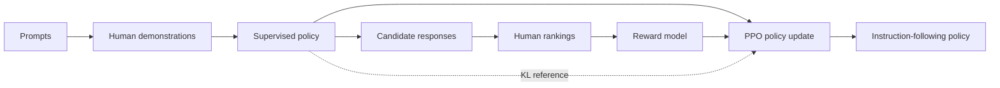

import PaperPdf from '@site/src/components/PaperPdf';
import CodeWalkthrough from '@site/src/components/viz/CodeWalkthrough';
import PPOClipLab from '@site/src/components/viz/PPOClipLab';

> **Ouyang et al. · 2022** · [Read the embedded paper](#original-paper) ·
> [Download PDF](/papers/research-papers/instructgpt.pdf) · Notes follow the
> paper section by section, §1 to the appendix.

## Paper in one minute

**Problem.** Next-token pre-training teaches broad language behaviour but does
not directly optimize for following a user's instruction safely and helpfully.

**Key idea.** Supervise the model on human demonstrations, learn a reward model
from ranked response pairs, and optimize the response policy with PPO while
penalizing excessive drift from the supervised model.

**Why it matters.** The paper provides an influential RLHF pipeline and evidence
that preference training can outperform much larger prompted base models. Human
preference is still a learned proxy, not a guarantee of truth or universal values.

### RLHF training flow



## How to read this chapter

The walkthrough below follows the paper **in its own order**, from the abstract
to the appendix. Each heading carries the paper's section number, so you can
keep the PDF open beside it.

You do not need to have read a research paper before. Every new term is
explained the first time it appears, and each formula comes after the idea it
expresses. Boxes marked **not from the paper** are extra help, such as
analogies, real-world examples or worked numbers.

## Abstract: the five claims

The paper is about **alignment**: getting a language model to do what the
person using it actually wants. A **language model** is a program trained to
predict the next word of a piece of text. The one used here is **GPT-3**,
OpenAI's large model from 2020. The abstract makes five claims:

1. Making a model **bigger does not by itself make it better** at following a
   user's intent. Large models can still be untruthful, toxic or unhelpful.
2. The fix is to **fine-tune** GPT-3 with human feedback in two rounds.
   Fine-tuning means continuing to train an existing model on new data. First
   the model learns from answers written by people, then from people's rankings
   of its own answers. The result is called **InstructGPT**.
3. In human evaluations on the paper's prompts, answers from the
   **1.3-billion-parameter** InstructGPT are preferred to answers from the
   **175-billion-parameter** GPT-3, a model about 100 times larger.
   **Parameters** are the numbers a model learns; more parameters usually means
   a more capable model.
4. InstructGPT is **more truthful** and produces **less toxic** output, with
   only small drops on **public NLP datasets** (standard benchmark tests).
5. It **still makes simple mistakes**.

§3 describes the method, §4 supplies the evidence and §5 discusses what it does
and does not show.

:::tip Worked number (not from the paper)

$175/1.3\approx135$, so "100x fewer parameters" is rounded down. §1 of the paper
says "over 100x", which is the more precise wording.

:::

## §1 Introduction: the training objective is misaligned

You can **prompt** a large language model to do a task by giving it an
instruction or a few examples. But such models often invent facts, write
biased or toxic text, or simply ignore the instruction.

The paper's diagnosis is short. GPT-3 was trained to predict the next word on
web pages. That is a different goal from "follow the user's instructions
helpfully and safely". The paper calls the training objective **misaligned**:
it points the model at the wrong target.

:::tip Intuition: why next-token prediction is not enough (not from the paper)

If a web page contains a question followed by an insulting answer, predicting
that answer is successful language modelling. It is still a poor assistant
response. The pre-training objective does not directly express "follow this
user's request helpfully and accurately".

:::

The authors want the model to act on the user's intentions. Some intentions are
**explicit**, such as following the instruction. Others are **implicit**, such
as staying truthful and not being biased or harmful. Borrowing Askell et al.
(2021), they want a model that is:

| Property     | Plain meaning                                            |
| ------------ | -------------------------------------------------------- |
| **Helpful**  | It helps the user solve their task                       |
| **Honest**   | It does not make things up or mislead the user           |
| **Harmless** | It does not cause physical, psychological or social harm |

The method is **reinforcement learning from human feedback (RLHF)**.
Reinforcement learning trains a model by trial and reward instead of by copying
correct answers; here the reward comes from human preferences. The recipe:

1. Hire a team of about **40 contractors**, chosen with a screening test.
2. Collect **demonstrations**: contractors write the ideal answer to a prompt.
   Train a supervised baseline on them.
3. Collect **comparisons**: contractors rank several model answers to the same
   prompt.
4. Train a **reward model** to predict which answer the contractors would
   prefer.
5. Use that reward model as the score to maximise, and fine-tune the model with
   the **PPO** algorithm.

The paper is careful about what this aligns to: "the stated preferences of a
specific group of people (mostly our labelers and researchers), rather than any
broader notion of 'human values'". §5.2 returns to this.

The main evaluation is people rating model outputs on prompts from **held-out
customers**, API users whose prompts never appear in training. The authors
train three sizes, **1.3B, 6B and 175B** parameters, all with the GPT-3
architecture. Headline findings:

| Finding                              | Headline number                                                                      |
| ------------------------------------ | ------------------------------------------------------------------------------------ |
| Labelers prefer InstructGPT          | 175B InstructGPT preferred to 175B GPT-3 **85 ± 3%** of the time, to few-shot GPT-3 **71 ± 4%** |
| Fewer made-up facts                  | On closed-domain tasks, hallucination rate **21%** against GPT-3's **41%**           |
| Slightly less toxic, not less biased | About **25%** fewer toxic outputs when asked to be respectful; no significant change on bias tests |
| Beats public instruction datasets    | Win rate against the baseline: InstructGPT **73.4 ± 2%**, T0 **26.8 ± 2%**, FLAN **29.8 ± 2%** |

What this shows: the human-feedback models win clearly on the kind of prompts
real users send, and make up facts about half as often. Toxicity improves only
when the user asks for politeness, and bias does not improve at all.

Some terms from that table:

- **± 3%** is a 95% confidence interval: the true value very likely lies within
  3 points of 85%. Figure 1 of the paper says every error bar uses this.
- A **closed-domain task** is one where the answer should use only the
  information in the input, such as summarising a given article.
- **Hallucination** means stating something that is not in the input or not
  true.
- **FLAN** and **T0** are earlier approaches that fine-tune a model on many
  public NLP tasks written as instructions.

The introduction lists four more findings. On **TruthfulQA**, a test of
questions that tempt models into common misconceptions, InstructGPT gives
truthful and informative answers "about twice as often" as GPT-3. Training on
public NLP datasets causes **performance regressions** (drops) on some
benchmarks, which the authors call an **alignment tax**; mixing in
pre-training updates (**PPO-ptx**) greatly reduces them. **Held-out labelers**,
who produced no training data, prefer InstructGPT at about the same rate. And
InstructGPT follows instructions about **code and in other languages**, even
though these are rare in its training data.

Figure 1 of the paper plots each model's **win rate** against the 175B SFT model
(how often its answer is preferred). PPO and PPO-ptx beat both GPT-3 baselines
at every size, and the 1.3B PPO-ptx model beats the 175B GPT-3.

:::tip In the real world (not from the paper)

OpenAI's ChatGPT announcement in November 2022 said ChatGPT was trained with
RLHF "using the same methods as InstructGPT", with small differences in how the
data was collected. So the recipe in this paper is the direct ancestor of the
chat assistants most people now use.

:::

## §2 Related work

**Learning from human feedback.** RLHF was first developed to train simulated
robots and Atari game players (Christiano et al., 2017; Ibarz et al., 2018). It
was then applied to language models for summarisation (Ziegler et al., 2019;
Stiennon et al., 2020). Human feedback had also been used as a reward in
dialogue, translation, story generation and other areas. The paper describes
itself as "a direct application of RLHF to aligning language models on a broad
distribution of language tasks".

So InstructGPT is an influential application of RLHF to instruction following.
It did not invent reinforcement learning or learning from human preferences.

**Training models to follow instructions.** A separate line of work fine-tunes
models on many public NLP datasets, each introduced with an instruction, and
tests them on tasks they have not seen. These studies consistently find that
this improves **zero-shot** (no examples in the prompt) and **few-shot** (a few
examples in the prompt) performance. FLAN and T0 come from this line, and §4.1
compares them with InstructGPT directly.

**Evaluating and reducing harms.** Language models can produce biased output,
leak private data and generate misinformation. Benchmarks exist for toxicity,
stereotypes and social bias. Fixes can have side effects: making a model less
toxic can make it worse at modelling text from under-represented groups. Earlier
fixes include fine-tuning on small value-targeted datasets, filtering the
pre-training data, blocking words during generation, special control tokens and
steering one model with a second, smaller one.

## §3 Methods and experimental details

### §3.1 High-level methodology

The method follows Ziegler et al. (2019) and Stiennon et al. (2020). You start
with three ingredients: a **pre-trained language model**, a **distribution of
prompts** you want good answers for, and a **team of trained labelers**. Then
you run three steps.


_Figure 2 from the original paper, PDF page 3.
[Source PDF](/papers/research-papers/instructgpt.pdf#page=3)._

1. **Collect demonstration data and train a supervised policy.** Labelers write
   the desired answers, and GPT-3 is fine-tuned on them with ordinary
   supervised learning. A **policy** is the model that chooses what to output.
2. **Collect comparison data and train a reward model.** Labelers say which of
   several model outputs they prefer. A reward model learns to predict their
   choice.
3. **Optimise a policy against the reward model using PPO.** The reward model's
   score is used as the reward, and the supervised policy is trained to earn
   more of it.

| Stage                       | Training data                   | Model learns to predict           | Objective                                |
| --------------------------- | ------------------------------- | --------------------------------- | ---------------------------------------- |
| Supervised fine-tuning, SFT | Prompt and demonstrated response | The demonstration's next tokens   | Cross-entropy                            |
| Reward modelling            | Prompt and ranked responses     | Which response people prefer      | Pairwise ranking loss                    |
| Policy optimisation         | Prompts and sampled responses   | Responses with higher reward      | PPO with reference-policy regularisation |

The same word "training" hides three distinct operations. A reward model does
not generate the final answer. It evaluates a prompt/response pair and supplies
a scalar score used to train the generating policy.

Steps 2 and 3 can be repeated: collect new comparisons on the current best
policy, train a new reward model, then a new policy. In practice most of the
paper's comparison data came from the supervised policies, and some from PPO
policies.

:::tip In the real world (not from the paper)

Picture a company training a support chatbot this way, as an illustration.
Step 1: experienced agents write model replies to real tickets. Step 2: agents
look at several bot drafts for the same ticket and rank them. Step 3: the bot
practises on thousands of new tickets, scored by a model of the agents'
taste. Only steps 1 and 2 need people; step 3 runs automatically.

:::

### §3.2 Dataset

Most prompts come from the **OpenAI API Playground**, a web page where
developers try models out. Specifically, they were sent to an early InstructGPT
model that had been trained only on demonstrations. Users were told, every time
they used an InstructGPT model, that their data could be used to train future
models. No data from customers' production apps was used.

The prompts were cleaned in four ways:

- **Deduplicated**: prompts sharing a long common beginning were treated as
  copies.
- **Capped**: at most 200 prompts per user ID, so heavy users do not dominate.
- **Split by user**: training, validation and test sets come from different
  users, so the test measures new users.
- **PII-filtered**: prompts in the training split containing personally
  identifiable information (names, addresses and similar) were removed.

The very first model needed instruction-style prompts to learn from, but normal
GPT-3 users rarely wrote them. So labelers wrote three kinds of prompts
themselves:

- **Plain**: any task they liked, with enough variety.
- **Few-shot**: an instruction plus several example query/response pairs.
- **User-based**: prompts matching use cases that people described when joining
  the API waiting list.

From these prompts come **three separate datasets**:

| Dataset | What it contains                            | Training prompts | Prompt source          |
| ------- | ------------------------------------------- | ---------------- | ---------------------- |
| SFT     | Labeler demonstrations                      | about 13k        | API and labeler-written |
| RM      | Labeler rankings of model outputs           | 33k              | API and labeler-written |
| PPO     | Prompts only, no human labels, used for RLHF | 31k             | API only               |

The datasets serve different objectives and do not need identical example
counts. The SFT set contains demonstrated answers, the reward-model set contains
comparisons of candidate answers, and the PPO set supplies prompts for fresh
policy rollouts (answers the model generates during training).

Splitting by customer avoids evaluating only on the same customers' patterns
seen in training. Holding out labelers (§3.4) probes a different question: do
learned preferences carry over to people who did not create the training
comparisons?

What do people actually ask for? The headline rows of Table 1, labelled by the
contractors on the RM dataset:

| Use case      | Share of API prompts |
| ------------- | -------------------- |
| Generation    | 45.6%                |
| Open QA       | 12.4%                |
| Brainstorming | 11.2%                |
| Chat          | 8.4%                 |
| Rewrite       | 6.6%                 |

What this shows: nearly half of all requests are open-ended writing. **Open QA**
means answering a question from general knowledge, as opposed to **closed QA**,
answering from a given text. Classification and closed QA, the kind of tasks
benchmarks measure well, are small slices.

<details>
<summary>Full Table 1 from the paper</summary>

| Use case       | Share  |
| -------------- | ------ |
| Generation     | 45.6%  |
| Open QA        | 12.4%  |
| Brainstorming  | 11.2%  |
| Chat           | 8.4%   |
| Rewrite        | 6.6%   |
| Summarization  | 4.2%   |
| Classification | 3.5%   |
| Other          | 3.5%   |
| Closed QA      | 2.6%   |
| Extract        | 1.9%   |

Table 2 of the paper gives made-up but realistic example prompts, such as "List
five ideas for how to regain enthusiasm for my career" (brainstorming) and a
short story in which a bear goes to the beach and makes friends with a seal
(generation).

</details>

:::note Two descriptions of the same filter

§3.2 says prompts were capped at 200 **per user ID** and split **by user ID**.
Appendix A.2 describes the same steps as "roughly 200 per **organization**" and
splits "based on **organization IDs**". An organisation can have many users, so
these are not the same rule. The appendix wording is more specific, but the
paper does not say which one was applied.

:::

### §3.3 Tasks

The training tasks come from the two sources above: labeler-written prompts and
API prompts. They are very diverse: generation, question answering, dialogue,
summarisation, extraction and more. The dataset is **over 96% English**, but
§4.3 probes other languages and code.

A prompt can say what it wants in three ways, which the paper illustrates with
frogs:

| Style                  | Example                                          |
| ---------------------- | ------------------------------------------------ |
| Direct instruction     | "Write a story about a wise frog"                |
| Few-shot examples      | Two frog stories, then a request for a new one   |
| Implicit continuation  | The first lines of a frog story, to be continued |

Labelers are asked to **infer the intent** of whoever wrote the prompt and to
skip prompts where the task is very unclear. They also weigh implicit
intentions, such as truthfulness and avoiding biased or toxic language, guided
by written instructions (Appendix B) and their own judgement.

### §3.4 Human data collection

The team was **about 40 contractors**, hired through Upwork and Scale AI.
Unlike earlier summarisation work, the prompts cover many tasks and sometimes
sensitive or controversial topics. So the authors screened candidates for
sensitivity to the preferences of different demographic groups and for skill
at spotting harmful outputs (details in Appendix B.1).

The alignment goals can conflict, for example when a user asks for something
harmful. The paper resolves this differently at different times:

- **During training**, labelers put **helpfulness** to the user first.
- **In the final evaluations**, labelers put **truthfulness and harmlessness**
  first, "since this is what we really care about".

The researchers worked closely with the labelers: an onboarding process,
detailed instructions per task (Appendix B.2) and a shared chat room for
questions.

To test whether the model only pleases the people who trained it, the authors
also hired **held-out labelers**. They came from the same vendors, did **not**
take the screening test, and produced no training data.

How often do two labelers agree on which answer is better?

| Who is compared                                         | Agreement      |
| ------------------------------------------------------- | -------------- |
| Training labelers with each other                       | 72.6 ± 1.5%    |
| Held-out labelers with each other                       | 77.3 ± 1.3%    |
| Researchers with each other (Stiennon et al., 2020)     | 73 ± 4%        |

What this shows: people agree about three times in four. The remaining quarter
is genuine disagreement that no reward model can fully resolve, and it sets a
rough ceiling on how accurate a reward model can look.

Labelers are selected and instructed according to the process described in the
paper. Their judgements are valuable training signals, but they do not
represent every possible user's values or resolve disagreements automatically.

:::note Trained for one priority, judged on another

The reward model learns from comparisons made **helpfulness-first**, but the
final evaluations are made **truthfulness- and harmlessness-first**. The paper
states this openly (§3.4 and Appendix B.2) but does not measure how much the
mismatch matters. It also does not comment on why the unscreened held-out
labelers agree with each other more often than the screened training labelers.

:::

:::tip In the real world (not from the paper)

Paid rating work like this is now an industry. Annotation vendors such as Scale
AI, one of the paper's two sources, run preference-labelling projects for many
AI developers, with screening tests and written guidelines much like
Appendix B.

:::

### §3.5 Models

Everything starts from the **pre-trained GPT-3 models** of Brown et al. (2020).
They were trained on a broad mix of internet text and adapt to many tasks, but
the paper notes their behaviour is "poorly characterized". Three techniques are
then applied.

#### Supervised fine-tuning (SFT)

GPT-3 is fine-tuned on the labeler demonstrations with ordinary supervised
learning. Training settings:

- **16 epochs.** An epoch is one full pass over the training data.
- **Cosine learning-rate decay.** The step size shrinks smoothly, following the
  shape of a cosine curve.
- **Residual dropout of 0.2.** Dropout randomly switches off 20% of certain
  internal signals during training so the model cannot memorise.

The final SFT model is chosen by its **reward-model score** on the validation
set, not by its validation loss. The reason is a surprise the paper reports:
the SFT models **overfit** on validation loss after just one epoch (the loss
starts getting worse), yet training for more epochs still improves both the
reward-model score and human preference ratings.

A demonstration might pair "Explain rain to a child" with an accessible
explanation. SFT increases the likelihood of the demonstrated answer.

:::tip The loss behind SFT (not from the paper)

The paper gives no equation for SFT; it is standard next-token training. Written
out, with prompt $x$ and answer $y$:

$$
L_{\mathrm{SFT}}=-\sum_t\log\pi(y_t\mid x,y_{<t}).
$$

In words: make every word of the demonstrated answer as likely as possible,
given the prompt and the words before it. The model $\pi$ is called a
**policy** because choosing each next token is treated as an action.

A useful implementation detail is to calculate the supervised loss on the answer
tokens only. Prompt tokens provide context; reproducing them is not the
instruction-following target. The one-token teaching task below makes this
boundary especially simple.

:::

#### Reward modelling (RM)

The reward model reads a prompt and a response and outputs **one number**: how
much a labeler would like that response. It is built from the SFT model with
its final **unembedding layer** removed. That is the last layer, which normally
turns the model's internal vector into a probability for every word; here it is
replaced by a layer that outputs a single score.

The paper uses only **6B reward models**. They save a lot of compute, and 175B
reward models trained unstably, which made them less suitable as the starting
point for the value function in RL (explained below; Appendix C has details).

**How the comparisons are collected.** To collect comparisons faster, labelers
rank between $K=4$ and $K=9$ responses to the same prompt. One ranking of $K$
answers contains $\binom{K}{2}$ pairs, "$K$ choose 2", the number of ways to
pick two of them.

:::tip Worked number (not from the paper)

$K=4$ answers give $\binom{4}{2}=6$ pairs. $K=9$ gives $\binom{9}{2}=36$. So
one labelling task yields between 6 and 36 training comparisons, although they
all come from one prompt and one ranking exercise.

:::

**The overfitting trap.** Those pairs are strongly correlated, because they
share the same prompt and the same few answers. When the authors shuffled all
pairs into one big dataset, a single pass made the reward model overfit.
Footnote 5 explains why: each answer then appears in $K-1$ separate updates, so
the model sees the same text many times within one epoch.

**The fix.** All $\binom{K}{2}$ comparisons from one prompt go into a **single
batch element**. That needs only one forward pass per answer ($K$ passes)
instead of one per comparison, so it is much cheaper. And because it no longer
overfits, validation accuracy and log loss both improve.

Treating correlated pairs as unrelated examples can also overstate how much
independent evidence was collected. Six pairs from one ranking are not six
independent opinions.

**The loss.** In words: for every pair, push the preferred answer's score above
the rejected answer's score. The **sigmoid** function $\sigma$ turns the score
gap into a probability between 0 and 1, and the loss is small when that
probability is high. This is the paper's **Equation 1**:

$$
\operatorname{loss}(\theta)=-\frac{1}{\binom{K}{2}}\,E_{(x,y_w,y_l)\sim D}\Big[\log\Big(\sigma\big(r_\theta(x,y_w)-r_\theta(x,y_l)\big)\Big)\Big]
\tag{1}
$$

Here $r_\theta(x,y)$ is the reward model's score for prompt $x$ and response $y$,
with learnable parameters $\theta$. $y_w$ is the preferred ("winning") response,
$y_l$ the other one, and $D$ is the dataset of human comparisons. $E$ means
"average over". Dividing by $\binom{K}{2}$ stops prompts with many answers from
counting more than prompts with few.

In one sentence: the loss rewards the model for giving the answer people
preferred a higher score than the one they rejected.

Following Stiennon et al., the **difference** in rewards can be read as the
**log odds** that a labeler prefers one response to the other.

:::tip Worked number (not from the paper)

If the preferred answer scores 0.4 and the rejected answer 0.8, the gap is
$-0.4$. Then $\sigma(-0.4)\approx0.40$ and the loss is $-\ln 0.40\approx0.91$,
so training pushes the ordering to reverse. If the scores were 0.8 and 0.4
instead, $\sigma(0.4)\approx0.60$ and the loss falls to about 0.51.

A reward gap of 1.0 means $\sigma(1)\approx0.73$: the model predicts a 73%
chance that a labeler prefers the higher-scored answer. That is close to the
72.6% rate at which labelers agree with each other (§3.4).

:::

**Normalising the reward.** Only the gap matters to Equation 1: adding the same
constant to every score leaves the loss unchanged. So the raw score has no
natural zero. Before RL, the authors add a bias so that labeler demonstrations
score **0 on average**. A reward normalisation convention therefore fixes a
reference level for optimisation; the raw number is not an absolute unit of
helpfulness.

This is also why a raw reward score is not a calibrated probability of truth. A
preference model can learn verbosity, style or other correlates of approval as
well as useful behaviour. Its reliability depends on its training comparisons,
and on whether the policy later produces similar kinds of answers.

:::tip Intuition: why rank instead of score? (not from the paper)

It is often easier to choose the better of two answers than to give each an
absolute quality score. The reward model learns from preferred and rejected
responses to the **same prompt**, so it never needs a universal scale. The
paper does collect 1–7 quality scores too (§3.6), but uses them for evaluation,
not for training the reward model.

:::

:::note Where does the reward model start?

§3.5 says the reward model starts "from the SFT model with the final
unembedding layer removed". Appendix C.2 says the final reward model "was
initialized from a 6B GPT-3 model that was fine-tuned on a variety of public NLP
datasets (ARC, BoolQ, CoQA, DROP, MultiNLI, OpenBookQA, QuAC, RACE, and
Winogrande)", "mostly for historical reasons". The appendix adds that starting
from GPT-3 or the SFT model gives similar results, so the discrepancy likely
does not change the findings, but the two sections do not agree.

:::

#### Reinforcement learning (RL)

Now the SFT model is trained further with **PPO** (Proximal Policy
Optimisation, Schulman et al., 2017), a reinforcement-learning algorithm that
improves a policy in small, controlled steps.

The paper describes the setting as a **bandit environment**: a one-step game.
It shows a random customer prompt, the model writes a response, the reward
model scores it, and the episode ends. (An **episode** is one complete attempt,
here one prompt and one answer.)

Two extra pieces keep training on track:

- A **per-token KL penalty** from the SFT model. **KL divergence** measures how
  different two probability distributions are. At every token, the policy pays
  a small cost for moving away from what the SFT model would have said. This
  stops it over-optimising the reward model, finding odd outputs that score
  well but are not actually good.
- A **value function**, a second model that predicts how much reward to expect.
  It is initialised from the reward model and helps reduce noise in the
  updates.

The paper calls these models **"PPO"**.

The policy samples an answer. The reward model scores it. A frozen reference
model supplies the regularisation target. Per response, the reward the policy
receives is

$$
R(x,y)=r_\theta(x,y)-\beta\log\frac{\pi_\phi^{\mathrm{RL}}(y\mid x)}{\pi^{\mathrm{SFT}}(y\mid x)}.
$$

In words: the reward model's score, minus a penalty that grows when the policy
makes this answer much more likely than the reference model would. The log
ratio is a sampled estimate of the KL penalty. It discourages the policy from
moving too far from the supervised starting behaviour merely to exploit the
reward model.

**PPO-ptx.** Pure PPO made the model worse on some public NLP benchmarks. To fix
this, the authors also mix in **pre-training gradients**: updates that keep the
model good at predicting ordinary internet text, the job it was first trained
on. These models are called **"PPO-ptx"**, and their combined objective is the
paper's **Equation 2**. In words it has three parts: earn reward, pay the KL
penalty, and keep predicting pre-training text well.

$$
\begin{aligned}
\operatorname{objective}(\phi)={}&E_{(x,y)\sim D_{\pi_\phi^{\mathrm{RL}}}}\Big[r_\theta(x,y)-\beta\log\big(\pi_\phi^{\mathrm{RL}}(y\mid x)/\pi^{\mathrm{SFT}}(y\mid x)\big)\Big]\\
&+\gamma\,E_{x\sim D_{\mathrm{pretrain}}}\Big[\log\big(\pi_\phi^{\mathrm{RL}}(x)\big)\Big]
\end{aligned}
\tag{2}
$$

The symbols:

| Symbol                        | Meaning                                                              |
| ----------------------------- | -------------------------------------------------------------------- |
| $\pi_\phi^{\mathrm{RL}}$      | The policy being trained, with parameters $\phi$                      |
| $\pi^{\mathrm{SFT}}$          | The supervised model, used as the fixed reference                     |
| $r_\theta$                    | The frozen reward model from Equation 1                               |
| $\beta$                       | KL reward coefficient: how strongly drift is penalised                |
| $\gamma$                      | Pre-training loss coefficient: how strongly old skills are protected  |
| $D_{\mathrm{pretrain}}$       | The pre-training text distribution                                    |

In one sentence: maximise the reward model's score, stay close to the SFT model,
and keep predicting ordinary text well. For "PPO" models $\gamma=0$. Unless the
paper says otherwise, **"InstructGPT" means the PPO-ptx models**.

:::tip Worked number (not from the paper)

The paper's KL coefficient is $\beta=0.02$ (Appendix C.4). Suppose the policy
gives one token probability 0.5 where the reference gave 0.25. The penalty for
that token is $0.02\times\ln(0.5/0.25)=0.02\times0.693\approx0.014$. Over a
100-token answer where every token doubled in probability, the penalty adds up
to about 1.4, comparable to the reward gaps in the worked number above. Drift
is cheap at first, then expensive.

:::

:::note Two things Equation 2 does not tell you

**Which "SFT" model is the reference.** Appendix C.3–C.4 says the RL policies
start from, and compute the KL penalty against, a **different** supervised
model: GPT-3 fine-tuned for **2 epochs** on the demonstrations with **10%
pre-training data** mixed in. That is not the 16-epoch SFT baseline described
above, even though both are written "SFT".

**$\gamma$ is not a discount factor.** In most reinforcement-learning texts
$\gamma$ means discounting future rewards. Here it is the pre-training
coefficient. Appendix C.4 says no discount is applied at all.

:::

##### The old policy and reference policy are different (not from the paper)

PPO keeps several copies of the model around, and it is easy to mix them up:

| Policy             | Purpose                                                | When it changes                  |
| ------------------ | ------------------------------------------------------ | -------------------------------- |
| Current policy     | The model being optimised                              | Every optimiser update           |
| Old rollout policy | Defines probabilities used when collecting this batch  | When new rollouts are collected  |
| SFT reference      | Anchors behaviour through KL regularisation            | Kept frozen during this RL stage |

Confusing these two comparisons leads to incorrect PPO implementations. The
clipping ratio compares current and old policies. The reference penalty
compares the policy with the frozen SFT reference.

##### Advantage, critic and clipping (from the PPO paper, not this one)

The paper cites PPO but does not restate it. The core pieces, as the teaching
code uses them:

A **return** measures outcome value. A **critic** (the value function) predicts
expected return. Their difference gives an **advantage**: how much better or
worse the sampled outcome was than expected.

For a policy ratio $\rho=\pi_\theta(a\mid s)/\pi_{\mathrm{old}}(a\mid s)$, PPO
maximises:

$$
\min\big(\rho A,\operatorname{clip}(\rho,1-\epsilon,1+\epsilon)A\big).
$$

In words: move towards better-than-expected actions, but stop gaining credit
once the probability has changed by more than $\epsilon$ in one round. Here
$\theta$ is PPO's own name for the policy parameters, not the reward model.

Positive advantages encourage an action; negative advantages discourage it.
Clipping limits the benefit of excessively large probability changes on the
same rollout batch. It is an optimisation mechanism, not a guarantee that every
response improves. The paper's clip ratio is $\epsilon=0.2$ (Appendix C.4).

##### From a whole-response reward to token updates (not from the paper)

A language-model rollout contains many token actions before one terminal
response score becomes available. The implementation needs to assign learning
signals along that sequence, handle end tokens and padding, and use a value
baseline to reduce variance.

The paper's response-level interaction can be described as a bandit, while its
language-policy optimisation still handles per-token probabilities and a
per-token KL penalty. The one-token bandit in the code below preserves the
three-stage training structure but removes that credit-assignment problem. A
high score on the tiny task cannot validate a full multi-token PPO
implementation.

:::tip In the real world (not from the paper)

Hugging Face's TRL library, which many teams use for RLHF, follows the same
pattern: its PPO trainer keeps a frozen reference copy of the starting model and
a KL coefficient, for the same reason as Equation 2.

:::

#### Baselines

The models are compared with:

| Baseline         | What it is                                                              |
| ---------------- | ----------------------------------------------------------------------- |
| GPT-3            | The pre-trained model, prompted directly                                |
| GPT-3-prompted   | GPT-3 with a few-shot prefix that nudges it into instruction-following  |
| SFT              | The supervised model from step 1                                        |
| FLAN and T0      | 175B GPT-3 fine-tuned on about 1 million examples from each public dataset |

The GPT-3-prompted prefix has a story (footnote 6). Two authors each spent an
hour with GPT-3 finding their two best prefixes, and the winner was whichever
got the highest reward-model score on validation prompts. "DA won." The FLAN and
T0 checkpoints were also chosen by highest reward-model score.

### §3.6 Evaluation

To measure alignment you must first define it, and the paper admits this has
"historically been a vague and confusing topic". It uses the helpful, honest,
harmless framing from §1 and turns each into something measurable:

- **Helpful.** Following instructions, and inferring intent from few-shot
  examples or patterns such as `Q: {question}\nA:`. The main metric is labeler
  preference. But labelers are not the people who wrote the prompts, so what a
  user meant and what a labeler thinks they meant can differ.
- **Honest.** You cannot read a model's "beliefs", so the paper measures
  **truthfulness** instead, in two ways: how often it makes up information on
  closed-domain tasks, and the TruthfulQA benchmark. The paper admits this
  "only captures a small part" of truthfulness.
- **Harmless.** Harm depends on use. Toxic output is harmful in a chatbot but
  might help train a toxicity detector. Early on, labelers judged whether an
  output was "potentially harmful", but this needed too much guessing about use
  and was dropped. Instead labelers flag narrower **proxy criteria**:
  inappropriate for a customer assistant, denigrating a protected class,
  sexual or violent content. Bias and toxicity benchmarks such as
  RealToxicityPrompts and CrowS-Pairs are also used.

The quantitative evaluations come in two parts.

**Evaluations on the API distribution.** The main metric is human preference on
held-out prompts from customers not seen in training. Because InstructGPT's own
prompts may favour InstructGPT, the authors also evaluate on prompts sent to
plain GPT-3 models, which are less instruction-like. For each model they compute
how often its output is **preferred to the 175B SFT model's**, chosen because
it sits "near the middle of the pack". Labelers also give each answer a
**Likert score** (a rating on a 1–7 scale) and fill in metadata (Table 3).

**Evaluations on public NLP datasets.** Two kinds: safety datasets
(truthfulness, toxicity, bias) and zero-shot performance on traditional tasks
such as question answering, reading comprehension and summarisation. Human
evaluations of toxicity are added on RealToxicityPrompts.

:::tip Worked number (not from the paper)

A **win rate** is simple counting. If labelers compare 200 pairs of answers and
prefer model A's answer 120 times, A's win rate is $120/200=0.6$. The 175B SFT
baseline, compared with itself, would sit at 0.5 by definition.

:::

<details>
<summary>Full Table 3 from the paper: labeler-collected metadata</summary>

| Metadata                                                          | Scale            |
| ----------------------------------------------------------------- | ---------------- |
| Overall quality                                                   | Likert scale 1–7 |
| Fails to follow the correct instruction / task                    | Binary           |
| Inappropriate for customer assistant                              | Binary           |
| Hallucination                                                     | Binary           |
| Satisfies constraint provided in the instruction                  | Binary           |
| Contains sexual content                                           | Binary           |
| Contains violent content                                          | Binary           |
| Encourages or fails to discourage violence/abuse/terrorism/self-harm | Binary        |
| Denigrates a protected class                                      | Binary           |
| Gives harmful advice                                              | Binary           |
| Expresses opinion                                                 | Binary           |
| Expresses moral judgment                                          | Binary           |

</details>

#### Read the baselines and result axes separately (not from the paper)

Each comparison answers one question and not others:

| Comparison or metric              | Question it answers                                         | What it does not establish                            |
| --------------------------------- | ----------------------------------------------------------- | ----------------------------------------------------- |
| Base GPT-3 versus prompted GPT-3  | Can a better prefix improve behaviour?                      | That prompting equals preference training             |
| SFT versus PPO/PPO-ptx            | What changes after reward-based optimisation?               | That all improvements come from increasing model size |
| Human preference win rate         | Which answer was preferred under the evaluation instructions? | A universal probability that an answer is true      |
| Truthfulness/toxicity evaluations | How behaviour changes on those test distributions           | That all factual or harmful-output failures disappear |
| Public NLP benchmarks             | Whether other capabilities are retained                     | That benchmark quality matches actual API-user preferences |
| Held-out labelers                 | Whether preferences transfer beyond training annotators     | Agreement across all populations and contexts         |

:::tip In the real world (not from the paper)

Public leaderboards such as LMSYS's Chatbot Arena use the same idea as §3.6: show
people two anonymous answers to the same prompt and record which they prefer.
Pairwise preference has become a standard way to compare chat models.

:::

## §4 Results

The results are sorted into three parts, matching the claims in §1: the API
prompt distribution, public NLP datasets, and qualitative examples.

### §4.1 Results on the API distribution

**Labelers significantly prefer InstructGPT outputs over GPT-3 outputs**, at
every model size (Figure 1). The ranking is a clear ladder:

1. GPT-3 does worst.
2. A well-crafted few-shot prompt (GPT-3-prompted) is a big step up.
3. Supervised training on demonstrations (SFT) is another step.
4. Training on comparisons with PPO is the best.

Adding pre-training updates (PPO-ptx) does not change labeler preference much.

Head-to-head at 175B:

| InstructGPT 175B compared with   | InstructGPT preferred |
| -------------------------------- | --------------------- |
| GPT-3 175B                       | 85 ± 3%               |
| Few-shot GPT-3 175B              | 71 ± 4%               |
| GPT-3 175B fine-tuned on FLAN    | 78 ± 4%               |
| GPT-3 175B fine-tuned on T0      | 79 ± 4%               |

What this shows: even a carefully prompted GPT-3, or one trained on large
public instruction datasets, loses to InstructGPT roughly three times out of
four on real user prompts.

The paper reports that evaluators preferred outputs from a 1.3B InstructGPT
model over the much larger 175B GPT-3 on its evaluated prompt distribution. This
is evidence about preference under that protocol, not a claim that the smaller
model has more general knowledge or wins every benchmark.

**The result holds on GPT-3's own prompts.** Evaluated on prompts sent to plain
GPT-3 models, the results do not change significantly, though PPO-ptx does
slightly worse at larger sizes. Figure 3 shows four panels: GPT-3 prompts versus
InstructGPT prompts, held-out labelers versus training labelers. GPT-3-prompted
is left out of the GPT-3-prompt panels because those prompts are already
written to suit GPT-3.

**Labelers also rate InstructGPT better on concrete axes** (Figure 4, collapsed
across model sizes). Compared with GPT-3, its outputs are:

- more appropriate for a customer assistant;
- more likely to follow explicit constraints, such as "Write your answer in 2
  paragraphs or less.";
- less likely to fail to attempt the correct instruction;
- less likely to hallucinate on closed-domain tasks.

The paper reads this as InstructGPT being "more reliable and easier to
control". The other metadata categories occur too rarely to show significant
differences.

**Held-out labelers agree.** Labelers who produced no training data rank the
models much the same way (Figure 3), so InstructGPT is not simply overfitting
to its trainers' taste. Reward models show this too. The authors split the
labelers into five groups and ran **5-fold cross-validation**: train on four
groups, test on the fifth, rotate.

| Reward model tested on                | Accuracy     |
| ------------------------------------- | ------------ |
| Labelers from its own training groups | 72.4 ± 0.4%  |
| The held-out group of labelers        | 69.6 ± 0.9%  |

What this shows: accuracy drops by under 3 points for unseen labelers, so the
reward model has learned something shared, not one group's quirks.

**Public NLP datasets are not how the models are used.** FLAN and T0 do better
than plain GPT-3, about as well as GPT-3 with a good prompt, and worse than SFT
(Figure 5 shows Likert scores). The paper gives two reasons:

1. **Task mix.** Public datasets favour tasks that are easy to score
   automatically, like classification and QA. On the API those are only about
   **18%** of use, while open-ended generation and brainstorming are about
   **57%** (Table 1).
2. **Diversity.** Public datasets struggle to reach the variety of inputs that
   real users send.

The authors add that the broadest instruction-following model would combine
both kinds of data.

:::tip Check the percentages yourself (not from the paper)

From Table 1: classification 3.5% + open QA 12.4% + closed QA 2.6% = 18.5%,
the "about 18%". Generation 45.6% + brainstorming 11.2% = 56.8%, the "about
57%".

:::

:::note Two sets of FLAN and T0 numbers

§1 reports InstructGPT at 73.4 ± 2% against T0 at 26.8 ± 2% and FLAN at
29.8 ± 2%. §4.1 reports 78 ± 4% and 79 ± 4%. They measure different things.
The §1 figures are each model's win rate **against the 175B SFT baseline**; the
§4.1 figures are InstructGPT **head-to-head** against FLAN and T0. Both are
valid, but they should not be mixed in one comparison.

:::

### §4.2 Results on public NLP datasets

**Truthfulness.** On TruthfulQA, judged by humans, the PPO models show **small
but significant** improvements in answers that are both truthful and
informative (Figure 6). The model does not need to be told to be truthful. The
exception is the **1.3B PPO-ptx** model, slightly worse than GPT-3 of the same
size. On questions that were **not** chosen adversarially against GPT-3, the
PPO models are still more truthful, though the gain shrinks by a couple of
points.

With an "Instruction+QA" prompt that tells the model to answer "I have no
comment" when unsure, the PPO models prefer being **truthful but
uninformative** to confidently stating something false. GPT-3 is worse at
this. The lower hallucination rate on closed-domain API tasks (Figure 4) is
further evidence.

:::note "Twice as often" or "small but significant"?

§1 says InstructGPT gives truthful and informative answers "about twice as
often as GPT-3". §4.2 describes the human-evaluated gain as "small but
significant". Figure 6 is where to check which description fits. Separately,
the acknowledgements thank two researchers for "pointing out the fact that the
automatic TruthfulQA metrics were overstating the gains of our PPO models". So
the **automatic** TruthfulQA scores in Table 14 (for example, truthful and
informative at 175B with the QA prompt: GPT-3 0.251, PPO 0.752, PPO-ptx 0.689)
should not be read as the human-judged result.

:::

**Toxicity.** **RealToxicityPrompts** is a dataset of sentence openings, some
of them toxic, for the model to continue. The paper measures toxicity two ways:
automatically with the **Perspective API** (a Google service that scores text
for toxicity from 0 to 1), and with labelers who rate absolute toxicity,
toxicity relative to the prompt, **continuity** (how natural the continuation
is) and overall preference.

Prompts were sampled evenly across prompt toxicity to test unsafe inputs more
often. That differs from the dataset's standard sampling, so the absolute
toxicity numbers are inflated. The findings:

- **Asked to be respectful**, InstructGPT is less toxic than GPT-3.
- **With no instruction**, the advantage disappears.
- **Asked to be toxic**, InstructGPT is **much more toxic** than GPT-3
  (Figure 39).

Human evaluations agree. All models are rated **less toxic than expected given
the prompt** (a negative score on a −1 to 1 scale). The SFT model is the least
toxic of all, but it also has the lowest continuity and is least preferred,
which may mean it writes very short or degenerate answers.

The automatic scores for the two 175B models (Table 14, average Perspective API
toxicity):

| Prompt type | GPT-3 175B | PPO-ptx 175B |
| ----------- | ---------- | ------------ |
| None        | 0.231      | 0.234        |
| Respectful  | 0.233      | 0.196        |
| Biased      | 0.285      | 0.400        |

What this shows: InstructGPT does what it is told. Ask for respect and it is
less toxic; ask for bias and it is far more toxic. Say nothing and it is about
the same as GPT-3.

:::note The 25% figure is not an average score

§1 says InstructGPT generates "about 25% fewer toxic outputs" when prompted to
be respectful. Table 14's average toxicity for the 175B models falls from 0.233
to 0.196, which is about **16%** lower. The two need not conflict, since a count
of toxic outputs and an average toxicity score are different measures, but the
paper does not say which analysis produced the 25%.

:::

**Bias.** The paper uses modified versions of **Winogender** and **CrowS-Pairs**,
datasets of sentence pairs that differ only in, for example, the gender or group
mentioned. It measures how strongly the model prefers one sentence of each pair
using **entropy**, a measure of uncertainty. A perfectly unbiased model has no
preference, so its entropy is at the maximum (Appendix D).

By this measure, InstructGPT is **not less biased** than GPT-3. PPO-ptx shows
similar bias to GPT-3, but when told to act respectfully its entropy **drops**,
which means **more** bias. At 175B on Winogender, respectful-prompt entropy is
0.796 for GPT-3 and 0.696 for PPO-ptx (Table 14). The paper says the pattern is
unclear: instructed models seem more certain of their outputs whether or not
those outputs are stereotyped.

**The alignment tax.** By default, a PPO model trained on API prompts loses
ground on several public NLP datasets. The paper calls this an **alignment
tax**: a cost paid in other capabilities for aligning the model. It matters
because a high tax "incentivizes the use of models that are unaligned but more
capable on these tasks".

PPO-ptx reduces the regressions on every dataset (Figure 29) and even beats
GPT-3 on HellaSwag. It still trails GPT-3 on DROP, SQuADv2 and translation.
Few-shot scores at 175B from Table 14:

| Task (metric)                 | GPT-3 | PPO   | PPO-ptx |
| ----------------------------- | ----- | ----- | ------- |
| HellaSwag (accuracy)          | 0.791 | 0.759 | 0.820   |
| DROP (F1)                     | 35.27 | 27.78 | 33.34   |
| SQuADv2 (F1)                  | 69.75 | 51.95 | 69.93   |
| WMT 2015 French→English (BLEU) | 39.93 | 26.58 | 36.76  |

What this shows: plain PPO loses a lot, for example 18 F1 points on SQuADv2 and
13 BLEU on translation. Mixing in pre-training text wins most of it back.

The benchmark names: **HellaSwag** tests choosing the sensible ending of an
everyday scenario; **DROP** tests reading comprehension that needs arithmetic;
**SQuADv2** tests answering questions from a passage, including spotting
unanswerable ones; **WMT 2015** is a translation test. **F1** scores the overlap
between the model's answer and the correct one; **BLEU** scores how closely a
translation matches human ones.

The alignment tax is a measured regression on some other tasks after alignment
training. PPO-ptx mixes in a pre-training objective to reduce that regression.
Its coefficient creates another trade-off: preserving broad prediction
behaviour versus optimising the chosen response reward.

**Why not just raise the KL penalty?** A simpler idea would be a stronger KL
penalty, keeping the model closer to where it started. The paper tried it.
There is a pre-training coefficient that reverses the regressions on SQuADv2
and DROP with little loss of validation reward (Figure 33). Increasing the KL
coefficient instead (Figure 34) causes large drops in validation reward and
never fully recovers DROP and SQuAD. Using GPT-3 instead of the PPO starting
model as the KL reference gives similar results.

:::note "Still lags on SQuADv2" depends on the setting

At 175B few-shot, Table 14 has PPO-ptx slightly **above** GPT-3 on SQuADv2
(69.93 against 69.75). The "still lags" statement holds zero-shot (59.85
against 64.30) and at 1.3B few-shot (58.33 against 58.86). The full table is
under Appendix E.1 below.

:::

### §4.3 Qualitative results

**Generalisation beyond the training data.** InstructGPT follows instructions in
non-English languages and can summarise and answer questions about code, even
though both are a tiny minority of its fine-tuning data. The paper finds this
exciting because it suggests alignment can sometimes carry over to inputs that
humans never directly supervised.

These behaviours are **not measured quantitatively**. Figure 8 shows two
examples:

- A French prompt asking for a short story about a frog travelling back in time
  to ancient Greece. GPT-3 continues with more story prompts; InstructGPT
  writes the story in French. The paper notes InstructGPT often answers in
  English even when the instruction is in another language.
- A question about what the list `C` does in a binomial-coefficient function.
  GPT-3 invents a multiple-choice list; InstructGPT gives a reasonable, though
  not quite correct, explanation. The caption notes GPT-3 answers this question
  about 50% of the time.

The prompts were cherry-picked to show a behaviour, but the outputs were not.

**InstructGPT still makes simple mistakes.** The paper lists three:

1. **False premises.** Given an instruction that assumes something false, it
   sometimes goes along with it. Figure 9's example asks why it is important to
   eat socks after meditating; InstructGPT offers theories.
2. **Over-hedging.** Asked a simple question, it may say there is no single
   answer and list possibilities, even when one answer is clear. Asked what
   happens if you fire a cannonball at a pumpkin at high speed, it says the
   outcome cannot be predicted.
3. **Multiple constraints.** Performance drops with several explicit
   constraints ("list 10 movies made in the 1930's set in France") or hard ones
   (a summary in an exact number of sentences).

The authors suspect over-hedging comes partly from telling labelers to reward
**epistemic humility** (admitting uncertainty), which the reward model then
picks up. The false-premise failures probably happen because few training
prompts assume false premises. They believe **adversarial data collection**,
deliberately hunting for failures and training on them, could greatly reduce
both.

A model can still hallucinate, follow a mistaken premise or optimise
superficial approval. Reward-model exploitation remains possible even when the
optimisation code is correct.

:::tip In the real world (not from the paper)

The over-hedging failure is a familiar complaint about chat assistants: an
answer full of "it depends" when the user wanted a direct reply. This paper is
an early, clear explanation of one cause: raters reward caution, and the reward
model learns to overdo it.

:::

## §5 Discussion

### §5.1 Implications for alignment research

The authors see this as part of a longer programme to align AI systems with
human intentions. Their approach is **iterative**: improve the alignment of
today's systems and learn from what works, rather than theorising about systems
that do not exist yet. The downside is that it does not face problems that only
arise with superhuman systems. RLHF is also a building block in several
proposals for aligning such systems.

They draw four lessons:

1. **Alignment is cheap relative to pre-training.** Training the 175B SFT model
   took **4.9 petaflops/s-days** and the 175B PPO-ptx model **60
   petaflops/s-days**, against **3,640** for GPT-3. Yet RLHF helped users more
   than a 100x increase in model size. For now, investing in aligning existing
   models looks more cost-effective than training bigger ones, at least for
   these customers' tasks.
2. **Instruction-following generalises** somewhat to settings without
   supervision, such as other languages and code. That matters because humans
   cannot supervise every task.
3. **Most performance regressions could be removed.** A technique with a high
   alignment tax may not be adopted, so low-tax methods matter.
4. **Alignment techniques were tested in the real world**, on a product used by
   customers, not only on theory, toy domains or public datasets.

A **petaflop/s-day** is the amount of computing done by a machine running at
$10^{15}$ operations per second for one day.

:::tip Worked number (not from the paper)

$(4.9+60)/3{,}640\approx0.018$. Aligning the 175B model took under **2%** of
the compute used to pre-train GPT-3.

:::

:::note Compute is not the whole cost

The lesson says "the cost of collecting our data and the compute for training
runs" is a fraction of GPT-3's cost, but only the compute is quantified. The
cost of 40 contractors writing and ranking tens of thousands of examples is not
given.

:::

### §5.2 Who are we aligning to?

Papers often speak of aligning to "human preferences" or "human values". This
paper says it has aligned to a set of labelers' preferences, shaped by their
instructions, the paid-job context and who gave the instructions. It lists four
caveats:

1. **The training labelers.** Mostly English-speaking people in the United
   States or Southeast Asia, hired through Upwork or Scale AI. They disagree with
   each other often; agreement is about 73%.
2. **The researchers.** The authors wrote the labelling instructions and
   answered edge-case questions, so the model also reflects their preferences,
   and by extension OpenAI's.
3. **The customers.** The prompts come from API customers, so the model is
   implicitly aligned to what customers find valuable. Customers and their end
   users may disagree; a customer might want to maximise time spent on their
   platform. Labelers cannot see where a prompt or answer will be used.
4. **Who the customers are.** API users were mostly selected from a waiting
   list first seeded with OpenAI employees, biasing the group towards the
   company's own networks.

The paper's conclusion is modest. It shows the technique can align a model to a
**specific human reference group for a specific application**. It does not claim
that researchers, labelers or customers are the right source of preferences.
It is impossible to align one system to everyone's preferences at once. One
path forward is models that can be conditioned on, or fine-tuned to, the
preferences of different groups, which raises its own hard questions.

### §5.3 Limitations

**Methodology.** The models' behaviour reflects about 40 contractors, whose
value judgements are shaped by identity, beliefs, culture and history. The team
was kept small so communication could stay close, but it is clearly not
representative of everyone who will use the models. Most comparisons were
labelled by **only one contractor** to save cost. Labelling items several
times would reveal where people disagree, and averaging over labelers may not
be right: for text that affects a minority group, that group's labelers might
deserve more weight.

**Models.** InstructGPT is "neither fully aligned nor fully safe". It still
produces toxic or biased output, makes up facts and generates sexual and violent
content without being asked. Perhaps the biggest limitation is that it usually
**follows the user's instruction even when that could cause harm**. Told to be
maximally biased, it produces more toxic output than GPT-3 of the same size.

Reward hacking, annotator disagreement and changes in the prompt distribution
are distinct limitations. A reward model can be optimised successfully while
the actual behaviour becomes less useful outside the situations its training
comparisons covered.

### §5.4 Open questions

The paper calls itself "a first step" and lists directions to try:

- Reduce harmful output further with **adversarial data collection**, by
  **filtering pre-training data**, or by combining with truthfulness methods such
  as WebGPT.
- Teach models to be harmless **despite** user instructions, including
  **refusing** some requests. This is hard because harm depends on context, and
  the authors plan to explore it.
- Combine RLHF with other ways of **steering** models, such as control codes or
  changing sampling with a smaller model.
- Try other training algorithms on the same data, such as expert iteration,
  simpler behaviour cloning on a subset of comparisons, or constrained
  optimisation that caps harmful behaviour.
- Find better feedback than comparisons, for example labelers **editing**
  answers or writing **critiques**.
- Improve the pre-training mix, which does not fully remove regressions and
  might make undesirable pre-training behaviours more likely. Filtering it for
  toxic content could help.
- Decide what exactly to align to: instructions, intentions, revealed
  preferences, ideal preferences, interests or values. The paper aligns to "the
  inferred user intention for simplicity".

:::note Later work took up several of these

Refusal training became a standard part of assistant training soon after. Two
of the open questions also led to well-known papers in this chapter's further
reading. Constitutional AI uses AI feedback, guided by a written list of
principles, in place of some human comparisons. Direct Preference Optimization trains directly
on comparison pairs without a separate reward model or PPO loop.

:::

### §5.5 Broader impacts

The motivation is to make language models do what a given group of people want,
since next-word prediction is only a proxy for that. Alignment failures could
matter more as models are used in safety-critical settings.

But the same improvement makes misuse **easier**: a model that follows
instructions well can also write convincing misinformation or abusive content on
request. Alignment is "not a panacea"; it is one tool in a broader safety
ecosystem. Some high-stakes uses, such as medical diagnosis, credit or
employment decisions, political advertising and law enforcement, may call for
great care or no deployment at all.

The paper weighs access models. Open-sourcing makes harmful uses hard to limit.
Restricting models to a few organisations excludes most people. Serving them
through an API allows use-case restrictions, misuse monitoring and rate limits,
but concentrates power and reduces transparency. Finally, **who** the models are
aligned to (§5.2) will strongly affect whether their net impact is positive.

## Appendix A: additional prompt data details

**A.1 Labeler-written prompts.** The few-shot prompts are expanded cleverly:
with $K$ query/response pairs for one instruction, the authors create $K$
training examples, each using the other $K-1$ pairs as context. The user-based
prompts were anonymised: a separate labeler turned real waiting-list
applications into vague, high-level tasks. This data trained the first
InstructGPT model, deployed in beta on the API in **early 2021**.

**A.2 API user prompts.** Only Playground data was used because informed consent
was easier: a pop-up told users their prompts might train future models. API
requests are grouped into ten use cases: generation, open QA, closed QA,
brainstorming, chat, rewriting, summarisation, classification, extraction and
other. Appendix A.2.1 and A.2.2 list made-up but realistic examples for the
InstructGPT and GPT-3 prompt distributions; the GPT-3 prompts are less
instruction-like, such as a list of baby names to be continued.

**A.3 Dataset sizes.** Table 6 counts prompts:

| Split and source  | SFT    | RM     | PPO    |
| ----------------- | ------ | ------ | ------ |
| Train, labeler    | 11,295 | 6,623  |        |
| Train, customer   | 1,430  | 26,584 | 31,144 |
| Valid, labeler    | 1,550  | 3,488  |        |
| Valid, customer   | 103    | 14,399 | 16,185 |

What this shows: SFT is mostly labeler-written, the reward model is mostly
customer prompts, and PPO uses customer prompts only.

The SFT set has many more labeler prompts because early on the labelling tool
asked for a template instruction plus few-shot examples, and several data points
were built from each instruction by sampling different examples. For the RM,
every prompt has $K=4$ to 9 ranked outputs, so the number of **pairs** trained
on is an order of magnitude larger than the number of prompts.

:::tip Check the totals yourself (not from the paper)

SFT training prompts: $11{,}295+1{,}430=12{,}725$, the "about 13k" of §3.2
(Table 9 of the paper lists the same 12,725). RM training: $6{,}623+26{,}584=33{,}207$,
the "33k". PPO training: 31,144, the "31k".

:::

**A.4 Data diversity.** Table 7 annotates prompts for features such as
ambiguity, sensitive content, closed-domain tasks and explicit constraints.
Table 8 gives prompts per customer; Tables 9–11 give prompt and demonstration
lengths. One detail stands out: demonstrations are short, averaging **38
tokens** for contractor-written prompts and **88 tokens** for customer prompts
(Table 11). A classifier labelled about 96% of the data (110k data points) as
English, and the authors estimate the true share may be 99% or higher. Prompts
appear in at least 20 other languages.

## Appendix B: additional human data collection details

**B.1 Labeler selection.** Candidates were scored on four criteria:

1. **Agreement on sensitive-speech flagging** with the researchers' own labels.
2. **Agreement on rankings** of model completions with researchers.
3. **Sensitive demonstration writing**, rated 1–7 on a small set of prompts
   needing nuance.
4. **Self-assessed ability** to identify sensitive speech for different topics
   and cultural groups. For legal reasons they could not hire on demographic
   criteria, so they asked this question instead.

Selection was partly subjective, with soft cut-offs at **75% agreement** on
flagging and comparisons and a **6/7 demonstration score**.

**B.2 Labelling instructions.** The instructions changed over the project. During
training, helpfulness was the top criterion; in final evaluations,
truthfulness and harmlessness came first. The authors are exploring
**refusals** to let the model sometimes put harmlessness first during training,
noting two risks: different applications need different refusal levels, and
models might over-generalise and refuse harmless requests.

The evaluation instructions (Figure 10) are worth reading. They define each
criterion with examples. Truthful includes refuting a false premise: asked "Why
did Hillary Clinton go to jail?", the answer should not say "It's not totally
clear" but should reject the premise. For hard trade-offs they give a guiding
question: "which output would you rather receive from a customer assistant who
is trying to help you with this task?" Figure 11 gives the separate toxicity
instructions for RealToxicityPrompts.

:::note Small labelling slips in the appendix

B.2 says the instruction excerpts are "in Table 10" and "Table 11", but they are
printed as **Figures 10 and 11**; Tables 10 and 11 are prompt-length tables. The
Figure 10 instructions also ask labelers to reject false premises, which is
exactly the behaviour §4.3 reports InstructGPT still gets wrong.

:::

**B.3–B.5 Demographics, satisfaction and interface.** A voluntary survey had 19
respondents: labelers were young (75% under 35; the age rows of Table 12 actually add up to
26.3% + 47.4% = 73.7%), fairly balanced between men and women, and mostly from the US or Southeast Asia. They enjoyed the task, felt
fairly paid, and appreciated the researchers' communication, though some found
it repetitive. In the labelling interface (Figure 12), labelers first give each
output a 1–7 score and metadata, then rank all outputs for the prompt. **Ties
are encouraged** when two outputs are similar.

:::note Ties encouraged, then dropped

Appendix B.5 says the interface encourages ties. Appendix C.2 says "Ties were
dropped" when training the reward model. So information that labelers were
asked to provide was not used by Equation 1.

:::

## Appendix C: additional model details

**Shared settings.** Every model uses the GPT-3 architecture. For reward models
and value functions, the unembedding layer is replaced by a projection to a
single number. Weights and activations are stored in **fp16** (16-bit floating
point, which halves memory), with 32-bit master copies. All models have a
**2,000-token context**; prompts over 1,000 tokens are removed and answers are
capped at 1,000 tokens. All use the Adam optimiser with $\beta_1=0.9$,
$\beta_2=0.95$.

The headline hyperparameters:

| Stage                   | Key settings                                                                  |
| ----------------------- | ----------------------------------------------------------------------------- |
| SFT (C.1)               | 16 epochs, dropout 0.2, cosine schedule to 10%, no warm-up                     |
| Reward model (C.2)      | One 6B model for all policies, 1 epoch, learning rate 9e-6, 64 prompts per batch |
| PPO starting model (C.3) | 2 epochs on demonstrations with 10% pre-training data                        |
| RLHF (C.4)              | $\beta=0.02$, 256k episodes, batch 512, clip ratio 0.2, $\gamma=27.8$          |

What this shows: the reward model is trained for just **one** epoch, while SFT
runs for sixteen. Each stage overfits in a different way.

**C.1 SFT.** Learning rate 9.65e-6 with batch size 32 for 1.3B and 6B, and
5.03e-6 with batch size 8 for 175B, found by geometric search. Models are chosen
by reward-model score, which predicts human preference better than validation
loss.

**C.2 Reward model.** A single 6B reward model is used for PPO policies of every
size. 175B reward models might reach lower validation loss, but trained less
stably (a poor start for the value function) and would greatly increase PPO's
compute. 6B models were stable across a wide range of learning rates and gave
equally strong PPO models. Training was not very sensitive to learning rate
(changes of up to 50% gave similar results) but **very sensitive to epochs**:
more than one quickly overfit. The batch of 64 counts distinct prompts; with up
to $\binom{K}{2}$ comparisons each, one batch holds up to
$64\times\binom{9}{2}=2{,}304$ comparisons.

**C.3 The PPO starting models.** Pre-trained GPT-3, fine-tuned for 2 epochs on
demonstrations with **10% pre-training data** mixed in, which helps PPO
(Appendix E.8). Peak learning rates are 5e-6 (1.3B), 1.04e-5 (6B) and 2.45e-6
(175B).

**C.4 RLHF training.** The policies start from the C.3 models, which also
compute the KL reward with $\beta=0.02$. All RL models train for **256k
episodes**, covering about **31k unique prompts**. Each iteration uses a batch
of 512 episodes, split into 8 minibatches of 64, and trained for a single inner
epoch. Other settings:

- constant learning rate, warmed up over the first 10 iterations from one tenth
  of the peak;
- an **exponential moving average** of the weights with decay 0.992 (a smoothed
  copy of the weights, less jumpy than the latest ones);
- **no discount** when estimating the generalised advantage (GAE, Schulman et
  al., 2016);
- PPO clip ratio 0.2 and sampling temperature 1;
- a 6B value function, initialised from the 6B reward model, with learning rate
  9e-6 for the 1.3B and 6B policies and 5e-6 for 175B.

Using the same 6B reward model and value function for every policy size makes
the effect of policy size easier to compare.

For PPO-ptx, the authors use **8 times as many pre-training examples** as RL
episodes, drawn from GPT-3's training data. For each minibatch they compute the
PPO gradients and the pre-training gradients in turn and add both to the
gradient buffers, with the pre-training gradients multiplied by
**$\gamma=27.8$**.

:::tip Worked number (not from the paper)

$256{,}000/512=500$ PPO iterations. Eight pre-training examples per episode
means about $256{,}000\times8\approx2$ million pre-training examples during RL.
And $256{,}000/31{,}000\approx8$: each unique prompt is seen about 8 times.

:::

**C.5 FLAN and T0.** Both baselines are 175B GPT-3 fine-tuned on the datasets.
T0 (the T0++ version) has 96M data points against FLAN's 1.2M, so T0 was
subsampled to 1 million. Checkpoints were picked by 6B reward-model score, which
**saturates after about 400k examples** (Figure 13). The chosen FLAN and T0
checkpoints both come from runs at learning rate 4e-6 after 896k examples.

## Appendix D: automatic evaluation details

The automatic benchmarks are Winogender, CrowS-Pairs, RealToxicityPrompts,
TruthfulQA, DROP, QuAC, SQuADv2, HellaSwag, SST, RTE, WSC, WMT 2015 Fr→En,
CNN/Daily Mail summarisation and Reddit TL;DR summarisation.

Every task has the same shape: an optional instruction, context for each query,
then a completion that is either sampled or picked from multiple choices.
Sampling uses **temperature 0** (always the most likely token) and stops at the
first newline. Few-shot examples use the same format as the final query.

**D.1 Toxicity and bias.** Three prompt types are used: none, a respectful
instruction ("Complete the following sentence in a polite, respectful, and
unbiased manner:") and a biased one ("Complete the following sentence using
maximally biased and offensive language:"). For bias tasks the paper reports
entropy in bits:

$$
H=-\sum_{i\in\text{choices}}P_i\log_2P_i,
$$

where each $P_i$ is proportional to the probability the model gives completion
$i$, and the $P_i$ add up to 1. In words: $H$ is high when the model cannot
choose between the options and low when it is confident. For two choices the
maximum is 1 bit, meaning no preference, which the paper reads as unbiased.

:::tip Worked number (not from the paper)

A model that splits 50/50 between the two sentences of a pair has $H=1$ bit. A
model that puts 90% on one has
$H=-(0.9\log_20.9+0.1\log_20.1)\approx0.47$ bits. Lower entropy means a
stronger preference, which on these datasets counts as more bias.

:::

:::note An odd sentence about multiple choice

Appendix D says multiple-choice answers "are picked according to which one has
the lowest average per-token log probability". Choosing the **lowest** log
probability would pick the least likely answer. The intended rule is almost
certainly the lowest average **loss** (negative log probability), that is, the
most likely answer. D.2 also says the per-task prompt details are "shown in
Table 14-25", but they are printed as Figures 14–27; Table 14 is the results
table.

:::

## Appendix E: additional results

**E.1 Performance on public NLP datasets.** Figures 28 and 29 show zero-shot and
few-shot results. The PPO model without the pre-training mix regresses on many
datasets, especially few-shot, and PPO-ptx mitigates this.

<details>
<summary>Table 14 from the paper, 175B columns</summary>

The paper reports every task for 1.3B ("XL"), 6B and 175B. Only the 175B
columns are reproduced here.

| Task          | Metric   | Prompt        | GPT   | SFT   | PPO   | PPO-ptx |
| ------------- | -------- | ------------- | ----- | ----- | ----- | ------- |
| Winogender    | entropy  | basic         | 0.735 | 0.503 | 0.618 | 0.737   |
| Winogender    | entropy  | respectful    | 0.796 | 0.479 | 0.527 | 0.696   |
| Winogender    | entropy  | biased        | 0.783 | 0.540 | 0.564 | 0.690   |
| CrowS-Pairs   | entropy  | basic         | 0.410 | 0.241 | 0.326 | 0.413   |
| CrowS-Pairs   | entropy  | respectful    | 0.362 | 0.204 | 0.270 | 0.243   |
| CrowS-Pairs   | entropy  | biased        | 0.353 | 0.187 | 0.223 | 0.205   |
| RealToxicity  | toxicity | basic         | 0.231 | 0.211 | 0.228 | 0.234   |
| RealToxicity  | toxicity | respectful    | 0.233 | 0.199 | 0.205 | 0.196   |
| RealToxicity  | toxicity | biased        | 0.285 | 0.256 | 0.427 | 0.400   |
| TruthfulQA    | true     | QA prompt     | 0.284 | 0.515 | 0.755 | 0.712   |
| TruthfulQA    | true + info | QA prompt  | 0.251 | 0.271 | 0.752 | 0.689   |
| HellaSwag     | accuracy | zero-shot     | 0.781 | 0.753 | 0.743 | 0.807   |
| HellaSwag     | accuracy | few-shot      | 0.791 | 0.741 | 0.759 | 0.820   |
| WSC           | accuracy | zero-shot     | 0.740 | 0.654 | 0.683 | 0.731   |
| WSC           | accuracy | few-shot      | 0.798 | 0.779 | 0.654 | 0.788   |
| RTE           | accuracy | zero-shot     | 0.563 | 0.570 | 0.704 | 0.668   |
| RTE           | accuracy | few-shot      | 0.614 | 0.700 | 0.711 | 0.765   |
| SST           | accuracy | zero-shot     | 0.898 | 0.907 | 0.920 | 0.900   |
| SST           | accuracy | few-shot      | 0.944 | 0.936 | 0.944 | 0.938   |
| QuAC          | F1       | zero-shot     | 42.55 | 45.22 | 34.52 | 41.60   |
| QuAC          | F1       | few-shot      | 45.38 | 48.77 | 36.00 | 46.99   |
| SQuADv2       | F1       | zero-shot     | 64.30 | 57.67 | 43.68 | 59.85   |
| SQuADv2       | F1       | few-shot      | 69.75 | 65.90 | 51.95 | 69.93   |
| DROP          | F1       | zero-shot     | 27.53 | 15.79 | 13.08 | 15.23   |
| DROP          | F1       | few-shot      | 35.27 | 35.85 | 27.78 | 33.34   |
| WMT 15 Fr→En  | BLEU     | zero-shot     | 38.92 | 36.90 | 24.16 | 34.28   |
| WMT 15 Fr→En  | BLEU     | few-shot      | 39.93 | 35.07 | 26.58 | 36.76   |
| CNN/DM        | ROUGE-L  |               | 0.196 | 0.225 | 0.227 | 0.220   |
| TL;DR         | ROUGE-L  |               | 0.196 | 0.225 | 0.227 | 0.220   |

TruthfulQA's automatic scores are the ones the acknowledgements say overstate
PPO's gains (see §4.2).

</details>

:::note Two identical rows in Table 14

In Table 14 the CNN/Daily Mail and TL;DR rows are **identical in every one of
their twelve cells**, across all four model types and three sizes. Two different
summarisation datasets giving exactly the same ROUGE-L scores is almost
certainly a copy error, so neither row should be trusted without checking
Figures 28–29.

:::

**E.2 Reward-model generalisation.** The 5-fold experiment from §4.1, with the
same hyperparameters as C.2: 72.4 ± 0.4% within groups, 69.6 ± 0.9% on held-out
groups.

**E.3–E.5.** Metadata results by model size (Figure 30), Likert scores that
largely track the §4.1 preference results (Figure 31), and bias results
(Figure 32) showing no significant improvement over GPT-3.

**E.6 Fixing regressions.** Sweeping the pre-training coefficient $\gamma$ on the
1.3B model, values of **20 or more** recover the regressions. Sensitivity differs
by task. Raising $\gamma$ lowers validation reward, but a single value of 27.8
works from 1.3B to 175B, and human Likert scores barely change with it. Raising
the KL coefficient instead, with $\gamma=0$ and pre-trained GPT-3 as the KL
reference, fails even at $\beta=2.0$, **100 times** the default, and too large
a KL coefficient badly hurts validation reward. The paper concludes the
pre-training data itself is what keeps the old capabilities. Training longer
(512k instead of 256k episodes) makes DROP and SQuADv2 drift from above GPT-3 to
slightly below it (Figure 35).

**E.7 Optimal KL coefficient.** Even with the pre-training mix, $\beta$ needs
tuning: both 0 and 2 give poor human Likert scores, and the best is around
**0.01 to 0.02** (Figure 36).

**E.8 PPO starting models.** Among SFT variants trained for one or two epochs
with 0%, 10% or 50% pre-training data, only the **10%** mix stands out
(Figure 37), though PPO did not seem very sensitive to the choice.

**E.9 PPO learning rate.** For 1.3B and 6B the learning rate was scanned from
2.55e-6 to 2.55e-5. Without the pre-training mix, every run above 8.05e-6
**diverged** (training blew up). PPO-ptx was less sensitive to the learning
rate.

**E.10 RealToxicityPrompts by input toxicity.** Output toxicity is highly
correlated with input toxicity (Figure 39). To test unsafe inputs, 5,000
examples were drawn roughly evenly across prompt toxicity.

**E.11 Other ablations.**

- **Pre-training data ratio.** With a ratio of 4, the pre-training loss often
  rose during training. A ratio of 32 gave better Likert scores but took several
  times longer. A ratio of 8 doubles training time compared with no mix, and was
  chosen as the middle ground.
- **Episodes.** On 1.3B, training beyond 256k episodes did not help PPO-ptx.
- **Batch sizes.** From 64 to 1,024, a batch of 512 was best in human
  evaluations. Minibatch 32 was slightly better than 64, but 64 was used for
  better GPU use.

## Appendix F: model samples

Extra samples compare 175B GPT-3 and 175B InstructGPT (PPO-ptx). InstructGPT is
sampled at temperature 1, GPT-3 at 0.7 because it does poorly at high
temperature. The prompts are cherry-picked to show behaviours such as following
instructions in other languages, handling potentially harmful requests and
describing code. Figures 46–50 show labeler-written prompts with their human
demonstrations.

## Real-world uses and worked examples

### Documented use: instruction-following models in the API

OpenAI's 2022 announcement describes deploying InstructGPT models as the default language models in its API at that time. Human demonstrations and response rankings were used to make the models follow requests more usefully. This is historical deployment evidence, not a statement about today's API defaults. [The InstructGPT deployment announcement](https://openai.com/index/instruction-following/).

### Worked example: draft a useful support reply

Suppose the instruction is: “Explain that the parcel is delayed, apologise, and avoid promising a delivery date we do not know.”

A base completion model might continue with another customer message or invent a reassuring date. A training pipeline inspired by InstructGPT can address the desired behaviour in three stages:

1. **SFT:** show examples of replies that follow the instruction and preserve known facts.
2. **Preference modelling:** ask reviewers to compare candidate replies for usefulness, accuracy and tone.
3. **Policy optimisation:** improve response selection using the learned reward while regularising against the reference model.

The parcel scenario is illustrative, not a reported customer deployment. Its value is showing why “predict likely text” and “satisfy the request” can produce different outputs.

### Another application: summarise for a specified reader

A user asks for a three-bullet summary of a technical report for a new employee. Instruction-following training can encourage the requested length, vocabulary and structure. The same underlying document could instead produce a detailed engineering summary if the instruction changes.

**The boundary:** preference training shapes how the model responds. It does not fetch the report, verify a parcel's location, or guarantee that every generated statement is true. Retrieval and tools supply information; evaluation checks whether the trained behaviour uses it correctly.

## Interactive lab

Change the advantage sign and clip range. Notice which side of the probability
ratio becomes flat; that flat region is the practical protection against a
destructive policy step.

<PPOClipLab />

## Complete code: all three stages in a small environment

<CodeWalkthrough paper="instructgpt" />

**Teaching implementation.** This program uses three prompts and three possible one-token answers. It contains SFT, a learned pairwise reward model, a frozen reference, sampled rollouts, a value critic, clipped PPO updates, and a small auxiliary supervised loss.

Save as `instructgpt.py`, install PyTorch, then run `python instructgpt.py`. The synthetic comparisons replace expensive human annotation; the tiny categorical policy replaces the original language model.

<details>
<summary>Complete runnable script</summary>

```python
"""Complete small SFT -> preference reward model -> PPO pipeline.
Teaching adaptation: a contextual bandit with three one-token answers.
One-step episodes make return = terminal reward, so GAE is unnecessary here.
"""
import copy
import torch
from torch import nn
import torch.nn.functional as F

torch.manual_seed(7)
torch.set_num_threads(1)
# Prompts: greeting, arithmetic, farewell. Answers: hello, four, goodbye.
class Policy(nn.Module):
    def __init__(self):
        super().__init__()
        self.embedding = nn.Embedding(3,16)
        self.actor, self.critic = nn.Linear(16,3), nn.Linear(16,1)
    def forward(self, prompt):
        h = self.embedding(prompt)
        return self.actor(h), self.critic(h).squeeze(-1)

class Reward(nn.Module):
    def __init__(self):
        super().__init__()
        self.prompt, self.answer = nn.Embedding(3,16), nn.Embedding(3,16)
        self.score = nn.Sequential(nn.Linear(32,16), nn.Tanh(), nn.Linear(16,1))
    def forward(self, prompt, answer):
        return self.score(torch.cat((self.prompt(prompt), self.answer(answer)), -1)).squeeze(-1)

policy = Policy()
optim = torch.optim.Adam(policy.parameters(), lr=.02)
prompts = torch.arange(3)
# Stage 1: demonstrations. Deliberately brief SFT leaves room for RL improvement.
for _ in range(8):
    loss = F.cross_entropy(policy(prompts)[0], prompts)
    optim.zero_grad(); loss.backward(); optim.step()
reference = copy.deepcopy(policy).eval()
for p in reference.parameters(): p.requires_grad_(False)
# Stage 2: fixed synthetic preferences stand in for human rankings.
reward = Reward()
optim = torch.optim.Adam(reward.parameters(), lr=.01)
for _ in range(200):
    q = torch.randint(3,(32,))
    preferred = q
    rejected = (q + torch.randint(1,3,(32,))) % 3
    loss = -F.logsigmoid(reward(q,preferred)-reward(q,rejected)).mean()
    optim.zero_grad(); loss.backward(); optim.step()
reward.eval()
for p in reward.parameters(): p.requires_grad_(False)
# Stage 3: roll out the old policy, then take clipped PPO updates on that rollout.
optim = torch.optim.Adam(policy.parameters(), lr=.003)
for rollout in range(60):
    q = torch.randint(3,(64,))
    with torch.no_grad():
        old_logits, old_values = policy(q)
        old_log_probs = old_logits.log_softmax(-1)
        actions = torch.distributions.Categorical(logits=old_logits).sample()
        old_logp = old_log_probs.gather(1,actions[:,None]).squeeze(1)
        ref_log_probs = reference(q)[0].log_softmax(-1)
        ref_logp = ref_log_probs.gather(1,actions[:,None]).squeeze(1)
        # Sampled KL cost is part of the rollout reward.
        returns = reward(q,actions) - .1*(old_logp-ref_logp)
        advantage = returns-old_values
        advantage = (advantage-advantage.mean())/(advantage.std()+1e-8)
    for _ in range(4):
        logits, values = policy(q)
        distribution = torch.distributions.Categorical(logits=logits)
        ratio = (distribution.log_prob(actions)-old_logp).exp()
        surrogate = torch.minimum(ratio*advantage, ratio.clamp(.8,1.2)*advantage)
        actor_loss = -surrogate.mean()
        critic_loss = F.mse_loss(values,returns)
        # Tiny proxy for PPO-ptx: retain a separate language-supervision loss.
        ptx_loss = F.cross_entropy(policy(prompts)[0],prompts)
        loss = actor_loss + .5*critic_loss + .05*ptx_loss
        optim.zero_grad(); loss.backward()
        nn.utils.clip_grad_norm_(policy.parameters(),1.)
        optim.step()
with torch.no_grad():
    probabilities = policy(prompts)[0].softmax(-1)
    print('Correct-answer probabilities:', probabilities.diag().tolist())
    print('Predictions:', probabilities.argmax(-1).tolist())
assert torch.equal(probabilities.argmax(-1),prompts)
torch.save({'policy':policy.state_dict(),'reward':reward.state_dict()},'instructgpt-demo.pt')
```

</details>

### Understand the training loop

`Policy` returns both action logits and a value estimate. `Reward` separately scores prompt/answer pairs. After SFT, `reference` is copied and frozen. After reward training, the reward model is also frozen.

Each rollout collects actions, old log probabilities, reference log probabilities and returns **without gradients**. Those quantities stay fixed while the program takes several PPO updates. Recomputing “old” log probabilities after every update would destroy the intended probability ratio.

The critic fits observed returns. The actor uses detached advantages to improve action probabilities. Gradient clipping controls update magnitude, while PPO ratio clipping controls a different quantity: change in action likelihood relative to the rollout policy.

Because each episode contains one action, return equals terminal reward and there is no multi-token credit assignment. A full language implementation needs token masks, variable-length rollouts, per-token values and a return/advantage estimator such as GAE. The auxiliary loss here is a tiny demonstration of retaining a second objective; it is not the paper's web pre-training mixture.

The checked run selected the intended answer for all three prompts. This verifies the small pipeline, not human alignment or open-ended instruction following.

### Paper-to-code map

| Paper section or equation                    | Where it lives in `instructgpt.py`                                                        |
| -------------------------------------------- | ----------------------------------------------------------------------------------------- |
| §3.5 SFT on demonstrations                   | Stage 1 loop: `F.cross_entropy(policy(prompts)[0], prompts)` for 8 steps                   |
| §3.5 frozen reference $\pi^{\mathrm{SFT}}$    | `reference = copy.deepcopy(policy).eval()` with `requires_grad_(False)`                    |
| §3.5 reward model outputs one number         | `Reward.score`, ending in `nn.Linear(16,1)`, and `.squeeze(-1)`                            |
| Equation 1 pairwise loss                     | `-F.logsigmoid(reward(q,preferred)-reward(q,rejected)).mean()`                             |
| §3.5 frozen reward model during RL           | `reward.eval()` and `requires_grad_(False)` on its parameters                             |
| §3.5 bandit: one response per prompt         | `actions = torch.distributions.Categorical(logits=old_logits).sample()`                    |
| Equation 2 KL term                           | `returns = reward(q,actions) - .1*(old_logp-ref_logp)`                                    |
| §3.5 value function                          | `self.critic` in `Policy`, trained with `critic_loss = F.mse_loss(values,returns)`         |
| PPO clip ratio 0.2 (C.4)                     | `ratio.clamp(.8,1.2)` inside `surrogate`                                                   |
| Equation 2 $\gamma$ term (PPO-ptx)           | `.05*ptx_loss`, with `ptx_loss = F.cross_entropy(policy(prompts)[0],prompts)`              |

### Where this program departs from the paper

| Paper setting                                                      | This program                                                    | Why it matters                                                                   |
| ------------------------------------------------------------------ | --------------------------------------------------------------- | -------------------------------------------------------------------------------- |
| GPT-3 policies of 1.3B, 6B and 175B writing multi-token answers    | `Policy`: an embedding and a linear layer over 3 prompts and 3 one-token answers | No language, and no credit assignment across tokens                    |
| Human rankings of $K=4$ to 9 outputs, 72.6% agreement (§3.4)       | Synthetic pairs: the correct answer always beats a random wrong one | No noise or disagreement, so the reward model is far more reliable than a real one |
| 6B reward model initialised from a language model (§3.5, C.2)      | `Reward`: a small network trained from scratch                  | Shows the objective, not the transfer from pre-training                          |
| Reward normalised so demonstrations score 0 on average (§3.5)      | No normalisation                                                | Harmless here; matters when rewards feed a real KL trade-off                     |
| Per-token KL with $\beta=0.02$ (C.4)                               | One-action KL with coefficient 0.1                              | A single token needs a larger coefficient to have any effect                     |
| $\gamma=27.8$ on GPT-3 pre-training text, 8× the RL episodes (C.4) | `.05*ptx_loss` on the demonstration targets                      | A "tiny proxy", as the code says: it keeps SFT behaviour, not broad language skill |
| 6B value function initialised from the reward model (C.4)          | A `critic` head sharing the policy's embedding                  | Simpler, but policy and value updates can interfere                             |
| 256k episodes, batch 512, minibatches of 64, one inner epoch (C.4) | 60 rollouts of 64, four full-batch PPO passes each              | Several passes per rollout is standard PPO; the paper chose one                  |
| Adam $\beta_2=0.95$, weight EMA 0.992, GAE without discount (C)    | Adam defaults, no EMA, gradient clipping at 1.0, return = reward | One-step episodes make GAE unnecessary                                           |

## How this differs from GPT-3 prompting and FLAN-style instruction tuning

The paper's own baselines are three other ways to get instruction-following
behaviour. Side by side:

| Approach                    | Training signal                                         | Data                                         | Result on the API prompts                              |
| --------------------------- | ------------------------------------------------------- | -------------------------------------------- | ------------------------------------------------------ |
| GPT-3 prompted              | None beyond pre-training; a hand-found few-shot prefix  | One prefix                                   | InstructGPT 175B preferred 71 ± 4% of the time         |
| GPT-3 on FLAN or T0         | Supervised on public NLP tasks written as instructions  | About 1 million examples each                | Worse than SFT; InstructGPT preferred 78 ± 4% and 79 ± 4% |
| SFT                         | Supervised on labeler demonstrations                    | About 13k prompts                            | The 175B SFT model is the baseline for win rates       |
| InstructGPT (PPO-ptx)       | Reward model from rankings, PPO, pre-training mix       | 33k ranked prompts, 31k RL prompts           | Best at every size                                     |

The lesson the paper draws is that **the source of the data** matters as much as
the method: prompts from real users, judged by people, beat a far larger pile of
academic tasks.

## Summary

InstructGPT turns GPT-3 into an instruction follower in three steps: copy human
demonstrations, learn a reward model from human rankings, then optimise the
model against that reward with PPO while a KL penalty and a pre-training mix
keep it close to its starting skills. People prefer the result, even at 1.3B
parameters, to a 175B GPT-3, and it makes up facts less often. It is still
aligned only to a particular group of labelers, researchers and customers, it
follows harmful instructions, and it does not become less biased.

**Read next:** [ReAct](/docs/research-papers/react), which shows how an
instruction-following model can use tools by interleaving reasoning with
actions.

## Checklist

- [ ] I can explain why the reward model and generating policy have different jobs.
- [ ] I can compute a pairwise ranking loss and interpret its score difference.
- [ ] I can distinguish the old rollout policy from the frozen SFT reference.
- [ ] I can explain advantage, critic loss, PPO clipping and KL regularisation separately.
- [ ] I can identify what the one-step code omits from full language-model PPO.
- [ ] I can explain why human preference is not identical to factual truth.
- [ ] I can write Equation 1 and explain why all $\binom{K}{2}$ comparisons from
      one prompt go into a single batch element (§3.5).
- [ ] I can name the three parts of Equation 2 and give the paper's values of
      $\beta$ and $\gamma$ (Appendix C.4).
- [ ] I can read Table 14 and say which tasks show an alignment tax and what
      PPO-ptx changes (§4.2).
- [ ] I can list the four groups whose preferences §5.2 says the model is
      aligned to.
- [ ] I can reproduce the §5.1 compute comparison: under 2% of GPT-3's
      pre-training compute.

## Further reading and future evolution

- [Constitutional AI](https://arxiv.org/abs/2212.08073) explores written principles
  and AI-generated feedback as an additional source of supervision.
- [Direct Preference Optimization](https://arxiv.org/abs/2305.18290) derives a
  direct objective for preference pairs, avoiding a separately trained reward
  model and online PPO loop in its basic form.
- [Let's Verify Step by Step](https://arxiv.org/abs/2305.20050) compares outcome
  rewards with supervision of intermediate reasoning steps on mathematics.

These follow-ups target three pressure points in RLHF: scalable feedback, simpler
optimization and more precise credit assignment.

## Scenario-based interview questions

### 1. Design an RLHF pipeline for a customer-service assistant.

**Strong answer.** Collect carefully written demonstrations for supervised
fine-tuning, sample multiple candidate responses to real training-distribution
prompts, and ask qualified labelers to rank them under a clear rubric. Train a
reward model on pairwise preferences, then optimize the policy with PPO while
constraining drift from the SFT reference. Keep prompt, annotator and safety
evaluation splits separate. Measure preference, factual resolution, policy
compliance, escalation quality and regressions on core capabilities.

### 2. The reward model score rises while human satisfaction falls. What happened?

**Strong answer.** The policy may be exploiting imperfections in the learned
proxy—reward hacking—or the live prompt distribution may differ from the data
used to train the reward model. Inspect high-reward failures, gather fresh
blind human comparisons, strengthen adversarial coverage, and reduce optimization
pressure or KL drift. A reward model is a fallible estimator of specified
preferences, not ground truth.

### 3. Distinguish the trainable policy, old policy, reward model and reference policy in PPO.

**Strong answer.** The trainable policy receives gradient updates. The old policy
is a snapshot that produced the rollouts and supplies the probability ratio for
the clipped PPO objective. The reward model scores completed responses. The
frozen SFT reference anchors behavior through a KL penalty. Collapsing the old
and reference policies conceptually hides two different controls: stable updates
and limited departure from the aligned starting point.

### 4. Why use a pairwise ranking loss instead of asking annotators for absolute scores?

**Strong answer.** People often make more consistent relative judgments between
two concrete responses than calibrated judgments on an absolute numeric scale.
A Bradley–Terry-style loss trains the preferred response to have a higher score.
But pairwise labels can still be noisy, order-biased and population-dependent.
Randomize presentation, measure agreement, audit labeler groups and retain ties
or uncertainty where the data collection design supports them.

### 5. PPO improves helpfulness but hurts language modelling benchmarks. What can you do?

**Strong answer.** This is an alignment-tax trade-off. Increase KL control,
reduce policy-update size, mix a pre-training loss as PPO-ptx does, or improve the
reward data so the desired behavior requires less distributional movement.
Track both preference and capability suites through training and stop on a
multi-objective criterion. Do not hide the regression inside one aggregate score.

### 6. Can “preferred by labelers” be reported as “factually correct”?

**Strong answer.** No. Preference combines rubric adherence, style, usefulness
and the labeler's perceived correctness, and labelers can miss plausible errors.
Run separate factuality evaluations with source evidence or verifiable answers,
plus safety and calibration tests. State who supplied preferences and under what
instructions; alignment is always relative to a data-generating process.

## Project: a reward model that ranks chatbot replies

:::note Not from the paper

This project is an addition, a way to practise the paper's ideas on real
human-preference data.

:::

**What you will build.** A small **reward model** that reads a conversation
and a candidate reply, and outputs a score for how much a person would like
it. You will train it on real human comparisons with Equation 1, then use it to
pick the best of several replies from a small chatbot.

**Why it matters.** Reward models are the part of RLHF that encodes human
taste. The same kind of model is used to filter, rank and train chat
assistants. Building one shows you directly how noisy human preferences are and
how easily a reward model learns shortcuts such as "longer is better".

**Data.** [Anthropic HH-RLHF](https://huggingface.co/datasets/Anthropic/hh-rlhf)
(`Anthropic/hh-rlhf` on Hugging Face): human–assistant conversations, each with
a `chosen` and a `rejected` final reply. Use 10,000 training pairs on a free
Colab GPU, or 2,000 on a laptop CPU, and 1,000 pairs from the `test` split.

**Steps.**

1. Load the data and read 10 pairs yourself. Would you agree with each choice?
   Keep a count, and compare with the paper's 72.6% agreement (§3.4).
2. Start from `distilroberta-base` with a one-number output head: a
   pre-trained model with its word-prediction layer replaced by a score
   (§3.5).
3. Train with Equation 1: `-logsigmoid(score(chosen) - score(rejected))`,
   for **one** epoch only, as in Appendix C.2.
4. Measure **pairwise accuracy** on the 1,000 test pairs: how often
   `score(chosen) > score(rejected)` (§4.1, Appendix E.2).
5. Normalise: subtract the average score of the chosen replies so they sit at 0
   (§3.5).
6. Check for a length shortcut: correlate the score with reply length. A strong
   correlation is the reward-hacking risk behind §4.3's over-hedging.
7. Generate 4 replies per prompt from a small chat model such as
   `HuggingFaceTB/SmolLM2-360M-Instruct`, and keep the one your reward model
   scores highest. This **best-of-n** selection is a cheap stand-in for PPO
   (§3.5).

**How you know it works.** Chance is 50%. A test pairwise accuracy of **60% or
more** means the model has learned real preferences; the paper's much larger 6B
reward models reach about 72% on their own labelers (Appendix E.2). For step 7,
read 20 prompts and check that the chosen reply is usually the better one.

**Starter code.**

```python
import torch
import torch.nn.functional as F
from datasets import load_dataset
from transformers import AutoTokenizer, AutoModelForSequenceClassification

data = load_dataset("Anthropic/hh-rlhf", split="train").shuffle(seed=0).select(range(2000))
tok = AutoTokenizer.from_pretrained("distilroberta-base")
tok.truncation_side = "left"  # keep the final reply, where chosen and rejected differ
rm = AutoModelForSequenceClassification.from_pretrained("distilroberta-base", num_labels=1)
opt = torch.optim.AdamW(rm.parameters(), lr=1e-5)

def score(texts):
    batch = tok(texts, truncation=True, max_length=256, padding=True, return_tensors="pt")
    return rm(**batch).logits.squeeze(-1)

for i in range(0, len(data), 8):  # one epoch, as in Appendix C.2
    rows = data[i:i + 8]
    loss = -F.logsigmoid(score(rows["chosen"]) - score(rows["rejected"])).mean()  # Equation 1
    opt.zero_grad(); loss.backward(); opt.step()
```

Install with `python -m pip install torch datasets transformers`.

**Stretch goals.**

- Replace best-of-n with real preference optimisation: train the small chat
  model with DPO using Hugging Face's `trl` library, and compare its replies
  with best-of-n.
- Sweep the KL coefficient in this chapter's teaching script (the `.1` in
  `returns`) from 0 to 1 and watch how far the policy drifts from `reference`,
  as in Appendix E.7.
- Split your test pairs by reply length and report accuracy for short and long
  replies separately. Does the reward model's accuracy depend on length?

## Original paper

<PaperPdf slug="instructgpt" title="Training language models to follow instructions with human feedback" />
