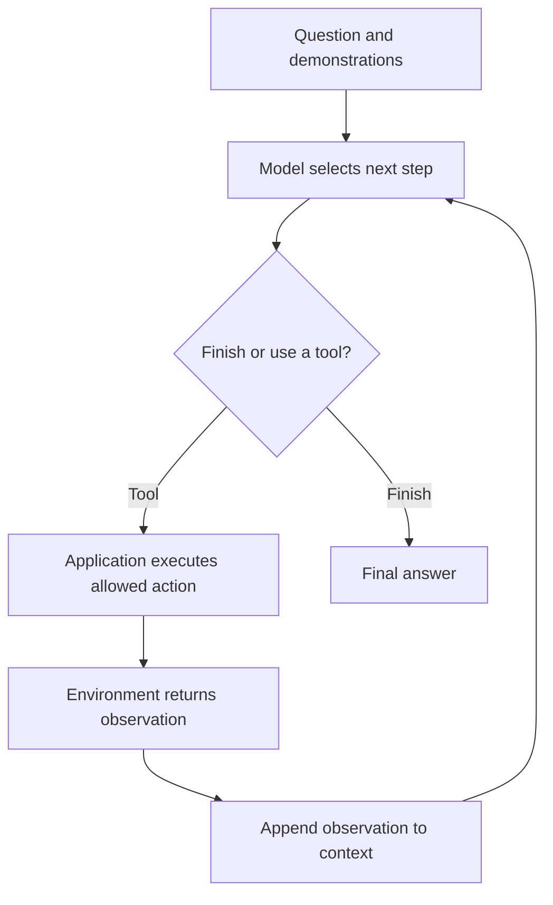

import PaperPdf from '@site/src/components/PaperPdf';

> **Yao et al. · 2022** · [Read the embedded paper](#original-paper) · [Download PDF](/papers/research-papers/react.pdf)


ReAct lets a language model alternate between planning a next step, taking an action and reading the resulting observation.

## The problem: thinking alone cannot inspect the outside world

Consider “Which river crosses the capital of France?” A model might recall Paris and the Seine. But if it does not know, generating a longer explanation does not create new evidence.

A tool can retrieve a page about France. That observation identifies Paris, which determines the next search. The second page supplies the river. The important dependency is **the next action changes because of information returned by the environment**.

A fixed sequence of searches can solve one prepared example. An agent must choose actions based on its current question and observations.

## Section 2: reasoning and actions share one trajectory


*Figure 1 from the original paper, PDF page 2. [Source PDF](/papers/research-papers/react.pdf#page=2).*

The paper extends the usual action/observation interaction with language-based reasoning steps. A reasoning step updates the model's working context; an environment action can retrieve information or change the external state.



The loop contains two sources of text. The model writes its proposed action. The environment supplies the observation. If the model invents the observation, it has not used a tool, even if the transcript visually resembles a tool call.

### The policy sees a history

A compact notation is:

$$
a_t\sim\pi_\theta(\cdot\mid x,o_1,a_1,\ldots,o_t).
$$

The action depends on the question x and the accumulated interaction. For a text-based tool, an action might be `Search[Paris]`. For an embodied environment, it might be opening a container or moving an object.

Reasoning text can describe a plan, track a subgoal, or revise a mistaken assumption. It is still generated text, so it is not guaranteed to be a faithful explanation of all internal computation.

## Four approaches the paper compares

| Approach | Intermediate language reasoning | External actions | Typical weakness |
|---|---|---|---|
| Standard prompting | No explicit intermediate trace | No | Must answer from prompt and parameters |
| Chain-of-thought prompting | Yes | No | Can elaborate a false premise without new evidence |
| Act-only | No explicit reasoning steps | Yes | Can lose track of why an action is useful |
| ReAct | Interleaves reasoning and actions | Yes | Can still choose poor actions or misread results |

The comparison is about the information and interaction available to the model, not a promise that every ReAct run beats every simpler prompt.

## Section 3: knowledge-intensive tasks

For question answering and fact verification, the paper uses a constrained Wikipedia interaction interface. Search finds entities, Lookup locates matching information within a page, and Finish returns an answer. These small action vocabularies make trajectories inspectable.

**Multi-hop QA** needs more than one information link. The first result may identify an entity needed for the second query. **Fact verification** asks whether retrieved evidence supports, refutes, or fails to establish a claim. In both cases, retrieving a document is only part of the work: the model must interpret it correctly.

The paper also studies combinations with chain-of-thought and self-consistency, and fine-tuning from successful trajectories. Self-consistency samples several reasoning attempts and aggregates answers; it costs additional inference and should be compared under an explicit sampling budget.

## Section 4: interactive environments

ALFWorld presents text descriptions of household tasks and actions. WebShop presents a shopping environment with products and user requirements. Here actions change state: opening something, navigating a page, selecting an option.

That distinguishes an observation from a plan. Saying “I will open the cupboard” does not open it. The environment transition must actually happen, and subsequent decisions must use the new state.

The paper's experiments compare success under its demonstrations, models and environment rules. They do not establish unrestricted reliability for arbitrary real-world tools. Error recovery, action validation and stopping conditions remain necessary parts of an application.

## Real-world uses and worked examples

### Documented implementation: LangChain action agents

LangChain's 2023 account of its agent designs explicitly describes its earlier action agents as following the ReAct framework. The model chooses an action, application code executes it, and the result informs the next decision. This is adoption of the interaction pattern, not a claim that every later agent uses the original paper's exact prompt. [LangChain's explanation](https://www.langchain.com/blog/plan-and-execute-agents).

### Worked example: investigate a missing delivery

A user asks, “My parcel has not arrived. What happened?” A read-only assistant could follow this sequence:

| Step | Action or observation | Why another step is needed |
|---|---|---|
| 1 | Look up the order | Find the shipment identifier |
| 2 | Receive a carrier and tracking ID | Tracking requires information from the first result |
| 3 | Query shipment tracking | Obtain the latest delivery event |
| 4 | Receive “address information incomplete” | The answer must reflect the actual event |
| 5 | Explain the problem and available next steps | Stop once there is enough evidence |

This is an illustrative workflow. The important feature is that the tracking call depends on the order lookup's **observation**. Writing both calls into a convincing paragraph would not execute either one.

### Another application: compare products against requirements

A shopping assistant can search for a product, inspect its dimensions and availability, and reject candidates that fail the user's constraints. The paper's WebShop experiments study this kind of interaction in a controlled environment; they are not evidence that the model completed purchases on arbitrary commercial websites. [Original paper, interactive tasks](/papers/research-papers/react.pdf#page=5).

ReAct supplies the feedback loop. The application still defines its allowed actions, handles tool errors and separates checking information from committing an external change. More tool calls are useful only when their observations improve the decision.

## Complete code: a working action/observation runner

**Teaching implementation.** The program provides a local searchable corpus, stateful Lookup, action parsing, observations, a step budget, trace saving and an optional model endpoint. Its default deterministic policy is explicitly a runner test. It does not pretend to be an LLM.

Save as `react.py` and run `python react.py`; this mode uses only Python's standard library. For model-driven action selection, set `REACT_ENDPOINT` to a compatible chat-completions URL and `REACT_MODEL` to the deployed model name. `REACT_API_KEY` is optional for endpoints that require authentication.

```python
"""Complete ReAct runner with real tools and an optional model endpoint.
Default: deterministic test fixture checks the runner, not language reasoning.
For model mode set REACT_ENDPOINT (full chat-completions URL), REACT_MODEL and
optionally REACT_API_KEY. Standard-library HTTP only; tools use a local corpus.
"""
import json
import os
import re
import urllib.request

CORPUS = {
    'France': 'France is a country in Europe. Its capital is Paris.',
    'Paris': 'Paris is the capital of France. The river Seine flows through Paris.',
    'Germany': 'Germany is a country in Europe. Its capital is Berlin.',
    'Berlin': 'Berlin is the capital of Germany. The river Spree flows through Berlin.',
}
SYSTEM = """You answer questions using a local encyclopaedia.
Return a brief next-step plan, then exactly one action in this format:
Plan: <brief next step>
Action: Search[entity] OR Lookup[keyword] OR Finish[answer]
Search opens a page. Lookup finds a sentence on the most recently opened page.
Observations come from the program; do not invent them.
Example:
Question: Which river crosses the capital of Germany?
Plan: Find Germany's capital.
Action: Search[Germany]
Observation: Germany is a country in Europe. Its capital is Berlin.
Plan: Find the river in Berlin.
Action: Search[Berlin]
Observation: Berlin is the capital of Germany. The river Spree flows through Berlin.
Plan: The retrieved page answers the question.
Action: Finish[Spree]
"""

class Environment:
    def __init__(self): self.page = None
    def execute(self, action, argument):
        if action == 'Search':
            self.page = next((k for k in CORPUS if k.lower() == argument.lower()), None)
            return CORPUS[self.page] if self.page else 'Page not found. Available: ' + ', '.join(CORPUS)
        if action == 'Lookup':
            if self.page is None: return 'Open a page using Search first.'
            matches = [s.strip() for s in CORPUS[self.page].split('.') if argument.lower() in s.lower()]
            return '. '.join(matches) or 'No matching sentence on this page.'
        raise ValueError('Unsupported tool')

def model_policy(history):
    payload = json.dumps({'model':os.environ['REACT_MODEL'], 'messages':history,
                          'temperature':0, 'stop':['\nObservation:']}).encode()
    headers = {'Content-Type':'application/json'}
    if os.getenv('REACT_API_KEY'): headers['Authorization'] = 'Bearer '+os.environ['REACT_API_KEY']
    request = urllib.request.Request(os.environ['REACT_ENDPOINT'], data=payload, headers=headers)
    with urllib.request.urlopen(request, timeout=60) as response:
        return json.load(response)['choices'][0]['message']['content']

def fixture_policy(history):
    # Deliberately explicit fixture, used only to test action execution end to end.
    observations = [m['content'] for m in history if m['content'].startswith('Observation:')]
    if not observations: return 'Plan: Find the capital.\nAction: Search[France]'
    if len(observations)==1: return 'Plan: Inspect the capital page.\nAction: Search[Paris]'
    if len(observations)==2: return 'Plan: Locate the river sentence.\nAction: Lookup[river]'
    return 'Plan: Answer from the retrieved sentence.\nAction: Finish[Seine]'

def run(question, policy, max_steps=8):
    environment = Environment()
    history = [{'role':'system','content':SYSTEM}, {'role':'user','content':'Question: '+question}]
    for _ in range(max_steps):
        text = policy(history)
        print(text)
        history.append({'role':'assistant','content':text})
        # Full line parsing prevents executing arbitrary model-written code.
        actions = re.findall(r'^Action: (Search|Lookup|Finish)\[([^\n]*)\]$', text, flags=re.M)
        if len(actions) != 1:
            observation = 'Invalid action. Return exactly one Search, Lookup or Finish action.'
        else:
            action, argument = actions[0]
            if action == 'Finish': return argument, history
            observation = environment.execute(action,argument)
        print('Observation:', observation)
        history.append({'role':'user','content':'Observation: '+observation})
    raise RuntimeError('Step budget exhausted without a final answer')

if __name__ == '__main__':
    policy = model_policy if os.getenv('REACT_ENDPOINT') else fixture_policy
    print('Mode:', 'model' if policy is model_policy else 'deterministic runner test')
    answer, trace = run('Which river crosses the capital of France?',policy)
    print('Answer:',answer)
    if policy is fixture_policy: assert answer=='Seine'
    with open('react-trace.json','w') as file: json.dump(trace,file,indent=2)
```

### Walk through one execution

The initial question asks for a river, but the first useful action searches for the capital. `Environment.execute` opens the France page. The returned observation enters the history as externally supplied information. The next search can now name Paris.

`Lookup` operates on the last opened page rather than searching the entire collection. That small piece of state is why the environment is a class. A lookup before a successful search returns an error observation that the model can use to recover.

The parser accepts exactly one known action with an argument. It never evaluates model output as Python. A malformed action produces feedback, consumes a step, and gives the policy another chance. The maximum-step limit also bounds repeated failed searches.

`Finish` ends the run. The fixture-mode assertion verifies the expected answer; model mode may fail, exhaust its budget or return a wrong answer. A completed loop is not proof of factual correctness.

### Why a fixture is included

A test fixture gives a predictable sequence to check parsing, tool execution and state updates without credentials or model downloads. Switching to `model_policy` changes the decision-maker while preserving the same environment loop. This makes the boundary between the agent policy and application machinery visible.

The example uses concise next-step plans. It does not require a provider to reveal private internal reasoning. Original ReAct uses text-formatted actions; native structured tool calling is another implementation interface, not the definition of ReAct itself.

## How to evaluate an agent run

| Question | Evidence to examine |
|---|---|
| Was the answer correct? | A verified reference or supporting source |
| Did the model actually use the tools? | Program-recorded observations |
| Were actions useful? | Whether each action reduced uncertainty or advanced the task |
| Did it recover from failure? | Behaviour after missing pages or invalid actions |
| What did it cost? | Tool calls, model calls, tokens and elapsed time |

For the paper's prompts and experiments, see the [authors' repository](https://github.com/ysymyth/ReAct). Read the appendix trajectories alongside the benchmark comparisons: they show both useful behaviour and failure modes that an aggregate score can hide.

## The prompting variants, fine-tuning and failure analysis

### Reasoning steps need not occur at a fixed frequency

In knowledge-intensive QA, the demonstrations often alternate a reasoning step, action and observation. Interactive environments can require many routine actions before another substantial plan is useful. The paper allows task-dependent placement of reasoning rather than requiring a long explanation before every action.

The language reasoning step changes the model's context, while a tool action changes or observes the environment. This distinction matters when reading trajectories: “I should search the bedroom” is not evidence that the bedroom was searched.

### Combining external search with self-consistency

The paper studies two fallback strategies. If a ReAct run fails to finish within its step budget, a chain-of-thought self-consistency procedure can attempt an answer. Conversely, if independently sampled reasoning answers disagree sufficiently, the system can fall back to ReAct to seek external evidence.

Self-consistency aggregates several sampled answers. Agreement is useful evidence about consistency among those samples, not proof that the majority is correct. The comparison must include the extra sampling and tool-call budget.

The v1 PDF repeats the same arrow label for both fallback bullets; their descriptions and result discussion distinguish the two directions. Reading the described control flow avoids interpreting this typographical inconsistency as two identical algorithms.

### Smaller models were also fine-tuned on trajectories

The paper does more than prompt a large model. It collects successful generated trajectories and uses them to fine-tune smaller models. A trajectory contains the question and intermediate reasoning/action/observation sequence, not merely the final answer.

This tests whether interaction behaviour can be learned through supervised examples. It is different from online reinforcement learning in the environment. The reported improvement also does not mean that every successful-answer trajectory contains flawless intermediate reasoning.

### What the comparisons actually show

The QA results are mixed: ReAct improves over action-only behaviour, but it does not beat reasoning-only prompting on every task. The combination strategies can benefit from both internal model knowledge and retrieved evidence. On the interactive tasks, reasoning helps with planning, tracking progress and adapting actions to observations.

**ReAct-IM** is an ablation that limits reasoning to an initial plan. Comparing it with reasoning interleaved during interaction asks whether revising a plan after observations is useful. A plan formed before opening any cupboards may need to change when an expected object is missing.

| Failure pattern | What it looks like | Why final-answer accuracy can hide it |
|---|---|---|
| Retrieval failure | Search opens an irrelevant or ambiguous entity | A model might still guess the right final answer |
| Reasoning failure | Useful evidence is found but combined incorrectly | Tool calls succeeded even though the answer is wrong |
| Repeated action loop | The same unhelpful query is retried | A trace can look busy without gaining information |
| State-tracking failure | The model assumes an object was moved or cleaned | Later actions rely on a state that never existed |
| Unsupported success | The final answer happens to match without valid support | Exact match alone does not verify the explanation |

The appendix's trajectories and failure analysis therefore add information that a single success-rate number cannot convey. The application should record actual observations and evaluate both outcome and interaction quality. [Original paper, Sections 3–4 and Appendices A–D](/papers/research-papers/react.pdf).

## Summary and self-check

- [ ] I can distinguish a model-written action from an environment observation.
- [ ] I can explain why multi-hop retrieval needs state and feedback.
- [ ] I can compare standard, reasoning-only, action-only and ReAct prompting.
- [ ] I can replace the fixture policy with a model while keeping the tool runner intact.
- [ ] I can identify a fabricated observation or an unbounded action loop.
- [ ] I can evaluate answer quality separately from successful tool execution.


## Original paper

<PaperPdf slug="react" title="ReAct: Synergizing Reasoning and Acting in Language Models" />
