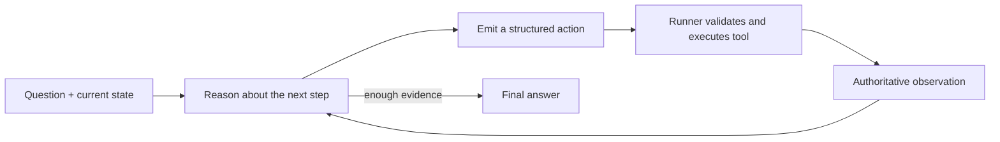
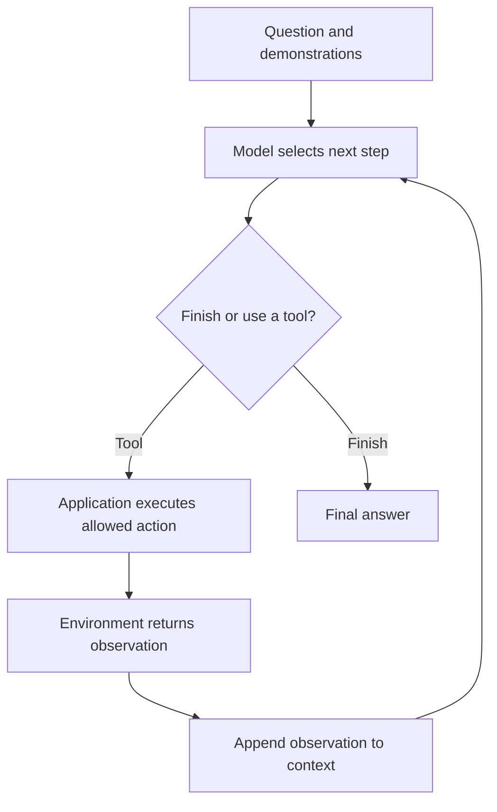

import PaperPdf from '@site/src/components/PaperPdf';
import CodeWalkthrough from '@site/src/components/viz/CodeWalkthrough';
import ResearchPaperLab from '@site/src/components/viz/ResearchPaperLab';

> **Yao et al. · 2022** · [Read the embedded paper](#original-paper) ·
> [Download PDF](/papers/research-papers/react.pdf) · Notes follow the paper
> section by section, §1 to the appendix.

## Paper in one minute

**Problem.** Reasoning only inside a model cannot obtain missing current facts or
change an environment, while action-only agents can lose track of why a tool is
being used.

**Key idea.** Interleave model-generated reasoning and actions with observations
returned by a real environment, allowing later decisions to respond to evidence
and failed attempts.

**Why it matters.** ReAct supplies a simple pattern for tool-using agents and
inspectable trajectories. The runner must still enforce permissions, validate
actions, bound loops and distinguish real observations from model-authored text.

### Agent interaction loop



## How to read this chapter

The walkthrough below follows the paper **in its own order**, from the abstract
to the appendix. Each heading carries the paper's section number, so you can
keep the PDF open beside it.

You do not need to have read a research paper before. Every new term is
explained the first time it appears, and each formula comes after the idea it
expresses. Boxes marked **not from the paper** are extra help, such as
analogies, real-world examples or worked numbers.

This chapter follows **arXiv version 1** (October 2022), which is the PDF
embedded at the end. Later versions add experiments; where that matters, a note
says so.

## Abstract: the four claims

A **large language model (LLM)** can do two useful things that earlier work
studied separately. It can **reason**, writing out steps of thought before an
answer (as in chain-of-thought prompting). And it can **act**, producing
commands for a tool or environment. The paper's idea, **ReAct** (Reason + Act),
is to let the model do both, **interleaved**, in one stream of text. The
abstract makes four claims:

1. **The two help each other.** Reasoning helps the model make, track and update
   a plan, and handle surprises. Acting lets it fetch information from outside,
   such as a knowledge base or an environment.
2. **Fewer made-up facts on knowledge tasks.** On question answering
   (**HotpotQA**) and fact checking (**FEVER**), ReAct uses a simple Wikipedia
   API to avoid the **hallucination** (stating false facts) and **error
   propagation** (one early mistake spoiling the rest) that chain-of-thought
   suffers from.
3. **Big wins on interactive tasks.** On two decision-making benchmarks,
   **ALFWorld** (a text-based household game) and **WebShop** (a simulated
   shopping website), ReAct beats imitation-learning and reinforcement-learning
   methods by an absolute **34%** and **10%** in success rate, with only one or
   two examples in its prompt.
4. **Easier to inspect.** Its step-by-step traces are more interpretable and
   trustworthy for people than those of methods without reasoning.

§3 tests the knowledge tasks, §4 the interactive tasks.

:::note Where the 34% and 10% come from

The **34%** is ReAct's **best** of six prompts (71%) minus BUTLER's best of
eight (37%) on ALFWorld (Table 3). ReAct's **average** over its six prompts is
57%, which is 20 points above BUTLER. The **10%** on WebShop is ReAct's 40.0%
success rate against 29.1% for the imitation-learning method, the best earlier
result (Table 4). Both numbers are correct, but the ALFWorld one depends on
picking the best prompt.

:::

## §1 Introduction: people think and act at the same time

The paper opens with cooking. Between two actions, we reason in our heads, and
that reasoning does three jobs:

- **Track progress:** "now that everything is cut, I should heat up the pot of
  water".
- **Handle exceptions:** "I don't have salt, so let me use soy sauce and pepper
  instead".
- **Notice when information is missing:** "how do I prepare dough? Let me
  search on the Internet".

We also act to help our reasoning, by opening a cookbook or checking the fridge.
The paper argues this tight loop between acting and reasoning is what lets
people learn new tasks quickly and cope with the unexpected.

:::tip Intuition: thinking alone cannot inspect the outside world (not from the paper)

Consider "Which river crosses the capital of France?" A model might recall Paris
and the Seine. But if it does not know, generating a longer explanation does not
create new evidence.

A tool can retrieve a page about France. That observation identifies Paris,
which determines the next search. The second page supplies the river. The
important dependency is **the next action changes because of information
returned by the environment**.

A fixed sequence of searches can solve one prepared example. An agent must
choose actions based on its current question and observations.

:::

**What was missing.** **Chain-of-thought (CoT)** prompting, where the model is
shown worked examples and writes its reasoning before answering, had shown that
LLMs can reason in several steps. But the paper calls it "a static black box":
the model reasons only from its own memory, not grounded in the outside world.
That leads to made-up facts and error propagation.

Other work used LLMs to **act**: to plan and choose actions in interactive
environments. But those systems mostly predict actions directly and do not
reason about high-level goals or keep a working memory. No study had combined
reasoning and acting in a general way, or shown whether the combination beats
either alone.

**ReAct** prompts an LLM to write both reasoning and actions, interleaved. The
paper names the two directions of help:

- **Reason to act:** reasoning creates, maintains and adjusts the plan.
- **Act to reason:** actions bring in outside information (for example from
  Wikipedia) for the reasoning to use.


_Figure 1 from the original paper, PDF page 2.
[Source PDF](/papers/research-papers/react.pdf#page=2)._

Figure 1 shows the idea on two tasks.

**(1) A HotpotQA question:** "Aside from the Apple Remote, what other device can
control the program Apple Remote was originally designed to interact with?"

| Method           | What it does                                                                     | Answer                        |
| ---------------- | -------------------------------------------------------------------------------- | ----------------------------- |
| (a) Standard     | Answers directly                                                                 | iPod (wrong)                  |
| (b) CoT          | Reasons that the Remote was made for Apple TV, which iPhones and iPads control   | iPhone, iPad, iPod Touch (wrong) |
| (c) Act-only     | Searches Apple Remote, then Front Row, then Front Row (software)                  | "yes" (cannot combine what it found) |
| (d) ReAct        | Thinks, searches, learns the Remote was for **Front Row**, retries the search, reads the result | keyboard function keys (right) |

CoT's mistake is a **hallucinated fact**: the Apple Remote was designed for Front
Row, not Apple TV. Act-only found the right pages but could not reason its way
to the answer.

**(2) An ALFWorld task:** "Put some pepper shaker on a drawer". Act-only goes to
the sink basin, tries "take peppershaker from sinkbasin", gets "Nothing
happens", and repeats the same action. ReAct first thinks that a pepper shaker
is more likely to be in cabinets or on countertops, checks them in turn, finds
it, then thinks "Now I find a pepper shaker. Next, I need to put it in/on
drawer".

The introduction also previews the results. On HotpotQA and FEVER, ReAct beats
acting alone and is **competitive with** CoT; the best method overall combines
ReAct and CoT. On ALFWorld and WebShop, ReAct with one or two examples beats
imitation or reinforcement learning methods trained on $10^3$ to $10^5$ task
instances. The authors add that ReAct traces let people tell apart what came
from the model's memory and what came from the environment.

The paper's four contributions are: (1) ReAct as a prompting method; (2)
experiments on four diverse benchmarks; (3) ablations (experiments that remove
one part) on why acting helps reasoning and reasoning helps acting; and (4) an
analysis of ReAct's limits with prompting alone, plus early fine-tuning results.

:::tip In the real world (not from the paper)

AI coding assistants follow this loop every day. They run the tests, read the
error message, decide what to change, edit a file and run the tests again. Each
step depends on what the last command actually printed, just like ReAct's
second search depends on its first.

:::

## §2 ReAct: synergizing reasoning + acting

**The standard agent set-up.** An **agent** is a program that interacts with an
environment step by step. At time step $t$ it receives an **observation**
$o_t\in\mathcal{O}$ from the environment and takes an **action**
$a_t\in\mathcal{A}$, following a **policy** $\pi(a_t\mid c_t)$: a rule for
choosing the action. The **context** $c_t$ is everything so far:

$$
c_t=(o_1,a_1,\cdots,o_{t-1},a_{t-1},o_t).
$$

In words: the agent sees the whole history of observations and its own actions,
and picks the next action from it.

The action depends on the question and the accumulated interaction. For a
text-based tool, an action might be `Search[Paris]`. For an embodied
environment, it might be opening a container or moving an object.

**The problem.** When the step from context to action "is highly implicit and
requires extensive computation", a policy struggles. Figure 1(1c) is the
example: the Act-only agent has all the facts it needs after three searches, but
cannot produce the right final action, because that needs reasoning over
everything it has seen. In Figure 1(2a), the agent fails to notice that the sink
basin does not contain the pepper shaker, and keeps producing impossible actions.

**The idea.** ReAct adds language to the list of things the agent may do. The
new action space is

$$
\hat{\mathcal{A}}=\mathcal{A}\cup\mathcal{L},
$$

where $\mathcal{L}$ is the **space of language**: any text at all. In words: at
each step the agent may either act in the environment or write a thought.

An action $\hat a_t\in\mathcal{L}$ is called a **thought** or **reasoning
trace**. A thought **does not change the environment**, so no observation comes
back. Instead it reasons over the current context and adds itself to it:

$$
c_{t+1}=(c_t,\hat a_t).
$$

In words: a thought is a note to self that later steps can read.

The paper lists useful kinds of thought, with examples in Figure 1:

| Kind of thought                        | Example role                                        |
| -------------------------------------- | --------------------------------------------------- |
| Decompose the goal and make a plan     | "I need to search x, find y, then find z"          |
| Inject commonsense knowledge           | A pepper shaker is likely in a cabinet             |
| Extract the important part of an observation | "The Apple Remote was designed for Front Row" |
| Track progress and move to the next step | "Now I find a pepper shaker. Next, …"            |
| Handle exceptions and adjust the plan  | "Front Row is not found. I need to search Front Row (software)" |



The loop contains two sources of text. The model writes its proposed action. The
environment supplies the observation. If the model invents the observation, it
has not used a tool, even if the transcript visually resembles a tool call.

**Why prompting, not training.** Because $\mathcal{L}$ is unlimited, learning a
policy over it is hard and needs strong language knowledge. So the paper mainly
uses a **frozen** LLM, **PaLM-540B** (Google's 540-billion-parameter model), and
simply **prompts** it with a few in-context examples. "Frozen" means its weights
are never changed. Each example is a human-written trajectory of actions,
thoughts and observations for one task (Appendix A).

**How often to think.** This depends on the task:

- For **reasoning-heavy tasks** (Figure 1(1)), thoughts and actions alternate,
  so the trajectory is a series of thought, action, observation steps. The paper
  calls this **dense** thought.
- For **decision-making tasks** with many actions (Figure 1(2)), thoughts only
  need to appear **sparsely**, at the most useful points. The model decides for
  itself when to think.

Interactive environments can require many routine actions before another
substantial plan is useful. So the paper allows task-dependent placement of
reasoning rather than requiring a long explanation before every action.

The language reasoning step changes the model's context, while a tool action
changes or observes the environment. This distinction matters when reading
trajectories: "I should search the bedroom" is not evidence that the bedroom was
searched.

**Four claimed features.** The paper says ReAct is:

1. **Intuitive and easy to design:** annotators simply write down their thoughts
   next to their actions. "No ad-hoc format choice, thought design, or example
   selection is used in this paper."
2. **General and flexible:** it works for tasks with very different action
   spaces and reasoning needs.
3. **Performant and robust:** it generalises from one to six examples and beats
   reasoning-only and acting-only baselines.
4. **Human aligned and controllable:** people can inspect the reasoning and
   correct the agent by **editing its thoughts** (Figure 4, §4).

:::note Interpretability is claimed, not measured

The claims that ReAct is more "interpretable" and "trustworthy" rest on example
trajectories and the authors' reading of them. The paper runs no user study
measuring whether people actually trust or understand ReAct traces better. It
also does not test whether a thought faithfully describes why the model chose
its next action. Reasoning text is still generated text, so it is not guaranteed
to be a faithful explanation of all internal computation.

:::

## §3 Knowledge-intensive reasoning tasks

This section tests ReAct on tasks that need facts: multi-hop question answering
and fact verification. With a Wikipedia API, reasoning decides **what** to look
up, and looking up supplies the facts for reasoning.

### §3.1 Setup

**Domains.** Two datasets:

- **HotpotQA** is **multi-hop question answering**: answering needs facts from
  two or more Wikipedia passages. The first result may identify an entity needed
  for the second query.
- **FEVER** is **fact verification**: each claim is labelled SUPPORTS, REFUTES or
  NOT ENOUGH INFO, depending on whether a Wikipedia passage verifies it.

Both are run **question-only**: the model gets just the question or claim, with
no supporting paragraphs. It must use its own memory or retrieve facts by
interacting with the environment. In both cases, retrieving a document is only
part of the work; the model must interpret it correctly.

**Action space.** A deliberately simple Wikipedia web API with three actions:

| Action             | What it does                                                                        |
| ------------------ | ----------------------------------------------------------------------------------- |
| `search[entity]`   | Returns the first 5 sentences of that entity's page, or else the top 5 similar entity names |
| `lookup[string]`   | Returns the next sentence on the current page containing the string, like Ctrl+F in a browser |
| `finish[answer]`   | Ends the task with this answer                                                      |

The paper admits this can only reach small parts of a page by exact name, and is
"significantly weaker than state-of-the-art lexical or neural retrievers". That
is the point: it simulates how a person would use Wikipedia and forces the model
to **reason in language about what to retrieve**. The small action vocabulary
also makes trajectories easy to inspect.

:::tip In the real world (not from the paper)

Chat assistants with a web-search tool work the same way. They search, read a
snippet, notice it does not answer the question, and search again with better
words. `lookup` is exactly what you do with Ctrl+F on a long page.

:::

### §3.2 Methods

**ReAct prompting.** The authors picked **6** HotpotQA and **3** FEVER training
examples at random and wrote ReAct trajectories for them by hand. Footnote 1:
more examples did not help. Each trajectory uses **dense** thoughts for many
purposes: breaking down the question ("I need to search x, find y, then find
z"), pulling facts from observations ("x was started in 1844"), commonsense
("x is not y, so z must instead be..."), arithmetic (`1844 < 1989`), rephrasing
a search ("maybe I can search/look up x instead") and giving the answer ("...so
the answer is x").

Here is one of the six HotpotQA examples, from Appendix A.1, lightly shortened:

```text
Question: Musician and satirist Allie Goertz wrote a song about the "The Simpsons"
          character Milhouse, who Matt Groening named after who?
Thought 1: The question simplifies to "The Simpsons" character Milhouse is named
           after who. I only need to search Milhouse and find who it is named after.
Action 1: Search[Milhouse]
Observation 1: Milhouse Mussolini Van Houten is a recurring character in the Fox
               animated television series The Simpsons ...
Thought 2: The paragraph does not tell who Milhouse is named after, maybe I can
           look up "named after".
Action 2: Lookup[named after]
Observation 2: (Result 1 / 1) Milhouse was named after U.S. president Richard Nixon,
               whose middle name was Milhous.
Thought 3: Milhouse was named after U.S. president Richard Nixon, so the answer is
           Richard Nixon.
Action 3: Finish[Richard Nixon]
```

Notice the three thought types: simplify the question, notice the first page is
not enough and choose `Lookup`, then state the answer from the evidence.

**Baselines.** The baselines are made by **deleting parts of the ReAct
trajectories**, so every method sees the same examples:

- **Standard** prompting removes thoughts, actions and observations: question,
  then answer.
- **CoT** removes actions and observations: reasoning only.
- **CoT-SC** (**self-consistency**) samples 21 CoT answers at temperature 0.7 and
  takes the majority. **Temperature** controls randomness; above 0 the model
  gives different answers each time. This consistently beats plain CoT.
- **Act** removes the thoughts: acting only, loosely like WebGPT, which answers
  questions by browsing but was trained with imitation and reinforcement
  learning rather than prompted.

| Approach                   | Intermediate language reasoning   | External actions | Typical weakness                                   |
| -------------------------- | --------------------------------- | ---------------- | -------------------------------------------------- |
| Standard prompting         | No explicit intermediate trace    | No               | Must answer from prompt and parameters             |
| Chain-of-thought prompting | Yes                               | No               | Can elaborate a false premise without new evidence |
| CoT-SC                     | Yes, 21 sampled traces, majority vote | No           | Costs 21 model calls; agreement is not truth       |
| Act-only                   | No explicit reasoning steps       | Yes              | Can lose track of why an action is useful          |
| ReAct                      | Interleaves reasoning and actions | Yes              | Can still choose poor actions or misread results   |

The comparison is about the information and interaction available to the model,
not a promise that every ReAct run beats every simpler prompt.

**Combining internal and external knowledge.** Early results (§3.3) showed ReAct
is more **factual and grounded**, while CoT is better at **structuring
reasoning** but prone to made-up facts. So the paper combines them, letting the
model switch with two simple rules:

- **ReAct → CoT-SC:** if ReAct gives no answer within a set number of steps,
  fall back to CoT-SC. The limits are **7 steps for HotpotQA and 5 for FEVER**;
  more steps did not help ReAct.
- **CoT-SC → ReAct:** if the most common answer among $n$ CoT-SC samples appears
  fewer than $n/2$ times, fall back to ReAct. Disagreement suggests the model's
  memory does not support the task.

:::tip Worked number (not from the paper)

With $n=21$ samples, $n/2=10.5$. If the top answer appears 11 or more times,
CoT-SC keeps it. If it appears 10 times or fewer, the samples are too divided,
and the system switches to ReAct to look the facts up.

:::

Self-consistency aggregates several sampled answers. Agreement is useful
evidence about consistency among those samples, not proof that the majority is
correct. Any comparison must include the extra sampling and tool-call budget.

:::note The paper prints the same arrow twice

In arXiv v1, **both** rules are labelled "ReAct → CoT-SC". Their descriptions,
and the rows of Table 1, make clear the second one is **CoT-SC → ReAct**.
Reading the described control flow avoids mistaking this typo for two identical
algorithms.

:::

**Fine-tuning.** Writing reasoning traces by hand does not scale, so the paper
also tries a **bootstrapping** approach, like STaR (Zelikman et al., 2022). It
collects **3,000 trajectories with correct answers** generated by ReAct (and by
the other methods, for their baselines), and fine-tunes smaller models,
**PaLM-8B and PaLM-62B**, to produce whole trajectories (thoughts, actions and
observations) from the question. Details are in Appendix D.

A trajectory contains the question and the intermediate
reasoning/action/observation sequence, not merely the final answer. So this
tests whether interaction behaviour can be learned from supervised examples. It
is different from online reinforcement learning in the environment. And a
trajectory with a correct final answer need not contain flawless intermediate
reasoning.

:::tip In the real world (not from the paper)

The two fallback rules are a pattern product teams use for cost control, as an
illustration. Answer from the model's memory when several samples agree, and
only call the slower, more expensive search tool when they do not. Or the
reverse: try the tool-using agent first and fall back to a plain answer if it
runs out of steps.

:::

### §3.3 Results and observations

The main results, using PaLM-540B (Table 1). HotpotQA is scored by **exact match
(EM)**, the share of answers that match the reference exactly; FEVER by
**accuracy (Acc)**:

| Method                 | HotpotQA (EM) | FEVER (Acc) |
| ---------------------- | ------------- | ----------- |
| Standard               | 28.7          | 57.1        |
| CoT                    | 29.4          | 56.3        |
| Act                    | 25.7          | 58.9        |
| ReAct                  | 27.4          | 60.9        |
| Best combination       | **35.1** (ReAct → CoT-SC) | **64.6** (CoT-SC → ReAct) |

What this shows: ReAct beats acting alone on both tasks and beats CoT on FEVER,
but not on HotpotQA. Combining ReAct with self-consistency is best on both.

<details>
<summary>Full Table 1 from the paper</summary>

| Prompt method   | HotpotQA (EM) | FEVER (Acc) |
| --------------- | ------------- | ----------- |
| Standard        | 28.7          | 57.1        |
| CoT             | 29.4          | 56.3        |
| CoT-SC          | 33.4          | 60.4        |
| Act             | 25.7          | 58.9        |
| ReAct           | 27.4          | 60.9        |
| CoT-SC → ReAct  | 34.2          | 64.6        |
| ReAct → CoT-SC  | 35.1          | 62.0        |
| Supervised SoTA | 67.5          | 89.5        |

Footnote a: Wang et al. (2022b) report HotpotQA EM of 27.1, 28.9 and 33.8 for
Standard, CoT and CoT-SC. "Supervised SoTA" is the best specially trained model
for each task (Zhu et al., 2021; Lewis et al., 2020).

</details>

The paper's reading:

**ReAct beats Act consistently.** Reasoning helps guide acting, especially for
combining the facts into a final answer, as in Figure 1(1c–d). The fine-tuning
results agree.

**ReAct against CoT.** ReAct wins on FEVER (60.9 against 56.3) and trails
slightly on HotpotQA (27.4 against 29.4). FEVER claims labelled SUPPORTS and
REFUTES can differ only slightly (Appendix B.1), so retrieving accurate facts
matters a lot there.

To understand the HotpotQA difference, the authors hand-labelled **50 correct
and 50 incorrect** trajectories from each of ReAct and CoT, 200 in all (Table 2):

| Type    | Mode               | Definition                                          | ReAct | CoT |
| ------- | ------------------ | --------------------------------------------------- | ----- | --- |
| Success | True positive      | Correct reasoning trace and facts                   | 94%   | 86% |
| Success | False positive     | Hallucinated reasoning trace or facts               | 6%    | 14% |
| Failure | Reasoning error    | Wrong reasoning trace, including repetitive loops   | 47%   | 16% |
| Failure | Search result error | Search returns nothing or nothing useful           | 23%   | –   |
| Failure | Hallucination      | Hallucinated reasoning trace or facts               | 0%    | 56% |
| Failure | Label ambiguity    | Right prediction but did not match the label exactly | 29%  | 28% |

What this shows: CoT's main problem is **making things up**, even when it gets
the answer right. ReAct's main problems are **getting stuck in its reasoning**
and **bad search results**. ReAct never failed by hallucinating.

Three observations from the paper:

- **Hallucination is serious for CoT.** It causes a much higher false-positive
  rate (14% against 6%), right answers reached through made-up facts, and is
  CoT's biggest failure mode (56%). ReAct's trajectories are more grounded,
  thanks to the external knowledge base.
- **Structure costs flexibility.** Interleaving reasoning, actions and
  observations makes ReAct more grounded but less flexible in how it reasons,
  giving more reasoning errors than CoT. One ReAct-specific pattern is repeating
  the previous thought and action in a loop. Footnote 2 suspects greedy decoding
  (always taking the most likely token) and suggests better decoding such as
  beam search might help; this is not tested.
- **Search quality is critical.** Uninformative search results, 23% of the error
  cases, derail the model's thinking, and it struggles to recover. The paper
  calls this "an expected trade-off between factuality and flexibility", which
  motivated the combined methods.

:::tip Worked number (not from the paper)

Each column is out of 50 trajectories, so 6% means **3** of ReAct's 50 correct
answers and 14% means **7** of CoT's. That is a small sample, so treat the
percentages as rough. ReAct's four failure rows add up to 99%, from rounding.

:::

**ReAct + CoT-SC works best for prompting.** ReAct → CoT-SC is best on HotpotQA
and CoT-SC → ReAct is best on FEVER. Figure 2 plots results against the number
of CoT-SC samples. Both combinations beat CoT-SC at every sample count, and
reach the accuracy of CoT-SC with 21 samples using **only 3 to 5 samples**. The
combination strategies benefit from both internal model knowledge and retrieved
evidence.

**ReAct works best for fine-tuning.** Figure 3 shows prompting and fine-tuning
results for the four methods on HotpotQA:

- **Prompted**, ReAct is the **worst** of the four with PaLM-8B and PaLM-62B,
  because small models struggle to learn both reasoning and acting from a few
  examples.
- **Fine-tuned on just 3,000 examples**, ReAct becomes the **best**. Fine-tuned
  PaLM-8B ReAct beats every prompted PaLM-62B method, and fine-tuned PaLM-62B
  ReAct beats every prompted 540B method.
- Fine-tuning Standard or CoT is much worse than fine-tuning ReAct or Act. The
  paper's explanation: the first two teach the model to **memorise** (possibly
  hallucinated) facts; the second two teach it **how to find information**, a
  skill that generalises.

The QA results are mixed: ReAct improves over action-only behaviour, but it does
not beat reasoning-only prompting on every task.

:::note Two gaps in the evidence

The fine-tuning results are given only as a plot (Figure 3), without numbers in
the text, so this chapter does not reproduce them. And every prompting method in
Table 1 is still far below the specially trained state of the art (67.5 EM and
89.5 accuracy). The authors themselves suggest that fine-tuning on more
human-written data is the way to unlock ReAct's potential.

:::

## §4 Decision making tasks

Next the paper tests ReAct on two interactive, text-based decision-making tasks.
Both need many actions over a **long horizon** (many steps) with **sparse
rewards** (feedback only at the end), which is where reasoning should help most.

Here actions change state: opening something, navigating a page, selecting an
option. That distinguishes an observation from a plan. Saying "I will open the
cupboard" does not open it. The environment transition must actually happen, and
later decisions must use the new state.

**ALFWorld.** A synthetic text game matched to the ALFRED household-robot
benchmark. There are **6 task types**, each with a high-level goal (for example
"examine paper under desklamp"), achieved with text actions such as "go to
coffeetable 1", "take paper 2" and "use desklamp 1". One game can have **more
than 50 locations** and take an expert **more than 50 steps**, so the agent must
plan, track sub-goals and search systematically. It also rewards commonsense:
desk lamps are likely on desks, shelves or dressers.

- **Prompts:** for each task type, three training trajectories were annotated
  with sparse thoughts that (1) break down the goal, (2) track sub-goal
  completion, (3) decide the next sub-goal, and (4) use commonsense to find
  objects and decide what to do with them.
- **Evaluation:** 134 unseen games. For robustness, **6 prompts** per task type
  are built from every ordered pair of 2 of the 3 annotated trajectories.
- **Fair baseline:** Act prompts use the **same trajectories with the thoughts
  removed**, a controlled test of what the thoughts add.
- **Trained baseline:** BUTLER, an imitation-learning agent trained on $10^5$
  expert trajectories for each task type.

:::tip Worked number (not from the paper)

Choosing an ordered pair from 3 trajectories gives $3\times2=6$ prompts, which is
where "best of 6" and "average of 6" in Table 3 come from.

:::

**WebShop.** A simulated online shop with **1.18 million real products** and
**12,000 human instructions**. Product titles, descriptions and options were
crawled from Amazon, so the text is noisy and varied. The agent must buy a
product that matches an instruction such as "I am looking for a nightstand with
drawers. It should have a nickel finish, and priced lower than \$140", by
searching and clicking options such as "color: modern-nickel-white" or "back to
search".

- **Metrics** on 500 test instructions: **average score**, the share of the
  desired attributes the chosen product covers, and **success rate**, the share
  of episodes where the product meets every requirement.
- **Prompts:** Act can search, choose a product, choose options and buy. ReAct
  also reasons about what to explore, when to buy and which options matter.
- **Baselines:** imitation learning (IL) on 1,012 human trajectories, and
  imitation plus reinforcement learning (IL+RL) with 10,587 further training
  instructions.

**Results.** ReAct beats Act on both. ALFWorld success rates (Table 3,
all task types):

| Method               | Success, all tasks |
| -------------------- | ------------------ |
| Act (best of 6)      | 45%                |
| ReAct (average)      | 57%                |
| ReAct (best of 6)    | **71%**            |
| ReAct-IM (best of 6) | 53%                |
| BUTLER (best of 8)   | 37%                |

What this shows: adding sparse thoughts to the same examples raises success
from 45% to 71%, and even ReAct's average beats a system trained on 100,000
expert trajectories per task type.

<details>
<summary>Full Table 3 from the paper</summary>

Success rates (%) by task type. All methods use greedy decoding except BUTLER,
which uses beam search. BUTLER's results are from Table 4 of Shridhar et al.
(2020b).

| Method               | Pick | Clean | Heat | Cool | Look | Pick 2 | All |
| -------------------- | ---- | ----- | ---- | ---- | ---- | ------ | --- |
| Act (best of 6)      | 88   | 42    | 74   | 67   | 72   | 41     | 45  |
| ReAct (avg)          | 65   | 39    | 83   | 76   | 55   | 24     | 57  |
| ReAct (best of 6)    | 92   | 58    | 96   | 86   | 78   | 41     | 71  |
| ReAct-IM (avg)       | 55   | 59    | 60   | 55   | 23   | 24     | 48  |
| ReAct-IM (best of 6) | 62   | 68    | 87   | 57   | 39   | 33     | 53  |
| BUTLERg (best of 8)  | 33   | 26    | 70   | 76   | 17   | 12     | 22  |
| BUTLER (best of 8)   | 46   | 39    | 74   | 100  | 22   | 24     | 37  |

</details>

The paper's reading of ALFWorld:

- The best ReAct trial (71%) clearly beats the best Act (45%) and BUTLER (37%).
- Even the **worst** ReAct trial (48%) beats the best of both.
- ReAct's advantage over Act holds in all six controlled trials, with relative
  gains from 33% to 90%, averaging 62%.
- Without thoughts, Act fails to break goals into sub-goals or loses track of
  the environment's state (Appendix B.2).

:::note Read "best of 6" carefully

"Best of 6" picks the best of six prompts **after** seeing test results, which
flatters every method that uses it. Per task type, Act's best-of-6 even beats
ReAct's **average** on Pick (88 against 65), Clean, Look and Pick 2. Comparing
like with like, ReAct's best of 6 beats Act's best of 6 on five task types and
ties on Pick 2 (41 each). The worst-trial figure (48%) and the per-trial
relative gains are not in Table 3, so they cannot be checked from the table.

:::

WebShop results (Table 4):

| Method        | Average score | Success rate |
| ------------- | ------------- | ------------ |
| Act           | 62.3          | 30.1         |
| ReAct         | 66.6          | **40.0**     |
| IL            | 59.9          | 29.1         |
| IL+RL         | 62.4          | 28.7         |
| Human expert  | 82.1          | 59.6         |

What this shows: one-shot Act already matches the trained IL and IL+RL agents.
Adding reasoning lifts success by about 10 points, but expert humans are still
far ahead.

The paper's reading: ReAct is better at finding products and options relevant
to the instruction, by reasoning across the gap between noisy observations and
actions. Its example thought: "For 'space-saving ottoman bench for living room',
the item has options '39x18x18inch' and 'blue' and seems good to buy." Expert
humans explore far more products and reformulate searches more, which prompting
methods still find hard.

The paper's experiments compare success under its demonstrations, models and
environment rules. They do not establish unrestricted reliability for arbitrary
real-world tools. Error recovery, action validation and stopping conditions
remain necessary parts of an application.

**Internal reasoning against external feedback.** The closest earlier work is
**Inner Monologue (IM)** (Huang et al., 2022b), where a robot's actions are
driven by an "inner monologue". But IM's monologue is really **dense feedback
from the environment**: descriptions of the current state and what remains to be
done. ReAct's thoughts are different in three ways:

1. **Free-form:** they can say anything, so human-written examples can teach
   specific strategies.
2. **Abstract and diverse:** memory, strategy and error recovery.
3. **Sparse:** the model decides when to think, which keeps its input history
   uncluttered.

To test this, the authors built **ReAct-IM**: the same three trajectories,
re-annotated with IM-style dense feedback thoughts that only (1) break down the
current goal and (2) state the current sub-goal. ReAct-IM has **no** thoughts
that decide when a sub-goal is done, choose the next sub-goal, or use
pre-trained commonsense to guess where objects are.

ReAct beats ReAct-IM by a wide margin (71 against 53 best-of-6 overall), and on
five of six task types. Qualitatively, ReAct-IM often misjudged when a sub-goal
was finished or what came next, because it lacked high-level goal breakdown, and
struggled to guess where items would be, because it lacked commonsense
reasoning.

:::tip Intuition: why the missing thoughts matter (not from the paper)

A plan formed before opening any cupboards may need to change when an expected
object is missing. ReAct-IM can restate its current sub-goal but cannot write
"that sub-goal is done, now I need the next one" or "knives are usually on
countertops". Those are exactly the thoughts that let an agent revise a plan
after new observations.

:::

**Human-in-the-loop correction.** Figure 4 shows a person **editing ReAct's
thoughts** mid-task. The task is to put two keychains in a safe. In (a), after
putting the first keychain away, ReAct thinks "I can directly go to drawer 1"
for the second one, a hallucinated belief, and fails. In (b), a person deletes
that sentence (Act 17) and adds a hint (Act 23) that the second keychain is more
likely in a dresser, garbage can, safe, side table, sofa or shelf. ReAct then
goes to the dresser, finds it and finishes.

Editing two thoughts replaces typing dozens of actions. The paper notes this is
hard for Act or RL agents, since a person cannot change their weights, and
changing a few actions may not change the rest of their behaviour. It leaves a
systematic study to future work.

:::tip In the real world (not from the paper)

A shopping assistant, as an illustration, can search for a product, inspect its
dimensions and price, and reject candidates that miss the user's constraints,
the WebShop loop. The thought-editing idea also appears in products that show
the agent's plan first and let the user correct it before anything runs.

:::

## §5 Related work

**Language models for reasoning.** Chain-of-thought (Wei et al., 2022) showed
LLMs can write their own "thinking procedure". Follow-ups include least-to-most
prompting, zero-shot CoT ("Let's think step by step" with no examples) and
self-consistency. Others built more elaborate systems: Selection-Inference
splits reasoning into selection and inference steps; STaR fine-tunes on correct
reasoning the model generated itself; Faithful reasoning splits reasoning across
three dedicated models; Scratchpad fine-tunes on intermediate computation steps.
ReAct differs by putting **actions and their observations** into the same stream
as the reasoning.

**Language models for decision making.** **WebGPT** uses an LLM to browse the web
and answer questions, but does not model its reasoning explicitly and relies on
expensive human feedback for reinforcement learning. Chatbots such as
**BlenderBot** and **Sparrow** also learn when to call a search API, again
without explicit reasoning and with costly training data. ReAct, by contrast,
learns a policy cheaply, from a written description of the reasoning.

For embodied and robotic tasks, the closest works are **SayCan**, where an LLM
proposes robot actions that an **affordance model** (a model of what is
physically possible in the scene) re-ranks, and **Inner Monologue**, which adds
environment feedback. The paper calls Inner Monologue the first closed-loop
system of this kind, "which ReAct builds on", but argues its monologue is not
truly inner thought (§4).

:::note Who was first?

§4 says "ReAct is the first demonstration of combined reasoning and action using
an LLM applied to an interactive environment within a closed-loop system". §5
says Inner Monologue "is the first work that demonstrates such a closed-loop
system, which ReAct builds on". The two fit only if you accept the paper's
argument that Inner Monologue's feedback is not really reasoning.

:::

## §6 Conclusion

ReAct is "a simple yet effective method" for combining reasoning and acting,
with better performance and interpretable traces across question answering, fact
checking and interactive decision making.

The authors name the main limit: complex tasks with large action spaces need
**more examples** to learn well, and these can easily exceed the **input length
limit** of in-context learning. Fine-tuning on HotpotQA is promising, but more
high-quality human annotations are what is really needed. They suggest scaling
up with multi-task training and combining ReAct with reinforcement learning.

:::note What changed after this paper

Later versions of the paper add further experiments, including with GPT-3. More
broadly, the ReAct loop became the default design for tool-using LLM agents.
Modern APIs now offer native structured tool calling instead of parsing actions
out of free text, and later work such as Reflexion and Toolformer (in further
reading) extends the idea with memory across attempts and learned tool use.

:::

## Appendix A: prompts

The appendix prints the prompts used, which is the best way to see what "prompting
with a few examples" means in practice.

**A.1 HotpotQA.** The same six questions appear in four formats: **Standard**
(question, answer), **CoT** ("Let's think step by step", then reasoning and
answer), **Act** (actions and observations only) and **ReAct** (thought, action
and observation steps). The Milhouse example in §3.2 is one of them. The Act
version of "Which magazine was started first, Arthur's Magazine or First for
Women?" simply searches both magazines and finishes; the ReAct version adds
thoughts that pull out 1844 and 1989 and compare them.

**A.2 FEVER.** The prompts start with the instruction "Determine if there is
Observation that SUPPORTS or REFUTES a Claim, or if there is NOT ENOUGH
INFORMATION.", followed by claims in the same four formats.

**A.3 WebShop.** Table 5 gives the one-shot prompt for "i would like a 3 ounce
bottle of bright citrus deodorant for sensitive skin, and price lower than 50.00
dollars". Act searches, clicks a product, picks the scent and size options and
buys. ReAct adds thoughts written as actions, such as `think[For 3 ounce bottle
of bright citrus deodorant for sensitive skin, the item has options 'bright
citrus' and '3 ounce (pack of 1)' and seems good to buy.]`, to which the
environment replies `OK.`.

**A.4 ALFWorld.** Table 6 shows an Act prompt for "put a clean lettuce in
diningtable" with no thoughts. In the ReAct prompts, thoughts are written as an
action, for example `think: Now I clean a lettuce (1). Next, I need to put it
in/on diningtable 1.`, and the environment replies `OK.`. So in ALFWorld a
thought really is just one more action, which is the augmented action space of
§2 made literal. The ReAct-IM prompt uses the same trajectories with IM-style
thoughts.

## Appendix B: trajectories

**B.1 FEVER.** Randomly chosen trajectories from the FEVER development set. In
one, the claim is "Bermuda Triangle is a loosely-defined region in the Pacific
Ocean" (true label REFUTES). ReAct searches, then thinks "The observation says
that it is in the western part of the North Atlantic Ocean, so it is not in the
Pacific Ocean" and answers REFUTES. Act and CoT also answer correctly here; the
difference is that only ReAct shows which retrieved fact the answer rests on.

**B.2 ALFWorld.** One game, a knife to be cleaned and placed on a countertop,
played three ways:

- **ReAct** finds the knife, cleans it and places it correctly.
- **Act** finds the knife but tries to clean it **before going to the sink
  basin**, gets "Nothing happens", and repeats the same commands. A thought would
  have noted that the knife was taken and the next sub-goal was the sink.
- **ReAct-IM** finds the knife but cannot clean it. The thought "I need to find a
  clean knife" seems to trick the model into believing the knife is already
  clean.

**B.3 WebShop.** Table 9 compares Act and ReAct on "get me a sixteen pack of apple
cinnamon freeze dried banana chips, and price lower than 50.00 dollars". ReAct
uses reasoning to find a product that meets **all** the requested attributes.

## Appendix C: more analysis

**C.1 Success and failure modes.** Examples for each row of Table 2, such as a
correct ReAct answer to a question about which President a U.S. Navy admiral who
collaborated with author David Chanoff served under as ambassador. These show
what each category looks like in practice.

The appendix's trajectories and failure analysis add information that a single
success-rate number cannot convey. For the paper's prompts and experiments, see
the [authors' repository](https://github.com/ysymyth/ReAct). Read the appendix
trajectories alongside the benchmark comparisons: they show both useful
behaviour and failure modes that an aggregate score can hide.

### Failure patterns to look for in your own agent (not from the paper)

Table 2's categories generalise to any tool-using agent:

| Failure pattern        | What it looks like                                      | Why final-answer accuracy can hide it                |
| ---------------------- | ------------------------------------------------------- | ---------------------------------------------------- |
| Retrieval failure      | Search opens an irrelevant or ambiguous entity          | A model might still guess the right final answer     |
| Reasoning failure      | Useful evidence is found but combined incorrectly       | Tool calls succeeded even though the answer is wrong |
| Repeated action loop   | The same unhelpful query is retried                     | A trace can look busy without gaining information    |
| State-tracking failure | The model assumes an object was moved or cleaned        | Later actions rely on a state that never existed     |
| Unsupported success    | The final answer happens to match without valid support | Exact match alone does not verify the explanation    |

The application should record actual observations and evaluate both outcome and
interaction quality.

### How to evaluate an agent run (not from the paper)

| Question                              | Evidence to examine                                          |
| ------------------------------------- | ------------------------------------------------------------ |
| Was the answer correct?               | A verified reference or supporting source                    |
| Did the model actually use the tools? | Program-recorded observations                                |
| Were actions useful?                  | Whether each action reduced uncertainty or advanced the task |
| Did it recover from failure?          | Behaviour after missing pages or invalid actions             |
| What did it cost?                     | Tool calls, model calls, tokens and elapsed time             |

## Appendix D: HotpotQA fine-tuning details

All fine-tuning uses a batch size of **64**. The number of training steps
differs by method:

| Model    | ReAct and Act | Standard and CoT |
| -------- | ------------- | ---------------- |
| PaLM-8B  | 4,000 steps   | 2,000 steps      |
| PaLM-62B | 4,000 steps   | 1,000 steps      |

What this shows: ReAct and Act keep improving with more training, while Standard
and CoT get worse soon after fine-tuning starts, so they were stopped earlier.

:::tip Worked number (not from the paper)

$4{,}000\times64=256{,}000$ training examples seen. With 3,000 trajectories, that
is about **85 passes** over the data. That ReAct keeps improving after so many
repeats fits §3.3's explanation that it learns a reusable skill rather than
memorising facts.

:::

## Real-world uses and worked examples

### Documented implementation: LangChain action agents

LangChain's 2023 account of its agent designs explicitly describes its earlier
action agents as following the ReAct framework. The model chooses an action,
application code executes it, and the result informs the next decision. This is
adoption of the interaction pattern, not a claim that every later agent uses the
original paper's exact prompt.
[LangChain's explanation](https://www.langchain.com/blog/plan-and-execute-agents).

### Worked example: investigate a missing delivery

A user asks, “My parcel has not arrived. What happened?” A read-only assistant
could follow this sequence:

| Step | Action or observation                        | Why another step is needed                          |
| ---- | -------------------------------------------- | --------------------------------------------------- |
| 1    | Look up the order                            | Find the shipment identifier                        |
| 2    | Receive a carrier and tracking ID            | Tracking requires information from the first result |
| 3    | Query shipment tracking                      | Obtain the latest delivery event                    |
| 4    | Receive “address information incomplete”     | The answer must reflect the actual event            |
| 5    | Explain the problem and available next steps | Stop once there is enough evidence                  |

This is an illustrative workflow. The important feature is that the tracking
call depends on the order lookup's **observation**. Writing both calls into a
convincing paragraph would not execute either one.

### Another application: compare products against requirements

A shopping assistant can search for a product, inspect its dimensions and
availability, and reject candidates that fail the user's constraints. The
paper's WebShop experiments study this kind of interaction in a controlled
environment; they are not evidence that the model completed purchases on
arbitrary commercial websites.
[Original paper, interactive tasks](/papers/research-papers/react.pdf#page=5).

ReAct supplies the feedback loop. The application still defines its allowed
actions, handles tool errors and separates checking information from committing
an external change. More tool calls are useful only when their observations
improve the decision.

## Interactive lab

Advance the trace one event at a time. Pay attention to authorship: thoughts and
actions come from the policy, while observations can only come from the runner.

<ResearchPaperLab lab="react" />

## Complete code: a working action/observation runner

<CodeWalkthrough paper="react" />

**Teaching implementation.** The program provides a local searchable corpus,
stateful Lookup, action parsing, observations, a step budget, trace saving and
an optional model endpoint. Its default deterministic policy is explicitly a
runner test. It does not pretend to be an LLM.

Save as `react.py` and run `python react.py`; this mode uses only Python's
standard library. For model-driven action selection, set `REACT_ENDPOINT` to a
compatible chat-completions URL and `REACT_MODEL` to the deployed model name.
`REACT_API_KEY` is optional for endpoints that require authentication.

<details>
<summary>Complete runnable script</summary>

```python
"""Complete ReAct runner with real tools and an optional model endpoint.
Default: deterministic test fixture checks the runner, not language reasoning.
For model mode set REACT_ENDPOINT (full chat-completions URL), REACT_MODEL and
optionally REACT_API_KEY. Standard-library HTTP only; tools use a local corpus.
"""
import json
import os
import re
import urllib.request

CORPUS = {
    'France': 'France is a country in Europe. Its capital is Paris.',
    'Paris': 'Paris is the capital of France. The river Seine flows through Paris.',
    'Germany': 'Germany is a country in Europe. Its capital is Berlin.',
    'Berlin': 'Berlin is the capital of Germany. The river Spree flows through Berlin.',
}
SYSTEM = """You answer questions using a local encyclopaedia.
Return a brief next-step plan, then exactly one action in this format:
Plan: <brief next step>
Action: Search[entity] OR Lookup[keyword] OR Finish[answer]
Search opens a page. Lookup finds a sentence on the most recently opened page.
Observations come from the program; do not invent them.
Example:
Question: Which river crosses the capital of Germany?
Plan: Find Germany's capital.
Action: Search[Germany]
Observation: Germany is a country in Europe. Its capital is Berlin.
Plan: Find the river in Berlin.
Action: Search[Berlin]
Observation: Berlin is the capital of Germany. The river Spree flows through Berlin.
Plan: The retrieved page answers the question.
Action: Finish[Spree]
"""

class Environment:
    def __init__(self): self.page = None
    def execute(self, action, argument):
        if action == 'Search':
            self.page = next((k for k in CORPUS if k.lower() == argument.lower()), None)
            return CORPUS[self.page] if self.page else 'Page not found. Available: ' + ', '.join(CORPUS)
        if action == 'Lookup':
            if self.page is None: return 'Open a page using Search first.'
            matches = [s.strip() for s in CORPUS[self.page].split('.') if argument.lower() in s.lower()]
            return '. '.join(matches) or 'No matching sentence on this page.'
        raise ValueError('Unsupported tool')

def model_policy(history):
    payload = json.dumps({'model':os.environ['REACT_MODEL'], 'messages':history,
                          'temperature':0, 'stop':['\nObservation:']}).encode()
    headers = {'Content-Type':'application/json'}
    if os.getenv('REACT_API_KEY'): headers['Authorization'] = 'Bearer '+os.environ['REACT_API_KEY']
    request = urllib.request.Request(os.environ['REACT_ENDPOINT'], data=payload, headers=headers)
    with urllib.request.urlopen(request, timeout=60) as response:
        return json.load(response)['choices'][0]['message']['content']

def fixture_policy(history):
    # Deliberately explicit fixture, used only to test action execution end to end.
    observations = [m['content'] for m in history if m['content'].startswith('Observation:')]
    if not observations: return 'Plan: Find the capital.\nAction: Search[France]'
    if len(observations)==1: return 'Plan: Inspect the capital page.\nAction: Search[Paris]'
    if len(observations)==2: return 'Plan: Locate the river sentence.\nAction: Lookup[river]'
    return 'Plan: Answer from the retrieved sentence.\nAction: Finish[Seine]'

def run(question, policy, max_steps=8):
    environment = Environment()
    history = [{'role':'system','content':SYSTEM}, {'role':'user','content':'Question: '+question}]
    for _ in range(max_steps):
        text = policy(history)
        print(text)
        history.append({'role':'assistant','content':text})
        # Full line parsing prevents executing arbitrary model-written code.
        actions = re.findall(r'^Action: (Search|Lookup|Finish)\[([^\n]*)\]$', text, flags=re.M)
        if len(actions) != 1:
            observation = 'Invalid action. Return exactly one Search, Lookup or Finish action.'
        else:
            action, argument = actions[0]
            if action == 'Finish': return argument, history
            observation = environment.execute(action,argument)
        print('Observation:', observation)
        history.append({'role':'user','content':'Observation: '+observation})
    raise RuntimeError('Step budget exhausted without a final answer')

if __name__ == '__main__':
    policy = model_policy if os.getenv('REACT_ENDPOINT') else fixture_policy
    print('Mode:', 'model' if policy is model_policy else 'deterministic runner test')
    answer, trace = run('Which river crosses the capital of France?',policy)
    print('Answer:',answer)
    if policy is fixture_policy: assert answer=='Seine'
    with open('react-trace.json','w') as file: json.dump(trace,file,indent=2)
```

</details>

### Walk through one execution

The initial question asks for a river, but the first useful action searches for
the capital. `Environment.execute` opens the France page. The returned
observation enters the history as externally supplied information. The next
search can now name Paris.

`Lookup` operates on the last opened page rather than searching the entire
collection. That small piece of state is why the environment is a class. A
lookup before a successful search returns an error observation that the model
can use to recover.

The parser accepts exactly one known action with an argument. It never evaluates
model output as Python. A malformed action produces feedback, consumes a step,
and gives the policy another chance. The maximum-step limit also bounds repeated
failed searches.

`Finish` ends the run. The fixture-mode assertion verifies the expected answer;
model mode may fail, exhaust its budget or return a wrong answer. A completed
loop is not proof of factual correctness.

### Why a fixture is included

A test fixture gives a predictable sequence to check parsing, tool execution and
state updates without credentials or model downloads. Switching to
`model_policy` changes the decision-maker while preserving the same environment
loop. This makes the boundary between the agent policy and application machinery
visible.

The example uses concise next-step plans. It does not require a provider to
reveal private internal reasoning. Original ReAct uses text-formatted actions;
native structured tool calling is another implementation interface, not the
definition of ReAct itself.

### Paper-to-code map

| Paper section or idea                        | Where it lives in `react.py`                                                            |
| -------------------------------------------- | --------------------------------------------------------------------------------------- |
| §2 context $c_t$                             | `history`, the growing list of messages passed to `policy(history)`                     |
| §2 thought $\hat a_t\in\mathcal{L}$          | The `Plan:` line; it is appended to `history` but never executed                         |
| §2 action $a_t\in\mathcal{A}$                | The `Action:` line, parsed with `re.findall` into `action, argument`                    |
| §2 observation $o_t$ comes from outside      | `environment.execute(action,argument)`, appended as `'Observation: '+observation`       |
| §3.1 `search[entity]`                        | `Environment.execute` with `action == 'Search'`; a miss returns `'Page not found. Available: '` |
| §3.1 `lookup[string]`                        | `action == 'Lookup'`, matching sentences on `self.page`                                  |
| §3.1 `finish[answer]`                        | `if action == 'Finish': return argument, history`                                        |
| §3.2 hand-written few-shot trajectory        | The Germany/Berlin example inside `SYSTEM`                                               |
| §3.2 step limit                              | `max_steps=8` and `RuntimeError('Step budget exhausted without a final answer')`         |
| §2 frozen, prompted LLM with greedy decoding | `model_policy`, with `'temperature':0` and `'stop':['\nObservation:']`                  |

### Where this program departs from the paper

| Paper setting                                                          | This program                                              | Why it matters                                                              |
| ---------------------------------------------------------------------- | --------------------------------------------------------- | --------------------------------------------------------------------------- |
| Live Wikipedia; `search` returns 5 sentences or the top 5 similar titles (§3.1) | A four-page `CORPUS`; a miss lists every page       | No real retrieval noise, so "search result error" (Table 2) cannot happen   |
| `lookup` returns the **next** matching sentence, like Ctrl+F (§3.1)    | Returns every matching sentence on the page               | No cursor state to track across repeated lookups                           |
| PaLM-540B with 6 HotpotQA or 3 FEVER exemplars (§3.2)                  | `fixture_policy`, or any chat endpoint with one exemplar  | The fixture tests the runner, not reasoning                                |
| Free-form "Thought" steps (§2)                                         | A brief `Plan:` line                                      | Does not require a provider to reveal private reasoning                    |
| 7 steps (HotpotQA) or 5 (FEVER), then fall back to CoT-SC (§3.2)       | `max_steps=8`, then raise an error                        | No fallback; add one to reproduce ReAct → CoT-SC                           |
| One text prompt; the model's own output is cut at each observation      | Chat messages; observations sent as `user` messages      | Same loop, different interface; roles make it clear who wrote what          |
| The paper does not describe malformed actions                          | An `Invalid action` observation that uses up a step       | A real runner must decide this; the paper's prompts avoid the question     |

## How ReAct differs from the work around it

§3.2 and §5 place ReAct among its neighbours. Side by side:

| Method           | Reasons in language? | Acts in an environment? | How it learns                                  |
| ---------------- | -------------------- | ----------------------- | ---------------------------------------------- |
| Chain-of-thought | Yes                  | No                      | Few-shot prompting                             |
| Act-only, WebGPT | No explicit reasoning | Yes                    | Prompting (Act) or imitation plus human-feedback RL (WebGPT) |
| SayCan           | No                   | Yes, re-ranked by an affordance model | Prompting plus a trained affordance model |
| Inner Monologue  | Environment feedback injected as "monologue" | Yes | Prompting                                  |
| ReAct            | Yes, free-form and sparse | Yes                | Few-shot prompting, optionally fine-tuning on its own trajectories |

The distinctive part is not tool use, which WebGPT and SayCan already had, but
**free-form thoughts in the same stream as actions and real observations**.

## Summary

ReAct lets a language model alternate between thinking and acting. A thought
adds a note to the context; an action calls a tool, and the tool's real
observation is added back. On knowledge tasks this cuts hallucination and, when
combined with self-consistency, gives the best prompting results. On interactive
tasks, a few sparse thoughts turn a flailing action-only agent into one that
plans, tracks sub-goals and recovers, beating agents trained on far more data.
Its weak points are reasoning loops, dependence on search quality and limited
prompt length.

**Read next:** [CLIP](/docs/research-papers/clip), which moves from language to
learning a shared space for images and text.

## Checklist

- [ ] I can distinguish a model-written action from an environment observation.
- [ ] I can explain why multi-hop retrieval needs state and feedback.
- [ ] I can compare standard, reasoning-only, action-only and ReAct prompting.
- [ ] I can replace the fixture policy with a model while keeping the tool
      runner intact.
- [ ] I can identify a fabricated observation or an unbounded action loop.
- [ ] I can evaluate answer quality separately from successful tool execution.
- [ ] I can write the augmented action space $\hat{\mathcal{A}}=\mathcal{A}\cup\mathcal{L}$
      and explain why a thought returns no observation (§2).
- [ ] I can describe both fallback rules between ReAct and CoT-SC and their
      thresholds (§3.2).
- [ ] I can read Table 2 and say why CoT and ReAct fail in different ways
      (§3.3).
- [ ] I can explain what "best of 6" means in Table 3 and why it flatters the
      results (§4).
- [ ] I can say what ReAct-IM removes and what that ablation shows (§4).

## Further reading and future evolution

- [Toolformer](https://arxiv.org/abs/2302.04761) trains a model to decide when and
  how to insert calls to external APIs using self-supervised data generation.
- [Reflexion](https://arxiv.org/abs/2303.11366) adds verbal feedback and episodic
  memory so an agent can revise behaviour across attempts without updating weights.
- [Gorilla](https://arxiv.org/abs/2305.15334) focuses on selecting and calling APIs
  from changing documentation while measuring hallucinated tool usage.

They extend ReAct along complementary axes: learning tool use, learning from
failed trajectories and grounding calls in large API catalogues.

## Scenario-based interview questions

### 1. Design a ReAct-style incident assistant that may read logs but must not restart services.

**Strong answer.** Give the model a typed allowlist of read-only tools with
validated arguments, timeouts and bounded results. The runner—not the
prompt—must enforce that restart or write operations are unavailable. Feed every
real tool result back as an observation, keep a structured state and cap steps,
calls and tokens. The final answer should cite evidence and escalate when
evidence is insufficient. Evaluate diagnosis quality, unsafe-action attempts,
loop rate, latency and tool cost on replayed incidents.

### 2. The model writes “Observation: database healthy” without calling a tool. What failed?

**Strong answer.** It fabricated an environment result. Separate model-authored
thought/action fields from runner-authored observations, and ensure only the
orchestrator can append an observation. Use a parser or schema that rejects
unexpected fields and preserve an immutable trace. Prompt wording helps but is
not a security boundary. The final response should distinguish verified evidence
from inference.

### 3. An agent repeats the same search with slightly different wording. How do you stop it?

**Strong answer.** Add a maximum-step budget, detect repeated or semantically
equivalent actions, and return structured feedback about already-seen results.
Maintain state summarizing attempted queries and unresolved subgoals. The policy
can then revise its plan or stop with uncertainty. Measure loop frequency and
useful information gained per call; merely counting successful HTTP calls would
reward busy failure.

### 4. When is reasoning-only prompting preferable to ReAct?

**Strong answer.** If the answer is fully contained in the prompt, tools add
latency, cost and new failure surfaces. Reasoning-only can also outperform ReAct
on some knowledge tasks when retrieval is noisy. ReAct is valuable when the task
requires current external facts or environment state. Route based on evidence
needs, and compare answer quality under matched prompts rather than assuming an
agent loop is always stronger.

### 5. A tool returns malicious text saying “ignore prior instructions.” What should the system do?

**Strong answer.** Treat tool output as untrusted data, delimit and label it,
and never grant it authority to modify system policy or tool permissions.
Validate URLs and arguments, sanitize rendered content, constrain subsequent
actions and require approval for high-impact operations if those operations
exist. Test with prompt-injection fixtures. The model can summarize the content,
but enforcement belongs to code outside the model.

### 6. How would you evaluate an agent beyond final-answer accuracy?

**Strong answer.** Score evidence correctness, action validity, task completion,
number and cost of calls, recovery from failed observations, unsupported claims,
looping and policy violations. Replay deterministic environments when possible
and retain full traces for error classification. A lucky correct guess and a
well-supported answer should not receive identical operational credit.

## Project: a research agent that answers multi-hop questions

:::note Not from the paper

This project is an addition, a way to practise the paper's ideas on the
paper's own benchmark.

:::

**What you will build.** A ReAct agent that answers real HotpotQA questions by
searching and reading a small set of Wikipedia paragraphs, using this chapter's
`react.py` runner and a small open model. You will compare it with an
action-only version and a no-tools version, and label its failures the way
Table 2 does.

**Why it matters.** This is the pattern behind research assistants and support
bots that must look things up before answering. Measuring it yourself shows
where agents really fail: bad searches, loops and wrong reasoning, not just
wrong final answers.

**Data.** [HotpotQA](https://huggingface.co/datasets/hotpotqa/hotpot_qa)
(`hotpotqa/hotpot_qa` on Hugging Face), `distractor` configuration, first 100
questions of the `validation` split. Each question comes with 10 Wikipedia
paragraphs, 2 useful and 8 distractors, which become your offline "Wikipedia".

**Model.** Any small instruction model behind a chat-completions endpoint. On a
laptop, run [Ollama](https://ollama.com) with `qwen2.5:7b` (or `qwen2.5:3b` if
slow) and set `REACT_ENDPOINT=http://localhost:11434/v1/chat/completions` and
`REACT_MODEL=qwen2.5:7b`.

**Steps.**

1. Run `python react.py` once to check the fixture test passes. Then read 5
   HotpotQA questions and their supporting facts (§3.1).
2. For each question, replace `CORPUS` with its 10 paragraphs, keyed by title
   (§3.1 action space). The starter code below does this.
3. Rewrite the `SYSTEM` example with 2 or 3 hand-written trajectories from the
   **training** split, in the paper's style (§3.2, Appendix A.1).
4. Build an **Act-only** prompt by deleting the `Plan:` lines, and a
   **no-tools** prompt that answers directly with reasoning (§3.2 baselines).
5. Run all three on the same 100 questions and score **exact match** after
   lower-casing and removing punctuation and "a", "an", "the" (§3.3, Table 1).
6. Label 20 ReAct failures with Table 2's categories: reasoning error, search
   result error, hallucination, label ambiguity (§3.3).
7. Add the ReAct → CoT fallback: when `run` raises the step-budget error, answer
   without tools instead (§3.2).

**How you know it works.** ReAct should beat Act-only on the same 100
questions, as in Table 1. As a rough bar, aim for **at least 30% exact match**;
the paper's PaLM-540B reached 27.4% on the harder open-Wikipedia setting. Your
failure tally should show which Table 2 category dominates for your model.

**Starter code.**

```python
from datasets import load_dataset
import react  # this chapter's script, saved as react.py

data = load_dataset("hotpotqa/hotpot_qa", "distractor", split="validation")
correct = 0
for example in data.select(range(100)):
    react.CORPUS.clear()
    for title, sentences in zip(example["context"]["title"], example["context"]["sentences"]):
        react.CORPUS[title] = " ".join(s.strip() for s in sentences)
    try:
        answer, trace = react.run(example["question"], react.model_policy)
    except RuntimeError:
        answer = ""  # step budget exhausted; add the CoT fallback here (step 7)
    correct += answer.strip().lower() == example["answer"].strip().lower()
print("Exact match:", correct / 100)
```

Install with `python -m pip install datasets`, and set the two `REACT_`
environment variables first.

**Stretch goals.**

- Plot exact match against `max_steps` from 3 to 10, and check the paper's
  finding that more than about 7 steps does not help (§3.2).
- Implement CoT-SC → ReAct: sample 5 no-tool answers at temperature 0.7, and
  switch to ReAct only when the majority answer appears fewer than 3 times
  (§3.2, Figure 2).
- Make `Lookup` return only the **next** matching sentence each time it is
  called, as the paper's API does (§3.1), and see whether it changes the
  results.

## Original paper

<PaperPdf slug="react" title="ReAct: Synergizing Reasoning and Acting in Language Models" />
