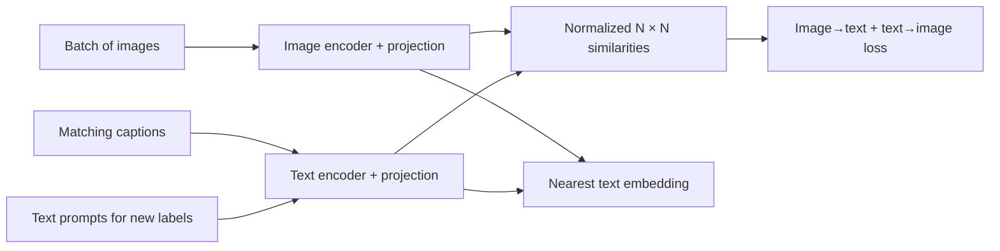
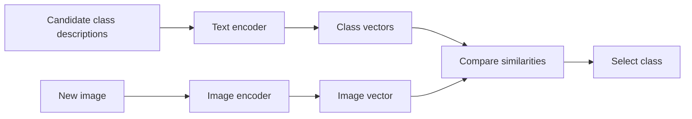

import PaperPdf from '@site/src/components/PaperPdf';
import CodeWalkthrough from '@site/src/components/viz/CodeWalkthrough';
import ResearchPaperLab from '@site/src/components/viz/ResearchPaperLab';

> **Radford et al. · 2021** · [Read the embedded paper](#original-paper) ·
> [Download PDF](/papers/research-papers/clip.pdf) · Notes follow the paper
> section by section, §1 to the appendix.


## Paper in one minute

**Problem.** Conventional image classifiers learn a fixed label set and require
new labelled examples and training whenever the categories change.

**Key idea.** Contrast matching image-caption pairs against the other pairs in a
batch so an image encoder and text encoder learn a shared normalized embedding
space.

**Why it matters.** Text descriptions can act as zero-shot class prototypes,
enabling broad visual transfer without fitting a new classifier. Similarity is
relative to the candidates and is not calibrated certainty or proof of identity.

### Contrastive-to-zero-shot flow



## How to read this chapter

The walkthrough below follows the paper **in its own order**, from the abstract
to the appendix. Each heading carries the paper's section number, so you can
keep the PDF open beside it. Equations use the paper's notation. Boxes marked
**not from the paper** are teaching aids, such as analogies, derivations or
worked numbers, added to make a step easier to follow.

The paper is 48 pages long, and much of the appendix is benchmark tables for
dozens of datasets. This chapter keeps the headline rows and the paper's own
reading of them; fuller tables sit in collapsible boxes.

## Abstract: the four claims

The abstract makes four claims, and the rest of the paper sets out to support
them:

1. Vision systems trained on a **fixed set of categories** are limited, because
   every new concept needs new labelled data. Learning from **raw text about
   images** is a much broader source of supervision.
2. A simple pre-training task, **predicting which caption goes with which
   image**, is an efficient and scalable way to learn state-of-the-art image
   representations from scratch, on **400 million (image, text) pairs** from
   the internet.
3. Afterwards, plain language can name learned visual concepts, or describe new
   ones, giving **zero-shot transfer**: using the model on a new task with no
   training examples for it. The paper tests this on **over 30 datasets**,
   covering OCR (reading text in images), action recognition in videos,
   geo-localisation and many fine-grained object tasks.
4. The model is often **competitive with a fully supervised baseline** without
   any dataset-specific training. For example, it matches the original
   ResNet-50's ImageNet accuracy zero-shot, without using any of the 1.28
   million training images ResNet-50 learned from.

The code and pre-trained weights are released. Keep these claims in mind: §2
builds the method, §3 to §5 supply the evidence, and §6 and §7 set out the
limits and risks.

## §1 Introduction and motivating work

In language processing, pre-training on raw web text had changed everything.
Models such as GPT-3 could do many tasks "zero-shot", from a text instruction
alone, with no task-specific output layer. Computer vision still mostly
pre-trained on **crowd-labelled** datasets like ImageNet, where people tag each
image with one of a fixed list of classes. The paper asks: _can learning
directly from web text do for vision what it did for language?_

A conventional classifier learns a fixed list of labels, such as cat, dog and car. Its final output layer is tied to those classes. Adding a new class usually means changing or retraining part of the classifier.

Natural-language descriptions offer a richer supervision source. “A small brown dog running through snow” conveys more than a single class ID. CLIP uses paired images and text to learn representations that can later be compared with descriptions of new classification categories.

**Earlier attempts.** The idea is old. In 1999 Mori et al. predicted the nouns
and adjectives in text next to images. Joulin et al. (2016) trained a CNN to
predict the words in Flickr photo titles and descriptions. Li et al. (2017),
"Visual N-Grams", even did zero-shot transfer, but reached only **11.5%** on
ImageNet, far below the **88.4%** state of the art and below the roughly 50% of
classic pre-deep-learning methods.

**The pragmatic middle ground.** More successful work used _narrow_ weak
supervision: predicting ImageNet-related Instagram hashtags, or the noisy labels
of the JFT-300M dataset. These worked, but they fixed the label set in advance
(1,000 and 18,291 classes) and used a static softmax classifier with no way to
add new outputs.

**The missing ingredient was scale.** The hashtag and JFT models trained for
accelerator-_years_ on up to billions of images. The natural-language methods
(VirTex, ICMLM, ConVIRT) trained for accelerator-_days_ on one to two hundred
thousand images. The paper closes that gap. It builds a 400-million-pair
dataset and trains a simplified ConVIRT from scratch, called **CLIP**
(Contrastive Language-Image Pre-training). It trains **eight models** spanning
almost 2 orders of magnitude of compute and finds transfer performance is a
**smoothly predictable** function of compute.

The introduction previews the rest: CLIP learns OCR, geo-localisation, action
recognition and more during pre-training; linear probes show it beats the best
public ImageNet model; and zero-shot CLIP is **much more robust** than
supervised ImageNet models of equal accuracy.

This is **contrastive learning**: learn which pairs belong together relative to alternatives.

:::tip In the real world (not from the paper)

Picture an online shop that adds new product categories every week. A classic
classifier needs new labelled photos and a retrain for each one. With CLIP the
shop writes a new text label, such as "a photo of a folding bike", and can start
sorting photos straight away. This is an illustration of the motivation, not a
named deployment.

:::

## §2 Approach


*Figure 1 from the original paper, PDF page 2. [Source PDF](/papers/research-papers/clip.pdf#page=2).*

Figure 1 shows the whole method in three panels: (1) train an image encoder and
a text encoder together so matching pairs score highly; (2) turn class names
into sentences and encode them into a classifier; (3) classify a new image by
finding the most similar sentence.

### §2.1 Natural language supervision

Researchers had called this kind of learning "unsupervised", "self-supervised",
"weakly supervised" and "supervised". The paper argues the common thread is not
a method but the **training signal**: natural language. It calls this **natural
language supervision**.

Two advantages follow. First, it **scales**: nobody needs to squeeze each image
into a single "gold label"; the model learns passively from text already on the
internet. Second, unlike most self-supervised methods, it does not just learn a
representation, it **connects that representation to language**, which is what
makes flexible zero-shot transfer possible.

### §2.2 Creating a sufficiently large dataset

Existing image–text datasets were too small or too messy:

| Dataset | Size | Problem |
|---|---|---|
| MS-COCO, Visual Genome | about 100,000 photos each | High quality but small |
| YFCC100M | 100 million photos | Sparse metadata; only 15 million keep after filtering for English titles or descriptions |
| **WIT** (new, this paper) | **400 million (image, text) pairs** | Built from many public web sources |

**What this shows:** the only large existing option shrinks to ImageNet size
once cleaned, so the authors built their own.

Many YFCC100M "titles" are camera filenames like `20160716_113957.JPG`, or
"descriptions" of exposure settings.

**How WIT was built.** To cover as many visual concepts as possible, the
authors collected pairs whose text contains one of **500,000 queries**. The
base list is every word appearing at least 100 times in English Wikipedia, plus
common two-word phrases, the names of popular Wikipedia articles, and WordNet
synsets (dictionary word senses). They roughly **class-balanced** it by keeping
at most **20,000 pairs per query**. The result has about the same total word
count as GPT-2's WebText. WIT stands for WebImageText.

The large image/text collection is gathered through a broad set of search queries. That selection process shapes what concepts appear and how often. A large dataset is not automatically balanced, representative or free of ambiguous pairings.

:::tip Worked number (not from the paper)

500,000 queries × 20,000 pairs is a ceiling of 10 billion pairs, 25 times the
400 million actually collected. So the cap only trims the most common queries;
most queries contribute far fewer pairs.

:::

:::tip In the real world (not from the paper)

WIT was never released, so the open-source community rebuilt the recipe. The
LAION-400M and LAION-5B datasets collect image–text pairs from the public web in
the same spirit, and the OpenCLIP project trains CLIP-style models on them.

:::

### §2.3 Selecting an efficient pre-training method

Training cost was the deciding factor. Earlier ImageNet-scale systems already
needed 19 GPU-years or 33 TPUv3 core-years just to predict 1,000 classes. So the
authors picked their method by **how fast it learns**.

**First attempt: predict the caption.** Like VirTex, they trained an image CNN
and a text Transformer to generate each image's caption. It scaled badly.
Figure 2 shows a 63-million-parameter Transformer language model, already
using twice the compute of its ResNet-50 image encoder, learning to recognise
ImageNet classes **three times slower** than a simpler baseline that predicts a
**bag of words** (the caption's words, ignoring order).

**Why predicting words is hard.** Both methods try to predict the **exact
words** of the text, but the same image can come with wildly different
descriptions, comments and related text.

An image can have many valid descriptions. Predicting the exact caption requires choosing not only the visual concept, but also the particular wording used by the author. The paper compares predictive approaches with contrastive training and selects a method that learns transferable visual concepts more efficiently in its experiments.

**The switch to contrastive.** Other work had found that **contrastive**
objectives, which learn by telling matching pairs from non-matching ones,
learn better representations than predictive ones, and that generative image
models need over 10× more compute for the same quality. So the authors tried an
easier proxy task: predict only **which text as a whole** goes with which image.
Swapping the bag-of-words _prediction_ loss for a _contrastive_ loss gave a
**further 4× speed-up** in zero-shot ImageNet learning.

Contrastive training asks a narrower question: among the texts in this batch, which one accompanies this image? It still learns language–vision relationships, without needing to reconstruct every caption token.

:::tip Worked number (not from the paper)

The two gains multiply: $3\times4=12$. At equal images seen, CLIP's contrastive
objective reaches a given zero-shot ImageNet accuracy roughly 12 times sooner
than the Transformer caption model it started from.

:::

#### The objective

Given a batch of $N$ (image, text) pairs, CLIP predicts which of the
$N\times N$ possible pairings actually occurred. It trains both encoders to
**raise the cosine similarity** of the $N$ real pairs and **lower it** for the
$N^2-N$ wrong pairings, with a **symmetric cross-entropy loss**.

An image encoder maps pixels to a vector. A text encoder maps tokens to a vector. Learned projections place both outputs in the same embedding space, and L2 normalisation puts them on a common scale.

An **embedding** is just a list of numbers that stands for the image or text. L2
normalisation rescales each list to length 1. For image vector v and text vector u:

$$
\hat v=\frac{v}{\lVert v\rVert_2},\qquad
\hat u=\frac{u}{\lVert u\rVert_2},\qquad
s=\hat v^T\hat u.
$$

In words: shrink or stretch both vectors to length 1, then multiply them
element by element and add up. The dot product of normalised vectors is cosine similarity. It measures directional agreement, not the probability that a statement about the image is true.

#### The N × N similarity matrix

Take a batch of three pairs: image/text for a cat, a bicycle and a bowl. Compare every image with every text. The resulting matrix has nine entries. The three diagonal entries represent the provided matching pairs; off-diagonal entries are negatives for the contrastive objective.

For normalised image matrix I and text matrix T:

$$
S=\exp(t)IT^T.
$$

In words: each entry of $S$ is one image–text cosine similarity, multiplied by
a learned positive number $\exp(t)$. The learned scalar t controls the logit scale, equivalent to an inverse temperature. Larger scale makes the softmax more concentrated on the strongest similarities.

#### Why the loss goes in both directions

Image-to-text cross-entropy asks each image to select its paired text. Text-to-image cross-entropy asks each text to select its paired image:

$$
L=\frac12\left[\operatorname{CE}(S,[0,\ldots,N-1])+
\operatorname{CE}(S^T,[0,\ldots,N-1])\right].
$$

In words: treat each row as a multiple-choice question whose right answer is on
the diagonal, do the same for each column, and average the two scores.

The same matching relation is learned from rows and columns. Without normalisation, vector magnitudes could affect scores independently of their direction. The temperature controls concentration separately from embedding norms.

A batch can contain an apparent negative that is semantically appropriate, such as two nearly identical dog descriptions. The diagonal-pair objective does not automatically know they should both be acceptable. Batch composition is therefore part of understanding the supervision.

The paper gives the core as numpy-like pseudocode (**Figure 3**), reproduced
here:

```python
# image_encoder - ResNet or Vision Transformer
# text_encoder  - CBOW or Text Transformer
# I[n, h, w, c] - minibatch of aligned images
# T[n, l]       - minibatch of aligned texts
# W_i[d_i, d_e] - learned proj of image to embed
# W_t[d_t, d_e] - learned proj of text to embed
# t             - learned temperature parameter
# extract feature representations of each modality
I_f = image_encoder(I) #[n, d_i]
T_f = text_encoder(T)  #[n, d_t]
# joint multimodal embedding [n, d_e]
I_e = l2_normalize(np.dot(I_f, W_i), axis=1)
T_e = l2_normalize(np.dot(T_f, W_t), axis=1)
# scaled pairwise cosine similarities [n, n]
logits = np.dot(I_e, T_e.T) * np.exp(t)
# symmetric loss function
labels = np.arange(n)
loss_i = cross_entropy_loss(logits, labels, axis=0)
loss_t = cross_entropy_loss(logits, labels, axis=1)
loss   = (loss_i + loss_t)/2
```

The paper traces this batch objective to the multi-class **N-pair loss** of
deep metric learning, popularised as **InfoNCE**, and adapted to medical
image–text pairs by ConVIRT.

:::tip Worked number (not from the paper)

CLIP's batch size is 32,768 (§2.5). One training step therefore scores
$32{,}768^2\approx1.07$ billion image–text pairs, of which only 32,768 are
correct. Each image competes against 32,767 wrong captions at once.

:::

**Simplifications compared with ConVIRT.** With 400 million pairs, overfitting
is not a major worry, so the recipe is kept simple:

- Both encoders train **from scratch**, with no ImageNet or pre-trained text
  weights.
- Only a **linear projection** maps each encoder into the shared space, not the
  non-linear projection popular in self-supervised learning. The authors saw no
  difference in training efficiency.
- No text augmentation (most captions are a single sentence), and the **only
  image augmentation** is a random square crop of a resized image.
- The temperature $\tau$ that controls the range of the logits is **learned**,
  as a log-parameterised multiplicative scalar, instead of being tuned by hand.

:::note Temperature or its inverse?

The text calls the learned quantity a temperature $\tau$, but Figure 3
_multiplies_ the similarities by $\exp(t)$. So what is actually learned is the
log of the **inverse** temperature, $t=\log(1/\tau)$. §2.5 initialises it to the
equivalent of $\tau=0.07$, a scale of $1/0.07\approx14.3$, and clips it so the
scale never exceeds 100 (that is, $\tau\ge0.01$). The acknowledgements also thank
a reader for catching an error in the pseudocode, so read Figure 3 as a sketch:
which axis is "image" and which is "text" depends on the helper function, but
the loss averages both directions either way.

:::

:::tip In the real world (not from the paper)

Hugging Face's `CLIPModel` returns this objective's two views directly:
`logits_per_image` (one row per image) and `logits_per_text` (its transpose),
together with a learned `logit_scale` parameter that plays the role of $t$.

:::

### §2.4 Choosing and scaling a model

The original study trains on a large web collection of image/text pairs and explores ResNet and Vision Transformer image encoders with a Transformer text encoder. CLIP refers to the training approach and model family, not one mandatory visual backbone.

**Image encoder, option 1: a modified ResNet-50.** The paper starts from
ResNet-50 (see the [ResNet chapter](/docs/research-papers/resnet)) and applies
the "ResNet-D" tweaks, anti-aliased blur pooling, and replaces global average
pooling with **attention pooling**: one layer of Transformer-style multi-head
attention whose query comes from the average-pooled image.

**Image encoder, option 2: a Vision Transformer (ViT)**, which cuts the image
into patches and treats them like words. CLIP adds one extra layer
normalisation before the Transformer and uses a slightly different
initialisation.

The paper tests both modified ResNets and Vision Transformers for the image encoder. Its ResNet variants include changes to the stem, downsampling and final pooling, including attention-based pooling. The text encoder uses a Transformer, and the end-of-text representation feeds the shared embedding projection.

**Text encoder.** A GPT-2-style Transformer: the base size has **63M
parameters, 12 layers, width 512 and 8 attention heads**. It reads lower-cased
byte-pair-encoded text (words split into frequent sub-word pieces) with a
**49,152-token vocabulary**, capped at **76 tokens**. The text is wrapped in
`[SOS]` and `[EOS]` tokens, and the top layer's activation at `[EOS]` is layer
normalised and linearly projected into the shared space. The attention is
**masked** (each token sees only earlier ones) to keep the option of adding a
language-modelling objective later, left as future work.

Thus, “CLIP uses a Transformer” does not identify every component: some CLIP image encoders are convolutional. Likewise, the tiny lookup-table text encoder in our code illustrates the loss, not the architecture that learns full sentence representations.

**Scaling.** For the ResNets, extra compute is split **equally** across width,
depth and input resolution, a simple version of the EfficientNet rule. The text
encoder only grows in **width**, in proportion to the ResNet, not in depth,
because CLIP turned out to be "less sensitive to the capacity of the text
encoder".

:::note Two vocabulary sizes

§2.4 gives a vocabulary of **49,152**, but Table 18 in Appendix F lists
**49,408**. The paper does not explain the gap; the released tokeniser has
49,408 entries, so treat that as the working figure.

:::

### §2.5 Training

The paper trains **5 ResNets and 3 Vision Transformers**:

| Family | Models |
|---|---|
| ResNet | RN50, RN101, and RN50x4, RN50x16, RN50x64 (about 4×, 16× and 64× the compute of RN50) |
| Vision Transformer | ViT-B/32, ViT-B/16, ViT-L/14 (the number is the patch size in pixels) |

**What this shows:** two families, each spanning a wide range of sizes, so the
paper can study scaling.

The shared recipe:

- **32 epochs** (passes over the data) for every model.
- **Adam** with decoupled weight decay on all weights except gains and biases,
  and a **cosine** learning-rate schedule. Hyperparameters were tuned on RN50
  for one epoch, then adapted by hand for bigger models.
- Temperature initialised to $\tau=0.07$ and **clipped** so logits are never
  scaled by more than 100, "necessary to prevent training instability".
- A **minibatch of 32,768**.
- Memory savers: mixed precision, gradient checkpointing, half-precision Adam
  statistics and half-precision text-encoder weights. Similarity computation is
  sharded so each GPU only computes the similarities its own batch slice needs.

The biggest ResNet, RN50x64, took **18 days on 592 V100 GPUs**; the biggest ViT
took **12 days on 256 V100 GPUs**. ViT-L/14 then trained one extra epoch at 336
pixels. Unless stated otherwise, "CLIP" in the paper's results means this
**ViT-L/14@336px** model.

Training uses many image/text pairs in a batch. Each matching pair receives the other batch items as contrastive alternatives. More negatives change the learning problem and computation cost, while the learned temperature controls how sharply similarities are separated.

:::tip Worked number (not from the paper)

$592\times18=10{,}656$ GPU-days for RN50x64, against $256\times12=3{,}072$ for
ViT-L/14. The Transformer image encoder reached better results for under a
third of the GPU time, which matches §3.2's finding that CLIP ViTs are about
3× more compute-efficient.

:::

:::tip In the real world (not from the paper)

These are the names you meet in practice. OpenAI's `clip` package lists its
released checkpoints as `RN50`, `RN101`, `RN50x4`, `RN50x16`, `RN50x64`,
`ViT-B/32`, `ViT-B/16`, `ViT-L/14` and `ViT-L/14@336px`, and Hugging Face hosts
copies such as `openai/clip-vit-base-patch32`.

:::

## §3 Experiments

The paper evaluates transfer across many visual datasets, compares zero-shot classification with supervised probes, studies scaling and examines robustness under distribution shift. It also investigates social bias and other limitations. Results depend on the dataset, prompt set and evaluation protocol; “works zero-shot” is not equivalent to universal image understanding.

### §3.1 Zero-shot transfer

#### §3.1.1 Motivation

In computer vision, "zero-shot" usually means recognising **unseen classes**.
The paper uses it more broadly: working on **unseen datasets**, as a stand-in
for unseen tasks. It frames zero-shot transfer as a test of **task learning**,
not just representation learning.

Some benchmarks do measure a real task: SVHN is reading house numbers in Street
View photos. Others, like CIFAR-10, are mainly a data distribution, so zero-shot
results there test **robustness to distribution shift** more than task
learning (see §3.3).

The only earlier work on zero-shot transfer to standard image datasets is
Visual N-Grams, which learned a dictionary of 142,806 visual n-grams. The idea of
task learning comes from language models: GPT-1 noticed zero-shot skills
improving during pre-training, and GPT-2 studied them directly.

No labelled images from that downstream task are required to train a new classifier head in this procedure. “Zero-shot” does not mean the pre-training collection contained no related concepts or examples.

#### §3.1.2 Using CLIP for zero-shot transfer

CLIP was trained to tell whether an image and a text belong together, so
classification reuses exactly that skill. For each dataset, the **class names
become the candidate texts**. Encode the image, encode every candidate, compute
the cosine similarities, scale them by the temperature, and apply a softmax.
The highest score wins.

Suppose the downstream categories are “cat”, “dog” and “horse”. Convert each into a description, such as “a photo of a dog”. Encode the descriptions once. For a new image, compare its embedding with these text vectors and select the highest score.



**Two useful ways to see it.** The prediction layer is a **multinomial logistic
regression** (a standard linear classifier) with normalised inputs, normalised
weights, no bias and a temperature. The image encoder is the backbone; the text
encoder is a **hypernetwork**, a network that writes another network's weights,
here the classifier's weights from class descriptions.

In the same view, every pre-training step is a tiny made-up classification task
with **32,768 classes and one example per class**, each class defined by a
caption. At test time the text-derived classifier is computed **once** and
cached, so its cost is spread across every prediction.

The candidate list itself matters. Softmax over three classes forces a relative choice among those three, even if the image belongs to none. Its maximum value is not a general “the model is certain” score.

:::tip In the real world (not from the paper)

Hugging Face's `zero-shot-image-classification` pipeline implements this
procedure: you pass an image and a list of candidate labels, and it returns
CLIP's softmax over them. The same caveat applies, since the scores only rank
the labels you supplied.

:::

#### §3.1.3 Initial comparison to Visual N-Grams

Table 1 compares CLIP with the earlier zero-shot system on the three datasets
it reported:

| Model | aYahoo | ImageNet | SUN |
|---|---|---|---|
| Visual N-Grams | 72.4 | 11.5 | 23.0 |
| CLIP | 98.4 | 76.2 | 58.5 |

**What this shows:** a jump from proof of concept to useful accuracy on all
three.

The best CLIP lifts ImageNet from 11.5% to **76.2%**, matching the original
ResNet-50 without any of ImageNet's 1.28 million labelled images. Its **top-5
accuracy** (right answer anywhere in the top five guesses) is **95%**, matching
Inception-V4. On aYahoo CLIP removes 95% of the errors; on SUN it more than
doubles the accuracy.

The paper insists this is **context, not a controlled comparison**: CLIP uses
10× more data, nearly 100× more compute per prediction, probably over 1000× the
training compute, and a Transformer that did not exist when Visual N-Grams was
published. As a fairer check, a CLIP ResNet-50 trained on the same YFCC100M
data matched Visual N-Grams' ImageNet result within a single V100 GPU-day.

:::tip Check the numbers yourself (not from the paper)

aYahoo errors fall from $100-72.4=27.6\%$ to $100-98.4=1.6\%$, and
$1.6/27.6\approx0.06$, so about 94% of errors are gone, which the paper rounds
to 95%. On SUN, $58.5/23.0\approx2.5$, "more than doubles".

:::

:::note The headline match uses the biggest model

The ImageNet 76.2% comes from ViT-L/14@336px, the largest and best model.
CLIP's own ResNet-50 reaches **59.6%** zero-shot (Table 11). "Matches
ResNet-50" is a statement about CLIP at its best, not about a CLIP of ResNet-50
size.

:::

#### §3.1.4 Prompt engineering and ensembling

Most datasets treat class names as an afterthought: labels are numeric IDs with
a file mapping them to English names. Some, such as Flowers102 and GTSRB, did
not even ship that mapping, which blocks zero-shot use. (Footnote 2 notes that
one author learned far more about flower species and German traffic signs than
he expected.)

**Problem 1: ambiguous words.** A bare class name lacks context. ImageNet has
both construction **cranes** and the birds; in Oxford-IIIT Pets, **boxer** is a
dog breed, but a text encoder could read it as an athlete.

A bare class name can be ambiguous. A descriptive template supplies context: “a photo of a crane” suggests an image category, but crane might still mean an animal or a machine. Domain-appropriate descriptions can help.

**Problem 2: single words are unusual.** CLIP's training captions are usually
full sentences. The template `A photo of a {label}.` bridges that gap, and on
ImageNet alone it adds **1.3%**.

**Task-specific prompts** help more. Examples from the paper:

| Dataset type | Prompt pattern |
|---|---|
| Oxford-IIIT Pets | `A photo of a {label}, a type of pet.` |
| Food101, FGVC Aircraft | Say it is "a type of food" or "a type of aircraft" |
| OCR datasets | Put quotes around the text or number to recognise |
| Satellite images | Variants of `a satellite photo of a {label}.` |

**What this shows:** telling the text encoder _what kind of thing_ the label is
removes much of the ambiguity.

**Ensembling.** The paper also averages many classifiers built from different
prompts, such as `A photo of a big {label}` and `A photo of a small {label}`.
The averaging happens in **embedding space**, not over probabilities, so a single
averaged vector per class is cached and the cost equals one classifier. On
ImageNet, **80 prompts** add another **3.5%**.

The paper also studies combining multiple text prompts for each class. Averaging their representations can reduce dependence on one wording. This is different from training new encoder weights.

Together, prompt engineering and ensembling improve ImageNet by almost 5%.
Figure 4 shows a similar gain, **almost 5 points on average over 36 datasets**,
about what the baseline gets from **4× more compute**, but "free" once the text
vectors are cached.

:::tip Worked number (not from the paper)

$1.3\%+3.5\%=4.8\%$, the "almost 5%" on ImageNet. Because the 80 prompt vectors
are averaged into one vector per class before use, classifying an image still
needs only 1,000 dot products, not 80,000.

:::

#### §3.1.5 Analysis of zero-shot CLIP performance

**Against a supervised baseline.** The comparison point is a **linear probe**:
logistic regression trained on the features of a standard ResNet-50, using each
dataset's full labelled training set.

A **linear probe** trains a linear classifier on fixed image embeddings using labelled downstream examples. A **zero-shot text classifier** constructs class vectors from language. Both can keep the encoders frozen, but only the second avoids fitting that task's classifier from labelled images.

Across 27 datasets, zero-shot CLIP **wins on 16**, including ImageNet (Figure
5). Selected gaps, zero-shot CLIP minus the ResNet-50 linear probe, in accuracy
points:

| Dataset | Gap |
|---|---|
| Stanford Cars | +28.9 |
| Food101 | +22.5 |
| Kinetics700 | +14.5 |
| ImageNet | +1.9 |
| EuroSAT | −37.1 |
| KITTI Distance | −34.0 |

**What this shows:** zero-shot CLIP is strong on everyday objects, food, cars
and actions, and weak on specialised tasks.

<details>
<summary>All 27 values from Figure 5</summary>

Zero-shot CLIP minus a linear probe on ResNet-50 features, in points:

| Dataset | Gap | Dataset | Gap |
|---|---|---|---|
| StanfordCars | +28.9 | PascalVOC2007 | +0.5 |
| Country211 | +23.2 | Birdsnap | −3.2 |
| Food101 | +22.5 | MNIST | −10.0 |
| Kinetics700 | +14.5 | FGVCAircraft | −11.3 |
| SST2 | +12.4 | RESISC45 | −11.9 |
| SUN397 | +7.8 | Flowers102 | −12.5 |
| UCF101 | +7.7 | DTD | −16.6 |
| HatefulMemes | +6.7 | CLEVRCounts | −18.2 |
| CIFAR10 | +3.9 | GTSRB | −18.4 |
| CIFAR100 | +3.0 | PatchCamelyon | −19.5 |
| STL10 | +3.0 | KITTI Distance | −34.0 |
| FER2013 | +2.8 | EuroSAT | −37.1 |
| Caltech101 | +2.0 | | |
| ImageNet | +1.9 | | |
| OxfordPets | +1.1 | | |

</details>

The paper's reading:

- **Fine-grained tasks vary widely.** CLIP wins by over 20 points on Stanford
  Cars and Food101 but loses by over 10 on Flowers102 and FGVC Aircraft. The
  authors suspect different amounts of relevant supervision in WIT versus
  ImageNet.
- **General object datasets** (ImageNet, CIFAR-10/100, STL10, PascalVOC2007)
  are close, with a slight edge to CLIP. On STL10 CLIP reaches **99.3%**,
  apparently a new state of the art with no training examples.
- **Actions in video** favour CLIP (+14.5 on Kinetics700, +7.7 on UCF101),
  likely because language supervises **verbs**, while ImageNet labels only
  nouns.
- **Specialised or abstract tasks** are weak: satellite images (EuroSAT,
  RESISC45), lymph-node tumours (PatchCamelyon), counting (CLEVRCounts),
  traffic signs (GTSRB) and distance to the nearest car (KITTI). Non-expert
  humans can do several of these, so there is room to improve. But the authors
  question whether zero-shot is even a fair test for tasks almost nobody has
  seen, like tumour classification.

**Against few-shot learning.** Few-shot means training on only a handful of
labelled examples per class. Figure 6 compares zero-shot CLIP with few-shot
logistic regression on many models' features, over the 20 datasets with at
least 16 examples per class:

- Zero-shot CLIP **matches a 4-shot** linear classifier on CLIP's own features.
- It roughly matches the **best 16-shot** classifier in the whole suite, a BiT-M
  ResNet-152x2 trained on ImageNet-21K.

Why would zero examples beat one? Language **states the concept directly**,
while a single example is ambiguous: one photo contains many possible concepts,
and the learner has to guess which one is meant. Using the zero-shot weights as
a prior for the few-shot classifier seemed natural, but the tuning just chose a
regulariser so strong that the result _was_ the zero-shot classifier. Combining
the two well is left for future work.

**How many labels is zero-shot worth?** Figure 7 estimates, per dataset, how
many labelled examples per class a linear classifier on CLIP features needs to
match zero-shot CLIP. The answer ranges from **under 1** (Flowers102 and
EuroSAT, where zero-shot is worse than one-shot) to **184** (FER2013). The
**median is 5.4** and the **mean 20.8**. ImageNet's zero-shot classifier is
worth about **16 examples per class**.

**How close to the ceiling?** Since zero-shot CLIP is also a linear classifier,
a fully supervised linear probe on the same features is roughly its upper bound
(Figure 8). Zero-shot is usually **10 to 25 points below** that bound, with a
correlation of **0.82** between the two. Only 5 datasets come within 3 points:
STL10, CIFAR10, Food101, OxfordPets and Caltech101, all above 90% on both.
Each 1% gain in supervised accuracy goes with about 1.28% in zero-shot accuracy,
though the 95% confidence interval (0.93 to 1.79) still includes values below 1.

**Scaling.** Across the 5 ResNet CLIP models, average zero-shot error over 39
evaluations on 36 datasets follows a **smooth log-log linear trend** over a
**44× range of compute** (Figure 9). Individual evaluations are much noisier,
and the authors cannot tell whether that is run-to-run variance or genuinely
non-monotonic behaviour.

:::tip Check the 44× yourself (not from the paper)

Figure 9's x-axis runs from 6.1 GFLOPs (RN50) to 265.9 GFLOPs (RN50x64) per
image. $265.9/6.1\approx43.6$, which the paper rounds to 44×.

:::

:::tip In the real world (not from the paper)

Figure 6 is a practical rule of thumb. If you only have three or four labelled
photos per class, a well-prompted zero-shot CLIP classifier may already be as
good as training on them. If you have dozens per class, a linear probe on CLIP
features usually wins. This is an illustration drawn from the figure, not a
guarantee for your data.

:::

### §3.2 Representation learning

§3.1 measured **task learning**. The more common test is **representation
quality**: how good are the features for new classifiers?

**Why linear probes, not fine-tuning.** Fine-tuning (updating the whole network
on each dataset) usually scores higher, but it can **hide** a pre-training
method's weaknesses by re-adapting everything. A linear probe, with its limited
flexibility, **exposes** them. It is also close to how zero-shot CLIP works, and
it needs little tuning, which matters when comparing **66 models on 27
datasets, 1,782 evaluations**.

A linear probe fits a classifier to frozen representations using downstream labels. The zero-shot classifier uses language descriptions to construct its class vectors. The paper studies both, so do not attribute every reported result to the same zero-shot protocol.

**On the standard 12-dataset suite (Kornblith et al.)** (Figure 10, left):

- Small CLIP models (RN50, RN101) beat other ImageNet-1K ResNets but lose to
  ResNets trained on ImageNet-21K (BiT-M) and to EfficientNets of similar
  compute.
- CLIP **scales well**: the largest ResNet, RN50x64, slightly beats the best
  existing model, a Noisy Student EfficientNet-L2, on both score and compute.
- **CLIP ViTs are about 3× more compute-efficient** than CLIP ResNets.
- The best model, **ViT-L/14@336px**, beats the best existing model by an
  average of **2.6%**.

**On the broader 27-dataset suite** (Figure 10, right), which adds OCR,
geo-localisation, facial emotion, action recognition and traffic signs:

- **Every** CLIP model, whatever its size, beats every other system on compute
  efficiency.
- The best model's lead grows from **2.6% to 5%**.
- Self-supervised methods look better too: SimCLRv2 now beats BiT-M. The paper
  takes this as a reason to keep widening evaluation suites.

**Per dataset** (Figure 11), a linear probe on CLIP features beats one on the
Noisy Student EfficientNet-L2 on **21 of 27 datasets**:

| Dataset | CLIP minus EfficientNet-L2 |
|---|---|
| SST2 (rendered sentences) | +23.6 |
| Country211 | +22.7 |
| HatefulMemes | +18.8 |
| GTSRB | +14.7 |
| CIFAR10 | −0.8 |
| ImageNet | −3.0 |

**What this shows:** CLIP gains most where text in the image, places or
fine-grained signs matter; EfficientNet keeps its edge on ImageNet, the dataset
it was trained on.

<details>
<summary>All 27 values from Figure 11</summary>

Linear probe on CLIP features minus linear probe on Noisy Student
EfficientNet-L2 features, in points:

| Dataset | Gap | Dataset | Gap |
|---|---|---|---|
| SST2 | +23.6 | Caltech101 | +1.3 |
| Country211 | +22.7 | EuroSAT | +0.9 |
| HatefulMemes | +18.8 | MNIST | +0.6 |
| StanfordCars | +15.9 | DTD | +0.5 |
| GTSRB | +14.7 | VOC2007 | +0.5 |
| SUN397 | +6.5 | STL10 | +0.0 |
| Kinetics700 | +6.2 | OxfordPets | −0.5 |
| RESISC45 | +5.1 | CIFAR10 | −0.8 |
| FER2013 | +4.5 | PatchCamelyon | −1.2 |
| Food101 | +3.9 | CIFAR100 | −1.7 |
| FGVCAircraft | +3.2 | CLEVRCounts | −2.4 |
| UCF101 | +3.1 | ImageNet | −3.0 |
| KITTI Distance | +2.3 | | |
| Birdsnap | +1.4 | | |
| Flowers102 | +1.4 | | |

</details>

The paper's reading: CLIP gains most on **OCR** (SST2, HatefulMemes),
**geo-localisation and scenes** (Country211, SUN397) and **video actions**
(Kinetics700, UCF101), and also on cars and traffic signs. The 14.7-point GTSRB
gain may point to a flaw in ImageNet-1K, which has **one label for all traffic
and street signs**, encouraging a supervised model to throw away the details
that tell signs apart. EfficientNet stays ahead on ImageNet itself, slightly on
low-resolution CIFAR (perhaps because CLIP lacks scale augmentation), and on
PatchCamelyon and CLEVRCounts, where both do poorly.

:::tip Worked number (not from the paper)

$66\times27=1{,}782$, the paper's count of linear-probe evaluations. Each needs
its own regularisation sweep (Appendix A.3), which is why the authors chose
cheap linear probes over fine-tuning.

:::

:::tip In the real world (not from the paper)

A frozen CLIP encoder plus scikit-learn's `LogisticRegression` is a common,
cheap baseline for a new image task: embed every image once, then fit the
classifier in seconds on a laptop. That is exactly the linear probe of this
section.

:::

### §3.3 Robustness to natural distribution shift

**The puzzle.** ImageNet models were said to beat humans in 2015, yet they
still make simple mistakes and score much lower on new test sets. A common
explanation is that they learn **spurious correlations**: patterns that hold in
the training data but not elsewhere. (A classic illustration, not the paper's:
a model that recognises cows partly by the green grass around them.) The paper
notes most such studies only look at ImageNet-trained models, so CLIP offers a
different angle.

**Distribution shift** means test images differ from the usual benchmark distribution, for example through changed drawing style, viewpoint or data collection. **Effective robustness** asks whether performance under that shift is better than would be expected simply from the model's ordinary benchmark accuracy. This separates improved general recognition from additional resistance to a particular shift.

The paper follows Taori et al. (2020), who test ImageNet models on **7 natural
shifts**: ImageNetV2, ImageNet Sketch, Youtube-BB, ImageNet-Vid, ObjectNet,
ImageNet-Adversarial (ImageNet-A) and ImageNet-Rendition (ImageNet-R). These are
new photos from other sources, unlike synthetic shifts made by blurring or
perturbing images. A ResNet-101 makes **5 times as many mistakes** on these as
on the ImageNet validation set. Taori et al. found that shifted accuracy rises
predictably with ImageNet accuracy, which defines the expected line for
**effective robustness**. **Relative robustness** is simply any gain in shifted
accuracy.

**Linear probes first** (Figure 12): linear probes on CLIP features transfer
better to other datasets than models with the same ImageNet score, suggesting
ImageNet-trained features are somewhat overfit to ImageNet.

**Zero-shot CLIP** cannot exploit patterns specific to ImageNet, because it
never trained on ImageNet, so it should be more robust. Footnote 4 adds the
caveat: it can still exploit correlations shared by its pre-training data and
the test data. Figure 13 confirms the expectation: every zero-shot CLIP model
improves effective robustness a lot and shrinks the ImageNet-to-shift gap by up
to **75%**. The right panel compares the best zero-shot CLIP with a ResNet-101
of the **same ImageNet accuracy**:

| Dataset | ResNet-101 | Zero-shot CLIP | Change |
|---|---|---|---|
| ImageNet | 76.2 | 76.2 | 0 |
| ImageNetV2 | 64.3 | 70.1 | +5.8 |
| ImageNet-R | 37.7 | 88.9 | +51.2 |
| ObjectNet | 32.6 | 72.3 | +39.7 |
| ImageNet Sketch | 25.2 | 60.2 | +35.0 |
| ImageNet-A | 2.7 | 77.1 | +74.4 |

**What this shows:** at the same ImageNet accuracy, CLIP holds up far better on
sketches, renditions and hard natural photos.

Figure 13 illustrates the gap with one class, **bananas**, shared by 5 of the 7
shift datasets.

**But is it the zero-shot part?** Other features of CLIP, its big varied dataset
or language supervision, could cause robustness on their own. As a first test,
the authors **adapt CLIP to ImageNet** by fitting logistic regression on CLIP
features using ImageNet's training set (Figure 14):

| Dataset | Change after adapting to ImageNet |
|---|---|
| ImageNet | +9.2 (to 85.4%) |
| ImageNetV2 | +5.8 |
| ImageNet-A | −1.9 |
| ImageNet Sketch | −2.8 |
| ObjectNet | −3.8 |
| ImageNet-R | −4.7 |

**What this shows:** ImageNet accuracy jumps, but the gain does not carry over
to the shifted datasets, except ImageNetV2, which was built the same way as
ImageNet.

ImageNet accuracy rises 9.2 points to **85.4%**, tying the 2018 state of the
art, yet **average accuracy under shift slightly falls**. Youtube-BB and
ImageNet-Vid barely change. The authors call a 9.2-point gain, roughly 3 years
of progress, that fails to transfer "surprising", and admit they do not know
whether it comes from exploiting spurious correlations, or whether it would hold
for full fine-tuning.

A model can improve its standard benchmark score after adaptation while losing some of the broad transfer behaviour of its original representation. The evaluation asks us to inspect both quantities, not assume that better in-distribution accuracy automatically means better robustness.

**Adapting to the class names instead.** Some shift datasets use broader
classes than ImageNet. Earlier work mapped ImageNet predictions onto them, and
sometimes badly: Youtube-BB's "person" was predicted by pooling ImageNet's
_baseball player_, _bridegroom_ and _scuba diver_. CLIP can instead build a
classifier from each dataset's own class names. That improves average effective
robustness by **5%**, concentrated in Youtube-BB (+26.9) and ImageNet-Vid
(+8.3), with ObjectNet also +2.3.

**From zero-shot to fully supervised** (Figure 15): few-shot CLIP classifiers
are also more robust than ImageNet models, but the advantage **fades** as more
ImageNet data is used and is mostly gone at full supervision. A 16-shot
classifier matches zero-shot CLIP on ImageNet but is less robust. The paper's
summary: robustness seems to come from **using less distribution-specific
training data**, at the cost of dataset-specific accuracy. It argues this
supports task-agnostic pre-training plus zero-shot and few-shot evaluation on
broad suites.

:::tip Check the numbers yourself (not from the paper)

Each "Change" in the Figure 13 table is just CLIP minus ResNet-101, for example
$77.1-2.7=74.4$ on ImageNet-A. And $76.2+9.2=85.4$, the adapted ImageNet
accuracy that also appears in Table 16.

:::

:::note Small mismatches between Figure 13, Figure 14 and Table 16

Figure 13 gives zero-shot CLIP **77.1** on ImageNet-A; Table 16 gives **77.2**.
Also, Table 16 lists zero-shot ObjectNet at 72.3 and linear-probe ObjectNet at
66.2, a drop of 6.1, while Figure 14 reports −3.8. Our reading, not stated by
the paper: the 72.3 already includes the +2.3 from ObjectNet's own class names,
and $72.3-2.3-3.8=66.2$ reconciles the two. Check which classifier a zero-shot
number uses before comparing it.

:::

:::tip In the real world (not from the paper)

Imagine a model trained on clean studio product photos that customers then use
with blurry phone pictures taken in their kitchens. That gap is a natural
distribution shift. §3.3 suggests the model with the best benchmark score is
not automatically the one that survives the kitchen. This is an illustration,
not a reported deployment.

:::

## §4 Comparison to human performance

How do people compare in the same setting? **Five people** labelled each of the
**3,669 test images** of Oxford-IIIT Pets, choosing one of **37 cat or dog
breeds** or "I don't know". In the zero-shot case they had no examples and no
internet search; in the one- and two-shot cases they saw one or two sample
images per breed. Their 94% accuracy on STL-10 and 97–100% on attention-check
images reassured the authors they were trying.

The paper's human comparison uses a specific pet-breed recognition task with limited demonstrations. That is a test of a particular visual distinction and protocol, not a ranking of overall human and machine intelligence. People and models also do not consume demonstrations in identical ways.

Table 2, average per-class accuracy (%):

| Setting | Accuracy | Majority vote | Accuracy on guesses | Majority vote on guesses |
|---|---|---|---|---|
| Zero-shot human | 53.7 | 57.0 | 69.7 | 63.9 |
| Zero-shot CLIP | 93.5 | 93.5 | 93.5 | 93.5 |
| One-shot human | 75.7 | 80.3 | 78.5 | 81.2 |
| Two-shot human | 75.7 | 85.0 | 79.2 | 86.1 |

**What this shows:** one example lifts humans from about 54% to 76%; a second
example adds almost nothing.

"Guesses" leaves out the images where a person answered "I don't know";
"majority vote" takes the most common answer per image.

The paper's reading: the zero-to-one-shot gain is almost entirely on images
people were **unsure** about, so humans "know what they don't know" and update
from one example. CLIP's few-shot methods do nothing like this (§3.1.5 found
zero-shot beating few-shot), which suggests better ways to combine **prior
knowledge** with a few examples are still to be found. Figure 16 shows the
hardest breeds for CLIP are also hard for humans, which the authors attribute to
label noise and to unusual images being hard for everyone.

:::note Read the gap with care

The 93.5% is the largest CLIP model (Table 11), trained on web data that almost
certainly contains many labelled pet photos. The humans were barred from any
lookup. Footnote 5 also admits the human and model few-shot tasks do not
correspond perfectly, since the model cannot "refer back" to example images the
way people can.

:::

:::tip In the real world (not from the paper)

An animal shelter could use zero-shot CLIP to pre-fill the breed field on an
intake form, then let staff correct it. §4 suggests a person with one reference
photo per breed catches most of what they would otherwise get wrong. This is an
illustration, not a reported deployment.

:::

## §5 Data overlap analysis

**The worry.** With 400 million web images, some **test images** might also be
in the **training** data. In the worst case a whole test set leaks in and the
evaluation says nothing about generalisation. Removing duplicates in advance
would need every future test set known ahead of time, so the authors instead
**measure** overlap and its effect.

**The procedure.**

1. Run a near-duplicate detector (Appendix C) on each evaluation dataset,
   inspect the matches by hand, and set a per-dataset threshold. Split each
   dataset into **Overlap** (above the threshold), **Clean** (below) and **All**.
2. Measure zero-shot accuracy of CLIP RN50x64 on all three and report
   **All − Clean**, the accuracy change due to contamination.
3. Because overlaps are small, run a one-sided binomial significance test, and
   compute 99.5% Clopper-Pearson confidence intervals.

Its overlap analysis detects possible near-duplicates between pre-training images and evaluation sets, then compares affected and clean subsets. Detection thresholds and imperfect recall limit what can be concluded. The aim is to estimate the effect of overlap, rather than assume a web-scale dataset is clean by default.

**Results (Figure 17), over 35 datasets:**

- **9 datasets have no detected overlap**, mostly synthetic or specialised ones
  (MNIST, CLEVR, GTSRB) or ones created after WIT (ObjectNet, Hateful Memes).
  That suggests a low false-positive rate.
- Median overlap is **2.2%**, mean **3.2%**.
- Overall accuracy moves by more than 0.1% on only **7 datasets**, and only
  **2** of those are statistically significant after Bonferroni correction (a
  stricter threshold used when running many tests).
- The largest gain is **0.6% on Birdsnap**, which has the second-largest overlap
  (12.1%). The largest overlap is **Country211 at 21.5%**, because it was built
  from YFCC100M, part of which is inside WIT; yet it gains only **0.2%**, since
  the matching captions rarely mention the photo's location.

**Two concerns the authors raise.** The detector is not perfect, and its recall
cannot be checked across 400 million images. And the Overlap and Clean subsets
may differ in other ways: on Kinetics-700 many "overlaps" are black transition
frames, which explains an apparent **20% drop** on Overlap, and on CIFAR-100 low
resolution causes false matches on small birds and planes. Still, the findings
agree with similar analyses for Instagram and JFT pre-training.

:::tip Worked number (not from the paper)

If a fraction $f$ of a test set overlaps, then
$\text{All}-\text{Clean}=f\times(\text{Overlap}-\text{Clean})$. For Birdsnap,
$0.6\%/0.121\approx5$, so the overlapping images were about 5 points easier
than the clean ones, yet they are too few to move the total by more than 0.6.

:::

:::note Two naming and counting slips

Step 3 of the procedure refers to intervals "on Dirty", a name used nowhere
else; it means the Overlap subset. The counts of "significant" datasets also
differ by test: the text says 2 after Bonferroni correction, and Figure 17's
caption says 5 datasets have confidence intervals excluding zero and 6 are
significant under a one-sided binomial test. These are different tests, not a
contradiction, but easy to misread.

:::

:::tip In the real world (not from the paper)

Benchmark contamination is now a routine check for large models. The
[GPT-3 paper](/docs/research-papers/gpt-3) ran a similar overlap study for its
text benchmarks, and model reports today often include one.

:::

## §6 Limitations

The paper collects its limitations in one place:

- **Still far from the best.** Zero-shot CLIP is competitive with a ResNet-50
  linear probe, but that baseline is well below the state of the art on most
  datasets. The authors estimate a **1000× increase in compute** would be needed
  for zero-shot CLIP to reach state of the art, "infeasible to train with
  current hardware".
- **Weak task types.** Fine-grained classification (car models, flower species,
  aircraft variants), **counting** objects, and novel tasks like classifying the
  distance to the nearest car, where performance can be **near random**.
- **Truly out-of-distribution data.** CLIP reads digitally rendered text well
  but gets only **88%** on handwritten MNIST digits; logistic regression on raw
  pixels beats it. Almost no MNIST-like images exist in WIT. The authors say CLIP
  does not solve brittle generalisation; it "circumvents" it by hoping
  everything will be in-distribution, a "naive assumption" that MNIST breaks.
- **Only chooses among given concepts.** Unlike a captioning model, CLIP cannot
  generate a new description. Joint contrastive and generative training is
  suggested.
- **Poor data efficiency.** CLIP makes up for it with scale: 32 epochs over 400
  million pairs is **12.8 billion images**. At one image per second that would
  take **405 years**.
- **Methodology.** Development repeatedly checked **full validation sets**,
  which is unrealistic for true zero-shot use, and the main 27-dataset suite is
  "undeniably co-adapted" with CLIP's development.
- **Social bias** from unfiltered internet pairs (see §7).
- **Language is not always enough.** Some concepts are hard to describe in
  words, and CLIP's fallback of linear probes leads to the odd drop from
  zero-shot to few-shot, unlike humans (§4).

Fine-grained distinctions, counting and unfamiliar distributions can challenge the model even when broad visual categories work well.

:::tip Check the 405 years yourself (not from the paper)

$400\text{ M}\times32=12.8\text{ billion}$ images. A year has about
$3.16\times10^7$ seconds, and $12.8\times10^9/3.16\times10^7\approx405$.

:::

:::note Later work on two limitations

The "joint contrastive and generative" idea was later tried, for example in
CoCa (2022), which trains a contrastive loss and a captioning loss together.
Small rounding slips also appear across tables: the 88% on MNIST is 88.3 in
Table 11 but 88.4 in Table 14, and the STL10 score quoted as 99.3% in §3.1.5 is
99.4 in Table 11.

:::

:::tip In the real world (not from the paper)

A bank that needs to read handwritten amounts on cheques should not rely on
zero-shot CLIP: §6's MNIST result says handwriting is out of its distribution.
A dedicated OCR model trained on handwriting is the right tool. This is an
illustration.

:::

## §7 Broader impacts

CLIP can run **any** image classification task you can describe, which is the
point and also the risk. You could ask it to sort cats from dogs, or to classify
"shoplifters" in department-store images, a task "for which AI may be unfit".
Because anyone can "roll your own classifier" without retraining, many
capabilities only become visible once someone tests for them.

On the positive side, CLIP is promising for **image retrieval and search**:
finding images from text or text from images. Many capabilities are
**omni-use**: OCR can make scanned documents searchable, power screen readers,
or read licence plates. Action recognition, object classification,
geo-localisation and facial emotion recognition can all be used for
surveillance, which §7.2 studies directly.

### §7.1 Bias

**Class design** means the choices about which categories exist and how they
are named. It matters especially for CLIP, since any developer can define a
class and the model will return some answer.

**FairFace accuracy.** FairFace is a face dataset balanced across age, gender
and 7 race categories. (Footnote 6 notes the problems with such categories and
says they are used only to compare with prior work.) A logistic regression on
CLIP features ("LR CLIP") beats both the Instagram ResNeXt linear probe and
FairFace's own model on most tests. Zero-shot CLIP ("ZS CLIP") is better in some
categories and worse in others. Gender accuracy is **above 95% for every race
category** (Table 5).

The paper stresses that **accuracy is not fairness**. Better accuracy on
under-represented groups could even be used to justify deploying facial
recognition in ways that harm them. The probes do not endorse race, age or
gender classification.

**A denigration probe.** ZS CLIP classified 10,000 FairFace images with extra
classes: 'animal', 'gorilla', 'chimpanzee', 'orangutan', 'thief', 'criminal' and
'suspicious person'.

- **4.9%** of images were put in a non-human class (confidence interval 4.6% to
  5.4%). 'Black' images had the highest rate, about **14%** (12.6% to 16.4%);
  all other races were under 8%. People aged 0–20 had the highest rate by age,
  14%.
- **16.5%** of male images went into a crime-related class, against **9.8%** of
  female images. People aged 0–20 were most affected (about 18%), against about
  12% for ages 20–60 and 0% over 70.

**Adding a 'child' class** changed the picture sharply (Table 7, share of
images put in crime-related or non-human classes):

| Age | Default labels | With a 'child' label |
|---|---|---|
| 0–2 | 30.3% | 2.3% |
| 3–9 | 35.0% | 4.3% |
| 10–19 | 29.5% | 14.7% |

**What this shows:** one extra, sensible class removed most of the harmful
labels for young people. The candidate list shapes the outcome.

**Members of Congress.** On official photos of US Members of Congress, ZS CLIP
got **100%** gender accuracy, probably because the images are clean and
centred. With 300 occupations as labels and a low **0.5%** probability threshold,
labels like 'nanny' and 'housekeeper' appeared for women and 'prisoner' and
'mobster' for men. At a **4%** threshold the top labels for both were
'lawmaker', 'legislator' and 'congressman'. With labels taken from Google Cloud
Vision, Amazon Rekognition and Microsoft Azure, CLIP attached appearance labels
('brown hair', 'blonde') more often to women and high-status occupations
('executive', 'doctor') more often to men, echoing biases found in those
commercial systems.

The candidate labels themselves also shape outputs: including inappropriate categories can create harmful classifications. The paper studies bias and discusses surveillance implications rather than treating an embedding model as socially neutral. It stresses that design decisions such as class design and **thresholds** change which harms appear, and that these experiments "are not comprehensive".

### §7.2 Surveillance

The authors test a sensitive downstream use, stating that its inclusion does
not signal enthusiasm for it.

**CCTV images.** 515 low-resolution frames from 12 outdoor video sequences.
For **coarse** classification (the main subject, from at least 6 hand-written
captions), top-1 accuracy was **91.8%**. When the options included a
**close distractor** ('parking lot with white car' against 'parking lot with red
car'), accuracy fell to **51.1%**, and CLIP picked the distractor **40.7%** of the
time. For **fine-grained** detection of small features, such as a person
standing in a corner, results were near random.

**Celebrity identification** on CelebA, zero-shot, using only names learned
from pre-training (Table 8, top-1 accuracy):

| Model | 100 classes | 1k classes | 2k classes |
|---|---|---|---|
| CLIP L/14 | 59.2 | 43.3 | 42.2 |
| CLIP RN50x64 | 56.4 | 39.5 | 38.4 |
| CLIP RN50x16 | 52.7 | 37.4 | 36.3 |
| CLIP RN50x4 | 52.8 | 38.1 | 37.3 |

**What this shows:** not competitive with commercial celebrity recognition, but
notable given it used no task-specific data at all.

The paper expects the number of images needed to link a face to a name to keep
falling as models grow. Its overall judgement: for common surveillance tasks
like face recognition, specialised models and datasets already exist, so CLIP's
appeal is **low**, and it is not built for detection or segmentation. But
because it removes the need for training data, it could enable **niche, bespoke
surveillance** uses and lower the skill needed to build them.

These limitations follow directly into applications. Similarity search retrieves relative matches; it does not validate an image's authenticity, infer a person's identity reliably, or provide an unrestricted measure of what is visible. [Original paper, Sections 2–7 and implementation/evaluation appendices](/papers/research-papers/clip.pdf).

### §7.3 Future work

The authors call for community work to characterise models like CLIP:
identify beneficial uses early, flag sensitive tasks that may need policy
attention, characterise biases, build test suites for earlier evaluation, and
map failure modes.

:::tip In the real world (not from the paper)

The Members of Congress threshold experiment applies to any photo-tagging
feature. A product that shows every tag above 0.5% will surface far more biased
labels than one that shows only tags above 4%. Choosing the threshold and the
label list is a product decision with ethical weight, not just a tuning step.
This is an illustration drawn from §7.1.

:::

## §8 Related work

**Natural language supervision** in a broad sense covers most of NLP, and
earlier work also learned from explanations, dialogue feedback and
instructions. CLIP uses language to learn about **another domain**, vision.
Precedents include video event understanding, image retrieval from 1999, and
fine-grained bird classification with descriptions.

**Image–text retrieval**, which CLIP's pre-training task effectively optimises,
moved from predictive objectives to joint embedding spaces trained with ranking
losses. Similar ideas have been applied to **video with text** and even **audio**
as a third modality.

**Datasets.** Crowd-sourced caption sets (Pascal1K, Flickr8K, Flickr30K) are
small. Automatically built ones like Conceptual Captions have 1 to 10 million
pairs, much smaller than WIT because of heavier filtering or a narrow purpose.

**Webly supervised learning** uses image-search queries as labels. CLIP also
uses queries to build its data, but trains on the **full co-occurring text**,
not the query, and matches text only, with no image-search engine in the loop.

**Joint vision-and-language models** for visual question answering and similar
tasks combine an image model, an object detector and a pre-trained BERT with
dense cross-attention. CLIP instead learns visual models from scratch, and its
only interaction between the two domains is **a single dot product** in the
shared space.

:::tip In the real world (not from the paper)

That single dot product made CLIP easy to plug into other systems. Stable
Diffusion (version 1), for example, uses CLIP's ViT-L/14 **text encoder** to turn
a prompt into the conditioning signal for its image generator.

:::

## §9 Conclusion

The paper set out to test whether task-agnostic, web-scale pre-training could
work for vision as it had for language. It concludes that it does: to optimise
the contrastive objective, CLIP learns a wide range of tasks during
pre-training; natural-language prompts then unlock zero-shot transfer to many
datasets; and at sufficient scale the approach can compete with task-specific
supervised models, "although there is still room for much improvement". The
conclusion also points back to the social implications of §7.

## Appendix A: Linear-probe evaluation

**A.1 Datasets.** The 12 datasets of Kornblith et al. plus **15 more**, for 27
in total. Videos (UCF101, Kinetics700) are reduced to their **middle frame**.
Two datasets are new:

- **Country211** tests geo-localisation. From YFCC100M, 211 countries with at
  least 300 GPS-tagged photos each; 200 training and 100 test photos per
  country.
- **Rendered SST2** tests OCR. Sentences from the Stanford Sentiment Treebank
  rendered as black text on white, 448×448 pixels.

**A.2 Models.** Besides the 5 CLIP ResNets and 4 CLIP ViTs, the suite includes
an **"LM RN50"** trained with an autoregressive captioning loss instead of the
contrastive loss (same data and epochs), EfficientNets and Noisy Student
variants, Instagram-pretrained ResNeXts, BiT-S and BiT-M, ImageNet-21k ViTs,
SimCLRv2, BYOL, MoCo, VirTex and the original ResNets.

**A.3 Evaluation.** Features come from the penultimate layer; for CLIP ViTs,
the features **before** the projection into the shared space ($I_f$ in Figure
3). The classifier is scikit-learn's L-BFGS logistic regression with at most
1,000 iterations. The L2 regularisation strength $\lambda$ is chosen on a
validation split from $10^{-6}$ to $10^{6}$, with a search that ends at 8 steps
per decade.

**A.4 Results.** The best model, ViT-L/14@336px, is **state of the art on 21 of
27 datasets**, counting any score inside the 99.5% Clopper-Pearson confidence
interval around the top score. Full scores are in Table 10 and Figure 20.

:::tip Worked number (not from the paper)

Country211 has $211\times(200+100)=63{,}300$ images, and a random guess scores
$1/211\approx0.5\%$. Keep that floor in mind when you see CLIP's
low-looking Country211 scores (Table 11 gives 34.9% zero-shot for
ViT-L/14@336px).

:::

## Appendix B: Zero-shot prediction

Figure 21 shows one randomly chosen zero-shot prediction for each of 36 CLIP
classifiers, and Table 11 lists every model's zero-shot score on every dataset.
Two headline rows:

| Model | ImageNet | Oxford Pets | Food101 | MNIST |
|---|---|---|---|---|
| RN50 | 59.6 | 85.4 | 81.1 | 66.6 |
| ViT-B/32 | 63.2 | 87.0 | 84.4 | 51.9 |
| ViT-L/14@336px | 76.2 | 93.5 | 93.8 | 88.3 |

**What this shows:** bigger models are better almost everywhere, though not
uniformly (ViT-B/32 is worse than RN50 on MNIST).

## Appendix C: Duplicate detector

The first idea, finding duplicates with CLIP's own embeddings, failed in two
ways. The space is **too semantic**: different soccer balls, or flowers of the
same species, look almost identical to it. And it **missed real duplicates**
whose fur or stripe textures were resized with different algorithms.

So the authors trained a dedicated near-duplicate detector. A synthetic
augmentation pipeline makes altered copies of images (random crops and zooms,
aspect-ratio changes, resizing, small rotations, JPEG compression, colour
jitter, varied interpolation). A **ResNet-50** is trained with the **same
InfoNCE loss as CLIP but a fixed temperature of 0.07** to match each image with
its altered copy. It uses anti-aliasing, **weight norm instead of batch norm**
(so batch statistics cannot leak which images are duplicates), and GELU
activations. Trained with batch size 1,712 on about 30 million WIT images, it
reaches nearly 100% on its proxy task.

## Appendix D: Dataset ablation on YFCC100M

**Is WIT itself essential?** The authors trained the same ResNet-50 on the
filtered 15-million-image YFCC100M subset and on an **equal-sized subset of
WIT**, 32 epochs each (Table 12):

| Evaluation | YFCC | WIT | Difference |
|---|---|---|---|
| Linear probe, average over datasets | 65.5 | 66.6 | −1.1 |
| Zero-shot, average over datasets | 29.6 | 30.0 | −0.4 |
| Linear probe, ImageNet | 62.0 | 60.8 | +1.2 |
| Zero-shot, ImageNet | 31.3 | 27.6 | +3.7 |

**What this shows:** on average the two datasets perform about the same, so
CLIP's recipe works with any reasonably filtered image–text data.

<details>
<summary>Full Table 12 from the paper</summary>

The three datasets where YFCC does best and worst against WIT under a linear
probe, plus the aggregates. Positive differences favour YFCC.

| Dataset | Linear YFCC | Linear WIT | Δ | Zero-shot YFCC | Zero-shot WIT | Δ |
|---|---|---|---|---|---|---|
| Birdsnap | 47.4 | 35.3 | +12.1 | 19.9 | 4.5 | +15.4 |
| Country211 | 23.1 | 17.3 | +5.8 | 5.2 | 5.3 | +0.1 |
| Flowers102 | 94.4 | 89.8 | +4.6 | 48.6 | 21.7 | +26.9 |
| GTSRB | 66.8 | 72.5 | −5.7 | 6.9 | 7.0 | −0.1 |
| UCF101 | 69.2 | 74.9 | −5.7 | 22.9 | 32.0 | −9.1 |
| Stanford Cars | 31.4 | 50.3 | −18.9 | 3.8 | 10.9 | −7.1 |
| ImageNet | 62.0 | 60.8 | +1.2 | 31.3 | 27.6 | +3.7 |
| Dataset average | 65.5 | 66.6 | −1.1 | 29.6 | 30.0 | −0.4 |
| Dataset "wins" | 10 | 15 | −5 | 19 | 18 | +1 |

</details>

Specific datasets can differ by over 10 points. The authors think this reflects
**what each dataset has a lot of**: YFCC, full of photographers' birds and
flowers, helps Birdsnap and Flowers102; WIT helps cars and pets. They suspect
WIT's main advantage is simply **size**. One caveat: WIT contains the YFCC
subset, which could understate the difference, but it is only **3.7%** of WIT
and did not noticeably change results when added.

## Appendix E: Selected task and dataset results

### E.1 Image and text retrieval

Retrieval is what CLIP pre-trains for, so it is a sanity check. **R@1**
("recall at 1") is the share of queries whose correct match is ranked first.
Table 13, zero-shot CLIP against the best fine-tuned result in the table:

| Task | Zero-shot CLIP R@1 | Best fine-tuned R@1 |
|---|---|---|
| Flickr30k, text retrieval | 88.0 | 88.7 (ERNIE-ViL) |
| Flickr30k, image retrieval | 68.7 | 76.7 (ERNIE-ViL) |
| MSCOCO, text retrieval | 58.4 | 73.5 (Oscar) |
| MSCOCO, image retrieval | 37.8 | 57.5 (Oscar) |

**What this shows:** CLIP beats every earlier zero-shot result and nearly
matches the best fine-tuned model on Flickr30k text retrieval, but falls well
short of fine-tuned models on MSCOCO.

Prefixing each caption with "a photo of" raised R@1 by 1 to 2 points.

### E.2 Optical character recognition

CLIP picked up primitive **OCR** (reading text in images) during pre-training,
and it kept improving through the project. Table 14 (accuracy, except ROC AUC
for Hateful Memes):

| Dataset | Zero-shot CLIP | Linear-probe CLIP | Best fine-tuned |
|---|---|---|---|
| MNIST (handwritten digits) | 88.4 | 99.2 | 99.8 |
| SVHN (house numbers) | 51.0 | – | 96.4 |
| IIIT5K (cropped words) | 90.0 | – | 98.9 |
| Hateful Memes | 63.3 | 77.3 | 78.0 |
| Rendered SST-2 | 67.9 | 80.5 | 97.5 |

**What this shows:** strong on rendered words, weak on handwritten and
street-view numbers.

CLIP is best where text is **digitally rendered words** (Hateful Memes, SST-2)
and worst on **numbers** that are handwritten or blurry (MNIST, SVHN). Its 51%
on SVHN is below any published result; it struggles with repeated characters
and low resolution. On rendered SST-2, a linear probe reaches **80.5%**, on par
with a GloVe bag-of-words model on the original text, so CLIP turns a picture of
a sentence into a meaningful sentence representation. On Hateful Memes it is only
0.7 points behind the best single model, which unlike CLIP gets the ground-truth
text. Zero-shot CLIP's OCR even beats the best **linear probe** of all 56
non-CLIP models in the suite.

### E.3 Action recognition in videos

Language can supervise **verbs**, while ImageNet only labels nouns. Table 15:

| Dataset and metric | Zero-shot CLIP | Linear-probe CLIP | Reference |
|---|---|---|---|
| UCF101, top-1 | 80.3 | 92.0 | 98.7, best fine-tuned (R(2+1)D-BERT) |
| Kinetics-700, average of top-1 and top-5 | 69.6 | 73.0 | 70.2, fine-tuned I3D baseline |
| RareAct, mWAP | 40.7 | – | 30.5, previous best zero-shot (HT100M S3D) |

**What this shows:** from single frames, CLIP rivals video-trained systems.

The linear probe uses **one centre frame per video**, because the CPU-based
classifier was too slow on all frames, so it likely underestimates CLIP. Even
so, linear CLIP matches the best prior linear result on UCF101 and beats the
fine-tuned I3D baseline on Kinetics-700. Zero-shot CLIP, averaging predictions
over all frames, is within 1% of that I3D baseline, which trained on 545,000
labelled videos. On RareAct (unusual actions like "hammering a phone") it beats
the previous best by 10 points. The authors caution that many other differences
between these systems are uncontrolled.

### E.4 Geolocalisation

CLIP recognises many places. On the **IM2GPS** benchmark (Table 17, percentage
of photos placed within a given distance of the truth), CLIP guesses the GPS
location of the nearest image in a 1-million-image reference set:

| Model | 1 km | 25 km | 200 km | 750 km | 2500 km |
|---|---|---|---|---|---|
| ISNs (best) | 16.9 | 43.0 | 51.9 | 66.7 | 80.2 |
| CLIP | 13.9 | 32.9 | 43.0 | 62.0 | 79.3 |
| PlaNet | 8.4 | 24.5 | 37.6 | 53.6 | 71.3 |

**What this shows:** comparable with several task-specific systems, but not the
state of the art.

This is **not zero-shot**: it uses nearest-neighbour lookup.

### E.5 Robustness to distribution shift

Table 16 gives the numbers behind §3.3. Zero-shot CLIP sets a new state of the
art on **5 of the 7** shift datasets: ImageNet-R, ObjectNet, ImageNet-Sketch,
ImageNet-Vid and Youtube-BB.

| Model | ImageNet | ImageNet-R | ObjectNet | ImageNet Sketch |
|---|---|---|---|---|
| NS EfficientNet-L2 | 88.3 | 74.7 | 68.5 | 47.6 |
| Linear-probe CLIP | 85.4 | 84.2 | 66.2 | 57.4 |
| Zero-shot CLIP | 76.2 | 88.9 | 72.3 | 60.2 |

**What this shows:** the model with the best ImageNet score is the worst of the
three on every shifted dataset here.

<details>
<summary>Full Table 16 from the paper</summary>

Top-1 accuracy (%); ImageNet-Vid and Youtube-BB report the PM-0 and PM-10
settings.

| Model | IN | IN-V2 | IN-A | IN-R | ObjectNet | IN-Sketch | IN-Vid PM0 | IN-Vid PM10 | YTBB PM0 | YTBB PM10 |
|---|---|---|---|---|---|---|---|---|---|---|
| NS EfficientNet-L2 | 88.3 | 80.2 | 84.9 | 74.7 | 68.5 | 47.6 | 88.0 | 82.1 | 67.7 | 63.5 |
| FixResNeXt101-32x48d V2 | 86.4 | 78.0 | 68.4 | 80.0 | 57.8 | 59.1 | 85.8 | 72.2 | 68.9 | 57.7 |
| Linear Probe CLIP | 85.4 | 75.9 | 75.3 | 84.2 | 66.2 | 57.4 | 89.1 | 77.2 | 68.7 | 63.1 |
| Zero-Shot CLIP | 76.2 | 70.1 | 77.2 | 88.9 | 72.3 | 60.2 | 95.3 | 89.2 | 95.2 | 88.5 |

</details>

The biggest gains are on ImageNet-Vid and Youtube-BB, thanks to flexible
class names, and on ImageNet-R, probably because CLIP's training data includes a
lot of creative content such as drawings and renditions.

## Appendix F: Model hyperparameters

Table 18, settings shared by all models:

| Hyperparameter | Value |
|---|---|
| Batch size | 32,768 |
| Vocabulary size | 49,408 |
| Training epochs | 32 |
| Maximum temperature | 100.0 |
| Weight decay | 0.2 |
| Warm-up iterations | 2,000 |

Adam uses $\beta_1=0.9$, with $\beta_2=0.999$ and $\epsilon=10^{-8}$ for ResNets
and $\beta_2=0.98$ and $\epsilon=10^{-6}$ for ViTs. "Maximum temperature" here is
the cap of 100 on the logit scale $\exp(t)$ from §2.5.

<details>
<summary>Full Tables 19 and 20 from the paper</summary>

Table 19, CLIP-ResNet models:

| Model | Learning rate | Embedding dim | Input resolution | ResNet blocks | ResNet width | Text layers | Text width | Text heads |
|---|---|---|---|---|---|---|---|---|
| RN50 | 5 × 10⁻⁴ | 1024 | 224 | (3, 4, 6, 3) | 2048 | 12 | 512 | 8 |
| RN101 | 5 × 10⁻⁴ | 512 | 224 | (3, 4, 23, 3) | 2048 | 12 | 512 | 8 |
| RN50x4 | 5 × 10⁻⁴ | 640 | 288 | (4, 6, 10, 6) | 2560 | 12 | 640 | 10 |
| RN50x16 | 4 × 10⁻⁴ | 768 | 384 | (6, 8, 18, 8) | 3072 | 12 | 768 | 12 |
| RN50x64 | 3.6 × 10⁻⁴ | 1024 | 448 | (3, 15, 36, 10) | 4096 | 12 | 1024 | 16 |

Table 20, CLIP-ViT models:

| Model | Learning rate | Embedding dim | Input resolution | ViT layers | ViT width | ViT heads | Text layers | Text width | Text heads |
|---|---|---|---|---|---|---|---|---|---|
| ViT-B/32 | 5 × 10⁻⁴ | 512 | 224 | 12 | 768 | 12 | 12 | 512 | 8 |
| ViT-B/16 | 5 × 10⁻⁴ | 512 | 224 | 12 | 768 | 12 | 12 | 512 | 8 |
| ViT-L/14 | 4 × 10⁻⁴ | 768 | 224 | 24 | 1024 | 16 | 12 | 768 | 12 |
| ViT-L/14-336px | 2 × 10⁻⁵ | 768 | 336 | 24 | 1024 | 16 | 12 | 768 | 12 |

</details>

The tables confirm §2.4: the text encoder always has **12 layers**, and only its
width grows with the image model.

## Real-world uses and worked examples

### Documented use: CLIP representations in DALL·E 2 research

The DALL·E 2 research describes a prior that predicts a CLIP image embedding from a caption, followed by a decoder that generates an image conditioned on that embedding. CLIP provides a representation used by the larger generative system; CLIP alone does not draw the image. [The authors' CLIP-latent generation paper](https://openai.com/index/hierarchical-text-conditional-image-generation-with-clip-latents/).

### Worked example: search a photo library with a sentence

Imagine searching for “a red bicycle leaning against a brick wall” without manually tagging every photograph.

1. Encode each image once and store its normalised vector.
2. Encode the search sentence using the matching text encoder.
3. Compare the query vector with image vectors and return the strongest matches.
4. Let the user inspect the photographs rather than treating similarity as a factual guarantee.

This is an illustrative use of CLIP's shared embedding space. It is useful when a user describes visual content in language and exact filename or tag matching is insufficient.

### Another application: classify images with candidate descriptions

A small image-sorting tool could compare each photo with “a photo of a receipt”, “a photo of food” and “a screenshot of an application”. The text vectors become the candidate classifier weights, using the zero-shot procedure explained above.

The choices determine the task. If every candidate is wrong, the model can still give one the highest similarity. Ambiguous images need review or a separate rejection rule. Distinguishing a receipt from a food photo is also different from reading the receipt's exact amount; precise text extraction calls for an OCR capability.

**Connection to the paper:** contrastive training makes cross-modal comparison possible, while the downstream application decides whether to retrieve, classify or pass those representations into another model.

## Interactive lab

Change the temperature and watch the same similarity matrix become sharper or
flatter. Toggle the data table to inspect exact row probabilities.

<ResearchPaperLab lab="clip" />

## Complete code: train both encoders and construct the classifier

<CodeWalkthrough paper="clip" />

**Teaching implementation.** The script generates stripe images, trains an image encoder and a text embedding encoder with the symmetric loss, and classifies fresh images using text vectors. It includes the learned logit scale and its clamp.

Save as `clip.py`, install PyTorch, then run `python clip.py`.

<details>
<summary>Complete runnable script</summary>

```python
"""Train image/text encoders with symmetric contrastive loss, then classify.
Teaching adaptation: generated stripe images and one-word text labels.
"""
import torch
from torch import nn
import torch.nn.functional as F

torch.manual_seed(7)
torch.set_num_threads(1)
labels = ['horizontal', 'vertical', 'diagonal']
def images(n):
    targets = torch.arange(n) % 3
    x = torch.randn(n,1,8,8)*.1
    for i, target in enumerate(targets):
        if target==0: x[i,0,3:5,:] += 1
        elif target==1: x[i,0,:,3:5] += 1
        else: x[i,0].diagonal().add_(1)
    return x,targets

class CLIP(nn.Module):
    def __init__(self):
        super().__init__()
        self.image_encoder = nn.Sequential(nn.Conv2d(1,8,3,padding=1),nn.ReLU(),nn.Flatten(),nn.Linear(512,16))
        self.text_encoder = nn.Embedding(3,16)
        self.log_scale = nn.Parameter(torch.tensor(1/.07).log())
    def encode_image(self,x): return F.normalize(self.image_encoder(x),dim=-1)
    def encode_text(self,t): return F.normalize(self.text_encoder(t),dim=-1)
    def forward(self,x,t): return self.log_scale.exp() * self.encode_image(x) @ self.encode_text(t).T

model = CLIP()
optim = torch.optim.Adam(model.parameters(),lr=.003)
for step in range(200):
    # Exactly one of each class per batch avoids identical labels as false negatives.
    x,t = images(3)
    logits = model(x,t)
    target = torch.arange(3)
    loss = (F.cross_entropy(logits,target)+F.cross_entropy(logits.T,target))/2
    optim.zero_grad(); loss.backward(); optim.step()
    with torch.no_grad(): model.log_scale.clamp_(max=torch.tensor(100.).log())
model.eval()
with torch.no_grad():
    test,target = images(120)
    # The label text vectors act as classifier weights, with no classifier training.
    class_vectors = model.encode_text(torch.arange(3))
    prediction = (model.encode_image(test) @ class_vectors.T).argmax(-1)
    accuracy = (prediction==target).float().mean()
print('Held-out image accuracy:',accuracy.item())
print('First predictions:',[labels[i] for i in prediction[:6]])
assert accuracy > .95
torch.save(model.state_dict(),'clip-demo.pt')
# These label words were seen in training: this checks the zero-shot classifier
# construction, not transfer to unseen natural-language concepts.
```

</details>

### Map each operation to the paper

`encode_image` and `encode_text` produce unit-length vectors. `forward` calculates every image/text comparison in the batch. The target indices identify the diagonal; transposing logits gives the reverse-direction loss.

There is one example of each category per training batch. If multiple examples had exactly the same text embedding, a single-diagonal target would treat some equally valid text matches as negatives. Avoiding that ambiguity keeps this small experiment interpretable.

At evaluation, there is no learned three-way classification head. `class_vectors` are produced by the text encoder, and image vectors select among them. New noise samples provide held-out images, but the three text labels were seen during training. This tests the classifier construction, **not** zero-shot transfer to previously unseen natural-language concepts.

The image encoder is a small CNN and the text encoder is a lookup table. The original system's ResNet/ViT and Transformer encoders are much larger and process real images and token sequences. The [official implementation](https://github.com/openai/CLIP) provides released models and preprocessing for those use cases.

### Paper-to-code map

| Paper section | Where it lives in `clip.py` |
|---|---|
| §2.3 Figure 3, `I_e = l2_normalize(np.dot(I_f, W_i))` | `encode_image`: `F.normalize(self.image_encoder(x),dim=-1)`; the final `nn.Linear(512,16)` is the projection $W_i$ |
| §2.3 Figure 3, `T_e = l2_normalize(np.dot(T_f, W_t))` | `encode_text`: `F.normalize(self.text_encoder(t),dim=-1)` |
| §2.3 Figure 3, `logits = np.dot(I_e, T_e.T) * np.exp(t)` | `forward`: `self.log_scale.exp() * self.encode_image(x) @ self.encode_text(t).T` |
| §2.3 symmetric loss with `labels = np.arange(n)` | `target = torch.arange(3)`; `(F.cross_entropy(logits,target)+F.cross_entropy(logits.T,target))/2` |
| §2.5 temperature initialised to 0.07 | `self.log_scale = nn.Parameter(torch.tensor(1/.07).log())` |
| §2.5 and Table 18, logit scale capped at 100 | `model.log_scale.clamp_(max=torch.tensor(100.).log())` |
| §3.1.2 text encoder writes the classifier weights | `class_vectors = model.encode_text(torch.arange(3))`, then `(model.encode_image(test) @ class_vectors.T).argmax(-1)` |
| §2.3 false negatives within a batch | `images(3)` puts exactly one example of each class in every batch |

### Where this program departs from the paper

| Paper setting | This program | Why it matters |
|---|---|---|
| 400 million web (image, text) pairs, WIT (§2.2) | Generated 8×8 stripe images with 3 one-word labels | Tests the mechanics only; nothing about real-world concepts |
| Modified ResNet or ViT image encoder (§2.4) | One convolution plus `nn.Linear(512,16)` | Enough to see stripes; not a feature learner for photos |
| 63M-parameter, 12-layer Transformer over BPE text, `[EOS]` feature (§2.4) | `nn.Embedding(3,16)` lookup table | Cannot generalise to a new label word at all |
| Batch of 32,768, about a billion pairs per step (§2.5) | Batch of 3, 9 pairs per step | Far fewer negatives; false negatives avoided by construction |
| Adam with weight decay 0.2, 2,000 warm-up steps, cosine decay, 32 epochs (§2.5, Table 18) | Adam, constant `lr=.003`, 200 steps | The toy task converges without a schedule |
| Embedding width 512 to 1024 (Tables 19 and 20) | Width 16 | Small is enough for three classes |
| Prompt templates and 80-prompt ensembles (§3.1.4) | Label index fed straight to the text table | No prompt engineering is possible with a lookup table |
| Zero-shot on datasets never trained on (§3.1) | Labels seen during training | Checks classifier construction, not zero-shot transfer |

## How CLIP differs from classifiers, captioners and joint models

CLIP is not an image generator or a general caption decoder. It supplies representations and similarities. Systems can use those representations in larger generative pipelines, but that is an additional design.

| Approach | What it is trained to do | How new classes are added | Where in the paper |
|---|---|---|---|
| Standard ImageNet classifier | Predict one of a fixed list of labels | New labelled data and retraining | §1 |
| Caption predictor (VirTex-style) | Generate the exact caption words | Can describe anything, but learned 3× slower than bag-of-words | §2.3, §6 |
| Joint vision-and-language model | Fuse image and text with dense cross-attention for tasks like VQA | Fine-tune per task | §8 |
| **CLIP** | Pick the matching caption from the batch | Write the class name as text | §2.3, §3.1.2 |

## Summary

CLIP learns from 400 million web image–caption pairs by picking out, in each
batch, which caption belongs to which image (§2.3). The two encoders meet in a
shared space where a single dot product compares them. At test time, class
names written as sentences become a classifier with no training (§3.1.2),
reaching 76.2% on ImageNet zero-shot (Table 1). Prompts and ensembles add
almost 5 points (§3.1.4). Zero-shot CLIP is far more robust to natural
distribution shift than ImageNet models of equal accuracy (Figure 13), but is
weak on counting, fine-grained and truly unfamiliar tasks (§6), and it inherits
social biases whose visibility depends on class design and thresholds (§7).

**Read next:** [LLaMA](/docs/research-papers/llama), for how open foundation
models were trained on public data at scale.

## Checklist

- [ ] I can draw the image/text similarity matrix and identify its targets.
- [ ] I can explain normalisation and temperature as separate operations.
- [ ] I can derive why both rows and columns contribute to the loss.
- [ ] I can build a classifier from text embeddings without fitting a new head.
- [ ] I can distinguish zero-shot transfer from testing new images of trained categories.
- [ ] I can explain why relative similarity is not calibrated certainty.
- [ ] I can explain from Figure 2 why the paper chose a contrastive objective over caption prediction.
- [ ] I can read Figure 3's pseudocode and say why the learned $t$ is a log inverse temperature.
- [ ] I can explain why prompt ensembling in embedding space costs the same as one prompt (§3.1.4).
- [ ] I can distinguish effective from relative robustness, and say what Figure 14 shows about adapting CLIP to ImageNet.
- [ ] I can explain the Overlap, Clean and All subsets of §5 and why contamination barely moved the results.

## Further reading and future evolution

- [LiT](https://arxiv.org/abs/2111.07991) locks a strong image encoder and learns
  the text side, testing a more compute-efficient alignment strategy.
- [SigLIP](https://arxiv.org/abs/2303.15343) replaces batch-wide softmax
  normalization with a pairwise sigmoid loss, changing how positives and
  negatives scale with the batch.
- [SigLIP 2](https://arxiv.org/abs/2502.14786) extends the recipe with multilingual
  data, self-supervised losses, captioning and stronger localization features.

These papers show the evolution from broad image-text alignment toward cheaper
training objectives, multilingual coverage and dense visual understanding.

## Scenario-based interview questions

### 1. Build a zero-shot classifier for product photos with new categories added weekly.

**Strong answer.** Encode each label through several natural templates such as
`a product photo of a {label}`, normalize the text embeddings, average or ensemble
them, and compare normalized image embeddings through scaled cosine similarity.
New labels require new text embeddings, not classifier retraining. Validate label
wording, class confusion and out-of-distribution rejection on real catalogue
images. The highest similarity is only relative to the supplied candidates.

### 2. A batch contains 256 paired images and captions. What does the similarity matrix represent?

**Strong answer.** It is `256 × 256`: every image is compared with every caption.
The provided matching pairs occupy the diagonal; other batch items act as
negatives. Cross-entropy is computed image-to-text over rows and text-to-image
over columns, then combined. False negatives are possible when two captions
correctly describe similar images, so batch construction affects the supervision.

### 3. Why normalize embeddings and still learn a temperature?

**Strong answer.** L2 normalization removes vector magnitude as an uncontrolled
source of score differences, making the dot product cosine similarity. The
temperature, or inverse logit scale, then separately controls how sharp the
softmax distribution is. Without normalization, norms and temperature can both
alter concentration. An extreme learned scale can create overconfident relative
scores without making them calibrated probabilities.

### 4. The classifier fails on “jaguar.” How would you debug it?

**Strong answer.** Inspect whether the label means the animal, car brand or a
specific product model. Replace the bare word with contextual prompts and test
multiple templates. Review the image crop and candidate set, because zero-shot
classification is comparative. If fine-grained visual details remain difficult,
collect labelled examples and train a probe or adapt the model, then test whether
that harms broader distribution robustness.

### 5. Can CLIP similarity be used as a face-identity confidence score?

**Strong answer.** It should not be treated as calibrated identity evidence.
CLIP learns relative image-text alignment from web pairs and the paper explicitly
raises surveillance and bias concerns. Identity is high stakes and demographic
performance can vary. Use a system designed, consented and evaluated for the
specific legal and operational setting, or avoid the use case, not an arbitrary
cosine threshold from a general embedding model.

### 6. A linear probe beats zero-shot CLIP on the test set. Is it simply better?

**Strong answer.** It is better on that labelled distribution under that metric,
but it used downstream labels and may lose robustness under distribution shift.
Compare zero-shot, linear-probe and fine-tuned performance both in-distribution
and on natural shifts, with equal preprocessing. Also report label cost and
calibration. The answer depends on whether the product values narrow accuracy or
broad transfer without retraining.

## Project: a zero-shot pet-breed tagger for an animal shelter

:::note Not from the paper

This project is an addition, to practise the chapter's ideas on a real task.

:::

**What you will build.** A tool that suggests the breed of a cat or dog from a
photo, with no training at all, using a pretrained CLIP model from Hugging Face.
You will then measure how much prompt wording, prompt ensembles and a few
labelled examples change the result.

**Why it matters.** Shelters and rescue sites fill in a breed field for every
new animal. A zero-shot tagger can pre-fill it for staff to confirm, and the
same code works for any list of labels you can write down. It is also the exact
task of the paper's human comparison (§4).

**Data.** The Oxford-IIIT Pet dataset (37 breeds, 3,669 test images), loaded
with `torchvision.datasets.OxfordIIITPet`.

**Steps.**

1. Load `openai/clip-vit-base-patch32` and the pet test split. Encode every
   breed name once and normalise the vectors (§2.3, §3.1.2).
2. Classify a sample of test images with bare breed names, then with
   `a photo of a {label}, a type of pet.`, and compare accuracy (§3.1.4).
3. Build an ensemble: average the text vectors from 5 to 10 templates per breed
   and measure again (§3.1.4).
4. Print the top-5 predictions and top-5 accuracy, and look at the breeds CLIP
   confuses most. Compare them with Figure 16's hardest breeds (§3.1.3, §4).
5. Fit scikit-learn `LogisticRegression` on CLIP image features with 1, 4 and 16
   training images per breed, and find the shot count where it overtakes zero-shot
   (§3.1.5, Figure 6).
6. Add an out-of-scope photo, such as a rabbit, and see what the softmax does
   with no correct option. Write a simple rejection rule (§3.1.2, §6).
7. Write a short note on how the label list could cause harm if it were used on
   photos of people, citing §7.1.

```python
import torch
from torchvision.datasets import OxfordIIITPet
from transformers import CLIPModel, CLIPProcessor

name = "openai/clip-vit-base-patch32"
model, processor = CLIPModel.from_pretrained(name).eval(), CLIPProcessor.from_pretrained(name)
pets = OxfordIIITPet(root="data", split="test", download=True)
prompts = [f"a photo of a {breed}, a type of pet." for breed in pets.classes]
with torch.no_grad():
    text = model.get_text_features(**processor(text=prompts, return_tensors="pt", padding=True))
    text = text / text.norm(dim=-1, keepdim=True)
    correct = 0
    for i in range(200):  # every 18th image, spread across all 37 breeds
        image, label = pets[i * 18]
        feats = model.get_image_features(**processor(images=image, return_tensors="pt"))
        feats = feats / feats.norm(dim=-1, keepdim=True)
        correct += int((feats @ text.T).argmax().item() == label)
print("zero-shot accuracy on 200 test images:", correct / 200)
```

**How you know it works.** With the pet prompt on ViT-B/32, accuracy on the full
test split should land within a few points of the paper's **87.0%** for this
model (Table 11). The bare-name run should score lower than the prompted one.
The paper reports mean per-class accuracy; the classes are nearly balanced, so
plain accuracy is close.

**Stretch goals.**

- Swap in `openai/clip-vit-large-patch14` and see how far you get towards the
  93.5% of Table 2 (§2.5, Appendix B).
- Build a text-to-image search over the pet photos ("a fluffy grey cat on a
  sofa") and report recall at 1 on a few hand-labelled queries (Appendix E.1).
- Test robustness: blur or convert the images to sketches and compare the drop
  for zero-shot CLIP and your linear probe (§3.3).

## Original paper

<PaperPdf slug="clip" title="Learning Transferable Visual Models From Natural Language Supervision" />
