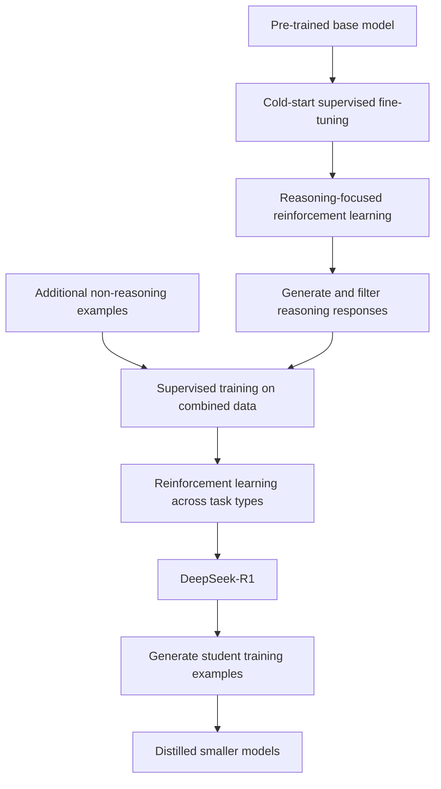

import PaperPdf from '@site/src/components/PaperPdf';

> **DeepSeek-AI · 2025** · [Read the embedded paper](#original-paper) · [Download PDF](/papers/research-papers/deepseek-r1.pdf)


DeepSeek-R1 studies how reinforcement learning with verifiable outcomes can improve a pre-trained model's reasoning, and how those behaviours can be transferred to smaller models.

## Start by separating three names

| Name | Starting point and training idea | What to remember |
|---|---|---|
| DeepSeek-R1-Zero | RL directly on a pre-trained base, without preliminary SFT | A study of reasoning improvement from outcome rewards |
| DeepSeek-R1 | Cold-start SFT plus multiple RL/SFT stages | Adds readability and broader usefulness to the pipeline |
| R1 distilled models | Smaller Qwen/Llama-based models trained on generated data | Different student architectures, not merely resized copies |

“Without SFT” in R1-Zero does not mean without pre-training, without data, or without a model that already knows language. It begins with DeepSeek-V3-Base. The paper studies post-training rather than training a reasoning system from random weights.

These notes follow the downloaded January 2025 v1 paper. Later revisions, releases and training methods should be evaluated separately.

## Section 2.2: why verifiable tasks are useful for RL

For a mathematical problem with a checkable answer, a program can assign a reward for correctness. For code, tests can provide an outcome signal. A separate format reward can encourage a response structure that is easy to parse.

**Outcome supervision** judges the final result. **Process supervision** judges intermediate steps. The R1-Zero setup uses rule-based outcome/format rewards rather than a neural process reward model. A correct final answer does not prove that every written intermediate statement is valid.

Rule-based rewards also have limits. Incomplete tests can accept a wrong program. A weak answer parser can be exploited. A reward implementation is part of the training specification, not an unquestionable definition of correctness.

## GRPO: compare several responses to the same question

PPO often uses a learned value critic. Group Relative Policy Optimisation instead samples a group of responses for each question and compares their rewards within that group. GRPO comes from earlier work; this paper applies it to the reasoning setup.

For response i with reward $r_i$:

$$
A_i=\frac{r_i-\operatorname{mean}(r_1,\ldots,r_G)}
{\operatorname{std}(r_1,\ldots,r_G)+\epsilon}.
$$

If rewards are `[0, 1, 1, 0]`, the population mean is 0.5 and standard deviation is 0.5, giving advantages `[-1, 1, 1, -1]`. Responses above their group's average are encouraged; those below it are discouraged.

The comparison must be **within one question's group**. Mixing unrelated easy and hard questions into one baseline changes what the advantage means.

### Clipped policy changes and a reference penalty

The v1 paper writes its objective over sampled outputs. Its ingredients are a current/old policy ratio, a clipped advantage term and a KL penalty against a reference policy:

$$
\min\left(\rho_i A_i,\operatorname{clip}(\rho_i,1-\epsilon,1+\epsilon)A_i\right)
-\beta D_{\mathrm{KL}}.
$$

An estimator used in the paper has the form $u-\log u-1$, where $u=\pi_{\mathrm{ref}}/\pi_\theta$. The old rollout policy and frozen reference play different roles, just as in the InstructGPT chapter.

The implementation below applies these ingredients token by token and averages over valid response tokens. It is an explicit educational implementation choice, not a literal transcription of the v1 paper's sequence-level notation.

### What if every reward is identical?

Then every centred reward is zero. An epsilon prevents division by zero, but it does not create a useful relative preference. The policy term contributes no group-ranking signal. This is one reason task difficulty, sampling diversity and reward design matter.

Removing the critic saves that model's training and memory cost. It does not remove the cost of generating several responses, evaluating rewards, or running the policy and reference.

## Read the R1-Zero figure carefully


*Figure 2 from the original paper, PDF page 7. [Source PDF](/papers/research-papers/deepseek-r1.pdf#page=7).*

This is the original R1-Zero training figure. It should not be confused with the final R1 benchmark table. The paper distinguishes single-sample performance from majority-vote results using multiple samples. Majority voting spends extra inference compute; it is not the same evaluation as asking the model once.

Longer answers and self-checking behaviour are observed during training. They are evidence about generated behaviour, not proof that every long response reasons correctly. The paper also reports readability and language-mixing problems that motivate the later pipeline.

## Section 2.3: the full R1 training sequence



**Cold start** gives a readable response format and useful initial examples. **Reasoning RL** improves responses using rewards. **Rejection sampling** retains acceptable generated examples and discards others. The resulting reasoning examples are combined with broader supervised data. A further RL stage targets multiple task types and preferences.

For the later supervised stage, the paper retrains the base model on the newly collected combined dataset; it does not simply treat dataset construction as another optimiser step on the reasoning-RL checkpoint.

Rejection sampling is not itself a gradient update. It constructs a dataset. SFT on that dataset is the learning step that follows.

## Distillation: students learn from generated targets

The paper's smaller models are fine-tuned using generated reasoning data. That is supervised transfer from a teacher's outputs. It is distinct from running the same RL procedure on a smaller model, and does not require matching the teacher's hidden states or architecture.

A student can inherit useful patterns and mistakes. Filtering affects the quality of the target dataset. Better student benchmarks do not establish that it reproduces the teacher's capabilities on every task.

## Real-world uses and worked examples

### Documented use: serving R1 and distilled models on AWS

AWS's January 2025 launch describes deployment routes for DeepSeek-R1 through Bedrock Marketplace and SageMaker JumpStart, and for distilled variants through additional hosting options. This is documented model availability for application building; it does not prove that a particular customer achieved a particular outcome. [AWS's launch account](https://aws.amazon.com/blogs/aws/deepseek-r1-models-now-available-on-aws/).

### Worked example: propose and check a code fix

Suppose a developer provides a function, a failing unit test and the expected behaviour. An application can ask a reasoning model to propose a correction, run the test in a separate execution environment, then return the result for another attempt if it fails.

| Part | Where it comes from |
|---|---|
| Model's learned problem-solving behaviour | Pre-training and reasoning-oriented post-training |
| Actual test execution | An external tool or sandbox |
| Decision to try another fix | The application's model/tool loop |
| Evidence that the change works | Test results and code review |

The workflow is illustrative. R1 does not execute Python merely by describing execution, and passing one test does not prove that a patch is correct for all inputs.

### Another application: a smaller model for a narrow tutoring task

A team might evaluate an R1-distilled student for explaining arithmetic or helping learners inspect a solution. Distillation transfers patterns from generated training examples to a smaller model, which changes hosting requirements and attainable quality.

The important distinction is **full R1 versus a distilled student**: they have different architectures and capabilities. A product labelled with an R1-derived model name should not automatically inherit the full model's published benchmark scores. For an interactive tutor, also measure response time and whether longer answers actually help the learner; extra inference tokens are a cost, not evidence of correctness.

## Complete code: SFT, GRPO, filtering and a smaller student

**Teaching implementation.** The script uses a recurrent policy on tiny arithmetic answer sequences. It includes a cold start, grouped sampling, rule rewards, detached old probabilities, a reference KL term, clipping, EOS masks, rejection sampling and supervised distillation.

Save as `deepseek_r1.py`, install PyTorch, and run `python deepseek_r1.py`.

```python
"""Run cold-start SFT, token-level GRPO, rejection sampling and distillation.
Teaching adaptation: tiny arithmetic answer sequences, synthetic supervision.
No claim of reproducing DeepSeek's reasoning or its full multi-stage dataset mix.
"""
import copy
import torch
from torch import nn
import torch.nn.functional as F

torch.manual_seed(7);torch.set_num_threads(1)
# A prompt is an integer 0..3; response is [answer, EOS], answer=(prompt+1)%4.
# Tokens 0..3 are answers; EOS=4, BOS=5.
class Policy(nn.Module):
    def __init__(self,width=24):
        super().__init__()
        self.prompt=nn.Embedding(4,width);self.token=nn.Embedding(6,width)
        self.rnn=nn.GRU(width,width,batch_first=True);self.head=nn.Linear(width,5)
    def forward(self,q,prefix):
        h,_=self.rnn(self.token(prefix),self.prompt(q)[None])
        return self.head(h)
    @torch.no_grad()
    def sample(self,q):
        prefix=torch.full((len(q),1),5)
        for _ in range(2):
            token=torch.distributions.Categorical(logits=self(q,prefix)[:,-1]).sample()
            prefix=torch.cat((prefix,token[:,None]),1)
        return prefix[:,1:]

def token_logp(model,q,response):
    prefix=torch.cat((torch.full((len(q),1),5),response[:,:-1]),1)
    return model(q,prefix).log_softmax(-1).gather(-1,response[:,:,None]).squeeze(-1)

def targets(q): return torch.stack(((q+1)%4,torch.full_like(q,4)),1)
def reward(q,response):
    correct=(response[:,0]==(q+1)%4).float()
    formatted=(response[:,1]==4).float()
    return correct+0.25*formatted

def sft(model,q,y,steps,lr=.02):
    optim=torch.optim.Adam(model.parameters(),lr=lr)
    for _ in range(steps):
        loss=-token_logp(model,q,y).mean()
        optim.zero_grad();loss.backward();optim.step()

policy=Policy();q=torch.arange(4)
sft(policy,q,targets(q),steps=3)  # Cold start; R1-Zero would skip this stage.
reference=copy.deepcopy(policy).eval()
for p in reference.parameters():p.requires_grad_(False)
optim=torch.optim.Adam(policy.parameters(),lr=.005)
group=16
for rollout in range(80):
    prompts=torch.arange(4).repeat_interleave(group)
    with torch.no_grad():
        response=policy.sample(prompts)
        rewards=reward(prompts,response).reshape(4,group)
        advantage=(rewards-rewards.mean(1,keepdim=True))/(rewards.std(1,keepdim=True,correction=0)+1e-8)
        advantage=advantage.reshape(-1,1)
        old_logp=token_logp(policy,prompts,response)
        ref_logp=token_logp(reference,prompts,response)
        # Include the first EOS token but exclude tokens after it.
        mask=torch.ones_like(response,dtype=torch.float)
        mask[:,1]=(response[:,0]!=4).float()
    for _ in range(2):
        logp=token_logp(policy,prompts,response)
        ratio=(logp-old_logp).exp()
        clipped=torch.minimum(ratio*advantage,ratio.clamp(.8,1.2)*advantage)
        log_ratio=ref_logp-logp
        kl=log_ratio.exp()-log_ratio-1
        per_token=clipped-.02*kl
        objective=((per_token*mask).sum(1)/mask.sum(1)).mean()
        optim.zero_grad();(-objective).backward()
        nn.utils.clip_grad_norm_(policy.parameters(),1.);optim.step()
# Rejection sampling collects verified answers, then supervised distillation.
with torch.no_grad():
    prompts=q.repeat_interleave(128);responses=policy.sample(prompts)
    accepted=(responses==targets(prompts)).all(1)
    print('Verified response fraction:',accepted.float().mean().item())
    train_q,train_y=prompts[accepted],responses[accepted]
assert accepted.any()
student=Policy(width=12)
sft(student,train_q,train_y,steps=100)
with torch.no_grad():
    student_response=student.sample(q.repeat_interleave(64))
    accuracy=(student_response==targets(q.repeat_interleave(64))).all(1).float().mean()
print('Distilled student exact-answer rate:',accuracy.item())
torch.save({'teacher':policy.state_dict(),'student':student.state_dict()},'r1-demo.pt')
```

### What each stage demonstrates

The policy first receives three SFT updates. `sample` then generates responses from the current policy. Groups contain multiple responses to the same prompt. Reward normalisation happens before flattening the groups, preserving that relationship.

`old_logp`, `ref_logp` and advantages are computed without gradients. During updates, only the current policy log probabilities carry gradients. The mask includes the first EOS token and excludes positions after it; otherwise padding or post-termination tokens would distort the objective.

The filtering stage keeps only exact verified answer sequences. A narrower student learns those sequences with cross-entropy. The checked run accepted about 99% of teacher samples and produced a similarly high student answer rate on this tiny task.

This code demonstrates the mechanics, not natural-language reasoning emergence. It omits the original DeepSeek-V3 architecture, long responses, large datasets, the full non-reasoning data mixture and the second broad RL stage. The [release repository](https://github.com/deepseek-ai/DeepSeek-R1) provides released model information and usage material, not a complete reproduction of the training system.

## Sections 3–4: results, unsuccessful routes and limitations

The original report evaluates mathematics, coding, knowledge and general tasks, and compares distilled students with alternatives. Read pass@1, multi-sample aggregation and model size separately. The paper also discusses approaches that did not work as hoped, including difficulties with process reward models and tree-search-style methods in its setting.

Those unsuccessful attempts matter: they prevent a neat final pipeline from looking inevitable. They are observations under a particular implementation and budget, not proof that all future versions of those ideas must fail.

## What changes between the full training stages?

### R1-Zero's template is a constraint, not a reasoning algorithm

The initial setup specifies a response structure separating reasoning text from the final answer. It does not hand-code a particular problem-solving strategy. Rule rewards judge answer correctness and format, and the policy's generated behaviour changes during RL.

The observed increase in response length and self-correction is an empirical behaviour. It does not prove consciousness, guarantee faithful intermediate explanations, or show that every additional token improves the answer. The paper's highlighted “aha” example is a qualitative trajectory, while the benchmark curves provide separate aggregate evidence.

### R1 introduces more than a small SFT warm-up

The cold-start data is curated for useful, readable reasoning examples. The later reasoning-focused RL stage also adds a language-consistency reward to discourage mixed-language responses. The paper reports a trade-off between that readability objective and reasoning performance.

Rejection sampling then produces a larger supervised dataset. The paper describes about 600,000 reasoning examples and 200,000 non-reasoning examples. Some later data judgement uses model-based evaluation, so **“R1-Zero uses rule rewards” must not be expanded into “every R1 stage uses only rule rewards”**.

The resulting combined dataset is used to fine-tune the base model for the later stage. A further RL phase combines rule-based reasoning rewards with preference rewards for broader tasks. Helpfulness evaluation emphasises the final response, while harmlessness evaluation considers the whole response in that setup.

These changing data sources and reward roles are central to the method. A diagram with one box labelled “RL” would omit much of the actual training story.

### Distillation is compared with direct RL on a smaller model

The paper compares training a smaller model directly with RL against fine-tuning it on teacher-generated examples. The distilled model performs better in the reported comparison. This supports the value of the teacher's generated training data in that setting; it is not a proof that small models can never benefit from RL.

For the released students, their underlying Qwen or Llama base, size and training history matter. They are not slices of the full teacher's mixture-of-experts network. The student code in this chapter demonstrates supervised transfer using a smaller recurrent model, not weight extraction from the teacher.

### Why process rewards and tree search were difficult

A process reward model must judge an intermediate reasoning step. That requires defining what a step is, deciding whether it is useful or correct, and preventing the policy from exploiting the judge. Fine-grained human labels are expensive, while automatic judges can introduce errors.

Tree search explores alternative partial solutions. Language permits many continuations, making branching large; comparing incomplete solutions requires a useful value signal. The paper reports difficulties making these approaches effective within its pipeline. They remain possible research directions, not approaches disproved in general.

### Limitations that affect an actual application

The report identifies weaknesses relative to DeepSeek-V3 in some general capabilities, including structured outputs, tool/function use and multi-turn tasks. It also reports prompt sensitivity and, for its evaluations, worse results with few-shot prompts than direct task descriptions.

Software-engineering evaluation is expensive because running tests can take much longer than checking an arithmetic answer. That limits how efficiently reward feedback can be collected. Consequently, strong competitive-programming results do not automatically imply comparable gains on repository-level engineering work.

Read benchmark comparisons with model identity, sampling settings, answer aggregation and response-length budgets attached. These factors determine what “better reasoning performance” means in a specific table. [Original v1 report, Sections 2.2–5](/papers/research-papers/deepseek-r1.pdf).

## Summary and self-check

- [ ] I can distinguish R1-Zero, R1 and the distilled students.
- [ ] I can calculate group-relative advantages and explain the equal-reward case.
- [ ] I can identify the old policy, reference and trainable policy in code.
- [ ] I can explain why rejection sampling and SFT are separate operations.
- [ ] I can compare pass@1 with majority voting under different inference budgets.
- [ ] I can state which stages the small runnable experiment implements and which remain original-scale research details.


## Original paper

<PaperPdf slug="deepseek-r1" title="DeepSeek-R1: Incentivizing Reasoning Capability in LLMs via Reinforcement Learning" />
