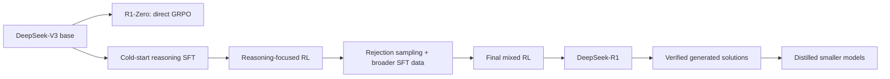
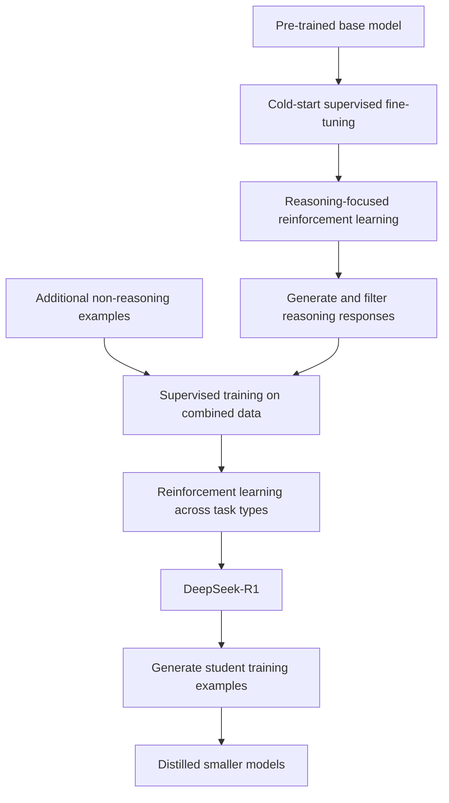

import PaperPdf from '@site/src/components/PaperPdf';
import CodeWalkthrough from '@site/src/components/viz/CodeWalkthrough';
import ResearchPaperLab from '@site/src/components/viz/ResearchPaperLab';

> **DeepSeek-AI · 2025** · [Read the embedded paper](#original-paper) ·
> [Download PDF](/papers/research-papers/deepseek-r1.pdf) · Notes follow the
> paper section by section, §1 to the appendix.

## Paper in one minute

**Problem.** High-quality step-by-step reasoning data is expensive, while many
mathematics and coding tasks have final answers that can be checked automatically.

**Key idea.** Use group-relative reinforcement learning with verifiable outcome
rewards, then combine cold-start supervision, filtered generated data and further
training to improve readability and broad behaviour; distil successful outputs
into smaller students.

**Why it matters.** The work demonstrates strong post-training gains without a
separate learned critic in GRPO. Correct outcomes do not prove faithful reasoning,
and the full R1 pipeline is more than a single RL stage.

### Post-training flow



## How to read this chapter

The walkthrough below follows the paper **in its own order**, from the abstract
to the appendix. Each heading carries the paper's section number, so you can
keep the PDF open beside it. Equations use the paper's notation. Boxes marked
**not from the paper** are teaching aids, such as analogies, derivations or
worked numbers, added to make a step easier to follow.

These notes follow the downloaded January 2025 v1 paper (arXiv 2501.12948v1).
Later revisions, releases and training methods should be evaluated separately.

## Abstract: the four claims

Two terms first. **Reinforcement learning** (RL) trains a model by letting it try
things and rewarding good results, rather than showing it the right answer.
**Supervised fine-tuning** (SFT) is the opposite: training on example answers
written in advance. The abstract claims:

1. **DeepSeek-R1-Zero**, trained by large-scale RL **without SFT as a first
   step**, shows remarkable reasoning, and many useful reasoning behaviours
   "naturally" emerge.
2. R1-Zero has problems: **poor readability** and **language mixing**.
3. **DeepSeek-R1** fixes these with **multi-stage training and cold-start data**
   before RL, and reaches performance **comparable to OpenAI-o1-1217** on
   reasoning tasks.
4. The authors open-source R1-Zero, R1 and **six smaller dense models** (1.5B,
   7B, 8B, 14B, 32B, 70B) **distilled** from R1, based on Qwen and Llama.

Figure 1 on the first page backs claim 3 with a bar chart. Its numbers, in %:

| Benchmark (metric)        | DeepSeek-R1 | OpenAI-o1-1217 | DeepSeek-V3 |
| ------------------------- | ----------- | -------------- | ----------- |
| AIME 2024 (pass@1)        | 79.8        | 79.2           | 39.2        |
| Codeforces (percentile)   | 96.3        | 96.6           | 58.7        |
| GPQA Diamond (pass@1)     | 71.5        | 75.7           | 59.1        |
| MATH-500 (pass@1)         | 97.3        | 96.4           | 90.2        |
| MMLU (pass@1)             | 90.8        | 91.8           | 88.5        |
| SWE-bench Verified        | 49.2        | 48.9           | 42.0        |

**What this shows:** R1 is level with o1-1217, ahead on some tests and behind on
others, and far ahead of DeepSeek-V3, the chat model built on the same base.

<details>
<summary>Full Figure 1 data from the paper</summary>

| Benchmark (metric)      | DeepSeek-R1 | o1-1217 | R1-32B | o1-mini | DeepSeek-V3 |
| ----------------------- | ----------- | ------- | ------ | ------- | ----------- |
| AIME 2024 (pass@1)      | 79.8        | 79.2    | 72.6   | 63.6    | 39.2        |
| Codeforces (percentile) | 96.3        | 96.6    | 90.6   | 93.4    | 58.7        |
| GPQA Diamond (pass@1)   | 71.5        | 75.7    | 62.1   | 60.0    | 59.1        |
| MATH-500 (pass@1)       | 97.3        | 96.4    | 94.3   | 90.0    | 90.2        |
| MMLU (pass@1)           | 90.8        | 91.8    | 87.4   | 85.2    | 88.5        |
| SWE-bench Verified      | 49.2        | 48.9    | 36.8   | 41.6    | 42.0        |

</details>

:::note Some Figure 1 numbers appear nowhere else

For the distilled R1-32B, Figure 1 gives MMLU 87.4, SWE-bench 36.8 and a
Codeforces percentile of 90.6. None of these appears in the paper's tables;
Table 5 reports only a Codeforces rating (1691) for that model. The other bars
match Tables 4 and 5.

:::

## §1 Introduction

**Post-training** is everything done to a model after its long pre-training on
ordinary text. The paper notes it is cheap compared with pre-training but can
raise reasoning accuracy, align models with social values and adapt them to
users.

OpenAI's o1 models were the first to use **inference-time scaling**: letting the
model write a longer **chain of thought** (CoT), a step-by-step working, before
answering. Others had tried process reward models, RL, and search methods such
as Monte Carlo Tree Search and beam search, but none matched o1 on general
reasoning.

This paper's first step is **pure RL**: can a model develop reasoning "without
any supervised data", through self-evolution? It starts from **DeepSeek-V3-Base**
and uses **GRPO** as the RL algorithm. After thousands of RL steps, R1-Zero's
AIME 2024 pass@1 rises from **15.6% to 71.0%**, and to **86.7%** with majority
voting.

"Without SFT" in R1-Zero does not mean without pre-training, without data, or
without a model that already knows language. It begins with DeepSeek-V3-Base.
The paper studies post-training rather than training a reasoning system from
random weights.

R1-Zero reads badly and mixes languages, so the authors build **DeepSeek-R1**:
fine-tune V3-Base on thousands of **cold-start** examples, run reasoning RL,
create new SFT data by **rejection sampling** from the RL checkpoint plus V3's
supervised data (writing, factual QA, self-cognition), **retrain V3-Base** on
it, and run one more RL stage over all kinds of prompts. The result performs on
par with OpenAI-o1-1217.

Finally, distilling R1 into Qwen2.5-32B **beats running RL on Qwen2.5-32B
directly**. The distilled 14B model beats QwQ-32B-Preview "by a large margin",
and the 32B and 70B set new records among dense models.

:::note "Matching" or "exceeding"?

The introduction says R1-Zero's 86.7% with majority voting is "matching" o1-0912.
§2.2.4 says it "exceeding" o1-0912, and Table 2 agrees with that: o1-0912's
cons@64 is 83.3.

:::

:::tip In the real world (not from the paper)

Inference-time scaling is the "thinking" mode now offered by many chat
assistants: the model spends extra tokens, and extra seconds, before it answers
a hard question. It is like a student who is allowed to use scrap paper on an
exam. The scrap paper costs time but raises the score on hard problems.

:::

### §1.1 Contributions

The paper claims two groups of contributions.

**Post-training: large-scale RL on the base model.**

- RL applied **directly to the base model**, with no SFT first, lets the model
  explore chains of thought and produces R1-Zero. It shows self-verification,
  reflection and long CoTs. The authors call it "the first open research to
  validate that reasoning capabilities of LLMs can be incentivized purely
  through RL".
- The R1 pipeline has **two RL stages** (to find better reasoning patterns and to
  align with human preferences) and **two SFT stages** (to seed reasoning and
  non-reasoning abilities).

**Distillation: smaller models can be powerful too.**

- Reasoning patterns of a large model can be distilled into small ones, and this
  works **better than RL on the small models themselves**.
- DeepSeek-R1-Distill-Qwen-7B reaches **55.5%** on AIME 2024, beating
  QwQ-32B-Preview. Distill-Qwen-32B reaches **72.6%** on AIME 2024, **94.3%** on
  MATH-500 and **57.2%** on LiveCodeBench.

:::note What "purely through RL" means

R1-Zero skips SFT, but it starts from DeepSeek-V3-Base, which was pre-trained on
a huge text corpus that may already contain step-by-step solutions. "Purely
through RL" describes the post-training, not the model's whole history. The
"first open research" wording is a priority claim the paper does not try to
prove.

:::

### §1.2 Summary of evaluation results

- **Reasoning.** 79.8% pass@1 on AIME 2024, slightly above o1-1217; 97.3% on
  MATH-500, on par with o1-1217. On Codeforces, a **2,029 Elo rating**, better
  than **96.3%** of human participants. An **Elo rating** is a skill score, as in
  chess, where higher beats lower. On engineering tasks it is slightly better
  than DeepSeek-V3.
- **Knowledge.** 90.8% on MMLU, 84.0% on MMLU-Pro and 71.5% on GPQA Diamond,
  clearly above DeepSeek-V3 and other closed models but slightly below o1-1217.
  It also beats V3 on the factual benchmark SimpleQA.
- **Others.** Strong creative writing, question answering, editing and
  summarisation: an **87.6%** length-controlled win-rate on AlpacaEval 2.0 and
  **92.3%** on Arena-Hard, where a **win-rate** is how often a judge model prefers
  its answer to a reference model's. It also beats V3 on long-context tasks.

The detailed numbers are in Table 4 (§3.1).

## §2 Approach

### §2.1 Overview

Earlier work relied on large amounts of supervised data. This paper shows that
reasoning can improve a lot through large-scale RL **even without SFT as a cold
start**, and improves further with a small amount of cold-start data. It
presents three things: (1) **R1-Zero**, RL on the base model with no SFT data;
(2) **R1**, RL starting from a checkpoint fine-tuned on thousands of long CoT
examples; and (3) **distillation** of R1's reasoning into small dense models.

### §2.2 DeepSeek-R1-Zero: reinforcement learning on the base model

The authors' earlier RL work for reasoning depended on supervised data, which
takes time to collect. Here they ask what the model can learn with **no
supervised data at all**, only rewards.

#### §2.2.1 Reinforcement learning algorithm

**PPO**, the usual RL algorithm for language models, trains a second network
called a **critic** (or value model) that predicts how good a partial answer is.
The critic is typically as large as the model being trained, so it doubles the
cost. **Group Relative Policy Optimisation** (GRPO, from Shao et al. 2024)
drops the critic. Instead, for each question it samples **a group of answers**
and judges each answer against the others in its group. GRPO comes from earlier
work; this paper applies it to the reasoning setup.

:::tip Intuition: grading on a curve (not from the paper)

Imagine a teacher who does not know the "expected" mark for a hard question.
She asks 16 students to answer it, then marks each answer relative to the class
average: above average earns praise, below average earns criticism. The class
itself supplies the baseline, so no separate expert is needed to say what a
typical answer is worth.

:::

Formally, for each question $q$, GRPO samples outputs $\{o_1,o_2,\cdots,o_G\}$
from the **old policy** $\pi_{\theta_{old}}$ (the model as it was when the
answers were sampled) and updates the **policy** $\pi_\theta$ by maximising
**Equation 1**:

$$
\mathcal{J}_{GRPO}(\theta)=\mathbb{E}\left[q\sim P(Q),\{o_i\}_{i=1}^{G}\sim\pi_{\theta_{old}}(O\mid q)\right]
\frac{1}{G}\sum_{i=1}^{G}\left(\min\left(\frac{\pi_\theta(o_i\mid q)}{\pi_{\theta_{old}}(o_i\mid q)}A_i,\ \operatorname{clip}\left(\frac{\pi_\theta(o_i\mid q)}{\pi_{\theta_{old}}(o_i\mid q)},1-\varepsilon,1+\varepsilon\right)A_i\right)-\beta\,\mathbb{D}_{KL}\left(\pi_\theta\,\|\,\pi_{ref}\right)\right)
$$

In words: make above-average answers more likely and below-average answers less
likely, but never move the probability of an answer by more than a factor of
$1\pm\varepsilon$ in one update, and pay a penalty for drifting away from a
frozen **reference model** $\pi_{ref}$.

The penalty is **Equation 2**:

$$
\mathbb{D}_{KL}\left(\pi_\theta\,\|\,\pi_{ref}\right)=\frac{\pi_{ref}(o_i\mid q)}{\pi_\theta(o_i\mid q)}-\log\frac{\pi_{ref}(o_i\mid q)}{\pi_\theta(o_i\mid q)}-1.
$$

In words: a measure of how far the current model's probability for this answer
has moved from the reference model's. It is zero when they agree.

The **advantage** $A_i$, how much better answer $i$ is than its group, is
**Equation 3**:

$$
A_i=\frac{r_i-\operatorname{mean}(\{r_1,r_2,\cdots,r_G\})}{\operatorname{std}(\{r_1,r_2,\cdots,r_G\})}.
$$

In words: subtract the group's average reward and divide by the group's spread.
$\varepsilon$ and $\beta$ are hyperparameters.

:::tip Worked number (not from the paper)

If rewards are `[0, 1, 1, 0]`, the population mean is 0.5 and standard deviation
is 0.5, giving advantages `[-1, 1, 1, -1]`. Responses above their group's average
are encouraged; those below it are discouraged. If the implementation uses the
sample standard deviation instead (dividing by $G-1$), the spread is about
0.577 and the advantages become about $\pm0.87$. The paper does not say which.

:::

The comparison must be **within one question's group**. Mixing unrelated easy and
hard questions into one baseline changes what the advantage means.

The old rollout policy and the frozen reference play different roles, just as in
the [InstructGPT chapter](/docs/research-papers/instructgpt). The old policy
generated this batch and anchors the clipped ratio for a few updates. The
reference stays fixed for the whole run and anchors the KL penalty.

Equation 2 has the form $u-\log u-1$, where $u=\pi_{\mathrm{ref}}/\pi_\theta$.
This is always at least zero, and exactly zero when $u=1$.

:::note Three gaps between the equations and a runnable algorithm

- **Equation 2 is an estimator, not the KL divergence itself.** It is a
  per-sample quantity whose average equals the KL divergence; the paper labels
  it $\mathbb{D}_{KL}$ without comment.
- **Sequence level versus token level.** The v1 paper writes the ratio over whole
  outputs, $\pi_\theta(o_i\mid q)$. The original GRPO paper (Shao et al., 2024)
  applies it per token and averages over each output's length. The
  implementation below applies these ingredients token by token and averages
  over valid response tokens. That is an explicit educational choice, not a
  literal transcription of the v1 notation.
- **No hyperparameters.** The v1 paper gives no values for $\varepsilon$,
  $\beta$, the group size $G$, the learning rate or the number of RL steps
  beyond "thousands". Equation 3 also has no small $\epsilon$ in the
  denominator; implementations add one to avoid dividing by zero.

:::

**What if every reward is identical?** Then every centred reward is zero. An
epsilon prevents division by zero, but it does not create a useful relative
preference. The policy term contributes no group-ranking signal. This is one
reason task difficulty, sampling diversity and reward design matter.

Removing the critic saves that model's training and memory cost. It does not
remove the cost of generating several responses, evaluating rewards, or running
the policy and reference.

:::tip In the real world (not from the paper)

GRPO is now a standard tool. Hugging Face's TRL library ships a `GRPOTrainer`,
and Hugging Face's open-r1 project used it to reproduce parts of this paper in
the open. The project at the end of this chapter uses the same trainer.

:::

#### §2.2.2 Reward modelling

The reward decides which way the model is pushed, so it is "the source of the
training signal". R1-Zero uses a **rule-based** reward system with two parts:

- **Accuracy rewards** check whether the answer is right. For maths problems with
  a single deterministic result, the model must give its final answer in a set
  format (for example in a box) so a program can check it. For LeetCode-style
  problems, a compiler runs **predefined test cases**.
- **Format rewards** require the model to put its thinking between `<think>` and
  `</think>` tags.

The authors deliberately use **no neural reward model**, neither an outcome nor
a process one. A neural reward model can suffer from **reward hacking**, where
the policy finds answers that fool the judge instead of solving the problem, and
retraining it costs resources and complicates the pipeline.

**Outcome supervision** judges the final result. **Process supervision** judges
intermediate steps. R1-Zero uses outcome and format rules only. A correct final
answer does not prove that every written intermediate statement is valid.

Rule-based rewards also have limits. Incomplete tests can accept a wrong program.
A weak answer parser can be exploited. A reward implementation is part of the
training specification, not an unquestionable definition of correctness.

:::note How the two rewards combine is not stated

For R1-Zero the paper does not say how accuracy and format rewards are weighted
or added. §2.3.2 says only that R1's later accuracy and language rewards are
summed.

:::

:::tip In the real world (not from the paper)

This is how online judges such as LeetCode and Codeforces, and university
autograders, already mark code: run hidden tests and report pass or fail. A
maths answer box works like a multiple-choice answer sheet, easy for a machine
to mark even when the working is long.

:::

#### §2.2.3 Training template

To get the base model to follow instructions at all, the authors wrap every
question in a simple template, Table 1 of the paper:

```text
A conversation between User and Assistant. The user asks a question, and the
Assistant solves it. The assistant first thinks about the reasoning process in
the mind and then provides the user with the answer. The reasoning process and
answer are enclosed within <think> </think> and <answer> </answer> tags,
respectively, i.e., <think> reasoning process here </think>
<answer> answer here </answer>. User: prompt. Assistant:
```

"prompt" is replaced by the actual question. The template only fixes the
**structure**: reasoning first, then the answer. The authors deliberately avoid
content rules, such as requiring reflection or a particular strategy, so that
they can watch how the model's reasoning develops on its own.

The template is a constraint, not a reasoning algorithm. It does not hand-code
a problem-solving strategy. Rule rewards judge answer correctness and format,
and the policy's generated behaviour changes during RL.

:::tip In the real world (not from the paper)

The released DeepSeek-R1 still shows this structure: in chat interfaces its
reasoning appears between `<think>` tags before the final answer, and
applications often hide or collapse that part for users.

:::

#### §2.2.4 Performance, self-evolution process and aha moment of DeepSeek-R1-Zero

**Performance.** Figure 2 tracks R1-Zero's AIME 2024 accuracy during RL. For
each question the authors sample **16 responses** and average their accuracy for
a stable estimate. **Average pass@1** rises from **15.6% to 71.0%**, comparable
to OpenAI-o1-0912. **AIME** is a hard American maths competition for school
students. Table 2 of the paper compares R1-Zero with two o1 models:

| Model            | AIME pass@1 | AIME cons@64 | MATH-500 | GPQA Diamond | LiveCodeBench | Codeforces rating |
| ---------------- | ----------- | ------------ | -------- | ------------ | ------------- | ----------------- |
| OpenAI-o1-mini   | 63.6        | 80.0         | 90.0     | 60.0         | 53.8          | 1820              |
| OpenAI-o1-0912   | 74.4        | 83.3         | 94.8     | 77.3         | 63.4          | 1843              |
| DeepSeek-R1-Zero | 71.0        | 86.7         | 95.9     | 73.3         | 50.0          | 1444              |

**What this shows:** with no supervised data at all, R1-Zero matches o1-0912 on
maths, and beats it once answers are put to a majority vote. On coding it is
well behind both o1 models.

**cons@64** means sample 64 answers and take the most common one (a
**consensus**, or majority vote). With it, R1-Zero rises from 71.0% to **86.7%**,
exceeding o1-0912. The paper reads this as strong foundations: competitive with
and without voting.


_Figure 2 from the original paper, PDF page 7.
[Source PDF](/papers/research-papers/deepseek-r1.pdf#page=7)._

This is the original R1-Zero training figure. It should not be confused with the
final R1 benchmark table. The paper distinguishes single-sample performance from
majority-vote results using multiple samples. Majority voting spends extra
inference compute; it is not the same evaluation as asking the model once.

:::note "Comparable" mainly means maths

Table 2 shows R1-Zero below o1-0912 on AIME pass@1 (71.0 against 74.4) and GPQA
(73.3 against 77.3), and far below on LiveCodeBench (50.0 against 63.4) and
Codeforces (1444 against 1843). It is below even o1-mini on both coding
columns. The "comparable to o1-0912" claim holds for maths.

:::

**Self-evolution.** Because RL starts straight from the base model, the authors
can watch the model change without any SFT influence. Figure 3 shows the
**average response length** on the training set growing steadily through RL:
the model learns by itself to spend more "thinking time", from hundreds to
thousands of reasoning tokens. Behaviours such as **reflection** (revisiting and
re-checking earlier steps) and **trying alternative approaches** appear without
being programmed.

**Aha moment.** An intermediate version of R1-Zero shows what the authors call an
"aha moment", Table 3 of the paper. Working on the question "If $a>1$, then the
sum of the real solutions of $\sqrt{a-\sqrt{a+x}}=x$ is equal to", the model
squares both sides, then stops and writes: "Wait, wait. Wait. That's an aha
moment I can flag here." It then re-evaluates the problem step by step. The
authors note the anthropomorphic tone and call it an aha moment for themselves
too: they gave the model incentives, not instructions, and it developed the
strategy of re-thinking.

:::tip Worked number: the aha-moment question (not from the paper)

The table cuts off before the answer, so here it is. Let $y=\sqrt{a+x}$. Then
$x^2=a-y$ and $y^2=a+x$. Subtracting gives $y^2-x^2=x+y$, so $y-x=1$. Putting
$y=x+1$ into $x^2=a-y$ gives $x^2+x+1-a=0$. Only the non-negative root counts,
since $x$ is a square root: $x=\frac{\sqrt{4a-3}-1}{2}$. That single solution is
the "sum".

:::

The observed increase in response length and self-correction is an empirical
behaviour. It does not prove consciousness, guarantee faithful intermediate
explanations, or show that every additional token improves the answer. The
paper's highlighted "aha" example is a qualitative trajectory, while the
benchmark curves provide separate aggregate evidence.

:::note Interpretation, not measurement

The paper calls the growth in thinking time "not the result of external
adjustments but rather an intrinsic development". It does not test whether
longer answers cause the accuracy gain, and it gives one aha example with no
count of how often such moments occur.

:::

**Drawback of DeepSeek-R1-Zero.** Despite strong reasoning, R1-Zero has **poor
readability** and **language mixing**, switching between languages inside one
answer. That motivates DeepSeek-R1, which adds human-friendly cold-start data.

:::tip In the real world (not from the paper)

The trade-off is familiar from students who "show their work": a long, messy
working can reach the right answer, but nobody else can follow it. Longer
reasoning also has a direct cost for products, since reasoning tokens take time
to generate and are usually billed like any other tokens.

:::

### §2.3 DeepSeek-R1: reinforcement learning with cold start

R1-Zero raises two questions. Can a little high-quality data **improve results or
speed up convergence**? And how do you train a **user-friendly** model with clear
chains of thought and strong general abilities? The answer is a four-stage
pipeline.



**Cold start** gives a readable response format and useful initial examples.
**Reasoning RL** improves responses using rewards. **Rejection sampling** retains
acceptable generated examples and discards others. The resulting reasoning
examples are combined with broader supervised data. A further RL stage targets
multiple task types and preferences.

These changing data sources and reward roles are central to the method. A
diagram with one box labelled "RL" would omit much of the actual training story.

#### §2.3.1 Cold start

RL straight from a base model has an **unstable early phase**. To avoid it, the
authors first fine-tune V3-Base on a small set of **long CoT examples** and use
that as the starting point, the initial RL **actor**. They collected the data in
several ways: few-shot prompting with a long CoT as the example, prompting models
directly for detailed answers with reflection and verification, taking R1-Zero
outputs in readable form, and cleaning results up with **human annotators**. In
total they collect **thousands** of cold-start examples.

Compared with R1-Zero, this brings two advantages:

- **Readability.** R1-Zero's answers often mix languages or lack formatting. The
  cold-start data uses a readable pattern with a **summary at the end**, and
  unreadable responses are filtered out. The format is
  `|special_token|<reasoning_process>|special_token|<summary>`.
- **Potential.** With the pattern designed using human priors, the authors
  observe better performance than R1-Zero, and they believe "iterative training
  is a better way for reasoning models".

The cold-start data is curated for useful, readable reasoning examples. It is
more than a small SFT warm-up.

:::note No size or ablation for the cold start

"Thousands" is all the paper says about the size of the cold-start set. It
reports no experiment isolating the cold start's effect, so the "better
performance" claim cannot be separated from the later stages.

:::

:::tip Intuition: a worked-examples sheet (not from the paper)

A maths teacher hands out a few fully worked, neatly written solutions before
setting practice problems. Students still learn by practising (the RL stage),
but they start from a clear house style instead of inventing one, and their
homework is easier to mark.

:::

#### §2.3.2 Reasoning-oriented reinforcement learning

After the cold start, the model goes through **the same large-scale RL as
R1-Zero**, focused on reasoning-heavy tasks with clear solutions: coding, maths,
science and logic.

The chains of thought still mix languages, especially when prompts involve
several languages. So the authors add a **language consistency reward**: the
**proportion of words in the CoT that are in the target language**. The final
reward is the **sum** of the accuracy reward and this language reward:

$$
r=r_{\text{accuracy}}+r_{\text{language}}.
$$

In words: a correct, single-language answer scores highest. RL then runs until
it converges on the reasoning tasks.

An ablation shows the language reward causes **a slight drop in performance**, but
the authors keep it because it matches human preferences and makes answers more
readable.

:::tip Worked number (not from the paper)

A French question gets a 200-word chain of thought, of which 150 words are
French and 50 are English. The language reward is $150/200=0.75$. A correct
answer then scores $1+0.75=1.75$, while a correct all-French answer scores 2.0.

:::

:::note The ablation numbers are not shown

The paper reports the "slight degradation" in words only; no table gives its
size.

:::

:::tip In the real world (not from the paper)

A user who asks in Spanish expects to read Spanish, including any visible
reasoning. The limitation survives into the final model: §5 lists language
mixing for languages other than Chinese and English as unsolved.

:::

#### §2.3.3 Rejection sampling and supervised fine-tuning

When reasoning RL converges, its checkpoint is used to create SFT data for the
next round. Unlike the cold start, this round adds **other domains**, such as
writing and role-play, to make the model generally useful.

**Rejection sampling** means generating several answers and keeping only the good
ones. Rejection sampling is not itself a gradient update. It constructs a
dataset. SFT on that dataset is the learning step that follows.

**Reasoning data, about 600k samples.** For each reasoning prompt the checkpoint
generates several responses, and only the **correct** ones are kept. The earlier
stage used only rule-checkable data; this stage adds data judged by a
**generative reward model**, which means feeding the ground truth and the model's
prediction to **DeepSeek-V3 for judgement**. Responses with mixed languages, long
paragraphs or code blocks in the chain of thought are filtered out.

**Non-reasoning data, about 200k samples.** For writing, factual QA,
self-cognition and translation, the authors reuse parts of DeepSeek-V3's SFT
data. For some tasks V3 is prompted to write a chain of thought before the
answer; for simple queries such as "hello", no CoT is given.

They then fine-tune **DeepSeek-V3-Base** (not the RL checkpoint) **for two
epochs** on the combined **800k** samples.

For the later supervised stage, the paper retrains the base model on the newly
collected combined dataset; it does not simply treat dataset construction as
another optimiser step on the reasoning-RL checkpoint. Some data judgement here
uses model-based evaluation, so **"R1-Zero uses rule rewards" must not be
expanded into "every R1 stage uses only rule rewards"**.

:::tip In the real world (not from the paper)

Building a study guide works the same way: attempt each past-paper question
several times, keep only the attempts that match the answer key, and study
those. Meta used a similar step, rejection-sampling fine-tuning, when training
Llama 2's chat models.

:::

#### §2.3.4 Reinforcement learning for all scenarios

A **second RL stage** aims to make the model more **helpful** and **harmless**
while still improving reasoning. It mixes reward signals and prompt types:

- **Reasoning prompts** keep R1-Zero's rule-based rewards for maths, code and
  logic.
- **General prompts** use **reward models** trained to capture human preferences,
  following the DeepSeek-V3 pipeline and a similar distribution of preference
  pairs and prompts.
- **Helpfulness** is judged on the **final summary only**, so the judgement is
  about usefulness to the user and interferes little with the reasoning.
- **Harmlessness** is judged on the **whole response**, reasoning and summary,
  to catch risks, biases or harmful content anywhere in it.

A further RL phase thus combines rule-based reasoning rewards with preference
rewards for broader tasks. Helpfulness evaluation emphasises the final response,
while harmlessness evaluation considers the whole response in that setup.

:::note Little detail, one side effect

The paper gives no numbers for the preference reward models or this stage.
§3.1 later reports one side effect: after this safety RL, R1 refuses some Chinese
factual questions and scores below V3 on C-SimpleQA.

:::

:::tip In the real world (not from the paper)

This is the RLHF stage familiar from chat assistants, described in the
[InstructGPT chapter](/docs/research-papers/instructgpt). Judging helpfulness on
the summary alone is a practical choice for products that hide the reasoning:
the user only reads the summary, so that is what should be useful.

:::

### §2.4 Distillation: empower small models with reasoning capability

**Distillation** trains a small **student** model to imitate a large **teacher**.
Here the student is simply fine-tuned (SFT) on the teacher's outputs: the
**800k samples** of §2.3.3. The paper finds this "straightforward distillation
method" greatly improves small models' reasoning.

The students are open-source models from two families:

| Student base model      | Family          |
| ----------------------- | --------------- |
| Qwen2.5-Math-1.5B       | Qwen (maths)    |
| Qwen2.5-Math-7B         | Qwen (maths)    |
| Qwen2.5-14B             | Qwen            |
| Qwen2.5-32B             | Qwen            |
| Llama-3.1-8B            | Llama           |
| Llama-3.3-70B-Instruct  | Llama           |

Llama-3.3 is chosen for the 70B because its reasoning is slightly better than
Llama-3.1's. The students get **only SFT, no RL**, "even though incorporating RL
could substantially boost model performance". The goal is to show that
distillation works, leaving RL on students to others.

The paper's smaller models are fine-tuned using generated reasoning data. That
is supervised transfer from a teacher's outputs. It is distinct from running the
same RL procedure on a smaller model, and does not require matching the
teacher's hidden states or architecture.

A student can inherit useful patterns and mistakes. Filtering affects the
quality of the target dataset. Better student benchmarks do not establish that
it reproduces the teacher's capabilities on every task.

:::note Who wrote the 800k samples?

§2.4 calls them "800k samples curated with DeepSeek-R1, as detailed in §2.3.3",
and §5 says R1 was "the teacher model to generate 800K training samples". But
§2.3.3 describes the 600k reasoning samples as coming from the **stage-two RL
checkpoint**, before the final RL stage, and the 200k non-reasoning samples as
largely **DeepSeek-V3's** data. The paper does not reconcile the two
descriptions. Note also that the 70B student starts from an **Instruct** model,
while the other five start from base models.

:::

:::tip In the real world (not from the paper)

The distilled students are what most people actually run. Local runners such as
Ollama offer "deepseek-r1" in sizes from 1.5B to 70B, and those small sizes are
these Qwen- and Llama-based students, not slices of the full 671B model.

:::

## §3 Experiment

**Benchmarks.** The paper evaluates on a long list:

- **Knowledge:** MMLU, MMLU-Redux, MMLU-Pro, C-Eval, CMMLU, GPQA Diamond
  (graduate-level science questions), SimpleQA and C-SimpleQA (short factual
  questions), FRAMES (long-document QA).
- **Instruction following:** IFEval (does the output obey format rules?).
- **Code:** SWE-Bench Verified (fixing real issues in open-source Python projects), Aider, LiveCodeBench
  (problems from August 2024 to January 2025), Codeforces.
- **Maths:** CNMO 2024 (Chinese national olympiad) and AIME 2024.
- **Open-ended writing:** AlpacaEval 2.0 and Arena-Hard, where **GPT-4-Turbo-1106
  acts as the judge** comparing pairs of answers. Only R1's **final summary** is
  shown to the judge, to avoid rewarding long answers.

Distilled models are reported on AIME 2024, MATH-500, GPQA Diamond, Codeforces
and LiveCodeBench.

**Evaluation prompts.** Following DeepSeek-V3, MMLU, DROP, GPQA Diamond and
SimpleQA use prompts from the simple-evals framework. MMLU-Redux uses the
ZeroEval format, zero-shot. MMLU-Pro, C-Eval and CLUE-WSC originally use few-shot
prompts; the authors change them to zero-shot because **few-shot CoT may hurt R1**.
HumanEval-Mul covers eight languages (Python, Java, C++, C#, JavaScript,
TypeScript, PHP and Bash). LiveCodeBench uses a CoT format. Codeforces uses 10
Div. 2 contests with expert-written tests, from which expected ratings and
percentiles are computed. SWE-Bench Verified runs through the Agentless
framework, and Aider uses a "diff" format. Outputs are capped at **32,768
tokens**.

**Baselines.** DeepSeek-V3, Claude-Sonnet-3.5-1022, GPT-4o-0513, OpenAI-o1-mini
and OpenAI-o1-1217. Because the o1-1217 API is hard to access from mainland
China, its numbers come from **official reports**. Distilled models are also
compared with QwQ-32B-Preview.

**Evaluation setup.** Greedy decoding on long reasoning outputs caused more
repetition and large differences between checkpoints. So the authors sample
$k$ answers per question (between 4 and 64, depending on test-set size) at
**temperature 0.6** and **top-p 0.95**, and report

$$
\text{pass@1}=\frac1k\sum_{i=1}^{k}p_i,
$$

where $p_i$ is 1 if the $i$-th answer is correct and 0 otherwise. In words: the
average accuracy of a single sampled answer. For AIME they also report
**cons@64**, the majority vote over 64 samples.

:::tip Worked number (not from the paper)

A question gets $k=4$ sampled answers, and 3 are correct. Its pass@1 is
$(1+1+1+0)/4=0.75$. The benchmark's pass@1 is the average of this over all
questions. If 3 of the 4 answers agree on the correct number, a majority vote
scores that question as fully correct, which is why cons@64 is higher.

:::

Read pass@1, multi-sample aggregation and model size separately. Read benchmark
comparisons with model identity, sampling settings, answer aggregation and
response-length budgets attached. These factors determine what "better reasoning
performance" means in a specific table.

:::note Mixed protocols in one table

The o1-1217 numbers are copied from OpenAI's reports, not run under the setup
above, so that column may use different prompts and sampling. HumanEval-Mul is
described in the evaluation prompts but does not appear in Table 4 of v1.

:::

:::tip In the real world (not from the paper)

LLM-as-judge leaderboards such as Arena-Hard and AlpacaEval are how chat models
are compared in practice, because writing quality has no answer key. Their known
weakness is a bias towards long answers, which is why the paper shows the judge
only R1's summary.

:::

### §3.1 DeepSeek-R1 evaluation

Headline rows from Table 4, in % except the Codeforces rating:

| Benchmark (metric)          | DeepSeek-V3 | o1-mini | o1-1217 | DeepSeek-R1 |
| --------------------------- | ----------- | ------- | ------- | ----------- |
| AIME 2024 (pass@1)          | 39.2        | 63.6    | 79.2    | 79.8        |
| MATH-500 (pass@1)           | 90.2        | 90.0    | 96.4    | 97.3        |
| Codeforces (rating)         | 1134        | 1820    | 2061    | 2029        |
| LiveCodeBench (pass@1, CoT) | 36.2        | 53.8    | 63.4    | 65.9        |
| GPQA Diamond (pass@1)       | 59.1        | 60.0    | 75.7    | 71.5        |
| SWE Verified (resolved)     | 42.0        | 41.6    | 48.9    | 49.2        |

**What this shows:** on maths and competitive coding, R1 trades blows with
o1-1217. The big jump is over DeepSeek-V3, which shares R1's base model, so the
gain comes from the post-training described in §2.

<details>
<summary>Full Table 4 from the paper</summary>

Both DeepSeek models are mixture-of-experts (MoE) networks with 37B activated
and 671B total parameters; the other columns are not disclosed.

| Benchmark (metric)          | Claude-3.5-Sonnet-1022 | GPT-4o-0513 | DeepSeek-V3 | o1-mini | o1-1217 | DeepSeek-R1 |
| --------------------------- | ---------------------- | ----------- | ----------- | ------- | ------- | ----------- |
| MMLU (Pass@1)               | 88.3                   | 87.2        | 88.5        | 85.2    | 91.8    | 90.8        |
| MMLU-Redux (EM)             | 88.9                   | 88.0        | 89.1        | 86.7    | –       | 92.9        |
| MMLU-Pro (EM)               | 78.0                   | 72.6        | 75.9        | 80.3    | –       | 84.0        |
| DROP (3-shot F1)            | 88.3                   | 83.7        | 91.6        | 83.9    | 90.2    | 92.2        |
| IF-Eval (Prompt Strict)     | 86.5                   | 84.3        | 86.1        | 84.8    | –       | 83.3        |
| GPQA Diamond (Pass@1)       | 65.0                   | 49.9        | 59.1        | 60.0    | 75.7    | 71.5        |
| SimpleQA (Correct)          | 28.4                   | 38.2        | 24.9        | 7.0     | 47.0    | 30.1        |
| FRAMES (Acc.)               | 72.5                   | 80.5        | 73.3        | 76.9    | –       | 82.5        |
| AlpacaEval2.0 (LC-winrate)  | 52.0                   | 51.1        | 70.0        | 57.8    | –       | 87.6        |
| ArenaHard (GPT-4-1106)      | 85.2                   | 80.4        | 85.5        | 92.0    | –       | 92.3        |
| LiveCodeBench (Pass@1-COT)  | 38.9                   | 32.9        | 36.2        | 53.8    | 63.4    | 65.9        |
| Codeforces (Percentile)     | 20.3                   | 23.6        | 58.7        | 93.4    | 96.6    | 96.3        |
| Codeforces (Rating)         | 717                    | 759         | 1134        | 1820    | 2061    | 2029        |
| SWE Verified (Resolved)     | 50.8                   | 38.8        | 42.0        | 41.6    | 48.9    | 49.2        |
| Aider-Polyglot (Acc.)       | 45.3                   | 16.0        | 49.6        | 32.9    | 61.7    | 53.3        |
| AIME 2024 (Pass@1)          | 16.0                   | 9.3         | 39.2        | 63.6    | 79.2    | 79.8        |
| MATH-500 (Pass@1)           | 78.3                   | 74.6        | 90.2        | 90.0    | 96.4    | 97.3        |
| CNMO 2024 (Pass@1)          | 13.1                   | 10.8        | 43.2        | 67.6    | –       | 78.8        |
| CLUEWSC (EM)                | 85.4                   | 87.9        | 90.9        | 89.9    | –       | 92.8        |
| C-Eval (EM)                 | 76.7                   | 76.0        | 86.5        | 68.9    | –       | 91.8        |
| C-SimpleQA (Correct)        | 55.4                   | 58.7        | 68.0        | 40.3    | –       | 63.7        |

</details>

The paper's reading of Table 4:

- **Knowledge.** R1 beats V3 on MMLU, MMLU-Pro and GPQA Diamond, mainly through
  better STEM answers from large-scale RL. It does well on **FRAMES**, a
  long-context QA task, which suggests promise for AI-driven search and
  document analysis.
- **Facts.** R1 beats V3 on SimpleQA (30.1 against 24.9), as o1 beats GPT-4o. It
  is worse than V3 on **Chinese SimpleQA** (63.7 against 68.0) because, after
  safety RL, it **refuses** some questions; the authors say it would exceed 70%
  without safety RL.
- **Instructions and writing.** They credit instruction-following data in the
  final SFT and RL stages for "impressive" IF-Eval results, and point to strong
  AlpacaEval 2.0 and Arena-Hard results as evidence that large-scale RL
  generalises beyond reasoning. R1's summaries are short, **689 tokens** on
  average on Arena-Hard and **2,218 characters** on AlpacaEval 2.0, which they
  take to mean the judge was not swayed by length.
- **Maths and code.** R1 is on par with o1-1217 in maths and in algorithmic
  coding. On engineering tasks o1-1217 is ahead on Aider (61.7 against 53.3) but
  comparable on SWE Verified (48.9 against 49.2). The authors expect engineering
  results to improve as more RL data for it is collected.

:::note Three claims that the table does not support directly

- **IF-Eval.** R1's 83.3 is the **lowest score in that row**, below
  DeepSeek-V3's 86.1. "Impressive results" is hard to square with the table.
- **Over 70% without safety RL.** No table or experiment reports this number.
- **No length bias.** Short summaries make length bias less likely, but the
  paper does not test for it, for example by comparing judge scores at matched
  lengths.

:::

:::tip In the real world (not from the paper)

The Codeforces numbers translate into something concrete: a rating around 2,029
puts R1 above most human competitors in those contests. SWE Verified is closer
to everyday software work, fixing real issues in real repositories, and there
R1 resolves about half, roughly the same as o1-1217.

:::

### §3.2 Distilled model evaluation

Headline rows from Table 5:

| Model                        | AIME pass@1 | MATH-500 | GPQA Diamond | LiveCodeBench | Codeforces rating |
| ---------------------------- | ----------- | -------- | ------------ | ------------- | ----------------- |
| GPT-4o-0513                  | 9.3         | 74.6     | 49.9         | 32.9          | 759               |
| QwQ-32B-Preview              | 50.0        | 90.6     | 54.5         | 41.9          | 1316              |
| OpenAI-o1-mini               | 63.6        | 90.0     | 60.0         | 53.8          | 1820              |
| R1-Distill-Qwen-7B           | 55.5        | 92.8     | 49.1         | 37.6          | 1189              |
| R1-Distill-Qwen-14B          | 69.7        | 93.9     | 59.1         | 53.1          | 1481              |
| R1-Distill-Qwen-32B          | 72.6        | 94.3     | 62.1         | 57.2          | 1691              |

**What this shows:** a 7B student trained only by copying R1's answers beats
GPT-4o on maths, and a 14B student beats the 32B QwQ reasoning model everywhere.

<details>
<summary>Full Table 5 from the paper</summary>

| Model                         | AIME pass@1 | AIME cons@64 | MATH-500 | GPQA Diamond | LiveCodeBench | Codeforces rating |
| ----------------------------- | ----------- | ------------ | -------- | ------------ | ------------- | ----------------- |
| GPT-4o-0513                   | 9.3         | 13.4         | 74.6     | 49.9         | 32.9          | 759               |
| Claude-3.5-Sonnet-1022        | 16.0        | 26.7         | 78.3     | 65.0         | 38.9          | 717               |
| OpenAI-o1-mini                | 63.6        | 80.0         | 90.0     | 60.0         | 53.8          | 1820              |
| QwQ-32B-Preview               | 50.0        | 60.0         | 90.6     | 54.5         | 41.9          | 1316              |
| DeepSeek-R1-Distill-Qwen-1.5B | 28.9        | 52.7         | 83.9     | 33.8         | 16.9          | 954               |
| DeepSeek-R1-Distill-Qwen-7B   | 55.5        | 83.3         | 92.8     | 49.1         | 37.6          | 1189              |
| DeepSeek-R1-Distill-Qwen-14B  | 69.7        | 80.0         | 93.9     | 59.1         | 53.1          | 1481              |
| DeepSeek-R1-Distill-Qwen-32B  | 72.6        | 83.3         | 94.3     | 62.1         | 57.2          | 1691              |
| DeepSeek-R1-Distill-Llama-8B  | 50.4        | 80.0         | 89.1         | 49.0         | 39.6          | 1205              |
| DeepSeek-R1-Distill-Llama-70B | 70.0        | 86.7         | 94.5         | 65.2         | 57.5          | 1633              |

</details>

The paper's reading: the distilled 7B beats non-reasoning models like GPT-4o
"across the board"; the 14B beats QwQ-32B-Preview on every metric; the 32B and
70B clearly beat o1-mini on most benchmarks. The authors add that **applying RL
to the distilled models gives significant further gains**, but report only the
SFT-only results.

:::note "Across the board" has one exception

The 7B student scores **49.1** on GPQA Diamond against GPT-4o's **49.9**, so
GPT-4o is still ahead on that column. The 32B and 70B students are below o1-mini
on Codeforces (1691 and 1633 against 1820), which is why the paper says "most".
The further RL gains are claimed but not shown.

:::

:::tip Worked number (not from the paper)

Majority voting does not always rise with size. The 14B student's AIME cons@64
is **80.0**, lower than the 7B student's **83.3**, even though its single-sample
score is much higher (69.7 against 55.5). With only 30 AIME questions, one or two
questions decide a difference of that size.

:::

:::tip In the real world (not from the paper)

The distilled students make a reasoning model affordable to host. A 7B or 14B
model fits on a single consumer GPU, while the full R1 needs a multi-GPU server.
For a narrow task such as maths tutoring, a student may be good enough, but its
benchmark scores are its own, not R1's.

:::

## §4 Discussion

### §4.1 Distillation v.s. reinforcement learning

Distillation works, but could a small model get there **on its own** with the
paper's large-scale RL? To test this, the authors run RL on **Qwen-32B-Base** with
maths, code and STEM data for **over 10K steps**, producing
**DeepSeek-R1-Zero-Qwen-32B**. Table 6:

| Model                        | AIME pass@1 | AIME cons@64 | MATH-500 | GPQA Diamond | LiveCodeBench |
| ---------------------------- | ----------- | ------------ | -------- | ------------ | ------------- |
| QwQ-32B-Preview              | 50.0        | 60.0         | 90.6     | 54.5         | 41.9          |
| DeepSeek-R1-Zero-Qwen-32B    | 47.0        | 60.0         | 91.6     | 55.0         | 40.2          |
| DeepSeek-R1-Distill-Qwen-32B | 72.6        | 83.3         | 94.3     | 62.1         | 57.2          |

**What this shows:** RL alone brings the 32B model level with QwQ-32B-Preview;
distillation from R1 beats both on every column, by more than 20 points on AIME
pass@1.

The paper draws two conclusions. First, distilling a strong model into a small
one works very well, while small models relying on large-scale RL "require
enormous computational power and may not even achieve the performance of
distillation". Second, distillation is economical, but **pushing the frontier**
may still need stronger base models and larger-scale RL.

The distilled model performs better in the reported comparison. This supports
the value of the teacher's generated training data in that setting; it is not a
proof that small models can never benefit from RL.

For the released students, their underlying Qwen or Llama base, size and training
history matter. They are not slices of the full teacher's mixture-of-experts
network. The student code in this chapter demonstrates supervised transfer using
a smaller recurrent model, not weight extraction from the teacher.

:::note One comparison, unequal budgets

This is a single model size and a single RL run. The compute for the 10K RL
steps is not reported, and the distilled model benefits from a 671B teacher whose
own training cost far more. The result shows distillation is the better use of
a small model's budget here; it does not compare equal total compute.

:::

:::tip In the real world (not from the paper)

This is an apprenticeship. A junior engineer who studies a senior's worked
solutions usually improves faster than one left to discover everything by trial
and error, even though trial and error eventually teaches things the senior
never wrote down.

:::

### §4.2 Unsuccessful attempts

The authors share two approaches that did not work for them, with the warning
that this "does not imply that these approaches are incapable of developing
effective reasoning models". Those unsuccessful attempts matter: they prevent a
neat final pipeline from looking inevitable. They are observations under a
particular implementation and budget, not proof that all future versions of
those ideas must fail.

**Process reward model (PRM).** A PRM scores each **step** of a solution instead
of only the final answer. It had three problems in practice:

1. It is hard to define a fine-grained "step" in general reasoning.
2. It is hard to decide whether an intermediate step is correct. Automatic
   labelling by models is unreliable, and human labelling does not scale.
3. A model-based PRM invites **reward hacking**, and retraining it adds cost and
   complexity.

PRMs work well for **reranking** the top-N answers or guiding search, but in
large-scale RL their benefit was small compared with their overhead.

A process reward model must judge an intermediate reasoning step. That requires
defining what a step is, deciding whether it is useful or correct, and preventing
the policy from exploiting the judge. Fine-grained human labels are expensive,
while automatic judges can introduce errors.

**Monte Carlo Tree Search (MCTS).** Inspired by AlphaGo and AlphaZero, the authors
tried breaking answers into smaller parts so the model could search the solution
space step by step. The model was prompted to produce tags marking reasoning
steps. MCTS, guided by a pre-trained **value model** (a model that scores partial
solutions), found answers to training prompts, and the resulting question–answer
pairs trained both the actor and the value model, round after round.

It hit two walls when scaled up:

1. **The search space explodes.** Chess has a well-defined set of moves; text
   generation has vastly more options at every step. Limiting how far each node
   can expand helps, but can trap the model in **local optima**, good-looking dead
   ends.
2. **The value model is hard to train.** It guides every step of the search, and
   a fine-grained value model is difficult to learn, so the loop of improvement
   stalls.

MCTS can still improve inference when paired with a pre-trained value model, but
iteratively improving the model through self-search "remains a significant
challenge".

Tree search explores alternative partial solutions. Language permits many
continuations, making branching large; comparing incomplete solutions requires a
useful value signal. The paper reports difficulties making these approaches
effective within its pipeline. They remain possible research directions, not
approaches disproved in general.

:::tip Worked number (not from the paper)

Suppose each reasoning step has only 10 sensible continuations and a solution
takes 10 steps. The tree then has $10^{10}$, ten billion, complete paths. A Go
board has at most 361 moves per turn, but each move is one well-defined action
with a clear win or loss at the end; a "step" of text has neither.

:::

:::tip In the real world (not from the paper)

AlphaGo's success came from a value network that could look at a Go position and
estimate who was winning. The equivalent for reasoning, a model that reliably
says "this half-finished proof is going well", is exactly what §4.2 found hard
to build.

:::

## §5 Conclusion, limitations, and future work

R1-Zero shows that **pure RL, without cold-start data**, can reach strong
performance on many tasks. R1 is stronger still, combining cold-start data with
iterative RL, and reaches performance comparable to o1-1217. Distillation, using
R1 as the teacher for **800K** samples, gives strong small models:
DeepSeek-R1-Distill-Qwen-1.5B beats GPT-4o and Claude-3.5-Sonnet on maths, with
**28.9%** on AIME and **83.9%** on MATH.

The authors list four limitations to work on:

- **General capability.** R1 is worse than DeepSeek-V3 at **function calling,
  multi-turn conversation, complex role-play and JSON output**. They plan to see
  how long CoT can help these.
- **Language mixing.** R1 is optimised for Chinese and English, so for other
  languages it may reason and even answer in English.
- **Prompt engineering.** R1 is sensitive to prompts, and **few-shot prompting
  consistently degrades** it. Users should describe the problem directly and
  specify the output format, zero-shot.
- **Software engineering.** Long evaluation times slow RL, so large-scale RL has
  not been applied much to software engineering, and R1 shows no huge gain over
  V3 there. Future versions may use rejection sampling on engineering data or
  asynchronous evaluation during RL.

Software-engineering evaluation is expensive because running tests can take much
longer than checking an arithmetic answer. That limits how efficiently reward
feedback can be collected. Consequently, strong competitive-programming results
do not automatically imply comparable gains on repository-level engineering work.

:::note What came next

The May 2025 refresh, DeepSeek-R1-0528 (see Further reading), lists function
calling and reduced hallucination among its changes, so some of these
limitations were addressed in later releases rather than in this paper.

:::

:::tip In the real world (not from the paper)

The JSON and function-calling gap matters for real applications. An agent that
must call a booking API with exact arguments needs reliable structured output,
so teams often pair a reasoning model for planning with a model that is better
at producing strict JSON for the actual call.

:::

## Appendix A: contributions and acknowledgments

The only appendix lists the core contributors and contributors, alphabetically
by first name within each role, with an asterisk for people who have left the
team. It contains no technical material.

## Real-world uses and worked examples

### Documented use: serving R1 and distilled models on AWS

AWS's January 2025 launch describes deployment routes for DeepSeek-R1 through Bedrock Marketplace and SageMaker JumpStart, and for distilled variants through additional hosting options. This is documented model availability for application building; it does not prove that a particular customer achieved a particular outcome. [AWS's launch account](https://aws.amazon.com/blogs/aws/deepseek-r1-models-now-available-on-aws/).

### Worked example: propose and check a code fix

Suppose a developer provides a function, a failing unit test and the expected behaviour. An application can ask a reasoning model to propose a correction, run the test in a separate execution environment, then return the result for another attempt if it fails.

| Part | Where it comes from |
|---|---|
| Model's learned problem-solving behaviour | Pre-training and reasoning-oriented post-training |
| Actual test execution | An external tool or sandbox |
| Decision to try another fix | The application's model/tool loop |
| Evidence that the change works | Test results and code review |

The workflow is illustrative. R1 does not execute Python merely by describing execution, and passing one test does not prove that a patch is correct for all inputs.

### Another application: a smaller model for a narrow tutoring task

A team might evaluate an R1-distilled student for explaining arithmetic or helping learners inspect a solution. Distillation transfers patterns from generated training examples to a smaller model, which changes hosting requirements and attainable quality.

The important distinction is **full R1 versus a distilled student**: they have different architectures and capabilities. A product labelled with an R1-derived model name should not automatically inherit the full model's published benchmark scores. For an interactive tutor, also measure response time and whether longer answers actually help the learner; extra inference tokens are a cost, not evidence of correctness.

## Interactive lab

Switch among mixed, graded and identical reward groups. The identical case shows
why numerical stabilization cannot create a learning signal when the verifier
does not distinguish any responses.

<ResearchPaperLab lab="grpo" />

## Complete code: SFT, GRPO, filtering and a smaller student

<CodeWalkthrough paper="deepseek-r1" />

**Teaching implementation.** The script uses a recurrent policy on tiny arithmetic answer sequences. It includes a cold start, grouped sampling, rule rewards, detached old probabilities, a reference KL term, clipping, EOS masks, rejection sampling and supervised distillation.

Save as `deepseek_r1.py`, install PyTorch, and run `python deepseek_r1.py`.

<details>
<summary>Complete runnable script</summary>

```python
"""Run cold-start SFT, token-level GRPO, rejection sampling and distillation.
Teaching adaptation: tiny arithmetic answer sequences, synthetic supervision.
No claim of reproducing DeepSeek's reasoning or its full multi-stage dataset mix.
"""
import copy
import torch
from torch import nn
import torch.nn.functional as F

torch.manual_seed(7);torch.set_num_threads(1)
# A prompt is an integer 0..3; response is [answer, EOS], answer=(prompt+1)%4.
# Tokens 0..3 are answers; EOS=4, BOS=5.
class Policy(nn.Module):
    def __init__(self,width=24):
        super().__init__()
        self.prompt=nn.Embedding(4,width);self.token=nn.Embedding(6,width)
        self.rnn=nn.GRU(width,width,batch_first=True);self.head=nn.Linear(width,5)
    def forward(self,q,prefix):
        h,_=self.rnn(self.token(prefix),self.prompt(q)[None])
        return self.head(h)
    @torch.no_grad()
    def sample(self,q):
        prefix=torch.full((len(q),1),5)
        for _ in range(2):
            token=torch.distributions.Categorical(logits=self(q,prefix)[:,-1]).sample()
            prefix=torch.cat((prefix,token[:,None]),1)
        return prefix[:,1:]

def token_logp(model,q,response):
    prefix=torch.cat((torch.full((len(q),1),5),response[:,:-1]),1)
    return model(q,prefix).log_softmax(-1).gather(-1,response[:,:,None]).squeeze(-1)

def targets(q): return torch.stack(((q+1)%4,torch.full_like(q,4)),1)
def reward(q,response):
    correct=(response[:,0]==(q+1)%4).float()
    formatted=(response[:,1]==4).float()
    return correct+0.25*formatted

def sft(model,q,y,steps,lr=.02):
    optim=torch.optim.Adam(model.parameters(),lr=lr)
    for _ in range(steps):
        loss=-token_logp(model,q,y).mean()
        optim.zero_grad();loss.backward();optim.step()

policy=Policy();q=torch.arange(4)
sft(policy,q,targets(q),steps=3)  # Cold start; R1-Zero would skip this stage.
reference=copy.deepcopy(policy).eval()
for p in reference.parameters():p.requires_grad_(False)
optim=torch.optim.Adam(policy.parameters(),lr=.005)
group=16
for rollout in range(80):
    prompts=torch.arange(4).repeat_interleave(group)
    with torch.no_grad():
        response=policy.sample(prompts)
        rewards=reward(prompts,response).reshape(4,group)
        advantage=(rewards-rewards.mean(1,keepdim=True))/(rewards.std(1,keepdim=True,correction=0)+1e-8)
        advantage=advantage.reshape(-1,1)
        old_logp=token_logp(policy,prompts,response)
        ref_logp=token_logp(reference,prompts,response)
        # Include the first EOS token but exclude tokens after it.
        mask=torch.ones_like(response,dtype=torch.float)
        mask[:,1]=(response[:,0]!=4).float()
    for _ in range(2):
        logp=token_logp(policy,prompts,response)
        ratio=(logp-old_logp).exp()
        clipped=torch.minimum(ratio*advantage,ratio.clamp(.8,1.2)*advantage)
        log_ratio=ref_logp-logp
        kl=log_ratio.exp()-log_ratio-1
        per_token=clipped-.02*kl
        objective=((per_token*mask).sum(1)/mask.sum(1)).mean()
        optim.zero_grad();(-objective).backward()
        nn.utils.clip_grad_norm_(policy.parameters(),1.);optim.step()
# Rejection sampling collects verified answers, then supervised distillation.
with torch.no_grad():
    prompts=q.repeat_interleave(128);responses=policy.sample(prompts)
    accepted=(responses==targets(prompts)).all(1)
    print('Verified response fraction:',accepted.float().mean().item())
    train_q,train_y=prompts[accepted],responses[accepted]
assert accepted.any()
student=Policy(width=12)
sft(student,train_q,train_y,steps=100)
with torch.no_grad():
    student_response=student.sample(q.repeat_interleave(64))
    accuracy=(student_response==targets(q.repeat_interleave(64))).all(1).float().mean()
print('Distilled student exact-answer rate:',accuracy.item())
torch.save({'teacher':policy.state_dict(),'student':student.state_dict()},'r1-demo.pt')
```

</details>

### What each stage demonstrates

The policy first receives three SFT updates. `sample` then generates responses from the current policy. Groups contain multiple responses to the same prompt. Reward normalisation happens before flattening the groups, preserving that relationship.

`old_logp`, `ref_logp` and advantages are computed without gradients. During updates, only the current policy log probabilities carry gradients. The mask includes the first EOS token and excludes positions after it; otherwise padding or post-termination tokens would distort the objective.

The filtering stage keeps only exact verified answer sequences. A narrower student learns those sequences with cross-entropy. The checked run accepted about 99% of teacher samples and produced a similarly high student answer rate on this tiny task.

This code demonstrates the mechanics, not natural-language reasoning emergence. It omits the original DeepSeek-V3 architecture, long responses, large datasets, the full non-reasoning data mixture and the second broad RL stage. The [release repository](https://github.com/deepseek-ai/DeepSeek-R1) provides released model information and usage material, not a complete reproduction of the training system.

### Paper-to-code map

| Paper section                                  | Where it lives in `deepseek_r1.py`                                                                  |
| ---------------------------------------------- | --------------------------------------------------------------------------------------------------- |
| §2.2.1 group of $G$ outputs from $\pi_{\theta_{old}}$ | `group=16`; `prompts=torch.arange(4).repeat_interleave(group)`; `response=policy.sample(prompts)` under `torch.no_grad()` |
| §2.2.1 Equation 3, advantage                   | `advantage=(rewards-rewards.mean(1,keepdim=True))/(rewards.std(1,keepdim=True,correction=0)+1e-8)` |
| §2.2.1 Equation 1, probability ratio           | `ratio=(logp-old_logp).exp()` with `old_logp` computed before the updates                          |
| §2.2.1 Equation 1, clipping with $\varepsilon=0.2$ | `torch.minimum(ratio*advantage,ratio.clamp(.8,1.2)*advantage)`                                  |
| §2.2.1 Equation 2, KL estimator                | `log_ratio=ref_logp-logp`; `kl=log_ratio.exp()-log_ratio-1`                                        |
| §2.2.1 $\beta$ and the full objective          | `per_token=clipped-.02*kl`; `objective=((per_token*mask).sum(1)/mask.sum(1)).mean()`               |
| §2.2.1 frozen reference $\pi_{ref}$            | `reference=copy.deepcopy(policy).eval()` with `requires_grad_(False)`                               |
| §2.2.2 accuracy and format rewards             | `reward`: `correct=(response[:,0]==(q+1)%4)`, `formatted=(response[:,1]==4)`, `correct+0.25*formatted` |
| §2.2.3 template (answer, then end marker)      | Response layout `[answer, EOS]` fixed by `targets`; EOS token 4, BOS token 5                        |
| §2.3.1 cold start                              | `sft(policy,q,targets(q),steps=3)`                                                                  |
| §2.3.3 rejection sampling                      | `accepted=(responses==targets(prompts)).all(1)`; `train_q,train_y=prompts[accepted],responses[accepted]` |
| §2.4 distillation by SFT                       | `student=Policy(width=12)`; `sft(student,train_q,train_y,steps=100)`                                |
| §3 pass@1 averaged over samples                | `accuracy=(student_response==targets(...)).all(1).float().mean()` over 64 samples per prompt        |

### Where this program departs from the paper

| Paper setting                                                         | This program                                          | Why it matters                                                       |
| --------------------------------------------------------------------- | ----------------------------------------------------- | -------------------------------------------------------------------- |
| DeepSeek-V3-Base, MoE with 671B total, 37B activated parameters (Table 4) | A GRU policy of width 24                          | Shows the mechanics; no reasoning can emerge at this size            |
| Long chains of thought, up to 32,768 tokens (§3)                      | Two-token responses, `[answer, EOS]`                  | No room for reflection or an aha moment                              |
| Sequence-level ratio in Equation 1                                    | Token-level ratio, averaged over masked tokens        | Follows the original GRPO paper; equal here for short outputs        |
| Equation 3 with no $\epsilon$                                         | `+1e-8` in the denominator                            | Avoids dividing by zero when all rewards in a group are equal        |
| $\varepsilon$, $\beta$, $G$ not reported in v1                        | `clamp(.8,1.2)`, `.02`, `group=16`                    | Reasonable teaching values, not the paper's                          |
| Format reward for `<think>` tags (§2.2.2)                             | 0.25 for ending with EOS                              | Same idea: reward a parseable structure                              |
| Thousands of cold-start CoT examples (§2.3.1)                         | 3 SFT steps on 4 correct answers                      | The policy starts near-correct                                       |
| Language consistency reward (§2.3.2)                                  | None                                                  | One "language" only                                                  |
| 600k + 200k samples, SFT of the **base** model for two epochs (§2.3.3) | Filter 512 samples; no second SFT of a fresh base    | Skips the retrain-from-base step                                     |
| Second RL stage with preference reward models (§2.3.4)                | None                                                  | No helpfulness or harmlessness signal                                |
| Qwen and Llama students of 1.5B–70B (§2.4)                            | A smaller GRU of width 12                             | Same idea: a different, smaller network learns from filtered outputs |
| Temperature 0.6, top-p 0.95, $k$ = 4–64 (§3)                          | Plain sampling at temperature 1                       | Evaluation is noisier                                                |

## R1-Zero, R1 and the distilled students compared

| Name | Starting point and training idea | What to remember |
|---|---|---|
| DeepSeek-R1-Zero | RL directly on a pre-trained base, without preliminary SFT | A study of reasoning improvement from outcome rewards |
| DeepSeek-R1 | Cold-start SFT plus multiple RL/SFT stages | Adds readability and broader usefulness to the pipeline |
| R1 distilled models | Smaller Qwen/Llama-based models trained on generated data | Different student architectures, not merely resized copies |
| InstructGPT (for contrast) | SFT, then PPO against a learned reward model with a value critic | Human preference labels, not rule-checked answers |

The InstructGPT row is not from this paper; see the
[InstructGPT chapter](/docs/research-papers/instructgpt). The contrast is the
point: R1-Zero replaces both the learned reward model and the critic with rules
and group comparison, while R1's later stages bring learned reward models back
for general prompts.

## Summary

DeepSeek-R1 shows that a strong pre-trained model can learn to reason much
better from **rewards alone**, using GRPO, a checkable answer and a format rule.
R1-Zero proves the point but is hard to read, so R1 wraps the same RL in a
four-stage pipeline: cold-start SFT, reasoning RL, rejection-sampled SFT from the
base, and a final RL stage for all prompts. Distilling R1's outputs into small
Qwen and Llama models works better than running RL on them directly. The paper
is open about what did not work (PRMs and MCTS) and what is still weak (JSON,
function calling, language mixing and software engineering).

**Read next:** [LLaMA](/docs/research-papers/llama), the first paper in the open
model family that two of the distilled students come from.

## Checklist

- [ ] I can distinguish R1-Zero, R1 and the distilled students.
- [ ] I can calculate group-relative advantages and explain the equal-reward case.
- [ ] I can identify the old policy, reference and trainable policy in code.
- [ ] I can explain why rejection sampling and SFT are separate operations.
- [ ] I can compare pass@1 with majority voting under different inference budgets.
- [ ] I can state which stages the small runnable experiment implements and which remain original-scale research details.
- [ ] I can write Equations 1–3 of §2.2.1 and say in words what the clip, the
      KL term and the advantage each do.
- [ ] I can name the two rule-based rewards of §2.2.2 and explain why the paper
      avoided neural reward models.
- [ ] I can list the four stages of §2.3 and say which data each one uses.
- [ ] I can read Table 6 and explain what it does and does not show about
      distillation versus RL.
- [ ] I can compute pass@1 as defined in §3 from $k$ sampled answers.

## Further reading and future evolution

- [The official DeepSeek-R1 repository](https://github.com/deepseek-ai/DeepSeek-R1)
  is the release trail for the report, checkpoints, distilled students and usage
  recommendations.
- [DeepSeek-R1-0528](https://huggingface.co/deepseek-ai/DeepSeek-R1-0528) is the
  official May 2025 model refresh, documenting changes in reasoning, function
  calling, hallucination behaviour and evaluation settings.
- [DeepSeek-Prover-V2](https://arxiv.org/abs/2504.21801) applies reinforcement
  learning and subgoal decomposition to formally verified Lean theorem proving.

The most useful upgrade directions are not merely longer visible reasoning:
better verifiers, stronger tool use, efficient inference and transfer into
domains where correctness can be checked rigorously.

## Scenario-based interview questions

### 1. Build a reasoning post-training task for SQL generation. What rewards would you use?

**Strong answer.** Execute generated SQL in an isolated database and reward
correct result sets, while separately validating syntax, timeouts and forbidden
operations. Use hidden schemas and adversarial cases so a policy cannot pass by
hard-coding visible tests. A format reward can make outputs parseable but should
not substitute for semantic correctness. Sandbox execution, cap resources and
evaluate on held-out databases before any production access.

### 2. Rewards for four responses are `[0, 1, 1, 0]`. What are the GRPO advantages?

**Strong answer.** Their population mean is 0.5 and standard deviation is 0.5,
so normalized group-relative advantages are `[-1, 1, 1, -1]` before any
implementation-specific details. The comparison must be among responses to the
same prompt. If every reward is equal, centered advantages are zero and the
ranking term has no useful signal even though epsilon prevents division by zero.

### 3. Why can a correct final answer still have a misleading chain of thought?

**Strong answer.** Outcome reward verifies the endpoint, not every intermediate
claim. A response can make invalid steps and recover, guess correctly, or write
post-hoc reasoning. Therefore hidden reasoning text should not be treated as a
faithful audit log. For high-stakes work, verify external claims, tool results and
the final output independently; use process supervision only with a carefully
validated judge.

### 4. Direct RL on a 7B model underperforms distillation from a stronger teacher. Why?

**Strong answer.** Sparse outcome rewards may be hard for the smaller policy to
explore successfully, whereas filtered teacher solutions provide dense token-
level supervised targets and useful solution patterns. That supports distillation
in the reported setting, not a universal claim that small models cannot benefit
from RL. Compare equal data/compute budgets, teacher filtering quality and task
diversity, then evaluate whether the student merely imitates surface length.

### 5. Reasoning accuracy improves when sampling 64 answers and voting. What must you disclose?

**Strong answer.** Report both single-sample pass@1 and the 64-sample aggregation
result, including temperature, answer extraction and voting rule. The latter
uses far more inference compute and latency and is not directly comparable with
a competitor's one response. Analyze whether errors are diverse enough for
voting to help and whether the product can afford that budget.

### 6. A model gives long answers but no accuracy gain. Has reasoning improved?

**Strong answer.** Length alone is not evidence of reasoning. Measure verified
outcome accuracy against response length and cost, inspect self-correction and
failure categories, and test concise-output controls. A reward can accidentally
favor verbosity or format. Optimize the shortest response that meets correctness
and usability requirements rather than rewarding visible deliberation itself.

## Project: reward a small model for correct maths answers

:::note Not from the paper

This project is an addition, to practise the chapter's ideas on a real model.

:::

**What you will build.** A miniature R1-Zero run. You take a small open
instruction model, wrap grade-school maths questions in the paper's
`<think>`/`<answer>` template, reward it only when a rule says the final number
is right, and train it with GRPO. Then you measure pass@1 and majority voting
before and after.

**Why it matters.** A maths-homework helper must get the final answer right, and
checking a number is cheap and reliable. This is the exact situation where the
paper's rule-based rewards work, and the same loop applies to any task with a
checker, such as SQL that must return the right rows.

**Data.** The `openai/gsm8k` dataset on Hugging Face (config `main`): about 7,500
training and 1,319 test word problems, each ending in `#### <number>`. The model
is `Qwen/Qwen2.5-0.5B-Instruct`, small enough for a free Colab T4 GPU.

**Steps.**

1. **Extract checkable answers (§2.2.2).** Take the number after `####` in each
   solution, strip commas, and keep it as the target.
2. **Apply the template (§2.2.3).** Build prompts in the style of Table 1, asking
   for reasoning inside `<think>` tags and the number inside `<answer>` tags.
3. **Measure a baseline (§3).** For 200 test questions, sample $k=4$ answers at
   temperature 0.6 and top-p 0.95. Report pass@1 as the average correctness,
   and the majority-vote accuracy.
4. **Write the rewards (§2.2.2).** An accuracy reward of 1 when the `<answer>`
   number equals the target, and a format reward of 0.25 when both tag pairs
   are present.
5. **Train with GRPO (§2.2.1).** Use TRL's `GRPOTrainer` with groups of 4
   completions per question, as in the starter code. If memory runs out, lower
   `max_completion_length` or add a LoRA adapter (see the
   [LoRA chapter](/docs/research-papers/lora)).
6. **Watch self-evolution (§2.2.4).** Log the mean reward and the mean completion
   length every 10 steps and plot both, as in Figures 2 and 3.
7. **Re-evaluate (§3).** Repeat step 3 on the same 200 questions and compare.
   Read 20 completions by hand: are they readable, or do they show R1-Zero's
   drawbacks?

```python
import re
from datasets import load_dataset
from trl import GRPOConfig, GRPOTrainer

TEMPLATE = ("A conversation between User and Assistant. The Assistant first thinks "
            "inside <think> </think> tags, then gives only the final number inside "
            "<answer> </answer> tags. User: {q} Assistant:")

def to_prompt(row):
    target = row["answer"].split("####")[-1].strip().replace(",", "")
    return {"prompt": TEMPLATE.format(q=row["question"]), "target": target}

train = load_dataset("openai/gsm8k", "main", split="train[:2000]").map(to_prompt)
def accuracy_reward(completions, target, **kwargs):
    found = [re.search(r"<answer>\s*(-?[\d.,]+)\s*</answer>", c) for c in completions]
    return [1.0 if m and m.group(1).replace(",", "") == t else 0.0 for m, t in zip(found, target)]
def format_reward(completions, **kwargs):
    pattern = r"<think>.*</think>\s*<answer>.*</answer>"
    return [0.25 if re.search(pattern, c, re.S) else 0.0 for c in completions]
args = GRPOConfig(output_dir="r1-gsm8k", num_generations=4, per_device_train_batch_size=8,
                  max_completion_length=256, learning_rate=1e-6, beta=0.04,
                  logging_steps=10, max_steps=300)
GRPOTrainer(model="Qwen/Qwen2.5-0.5B-Instruct", reward_funcs=[accuracy_reward, format_reward],
            args=args, train_dataset=train).train()
```

**How you know it works.** The format reward should approach its maximum
(at least 90% of completions with both tag pairs) within the first 100 steps.
On your 200 held-out questions, pass@1 after training should beat your own
baseline from step 3, measured the same way, and majority voting should beat
pass@1 both before and after. If accuracy rises while answers become unreadable,
you have reproduced R1-Zero's drawback, which is also a result worth writing
down.

**Stretch goals.**

- Add a length penalty, or a cap on `<think>` length, and see whether accuracy
  survives (§2.2.4 and §3).
- Distil (§2.4): sample correct answers from your trained model on 1,000 training
  questions, keep only correct ones (rejection sampling, §2.3.3), and fine-tune a
  fresh copy of the base model on them with SFT. Compare it with the GRPO model.
- Replace the rule with a model judge for a few questions and look for reward
  hacking, the failure §2.2.2 warns about.

## Original paper

<PaperPdf slug="deepseek-r1" title="DeepSeek-R1: Incentivizing Reasoning Capability in LLMs via Reinforcement Learning" />
