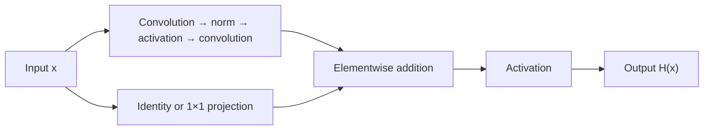

import PaperPdf from '@site/src/components/PaperPdf';
import CodeWalkthrough from '@site/src/components/viz/CodeWalkthrough';
import ResearchPaperLab from '@site/src/components/viz/ResearchPaperLab';

> **He et al. · 2015** · [Read the embedded paper](#original-paper) ·
> [Download PDF](/papers/research-papers/resnet.pdf) · Notes follow the paper
> section by section, §1 to the appendix.


## Paper in one minute

**Problem.** Simply adding layers to a plain convolutional network can increase
training error, even though the deeper network should be able to represent the
shallower solution.

**Key idea.** Let a block learn a residual change $F(x)$ and add the input through
a shortcut, producing $F(x)+x$ or a projected version when dimensions change.

**Why it matters.** Residual connections made very deep visual networks easier
to optimize and became a general architectural pattern. They address degradation,
not every source of overfitting or unstable gradients.

### Residual-block flow



## How to read this chapter

The walkthrough below follows the paper **in its own order**, from the abstract
to the appendix. Each heading carries the paper's section number, so you can
keep the PDF open beside it. Equations use the paper's notation. Boxes marked
**not from the paper** are teaching aids, such as analogies, derivations or
worked numbers, added to make a step easier to follow.

The paper has four numbered sections and three appendices (A, B and C), all
about object detection and localisation. It has **no separate conclusion**; the
last results section, §4.3, is where the argument ends.

## Abstract: the four claims

The abstract makes four claims, and the rest of the paper sets out to support
them:

1. A **residual learning framework** makes networks much deeper than before
   easier to train. Layers learn _residual functions with reference to their
   inputs_ instead of whole new functions.
2. These residual networks are **easier to optimise** and **gain accuracy from
   more depth**. On ImageNet the paper trains up to **152 layers**, 8× deeper
   than VGG nets, yet with lower complexity.
3. An ensemble of residual nets reaches **3.57% top-5 error** on the ImageNet
   test set and won first place in the ILSVRC 2015 classification task.
4. The deep representations **transfer**: a **28% relative improvement** on COCO
   object detection, and first places in ImageNet detection, ImageNet
   localisation, COCO detection and COCO segmentation.

It also promises an analysis on CIFAR-10 with "100 and 1000 layers". Keep these
in mind: §3 builds the method, §4 and the appendices supply the evidence.

:::note Round numbers in the abstract

The CIFAR-10 networks the paper actually trains have **110** and **1,202**
layers (§4.2), not 100 and 1,000. The abstract is rounding.

:::

## §1 Introduction: deeper plain networks train worse

Depth matters in image recognition. Early layers find edges, middle layers find
parts, and later layers find whole objects. The best ImageNet results of the
time all used "very deep" models of **16 to 30 layers**.

So the paper asks a simple question: _is learning a better network as easy as
stacking more layers?_

The old obstacle was **vanishing or exploding gradients**: the learning signal
shrinks or blows up as it passes back through many layers. The paper says this
is **largely solved** by careful weight initialisation and by batch
normalisation, which rescales each layer's outputs during training. With those
tools, networks with tens of layers do start to learn.

### The degradation problem

Once deeper networks could start learning, a new problem showed up. As depth
grows, accuracy first **saturates**, then **gets worse quickly**. The paper
calls this the **degradation problem**.

The surprise is that this is **not overfitting**. A deeper network should be
able to imitate a shallower one by making the extra layers behave like identity
mappings, which pass their input through unchanged. Yet adding layers makes
**training error** worse. Figure 1 shows it on CIFAR-10: a 56-layer plain
network has higher training _and_ test error than a 20-layer one.

That distinction matters. If training error is low but test error rises, we
suspect overfitting. If training error itself rises with added depth,
optimisation has become harder.

**The construction argument.** Take a trained shallow network. Build a deeper
one by copying its layers and adding extra layers that are identity mappings.
This deeper network has exactly the same training error. So a solution **at
least as good** always exists for the deeper model. The fact that the optimiser
does not find it means some networks are simply **harder to optimise**.

Vanishing gradients are relevant to deep networks, but “ResNet solves vanishing
gradients” is too narrow an account. The paper's central question is how to make
a useful near-identity mapping easy to represent and optimise.

### The proposal

Call the mapping a few layers should learn $H(x)$. Instead of asking the layers
to learn $H(x)$ directly, ask them to learn the **residual**
$F(x) := H(x)-x$, the change that must be added to the input. The block's output
is then $F(x)+x$.

The authors **hypothesise** that the residual is easier to learn. In the extreme
case, if identity were the best mapping, pushing $F$ to zero is easier than
making a stack of nonlinear layers reproduce their input.

$F(x)+x$ is built with **shortcut connections**: a path that skips one or more
layers and adds the input back in. Identity shortcuts add **no parameters and
no computation**. The network still trains end to end with ordinary SGD
(stochastic gradient descent) and backpropagation.

The introduction then previews the findings: deep residual nets are easy to
optimise while plain nets get worse with depth, residual nets gain accuracy
from depth, the same happens on CIFAR-10, and the 152-layer ImageNet model is
the deepest yet while still cheaper than VGG.

:::tip Intuition: editing a draft (not from the paper)

Rewriting an essay from scratch each time is hard. Marking corrections on the
existing draft is easy, and if the draft is already good, you mark nothing. A
residual block works like the corrections: the input is the draft, and $F(x)$ is
the set of edits. Doing nothing is the default, not something to be learned.

:::

:::tip In the real world (not from the paper)

The architectures from this paper are still standard starting points.
PyTorch's torchvision ships ImageNet-trained ResNet-18 to ResNet-152 models,
and Keras ships ResNet-50, -101 and -152. Many image products start by
fine-tuning one of them rather than training from scratch.

:::

## §2 Related work

**Residual representations.** Encoding _differences_ is an old and effective
idea. In image retrieval, VLAD and Fisher Vectors encode how features differ
from a dictionary. In vector quantisation, encoding residual vectors works
better than encoding the originals. In solving partial differential equations,
the **multigrid** method and hierarchical basis preconditioning solve for
residuals between a coarse and a fine scale, and converge much faster than
solvers that ignore this structure. The lesson the paper draws: a good
reformulation can make optimisation easier.

**Shortcut connections.** These are also old. Early multilayer perceptrons
added a linear layer from input straight to output. GoogLeNet attached
auxiliary classifiers to intermediate layers to fight vanishing gradients, and
its "inception" layer has a shortcut branch.

**Highway networks**, published at the same time, use shortcuts with
**gates**: learned, input-dependent switches that decide how much signal passes.
When a gate closes, the layer is no longer residual. ResNet's identity
shortcuts are **never closed** and have **no parameters**, so all information
always passes through. The paper also notes that highway networks had not shown
accuracy gains at extreme depths such as over 100 layers.

An identity shortcut is not a learned gate. This also distinguishes the simple
residual block from related architectures that explicitly learn how much
information to pass through a shortcut.

:::tip In the real world (not from the paper)

Video compression uses the same "store the difference" idea. Codecs such as
H.264 predict each block of a frame from nearby frames and then encode only the
**residual**, the part the prediction got wrong. Small residuals cost few bits,
just as small residual functions are easy to learn.

:::

## §3 Deep residual learning

### §3.1 Residual learning

In plain words: instead of learning the whole output, a few layers learn only
how the output should **differ** from their input.

Formally, let $H(x)$ be the mapping a few stacked layers should fit, where $x$
is the input to the first of them. If stacked nonlinear layers can approximate
complicated functions, they can equally approximate the residual $H(x)-x$
(assuming input and output have the same size). So the paper lets them learn

$$
F(x)=H(x)-x,\qquad H(x)=F(x)+x.
$$

In words: the layers learn only the change, and the input is added back at the
end. Both forms can in principle represent the same functions, but **how easy
they are to learn** may differ.

:::note An open hypothesis

Footnote 2 admits that the starting assumption, that stacked nonlinear layers
can approximate complicated functions, "is still an open question". The paper
gives experimental support for residual learning, not a proof.

:::

The degradation problem suggests that optimisers find it hard to make several
nonlinear layers act as an identity. With the residual form, if identity is
optimal, the optimiser only has to drive the weights **towards zero**.

Suppose the best output is already close to x. The residual branch only needs to
learn a small correction. If the best mapping is exactly identity, a zero
residual is enough before the block's final activation.

In practice identity is unlikely to be exactly optimal. The paper argues the
reformulation still helps as **preconditioning**, a way of setting up a problem
so that it is easier to solve. If the best function is closer to identity than
to zero, it is easier to learn small changes around identity than a whole new
function. §4.2 (Figure 7) backs this up: learned residuals have small
responses.

:::tip Worked number (not from the paper)

Say an input feature is 5.0 and the ideal output is 5.2. A plain block must
produce 5.2 from nothing. A residual block only needs $F(x)=0.2$, because the
shortcut already supplies 5.0. If the ideal output is exactly 5.0, the residual
block's job is $F(x)=0$, which weights near zero give for free.

:::

### §3.2 Identity mapping by shortcuts

The paper applies residual learning to **every few stacked layers**. Each
building block (Figure 2) runs its input through a couple of layers and then
adds the untouched input back on. That is **Equation 1**:

$$
y = F(x,\{W_i\}) + x.
$$

Here $x$ and $y$ are the block's input and output, and $F(x,\{W_i\})$ is the
residual function with weights $W_i$. The output is simply "input plus learned
change".


*Figure 2 from the original paper, PDF page 2. [Source PDF](/papers/research-papers/resnet.pdf#page=2).*

For Figure 2's two-layer block, $F=W_2\,\sigma(W_1x)$, where $\sigma$ is the ReLU
activation (it replaces negative values with zero) and biases are left out for
simplicity. The addition $F+x$ is done
element by element. The **second ReLU comes after the addition**, so the block
outputs $\sigma(y)$.

The original block applies two convolutional transformations on the residual branch and adds the input through a shortcut. Its post-addition ReLU means the full block is $\operatorname{ReLU}(x+F(x))$. Exact identity therefore needs attention to the activation and input sign; it is not true for arbitrary negative inputs after a ReLU.

**Why "no extra parameters" matters.** An identity shortcut adds no weights and
only a negligible addition. That lets the paper compare plain and residual
networks **fairly**: same depth, width, parameter count and computation. Any
difference comes from the shortcut itself.

**When sizes differ.** Equation 1 needs $x$ and $F$ to have the same
dimensions. When they differ, for example when the number of channels changes,
a linear projection $W_s$ on the shortcut matches them (**Equation 2**):

$$
y = F(x,\{W_i\}) + W_s x.
$$

In words: when the shapes do not line up, pass the input through a cheap learned
resize before adding it. A square $W_s$ could be used everywhere, but §4.1 shows
identity is enough to fix degradation and is cheaper, so $W_s$ is used **only
to match dimensions**.

**How deep should F be?** The form is flexible. The paper's experiments use two
or three layers (Figure 5), and more are possible. With a **single** layer,
Equation 1 becomes $y=W_1x+x$, which is just a linear layer, and the authors saw
no advantage from it.

The notation is written for fully connected layers, but it applies to
convolutions too. $F$ can be several convolutional layers, and the addition is
done on two feature maps, channel by channel.

#### Why the shortcut helps gradients (not from the paper)

This derivation does not appear in the 2015 paper; the authors develop it in
their follow-up, _Identity Mappings in Deep Residual Networks_. The Jacobian
is the matrix that says how much each output changes when each input changes.
Before the final activation, it is:

$$
\frac{\partial(x+F(x))}{\partial x}=I+\frac{\partial F(x)}{\partial x}.
$$

The identity term supplies a direct gradient route. Without the shortcut, gradients must pass entirely through the residual transformation. This improves the available paths for optimisation, but does not mathematically guarantee that no gradient can ever vanish or explode. Activations and the rest of the network still matter.

#### Shapes: addition is stricter than concatenation (not from the paper)

To add two tensors, their dimensions must agree. A shortcut from 16 channels at `32 × 32` resolution cannot be directly added to a branch producing 32 channels at `16 × 16` resolution.

A projection shortcut fixes that, using Equation 2's $W_s$. A `1 × 1` convolution changes channel count, and a stride can reduce spatial resolution. When shapes already agree, an identity shortcut has no parameters.

| Operation | Spatial size | Channels | Role |
|---|---|---|---|
| Identity shortcut | Preserved | Preserved | Carry input directly |
| 1×1 projection, stride 1 | Preserved | Can change | Match channels |
| 1×1 projection, stride 2 | Reduced | Can change | Match downsampling branch |
| Concatenation | Must match non-concatenated axes | Usually increases | Different operation; not residual addition |

The paper compares shortcut options, including parameter-free ways of handling changed dimensions (§3.3 and §4.1). The teaching code below uses learned projections where needed.

:::tip In the real world (not from the paper)

The same `output = input + change` pattern sits inside every Transformer layer,
including the models behind today's chatbots: each attention and feed-forward
sub-layer is wrapped in a residual addition. See the
[Transformer chapter](/docs/research-papers/transformer), §3.1.

:::

### §3.3 Network architectures

The paper describes two ImageNet models to make the comparison concrete (Figure
3).

**Plain network.** Inspired by VGG, it mostly uses 3×3 filters and two rules:
(i) layers with the same output size have the same number of filters, and (ii)
when the feature map size halves, the number of filters doubles, keeping the
computation per layer roughly constant. Downsampling is done by convolutions
with **stride 2** (they move two pixels at a time). The network ends with
**global average pooling**, which averages each channel to a single number, and
a 1000-way fully connected layer with softmax. It has **34 weighted layers** and
costs **3.6 billion FLOPs** (multiply-adds, a count of arithmetic work), only **18% of VGG-19's 19.6
billion**.

:::tip Worked number (not from the paper)

$3.6 / 19.6 \approx 0.18$, so the 34-layer plain net does under a fifth of
VGG-19's arithmetic while being almost twice as deep. Fewer filters per layer
buy the depth.

:::

**Residual network.** Add shortcuts to the plain net and it becomes its
residual twin. Where input and output sizes match, the shortcut is an identity
(solid lines in Figure 3). Where the dimensions **increase** (dotted lines),
there are two options:

- **(A)** keep the identity and **pad the extra channels with zeros**. No new
  parameters.
- **(B)** use Equation 2's **projection**, done with 1×1 convolutions.

Either way, a shortcut that crosses two feature-map sizes uses stride 2.

#### Table 1: the ImageNet family

Table 1 lists five depths. The 18- and 34-layer nets use the two-layer **basic
block**; the 50-, 101- and 152-layer nets use the three-layer **bottleneck
block** introduced in §4.1. Every net has the same stem (a 7×7 convolution with
64 filters and stride 2, then a 3×3 max pool) and the same ending (global
average pooling, a 1000-way fully connected layer, softmax). The
blocks sit in four stages, `conv2_x` to `conv5_x`, on feature maps of 56×56,
28×28, 14×14 and 7×7.

| Model | Block type | Blocks in the four stages | FLOPs |
|---|---|---|---|
| ResNet-18 | Basic | 2, 2, 2, 2 | 1.8 × 10⁹ |
| ResNet-34 | Basic | 3, 4, 6, 3 | 3.6 × 10⁹ |
| ResNet-50 | Bottleneck | 3, 4, 6, 3 | 3.8 × 10⁹ |
| ResNet-101 | Bottleneck | 3, 4, 23, 3 | 7.6 × 10⁹ |
| ResNet-152 | Bottleneck | 3, 8, 36, 3 | 11.3 × 10⁹ |

**What this shows:** depth grows mostly in the third block stage (`conv4_x`),
and even the 152-layer net costs less than VGG-16 (15.3 billion FLOPs).

**What the number in ResNet-50 counts.** Basic blocks contain two main-path
convolutions; bottleneck blocks contain three. A stem convolution and final
classifier complete the usual named depth count, without counting each shortcut
projection as another named layer. For ResNet-50, sixteen bottleneck blocks give
48 main-path convolutions. Adding the stem and classifier gives the name “50”.
The teaching script mixes a few basic and bottleneck blocks for visibility; it
is not a standard ResNet-50 checkpoint definition.

The Table 1 caption also says **where downsampling happens**: in `conv3_1`,
`conv4_1` and `conv5_1`, the first layer of stages 3 to 5, with stride 2.

#### From blocks to a classifier

The network groups blocks into stages. Later stages reduce spatial resolution and increase channels. Global average pooling reduces each channel to one value, then a fully connected layer produces class logits.

Pooling means the classification head does not need a separate weight for every spatial location. Earlier convolutions still learn spatial features; global pooling does not mean location never mattered.

:::tip In the real world (not from the paper)

Library model names follow Table 1: `torchvision.models.resnet50` has stages of
3, 4, 6 and 3 bottleneck blocks. One detail differs. torchvision's
documentation calls its model "ResNet V1.5" because it moves the stride-2
downsampling from the first 1×1 convolution to the 3×3 convolution of each
bottleneck. Same name, slightly different layer.

:::

### §3.4 Implementation

The ImageNet training recipe follows AlexNet and VGG practice:

| Setting | Value in the paper |
|---|---|
| Augmentation | Resize shorter side to a random size in [256, 480]; random 224×224 crop or its horizontal flip; per-pixel mean subtracted; standard colour augmentation |
| Normalisation | Batch normalisation right after each convolution, before the activation |
| Initialisation | He et al. (2015) initialisation; all nets trained from scratch |
| Optimiser | SGD, mini-batch 256, momentum 0.9, weight decay 0.0001 |
| Learning rate | Starts at 0.1, divided by 10 when error plateaus; up to 60 × 10⁴ iterations |
| Dropout | None, following the batch-normalisation paper |

**What this shows:** nothing exotic. Plain and residual nets get the **same**
recipe, so any difference between them comes from the shortcuts.

The ImageNet recipe includes scale/crop augmentation, horizontal flips, colour augmentation, batch normalisation and SGD with momentum and weight decay. It does not use dropout in the reported setup. Plain and residual counterparts are trained under comparable conditions to test the effect of adding residual connections.

:::tip Worked number (not from the paper)

$60\times10^4$ iterations × 256 images = 153.6 million images. Divided by the
1.28 million training images, that is about **120 passes (epochs)** over
ImageNet.

:::

**Testing.** For comparison studies the paper uses standard **10-crop
testing**: score the four corner crops, the centre crop, and the flipped
version of each, then average. For its best results it runs the network
**fully convolutionally** and averages scores over several scales, with the
shorter image side at 224, 256, 384, 480 and 640 pixels.

At evaluation, a single crop, multiple crops, multiple scales and an ensemble are different protocols. Averaging predictions across several image views can improve accuracy without changing the trained architecture. Comparing that result with another model's single-view score would confound architecture and evaluation procedure.

#### Batch normalisation in training and evaluation (not from the paper)

Batch normalisation appears within the branch and helps stabilise training. It uses batch statistics during training and stored running statistics during evaluation, so calling `model.eval()` changes behaviour even though weights do not change.

:::tip In the real world (not from the paper)

torchvision's `RandomResizedCrop` and `RandomHorizontalFlip` transforms are the
everyday descendants of this crop-and-flip recipe. Image-classification
tutorials still combine them with SGD, momentum 0.9 and weight decay, much as
§3.4 does.

:::

## §4 Experiments

### §4.1 ImageNet classification

**Data.** ImageNet 2012 has 1000 classes: 1.28 million training images, 50,000
validation images, and 100,000 test images scored by the organisers' server.

**Top-1 error** counts whether the highest-scoring class is wrong. **Top-5 error** counts whether the correct class is absent from the five highest-scoring classes. Comparing numbers without their metric can create a false impression of performance.

#### Plain networks

The paper first trains plain 18- and 34-layer nets. The deeper one has **higher
validation error** (Table 2), and Figure 4 shows why: its **training error** is
higher throughout training, even though the 18-layer net's solutions are a
subset of what the 34-layer net can represent. That is degradation.

**Is it vanishing gradients?** The authors argue not. Batch normalisation keeps
forward signals at non-zero variance, and they checked that backward gradients
have healthy sizes. The 34-layer plain net even reaches competitive accuracy, so
the optimiser works to some extent. Their guess is that deep plain nets have
"exponentially low convergence rates". Footnote 3 adds that training three times
longer did not remove the problem.

:::note A conjecture, not a finding

The "exponentially low convergence rates" explanation is offered as a
conjecture, and the paper says the real reason "will be studied in the future".
It measures that degradation happens; it does not establish why.

:::

#### Residual networks

Next the paper adds a shortcut around each pair of 3×3 layers. In this first
comparison every shortcut is an identity, with **zero-padding (option A)** where
dimensions grow, so the residual nets have **exactly the same parameters** as
the plain ones. Table 2, top-1 error with 10-crop testing on the validation set:

| Depth | Plain | ResNet |
|---|---|---|
| 18 layers | 27.94 | 27.88 |
| 34 layers | 28.54 | 25.03 |

**What this shows:** with shortcuts, the deeper net is now the better one.

The paper draws three observations:

1. **The situation reverses.** The 34-layer ResNet beats the 18-layer ResNet by
   2.8%. It has much lower training error and generalises to validation data,
   so degradation is "well addressed in this setting".
2. **Residual learning pays off at depth.** The 34-layer ResNet cuts top-1
   error by 3.5 points compared with its plain twin.
3. **At 18 layers the two are about equal**, but the ResNet **converges
   faster**. When a net is not overly deep, SGD can still find good plain
   solutions; the shortcut just speeds up the early stage.

:::tip Check the table yourself (not from the paper)

$27.88-25.03=2.85$, the "2.8%" in observation 1. $28.54-25.03=3.51$, the "3.5%"
in observation 2. Both are absolute percentage points of top-1 error.

:::

#### Identity vs. projection shortcuts

The original comparison studies three shortcut choices on the 34-layer net:

- **A:** parameter-free shortcuts, using zero-padding when dimensions increase.
- **B:** projection shortcuts when dimensions increase, identity shortcuts elsewhere.
- **C:** learned projection shortcuts throughout.

| Model | Top-1 err. | Top-5 err. |
|---|---|---|
| plain-34 | 28.54 | 10.02 |
| ResNet-34 A | 25.03 | 7.76 |
| ResNet-34 B | 24.52 | 7.46 |
| ResNet-34 C | 24.19 | 7.40 |

**What this shows:** all three shortcut types beat the plain net by a lot; the
differences among them are small.

The paper's reading: **B beats A slightly** because zero-padded channels in A
get no residual learning. **C beats B marginally**, which the authors put down
to the extra parameters of "many (thirteen)" projection shortcuts. Because
A, B and C are so close, projections are **not essential** for fixing
degradation. Option C is dropped from then on to save memory, time and model
size.

All substantially improve over the comparable plain network in the reported experiment. The modest differences among shortcut variants help support the importance of the residual formulation itself, rather than attributing the entire gain to extra projection parameters.

:::tip Worked number: where "thirteen" comes from (not from the paper)

ResNet-34 has $3+4+6+3=16$ blocks, so 16 shortcuts. Option B already projects
at the 3 places where dimensions grow. Option C projects all 16, which is
$16-3=13$ **extra** projections. The paper's "thirteen" counts the
projections C adds on top of B.

:::

#### Deeper bottleneck architectures

To keep training time affordable, the deeper nets swap the two-layer block for
a three-layer **bottleneck** (Figure 5, right).

A **basic block** uses two 3×3 convolutions. A **bottleneck block** uses 1×1, 3×3 and 1×1 convolutions. The first reduces width, the middle performs spatial processing, and the last expands width again.

Why do this? A 3×3 convolution across many channels is expensive. Performing it at a narrower intermediate width saves computation while the surrounding projections allow a wide residual stream. Figure 5's two designs have **similar time complexity**.

Footnote 4 says the bottleneck is "mainly due to practical considerations":
deeper basic-block ResNets also gain from depth (as on CIFAR-10), just less
economically. It also notes that plain nets built from bottlenecks still show
degradation.

**Identity shortcuts matter most here.** A bottleneck's shortcut joins the two
**wide** ends of the block. Replacing that identity with a projection would
roughly **double** both the time and the model size. So identity shortcuts keep
bottleneck nets efficient.

:::tip Worked number: the bottleneck budget (not from the paper)

A basic block on 64 channels has $2\times(3\cdot3\cdot64\cdot64)=73{,}728$
weights. A bottleneck on 256 channels has $256\cdot64+3\cdot3\cdot64\cdot64+64\cdot256=69{,}632$.
So the two cost about the same, as Figure 5 claims. A 1×1 projection shortcut
from 256 to 256 channels would add $256\cdot256=65{,}536$ weights, almost as
many as the whole branch, which is the "doubled" in the text.

:::

**50, 101 and 152 layers.** Replacing each two-layer block of the 34-layer net
with a bottleneck gives **ResNet-50** (option B for growing dimensions, 3.8
billion FLOPs). More bottlenecks give ResNet-101 and ResNet-152. Even at 152
layers the cost, **11.3 billion FLOPs**, is below VGG-16 and VGG-19 (15.3 and
19.6 billion).

The 50-, 101- and 152-layer nets beat the 34-layer ones "by considerable
margins", with **no degradation**: every extra layer group helps on every
metric.

| Model (10-crop, validation) | Top-1 err. | Top-5 err. |
|---|---|---|
| ResNet-34 B | 24.52 | 7.46 |
| ResNet-50 | 22.85 | 6.71 |
| ResNet-101 | 21.75 | 6.05 |
| ResNet-152 | 21.43 | 5.71 |

**What this shows:** error keeps falling as depth rises from 34 to 152 layers.

<details>
<summary>Full Table 3 from the paper</summary>

Error rates (%, 10-crop testing) on ImageNet validation. VGG-16 is the authors'
own test. ResNet-50/101/152 use option B.

| Model | Top-1 err. | Top-5 err. |
|---|---|---|
| VGG-16 | 28.07 | 9.33 |
| GoogLeNet | – | 9.15 |
| PReLU-net | 24.27 | 7.38 |
| plain-34 | 28.54 | 10.02 |
| ResNet-34 A | 25.03 | 7.76 |
| ResNet-34 B | 24.52 | 7.46 |
| ResNet-34 C | 24.19 | 7.40 |
| ResNet-50 | 22.85 | 6.71 |
| ResNet-101 | 21.75 | 6.05 |
| ResNet-152 | 21.43 | 5.71 |

</details>

#### Comparisons with state-of-the-art methods

With the stronger multi-scale testing of §3.4, single models do better still
(Table 4). ResNet-152 reaches **4.49% top-5 validation error**. Six models of
different depths, only two of them 152-layer, form an **ensemble** (several
models whose predictions are averaged) with **3.57%
top-5 error on the test set** (Table 5), which won ILSVRC 2015.

| Result | Top-5 err. | Split |
|---|---|---|
| ResNet-152, single model (Table 4) | 4.49 | validation |
| BN-inception ensemble (Table 5) | 4.82 | test |
| PReLU-net ensemble (Table 5) | 4.94 | test |
| **ResNet ensemble, ILSVRC'15 (Table 5)** | **3.57** | test |

**What this shows:** one ResNet already beats earlier ensembles; the winning
entry is an ensemble. Its widely cited 3.57% ImageNet top-5 test error is an
ensemble result, not the score of every individual ResNet.

<details>
<summary>Full Tables 4 and 5 from the paper</summary>

Table 4, single-model error rates (%) on ImageNet validation (except † on the
test set):

| Method | Top-1 err. | Top-5 err. |
|---|---|---|
| VGG (ILSVRC'14) | – | 8.43† |
| GoogLeNet (ILSVRC'14) | – | 7.89 |
| VGG (v5) | 24.4 | 7.1 |
| PReLU-net | 21.59 | 5.71 |
| BN-inception | 21.99 | 5.81 |
| ResNet-34 B | 21.84 | 5.71 |
| ResNet-34 C | 21.53 | 5.60 |
| ResNet-50 | 20.74 | 5.25 |
| ResNet-101 | 19.87 | 4.60 |
| ResNet-152 | 19.38 | 4.49 |

Table 5, ensemble top-5 error (%) on the test set, from the test server:

| Method | Top-5 err. (test) |
|---|---|
| VGG (ILSVRC'14) | 7.32 |
| GoogLeNet (ILSVRC'14) | 6.66 |
| VGG (v5) | 6.8 |
| PReLU-net | 4.94 |
| BN-inception | 4.82 |
| ResNet (ILSVRC'15) | 3.57 |

</details>

:::note Two comparisons that mix splits and protocols

The text says the single-model 4.49% "outperforms all previous ensemble
results (Table 5)". But 4.49% is on the **validation** set and Table 5 is on
the **test** set, so the two are not measured on the same images. Also compare
ResNet-152 across tables: 21.43% top-1 with 10-crop testing (Table 3) against
19.38% with multi-scale testing (Table 4). Same weights, two points apart, only
because of the testing protocol.

:::

:::tip In the real world (not from the paper)

Top-5 is a natural metric wherever a system shows several suggestions. A
photo app that offers five possible tags, or a plant-identification app that
lists its five best guesses, is useful if the right answer is anywhere in the
list, which is exactly what top-5 accuracy measures. This is an illustration,
not a named product's metric.

:::

### §4.2 CIFAR-10 and analysis

CIFAR-10 has 50,000 training and 10,000 test images, 32×32 pixels, in 10
classes. The goal here is to study **very deep networks**, not to set a record,
so the architectures are deliberately simple.

The first layer is a 3×3 convolution. Then come $6n$ layers of 3×3
convolutions, $2n$ on each of three feature-map sizes, with 16, 32 and 64
filters. Stride-2 convolutions downsample. Global average pooling, a 10-way
fully connected layer and softmax finish it, for **$6n+2$ weighted layers** in
total:

| Output map size | 32×32 | 16×16 | 8×8 |
|---|---|---|---|
| Number of layers | 1 + 2n | 2n | 2n |
| Number of filters | 16 | 32 | 64 |

Shortcuts connect pairs of 3×3 layers, $3n$ in total, and are **always identity
(option A)**. So each residual net has exactly the same depth, width and
parameters as its plain twin.

**Training.** Weight decay 0.0001, momentum 0.9, He initialisation, batch
normalisation, no dropout. Mini-batch 128 on two GPUs. The learning rate starts
at 0.1, is divided by 10 at 32k and 48k iterations, and training stops at 64k,
a schedule chosen on a 45k/5k train/validation split. Augmentation pads each
side by 4 pixels and takes a random 32×32 crop or its flip. Testing uses only
the single original 32×32 image.

:::tip Worked number (not from the paper)

$n=3,5,7,9$ gives $6n+2 = 20, 32, 44, 56$ layers; $n=18$ gives 110 and $n=200$
gives 1,202. And 64,000 iterations × 128 images is about 8.2 million images,
roughly **164 passes** over a 50,000-image training set.

:::

**Plain vs residual.** Figure 6 (left) shows the deep plain nets getting
**worse** with depth, with higher training error, just as on ImageNet and as
other work saw on MNIST. The authors take this as a sign the optimisation
difficulty is "a fundamental problem". Figure 6 (middle) shows the ResNets
overcoming it and gaining accuracy with depth.

**110 layers.** With $n=18$, the starting learning rate of 0.1 is "slightly
too large to start converging". So training warms up at 0.01 until training
error falls below 80% (about 400 iterations), then returns to 0.1. Footnote 5
adds that starting at 0.1 still works, just a few epochs later, and ends at a
similar accuracy.

Table 6, CIFAR-10 test error (all with data augmentation):

| Method | Layers | Params | Error (%) |
|---|---|---|---|
| Highway | 19 | 2.3M | 7.54 (7.72±0.16) |
| ResNet | 20 | 0.27M | 8.75 |
| ResNet | 56 | 0.85M | 6.97 |
| ResNet | 110 | 1.7M | 6.43 (6.61±0.16) |
| ResNet | 1202 | 19.4M | 7.93 |

**What this shows:** error falls from 20 to 110 layers, then rises again at
1,202. ResNet-110 beats Highway with fewer parameters. For ResNet-110 the paper
reports "best (mean±std)" over 5 runs.

<details>
<summary>Full Table 6 from the paper</summary>

| Method | Layers | Params | Error (%) |
|---|---|---|---|
| Maxout | | | 9.38 |
| NIN | | | 8.81 |
| DSN | | | 8.22 |
| FitNet | 19 | 2.5M | 8.39 |
| Highway | 19 | 2.3M | 7.54 (7.72±0.16) |
| Highway | 32 | 1.25M | 8.80 |
| ResNet | 20 | 0.27M | 8.75 |
| ResNet | 32 | 0.46M | 7.51 |
| ResNet | 44 | 0.66M | 7.17 |
| ResNet | 56 | 0.85M | 6.97 |
| ResNet | 110 | 1.7M | 6.43 (6.61±0.16) |
| ResNet | 1202 | 19.4M | 7.93 |

</details>

#### Analysis of layer responses

Figure 7 plots the **standard deviation of each 3×3 layer's output**, measured
after batch normalisation and before the ReLU or the addition. For a ResNet
this is the strength of the residual function.

Two findings:

- ResNets have **generally smaller responses** than plain nets. This supports
  §3.1's motivation that residual functions are closer to zero than
  non-residual ones.
- **Deeper ResNets have smaller responses** (compare ResNet-20, 56 and 110).
  With more layers, each layer changes the signal less.

Small learned corrections are consistent with the motivation of learning
changes around an identity path. They do not mean every block is exactly
identity or that deep networks can be replaced by a single shortcut.

#### Exploring over 1000 layers

With $n=200$ the paper trains a **1,202-layer** network with the same recipe.
There is **no optimisation difficulty**: training error drops below 0.1%
(Figure 6, right). Test error, 7.93%, is "still fairly good", but **worse than
the 110-layer net's 6.43%**, even though both have similar training error.

That observation separates two problems:

1. **Optimisation:** can the network fit the training examples?
2. **Generalisation:** does the learned function work on unseen examples?

Residual learning helps the first problem but does not remove the second. The
authors attribute the gap to **overfitting**: 19.4M parameters may be
"unnecessarily large" for this small dataset. Strong regularisers such as
maxout or dropout, which the best CIFAR results use, were left out on purpose
so as not to distract from optimisation. Combining them "may improve results",
which they leave for future work.

The CIFAR experiments also show that making a network extremely deep is not automatically beneficial on a small dataset. Better optimisation does not eliminate overfitting or make data and model capacity irrelevant. Once a network can fit the data, adding more layers can increase capacity without supplying more evidence about unseen inputs.

:::note The overfitting explanation is argued, not tested

The paper does not run the 1,202-layer net with regularisation, so
"overfitting" is a plausible reading rather than a demonstrated cause. The
authors' own follow-up, _Identity Mappings in Deep Residual Networks_ (2016),
changed the block design to pre-activation and reported **4.62%** error with a
1,001-layer network on CIFAR-10. So extreme depth itself was not the limit;
the block design mattered too.

:::

:::tip In the real world (not from the paper)

Picture a small factory with 5,000 labelled photos of good and faulty parts.
The 1,202-layer result says a bigger ResNet is not automatically better on data
that size. A ResNet-18 or ResNet-50 with augmentation, checked on held-out
photos, is the sensible start. This is an illustration, not a reported case.

:::

### §4.3 Object detection on PASCAL and MS COCO

To test whether the features **generalise to other tasks**, the paper plugs
them into **Faster R-CNN**, a standard object detector, and swaps its VGG-16
backbone for **ResNet-101**. Detection means finding _where_ each object is
(a box) as well as _what_ it is. The metric is **mAP** (mean average
precision), which rewards boxes that overlap the true object and carry the right
label. "mAP@.5" counts a box as correct if it overlaps the truth by at least
50%; COCO's stricter "mAP@[.5, .95]" averages over overlap thresholds from 50%
to 95%.

| Dataset and metric | VGG-16 | ResNet-101 |
|---|---|---|
| PASCAL VOC 2007 test, mAP (Table 7) | 73.2 | 76.4 |
| PASCAL VOC 2012 test, mAP (Table 7) | 70.4 | 73.8 |
| COCO val, mAP@.5 (Table 8) | 41.5 | 48.4 |
| COCO val, mAP@[.5, .95] (Table 8) | 21.2 | 27.2 |

**What this shows:** the deeper residual backbone improves every detection
score.

On COCO the gain in the standard metric is **6.0 points, a 28% relative
improvement**. The paper says the detection code is otherwise the same for both
backbones, "so the gains can only be attributed to better networks". Built on
these nets, the team won ImageNet detection, ImageNet localisation, COCO
detection and COCO segmentation in the 2015 competitions (details in the
appendices).

:::tip Check the 28% yourself (not from the paper)

$27.2-21.2=6.0$ points, and $6.0/21.2\approx0.283$, so a 28% relative
improvement. The abstract's "28%" is this number.

:::

:::note "Solely due to" is a strong claim

Appendix A shows the two detectors are **not** identical apart from the
features. VGG-16 uses its fully connected layers per region, while ResNet-101
uses all of its `conv5_x` layers per region, a different and deeper per-region
head. So the gain comes from the backbone **and** how it is split around RoI
pooling, not only from better learned features.

:::

The detection experiments replace the feature extractor inside a larger detection system. Classification asks which class an image contains; detection also asks where objects are; localisation evaluates spatial prediction under its own protocol. Their metrics, such as mean average precision, should not be read as classification accuracy.

The practical result is that improved learned features can help multiple vision tasks. It does not imply that a classification head alone becomes a detector when the backbone gets deeper.

:::tip In the real world (not from the paper)

This backbone swap became standard practice. Torchvision ships a Faster R-CNN
detector with a ResNet-50 backbone, the same recipe with a newer feature
pyramid added. See the Real-world uses section below.

:::

## Appendix A: Object detection baselines

This appendix explains how ResNet was fitted into Faster R-CNN. Models start
from ImageNet classification weights and are then fine-tuned on detection data.

**Splitting the network.** ResNet has no hidden fully connected layers, unlike
VGG-16. The paper follows the "Networks on Conv feature maps" idea: the layers
with stride at most 16 pixels, `conv1` to `conv4_x` (**91 convolutional layers
in ResNet-101**), compute one shared feature map for the whole image. Both the
region proposal network (which suggests 300 candidate boxes) and the detection
network use it. **RoI pooling**, which cuts out a fixed-size feature patch for
each candidate box, happens before `conv5_1`. Then `conv5_x` and above run on
each region, playing the role of VGG-16's fully connected layers. The final
classifier is replaced by two sibling layers, one for the class and one for box
regression.

:::tip Worked number: the 91 layers (not from the paper)

From Table 1, ResNet-101 has 1 layer in `conv1`, then 3, 4 and 23 bottleneck
blocks of 3 layers each in `conv2_x` to `conv4_x`:
$1+3\cdot3+4\cdot3+23\cdot3=1+9+12+69=91$.

:::

**Frozen batch normalisation.** After pre-training, the batch-norm statistics
(means and variances) are computed on the ImageNet training set and then
**fixed** during detection fine-tuning. Each batch-norm layer becomes a fixed
scale and shift. The main reason is to **save memory** in Faster R-CNN training.

**PASCAL VOC.** For the VOC 2007 test set, training uses VOC 2007 trainval (5k)
plus VOC 2012 trainval (16k), "07+12". For VOC 2012 test, it uses VOC 2007
trainval+test (10k) plus VOC 2012 trainval (16k), "07++12". Hyperparameters
follow Faster R-CNN. ResNet-101 improves mAP by more than 3 points.

**MS COCO.** 80 object categories; 80k training images and 40k validation
images. Training runs on 8 GPUs: the proposal step uses 8 images per mini-batch
(1 per GPU) and the detection step 16. Both are trained for 240k iterations at
learning rate 0.001, then 80k at 0.0001. The mAP@[.5, .95] gain (6.0 points) is
nearly as large as the mAP@.5 gain (6.9 points), which suggests the deeper net
improves **both recognition and box accuracy**.

:::tip In the real world (not from the paper)

Freezing batch norm in a detector's backbone is still common practice. When
torchvision's Faster R-CNN loads pretrained weights, for example, it builds its
ResNet backbone with `FrozenBatchNorm2d` layers, for the same memory and
small-batch reasons.

:::

## Appendix B: Object detection improvements

For the competitions the authors stacked extra tricks on top of the baseline.
Each builds on the deep features, so each benefits from residual learning.

| COCO system (Table 9) | Test data | mAP@.5 | mAP@[.5, .95] |
|---|---|---|---|
| Baseline Faster R-CNN, ResNet-101 | val | 48.4 | 27.2 |
| + box refinement + context + multi-scale testing | val | 53.8 | 32.5 |
| Same single model, trained on trainval | test-dev | 55.7 | 34.9 |
| Ensemble of 3 networks | test-dev | 59.0 | 37.4 |

**What this shows:** together the tricks add about 5 points on both metrics,
and the ensemble won first place in COCO 2015 detection.

The four additions, in plain words:

- **Box refinement.** Pool a new feature from each predicted box and predict
  again. Merge the 300 new and 300 original predictions and remove duplicates
  with non-maximum suppression, which keeps only the best of heavily
  overlapping boxes (overlap threshold 0.3 IoU, intersection over union). Then
  apply box voting. About +2 mAP.
- **Global context.** Pool a feature from the whole image and concatenate it
  with each region's feature. About +1 mAP@.5.
- **Multi-scale testing.** Compute features at image sizes 200 to 1000 pixels
  (shorter side) and combine two adjacent scales with maxout, an element-wise
  maximum. More than +2 mAP.
  Multi-scale _training_ was skipped for lack of time.
- **Using validation data and ensembling.** Train on train+val (80k+40k) and
  test on the 20k test-dev set; then ensemble 3 networks for both proposals and
  classification.

<details>
<summary>Full Table 9 from the paper</summary>

Object detection on MS COCO with Faster R-CNN and ResNet-101. The first two
columns are trained on COCO train and tested on COCO val; the last two on COCO
trainval and tested on test-dev.

| System | val mAP@.5 | val mAP@[.5, .95] | test-dev mAP@.5 | test-dev mAP@[.5, .95] |
|---|---|---|---|---|
| Baseline Faster R-CNN (VGG-16) | 41.5 | 21.2 | | |
| Baseline Faster R-CNN (ResNet-101) | 48.4 | 27.2 | | |
| + box refinement | 49.9 | 29.9 | | |
| + context | 51.1 | 30.0 | 53.3 | 32.2 |
| + multi-scale testing | 53.8 | 32.5 | 55.7 | 34.9 |
| Ensemble | | | 59.0 | 37.4 |

</details>

**PASCAL VOC, revisited.** Fine-tuning the single COCO model on VOC, with the
same improvements, gives **85.6% mAP on VOC 2007** (Table 10) and **83.8% on VOC
2012** (Table 11). The 2012 result is 10 points above the previous best.

**ImageNet detection.** 200 categories, scored by mAP@.5. The same detector,
pre-trained on ImageNet classification and fine-tuned on detection data, gets
**58.8% mAP** as a single model and **62.1%** as a 3-model ensemble on the test
set (Table 12). That won ILSVRC 2015 detection by **8.5 points**.

## Appendix C: ImageNet localisation

The localisation task asks for the class **and** a bounding box. The paper
first predicts the class with the classifier, then predicts a box for that
class, learning a separate box regressor per class.

**Per-class region proposals.** The localisation network is a region proposal
network in **per-class** form: a 1000-way output, each a yes/no "is this class
here" score, and a 1000×4 output of box coordinates, one box per class. Boxes
are predicted relative to fixed reference "anchor" boxes. Training uses random
224×224 crops, mini-batches of 256 images, and 8 anchors sampled per image with
positives and negatives in a 1:1 ratio.

**Adding R-CNN.** On ImageNet one object usually dominates, so proposals
overlap heavily and look alike. The authors therefore use the original,
region-centred R-CNN for a second stage: take the 200 top proposals per image,
crop and warp each to 224×224, and re-score and refine them.

Table 13, top-5 localisation error (%) on ImageNet validation:

| Method | Class used | Error |
|---|---|---|
| VGG, 1-crop | ground truth | 33.1 |
| RPN, ResNet-101, 1-crop | ground truth | 13.3 |
| RPN, ResNet-101, dense | ground truth | 11.7 |
| RPN, ResNet-101, dense | predicted | 14.4 |
| RPN+RCNN, ResNet-101, dense | predicted | 10.6 |
| RPN+RCNN ensemble, dense | predicted | 8.9 |

**What this shows:** even with the true class given, the residual net cuts
VGG's box error by more than half; the R-CNN stage and ensembling cut it
further.

"Dense" means fully convolutional, multi-scale testing. The predicted-class rows
use ResNet-101's 4.6% top-5 classification error (Table 4). On the **test**
set, the ensemble reaches **9.0%** top-5 localisation error against VGG's 25.3%
from ILSVRC 2014 (Table 14), a **64% relative reduction**. It won ILSVRC 2015
localisation.

:::tip Check the 64% yourself (not from the paper)

$(25.3-9.0)/25.3 = 16.3/25.3 \approx 0.644$, which the paper rounds to 64%.

:::

[Original paper, Sections 3–4 and detection/localisation appendix](/papers/research-papers/resnet.pdf).

## Real-world uses and worked examples

### Documented implementation: object detection with a ResNet backbone

Torchvision provides a Faster R-CNN detector with a ResNet-50 and Feature Pyramid Network backbone. ResNet extracts image features; the detection components identify and classify object regions. This is a concrete example of reusing residual representations for a task beyond whole-image classification. [Torchvision's detector documentation](https://docs.pytorch.org/vision/stable/models/generated/torchvision.models.detection.fasterrcnn_resnet50_fpn.html).

### Worked example: count packages in a loading area

A camera image can contain several overlapping packages at different sizes. In an illustrative detection system:

1. A ResNet backbone converts pixels into feature maps.
2. A feature pyramid supplies representations at multiple spatial scales.
3. Detection heads predict package boxes and class scores.
4. Post-processing removes duplicate detections before the application counts boxes.

A plain ResNet classifier would instead produce one set of class scores for the whole image. That alone cannot tell the application where each package is or how many are present. This distinction explains why the detector needs more than a strong backbone.

### Another application: visual quality inspection

A manufacturer could start from pre-trained residual-network features and fine-tune a classifier on labelled images of acceptable and defective components. If the task needs the exact defect location, a detector or segmentation head is more appropriate than an image-level label.

The factory example is illustrative, not a reported named deployment. Lighting, camera angle, rare defect types and production changes must be represented in evaluation. Residual shortcuts make the network easier to optimise; they do not guarantee robustness to a new camera or an unseen defect.

**Connection to the paper:** the learned residual representation is reusable. The downstream output head and training labels determine whether the system classifies an image, finds objects or marks pixels.

## Interactive lab

Change the input and learned correction separately. This is the shortest route
to seeing that a residual block preserves a representation while learning only
what must change.

<ResearchPaperLab lab="resnet" />

## Complete code: train a convolutional residual network

<CodeWalkthrough paper="resnet" />

**Teaching implementation.** This program includes basic blocks, bottlenecks, projection shortcuts, batch normalisation, global pooling, training and held-out evaluation on generated stripe images.

Save as `resnet.py`, install PyTorch, and run `python resnet.py`.

<details>
<summary>Complete runnable script</summary>

```python
"""Train a small convolutional ResNet, including projection shortcuts.
Teaching adaptation: generated 16x16 stripe images and fewer blocks than ResNet-18.
"""
import torch
from torch import nn
import torch.nn.functional as F

torch.manual_seed(7);torch.set_num_threads(1)
class BasicBlock(nn.Module):
    def __init__(self,in_channels,out_channels,stride=1):
        super().__init__()
        self.branch=nn.Sequential(nn.Conv2d(in_channels,out_channels,3,stride,1,bias=False),
            nn.BatchNorm2d(out_channels),nn.ReLU(),nn.Conv2d(out_channels,out_channels,3,1,1,bias=False),
            nn.BatchNorm2d(out_channels))
        self.shortcut=nn.Identity() if stride==1 and in_channels==out_channels else nn.Sequential(
            nn.Conv2d(in_channels,out_channels,1,stride,bias=False),nn.BatchNorm2d(out_channels))
    def forward(self,x):return F.relu(self.branch(x)+self.shortcut(x))

class Bottleneck(nn.Module):
    def __init__(self,in_channels,width,stride=1):
        super().__init__();out_channels=4*width
        self.branch=nn.Sequential(nn.Conv2d(in_channels,width,1,stride,bias=False),nn.BatchNorm2d(width),nn.ReLU(),
            nn.Conv2d(width,width,3,1,1,bias=False),nn.BatchNorm2d(width),nn.ReLU(),
            nn.Conv2d(width,out_channels,1,bias=False),nn.BatchNorm2d(out_channels))
        self.shortcut=nn.Identity() if stride==1 and in_channels==out_channels else nn.Sequential(
            nn.Conv2d(in_channels,out_channels,1,stride,bias=False),nn.BatchNorm2d(out_channels))
    def forward(self,x):return F.relu(self.branch(x)+self.shortcut(x))

class ResNet(nn.Module):
    def __init__(self):
        super().__init__()
        self.layers=nn.Sequential(nn.Conv2d(1,8,3,padding=1,bias=False),nn.BatchNorm2d(8),nn.ReLU(),
            BasicBlock(8,8),BasicBlock(8,16,stride=2),Bottleneck(16,8,stride=2),
            nn.AdaptiveAvgPool2d(1),nn.Flatten(),nn.Linear(32,2))
    def forward(self,x):return self.layers(x)

def batch(n):
    labels=torch.randint(2,(n,));images=torch.randn(n,1,16,16)*.15
    for i,label in enumerate(labels):
        position=torch.randint(3,12,()).item()
        if label==0:images[i,0,position:position+2,:]+=1
        else:images[i,0,:,position:position+2]+=1
    return images,labels

model=ResNet();optim=torch.optim.SGD(model.parameters(),lr=.05,momentum=.9,weight_decay=1e-4)
for step in range(150):
    x,y=batch(32);loss=F.cross_entropy(model(x),y)
    optim.zero_grad();loss.backward();optim.step()
model.eval()
with torch.no_grad():
    x,y=batch(256);accuracy=(model(x).argmax(-1)==y).float().mean()
print('Held-out stripe accuracy:',accuracy.item())
assert accuracy>.95
torch.save(model.state_dict(),'resnet-demo.pt')
```

</details>

### Follow the shapes through the model

An input batch has shape **B × 1 × 16 × 16**. The stem maps it to 8 channels. The first basic block preserves the shape. The second basic block uses stride 2, giving **B × 16 × 8 × 8**, so its shortcut must project and downsample too.

The bottleneck produces **B × 32 × 4 × 4**. Global average pooling yields one value per channel. The final linear layer produces two logits, corresponding to horizontal and vertical bars.

Training images vary bar position and noise. Evaluation draws fresh examples and uses stored batch-normalisation statistics. The checked run achieved full accuracy on that simple held-out distribution. This is a test of the complete training pipeline, not an ImageNet reproduction or evidence that any residual architecture will generalise perfectly.

The bottleneck places its downsampling stride in the first 1×1 convolution, following the original ImageNet bottleneck recipe. Some later implementations move that stride into the 3×3 convolution. Always check the specific architecture before loading a checkpoint: a familiar model name does not establish identical layer behaviour.

### Paper-to-code map

| Paper section | Where it lives in `resnet.py` |
|---|---|
| §3.2 Equation 1, ReLU after the addition | `BasicBlock.forward`: `F.relu(self.branch(x)+self.shortcut(x))` with `self.shortcut=nn.Identity()` |
| §3.2 Equation 2, projection $W_s$ only when dimensions change (option B) | `self.shortcut=... nn.Sequential(nn.Conv2d(in_channels,out_channels,1,stride,bias=False),nn.BatchNorm2d(out_channels))` when `stride!=1` or channels differ |
| §3.2 two-layer $F=W_2\sigma(W_1x)$ | `BasicBlock.branch`: two `nn.Conv2d(...,3,...)` with `nn.ReLU()` between |
| §3.4 batch norm after each convolution, before activation | `nn.Conv2d(...,bias=False)`, then `nn.BatchNorm2d(...)`, then `nn.ReLU()` |
| §4.1 bottleneck 1×1, 3×3, 1×1 with 4× wider output | `Bottleneck`: `out_channels=4*width` and the three `nn.Conv2d` layers |
| Table 1 caption, stride 2 at the first layer of a new stage | `BasicBlock(8,16,stride=2)`; `Bottleneck(16,8,stride=2)` puts the stride in its first 1×1 conv |
| §3.3 global average pooling and fully connected classifier | `nn.AdaptiveAvgPool2d(1),nn.Flatten(),nn.Linear(32,2)` |
| §3.4 SGD, momentum 0.9, weight decay 0.0001, no dropout | `torch.optim.SGD(model.parameters(),lr=.05,momentum=.9,weight_decay=1e-4)`; no dropout layer anywhere |
| §3.4 testing with stored statistics | `model.eval()` before the held-out `batch(256)` |

### Where this program departs from the paper

| Paper setting | This program | Why it matters |
|---|---|---|
| ImageNet, 1.28M photos, 1000 classes, 224×224 crops (§4.1) | Generated 16×16 stripe images, 2 classes | Checks the pipeline in seconds; says nothing about ImageNet accuracy |
| Stem: 7×7 conv, 64 filters, stride 2, then 3×3 max pool (Table 1) | One 3×3 conv to 8 channels, no pooling | Tiny images do not need early downsampling |
| Four stages of only basic or only bottleneck blocks (Table 1) | Two basic blocks then one bottleneck | Shows both block types in one small model; not a standard ResNet |
| Options A, B and C compared (§4.1) | Projection where needed, identity elsewhere (option B style) | Option A's zero-padding is not demonstrated |
| Batch 256, learning rate 0.1 divided by 10 on plateaus, up to 60 × 10⁴ iterations (§3.4) | Batch 32, constant `lr=.05`, 150 steps | The easy task converges quickly |
| Scale, crop, flip and colour augmentation; He initialisation (§3.4) | Random bar position plus noise; PyTorch default initialisation | Variation comes from the data generator instead |
| 10-crop or multi-scale fully convolutional testing (§3.4) | One view per image | Reported accuracy is single-view only |

## Why this matters beyond computer vision

Transformers also use residual additions around their sublayers. The transferable idea is preserving an existing representation while learning an update. A Transformer block is not a ResNet convolutional block: attention, normalisation order and activation details differ.

| Design | Shortcut | Where the addition sits |
|---|---|---|
| Highway network (§2) | Learned, data-dependent gate that can close | Gated mix of input and transform |
| ResNet, this paper | Identity, or projection when sizes change | Before the final ReLU |
| Pre-activation ResNet (2016 follow-up) | Identity | After the whole branch, with no ReLU after the addition |
| Transformer block | Identity | Around every attention and feed-forward sub-layer |

The original paper appeared as a 2015 preprint and at CVPR 2016. The [authors' repository](https://github.com/KaimingHe/deep-residual-networks) contains original model material for studying those architectures.

## Summary

A residual block learns a change $F(x)$ and adds the input back, so doing
nothing is the easy default. That one change reverses the degradation problem:
deeper plain nets train worse, deeper residual nets train better (Table 2).
Identity shortcuts are enough and cost nothing (Table 3), bottlenecks make 152
layers cheaper than VGG (Table 1), and the same features lift object detection
by 28% on COCO (Table 8). Better optimisation does not remove overfitting, as
the 1,202-layer CIFAR net shows (Table 6).

**Read next:** [DDPM](/docs/research-papers/ddpm), whose denoising U-Net is built
from residual blocks.

## Checklist

- [ ] I can distinguish optimisation degradation from overfitting.
- [ ] I can derive the residual mapping and its identity gradient term.
- [ ] I can decide when a shortcut needs a projection.
- [ ] I can trace channel and spatial dimensions through basic and bottleneck blocks.
- [ ] I can explain why training and evaluation modes differ with batch normalisation.
- [ ] I can interpret top-1, top-5 and ensemble results correctly.
- [ ] I can explain the construction argument in §1 for why a deeper net should never train worse.
- [ ] I can read Table 2 and say why the plain and residual rows reverse between 18 and 34 layers.
- [ ] I can explain from Table 3 why the paper keeps identity shortcuts and drops option C.
- [ ] I can count the layers of ResNet-50 from Table 1 and explain why its bottleneck costs about the same as a basic block.
- [ ] I can say what Table 6's 1,202-layer row shows, and why its "overfitting" explanation is untested.

## Further reading and future evolution

- [Identity Mappings in Deep Residual Networks](https://arxiv.org/abs/1603.05027)
  develops the pre-activation residual unit and analyzes direct signal paths.
- [ResNeXt](https://arxiv.org/abs/1611.05431) introduces cardinality through
  aggregated parallel residual transformations.
- [ConvNeXt](https://arxiv.org/abs/2201.03545) modernizes a pure convolutional
  network using design lessons associated with Vision Transformers.

These papers evolve residual vision models through cleaner identity paths, a new
capacity dimension and a modernized convolutional training/architecture recipe.

## Scenario-based interview questions

### 1. A 56-layer plain CNN has higher training error than a 20-layer CNN. Is this overfitting?

**Strong answer.** No: overfitting normally means training error remains low
while validation error worsens. Higher training error in the deeper model is the
degradation problem, an optimization difficulty, even though the deeper network
could theoretically imitate the shallower one. Add residual shortcuts under a
controlled training recipe and compare both training and validation curves. Do
not diagnose the issue from validation accuracy alone.

### 2. A residual branch outputs `[32, 128, 28, 28]`, but its input is `[32, 64, 56, 56]`. How can they be added?

**Strong answer.** They cannot be added directly. The shortcut must match
channels and spatial resolution, commonly with a `1 × 1` convolution producing
128 channels at stride 2. The resulting shortcut has shape
`[32, 128, 28, 28]`. A parameter-free downsample/padding option is another design,
but concatenation is not residual addition because it changes the channel count.

### 3. Explain how the shortcut affects gradient flow without claiming it solves every gradient problem.

**Strong answer.** Before the final activation, the block Jacobian contains
$I+\partial F/\partial x$, so the identity term offers a direct route through
the network. This makes near-identity transformations easier to optimize than
requiring a nonlinear stack to learn identity from scratch. Activations,
normalization, initialization and other blocks still affect gradients, so there
is no guarantee that every gradient remains perfectly conditioned.

### 4. Training works, but evaluation accuracy changes wildly with batch size. What would you check?

**Strong answer.** Confirm the model is in evaluation mode so BatchNorm uses its
stored running statistics and dropout, if any, is disabled. Inspect whether
running means/variances were estimated from representative batches and restored
with the checkpoint. Also ensure image resizing and normalization match training.
Batch-size-sensitive evaluation often exposes an accidental use of live batch
statistics.

### 5. Why use a bottleneck block in ResNet-50 but basic blocks in ResNet-34?

**Strong answer.** A bottleneck uses `1×1 → 3×3 → 1×1`: reduce channels, perform
the expensive spatial convolution at the narrower width, then expand. This makes
much deeper networks computationally practical while preserving expressive
channel transformations. The block count and convolution count determine the
model name; copying only the stage counts does not turn a mixed teaching network
into a standard ResNet-50.

### 6. A detection model improves after replacing its backbone with ResNet. What does that prove?

**Strong answer.** Under a controlled detector, the learned residual backbone
provides more useful features for that detection setup. It does not mean a
classification network alone performs localization, nor that classification
accuracy equals mean average precision. Hold the detection head, training data,
augmentation and evaluation protocol constant, and report detection metrics and
compute changes separately.

## Project: a bean-leaf disease spotter for smallholder farms

:::note Not from the paper

This project is an addition, to practise the chapter's ideas on a real task.

:::

**What you will build.** A photo classifier that tells a healthy bean leaf from
one with angular leaf spot or bean rust. You will fine-tune an ImageNet-trained
ResNet-18 from torchvision, then compare it with a plain (no-shortcut) network
to see §4.1's result for yourself.

**Why it matters.** Farmers and agricultural extension workers photograph
leaves on a phone to catch disease early. Fine-tuning a pretrained ResNet on a
few hundred labelled photos is the standard way to build such a tool, and it is
exactly the "features transfer" claim of the abstract and §4.3.

**Data.** The Hugging Face dataset `AI-Lab-Makerere/beans` (also loadable as
`beans`): leaf photos from Uganda in 3 classes, with about 1,000 training
images and separate validation and test splits.

**Steps.**

1. Load the dataset and the pretrained `resnet18` weights, and print the model
   to find the four stages and the final `fc` layer (§3.3, Table 1).
2. Replace `fc` with a 3-way linear layer. Global average pooling means the new
   head does not care about image size (§3.3).
3. Train with SGD, momentum 0.9 and weight decay 0.0001, adding random crops and
   horizontal flips (§3.4).
4. Evaluate in `model.eval()` mode and report top-1 accuracy on the test split
   (§4.1). Try evaluating in `model.train()` mode once to see batch
   normalisation misbehave.
5. Freeze the batch-norm layers during fine-tuning and compare, as the detection
   appendix does (Appendix A).
6. Using the teaching script, remove the `+self.shortcut(x)` term to make a plain
   network, stack more blocks, and compare training loss curves (§4.1,
   Table 2).
7. Compare ResNet-18 with ResNet-50 on this small dataset and note whether the
   bigger net actually helps (§4.2, the 1,202-layer lesson).

```python
import torch
from torch import nn
from datasets import load_dataset
from torchvision.models import resnet18, ResNet18_Weights
weights = ResNet18_Weights.DEFAULT
preprocess = weights.transforms()  # resize, centre crop, normalise
beans = load_dataset("AI-Lab-Makerere/beans").shuffle(seed=0)
model = resnet18(weights=weights)
model.fc = nn.Linear(model.fc.in_features, 3)  # new head after global pooling
def batch(split, start, size=32):
    rows = beans[split][start:start + size]
    x = torch.stack([preprocess(img.convert("RGB")) for img in rows["image"]])
    return x, torch.tensor(rows["labels"])
optim = torch.optim.SGD(model.parameters(), lr=0.01, momentum=0.9, weight_decay=1e-4)
for epoch in range(3):
    model.train()
    for start in range(0, len(beans["train"]), 32):
        x, y = batch("train", start)
        loss = nn.functional.cross_entropy(model(x), y)
        optim.zero_grad(); loss.backward(); optim.step()
model.eval()
with torch.no_grad():
    x, y = batch("test", 0, size=len(beans["test"]))
    print("test accuracy:", (model(x).argmax(1) == y).float().mean().item())
```

**How you know it works.** The fine-tuned ResNet-18 should reach **at least 90%
top-1 accuracy** on the test split. Your plain-versus-residual experiment should
show the deeper plain net with **higher training loss** than the residual one,
as in Table 2.

**Stretch goals.**

- Implement option A (zero-padded identity shortcuts) in the teaching script
  and compare it with option B on the same data (§4.1, Table 3).
- Plot the standard deviation of each residual branch's output, as in Figure 7,
  and check whether deeper nets have smaller responses (§4.2).
- Use 10-crop testing and measure how much it changes test accuracy compared
  with a single centre crop (§3.4).

## Original paper

<PaperPdf slug="resnet" title="Deep Residual Learning for Image Recognition" />
