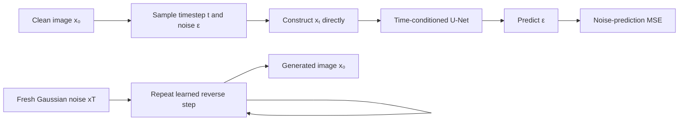

import PaperPdf from '@site/src/components/PaperPdf';
import CodeWalkthrough from '@site/src/components/viz/CodeWalkthrough';
import ResearchPaperLab from '@site/src/components/viz/ResearchPaperLab';

> **Ho, Jain and Abbeel · 2020** · [Read the embedded paper](#original-paper) ·
> [Download PDF](/papers/research-papers/ddpm.pdf) · Notes follow the paper
> section by section, §1 to the appendices.

## Paper in one minute

**Problem.** Generating a complex image in one step is difficult and can lead to
unstable objectives or incomplete coverage of the data distribution.

**Key idea.** Define a fixed process that gradually adds Gaussian noise, then
train a time-conditioned network, conveniently through noise prediction, to
reverse one corruption step at a time.

**Why it matters.** DDPM connects high-quality generation, variational modelling
and denoising score matching through a simple training loss. The original method
requires many sequential sampling steps and is not yet latent or text-conditioned
diffusion.

### Training and generation flow



## How to read this chapter

The walkthrough below follows the paper **in its own order**, from the abstract
to the appendices. Each heading carries the paper's section number, so you can
keep the PDF open beside it.

You do not need to have read a research paper before. Every new term is
explained the first time it appears, and each formula comes after the idea it
expresses. Boxes marked **not from the paper** are extra help, such as
analogies, real-world examples or worked numbers.

The embedded PDF is the first arXiv version (v1, June 2020). All numbers below
are taken from it.

## Abstract: the five claims

The paper is about **generating new images** that look like a training set. Its
abstract makes five claims:

1. **Diffusion probabilistic models** can produce **high-quality images**. These
   are models inspired by a branch of physics (non-equilibrium thermodynamics)
   that studies how things like ink spread through water.
2. The best results come from training on a **weighted variational bound**, a
   loss designed using a new link between diffusion models and **denoising
   score matching with Langevin dynamics** (both explained in §3.2).
3. The models naturally support **progressive lossy decompression**: an image
   can be revealed coarse-to-fine, which the paper shows generalises
   autoregressive (one-piece-at-a-time) decoding.
4. On **CIFAR10** without class labels, the model scores an **Inception Score of
   9.46** and a state-of-the-art **FID of 3.17**.
5. On 256×256 **LSUN** images, sample quality is similar to **ProgressiveGAN**.

Terms to know:

- **CIFAR10** is a standard dataset of 60,000 tiny 32×32 colour photos in 10
  classes. **LSUN** has larger photos of scenes such as bedrooms and churches.
  **CelebA-HQ** is a set of high-quality celebrity face photos.
- **Unconditional** generation means the model is not told what to draw (no
  class label, no text). It just produces images like the training set.
- **FID** (Fréchet Inception Distance) compares the statistics of generated
  images with real ones, using features from an image classifier. Lower is
  better; 0 would mean identical statistics.
- **Inception Score (IS)** rewards images that a classifier finds both
  recognisable and varied. Higher is better.

## §1 Introduction: diffusion models can make good images

Several kinds of **deep generative models**, models that learn to create new
data, already produced striking images and audio: **GANs** (a generator trained
against a critic), **autoregressive models** (one pixel or token at a time),
**flows** and **VAEs**. Energy-based models and score matching had also started
to produce images comparable to GANs.

This paper is about a different kind, the **diffusion probabilistic model**
("diffusion model" for short). It is a chain of small steps, trained to turn
noise into data. Its steps are learned to **reverse a diffusion process**: a
fixed chain that gradually adds noise to data until the signal is destroyed.
When each noise step is small and Gaussian, each reverse step can be Gaussian
too, which makes the neural network simple to set up.

Diffusion models were easy to define and train, but nobody had shown they could
make **high-quality** samples. This paper shows they can, sometimes better than
any other published model (§4). It also finds that one particular way of setting
up the model is equivalent to two known techniques, **denoising score
matching** during training and **annealed Langevin dynamics** during sampling
(§3.2). The authors count this equivalence as a primary contribution.

The introduction is also honest about a weakness. The models' **log
likelihoods**, a measure of how probable the model finds real test images, are
**not competitive** with other likelihood-based models. Most of the model's
"description length" for an image is spent on details too small to see
(§4.3).


_Figure 2 from the original paper, PDF page 2.
[Source PDF](/papers/research-papers/ddpm.pdf#page=2)._

Figure 2 shows the chain the paper works with, from pure noise $x_T$ to a clean
image $x_0$. In the original figure, the noisy endpoint appears on the left and
the clean image on the right. Follow the labelled q and p arrows, rather than
assuming left-to-right always means forward noising: $q$ adds noise (right to
left) and $p_\theta$ removes it (left to right).

:::tip Intuition: why turn a good image into noise? (not from the paper)

Generating an image in one step is a difficult mapping. Diffusion replaces it
with many smaller denoising transitions. During training, we can corrupt a real
image ourselves, so we know exactly which noise was added.

The learned model receives the corrupted image and its noise level, then
predicts a quantity that helps reverse the corruption. At generation time, it
starts from fresh noise and repeatedly applies learned reverse transitions.

The forward process is fixed. The reverse process is learned. Keeping those
roles separate makes the equations much easier to follow.

:::

:::tip In the real world (not from the paper)

Stable Diffusion, DALL·E 2 and Google's Imagen all build on this paper's idea of
learning to reverse gradual noising. When you type a prompt into one of them,
the picture is produced by the kind of step-by-step denoising described here,
with extra machinery for following the text.

:::

## §2 Background: two chains, one bound

A diffusion model is a **latent variable model**: besides the image $x_0$, it
has hidden intermediate versions $x_1,\ldots,x_T$ of the same size, each a
little noisier. Two chains connect them.

**The reverse process** is the part that is learned. It starts from pure noise,
$p(x_T)=\mathcal N(x_T;0,I)$ (a standard Gaussian: every pixel an independent
random number with mean 0 and variance 1), and takes $T$ learned steps back
towards an image. The paper's **Equation 1**:

$$
p_\theta(x_{0:T}) := p(x_T)\prod_{t=1}^{T}p_\theta(x_{t-1}\mid x_t),\qquad
p_\theta(x_{t-1}\mid x_t) := \mathcal N\!\left(x_{t-1};\,\mu_\theta(x_t,t),\,\Sigma_\theta(x_t,t)\right).
$$

In words: draw noise, then repeatedly draw a slightly cleaner image from a
Gaussian whose centre $\mu_\theta$ (and spread $\Sigma_\theta$) a neural network
computes from the current image and step number.

**The forward process** is fixed, with no learning at all. It adds a little
Gaussian noise at each step according to a **variance schedule**
$\beta_1,\ldots,\beta_T$ (a list of small numbers saying how much noise to add at
each step). **Equation 2**:

$$
q(x_{1:T}\mid x_0) := \prod_{t=1}^{T}q(x_t\mid x_{t-1}),\qquad
q(x_t\mid x_{t-1}) := \mathcal N\!\left(x_t;\,\sqrt{1-\beta_t}\,x_{t-1},\,\beta_t I\right).
$$

In words: shrink the image slightly (multiply by $\sqrt{1-\beta_t}$), then add
noise of variance $\beta_t$. The signal is slightly reduced and Gaussian noise is
added. Repeating this enough times produces something close to standard
Gaussian noise when the cumulative retained signal becomes small.

**Training** maximises how probable the model finds real images. That quantity
cannot be computed directly, so the paper minimises an upper bound on its
negative log, the usual **variational bound** (**Equation 3**):

$$
\mathbb E\left[-\log p_\theta(x_0)\right]\le
\mathbb E_q\left[-\log p(x_T)-\sum_{t\ge1}\log\frac{p_\theta(x_{t-1}\mid x_t)}{q(x_t\mid x_{t-1})}\right] =: L.
$$

In words: $L$ is a number we can estimate, and pushing it down pushes up the
probability of real images.

The paper notes that the $\beta_t$ could be learned, but can also be fixed, and
that Gaussian reverse steps are expressive enough because, when $\beta_t$ is
small, the forward and reverse steps have the same form.

### The closed form saves training work

A key property: you can jump from a clean image to **any** noise level in one
go. Write $\alpha_t:=1-\beta_t$ and $\bar\alpha_t:=\prod_{s=1}^{t}\alpha_s$ (the
product of all the $\alpha$s so far, the total fraction of signal variance
kept). Then **Equation 4**:

$$
q(x_t\mid x_0)=\mathcal N\!\left(x_t;\,\sqrt{\bar\alpha_t}\,x_0,\,(1-\bar\alpha_t)I\right),
\quad\text{that is}\quad
x_t=\sqrt{\bar\alpha_t}\,x_0+\sqrt{1-\bar\alpha_t}\,\epsilon,
\qquad\epsilon\sim\mathcal N(0,I).
$$

In words: a noisy image at step $t$ is a faded copy of the clean image plus a
dose of fresh noise, with the two amounts set by $\bar\alpha_t$.

This is why training does not need to execute all previous forward steps for
every example. Sample t, sample noise, and construct $x_t$ directly. So training
can pick a **random term** of $L$ for each image and update on it.

:::tip Worked number (not from the paper)

For a one-dimensional example with $x_0=2$, $\bar\alpha_t=0.64$ and
$\epsilon=-1$, the noisy value is `0.8 × 2 + 0.6 × (-1) = 1`. The retained
signal and noise coefficients are square roots because the schedule describes
variances.

With the paper's schedule (§4), the signal coefficient $\sqrt{\bar\alpha_t}$ is
about 0.72 at $t=250$, 0.28 at $t=500$, 0.058 at $t=750$ and 0.0064 at
$t=1000$. Half-way through, most of the image is already noise.

:::

### Rewriting the bound as a sum of comparisons

The paper then rewrites $L$ to make it less noisy to estimate (**Equation 5**,
derived in Appendix A):

$$
\mathbb E_q\Big[\underbrace{D_{\mathrm{KL}}\!\left(q(x_T\mid x_0)\,\Vert\,p(x_T)\right)}_{L_T}
+\sum_{t>1}\underbrace{D_{\mathrm{KL}}\!\left(q(x_{t-1}\mid x_t,x_0)\,\Vert\,p_\theta(x_{t-1}\mid x_t)\right)}_{L_{t-1}}
\underbrace{-\log p_\theta(x_0\mid x_1)}_{L_0}\Big].
$$

The **KL divergence** $D_{\mathrm{KL}}(q\Vert p)$ measures how different two
probability distributions are; it is zero when they match. In words, the bound
has three kinds of term:

- $L_T$ checks the noisy endpoint against the chosen prior. With a fixed forward
  schedule, the prior-matching term does not train the denoiser parameters.
- Each $L_{t-1}$ compares one learned reverse step with the **true** reverse
  step. The middle terms train reverse transitions.
- $L_0$ is the final term; it assigns likelihood to the actual clean data.

**The true reverse step is known, if you know $x_0$.** Given both the noisy
image and the clean one, the previous step has an exact Gaussian form
(**Equations 6 and 7**):

$$
q(x_{t-1}\mid x_t,x_0)=\mathcal N\!\left(x_{t-1};\,\tilde\mu_t(x_t,x_0),\,\tilde\beta_t I\right),
$$

$$
\tilde\mu_t(x_t,x_0):=\frac{\sqrt{\bar\alpha_{t-1}}\,\beta_t}{1-\bar\alpha_t}\,x_0+
\frac{\sqrt{\alpha_t}\,(1-\bar\alpha_{t-1})}{1-\bar\alpha_t}\,x_t
\qquad\text{and}\qquad
\tilde\beta_t:=\frac{1-\bar\alpha_{t-1}}{1-\bar\alpha_t}\,\beta_t.
$$

In words: the best guess for the previous step is a weighted blend of the clean
image and the current noisy one. Training knows both; generation knows only the
noisy version. At generation time $x_0$ is unknown, so the network supplies the
missing information.

Because every term compares two Gaussians, each KL can be computed exactly with
a formula, instead of being estimated by noisy random sampling.

:::tip Intuition: ink in water (not from the paper)

Drop ink into a glass of water and it spreads until the water is evenly grey.
That is the forward process: easy, automatic, and it destroys the shape of the
drop. Running the film backwards, grey water gathering itself into a drop, is
what the reverse process must learn. Each backward frame is only a tiny change,
which is what makes it learnable.

:::

## §3 Diffusion models and denoising autoencoders

A diffusion model leaves several choices open: the schedule $\beta_t$, the
network architecture, and how the reverse Gaussians are parameterised. To guide
these choices, the paper builds an explicit link to **denoising score matching**
(§3.2), which leads to a simpler, re-weighted loss (§3.4). In the end, the
authors say, their design is justified by "simplicity and empirical results".
The section works through the terms of Equation 5 in turn.

### §3.1 Forward process and L<sub>T</sub>

The paper **fixes** the $\beta_t$ to constants rather than learning them (the
values are in §4). So the forward process $q$ has no learnable parameters, and
$L_T$ is a **constant** during training that can be ignored.

### §3.2 Reverse process and L<sub>1:T−1</sub>

**First choice: the spread.** The reverse step's covariance is set to
$\Sigma_\theta(x_t,t)=\sigma_t^2I$, a fixed number per step that is not
trained. The paper tried two values:

| Choice                    | When it is exactly right                      |
| ------------------------- | --------------------------------------------- |
| $\sigma_t^2=\beta_t$      | If the data $x_0$ were pure Gaussian noise    |
| $\sigma_t^2=\tilde\beta_t$ | If the data were one single fixed image       |

These are the two extremes (upper and lower bounds on the reverse step's
randomness, for data with unit variance). **Both gave similar results.** The
teaching code below uses $\tilde\beta_t$.

**Second choice: the mean.** With fixed variances, each term of the bound
becomes a squared distance between the true and the learned mean (**Equation
8**):

$$
L_{t-1}=\mathbb E_q\left[\frac{1}{2\sigma_t^2}\left\lVert\tilde\mu_t(x_t,x_0)-\mu_\theta(x_t,t)\right\rVert^2\right]+C,
$$

where $C$ does not depend on the network. In words: the network's job is to
land on the true reverse mean.

The obvious design is a network that outputs $\tilde\mu_t$ directly. But
substituting $x_0$ from Equation 4 into Equation 7 rewrites the target in terms
of the noise $\epsilon$ (**Equations 9 and 10**):

$$
L_{t-1}-C=\mathbb E_{x_0,\epsilon}\left[\frac{1}{2\sigma_t^2}\left\lVert\frac{1}{\sqrt{\alpha_t}}\left(x_t(x_0,\epsilon)-\frac{\beta_t}{\sqrt{1-\bar\alpha_t}}\,\epsilon\right)-\mu_\theta(x_t(x_0,\epsilon),t)\right\rVert^2\right].
$$

The network already receives $x_t$, so the only unknown is $\epsilon$. That
suggests letting a network $\epsilon_\theta$ **predict the noise**, and building
the mean from it (**Equation 11**):

$$
\mu_\theta(x_t,t)=\frac{1}{\sqrt{\alpha_t}}\left(x_t-\frac{\beta_t}{\sqrt{1-\bar\alpha_t}}\,\epsilon_\theta(x_t,t)\right).
$$

In words: guess which noise was added, remove the right fraction of it, and
rescale.

The model is not subtracting all noise in one arbitrary step. The coefficient
depends on the schedule and corresponds to the chosen reverse transition.

:::tip Intuition: why the network must be told $t$ (not from the paper)

The same-looking input requires different treatment at different noise levels.
A nearly clean image needs a small correction; a mostly noisy image requires
much more inference from the learned data distribution. So $\epsilon_\theta$
takes $t$ as a second input.

:::

#### Algorithm 2: sampling

Generating an image is then:

1. Start with $x_T\sim\mathcal N(0,I)$.
2. For $t=T,\ldots,1$: draw $z\sim\mathcal N(0,I)$ if $t>1$, otherwise $z=0$.
3. Compute
   $x_{t-1}=\frac{1}{\sqrt{\alpha_t}}\left(x_t-\frac{1-\alpha_t}{\sqrt{1-\bar\alpha_t}}\,\epsilon_\theta(x_t,t)\right)+\sigma_t z$.
4. Return $x_0$.

In words: calculate the predicted mean and add a little fresh noise, again and
again. Use fresh Gaussian z except at the final clean-data step, where the added
noise is zero. Stochastic sampling produces different outputs from different
random starts and transitions. ($1-\alpha_t$ in the algorithm is just
$\beta_t$.)

**The link to score matching.** The paper observes that Algorithm 2 "resembles
**Langevin dynamics**", with $\epsilon_\theta$ acting as a learned gradient of
the data density. Langevin dynamics is a way to sample from a distribution by
repeatedly taking a small step towards higher probability and adding a little
noise. With the parameterisation of Equation 11, the loss term becomes
(**Equation 12**):

$$
\mathbb E_{x_0,\epsilon}\left[\frac{\beta_t^2}{2\sigma_t^2\,\alpha_t\,(1-\bar\alpha_t)}\left\lVert\epsilon-\epsilon_\theta\!\left(\sqrt{\bar\alpha_t}\,x_0+\sqrt{1-\bar\alpha_t}\,\epsilon,\;t\right)\right\rVert^2\right].
$$

In words: a weighted squared error between the true and predicted noise. That is
what **denoising score matching** over many noise levels looks like. So,
the paper concludes, training with a denoising-score-matching-style loss **is**
variational inference for a Langevin-like sampler. This is the equivalence the
introduction promised.

A **score** here means the gradient of log density with respect to a noisy
input, not an evaluation score. The score points towards locally more likely
noisy-data configurations. This connects denoising diffusion to denoising score
matching and stochastic sampling methods such as Langevin dynamics. The schedule
and discrete reverse update still matter; the terms should not be treated as
interchangeable names for every sampler.

:::tip The score in one line (not from the paper)

The paper does not write this formula, but it follows from Equation 4. For
Gaussian-corrupted data, noise prediction is related to estimating the score:

$$
s_\theta(x_t,t)\approx-\frac{\epsilon_\theta(x_t,t)}{\sqrt{1-\bar\alpha_t}}.
$$

Predicted noise points away from the clean image, so its negative points
towards it, which is "uphill" in probability.

:::

**Summary of the options.** The network can predict $\tilde\mu_t$, or, with the
new parameterisation, predict $\epsilon$. It could also predict $x_0$ directly,
but the authors found that "to lead to worse sample quality early in our
experiments". Since $\epsilon$-prediction is "just another parameterization",
§4.2 tests it against predicting $\tilde\mu_t$.

:::note An untested aside

The $x_0$-prediction option and the "similar results" for the two $\sigma_t^2$
choices are reported only in words, with no numbers. Later work (Improved DDPM,
2021) found that learning the variance can help likelihood, so treat both as
findings about this setup.

:::

:::tip In the real world (not from the paper)

The "sampling steps" setting in image generators such as Stable Diffusion's web
interfaces is the number of reverse steps in a loop like Algorithm 2. Fewer
steps is faster; too few makes blurry or broken images. Modern samplers need
far fewer than 1,000 steps (see DDIM under Further reading).

:::

### §3.3 Data scaling, reverse process decoder, and L<sub>0</sub>

Images are stored as whole numbers from 0 to 255 per colour channel. The paper
scales them linearly to $[-1,1]$, so the network always sees inputs on the same
scale as the starting noise $p(x_T)$.

The original images contain integer pixel values, scaled into the interval from
−1 to 1. A continuous density evaluated at one number is not the same as the
probability of a discrete pixel value. To get a true probability for discrete
images, the last reverse step becomes a **discrete decoder** (**Equation 13**):

$$
p_\theta(x_0\mid x_1)=\prod_{i=1}^{D}\int_{\delta_-(x_0^i)}^{\delta_+(x_0^i)}\mathcal N\!\left(x;\,\mu_\theta^i(x_1,1),\,\sigma_1^2\right)dx,
$$

$$
\delta_+(x)=\begin{cases}\infty & \text{if } x=1\\ x+\frac{1}{255} & \text{if } x<1\end{cases}
\qquad
\delta_-(x)=\begin{cases}-\infty & \text{if } x=-1\\ x-\frac{1}{255} & \text{if } x>-1\end{cases}
$$

where $D$ is the number of pixel values and $i$ picks one of them. In words: for
each pixel, measure how much of the Gaussian falls inside that pixel's "bin".
Endpoint bins include the appropriate tail. This makes the reconstruction term a
probability for discrete image data, supporting the bits-per-dimension
interpretation, with no need to add noise to the data or correct for the
scaling.

At the end of sampling, the paper shows $\mu_\theta(x_1,1)$ **without** adding
noise. A more powerful decoder (such as an autoregressive one) is left to future
work.

The teaching script trains the simplified denoising loss and generates images.
It does not calculate this discretised decoder likelihood or report a
variational bound. Its MSE is therefore not a substitute for the paper's
likelihood metric.

:::tip Worked number (not from the paper)

After scaling, neighbouring pixel values are $2/255\approx0.0078$ apart, so each
bin is $\pm1/255$ around its value. Pure white ($x=1$) gets everything above
its lower edge, and pure black ($x=-1$) everything below its upper edge.

:::

### §3.4 Simplified training objective

With the decoder defined, the full bound is differentiable and could be trained
on directly. But the authors found it better for sample quality, and simpler, to
drop the weights in front of Equation 12 (**Equation 14**):

$$
L_{\mathrm{simple}}(\theta):=\mathbb E_{t,x_0,\epsilon}\left[\left\lVert\epsilon-\epsilon_\theta\!\left(\sqrt{\bar\alpha_t}\,x_0+\sqrt{1-\bar\alpha_t}\,\epsilon,\;t\right)\right\rVert^2\right],
$$

with $t$ uniform between 1 and $T$. In words: add known noise to an image, ask
the network to guess the noise, and score the guess with a plain squared error.

How it relates to the bound:

- The $t=1$ case approximates $L_0$, treating the bin integral as density times
  bin width and ignoring $\sigma_1^2$ and edge effects.
- The $t>1$ cases are an **unweighted** Equation 12, like the loss weighting of
  the NCSN score-matching model.
- $L_T$ does not appear, because the $\beta_t$ are fixed.

The paper calls $L_{\mathrm{simple}}$ a **weighted variational bound**: it
emphasises different parts of the reconstruction task than the true bound does.
This reweighting gives better sample quality (§4).

The unweighted MSE is therefore related to the variational derivation, but is
not literally every term of the original likelihood bound. This distinction
matters when comparing sample-quality optimisation with likelihood evaluation.

#### Algorithm 1: training

1. Draw a clean example $x_0$ from the data.
2. Draw a timestep $t\sim\text{Uniform}(\lbrace1,\ldots,T\rbrace)$ and Gaussian
   noise $\epsilon\sim\mathcal N(0,I)$.
3. Construct the noisy example using the closed form.
4. Predict its noise using the example and timestep.
5. Take a gradient step on the squared error, and repeat until converged.

:::tip Worked number: what the dropped weights were doing (not from the paper)

With $\sigma_t^2=\beta_t$ and the §4 schedule, the weight in Equation 12
simplifies to $\beta_t/(2\alpha_t(1-\bar\alpha_t))$. It is about **0.50** at
$t=1$, 0.074 at $t=10$, and between about **0.005 and 0.010** from $t=100$
onwards. So the true bound cares 50 to 90 times more about the nearly clean
steps. $L_{\mathrm{simple}}$
weights every step equally, which shifts effort towards the harder, noisier
steps. A later revision of the paper gives this explanation; v1 only says the
reweighting "emphasizes different aspects".

:::

:::tip In the real world (not from the paper)

This one-line loss is still how most image diffusion models are trained.
Stable Diffusion's training objective is the same noise-prediction squared
error, applied to a compressed version of the image instead of the pixels.

:::

## §4 Experiments

The paper evaluates image generation with sample-quality metrics and
likelihood-related quantities, compares objective choices, and explores
interpolation and progressive reconstruction. These analyses show that denoising
models can generate strong image samples, while also revealing trade-offs
between quality, compression-style interpretation and likelihood.

**Settings used everywhere.**

- $T=1000$ steps, so sampling needs as many network calls as earlier work.
- $\beta_t$ rises **linearly from $\beta_1=10^{-4}$ to $\beta_T=0.02$**. These
  are small next to data in $[-1,1]$, so forward and reverse steps keep the same
  Gaussian form, while leaving almost no signal at $x_T$: $L_T\approx10^{-5}$
  bits per dimension.
- The network is a **U-Net** similar to an unmasked PixelCNN++, with **group
  normalisation**. A U-Net shrinks the image step by step to see the big
  picture, then enlarges it again, passing fine detail across through **skip
  connections**. The same network is used at every step; $t$ is given to it
  with the Transformer's sinusoidal position embedding. There is
  **self-attention at the 16×16 resolution**. Details are in Appendix B.

A U-Net reduces spatial resolution to collect broader context, then upsamples
while reusing higher-resolution features through skip connections. These
concatenation skips preserve detail; they are different from the residual
additions inside individual blocks. Timestep embeddings turn the scalar noise
level into a vector the network can use throughout its layers. The example uses
sinusoidal time features and learned projections into convolutional blocks.

The original image model uses a much larger architecture and training setup,
including attention at selected resolutions. The narrow teaching U-Net below
preserves the training and sampling path but omits that original architectural
scale and attention.

:::tip Worked number: checking $L_T\approx10^{-5}$ (not from the paper)

With this schedule, $\bar\alpha_T\approx4.0\times10^{-5}$. For one pixel, the KL
between $\mathcal N(\sqrt{\bar\alpha_T}x_0,1-\bar\alpha_T)$ and
$\mathcal N(0,1)$ is about $\tfrac12\bar\alpha_T x_0^2$ nats. For $x_0^2$
between 0.3 and 1 that is roughly $0.9\times10^{-5}$ to $2.9\times10^{-5}$ bits,
matching the paper's order of magnitude.

:::

:::tip In the real world (not from the paper)

The U-Net was invented in 2015 for **medical image segmentation**, outlining
cells and organs in microscope and scan images. It is also the denoiser inside
Stable Diffusion versions 1 and 2. An architecture built to find tumours ended
up painting pictures.

:::

### §4.1 Sample quality

**Table 1** compares the models on CIFAR10. **NLL** (negative log likelihood)
is given in **bits per dimension**: the average number of bits needed to
encode each pixel value under the model (lower is better). Headline rows:

| Model                               | IS ↑        | FID ↓ | NLL test (train) ↓ |
| ----------------------------------- | ----------- | ----- | ------------------ |
| StyleGAN2 + ADA (conditional)       | 10.06       | 2.67  |                    |
| StyleGAN2 + ADA (unconditional)     | 9.74 ± 0.05 | 3.26  |                    |
| NCSN (score matching)               | 8.87 ± 0.12 | 25.32 |                    |
| Sparse Transformer (autoregressive) |             |       | 2.80               |
| Ours, trained on $L$                | 7.67 ± 0.13 | 13.51 | ≤ 3.70 (3.69)      |
| Ours, trained on $L_{\mathrm{simple}}$ | 9.46 ± 0.11 | **3.17** | ≤ 3.75 (3.72) |

What this shows: among unconditional models, the $L_{\mathrm{simple}}$ model has
the best FID. But its likelihood (3.75 bits) is well behind autoregressive
models (2.80), and training on the true bound $L$ gives better likelihood but
much worse images.

<details>
<summary>Full Table 1 from the paper</summary>

| Model                        | IS          | FID   | NLL test (train) |
| ---------------------------- | ----------- | ----- | ---------------- |
| **Conditional**              |             |       |                  |
| EBM                          | 8.30        | 37.9  |                  |
| JEM                          | 8.76        | 38.4  |                  |
| BigGAN                       | 9.22        | 14.73 |                  |
| StyleGAN2 + ADA              | 10.06       | 2.67  |                  |
| **Unconditional**            |             |       |                  |
| Diffusion (original)         |             |       | ≤ 5.40           |
| Gated PixelCNN               | 4.60        | 65.93 | 3.03 (2.90)      |
| Sparse Transformer           |             |       | 2.80             |
| PixelIQN                     | 5.29        | 49.46 |                  |
| EBM                          | 6.78        | 38.2  |                  |
| NCSNv2                       |             | 31.75 |                  |
| NCSN                         | 8.87 ± 0.12 | 25.32 |                  |
| SNGAN                        | 8.22 ± 0.05 | 21.7  |                  |
| SNGAN-DDLS                   | 9.09 ± 0.10 | 15.42 |                  |
| StyleGAN2 + ADA              | 9.74 ± 0.05 | 3.26  |                  |
| Ours ($L$, fixed isotropic Σ) | 7.67 ± 0.13 | 13.51 | ≤ 3.70 (3.69)    |
| Ours ($L_{\mathrm{simple}}$) | 9.46 ± 0.11 | 3.17  | ≤ 3.75 (3.72)    |

"Diffusion (original)" is the 2015 diffusion model this paper builds on.

</details>

The paper's reading: the unconditional model beats other models on sample
quality "at the expense of codelengths". Training on the true bound gives
better codelengths, as expected; $L_{\mathrm{simple}}$ gives the best samples.
LSUN results are in Figures 3 and 4 (Church FID 7.89, Bedroom FID 4.90) and in
the appendix's Table 3.

**FID** compares statistics of generated and real image features; it is not a
direct per-image correctness score. **Likelihood** measures assigned probability
under the model and its evaluation procedure. Neither alone captures every
aspect of visual quality or memorisation.

:::note The text claims more than Table 1 shows

§4.1 says the model has better sample quality than other models, "both
unconditional and conditional". But Table 1's **conditional** StyleGAN2 + ADA
scores FID 2.67 and IS 10.06, both better than 3.17 and 9.46. The claim holds
against the unconditional models only, which is what the abstract says.

:::

:::tip In the real world (not from the paper)

FID became the standard scoreboard for image generators; nearly every image
model paper since reports it. It has well-known blind spots (it depends on one
classifier's view of images), which is why companies also run human preference
studies before launching a model.

:::

### §4.2 Reverse process parameterisation and training objective ablation

An **ablation** changes one design choice at a time to see what matters. **Table
2** crosses two choices: what the network predicts ($\tilde\mu$ or
$\epsilon$) and which loss it trains on. A dash means training was unstable and
produced poor samples.

| Network predicts            | Loss                          | IS          | FID   |
| --------------------------- | ----------------------------- | ----------- | ----- |
| $\tilde\mu$ (baseline)      | $L$, learned diagonal Σ       | 7.28 ± 0.10 | 23.69 |
| $\tilde\mu$ (baseline)      | $L$, fixed isotropic Σ        | 8.06 ± 0.09 | 13.22 |
| $\tilde\mu$ (baseline)      | $L_{\mathrm{simple}}$         | –           | –     |
| $\epsilon$ (ours)           | $L$, learned diagonal Σ       | –           | –     |
| $\epsilon$ (ours)           | $L$, fixed isotropic Σ        | 7.67 ± 0.13 | 13.51 |
| $\epsilon$ (ours)           | $L_{\mathrm{simple}}$         | 9.46 ± 0.11 | **3.17** |

What this shows: the winning combination is **predict the noise and train on the
simple loss**. Neither change alone is enough.

The paper's reading, row by row:

- Predicting $\tilde\mu$ works only with the true bound, not with
  $L_{\mathrm{simple}}$.
- **Learning** the reverse variances makes training unstable and samples worse
  than fixed variances.
- Predicting $\epsilon$ is about as good as predicting $\tilde\mu$ on the true
  bound with fixed variances (FID 13.51 against 13.22), but **much** better with
  $L_{\mathrm{simple}}$.

The paper compares predicting the reverse mean with predicting noise, and the
full variational objective with the simplified objective. It also studies fixed
versus learned reverse variances. Noise prediction with the simplified objective
gives strong sample-quality results in that setup; learning the variance was
less stable there.

That is a finding about the original implementation. Later work can change
variance parameterisation, objectives or sampling methods. The 2020 result is
not a rule that reverse variance must never be learned.

### §4.3 Progressive coding

**Likelihood, again.** The gap between training and test codelengths is at most
**0.03 bits per dimension**, similar to other likelihood models, so the model is
**not overfitting** (Appendix C also shows nearest neighbours). But the
codelengths are still **not competitive** with other likelihood-based models.

**So where do the bits go?** Since the images still look excellent, the authors
argue diffusion models have an inductive bias that makes them excellent **lossy
compressors**: good at keeping what you can see and cheap about what you
cannot. Treat the terms $L_1+\cdots+L_T$ as the **rate** (bits sent) and $L_0$
as the **distortion** (bits spent fixing the last details). For the best-sample
CIFAR10 model:

| Quantity                     | Value                                   |
| ---------------------------- | --------------------------------------- |
| Rate                         | 1.78 bits/dim                           |
| Distortion                   | 1.97 bits/dim                           |
| Distortion as an error       | Root mean squared error **0.95** on a 0 to 255 scale |

What this shows: **more than half** the codelength goes on errors smaller than
one grey level, which no one can see.

:::tip Worked number (not from the paper)

$1.78+1.97=3.75$ bits/dim, exactly the $L_{\mathrm{simple}}$ model's NLL in
Table 1. And $1.97/3.75\approx53\%$, the "more than half".

:::

**Progressive lossy compression.** The paper sketches a way to **send** an
image with this model (**Algorithms 3 and 4**). The sender transmits $x_T$,
then $x_{T-1}$, and so on down to $x_0$, each using the model's reverse step as
the shared code. This assumes a method (such as minimal random coding) that can
send a sample from $q$ in about $D_{\mathrm{KL}}(q\Vert p)$ bits when the
receiver knows only $p$. The total cost equals Equation 5.

At any moment, the receiver can estimate the final image from what it has so far
(**Equation 15**):

$$
x_0\approx\hat x_0=\left(x_t-\sqrt{1-\bar\alpha_t}\,\epsilon_\theta(x_t)\right)\big/\sqrt{\bar\alpha_t}.
$$

In words: undo Equation 4 using the predicted noise. **Figure 5** and **Table
4** track the error of this estimate against steps and bits. Headline rows of
Table 4 (CIFAR10 test set; the first column counts reverse steps completed):

| Reverse steps done ($T-t+1$) | Rate so far (bits/dim) | Distortion (RMSE, 0 to 255) |
| ---------------------------- | ---------------------- | --------------------------- |
| 100                          | 0.00000                | 67.60125                    |
| 500                          | 0.00716                | 38.03236                    |
| 900                          | 0.11994                | 12.02277                    |
| 1000                         | 1.77581                | 0.95136                     |

What this shows: the error falls steeply while almost no bits have been spent;
the last 100 steps then use most of the bits to fix tiny details.

<details>
<summary>Full Table 4 from the paper</summary>

| Reverse process time ($T-t+1$) | Rate (bits/dim) | Distortion (RMSE [0, 255]) |
| ------------------------------ | --------------- | -------------------------- |
| 1000                           | 1.77581         | 0.95136                    |
| 900                            | 0.11994         | 12.02277                   |
| 800                            | 0.05415         | 18.47482                   |
| 700                            | 0.02866         | 24.43656                   |
| 600                            | 0.01507         | 30.80948                   |
| 500                            | 0.00716         | 38.03236                   |
| 400                            | 0.00282         | 46.12765                   |
| 300                            | 0.00081         | 54.18826                   |
| 200                            | 0.00013         | 60.97170                   |
| 100                            | 0.00000         | 67.60125                   |

</details>

:::tip Worked number (not from the paper)

Between 900 and 1000 steps the rate grows from 0.120 to 1.776 bits/dim. That is
$1.656/1.776\approx93\%$ of all the bits, spent to move the error from 12.0 grey
levels to under 1.

:::

**Progressive generation.** Running Algorithm 2 and showing $\hat x_0$ as it
goes (Figures 6, 10 and 14) shows **large features first and details last**.
**Figure 7** freezes an intermediate $x_t$ and draws several $x_0$ from it: at
small $t$ nearly everything is shared except fine detail; at large $t$ only the
broad layout is. The authors wonder if these are "hints of conceptual
compression".

The paper interprets the reverse process as gradually recovering information.
At high noise, fine detail is absent; later stages add progressively more
detail. Its compression analysis separates a rate-like cost of transmitting
latent information from a distortion-like reconstruction cost, helping explain
why strong-looking samples and best likelihood need not coincide.

**Connection to autoregressive decoding.** The bound can also be written as
(**Equation 16**):

$$
L=D_{\mathrm{KL}}\!\left(q(x_T)\,\Vert\,p(x_T)\right)+\mathbb E_q\left[\sum_{t\ge1}D_{\mathrm{KL}}\!\left(q(x_{t-1}\mid x_t)\,\Vert\,p_\theta(x_{t-1}\mid x_t)\right)\right]+H(x_0),
$$

where $H(x_0)$ is the data's entropy (a constant). Now imagine a strange
"diffusion" that, instead of adding noise, **blanks out one pixel per step**,
with $T$ equal to the number of pixels. Undoing it one step at a time means
predicting one pixel from the ones already filled in: exactly an
**autoregressive model**. So Gaussian diffusion is a kind of autoregressive
model with a "generalised bit ordering" that no reordering of pixels can
express. And its length is free: $T=1000$ is less than the $32\times32\times3=3{,}072$
values in a CIFAR10 image.

:::note Arguments, not experiments

The autoregressive reading uses a masking diffusion "for the sake of argument";
it is not trained. The suggestion that Gaussian noise gives a better inductive
bias than masking is labelled a speculation. And the appendix says Algorithms 3
and 4 are "only a proof of concept": minimal random coding is not tractable for
high-dimensional data, so this is not a practical compressor.

:::

:::tip Analogy: a progressive JPEG (not from the paper)

A progressive JPEG on a slow connection first shows a blurry whole picture,
then sharpens it. DDPM decoding behaves the same way, and Table 4 says the
sharpening at the end is where nearly all the file size goes.

:::

### §4.4 Interpolation

To blend two real images $x_0$ and $x_0'$, the paper first **noises both** with
$q$ to step $t$ (using the same noise for both), mixes the noisy versions
linearly with a weight $\lambda$, then runs the **reverse process** from the
mix. In effect, the reverse process cleans up the artefacts of blending two
noisy images.

It also corrupts two source images to a selected noise level, interpolates their
noisy representations, and runs the reverse process. Changing the corruption
level changes how much original detail survives. This is different from simply
averaging clean pixels, which can produce a transparent-looking overlay.

On CelebA-HQ faces at $t=500$ (**Figure 8**), reconstructions are high quality
and the interpolations vary pose, skin tone, hairstyle, expression and
background smoothly, **but not eyewear**. Larger $t$ gives coarser, more varied
blends, and at $t=1000$ the results are brand-new samples (Appendix Figure 9).

:::note A typo in the interpolation formula

The text writes the mixed latent as $\bar x_t=(1-\lambda)x_0+\lambda x_0'$. From
the description, it should mix the **noisy** images:
$\bar x_t=(1-\lambda)x_t+\lambda x_t'$. Mixing $x_0$ would be plain pixel
blending, which is the "0 steps" case of Figure 9.

:::

:::tip In the real world (not from the paper)

"Noise it part-way, then denoise" is the basis of **image-to-image** editing.
SDEdit (2021) turned it into an editing method, and Stable Diffusion's
img2img mode exposes it as a **strength** slider: low strength noises a little
and keeps your picture, high strength noises a lot and invents more. It is
exactly the choice of $t$ in this section.

:::

## §5 Related work

Diffusion models can look like **flows** or **VAEs**, but they differ in two
ways: the encoder $q$ has **no parameters**, and the top latent $x_T$ carries
almost **no information** about the image. The $\epsilon$ parameterisation ties
diffusion models to **denoising score matching** with **annealed Langevin
dynamics** (the NCSN models), while also giving easy likelihood evaluation.

Two further points:

- Because training explicitly fits the Langevin-like sampler, the authors argue
  there is "no justified reason" to choose a different sampler after training.
- The link works both ways: a certain weighted denoising score matching **is**
  variational inference for a Langevin-like sampler. Through score matching's
  known link to energy-based models, the work may bear on those too. The
  rate-distortion curves and progressive decoding also echo earlier work
  (annealed importance sampling, convolutional DRAW).

:::note Later work disagreed on samplers

Within months, **DDIM** (2020) showed that a DDPM-trained network can be sampled
with a different, non-Markovian process in far fewer steps. "No justified reason
to choose a different sampler" turned out to be the opposite of what practice
adopted: fast alternative samplers are now the norm.

:::

## §6 Conclusion

The authors restate their result: high-quality image samples from diffusion
models, plus connections between diffusion models and variational inference for
Markov chains, denoising score matching, annealed Langevin dynamics (and
energy-based models), autoregressive models, and progressive lossy compression.
Because diffusion models seem to have "excellent inductive biases for image
data", they plan to try other kinds of data and to use diffusion models as parts
of other systems.

:::note What later work built

DDPM here is a pixel-space generative model. Latent diffusion moves the
diffusion process into an autoencoder's latent space; text-conditioned systems
add conditioning mechanisms. Those later designs build on related ideas but are
not all introduced in this paper.

:::

## Broader impact

The paper's impact statement names the risks plainly:

- Generative models can make **fake images and videos of public figures** for
  political purposes, more easily than by hand. At the time, CNN-generated
  images had subtle flaws that allowed detection, but better models could make
  that harder.
- Models **reflect the biases** of their training data. Large internet datasets
  are hard to clean, and if generated images spread online, those biases are
  reinforced.

It also lists possible benefits: **data compression** for an internet of
growing image sizes, **representation learning** for tasks from classification
to reinforcement learning, and **creative uses** in art, photography and music.

:::tip In the real world (not from the paper)

Both predictions came true. Diffusion-made fake images of public figures have
circulated widely, and in response companies add invisible watermarks to
generated images (Google's SynthID is one example) and industry groups have
built standards for attaching provenance information to images.

:::

## Appendix: extra information

**LSUN results.** **Table 3** gives FID scores on 256×256 LSUN images. Scores
marked with ∗ were reported by the StyleGAN2 authors as baselines.

| Model                         | LSUN Bedroom | LSUN Church | LSUN Cat |
| ----------------------------- | ------------ | ----------- | -------- |
| ProgressiveGAN                | 8.34         | 6.42        | 37.52    |
| StyleGAN                      | 2.65         | 4.21∗       | 8.53∗    |
| StyleGAN2                     |              | 3.86        | 6.93     |
| Ours ($L_{\mathrm{simple}}$)  | 6.36         | 7.89        | 19.75    |
| Ours ($L_{\mathrm{simple}}$, large) | 4.90   |             |          |

What this shows: DDPM beats ProgressiveGAN on bedrooms and cats but not on
churches, and it is behind StyleGAN and StyleGAN2 everywhere. "Similar to
ProgressiveGAN", as the abstract says, is a fair summary.

**Progressive compression** is called "only a proof of concept" (see the note in
§4.3), and Table 4 accompanies Figure 5.

## Appendix A: extended derivations

This appendix derives Equation 5 from Equation 3 (**Equations 17 to 22**). The
paper notes the derivation comes from the original 2015 diffusion paper and is
included for completeness. The key move uses Bayes' rule to turn each forward
step around, conditioning on $x_0$ (**Equation 20**):

$$
q(x_t\mid x_{t-1})=\frac{q(x_{t-1}\mid x_t,x_0)\,q(x_t\mid x_0)}{q(x_{t-1}\mid x_0)}.
$$

In words: going forward one step can be rewritten as "the true reverse step,
times a ratio of marginals". When you sum the logs over $t$, those ratios
**cancel in a chain** (telescope), leaving only $q(x_T\mid x_0)$. What remains
groups into the three kinds of KL term of Equation 5.

**Equations 23 to 26** derive the alternative form in Equation 16, using the
marginals $q(x_t)$ instead of conditioning on $x_0$. It "is not tractable to
estimate", but it is what the autoregressive argument of §4.3 needs.

## Appendix B: experimental details

**Architecture.** The backbone follows PixelCNN++: a U-Net built from Wide
ResNet blocks, with weight normalisation replaced by **group normalisation** for
simplicity.

| Setting                  | Value                                                               |
| ------------------------ | ------------------------------------------------------------------- |
| Resolutions              | 4 for 32×32 models (32×32 down to 4×4); 6 for 256×256 models        |
| Blocks                   | 2 convolutional residual blocks per resolution                      |
| Attention                | Self-attention blocks at 16×16, between the convolutional blocks    |
| Time input               | Sinusoidal embedding of $t$ added into **each** residual block      |
| Parameters               | About 30 million (CIFAR10); 114 million (others); about 256 million (large LSUN Bedroom) |

The original architecture uses a larger U-Net with residual blocks, group
normalisation, timestep embeddings and attention at selected resolutions. Its
experiments use many more diffusion steps than our small example.

**Training.**

| Dataset          | Training steps                     |
| ---------------- | ---------------------------------- |
| CIFAR10          | At most 1.3 million (about 1 day)  |
| CelebA-HQ        | 0.5 million                        |
| LSUN Bedroom     | 2.4 million (large model: 1.15 million) |
| LSUN Cat         | 1.8 million                        |
| LSUN Church      | 1.2 million                        |

**How the settings were chosen.** Apart from fitting the network into memory,
almost all tuning was for **CIFAR10 sample quality**, then copied to the other
datasets:

- **Schedule.** Constant, linear and quadratic schedules were tried, all with
  $L_T\approx0$. $T=1000$ was set without a sweep; linear from $10^{-4}$ to
  0.02 was chosen.
- **Dropout** 0.1 on CIFAR10, chosen from 0.1, 0.2, 0.3 and 0.4. Without it,
  samples showed overfitting artefacts. Other datasets used no dropout, without
  a sweep.
- **Random horizontal flips** improved CIFAR10 samples slightly, and were used
  everywhere except LSUN Bedroom.
- **Optimiser.** Adam was preferred to RMSProp, with standard settings. Learning
  rate $2\times10^{-4}$ without a sweep, lowered to $2\times10^{-5}$ for
  256×256 images, which were unstable at the higher rate.
- **Batch size** 128 for CIFAR10 and 64 for larger images, not swept.
- **EMA** (keeping a slowly moving average of the weights for evaluation) with
  decay 0.9999, not swept.

**Evaluation.** Each final model was **trained once** and evaluated during
training; the reported scores are at the **minimum FID** over training. IS and
FID use **50,000 samples**. All experiments ran on **TPU v3-8** machines.

:::note Reported at the best checkpoint

Reporting the scores at the lowest FID seen during training means the checkpoint
was chosen using the same metric that is reported. With a single training run
per model, there is also no measure of run-to-run variation. The paper does not
say what the ± values in Table 1 measure, and does not describe them as
variation between training runs.

:::

## Appendix C: samples

- **Uncurated samples** (Figures 11, 13, 16 to 19) for CelebA-HQ, CIFAR10 and
  the three LSUN datasets. Figures 17 and 18 show the large (FID 4.90) and small
  (FID 6.36) Bedroom models.
- **Latent structure** (Figure 7). Sampling has two sources of randomness: the
  starting noise and the fresh noise at every step. To see what the second one
  does, the authors run one reverse chain and **split** it at
  $t\in\lbrace1000,750,500,250\rbrace$ into several continuations. Split right
  after the start and the faces differ a lot. Split later and they share gender,
  hair colour, eyewear, saturation, pose and expression. So an intermediate
  image such as $x_{750}$ already encodes these attributes, even though they
  cannot be seen in it.
- **Coarse-to-fine interpolation** (Figure 9). Varying the number of diffusion
  steps before mixing, from 0 to 1000, moves from pixel-space blending to
  entirely new samples.
- **Nearest neighbours** (Figures 12 and 15). Each sample is shown next to its
  closest training images, in pixel space and in classifier-feature space, to
  show the model is not copying its training set.

## Real-world uses and worked examples

### Documented use: image super-resolution with SR3

Google's SR3 work adapts denoising diffusion probabilistic models to conditional image generation for super-resolution. The model produces a higher-resolution image through iterative denoising while using a lower-resolution image as a condition. This is a direct research extension of the DDPM approach. [The SR3 publication](https://research.google/pubs/image-super-resolution-via-iterative-refinement/).

### Worked example: enlarge a small image

Imagine an application enlarging a small illustration for a presentation. A diffusion-based super-resolution pipeline supplies the low-resolution image to a denoiser, starts a high-resolution sample from noise, and iteratively refines it while remaining conditioned on the input.

The input constrains broad content, but it does not contain every missing pixel. The model generates plausible detail. A sharp-looking letter or facial feature can therefore be invented; higher visual quality is not proof that the original detail has been recovered.

### Another documented extension: Imagen's image-generation cascade

The Imagen research system uses a text-conditioned base diffusion model followed by text-conditioned super-resolution stages. This combines the repeated-denoising idea with language conditioning and a resolution cascade. These additions go beyond the original unconditional DDPM setup. [The Imagen project](https://imagen.research.google/).

A possible design workflow is to request a draft product illustration, inspect generated candidates and refine the prompt. The text representation conditions denoising; the model does not look up a pre-existing photograph corresponding exactly to the sentence.

| Use | Condition supplied to denoising | Output |
|---|---|---|
| Super-resolution | Low-resolution image | A plausible higher-resolution version |
| Text-to-image generation | Text representation | A new image matching the description to some degree |
| Original teaching script here | No external condition | Samples from the learned small image distribution |

**Connection to the paper:** all three learn reverse denoising, while their conditions, model architectures and intended outputs differ.

## Interactive lab

Move through diffusion time and compare the clean-signal and noise coefficients.
The table view exposes the exact numbers used by the closed-form noising equation.

<ResearchPaperLab lab="ddpm" />

## Complete code: train a denoiser and generate new images

<CodeWalkthrough paper="ddpm" />

**Teaching implementation.** This program includes a schedule, direct forward noising, a time-conditioned U-Net, training, the complete reverse loop and saved generated images.

Save as `ddpm.py`, install PyTorch, and run `python ddpm.py`. It writes 16 small `.pgm` images to `ddpm-samples/` and saves a model checkpoint.

<details>
<summary>Complete runnable script</summary>

```python
"""Complete DDPM training and reverse sampling on small monochrome images.
Teaching adaptation: 8x8 bars, 50 diffusion steps and a narrow time-conditioned U-Net.
Writes samples as PGM images, which can be opened by common image viewers.
"""
import math
from pathlib import Path
import torch
from torch import nn
import torch.nn.functional as F

torch.manual_seed(7);torch.set_num_threads(1)
T=50
beta=torch.linspace(.0001,.2,T)
alpha=1-beta;alpha_bar=torch.cumprod(alpha,0)
previous=torch.cat((torch.ones(1),alpha_bar[:-1]))
posterior_variance=beta*(1-previous)/(1-alpha_bar)

def extract(values,t):return values[t][:,None,None,None]
def q_sample(clean,t,noise):
    return extract(alpha_bar,t).sqrt()*clean+(1-extract(alpha_bar,t)).sqrt()*noise

def time_embedding(t,width=32):
    frequency=torch.exp(-math.log(10000)*torch.arange(width//2)/(width//2))
    angle=t.float()[:,None]*frequency
    return torch.cat((angle.sin(),angle.cos()),1)

class TimeBlock(nn.Module):
    def __init__(self,cin,cout):
        super().__init__()
        self.conv1,self.conv2=nn.Conv2d(cin,cout,3,padding=1),nn.Conv2d(cout,cout,3,padding=1)
        self.norm1,self.norm2=nn.GroupNorm(4,cout),nn.GroupNorm(4,cout)
        self.time=nn.Linear(32,cout)
        self.skip=nn.Conv2d(cin,cout,1) if cin!=cout else nn.Identity()
    def forward(self,x,time):
        h=F.silu(self.norm1(self.conv1(x)))+self.time(time)[:,:,None,None]
        h=self.norm2(self.conv2(F.silu(h)))
        return F.silu(h+self.skip(x))

class UNet(nn.Module):
    def __init__(self):
        super().__init__()
        self.time=nn.Sequential(nn.Linear(32,32),nn.SiLU(),nn.Linear(32,32))
        self.down=TimeBlock(1,16);self.middle=TimeBlock(16,32)
        self.up=TimeBlock(48,16);self.output=nn.Conv2d(16,1,1)
    def forward(self,x,t):
        time=self.time(time_embedding(t))
        skip=self.down(x,time)
        middle=self.middle(F.avg_pool2d(skip,2),time)
        up=F.interpolate(middle,size=skip.shape[-2:],mode='nearest')
        return self.output(self.up(torch.cat((up,skip),1),time))

def batch(n):
    x=-torch.ones(n,1,8,8)
    for i in range(n):
        position=torch.randint(1,6,()).item()
        if torch.rand(())<.5:x[i,0,position:position+2,:]=1
        else:x[i,0,:,position:position+2]=1
    return x

model=UNet();optim=torch.optim.Adam(model.parameters(),lr=.002)
losses=[]
for step in range(600):
    clean=batch(32);t=torch.randint(T,(32,));noise=torch.randn_like(clean)
    noisy=q_sample(clean,t,noise)
    loss=F.mse_loss(model(noisy,t),noise)
    optim.zero_grad();loss.backward();optim.step();losses.append(loss.item())
model.eval()
with torch.no_grad():
    x=torch.randn(16,1,8,8)
    for step in reversed(range(T)):
        t=torch.full((len(x),),step,dtype=torch.long)
        prediction=model(x,t)
        mean=(x-beta[step]/(1-alpha_bar[step]).sqrt()*prediction)/alpha[step].sqrt()
        x=mean+posterior_variance[step].sqrt()*torch.randn_like(x) if step>0 else mean
    assert torch.isfinite(x).all()
    images=((x.clamp(-1,1)+1)*127.5).byte()
Path('ddpm-samples').mkdir(exist_ok=True)
for i,pixels in enumerate(images[:,0]):
    Path(f'ddpm-samples/{i:02d}.pgm').write_bytes(b'P5\n8 8\n255\n'+bytes(pixels.flatten().tolist()))
print('Mean first / last 50 losses:',sum(losses[:50])/50,sum(losses[-50:])/50)
print('Wrote 16 generated samples to ddpm-samples/')
torch.save(model.state_dict(),'ddpm-demo.pt')
```

</details>

### Follow the schedule and indexing

The mathematical paper indexes timesteps from 1 to T. Python arrays use 0 through T−1. `previous` prepends a retained-signal value of 1 so that the posterior-variance formula has the correct clean-data boundary.

`extract` reshapes one schedule value per batch item to **B × 1 × 1 × 1**, allowing it to broadcast across pixels. Without this reshape, a timestep vector can accidentally align with an image dimension.

The training loop samples different t values for different examples. The sampling loop instead moves the whole batch through each decreasing timestep. These are distinct uses of the same denoiser.

The 50-step schedule uses a larger final beta than the paper's longer schedule so that the retained signal becomes small within this short demonstration. Copying the original endpoint while drastically reducing the number of steps would leave too much signal at the supposed noise endpoint.

In the checked run, average noise-prediction loss fell from about 0.30 over the first 50 steps to about 0.045 over the last 50. Inspect the saved samples as well: a falling loss alone does not prove good generative coverage or sharp images.

The code covers Algorithm 1-style denoising training and Algorithm 2-style
reverse sampling; the likelihood, compression and interpolation analyses are
explained above but are separate experiments.
[Original paper, Sections 2–5 and Appendices A–C](/papers/research-papers/ddpm.pdf).

### Paper-to-code map

| Paper section                                         | Where it lives in `ddpm.py`                                                                    |
| ----------------------------------------------------- | ---------------------------------------------------------------------------------------------- |
| §2 Equations 2 and 4: $\beta_t$, $\alpha_t$, $\bar\alpha_t$ | `beta=torch.linspace(.0001,.2,T)`, `alpha=1-beta`, `alpha_bar=torch.cumprod(alpha,0)`     |
| §2 Equation 4, jump to any noise level                | `q_sample`: `extract(alpha_bar,t).sqrt()*clean+(1-extract(alpha_bar,t)).sqrt()*noise`          |
| §2 Equation 7, $\tilde\beta_t$                        | `posterior_variance=beta*(1-previous)/(1-alpha_bar)`, with `previous` holding $\bar\alpha_{t-1}$ |
| §3.3 data scaled to $[-1,1]$                          | `batch` draws bars of `1` on a `-1` background; `((x.clamp(-1,1)+1)*127.5).byte()` maps back   |
| §3.4 Equation 14 and Algorithm 1                      | `t=torch.randint(T,(32,))`, `noise=torch.randn_like(clean)`, `loss=F.mse_loss(model(noisy,t),noise)` |
| Algorithm 2 line 1, $x_T\sim\mathcal N(0,I)$          | `x=torch.randn(16,1,8,8)`                                                                       |
| §3.2 Equation 11 and Algorithm 2 line 4               | `mean=(x-beta[step]/(1-alpha_bar[step]).sqrt()*prediction)/alpha[step].sqrt()`                 |
| §3.2 $\sigma_t^2=\tilde\beta_t$; Algorithm 2 line 3 ($z=0$ at the end); §3.3 noiseless final output | `x=mean+posterior_variance[step].sqrt()*torch.randn_like(x) if step>0 else mean` |
| §4 U-Net with group normalisation and skips           | `UNet`, `TimeBlock` with `nn.GroupNorm(4,cout)`, and `torch.cat((up,skip),1)`                   |
| §4 and Appendix B, sinusoidal $t$ added in each residual block | `time_embedding`, then `self.time(time)[:,:,None,None]` added inside `TimeBlock.forward` |

### Where this program departs from the paper

| Paper setting                                                         | This program                                        | Why it matters                                                                                     |
| --------------------------------------------------------------------- | --------------------------------------------------- | -------------------------------------------------------------------------------------------------- |
| $T=1000$ steps (§4)                                                   | `T=50`                                              | 20 times fewer network calls per sample, so the schedule must change                               |
| $\beta_t$ linear from $10^{-4}$ to 0.02 (§4)                          | Linear from $10^{-4}$ to 0.2                        | With 0.02 over 50 steps, $\sqrt{\bar\alpha_T}\approx0.78$: mostly signal. With 0.2 it is about 0.068 |
| $t\sim\text{Uniform}(\lbrace1,\ldots,T\rbrace)$ (Algorithm 1)         | `torch.randint(T,(32,))` gives 0 to $T-1$           | Same steps, shifted index; `previous` supplies $\bar\alpha_0=1$                                    |
| U-Net with 4 resolutions, 2 residual blocks each, attention at 16×16, about 30 M parameters (Appendix B) | One down, one middle and one up `TimeBlock`, no attention | Enough for 8×8 bars; real images need depth and attention                           |
| CIFAR10, 32×32 colour photos                                          | 8×8 one-channel bar images from `batch`             | Samples can be judged at a glance                                                                   |
| Adam at $2\times10^{-4}$, batch 128, dropout 0.1, EMA 0.9999, up to 1.3 M steps (Appendix B) | Adam at `lr=.002`, batch 32, 600 steps, no dropout or EMA | Runs in seconds on a CPU                                                             |
| Discrete decoder (Equation 13) and NLL in bits/dim (§3.3, Table 1)    | Not computed                                        | The MSE printed is not a likelihood                                                                |
| Random horizontal flips; scores at the minimum-FID checkpoint (Appendix B) | No augmentation; final weights                  | No FID is measured here                                                                             |

## DDPM versus the diffusion models that followed

| Model               | What changes from DDPM                                                         |
| ------------------- | ------------------------------------------------------------------------------ |
| DDPM (this paper)   | Pixel space, 1,000 reverse steps, fixed variances, $L_{\mathrm{simple}}$        |
| DDIM                | Same training; a non-Markovian sampler that needs far fewer steps              |
| Improved DDPM       | New noise schedule, learned variances and a hybrid loss for better likelihood  |
| Latent diffusion    | Diffuses in an autoencoder's compressed space; adds text and image conditioning |

Pixel diffusion denoises the full image tensor; latent diffusion first compresses
the image, which is far cheaper at high resolution. Text conditioning is a
separate mechanism that can be added to either.

## Summary

DDPM trains one time-conditioned network to guess the noise in a corrupted
image, using a plain squared error. Running that guess backwards 1,000 times
turns random noise into an image. The paper shows this gives state-of-the-art
unconditional CIFAR10 samples, explains it as a re-weighted variational bound
linked to denoising score matching, and shows most of the likelihood is spent on
invisible detail.

The [authors' implementation](https://github.com/hojonathanho/diffusion) is available for the original experiments.

## Checklist

- [ ] I can distinguish beta, alpha and cumulative alpha-bar.
- [ ] I can construct a noisy example directly at any timestep.
- [ ] I can explain why predicting noise determines the reverse mean.
- [ ] I can distinguish the simplified MSE from the full variational bound.
- [ ] I can trace the entire training and sampling algorithms through the code.
- [ ] I can explain why the last reverse step adds no fresh noise.
- [ ] I can distinguish pixel diffusion, latent diffusion and text conditioning.
- [ ] I can name the three kinds of term in Equation 5 and say why $L_T$ is
      ignored (§2, §3.1).
- [ ] I can derive Equation 11 from Equations 4 and 7 in words (§3.2).
- [ ] I can read Table 2 and say which two choices together give FID 3.17
      (§4.2).
- [ ] I can explain, from the rate and distortion numbers, why DDPM has good
      samples but uncompetitive likelihood (§4.3, Table 4).
- [ ] I can explain why interpolating after partial noising differs from
      blending pixels (§4.4).

## Further reading and future evolution

- [DDIM](https://arxiv.org/abs/2010.02502) constructs a non-Markovian implicit
  process that can sample with far fewer steps while retaining the DDPM training
  objective.
- [Improved DDPM](https://arxiv.org/abs/2102.09672) revisits the noise schedule,
  reverse variance and objective to improve likelihood and sampling efficiency.
- [Latent Diffusion Models](https://arxiv.org/abs/2112.10752) move denoising into a
  learned compressed space and add flexible conditioning, making high-resolution
  text-to-image generation substantially cheaper.

These are the clearest next steps after the original paper: faster sampling,
better objectives and schedules, then lower-cost conditional generation in a
latent space.

## Scenario-based interview questions

### 1. Describe one DDPM training step from a clean image to the loss.

**Strong answer.** Sample a clean image $x_0$, a timestep $t$ and Gaussian noise
$\epsilon$. Use the closed form
$x_t=\sqrt{\bar\alpha_t}x_0+\sqrt{1-\bar\alpha_t}\epsilon$ to create the noisy
input directly. Give $x_t$ and a timestep embedding to the network, predict the
noise, and minimize an MSE such as $\lVert\epsilon-\epsilon_\theta(x_t,t)\rVert^2$.
There is no need to simulate all earlier forward steps during training.

### 2. Why must the denoiser receive the timestep?

**Strong answer.** The same pixel pattern has different meaning at different
noise levels. At a small $t$, most signal remains and only a gentle correction is
appropriate; at a large $t$, the model relies much more on the learned data
distribution. Without conditioning, one function would have to infer an
ambiguous noise scale from the image alone. Test timestep embeddings and schedule
indexing carefully for off-by-one errors.

### 3. Samples look good in the middle of the reverse process but become noisy at the end. What do you inspect?

**Strong answer.** Verify the reverse-mean coefficients, variance choice, alpha
versus cumulative alpha-bar indexing, clipping convention and model train/eval
state. At the final step, no fresh Gaussian noise should be added. Compare one
reverse update against a hand calculation and save intermediate samples by
timestep. A visually plausible intermediate does not prove that the sampler
implements the trained parameterization correctly.

### 4. Why can sample quality improve while likelihood does not?

**Strong answer.** The simplified noise-prediction objective reweights terms
relative to the exact variational bound, and perceptual sample metrics emphasize
different properties from probability assigned to discrete pixels. Models can
trade coverage and fine detail differently. Report the training objective,
likelihood or bits-per-dimension when computed correctly, FID-like distribution
metrics and human inspection; none is a complete substitute for the others.

### 5. A product needs images in under one second. Is the original DDPM sampler a good fit?

**Strong answer.** The original ancestral process needs many sequential denoising
steps, so latency may be unacceptable. Profile the network per step, then
consider fewer-step schedules, a faster sampler, distillation, smaller spatial
resolution or latent-space diffusion. Each change can alter quality and is no
longer a literal reproduction of the original algorithm. Compare latency,
throughput, memory, diversity and prompt/task fidelity on target hardware.

### 6. Compare pixel diffusion and latent diffusion for high-resolution generation.

**Strong answer.** Pixel diffusion denoises the full image tensor and directly
models pixel space, which is expensive at high resolution. Latent diffusion first
uses an encoder to compress images, denoises the smaller representation and
decodes it, trading substantial compute savings against reconstruction limits
from the autoencoder. Text conditioning is a separate mechanism that can be
added to either family; it should not be confused with the diffusion space.

## Project: generate handwritten digits with a DDPM

:::note Not from the paper

This project is an addition, a way to practise the paper's ideas on a real
image dataset.

:::

**What you will build.** A DDPM that draws new handwritten digits. You will
scale up this chapter's teaching script to the paper's 1,000-step schedule,
train it on MNIST, and then reproduce three of the paper's experiments in
miniature: sampling, progressive generation and interpolation.

**Why it matters.** Synthetic images are used to test and augment real
systems, for example to check that a cheque-reading or form-scanning model
copes with unusual handwriting. More importantly, every text-to-image product
runs this same train-then-denoise loop at a much larger scale.

**Data.** MNIST: 60,000 training images of handwritten digits, 28×28 greyscale.
Load it with `torchvision.datasets.MNIST`, or from Hugging Face as
[`ylecun/mnist`](https://huggingface.co/datasets/ylecun/mnist).

**Steps.**

1. Load MNIST, pad each image to 32×32 and scale pixels from 0–255 to
   $[-1,1]$ (§3.3). The starter code below does this.
2. Build the paper's schedule: $T=1000$, $\beta_t$ linear from $10^{-4}$ to
   0.02. Print $\bar\alpha_T$ and check it is about $4\times10^{-5}$ (§2
   Equation 4, §4).
3. Show one digit at $t=0, 250, 500, 750, 1000$ using `q_sample` (§2, Figure 2).
4. Widen the teaching `UNet`: 64 and 128 channels, a second down/up level, and
   keep the time embedding in every block (§4, Appendix B). Use Adam at
   $2\times10^{-4}$, batch 128, and an EMA copy of the weights (Appendix B).
5. Train on $L_{\mathrm{simple}}$ for about 20,000 steps on a free Colab GPU
   (§3.4, Algorithm 1).
6. Sample 64 digits with Algorithm 2, once with $\sigma_t^2=\tilde\beta_t$ and
   once with $\sigma_t^2=\beta_t$, and compare (§3.2).
7. During one sampling run, save $\hat x_0$ from Equation 15 every 100 steps to
   see coarse shapes appear before strokes sharpen (§4.3).
8. Noise two test digits to $t=500$, mix them with $\lambda$ from 0 to 1, and
   denoise (§4.4). Repeat at $t=250$ and $t=1000$.

**How you know it works.** Train a small MNIST classifier first (a two-layer
CNN reaches about 99% test accuracy in a few minutes). Run it on 1,000 of your
samples: at least **90%** should get a top-class probability above 0.9, and
every digit class should make up between **5% and 15%** of the samples. The
first checks quality, the second checks the model has not collapsed onto a few
digits.

**Starter code.**

```python
import torch
from torchvision import datasets, transforms

to_model = transforms.Compose([
    transforms.Pad(2),                     # 28x28 -> 32x32
    transforms.ToTensor(),                 # 0..255 -> 0..1
    transforms.Normalize((0.5,), (0.5,)),  # 0..1 -> -1..1, as in §3.3
])
mnist = datasets.MNIST("data", train=True, download=True, transform=to_model)
loader = torch.utils.data.DataLoader(mnist, batch_size=128, shuffle=True, drop_last=True)

T = 1000
beta = torch.linspace(1e-4, 0.02, T)       # the schedule from §4
alpha_bar = torch.cumprod(1 - beta, 0)
print("alpha_bar_T =", alpha_bar[-1].item())  # about 4e-5: almost no signal left

clean, _ = next(iter(loader))
print(clean.shape, clean.min().item(), clean.max().item())  # [128, 1, 32, 32], -1.0, 1.0
```

Install with `python -m pip install torch torchvision`.

**Stretch goals.**

- Train on Fashion-MNIST (`zalando-datasets/fashion_mnist` on Hugging Face) and
  compute FID with `torchmetrics` against 10,000 test images, as in §4.1.
- Sample with only every 10th step (100 steps instead of 1,000) and see how
  quality drops; then read DDIM to see how to skip steps properly.
- Make it class-conditional by adding a learned digit embedding to the time
  embedding, a first step towards the conditioning used by SR3 and Imagen.

## Original paper

<PaperPdf slug="ddpm" title="Denoising Diffusion Probabilistic Models" />
