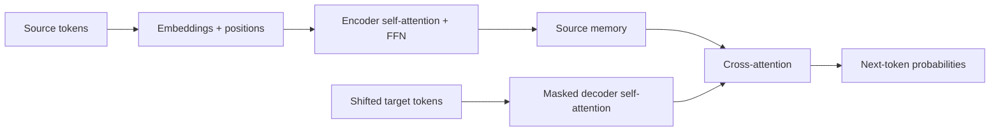

import PaperPdf from '@site/src/components/PaperPdf';
import AttentionLab from '@site/src/components/viz/AttentionLab';
import CodeWalkthrough from '@site/src/components/viz/CodeWalkthrough';

> **Vaswani et al. · 2017** · [Read the embedded paper](#original-paper) ·
> [Download PDF](/papers/research-papers/transformer.pdf)

## Paper in one minute

**Problem.** Recurrent sequence models process tokens one after another, making
training hard to parallelise and creating long paths between distant words.

**Key idea.** Let every token read relevant information directly from other
tokens through attention, then build the entire encoder–decoder from attention,
feed-forward layers, residual connections and normalization.

**Why it matters.** This design became the architectural foundation for BERT,
GPT, LLaMA and most modern language models. The paper proves its case on sequence
transduction; it does not by itself introduce a general-purpose chatbot.

### Architecture flow



## The problem: understanding a word needs its neighbours

Take the sentence _“The animal did not cross the street because it was tired.”_
To represent **it**, the model needs information about **the animal**. Looking
only at the word “it” is not enough.

A recurrent network processes a sequence one position at a time. Information
from an earlier word reaches a later word through intermediate hidden states.
That works, but creates a sequential computation and can make distant
relationships difficult to preserve.

The useful question is: **can the representation at one position read directly
from other positions?** Attention provides that connection. The paper builds a
complete translation system around attention rather than recurrence or
convolution.

## Start with a weighted average

Suppose three words have value vectors. For the current word, we assign them
weights of 0.6, 0.3 and 0.1. Its updated representation is:

$$
y = 0.6v_1 + 0.3v_2 + 0.1v_3.
$$

This operation is simple. The interesting part is deciding the weights. We want
the weights to depend on the sentence, so the same word can use different
context in different sentences.

**The weights are calculated from queries and keys. The information being
combined comes from values.**

### Why three projections?

Imagine looking for a book in a library. Your search request describes what you
need. Each catalogue entry describes what a book contains. The book itself holds
the information you eventually read.

| Attention quantity | Role in the analogy     | Role in the computation                   |
| ------------------ | ----------------------- | ----------------------------------------- |
| Query, Q           | Your search request     | What this position is looking for         |
| Key, K             | A catalogue description | What another position offers for matching |
| Value, V           | The book’s contents     | The information to combine                |

For token representations $X$, three learned matrices produce $Q=XW_Q$, $K=XW_K$
and $V=XW_V$. These matrices are trained; the library analogy does not mean a
head follows a human-written search rule.

## The attention equation, one operation at a time

The paper’s Equation 1 is:

$$
\operatorname{Attention}(Q,K,V)=\operatorname{softmax}\left(\frac{QK^T}{\sqrt{d_k}}\right)V.
$$

Read it from left to right through the intermediate values:

1. **`Q @ K.T`: compare positions.** Every query receives a score against every
   key.
2. **Divide by the square root of the key dimension.** This controls score
   magnitude as the number of dimensions grows; very large scores can make
   softmax overly concentrated.
3. **Apply softmax along each row.** Each query gets weights that sum to one.
4. **Multiply by V.** Each output is a weighted mixture of value vectors.

For five tokens, query/key width 8, and value width 6:

| Object             | Shape   | What one row means                       |
| ------------------ | ------- | ---------------------------------------- |
| Q and K            | `5 × 8` | A query or key for one token             |
| Scores and weights | `5 × 5` | How one token attends to all five tokens |
| V                  | `5 × 6` | Information supplied by one token        |
| Output             | `5 × 6` | Context collected for one token          |

Notice that attention can use a value width different from the query/key width.
Query and key widths must match for their dot products.

## Read the original architecture from the bottom up


_Figure 1 from the original paper, PDF page 3.
[Source PDF](/papers/research-papers/transformer.pdf#page=3)._

The left stack is the **encoder**. The right stack is the **decoder**. Input
words enter the encoder; previously generated output words enter the decoder.
The horizontal connection carries encoder representations into the decoder’s
cross-attention sublayer.

There are three attention situations to distinguish:

| Situation               | Queries come from | Keys and values come from | Can see future output tokens?         |
| ----------------------- | ----------------- | ------------------------- | ------------------------------------- |
| Encoder self-attention  | Input sequence    | Input sequence            | Not applicable to input understanding |
| Decoder self-attention  | Output prefix     | Output prefix             | No; a causal mask blocks them         |
| Decoder cross-attention | Decoder states    | Encoder output            | Reads the available input sequence    |

The original base system uses six layers in each stack, model width 512, eight
attention heads, and feed-forward width 2048. Its feed-forward activation is
ReLU and its residual sublayers use post-layer normalisation. These are details
of the 2017 model; a modern decoder may make different choices. See Sections
3.1–3.5 of the paper.

### Multi-head attention

One weighted mixture may be too restrictive. Multi-head attention makes several
learned projections, calculates attention independently in each, concatenates
the results, and projects them back to the model width.

The heads can learn different relationships. But **we do not assign one head to
grammar and another to meaning**. Such patterns, when observed, are learned
behaviours rather than guaranteed roles.

### Why positional information is needed

A bag of token vectors does not specify which word came first. The model
therefore adds positional information before the attention stacks. The paper
uses sinusoidal position encodings and also compares learned position
embeddings.

Attention explains how positions exchange information. Position encoding tells
the model which positions those are.

## The rest of the block matters too

Attention mixes information **between positions**. The position-wise
feed-forward network transforms the features **within each position**, using the
same weights at every position:

$$
\operatorname{FFN}(x)=\max(0,xW_1+b_1)W_2+b_2.
$$

These operations do different jobs. Attention chooses contextual information;
the FFN applies a nonlinear feature transformation. A residual addition
preserves the prior representation, and layer normalisation controls feature
scale. In the original paper, normalisation follows each residual addition.

The model scales input embeddings by the square root of model width and adds
positional encodings. Its sinusoidal positions use paired sine/cosine functions
at different frequencies. Those position signals are deterministic, while the
token embeddings are learned.

### Teacher forcing and the one-token shift

For translation, the encoder receives the source sentence. The decoder input
starts with a start token and then the known target prefix. At each position,
its label is the next target token. This is teacher forcing: training supplies
the real previous tokens rather than the model's own sampled mistakes.

At inference, the target is unknown. The model must append its own output and
run again. Errors can then change later context, a distribution difference the
training loss alone does not expose.

A causal mask hides future target positions. A padding mask hides batch filler
positions. They solve different problems. The fixed-length teaching dataset
below needs the causal mask but no padding mask.

## Section 4: why self-attention was attractive

| Layer type     | Typical dependency between distant positions | Sequential work across positions   | Important cost                                       |
| -------------- | -------------------------------------------- | ---------------------------------- | ---------------------------------------------------- |
| Recurrent      | Pass through intermediate states             | Yes                                | Long dependency paths                                |
| Convolutional  | Traverse enough local receptive fields       | Less                               | Kernel size and depth determine reach                |
| Self-attention | Direct connection within a layer             | Can parallelise training positions | Dense scores grow quadratically with sequence length |

For n positions, dense attention stores an n-by-n score matrix per head. Direct
connectivity helps long-range interaction, but a much longer input can make
memory and compute expensive. The paper's complexity discussion is about these
trade-offs, not a claim that attention is cheapest for every possible sequence.

## Section 5: the training recipe

The original recipe combines Adam, learning-rate warm-up followed by decay,
dropout and label smoothing. Warm-up gradually increases the learning rate
before later decay; it is different from gradually increasing model size.
Dropout regularises activations during training. Label smoothing reserves some
target probability for alternatives instead of treating every correct label as a
perfectly certain one-hot target.

Translation decoding uses beam search and a length penalty. Beam search retains
several promising prefixes; greedy decoding retains only one. A length penalty
compensates for biases introduced when comparing cumulative log probabilities of
sequences with different lengths.

## Real-world uses and worked examples

### Documented use: translation in Google Translate

Google's 2020 description of Translate explains that it replaced an earlier
system with a **Transformer encoder and an RNN decoder**. This is a useful
example of a paper influencing a deployed product through an adapted
architecture. It would be inaccurate to say that this particular deployment
copied the original encoder–decoder Transformer unchanged.
[Google Research's deployment account](https://research.google/blog/recent-advances-in-google-translate/).

**Worked example.** A traveller types “I left my bag by the bank of the river.”
A translation system needs to represent “bank” using the surrounding sentence
before choosing its translation.

1. The encoder builds contextual representations, allowing “bank” to use
   information from “river”.
2. The decoder conditions on those representations and the translation generated
   so far.
3. It produces the target-language sentence one token at a time.

This illustrates why **contextual encoding and cross-attention** matter.
Translating isolated dictionary entries would lose the relationship that
disambiguates the sentence. The example illustrates the mechanism; it is not a
recorded Google Translate output.

### Another application: summarising a support conversation

An encoder–decoder model can read a conversation and generate a shorter account
of the issue, attempted fixes and outcome. Attention connects the summary to
relevant source messages even when they are far apart.

For example, a customer may report a failed payment at the beginning and confirm
a successful retry near the end. A useful summary must combine both. The
architecture provides connections between these positions; suitable training and
evaluation are still needed to prevent a summary that invents a refund or omits
the resolution.

## Interactive lab

Change the sentence, attention temperature and causal mask. Hover over cells to
connect the numeric row weights to the Q–K–V explanation above.

<AttentionLab />

## Complete code: train an encoder–decoder Transformer

<CodeWalkthrough paper="transformer" />

**Teaching implementation.** This self-contained program implements multi-head
attention, sinusoidal positions, post-normalised encoder and decoder layers,
cross-attention, teacher-forced training, label smoothing and autoregressive
generation. It learns to reverse short token sequences so the complete path can
be checked without a translation dataset.

Save as `attention.py`, install PyTorch with `python -m pip install torch`, and
run `python attention.py`.

<details>
<summary>Complete runnable script</summary>

```python
"""Train a small encoder-decoder Transformer to reverse token sequences.
Implements the original post-norm structure, sinusoidal positions and teacher forcing.
"""
import math
import torch
from torch import nn
import torch.nn.functional as F

torch.manual_seed(7)
torch.set_num_threads(1)

class Attention(nn.Module):
    def __init__(self, width, heads):
        super().__init__()
        assert width % heads == 0
        self.heads, self.size = heads, width // heads
        self.q = nn.Linear(width, width)
        self.k = nn.Linear(width, width)
        self.v = nn.Linear(width, width)
        self.out = nn.Linear(width, width)

    def forward(self, query, memory=None, causal=False):
        memory = query if memory is None else memory
        b, t, d = query.shape
        def split(x):
            return x.reshape(b, -1, self.heads, self.size).transpose(1, 2)
        q, k, v = split(self.q(query)), split(self.k(memory)), split(self.v(memory))
        scores = q @ k.transpose(-2, -1) / math.sqrt(self.size)
        if causal:
            mask = torch.ones(t, k.size(-2), dtype=torch.bool, device=query.device).triu(1)
            scores = scores.masked_fill(mask, float('-inf'))
        context = scores.softmax(-1) @ v
        return self.out(context.transpose(1, 2).reshape(b, t, d))


class Positions(nn.Module):
    def __init__(self, width=32, length=32):
        super().__init__()
        pos = torch.arange(length).float()[:, None]
        freq = torch.exp(torch.arange(0, width, 2).float() * (-math.log(10000)/width))
        pe = torch.zeros(length, width)
        pe[:, 0::2], pe[:, 1::2] = torch.sin(pos*freq), torch.cos(pos*freq)
        self.register_buffer('pe', pe)
    def forward(self, x):
        return x + self.pe[:x.size(1)]

class Encoder(nn.Module):
    def __init__(self):
        super().__init__()
        self.attn = Attention(32, 4)
        self.ff = nn.Sequential(nn.Linear(32, 128), nn.ReLU(), nn.Linear(128, 32))
        self.n1, self.n2 = nn.LayerNorm(32), nn.LayerNorm(32)
    def forward(self, x):
        x = self.n1(x + self.attn(x))
        return self.n2(x + self.ff(x))

class Decoder(nn.Module):
    def __init__(self):
        super().__init__()
        self.self_attn, self.cross_attn = Attention(32, 4), Attention(32, 4)
        self.ff = nn.Sequential(nn.Linear(32, 128), nn.ReLU(), nn.Linear(128, 32))
        self.norm = nn.ModuleList([nn.LayerNorm(32) for _ in range(3)])
    def forward(self, x, memory):
        x = self.norm[0](x + self.self_attn(x, causal=True))
        x = self.norm[1](x + self.cross_attn(x, memory))
        return self.norm[2](x + self.ff(x))

class Transformer(nn.Module):
    def __init__(self):
        super().__init__()
        self.embedding, self.positions = nn.Embedding(12, 32), Positions()
        self.encoders = nn.ModuleList([Encoder() for _ in range(2)])
        self.decoders = nn.ModuleList([Decoder() for _ in range(2)])
        self.output = nn.Linear(32, 12)
    def encode(self, source):
        x = self.positions(self.embedding(source)*math.sqrt(32))
        for layer in self.encoders: x = layer(x)
        return x
    def decode(self, target, memory):
        x = self.positions(self.embedding(target)*math.sqrt(32))
        for layer in self.decoders: x = layer(x, memory)
        return self.output(x)
    def forward(self, source, target):
        return self.decode(target, self.encode(source))

def batch(n):
    source = torch.randint(3, 12, (n, 4))
    # ID 1 starts decoding; ID 2 ends it. Fixed lengths require no padding mask.
    target = torch.cat((torch.ones(n, 1, dtype=torch.long), source.flip(1),
                        torch.full((n, 1), 2)), dim=1)
    return source, target

model = Transformer()
optim = torch.optim.Adam(model.parameters(), lr=.003)
for step in range(600):
    source, target = batch(32)
    logits = model(source, target[:, :-1])
    loss = F.cross_entropy(logits.reshape(-1, 12), target[:, 1:].reshape(-1), label_smoothing=.1)
    optim.zero_grad(); loss.backward(); optim.step()
model.eval()
source, target = batch(64)
with torch.no_grad():
    memory = model.encode(source)
    generated = torch.ones(64, 1, dtype=torch.long)
    for _ in range(5):
        next_id = model.decode(generated, memory)[:, -1].argmax(-1, keepdim=True)
        generated = torch.cat((generated, next_id), dim=1)
print('Source:', source[0].tolist(), 'generated:', generated[0].tolist())
print('Held-out exact sequence accuracy:', (generated == target).all(1).float().mean().item())
assert generated.shape == target.shape
torch.save(model.state_dict(), 'transformer-demo.pt')
```

</details>

### Follow one batch

`source` has shape **32 × 4**. Each target adds a start token before the
reversed sequence and an end token after it. The decoder sees all target tokens
except the last; the loss scores all target tokens except the first.

Inside `Attention`, each projected tensor is split into heads. Queries determine
the number of output positions; keys and values determine the memory positions.
This is why the same class can implement self-attention and cross-attention.

The encoder runs once during generation. The decoder repeatedly reads that
memory and its growing target prefix. The checked run correctly reversed all 64
newly sampled evaluation sequences. This small test verifies the learned
transformation, not translation quality.

The program uses two narrow layers, fixed lengths, constant learning rate and
greedy decoding. It omits original-scale training, dropout and beam search;
their roles are explained above. It writes `transformer-demo.pt` with the
learned weights.

## What the experiments establish

The central experiments concern machine translation. The paper reports 28.4 BLEU
on WMT English–German and 41.8 on English–French for its larger model. Those
results support attention-based sequence modelling; they are not evidence that
the original system was a general-purpose assistant.

Ordinary full attention also builds a score matrix whose size grows with the
square of sequence length. Doubling a sequence from 1,000 to 2,000 tokens
changes one head’s score matrix from one million to four million entries.

## How this differs from the papers that follow

| Paper       | Part of the architecture it emphasises | Learning task                       |
| ----------- | -------------------------------------- | ----------------------------------- |
| Transformer | Encoder plus decoder                   | Translate one sequence into another |
| BERT        | Bidirectional encoder                  | Recover selected missing tokens     |
| GPT family  | Causal decoder-style stack             | Predict the next token              |

The Transformer paper supplies architectural machinery. BERT and GPT choose
different ways to train and use that machinery.

## Complete the architecture and experimental picture

### Multi-head attention includes an output projection

For head i, the model computes attention using its own projected queries, keys
and values. It then concatenates the head outputs and applies another learned
matrix:

$$
\operatorname{MultiHead}(Q,K,V)=\operatorname{Concat}(h_1,\ldots,h_H)W^O.
$$

With model width 512 and eight heads, each original base-model head uses
64-dimensional keys and values. Concatenation restores width 512. The output
projection can mix information across heads; the heads are not permanently
isolated channels.

The paper also shares weights between its token embedding layers and pre-softmax
transformation. **Weight tying** reuses a parameter matrix for related
operations. It does not mean that source positions, target positions and output
probabilities are the same tensor. Our teaching model keeps a separate output
matrix, so it demonstrates the architecture's information flow rather than every
parameter-sharing choice.

### Positional encoding and the learning-rate schedule

The sinusoidal encoding for position p and coordinate-pair index i is:

$$
\mathrm{PE}_{p,2i}=\sin\left(p/10000^{2i/d}\right),\qquad
\mathrm{PE}_{p,2i+1}=\cos\left(p/10000^{2i/d}\right).
$$

Some coordinates vary quickly with position; others vary slowly. Together they
provide a range of positional scales. These encodings are **added to
embeddings** in the original Transformer, unlike LLaMA's rotations of attention
queries and keys.

The original warm-up/decay schedule is:

$$
\mathrm{lr}(s)=d^{-1/2}\min\left(s^{-1/2},\;s\,w^{-3/2}\right),
$$

where s is the optimiser step and w is the warm-up length. Before w, the second
term makes the rate grow linearly. After w, the inverse-square-root term
controls decay. The original recipe uses 4,000 warm-up steps. This explains the
schedule's shape; copying its constants to a tiny demonstration is not
automatically appropriate.

### Data preparation and results are part of the method

The translation experiments use subword tokenisation and batches grouped by
similar sequence lengths. Padding shorter examples to the longest sequence in a
batch wastes work, so length grouping improves efficiency without changing the
task.

| Experiment                                    | What it asks                                                             | How to interpret it                                                                    |
| --------------------------------------------- | ------------------------------------------------------------------------ | -------------------------------------------------------------------------------------- |
| English–German and English–French translation | Can attention-only sequence transduction compete on translation?         | Compare BLEU under the stated tokenisation, decoding and training budget               |
| Head-count and dimension ablations            | Does distributing attention across heads help?                           | More heads is not monotonically better; each head also becomes narrower at fixed width |
| Depth, width and FFN variations               | Which capacity changes help?                                             | Quality and compute change together                                                    |
| Dropout and label-smoothing variations        | Which regularisers improve held-out translation?                         | Improved BLEU need not mean improved perplexity                                        |
| Learned versus sinusoidal positions           | Must position features be learned?                                       | Both worked comparably in the reported comparison                                      |
| Constituency parsing                          | Can the architecture produce a structured output other than translation? | The task generates a representation of a sentence's parse tree                         |

**Perplexity versus BLEU:** perplexity evaluates probabilities assigned to
reference tokens. BLEU compares generated translations with references through
n-gram overlap and a brevity penalty. Label smoothing can reduce confidence on
the exact reference token while improving generated output, so the metrics can
move in different directions.

Constituency parsing is easy to miss if we read only the attention diagram. It
tests outputs with structural constraints, such as nested phrase boundaries, and
shows why the paper is about sequence transduction more broadly than
translation. The appendix's attention visualisations are qualitative examples;
one visually attractive alignment is not proof of a head's universal role.
[Original paper, Sections 3–6 and visualisations](/papers/research-papers/transformer.pdf).

## Summary

Attention computes context-dependent weighted mixtures. Queries and keys
determine the weights; values provide the content. The complete Transformer adds
multiple heads, positional information, feed-forward layers, residual paths and
normalisation around that operation.

**Read next:** [BERT](/docs/research-papers/bert), which uses bidirectional
attention for language understanding.

The authors’ original implementation was released through
[Tensor2Tensor](https://github.com/tensorflow/tensor2tensor).

## Checklist

- [ ] I can derive the shapes of Q, K, attention weights and output.
- [ ] I can explain why the causal mask is triangular.
- [ ] I can distinguish self-attention from cross-attention.
- [ ] I can explain why parallel training does not make autoregressive
      generation fully parallel.

## Further reading and future evolution

- [Transformer-XL](https://arxiv.org/abs/1901.02860) adds recurrence across
  segments and a relative positional formulation, targeting dependencies beyond
  one fixed context window.
- [Longformer](https://arxiv.org/abs/2004.05150) replaces full attention with a
  mixture of local and selected global attention for long documents.
- [FlashAttention](https://arxiv.org/abs/2205.14135) computes exact attention with
  an IO-aware algorithm, reducing memory traffic without changing the attention
  function being learned.

Together they illustrate three different upgrade paths: change the memory,
change the attention pattern, or compute the same attention more efficiently.

## Scenario-based interview questions

Use these as spoken design exercises. State your assumptions, draw the tensor
shapes, discuss failure modes, and finish with a measurement plan.

### 1. A support summariser misses details from the start of long conversations. What would you investigate?

**Strong answer.** First separate a context-window problem from an attention or
data problem. Check whether the early messages survive tokenisation and
truncation, whether padding and causal masks are correct, and whether the model
was trained on conversations of comparable length. Dense attention costs
$O(n^2)$ in sequence length, so simply increasing the limit may be expensive.
Possible remedies include better chunking, hierarchical summarisation, retrieval
of salient turns, or a long-context architecture. Evaluate factual coverage by
conversation position, not only aggregate ROUGE, and manually inspect omissions
and invented resolutions.

### 2. Your attention input is `[batch=8, tokens=128, width=512]` with eight heads. Give the important shapes.

**Strong answer.** Each head has width 64. After projection and head splitting,
Q, K and V have shape `[8, 8, 128, 64]`. `Q @ Kᵀ` produces `[8, 8, 128, 128]`;
softmax is applied over the final key dimension. Multiplying by V returns
`[8, 8, 128, 64]`. Concatenating heads restores `[8, 128, 512]`, followed by the
output projection. A padding mask must broadcast over heads and query positions;
a decoder also needs a triangular causal mask.

### 3. Training loss is good, but generation repeats phrases and deteriorates. Why can that happen?

**Strong answer.** Teacher forcing trains on correct target prefixes, whereas
inference conditions on the model's own earlier outputs. A small mistake can
therefore move generation into prefixes not seen during training. Also inspect
decoding: greedy search can enter repetition loops, while an unsuitable beam or
sampling configuration can harm quality. Verify the shifted targets and causal
mask first, then compare greedy, beam and controlled sampling. Measure
repetition, task accuracy and factuality rather than assuming lower token loss
solves the deployment symptom.

### 4. Would you choose an encoder-only, decoder-only, or encoder-decoder Transformer for translating contracts?

**Strong answer.** Translation is naturally conditional generation, so an
encoder-decoder is the clearest default: bidirectional source encoding plus
causal target generation and cross-attention. A decoder-only model can also
serialize source and target, but spends causal-context capacity on the source
and offers less explicit separation. An encoder-only model is suitable for
classification or span extraction, not free-form translation without a decoder.
The final choice also depends on available pretrained checkpoints, latency,
maximum source length, terminology constraints and parallel-corpus quality.

### 5. Latency doubles when input length grows from 1,000 to 2,000 tokens. Is that surprising?

**Strong answer.** Not necessarily; full self-attention's score matrix grows
from one million to four million entries per head, so its attention component is
quadratic. End-to-end latency need not be exactly four times larger because
FFNs, I/O, kernels and hardware utilisation also contribute. Profile prefill and
token-by-token decode separately. Consider batching, KV caching for generation,
length bucketing, retrieval or sparse/local attention only after identifying the
actual bottleneck.

### 6. How would you prove that a new positional method is better than sinusoidal encoding?

**Strong answer.** Hold model size, data, optimiser, token budget and decoding
constant. Compare in-distribution quality and lengths longer than those used in
training, because extrapolation is often the claimed benefit. Report multiple
seeds, memory and throughput as well as task metrics. Include a no-position
control to verify that the task actually needs order. A single attention plot or
one favourable benchmark is not enough evidence.

## Original paper

<PaperPdf slug="transformer" title="Attention Is All You Need" />
