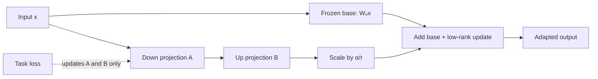

import PaperPdf from '@site/src/components/PaperPdf';
import CodeWalkthrough from '@site/src/components/viz/CodeWalkthrough';
import ResearchPaperLab from '@site/src/components/viz/ResearchPaperLab';

> **Hu et al. · 2021** · [Read the embedded paper](#original-paper) · [Download PDF](/papers/research-papers/lora.pdf)


## Paper in one minute

**Problem.** Full fine-tuning stores and optimizes a complete copy of a large
model for every task, creating substantial memory and deployment cost.

**Key idea.** Freeze each selected base matrix and learn its update as the product
of two much smaller low-rank matrices. The update can remain separate or be
merged into the base weight for inference.

**Why it matters.** LoRA makes task-specific adaptation dramatically cheaper to
train and store. It constrains only the update—not the pretrained model itself—and
is not the same operation as quantization.

### Adaptation flow



## Why fine-tuning needs more memory than the weights alone

A model with billions of parameters is expensive to adapt separately for many tasks. Full fine-tuning usually requires gradients and optimiser state for trainable weights, as well as activations needed by backpropagation. Storing another full model for every task adds another cost.

Suppose one layer maps a 4,096-dimensional vector to another 4,096-dimensional vector. That single matrix has 16,777,216 entries. Could a useful task-specific change occupy a much smaller space?

LoRA tests that possibility. It does not claim that the entire pre-trained matrix has low rank. Its hypothesis concerns the **change needed during adaptation**.

## The update: W becomes W₀ + BA

For a frozen base weight $W_0\in\mathbb{R}^{d\times k}$, introduce:

$$
A\in\mathbb{R}^{r\times k},\qquad B\in\mathbb{R}^{d\times r},\qquad
h=W_0x+sBAx.
$$

Here, $r$ is the chosen rank and $s$ is a scale. The embedded 2021 v1 paper uses $s=1/r$; later descriptions commonly parameterise this as $\alpha/r$. Keep the convention explicit when comparing implementations.


*Figure 1 from the original paper, PDF page 1. [Source PDF](/papers/research-papers/lora.pdf#page=1).*

The original path still computes $W_0x$. The additional path first reduces the input to r dimensions through A, then maps it to the output width through B. Adding both paths gives the adapted output.

### Count the parameters yourself

Full adaptation of that matrix trains $dk$ entries. LoRA trains $r(k+d)$ entries. With `d=k=4096` and `r=8`:

| Method | Trainable entries for this matrix |
|---|---:|
| Full matrix | 16,777,216 |
| LoRA A and B | 65,536 |

That is 256 times fewer **for this selected matrix**. It is not automatically the reduction for the entire model: the answer depends on which layers receive adapters and what else remains trainable.

A rank-r update has at most r independent directions. If a task requires changes outside that space, the chosen rank or target layers may be insufficient.

## Initialisation: start with exactly the base model

Initialise A randomly and B to zero. Then BA is zero, so the initial output equals the original model's output. This is useful because adaptation starts from a known function.

Why not set both matrices to zero? The gradient for A depends on B, and the gradient for B depends on A. If both are zero, neither receives a useful first update. With random A and zero B, B can move first, after which A can also learn.

Freezing W₀ means it receives no parameter gradients or optimiser updates. It does not mean the whole base-model computation disappears. Intermediate activations may still be needed to propagate gradients into trainable adapters.

### Weight decay acts on the update factors

Decaying A and B tends to reduce their product, pulling the adapted function towards the frozen base. Full fine-tuning weight decay acts on the complete trainable matrix instead. The paper discusses this as a possible regularisation advantage, not a separately established universal explanation for LoRA performance. Adapter regularisation and base-weight regularisation are therefore not automatically equivalent.

## Which weights should receive LoRA?

The paper investigates attention projection matrices and different allocations of an adaptation budget. Query and value projections are a prominent configuration. Applying LoRA to every linear layer is an implementation choice, not a requirement of the definition.

| Decision | What it controls | What to inspect |
|---|---|---|
| Rank | Capacity of each update | Validation performance versus adapter size |
| Target matrices | Where adaptation can act | Attention/MLP task requirements |
| Scale | Magnitude of the adapter contribution | Stable optimisation and inference consistency |
| Learning rate | Speed and stability of adaptation | Loss curves and held-out performance |
| Frozen/trainable selection | Optimiser state and task flexibility | Actual `requires_grad` values |

A small rank working well on one model/task does not establish a universal best rank.

## Real-world uses and worked examples

### Documented implementation: adapting diffusion image models

Hugging Face Diffusers provides a LoRA training workflow for text-to-image models. It trains selected low-rank updates while retaining the base model. This is a concrete extension of the adaptation technique beyond the language-model experiments in the original paper. [Diffusers' LoRA training guide](https://huggingface.co/docs/diffusers/training/lora).

### Worked example: a consistent illustration style

Suppose a design team has a set of authorised illustrations and wants new images to resemble that visual style. A possible workflow is to prepare image/caption pairs, choose a compatible base model, train LoRA adapters, and evaluate outputs for style consistency and overfitting.

The deliverable is a small adapter plus the identity of its required base model. At inference, the team loads that base and applies the adapter. Where supported, merging folds the update into the base weights.

**What the technique changes:** selected model computations become better suited to the style. It does not create a searchable archive of the training images or guarantee exact reproduction of a logo.

### Another application: standardising support-ticket outputs

Imagine an organisation wants a model to map tickets into its own issue categories and response format. It can train adapters on reviewed input/output examples while freezing most model weights.

| Requirement | Suitable part of the system |
|---|---|
| Learn consistent classification or writing behaviour | Adapter training may help |
| Retrieve the customer's latest order status | Query a database or tool |
| Answer from a frequently changing policy | Retrieve the current policy |

The ticket example is illustrative. Its purpose is to show **behaviour adaptation versus information access**. LoRA reduces the number of trained parameters; it does not make a frozen model aware of newly changed business data.

## Interactive lab

Change the base width and adapter rank. Use the calculator to derive the
trainable fraction before applying the same calculation to a real checkpoint.

<ResearchPaperLab lab="lora" />

## Complete code: train, save, reload and merge an adapter

<CodeWalkthrough paper="lora" />

**Teaching implementation.** A synthetic task changes a linear map by a rank-2 matrix. This controlled target lets us test whether a rank-2 adapter learns the change while leaving the base weights untouched.

Save as `lora.py`, install PyTorch, then run `python lora.py`. It writes an adapter checkpoint and checks held-out error and merged output equivalence.

<details>
<summary>Complete runnable script</summary>

```python
"""Fit a frozen linear model's low-rank correction, save/reload and merge it.
This uses the 2021 v1 paper's 1/r scale. It is an adaptation task on synthetic data.
"""
import math
import torch
from torch import nn
import torch.nn.functional as F

torch.manual_seed(7)
torch.set_num_threads(1)

class LoRALinear(nn.Module):
    def __init__(self, base, rank=2):
        super().__init__()
        self.base = base
        for parameter in self.base.parameters(): parameter.requires_grad_(False)
        self.A = nn.Parameter(torch.randn(rank, base.in_features)*.02)
        self.B = nn.Parameter(torch.zeros(base.out_features, rank))
        self.scale = 1/rank
    def forward(self, x):
        return self.base(x) + self.scale * F.linear(F.linear(x, self.A), self.B)
    @torch.no_grad()
    def merged(self):
        layer = nn.Linear(self.base.in_features, self.base.out_features, bias=self.base.bias is not None)
        layer.weight.copy_(self.base.weight + self.scale * self.B @ self.A)
        if layer.bias is not None: layer.bias.copy_(self.base.bias)
        return layer

base = nn.Linear(16, 12, bias=False)
original_weight = base.weight.detach().clone()
# A low-rank target shift lets us check exactly what rank-2 adaptation can learn.
true_delta = torch.randn(12,2) @ torch.randn(2,16) * .1
x_train, x_test = torch.randn(256,16), torch.randn(128,16)
y_train = F.linear(x_train, original_weight + true_delta)
y_test = F.linear(x_test, original_weight + true_delta)
model = LoRALinear(base)
assert torch.equal(model(x_test), base(x_test))
optim = torch.optim.Adam([model.A, model.B], lr=.03)
before = F.mse_loss(model(x_test), y_test).item()
for step in range(400):
    loss = F.mse_loss(model(x_train), y_train)
    optim.zero_grad(); loss.backward(); optim.step()
assert torch.equal(base.weight, original_weight)
assert base.weight.grad is None
# Store only the adapter; loading it requires the same original base weights.
torch.save({'A': model.A.detach(), 'B': model.B.detach(), 'scale': model.scale}, 'lora-adapter.pt')
state = torch.load('lora-adapter.pt', weights_only=True)
restored_base = nn.Linear(16,12,bias=False)
with torch.no_grad(): restored_base.weight.copy_(original_weight)
restored = LoRALinear(restored_base)
with torch.no_grad():
    restored.A.copy_(state['A']); restored.B.copy_(state['B'])
restored.scale = state['scale']
merged = restored.merged()
assert torch.allclose(model(x_test), merged(x_test), atol=1e-6)
after = F.mse_loss(merged(x_test), y_test).item()
print('Held-out MSE before / after:', before, after)
print('Trainable / full matrix parameters:', model.A.numel()+model.B.numel(), base.weight.numel())
assert after < before * .01
```

</details>

### Follow the lifecycle

`LoRALinear` owns the frozen base layer and the two trainable matrices. Its forward pass follows the equation directly. The optimiser receives only A and B, making the training boundary visible.

The target data uses `original_weight + true_delta`. This is deliberately favourable to LoRA: the task's exact update fits the selected rank. A low held-out error demonstrates the implementation, not that all language tasks are rank-2 problems.

The saved checkpoint contains the adapter and scale. Reloading also needs the **same base weights**. An adapter is a change to a specific model, not an independent replacement for that model.

Finally, `merged` constructs a conventional linear layer with:

$$
W_{\mathrm{merged}}=W_0+sBA.
$$

The script verifies that merged and unmerged predictions agree within floating-point tolerance. Because two matrix operations can be folded into one weight, LoRA need not add an extra inference branch after merging.

## Sections 4–6: experiments and rank analysis

The paper compares LoRA with full fine-tuning and other parameter-efficient methods, and analyses rank and subspace behaviour. Its reported savings depend on the model, selected matrices and training configuration. Examine quality and trainable-parameter counts together rather than treating a small adapter as sufficient evidence of success.

The subspace discussion asks whether updates at different ranks share useful directions, and how adaptation relates to directions in the original weights. A singular-value decomposition helps inspect this: singular vectors describe directions; singular values describe how strongly a matrix acts along them. Concentrated singular values suggest an update uses relatively few strong directions.

These analyses are evidence about the studied updates. They are not a proof that every useful weight change must be low rank.

## LoRA, adapters, prompt tuning and quantisation

| Method | What changes | Extra tokens/layers? | Same as quantisation? |
|---|---|---|---|
| Full fine-tuning | Existing model weights | Usually no | No |
| LoRA | Low-rank weight updates | Can merge into base weights | No |
| Bottleneck adapters | Added small neural modules | Extra modules | No |
| Prompt/prefix tuning | Learned input or attention-prefix vectors | Extra prefix representations | No |
| Quantisation | Numerical representation of weights/activations | Not inherently | Yes |

LoRA and quantisation can be combined, but the original LoRA paper does not introduce QLoRA. The authors' [implementation](https://github.com/microsoft/LoRA) provides reusable layers and examples beyond this controlled experiment.

## The experiments and subspace analysis behind low-rank adaptation

### What the original version actually evaluates

The embedded 2021 v1 paper studies GPT-3 adaptation on tasks including WikiSQL and MultiNLI, and GPT-2 adaptation on data-to-text benchmarks such as E2E. Appendices extend the task comparisons, low-data analysis and combinations with prefix tuning. Later versions of the paper have different experiment coverage, so use the version in the embedded PDF when following tables.

**WikiSQL** maps a natural-language question and table context to SQL. **MultiNLI** classifies relationships between sentences. **Data-to-text generation** turns structured fields into a description. These tasks test different output behaviours; adapter size alone does not say which behaviour was learned successfully.

The comparisons include full fine-tuning, training selected layers, adapter methods and prefix-based methods. Training only the final layers changes where adaptation can happen. LoRA can spread a smaller number of trainable parameters across projections throughout the network.

### Rank and placement are two independent choices

Suppose the budget allows either rank 8 on the query matrix alone or a lower rank on both query and value matrices. Those choices change different computations: Q influences attention matching; V influences what information is passed through the resulting weights.

The paper's experiments investigate this allocation rather than assuming that rank is the only hyperparameter. Strong performance at small ranks in the tested configurations suggests a low-dimensional useful update. It does not prove that a rank-1 update can solve an arbitrary new task or adapt every matrix equally well.

### How to read the subspace-similarity analysis

A matrix can be decomposed into singular directions and strengths. To compare two learned low-dimensional spaces, take orthonormal basis matrices U and V. A normalised overlap score has the form:

$$
\mathrm{overlap}(U,V)=\frac{\lVert U^T V\rVert_F^2}{\min(i,j)},
$$

where i and j are the numbers of basis directions being compared. The Frobenius norm squares and sums all entries. Identical equal-sized subspaces give 1; orthogonal subspaces give 0.

A two-dimensional example makes this concrete. If both spaces contain the same horizontal direction, their one-dimensional overlap is 1 even if one basis vector points left and the other points right. The subspace is the same; a sign convention should not change the conclusion.

The paper compares spaces learned at different ranks and with different random seeds. Overlap among leading directions suggests repeatedly useful adaptation directions. Weak overlap among additional directions suggests that increasing rank does not necessarily add equally important task information.

### An update can amplify a weak direction

The analysis also compares the update with the original weight matrix. A small overall update can strongly alter a direction that originally had little weight. Dividing the update's strength in that direction by the base matrix's strength can give a large amplification factor even when the full base matrix has a much larger norm.

This helps explain why the hypothesis is about **low-rank change**, not compression of the complete pre-trained model. The method preserves the rest of the base function.

Finally, LoRA can be combined with prefix methods because they change different parts of the computation. The appendix finds that combinations are task- and optimisation-dependent; adding more trainable mechanisms is not automatically better. [Original v1 paper, Sections 5–6 and Appendices D–G](/papers/research-papers/lora.pdf).

## Summary and self-check

- [ ] I can derive the A/B shapes and parameter count for any linear layer.
- [ ] I can explain why only the update, not W₀, is constrained to low rank.
- [ ] I can explain random-A/zero-B initialisation using gradients.
- [ ] I can save an adapter and identify the base checkpoint required to use it.
- [ ] I can prove the equivalence of merged and unmerged inference.
- [ ] I can distinguish LoRA from quantisation and other adaptation methods.

## Further reading and future evolution

- [AdaLoRA](https://arxiv.org/abs/2303.10512) allocates the parameter budget
  adaptively across weight matrices instead of fixing the same rank everywhere.
- [QLoRA](https://arxiv.org/abs/2305.14314) backpropagates through a frozen 4-bit
  quantized base model into LoRA adapters, sharply reducing training memory.
- [DoRA](https://arxiv.org/abs/2402.09353) separates weight magnitude and direction
  and applies low-rank adaptation to the directional component.

The upgrade path is therefore broader than “increase rank”: decide where the
rank belongs, reduce base-weight precision, or change the weight parameterization.

## Scenario-based interview questions

### 1. You must maintain 50 customer-specific variants of one 7B model. Why consider LoRA?

**Strong answer.** Store one shared frozen base and a small adapter per customer,
greatly reducing trainable parameters and checkpoint storage. Load or batch
adapters according to the serving design, while versioning each adapter with the
exact base checkpoint and tokenizer it expects. This does not automatically
reduce base-model inference memory; an unquantized 7B base must still be loaded.
Measure quality, adapter-switch latency, GPU memory and operational isolation.

### 2. For a `4096 × 4096` weight and rank 8, how many LoRA parameters are trained?

**Strong answer.** If $A$ has shape `8 × 4096` and $B$ has shape
`4096 × 8`, the update uses $8(4096+4096)=65,536$ parameters, compared with
$4096^2=16,777,216$ in the base matrix—about 0.39%. State the orientation used
by the framework, because stored linear weights may be transposed. The effective
update $BA$ has rank at most 8.

### 3. Why initialize one factor randomly and the other to zero?

**Strong answer.** A zero factor makes the initial product—and therefore the
model's initial functional update—zero, so adaptation starts from the base model.
The other random factor allows gradients to reach the zero factor on the first
step. If both factors were zero, each factor's gradient would be multiplied by
the other zero factor and learning could stall. Confirm this reasoning with the
actual multiplication order.

### 4. Merged and unmerged adapters produce different outputs. What would you check?

**Strong answer.** In evaluation mode they should implement the same linear map,
apart from numerical precision. Check the scale $\alpha/r$, matrix orientation,
whether the adapter was added twice, base-checkpoint identity, dtype/casting and
dropout state. Compare one layer's output before testing a full generation.
Merging is reversible only if the original base weights or exact update remain
available.

### 5. Increasing rank from 8 to 64 does not improve validation quality. Explain.

**Strong answer.** The task may need only a low-dimensional update; additional
directions can be redundant or overfit limited data. Optimisation settings may
also be inappropriate because parameter count and update scale changed. Sweep
rank together with learning rate and alpha, inspect multiple seeds, and compare
which modules receive adapters. Higher rank increases memory and training cost,
so lack of improvement is a useful deployment result.

### 6. Compare LoRA, full fine-tuning and quantisation for a domain assistant.

**Strong answer.** Full fine-tuning offers maximum update freedom but has high
optimizer and checkpoint cost. LoRA constrains the update and is attractive for
multiple tasks or limited training memory. Quantisation reduces representation
precision primarily to save memory/compute; it is not itself a task-adaptation
method. They can be combined, as in quantized-base adapter training, but quality,
kernel support and merge/export behavior must be tested together.


## Original paper

<PaperPdf slug="lora" title="LoRA: Low-Rank Adaptation of Large Language Models" />
