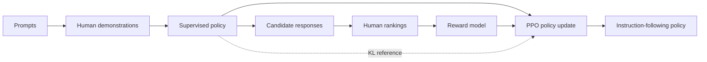

import PaperPdf from '@site/src/components/PaperPdf';
import CodeWalkthrough from '@site/src/components/viz/CodeWalkthrough';
import PPOClipLab from '@site/src/components/viz/PPOClipLab';

> **Ouyang et al. · 2022** · [Read the embedded paper](#original-paper) · [Download PDF](/papers/research-papers/instructgpt.pdf)


## Paper in one minute

**Problem.** Next-token pre-training teaches broad language behaviour but does
not directly optimize for following a user's instruction safely and helpfully.

**Key idea.** Supervise the model on human demonstrations, learn a reward model
from ranked response pairs, and optimize the response policy with PPO while
penalizing excessive drift from the supervised model.

**Why it matters.** The paper provides an influential RLHF pipeline and evidence
that preference training can outperform much larger prompted base models. Human
preference is still a learned proxy, not a guarantee of truth or universal values.

### RLHF training flow



## Why next-token prediction is not enough

If a web page contains a question followed by an insulting answer, predicting that answer can be successful language modelling. It can still be a poor assistant response. The pre-training objective does not directly express “follow this user's request helpfully and accurately”.

The paper starts from a pre-trained language model and adds human demonstrations and comparisons. Its target behaviour is influenced by the people who supply those judgements and the prompts on which they judge responses.

That is the motivation for **reinforcement learning from human feedback**, or RLHF. InstructGPT is an influential application of RLHF to instruction following; it did not invent reinforcement learning or human-preference learning.

## Section 3: three stages with three different targets


*Figure 2 from the original paper, PDF page 3. [Source PDF](/papers/research-papers/instructgpt.pdf#page=3).*

| Stage | Training data | Model learns to predict | Objective |
|---|---|---|---|
| Supervised fine-tuning, SFT | Prompt and demonstrated response | The demonstration's next tokens | Cross-entropy |
| Reward modelling | Prompt and ranked responses | Which response people prefer | Pairwise ranking loss |
| Policy optimisation | Prompts and sampled responses | Responses with higher reward | PPO with reference-policy regularisation |

The same word “training” hides three distinct operations. A reward model does not generate the final answer. It evaluates a prompt/response pair and supplies a scalar score used to train the generating policy.

## Stage 1: show the model examples of the desired behaviour

A demonstration might pair “Explain rain to a child” with an accessible explanation. SFT increases the likelihood of the demonstrated answer:

$$
L_{\mathrm{SFT}}=-\sum_t\log\pi_\theta(y_t\mid x,y_{<t}).
$$

Here x is the prompt, y is the answer, and the policy $\pi_\theta$ is a language model. The term “policy” emphasises that choosing each next token is an action.

A useful implementation detail is to calculate the supervised loss on the answer tokens. Prompt tokens provide context; reproducing them is not the instruction-following target. Our one-token teaching task makes this boundary especially simple.

## Stage 2: learn preferences from comparisons

It is often easier to choose the better of two answers than to assign each an absolute quality score. The reward model learns from preferred and rejected responses to the **same prompt**:

$$
L_{\mathrm{RM}}=-\log\sigma\big(r_\phi(x,y_w)-r_\phi(x,y_l)\big).
$$

If the preferred answer has score 0.4 and the rejected answer 0.8, the score difference is negative, so the loss encourages the ordering to reverse. Only the difference matters to this pairwise term. Adding the same constant to both scores leaves the loss unchanged.

This is why a raw reward score is not a calibrated probability of truth. A preference model can learn verbosity, style or other correlates of approval as well as useful behaviour. Its reliability depends on its training comparisons and on whether the policy later produces similar kinds of answers.

## Stage 3: optimise the policy without letting it drift arbitrarily

The policy samples an answer. The reward model scores it. A reference copy of the SFT model supplies a regularisation target:

$$
R(x,y)=r_\phi(x,y)-\beta\log\frac{\pi_\theta(y\mid x)}{\pi_{\mathrm{SFT}}(y\mid x)}.
$$

The log ratio is a sampled contribution to a KL penalty. It discourages the policy from moving too far from the supervised starting behaviour merely to exploit the reward model.

### The old policy and reference policy are different

| Policy | Purpose | When it changes |
|---|---|---|
| Current policy | The model being optimised | Every optimiser update |
| Old rollout policy | Defines probabilities used when collecting this batch | When new rollouts are collected |
| SFT reference | Anchors behaviour through KL regularisation | Kept frozen during this RL stage |

Confusing these two comparisons leads to incorrect PPO implementations. The clipping ratio compares current and old policies. The reference penalty compares the policy with the frozen SFT reference.

### Advantage, critic and clipping

A **return** measures outcome value. A **critic** predicts expected return. Their difference gives an advantage: how much better or worse the sampled outcome was than expected.

For a policy ratio $\rho=\pi_\theta(a\mid s)/\pi_{\mathrm{old}}(a\mid s)$, PPO uses:

$$
\min\big(\rho A,\operatorname{clip}(\rho,1-\epsilon,1+\epsilon)A\big).
$$

Positive advantages encourage an action; negative advantages discourage it. Clipping limits the benefit of excessively large probability changes on the same rollout batch. It is an optimisation mechanism, not a guarantee that every response improves.

The paper also studies mixing a pre-training objective into PPO, called **PPO-ptx**, to reduce regressions on other tasks. This addresses an alignment trade-off: improving preferred assistant behaviour can hurt capabilities measured by the original language-task benchmarks.

## Real-world uses and worked examples

### Documented use: instruction-following models in the API

OpenAI's 2022 announcement describes deploying InstructGPT models as the default language models in its API at that time. Human demonstrations and response rankings were used to make the models follow requests more usefully. This is historical deployment evidence, not a statement about today's API defaults. [The InstructGPT deployment announcement](https://openai.com/index/instruction-following/).

### Worked example: draft a useful support reply

Suppose the instruction is: “Explain that the parcel is delayed, apologise, and avoid promising a delivery date we do not know.”

A base completion model might continue with another customer message or invent a reassuring date. A training pipeline inspired by InstructGPT can address the desired behaviour in three stages:

1. **SFT:** show examples of replies that follow the instruction and preserve known facts.
2. **Preference modelling:** ask reviewers to compare candidate replies for usefulness, accuracy and tone.
3. **Policy optimisation:** improve response selection using the learned reward while regularising against the reference model.

The parcel scenario is illustrative, not a reported customer deployment. Its value is showing why “predict likely text” and “satisfy the request” can produce different outputs.

### Another application: summarise for a specified reader

A user asks for a three-bullet summary of a technical report for a new employee. Instruction-following training can encourage the requested length, vocabulary and structure. The same underlying document could instead produce a detailed engineering summary if the instruction changes.

**The boundary:** preference training shapes how the model responds. It does not fetch the report, verify a parcel's location, or guarantee that every generated statement is true. Retrieval and tools supply information; evaluation checks whether the trained behaviour uses it correctly.

## Interactive lab

Change the advantage sign and clip range. Notice which side of the probability
ratio becomes flat; that flat region is the practical protection against a
destructive policy step.

<PPOClipLab />

## Complete code: all three stages in a small environment

<CodeWalkthrough paper="instructgpt" />

**Teaching implementation.** This program uses three prompts and three possible one-token answers. It contains SFT, a learned pairwise reward model, a frozen reference, sampled rollouts, a value critic, clipped PPO updates, and a small auxiliary supervised loss.

Save as `instructgpt.py`, install PyTorch, then run `python instructgpt.py`. The synthetic comparisons replace expensive human annotation; the tiny categorical policy replaces the original language model.

<details>
<summary>Complete runnable script</summary>

```python
"""Complete small SFT -> preference reward model -> PPO pipeline.
Teaching adaptation: a contextual bandit with three one-token answers.
One-step episodes make return = terminal reward, so GAE is unnecessary here.
"""
import copy
import torch
from torch import nn
import torch.nn.functional as F

torch.manual_seed(7)
torch.set_num_threads(1)
# Prompts: greeting, arithmetic, farewell. Answers: hello, four, goodbye.
class Policy(nn.Module):
    def __init__(self):
        super().__init__()
        self.embedding = nn.Embedding(3,16)
        self.actor, self.critic = nn.Linear(16,3), nn.Linear(16,1)
    def forward(self, prompt):
        h = self.embedding(prompt)
        return self.actor(h), self.critic(h).squeeze(-1)

class Reward(nn.Module):
    def __init__(self):
        super().__init__()
        self.prompt, self.answer = nn.Embedding(3,16), nn.Embedding(3,16)
        self.score = nn.Sequential(nn.Linear(32,16), nn.Tanh(), nn.Linear(16,1))
    def forward(self, prompt, answer):
        return self.score(torch.cat((self.prompt(prompt), self.answer(answer)), -1)).squeeze(-1)

policy = Policy()
optim = torch.optim.Adam(policy.parameters(), lr=.02)
prompts = torch.arange(3)
# Stage 1: demonstrations. Deliberately brief SFT leaves room for RL improvement.
for _ in range(8):
    loss = F.cross_entropy(policy(prompts)[0], prompts)
    optim.zero_grad(); loss.backward(); optim.step()
reference = copy.deepcopy(policy).eval()
for p in reference.parameters(): p.requires_grad_(False)
# Stage 2: fixed synthetic preferences stand in for human rankings.
reward = Reward()
optim = torch.optim.Adam(reward.parameters(), lr=.01)
for _ in range(200):
    q = torch.randint(3,(32,))
    preferred = q
    rejected = (q + torch.randint(1,3,(32,))) % 3
    loss = -F.logsigmoid(reward(q,preferred)-reward(q,rejected)).mean()
    optim.zero_grad(); loss.backward(); optim.step()
reward.eval()
for p in reward.parameters(): p.requires_grad_(False)
# Stage 3: roll out the old policy, then take clipped PPO updates on that rollout.
optim = torch.optim.Adam(policy.parameters(), lr=.003)
for rollout in range(60):
    q = torch.randint(3,(64,))
    with torch.no_grad():
        old_logits, old_values = policy(q)
        old_log_probs = old_logits.log_softmax(-1)
        actions = torch.distributions.Categorical(logits=old_logits).sample()
        old_logp = old_log_probs.gather(1,actions[:,None]).squeeze(1)
        ref_log_probs = reference(q)[0].log_softmax(-1)
        ref_logp = ref_log_probs.gather(1,actions[:,None]).squeeze(1)
        # Sampled KL cost is part of the rollout reward.
        returns = reward(q,actions) - .1*(old_logp-ref_logp)
        advantage = returns-old_values
        advantage = (advantage-advantage.mean())/(advantage.std()+1e-8)
    for _ in range(4):
        logits, values = policy(q)
        distribution = torch.distributions.Categorical(logits=logits)
        ratio = (distribution.log_prob(actions)-old_logp).exp()
        surrogate = torch.minimum(ratio*advantage, ratio.clamp(.8,1.2)*advantage)
        actor_loss = -surrogate.mean()
        critic_loss = F.mse_loss(values,returns)
        # Tiny proxy for PPO-ptx: retain a separate language-supervision loss.
        ptx_loss = F.cross_entropy(policy(prompts)[0],prompts)
        loss = actor_loss + .5*critic_loss + .05*ptx_loss
        optim.zero_grad(); loss.backward()
        nn.utils.clip_grad_norm_(policy.parameters(),1.)
        optim.step()
with torch.no_grad():
    probabilities = policy(prompts)[0].softmax(-1)
    print('Correct-answer probabilities:', probabilities.diag().tolist())
    print('Predictions:', probabilities.argmax(-1).tolist())
assert torch.equal(probabilities.argmax(-1),prompts)
torch.save({'policy':policy.state_dict(),'reward':reward.state_dict()},'instructgpt-demo.pt')
```

</details>

### Understand the training loop

`Policy` returns both action logits and a value estimate. `Reward` separately scores prompt/answer pairs. After SFT, `reference` is copied and frozen. After reward training, the reward model is also frozen.

Each rollout collects actions, old log probabilities, reference log probabilities and returns **without gradients**. Those quantities stay fixed while the program takes several PPO updates. Recomputing “old” log probabilities after every update would destroy the intended probability ratio.

The critic fits observed returns. The actor uses detached advantages to improve action probabilities. Gradient clipping controls update magnitude, while PPO ratio clipping controls a different quantity: change in action likelihood relative to the rollout policy.

Because each episode contains one action, return equals terminal reward and there is no multi-token credit assignment. A full language implementation needs token masks, variable-length rollouts, per-token values and a return/advantage estimator such as GAE. The auxiliary loss here is a tiny demonstration of retaining a second objective; it is not the paper's web pre-training mixture.

The checked run selected the intended answer for all three prompts. This verifies the small pipeline, not human alignment or open-ended instruction following.

## Sections 4–5: read the results and limitations together

The paper reports that evaluators preferred outputs from a 1.3B InstructGPT model over a much larger 175B GPT-3 baseline on its evaluated prompt distribution. This is evidence about preference under that protocol, not a claim that the smaller model has more general knowledge or wins every benchmark.

Its analyses distinguish instruction following, truthfulness, toxicity, generalisation and regressions on public tasks. Labeler selection and agreement matter because “preferred” reflects a particular annotation process. The appendix provides details on tasks, prompts, training and evaluations that explain the scope of the result.

A model can still hallucinate, follow a mistaken premise or optimise superficial approval. Reward-model exploitation remains possible even when the optimisation code is correct.

## Human-data collection and what the evaluations measure

### Three datasets, rather than one shared pile of examples

The SFT dataset contains demonstrated answers. The reward-model dataset contains comparisons of candidate answers. The PPO dataset supplies prompts for generating fresh policy rollouts. These datasets serve different objectives and do not need identical example counts.

The paper uses both prompts from API usage and prompts written by labelers, with filtering and data-splitting procedures. Holding out customers helps avoid evaluating only on the same customers' patterns seen during training. Holding out labelers probes a different question: do learned preferences generalise to people who did not create the training comparisons?

Labelers are selected and instructed according to a process described in the paper. Their judgements are valuable training signals, but they do not represent every possible user's values or resolve disagreements automatically.

### One ranking produces several comparisons

If a labeler ranks K responses to one prompt, that ordering can produce $K(K-1)/2$ preferred/rejected pairs. Four ranked responses yield six comparisons, although they come from only one prompt and one ranking exercise.

Those pairs are correlated. Treating them as six unrelated examples can overstate how much independent evidence was collected. The paper groups comparisons from the same prompt when calculating training updates, also avoiding unnecessary repeated computation.

The pairwise reward objective is unchanged if a constant is added to every score. A reward normalisation convention therefore fixes a reference level for optimisation; the raw number is not an absolute unit of helpfulness.

### From a whole-response reward to token updates

A language-model rollout contains multiple token actions before a terminal response score becomes available. The implementation needs to assign learning signals along that sequence, handle end tokens and padding, and use a value baseline to reduce variance.

The paper's response-level interaction can be described as a contextual bandit, while its language-policy optimisation still handles per-token probabilities and regularisation. Our one-token bandit preserves the three-stage training structure but eliminates that temporal credit-assignment problem. A high score on the tiny task cannot validate a full multi-token PPO implementation.

### Read the baselines and result axes separately

| Comparison or metric | Question it answers | What it does not establish |
|---|---|---|
| Base GPT-3 versus prompted GPT-3 | Can a better prefix improve behaviour? | That prompting equals preference training |
| SFT versus PPO/PPO-ptx | What changes after reward-based optimisation? | That all improvements come from increasing model size |
| Human preference win rate | Which answer was preferred under the evaluation instructions? | A universal probability that an answer is true |
| Truthfulness/toxicity evaluations | How behaviour changes on those test distributions | That all factual or harmful-output failures disappear |
| Public NLP benchmarks | Whether other capabilities are retained | That benchmark quality matches actual API-user preferences |
| Held-out labelers | Whether preferences transfer beyond training annotators | Agreement across all populations and contexts |

The **alignment tax** is a measured regression on some other tasks after alignment training. PPO-ptx mixes in a pre-training objective to reduce that regression. Its coefficient creates another trade-off: preserving broad prediction behaviour versus optimising the chosen response reward.

Reward hacking, annotator disagreement and changes in the prompt distribution are distinct limitations. A reward model can be optimised successfully while the actual behaviour becomes less useful outside the situations its training comparisons covered. [Original paper, Sections 3–5 and training/evaluation appendices](/papers/research-papers/instructgpt.pdf).

## Summary and self-check

- [ ] I can explain why the reward model and generating policy have different jobs.
- [ ] I can compute a pairwise ranking loss and interpret its score difference.
- [ ] I can distinguish the old rollout policy from the frozen SFT reference.
- [ ] I can explain advantage, critic loss, PPO clipping and KL regularisation separately.
- [ ] I can identify what the one-step code omits from full language-model PPO.
- [ ] I can explain why human preference is not identical to factual truth.

## Further reading and future evolution

- [Constitutional AI](https://arxiv.org/abs/2212.08073) explores written principles
  and AI-generated feedback as an additional source of supervision.
- [Direct Preference Optimization](https://arxiv.org/abs/2305.18290) derives a
  direct objective for preference pairs, avoiding a separately trained reward
  model and online PPO loop in its basic form.
- [Let's Verify Step by Step](https://arxiv.org/abs/2305.20050) compares outcome
  rewards with supervision of intermediate reasoning steps on mathematics.

These follow-ups target three pressure points in RLHF: scalable feedback, simpler
optimization and more precise credit assignment.

## Scenario-based interview questions

### 1. Design an RLHF pipeline for a customer-service assistant.

**Strong answer.** Collect carefully written demonstrations for supervised
fine-tuning, sample multiple candidate responses to real training-distribution
prompts, and ask qualified labelers to rank them under a clear rubric. Train a
reward model on pairwise preferences, then optimize the policy with PPO while
constraining drift from the SFT reference. Keep prompt, annotator and safety
evaluation splits separate. Measure preference, factual resolution, policy
compliance, escalation quality and regressions on core capabilities.

### 2. The reward model score rises while human satisfaction falls. What happened?

**Strong answer.** The policy may be exploiting imperfections in the learned
proxy—reward hacking—or the live prompt distribution may differ from the data
used to train the reward model. Inspect high-reward failures, gather fresh
blind human comparisons, strengthen adversarial coverage, and reduce optimization
pressure or KL drift. A reward model is a fallible estimator of specified
preferences, not ground truth.

### 3. Distinguish the trainable policy, old policy, reward model and reference policy in PPO.

**Strong answer.** The trainable policy receives gradient updates. The old policy
is a snapshot that produced the rollouts and supplies the probability ratio for
the clipped PPO objective. The reward model scores completed responses. The
frozen SFT reference anchors behavior through a KL penalty. Collapsing the old
and reference policies conceptually hides two different controls: stable updates
and limited departure from the aligned starting point.

### 4. Why use a pairwise ranking loss instead of asking annotators for absolute scores?

**Strong answer.** People often make more consistent relative judgments between
two concrete responses than calibrated judgments on an absolute numeric scale.
A Bradley–Terry-style loss trains the preferred response to have a higher score.
But pairwise labels can still be noisy, order-biased and population-dependent.
Randomize presentation, measure agreement, audit labeler groups and retain ties
or uncertainty where the data collection design supports them.

### 5. PPO improves helpfulness but hurts language modelling benchmarks. What can you do?

**Strong answer.** This is an alignment-tax trade-off. Increase KL control,
reduce policy-update size, mix a pre-training loss as PPO-ptx does, or improve the
reward data so the desired behavior requires less distributional movement.
Track both preference and capability suites through training and stop on a
multi-objective criterion. Do not hide the regression inside one aggregate score.

### 6. Can “preferred by labelers” be reported as “factually correct”?

**Strong answer.** No. Preference combines rubric adherence, style, usefulness
and the labeler's perceived correctness, and labelers can miss plausible errors.
Run separate factuality evaluations with source evidence or verifiable answers,
plus safety and calibration tests. State who supplied preferences and under what
instructions; alignment is always relative to a data-generating process.


## Original paper

<PaperPdf slug="instructgpt" title="Training language models to follow instructions with human feedback" />
