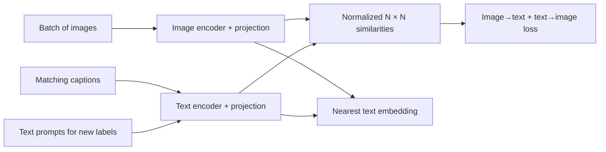
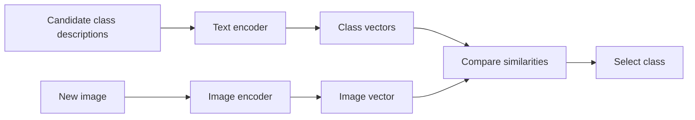

import PaperPdf from '@site/src/components/PaperPdf';
import CodeWalkthrough from '@site/src/components/viz/CodeWalkthrough';
import ResearchPaperLab from '@site/src/components/viz/ResearchPaperLab';

> **Radford et al. · 2021** · [Read the embedded paper](#original-paper) · [Download PDF](/papers/research-papers/clip.pdf)


## Paper in one minute

**Problem.** Conventional image classifiers learn a fixed label set and require
new labelled examples and training whenever the categories change.

**Key idea.** Contrast matching image-caption pairs against the other pairs in a
batch so an image encoder and text encoder learn a shared normalized embedding
space.

**Why it matters.** Text descriptions can act as zero-shot class prototypes,
enabling broad visual transfer without fitting a new classifier. Similarity is
relative to the candidates and is not calibrated certainty or proof of identity.

### Contrastive-to-zero-shot flow



## Why learn from image–text pairs?

A conventional classifier learns a fixed list of labels, such as cat, dog and car. Its final output layer is tied to those classes. Adding a new class usually means changing or retraining part of the classifier.

Natural-language descriptions offer a richer supervision source. “A small brown dog running through snow” conveys more than a single class ID. CLIP uses paired images and text to learn representations that can later be compared with descriptions of new classification categories.

This is **contrastive learning**: learn which pairs belong together relative to alternatives.

## Section 2: two encoders and one shared space


*Figure 1 from the original paper, PDF page 2. [Source PDF](/papers/research-papers/clip.pdf#page=2).*

An image encoder maps pixels to a vector. A text encoder maps tokens to a vector. Learned projections place both outputs in the same embedding space, and L2 normalisation puts them on a common scale.

For image vector v and text vector u:

$$
\hat v=\frac{v}{\lVert v\rVert_2},\qquad
\hat u=\frac{u}{\lVert u\rVert_2},\qquad
s=\hat v^T\hat u.
$$

The dot product of normalised vectors is cosine similarity. It measures directional agreement, not the probability that a statement about the image is true.

The original study trains on a large web collection of image/text pairs and explores ResNet and Vision Transformer image encoders with a Transformer text encoder. CLIP refers to the training approach and model family, not one mandatory visual backbone.

## The N × N similarity matrix

Take a batch of three pairs: image/text for a cat, a bicycle and a bowl. Compare every image with every text. The resulting matrix has nine entries. The three diagonal entries represent the provided matching pairs; off-diagonal entries are negatives for the contrastive objective.

For normalised image matrix I and text matrix T:

$$
S=\exp(t)IT^T.
$$

The learned scalar t controls the logit scale, equivalent to an inverse temperature. Larger scale makes the softmax more concentrated on the strongest similarities.

### Why the loss goes in both directions

Image-to-text cross-entropy asks each image to select its paired text. Text-to-image cross-entropy asks each text to select its paired image:

$$
L=\frac12\left[\operatorname{CE}(S,[0,\ldots,N-1])+
\operatorname{CE}(S^T,[0,\ldots,N-1])\right].
$$

The same matching relation is learned from rows and columns. Without normalisation, vector magnitudes could affect scores independently of their direction. The temperature controls concentration separately from embedding norms.

A batch can contain an apparent negative that is semantically appropriate, such as two nearly identical dog descriptions. The diagonal-pair objective does not automatically know they should both be acceptable. Batch composition is therefore part of understanding the supervision.

## Zero-shot classification: turn labels into text vectors

Suppose the downstream categories are “cat”, “dog” and “horse”. Convert each into a description, such as “a photo of a dog”. Encode the descriptions once. For a new image, compare its embedding with these text vectors and select the highest score.



No labelled images from that downstream task are required to train a new classifier head in this procedure. “Zero-shot” does not mean the pre-training collection contained no related concepts or examples.

### Prompt engineering and ensembling

A bare class name can be ambiguous. A descriptive template supplies context: “a photo of a crane” suggests an image category, but crane might still mean an animal or a machine. Domain-appropriate descriptions can help.

The paper also studies combining multiple text prompts for each class. Averaging their representations can reduce dependence on one wording. This is different from training new encoder weights.

The candidate list itself matters. Softmax over three classes forces a relative choice among those three, even if the image belongs to none. Its maximum value is not a general “the model is certain” score.

## Real-world uses and worked examples

### Documented use: CLIP representations in DALL·E 2 research

The DALL·E 2 research describes a prior that predicts a CLIP image embedding from a caption, followed by a decoder that generates an image conditioned on that embedding. CLIP provides a representation used by the larger generative system; CLIP alone does not draw the image. [The authors' CLIP-latent generation paper](https://openai.com/index/hierarchical-text-conditional-image-generation-with-clip-latents/).

### Worked example: search a photo library with a sentence

Imagine searching for “a red bicycle leaning against a brick wall” without manually tagging every photograph.

1. Encode each image once and store its normalised vector.
2. Encode the search sentence using the matching text encoder.
3. Compare the query vector with image vectors and return the strongest matches.
4. Let the user inspect the photographs rather than treating similarity as a factual guarantee.

This is an illustrative use of CLIP's shared embedding space. It is useful when a user describes visual content in language and exact filename or tag matching is insufficient.

### Another application: classify images with candidate descriptions

A small image-sorting tool could compare each photo with “a photo of a receipt”, “a photo of food” and “a screenshot of an application”. The text vectors become the candidate classifier weights, using the zero-shot procedure explained above.

The choices determine the task. If every candidate is wrong, the model can still give one the highest similarity. Ambiguous images need review or a separate rejection rule. Distinguishing a receipt from a food photo is also different from reading the receipt's exact amount; precise text extraction calls for an OCR capability.

**Connection to the paper:** contrastive training makes cross-modal comparison possible, while the downstream application decides whether to retrieve, classify or pass those representations into another model.

## Interactive lab

Change the temperature and watch the same similarity matrix become sharper or
flatter. Toggle the data table to inspect exact row probabilities.

<ResearchPaperLab lab="clip" />

## Complete code: train both encoders and construct the classifier

<CodeWalkthrough paper="clip" />

**Teaching implementation.** The script generates stripe images, trains an image encoder and a text embedding encoder with the symmetric loss, and classifies fresh images using text vectors. It includes the learned logit scale and its clamp.

Save as `clip.py`, install PyTorch, then run `python clip.py`.

<details>
<summary>Complete runnable script</summary>

```python
"""Train image/text encoders with symmetric contrastive loss, then classify.
Teaching adaptation: generated stripe images and one-word text labels.
"""
import torch
from torch import nn
import torch.nn.functional as F

torch.manual_seed(7)
torch.set_num_threads(1)
labels = ['horizontal', 'vertical', 'diagonal']
def images(n):
    targets = torch.arange(n) % 3
    x = torch.randn(n,1,8,8)*.1
    for i, target in enumerate(targets):
        if target==0: x[i,0,3:5,:] += 1
        elif target==1: x[i,0,:,3:5] += 1
        else: x[i,0].diagonal().add_(1)
    return x,targets

class CLIP(nn.Module):
    def __init__(self):
        super().__init__()
        self.image_encoder = nn.Sequential(nn.Conv2d(1,8,3,padding=1),nn.ReLU(),nn.Flatten(),nn.Linear(512,16))
        self.text_encoder = nn.Embedding(3,16)
        self.log_scale = nn.Parameter(torch.tensor(1/.07).log())
    def encode_image(self,x): return F.normalize(self.image_encoder(x),dim=-1)
    def encode_text(self,t): return F.normalize(self.text_encoder(t),dim=-1)
    def forward(self,x,t): return self.log_scale.exp() * self.encode_image(x) @ self.encode_text(t).T

model = CLIP()
optim = torch.optim.Adam(model.parameters(),lr=.003)
for step in range(200):
    # Exactly one of each class per batch avoids identical labels as false negatives.
    x,t = images(3)
    logits = model(x,t)
    target = torch.arange(3)
    loss = (F.cross_entropy(logits,target)+F.cross_entropy(logits.T,target))/2
    optim.zero_grad(); loss.backward(); optim.step()
    with torch.no_grad(): model.log_scale.clamp_(max=torch.tensor(100.).log())
model.eval()
with torch.no_grad():
    test,target = images(120)
    # The label text vectors act as classifier weights, with no classifier training.
    class_vectors = model.encode_text(torch.arange(3))
    prediction = (model.encode_image(test) @ class_vectors.T).argmax(-1)
    accuracy = (prediction==target).float().mean()
print('Held-out image accuracy:',accuracy.item())
print('First predictions:',[labels[i] for i in prediction[:6]])
assert accuracy > .95
torch.save(model.state_dict(),'clip-demo.pt')
# These label words were seen in training: this checks the zero-shot classifier
# construction, not transfer to unseen natural-language concepts.
```

</details>

### Map each operation to the paper

`encode_image` and `encode_text` produce unit-length vectors. `forward` calculates every image/text comparison in the batch. The target indices identify the diagonal; transposing logits gives the reverse-direction loss.

There is one example of each category per training batch. If multiple examples had exactly the same text embedding, a single-diagonal target would treat some equally valid text matches as negatives. Avoiding that ambiguity keeps this small experiment interpretable.

At evaluation, there is no learned three-way classification head. `class_vectors` are produced by the text encoder, and image vectors select among them. New noise samples provide held-out images, but the three text labels were seen during training. This tests the classifier construction, **not** zero-shot transfer to previously unseen natural-language concepts.

The image encoder is a small CNN and the text encoder is a lookup table. The original system's ResNet/ViT and Transformer encoders are much larger and process real images and token sequences. The [official implementation](https://github.com/openai/CLIP) provides released models and preprocessing for those use cases.

## Section 3: transfer, robustness and limitations

The paper evaluates transfer across many visual datasets, compares zero-shot classification with supervised probes, studies scaling and examines robustness under distribution shift. It also investigates social bias and other limitations. Results depend on the dataset, prompt set and evaluation protocol; “works zero-shot” is not equivalent to universal image understanding.

A **linear probe** trains a linear classifier on fixed image embeddings using labelled downstream examples. A **zero-shot text classifier** constructs class vectors from language. Both can keep the encoders frozen, but only the second avoids fitting that task's classifier from labelled images.

CLIP is not an image generator or a general caption decoder. It supplies representations and similarities. Systems can use those representations in larger generative pipelines, but that is an additional design.

## Training choices, robustness and the limits of the evaluation

### Why compare pairs rather than generate the full caption?

An image can have many valid descriptions. Predicting the exact caption requires choosing not only the visual concept, but also the particular wording used by the author. The paper compares predictive approaches with contrastive training and selects a method that learns transferable visual concepts more efficiently in its experiments.

Contrastive training asks a narrower question: among the texts in this batch, which one accompanies this image? It still learns language–vision relationships, without needing to reconstruct every caption token.

The large image/text collection is gathered through a broad set of search queries. That selection process shapes what concepts appear and how often. A large dataset is not automatically balanced, representative or free of ambiguous pairings.

### Architecture choices within CLIP

The paper tests both modified ResNets and Vision Transformers for the image encoder. Its ResNet variants include changes to the stem, downsampling and final pooling, including attention-based pooling. The text encoder uses a Transformer, and the end-of-text representation feeds the shared embedding projection.

Thus, “CLIP uses a Transformer” does not identify every component: some CLIP image encoders are convolutional. Likewise, the tiny lookup-table text encoder in our code illustrates the loss, not the architecture that learns full sentence representations.

Training uses many image/text pairs in a batch. Each matching pair receives the other batch items as contrastive alternatives. More negatives change the learning problem and computation cost, while the learned temperature controls how sharply similarities are separated.

### Linear probes, zero-shot transfer and effective robustness

A linear probe fits a classifier to frozen representations using downstream labels. The zero-shot classifier uses language descriptions to construct its class vectors. The paper studies both, so do not attribute every reported result to the same zero-shot protocol.

**Distribution shift** means test images differ from the usual benchmark distribution, for example through changed drawing style, viewpoint or data collection. **Effective robustness** asks whether performance under that shift is better than would be expected simply from the model's ordinary benchmark accuracy. This separates improved general recognition from additional resistance to a particular shift.

A model can improve its standard benchmark score after adaptation while losing some of the broad transfer behaviour of its original representation. The evaluation asks us to inspect both quantities, not assume that better in-distribution accuracy automatically means better robustness.

### Human comparisons and overlap checks

The paper's human comparison uses a specific pet-breed recognition task with limited demonstrations. That is a test of a particular visual distinction and protocol, not a ranking of overall human and machine intelligence. People and models also do not consume demonstrations in identical ways.

Its overlap analysis detects possible near-duplicates between pre-training images and evaluation sets, then compares affected and clean subsets. Detection thresholds and imperfect recall limit what can be concluded. The aim is to estimate the effect of overlap, rather than assume a web-scale dataset is clean by default.

### Tasks and harms that remain difficult

Fine-grained distinctions, counting and unfamiliar distributions can challenge the model even when broad visual categories work well. The candidate labels themselves also shape outputs: including inappropriate categories can create harmful classifications. The paper studies bias and discusses surveillance implications rather than treating an embedding model as socially neutral.

These limitations follow directly into applications. Similarity search retrieves relative matches; it does not validate an image's authenticity, infer a person's identity reliably, or provide an unrestricted measure of what is visible. [Original paper, Sections 2–7 and implementation/evaluation appendices](/papers/research-papers/clip.pdf).

## Summary and self-check

- [ ] I can draw the image/text similarity matrix and identify its targets.
- [ ] I can explain normalisation and temperature as separate operations.
- [ ] I can derive why both rows and columns contribute to the loss.
- [ ] I can build a classifier from text embeddings without fitting a new head.
- [ ] I can distinguish zero-shot transfer from testing new images of trained categories.
- [ ] I can explain why relative similarity is not calibrated certainty.

## Further reading and future evolution

- [LiT](https://arxiv.org/abs/2111.07991) locks a strong image encoder and learns
  the text side, testing a more compute-efficient alignment strategy.
- [SigLIP](https://arxiv.org/abs/2303.15343) replaces batch-wide softmax
  normalization with a pairwise sigmoid loss, changing how positives and
  negatives scale with the batch.
- [SigLIP 2](https://arxiv.org/abs/2502.14786) extends the recipe with multilingual
  data, self-supervised losses, captioning and stronger localization features.

These papers show the evolution from broad image-text alignment toward cheaper
training objectives, multilingual coverage and dense visual understanding.

## Scenario-based interview questions

### 1. Build a zero-shot classifier for product photos with new categories added weekly.

**Strong answer.** Encode each label through several natural templates such as
`a product photo of a {label}`, normalize the text embeddings, average or ensemble
them, and compare normalized image embeddings through scaled cosine similarity.
New labels require new text embeddings, not classifier retraining. Validate label
wording, class confusion and out-of-distribution rejection on real catalogue
images. The highest similarity is only relative to the supplied candidates.

### 2. A batch contains 256 paired images and captions. What does the similarity matrix represent?

**Strong answer.** It is `256 × 256`: every image is compared with every caption.
The provided matching pairs occupy the diagonal; other batch items act as
negatives. Cross-entropy is computed image-to-text over rows and text-to-image
over columns, then combined. False negatives are possible when two captions
correctly describe similar images, so batch construction affects the supervision.

### 3. Why normalize embeddings and still learn a temperature?

**Strong answer.** L2 normalization removes vector magnitude as an uncontrolled
source of score differences, making the dot product cosine similarity. The
temperature—or inverse logit scale—then separately controls how sharp the
softmax distribution is. Without normalization, norms and temperature can both
alter concentration. An extreme learned scale can create overconfident relative
scores without making them calibrated probabilities.

### 4. The classifier fails on “jaguar.” How would you debug it?

**Strong answer.** Inspect whether the label means the animal, car brand or a
specific product model. Replace the bare word with contextual prompts and test
multiple templates. Review the image crop and candidate set, because zero-shot
classification is comparative. If fine-grained visual details remain difficult,
collect labelled examples and train a probe or adapt the model, then test whether
that harms broader distribution robustness.

### 5. Can CLIP similarity be used as a face-identity confidence score?

**Strong answer.** It should not be treated as calibrated identity evidence.
CLIP learns relative image-text alignment from web pairs and the paper explicitly
raises surveillance and bias concerns. Identity is high stakes and demographic
performance can vary. Use a system designed, consented and evaluated for the
specific legal and operational setting—or avoid the use case—not an arbitrary
cosine threshold from a general embedding model.

### 6. A linear probe beats zero-shot CLIP on the test set. Is it simply better?

**Strong answer.** It is better on that labelled distribution under that metric,
but it used downstream labels and may lose robustness under distribution shift.
Compare zero-shot, linear-probe and fine-tuned performance both in-distribution
and on natural shifts, with equal preprocessing. Also report label cost and
calibration. The answer depends on whether the product values narrow accuracy or
broad transfer without retraining.


## Original paper

<PaperPdf slug="clip" title="Learning Transferable Visual Models From Natural Language Supervision" />
