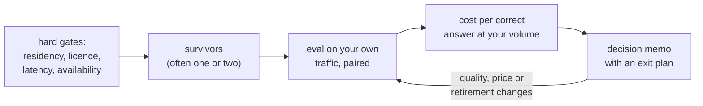

import Infographic from '@site/src/components/Infographic';
import BuildBuyLab from '@site/src/components/viz/BuildBuyLab';

**In one line.** Pick the way you will run a model by removing options on hard constraints first, then compare what is left on cost per correct answer and on evidence strong enough to tell the candidates apart, and write down how you would leave.

:::note Not from a lecture
This chapter is written for this site from the sources listed under Further reading. All prices, throughputs and error costs in the code are **named assumptions** for a made-up support feature, not quotes: replace them with your own. The evaluation numbers come from a seeded synthetic eval set, not from a real leaderboard.
:::

## The idea in plain words

Two questions get mixed up in most "which model should we use" meetings.

1. **Who runs the model?** Rent it per token from a vendor (**buy**), run open weights on GPUs you rent or own (**host**), or train or tune one yourself (**build**).
2. **Which model?** Within that choice, which candidate is actually better on your task.

They have different failure modes. The first is mostly arithmetic plus risk: volume, utilisation, the engineers you will need, the contracts you must satisfy. The second is mostly statistics: whether the gap you measured is real. Teams that skip the arithmetic buy at a volume where hosting would have saved a team's salary, or host at a volume where the GPUs sit half idle. Teams that skip the statistics choose the model that won on twelve prompts and a leaderboard screenshot.

The habits that cause the damage are easy to name.

- **Choosing by public leaderboard.** A leaderboard measures somebody else's task. It narrows the shortlist; it does not pick the winner.
- **Choosing on a handful of prompts.** The next section of this chapter shows how large a gap a 300-item set can and cannot detect.
- **Comparing the invoice with the GPU bill.** The honest comparison includes the engineers who run the GPUs, the minimum number of replicas for availability, and the cost of the extra mistakes a weaker model makes.
- **Treating the vendor's model as permanent.** An API model has a lifecycle with a retirement date. Your prompts and your evals are the assets that survive it; the model name is a parameter.

<Infographic src="/img/senior/build-vs-buy-and-model-selection-break-even.svg" alt="A table of monthly cost for buying an API and hosting open weights at five volumes, the break-even volumes with and without a quality gap, and three notes on staircase hosting cost, error cost and vendor model retirement." caption="The break-even calculator of the first code block: at 5,000,000 requests a month the two options are within 1.5% of each other, and the quality gap moves the crossover from about 2.1 million to about 4.6 million requests." />

<Infographic src="/img/senior/build-vs-buy-and-model-selection-eval-noise.svg" alt="Confidence intervals on the gap between three models on 300 items, unpaired and paired, plus a table of items needed to detect a given gap." caption="The second code block: a 6.7-point gap is real once the comparison is paired, a 4.7-point gap is not yet, and detecting 3 points would take about 1,500 items." />



## How it works

### Step 1: gates, not weights

Some requirements are not negotiable and should not be averaged into a score. Put them first and let them delete options.

| Gate | Question to answer | What a failure looks like |
| --- | --- | --- |
| Data residency and privacy | May the prompt leave your boundary, and under what terms? | A contract term, not a benchmark, removes every hosted API. |
| Licence | May you use, modify and serve these weights for this purpose? | "Open weights" turns out to carry use restrictions. |
| Latency at the 95th percentile | Can a call finish inside the product's budget at peak? | The accurate model is too slow for an interactive feature. |
| Availability | What happens when the provider or the GPU pool is down? | A single replica or single region is a single point of failure. |
| Retirement and change | Who decides when the model changes, and with how much notice? | A forced migration lands in the middle of a launch. |

A word on licences. "Open weights" and "open source" are not the same thing. The Open Source AI Definition 1.0 from the Open Source Initiative lists four freedoms (use, study, modify, share) and says the preferred form for modification must include detailed information about the training data, the complete code used to train and run the system, and the parameters. A model published with weights alone does not satisfy that definition. For a build-or-buy decision the distinction matters in a practical way: read the actual licence text for use restrictions and attribution duties, rather than assuming "open" means "unrestricted".

### Step 2: cost per correct answer

The comparison that matters is not tokens against GPU hours. It is the monthly cost of each option, including the cost of its mistakes, at the volume you expect.

For buying, with $V$ requests a month:

$$C_{\text{buy}} = V\left(t_{\text{in}} p_{\text{in}} + t_{\text{out}} p_{\text{out}}\right) + V e_{\text{api}} c_{\text{err}}$$

For hosting, the GPU bill is a staircase, because replicas come in whole units and there is a floor for availability:

$$C_{\text{host}} = \max\!\left(r_{\min},\ \left\lceil \frac{V \,\rho\, t_{\text{out}} / T_{\text{month}}}{\theta} \right\rceil\right) g\, h + F + V e_{\text{open}} c_{\text{err}}$$

Here $t$ are tokens per request, $p$ prices per token, $\rho$ the ratio of peak to mean traffic, $T_{\text{month}}$ the seconds in a month, $\theta$ the output tokens per second one replica sustains on **your** prompts, $g$ the price of a GPU hour, $h$ the hours in the month, $F$ the monthly cost of the people who run it, $e$ the error rates and $c_{\text{err}}$ what one mistake costs. The break-even volume is where the two curves cross.

Three things in that algebra deserve a sentence each.

- $\theta$ must be **measured**, on your prompt and output lengths, with your batch settings. A figure from a vendor slide is a ceiling. The chapter on [GPU sizing and capacity planning](/docs/llm-engineering/gpu-sizing-and-capacity-planning) shows how to measure it.
- $F$ is not zero. Half an engineer is already a large part of the hosting bill at modest volume.
- The error term is where selection feeds back into cost. A model that is three points worse costs more than the number on its leaderboard suggests, as soon as a mistake has a price.

### Step 3: evidence that can separate two models

An eval set is a **sample** of the questions your users might ask. Treating it that way gives you the standard machinery. Evan Miller's paper on error bars for evals sets out the recommendations this chapter follows: compute the standard error of the mean, compare two models on the **paired** item-level differences rather than on the two summary scores, and use a power analysis to decide whether an eval is big enough to answer the question at all.

For two models scored on the same items:

$$\text{SE}_{A-B,\text{paired}} = \sqrt{\text{SE}_A^2 + \text{SE}_B^2 - 2\,\text{SE}_A\,\text{SE}_B\,\text{Corr}(s_A, s_B)}$$

Because items that are hard for one model tend to be hard for the other, the correlation is positive and the paired interval is narrower than the unpaired one. The same paper gives the sample size needed to detect a gap $\delta$ with significance level $\alpha$ and power $1-\beta$:

$$n = \frac{(z_{\alpha/2} + z_{\beta})^2\, \omega^2}{\delta^2}$$

where $\omega^2$ is the variance of one item's score difference between the two models (the paper's formula adds terms for repeated sampling of answers, which vanish here because each item is scored once).

### Step 4: the exit plan

Write down, before choosing, how you would switch. Four things make switching cheap: your prompts live in version control separate from application code; your eval set and its grader are yours; the model identifier is configuration; and the outputs are consumed through a thin interface, not through vendor-specific features spread across the codebase.

### The decision memo, as a template

```text
Decision: use <option> for <feature> from <date>, review on <date or trigger>.

Gates
  residency / privacy:   pass or fail, with the clause or test that shows it
  licence:               name, version, restrictions that matter
  latency p95 at peak:   measured number against budget
  availability:          design and its measured failure behaviour

Evidence
  eval set:              N items from production, how sampled, how graded
  result:                score per candidate, paired gap, 95% interval, items needed for the gap we care about
  decision rule:         what gap would have changed our mind

Cost at expected volume (named assumptions, dated)
  tokens per request, price per million, replicas, engineers, error rate x cost of an error
  break-even volume and where we are relative to it

Risks and exit
  retirement notice we rely on, migration effort in days, what stays portable

Not chosen, and why
  one line per rejected option
```

**Anti-patterns to delete from a proposal on sight**

| Anti-pattern | What to ask instead |
| --- | --- |
| "Model X tops the leaderboard." | What is its score on a set drawn from our traffic, with an interval? |
| "Hosting is cheaper per token." | Cheaper per request at our volume, including replicas, people and mistakes? |
| "We can switch later." | What is the migration effort in days, and what would we do on day one? |
| "The open model is good enough." | By what gap, measured how, and what does a mistake cost us? |
| "We tested it on a few examples." | How big a gap could those examples have detected? |

## A real system that works this way

**Vendor model lifecycles are published, and they are short.** Anthropic's model deprecations page, which I opened on 2026-10-02, states that customers with active deployments are notified at least 60 days before a publicly released model is retired, and lists the lifecycle states: active, legacy, deprecated and retired. The page shows what that looks like in practice. `claude-3-haiku-20240307` was announced for retirement on 2026-02-19 and retired on 2026-04-20. `claude-sonnet-4-5-20250929` was deprecated on 2026-09-30 with retirement set for 2026-11-30 and `claude-sonnet-5-5` named as the replacement. The page also notes that Amazon Bedrock and Google Cloud set their own schedules, so the same model can have different dates on different platforms. None of this is a criticism of buying: it is the price of a managed service, and the right response is a migration plan and a portable eval set, not surprise.

**Rankings carry uncertainty, and the best-known leaderboard says so.** The Chatbot Arena paper (Chiang et al., 2024) describes an open platform that ranks models from pairwise human votes, reporting more than 240,000 votes at the time of the paper, and applies statistical methods to the ranking. I read only the abstract, which does not detail the methods, so I make no claim here about how it computes its intervals. The relevant point for this chapter is the design choice: a public ranking is built from many votes on a broad population of prompts, which is exactly what your own ten-prompt test is not.

## Code you can run

Both blocks use only numpy and scipy, are seeded, and run in a second or two. The prices, throughput and error costs in the first block are assumptions chosen for illustration.

#### 1. Break-even between an API and hosted open weights

A support feature sends 1,500 input tokens and gets 300 back. The assumed API price is 2.00 per million input tokens and 8.00 per million output tokens. A GPU costs an assumed 2.50 an hour and one replica sustains an assumed 1,200 output tokens a second. Peak traffic is four times the mean, at least two replicas are always running, half an engineer at 15,000 a month looks after the platform, the API model is wrong 6% of the time, the open model 9%, and a wrong answer costs 0.10.

```python
import math

ASSUMPTIONS = {
    "in_tokens": 1500,
    "out_tokens": 300,
    "api_in_per_m": 2.00,
    "api_out_per_m": 8.00,
    "gpu_per_hour": 2.50,
    "hours_per_month": 730,
    "replica_out_tokens_per_s": 1200,
    "peak_to_mean": 4.0,
    "min_replicas": 2,
    "platform_fte": 0.5,
    "fte_monthly": 15000,
    "api_error_rate": 0.06,
    "open_error_rate": 0.09,
    "cost_per_error": 0.10,
}

def api_cost_per_request(a):
    return (a["in_tokens"] * a["api_in_per_m"] + a["out_tokens"] * a["api_out_per_m"]) / 1e6

def replicas_needed(requests_per_month, a):
    mean_rps = requests_per_month / (30 * 86400)
    peak_out_tokens_per_s = mean_rps * a["peak_to_mean"] * a["out_tokens"]
    return max(a["min_replicas"], math.ceil(peak_out_tokens_per_s / a["replica_out_tokens_per_s"]))

def monthly(requests_per_month, a, include_errors=True):
    api_run = requests_per_month * api_cost_per_request(a)
    gpus = replicas_needed(requests_per_month, a)
    host_fixed = gpus * a["gpu_per_hour"] * a["hours_per_month"] + a["platform_fte"] * a["fte_monthly"]
    api_err = requests_per_month * a["api_error_rate"] * a["cost_per_error"] if include_errors else 0
    host_err = requests_per_month * a["open_error_rate"] * a["cost_per_error"] if include_errors else 0
    return api_run + api_err, host_fixed + host_err, gpus

def break_even(a, include_errors=True):
    lo, hi = 1_000, 500_000_000
    for _ in range(80):
        mid = (lo + hi) / 2
        buy, host, _ = monthly(mid, a, include_errors)
        if buy > host:
            hi = mid
        else:
            lo = mid
    return None if hi > 499_999_000 else hi

def show(label, value):
    text = "no break-even below 500,000,000" if value is None else f"{value:,.0f} requests per month"
    print(f"{label}{text}")

a = ASSUMPTIONS
print(f"API cost per request: {api_cost_per_request(a):.5f}")
print("requests/month   replicas   buy (API)   host (open weights)   cheaper")
for v in (100_000, 1_000_000, 5_000_000, 20_000_000, 100_000_000):
    buy, host, gpus = monthly(v, a)
    print(f"{v:14,d}   {gpus:8d}   {buy:9,.0f}   {host:19,.0f}   {'buy' if buy < host else 'host'}")

print()
show("break-even without the quality gap: ", break_even(a, False))
show("break-even with the quality gap:    ", break_even(a, True))

cheap = dict(a, api_out_per_m=a["api_out_per_m"] / 2, api_in_per_m=a["api_in_per_m"] / 2)
show("if the API halves its price:        ", break_even(cheap, True))
```

At 5,000,000 requests a month the two options are within 1.5% of each other (57,000 against 56,150), which is the honest picture: near the crossover, the decision rests on risk and on things the spreadsheet leaves out. The staircase shows in the replica column (2, 2, 2, 8, 39). Without the quality gap the crossover is about 2.1 million requests; with a three-point gap it moves to about 4.6 million, because the extra mistakes cost 0.0030 per request against an API cost of 0.0054. And if the API halves its price, hosting never catches up below 500 million requests: the saving per request then falls under the quality gap.

Play with it. The chart shows cost per 1,000 requests on log axes, so the crossing is visible; the defaults reproduce the table row for 5,000,000 requests and the break-even of 4,645,833.

<BuildBuyLab />

#### 2. Can 300 items separate these models?

Three synthetic models answer the same 300 items. Each item has a hidden difficulty that affects every model, which is what makes item scores correlate in real evals too.

```python
import numpy as np
from scipy import stats

rng = np.random.default_rng(13)
n = 300
difficulty = rng.normal(0, 1, n)
noise = rng.normal(0, 0.5, (3, n))
levels = {"A": 1.15, "B": 0.95, "C": 1.13}
scores = {k: ((v - 0.9 * difficulty + noise[i]) > 0.6).astype(float) for i, (k, v) in enumerate(levels.items())}

def se_mean(x):
    return x.std(ddof=1) / np.sqrt(len(x))

def compare(x, y, label):
    diff = x.mean() - y.mean()
    sx, sy = se_mean(x), se_mean(y)
    corr = np.corrcoef(x, y)[0, 1]
    unpaired = np.sqrt(sx**2 + sy**2)
    paired = np.sqrt(sx**2 + sy**2 - 2 * sx * sy * corr)
    only_x = int(((x == 1) & (y == 0)).sum())
    only_y = int(((x == 0) & (y == 1)).sum())
    p = stats.binomtest(only_x, only_x + only_y, 0.5).pvalue
    print(f"{label}: {x.mean():.3f} vs {y.mean():.3f}, gap {diff:+.3f}, item correlation {corr:.3f}")
    print(f"   unpaired 95% CI [{diff - 1.96 * unpaired:+.3f}, {diff + 1.96 * unpaired:+.3f}]")
    print(f"   paired   95% CI [{diff - 1.96 * paired:+.3f}, {diff + 1.96 * paired:+.3f}]")
    print(f"   only first right on {only_x} items, only second right on {only_y}, exact McNemar p = {p:.3f}")

print(f"{n} items, scores of three candidate models")
compare(scores["A"], scores["B"], "A against B")
compare(scores["A"], scores["C"], "A against C")

a, b = scores["A"], scores["B"]
idx = np.random.default_rng(0).integers(0, n, (10000, n))
share = ((a[idx].mean(axis=1) - b[idx].mean(axis=1)) > 0).mean()
print(f"\nresamples of the eval set in which A beats B: {share:.3f}")
c = scores["C"]
share_c = ((a[idx].mean(axis=1) - c[idx].mean(axis=1)) > 0).mean()
print(f"resamples of the eval set in which A beats C: {share_c:.3f}")

z = stats.norm.ppf(0.975) + stats.norm.ppf(0.80)
omega2 = a.var(ddof=1) + b.var(ddof=1) - 2 * np.cov(a, b)[0, 1]
print(f"\npaired variance of one item difference (A, B): {omega2:.3f}")
for delta in (0.10, 0.067, 0.03, 0.02):
    print(f"to detect a {delta:.3f} gap with 80% power at 5% size: {z**2 * omega2 / delta**2:6.0f} items")
print(f"smallest gap {n} items can detect: {z * np.sqrt(omega2 / n):.3f}")
```

Read the first comparison. A scores 0.707 and B 0.640, a 6.7-point gap. The **unpaired** interval runs from -0.008 to +0.142 and includes zero, so on summary scores alone you could not call it. The **paired** interval, which uses the item correlation of 0.615, runs from +0.020 to +0.113 and excludes zero. The exact McNemar test on the 36 items where only A is right and the 16 where only B is right agrees (p = 0.008). Pairing did not change the data; it stopped throwing away the information that both models struggle on the same items.

Now the second comparison. A against C is a 4.7-point gap and even the paired interval, -0.001 to +0.094, just reaches zero (McNemar p = 0.076). The resampling line says A beats C in 96.8% of resamples, which sounds like certainty and is not: it is the one-sided version of an interval that touches zero.

The last block answers the planning question. With the paired variance of 0.169, detecting a 3-point gap at 80% power and 5% significance would need about 1,478 items, and a 2-point gap 3,325. The 300 items in hand can detect a gap of about 0.067 and nothing smaller. Decide the smallest gap that would change the decision before building the eval set, and size the set to that.

## Designing with it

**When each option tends to win**

| Situation | Leans towards | Why |
| --- | --- | --- |
| Low or spiky volume, small team, quality matters | Buy | Fixed hosting costs and people dominate; you pay only for use. |
| High steady volume, a narrow task, a model that is good enough | Host, perhaps fine-tuned | The staircase flattens and the marginal cost per request falls. |
| Hard residency or air-gap requirement | Host | A gate removes the hosted APIs; the matrix does not matter. |
| Unknown task, still discovering what users want | Buy, behind an interface | Do not build infrastructure for a requirement that may move. |
| A narrow, high-volume task with labelled data | Tune a small model | See [prompt, retrieve or fine-tune](/docs/llm-engineering/prompt-retrieve-or-fine-tune) for the order to try things. |

**A sequence that works**

1. Write the gates and delete options. Often one or two survive.
2. Build an eval set from real traffic (or, before launch, from realistic synthetic cases flagged as such), graded by a rubric two people have agreed on.
3. Run the paired comparison. If the interval includes zero and the gap matters, grow the set before arguing further.
4. Compute cost per request at your expected volume and at three times that, with the error term.
5. Prefer the option that wins with margin on both; if it is a near tie, prefer the one that is cheaper to leave.
6. Put the model identifier in configuration, keep the eval set in version control, and schedule a re-run when the vendor announces a retirement.

**Failure modes to name**

- *The unmeasured replica:* sizing from a vendor throughput number and finding half the capacity in practice.
- *The hidden regression:* swapping to a cheaper model that wins on average and loses on the one customer segment that pays for the feature. Report the interval and a per-segment breakdown, and read the [evaluation workflow](/docs/llm-evals/evaluation-workflow) before trusting a single number.

## Where this stands in 2026

:::info Industry view

- **Retirement is routine.** The vendor lifecycle page lists seven models retired between January and August 2026 alone, each with a named replacement. Plan for a migration per model generation, and budget it.
- **Evidence standards are rising.** Reporting a paired difference with an interval and a power calculation, as in Miller's paper, is what that paper recommends, and it is the form to ask for. A bare accuracy figure invites the question "how many items?".
- **"Open" needs a footnote.** The Open Source Initiative's definition separates open weights from open source AI. Read the licence before building on a model.
- **Prices move faster than architecture.** This chapter keeps them as parameters on purpose: the numbers inside the comparison change, while its structure (volume, replicas, people, mistakes) does not.

:::

## Practice questions

<details>
<summary><strong>Q1.</strong> Why is "hosting is cheaper per token" not enough to justify hosting?</summary>

Per token ignores the staircase of whole replicas with a minimum for availability, the engineers who run them, utilisation, and the cost of any extra mistakes a weaker model makes. The comparison that matters is monthly cost per request at your volume. In the example, hosting costs more than buying at 1,000,000 requests a month (20,150 against 11,400) even though its marginal cost per request is lower.

</details>

<details>
<summary><strong>Q2.</strong> A has 0.707 and B has 0.640 on 300 items. A colleague says the 95% intervals on the two scores overlap, so there is no difference. What is wrong?</summary>

Overlapping intervals on two separate scores is not the right test. Both models answered the same items, and their item scores correlate (0.615 here), so the interval on the **paired** difference is narrower than the one built from the two separate standard errors. Here it is +0.020 to +0.113 and excludes zero, while the unpaired interval of -0.008 to +0.142 does not.

</details>

<details>
<summary><strong>Q3.</strong> How many items do you need to detect a 3-point gap, and what do you do if you cannot get that many?</summary>

About 1,478 for 80% power at 5% significance with the paired variance in the example. If you cannot get that many, say what gap the set can detect (about 6.7 points for 300 items) and make the decision on other grounds: cost, risk and ease of leaving. Do not report a smaller gap as a finding.

</details>

<details>
<summary><strong>Q4.</strong> Privacy is the criterion the highest-scoring model fails. Should it be a weighted criterion in a decision matrix?</summary>

No. A weighted score lets strengths elsewhere compensate for a failure that is not compensable. Make privacy and residency a **gate** that removes options before scoring. The matrix in the chapter on design reviews shows the leader being removed by exactly such a gate.

</details>

<details>
<summary><strong>Q5.</strong> Your vendor announces a model retirement in 60 days. What should already exist?</summary>

A model identifier in configuration rather than in code, an eval set from your traffic that you can run against the replacement, a prompt repository you can adjust, and a comparison procedure that reports a paired gap with an interval. With those, migration is a project of days. Without them it is an emergency.

</details>

<details>
<summary><strong>Q6.</strong> In the break-even code, halving the API price makes hosting never win. Is that a bug?</summary>

No. Halving the API price cuts the saving per request from hosting to less than the cost of the open model's extra mistakes (0.0030 per request), so the two curves never cross within the search range. It is a useful result: the decision depends on a vendor's price list, so schedule a re-check whenever it changes.

</details>

## Further reading

- [Evan Miller, "Adding Error Bars to Evals: A Statistical Approach to Language Model Evaluations" (2024)](https://arxiv.org/abs/2411.00640): standard errors, paired differences, clustered errors and the power formula used above.
- [Chiang et al., "Chatbot Arena: An Open Platform for Evaluating LLMs by Human Preference" (2024)](https://arxiv.org/abs/2403.04132): ranking models from pairwise votes at scale.
- [Open Source Initiative, Open Source AI Definition 1.0](https://opensource.org/ai/open-source-ai-definition): what "open source AI" requires beyond open weights.
- [Anthropic, model deprecations](https://platform.claude.com/docs/en/about-claude/model-deprecations): lifecycle states, notice period and retirement history, as read on 2026-10-02.
- [Anthropic, prompt caching](https://platform.claude.com/docs/en/build-with-claude/prompt-caching): cache pricing multipliers referred to in the next chapter.
- [Chen, Zaharia and Zou, "FrugalGPT" (2023)](https://arxiv.org/abs/2305.05176): cost-aware use of several models, picked up in the cost chapter.
- [Zinkevich, "Rules of Machine Learning" (Google)](https://developers.google.com/machine-learning/guides/rules-of-ml): launch simply, then iterate.

## Check yourself

- I can separate "who runs the model" from "which model" and say why they need different tools.
- I can turn hard requirements into gates that remove options instead of weights that average them away.
- I can write the monthly cost of buying and hosting, including replicas, people and the cost of mistakes, and find the break-even volume.
- I can compare two models with a paired interval, and say how many items I would need to detect the gap I care about.
- I can explain why overlapping intervals on two scores do not settle a comparison on the same items.
- I can write a decision memo with evidence, cost at stated assumptions, an exit plan and the options not chosen.
- I can list the things that make leaving a vendor model cheap.
