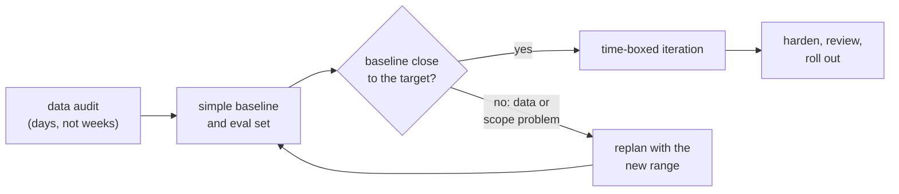

import Infographic from '@site/src/components/Infographic';
import EstimateRangeLab from '@site/src/components/viz/EstimateRangeLab';

**In one line.** Estimate AI work as a range with a probability, name the data risk that hits several tasks at once, check the numbers against how your past projects actually went, and order the work so that the first weeks remove the biggest uncertainty.

:::note Not from a lecture
This chapter is written for this site from the sources listed under Further reading. The task ranges and the ten-project history in the code are **invented for the exercise**: they show the method, not typical durations. Replace them with your own estimates and your own history.
:::

## The idea in plain words

Software estimates are famously optimistic. AI work adds three reasons to expect worse.

1. **The size of the job depends on data you have not seen.** "Label the evaluation set" takes a week if the data is clean and the categories are agreed, and a month if the labellers disagree on a third of the cases.
2. **"Reach the quality target" is a search, not a task.** You know how to start; you cannot know in advance how many rounds of changing the prompt, the retrieval or the data it will take.
3. **The risks are shared.** If the data is worse than assumed, it is worse for the labelling, the baseline and the iteration all at once. Independent risks average out; a shared one does not.

A single number hides all of this. "Six weeks" is a point somewhere inside a wide distribution, and whoever hears it assumes it is the middle, or the safe end, of that distribution. Neither is true by default.

Two classical ideas help. The first is the **cone of uncertainty**, introduced to software by Barry Boehm in 1981 as the "funnel curve" and named by Steve McConnell in 1997: at the start of a project, estimates are uncertain by a factor of about four in each direction, and the uncertainty tends to shrink as work proceeds, though the shrinking is not guaranteed. The practical reading is that an early estimate should be a wide range, and that the plan should be built to narrow it. The second is the **outside view**: instead of reasoning from the details of this project, ask how projects like it turned out. Bent Flyvbjerg's reference class forecasting bases a forecast on the actual performance of comparable past projects, which bypasses both optimism bias and the pressure to promise.

<Infographic src="/img/senior/estimation-and-planning-sum-of-ranges.svg" alt="Eight tasks drawn as ranges with a likely value, and a table showing that the sum of likely values is 40 days while the simulated median is 53.9 and the 85th percentile 61.7." caption="The first code block: the eight likely values add to 40 days, and only 0.6% of 100,000 simulated projects finish that fast." />

<Infographic src="/img/senior/estimation-and-planning-shared-risk.svg" alt="Tables comparing the mean, median and tail of a project when data risk is shared across tasks or independent, how the 85th percentile grows with the slowdown, and an outside-view calibration from ten past projects." caption="The second and third code blocks: the same average slowdown with a thicker tail when the risk is shared, and a reference class that turns an engineers' 40 days into 62 at the median and 81 at the 80th percentile." />



## How it works

### Three numbers per task

For each task ask for an **optimistic**, a **likely** and a **pessimistic** duration, from the people who will do it, independently, before they discuss. The classical PERT formulas, developed for the US Navy's Polaris programme in 1958, turn them into an expected value $(o + 4m + p)/6$ and a standard deviation $(p - o)/6$. They are a convenient hand calculation. The simulation below uses triangular distributions instead, which weigh the pessimistic tail more heavily when the likely value sits near the optimistic end; the two methods therefore differ by several days on the same inputs, and neither is "the" answer. What they share is the lesson: both land far above the sum of likely values.

### Why the sum of likely values undercounts

Each task can run over by much more than it can run under, so the distribution of each task is skewed to the right. The most likely value (the mode) is below the mean. Add eight modes and you add eight below-average numbers. Worse, the chance that **every** task lands at or below its mode is tiny. The total is a sum of random variables; its median is close to the sum of the **means**, and its spread follows from the pessimistic tails.

### One shared risk moves several tasks together

Let a hidden variable stand for "the data is worse than assumed". With probability $q$ it is true, and then each data-dependent task takes $s$ times longer. Two ways to model it with the **same** expected slowdown:

- **Shared:** one draw per project decides all the data-dependent tasks together.
- **Independent:** each data-dependent task draws its own verdict.

The means are almost identical. The tails are not, because shared bad luck piles up. The more severe the slowdown, the larger the gap.

### The outside view

Take your last ten comparable projects, divide actual by estimated duration, and look at the ratios. If the engineers' estimates were a fair middle, the ratios would straddle 1. They usually do not. Apply the median ratio to get a planning figure, the 80th or 85th percentile ratio to get a promise, and state the uncertainty of that ratio, because ten projects is a small sample.

### Planning that buys down uncertainty

An estimate should shape the plan, not decorate it.

- **Put the cheapest, most informative work first.** A data audit takes days and can change every later estimate. Do it before committing to a date. Google's "Rules of Machine Learning" makes the same argument from experience: do not be afraid to launch without machine learning, keep the first model simple, and plan to launch and iterate.
- **Time-box the search.** "Iterate to the quality target" becomes "three rounds of two days each, then we look at the curve and decide".
- **Define done as a metric with a threshold and an evaluation set** agreed in advance, so progress is measured and not argued.
- **Re-estimate at gates.** Each gate (audit, baseline, first full evaluation) should produce a new range. If it does not narrow, say so.

### The estimate, as a template

```text
Task list (each one is a deliverable someone can check)
  task | optimistic | likely | pessimistic | depends on data? | who estimated

Assumptions that, if false, change the plan
  A1 data is labelled consistently by two people (agreement rate to be measured in week 1)
  A2 the provider's rate limits cover the evaluation runs
  A3 ...

Result of the simulation
  P50, P85, P95 in working days, with the data risk modelled as shared
  sum of likely values, shown only to be contrasted with the above

Outside view
  last N comparable projects, ratio actual / estimate, median and 80th percentile
  planning figure and promise figure

Plan
  gate 1 (date): data audit done, estimate re-run
  gate 2: baseline on the evaluation set, estimate re-run
  stopping rule: what result at which gate would make us stop or rescope

Communication
  we will commit to <P85 date>; the P50 is <date>; here is what would move it
```

**A bad estimate and a good one, annotated**

| Version | Text | What is wrong or right |
| --- | --- | --- |
| Bad | "About 8 weeks." | No range, no assumptions, no owner, no way to be wrong. |
| Bad | "8 weeks if the data is fine." | The condition is the whole risk, and it is not measured or assigned a probability. |
| Good | "P50 12 weeks, P85 14 weeks, assuming labeller agreement above 80%, which we measure in week 1; if it is below 70%, rescope the task definition and re-estimate." | A range, a probability, a falsifiable assumption, a measurement date and a stated consequence. |

**Anti-patterns**

| Anti-pattern | Instead |
| --- | --- |
| Adding the likely values | Simulate, or at least use the means and a pessimistic tail. |
| Treating every risk as independent | Name the shared factors (data quality, a new dependency) and model them once. |
| Estimating the search as a task | Time-box it and promise the next gate, not the end. |
| Anchoring on the first number said aloud | Collect ranges individually first. |
| Quoting the P50 as a commitment | Commit to a higher percentile and report the median as the plan. |
| Ignoring history | Keep the ratio table and update it after every project. |

## A real system that works this way

**Reference class forecasting in public infrastructure.** Flyvbjerg's paper, which I read as an abstract, documents that forecasts of cost and demand for projects are inaccurate and attributes it to optimism bias and strategic misrepresentation. It proposes forecasting from the actual performance of a reference class of comparable projects, and presents what it calls the first practical application, for cost projections of large transport infrastructure investments in the UK. The abstract says the method rests on decision-making theory that earned the 2002 Nobel prize in economics; search summaries of the paper connect it to Kahneman's insight that a project should be seen as one of a class of similar projects. The relevance here is not the domain but the mechanism: a ratio table of past outcomes beats a better argument about the present project.

**PERT.** The Program Evaluation and Review Technique was developed by Charles E. Clark for the US Navy in 1958, with the Navy Special Projects Office, Lockheed and Booz Allen Hamilton, to schedule the Polaris missile programme. Its three-point estimate is the ancestor of the ranges in this chapter. The page I read does not discuss its weaknesses. One commonly cited criticism, which I have not verified against a source here, is that summing means along a path ignores the way several paths can merge; that is one more reason to simulate.

## Code you can run

Numpy only, seeded. The task list is an invented support-assist feature. Three tasks (labelling, the baseline and the iteration to the quality target) are marked as data-dependent.

#### 1. Ranges, PERT and a simulation

```python
import numpy as np

TASKS = [
    ("data audit", 2, 3, 8, False),
    ("label the eval set", 4, 6, 15, True),
    ("baseline: prompt and retrieval", 3, 5, 12, True),
    ("eval harness", 3, 4, 7, False),
    ("iterate to the quality target", 5, 10, 30, True),
    ("integration and API", 4, 6, 12, False),
    ("safety and red-team review", 2, 3, 8, False),
    ("rollout and monitoring", 2, 3, 6, False),
]

print("task                              optimistic  likely  pessimistic   PERT mean")
for name, lo, mode, hi, _ in TASKS:
    print(f"{name:32s}  {lo:10d}  {mode:6d}  {hi:11d}   {(lo + 4 * mode + hi) / 6:9.2f}")

modes = sum(t[2] for t in TASKS)
pert = sum((t[1] + 4 * t[2] + t[3]) / 6 for t in TASKS)
print(f"\nsum of likely values: {modes} days")
print(f"sum of PERT means:    {pert:.1f} days")

rng = np.random.default_rng(5)
draws = 100000
total = np.zeros(draws)
for _, lo, mode, hi, _ in TASKS:
    total += rng.triangular(lo, mode, hi, draws)
p = lambda q: np.percentile(total, q)
print(f"\nMonte Carlo of the sum, {draws} draws (triangular tasks, independent):")
print(f"P10 {p(10):.1f}   P50 {p(50):.1f}   P85 {p(85):.1f}   P95 {p(95):.1f} days")
print(f"share of runs that finish within the sum of likely values ({modes} days): {np.mean(total <= modes):.3f}")
print(f"share of runs that finish within the sum of PERT means ({pert:.1f} days): {np.mean(total <= pert):.3f}")
```

The eight likely values add to 40 days. The PERT means add to 47.2. The simulation, which uses triangular distributions and draws each task independently, puts the median at 53.9 days, the 85th percentile at 61.7 and the 95th at 66.2. The share of simulated projects that finish within 40 days is 0.6%; within 47.2 days, 14.6%. The disagreement between 47.2 and 53.9 is the difference between two modelling choices, and both are well above 40.

#### 2. A shared data risk

This block uses a small seeded generator (a 32-bit mulberry generator) so that the lab can replay exactly the same draws in the browser. Each trial draws one shared number, then for each task a duration and a private number. In the shared model the shared number decides whether the data is bad; in the independent model each task uses its private one.

```python
import math

TASKS = [
    ("data audit", 2, 3, 8, False),
    ("label the eval set", 4, 6, 15, True),
    ("baseline: prompt and retrieval", 3, 5, 12, True),
    ("eval harness", 3, 4, 7, False),
    ("iterate to the quality target", 5, 10, 30, True),
    ("integration and API", 4, 6, 12, False),
    ("safety and red-team review", 2, 3, 8, False),
    ("rollout and monitoring", 2, 3, 6, False),
]

def mulberry32(seed):
    state = seed & 0xFFFFFFFF

    def rnd():
        nonlocal state
        state = (state + 0x6D2B79F5) & 0xFFFFFFFF
        t = state
        t = (((t ^ (t >> 15)) * (t | 1)) & 0xFFFFFFFF)
        t = t ^ ((t + (((t ^ (t >> 7)) * (t | 61)) & 0xFFFFFFFF)) & 0xFFFFFFFF)
        return ((t ^ (t >> 14)) & 0xFFFFFFFF) / 4294967296

    return rnd

def triangular(u, lo, mode, hi):
    cut = (mode - lo) / (hi - lo)
    if u < cut:
        return lo + math.sqrt(u * (hi - lo) * (mode - lo))
    return hi - math.sqrt((1 - u) * (hi - lo) * (hi - mode))

def percentile(sorted_values, q):
    pos = (len(sorted_values) - 1) * q / 100
    lo = math.floor(pos)
    frac = pos - lo
    if lo + 1 < len(sorted_values):
        return sorted_values[lo] + frac * (sorted_values[lo + 1] - sorted_values[lo])
    return sorted_values[lo]

def simulate(bad_probability, slowdown, shared, trials=4000, seed=2026):
    rnd = mulberry32(seed)
    totals = []
    for _ in range(trials):
        shared_draw = rnd()
        total = 0.0
        for _, lo, mode, hi, data_dependent in TASKS:
            days = triangular(rnd(), lo, mode, hi)
            own_draw = rnd()
            bad = (shared_draw if shared else own_draw) < bad_probability
            if data_dependent and bad:
                days *= slowdown
            total += days
        totals.append(total)
    return sorted(totals)

def describe(label, totals):
    mean = sum(totals) / len(totals)
    print(f"{label:34s} mean {mean:5.1f}  P50 {percentile(totals, 50):5.1f}  P85 {percentile(totals, 85):5.1f}  "
          f"P95 {percentile(totals, 95):5.1f}  P85 minus P50 {percentile(totals, 85) - percentile(totals, 50):4.1f}")

print("4,000 simulated projects, bad data multiplies the three data-dependent tasks by 1.5")
describe("data always as expected", simulate(0.0, 1.5, True))
describe("35% bad, one shared draw", simulate(0.35, 1.5, True))
describe("35% bad, each task draws its own", simulate(0.35, 1.5, False))
print("\nslowdown when data is bad   P85 (shared)   P85 (independent)")
for slowdown in (1.25, 1.5, 2.0, 2.5):
    shared = percentile(simulate(0.35, slowdown, True), 85)
    separate = percentile(simulate(0.35, slowdown, False), 85)
    print(f"{slowdown:25.2f}   {shared:12.1f}   {separate:17.1f}")
```

With the data always as expected the mean is 54.3 days, the median 53.8, the 85th percentile 61.7 and the 95th 66.4. Add a 35% chance of data that is bad enough to multiply the three data-dependent tasks by 1.5. With one shared verdict, the mean is 59.6, the median 58.1, the 85th percentile 70.9 and the 95th 81.2. With independent verdicts the mean is 59.5, almost the same, but the 85th percentile is 69.0 and the 95th 76.4: a thinner tail from exactly the same expected slowdown. The table at the bottom shows the gap widening with severity: at a 2.5 times slowdown the shared 85th percentile is 101.2 days against 88.0.

The lab replays the same 4,000 trials. Its defaults reproduce the shared row: mean 59.6, P50 58.1, P85 70.9. Switch to independent and watch the right tail shorten while the mean barely moves.

<EstimateRangeLab />

#### 3. The outside view

The ten past projects are invented. They show the arithmetic you would run on your own history.

```python
import numpy as np

history = [
    ("support triage classifier", 30, 41),
    ("invoice field extraction", 25, 52),
    ("search reranker", 40, 46),
    ("churn model refresh", 15, 15),
    ("document summariser", 20, 38),
    ("fraud rules to model", 45, 90),
    ("chat assistant v1", 35, 61),
    ("tagging service", 10, 9),
    ("demand forecast rewrite", 50, 64),
    ("rag over contracts", 30, 69),
]
estimate = np.array([h[1] for h in history], dtype=float)
actual = np.array([h[2] for h in history], dtype=float)
ratio = actual / estimate
print("project                       estimate  actual  actual/estimate")
for (name, e, a), r in zip(history, ratio):
    print(f"{name:28s}  {e:8d}  {a:6d}  {r:15.2f}")

print(f"\nprojects that finished within their estimate: {int((ratio <= 1).sum())} of {len(ratio)}")
print(f"median ratio {np.median(ratio):.2f}, 80th percentile ratio {np.percentile(ratio, 80):.2f}, largest {ratio.max():.2f}")

new_estimate = 40
print(f"\nnew project, engineers say {new_estimate} days")
print(f"outside view, median:          {new_estimate * np.median(ratio):.0f} days")
print(f"outside view, 80th percentile: {new_estimate * np.percentile(ratio, 80):.0f} days")

rng = np.random.default_rng(0)
resampled = rng.choice(ratio, (10000, len(ratio)), replace=True)
p80 = np.percentile(resampled, 80, axis=1)
print(f"bootstrap spread of that 80th percentile ratio: 5th to 95th percentile {np.percentile(p80, 5):.2f} to {np.percentile(p80, 95):.2f}")
```

Only two of the ten finished within their estimate. The median ratio is 1.55 and the 80th percentile ratio is 2.02. For a new project where the engineers say 40 days, the outside view gives 62 days as the median and 81 days as the 80th percentile. The bootstrap line is the honest footnote: with ten projects, the 80th percentile ratio itself could plausibly be anywhere from 1.51 to 2.30, so the history narrows the question without closing it. Compare the 81 days with the simulation's 70.9 for the shared-risk model. When the inside and outside views disagree, find out why before choosing; the usual answer is a task or a risk that nobody listed.

## Designing with it

**A sequence for a new AI project**

1. Write the deliverables as checkable tasks, each with three numbers from the person who will do it.
2. Mark which tasks depend on data, and put a number on the chance the data is worse than assumed.
3. Run the simulation with a shared risk. Report P50 and P85, not the sum of likely values.
4. Compute the outside view from your last comparable projects.
5. Put the data audit and the baseline first, and say what each will tell you.
6. Commit to a date at a high percentile; plan internally at the median; revisit at every gate.

**Failure modes to name**

- *The silent assumption:* "assuming the data is fine" left out of the estimate, then blamed when it is not.
- *Parkinson in reverse:* padding each task privately, which hides the risk and is usually spent anyway. Keep the ranges visible and the buffer at the project level.
- *The unbounded spike:* research with no time box and no gate.
- *The moving target:* adding scope and keeping the date. Re-run the estimate when the task list changes.

Estimation and the evaluation workflow interlock: the evaluation set is both an early deliverable and the definition of done. Read [requirements for ML systems](/docs/theory/seml/requirements-for-ml) for how to write the metric thresholds the plan depends on.

## Where this stands in 2026

:::info Industry view

- **The cone is a tendency, not a law.** The history of the idea says uncertainty tends to shrink as a project proceeds, and that this is not guaranteed. Build gates that test whether it has.
- **AI estimates are dominated by data and evaluation, not code.** The structure in this chapter, with a shared data factor and a time-boxed search, reflects that. Which numbers to put in it is a matter for your own history.
- **The Rules of Machine Learning guide, last updated 2025-08-25 on the page I read, still tells teams to launch simply and iterate.** That is estimation advice as much as modelling advice: the cheapest way to shrink a range is to ship something small and learn.
- **Reference classes beat intuition.** Keeping a ratio table of estimate against actual for every project costs minutes, and it is the data that reference class forecasting needs.

:::

## Practice questions

<details>
<summary><strong>Q1.</strong> A manager adds the eight likely values and quotes 40 days. What do you say?</summary>

Only 0.6% of simulated projects finish within the sum of likely values, because each task is skewed to the right and the likely value is below the mean. The median is 53.9 days and the 85th percentile 61.7. Quote a range, and commit to a higher percentile than the median.

</details>

<details>
<summary><strong>Q2.</strong> Why does the shared-risk model have the same mean as the independent one but a longer tail?</summary>

Both give each data-dependent task the same marginal chance of a slowdown, so the expected total is almost the same (59.6 and 59.5). With a shared verdict the slowdowns arrive together in one project, so the bad outcomes pile up (95th percentile 81.2 against 76.4). Independent verdicts partly cancel, because tasks rarely all go wrong in the same run.

</details>

<details>
<summary><strong>Q3.</strong> Your history shows a median ratio of 1.55 and your engineers estimate 40 days. What do you tell the sponsor?</summary>

That the planning figure is about 62 days and a safe promise is about 81 days (the 80th percentile ratio of 2.02). Then explain what you are doing in week one to find out whether this project is more predictable than the reference class, such as the data audit.

</details>

<details>
<summary><strong>Q4.</strong> How do you estimate "iterate to the quality target"?</summary>

You do not, as a single task. Time-box it (a fixed number of rounds), define the target on a fixed evaluation set, and promise the next gate rather than the end. Model its range as wide, and make it data-dependent so that bad data stretches it.

</details>

<details>
<summary><strong>Q5.</strong> The simulation gives P85 of 70.9 days; the reference class gives 81. Which do you use?</summary>

Neither blindly. The gap suggests the simulation misses some risk the history contains: a task that was not on the list, a dependency, or optimism in the ranges. Find the source, adjust the ranges or the task list, and re-run. If you cannot explain it, plan on the larger figure.

</details>

<details>
<summary><strong>Q6.</strong> Which assumption would you test first in a data-dependent project, and how?</summary>

The one that most changes the estimate if it is false, typically labeller agreement or data availability. Measure it in the first days with a small sample: have two people label 50 items and compute the agreement, then use the result to update the probability and slowdown in the model.

</details>

## Further reading

- [Cone of Uncertainty (Wikipedia)](https://en.wikipedia.org/wiki/Cone_of_Uncertainty): the factor-of-four range at the start, Boehm's 1981 funnel curve, McConnell's 1997 name, and the caveat that narrowing is not guaranteed.
- [Program evaluation and review technique (Wikipedia)](https://en.wikipedia.org/wiki/Program_evaluation_and_review_technique): the three-point formulas and the 1958 Navy origin.
- [Flyvbjerg, "From Nobel Prize to Project Management: Getting Risks Right"](https://arxiv.org/abs/1302.3642): reference class forecasting and why it works.
- [Zinkevich, "Rules of Machine Learning" (Google)](https://developers.google.com/machine-learning/guides/rules-of-ml): launch simply, keep the first model simple, plan to iterate.
- [Sculley et al., "Hidden Technical Debt in Machine Learning Systems"](https://papers.nips.cc/paper_files/paper/2015/hash/86df7dcfd896fcaf2674f757a2463eba-Abstract.html): the maintenance cost an estimate usually leaves out.

## Check yourself

- I can ask for optimistic, likely and pessimistic values and explain why their sum is not the project's likely duration.
- I can run a simple Monte Carlo of a task list and read P50, P85 and P95.
- I can model a shared risk such as data quality and say why it widens the tail.
- I can calibrate an estimate against ten past projects and state how uncertain the calibration is.
- I can plan the first weeks to reduce the largest uncertainty, and time-box a search.
- I can write an estimate that has a range, a falsifiable assumption and a re-estimation gate.
