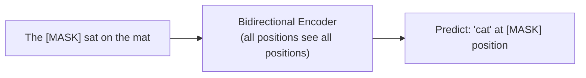
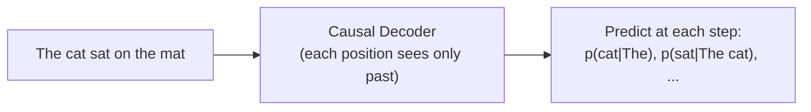
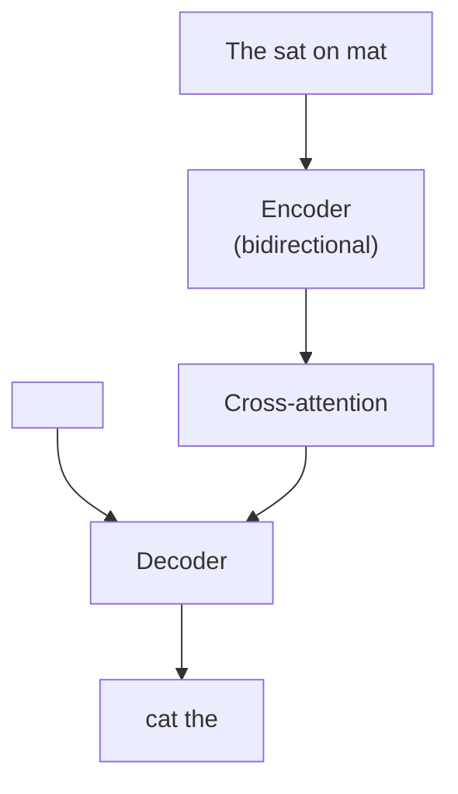

# Transformer training objectives

> **TL;DR.** Transformers learn from raw text by *hiding* part of it and predicting what was hidden. Three flavors dominate: **MLM** hides ~15% of random tokens and predicts them with bidirectional context (BERT, encoder-only). **CLM** predicts the next token from everything to the left (GPT, decoder-only). **Span corruption** hides contiguous *chunks* and asks an encoder-decoder model to regenerate them (T5). The objective is what *defines* the architecture — change the objective, change the model.

Transformers learn from unlabeled text by predicting parts of the text that have been hidden. The choice of what to hide and how to predict it defines the **training objective** — and this choice determines the architecture, the type of representations learned, and what downstream tasks the model is suited for.

## Prerequisites

Read these first — the training objective only makes sense once you know what the underlying architecture does:

- [80 — Transformer Encoder Architecture](./80-transformer-encoder-architecture.md) — the bidirectional stack MLM trains
- [81 — Masked Self-Attention](./81-masked-self-attention-in-the-transformer-decoder.md) — the causal mask CLM requires
- [83 — Transformer Decoder Architecture](./83-transformer-decoder-architecture.md) — the autoregressive stack CLM and span corruption train
- [84 — Transformer Inference](./84-transformer-inference-step-by-step.md) — why CLM's training regime maps cleanly onto generation
- [14 — Loss Functions](./14-loss-functions-in-deep-learning.md) — cross-entropy is the shared loss for all three objectives

## Try it interactively

- **[Hugging Face Fill-Mask widget](https://huggingface.co/bert-base-uncased)** — feed `"The [MASK] sat on the mat"` to a real BERT and see top-5 predictions
- **[OpenAI Tokenizer](https://platform.openai.com/tokenizer)** — see how GPT splits text and predicts the next token
- **[T5 demo](https://huggingface.co/google-t5/t5-base)** — try span infilling on text in your browser
- **[Karpathy — Let's build GPT (YouTube)](https://www.youtube.com/watch?v=kCc8FmEb1nY)** — implements the CLM training loop from scratch
- **[BertViz Fill-Mask](https://github.com/jessevig/bertviz)** — visualize which tokens BERT looks at when predicting a masked one

## A real-world analogy

Three different ways to learn a language by playing **fill-in-the-blank**:

- **MLM (BERT)**: A teacher gives you a sentence with random *single words* hidden (`"The ___ sat on the ___"`). You can read everything before AND after each blank, then guess. You learn rich understanding because every blank gives you full surrounding context.
- **CLM (GPT)**: The teacher reveals the sentence one word at a time, asking you to predict the next one each time. You only ever see what came before. You learn to *generate* — you have to know what plausibly comes next, which is exactly what a writer does.
- **Span corruption (T5)**: The teacher hides whole *phrases* (`"The ___ on the ___"`) and asks you to fill in each phrase. You see everything around the blanks bidirectionally (encoder), then write out the full missing chunks (decoder). It's a hybrid: understand globally, generate locally.

## One-line definition

A transformer pre-training objective defines what the model must predict from what context: masked language modeling predicts random masked tokens bidirectionally, causal language modeling predicts the next token left-to-right, and span corruption predicts multiple masked spans in a seq2seq format.

![BERT masked language modeling — some tokens are replaced with [MASK]; the bidirectional encoder must predict them using context from both sides](https://jalammar.github.io/images/BERT-language-modeling-masked-lm.png)
*Source: [Jay Alammar — The Illustrated BERT](https://jalammar.github.io/illustrated-bert/)*

## Why this topic matters

The pre-training objective is the most important design decision in a language model. It determines whether the encoder is bidirectional or causal, what information the model's representations capture, and how well it transfers to downstream tasks. MLM → BERT → understanding tasks. CLM → GPT → generation tasks. Span corruption → T5 → seq2seq tasks. Confusing these leads to using the wrong model for the wrong task.

## Objective 1: Masked Language Modeling (MLM) — BERT

**Used in**: BERT, RoBERTa, ALBERT, DeBERTa

**Idea**: randomly mask 15% of input tokens and predict the original tokens at those positions.

**Procedure** (BERT masking strategy):
- 80% of chosen tokens: replace with `[MASK]`
- 10% of chosen tokens: replace with a random token
- 10% of chosen tokens: keep the original token (unchanged)

**Loss**: cross-entropy at masked positions only:

$$
\mathcal{L}_{\text{MLM}} = -\frac{1}{|\mathcal{M}|} \sum_{i \in \mathcal{M}} \log p_\theta(x_i \mid \tilde{x})
$$

where $\mathcal{M}$ is the set of masked positions and $\tilde{x}$ is the masked input.

**Architecture requirement**: **bidirectional encoder** — predicting a masked token at position $i$ requires context from both left and right. A causal mask would block the right context, making the task much harder and preventing full bidirectional representations.

**What it learns**: a model that understands context. The representation of each token captures its meaning given the full surrounding context — both left and right. This is why BERT excels at classification, NER, and question answering.




*Source: [Jay Alammar — The Illustrated GPT-2](https://jalammar.github.io/illustrated-gpt2/)*

## Objective 2: Causal Language Modeling (CLM) — GPT

**Used in**: GPT, GPT-2, GPT-3, LLaMA, Claude, Gemini, Mistral

**Idea**: predict the next token given all previous tokens.

$$
\mathcal{L}_{\text{CLM}} = -\sum_{t=1}^{T} \log p_\theta(x_t \mid x_1, x_2, \ldots, x_{t-1})
$$

This is the classic language modeling objective. On a sequence of length $T$, the model makes $T-1$ predictions simultaneously (at positions 1 through $T-1$), each predicting the token at the next position.

**Architecture requirement**: **causal (decoder-only)** transformer with a lower-triangular mask. Each position can only see its own left context — exactly the autoregressive constraint.

**What it learns**: a model that predicts what comes next. This naturally captures language generation, few-shot learning, and reasoning. The unidirectional context is a tradeoff: each token only sees its left context, but the training signal is denser (every position contributes to loss, not just ~15% of them).



**Training efficiency**: CLM is extremely data-efficient — a single sentence of length $T$ provides $T-1$ training signals.

## Objective 3: Span Corruption (Denoising) — T5

**Used in**: T5, BART (similar), UL2

**Idea**: replace contiguous spans of input tokens with sentinel tokens (`<extra_id_0>`, `<extra_id_1>`, ...) and train the decoder to reconstruct all the corrupted spans.

For T5 specifically:
- Sample spans with mean length 3 tokens, covering 15% of input
- Replace each span with a unique sentinel token
- Target: all original spans concatenated, each preceded by their sentinel

**Example**:
- Input: `"The <extra_id_0> sat on <extra_id_1> mat"`
- Target: `"<extra_id_0> cat <extra_id_1> the"`

**Architecture requirement**: **encoder-decoder** — the encoder reads the corrupted input bidirectionally; the decoder generates the original spans autoregressively.

**What it learns**: a model that can both understand context (encoder) and generate sequences (decoder). Span corruption is a "middle ground" — better bidirectional understanding than pure CLM, better generation than pure MLM.



## Side-by-side comparison

| Property | MLM (BERT) | CLM (GPT) | Span Corruption (T5) |
|---|---|---|---|
| Architecture | Encoder-only | Decoder-only | Encoder-Decoder |
| Context | Bidirectional | Unidirectional (left) | Encoder: bi; Decoder: causal |
| What's predicted | Masked tokens | Next token | Masked spans |
| Fraction of tokens in loss | ~15% | 100% | Masked span tokens |
| Training signals per sentence | Few (~0.15T) | Many (T-1) | Medium |
| Best for | Classification, NER, QA | Generation, chat, code | Seq2seq, summarization |
| Knowledge representation | Rich token-level | Sequential predictive | Both |

## Next-sentence prediction (NSP) — BERT's second objective

Original BERT was trained with a second objective: given two sentences A and B, predict whether B follows A in the original document.

$$
\mathcal{L}_{\text{NSP}} = -\log p_\theta(\text{IsNext} \mid [\text{CLS}] A [\text{SEP}] B)
$$

The `[CLS]` token's representation is used for the binary classification. **However**, RoBERTa (2019) showed NSP provides minimal benefit and can even hurt performance. Most modern encoders drop it.

## Python code: implementing each objective

```python
import torch
import torch.nn as nn
import torch.nn.functional as F
from typing import Tuple


# ============================================================
# Objective 1: MLM data collator
# ============================================================
def create_mlm_batch(
    token_ids: torch.Tensor,   # (batch, seq_len)
    vocab_size: int,
    mask_token_id: int,
    pad_token_id: int = 0,
    mask_prob: float = 0.15,
) -> Tuple[torch.Tensor, torch.Tensor]:
    """
    Apply BERT-style masking and return (masked_input, labels).
    labels[i] = original token ID if masked, else -100 (ignored in loss).
    """
    labels = token_ids.clone()
    # Sample positions to mask (~15%)
    probability_matrix = torch.full(token_ids.shape, mask_prob)
    # Don't mask special tokens (padding)
    probability_matrix[token_ids == pad_token_id] = 0
    masked_indices = torch.bernoulli(probability_matrix).bool()

    # Only compute loss on masked positions
    labels[~masked_indices] = -100   # -100 is ignored by CrossEntropyLoss

    # Apply masking strategy:
    # 80% → [MASK], 10% → random token, 10% → unchanged
    indices_replaced = torch.bernoulli(torch.full(token_ids.shape, 0.8)).bool() & masked_indices
    indices_random = torch.bernoulli(torch.full(token_ids.shape, 0.5)).bool() & masked_indices & ~indices_replaced

    masked_input = token_ids.clone()
    masked_input[indices_replaced] = mask_token_id
    random_tokens = torch.randint(0, vocab_size, token_ids.shape)
    masked_input[indices_random] = random_tokens[indices_random]
    # Remaining masked positions keep original token (10%)

    return masked_input, labels


# Demo
token_ids = torch.tensor([[5, 10, 3, 7, 12, 8, 2, 0, 0, 0]])   # last 3 are padding
masked_input, labels = create_mlm_batch(
    token_ids, vocab_size=30000, mask_token_id=103, pad_token_id=0
)
print("=== MLM ===")
print(f"Original:     {token_ids[0].tolist()}")
print(f"Masked input: {masked_input[0].tolist()}")
print(f"Labels:       {labels[0].tolist()}")   # -100 where not masked


# ============================================================
# Objective 2: CLM loss computation
# ============================================================
def compute_clm_loss(
    logits: torch.Tensor,    # (batch, seq_len, vocab_size)
    token_ids: torch.Tensor, # (batch, seq_len)
    pad_id: int = 0,
) -> torch.Tensor:
    """
    Causal LM loss: predict token[t] from token[0..t-1].
    Shift by 1: input = token_ids[:, :-1], target = token_ids[:, 1:]
    """
    # Shift: input is all tokens except last; target is all tokens except first
    logits_shifted = logits[:, :-1, :]           # (batch, seq_len-1, vocab)
    targets = token_ids[:, 1:].clone()            # (batch, seq_len-1)

    # Ignore padding positions
    targets[targets == pad_id] = -100

    # Flatten for cross-entropy
    loss = F.cross_entropy(
        logits_shifted.reshape(-1, logits_shifted.size(-1)),
        targets.reshape(-1),
        ignore_index=-100,
    )
    return loss


# Demo
batch, seq_len, vocab_size = 2, 10, 1000
logits = torch.randn(batch, seq_len, vocab_size)
token_ids = torch.randint(1, vocab_size, (batch, seq_len))
token_ids[0, -3:] = 0   # some padding

loss = compute_clm_loss(logits, token_ids)
print(f"\n=== CLM ===")
print(f"CLM loss: {loss.item():.4f}")
print(f"Perplexity: {loss.exp().item():.1f}")


# ============================================================
# Objective 3: Span corruption (T5-style) — data preparation
# ============================================================
def create_span_corruption_batch(
    token_ids: list[int],
    sentinel_start_id: int = 32000,
    noise_density: float = 0.15,
    mean_span_length: float = 3.0,
) -> Tuple[list[int], list[int]]:
    """
    Apply T5-style span corruption.
    Returns (input_ids, target_ids) where:
    - input_ids: original with spans replaced by sentinels
    - target_ids: sentinel + original_span for each corrupted span
    """
    import random
    n = len(token_ids)
    num_noise_tokens = int(round(n * noise_density))
    num_spans = max(1, int(round(num_noise_tokens / mean_span_length)))

    # Sample span start positions
    span_starts = sorted(random.sample(range(n), min(num_spans, n)))
    span_lengths = [max(1, int(random.gauss(mean_span_length, 1))) for _ in span_starts]

    # Build noise mask
    noise_mask = [False] * n
    for start, length in zip(span_starts, span_lengths):
        for i in range(start, min(start + length, n)):
            noise_mask[i] = True

    # Build input and target
    input_ids, target_ids = [], []
    sentinel_id = sentinel_start_id
    prev_noise = False

    for i, (tok, noisy) in enumerate(zip(token_ids, noise_mask)):
        if noisy and not prev_noise:
            input_ids.append(sentinel_id)
            target_ids.append(sentinel_id)
            sentinel_id += 1
        if noisy:
            target_ids.append(tok)
        else:
            input_ids.append(tok)
        prev_noise = noisy

    return input_ids, target_ids


tokens = [5, 10, 3, 7, 12, 8, 2, 15, 22, 11, 4, 6, 9]
inp, tgt = create_span_corruption_batch(tokens, sentinel_start_id=32000)
print(f"\n=== Span Corruption (T5) ===")
print(f"Original: {tokens}")
print(f"Input:    {inp}")
print(f"Target:   {tgt}")
# Input has fewer tokens (spans replaced by sentinels)
# Target reconstructs the original spans
```

### Try it yourself: experiments

| Question | Try this |
|----------|----------|
| What if mask probability is 50% instead of 15%? | Set `mask_prob=0.5` — too few unmasked tokens to give context; loss plateaus higher |
| Skip the 80/10/10 strategy | Replace all masked tokens with `[MASK]` only — model learns the artifact and degrades on real text |
| CLM perplexity on different model sizes | Run the same loss on a GPT-2 (124M) and DistilGPT-2 (82M) — bigger model usually has lower perplexity |
| Span corruption with mean span = 1 | Set `mean_span_length=1.0` — degenerates to token-level masking, similar to MLM |
| Compare gradient signal density | Print `(labels != -100).float().mean()` for MLM (~15%) vs CLM (~100%) on the same batch |

## Which objective to use?

| Task | Best pre-training | Model family |
|---|---|---|
| Text classification | MLM | BERT, RoBERTa |
| Named entity recognition | MLM | BERT, DeBERTa |
| Semantic similarity / embeddings | MLM | BERT, sentence-BERT |
| Open-ended text generation | CLM | GPT, LLaMA |
| Instruction following / chat | CLM | LLaMA, Claude |
| Translation | Span corruption / seq2seq | T5, BART, mT5 |
| Summarization | CLM or span corruption | GPT-4, T5 |
| Code generation | CLM | Codex, Code Llama |

## Cross-references

- **Prerequisite:** [80 — Encoder Architecture](./80-transformer-encoder-architecture.md) — what MLM trains
- **Prerequisite:** [83 — Decoder Architecture](./83-transformer-decoder-architecture.md) — what CLM and span corruption train
- **Follow-up:** [86 — Tokenization](./86-tokenization-bpe-wordpiece-sentencepiece.md) — what tokens these objectives operate on
- **Follow-up:** [87 — BERT Pretraining](./87-bert-encoder-pretraining.md) — MLM in production detail
- **Follow-up:** [88 — GPT Pretraining](./88-gpt-decoder-only-causal-lm.md) — CLM in production detail
- **Follow-up:** [89 — T5 Pretraining](./89-t5-encoder-decoder-pretraining.md) — span corruption in production detail

## Interview questions

<details>
<summary>Why does BERT use bidirectional attention while GPT uses causal attention?</summary>

The pre-training objectives require different attention patterns. MLM masks tokens and predicts them from both left and right context — bidirectional access is essential; blocking right context would make the task much harder. CLM predicts the next token from only past tokens — causal masking is required both for training correctness and for inference (future tokens don't exist during generation). The objective defines the mask, and the mask defines the architecture.
</details>

<details>
<summary>Why does CLM produce more training signal per sentence than MLM?</summary>

In CLM, every token position generates a prediction and contributes to the loss: $T-1$ predictions per sequence of length $T$. In MLM, only ~15% of tokens are masked and predicted — $0.15T$ predictions per sequence. A sequence of 100 tokens gives 99 CLM training signals but only ~15 MLM signals. However, MLM predictions are harder (they require understanding bidirectional context), so the quality per signal may be higher. In practice, CLM models benefit greatly from this training signal density and tend to scale better.
</details>

<details>
<summary>What is the advantage of span corruption over both MLM and CLM?</summary>

MLM is bidirectional but only predicts individual tokens — it cannot generate multi-token sequences. CLM generates multi-token sequences but is unidirectional. Span corruption combines both: the encoder processes the full input bidirectionally (better understanding), and the decoder generates entire corrupted spans autoregressively (generative capability). T5's claim is that span corruption is a unified objective that works well across both understanding and generation tasks.
</details>

<details>
<summary>Scenario: your team trains a BERT on legal documents and the loss plateaus quickly. They suggest raising the mask rate from 15% to 40%. What goes wrong?</summary>

The 15% rate isn't arbitrary — it balances two competing pressures. (1) More masked tokens = more prediction signal per sequence. (2) Fewer unmasked tokens = less *context* available to predict each masked one. At 40%, almost half the tokens are missing, so the surrounding context becomes too sparse to disambiguate words (consider predicting `[MASK] [MASK] [MASK] mat` — almost no constraint). The model fits noise and downstream task performance drops.

A second issue: BERT's pretrain/finetune distribution gap widens. Downstream tasks have 0% `[MASK]` tokens; the bigger the gap, the more the encoder must adapt at finetune time. RoBERTa and ELECTRA experimented in this region and found 15% remains a good operating point; SpanBERT showed that *what* you mask (contiguous spans) matters more than *how much*.

If the loss is plateauing, the right diagnostic is usually: tokenizer mismatch, learning rate too low, dataset deduplication issues, or insufficient compute — not a higher mask rate.
</details>

<details>
<summary>Scenario: a team trains a GPT-style model where ~30% of training tokens are padding. They set `ignore_index=pad_id`. Is the loss correct? What's the subtle bug?</summary>

`ignore_index` zeros the loss at pad positions, so the *value* of the reported loss is correct — it averages only over real tokens. The subtle bug is **attention contamination**: padding tokens still participate in self-attention unless you also pass a `key_padding_mask`. The model's hidden states for real tokens will mix in features from pad positions, training a representation that depends on padding patterns that don't exist at inference.

Two fixes are needed together: (1) ignore the *loss* at pad positions (you did this), and (2) ignore the *attention* at pad positions (set their scores to `-inf` via key_padding_mask, exactly like the causal mask). Without both, you get a model that runs but quietly underperforms — and the issue is hard to catch because the loss curve looks fine.
</details>

<details>
<summary>Why is MLM considered a harder *per-prediction* task than CLM, even though CLM has more total signal density?</summary>

In CLM the model predicts the next token given a long, *coherent* left context. The distribution $p(x_t \mid x_{<t})$ is heavily constrained by syntax and what came before — predicting "the" after "I went to" is easy. In MLM, the prediction is conditioned on *bidirectional* context, but the masking strategy is adversarial: the target token can be in the middle of a clause with relatively few syntactic clues on either side, and the 10% random-replacement noise means the surrounding context can itself be wrong.

Concretely: CLM gives O(T) easy predictions per sequence; MLM gives O(0.15T) harder predictions. Per parameter update, MLM extracts more information *per masked position*, but CLM extracts more total information *per sequence*. This is also why CLM tends to scale more efficiently — more gradient signal per token processed.
</details>

<details>
<summary>What happens if you accidentally apply a causal mask to a BERT-style MLM encoder?</summary>

It's not just "slower training" — it's a different objective entirely. With a causal mask, the model predicting `[MASK]` at position $i$ can only see positions $0, \ldots, i-1$ — the right context is gone. So the task degenerates to "predict the masked token from left context only," which is essentially CLM but with the inefficiency that ~85% of positions don't contribute to loss. You'd get worse performance than vanilla CLM (sparser signal) *and* lose the bidirectional representation that justified using MLM in the first place. The downstream classification scores would collapse on tasks like NER and coreference that need both-sides context.
</details>

<details>
<summary>Why does MLM replace 10% of masked tokens with random tokens and 10% with the unchanged original? Why not 100% `[MASK]`?</summary>

If 100% of masked positions used the `[MASK]` token, the model would learn the shortcut: "if I see `[MASK]`, predict; otherwise, copy the input." Downstream tasks never have `[MASK]` tokens, so the model has no incentive to build useful representations for *unmasked* positions during pretraining — the entire encoder output for non-mask positions becomes a wasted slot.

The 80/10/10 strategy forces the model to maintain a useful prediction-capable representation at *every* position: 10% of the time the input looks normal but is still a prediction target, 10% of the time it sees a random token at a prediction target, and 80% of the time it sees `[MASK]`. The model can't tell from the input alone whether a token needs prediction or not, so it learns context-rich representations everywhere — closing the pretrain/finetune distribution gap.
</details>

<details>
<summary>You fine-tune a CLM-pretrained model on classification by mean-pooling final hidden states. Performance is much worse than BERT. Why?</summary>

A CLM model's hidden state at position $t$ summarizes the *left* context only — it never "sees" tokens at positions $> t$ during pretraining. Mean-pooling those hidden states gives a representation skewed toward early tokens; the last hidden state has the richest context but the first has almost none. BERT's hidden states are computed bidirectionally, so each one represents that token in full context, and pooling produces a balanced sentence representation.

Standard fixes for CLM models on classification: (1) use the *last* hidden state as the sequence representation (it has seen everything), (2) append a `[CLS]`-like token at the end of the input, or (3) use prefix-tuning / instruction-tuning to recast classification as generation. The "vanilla mean-pool" recipe that works for BERT doesn't transfer to GPT-style models without modification.
</details>

<details>
<summary>What happens if T5's mean span length is set to 1? What about 20?</summary>

**Mean = 1**: each "span" is a single token, so span corruption degenerates to token-level MLM — but with the encoder-decoder overhead. You lose T5's main advantage (generating multi-token sequences) and get a worse BERT.

**Mean = 20**: long spans cover huge contiguous chunks of the input. The model now has to *generate* paragraphs from sparse context, which is much harder and slower to learn — essentially CLM applied to span-by-span generation. T5's paper swept span lengths and settled on mean = 3 as the sweet spot: spans large enough to require generation, small enough that the encoder still has dense context.

The lesson: pretraining objectives have hyperparameters that are jointly optimized with the architecture; you can't tune one in isolation.
</details>

<details>
<summary>Why does NSP not help (and sometimes hurt)? What does that say about objective design?</summary>

NSP teaches the model to distinguish "B follows A" from "B is a random sentence." RoBERTa and others showed this signal is too easy: even shallow features (topic overlap, basic word co-occurrence) suffice, so NSP wastes capacity on a low-difficulty task while not teaching genuinely useful sentence relations. Worse, when "B is random" sampling occasionally drew from a different domain, the model partly learned topic classification instead of discourse coherence.

The deeper lesson: a good pretraining objective must be (1) hard enough that the model needs to develop generalizable features to solve it, (2) cheap to generate from raw text without supervision, and (3) aligned with downstream tasks. NSP failed criterion (1). ELECTRA's "replaced token detection" objective is an example of going in the opposite direction — making the per-token task harder and more sample-efficient.
</details>

<details>
<summary>Is "MLM is just CLM with labels at random positions" a correct mental model?</summary>

Surface-level yes, deep level no. Both use cross-entropy at certain target positions. But the *attention pattern* differs and that changes what's being learned. In MLM the encoder sees the full sequence bidirectionally — the representation at position $i$ depends on tokens at positions both $< i$ and $> i$. In CLM the representation at position $i$ depends only on positions $\leq i$, even at training time, because the causal mask is always on.

This means MLM's hidden states are **token-in-context** features that are great for understanding; CLM's hidden states are **prefix-summary** features that are great for predicting continuations. You cannot turn one into the other by changing where the loss is applied — the *information flow* in the network is different. This is also why you cannot use a pretrained CLM model for masked-token prediction without serious finetuning, and vice versa.
</details>

<details>
<summary>Two GPT-style models, same architecture and data, reach loss 2.1 and 2.0. Both open source. How do you choose for a production chat system?</summary>

Loss difference of 0.1 corresponds to perplexity difference of roughly $e^{0.1} \approx 1.1\times$, which can be meaningful but is *not* the deciding factor. For a chat product, evaluate along axes the loss does not capture:

- **Instruction following and refusals** (run them on a held-out instruction set; chat performance is dominated by post-training, not pretraining loss)
- **Tokenizer quality** (a model with a worse tokenizer can have lower loss on its own tokenization but produce worse outputs in your language)
- **Safety/alignment behavior** (does each model have an aligned RLHF/DPO variant?)
- **License terms** (commercial use, attribution requirements)
- **Latency at your batch size and sequence length**
- **Memory footprint** and quantization support
- **Long-context behavior** if your prompts exceed 8K tokens
- **Community/finetune ecosystem** — many community LoRAs and quantizations available?

In short: pretrain loss is a coarse filter, not a tie-breaker. Run product-relevant evals on both.
</details>

<details>
<summary>Why is `[CLS]` used for classification in BERT but not in GPT? How does ChatGPT solve classification then?</summary>

BERT's `[CLS]` is a special token prepended to every input during pretraining; the model is trained (via NSP and finetuning) to summarize the whole sequence into its final hidden state. Because attention is bidirectional, the `[CLS]` representation can aggregate information from every position symmetrically — perfect for a single-vector classification head.

GPT has no `[CLS]` token in its pretraining and uses causal attention, so a prepended token at position 0 sees *nothing* — it has no context. The natural summary token is at the *end*: the last hidden state has seen every prior token. But GPT-style chat models don't use that hidden state directly either. Instead, they cast classification as **generation**: the model is prompted ("Is the following review positive or negative? ...") and produces the answer as text. Logits on the answer tokens encode the classification probability. This is why "prompting" replaced classification heads for decoder-only LLMs.
</details>

<details>
<summary>Permutation language modeling (XLNet) claims "best of both worlds." What is the idea and why didn't it win?</summary>

XLNet samples a permutation of the input order, then predicts each token from all previously-permuted positions. With random permutations, predictions sometimes condition on left-and-right context (like MLM) and sometimes only left (like CLM) — the *expected* objective is bidirectional yet maintains an autoregressive factorization. Theoretically: rich bidirectional features without the `[MASK]` artifact.

It didn't displace BERT or GPT for two practical reasons. (1) Implementation complexity: two-stream attention is intricate, slower to train, and harder to scale. (2) The empirical wins over a well-tuned RoBERTa were small once both were trained at scale. The deep learning field tends to favor simpler objectives that scale; XLNet's elegance didn't outweigh its overhead at billion-parameter scales. The "best of both worlds" is now more commonly achieved with separate model families (encoders + decoders) or with span corruption.
</details>

<details>
<summary>If you're designing pretraining for a 1B-parameter model intended only for sentence retrieval, which objective and why?</summary>

For pure retrieval (embed sentence → cosine-similar to other sentence embeddings), MLM-based encoders are still the strongest baseline. Reasons:

- Bidirectional context produces token representations rich enough to mean-pool or `[CLS]`-pool into a coherent sentence vector.
- CLM models have asymmetric representations (last token informed, first token not) that don't pool well without modification.
- Contrastive finetuning (SimCSE, GTE, BGE) on top of an MLM encoder is the dominant recipe for SOTA retrieval models.

The more sophisticated answer: use MLM **plus** a contrastive objective during pretraining itself — e.g., the unsupervised SimCSE setup, where positives are the same sentence with different dropout masks. This trains the model to produce similarity-friendly embeddings from day one, beating "MLM-then-contrastive-finetune" in many benchmarks. The pure-objective era is over; modern retrieval models stack objectives.
</details>

## Points to remember

- The pre-training objective **is** the architecture: MLM → bidirectional encoder; CLM → causal decoder; span corruption → encoder-decoder. Don't try to use one model for the wrong objective.
- MLM signal density is ~15% of tokens; CLM is ~100%. CLM scales more efficiently per token of compute; MLM packs more information per prediction.
- BERT's 80/10/10 masking strategy is not optional — it closes the pretrain/finetune distribution gap and forces useful representations at every position.
- A causal mask flips the model from "context-rich understanding" to "left-context-only generation." It controls *what information flows*, not just *what gets predicted*.
- NSP is deprecated; the lesson is that pretraining objectives must be hard enough to require generalizable features.
- Span corruption is the middle ground when you need both understanding and generation in one model (T5, BART, UL2).
- Padding handling is two separate things: ignore in loss *and* ignore in attention. Doing only one is a silent bug.
- Loss alone is not a model selector — tokenizer quality, alignment, license, and downstream evals dominate production choice.
- Modern retrieval models pair MLM with contrastive objectives; pretraining is no longer one objective in isolation.

## Common mistakes

- Using a BERT-style model (encoder-only) for generation — it has no causal mask and no mechanism for next-token prediction
- Using GPT-style model for embeddings/classification without a task-specific head — its representations are optimized for generation, not understanding
- Confusing the 80/10/10 masking strategy with "just replace everything with [MASK]" — the 10% random and 10% unchanged help prevent the model from learning that `[MASK]` always requires a prediction
- Applying NSP when training a new BERT — research shows it adds noise rather than signal in most settings

## Final takeaway

The three dominant pre-training objectives — MLM, CLM, span corruption — each match a specific architecture and use case. MLM gives bidirectional encoders for understanding; CLM gives causal decoders for generation; span corruption gives encoder-decoders for seq2seq. The objective is not a detail — it is the core learning signal that determines everything about what a model knows and what it can do.

## Further reading

- [arXiv: BERT (Devlin et al. 2019)](https://arxiv.org/abs/1810.04805) — the MLM paper that started the pretraining revolution
- [arXiv: GPT (Radford et al. 2018)](https://cdn.openai.com/research-covers/language-unsupervised/language_understanding_paper.pdf) — the CLM paper from OpenAI
- [arXiv: T5 (Raffel et al. 2020)](https://arxiv.org/abs/1910.10683) — span corruption + text-to-text framework
- [arXiv: RoBERTa (Liu et al. 2019)](https://arxiv.org/abs/1907.11692) — proved NSP unhelpful, demonstrated BERT was undertrained
- [arXiv: ELECTRA (Clark et al. 2020)](https://arxiv.org/abs/2003.10555) — replaced-token-detection, a more sample-efficient alternative to MLM
- [arXiv: UL2 (Tay et al. 2022)](https://arxiv.org/abs/2205.05131) — unifying CLM, MLM, and span corruption as a "mixture of denoisers"
- [Jay Alammar — The Illustrated BERT, GPT, and friends](https://jalammar.github.io/illustrated-bert/) — visual explanations of all three objectives
- [Hugging Face — Pretraining tasks tutorial](https://huggingface.co/learn/nlp-course/chapter7) — runnable code for each objective
- [Sebastian Raschka — Understanding Pretraining](https://magazine.sebastianraschka.com/p/understanding-large-language-models) — overview of pretraining objectives and their evolution

## References

- Devlin, J., et al. (2019). BERT: Pre-training of Deep Bidirectional Transformers for Language Understanding. NAACL.
- Radford, A., et al. (2018). Improving Language Understanding by Generative Pre-Training (GPT). OpenAI.
- Raffel, C., et al. (2020). Exploring the Limits of Transfer Learning with a Unified Text-to-Text Transformer. JMLR.
- Liu, Y., et al. (2019). RoBERTa: A Robustly Optimized BERT Pretraining Approach.
