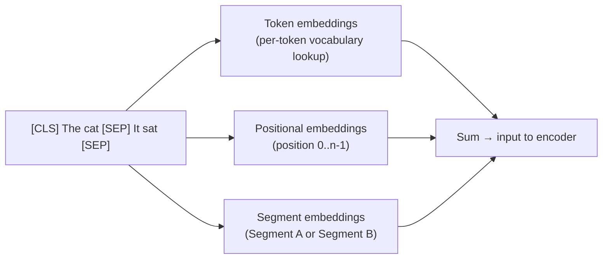

# BERT: encoder-only pre-training

> **TL;DR.** BERT is a transformer **encoder** (no decoder, no causal mask) pre-trained by hiding ~15% of tokens and predicting them with bidirectional context. After pretraining, you slap a tiny task-specific head on top of the `[CLS]` token (or per-token outputs) and fine-tune on a small labeled dataset. This pre-train-then-fine-tune recipe is what changed NLP forever in 2018 — every modern encoder model (RoBERTa, DeBERTa, sentence-BERT, embedding models) descends from it.

BERT (Bidirectional Encoder Representations from Transformers) demonstrated that pre-training a deep bidirectional transformer on unlabeled text with masked language modeling produces representations that transfer powerfully to nearly every NLP task. Before BERT (2018), NLP models were trained from scratch for each task. After BERT, the dominant paradigm became: pre-train once on a huge corpus, fine-tune cheaply on small labeled datasets.

## Prerequisites

- [80 — Transformer Encoder Architecture](./80-transformer-encoder-architecture.md) — BERT *is* the transformer encoder stack
- [81 — Masked Self-Attention](./81-masked-self-attention-in-the-transformer-decoder.md) — the contrast: BERT explicitly *does not* mask future tokens
- [85 — Transformer Training Objectives](./85-transformer-training-objectives.md) — MLM and NSP defined in detail
- [86 — Tokenization](./86-tokenization-bpe-wordpiece-sentencepiece.md) — BERT uses WordPiece; the `[CLS]` and `[SEP]` tokens come from here
- [79 — Layer vs. Batch Normalization](./79-layer-normalization-versus-batch-normalization.md) — why encoder blocks use LayerNorm

## Try it interactively

- **[BERT Fill-Mask demo](https://huggingface.co/bert-base-uncased)** — paste a sentence with `[MASK]` and see top-5 predictions in your browser
- **[BertViz](https://github.com/jessevig/bertviz)** — visualize BERT's attention patterns layer by layer
- **[Sentence-BERT demo](https://huggingface.co/sentence-transformers)** — embed two sentences and see semantic similarity scores
- **[Hugging Face fine-tuning tutorial](https://huggingface.co/learn/nlp-course/chapter3)** — fine-tune BERT on a real classification task in a Colab
- **[exBERT](https://exbert.net/exBERT.html)** — interactive BERT exploration: hover over tokens to see attention

## A real-world analogy

BERT's training is like asking someone to **read a paragraph with crossed-out words** and fill them back in. They can read everything before AND after each blank, so they have full context. Once they've practiced this on millions of paragraphs from books and Wikipedia, they've built a deep understanding of language — and now they can be quickly retrained ("fine-tuned") to do specific jobs like "is this review positive?" or "is this entity a person?". The pre-training builds the general reading skill; fine-tuning specializes it cheaply.

## One-line definition

BERT is a bidirectional transformer encoder pre-trained on masked language modeling and next-sentence prediction, producing contextual token representations that can be fine-tuned for classification, tagging, and question answering by adding a small task-specific head.

![BERT masked language modeling — random tokens are replaced with [MASK] and the model must predict the original token using bidirectional context](https://jalammar.github.io/images/BERT-language-modeling-masked-lm.png)
*Source: [Jay Alammar — The Illustrated BERT](https://jalammar.github.io/illustrated-bert/)*

## Why this topic matters

BERT established the pre-train-then-fine-tune paradigm that defines modern NLP. Understanding BERT's architecture and training procedure is the foundation for understanding encoder-only models (RoBERTa, DeBERTa, ALBERT), semantic search, and NLP fine-tuning in industry. BERT-family models dominate production NLP systems for text understanding tasks.

## Architecture

BERT is a stack of $N$ transformer encoder blocks with bidirectional self-attention — no causal mask.

| Model | $d_{\text{model}}$ | Layers $N$ | Heads $h$ | Parameters |
|---|---|---|---|---|
| BERT-base | 768 | 12 | 12 | 110M |
| BERT-large | 1024 | 24 | 16 | 340M |

The architecture is identical to the transformer encoder described in note 80 — the key differences are in how BERT is trained.

## Input representation

BERT's input combines three embeddings:

$$
\text{Input}_i = \text{TokenEmbedding}(w_i) + \text{PositionalEmbedding}(i) + \text{SegmentEmbedding}(s_i)
$$



**Special tokens**:
- `[CLS]`: prepended to every input. Its final hidden state is used as the sequence-level representation for classification.
- `[SEP]`: separates segment A and segment B (two sentences in pair tasks).

**Segment embeddings**: token-type IDs (0 for sentence A, 1 for sentence B) allow BERT to distinguish between two sentences in paired tasks (NLI, QA).

## Pre-training task 1: Masked Language Modeling (MLM)

15% of input tokens are selected for prediction:
- 80%: replaced with `[MASK]` token
- 10%: replaced with a random token
- 10%: left unchanged (forces the model to produce contextual representations for all tokens)

Only masked positions contribute to the loss:

$$
\mathcal{L}_{\text{MLM}} = -\sum_{i \in \mathcal{M}} \log p_\theta(x_i \mid \tilde{x})
$$

The 80/10/10 split prevents the model from only learning to predict `[MASK]` tokens and ensures the representation is useful for all tokens.

## Pre-training task 2: Next Sentence Prediction (NSP)

50% of the time, sentence B follows sentence A. 50% of the time, sentence B is a random sentence. The `[CLS]` representation is classified as IsNext / NotNext.

**Note**: RoBERTa (2019) showed NSP hurts more than it helps and removed it. Most modern BERT variants do not use NSP.

## What BERT's representations look like

After pre-training, BERT produces:
- One vector per token: $h_i \in \mathbb{R}^{d_{\text{model}}}$, contextual (the same word has different representations in different contexts)
- `[CLS]` vector: $h_0 \in \mathbb{R}^{d_{\text{model}}}$, often used as the sequence representation for classification

```
"The bank is by the river"     → bank → [0.2, -0.8, ..., 0.4]  (river sense)
"I deposited money at the bank" → bank → [0.9, 0.3, ..., -0.2]  (financial sense)
```

The same word "bank" has completely different representations depending on context.


*Source: [Jay Alammar — The Illustrated BERT](https://jalammar.github.io/illustrated-bert/)*

## Fine-tuning for downstream tasks

Fine-tuning adds a small task-specific head on top of the pre-trained BERT and trains on labeled data with a low learning rate:

| Task | Head | What's fine-tuned |
|---|---|---|
| Classification (sentiment, topic) | Linear on `[CLS]` vector | Full model + head |
| Token classification (NER) | Linear on each token vector | Full model + head |
| Extractive QA (SQuAD) | Start/end span classifiers | Full model + head |
| Sentence pair (NLI) | Linear on `[CLS]` | Full model + head |

**Fine-tuning recipe**:
- Learning rate: 2e-5 to 5e-5
- Batch size: 16–32
- Epochs: 3–4
- Warm up + linear decay scheduler

## Python code

```python
# pip install transformers datasets
import torch
import torch.nn as nn
from transformers import BertModel, BertTokenizer, BertForSequenceClassification

# ============================================================
# 1. Extract BERT representations (feature extraction)
# ============================================================
tokenizer = BertTokenizer.from_pretrained("bert-base-uncased")
bert = BertModel.from_pretrained("bert-base-uncased")
bert.eval()

texts = [
    "The bank is by the river.",
    "I deposited money at the bank.",
]
encoded = tokenizer(texts, padding=True, truncation=True, return_tensors="pt")

with torch.no_grad():
    outputs = bert(**encoded)

# outputs.last_hidden_state: (batch, seq_len, 768) — all token representations
# outputs.pooler_output:     (batch, 768) — [CLS] token, transformed by tanh
last_hidden = outputs.last_hidden_state
cls_repr = last_hidden[:, 0, :]   # [CLS] token is at position 0

print(f"All token representations: {last_hidden.shape}")  # (2, seq_len, 768)
print(f"[CLS] representation:      {cls_repr.shape}")      # (2, 768)

# Verify: "bank" has different representations in the two sentences
bank_pos_1 = tokenizer.encode(texts[0], add_special_tokens=True).index(
    tokenizer.convert_tokens_to_ids("bank")
)
bank_pos_2 = tokenizer.encode(texts[1], add_special_tokens=True).index(
    tokenizer.convert_tokens_to_ids("bank")
)

bank_repr_1 = last_hidden[0, bank_pos_1]   # (768,)
bank_repr_2 = last_hidden[1, bank_pos_2]   # (768,)
cosine_sim = torch.nn.functional.cosine_similarity(
    bank_repr_1.unsqueeze(0), bank_repr_2.unsqueeze(0)
)
print(f"\nCosine similarity between 'bank' representations: {cosine_sim.item():.4f}")
# Should be significantly less than 1.0 — different contexts → different vectors


# ============================================================
# 2. Fine-tuning for text classification
# ============================================================
class BertClassifier(nn.Module):
    """BERT fine-tuned for binary sentiment classification."""

    def __init__(self, num_labels: int = 2, dropout: float = 0.1):
        super().__init__()
        self.bert = BertModel.from_pretrained("bert-base-uncased")
        self.dropout = nn.Dropout(dropout)
        self.classifier = nn.Linear(768, num_labels)

    def forward(self, input_ids, attention_mask, token_type_ids=None):
        outputs = self.bert(
            input_ids=input_ids,
            attention_mask=attention_mask,
            token_type_ids=token_type_ids,
        )
        cls_output = outputs.last_hidden_state[:, 0, :]  # [CLS] token
        cls_output = self.dropout(cls_output)
        logits = self.classifier(cls_output)             # (batch, num_labels)
        return logits


# Using HuggingFace's built-in fine-tuning wrapper
model = BertForSequenceClassification.from_pretrained(
    "bert-base-uncased",
    num_labels=2,
)

# Simulate a training step
texts = ["I love this movie!", "This was terrible."]
labels = torch.tensor([1, 0])   # positive, negative
encoded = tokenizer(texts, padding=True, truncation=True, return_tensors="pt")

outputs = model(**encoded, labels=labels)
loss = outputs.loss
logits = outputs.logits

print(f"\nClassification loss:   {loss.item():.4f}")
print(f"Logits:                {logits.detach()}")
print(f"Predicted classes:     {logits.argmax(dim=-1).tolist()}")


# ============================================================
# 3. Token classification (NER)
# ============================================================
from transformers import BertForTokenClassification

# NER: each token gets a label (O, B-PER, I-PER, B-ORG, ...)
ner_model = BertForTokenClassification.from_pretrained(
    "bert-base-uncased",
    num_labels=9,  # typical NER label count
)

text = "Barack Obama was born in Honolulu."
encoded = tokenizer(text, return_tensors="pt")
outputs = ner_model(**encoded)

token_logits = outputs.logits   # (1, seq_len, 9)
token_preds = token_logits.argmax(dim=-1)   # (1, seq_len)
tokens = tokenizer.convert_ids_to_tokens(encoded["input_ids"][0])

print(f"\n=== NER token predictions ===")
for tok, pred in zip(tokens, token_preds[0]):
    print(f"  {tok:15} → label {pred.item()}")
```

### Try it yourself: experiments

| Question | Try this |
|----------|----------|
| Visualize "bank" disambiguation | Embed both sentences, take `last_hidden_state` for the "bank" token, compare cosine similarity |
| Effect of [CLS] vs mean pooling | Compare `cls_repr` to `last_hidden.mean(dim=1)` for sentence similarity — mean pooling often wins |
| Probe a specific layer | `BertModel(..., output_hidden_states=True)` → inspect early/middle/late layers separately |
| Fine-tune with frozen BERT | Set `bert.requires_grad_(False)` and train only the head — much faster, slightly worse accuracy |
| Try a different mask ratio | Modify your data collator to mask 25% — usually hurts performance vs the canonical 15% |

## BERT variants

| Model | Key change | Performance |
|---|---|---|
| RoBERTa | Remove NSP, more data, larger batches, byte-level BPE | +3–5% on GLUE |
| ALBERT | Parameter sharing across layers, factorized embeddings | 90% fewer params |
| DistilBERT | Knowledge distillation from BERT-base | 40% smaller, 60% faster, 97% performance |
| DeBERTa | Disentangled attention (separate position and content) | State-of-art on many tasks |
| ELECTRA | Replaced token detection instead of MLM | More efficient training |

## When to use BERT vs. GPT

| Use case | Model family | Reason |
|---|---|---|
| Sentence classification | BERT | `[CLS]` + bidirectional context |
| Named entity recognition | BERT | Per-token labels with full context |
| Semantic search embeddings | BERT | Sentence-level representations |
| Text generation | GPT | Causal autoregressive |
| Few-shot tasks | GPT | In-context learning via prompting |
| Question answering (extractive) | BERT | Span extraction from passage |
| Question answering (generative) | GPT/T5 | Generate answer free-form |

## Cross-references

- **Prerequisite:** [80 — Transformer Encoder Architecture](./80-transformer-encoder-architecture.md) — BERT's architecture exactly
- **Prerequisite:** [85 — Training Objectives](./85-transformer-training-objectives.md) — MLM in detail
- **Prerequisite:** [86 — Tokenization](./86-tokenization-bpe-wordpiece-sentencepiece.md) — BERT uses WordPiece
- **Follow-up:** [88 — GPT (Decoder-Only)](./88-gpt-decoder-only-causal-lm.md) — the contrasting decoder-only paradigm
- **Follow-up:** [90 — Fine-Tuning Transformers](./90-fine-tuning-transformers.md) — how to adapt BERT to your task

## Interview questions

<details>
<summary>Why does BERT use bidirectional attention instead of causal attention?</summary>

BERT's pre-training task is masked language modeling — predicting randomly masked tokens from context. To predict a masked token, the model needs context from both left and right sides. A causal mask blocks right context, making MLM much harder and the representations less rich. Bidirectional attention allows BERT to build the best possible contextual representation of each token, which is exactly what downstream understanding tasks need.
</details>

<details>
<summary>What is the role of the [CLS] token?</summary>

`[CLS]` is a special token prepended to every input. It has no inherent meaning — it serves as a "summary token" that can accumulate sequence-level information through self-attention. During MLM pre-training, `[CLS]` attends to all tokens in the sequence. After pre-training and during fine-tuning, a linear layer on top of the `[CLS]` representation is used for sequence-level tasks (classification, sentence-pair scoring). The model learns to put global information useful for classification into the `[CLS]` position during fine-tuning.
</details>

<details>
<summary>What is the difference between BERT's output and a word embedding?</summary>

A word embedding maps each token to a fixed vector regardless of context — "bank" always has the same embedding. BERT's output is a contextual representation — the vector for "bank" depends on the surrounding sentence. The same token can have very different representations: "bank" in "river bank" vs. "financial bank" produces different BERT output vectors. This is because self-attention mixes information from all surrounding tokens to produce each token's representation.
</details>

<details>
<summary>Scenario: you fine-tune BERT for sentiment and accuracy is great on validation, but in production it fails on sentences longer than ~200 tokens. Why?</summary>

BERT's positional embeddings are *learned* (not sinusoidal) and the original BERT was trained with max_position_embeddings = 512. The model has no learned position vectors beyond 512, so longer sequences are truncated. But the deeper issue is that even within 512, the model's *effective* attention range may concentrate on early/late positions — fine-tuning data that's all short produces position-biased attention.

Production-side fixes: (1) truncate intelligently (keep first + last segments, not just first 512), (2) chunk and aggregate per-chunk predictions, (3) switch to a long-context variant like Longformer or BigBird that uses sparse attention up to 4K-8K tokens, or (4) move to a decoder-only LLM with long context.

The lesson: maximum sequence length is a training-time hyperparameter, not just an inference limit. You can't extrapolate beyond it without explicit position interpolation or architecture changes.
</details>

<details>
<summary>Why do we use `[CLS]` for classification when mean-pooling sometimes works better empirically?</summary>

`[CLS]` was designed to be a summary token: pretraining (especially NSP) explicitly trained it to capture sequence-level information. But MLM only trains `[CLS]` indirectly — its hidden state is updated via attention but no loss is applied to it. So `[CLS]` is less actively optimized than per-token positions.

In practice:
- **Without fine-tuning**: mean-pooling per-token vectors often beats `[CLS]` because every token gets MLM gradient signal directly.
- **With fine-tuning on classification**: `[CLS]` catches up quickly because the classification loss provides direct supervision on it.
- **For semantic similarity** (sentence-BERT): mean-pooling consistently outperforms `[CLS]`, which is why Sentence-BERT's default pooling is "mean."

The right answer in interviews: "It depends on whether you're zero-shot pooling or fine-tuning, and on the task. Sentence-BERT defaults to mean-pool because it works better for retrieval."
</details>

<details>
<summary>Scenario: a teammate fine-tunes BERT with learning rate 1e-3 and accuracy collapses to near-random. What happened?</summary>

BERT fine-tuning is *highly* sensitive to learning rate. The pretrained weights are a delicate optimum found over hundreds of GPU-days; an LR of 1e-3 produces gradient updates large enough to destroy that structure in a few hundred steps — a phenomenon often called "catastrophic forgetting" or "fine-tuning collapse."

Typical recipe (from the BERT paper): LR in [2e-5, 5e-5], with linear warmup over 10% of training and linear decay to 0. Batch sizes 16-32, 3-4 epochs. Any LR ≥ 1e-4 risks destroying the pretrained features.

Diagnostic signal: if loss goes up sharply in early steps or accuracy stays near random throughout training, almost always LR is too high. Run an LR range test (Smith 2017) to find a safe upper bound before committing to a value.
</details>

<details>
<summary>Why does RoBERTa beat BERT despite the same architecture, same data sources, same objective?</summary>

RoBERTa identified that BERT was *undertrained* and that several training hyperparameter choices were suboptimal. Changes: (1) removed NSP (it was hurting), (2) trained on 10× more data and for much longer, (3) larger batches (8K) with adjusted LR, (4) dynamic masking (different masks each epoch instead of fixed at preprocessing), (5) longer sequences (full 512 instead of 50/50 short/long mix), (6) byte-level BPE instead of WordPiece.

The deep lesson: many "this objective is better" claims in the original BERT paper were actually "BERT was poorly tuned." RoBERTa's contribution was rigor — careful sweeps revealed that capacity hadn't been saturated. This is a recurring pattern in deep learning research (see also: the "Bag of Tricks" paper in vision).

Implication for practitioners: do not trust paper hyperparameters as optimal. Always do at least a small sweep.
</details>

<details>
<summary>Scenario: you need to do zero-shot text classification but only have BERT, no labels. How would you do it?</summary>

Several approaches, increasingly sophisticated:

1. **Embedding similarity**: encode the input and each candidate label with BERT, compare via cosine similarity in `[CLS]` (or mean-pooled) space. Works but BERT's embeddings aren't great for similarity out of the box.
2. **MLM-as-classifier**: turn classification into fill-in-the-blank. For sentiment: "The movie was great. The reviewer felt [MASK]." Then check `P(happy | ...)` vs `P(sad | ...)` from MLM head. This actually works surprisingly well — it's the "pattern-exploiting training" (PET) approach.
3. **Use a NLI-finetuned BERT** (e.g., `bart-large-mnli`): frame classification as entailment — "this text" + "this text is about sports" → does it entail? Zero-shot, no further training needed.

The best practical answer is (3) for production. The pure-BERT MLM approach (2) is good when you cannot download additional models.
</details>

<details>
<summary>Why does BERT pretrain on Wikipedia + BookCorpus specifically? Would Common Crawl be better?</summary>

The original BERT used Wikipedia + BookCorpus (~3.3B words) deliberately:
- **Wikipedia**: high-quality, factual, structured, broad-domain — encyclopedic coverage of named entities and concepts.
- **BookCorpus**: long-form coherent text, narrative structure, dialogue — gives the model exposure to discourse patterns Wikipedia lacks.

Common Crawl would offer more volume (~500B words) but with much lower per-token quality: SEO spam, machine-translated text, low-quality blogs. Later models (RoBERTa, T5) did add CC-derived text, but only after aggressive filtering (CC-100, C4, RefinedWeb). The unfiltered web is not strictly an upgrade.

The trade-off: data *quality* and *diversity* both matter. Modern best practice is a curated mix — Wikipedia + Books + filtered CC + Stack Exchange + code + academic papers. Pretraining data engineering is now considered as important as objective design.
</details>

<details>
<summary>Can you use BERT for text generation? Why or why not?</summary>

In principle yes, in practice poorly. BERT was trained with bidirectional attention, so it doesn't know how to predict the *next* token from past tokens only. Two approaches:

1. **Iterative refinement**: start with all `[MASK]` tokens, decode left-to-right by repeatedly running MLM and committing the highest-probability token. Works for short outputs but is slow and produces lower-quality text than autoregressive models.
2. **Convert BERT to GPT**: add a causal mask and finetune as a CLM model. But you've thrown away BERT's bidirectional advantage and you'd be better off starting from a model trained for generation.

The honest answer: BERT's representations are not optimized for generation, and trying to coerce it into generation gives worse results than just using an appropriate decoder-only or encoder-decoder model. This is also why downloads of BERT-for-generation projects are rare in production — the tooling is awkward and the quality lags GPT-family alternatives.
</details>

<details>
<summary>What does BERT learn in early layers vs. late layers?</summary>

Probing studies (Tenney et al. 2019, "BERT Rediscovers the Classical NLP Pipeline") show a remarkable layer-by-layer hierarchy:
- **Layers 1-4**: surface features (token identity, simple bigram patterns, capitalization).
- **Layers 5-8**: syntactic features (POS tagging, dependency parsing, constituent boundaries).
- **Layers 9-12**: semantic features (semantic role labeling, coreference, world knowledge).

This roughly mirrors the traditional NLP pipeline. For task selection: use middle layers for syntax-heavy tasks (parsing), late layers for semantics-heavy tasks (entailment, sentiment). Embedding models often pool over all 12 layers (weighted) rather than just the last — different tasks need different layer mixes.

This also explains why "freeze early layers, finetune later layers" often beats full finetuning on small datasets — the early-layer features generalize well, the late-layer features need task-specific adaptation.
</details>

<details>
<summary>Scenario: BERT-base is too slow for your real-time API (need 50 QPS). Without GPU upgrade, what are your options?</summary>

In rough order of effort vs payoff:

1. **DistilBERT or TinyBERT**: drop-in replacements, 40-60% smaller, 2-4× faster, retain 90%+ of BERT's quality. Usually the first lever.
2. **Quantization** (INT8 or even INT4): 2-4× faster on CPU, minimal quality loss with proper calibration.
3. **ONNX runtime + graph optimization**: 1.5-2× faster than naive PyTorch, free.
4. **Cached embeddings**: if the same documents are queried repeatedly, precompute embeddings and store them (great for retrieval-style use cases).
5. **Smaller variant (BERT-mini, MobileBERT)**: 5-10× smaller models with bigger quality trade-offs.
6. **Batch requests**: if 50 QPS is the requirement, batching 8 requests into one forward pass amortizes overhead.

Production reality: many teams combine 1-3 (DistilBERT + ONNX + INT8) to get 10× speedups with almost no accuracy loss. Going beyond that usually requires GPU or accepting accuracy degradation.
</details>

<details>
<summary>Why is sentence-BERT a separate model and not just "use BERT, mean-pool, done"?</summary>

If you naively take BERT and mean-pool token vectors, the resulting sentence embeddings are surprisingly weak for similarity tasks — sometimes worse than averaging GloVe vectors. The reason: BERT's pretraining objective (MLM) optimizes for *per-token* understanding, not for *sentence-level* similarity. Two sentences with similar meaning don't necessarily produce similar mean-pooled embeddings.

Sentence-BERT fixes this with a *contrastive* fine-tuning step: train on labeled sentence pairs (e.g., NLI: entailment / contradiction / neutral) with a triplet or siamese loss that explicitly pulls similar sentences together in embedding space. The architecture is unchanged; only the fine-tuning objective differs.

This is why every modern embedding model (sentence-transformers, OpenAI's ada-002, Cohere embed) is *fine-tuned with contrastive learning* on top of a base encoder. Naive pretraining alone doesn't produce good embeddings.
</details>

<details>
<summary>Why is BERT-base 12 layers / 768 dim while BERT-large is 24 layers / 1024 dim? Why these specific numbers?</summary>

Mostly empirical: the BERT paper swept a few configurations and these were two reasonable Pareto-optimal points. The constraints:

- **Hidden size must be divisible by num_heads** (768 / 12 = 64; 1024 / 16 = 64). Per-head dim = 64 became a de facto standard because attention computation is most efficient at this granularity on GPUs.
- **Layer count vs. width trade-off**: deeper networks generally win for representation quality but plateau around 24 layers without more aggressive normalization tricks (which arrived later with Pre-LN, RMSNorm, etc.).
- **110M / 340M parameter budgets** were what fit reasonably on TPU v3 / V100 for a several-day training run.

Later models broke these conventions: RoBERTa-large is the same size but better tuned; ALBERT shares parameters across layers; LLaMA-7B is 32 layers × 4096 dim. The "magic numbers" reflect 2018 hardware. Modern scaling laws (see [93](./93-transformer-scaling-laws.md)) provide more principled guidance on layers vs. width vs. data.
</details>

## Points to remember

- BERT is the *transformer encoder* — same architecture as the encoder note (80), no decoder, no causal mask.
- The pretraining objective is the innovation, not the architecture: MLM trains rich bidirectional representations.
- The 80/10/10 mask strategy closes the pretrain/finetune distribution gap; pure-`[MASK]` masking does not.
- NSP is deprecated. RoBERTa proved it adds noise rather than signal in most settings.
- `[CLS]` is a *summary* token, useful for classification after finetuning; mean-pooling often wins without finetuning.
- Fine-tuning recipe is narrow: LR ∈ [2e-5, 5e-5], 3-4 epochs, warmup + linear decay. Outside this range, things go wrong fast.
- Max sequence length (512) is baked into learned positional embeddings — you cannot exceed it without architectural changes.
- The model's hidden-state behavior is *layered*: surface → syntax → semantics, roughly mirroring the classical NLP pipeline.
- BERT is not for generation. Use GPT-family or T5 if you need to produce text.
- For sentence embeddings, you need contrastive finetuning (Sentence-BERT) — vanilla BERT mean-pool is weak.
- For production speed, DistilBERT + ONNX + INT8 is the standard 10× speedup recipe with little quality loss.

## Common mistakes

- Using `pooler_output` instead of `last_hidden_state[:, 0, :]` — `pooler_output` passes the `[CLS]` representation through an extra tanh layer, which can hurt performance for some tasks
- Not adding a learning rate warmup when fine-tuning — BERT fine-tuning is sensitive to early large updates that can destroy pre-trained knowledge
- Fine-tuning too many epochs on small datasets — overfitting is common after 4+ epochs on datasets smaller than ~10k examples
- Not applying the attention mask — padding positions should not influence the `[CLS]` representation

## Final takeaway

BERT established that pre-training a bidirectional transformer encoder with masked language modeling on billions of words produces representations that transfer to nearly any NLP task. The `[CLS]` token gives a sequence-level summary; per-token representations power span extraction and tagging. Fine-tuning requires only a small task-specific head and a few epochs of supervised training. BERT's architecture is unchanged from the transformer encoder — the innovation was in how it was trained.

## References

- Devlin, J., et al. (2019). BERT: Pre-training of Deep Bidirectional Transformers for Language Understanding. NAACL.
- Liu, Y., et al. (2019). RoBERTa: A Robustly Optimized BERT Pretraining Approach.
- Clark, K., et al. (2020). ELECTRA: Pre-training Text Encoders as Discriminators Rather Than Generators. ICLR.
