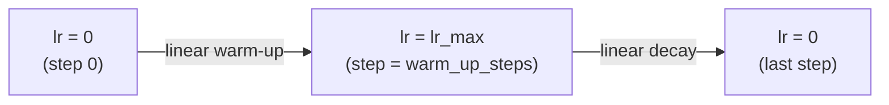

# Fine-tuning transformers for downstream tasks

> **TL;DR.** Fine-tuning takes a model that already understands language (pretrained on billions of tokens) and *gently* nudges its weights to specialize on your task using a small labeled dataset. The recipe: low learning rate (2e-5 to 5e-5), short training (2–4 epochs), linear warmup + decay, and a task-specific head on top. With ~1k labeled examples and 30 minutes on a single GPU, you can turn a generic BERT into a domain-specific sentiment classifier or NER model that beats from-scratch baselines by a wide margin.

A pre-trained transformer has learned general language representations from billions of tokens. Fine-tuning adapts these representations to a specific task by continuing training on a small labeled dataset. It is one of the most practically important skills in applied NLP — the same pre-trained BERT or GPT can be adapted to sentiment analysis, named entity recognition, question answering, or summarization in minutes with a few hundred labeled examples.

## Prerequisites

- [85 — Transformer Training Objectives](./85-transformer-training-objectives.md) — what the model learned during pretraining is what you're carefully *adapting*, not overwriting
- [87 — BERT](./87-bert-encoder-pretraining.md), [88 — GPT](./88-gpt-decoder-only-causal-lm.md), [89 — T5](./89-t5-encoder-decoder-pretraining.md) — the architectures you'll most often fine-tune
- [32 — Optimizers Overview](./32-optimizers-in-deep-learning-why-they-matter.md) and [38 — Adam](./38-adam-optimizer.md) — AdamW is the standard fine-tuning optimizer
- [22 — Early Stopping](./22-early-stopping-in-neural-networks.md) — critical for avoiding overfitting on small labeled sets
- [26 — Weight Decay / L2 Regularization](./26-regularization-weight-decay-l1-and-l2-in-neural-networks.md) — the W in AdamW
- [21 — Improving Neural Network Performance](./21-how-to-improve-neural-network-performance.md) — broader context for the techniques used here

## One-line definition

Fine-tuning initializes a task-specific model from a pre-trained transformer's weights and continues training on a supervised dataset at a low learning rate — preserving the pre-trained knowledge while adapting the representations to the target task.

![BERT fine-tuned for classification — a task-specific head (usually a single Linear layer) is added on top of the [CLS] token representation and trained on labeled data](https://jalammar.github.io/images/BERT-classification-spam.png)
*Source: [Jay Alammar — The Illustrated BERT](https://jalammar.github.io/illustrated-bert/)*

## Why this topic matters

Almost every production NLP system today uses a fine-tuned transformer. Understanding fine-tuning explains why these models generalize from huge corpora to specialized domains, why catastrophic forgetting is a concern, and what hyperparameters matter most. It is also the foundation for understanding parameter-efficient fine-tuning (LoRA, adapters) discussed in the next note.

## Try it interactively

- **[Hugging Face NLP Course — Fine-tuning](https://huggingface.co/learn/nlp-course/chapter3)** — runnable Colabs that fine-tune BERT on real datasets in your browser
- **[Hugging Face AutoTrain](https://huggingface.co/autotrain)** — no-code UI for fine-tuning a transformer on uploaded CSV
- **[Trainer API docs](https://huggingface.co/docs/transformers/main_classes/trainer)** — official `Trainer` interface used by most production fine-tuning
- **[Lit-GPT (Lightning)](https://github.com/Lightning-AI/litgpt)** — modern, scalable fine-tuning recipes for LLaMA-class models including LoRA
- **[Axolotl](https://github.com/OpenAccess-AI-Collective/axolotl)** — config-driven fine-tuning toolkit popular in the open-source LLM community

## A real-world analogy

A pretrained transformer is a **medical school graduate**: they've absorbed an enormous textbook, can speak the language fluently, and have generally good judgment. Fine-tuning is the **residency** for a specialty (cardiology, dermatology). You don't re-teach them anatomy from scratch — you give them a *small* number of supervised cases at low intensity, and they specialize quickly. Catastrophic forgetting is what happens when residency is too aggressive: the doctor learns dermatology but forgets the rest of medicine. The recipe (low LR, warmup, few epochs) is the equivalent of "don't burn out the resident."

## The two adaptation approaches

### Full fine-tuning

Update all parameters of the pre-trained model plus the new task head:

```
PretrainedModel → [All parameters trainable] → Task-specific head
```

- Best performance on the target task
- Requires a GPU — the full model must fit in memory
- Risk of catastrophic forgetting on small datasets (the pre-trained knowledge is overwritten)

### Feature extraction (frozen encoder)

Freeze the pre-trained model, add a head, train only the head:

```
PretrainedModel → [Frozen] → Task-specific head → [Trainable]
```

- Faster, less compute
- Weaker performance (representations not adapted to the task)
- Useful when the dataset is tiny (for example, fewer than 1,000 examples) or the domain is very close to pre-training

In practice, full fine-tuning at a very low learning rate (2e-5 to 5e-5) is almost always better than feature extraction for modern tasks.

## Task-specific heads

Different task types require different heads attached to the transformer output:

| Task | Input to head | Head | Output |
|---|---|---|---|
| Text classification | `[CLS]` vector $(d_{\text{model}},)$ | Linear → softmax | Class distribution |
| Token classification (NER) | All token vectors $(n, d_{\text{model}})$ | Linear (per token) → softmax | Per-token label |
| Extractive QA (SQuAD) | All token vectors | 2 linear layers → start/end logits | Start + end position |
| Regression | `[CLS]` vector | Linear (1 output) | Scalar |
| Seq2seq (summarization) | Encoder output | Decoder + LM head | Token sequence |

## Fine-tuning recipe

The standard recipe for BERT-style models:

```
1. Load pre-trained model (bert-base-uncased / roberta-base / etc.)
2. Attach task-specific head
3. Train with:
   - Learning rate: 2e-5 to 5e-5
   - Batch size: 16 or 32
   - Epochs: 2–4
   - Warm-up steps: 6–10% of total training steps
   - Linear decay to 0 after warm-up
   - Weight decay: 0.01
   - Gradient clipping: max_norm = 1.0
4. Evaluate on dev set; pick best checkpoint
```

For GPT-style models, the same recipe applies but with a causal LM head or a classification head on the last token.


*Source: [Hugging Face — Transformer training schedules](https://huggingface.co/docs/transformers/main_classes/optimizer_schedules)*

## The learning rate schedule

The warm-up + linear decay schedule is critical for BERT fine-tuning:



**Why warm-up?** Pre-trained weights are well-calibrated. Large early gradients can destroy the pre-trained representations before the model has adapted. Warm-up starts with tiny updates that gradually increase — the model adapts gently.

**Without warm-up**: training often diverges or reaches a bad local minimum in the first few hundred steps.

## Python code: complete fine-tuning pipeline

```python
# pip install transformers datasets evaluate
import torch
import torch.nn as nn
from torch.utils.data import DataLoader, Dataset
from transformers import (
    BertTokenizer, BertForSequenceClassification,
    get_linear_schedule_with_warmup,
    AutoModelForTokenClassification,
)
from torch.optim import AdamW


# ============================================================
# 1. Text Classification Fine-tuning (Sentiment Analysis)
# ============================================================

class SentimentDataset(Dataset):
    def __init__(self, texts, labels, tokenizer, max_length=128):
        self.encodings = tokenizer(
            texts,
            padding=True,
            truncation=True,
            max_length=max_length,
            return_tensors="pt",
        )
        self.labels = torch.tensor(labels)

    def __len__(self):
        return len(self.labels)

    def __getitem__(self, idx):
        return {
            "input_ids":      self.encodings["input_ids"][idx],
            "attention_mask": self.encodings["attention_mask"][idx],
            "labels":         self.labels[idx],
        }


def fine_tune_bert_classifier(
    train_texts, train_labels, val_texts, val_labels,
    model_name="bert-base-uncased",
    num_labels=2,
    num_epochs=3,
    learning_rate=2e-5,
    batch_size=16,
):
    """
    Fine-tune BERT for binary classification.
    Returns the trained model.
    """
    device = torch.device("cuda" if torch.cuda.is_available() else "cpu")
    tokenizer = BertTokenizer.from_pretrained(model_name)

    # Load pre-trained model with classification head
    model = BertForSequenceClassification.from_pretrained(
        model_name, num_labels=num_labels
    ).to(device)

    # Datasets and loaders
    train_dataset = SentimentDataset(train_texts, train_labels, tokenizer)
    val_dataset = SentimentDataset(val_texts, val_labels, tokenizer)
    train_loader = DataLoader(train_dataset, batch_size=batch_size, shuffle=True)
    val_loader = DataLoader(val_dataset, batch_size=batch_size)

    # Optimizer: AdamW with weight decay on non-bias/norm params
    no_decay = ["bias", "LayerNorm.weight"]
    optimizer_groups = [
        {"params": [p for n, p in model.named_parameters()
                    if not any(nd in n for nd in no_decay)],
         "weight_decay": 0.01},
        {"params": [p for n, p in model.named_parameters()
                    if any(nd in n for nd in no_decay)],
         "weight_decay": 0.0},
    ]
    optimizer = AdamW(optimizer_groups, lr=learning_rate)

    # Learning rate schedule: warm-up then linear decay
    total_steps = len(train_loader) * num_epochs
    warmup_steps = int(0.06 * total_steps)
    scheduler = get_linear_schedule_with_warmup(
        optimizer,
        num_warmup_steps=warmup_steps,
        num_training_steps=total_steps,
    )

    # Training loop
    for epoch in range(num_epochs):
        model.train()
        total_loss = 0

        for batch in train_loader:
            batch = {k: v.to(device) for k, v in batch.items()}
            outputs = model(**batch)
            loss = outputs.loss

            optimizer.zero_grad()
            loss.backward()
            torch.nn.utils.clip_grad_norm_(model.parameters(), max_norm=1.0)
            optimizer.step()
            scheduler.step()
            total_loss += loss.item()

        # Validation
        model.eval()
        correct = 0
        with torch.no_grad():
            for batch in val_loader:
                batch = {k: v.to(device) for k, v in batch.items()}
                outputs = model(**batch)
                preds = outputs.logits.argmax(dim=-1)
                correct += (preds == batch["labels"]).sum().item()

        avg_loss = total_loss / len(train_loader)
        acc = correct / len(val_dataset)
        print(f"Epoch {epoch+1}: loss={avg_loss:.4f}, val_acc={acc:.4f}")

    return model, tokenizer


# ============================================================
# Demo with tiny synthetic data
# ============================================================
train_texts = [
    "This movie was fantastic!",
    "I really enjoyed this.",
    "Excellent performance.",
    "Terrible waste of time.",
    "I hated every minute.",
    "Disappointing and boring.",
]
train_labels = [1, 1, 1, 0, 0, 0]

val_texts = ["Great film, highly recommend!", "Awful, do not watch."]
val_labels = [1, 0]

model, tokenizer = fine_tune_bert_classifier(
    train_texts, train_labels,
    val_texts, val_labels,
    num_epochs=2,
)


# ============================================================
# 2. Inference after fine-tuning
# ============================================================
def predict(texts, model, tokenizer, device=None):
    """Run inference on a list of texts."""
    if device is None:
        device = next(model.parameters()).device
    model.eval()
    encoded = tokenizer(
        texts, padding=True, truncation=True, max_length=128, return_tensors="pt"
    ).to(device)
    with torch.no_grad():
        logits = model(**encoded).logits
    probs = logits.softmax(dim=-1)
    preds = preds = logits.argmax(dim=-1)
    return preds.tolist(), probs.tolist()


preds, probs = predict(["I loved this!", "This was terrible."], model, tokenizer)
print(f"\nPredictions: {preds}")   # [1, 0]
print(f"Probabilities: {[[f'{p:.3f}' for p in row] for row in probs]}")


# ============================================================
# 3. Feature extraction (frozen encoder)
# ============================================================
from transformers import BertModel

class FrozenBertClassifier(nn.Module):
    """BERT encoder frozen — only the head is trained."""

    def __init__(self, num_labels=2):
        super().__init__()
        self.bert = BertModel.from_pretrained("bert-base-uncased")
        # Freeze all BERT parameters
        for param in self.bert.parameters():
            param.requires_grad = False
        # Only the head is trainable
        self.head = nn.Sequential(
            nn.Dropout(0.1),
            nn.Linear(768, num_labels),
        )

    def forward(self, input_ids, attention_mask):
        with torch.no_grad():
            outputs = self.bert(input_ids=input_ids, attention_mask=attention_mask)
        cls = outputs.last_hidden_state[:, 0, :]   # [CLS]
        return self.head(cls)


frozen_model = FrozenBertClassifier()
trainable = sum(p.numel() for p in frozen_model.parameters() if p.requires_grad)
total = sum(p.numel() for p in frozen_model.parameters())
print(f"\nFrozen BERT: {trainable:,} trainable / {total:,} total params")
# Only ~1,540 parameters (head) are trainable vs 110M in full fine-tuning
```

### Try it yourself: experiments

| Question | Try this |
|----------|----------|
| Effect of learning rate | Train at 1e-3, 1e-4, 2e-5 — only the lowest converges nicely |
| Skip warmup | Set `num_warmup_steps=0` — observe loss spikes / divergence in early steps |
| Frozen vs full fine-tune | Same data, same head — full FT typically beats frozen by 5–10% accuracy |
| Try LoRA | Use `peft` library: `LoraConfig(r=8, target_modules=["query", "value"])` — 100× fewer trainable params, similar accuracy |
| Probe forgetting | After fine-tuning, run zero-shot fill-mask — has it lost general language ability? |
| Layer-wise LR decay | Use lower LR on early layers (preserve general features), higher on late ones — a classic ULMFiT trick |

## Catastrophic forgetting

When fine-tuning on small datasets, the model can "forget" its pre-trained knowledge as it adapts to the new task:

| Symptom | Cause | Fix |
|---|---|---|
| Loss drops fast then performance plateaus | Forgetting general language understanding | Reduce learning rate |
| Fine-tuned model worse than zero-shot GPT | Too many epochs, large LR | Reduce epochs, use warmup |
| Loss is unstable | LR too high without warmup | Add warmup steps |
| Overfitting on 100 examples | Fine-tuning all layers | Freeze lower layers; only fine-tune top layers |

**Gradual unfreezing** (from ULMFiT): fine-tune top layer first, then progressively unfreeze lower layers. This helps preserve general representations in lower layers.

## Fine-tuning vs. from-scratch training

| Approach | Data needed | Training time | Performance |
|---|---|---|---|
| Fine-tune BERT (all layers) | 100–100k examples | Minutes–hours | High |
| Feature extraction (frozen) | 50–10k examples | Seconds–minutes | Moderate |
| Train from scratch | Millions of examples | Days–weeks | Highest (if enough data) |
| Zero-shot (prompt GPT) | 0 examples | Seconds | Varies |

Fine-tuning is almost always the right choice for production NLP with labeled data.

## Cross-references

- **Prerequisite:** [85 — Training Objectives](./85-transformer-training-objectives.md) — what the model learned during pretraining
- **Prerequisite:** [87 — BERT](./87-bert-encoder-pretraining.md), [88 — GPT](./88-gpt-decoder-only-causal-lm.md), [89 — T5](./89-t5-encoder-decoder-pretraining.md) — the models you'll most often fine-tune
- **Related:** Parameter-efficient fine-tuning — LoRA, QLoRA, prompt tuning, adapter modules (separate notes; see [PEFT library](https://github.com/huggingface/peft))
- **Related:** RLHF / DPO — alignment fine-tuning that turns a base LLM into a chat model (different from supervised fine-tuning)

## Interview questions

<details>
<summary>What is catastrophic forgetting and how does it apply to fine-tuning?</summary>

Catastrophic forgetting is when a neural network overwrites previously learned knowledge when trained on a new task. During fine-tuning, if the learning rate is too high or training runs too long, the model updates its weights aggressively to fit the small fine-tuning dataset, destroying the rich language representations built during pre-training. Symptoms: the model fits the fine-tuning data well but fails on out-of-distribution examples that a fresh pre-trained model would handle. Mitigations: low learning rate (2e-5 vs. 1e-3), few epochs (2–4), learning rate warmup, weight decay.
</details>

<details>
<summary>Why use AdamW instead of Adam for fine-tuning transformers?</summary>

Adam modifies the gradient before applying weight decay, which causes weight decay to have different effects on different parameters — biases are barely regularized while large weights are over-regularized. AdamW (Loshchilov & Hutter, 2019) decouples weight decay from the gradient update, applying it directly to the weights: $\theta \leftarrow \theta - \eta \hat{m} / (\sqrt{\hat{v}} + \epsilon) - \eta \lambda \theta$. This gives correct and consistent L2 regularization across all parameters and generally improves fine-tuning performance for transformers.
</details>

<details>
<summary>What is the difference between fine-tuning for classification vs. for generation?</summary>

Classification fine-tuning: adds a linear head on top of the `[CLS]` token (for encoders) or last token (for decoders), trains with cross-entropy loss, produces a probability distribution over a fixed set of classes. Generation fine-tuning: the LM head is already present (it's the pre-training head), trains with teacher-forcing CLM loss, produces a token distribution at each position. Generation fine-tuning can be on instruction-following data (supervised fine-tuning), which teaches the model to follow specific output formats.
</details>

<details>
<summary>Scenario: you fine-tune BERT on 500 labeled examples. Train accuracy is 100% by epoch 2, but validation accuracy collapses by epoch 4. What's happening and how do you fix it?</summary>

Classic overfitting on a small dataset. With 500 examples and 110M parameters, the model has vastly more capacity than data. By epoch 2 it has memorized the training set; by epoch 4 it's diverging away from generalizable features.

Fixes, ordered by typical effectiveness:

1. **Reduce epochs to 2** with proper early stopping on validation loss (not accuracy).
2. **Smaller model**: distilBERT (66M) often beats BERT-base on small datasets because there's less to overfit.
3. **Stronger regularization**: weight decay 0.01 → 0.1, dropout 0.1 → 0.2.
4. **Freeze lower layers**: only fine-tune the top 4-6 layers. Lower layers preserve general features.
5. **Cross-validation**: 500 examples deserves k-fold validation to get reliable estimates.
6. **Data augmentation**: back-translation, synonym replacement, or simply paraphrasing existing examples.
7. **LoRA**: drop trainable params from 110M to ~1M; the inductive bias of low-rank updates reduces overfitting.

The deeper lesson: fine-tuning hyperparameters scale with data size. The "2-4 epochs at 2e-5" recipe assumes 10K+ examples. With 500, both numbers should drop.
</details>

<details>
<summary>Scenario: a team reports their fine-tuned BERT works well, but in production it fails on ~30% of queries that contain emojis. What's the likely cause?</summary>

Two layered issues:

1. **Tokenizer mismatch**: BERT's WordPiece tokenizer doesn't have emoji tokens. Most emojis become `[UNK]`, dropping semantic content. If training data didn't include emoji-heavy text, the model never learned that `[UNK]` carries meaningful signal.
2. **Distribution shift**: the fine-tuning dataset was probably curated clean text. Production users write emoji-rich, informal, or code-switched text. The model has never seen these patterns and behaves erratically.

Fixes:

- **Switch to a byte-level BPE model** (RoBERTa, DeBERTa, modern LLMs) which can encode emojis as multi-byte sequences without `[UNK]`.
- **Augment fine-tuning data** with emoji-containing examples (or synthetic ones).
- **Add a preprocessing step** that converts emojis to text descriptions ("😂" → "[joy_emoji]") before tokenization, mapping the production distribution to the training distribution.

The deeper issue is that **validation set ≠ production distribution**. If you're not monitoring production performance with confusion-matrix-by-input-category, you'll miss this kind of failure.
</details>

<details>
<summary>Why does ULMFiT's "gradual unfreezing" (unfreeze last layer, train, then unfreeze next, etc.) work better than just unfreezing everything from step one?</summary>

The intuition is that pretrained layers represent a *hierarchy* of features (surface → syntax → semantics — see [BERT layer analysis](./87-bert-encoder-pretraining.md)). Lower layers contain the most reusable features; they should change *least* during fine-tuning. Upper layers are most task-specific and need the most adaptation.

When you unfreeze everything at once, gradients flow through *all* layers simultaneously. Early in training, the head produces noisy signal, which propagates as noise into every layer — including the precious lower ones. By the time the head stabilizes, lower layers may have already drifted.

Gradual unfreezing fixes this:

1. Train only the head until it produces stable gradients.
2. Unfreeze the top transformer layer; train.
3. Unfreeze the next layer down; train. And so on.

By the time lower layers see gradient signal, the upstream layers are already adapted and the gradients are informative rather than noisy.

In modern practice, this trick has been partly displaced by **layer-wise learning rate decay**: assign smaller learning rates to deeper-in-the-stack layers (3× smaller per layer down, say). Same intuition, different mechanism, easier to implement. Both work; both are documented to beat naïve full fine-tuning on small datasets.
</details>

<details>
<summary>Scenario: a teammate insists on training BERT fine-tuning for 20 epochs because "more training = better." How do you respond?</summary>

Fine-tuning is not a from-scratch training regime — the principle "more training = better" doesn't apply. Specifically:

1. **Overfitting risk scales with epochs** on labeled data: BERT's 110M params can memorize most small/medium datasets within 3-4 epochs. After that, validation loss climbs while training loss falls.
2. **Catastrophic forgetting**: extended training at the fine-tuning LR (2e-5) is small per step but cumulative. By epoch 10-20, the model's general language knowledge starts degrading; by epoch 20 it may be worse than zero-shot on out-of-distribution examples.
3. **The original BERT paper** explicitly recommends 2-4 epochs based on extensive sweeps. RoBERTa, ELECTRA, T5 — all follow similar recommendations.

Counterevidence the teammate might point to:

- For **larger datasets** (1M+ examples), 5-10 epochs can be warranted because each example is seen less often.
- For **task-adaptive pretraining** (Gururangan 2020) — continue MLM pretraining on domain text before fine-tuning — longer is fine because it's the same pretraining objective.
- For **distillation**, longer training is sometimes useful.

But for vanilla supervised fine-tuning on 1K-100K examples: 2-4 epochs is the right answer. Show them the validation loss curve to make the point concrete.
</details>

<details>
<summary>What's the difference between *supervised fine-tuning* and *instruction tuning* and *RLHF*? Aren't they all "fine-tuning"?</summary>

They're three stages with different objectives that often run sequentially in modern LLM training:

1. **Supervised fine-tuning (SFT)**: train on (input, output) pairs with standard cross-entropy. For BERT-style: classification labels. For LLMs: high-quality demonstrations.
2. **Instruction tuning**: a *kind* of SFT specifically on instruction-format data (e.g., "Translate this: ... → translated text"). The dataset spans many tasks; the model learns to follow natural-language instructions.
3. **RLHF (Reinforcement Learning from Human Feedback)**: uses a reward model trained on human preference rankings, then optimizes the LLM with PPO/DPO to produce outputs the reward model rates high. Quite different mechanically — gradient comes from the reward, not from a fixed target.

In practice, modern chat models go: pretrained base → SFT on instructions → RLHF or DPO. Each stage builds on the last; you can't skip pretraining and directly do RLHF on random weights.

Practical implication: when someone says "fine-tuning an LLM for production," ask which kind. For task-specific outputs (classification, summarization), SFT is enough. For chat-like behavior or alignment with preferences, you need the full stack.
</details>

<details>
<summary>Scenario: your fine-tuned model achieves 90% accuracy on the validation set, but customers complain it confidently produces wrong answers. What's going wrong?</summary>

This is **miscalibration** — high accuracy with wrong confidences. Several causes:

1. **Cross-entropy training maximizes likelihood, not calibration**: a model can be right 90% of the time but say 99% confidence on every prediction. Confidently wrong is the failure mode.
2. **Label noise in training data**: even 5% noisy labels can teach the model to be confident on wrong answers (because the loss for matching the wrong label is the same as matching a correct one).
3. **Distribution shift**: customers feed slightly different inputs than the validation set; the model's confidence calibration is only valid on the training distribution.

Diagnostic: compute Expected Calibration Error (ECE) — bin predictions by confidence and check whether each bin's accuracy matches its average confidence.

Fixes:

- **Temperature scaling**: a one-parameter post-hoc fix (Guo et al. 2017) that divides logits by a learned temperature on the validation set. Often improves ECE 5-10×.
- **Label smoothing during training**: replace one-hot labels with soft targets (e.g., 0.9 / 0.1 instead of 1 / 0). The model learns to be less overconfident.
- **Ensembling**: average predictions from multiple fine-tuned models; their disagreement provides calibrated uncertainty.
- **Selective prediction**: only return a prediction when confidence > threshold; route lower-confidence queries to a human or a larger model.

This is why many production NLP systems use confidence thresholds, not just argmax — the model is rarely well-calibrated out of the box.
</details>

<details>
<summary>Why use a small batch size (16-32) for fine-tuning when bigger batches typically help in deep learning?</summary>

Larger batches generally provide better gradient estimates and faster wall-clock training. But for transformer fine-tuning, several factors push smaller:

1. **Stochastic gradient noise is regularizing**: smaller batches inject more noise per step, which acts like implicit regularization — helpful when overfitting is a concern with small datasets.
2. **Learning rate scales with batch size**: bigger batches need bigger LRs to maintain effective update magnitude. At fine-tuning LRs (2e-5), this scaling pushes you into ranges that destabilize training.
3. **Memory pressure**: BERT-large at sequence length 512 uses substantial VRAM per example. Batch size 32 may already fill an A100.
4. **Linear-warmup schedule was tuned at batch=16-32** in the original BERT paper. Deviating from this batch size requires re-tuning warmup steps and LR.

For very small datasets (under 1000 examples), batch=8 sometimes wins. For very large datasets and large models, batch=64-128 with proper LR scaling works fine. The "16-32" recommendation is a sweet spot for the typical fine-tuning regime, not a hard rule.

Modern alternative: **gradient accumulation** lets you simulate batch=128 on a small-batch GPU by accumulating gradients across 8 forward passes before stepping. Same effective batch size, different memory profile.
</details>

<details>
<summary>What is "task-adaptive pretraining" (TAPT) and when should you use it?</summary>

TAPT (Gururangan et al. 2020) is a step *between* generic pretraining and task-specific fine-tuning: continue the pretraining objective (MLM for BERT, CLM for GPT) on text from your *target domain* before fine-tuning on labeled data.

Workflow:

1. Start with pretrained BERT.
2. Run MLM training on a large corpus of *domain* text (medical papers, legal documents, customer reviews) — no labels needed.
3. Fine-tune on your small labeled task dataset.

Why it works: the gap between pretraining corpus (Wikipedia + Books) and target domain (e.g., medical records) is bridged by domain MLM. The model learns domain-specific vocabulary and patterns without needing labels.

When to use:

- Target domain is *significantly* different from pretraining (medical, legal, financial, very informal social media, code).
- You have a lot of unlabeled domain text (~1GB+) but limited labeled data.
- Existing models trained on your domain (BioBERT, LegalBERT, CodeBERT) aren't available or don't match your specific niche.

When not to use:

- Target domain is "general web English" (already in pretraining).
- You have abundant labeled data (just fine-tune directly).
- Compute is limited (TAPT takes 10-100 GPU hours).

Modern alternative for LLMs: continued pretraining (CP) on domain data, then SFT. Same idea, applied at LLM scale. This is how domain-specific models like Med-PaLM and BloombergGPT are built.
</details>

<details>
<summary>Scenario: you have 50 labeled examples but need a domain classifier. Is fine-tuning still the right approach?</summary>

50 examples is borderline. Several approaches to consider:

1. **Few-shot prompting with a large LLM**: 50 examples easily fit in GPT-4's context. Build a few-shot prompt with 10-20 examples and run inference. No training needed.
2. **Zero-shot classification with NLI-tuned models** (`bart-large-mnli`): cast classification as entailment, no labels needed at all. Won't match a fine-tuned model with thousands of labels, but often beats a 50-example fine-tune.
3. **Sentence-BERT + k-NN**: embed your 50 examples with a sentence encoder, classify new inputs by nearest-neighbor in embedding space. No training, surprisingly strong baseline.
4. **LoRA fine-tuning**: if you really want to fine-tune, LoRA on a smaller model (DistilBERT) reduces overfitting risk vs full fine-tuning of BERT-base.
5. **Active learning loop**: use the model's uncertainty to pick the next 50 examples to label. After 200-500 labels, regular fine-tuning becomes viable.

For 50 examples, options 1-3 typically beat option 4. The threshold where vanilla fine-tuning becomes the right choice is usually 500-1000 examples for a 2-class problem, 5000+ for many-class problems.
</details>

<details>
<summary>Why is "freeze the embedding layer" a common fine-tuning trick? When does it help?</summary>

The embedding layer is large (vocab × $d_{\text{model}}$, often ~25M params for BERT) but represents the most general features — what words mean. Token meanings shouldn't change much during fine-tuning on a small dataset.

Freezing the embedding layer:

- **Reduces parameter count** to update by ~25%.
- **Prevents drift** on rare vocabulary words that don't appear in fine-tuning data (their embeddings could drift in unhelpful directions due to weight decay).
- **Speeds up training** (fewer parameters to compute gradients for).
- **Slightly reduces overfitting** on small data.

When it helps: small datasets, when vocabulary in fine-tuning data is a small subset of the model's full vocab, or when memory is constrained.

When it doesn't: large datasets where embedding adaptation provides clear benefit, or when fine-tuning corpus has domain-specific vocabulary (medical, legal) where embedding adjustment is exactly what's needed.

This generalizes: in deep models, you can often freeze the bottom 25-50% of the network at marginal cost. The boundary between "frozen vs trainable" is a key fine-tuning hyperparameter.
</details>

<details>
<summary>For instruction tuning a 7B-parameter LLM, how do you choose between full fine-tuning, LoRA, and QLoRA?</summary>

Decision tree based on resources and goals:

- **Full fine-tuning (FFT)**: needs 80GB+ VRAM for 7B in float16, more for AdamW state. Multi-GPU (4× A100 80GB minimum) or DeepSpeed/FSDP sharding. Use when you have hardware and want absolute best quality.
- **LoRA**: train rank-8 to rank-64 low-rank adapters on attention layers. ~1-3% of FFT memory; can run on a single 24GB GPU. Quality is typically 95-98% of FFT for instruction tuning. Default choice for most teams.
- **QLoRA**: load base model in 4-bit, train LoRA on top. ~10-15GB VRAM for 7B. Runs on consumer GPUs (RTX 3090/4090). Slight quality drop from quantization but enables home-lab fine-tuning.

Quality-vs-cost summary for 7B instruction tuning:

- FFT: 100% quality, 100% cost.
- LoRA: 96-98% quality, 5% cost.
- QLoRA: 92-96% quality, 1-2% cost.

For most production use cases: LoRA. For research / cutting-edge benchmarks: FFT. For hobbyist / single-GPU: QLoRA.

This is a fast-moving area; see [91 — LoRA](./91-parameter-efficient-fine-tuning-lora.md) for the deep dive.
</details>

## Points to remember

- Fine-tuning is *adaptation*, not training. Treat pretrained weights as fragile and protect them with low LR (2e-5 to 5e-5), warmup, and short training (2-4 epochs).
- AdamW + 6% linear warmup + linear decay is the standard recipe. Deviating without a reason usually causes problems.
- Full fine-tuning beats feature extraction in most settings, but the gap narrows with very small datasets (under 500 examples).
- Catastrophic forgetting is real: too many epochs or too-high LR can destroy general language understanding.
- Task-specific head matters: `[CLS]` linear for classification, per-token for NER, start/end logits for extractive QA, LM head for generation.
- For small datasets: freeze embedding layer, freeze lower transformer layers, or use LoRA — all reduce overfitting.
- Layer-wise LR decay (smaller LR for deeper layers) is a robust improvement over uniform LR for transformer fine-tuning.
- Batch size 16-32 is the sweet spot — bigger needs LR re-tuning, smaller helps with very tiny datasets.
- AdamW (decoupled weight decay) is mandatory; vanilla Adam with weight decay does the wrong thing for transformer fine-tuning.
- For LLM instruction tuning, LoRA beats full fine-tuning in cost-effectiveness; QLoRA enables consumer-GPU training.
- Production calibration ≠ training accuracy. Temperature scaling, label smoothing, or selective prediction is usually needed.
- Domain mismatch (medical, legal, code, social media emoji) often requires task-adaptive pretraining (TAPT) *before* fine-tuning.

## Further reading

- [Hugging Face — NLP Course: Fine-tuning](https://huggingface.co/learn/nlp-course/chapter3) — runnable end-to-end Colab walkthroughs
- [Sebastian Raschka — Practical Tips for Fine-tuning LLMs](https://magazine.sebastianraschka.com/p/practical-tips-for-finetuning-llms) — empirical guidance on LR, batch size, and LoRA hyperparameters
- [arXiv: ULMFiT (Howard & Ruder 2018)](https://arxiv.org/abs/1801.06146) — the gradual-unfreezing recipe that informed all later work
- [arXiv: Don't Stop Pretraining (Gururangan et al. 2020)](https://arxiv.org/abs/2004.10964) — task-adaptive and domain-adaptive pretraining
- [arXiv: AdamW (Loshchilov & Hutter 2019)](https://arxiv.org/abs/1711.05101) — decoupled weight decay, the optimizer that became standard
- [arXiv: On Calibration of Modern Neural Networks (Guo et al. 2017)](https://arxiv.org/abs/1706.04599) — why fine-tuned classifiers are miscalibrated and how to fix it
- [Hugging Face PEFT library docs](https://huggingface.co/docs/peft) — LoRA, prefix tuning, adapters, and the modern PEFT stack
- [Lightning AI — Finetuning LLMs guide](https://lightning.ai/pages/community/lora-insights/) — practical insights on LoRA rank, target modules, and merging

## Common mistakes

- Using the same learning rate as pre-training (1e-4) for fine-tuning — too high, causes instability and forgetting
- Not using a learning rate scheduler — fine-tuning benefits greatly from warmup + linear decay
- Training without weight decay (`optimizer = Adam(params, lr=2e-5)` — use `AdamW` and `weight_decay=0.01`)
- Not separating no-decay parameters (biases and LayerNorm weights should have zero weight decay)

## Final takeaway

Fine-tuning is the bridge from pre-trained language model to production NLP application. Load the pre-trained model, attach a task-specific head, and train at a low learning rate with warmup. Full fine-tuning outperforms feature extraction in almost all settings. The key hyperparameters are learning rate (2e-5 to 5e-5), warm-up steps (6% of total), and number of epochs (2–4). When data is very limited or compute is constrained, parameter-efficient methods (LoRA, adapters) are the alternative.

## References

- Devlin, J., et al. (2019). BERT: Pre-training of Deep Bidirectional Transformers. NAACL.
- Howard, J., & Ruder, S. (2018). Universal Language Model Fine-tuning for Text Classification (ULMFiT). ACL.
- Loshchilov, I., & Hutter, F. (2019). Decoupled Weight Decay Regularization (AdamW). ICLR.
