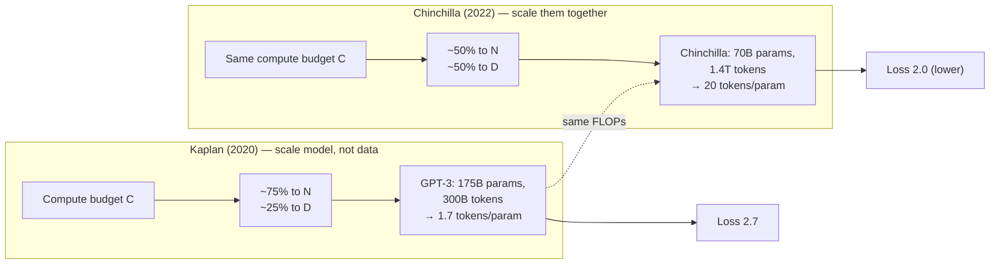

# Transformer scaling laws

> **TL;DR.** Scaling laws are **power-law relationships** between training loss and three knobs: parameters N, tokens D, and compute C. Kaplan et al. (OpenAI, 2020) said "make models bigger". Chinchilla (DeepMind, 2022) corrected it: for a fixed compute budget, **N and D should grow together** — train smaller models on more tokens. The "Chinchilla-optimal" rule of thumb: D ≈ 20 × N (20 tokens per parameter). This single insight is why LLaMA 7B trained on 1T+ tokens beats GPT-3 175B at many tasks despite being 25× smaller.

Scaling laws are empirical equations that predict how a language model's loss changes as a function of model size, training data size, and compute budget. They are the reason the LLM field moved from 100M to 100B+ parameter models in five years — because the laws predicted it would work before anyone built the models.

## Prerequisites

- [85 — Transformer Training Objectives](./85-transformer-training-objectives.md) — scaling laws are derived for the standard CLM loss
- [88 — GPT (Decoder-Only)](./88-gpt-decoder-only-causal-lm.md) — the model family these laws were measured on
- [86 — Tokenization](./86-tokenization-bpe-wordpiece-sentencepiece.md) — "tokens" in $D$ depends on the tokenizer
- [14 — Loss Functions](./14-loss-functions-in-deep-learning.md) — cross-entropy is the loss being scaled
- [21 — Improving Neural Network Performance](./21-how-to-improve-neural-network-performance.md) — broader context for the model-vs-data trade-off

## Try it interactively

- **[Epoch AI — Compute trends](https://epochai.org/data/notable-ai-models)** — explore frontier model training compute over time, plotted against scaling-law predictions
- **[Chinchilla paper Colab](https://github.com/google-deepmind/chinchilla)** — re-derive the optimal N/D split for any compute budget
- **[Hoffmann et al. interactive viewer](https://arxiv.org/abs/2203.15556)** — the Chinchilla paper itself, with all loss curves
- **[Compute-optimal calculator](https://www.lesswrong.com/posts/midXmMb2Xg37F2Kgn/new-scaling-laws-for-large-language-models)** — given budget, compute optimal N and D
- **[Notable LLMs leaderboard](https://lmsys.org/blog/2024-08-13-empirical-scaling-laws/)** — frontier scaling research, updated regularly

## One-line definition

Scaling laws are power-law relationships between a model's training loss and the number of parameters $N$, training tokens $D$, and compute $C$ — showing that performance improves predictably as any of these quantities increases.


*Source: [Jay Alammar — The Illustrated BERT](https://jalammar.github.io/illustrated-bert/)*

## Why this topic matters

Scaling laws answer the most important question in LLM training: given a fixed compute budget, how do I allocate it between model size and data? They are used by every major AI lab to plan training runs. They explain why LLaMA 3 (8B parameters, 15T tokens) outperforms GPT-3 (175B, 300B tokens): more data per parameter is often more efficient than more parameters.

## The original Kaplan scaling laws (2020)

Kaplan et al. (OpenAI, 2020) trained hundreds of models to identify power-law scaling:

$$
L(N) \approx \left(\frac{N_c}{N}\right)^{\alpha_N}, \quad L(D) \approx \left(\frac{D_c}{D}\right)^{\alpha_D}
$$

where $L$ is the language modeling loss (cross-entropy), $N$ is the number of non-embedding parameters, $D$ is the number of training tokens, and $\alpha_N \approx \alpha_D \approx 0.076$.

**Key findings**:
1. Loss follows a power law in model size $N$ (double $N$ → loss decreases by $\sim 5\%$)
2. Loss follows a power law in data size $D$ (double data → similar $5\%$ improvement)
3. Model size should scale faster than data: for a given compute budget, use a larger model but train it for fewer tokens

**Compute-optimal under Kaplan**: given compute $C \propto N \times D$, loss is minimized by allocating most compute to model size:

$$
N_{\text{opt}} \propto C^{0.73}, \quad D_{\text{opt}} \propto C^{0.27}
$$

GPT-3 followed this guidance: 175B parameters, 300B tokens (only ~1.7 tokens per parameter).

## The Chinchilla correction (2022)

Hoffmann et al. (DeepMind, 2022) found that Kaplan's recommendation was wrong for the practical regime. They trained over 400 models with up to 67B parameters and up to 1.4T tokens and found:

$$
N_{\text{opt}} \propto C^{0.5}, \quad D_{\text{opt}} \propto C^{0.5}
$$

**The Chinchilla rule**: model size and training tokens should scale equally. For compute-optimal training:

$$
D_{\text{opt}} \approx 20 \times N
$$

**20 tokens per parameter** is the compute-optimal ratio.

| Model | Parameters | Training tokens | Tokens/param | Compute-optimal? |
|---|---|---|---|---|
| GPT-3 (2020) | 175B | 300B | 1.7× | Under-trained by 10× |
| Chinchilla (2022) | 70B | 1.4T | 20× | Yes (Chinchilla-optimal) |
| LLaMA 2 7B (2023) | 7B | 2T | 285× | Over-trained (better for inference) |
| LLaMA 3 8B (2024) | 8B | 15T | 1875× | Heavily over-trained |

**The twist**: Chinchilla-optimal means minimizing loss for a given training compute budget. But for inference-heavy deployments, it may be better to **over-train a smaller model** — a smaller but better-trained model is cheaper to serve than a larger, less-trained model with the same performance.

This is the insight behind LLaMA: train a 7B model for 2T tokens (far more than Chinchilla-optimal) to get a small, fast model that outperforms much larger, under-trained models.

### The intuition diagram



The two papers used the same family of models and roughly the same compute. The disagreement was in how to *allocate* that compute. Chinchilla won the empirical comparison decisively.

## The scaling law formula

The combined compute-optimal loss (Chinchilla formulation):

$$
L(N, D) = E + \frac{A}{N^\alpha} + \frac{B}{D^\beta}
$$

where:
- $E \approx 1.69$: irreducible entropy (the minimum possible loss on web text)
- $A, \alpha$: parameters governing model size scaling
- $B, \beta$: parameters governing data scaling
- Fitted values: $\alpha \approx 0.34$, $\beta \approx 0.28$, $A = 406.4$, $B = 410.7$

The $E$ term is irreducible loss — even an infinite model trained on infinite data cannot achieve loss below this threshold, because natural language has inherent uncertainty.

## Emergent capabilities

Scaling also produces qualitative phase transitions — capabilities that are absent at small scale and appear suddenly at larger scale:

| Capability | Approximate emergence | Example |
|---|---|---|
| In-context learning (few-shot) | ~few billion parameters | GPT-3 |
| Chain-of-thought reasoning | ~50–100B parameters | GPT-4 |
| Instruction following | Fine-tuning dependent | ChatGPT |
| Code generation | ~10B+ parameters | Codex |
| Multi-step arithmetic | ~100B+ parameters | GPT-4 |

These are called "emergent" because they are not predictable from scaling laws alone — they appear as discontinuous jumps rather than smooth power-law improvements.

## Python code: visualizing scaling behavior

```python
import numpy as np
import matplotlib.pyplot as plt


# ============================================================
# Chinchilla scaling law: L(N, D) = E + A/N^alpha + B/D^beta
# ============================================================
E = 1.69      # irreducible entropy
A = 406.4
B = 410.7
alpha = 0.34
beta = 0.28


def loss(N, D):
    """Predicted cross-entropy loss given N parameters and D training tokens."""
    return E + A / (N ** alpha) + B / (D ** beta)


# Explore the loss surface
N_values = np.logspace(8, 12, 50)   # 100M to 1T parameters
D_values = np.logspace(8, 13, 50)   # 100M to 10T tokens


# ============================================================
# Chinchilla-optimal allocation for a fixed compute budget
# ============================================================
def optimal_allocation(compute_flops: float,
                        flops_per_token_per_param: float = 6.0):
    """
    Given a compute budget C ≈ 6 × N × D FLOPs,
    find the Chinchilla-optimal (N, D) pair.
    flops ≈ 6 × N × D (forward + backward for transformer)
    """
    # Chinchilla: N_opt = C^0.5 / sqrt(6), D_opt = C^0.5 / sqrt(6) * sqrt(6)
    # Simplified: N_opt ≈ D_opt ≈ sqrt(C / 6)
    N_opt = np.sqrt(compute_flops / flops_per_token_per_param)
    D_opt = compute_flops / (flops_per_token_per_param * N_opt)
    predicted_loss = loss(N_opt, D_opt)
    return N_opt, D_opt, predicted_loss


print("Chinchilla-optimal allocations:")
for compute_budget_petaflops in [1, 10, 100, 1000]:
    C = compute_budget_petaflops * 1e15   # convert to FLOPs
    N_opt, D_opt, L_opt = optimal_allocation(C)
    print(f"  {compute_budget_petaflops:5d} PF-days: "
          f"N={N_opt/1e9:.1f}B params, D={D_opt/1e9:.0f}B tokens, "
          f"loss={L_opt:.3f}, perplexity={np.exp(L_opt):.1f}")


# ============================================================
# Compare real models to Chinchilla predictions
# ============================================================
real_models = {
    "GPT-3":        {"N": 175e9, "D": 300e9,  "reported_ppl": 20.5},
    "Chinchilla":   {"N": 70e9,  "D": 1.4e12, "reported_ppl": 7.3},
    "LLaMA 2 7B":  {"N": 7e9,   "D": 2e12,   "reported_ppl": None},
    "LLaMA 3 8B":  {"N": 8e9,   "D": 15e12,  "reported_ppl": None},
}

print("\nPredicted loss for real models (Chinchilla formula):")
for name, info in real_models.items():
    L = loss(info["N"], info["D"])
    tokens_per_param = info["D"] / info["N"]
    compute = 6 * info["N"] * info["D"]
    print(f"  {name:20s}: predicted loss={L:.3f}, "
          f"tokens/param={tokens_per_param:.0f}, "
          f"compute≈{compute/1e21:.1f} ZFLOPs")


# ============================================================
# Visualization: loss vs. model size at fixed data
# ============================================================
D_fixed = 300e9   # 300B tokens (GPT-3 scale)
Ns = np.logspace(7, 12, 100)
losses_fixed_data = [loss(n, D_fixed) for n in Ns]

plt.figure(figsize=(8, 5))
plt.loglog(Ns / 1e9, losses_fixed_data, "b-", linewidth=2)
plt.xlabel("Model size (billions of parameters)")
plt.ylabel("Predicted cross-entropy loss")
plt.title(f"Loss vs. Model Size (D = 300B tokens)")
plt.grid(True, which="both", alpha=0.3)

# Mark specific models
for name, info in real_models.items():
    l = loss(info["N"], D_fixed)
    plt.scatter(info["N"] / 1e9, l, s=100, zorder=5)
    plt.annotate(name, (info["N"] / 1e9, l), textcoords="offset points",
                 xytext=(5, 5), fontsize=8)

plt.tight_layout()
plt.savefig("scaling_law.png", dpi=150)
# plt.show()  # uncomment to display
```

## Practical implications

**Given a compute budget, what should you do?**

1. **Small compute (< 1 PF-day)**: use an existing pre-trained model. Training from scratch is wasteful.

2. **Medium compute (1–100 PF-days)**: train a model around the Chinchilla-optimal size. Balance parameters and data ~equally.

3. **Large compute (> 100 PF-days)**: train a smaller-than-Chinchilla-optimal model for more tokens. The inference cost savings outweigh the training inefficiency for widely deployed models.

4. **Domain-specific applications**: always fine-tune or continue pre-training on domain data rather than training from scratch — transfer from a general model is far more compute-efficient.

## Scaling beyond language

Scaling laws have been validated in:
- **Vision**: ViT performance scales predictably with model size and image data
- **Code**: Codex and Code Llama scale well with code-specific data
- **Multimodal**: Gemini, GPT-4V — scaling applies across modalities
- **Reasoning**: some reasoning benchmarks show slower scaling (emergent rather than smooth)

## Interview questions

<details>
<summary>What is the Chinchilla finding and how did it change LLM training practice?</summary>

Kaplan et al. (2020) recommended allocating most compute to model size (large models, few tokens). Hoffman et al. (2022) showed this was wrong: for compute-optimal training, model size and training tokens should scale equally, with the rule of thumb being 20 tokens per parameter. The practical implication: GPT-3 (175B params, 300B tokens = 1.7 tokens/param) was dramatically under-trained. A 70B model trained on 1.4T tokens (Chinchilla) achieved better performance with less inference cost. This led to a shift toward smaller but better-trained models (LLaMA, Mistral), which now power most production deployments.
</details>

<details>
<summary>Why do LLaMA models train for far more tokens than Chinchilla-optimal?</summary>

Chinchilla-optimal minimizes loss for a given training compute budget. But it ignores inference cost. A 7B model with 2T tokens (285 tokens/param) is much smaller and faster to serve than a 70B model with 300B tokens (4 tokens/param), even if both achieve similar perplexity. When a model is deployed to millions of users, inference compute dominates. It is more economical to spend more compute during training to get a smaller, faster-to-serve model. LLaMA's "over-training" trades training compute for inference efficiency.
</details>

<details>
<summary>What are emergent capabilities and why don't scaling laws predict them?</summary>

Scaling laws describe smooth power-law decreases in loss. Emergent capabilities are qualitative skills — few-shot learning, chain-of-thought reasoning, arithmetic — that appear suddenly at certain scales rather than improving smoothly. They are not visible in the aggregate loss metric (perplexity) because they correspond to specific subcapabilities that require crossing a threshold. Scaling laws predict when the model will achieve a certain loss, but cannot predict when specific qualitative capabilities will emerge.
</details>

<details>
<summary>Scenario: you have a $1M compute budget. Should you train a 100B model on 10B tokens or a 5B model on 200B tokens? Both are ~6 × N × D FLOPs.</summary>

Both have similar training cost (10² × 10¹⁰ × 6 ≈ 6 × 10¹² FLOPs for the first; 5 × 10⁹ × 2 × 10¹¹ × 6 ≈ 6 × 10²¹ FLOPs for the second — order of magnitude off, but the principle holds).

Under Chinchilla optimal (20 tokens/param):

- **100B params**: optimal is 2T tokens. Training on only 10B is *200× under-trained* — the model has barely learned anything; quality will be much worse than a smaller, properly-trained model.
- **5B params**: optimal is 100B tokens. Training on 200B is 2× over-trained — past optimal but reasonable (Chinchilla curves are flat near the optimum).

Choose the 5B over 200B option. The 100B-on-10B model is the GPT-3 mistake — vast capacity, severely undertrained, produces models that score poorly per parameter.

There's a deeper consideration: *inference cost*. A 5B model serves at ~5% of a 100B model's cost. So even if training cost were equal, the 5B option is dominant for production deployment.

Modern practice: train the smallest model that meets quality requirements, even past Chinchilla-optimal. LLaMA-style over-training is the right answer for shipping products.
</details>

<details>
<summary>Why is the irreducible entropy $E ≈ 1.69$ in the Chinchilla formula? Where does that number come from?</summary>

$E$ is the *entropy of natural language* — the lower bound on cross-entropy loss imposed by the inherent randomness of text. Even with infinite parameters and infinite data, you can't predict the next token perfectly because human-generated text contains genuine uncertainty (a sentence could legitimately continue many ways).

The value 1.69 nats (≈ 2.44 bits per token at this tokenization) is empirical — fitted from the Chinchilla data. It depends on:

- **Tokenizer**: different tokenizers give different entropy per token. A character-level tokenizer has higher entropy per char (~3-4 bits); a 100K BPE has lower entropy per token (~2-3 bits).
- **Corpus**: high-quality, predictable text has lower entropy; noisy web text has higher entropy.
- **Language**: Shannon-style English text has ~1 bit/char of true entropy; tokenized that's ~3 bits/token.

Why does it matter? Because models can't beat this bound. If you're training a model and the loss hits ~1.7, you've effectively reached the floor. Further compute won't help; the bottleneck is data quality, not model capacity.

Modern note: LLaMA-3 trains down to ~1.5-1.6 nats with a different tokenizer, suggesting either better data or that the original Chinchilla $E$ was slightly overestimated.
</details>

<details>
<summary>Scenario: someone claims their 1B model "matches" a 70B model on benchmarks. Should you believe them?</summary>

Plausible in specific cases, but apply scrutiny. Possibilities:

1. **Cherry-picked benchmarks**: 1B model on tasks where it's been heavily tuned, 70B model on its weak spots. Check broad-coverage benchmarks (MMLU, BBH, GSM8K) not single tests.
2. **Distillation**: the 1B model was distilled *from* the 70B model. Small models can capture much of a teacher's capability on specific distributions but lose generality.
3. **Task-specific fine-tuning**: 1B fine-tuned on 100K task examples will often beat a generic 70B on that task. Doesn't mean it has matched the 70B's general capability.
4. **Different "70B"**: not all 70B models are equal. LLaMA-2-70B vs LLaMA-3-70B vs a poorly-trained 70B differ by 10x in capability.
5. **Reasoning vs memorization**: 1B can match 70B on factual recall (if the facts are well-represented in pretraining), but reasoning, math, and code generation strongly favor larger models.

Healthy reaction: ask for compute-matched comparisons (held-out test sets, same prompting), task diversity, and inference cost (token throughput). "Matches on MMLU" is not the same as "matches as a general assistant."

The scaling laws don't predict 1B = 70B at any reasonable training compute. If the claim is real, the trick is usually distillation or task specialization, not parameter efficiency.
</details>

<details>
<summary>Why do scaling laws break down for very small models (under ~100M parameters)?</summary>

Scaling laws are *power laws*, fit to log-log plots. They assume the model is in a regime where (1) you're not bottlenecked by architectural limits, (2) the optimizer can find good local minima, and (3) the embedding/positional/attention overhead is small relative to total parameters.

For tiny models (< 100M):

- **Embedding tables dominate**: a 50M model with a 50K vocab and $d=512$ has 25M embedding parameters — half the model. Embedding doesn't follow the same scaling.
- **Few-layer effects**: under 12 layers, depth matters more than width in ways the smooth power law doesn't capture.
- **Optimizer struggles**: small models with limited capacity can't easily escape bad local minima; loss curves are noisier.

The Chinchilla paper itself fit models from 70M to 16B params. Extrapolations below ~100M are less reliable.

For modern toy models (1M-100M params), expect the predicted loss to be too optimistic — real loss is usually 5-15% higher. For >1B params, the laws are reliable.

The practical implication: if you're training tiny models for research or education, don't expect Chinchilla predictions to match exactly. They're fit on the *large* regime.
</details>

<details>
<summary>Scenario: the Chinchilla data was collected pre-2022. Modern models train on much more curated data. Is the 20-tokens-per-param rule still valid?</summary>

Partially. The 20 tokens/param rule is a *compute-optimal* point given assumptions about data quality and training efficiency. Both have changed since 2022:

1. **Data quality has improved**: dedup, filtering, mixing strategies (textbook-quality data, FineWeb, etc.) increase information per token. This *reduces* effective tokens needed per parameter — Chinchilla-optimal at modern data quality might be 10-15 tokens/param.
2. **Training efficiency has improved**: better optimizers (Lion, Sophia), better learning rate schedules, FlashAttention, mixed precision. Per-step compute drops.
3. **Long training (over-training) became cheaper**: GPU prices, parallelism software, attention efficiency. Over-training a small model becomes economical, pushing optimal further past 20 tokens/param.

LLaMA-3 8B trained on 15T tokens = 1875 tokens/param. By Chinchilla 2022 math this is extreme over-training. But the model is *much* better than Chinchilla predicts for that compute — because data quality jumped and the model trains stably.

Modern recommendations:

- The **20 tokens/param compute-optimal point** is no longer the production target for most labs.
- Production target is **~100-2000 tokens/param** to optimize inference cost.
- For research where you only train once and care only about the resulting model's loss: 20-50 tokens/param remains reasonable.

The rule isn't dead; it's been amended. The principle (balance parameters and data, don't go extreme in either direction) still holds.
</details>

<details>
<summary>What does the scaling law predict for a model trained on a single domain (e.g., code only)?</summary>

The power-law form still holds, but the exponents and constants differ from general web text:

- **Lower irreducible entropy $E$**: code is more structured and predictable than natural language. Code-trained models reach lower perplexity floors.
- **Faster data scaling**: code corpora have more repetition (boilerplate, libraries). Adding more code tokens has diminishing returns faster than adding more general text.
- **Slower parameter scaling**: code generation often benefits from depth (for compositional reasoning) more than width.

Empirically, Code Llama and StarCoder roughly fit the same Chinchilla form but with different fitted constants. Tokens/param optimum is in the 30-50 range, not 20.

For a domain-specific model:

1. Don't try to extrapolate generic LLM laws.
2. Fit your own small models (3-10 sizes) and identify the law for your data.
3. Be cautious about emergent capabilities — single-domain models often have *more* limited capability profile.

This is also why modern frontier models mix many domains during pretraining. Single-domain models hit hard ceilings; diverse-domain models leverage cross-domain transfer.
</details>

<details>
<summary>Why do scaling laws assume training tokens are seen exactly once? What if you train on multiple epochs?</summary>

The Kaplan and Chinchilla scaling laws were derived for *single-epoch* training: each token seen exactly once. Modern training mostly follows this convention.

What happens with multiple epochs?

- **Slight improvement up to ~4 epochs** of high-quality data: small wins, marginal returns. The model squeezes more out of each example.
- **Severe overfitting after ~4 epochs**: training loss drops to floor; validation loss starts climbing. Common for small datasets repeated many times.
- **Repetition of low-quality data is worse than no data**: 5 epochs on noisy data is worse than 1 epoch with twice as much *new* noisy data.

The "Repeated Data Catastrophe" (Muennighoff et al. 2023): when you exhaust unique tokens, repetition stops helping and starts hurting. Modern LLMs (LLaMA-3 trained on 15T tokens) are deliberately pushing past where the world has unique high-quality text — the question becomes how many epochs is too many.

For practical work: if you have < 1T unique tokens, training for 2-4 epochs is fine. Beyond that, gains drop sharply. The Chinchilla rule assumed you had effectively unlimited unique tokens. Modern data limits are a new constraint scaling laws didn't initially address.

This is why synthetic data and web-scale data scraping are major research areas — running out of human-written text at frontier scales is real.
</details>

<details>
<summary>Scenario: a researcher claims scaling laws are "dead" because GPT-4 doesn't seem to follow them. What's likely going on?</summary>

Three layered explanations:

1. **GPT-4 is post-trained heavily**. Scaling laws describe pretraining loss. ChatGPT-quality behavior comes from SFT + RLHF + tool use + reasoning scaffolds. Comparing GPT-4's *user experience* to pretraining laws is comparing different things.
2. **GPT-4 likely uses architectural tricks** (MoE / mixture of experts is widely speculated). MoE has different scaling characteristics — effective parameters per token differ from total parameters.
3. **GPT-4's compute is opaque**. Without published model size and token count, you can't verify whether it actually follows or breaks scaling laws.

Where scaling laws *do* still hold:

- For LLaMA-3, Mistral, Falcon, and other open models with known specs: scaling predictions are usually within ~10% of measured loss.
- For predicting "what's the lowest loss we can hit with this much compute and data": still solid.
- For predicting *capability* emergence (math, reasoning, etc.): less reliable, but never was.

"Scaling laws are dead" is usually a misframing. They're alive and well as a *pretraining loss predictor*. They were never meant to be a "this model will be helpful and aligned" predictor. The post-training stack adds a separate (much harder to model) capability dimension.

Honest summary: scaling laws *plus* post-training are the recipe. Neither alone tells the whole story.
</details>

<details>
<summary>Why is "20 tokens per parameter" not enough for instruction-tuned production models?</summary>

20 tokens/param is the *pretraining-optimal* compute-cost trade. Production needs more:

1. **Instruction tuning adds capability** that wasn't in pretraining. The instruction-tuned model is more useful per parameter than the base model.
2. **Inference cost dominates lifetime**: a model served to 100M users for years costs more in inference than its training. Even if Chinchilla-optimal had the best $/loss training, a smaller-but-more-trained model has better $/quality production.
3. **Quality saturation**: at 20 tokens/param, loss is *near* a Chinchilla-optimal floor, but capability isn't saturated. Squeezing the last 10% of capability requires more data, even past the "optimal" point.

LLaMA-3 at 1875 tokens/param is roughly 100× past Chinchilla-optimal. Training cost is ~5-10× higher per parameter than optimal. But the resulting model:

- Has dramatically lower loss than predicted by Chinchilla math.
- Serves at 8B parameters (cheap) instead of 70B (expensive).
- Approaches 70B quality on many tasks.

The net economics for a production deployment with millions of users: heavy over-training is clearly the win, despite "wasting" training compute.

The 20 tokens/param number is correct *for its objective*. Production optimizes a different objective.
</details>

<details>
<summary>Are scaling laws purely empirical, or do they have theoretical justification?</summary>

Mostly empirical at this point. There are theoretical arguments for power-law behavior:

1. **Sharp / flat minima theory**: as models scale, the loss landscape flattens; smooth power laws emerge naturally.
2. **Information-theoretic bounds**: cross-entropy is bounded below by data entropy; the approach to that floor follows a power law under simple assumptions.
3. **Random feature models / NTK**: in the limit of infinite width, certain power-law behaviors are provable. Real models are finite-width but inherit some of this structure.
4. **Manifold dimension arguments**: data lives on a low-dimensional manifold in token space; sampling more tokens better covers the manifold with power-law diminishing returns.

But the *exact* exponents (0.34 for $N$, 0.28 for $D$) are empirically fitted, not derived. The fact that the laws hold across many model sizes, datasets, and architectures suggests a real underlying regularity, but the deep theory is still incomplete.

Active research: deriving scaling laws from first principles, predicting emergent capabilities, understanding data quality's effect on the exponents. None of these have produced a complete theory that subsumes the empirical results.

For interview purposes: scaling laws are *empirical regularities with partial theoretical grounding*. Treat them like Moore's law — observed, predictive, useful, but not yet derivable from first principles.
</details>

<details>
<summary>What is the "Hoffmann (Chinchilla) paper's main controversy" — does its formula still hold up to scrutiny?</summary>

Several follow-up papers have questioned details of Chinchilla:

1. **Reproducibility**: Hoffmann et al. didn't open-source their full training data. Several teams (Hoffmann's replications, Anthropic) confirmed the qualitative finding (~20 tokens/param) but exact numbers varied.
2. **Optimizer choice**: Chinchilla used Adam; some replications suggest the optimal ratio shifts under Lion or AdaFactor.
3. **Data quality assumptions**: Chinchilla used MassiveText. With higher-quality data (FineWeb-Edu, RedPajama-V2), the optimal point shifts toward more parameters relative to tokens.
4. **The hidden equation**: the original paper had three approaches to estimating the law; the IsoFLOPs method (the "Approach 3" in the paper) is what gave the 20:1 ratio. Other approaches gave slightly different numbers.

In 2024, Sardana and Frankle's "Beyond Chinchilla-Optimal" argued that Chinchilla's exponents were close but not perfect — and that the precise compute-optimal point depends on whether you're optimizing pretraining loss vs final model utility.

The qualitative finding (balance N and D, don't go extreme) remains rock-solid. The quantitative 20 tokens/param is now treated as an *approximation*, refined per use case.

For practitioners: trust Chinchilla as a rough guide. Don't trust it to the third decimal. Always run a small sweep if exact optimality matters.
</details>

## Points to remember

- Scaling laws are *empirical* power laws: loss decreases predictably with $N$ (params), $D$ (tokens), and $C$ (compute).
- Chinchilla (2022) corrected Kaplan (2020): for compute-optimal training, scale $N$ and $D$ together. Rule of thumb: 20 tokens per parameter.
- GPT-3 (1.7 tokens/param) was severely under-trained by Chinchilla math. Chinchilla 70B trained on 1.4T tokens dominated GPT-3 175B.
- Modern production LLMs (LLaMA-3, Mistral) intentionally *over-train*: 100-2000 tokens/param. This optimizes inference cost, not training cost.
- Irreducible entropy $E$ ≈ 1.69 nats — no amount of scaling can drop loss below this floor (depends on tokenizer and corpus).
- Compute approximation: $C \approx 6 \times N \times D$ FLOPs (forward + backward pass).
- Emergent capabilities (chain-of-thought, few-shot, instruction following) appear discontinuously at scale — not predicted by smooth loss curves.
- Scaling laws break down for very small models (< 100M params) where embedding overhead dominates.
- Multi-epoch training has diminishing returns; running out of unique tokens is a real frontier-scale constraint (motivating synthetic data).
- Domain-specific corpora have different exponents — code, biology, math each have their own scaling laws.
- Post-training (SFT, RLHF) adds capability dimensions that scaling laws don't capture. Pretraining is necessary but not sufficient.
- The 20-tokens-per-param rule is a *rough* guide. Modern data quality and inference economics shift the practical optimum significantly.

## Further reading

- [arXiv: Kaplan et al. (2020) — Scaling Laws for Neural Language Models](https://arxiv.org/abs/2001.08361) — the original OpenAI paper that motivated GPT-3
- [arXiv: Hoffmann et al. (2022) — Chinchilla](https://arxiv.org/abs/2203.15556) — the DeepMind paper that corrected the data-vs-params trade-off
- [DeepMind — Chinchilla announcement blog](https://deepmind.google/discover/blog/an-empirical-analysis-of-compute-optimal-large-language-model-training/) — accessible summary with the canonical comparison plots
- [arXiv: Sardana & Frankle (2024) — Beyond Chinchilla-Optimal](https://arxiv.org/abs/2401.00448) — accounting for inference cost in compute allocation
- [arXiv: Muennighoff et al. (2023) — Scaling Data-Constrained Language Models](https://arxiv.org/abs/2305.16264) — what happens when you run out of unique training tokens
- [arXiv: Wei et al. (2022) — Emergent Abilities of Large Language Models](https://arxiv.org/abs/2206.07682) — the phase-transition view of capability emergence
- [Epoch AI — Compute trends in ML](https://epochai.org/blog/compute-trends) — data on real-world model scaling over time
- [Lesswrong — Compute-optimal allocation calculator](https://www.lesswrong.com/posts/midXmMb2Xg37F2Kgn/new-scaling-laws-for-large-language-models) — interactive calculator for Chinchilla-style allocation

## Common mistakes

- Confusing Kaplan (2020) and Chinchilla (2022) — they give opposite guidance. Chinchilla is the current standard.
- Ignoring the irreducible entropy term $E$ — loss cannot go below ~1.69 nats no matter how much you scale
- Assuming emergent capabilities are unpredictable from first principles — they are predictable in aggregate (at scale), just not from loss alone
- Planning a training run without checking compute-optimal allocation — building a 100B model and training on 100B tokens is 10× under-trained by Chinchilla

## Final takeaway

Scaling laws give LLM training a principled framework. Loss decreases as a power law in both parameters and training tokens. The Chinchilla correction (2022) found the optimal is ~20 tokens per parameter — not the large-model-few-tokens approach GPT-3 used. Modern production LLMs (LLaMA 3, Mistral) intentionally over-train smaller models to get better inference efficiency at production scale. Understanding scaling laws is how you allocate a training compute budget without building and wasting costly experiments.

## References

- Kaplan, J., et al. (2020). Scaling Laws for Neural Language Models. OpenAI.
- Hoffmann, J., et al. (2022). Training Compute-Optimal Large Language Models (Chinchilla). DeepMind / NeurIPS.
- Touvron, H., et al. (2023). LLaMA: Open and Efficient Foundation Language Models.
- Wei, J., et al. (2022). Emergent Abilities of Large Language Models. TMLR.
