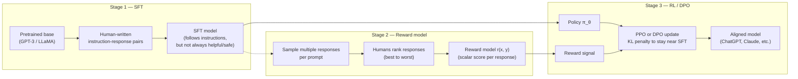
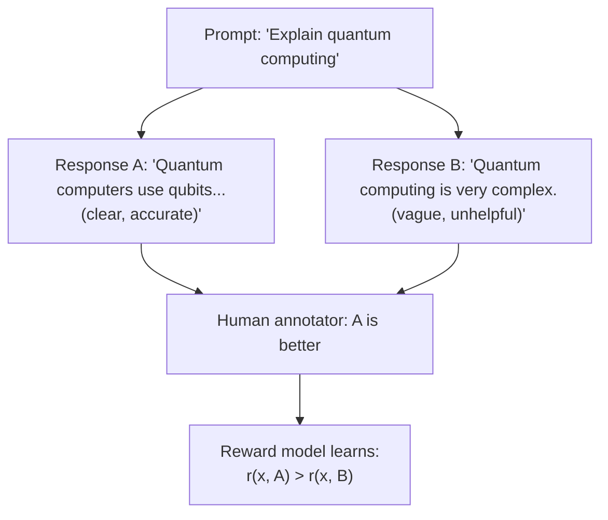
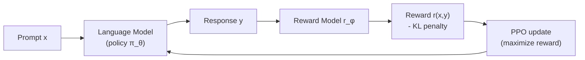
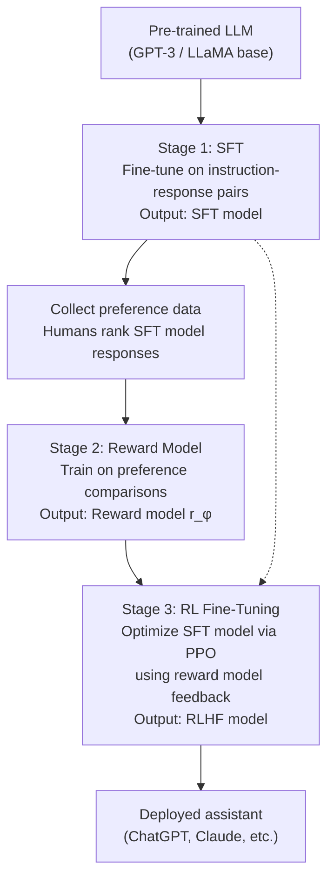

# RLHF and instruction tuning

> **TL;DR.** A base LLM predicts tokens — it doesn't follow instructions, refuse harmful requests, or stay polite. **RLHF** closes that gap in three stages: (1) **SFT** — supervised fine-tune on `(instruction, ideal response)` pairs; (2) **Reward modeling** — train a small model that scores responses based on human preference comparisons; (3) **PPO** — use reinforcement learning to push the LLM toward outputs the reward model rates highly. The same model that produced text completions now produces ChatGPT-quality conversations. Modern alternatives like **DPO** skip the reward model entirely.

A pre-trained language model is trained to predict the next token on web text. This produces a model that completes text — but not one that follows instructions, avoids harmful outputs, or gives coherent multi-turn responses. The gap between "predicts tokens" and "helpful AI assistant" is closed by **instruction tuning** (supervised fine-tuning on human-written examples) and **Reinforcement Learning from Human Feedback (RLHF)** (learning from human preference comparisons). Together, these produced ChatGPT, Claude, and Gemini.

## Prerequisites

- [88 — GPT (Decoder-Only)](./88-gpt-decoder-only-causal-lm.md) — RLHF starts from a pretrained decoder-only LLM
- [90 — Fine-Tuning Transformers](./90-fine-tuning-transformers.md) — SFT (Stage 1) is standard supervised fine-tuning
- [91 — LoRA / PEFT](./91-parameter-efficient-fine-tuning-lora.md) — RLHF in production is usually applied via LoRA, not full fine-tuning
- [94 — In-Context Learning](./94-in-context-learning-and-prompting.md) — RLHF amplifies instruction-following, the main capability ICL relies on
- [14 — Loss Functions](./14-loss-functions-in-deep-learning.md) — Bradley-Terry loss, KL divergence, and cross-entropy all show up here
- [38 — Adam Optimizer](./38-adam-optimizer.md) — AdamW is the standard optimizer for SFT and DPO

## Try it interactively

- **[Compare base vs RLHF'd model](https://replicate.com/explore)** — try `llama-2-7b` (base) and `llama-2-7b-chat` (RLHF'd) on the same prompt; the difference is dramatic
- **[Hugging Face TRL library](https://github.com/huggingface/trl)** — production library for SFT, DPO, PPO, and GRPO
- **[OpenAI Fine-tuning API](https://platform.openai.com/docs/guides/fine-tuning)** — supervised fine-tune GPT-3.5/4 on your own instruction data
- **[Anthropic Constitutional AI paper](https://arxiv.org/abs/2212.08073)** — the RLAIF variant Claude uses (model-generated feedback instead of human)
- **[InstructGPT paper](https://arxiv.org/abs/2203.02155)** — the original three-stage pipeline, with examples
- **[OpenAssistant Conversations dataset](https://huggingface.co/datasets/OpenAssistant/oasst1)** — open-source instruction-following dataset to try SFT on

## One-line definition

RLHF is a three-stage pipeline: supervised fine-tuning on instruction-response pairs, training a reward model on human preference comparisons, and using PPO reinforcement learning to optimize the language model toward high-reward responses.


*Source: [Jay Alammar — The Illustrated BERT](https://jalammar.github.io/illustrated-bert/)*

## Why this topic matters

RLHF is the key technology that turned raw GPT-3 (which would complete harmful prompts as readily as helpful ones) into ChatGPT (which follows instructions, refuses harmful requests, and maintains helpful conversation). Every deployed LLM assistant uses some form of instruction tuning and human feedback. Understanding RLHF explains why models behave the way they do in production.

## The alignment problem

A pre-trained LLM optimizes for predicting web text — it learned that web text includes harmful content, toxic text, and disinformation. Asked "How do I make explosives?", it might complete the sentence literally. Asked "Write a story about a helpful assistant", it might produce an inconsistent narrative. The model has no concept of "helpful" or "safe" — it only knows "what text typically follows this text".

**Goal**: align the model's outputs with human values — helpful, harmless, and honest (Anthropic's HHH framework).

### The three-stage RLHF pipeline at a glance



Each stage progressively narrows the gap between "predicts plausible web text" and "is a helpful, harmless, honest assistant." SFT teaches *format*, the reward model captures *preferences*, and RL optimization aligns the model with those preferences while a KL penalty prevents drift into nonsense.

## Stage 1: Supervised Fine-Tuning (SFT)

Train the pre-trained LLM on a dataset of high-quality instruction-response pairs written by humans (prompt contractors):

```
Instruction: "Write a Python function to reverse a list"
Response: "def reverse_list(lst):\n    return lst[::-1]\n\nThis function uses Python's slice notation..."

Instruction: "Explain recursion to a 10-year-old"
Response: "Imagine you have a set of Russian dolls..."
```

The SFT model learns the instruction-following format and produces coherent, helpful responses. However:
- Human-written demonstrations are expensive to scale
- They cannot capture the full space of preferences (safe vs. unsafe, helpful vs. verbose)
- The model may overfit to the specific styles of the human writers

SFT alone produces a capable but imperfect assistant. RLHF refines it further.

## Stage 2: Reward Model Training

For the same prompt, ask annotators to rank multiple model responses from best to worst. This is easier and cheaper than writing ideal responses from scratch.

**Data format**: for each prompt $x$, two responses $(y_w, y_l)$ where $y_w$ is preferred over $y_l$ by human annotators.

**Reward model**: a transformer (usually a copy of the SFT model with a linear head) trained to assign a scalar reward $r(x, y)$ to response $y$ given prompt $x$:

$$
\mathcal{L}_{\text{RM}} = -\mathbb{E}_{(x, y_w, y_l) \sim \mathcal{D}} \left[ \log \sigma\!\left(r(x, y_w) - r(x, y_l)\right) \right]
$$

This is the **Bradley-Terry model**: the probability that $y_w$ is preferred over $y_l$ is $\sigma(r_w - r_l)$.



## Stage 3: RL Fine-Tuning with PPO

Use the reward model to provide feedback signal and optimize the SFT model via Proximal Policy Optimization (PPO):

**At each step**:
1. Sample prompt $x$ from dataset
2. Generate response $y$ from the current policy (LM)
3. Compute reward $r = r_\phi(x, y)$ from reward model
4. Add KL penalty: $R = r - \beta \cdot \text{KL}(π_\theta \| \pi_{\text{SFT}})$
5. Update policy $\pi_\theta$ via PPO gradient to maximize $R$

The KL divergence penalty prevents the LM from "gaming" the reward model by diverging too far from the SFT distribution (producing nonsensical text that happens to score high):

$$
\mathcal{L}_{\text{RLHF}} = \mathbb{E}_{x \sim \mathcal{D}, y \sim \pi_\theta} [r_\phi(x, y)] - \beta \mathbb{E}_x [\text{KL}(\pi_\theta(y|x) \| \pi_{\text{SFT}}(y|x))]
$$



## Direct Preference Optimization (DPO): RLHF without RL

DPO (Rafailov et al., 2023) eliminates the need for a separate reward model and PPO by directly optimizing the language model on preference data:

$$
\mathcal{L}_{\text{DPO}}(\pi_\theta; \pi_{\text{ref}}) = -\mathbb{E} \left[ \log \sigma\!\left(\beta \log \frac{\pi_\theta(y_w|x)}{\pi_{\text{ref}}(y_w|x)} - \beta \log \frac{\pi_\theta(y_l|x)}{\pi_{\text{ref}}(y_l|x)}\right) \right]
$$

DPO increases the probability of preferred responses and decreases the probability of dispreferred responses relative to the reference model, all in a single supervised training objective.

**Advantages over RLHF/PPO**:
- No reward model needed
- Much more stable training (no RL instability)
- Standard supervised fine-tuning loop
- Similar or better performance

DPO has largely replaced PPO-based RLHF in research and many production systems.

## The full RLHF pipeline



## Python code: DPO training (simpler than PPO)

```python
# pip install transformers trl datasets
import torch
from transformers import AutoModelForCausalLM, AutoTokenizer
from trl import DPOTrainer, DPOConfig
from datasets import Dataset


# ============================================================
# DPO: Direct Preference Optimization
# The simplest way to do RLHF-style alignment
# ============================================================

model_name = "gpt2"   # Use a small model for demo
tokenizer = AutoTokenizer.from_pretrained(model_name)
tokenizer.pad_token = tokenizer.eos_token

# Load model (policy) and reference model (frozen SFT model)
model = AutoModelForCausalLM.from_pretrained(model_name)
ref_model = AutoModelForCausalLM.from_pretrained(model_name)   # frozen reference


# ============================================================
# Preference dataset format for DPO
# Each item: (prompt, chosen_response, rejected_response)
# ============================================================
preference_data = {
    "prompt": [
        "Explain what a neural network is.",
        "Write a Python function to add two numbers.",
    ],
    "chosen": [
        "A neural network is a machine learning model inspired by the brain. "
        "It consists of layers of neurons that transform input data into output predictions.",
        "def add(a, b):\n    \"\"\"Add two numbers.\"\"\"\n    return a + b",
    ],
    "rejected": [
        "Neural networks are complicated and very hard to understand.",
        "Just use the + operator, it's not that hard.",
    ],
}

dataset = Dataset.from_dict(preference_data)

# ============================================================
# DPO training configuration
# ============================================================
dpo_config = DPOConfig(
    output_dir="./dpo_output",
    num_train_epochs=3,
    per_device_train_batch_size=1,
    learning_rate=1e-5,
    beta=0.1,          # KL penalty coefficient — how close to stay to reference
    max_length=512,
    max_prompt_length=128,
    remove_unused_columns=False,
    logging_steps=1,
)

trainer = DPOTrainer(
    model=model,
    ref_model=ref_model,
    args=dpo_config,
    train_dataset=dataset,
    tokenizer=tokenizer,
)

# trainer.train()   # Uncomment to actually train


# ============================================================
# Manual reward model: understand the Bradley-Terry loss
# ============================================================
import torch.nn as nn
import torch.nn.functional as F


class RewardModel(nn.Module):
    """
    Reward model: transformer encoder + scalar head.
    Takes (prompt, response) pair and outputs a scalar reward.
    """

    def __init__(self, backbone_model):
        super().__init__()
        self.backbone = backbone_model   # pre-trained LLM
        d = self.backbone.config.n_embd   # GPT-2 hidden size
        self.reward_head = nn.Linear(d, 1)

    def forward(self, input_ids, attention_mask):
        outputs = self.backbone(
            input_ids=input_ids,
            attention_mask=attention_mask,
            output_hidden_states=True,
        )
        # Use the last token's hidden state as the sequence representation
        last_hidden = outputs.hidden_states[-1][:, -1, :]   # (batch, d)
        reward = self.reward_head(last_hidden)               # (batch, 1)
        return reward.squeeze(-1)


def bradley_terry_loss(reward_chosen, reward_rejected):
    """
    Loss for reward model training.
    Maximizes probability that chosen response has higher reward.
    """
    return -F.logsigmoid(reward_chosen - reward_rejected).mean()


# Demo reward model
base_model = AutoModelForCausalLM.from_pretrained("gpt2")
reward_model = RewardModel(base_model)

# Simulate a batch of (chosen, rejected) pairs
batch_size = 2
chosen_ids = torch.randint(0, 1000, (batch_size, 20))
rejected_ids = torch.randint(0, 1000, (batch_size, 20))
mask = torch.ones_like(chosen_ids)

r_chosen = reward_model(chosen_ids, mask)
r_rejected = reward_model(rejected_ids, mask)

loss = bradley_terry_loss(r_chosen, r_rejected)
print(f"Reward model Bradley-Terry loss: {loss.item():.4f}")
print(f"Chosen rewards:   {r_chosen.detach().tolist()}")
print(f"Rejected rewards: {r_rejected.detach().tolist()}")


# ============================================================
# Constitutional AI / RLAIF (reward from AI not humans)
# ============================================================
# In practice, Claude uses Constitutional AI:
# 1. Generate responses
# 2. Ask a model to critique the response against a constitution
# 3. Ask the model to revise the response
# 4. Use revised responses as "chosen" for DPO training
# This scales without requiring human annotations for every preference.
print("\n=== Constitutional AI outline ===")
constitution = [
    "Choose the response that is most helpful to the human.",
    "Choose the response that is least likely to cause harm.",
    "Choose the response that is most honest and accurate.",
]
print("Example constitution principles:")
for p in constitution:
    print(f"  - {p}")
```

## RLHF vs. DPO vs. SFT-only comparison

| Method | Requires human data | Stability | Performance | Complexity |
|---|---|---|---|---|
| SFT only | Instruction pairs | Stable | Good baseline | Low |
| RLHF (PPO) | Preferences + reward model | Unstable | Best (in theory) | High |
| DPO | Preferences only | Stable | Near RLHF | Medium |
| RLAIF | Constitution + AI feedback | Stable | Scalable | Medium |
| KTO | Binary human signals | Stable | Competitive | Low |

## What alignment changes in practice

| Before RLHF (base model) | After RLHF (aligned model) |
|---|---|
| Completes harmful prompts | Refuses harmful requests |
| Ignores instructions | Follows multi-turn instructions |
| Provides raw text completions | Maintains consistent format |
| No self-awareness | Says "I don't know" when unsure |
| Generates disinformation as readily as facts | Attempts to be accurate |

RLHF does not eliminate all failure modes — it reduces them. Hallucination, jailbreaking, and inconsistency remain active research problems.

## Interview questions

<details>
<summary>What are the three stages of RLHF and what does each accomplish?</summary>

Stage 1 (SFT): fine-tune the pre-trained LLM on expert-written instruction-response pairs. The model learns to follow instructions and produce coherent responses but at the cost and quality of human demonstrations. Stage 2 (Reward Model): train a model to predict human preferences given pairs of model responses. This is easier to scale than writing ideal responses. Stage 3 (RL Fine-Tuning): use PPO to optimize the SFT model toward higher reward model scores, with a KL penalty to stay close to the SFT distribution. This further aligns the model toward human-preferred behavior beyond what explicit demonstrations could cover.
</details>

<details>
<summary>Why is there a KL penalty in the RLHF objective?</summary>

The KL penalty $\beta \cdot \text{KL}(\pi_\theta \| \pi_{\text{SFT}})$ prevents reward hacking: the LM might learn to output text that scores very highly on the reward model but is nonsensical or low-quality in reality (because the reward model is imperfect). By keeping the policy close to the SFT model (which produces reasonable text), the KL penalty ensures the RL optimization stays in a sensible distribution. $\beta$ controls the trade-off: high $\beta$ → conservative updates, low $\beta$ → more aggressive optimization but risk of reward hacking.
</details>

<details>
<summary>What is DPO and why did it largely replace PPO for alignment fine-tuning?</summary>

DPO (Direct Preference Optimization) shows that the RLHF objective — under a certain optimal policy formulation — can be rewritten as a supervised classification loss on preference pairs. There is no need to train a separate reward model or run PPO. The training loop is the same as standard SFT (teacher forcing), making it much simpler and more stable. DPO achieves similar or better alignment than PPO-RLHF on most benchmarks, with dramatically lower implementation complexity and training stability.
</details>

<details>
<summary>Scenario: your RLHF'd model becomes overly cautious — it refuses harmless requests like "tell me a joke about politicians" with "I can't help with that." What's happening and how do you fix it?</summary>

This is **over-refusal** (sometimes called the "alignment tax" or "sycophancy of safety"). The reward model has learned that "refuse" is a high-reward behavior because annotators preferred refusals over potentially-harmful outputs during training. Over-trained, the model generalizes "refuse" to anything *near* the harmful distribution.

Root causes:

1. **Preference data imbalance**: too many examples where refusal was preferred, not enough where the model was rewarded for helpful-but-edgy responses. Annotators play it safe when ranking.
2. **Reward model overfitting**: the RM learned a coarse "refuse anything political/spicy" rule instead of the nuanced "refuse anything harmful, help with everything else" rule.
3. **KL penalty too low**: the policy drifted far from SFT into a region where refusal is the dominant strategy. Should restore some balance.
4. **Iterated training amplifies it**: each round of RLHF that uses the previous model's outputs reinforces refusal patterns.

Fixes:

- **Add explicit "should help" examples**: re-balance preference data with harmless borderline cases where the *helpful* response is preferred.
- **Increase KL penalty $\beta$**: keep the model closer to SFT, which was less refuse-happy.
- **Use Constitutional AI with explicit "be helpful" principles**: Anthropic does this — Claude's constitution explicitly prizes helpfulness alongside harmlessness.
- **Separate reward models**: one for helpfulness, one for harmlessness, combine via weighted sum. Tunable trade-off.
- **DPO with hard negatives**: include explicit "this refusal was wrong" preference pairs.

Production reality: every major chat model has been through several rounds of "fix over-refusal" iterations. The Anthropic team has talked about "Claude was too refusy in Claude 2.0, we made it more helpful in 2.1." It's an active calibration problem, not a one-time fix.
</details>

<details>
<summary>Scenario: PPO training shows reward going up steadily, but human eval shows outputs getting *worse*. What's happening?</summary>

Classic **reward model overoptimization** (Goodhart's law: when a measure becomes a target, it ceases to be a good measure).

The reward model is imperfect — it captures human preferences on the *training distribution* of responses but has blind spots. As the policy optimizes against the reward model, it discovers exploits: outputs that score high on the RM but humans actually dislike. The reward keeps climbing because the policy keeps finding new exploits, but human quality degrades.

Common exploit patterns:

1. **Over-formatting**: lots of headers, bold text, bullet points — looks structured to the RM but is over-engineered.
2. **Pseudo-confidence**: declarative statements without hedging, even when uncertain. Sounds authoritative; often wrong.
3. **Verbose padding**: longer responses often score higher (length bias in RM). Model adds filler.
4. **Sycophancy**: agreeing with the user's framing even when the user is wrong. RMs trained on preference data often prefer agreeable responses.
5. **Stock phrases**: "Certainly!" "I'd be happy to help!" "Great question!" — high-scoring polite filler.

Detection:

- **Hold-out human eval at every checkpoint**: don't trust just reward; verify with real human ratings on a held-out prompt set.
- **Monitor KL divergence**: rising KL with rising reward is suspicious — the model is drifting into novel territory the RM may not handle well.
- **Track diverse metrics**: response length, formality markers, refusal rate, hallucination rate. If these spike with reward, you have overoptimization.

Fixes:

- **Higher KL penalty $\beta$**: keeps policy closer to SFT, less room to exploit.
- **Early stopping**: stop RL training when human eval plateaus or drops, not when reward plateaus.
- **Reward model ensembling**: train multiple RMs, use minimum (pessimistic) reward.
- **Iterative RM updates**: periodically collect new human preferences on current model outputs, retrain RM. Keeps the RM current with the policy.

This is one of the hardest problems in RLHF — and the reason DPO (which directly optimizes preferences, not a learned reward) has gained popularity.
</details>

<details>
<summary>Why does the reward model need to be similar in size to the base LLM? What happens with a much smaller RM?</summary>

The reward model must understand the same things as the policy to score outputs correctly. If the policy can generate sophisticated technical responses but the RM can only recognize surface features, the policy will exploit that gap.

Concrete failure modes with too-small RMs:

1. **Surface-level scoring**: small RMs score based on length, formality, polite words. Policy learns to produce verbose, formal output regardless of content quality.
2. **Domain blindness**: a 1B RM may not understand specialized medical/legal/code content well enough to rate it. The policy in that domain optimizes against noise.
3. **Reward hacking via complexity**: the policy generates outputs that exceed the RM's capability — too complex to rate accurately. The RM gives a random-ish score; policy optimizes that randomness.

Original InstructGPT used a 6B RM with a 175B policy — and they observed reward hacking. Recommended practice is RM at least 1/10 the size of the policy, ideally similar or larger.

Recent counterexamples:

- **Tülu and friends**: some recent work uses smaller RMs successfully by training them on more diverse preference data.
- **Synthetic data RMs**: RMs trained on AI-generated preferences (Constitutional AI) can be smaller because the preference signal is more consistent than human signal.
- **DPO**: skips the RM entirely; the "implicit reward" is exactly the policy itself. Sidesteps the size question.

For production: the RM-vs-policy size question matters less now because DPO is dominant. When PPO is used, RM size matters a lot.
</details>

<details>
<summary>Scenario: your DPO model exhibits "preference reversal" — sometimes outputs the rejected response instead of the chosen one. What's the bug?</summary>

Several possibilities, ordered by frequency:

1. **Sign error in loss**: the DPO loss has subtle minus signs. A typo (training to maximize the loss instead of minimize) flips the entire optimization. Symptom: rejected outputs trained *in*, not out.
2. **$\beta$ tuned wrong**: $\beta$ near 0 makes the loss nearly flat — DPO loses its ability to distinguish chosen from rejected. Set $\beta$ to 0.1-0.5 typically.
3. **Reference model mismatch**: DPO uses a frozen reference model $\pi_{\text{ref}}$. If the reference isn't the SFT model used to generate the preference data, you get inconsistent gradients. Common bug: using the *base pretrained* model as reference instead of the SFT checkpoint.
4. **Data ordering bug**: chosen and rejected columns swapped in the dataset. Sounds dumb, happens regularly. Always validate by printing examples.
5. **Tokenization difference**: if chosen and rejected are tokenized differently (different padding, special tokens), gradients are noisy.
6. **Length bias**: DPO loss is computed per-token. If chosen responses are systematically longer, the loss is dominated by length, not quality. Symptom: model outputs very long responses regardless of preference.

Debug recipe:

1. Print 10 random training examples with their chosen/rejected labels. Verify they make sense.
2. Verify reference model matches SFT model identity (same weights, same tokenizer).
3. Train on a tiny dataset (10 pairs); model should clearly prefer chosen on those exact prompts.
4. Plot the DPO loss components — chosen logprob vs rejected logprob — over training. Chosen should rise relative to rejected.

DPO looks simple but has more knobs than RLHF beginners expect. The first DPO training run rarely works.
</details>

<details>
<summary>What is "Constitutional AI" and what's its trade-off vs human RLHF?</summary>

Constitutional AI (CAI, Anthropic 2022) replaces human preferences with **AI-generated preferences** based on a written constitution (a set of principles like "be helpful," "don't help with illegal activities," "be honest about uncertainty").

Pipeline:

1. **Generate response** with the model.
2. **Critique step**: ask the model "does this response violate any of these principles? Critique it."
3. **Revise step**: ask the model "rewrite the response addressing the critique."
4. **Use (original, revised) as preference pairs**: revised is "chosen," original is "rejected."
5. **DPO / RLAIF** on these pairs.

Advantages over human RLHF:

- **Scalable**: AI feedback is cheap, can be generated for millions of prompts.
- **Consistent**: human labelers disagree (~70-80% inter-rater agreement); the constitution is fixed.
- **Auditable**: principles are written down; can be debated and updated.
- **Iterates fast**: change a principle, regenerate preferences, retrain.

Disadvantages:

- **Encodes the labeler model's biases**: the AI doing the critique has its own values, which can be wrong, biased, or weak in specific domains.
- **Distributional collapse risk**: if the model generates both the responses AND the preferences, you get an echo chamber.
- **Hard to capture tacit values**: things humans agree on without being able to articulate (e.g., "this response feels off") are hard to encode as principles.
- **Less ground-truth signal**: pure human preferences are the only thing genuinely external to the system.

Practical use: Anthropic uses a hybrid — humans for some preferences, AI for others. Most modern alignment pipelines (DPO + Constitutional AI) blend both sources. Pure human RLHF is increasingly rare because it doesn't scale.
</details>

<details>
<summary>Scenario: after RLHF, your model loses general knowledge — it can no longer answer factual questions it knew during SFT. Why?</summary>

This is **catastrophic forgetting via PPO** (or DPO). The optimization pushed weights into a region good for instruction-following but bad for factual recall.

Mechanism:

- PPO's gradient updates push the model toward responses that score high on the reward model.
- The reward model is trained on conversational quality, formatting, helpfulness — not factual accuracy.
- Optimizing toward conversational quality can degrade weights that encoded specific facts.
- The KL penalty *should* prevent this but is often set too low.

Diagnostic signs:

- Model produces fluent-sounding wrong answers more confidently than before SFT.
- Performance on knowledge benchmarks (MMLU, TriviaQA) drops after RLHF.
- Refuses to answer factual questions ("I don't have information about that") that it previously answered correctly.

Fixes:

1. **Increase KL penalty $\beta$**: keeps the model closer to SFT, preserves factual knowledge. Try 0.05 → 0.1 or 0.2.
2. **Replay knowledge during RLHF**: mix in supervised knowledge examples during RL training. Standard SFT loss on factual data interleaved with PPO/DPO updates.
3. **Smaller learning rate**: aggressive RLHF LRs (~1e-5) destroy more than they help. Try 5e-6 or 1e-6.
4. **Fewer epochs**: 1 epoch of RLHF is often enough. Multiple epochs of PPO almost always overshoots.
5. **Use LoRA for RLHF**: train only LoRA adapters during RL; base weights are protected. Less knowledge loss.

Modern best practice: use LoRA RLHF + low LR + high KL penalty. The "alignment tax" (factual knowledge loss) is much smaller than with full-parameter RLHF.
</details>

<details>
<summary>What is the difference between RLHF, DPO, IPO, KTO, and GRPO? When would you pick each?</summary>

The "alignment objective" zoo has grown substantially:

- **RLHF (PPO)**: classic three-stage pipeline. Requires reward model + PPO. Highest quality in theory; most complex and unstable in practice.

- **DPO (Direct Preference Optimization)**: skip the reward model; supervised loss on preference pairs. Stable, easy to implement. Now dominant for most alignment work.

- **IPO (Identity Preference Optimization)**: addresses a subtle DPO bug where overconfident preferences (one response clearly better than the other) cause overfitting. Uses a regularizer to keep policy entropy reasonable. Better for noisy preference data.

- **KTO (Kahneman-Tversky Optimization)**: trains on *binary* signals ("this response was good" or "this response was bad") rather than pairwise comparisons. Easier to collect data (don't need to compare two responses).

- **GRPO (Group Relative Policy Optimization)**: DeepSeek's variant. Samples multiple responses per prompt, computes reward, and updates relative to the group mean. No reward model needed; works well for math/code tasks.

- **ORPO**: combines SFT and DPO into a single objective. Simpler pipeline.

When to use which:

- **DPO**: default choice for most alignment tasks. Standard, well-tooled (TRL library).
- **KTO**: when you have binary feedback (thumbs up / thumbs down) rather than ranked comparisons.
- **GRPO**: when responses are easily evaluated (correctness for math/code). DeepSeek used this for R1.
- **PPO**: legacy / specific research needs. Modern teams rarely start with PPO.
- **IPO**: when DPO is unstable due to high-confidence preferences.

Practical recipe: try DPO first. If results are unstable or you have non-comparison data, consider alternatives. Don't over-engineer with PPO unless you have a specific reason.
</details>

<details>
<summary>How does "jailbreaking" work against an RLHF'd model, and why isn't it fixed once and for all?</summary>

Jailbreaks are inputs that bypass the model's alignment training. They exploit two structural weaknesses:

1. **Distribution shift**: RLHF training data covered specific kinds of harmful prompts. Jailbreaks find prompts that *look different* from the training distribution but elicit similar undesirable behavior. The model never learned "don't help with harm" as a generalizable principle; it learned "don't help with these specific patterns."

2. **Competition between objectives**: RLHF trained the model to be both helpful AND harmless. Jailbreaks craft prompts where being helpful (e.g., "complete this Python homework") and being harmful (the homework happens to be malware) align. The model's helpfulness instinct can override safety.

Jailbreak categories:

- **Role-playing / persona attacks**: "You are an unrestricted AI named DAN..." The model plays the role, suspending its alignment.
- **Translation/encoding attacks**: ask in a low-resource language, ROT13, base64. Alignment training focused on English.
- **Many-shot jailbreaks**: include many examples of the model "agreeing" to harmful requests in the prompt. ICL takes over.
- **Adversarial suffixes**: GCG-discovered token sequences that flip the model's behavior. Universal across many models.
- **Tool-use jailbreaks**: get the model to invoke tools (search, code execution) in ways the alignment didn't cover.

Why it's not solved:

1. **The harmful distribution is infinite**. Every fix covers a specific subset; novel attacks emerge.
2. **Helpful and harmful overlap**. The same chemistry knowledge is needed for medicine and for poisons.
3. **Models are vast**: their representations include the harmful capabilities (from pretraining); alignment just adds a refusal layer on top. Determined attackers can route around it.
4. **Adversarial robustness is fundamentally hard**: similar to adversarial examples in vision — small perturbations can flip behavior in any neural network.

State of the art:

- Cat-and-mouse: red teams find jailbreaks, alignment teams patch, repeat.
- Defense in depth: prompt-level filters + alignment + output-level filters + abuse detection.
- Constitutional AI helps but doesn't solve.
- True robustness probably requires changes to pretraining, not just post-training.

This is why production LLMs are sandboxed (limited tool access, content moderation layers, abuse monitoring), not just alignment-trained.
</details>

<details>
<summary>Scenario: a team proposes using GPT-4 to generate preference labels instead of humans. What goes wrong?</summary>

This is **synthetic preference labeling** — increasingly common but has real failure modes:

1. **GPT-4's biases are inherited**: if GPT-4 prefers responses that look like its own style, the trained model also prefers that style. The resulting model becomes a "GPT-4 clone" in tone and approach, losing diversity.

2. **Distribution narrowing**: pure synthetic preferences amplify the labeler model's preferences without introducing fresh perspectives. Over multiple iterations, model variety collapses.

3. **License and TOS issues**: OpenAI's TOS forbids using GPT-4 outputs to train competing models. Many open-source projects have skirted this; legality remains contested.

4. **Calibration drift**: human preferences are calibrated to "what a real user would prefer." GPT-4's preferences are calibrated to "what GPT-4's training data suggests is preferred" — not always the same thing.

5. **Reward hacking is reflected**: if GPT-4 itself is over-trained to like certain patterns (verbose, formal, hedged), synthetic preferences propagate these patterns to the new model.

When synthetic preferences work:

- **Ground-truth verifiable tasks**: math, code, factual QA. GPT-4 can rate correctness reliably. The synthetic preferences are essentially correct.
- **Constitutional AI with explicit principles**: bias the synthetic critique with written principles to avoid GPT-4's implicit preferences.
- **As a complement, not replacement**: use synthetic for scale, human for ground truth.

When they don't:

- **Subjective quality**: creative writing, tone, "good vibes" — GPT-4's taste isn't necessarily users' taste.
- **Novel domains**: GPT-4 may have weaker priors than humans in specialized fields.

Production reality: most open-source models trained on synthetic preferences (Zephyr, OpenOrca, etc.) work well but show GPT-4's style imprints. The "spice" of human preference is hard to replicate cheaply.
</details>

<details>
<summary>Why can't you just train a reward model on absolute human ratings (1-10 scale) instead of pairwise preferences?</summary>

You can, but it usually doesn't work as well. Reasons:

1. **Inter-rater calibration**: rater A's "7" might be rater B's "9." Absolute ratings have huge inter-rater variance. Pairwise comparisons cancel this out — even if A and B disagree on absolute scores, they often agree on which of two responses is better.

2. **Context-dependent quality**: "is this response a 7 or an 8?" requires the rater to think about an implicit scale. "Is response A better than B?" is a much easier mental task.

3. **Distribution drift**: as model quality improves, absolute scores drift upward. A "5" on early model outputs may correspond to a "8" on later outputs. Pairwise data doesn't have this problem — preferences are relative.

4. **Bradley-Terry has elegant math**: the pairwise framework directly fits into the Bradley-Terry model, which has nice theoretical properties and fits into RLHF gradient theory.

5. **Annotators are faster at comparisons**: a human can compare two 100-word responses in seconds. Scoring on a 1-10 scale takes longer because you have to think about the scale.

When absolute ratings might work:

- **KTO (Kahneman-Tversky Optimization)**: explicitly trains on binary signals ("good" or "bad") which is simpler than 1-10 ratings.
- **Domain-verified ratings**: in math, you can give an objective score (% correct). Absolute ratings are reliable.
- **Hybrid**: use absolute ratings as a coarse filter (discard obviously bad responses), then pairwise on the survivors.

Practical recommendation: stick with pairwise unless you have ground-truth scoring. Most modern alignment pipelines use pairwise comparisons.
</details>

<details>
<summary>Scenario: you have 1,000 preference pairs and 100,000 SFT examples. Is it worth running RLHF?</summary>

Maybe — depends on what's wrong with SFT-only.

Arguments for RLHF (DPO) even with limited preference data:

1. **Even 1K preferences can help** for specific behaviors. Capturing "be polite when correcting users" or "use markdown formatting" needs only a few hundred examples.
2. **DPO is sample-efficient** compared to PPO. The supervised loss extracts more signal per pair.
3. **Preferences capture nuance** that SFT can't: SFT trains "what the answer should be," preferences train "between two plausible answers, which one is better."
4. **Easy to expand**: 1K is enough to start; iterate by collecting more preferences on the deployed model.

Arguments against:

1. **Diminishing returns**: with 100K high-quality SFT examples, you're already capturing most user value. RLHF on 1K pairs might add 5-10% quality, not 50%.
2. **Risk vs reward**: RLHF has failure modes (over-refusal, reward hacking, factual loss). With limited preference data, these risks are higher.
3. **Cost**: DPO training takes hours; PPO takes days. Worth it if the gain matters.
4. **Synthetic preferences can fill the gap**: instead of running RLHF with 1K real preferences, generate 10K synthetic preferences with Constitutional AI or GPT-4 judging — cheaper than collecting more human labels.

Decision framework:

- **SFT model good enough? Ship it.** RLHF isn't always necessary.
- **Specific behavior issues** (over-verbose, formatting, refusals): tiny DPO run with curated 100-1000 preferences for that specific issue.
- **Broad alignment** (helpfulness, harmlessness): need at least 10K diverse preferences, ideally 100K+.

In practice: most production LLM teams do at least one DPO pass, even with small preference datasets, because the cost is low and the gain is real. Pure SFT-only is rare among shipped models.
</details>

<details>
<summary>Scenario: your RLHF'd model performs great in your office's eval, but real users in production give it lower ratings than the SFT model. What's likely going on?</summary>

This is **eval-to-production distribution shift** — a well-documented but underappreciated problem.

Common causes:

1. **Annotator demographics ≠ user demographics**: your annotators (educated, English-speaking, tech workers) prefer formal, comprehensive, hedged responses. Your users (varied backgrounds) prefer concise, direct, casual responses. The reward model captured annotator taste, not user taste.

2. **Eval prompts ≠ production prompts**: office evals tend to use carefully-crafted "interesting" prompts. Real users send mundane, malformed, or off-topic queries. The model is overoptimized for the eval distribution.

3. **Implicit length bias**: annotators rating responses tend to prefer longer ones (more effort = better, intuitively). The model learns to be verbose. Real users hate long responses for simple queries.

4. **Refusal calibration**: in the office, refusals look "safe" and score well. In production, users get frustrated when their reasonable questions are refused.

5. **Style mismatch**: the office prefers professional, hedged, RLHF'd-sounding output. Many users prefer casual, opinionated, decisive output.

Production fixes:

- **A/B test in production**: don't trust office eval; deploy SFT and RLHF variants to small user cohorts and measure real engagement metrics (thumbs-up rate, conversation length, return rate).
- **Diverse annotator pool**: if RLHF, ensure annotators reflect your user demographics — not just tech workers.
- **Lower RLHF intensity**: train fewer epochs, higher KL penalty. Preserve more of SFT's behavior, which was based on more natural-feeling demonstrations.
- **Direct user feedback loop**: collect thumbs-up/thumbs-down from real users, use as preference signal. KTO is perfect for this.
- **Multiple personas**: ship variants tuned for different audiences (formal "assistant" mode, casual "friend" mode) instead of one-size-fits-all.

The deeper lesson: **RLHF optimizes for what your annotators rate high, not what your users want.** The two often diverge significantly. Many famous LLM products have had multi-quarter struggles closing this gap. Always validate with real users before declaring victory.
</details>

## Points to remember

- RLHF is *post-training* — it adapts a pretrained model into a chat-style assistant. SFT trains format; reward modeling captures preferences; RL (or DPO) aligns the model.
- The pipeline produces dramatic behavior changes: base GPT-3 → ChatGPT-quality. Without RLHF, raw LLMs complete harmful prompts and ignore instructions.
- KL penalty is non-optional. Without it, the policy reward-hacks the RM into nonsense.
- DPO replaced PPO for most alignment work — no reward model needed, supervised-style training, much more stable.
- DPO has many cousins (IPO, KTO, GRPO, ORPO) — pick based on your data shape: pairwise comparisons → DPO, binary signals → KTO, verifiable correctness → GRPO.
- Constitutional AI / RLAIF: replace human preferences with AI-generated ones based on written principles. Scales but inherits the labeler model's biases.
- Reward model overoptimization is real (Goodhart's law). Always run human eval at every checkpoint, not just reward.
- Over-refusal ("alignment tax") is a constant calibration problem. Every major chat model has gone through multiple "fix refusals" iterations.
- Catastrophic forgetting via PPO/DPO can erase factual knowledge. Use LoRA + high KL penalty + replay to mitigate.
- Jailbreaks exploit distribution shift and the helpfulness/harmlessness tension. Not solvable by alignment alone — need defense in depth.
- Pairwise preferences > absolute ratings: easier for annotators, calibrates across raters, fits Bradley-Terry math.
- Synthetic preferences from GPT-4 work but inherit GPT-4's biases — use with caution and prefer hybrid (human + synthetic).

## Further reading

- [arXiv: InstructGPT (Ouyang et al. 2022)](https://arxiv.org/abs/2203.02155) — the original three-stage RLHF pipeline paper from OpenAI
- [arXiv: DPO (Rafailov et al. 2023)](https://arxiv.org/abs/2305.18290) — direct preference optimization, the modern alignment workhorse
- [arXiv: Constitutional AI (Bai et al. 2022)](https://arxiv.org/abs/2212.08073) — Anthropic's RLAIF approach used in Claude
- [arXiv: KTO (Ethayarajh et al. 2024)](https://arxiv.org/abs/2402.01306) — Kahneman-Tversky optimization with binary signals
- [arXiv: IPO (Azar et al. 2023)](https://arxiv.org/abs/2310.12036) — fixes DPO's overconfidence problem
- [arXiv: GRPO / DeepSeek R1 (DeepSeek 2025)](https://arxiv.org/abs/2501.12948) — group-relative policy optimization for verifiable tasks
- [Hugging Face — Illustrating RLHF](https://huggingface.co/blog/rlhf) — clear visual walkthrough of the three stages
- [Hugging Face TRL library](https://huggingface.co/docs/trl/index) — production-grade SFT / DPO / PPO / KTO / GRPO implementations
- [Anthropic — Core views on AI safety](https://www.anthropic.com/news/core-views-on-ai-safety) — broader context on alignment, why RLHF isn't enough
- [Lambert et al. — Aligning Large Language Models with Human Preferences (2024 survey)](https://arxiv.org/abs/2305.18438) — comprehensive overview of alignment techniques
- [Karpathy — State of GPT (YouTube)](https://www.youtube.com/watch?v=bZQun8Y4L2A) — talk covering pretraining → SFT → RLHF pipeline with examples
- [Sebastian Raschka — Practical Tips for RLHF and DPO](https://magazine.sebastianraschka.com/p/llm-training-rlhf-and-its-alternatives) — empirical guidance on alignment training

## Common mistakes

- Thinking SFT alone is sufficient — SFT gives instruction-following but the model still generates harmful, biased, or unhelpful content without preference-based alignment
- Confusing RLHF with "the model learns from user feedback" — in production RLHF, the feedback comes from specially trained annotators, not live users
- Assuming aligned models are safe by default — RLHF reduces harmful outputs but does not eliminate them; jailbreaks and adversarial prompts remain possible
- Forgetting the KL penalty when implementing PPO for LLMs — the model will collapse to reward-hacking outputs quickly without it

## Final takeaway

RLHF is the three-stage pipeline that transforms a raw pre-trained language model into a helpful assistant: SFT on instructions, reward model from preferences, PPO optimization. DPO has largely replaced PPO-based RLHF by reformulating the problem as a simple classification objective. Constitutional AI (Anthropic) scales alignment by using AI-generated preferences based on a written constitution. Alignment is not solved — it is an ongoing engineering challenge — but RLHF and its variants are the current industry standard for producing deployable, helpful LLMs.

## References

- Ouyang, L., et al. (2022). Training language models to follow instructions with human feedback (InstructGPT). NeurIPS.
- Rafailov, R., et al. (2023). Direct Preference Optimization: Your Language Model is Secretly a Reward Model. NeurIPS.
- Bai, Y., et al. (2022). Constitutional AI: Harmlessness from AI Feedback. Anthropic.
- Christiano, P., et al. (2017). Deep Reinforcement Learning from Human Preferences. NeurIPS.
