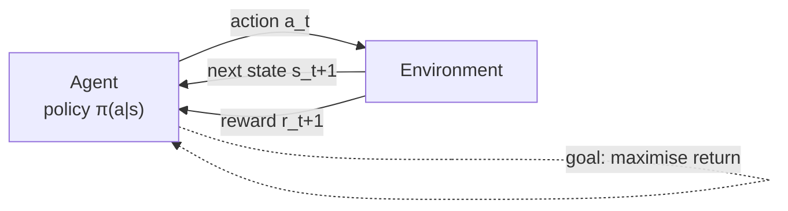

**In one line.** An agent learns by trying things, seeing what score it gets, and doing more of what scored well.

## The idea in plain words

Supervised learning gets told the right answer. Reinforcement learning only gets a **score**, and often long after the decision that earned it.

Three things make it harder than normal machine learning:

- **No labels.** Nobody says "the correct move was left". You only learn that the game ended badly ten moves later.
- **Delayed reward.** The action that caused the loss may be far from the moment you noticed it. Working out which action deserves the blame is called *credit assignment*.
- **You create your own data.** A bad policy visits bad states, collects bad data, and can get stuck there. That is why exploration is a first-class concern.

The vocabulary is small. The **agent** picks an **action**, the **environment** answers with a new **state** and a **reward**, and the agent wants to maximise the **return** — the discounted sum of all future rewards, not just the next one.



## How it works

### What is reinforcement learning?

**RL is reward-based learning.** An agent learns by interacting with an environment. Trying actions, seeing results. Being guided by a numerical reward. It is goal-oriented learning, not a type of neural network but an *approach*.

:::note

**Analogy first.** A child learns to ride a bicycle this way. Nobody hands them the equations of balance. They wobble (action), fall or stay up (reward), and adjust. Thousands of tiny trials, shaped by the reward of staying upright, produce a skilled rider.

:::

#### Run the agent–environment loop

Press **step**: the agent picks an action, the environment returns a new state and a reward, and the cycle repeats. Watch the cumulative reward climb. This loop — state → action → reward → next state — is *all* of RL, repeated.

#### When to use RL

RL fits large environments where: (1) a model is known but no analytic solution exists. (2) only a simulation is available. Or (3) the only way to learn is to interact. Used in autonomous driving, gaming, healthcare.

### RL vs supervised vs unsupervised

All three are machine learning, but they differ in **what they learn from** and **what they learn to do**.

:::note

**Analogy first.** Three ways to learn cooking. Supervised: a chef corrects every move. Unsupervised: you sort ingredients into groups with no goal. RL: you cook, taste the result (reward), and adjust — no one tells you the recipe.

:::

#### Feed the same task to each learner

Click a learning type to see what feedback it gets and what it produces. Notice: only RL learns from a *reward* (a critic), with no correct answer and no labels. And it learns a *sequence of actions*, not a single prediction.

| Criterion | Supervised | Unsupervised | Reinforcement |
| --- | --- | --- | --- |
| Learns from | Labelled data | Unlabelled data | Interaction + reward |
| Supervision | Full | None | Reward only |
| Problems | Regression, classification | Clustering, association | Explore / exploit |
| Algorithms | SVM, KNN, linear reg. | K-means, Apriori | Q-learning, SARSA |
| Aim | Predict outcomes | Find patterns | Learn a series of actions |

### The four characteristics — and credit assignment

RL problems share four features: **no supervision** (only reward), **sequential** decisions, **time matters**, and **delayed feedback**. Together they create the hardest problem in RL: *credit assignment*.

:::note

**Analogy first.** A chess move shows all four. No one tells you the best move. Each move sets up the next. Timing matters. And you only learn a move was bad twenty moves later, when you lose. Linking the late loss back to the early mistake is credit assignment.

:::

#### Assign credit for a delayed reward

A reward arrives only at the *end* of a sequence of moves. Press **propagate** and watch the reward flow backwards, crediting each earlier move by a discounted amount. The discount slider controls how far back the credit reaches — this is the seed of everything to come.

### Elements & the interaction loop

Beyond **agent** and **environment**, an RL system has four sub-elements: a **policy** (what to do), a **reward signal** (the immediate goal), a **value function** (long-term goodness). An optional **model** (for planning).

$$ \pi(a\mid s) = \Pr(A_t = a \mid S_t = s) \qquad\text{at step } t:\; (S_t, A_t)\;\rightarrow\; (S_{t+1},\, R_{t+1}) $$

:::note

**The intuition.** The policy is the agent's *habit* (what to do). The value function is its *judgement* (how good a situation is). The model is its *imagination* (what might happen next). Learning is improving the habit using the judgement.

:::

#### Explore the four elements

Click each element to see its role in a worked vacuum-cleaner agent. Notice the indexing: the reward for action $A_t$ is $R_{t+1}$ — it arrives *with* the next state, one step later. That off-by-one trips up nearly everyone.

### Explore vs exploit

The agent uses the values of states **most of the time** (exploit) and explores the rest of the time. Too much exploiting and it never finds better options; too much exploring and it never cashes in. This tension runs through all of RL.

:::note

**Analogy first.** Your favourite restaurant vs a new one. Always going to the favourite (pure exploit) means you'll never discover a better place. Always trying new ones (pure explore) means you rarely enjoy a known-good meal. You need a balance.

:::

#### Dial the exploration rate $\varepsilon$

Slide $\varepsilon$: with probability $1-\varepsilon$ the agent picks the best-known option (exploit); with probability $\varepsilon$ it tries a random one (explore). Run many choices and watch the trade-off. Too low gets stuck on a mediocre option, too high wastes pulls on bad ones.

### Tic-Tac-Toe & the TD update

Keep a table of board positions, each with a **value** = our estimate of the win probability from there. Wins are 1, losses 0, everything else starts at 0.5. After a greedy move from $S_t$ to $S_{t+1}$, nudge the earlier value toward the later one. That's **temporal-difference learning**.

$$ V(S_t) \;\leftarrow\; V(S_t) \;+\; \alpha\,\big[\,V(S_{t+1}) - V(S_t)\,\big] $$

The bracket is the **TD error**. The surprise between what we expected ($V(S_t)$) and what the next state says ($V(S_{t+1})$). The step size $\alpha$ controls how big a nudge to take.

#### Drive the TD update

Set the before-value $V(S_t)$, the after-value $V(S_{t+1})$, and the step size $\alpha$. The panel computes the TD error and the new value live. Then press **play many games** to watch a state's estimate converge toward the true win probability. And change $\alpha$ to see how fast and how stably.

Estimate over games. Big $\alpha$ jumps fast but jitters; small $\alpha$ crawls but settles.

:::tip

**Worked example — one update.** Before a move, $V(S_t)=0.5$. The move leads to a strong position, $V(S_{t+1})=1.0$, with $\alpha=0.1$. TD error = $1.0 - 0.5 = 0.5$. Scaled nudge = $0.1 \times 0.5 = 0.05$. Update: $V(S_t) \leftarrow 0.5 + 0.05 = \mathbf{0.55}$. The earlier state is now valued higher because it led to a better one.

:::

#### What $\alpha$ controls

**$\alpha \to 0$:** values converge and freeze — best vs a fixed opponent. **$\alpha$ reduced but not 0:** keeps learning a little, can track a changing opponent. **$\alpha$ constant:** always weights recent games, never fully converges but adapts fastest.

**Connection.** This `new ← old + α[target − old]` shape *is* the course. Q-learning, SARSA, and deep RL all update an estimate toward a slightly-better target with a step size.

### Key takeaways

The vocabulary and the first rule — the foundation of the whole course.

- **1 · What RL is** — Goal-oriented learning from interaction and reward. No labels, only a critic — and a sequence of actions, not one prediction.
- **2 · The cast** — Agent + environment, plus policy, reward, value function, model. State $S_t$, action $A_t$, reward $R_{t+1}$ one step later.
- **3 · The TD rule** — $V(S_t)\!\leftarrow\!V(S_t)+\alpha[V(S_{t+1})-V(S_t)]$. Nudge toward the next state; $\alpha$ trades stability for adaptability.

:::note

**The thread.** RL learns good behaviour by trying actions, being scored by reward (often delayed), and nudging value estimates toward what works. The TD update is the seed every later algorithm grows from. Next: the multi-armed bandit, where exploration and exploitation collide head-on.

:::

## A real system that works this way

**Data-centre cooling.** DeepMind's cooling controller is exactly this loop: the state is a few hundred sensor readings, the action is a set-point change, the reward is energy used against a safety envelope. It ran in shadow mode first, then with a human able to veto every action, because a bad action costs real money and real hardware.

**LLM post-training.** The same loop, relabelled: the state is the prompt-so-far, the action is the next token or the whole response, and the reward is a score from a reward model or an automatic checker. Every modern chat model has been through some version of it.

## Code you can run

A tiny environment and a random agent — no libraries needed. Run it and watch the return change as the policy changes.

```python
import random

class Corridor:
    """5 squares. Start at 0, goal at 4. Step cost -1, goal +10."""
    def reset(self):
        self.pos = 0
        return self.pos

    def step(self, action):          # action: 0 = left, 1 = right
        self.pos = max(0, min(4, self.pos + (1 if action else -1)))
        done = self.pos == 4
        reward = 10.0 if done else -1.0
        return self.pos, reward, done

def run_episode(policy, gamma=0.9, max_steps=50):
    env, state, total, discount = Corridor(), None, 0.0, 1.0
    state = env.reset()
    for _ in range(max_steps):
        action = policy(state)
        state, reward, done = env.step(action)
        total += discount * reward       # the return G_0
        discount *= gamma
        if done:
            break
    return total

random_policy = lambda s: random.choice([0, 1])
always_right  = lambda s: 1

print("random :", round(sum(run_episode(random_policy) for _ in range(500)) / 500, 2))
print("right  :", round(run_episode(always_right), 2))
```

The "always right" policy scores far better. Reinforcement learning is the process of *discovering* that policy from the rewards alone.

## Designing with it

**Before you reach for RL, check three things.**

| Question | If the answer is no |
| --- | --- |
| Are decisions **sequential** — does today's action change tomorrow's state? | Use supervised learning or a bandit instead. |
| Can you **simulate**, or do you have logged interactions? | You cannot train safely; start with offline evaluation. |
| Can you write a **reward** you would be happy to have maximised literally? | Fix the reward first; a wrong one will be exploited. |

**Design choices that matter early**

- **Episode boundaries.** What ends an episode? Anything unbounded needs discounting or an explicit time limit, or returns become meaningless.
- **γ (discount).** Low γ = short-sighted and low variance; high γ = far-sighted and noisy. Treat it as a product decision, not a hyperparameter.
- **Reward shaping.** Extra hints speed learning but change what is optimal. Potential-based shaping is the only form that provably keeps the same optimal policy.
- **Safety envelope.** Ship RL behind a rule-based guard that can veto actions. Every production deployment starts in shadow mode.

## Where this stands in 2026

:::info Industry view

- **RLHF and RLAIF** made this loop standard in LLM post-training: the reward model is the environment, the chat model is the agent.
- **Recommenders, ads and pricing** are the biggest non-LLM users, because a click today changes what the user sees tomorrow.
- Most production RL is **offline (batch) RL** on logged data — live exploration on real users is expensive and often unethical.
- Interview-ready framing: no labels, delayed and evaluative feedback, and the agent generates its own non-i.i.d. data.

:::

## Practice questions

Work each one yourself, then reveal the worked answer. Drawn from the Module 1 self-assessment set and the EC-2 / EC-3 exam papers.

<details>
<summary><strong>Q1.</strong> How is reinforcement learning different from supervised and unsupervised learning?</summary>

**Supervised** learning trains on *labelled* (input→correct-output) pairs and the feedback is *instructive* (the right answer is given). **Unsupervised** learning finds structure in *unlabelled* data (clustering, association). **RL** has no labelled dataset: an agent *interacts* with an environment, receives a scalar *reward* (evaluative, not instructive. It tells you how good an action was, not what the best action was). The feedback is *delayed* and the data is *sequential and non-i.i.d.* RL learns a policy that maximises cumulative reward through trial and error.<br /><em>Module 1 review · conceptual</em>

</details>

<details>
<summary><strong>Q2.</strong> “A reward signal defines the goal of a reinforcement learning problem.” Explain in your own words.</summary>

The reward is the only number the environment uses to tell the agent what we *want* — not *how* to achieve it. The agent's sole objective is to maximise the expected cumulative reward (return). So whatever behaviour we wish to encourage must be encoded in the reward; the agent will optimise exactly what is rewarded. Get the reward wrong and you get the wrong goal — the agent pursues the reward, not your intentions.<br /><em>Module 1 review · conceptual</em>

</details>

<details>
<summary><strong>Q3.</strong> What is the exploration–exploitation trade-off? What happens to an agent that *only* explores, or *only* exploits?</summary>

**Exploit** = pick the action currently believed best (maximise immediate estimated reward). **Explore** = try other actions to improve estimates and possibly find something better. A pure exploiter locks onto its first lucky estimate and may never discover the true optimum (stuck in a sub-optimal action). A pure explorer keeps sampling at random and never cashes in on what it has learned, so it accrues low reward. Good learning needs both: explore enough to find the best action, then exploit it.<br /><em>Module 1 review · conceptual</em>

</details>

<details>
<summary><strong>Q4.</strong> What is a *model* of the environment, and how does the solution differ with and without one?</summary>

A model predicts the environment's behaviour — given a state and action it returns the likely next state and reward, i.e. $p(s',r\mid s,a)$. **With a model** you can *plan*: simulate ahead and compute a policy without acting (e.g. dynamic programming, value/policy iteration). **Without a model** (model-free) you must *learn from experience* by sampling real interactions (e.g. Monte Carlo, TD, Q-learning). Model → planning; no model → learning from samples.<br /><em>Module 1 review · conceptual</em>

</details>

<details>
<summary><strong>Q5.</strong> What are different ways the exploration rate $\varepsilon$ can be chosen in $\varepsilon$-greedy?</summary>

**Fixed $\varepsilon$** (e.g. 0.1): constant exploration forever — simple, but never fully commits to the best action.**Decaying $\varepsilon$** (e.g. $\varepsilon_t=1/t$ or schedule): explore a lot early, exploit more later. Good for stationary problems.**$\varepsilon=0$** (greedy): pure exploitation. Only sensible once estimates are reliable.Larger $\varepsilon$ &rarr. More exploration (better for noisy / non-stationary rewards). Smaller $\varepsilon$ → more exploitation (better once confident).<br /><em>Module 1 review Q10 · conceptual</em>

</details>

<details>
<summary><strong>Q6.</strong> In the Tic-Tac-Toe TD rule, what happens if the step size $\alpha$ is (1) reduced to 0, (2) reduced but never 0, (3) kept constant?</summary>

The update is $V(S_t)\leftarrow V(S_t)+\alpha\,[\,V(S_{t+1})-V(S_t)\,]$. **$\alpha\to 0$:** estimates stop changing and converge to fixed values. Good if the opponent is *stationary*. But The agent can no longer adapt.**$\alpha$ reduced but never 0:** (meets the stochastic-approximation conditions) the values converge while still allowing late corrections. Ideal for a fixed opponent.**$\alpha$ constant:** values never fully settle. They keep tracking recent outcomes. Exactly what you want against a slowly-changing (non-stationary) opponent.<br /><em>Session 1 slides · conceptual</em>

</details>

<details>
<summary><strong>Q7.</strong> A health wristband chooses among 3 modes each hour, with rewards depending on activity. (a) Why is RL (not supervised learning) the right fit? (b) Distinguish immediate reward from long-term value.</summary>

**(a)** There is no labelled “correct mode” for each hour. The band only sees a scalar benefit *after* it acts, the choice affects future state (e.g. battery). Feedback is evaluative and delayed. That is sequential decision-making, i.e. RL, not supervised classification. **(b)** Immediate reward is the one-step benefit of the mode chosen this hour. Long-term value is the expected *cumulative* (discounted) reward from this state onward under a policy. A mode with lower immediate reward can have higher value if it leads to better future states.<br /><em>Exam EC-2 Q1(a) · 1.5 marks</em>

</details>

<details>
<summary><strong>Q8.</strong> Define reinforcement learning in your own words, then critically inspect your definition.</summary>

RL is learning *what to do*. How to map situations (states) to actions. So as to maximise a scalar reward signal, by **trial-and-error interaction** with an environment rather than from a labelled dataset. Critique: a complete definition must mention (i) no supervisor, only a reward. (ii) feedback is delayed, not instantaneous. (iii) actions affect future states and rewards (sequential. The credit-assignment problem). (iv) the agent must balance exploration and exploitation. A definition that omits the *sequential/delayed* aspect would fail to distinguish RL from a one-shot bandit or from supervised learning.<br /><em>Module 1 review Q1 · conceptual</em>

</details>

<details>
<summary><strong>Q9.</strong> What are the elements of a reinforcement learning system, and what is each for?</summary>

Beyond the **agent** and **environment**: **Policy** $\pi(a\mid s)$ — the agent's behaviour: a mapping from states to action probabilities. It is what we ultimately want to learn.**Reward signal**. Defines the goal. The immediate, one-step measure of good/bad.**Value function**. Long-run desirability of a state (or state–action): expected cumulative reward. Used to make far-sighted decisions.**Model** (optional) — predicts the environment's next state/reward; enables planning.<br /><em>Module 1 review Q2 · conceptual</em>

</details>

<details>
<summary><strong>Q10.</strong> Which RL elements are vital to defining the RL *problem* versus the *solution*? Why?</summary>

The **problem** is defined by the environment, the **reward signal** (the goal) and the dynamics. Without a reward there is no objective to optimise. The **solution** is the **policy**, usually found via a **value function** (and optionally a model for planning). Reward defines what success means (problem). Policy/value deliver it (solution). Value functions are arguably the most vital solution element, since almost all methods work by estimating values.<br /><em>Module 1 review Q3 · conceptual</em>

</details>

<details>
<summary><strong>Q11.</strong> Identify a problem around you that can be solved with RL and define its RL elements.</summary>

**Example. Smart thermostat.** **Agent:** the thermostat controller.**Environment:** the house + weather + occupants.**State:** current temperature, time of day, occupancy, outdoor temperature.**Actions:** heat / cool / do nothing.**Reward:** +comfort − energy cost (penalise deviation from target and kWh used).**Policy:** rule mapping state to a heating action, learned to maximise long-run comfort per unit energy.Any sequential decision problem with delayed, evaluative feedback fits.<br /><em>Module 1 review Q4 · open-ended (model answer)</em>

</details>

<details>
<summary><strong>Q12.</strong> In the tic-tac-toe TD method, why do we update $V(S_t)$ only for states reached by a *greedy* (exploiting) move, and not for states reached by an exploratory move?</summary>

We want $V$ to estimate the value of states *under the greedy policy* we intend to follow. An exploratory move is deliberately *not* what the policy would normally do. So The state it leads to is not representative of greedy play. Backing its value up would bias the estimates toward the random exploratory behaviour. Updating only after greedy moves keeps $V$ consistent with the policy we are evaluating. (If we *did* learn from exploratory moves too, we'd be estimating the value of the $\varepsilon$-soft policy instead. See Exercise 1.4.)<br /><em>Module 1 review Q11(a) · conceptual</em>

</details>

<details>
<summary><strong>Q13.</strong> Self-play (Textbook Ex. 1.1): if the RL agent plays tic-tac-toe against *itself*, what would it learn?</summary>

Both sides improve together. So The agent learns a policy that is good against a copy of itself. Converging toward **optimal play for both players**. Since tic-tac-toe is a solved game, optimal self-play leads to **draws**. It would learn a different (stronger, minimax-like) policy than when training against a fixed imperfect opponent, where it instead learns to exploit that specific opponent's mistakes.<br /><em>Module 1 review Q11(d) / S&B Ex 1.1 · conceptual</em>

</details>

<details>
<summary><strong>Q14.</strong> Learning from exploratory moves (Textbook Ex. 1.4): what changes if we also update values after exploratory moves, and which value set is better if we keep exploring?</summary>

If we also back up exploratory moves, the values converge to those of the **$\varepsilon$-soft policy actually being followed** (which sometimes moves randomly), rather than to the values of the **greedy** policy. If we keep exploring forever, the set that *does* learn from exploratory moves is better. It correctly values the policy we actually play. So It wins more. If exploration will eventually stop, the greedy-only values are the ones we want.<br /><em>Module 1 review Q11(b) / S&B Ex 1.4 · conceptual</em>

</details>

## Further reading

- [Sutton & Barto, *Reinforcement Learning: An Introduction*](http://incompleteideas.net/book/the-book-2nd.html) — chapter 1 covers this loop; free PDF from the authors.
- [OpenAI Spinning Up — Key Concepts in RL](https://spinningup.openai.com/en/latest/spinningup/rl_intro.html) — the clearest short introduction with the maths spelled out.
- [Gymnasium documentation](https://gymnasium.farama.org/) — the standard environment API you will code against.
- [Source lecture: drl-s1-intro](https://learning.bansal-ai.in/drl-s1-intro/lecture.html) — the original interactive lecture these notes were built from.

- **[Lecture 1 — Introduction to Reinforcement Learning (video)](https://www.youtube.com/watch?v=2pWv7GOvuf0)** `▶ video`
  David Silver, UCL/DeepMind — The classic first lecture of the 10-part RL course. Start here if the whole idea of RL hasn't clicked yet.
- **[Lecture 1 slides — Introduction to RL (PDF)](https://davidstarsilver.wordpress.com/wp-content/uploads/2025/04/intro_rl.pdf)** `course`
  David Silver — Slides for the lecture above — good for revision without re-watching.
- **[Reinforcement Learning: An Introduction — Chapter 1](http://incompleteideas.net/book/the-book-2nd.html)** `book`
  Sutton & Barto — The standard textbook. Chapter 1 covers exactly this material; the page links the full PDF, errata, code and solutions.
