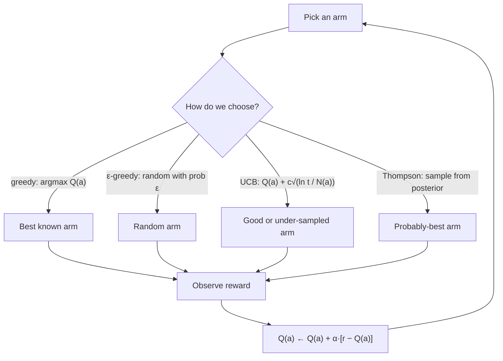

import BanditLab from '@site/src/components/viz/BanditLab';

**In one line.** When you do not know which option is best, you have to spend some pulls finding out — bandits are the maths of how many.

## The idea in plain words

Strip away states and sequences and you get the **bandit**: several slot machines, unknown payouts, limited pulls. Every RL exploration idea starts here.

The tension is simple. **Exploit** and you take the best option you know about — but "know" is based on noisy estimates. **Explore** and you learn, but you pay for it in lost reward.

The four standard answers:

- **ε-greedy** — take the best option, but with probability ε pick at random. Dead simple, and the ε should decay.
- **Optimistic initialisation** — start every estimate too high, so everything gets tried once before the estimates settle.
- **UCB** — prefer options that are either good *or* untried, by adding a bonus that shrinks as you sample: `Q(a) + c·√(ln t / N(a))`.
- **Thompson sampling** — keep a probability distribution over each option's value, sample from it, and play the winner. It explores in proportion to the chance an option is best.

The measure of success is **regret**: reward you lost by not always playing the best arm.



<BanditLab />

## How it works

### The k-armed bandit

You face, repeatedly, a choice among $k$ actions. Each pays a reward from a fixed but **unknown** distribution. The **value** of an action is its mean reward $q_*(a)$. You only have an **estimate** $Q_t(a)$, built by averaging the rewards it has paid.

:::note

**Analogy first.** Choosing a lunch spot near the office. Each restaurant is an "arm" with an unknown average enjoyment. You could always return to your favourite (exploit) or try a new place (explore). Over a year of lunches you want the highest total enjoyment.

:::

#### Run a real bandit

Ten arms with hidden true values $q_*$. Set $\varepsilon$, then run pulls. The bars show your *estimates* $Q(a)$ climbing toward the hidden truth (the red marks). The readout tracks how often you pick the best arm and your average reward. With $\varepsilon=0$ you may lock onto a wrong arm forever.

:::tip

**Sample-average estimate.** $Q_t(a) = \dfrac{\text{sum of rewards from }a}{\text{number of times }a\text{ chosen}}$. You ate at a place four times and rated $7,9,8,8$ → estimate $=(7+9+8+8)/4 = 8$. With enough samples, $Q_t(a)\to q_*(a)$.

:::

### Greedy & ε-greedy

The **greedy** action is $\arg\max_a Q_t(a)$ — always exploit. But a truly-best arm with an unlucky early estimate would never get a second chance. **ε-greedy** fixes this: act greedily with probability $1-\varepsilon$, pick a random arm with probability $\varepsilon$.

$$ A_t = \begin{cases}\arg\max_a Q_t(a) & \text{with prob } 1-\varepsilon \\ \text{random action} & \text{with prob } \varepsilon\end{cases} $$

#### The ε-greedy probability calculator

Reproduce the slide's exercise live. With $k$ actions and exploration rate $\varepsilon$, what's the chance the greedy action is chosen? Drag both and watch the two contributions — deliberate greedy + lucky random — add up.

:::tip

**Worked example — $k=2,\ \varepsilon=0.5$.** $P(\text{greedy}) = P(\text{greedy}\mid\text{greedy step})(1-\varepsilon) + P(\text{greedy}\mid\text{random})(\varepsilon) = (1)(0.5) + (0.5)(0.5) = 0.5 + 0.25 = \mathbf{0.75}$. Even at a heavy $\varepsilon=0.5$, the greedy action still wins 75% of the time.

:::

#### The 10-armed testbed

To compare methods fairly, average over **2000** random 10-armed problems, each run for 1000 steps. A single run is pure noise — only the average over many runs reveals which method is better.

### The incremental update

Don't re-sum all rewards each step. Update the average in place. With $Q_n$ the estimate after $n-1$ rewards and $R_n$ the new reward:

$$ Q_{n+1} = Q_n + \tfrac{1}{n}\,(R_n - Q_n) $$

This is the master template of all RL: `new ← old + step·[target − old]`. Here the step size $\tfrac1n$ shrinks as data accumulates. We write it $\alpha$ (constant) or $\alpha_t(a)$ (varying).

#### Step the incremental average

Feed rewards one at a time and watch the estimate update by $Q_{n+1}=Q_n+\frac1n(R_n-Q_n)$. The running estimate exactly equals the plain average — but uses no stored history. Press the preset to replay the slide's $10, 0, 8$ example.

:::tip

**Worked example.** $Q_1=0$; rewards $10,0,8$ with step $\frac1n$. $Q_2=0+1(10-0)=10$; $Q_3=10+0.5(0-10)=5$; $Q_4=5+\frac13(8-5)=6$. Check: mean of $10,0,8$ is $18/3=\mathbf{6}$. Exact match, zero stored rewards.

:::

### Non-stationary problems

Most RL problems are **non-stationary** — the true values drift over time. The shrinking $\frac1n$ step trusts ancient rewards as much as fresh ones. The fix: a **constant** step size $\alpha$, which weights recent rewards exponentially more.

$$ Q_{n+1} = (1-\alpha)^n Q_1 + \sum_{i=1}^{n}\alpha(1-\alpha)^{\,n-i} R_i \qquad(\text{weight on reward }i\text{ steps back} = \alpha(1-\alpha)^{n-i}) $$

#### Track a moving target

The true value (green) drifts over time. Watch two estimates chase it: the sample-average $\frac1n$ (blue) grows sluggish and *lags*. The constant-$\alpha$ (cyan) stays nimble and *tracks*. Slide $\alpha$: higher tracks faster but jitters more.

:::tip

**Worked example — $\alpha=\tfrac12$, rewards $10,0,8,4$.** $Q_2=5,\ Q_3=2.5,\ Q_4=5.25,\ Q_5=4.625$. The final weights are $0.0625, 0.125, 0.25, 0.5$ — each older reward halved. Check: $0.0625(10)+0.25(8)+0.5(4)=4.625$. The newest reward carries half the weight.

:::

### Optimistic initial values

A free exploration trick: set every initial estimate **high** (e.g. $Q_1(a)=+5$ when true values are near 0). The agent is repeatedly "disappointed" by real rewards, so it keeps switching arms early — trying everything before settling.

:::note

**The intuition.** Whichever arm it tries first pays around 0, far below the optimistic +5. Disappointed, the agent lowers that estimate and tries another — which also disappoints — and so on. Every action gets sampled several times early, with no $\varepsilon$ at all.

:::

#### Optimism drives early exploration

Set the initial value $Q_1$. With $Q_1=0$, greedy locks onto the first lucky arm. Crank $Q_1$ up to +5 and run: watch the early pulls spread across *all* arms as each disappoints, before converging. Optimism = built-in exploration.

### Upper-confidence-bound (UCB)

ε-greedy explores blindly — every non-greedy arm is equally likely. **UCB** explores by *uncertainty*: it adds a bonus to arms that are either high-valued or under-tried.

$$ A_t = \arg\max_a\left[\, Q_t(a) + c\sqrt{\tfrac{\ln t}{N_t(a)}}\, \right] $$

#### See the confidence bonus

Each arm shows its value estimate $Q$ (solid) plus its uncertainty bonus $c\sqrt{\ln t / N}$ (the lighter cap). Pull an arm: its bonus shrinks (more certain). Other arms' bonuses slowly grow (neglected). UCB always picks the tallest *total* bar — value plus optimism.

:::note

**The intuition.** Each pull of $a$ grows $N_t(a)$ and shrinks its bonus. Each pull of a *different* arm grows $t$ but not $N_t(a)$, so $a$'s bonus slowly rises — it's been neglected. UCB gives every arm its due, then focuses.

:::

### Gradient bandits & softmax

Instead of value estimates, learn a **preference** $H_t(a)$ per action, and convert preferences to probabilities with the **softmax**. Update preferences by gradient ascent on reward — learning a policy directly.

$$ \pi_t(a) = \frac{e^{H_t(a)}}{\sum_b e^{H_t(b)}} \qquad H_{t+1}(A_t) = H_t(A_t) + \alpha(R_t - \bar R_t)(1 - \pi_t(A_t)) $$

#### Preferences → probabilities

Set each arm's preference $H(a)$ and watch the softmax turn them into action probabilities. The **temperature** sharpens or flattens the distribution: high temperature → near-uniform (explore); low → almost greedy (exploit). Reward an arm and its preference (and probability) rises.

:::note

**The update.** If the action did better than your recent average ($R_t>\bar R_t$), push its preference up and the rest down. If worse, the opposite. The softmax then makes good actions more probable — a policy learned directly, no action values stored.

:::

**Connection.** This is the seed of **policy-gradient** deep RL (REINFORCE, actor-critic, PPO). The softmax-over-preferences and the $(R_t-\text{baseline})$ update reappear, scaled to neural networks, later in the course.

### Key takeaways

Two families of methods, one tension, one template.

- **1 · The problem** — Repeated choice among k arms with unknown means $q_*(a)$. Estimate $Q_t(a)$ by averaging; balance explore vs exploit.
- **2 · Value-based** — Greedy, ε-greedy, optimistic init, UCB. Incremental update $Q_{n+1}=Q_n+\alpha(R_n-Q_n)$; constant α tracks change.
- **3 · Policy-based** — Gradient bandits learn preferences, softmax to probabilities, gradient ascent on reward — the seed of policy-gradient RL.

:::note

**The thread.** Choose the highest-expected-reward action when rewards are unknown, you face the choice repeatedly, and you only see the outcome you chose. The same `new = old + step[target − old]` does the learning; the same explore-vs-exploit tension shapes every method. Add *context* (a state) and the bandit becomes the full RL problem — the MDP, next session.

:::

## A real system that works this way

**Headline and thumbnail selection.** News sites and streaming services test several titles or images per item. A/B splits keep sending half the traffic to the known-worse variant for the whole test; a bandit shifts traffic continuously and cuts the cost of learning. This is the single most common bandit deployment in industry.

**Ad creative rotation and push-notification timing** work the same way, with a *context* added (user features), which makes them contextual bandits.

## Code you can run

ε-greedy against UCB on a 10-armed testbed. Pure NumPy, runs in a second.

```python
import numpy as np

rng = np.random.default_rng(0)
K, STEPS, RUNS = 10, 1000, 200

def run(strategy, eps=0.1, c=2.0):
    rewards = np.zeros(STEPS)
    for _ in range(RUNS):
        true_q = rng.normal(0, 1, K)          # unknown to the agent
        Q, N = np.zeros(K), np.zeros(K)
        for t in range(STEPS):
            if strategy == "eps":
                a = rng.integers(K) if rng.random() < eps else int(np.argmax(Q))
            else:                              # UCB
                bonus = np.where(N == 0, 1e9, c * np.sqrt(np.log(t + 1) / np.maximum(N, 1)))
                a = int(np.argmax(Q + bonus))
            r = rng.normal(true_q[a], 1)
            N[a] += 1
            Q[a] += (r - Q[a]) / N[a]         # incremental sample average
            rewards[t] += r
    return rewards / RUNS

eps_curve, ucb_curve = run("eps"), run("ucb")
print("mean reward, last 100 steps")
print("  eps-greedy:", round(eps_curve[-100:].mean(), 3))
print("  UCB       :", round(ucb_curve[-100:].mean(), 3))
```

UCB usually wins here because its exploration is *targeted* — it stops sampling arms it is already confident about, while ε-greedy keeps paying the same random tax forever.

## Designing with it

**Choosing a strategy**

| Strategy | Use it when | Watch out for |
| --- | --- | --- |
| ε-greedy | You need something today; reward is noisy and stationary | Constant ε means linear regret — decay it |
| Optimistic init | Rewards are bounded and you know a ceiling | Only drives early exploration; useless after drift |
| UCB | You want strong regret guarantees, rewards are stationary | Assumes stationarity; poor under drift and delayed feedback |
| Thompson sampling | Production default — delayed/batched feedback, easy to extend to context | Needs a sensible prior and conjugate/approximate posterior |

**Design notes for a real deployment**

- **Delayed rewards break the loop.** A conversion may land hours later. Batch updates and give each arm a "pending" count, or you will over-explore.
- **Non-stationarity is the norm.** Use a constant step size `α` instead of a sample average so old data decays, or add a sliding window.
- **Guardrails.** Cap the traffic any unproven arm can take, and floor the traffic to the incumbent so a bug cannot tank the whole surface.
- **Log the propensity** (the probability you chose the arm). Without it, you cannot do off-policy evaluation later — this is the single most common regret in bandit systems.

## Where this stands in 2026

:::info Industry view

- **Bandits, not fixed A/B tests, are the default for high-volume experimentation** — they cut regret while a split test keeps paying for the losing arm.
- **Contextual bandits** run headline choice, push timing, pricing and creative selection; they ship far more easily than full RL because there is no long-horizon credit assignment.
- Thompson sampling dominates in practice: it handles batched, delayed feedback gracefully and is trivial to implement with Beta/Gaussian posteriors.
- The same bonus idea reappears in **LLM agent tool selection** — try the untested tool occasionally, or you will never learn it is better.

:::

## Practice questions

From the Module 2 self-assessment set and the EC-2 / EC-3 exam papers. The numeric answers below are all verified by computation.

<details>
<summary><strong>Q1.</strong> Explain why feedback in RL is *evaluative*, not *instructive*, with an example.</summary>

Instructive feedback tells you the *correct* action regardless of what you did (as in supervised learning). Evaluative feedback only tells you *how good* the action you took was. You must try other actions to know whether something better exists. Example: pulling a slot machine and getting ₹5 tells you that arm paid ₹5 this time. It does *not* tell you another arm would have paid ₹10. That is why bandits need exploration.<br /><em>Module 2 review Q1 · conceptual</em>

</details>

<details>
<summary><strong>Q2.</strong> Why is the multi-armed bandit called an RL problem in a *non-associative* setting?</summary>

There is a single state (or no state): the same $k$ actions are available every step and the reward distribution does not depend on a situation. The agent need not *associate* different actions with different states — it only learns which action is best on average. It is full RL minus the state/sequential-credit part: pure action-value estimation under the explore–exploit trade-off.<br /><em>Module 2 review Q2 · conceptual</em>

</details>

<details>
<summary><strong>Q3.</strong> In $\varepsilon$-greedy with four actions $(a,b,c,d)$, $a$ greedy, and $\varepsilon=0.4$: what is the probability the greedy action is selected, and each non-greedy action?</summary>

With probability $1-\varepsilon$ we take the greedy action. With probability $\varepsilon$ we pick uniformly among all $k=4$ actions.P(greedy a) = (1−ε) + ε/k = 0.6 + 0.4/4 = **0.7** P(each of b,c,d) = ε/k = 0.4/4 = **0.1**Check: 0.7 + 3×0.1 = 1.0.<br /><em>Exam-style / Module 2 · numeric</em>

</details>

<details>
<summary><strong>Q4.</strong> In the update NewEstimate = OldEstimate + StepSize·[Target − OldEstimate], compare a step size of $1/n$ versus a constant $\alpha$ for (i) non-stationarity and (ii) high reward variance.</summary>

**$1/n$ (sample average):** weights all past rewards equally. The $1/n$ term shrinks. So It *averages out* high variance well. But It is *slow to adapt* if the true value drifts (bad for non-stationary). **Constant $\alpha$:** gives an exponential recency-weighted average. Recent rewards count more. So It *tracks* a changing target (good for non-stationary). But It never fully averages out noise. So Estimates stay jittery under high variance. Use $1/n$ for stationary/low-noise; constant $\alpha$ for non-stationary.<br /><em>Module 2 review Q8 · conceptual</em>

</details>

<details>
<summary><strong>Q5.</strong> Why is the effect of optimistic initial values only *temporary*, and when would you use the trick?</summary>

Setting initial $Q$ values high makes every action look disappointing once tried (reward &lt;. Optimistic estimate). So The agent is *driven* to try all actions early. Built-in exploration. But as each action is sampled, its estimate falls to the true value and the optimism wears off. Thereafter behaviour is just greedy. Use it for stationary problems as a simple exploration kick-start; it is poorly suited to non-stationary problems (the one-time push doesn't recur).<br /><em>Module 2 review Q9 · conceptual</em>

</details>

<details>
<summary><strong>Q6.</strong> How does UCB differ from $\varepsilon$-greedy?</summary>

$\varepsilon$-greedy explores *blindly and uniformly* at random. UCB explores *by uncertainty*: it picks $\arg\max_a\big[Q(a)+c\sqrt{\ln t / N(a)}\big]$, adding a bonus that is large for actions tried few times. UCB prefers actions that are either good or under-explored. The bonus shrinks as $N(a)$ grows. So it explores more intelligently than $\varepsilon$-greedy.<br /><em>Module 2 review Q14 · conceptual</em>

</details>

<details>
<summary><strong>Q7.</strong> An online pharma bandit observes (t,action,reward): (1,S,7),(2,T,5),(3,R,6),(4,C,4),(5,S,8),(6,T,6),(7,R,7),(8,C,5). Using an exponential recency-weighted update with $\alpha=0.5$ and $Q_0=0$, find the best intervention.</summary>

Update $Q\leftarrow Q+0.5(R-Q)$ for each action's own observations.S: 0→0.5·7=3.5 → 3.5+0.5(8−3.5)=**5.75** T: 0→0.5·5=2.5 → 2.5+0.5(6−2.5)=**4.25** R: 0→0.5·6=3.0 → 3.0+0.5(7−3.0)=**5.00** C: 0→0.5·4=2.0 → 2.0+0.5(5−2.0)=**3.50**Best intervention = S (SMS reminder), Q(S)=5.75. Note recency weighting makes the *latest* reward count for half the estimate.<br /><em>Exam EC-2 Q3(a) · 3 marks · numeric</em>

</details>

<details>
<summary><strong>Q8.</strong> A treatment bandit (actions M, T) has rewards ±1. Over 8 steps M was chosen 4 times \{+1,−1,+1,r\} and T 4 times \{+1,+1,−1,−1\}. With UCB (c=1) at the 9th step, what is the maximum $r$ for which UCB(T) > UCB(M)?</summary>

Both actions were pulled $N=4$ times, so the exploration bonus $c\sqrt{\ln t/N}$ is *identical* for both and cancels. So UCB(T) >. UCB(M) ⇔ Q(T) >. Q(M).Q(T) = (1+1−1−1)/4 = 0 Q(M) = (1−1+1+r)/4 = (1+r)/4 0 >. (1+r)/4 ⇒ 1+r &lt;. 0 ⇒ r &lt; −1UCB(T) exceeds UCB(M) only when r &lt; −1; at r = −1 they tie. Since rewards are bounded at ±1, Therapy can never strictly win here.<br /><em>Exam EC-3 Q1(a) · 4 marks · numeric</em>

</details>

<details>
<summary><strong>Q9.</strong> Write the softmax (Boltzmann) action-selection probability and state how a gradient-bandit update changes the preferences.</summary>

Softmax over preferences $H(a)$: $\pi(a)=\dfrac{e^{H(a)}}{\sum_b e^{H(b)}}$. Gradient bandit does stochastic gradient *ascent* on expected reward: the chosen action's preference rises when its reward beats a baseline $\bar R$ and falls otherwise, $H_{t+1}(A_t)=H_t(A_t)+\alpha\,(R_t-\bar R_t)(1-\pi_t(A_t))$, with the unchosen ones adjusted oppositely. It learns relative preferences, not action-values, and explores via the softmax temperature.<br /><em>Session CS2-3 slides · conceptual</em>

</details>

<details>
<summary><strong>Q10.</strong> Give one application that can be modelled as a multi-armed bandit, and explain why the modelling is appropriate.</summary>

**Online ad / article selection (A/B testing):** each candidate ad is an arm. Showing it yields a stochastic reward (click / no click). It fits MAB because (i) the same set of arms is available every round, (ii) there is essentially no state. The choice doesn't change the world. And (iii) we must balance showing the current best ad (exploit) against gathering data on others (explore). Non-associative, single-state, evaluative-feedback ⇒ a bandit.<br /><em>Module 2 review Q3 · conceptual</em>

</details>

<details>
<summary><strong>Q11.</strong> If the action value is the *same* for all actions, do you still need to explore? Why or why not?</summary>

If you *truly know* all action values are equal, exploration gains nothing — every action is optimal, so just pick any. But if the equality is only your current *estimate* (not certainty), you must still explore to reduce uncertainty and confirm none is actually better. The danger is mistaking ignorance for knowledge.<br /><em>Module 2 review Q4 · conceptual</em>

</details>

<details>
<summary><strong>Q12.</strong> Tabulate the approaches we have learned to balance exploration and exploitation, with a remark on each.</summary>

**$\varepsilon$-greedy** — explore uniformly with prob. $\varepsilon$. Simple; explores blindly.**Decaying $\varepsilon$** — explore less over time. Good for stationary problems.**Optimistic initial values** — high initial $Q$ forces early trials. One-off; stationary only.**UCB** — bonus $c\sqrt{\ln t/N(a)}$ for under-tried actions. Explores by uncertainty; needs counts.**Gradient/softmax** — sample by preference. Smooth, temperature-controlled exploration.<br /><em>Module 2 review Q5 · conceptual</em>

</details>

<details>
<summary><strong>Q13.</strong> What $\varepsilon$ would you choose for (a) deterministic rewards, (b) low-variance rewards, (c) high-variance rewards? Why?</summary>

**(a) Deterministic:** $\varepsilon\approx 0$ — one sample reveals the true value of each arm, so almost no exploration is needed. **(b) Low variance:** small $\varepsilon$ — a few samples give reliable estimates. **(c) High variance:** larger $\varepsilon$ — noisy rewards need many samples to tell arms apart, so more exploration. More reward noise ⇒ more exploration.<br /><em>Module 2 review Q6 · conceptual</em>

</details>

<details>
<summary><strong>Q14.</strong> How do policy-based methods differ from value-based methods?</summary>

**Value-based** (e.g. $\varepsilon$-greedy on $Q$, Q-learning): learn value estimates and *derive* the policy by acting greedily. **Policy-based** (e.g. gradient bandit, policy gradient): parameterise and learn the **policy directly**, optimising expected reward by gradient ascent. Policy-based methods handle stochastic optimal policies and continuous actions naturally; value-based methods are simpler when a greedy policy suffices.<br /><em>Module 2 review Q12 · conceptual</em>

</details>

<details>
<summary><strong>Q15.</strong> Name two approaches you can use to maintain the estimate of action values.</summary>

**(1) Sample average** $Q_n=\frac1n\sum R_i$, computed incrementally with step $1/n$ — weights all rewards equally (stationary). **(2) Exponential recency-weighted average** with a constant step $\alpha$: $Q\leftarrow Q+\alpha(R-Q)$ — weights recent rewards more (non-stationary). Both fit NewEstimate = Old + StepSize·[Target − Old].<br /><em>Module 2 review Q13 · conceptual</em>

</details>

<details>
<summary><strong>Q16.</strong> Given a problem, what factors decide the right $\varepsilon$ for $\varepsilon$-greedy?</summary>

Reward **variance/noise** (more noise ⇒ larger $\varepsilon$), **stationarity** (drifting values ⇒ keep exploring, don't decay to 0), the **number of actions** (more arms ⇒ more exploration to cover them), the **time horizon** (short horizon ⇒ less time to waste exploring). The **cost of a mistake**. Balance: enough exploration to find the best arm, not so much that you forgo reward.<br /><em>Module 2 review Q15 · conceptual</em>

</details>

<details>
<summary><strong>Q17.</strong> A wristband: Case 1 — mode choice does not affect future rewards; Case 2 — sampling Mode C too long raises battery temperature, lowering future rewards for power-hungry modes. Classify each as MAB or finite MDP.</summary>

**Case 1:** actions don't influence future situations ⇒ Multi-Armed Bandit (non-associative, no state transitions). **Case 2:** the chosen action changes the future (temperature) and hence future rewards ⇒ finite MDP. The added dependency introduces state and transitions. So It is no longer a bandit.<br /><em>Exam EC-2 Q1(b) · 2 marks</em>

</details>

<details>
<summary><strong>Q18.</strong> In the recency-weighted update with $\alpha=0.5$, explain the significance of $\alpha$. What happens if $\alpha=1$?</summary>

$\alpha$ sets how fast new rewards overwrite the old estimate: $Q\leftarrow Q+\alpha(R-Q)$. $\alpha=0.5$ gives an exponentially-decaying memory (recent rewards weigh more) — good for non-stationary settings. If $\alpha=1$, $Q\leftarrow R$: the estimate equals the *last reward only*, ignoring all history — maximally reactive but extremely noisy.<br /><em>Exam EC-2 Q3(b) · 1.5 marks</em>

</details>

<details>
<summary><strong>Q19.</strong> What is the significance of the confidence level (the $c$ term) in UCB action selection?</summary>

In $Q(a)+c\sqrt{\ln t/N(a)}$, $c$ scales the exploration bonus — the model's *optimism under uncertainty*. Larger $c$ ⇒ more weight on poorly-sampled actions (more exploration); smaller $c$ ⇒ more greedy. It tunes how aggressively UCB probes uncertain interventions before committing.<br /><em>Exam EC-2 Q3(c) · 1 mark</em>

</details>

<details>
<summary><strong>Q20.</strong> Observations (t,a,r): (1,S,7),(2,T,5),(3,R,6),(4,C,4),(5,S,8) under a sample-average greedy method. On which steps did an $\varepsilon$-random action *definitely* occur, and on which *possibly*?</summary>

Track greedy = arg-max $Q$ before each step (all $Q=0$ initially):t1: all Q=0 (tie) → S chosen could be greedy → **possibly** random t2: greedy=S (7) but chose T → **DEFINITELY** random t3: greedy=S (7) but chose R → **DEFINITELY** random t4: greedy=S (7) but chose C → **DEFINITELY** random t5: greedy=S (7) and chose S → **possibly** random (greedy pick could also be an ε pick)Definitely random: t=2,3,4. Possibly random: t=1 and t=5.<br /><em>Exam EC-2 Q3(d) · 2 marks · numeric</em>

</details>

<details>
<summary><strong>Q21.</strong> A treatment bandit uses non-stationary updates ($\alpha=0.5,\ Q_1(M)=0$). M gave rewards +1, −1 (t=1,2), +1 (t=6), and $r$ (t=8). Compute $Q(M)$ at $t=9$ as a function of $r$.</summary>

Apply $Q\leftarrow Q+0.5(R-Q)$ for each reward of M:t1: 0 + 0.5(1−0) = 0.5 t2: 0.5 + 0.5(−1−0.5) = −0.25 t6: −0.25 + 0.5(1−(−0.25)) = 0.375 t8: 0.375 + 0.5(r−0.375) = 0.1875 + 0.5rQ(M) at t=9 = 0.5r + 0.1875.<br /><em>Exam EC-3 Q1(b) · 4 marks · numeric</em>

</details>

<details>
<summary><strong>Q22.</strong> Following Q21, comment on $Q(M)$ and how sensitive the treatment choice is to $r$.</summary>

Because $\alpha=0.5$, the latest reward $r$ accounts for **half** of $Q(M)$ (coefficient 0.5). So The estimate. And thus whether Medication beats Therapy. Is **highly sensitive** to the single most recent outcome. A large $\alpha$ makes the agent react sharply to the newest reward. This Is good for tracking change but risky if that reward is noisy.<br /><em>Exam EC-3 Q1(c) · 2 marks</em>

</details>

## Further reading

- [Sutton & Barto, chapter 2](http://incompleteideas.net/book/the-book-2nd.html) — the canonical treatment of the 10-armed testbed used above.
- [A Tutorial on Thompson Sampling (Russo et al.)](https://arxiv.org/abs/1707.02038) — practical, with worked industrial examples.
- [Vowpal Wabbit contextual bandits](https://vowpalwabbit.org/docs/vowpal_wabbit/python/latest/tutorials/python_Contextual_bandits_and_Vowpal_Wabbit.html) — a production-grade implementation to read.
- [Source lecture: drl-s2-bandits](https://learning.bansal-ai.in/drl-s2-bandits/lecture.html) — the original interactive lecture these notes were built from.

- **[Lecture 9 slides — Exploration and Exploitation (PDF)](https://davidstarsilver.wordpress.com/wp-content/uploads/2025/04/lecture-9-exploration-and-exploitation.pdf)** `course`
  David Silver — Bandits, regret, UCB and the exploration/exploitation trade-off in depth.
- **[Lecture 7 slides — Policy Gradient Methods (PDF)](https://davidstarsilver.wordpress.com/wp-content/uploads/2025/04/lecture-7-policy-gradient-methods.pdf)** `course`
  David Silver — The policy-gradient half of this session, derived carefully.
- **[Textbook — Chapter 2, Multi-armed Bandits](http://incompleteideas.net/book/the-book-2nd.html)** `book`
  Sutton & Barto — Chapter 2 is the definitive treatment of ε-greedy, UCB and gradient bandits. The free PDF is linked on that page.
