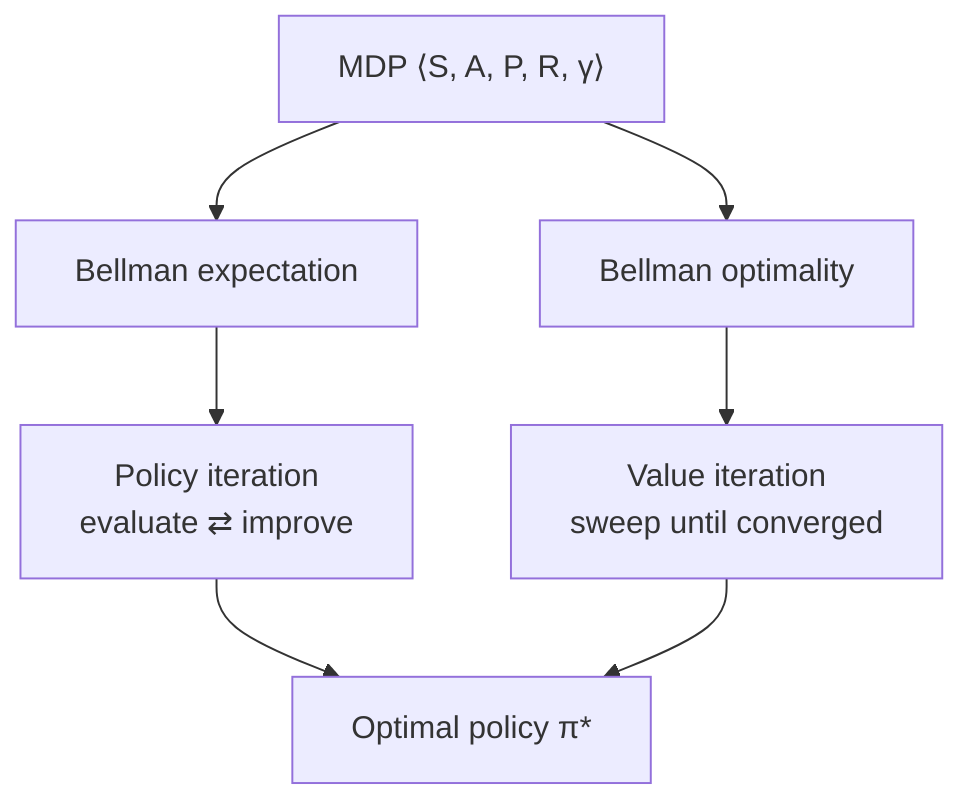

import GridWorldLab from '@site/src/components/viz/GridWorldLab';

**In one line.** An MDP is the contract that says "the current state is enough to decide" — and the Bellman equation is how value spreads through it.

## The idea in plain words

A **Markov decision process** is five things: states, actions, transition probabilities, rewards, and a discount γ. The *Markov* part is the promise that the current state contains everything that matters — history adds nothing.

Two questions follow:

1. **How good is this state under my policy?** That is the value function `v_π(s)`.
2. **How good could it be under the best policy?** That is `v*(s)`.

The **Bellman equation** answers both by relating a state to its neighbours: the value of where I am is the reward I get now plus the discounted value of where I land. It turns a problem about infinite futures into a one-step recursion.

If you know the transition probabilities, you can solve it directly:

- **Policy iteration** — evaluate the current policy, then improve it greedily, repeat. Few iterations, expensive each.
- **Value iteration** — apply the optimality equation as an update until values stop moving. Many iterations, cheap each.

Both converge, because the Bellman operator is a contraction — each sweep shrinks the error by a factor of γ.



<GridWorldLab />

## How it works

### The MDP & grid world

An **MDP** is $(S, A, p(s',r\mid s,a), \gamma)$: states, actions, transition dynamics, rewards, and a discount. The **Markov property** means the future depends only on the present state — not the whole history.

:::note

**Analogy first.** Snakes and Ladders is Markov: your next move depends only on your current square and the dice, not the path you took to get there. The square is a sufficient summary of the past.

:::

#### Noisy grid-world movement

Pick an intended direction. The action succeeds only 80% of the time — 10% slips left, 10% slips right (and a wall keeps you put). Press **act** many times and watch the *distribution* of outcomes emerge. This is why the math needs expectations: you can't plan a fixed path.

### Returns & discounting

The agent maximises the **return** $G_t$. For endless tasks the plain sum is infinite, so we use the **discounted return** with $0\le\gamma\le1$:

$$ G_t = R_{t+1} + \gamma R_{t+2} + \gamma^2 R_{t+3} + \cdots = \sum_{k=0}^{\infty}\gamma^k R_{t+k+1} = R_{t+1} + \gamma\,G_{t+1} $$

:::note

**Analogy first.** $100 today beats $100 next year — you could invest it, and the future is uncertain. $\gamma$ is this "time value of reward". A $\gamma=0.9$ agent values a reward one step away at 90%, two steps at 81%, and so on.

:::

#### Discount a reward stream

Slide $\gamma$ and watch the return for the rewards $[1,2,3]$ — and the reversed $[3,2,1]$. At $\gamma=0$ only the next reward counts; near 1 the agent is far-sighted. Notice early rewards are always worth more. The constant-$+1$-forever case shows the geometric sum $1/(1-\gamma)$.

:::tip

**Worked example.** Rewards $[1,2,3]$, $\gamma=0.5$: $G = 1 + 0.5(2) + 0.25(3) = 1+1+0.75 = \mathbf{2.75}$. Reversed $[3,2,1]$: $G = 3 + 1 + 0.25 = \mathbf{4.25}$ — bigger, because the large reward comes sooner. Constant $+1$ forever at $\gamma=0.9$: $G = 1/(1-0.9) = \mathbf{10}$.

:::

### Value functions

Given a policy $\pi$, two value functions measure long-term goodness: the **state value** $v_\pi(s)$ and the **action value** $q_\pi(s,a)$. They're linked.

$$ v_\pi(s) = \mathbb{E}_\pi[G_t\mid S_t{=}s] \qquad q_\pi(s,a) = \mathbb{E}_\pi[G_t\mid S_t{=}s, A_t{=}a] $$

$$ v_\pi(s) = \sum_a \pi(a\mid s)\,q_\pi(s,a) \qquad q_\pi(s,a) = \sum_{s',r} p(s',r\mid s,a)\,[\,r + \gamma\,v_\pi(s')\,] $$

:::note

**The intuition.** $v_\pi(s)$ answers "if I sit here and follow $\pi$, how much reward can I expect from now on?" $q_\pi(s,a)$ asks the same but commits to one action first. Knowing $q_\pi$ tells you which action is best — just pick the largest.

:::

- **Why two functions?** — The state value averages the action values over the policy. The action value is the immediate reward plus the discounted value of where you land. Each is defined in terms of the other — which is exactly what lets us write a single recursive equation next.

### The Bellman expectation equation

Value decomposed into **immediate reward + discounted next value**:

$$ v_\pi(s) = \sum_a \pi(a\mid s)\sum_{s',r} p(s',r\mid s,a)\,\big[\,r + \gamma\,v_\pi(s')\,\big] $$

:::note

**The intuition.** This is a *consistency condition*: $v_\pi$ must satisfy it at every state at once. It turns a global problem. Summing infinitely many future trajectories. Into a recursive *local* computation: each state's value defined by its neighbours'.

:::

#### Compute one Bellman backup

A state under the equiprobable random policy ($\pi=0.25$ each of 4 actions), reward 0, $\gamma=0.9$. Set the four neighbours' current values; the panel computes $v(s) = 0.25\sum (0 + 0.9\,v(s'))$ — the policy-weighted, discounted average. This single backup, repeated, *is* dynamic programming.

:::tip

**Worked example.** Neighbours $2.3, 0.7, -0.4, 0.4$, $\gamma=0.9$. Targets $0.9\times[\ldots] = [2.07, 0.63, -0.36, 0.36]$. Average: $0.25(2.07+0.63-0.36+0.36) = 0.25\times 2.70 = \mathbf{0.675}$. The state's value is just the discounted average of its neighbours.

:::

### Optimal policies & optimality

An **optimal policy** $\pi_*$ is best in every state (there may be several). Its values $v_*, q_*$ satisfy the **Bellman optimality equations** — the policy-average becomes a **max**:

$$ v_*(s) = \max_a \sum_{s',r} p(s',r\mid s,a)\,[\,r + \gamma\,v_*(s')\,] $$

$$ q_*(s,a) = \sum_{s',r} p(s',r\mid s,a)\,\big[\,r + \gamma\,\max_{a'} q_*(s',a')\,\big] $$

:::note

**The intuition.** The optimal value of a state equals the expected return for the *best* action — a max, not an average. Once you have $v_*$ (or $q_*$), the optimal policy is trivial: in each state, take the action achieving the max. The hard part is computing $v_*$; acting on it is easy.

:::

- **From values to a policy** — This is the central trick of dynamic programming: don't search the space of policies directly (there are exponentially many). Instead compute the optimal *values*, then read off the greedy policy. Value iteration and policy iteration are two ways to compute those values.

### Value iteration

**Dynamic Programming** uses the full model $p(s',r\mid s,a)$ to compute optimal policies. **Value iteration** applies the Bellman *optimality* update to every state until the values stop changing, then reads off the greedy policy.

$$ V_{k+1}(s) \leftarrow \max_a \sum_{s',r} p(s',r\mid s,a)\,[\,r + \gamma\,V_k(s')\,] $$

#### Value iteration on the race car

The slide's MDP: states **Cool / Warm / Overheated**, actions **Slow / Fast**, $\gamma=0.9$. Press **step** and watch the values climb — $0 \to (2,1,0) \to (3.35, 2.35, 0) \to \cdots$ toward $(15.5, 14.5, 0)$, exactly as on the slides. Toggle **async** to reuse fresh values mid-sweep and converge faster.

:::tip

**Worked example (matches the slides).** $V_0=(0,0,0)$. $V_1(\text{Cool})=\max(\text{Slow}:1{+}.9(0)=1,\ \text{Fast}:2{+}.9(0)=2)=2$. $V_2(\text{Cool})=\max(1{+}.9(2)=2.8,\ 2{+}.9(.5\cdot2{+}.5\cdot1)=3.35)=\mathbf{3.35}$. Converges to $V(\text{Cool})=15.5$, $V(\text{Warm})=14.5$; policy: Cool→Fast, Warm→Slow.

:::

### Policy iteration & PI vs VI

**Policy iteration** alternates two steps until the policy stops changing: **evaluate** the current policy fully (Bellman expectation backups), then **improve** it greedily. Each new policy is at least as good as the last.

:::note

**The intuition.** Value iteration does one optimality (max) sweep per step, never naming the policy. Policy iteration fully evaluates a fixed policy (an average, no max — cheap, one action per state), then improves it. Both reach $v_*$; they split the work differently.

:::

#### Race: policy iteration vs value iteration

Run both on the race-car MDP and count iterations to the optimal policy. Policy iteration reaches it in **~3 policy steps** (each with a full evaluation); value iteration takes **~23 sweeps** (each cheap). Fewer-heavier vs more-lighter — the classic trade-off.

| Aspect | Policy Iteration | Value Iteration |
| --- | --- | --- |
| Evaluation | Full convergence | Single sweep |
| Bellman update | expectation (Σ over π) | max over actions |
| Policy visible? | Yes, each step | Only at the end |
| Outer iterations | Fewer (heavier) | More (lighter) |
| Race car | ~3 PI steps | ~23 VI sweeps |

### Generalised Policy Iteration

**GPI** is the unifying schema: let **evaluation** (make $V$ consistent with $\pi$) and **improvement** (make $\pi$ greedy w.r.t. $V$) interact, at any granularity. *Almost all RL methods are GPI.*

:::note

**The intuition.** The two processes *compete*: improvement changes $\pi$. This Makes the old $V$ wrong. Evaluation fixes $V$. This Makes $\pi$ no longer greedy. Yet together they converge to the shared fixed point $(\pi_*, v_*)$ — where $\pi$ is greedy w.r.t. its own correct values. Neither must finish before the other starts.

:::

#### Watch evaluation ↔ improvement converge

Two pulls toward a fixed point: evaluation drives $V$ toward $v_\pi$; improvement drives $\pi$ toward greedy. Press **evaluate** and **improve** alternately and watch the point spiral into the corner — the optimum where both processes agree.

**Connection.** The GPI spectrum: policy iteration (full eval), value iteration (one sweep), async DP (any states).. Once we drop the model. TD, Q-learning. Actor-critic. They differ only in *how evaluation is done*.

### Key takeaways

Add state to the bandit and you get the MDP — with an exact solution when the model is known.

- **1 · The MDP** — $(S,A,p,\gamma)$ with the Markov property. The discounted return $G_t=\sum\gamma^k R$ makes infinite-horizon goals well-defined.
- **2 · Bellman** — $v_\pi, q_\pi$ measure long-term value; the Bellman equation decomposes them recursively. Optimality takes a max over actions.
- **3 · DP & GPI** — Value iteration (max sweeps) and policy iteration (evaluate + improve) solve a known MDP exactly — both instances of GPI.

:::note

**The thread.** Compute the optimal *values*, then read off the greedy policy. DP does this exactly using the model $p(s',r\mid s,a)$. The catch: you need that model. Next session asks *what if you don't?* — and answers with Monte Carlo, TD, and Q-learning. GPI still applies; only the evaluation changes from known dynamics to sampled experience.

:::

## A real system that works this way

**Warehouse and inventory control.** Reorder decisions are a textbook MDP: state = stock level, action = order quantity, reward = sales minus holding and stock-out costs. Because demand distributions are estimated and the state space is small, retailers solve these with value iteration or linear programming rather than deep RL.

**Ride dispatch and repositioning.** DiDi and Uber-style systems model a city as states (grid cell × time) and solve large MDPs offline, then use the learned values to score dispatch decisions in real time.

## Code you can run

Value iteration on a 4×4 grid world. No RL library — just the Bellman optimality update.

```python
import numpy as np

N, GAMMA, THETA = 4, 0.9, 1e-6
GOAL, TRAP = (0, 3), (1, 3)
ACTIONS = {"↑": (-1, 0), "↓": (1, 0), "←": (0, -1), "→": (0, 1)}

def step(r, c, dr, dc):
    nr, nc = min(max(r + dr, 0), N - 1), min(max(c + dc, 0), N - 1)
    return nr, nc

def reward(s):
    return 1.0 if s == GOAL else (-1.0 if s == TRAP else -0.04)

V = np.zeros((N, N))
terminal = {GOAL, TRAP}

while True:                                   # value iteration
    delta = 0.0
    for r in range(N):
        for c in range(N):
            if (r, c) in terminal:
                V[r, c] = reward((r, c))
                continue
            best = max(reward((r, c)) + GAMMA * V[step(r, c, dr, dc)]
                       for dr, dc in ACTIONS.values())
            delta = max(delta, abs(best - V[r, c]))
            V[r, c] = best
    if delta < THETA:
        break

policy = [["  " for _ in range(N)] for _ in range(N)]
for r in range(N):
    for c in range(N):
        if (r, c) in terminal:
            policy[r][c] = " G" if (r, c) == GOAL else " T"
            continue
        policy[r][c] = " " + max(ACTIONS, key=lambda a: V[step(r, c, *ACTIONS[a])])

print(np.round(V, 2), "\n")
print("\n".join("".join(row) for row in policy))
```

The printed arrows are the optimal policy: every cell points along the path that maximises discounted reward, and the values fall off by roughly γ per step away from the goal.

## Designing with it

**Modelling decisions that decide everything**

| Choice | Guidance |
| --- | --- |
| **State** | Must be Markov *enough*. If the right action depends on history, put that history in the state (last k events, running aggregates) or accept a POMDP. |
| **Action space** | Keep it small and discrete if you can. Continuous actions rule out value iteration and push you to policy methods. |
| **Reward** | Sparse rewards are honest but slow to learn; dense rewards learn fast but get gamed. Start sparse, add potential-based shaping. |
| **γ** | Sets the effective horizon ≈ 1/(1−γ). γ=0.99 means "care about the next ~100 steps". Pick it from the business horizon. |

**When DP is the right answer**

Value iteration needs the transition model. That rules out most user-facing products but fits operations problems — inventory, staffing, routing, maintenance scheduling — where the dynamics are known or easy to estimate. If the state space is under a few million, solve it exactly and skip deep RL entirely.

**Failure mode to watch:** a state that is not really Markov. Symptom — the same state yields wildly different returns. Fix by enriching the state, not by tuning the learner.

## Where this stands in 2026

:::info Industry view

- **Most deployed "RL" in operations is dynamic programming** over a modest MDP, because the model is known and exact solutions are auditable.
- **The Bellman equation is the most-asked RL interview question.** Derive both forms, and explain γ as horizon control *and* variance control.
- Large-scale dispatch, pricing and inventory systems solve MDPs offline and use the resulting value table as a scoring function online.
- The contraction argument is why DP is safe — losing it under function approximation is the "deadly triad" that makes deep RL unstable.

:::

## Practice questions

From the EC-2 / EC-3 exam papers (the warehouse-robot MDP) plus core review material. Numbers verified.

<details>
<summary><strong>Q1.</strong> List the components of a finite MDP and what each contributes.</summary>

**States** $S$: situations the agent can be in.**Actions** $A$: choices available (possibly per-state).**Transition model** $p(s'\mid s,a)$: dynamics.**Reward** $r(s,a,s')$: scalar feedback.**Discount** $\gamma\in[0,1]$: how much future reward counts.The Markov property: the next state/reward depend only on the current state and action, not the full history.<br /><em>Core · conceptual</em>

</details>

<details>
<summary><strong>Q2.</strong> Warehouse robot: from M under *Continue*, $\to$M (p=0.6, r=+1) and $\to$L (p=0.4, r=+1), $\gamma=0.9$, with V(M)=V(L)=1. Write the Bellman expectation equation for $V_\pi(M)$ and evaluate it.</summary>

$V_\pi(M)=\sum_{s'}p(s'\mid M,C)\,[\,r+\gamma V_\pi(s')\,]$.= 0.6·(1 + 0.9·1) + 0.4·(1 + 0.9·1) = 0.6·1.9 + 0.4·1.9 = **1.9**Vπ(M) = 1.9.<br /><em>Exam EC-3 Q2(a) · 2 marks · numeric</em>

</details>

<details>
<summary><strong>Q3.</strong> With $V^0(L)=-10, V^0(M)=5, V^0(H)=8$, $\gamma=0.9$, compute $Q(M,\text{Continue})$ and $Q(M,\text{Recharge})$ (Recharge: $\to$H, p=1, r=−2). Should the policy at M change?</summary>

Q(M,Continue) = 0.6(1+0.9·5) + 0.4(1+0.9·(−10)) = 0.6·5.5 + 0.4·(−8) = 3.3 − 3.2 = **0.10** Q(M,Recharge) = 1.0·(−2 + 0.9·8) = −2 + 7.2 = **5.20**5.20 > 0.10, so the improved policy switches state M to Recharge: $\pi_1(\text{Recharge}\mid M)=1$.<br /><em>Exam EC-3 Q2(b) · 4 marks · numeric</em>

</details>

<details>
<summary><strong>Q4.</strong> Contrast value iteration and policy iteration.</summary>

**Value iteration** repeatedly applies the Bellman *optimality* backup $V(s)\leftarrow\max_a\sum p(s'|s,a)[r+\gamma V(s')]$ until $V$ converges, then reads off the greedy policy once. **Policy iteration** alternates full *policy evaluation* (solve $V_\pi$) with *policy improvement* (greedy w.r.t. $V_\pi$) until the policy stops changing. VI = many cheap value sweeps; PI = fewer but heavier iterations, often converging in fewer policy changes.<br /><em>Core · conceptual</em>

</details>

<details>
<summary><strong>Q5.</strong> What does the discount factor $\gamma$ do, and what is the impact of a very small $\gamma$ (e.g. 0.01) on a task that must keep a patient stable?</summary>

$\gamma$ weights future rewards: return $G_t=\sum_k\gamma^k R_{t+k+1}$. Small $\gamma$ makes the agent *myopic* — it cares almost only about the immediate reward and heavily discounts anything more than a step or two ahead. With $\gamma=0.01$ the agent would chase short-term gains and fail to value the long sequence of actions needed to keep the patient stable — dangerous for a goal that pays off only over many steps.<br /><em>Exam EC-2 Q2(d) · conceptual</em>

</details>

<details>
<summary><strong>Q6.</strong> In a model-free setting, why is estimating only the state-value $v_\pi(s)$ insufficient for control, even if perfect?</summary>

To *act* greedily you must compare actions: $\arg\max_a \sum_{s'}p(s'|s,a)[r+\gamma v_\pi(s')]$. That requires the model $p$ (and $r$). Model-free, you don't have $p$, so $v_\pi(s)$ alone cannot rank actions. You instead learn the action-value $q_\pi(s,a)$, which directly gives the best action as $\arg\max_a q_\pi(s,a)$ without a model.<br /><em>Exam EC-2 Q4(a) · 2 marks · conceptual</em>

</details>

<details>
<summary><strong>Q7.</strong> One synchronous value-iteration sweep on state H (Continue: $\to$H p=0.7 r=+2, $\to$M p=0.3 r=+2; Recharge: $\to$H p=1 r=−1), with $V(H)=V(M)=1,\ \gamma=0.9$. Compute the new $V(H)$.</summary>

Value iteration takes the max over actions of the expected backup.Q(H,Continue) = 0.7(2+0.9·1) + 0.3(2+0.9·1) = 0.7·2.9 + 0.3·2.9 = 2.9 Q(H,Recharge) = 1.0·(−1 + 0.9·1) = −0.1 V(H) ← max(2.9, −0.1) = **2.9**New V(H) = 2.9, and the greedy action at H is Continue.<br /><em>Exam-style (EC-3 robot) · numeric</em>

</details>

<details>
<summary><strong>Q8.</strong> An ICU ventilator assistant categorises SpO$_2$ as lowO2 / OptimalO2 / highO2 and may increase / decrease / maintain pressure. Increase/decrease leaves health unchanged with prob 0.4; maintain always keeps the condition; four consecutive Optimal readings ⇒ stabilised. Formulate the MDP.</summary>

**States:** the SpO$_2$ categories \{lowO2, OptimalO2, highO2\}, plus a *stabilised* terminal state (reached after 4 consecutive Optimal readings. So really a count-augmented state (category, #consecutive-Optimal)).**Actions:** \{increase, decrease, maintain\} pressure.**Transitions:** increase/decrease change the level with prob 0.6 and leave it unchanged with prob 0.4 (split remaining mass equally where unspecified). Maintain keeps the state with prob 1.**Reward:** + for moving toward / staying Optimal, − for over-/under-ventilation.**$\gamma$:** discount &lt; 1.Goal: reach the stabilised (4× Optimal) terminal state while avoiding over-ventilation.<br /><em>Exam EC-2 Q2(a) · 2.5 marks</em>

</details>

<details>
<summary><strong>Q9.</strong> Reward designs — Design A: reward +10 for moving lowO2→OptimalO2; Design B: reward −10 for moving OptimalO2→highO2. Which do you prefer, in terms of (i) behaviour encouraged and (ii) when each is preferable?</summary>

(i) **Design A** positively reinforces *recovering* a hypoxic patient toward Optimal; **Design B** punishes *over-ventilation* (pushing past Optimal into highO2). (ii) Prefer Design B when the dominant risk is over-ventilation harm (penalising the dangerous transition is safer); prefer Design A when the priority is actively driving hypoxic patients back to Optimal. A combined shaped reward (reward Optimal, penalise highO2) is best in practice.<br /><em>Exam EC-2 Q2(b) · 2 marks</em>

</details>

<details>
<summary><strong>Q10.</strong> Is the ventilator task episodic or continuing? And what is the impact of using $\gamma=0.01$?</summary>

**Episodic:** there is a terminal *stabilised* state (4 consecutive Optimal readings), so each patient is an episode that ends — it is an episodic task. With $\gamma=0.01$ the agent becomes extremely myopic — it values only the immediate reading and essentially ignores the multi-step path to stabilisation, so it may oscillate or fail to plan the sequence of adjustments needed, endangering patient stability.<br /><em>Exam EC-2 Q2(c),(d) · 3 marks</em>

</details>

## Further reading

- [Sutton & Barto, chapters 3–4](http://incompleteideas.net/book/the-book-2nd.html) — MDPs, Bellman equations and DP, with the same notation used here.
- [David Silver's RL lectures 2–3](https://www.davidsilver.uk/teaching/) — the clearest blackboard derivation of both Bellman forms.
- [Spinning Up — Key equations](https://spinningup.openai.com/en/latest/spinningup/rl_intro.html#value-functions) — value functions and the optimality equations in compact form.
- [Source lecture: drl-s3-mdp-dp](https://learning.bansal-ai.in/drl-s3-mdp-dp/lecture.html) — the original interactive lecture these notes were built from.

- **[Lecture 2 slides — Markov Decision Processes (PDF)](https://davidstarsilver.wordpress.com/wp-content/uploads/2025/04/lecture-2-mdp.pdf)** `course`
  David Silver — MDPs, returns, value functions and the Bellman equations.
- **[Lecture 3 slides — Planning by Dynamic Programming (PDF)](https://davidstarsilver.wordpress.com/wp-content/uploads/2025/04/lecture-3-planning-by-dynamic-programming-.pdf)** `course`
  David Silver — Policy iteration and value iteration worked through step by step.
- **[Textbook — Chapters 3-4, Finite MDPs & Dynamic Programming](http://incompleteideas.net/book/the-book-2nd.html)** `book`
  Sutton & Barto — Where the Bellman optimality equation is properly derived. The free PDF is linked on that page.
