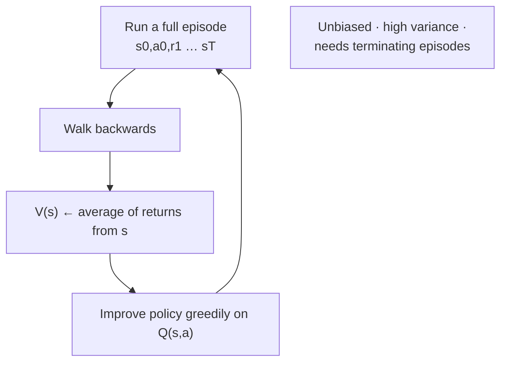

**In one line.** Play the episode to the end, average what you actually got, and use that as the value.

## The idea in plain words

Dynamic programming needs the transition probabilities. Monte Carlo does not — it just **plays episodes and averages the returns**.

The recipe is almost embarrassingly simple:

1. Run an episode with the current policy.
2. Walk backwards computing the return `G` from each visited state.
3. Update `V(s)` towards the average of the returns seen from `s`.

Two variants: **first-visit** MC averages only the first time a state appears in an episode; **every-visit** averages all occurrences. Both converge.

The trade-off against DP and TD:

- **Unbiased** — it averages real returns, not estimates of estimates.
- **High variance** — one lucky episode moves the estimate a lot.
- **Needs episodes to end** — no continuing tasks, no learning until the episode finishes.

For control you also need every action to be tried. *Exploring starts* (begin in a random state-action pair) is the classic fix; an ε-soft policy is the practical one.



## How it works

### What Monte Carlo is

A **Monte Carlo method** estimates a hard quantity by **repeated random sampling**. In RL the hard quantity is a state's value; the samples are the returns we actually receive when we run the policy.

Dynamic programming gave us exact values — but only because it had the model p(s′,r | s,a). Most real problems (a robot on a track, a hand of blackjack, a trading book) give us no model. MC needs none: it learns purely from **experience** — sampled episodes of states, actions and rewards — with **no model and no bootstrapping** (each estimate uses a real return, never another estimate).

:::note

**Play to the end.** To value a state, run full episodes from it and average the returns — like estimating a coin's bias by flipping it a few hundred times. Works for **episodic** tasks that always terminate. The same sampling trick estimates π, prices options, and renders light in graphics.

:::

:::tip

**Offline by nature.** The return is only known once the episode *ends*, so plain MC updates after each episode (a batch/offline flavour). Temporal-difference learning, next session, removes that wait.

:::

### DP vs MC: two ways to back up value

Both estimate the same values; they differ in **what each update is built from**.

- **Dynamic programming** — Needs the **model**. Updates a state from **all** successors weighted by p — a full one-step **expected** backup. Bootstraps: value built from other estimates. Shallow (one step) but wide (every branch).
- **Monte Carlo** — Needs **no model**. Updates a state from **one sampled trajectory** all the way to the terminal state. No bootstrap: value built from a real return. Deep (whole episode) but narrow (one sample path).
- **The return** — G_t = R_t+1 + γR_t+2 + γ²R_t+3 + … V_π(s) = 𝔼[G_t | S_t=s]. An expectation is an average, so averaging real returns converges to the value (law of large numbers).

### First-visit MC prediction

For each episode, walk it backwards accumulating G; the **first** time you reach a state, file that return. The state's value is the average of its filed returns. **Every-visit** MC files after *every* visit instead — both converge to V_π.

:::note

**Algorithm.** Init V(s) and an empty Returns(s). Per episode: set G=0; for t = T−1…0 do G ← γG + R_t+1; if S_t is a first visit, append G to Returns(S_t) and set V(S_t) = average(Returns(S_t)).

:::

#### Gridworld MC averaging

The Berkeley 5-state gridworld (γ=1): every move −1, exit at D +10, exit at A −10. Step through the four episodes and watch each state's first-visit average build to its final value.

:::tip

**Result.** V(A)=−10, V(B)=8, V(C)=4, V(D)=10, V(E)=−2. C sits on the path to *both* exits, so its returns (9, 9, −11, 9) average to +4.

:::

### Strengths and limits of direct evaluation

- **Strengths** — Trivial to understand; needs **no model**; each state's estimate is independent (no propagated bootstrap bias); provably converges; robust even if the Markov property is violated.
- **Costs** — Wastes transition structure (shared successors re-learned from scratch); each state needs enough visits **on its own**, so it's slow and sample-hungry; can't update until the episode **ends**.
- **When to reach for it** — Episodic tasks where you have no model and episodes terminate in reasonable time — and you'd rather be unbiased than fast.

### Incremental MC

Update the running mean in place: **V(S) ← V(S) + (1/N)(G − V(S))**. This is the *same* "new ← old + step × (target − old)" rule from multi-armed bandits — now the target is the episode return G.

:::note

**Step-size choice.** Step 1/N shrinks over time and recovers the exact sample average — right for a **stationary** problem. A **constant** α gives a recency-weighted average that keeps adapting — right when the policy or environment is **non-stationary** and old returns should fade.

:::

### Monte Carlo control

Generalised policy iteration: **evaluate** with MC, then **improve** greedily, repeat. With no model you can't greedily improve V (that needs a one-step look-ahead through p), so estimate **Q(s,a)** directly — then π(s)=argmax_a Q(s,a) needs nothing.

:::note

**MC control with exploring starts.** Per episode: start from a random (s,a); walk back updating Q for first-visited pairs by averaging returns; make π greedy w.r.t. the new Q. Both halves move toward the optimum, so it converges to Q_* and π_*.

:::

### On-policy vs off-policy + importance sampling

**On-policy** evaluates and improves the same ε-soft policy it follows — so it converges only to the best *ε-soft* policy (it can never stop exploring). **Off-policy** uses two policies: a **target** π (can be fully greedy) and a **behaviour** b that explores. Requirement: **coverage** — b(a|s) > 0 wherever π(a|s) > 0.

:::note

**Importance-sampling ratio.** Returns under b aren't samples of π, so re-weight them. The environment's p terms cancel, leaving ρ = ∏_k π(A_k|S_k) / b(A_k|S_k). Then 𝔼_b[ρ·G] = V_π — an unbiased target estimate from behaviour data.

:::

#### Ordinary vs weighted importance sampling

A target state has true value **+2**. We run episodes under an exploratory behaviour policy; occasional trajectories carry a large ρ. Slide the episode count and watch **ordinary** IS (average of ρ·G) jump around while **weighted** IS (normalise by Σρ) settles fast.

:::tip

**Trade-off.** Ordinary IS is *unbiased* but high- (even infinite-) variance; weighted IS is *biased* (bias vanishes with data) but low, bounded variance — far better early, as the blackjack experiment shows. Off-policy MC control combines this with a weighted incremental Q-update and stops walking an episode back once the behaviour deviates from the greedy target.

:::

### Key takeaways

Episodes in, values out — no model, no bootstrap.

- **1 · Predict** — First/every-visit average of returns; incremental update with 1/N or constant α.
- **2 · Control** — Q-based GPI; explore via exploring starts or ε-soft policies.
- **3 · Off-policy** — Importance sampling: ordinary (unbiased) vs weighted (low-variance).

:::note

**The thread.** Monte Carlo estimates values by averaging actual returns over complete episodes — model-free and bootstrap-free. Prediction uses first-/every-visit averaging (stored incrementally); control uses Q-based generalised policy iteration kept honest by exploring starts or ε-soft exploration; off-policy learning reuses a behaviour policy's data to value a target policy by reweighting returns with importance sampling, where weighted IS trades a little bias for much less variance. Versus DP, MC needs no model; versus TD, MC is unbiased but higher-variance and must wait for episodes to end.

:::

One tiny 3-state problem — a race car managing its engine temperature — solved **four ways**. Watch known-model planning (DP), full-episode sampling (Monte Carlo), and one-step bootstrapping (TD) each recover the same optimal policy, with every number matching the slides.

- **The payoff** — One problem, four lenses — so the difference between planning, sampling, and bootstrapping becomes concrete, not abstract.

### The race-car MDP

The engine is **Cool**, **Warm**, or **Overheated** (terminal). Each step: **Go Slow** or **Go Fast**. Fast earns more reward but heats the engine; going Fast while Warm overheats it (reward −10).

:::note

**The intuition.** Going fast earns more but risks shutdown; going slow is safe but slower. The agent must learn a policy — which speed to pick in each temperature — that maximises long-run reward without overheating. The next temperature depends only on the current one (Markov).

:::

#### Explore the dynamics

Click a state-action to see where it leads and what it pays. Notice the danger: **Warm + Fast → Overheated, −10**. The optimal policy will avoid it — Cool→Fast, Warm→Slow.

### Dynamic Programming

With the model known, **value iteration** applies the Bellman optimality backup until the values converge, then reads off the greedy policy. Here, $\gamma = 0.9$.

#### Value iteration (matches the slides)

Press **step** and watch $0 \to (2,1,0) \to (3.35, 2.35, 0) \to \cdots$ climb toward $(15.5, 14.5, 0)$ — exactly the slide values. Toggle **async** to reuse fresh values mid-sweep (converges faster). The greedy policy settles on Cool→Fast, Warm→Slow.

:::tip

**Value iteration (slide numbers).** $V_1=(2,1,0)$: Cool picks Fast (2>1), Warm picks Slow (1>−10). $V_2(\text{Cool})=\max(1{+}.9(2), 2{+}.9(1.5))=\max(2.8,3.35)=3.35$. Converges to $(15.5,14.5,0)$. **Policy iteration** reaches the same optimum in just 3 policy steps vs ~23 VI sweeps.

:::

### Monte Carlo: learn from full episodes

**Monte Carlo** needs no model — it drives complete episodes and averages the actual **returns**. The return is computed backwards: $G_t = R_{t+1} + \gamma G_{t+1}$. The cost: it must wait until an episode *ends*.

:::note

**Analogy first.** Like rating restaurants only after a *complete* meal. You don't guess mid-meal; you wait for the bill, total your enjoyment, and update your average. Slow to learn, but grounded entirely in what actually happened.

:::

#### The Monte-Carlo return calculator

Replay the slide's Episode 1: `C,F,2 · W,S,1 · C,F,2 · W,F,−10 · O`. Press **step back** to compute each return $G_t$ from the end. Slide $\gamma$ (default 0.6, as on the slide) and watch $G_3=−10,\ G_2=−4,\ G_1=−1.4,\ G_0=1.16$ appear — then the first-visit assignments to $Q$.

:::tip

**Worked example (γ=0.6).** $G_3=−10$; $G_2=2+0.6(−10)=−4$; $G_1=1+0.6(2)+0.36(−10)=−1.4$; $G_0=2+0.6(1)+0.36(2)+0.216(−10)=\mathbf{1.16}$. First-visit assigns $Q(C,F)=1.16,\ Q(W,S)=−1.4,\ Q(W,F)=−10$; the second $(C,F)$ at $t{=}2$ ($G_2=−4$) is *ignored*.

:::

### Off-policy & importance sampling

**Off-policy** MC learns a **target** policy $\pi$ while following a different **behaviour** policy $b$ (e.g. more exploratory, or logged data). It corrects the mismatch with the **importance-sampling ratio** $W = \prod \frac{\pi(A_t\mid S_t)}{b(A_t\mid S_t)}$.

$$ W = \prod_t \frac{\pi(A_t\mid S_t)}{b(A_t\mid S_t)} \qquad \text{OIS: unbiased, high variance}\quad\big|\quad \text{WIS: biased, low variance} $$

#### Build the importance weight

Step through a trajectory. At each step, if the action *matches* the (deterministic) target, the weight multiplies by $1/b$; if it *doesn't* match ($\pi=0$), the weight collapses to 0 and earlier steps get no update. See why off-policy MC only learns from the on-target tail.

:::tip

**Worked example.** Deterministic target ($\pi=1$ on the chosen action), $b(\text{Slow}\mid\text{Warm})=0.4$. When the action matches: $W = 1/0.4 = \mathbf{2.5}$. When it doesn't match ($\pi=0$): $W \to 0$, and updates stop propagating back.

:::

### TD(0): learn online

**Temporal-Difference** learning is the best of both worlds: model-free like MC, but it learns from **one step** like DP — without waiting for the episode to end. It **bootstraps**: updates an estimate toward a target built from the *next* estimate.

$$ V(S_t) \leftarrow V(S_t) + \alpha\big[\underbrace{R_{t+1} + \gamma V(S_{t+1})}_{\text{TD target}} - V(S_t)\big] $$

#### TD(0) step-by-step (matches the slides)

Walk Episode 1 transition by transition with $\gamma=0.9,\ \alpha=0.5$. Each step shows the TD target, the TD error, and the new value. Watch $V(C)=0+0.5(2+0.9\cdot0-0)=\mathbf{1}$, then $V(W)=\mathbf{0.95}$ — learning *during* the episode, no waiting.

:::tip

**Worked example.** First transition $C\xrightarrow{2}W$: target $=2+0.9(0)=2$, error $=2−0=2$, $V(C)=0+0.5(2)=\mathbf{1}$. Next $W\xrightarrow{1}C$: $V(W)=0+0.5[1+0.9(1)−0]=\mathbf{0.95}$.

:::

### SARSA, Expected SARSA & Q-learning

The same one-step idea, on action-values. They differ only in **what next value they bootstrap from**: the action actually taken (SARSA), the policy-average (Expected SARSA), or the best action (Q-learning).

$$ \text{SARSA: } R+\gamma Q(S',A') \quad\big|\quad \text{Exp-SARSA: } R+\gamma\textstyle\sum_a\pi(a)Q(S',a) \quad\big|\quad \text{Q-learn: } R+\gamma\max_a Q(S',a) $$

#### Compare the four targets on one transition

For the transition $C\xrightarrow{2}W$, set the next-state values $Q(W,\text{Slow})$ and $Q(W,\text{Fast})$, pick which action the policy takes next, and watch the four TD targets diverge — SARSA (taken), Expected SARSA (average), Q-learning (max). The resulting $Q(C,F)$ update uses $\alpha$.

:::tip

**Worked example (γ=0.9, α=0.8, all Q=0).** SARSA: $Q(C,F)=0+0.8[2+0.9\,Q(W,S)−0]=0.8(2)=\mathbf{1.6}$. Then $Q(W,S)=0.8[1+0.9(1.6)]=\mathbf{1.95}$. Q-learning uses $\max$: $Q(C,F)=0.8[2+0.9\max(Q(W,\cdot))]$ — pulls from the best next action, not the one taken.

:::

### DP vs MC vs TD

Same problem, three philosophies of **evaluation** — captured by their **backup diagrams**.

#### The three backups, side by side

Click each method to light up its backup. **DP** spreads across all next states (one level, needs the model). **MC** runs one full path to the end (no bootstrap). **TD** takes a single step (model-free, bootstrapped). The table updates to show the trade-offs.

|  | DP | Monte Carlo | TD |
| --- | --- | --- | --- |
| Needs model? | Yes (full p) | No | No |
| Bootstraps? | Yes | No | Yes |
| Updates when? | Every sweep | End of episode | Every step |
| Backup width | All next states | One trajectory | One next state |
| Variance | — (exact) | High | Lower |

:::note

**The intuition.** DP is the planner with the full map. MC is the explorer who only trusts a completed journey. TD is the nimble learner who updates a guess from the next guess every step. All three are **Generalised Policy Iteration** — they differ only in *how* they evaluate.

:::

### Key takeaways

One 3-state race car, solved four ways — so the differences are concrete.

- **1 · DP (known model)** — Value/policy iteration plan the optimum exactly using $p(s',r\mid s,a)$: Cool→Fast, Warm→Slow. VI ~49 sweeps (θ=0.01), PI ~3 steps.
- **2 · MC (full episodes)** — Model-free; average complete-episode returns ($G_0=1.16$ on the slide). First/every-visit on-policy; importance-sampled off-policy.
- **3 · TD (one step)** — Model-free and online. TD(0) prediction; SARSA (on-policy), Q-learning (off-policy, max); Expected SARSA & Double-Q tame variance/bias.

:::note

**The thread.** Every method is Generalised Policy Iteration, differing only in evaluation: known dynamics (DP), sampled returns (MC), or bootstrapped one-step targets (TD). TD's blend of model-free sampling and one-step bootstrapping is the foundation of deep RL — which replaces the value tables with neural networks, but keeps these exact updates.

:::

## A real system that works this way

**Insurance and finance pricing** use Monte Carlo evaluation for exactly this reason — you simulate whole trajectories (a policy lifetime, a portfolio path) and average outcomes, because there is no closed form.

**RLHF reward models** are closer to Monte Carlo than to TD: the model generates a *complete* response, and a single scalar score arrives for the whole trajectory. That is an episode return, and the variance problem here is why group-relative baselines (GRPO) matter.

## Code you can run

First-visit Monte Carlo prediction on the classic race-car MDP.

```python
import random
from collections import defaultdict

# states: cool, warm, overheated(terminal). actions: slow, fast
TRANSITIONS = {
    ("cool", "slow"): [(1.0, "cool", 1)],
    ("cool", "fast"): [(0.5, "cool", 2), (0.5, "warm", 2)],
    ("warm", "slow"): [(0.5, "cool", 1), (0.5, "warm", 1)],
    ("warm", "fast"): [(1.0, "overheated", -10)],
}
GAMMA = 0.9

def sample(state, action):
    roll, acc = random.random(), 0.0
    for prob, nxt, reward in TRANSITIONS[(state, action)]:
        acc += prob
        if roll <= acc:
            return nxt, reward
    return TRANSITIONS[(state, action)][-1][1:]

def episode(policy, max_len=50):
    state, trace = "cool", []
    for _ in range(max_len):
        action = policy(state)
        nxt, reward = sample(state, action)
        trace.append((state, reward))
        if nxt == "overheated":
            break
        state = nxt
    return trace

def mc_prediction(policy, episodes=20000):
    returns = defaultdict(list)
    for _ in range(episodes):
        trace, G, seen = episode(policy), 0.0, set()
        for state, reward in reversed(trace):
            G = reward + GAMMA * G
            if state not in seen:            # first-visit
                seen.add(state)
                returns[state].append(G)
    return {s: round(sum(v) / len(v), 2) for s, v in returns.items()}

always_slow = lambda s: "slow"
mixed = lambda s: "fast" if s == "cool" else "slow"

print("always slow:", mc_prediction(always_slow))
print("fast when cool:", mc_prediction(mixed))
```

Being aggressive while cool pays off; being aggressive while warm would not, and the returns show it without anyone supplying the transition table to the learner.

## Designing with it

**When Monte Carlo is the right tool**

- Episodes are **short and genuinely terminate** (a game, a session, a generated answer).
- You want an **unbiased** estimate to validate a bootstrapped learner against.
- The environment is a **simulator you can reset**, so exploring starts are available.

**Design notes**

| Concern | Practical answer |
| --- | --- |
| Variance too high | Average more episodes, use every-visit, or move to TD/n-step returns |
| Long episodes | Truncate with a horizon and bootstrap the tail — that is exactly n-step TD |
| Never-visited states | Use ε-soft behaviour, not exploring starts, in anything real |
| Non-stationary environment | Replace the running average with a constant step size α so old returns decay |

**Failure mode:** silently non-terminating episodes. Always cap the episode length; an unbounded loop makes the return meaningless and the average will never settle.

## Where this stands in 2026

:::info Industry view

- MC returns are the **ground truth you debug against** — if your TD critic disagrees with MC on a fixed policy, the critic is wrong.
- **Episode-level scoring is how LLM post-training works** (one reward per complete response), which makes this the closest classical method to RLHF.
- Simulation-heavy industries (finance, insurance, logistics) use MC evaluation because trajectories are cheap to sample and models are unreliable.
- The variance problem here motivates every baseline, advantage estimator and GAE trick used in PPO and GRPO today.

:::

## Practice questions

<details>
<summary><strong>Q1.</strong> Why does MC need complete episodes and no model?</summary>

MC estimates a value as the **average actual return** from a state, and the return is only known once the episode terminates. It samples experience directly, so it needs no transition/reward model — but it only works for episodic (terminating) tasks, and updates only at episode end.<br /><em>Session 7 · conceptual</em>

</details>

<details>
<summary><strong>Q2.</strong> First-visit vs every-visit MC?</summary>

First-visit averages the return after the *first* time a state is visited in each episode; every-visit averages after *every* visit. Both converge to V_π; first-visit returns are independent, giving cleaner theory.<br /><em>Session 7 · conceptual</em>

</details>

<details>
<summary><strong>Q3.</strong> Gridworld: 4 episodes (γ=1) give C the returns 9, 9, −11, 9. What is V(C)?</summary>

First-visit average = (9+9−11+9)/4 = 4. C sits between the +10 and −10 exits, so it averages to +4.<br /><em>Session 7 · numeric</em>

</details>

<details>
<summary><strong>Q4.</strong> Two states B and E both lead to C, yet MC gives them different values. Why?</summary>

Direct MC ignores the model, so it never learns B and E share a successor; it values each state only from the episodes that passed through it. The difference is a sampling artefact that disappears with infinite data.<br /><em>Session 7 · conceptual</em>

</details>

<details>
<summary><strong>Q5.</strong> In MC control, why estimate Q(s,a) rather than V(s)? And why must we explore?</summary>

Without a model you can't do the one-step look-ahead that turns V into a policy, so Q(s,a) lets you act greedily directly: π(s)=argmax_a Q(s,a). A greedy policy never tries some actions, so we use exploring starts or an ε-soft policy to keep every (s,a) sampled.<br /><em>Session 7 · conceptual</em>

</details>

<details>
<summary><strong>Q6.</strong> Off-policy MC: what are the target and behaviour policies, and what is the coverage condition?</summary>

The target π is the policy being evaluated/optimised (can be greedy); the behaviour b generates the data (explores). Coverage requires b(a|s) > 0 wherever π(a|s) > 0 — b must be able to take any action π might.<br /><em>Session 7 · conceptual</em>

</details>

<details>
<summary><strong>Q7.</strong> Write the importance-sampling ratio and contrast ordinary vs weighted IS.</summary>

ρ_t:T−1 = ∏_k π(A_k|S_k) / b(A_k|S_k). Ordinary IS (average of ρ·G) is unbiased but high (even infinite) variance; weighted IS (normalise by Σρ) is biased but low, bounded variance and is preferred in practice.<br /><em>Session 7 · conceptual</em>

</details>

From the EC-2 / EC-3 exam papers (Monte Carlo & importance sampling) plus core review. Numbers verified.

<details>
<summary><strong>Q1.</strong> What is first-visit Monte-Carlo policy evaluation, and how does it differ from dynamic programming?</summary>

Run complete episodes under $\pi$; for each state, average the *returns* $G_t$ that follow the **first** time the state is visited in an episode. $V(s)\approx$ mean of those returns. Unlike DP it is **model-free** (needs no $p(s'|s,a)$) and **does not bootstrap** (uses the actual full return, not an estimate of the successor). MC learns from sampled experience; DP plans with a known model.<br /><em>Core · conceptual</em>

</details>

<details>
<summary><strong>Q2.</strong> Episode (M,C,+1,M)→(M,C,+1,L)→(L,R,−3,M)→(M,C,+1,terminal), $\gamma=0.9$. Use first-visit MC to estimate $V(M)$.</summary>

First visit to M is at $t=0$; accumulate discounted rewards to the end.G = 1 + 0.9·(1) + 0.9²·(−3) + 0.9³·(1) = 1 + 0.9 − 2.43 + 0.729 = **0.199**V(M) ≈ 0.199 from this single episode (first-visit ignores the later visits to M).<br /><em>Exam EC-3 Q2(c) · numeric</em>

</details>

<details>
<summary><strong>Q3.</strong> With a deterministic policy, why may first-visit MC fail to reach the optimal policy? Give one precise fix.</summary>

A deterministic policy always takes the same action in a state, so many state–action pairs are **never visited** — their values are never estimated and the greedy step can't discover a better action (no exploration). Fix: use **exploring starts** (begin episodes at random state–action pairs so every $(s,a)$ has non-zero probability), or use an $\varepsilon$-soft policy.<br /><em>Exam EC-2 Q4(b) · 2 marks · conceptual</em>

</details>

<details>
<summary><strong>Q4.</strong> Distinguish on-policy and off-policy learning.</summary>

**On-policy**: learn about the same policy you use to act (behaviour = target), e.g. $\varepsilon$-soft MC control. **Off-policy**: act with a *behaviour* policy $b$ (exploratory) but learn about a different *target* policy $\pi$ (often greedy). Off-policy is more flexible (can learn the optimal policy while still exploring, or learn from logged data) but needs importance sampling to correct the mismatch between $b$ and $\pi$.<br /><em>Core · conceptual</em>

</details>

<details>
<summary><strong>Q5.</strong> Behaviour $b(C|M)=0.7, b(R|M)=0.3$; target $\pi(C|M)=1$. Episode (M,C,+1,M)→(M,R,−2,H)→(H,C,+2,terminal), $\gamma=0.9$. Find the importance-sampling ratio $\rho$ from the first M and the return $G$ from M.</summary>

$\rho=\prod_t \dfrac{\pi(A_t|S_t)}{b(A_t|S_t)}$ over the trajectory from the first M.step 1 (M,C): π/ b = 1/0.7 step 2 (M,R): π(R|M)/b(R|M) = 0/0.3 = 0 ρ = (1/0.7)·0·(…) = **0**G = 1 + 0.9·(−2) + 0.9²·(2) = 1 − 1.8 + 1.62 = **0.82**$\rho=0$: the target policy would never Recharge, so this trajectory gets zero weight — in weighted importance sampling it contributes nothing to the V(M) update.<br /><em>Exam EC-3 Q2(d) · numeric</em>

</details>

<details>
<summary><strong>Q6.</strong> Compare ordinary and weighted importance sampling.</summary>

Both reweight returns by $\rho$. **Ordinary IS** averages $\rho_i G_i$ by dividing by the count $n$: *unbiased* but possibly *high variance* (a large $\rho$ can blow up). **Weighted IS** divides by $\sum_i\rho_i$: *biased* (bias $\to 0$ as $n$ grows) but much *lower variance*. In practice weighted IS is preferred for its stability.<br /><em>Core · conceptual</em>

</details>

<details>
<summary><strong>Q7.</strong> A chatbot episode $(s_0,a_1,r{=}2)\to(s_0,a_3,r{=}0)\to(s_1,a_2,r{=}3)\to(s_1,a_2,r{=}{-}1,\text{term})$, $\gamma=0.8$. Compute the first-visit MC return $G$ used to update $V(s_0)$.</summary>

First visit to $s_0$ is at $t=0$; discount the whole reward stream.G = 2 + 0.8·0 + 0.8²·3 + 0.8³·(−1) = 2 + 0 + 1.92 − 0.512 = **3.408**G(s₀) = 3.408, which becomes the first sampled target for V(s₀).<br /><em>Exam EC-2 Q4(c) · numeric</em>

</details>

## Further reading

- [Sutton & Barto, chapter 5](http://incompleteideas.net/book/the-book-2nd.html) — Monte Carlo prediction and control, including exploring starts.
- [Gymnasium Blackjack tutorial](https://gymnasium.farama.org/introduction/train_agent/) — a complete MC control implementation you can run.
- [Source lecture: drl-s5-mc-methods](https://learning.bansal-ai.in/drl-s5-mc-methods/lecture.html) — the original interactive lecture these notes were built from.
- [Source lecture: drl-s4-racecar](https://learning.bansal-ai.in/drl-s4-racecar/lecture.html) — the original interactive lecture these notes were built from.

- **[Lecture 4 slides — Model-Free Prediction (PDF)](https://davidstarsilver.wordpress.com/wp-content/uploads/2025/04/lecture-4-model-free-prediction-.pdf)** `course`
  David Silver — Monte Carlo prediction and the first-visit/every-visit distinction.
- **[Textbook — Chapter 5, Monte Carlo Methods](http://incompleteideas.net/book/the-book-2nd.html)** `book`
  Sutton & Barto — Includes importance sampling for off-policy MC, covered only briefly in the companion. The free PDF is linked on that page.
  Sutton & Barto — The book's own running examples (Gridworld, Pole-Balancing) are built the same way as the race-car walkthrough. The free PDF is linked on that page.
- **[Lecture 2 slides — Markov Decision Processes (PDF)](https://davidstarsilver.wordpress.com/wp-content/uploads/2025/04/lecture-2-mdp.pdf)** `course`
  David Silver — Useful alongside the incremental example to keep the formalism straight.
