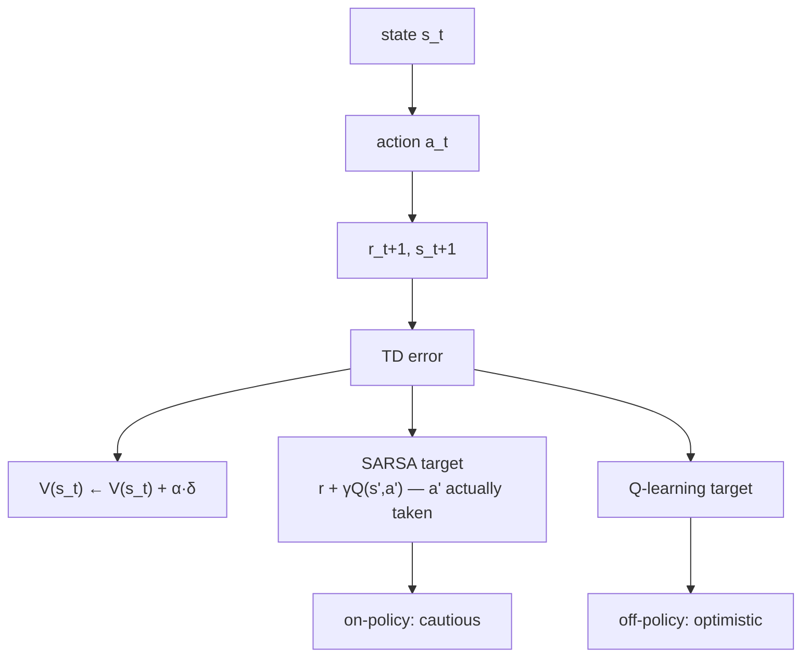

import TDvsMCLab from '@site/src/components/viz/TDvsMCLab';

**In one line.** Do not wait for the episode to end — update each step using your own estimate of what comes next.

## The idea in plain words

Monte Carlo waits for the final return. Dynamic programming needs a model. **Temporal difference learning takes the best of both**: it learns from a single step, using its own next estimate as a stand-in for the rest of the episode.

One line carries the whole idea:

`V(s) ← V(s) + α · [ r + γV(s′) − V(s) ]`

The bracket is the **TD error** δ — the gap between what you expected and what the next step suggests. Positive means pleasant surprise; negative means disappointment.

Because it bootstraps, TD is **biased but low variance**, learns **online**, and works on **continuing tasks**. That combination is why almost everything deployed is TD-based.

For control, the target changes what you learn:

- **SARSA** uses the action actually taken next → *on-policy*: it learns the value of the policy you are really following, exploration and all.
- **Q-learning** uses `max_a Q(s′,a)` → *off-policy*: it learns the greedy policy while behaving exploratively.



<TDvsMCLab />

## How it works

### Learning from every step

TD is model-free (like Monte Carlo) **and** updates every step without waiting for the episode to end (bootstrapping, like DP).

:::tip

**Update mid-game.** If a move leads somewhere much better than expected, adjust your judgement immediately — using your own estimate of the new position's value.

:::

### The TD(0) update

**V(s) ← V(s) + α[ r + γV(s′) − V(s) ]**. The bracket is the **TD error δ** — the surprise.

#### TD update calculator

Set V(s), reward, γ, next value and α; see the TD target, error and new value. Toggle SARSA vs Q-learning.

:::tip

**Worked.** V(s)=0.5, r=1, γ=0.9, V(s′)=0.6, α=0.1 → target 1.54, error 1.04, new V = **0.604**.

:::

### TD vs MC vs DP

- **DP** — Needs a model; bootstraps; no episode wait. Exact but requires the dynamics.
- **Monte Carlo** — Model-free; no bootstrap; waits for episode end. Unbiased but high variance.
- **TD** — Model-free **and** online (bootstraps). Lower variance, slightly biased early.

### SARSA & Q-learning

- **SARSA (on-policy)** — Q(s,a) ← Q + α[r + γQ(s′,a′) − Q], using the action actually taken. Learns a safer policy. Worked → **1.065**.
- **Q-learning (off-policy)** — Q(s,a) ← Q + α[r + γ·max_a′Q(s′,a′) − Q]. Learns Q* directly. Worked → **1.11**.

### Key takeaways

- **1 · TD(0)** — Update toward r+γV(s′); TD error δ; model-free & online.
- **2 · SARSA** — On-policy; uses the action taken; safer.
- **3 · Q-learning** — Off-policy; max over next actions; learns Q*.

:::note

**The thread.** Temporal-difference learning updates value estimates every step from raw experience, bootstrapping toward r+γV(s′) — model-free like Monte Carlo and online like dynamic programming. SARSA (on-policy) uses the action actually taken; Q-learning (off-policy) uses the best next action to learn the optimal Q* directly. Both explore with ε-greedy.

:::

## A real system that works this way

**The cliff-walking difference is a real safety story.** Q-learning learns the optimal path right along the cliff edge; SARSA, which accounts for its own ε-random slips, learns a safer path one row back. In robotics and process control the SARSA-style answer is usually the one you ship, because the exploring policy is the policy that actually runs.

**Prioritised replay in production systems** ranks transitions by |δ| — the TD error doubles as an "interestingness" score for which experiences deserve another look.

## Code you can run

Q-learning against SARSA on a cliff-walk grid — the classic demonstration of on- vs off-policy behaviour.

```python
import numpy as np

rng = np.random.default_rng(0)
ROWS, COLS = 4, 12
START, GOAL = (3, 0), (3, 11)
CLIFF = {(3, c) for c in range(1, 11)}
ACTIONS = [(-1, 0), (1, 0), (0, -1), (0, 1)]

def step(s, a):
    r, c = s
    dr, dc = ACTIONS[a]
    nxt = (min(max(r + dr, 0), ROWS - 1), min(max(c + dc, 0), COLS - 1))
    if nxt in CLIFF:
        return START, -100.0, False
    return nxt, -1.0, nxt == GOAL

def train(kind, episodes=500, alpha=0.5, gamma=1.0, eps=0.1):
    Q = np.zeros((ROWS, COLS, 4))
    totals = []
    for _ in range(episodes):
        s, total = START, 0.0
        a = int(rng.integers(4)) if rng.random() < eps else int(np.argmax(Q[s]))
        for _ in range(200):
            s2, r, done = step(s, a)
            a2 = int(rng.integers(4)) if rng.random() < eps else int(np.argmax(Q[s2]))
            target = r + gamma * (Q[s2][a2] if kind == "sarsa" else Q[s2].max())
            Q[s][a] += alpha * (target - Q[s][a])
            s, a, total = s2, a2, total + r
            if done:
                break
        totals.append(total)
    return Q, np.mean(totals[-100:])

_, q_score = train("qlearning")
_, s_score = train("sarsa")
print(f"average return over last 100 episodes")
print(f"  Q-learning (off-policy): {q_score:7.1f}   <- optimal path, hugs the cliff")
print(f"  SARSA      (on-policy) : {s_score:7.1f}   <- safer path, better while exploring")
```

## Designing with it

**Picking the update**

| You want | Use | Because |
| --- | --- | --- |
| The best possible policy, exploration is free | Q-learning | Learns the greedy policy regardless of how you behave |
| Safe behaviour *while learning* | SARSA / expected SARSA | Accounts for the exploratory actions you will actually take |
| Lower variance than MC, less bias than TD(0) | n-step TD or TD(λ) | Tunes how far you look before bootstrapping |

**Hyperparameters that actually matter**

- **α (step size).** Constant α tracks a changing world; decaying α converges in a stationary one. In production, constant and small.
- **n (lookahead).** n-step returns are the practical knob between MC (n=∞) and TD(0) (n=1). n=3–5 is a common sweet spot.
- **Target staleness.** Bootstrapping off a rapidly changing estimate is unstable — the deep-RL answer is a frozen target network.

**Failure mode:** silent divergence when you combine bootstrapping, function approximation and off-policy data. Monitor the TD error distribution, not just reward — it widens before the reward curve collapses.

## Where this stands in 2026

:::info Industry view

- TD is the engine of nearly every deployed value-based agent: it learns **online, per step**, without waiting for episodes to end.
- The **TD error doubles as a priority signal** — prioritised experience replay samples transitions the model is most wrong about.
- **SARSA vs Q-learning is a safety decision** in robotics and control, where the exploratory action can damage hardware.
- Expected SARSA is quietly the best default of the three: same cost, lower variance than SARSA, and it works on- or off-policy.

:::

## Practice questions

<details>
<summary><strong>Q1.</strong> What two ideas does TD learning combine, and from DP/MC?</summary>

It is model-free (learns from experience, like Monte Carlo) and bootstraps / updates every step without waiting for the episode to end (like DP).<br /><em>Session 9 · conceptual</em>

</details>

<details>
<summary><strong>Q2.</strong> Write the TD(0) update and define the TD error.</summary>

V(s) ← V(s) + α[r + γV(s′) − V(s)]. The TD error is δ = r + γV(s′) − V(s) — the difference between the estimate and the one-step target.<br /><em>Session 9 · conceptual</em>

</details>

<details>
<summary><strong>Q3.</strong> V(s)=0.5, r=1, γ=0.9, V(s′)=0.6, α=0.1. Compute the TD target, error and new V(s).</summary>

Target = 1 + 0.9·0.6 = 1.54; δ = 1.54 − 0.5 = 1.04; V(s) ← 0.5 + 0.1·1.04 = 0.604.<br /><em>Session 9 · numeric</em>

</details>

<details>
<summary><strong>Q4.</strong> How does the SARSA update differ from Q-learning?</summary>

SARSA (on-policy) bootstraps from the action actually taken: r + γQ(s′,a′). Q-learning (off-policy) bootstraps from the best next action: r + γ·maxₐ′Q(s′,a′), learning Q* directly.<br /><em>Session 9 · conceptual</em>

</details>

<details>
<summary><strong>Q5.</strong> Q(s,a)=0.5, r=1, γ=0.9, α=0.5, max Q(s′,·)=0.8. Give the Q-learning update.</summary>

Target = 1 + 0.9·0.8 = 1.72; Q ← 0.5 + 0.5·(1.72 − 0.5) = 1.11.<br /><em>Session 9 · numeric</em>

</details>

<details>
<summary><strong>Q6.</strong> On cliff walking, why does SARSA learn a safer path than Q-learning?</summary>

SARSA is on-policy, so it accounts for its own ε-greedy exploration (occasional random steps toward the cliff) and prefers a safer route; Q-learning learns the optimal edge path, ignoring exploration risk.<br /><em>Session 9 · conceptual</em>

</details>

## Further reading

- [Sutton & Barto, chapter 6](http://incompleteideas.net/book/the-book-2nd.html) — TD(0), SARSA, Q-learning and the cliff-walking example reproduced above.
- [Spinning Up — Q-learning family](https://spinningup.openai.com/en/latest/spinningup/rl_intro2.html) — how tabular TD scales into DQN and friends.
- [Source lecture: drl-s6-td-learning](https://learning.bansal-ai.in/drl-s6-td-learning/lecture.html) — the original interactive lecture these notes were built from.

- **[Lecture 4 slides — Model-Free Prediction (PDF)](https://davidstarsilver.wordpress.com/wp-content/uploads/2025/04/lecture-4-model-free-prediction-.pdf)** `course`
  David Silver — TD(0), n-step TD and TD(λ) — the natural next step after this session.
- **[Lecture 5 slides — Model-Free Control (PDF)](https://davidstarsilver.wordpress.com/wp-content/uploads/2025/04/lecture-5-model-free-control-.pdf)** `course`
  David Silver — SARSA vs Q-learning, including the cliff-walking comparison.
- **[Textbook — Chapter 6, Temporal-Difference Learning](http://incompleteideas.net/book/the-book-2nd.html)** `book`
  Sutton & Barto — The definitive treatment, with the full cliff-walking experiment. The free PDF is linked on that page.
