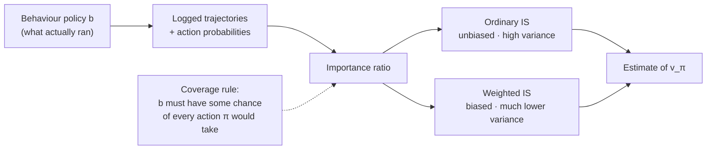

**In one line.** Reuse data collected by an old policy to judge a new one — by reweighting each trajectory by how likely the new policy was to produce it.

## The idea in plain words

You almost never get to collect fresh data with the policy you want to evaluate. You have **logs from the policy that was running**. Off-policy learning is how you bridge that gap.

Two policies:

- **Behaviour policy `b`** — what actually ran and generated the data.
- **Target policy `π`** — what you want to know about.

The fix is the **importance sampling ratio**: how much more (or less) likely the target policy was to take the actions that were actually taken.

`ρ = Π π(aₜ|sₜ) / b(aₜ|sₜ)`

Two ways to use it:

- **Ordinary IS** — multiply returns by ρ and average. Unbiased, but the variance can be enormous (a single ρ of 400 dominates everything).
- **Weighted IS** — divide by the sum of the weights. Slightly biased, dramatically lower variance. This is what people actually use.

One hard rule: **coverage**. If `b` never took an action, no maths recovers its value. `b(a|s) > 0` wherever `π(a|s) > 0`, or the estimate is meaningless.



## How it works

### Target vs behaviour

- **Target policy π** — The policy we want to evaluate or improve — often greedy.
- **Behaviour policy b** — The policy that generated the episodes — must keep exploring.

:::tip

**Coverage.** π(a|s) > 0 ⇒ b(a|s) > 0. Every action the target might take must be possible under behaviour, or its value can't be recovered from the data.

:::

:::note

**Why bother?** Learn from an older/safer controller, or from **logged data** you can't re-collect (recommenders, healthcare) — behave with b, ask "how would π have done?"

:::

### The trajectory ratio

ρ_t:T−1 = Π π(A_k|S_k) / b(A_k|S_k). The environment dynamics cancel — so the correction is model-free.

#### Importance-ratio builder

Set π and b for three observed decisions; see each ratio and the product ρ.

:::tip

**Worked.** π=(0.8,0.7,0.8), b=(0.5,0.4,0.5) → ρ = 0.448/0.100 = **4.48**. The return is weighted 4.48× — that sequence is 4.48× as likely under π.

:::

### Ordinary vs weighted IS

- **Ordinary IS** — Σ ρG / (number of visits). **Unbiased** but high — even **infinite** — variance.
- **Weighted IS** — Σ ρG / Σ ρ. **Biased** at finite samples but **consistent** and far more stable.

:::tip

**Worked.** G=(4.24, 2.61, 2.33), ρ=(6.667, 0.125, 1.5) → V_OIS = **10.70** (outside the return range!), V_WIS = **3.87** (safely inside).

:::

### Incremental weighted update

No stored history: C ← C + W, then V ← V + (W/C)(G − V). The step size W/C shrinks as evidence grows.

:::tip

**Worked.** (W,G) = (2,5),(1,2),(3,4) → V: 0 → 5 → 4 → **4**. A big first weight moves V a lot; later evidence anchors it.

:::

### Off-policy MC control

Improve π while a **soft** behaviour policy keeps exploring. Update Q by weighted IS, act greedily, and process each episode backward.

:::tip

**The break.** If the observed action isn't the greedy target action, π(A|S)=0 — so every earlier weight is zero. Stop the loop: only the **target-consistent suffix** teaches π. That's an exact shortcut, not a heuristic.

:::

### Key takeaways

- **1 · Reweight** — ρ = Π π/b corrects returns; dynamics cancel (model-free).
- **2 · OIS vs WIS** — Unbiased/high-variance vs biased/consistent — WIS usually preferred.
- **3 · Control** — Weighted-IS Q-update on the target-consistent suffix; break early.

:::note

**The thread.** Off-policy Monte Carlo lets you evaluate or improve a policy using data another policy produced, by reweighting complete returns with importance ratios. The whole art is variance control — which is why weighted importance sampling and careful weight monitoring matter as much as the identity itself.

:::

## A real system that works this way

**Every recommender team does this.** Before shipping a new ranker, you estimate how it *would have* performed on last month's traffic. That is off-policy evaluation, and the logged propensity score (the probability the old system gave to the item it showed) is the ρ denominator.

**Ad auctions and pricing** do the same to avoid burning revenue on a bad experiment, and health-policy research uses the identical machinery to estimate treatment effects from observational data.

## Code you can run

Ordinary versus weighted importance sampling on logged bandit data — you can see the variance difference immediately.

```python
import numpy as np

rng = np.random.default_rng(1)
N_LOGS, ARMS = 20_000, 3
TRUE_MEAN = np.array([0.10, 0.25, 0.40])      # unknown in reality

behaviour = np.array([0.70, 0.20, 0.10])       # old system: mostly arm 0
target    = np.array([0.10, 0.20, 0.70])       # new system: mostly arm 2

actions = rng.choice(ARMS, size=N_LOGS, p=behaviour)
rewards = (rng.random(N_LOGS) < TRUE_MEAN[actions]).astype(float)

rho = target[actions] / behaviour[actions]     # per-sample importance ratio

ordinary = np.mean(rho * rewards)              # unbiased
weighted = np.sum(rho * rewards) / np.sum(rho) # biased, lower variance
truth    = float(target @ TRUE_MEAN)

def bootstrap(fn, n=200, size=2000):
    vals = []
    for _ in range(n):
        idx = rng.integers(0, N_LOGS, size)
        vals.append(fn(rho[idx], rewards[idx]))
    return np.std(vals)

sd_o = bootstrap(lambda r, y: np.mean(r * y))
sd_w = bootstrap(lambda r, y: np.sum(r * y) / np.sum(r))

print(f"true value of target policy : {truth:.4f}")
print(f"ordinary IS  {ordinary:.4f}   (bootstrap sd {sd_o:.4f})")
print(f"weighted IS  {weighted:.4f}   (bootstrap sd {sd_w:.4f})")
print(f"effective sample size: {rho.sum()**2 / (rho**2).sum():.0f} of {N_LOGS}")
```

Note the **effective sample size** — it collapses when the two policies disagree. That number, not the point estimate, tells you whether to trust the result.

## Designing with it

**The logging contract**

You cannot do any of this unless the serving system logs the **propensity** — the probability with which it chose the action it chose. Design that in from day one:

```json
{"request_id": "…", "action": 17, "propensity": 0.043, "reward": 1.0, "policy_version": "ranker-2026-03"}
```

**Evaluation choices**

| Estimator | Bias | Variance | Use when |
| --- | --- | --- | --- |
| Ordinary IS | none | very high | Policies are close; you need an unbiased number |
| Weighted IS | small | much lower | Default for offline evaluation |
| Clipped / truncated IS | moderate | low | Ratios blow up; cap ρ at e.g. 10 |
| Doubly robust | small | low | You also have a reward model — best of both |

**Guardrails**

- Report **effective sample size** with every estimate; below a few hundred, the number is noise.
- Force **exploration floors** in the behaviour policy (never let any eligible action hit probability zero), or future evaluation is impossible.
- Watch for **stale policy versions** in logs — mixing policies without recording which one ran invalidates ρ.

## Where this stands in 2026

:::info Industry view

- **Off-policy evaluation is the production problem** — every recommender, ads and pricing team must estimate a new policy from old logs before risking traffic.
- Doubly-robust and clipped estimators are standard in counterfactual-evaluation libraries; plain ordinary IS is almost never shipped.
- The importance ratio reappears **verbatim in PPO and GRPO** — the clipped objective is a truncated importance weight.
- Offline RL (CQL, IQL, decision transformers) is the fastest-growing branch precisely because online exploration is unavailable in most businesses.

:::

## Practice questions

<details>
<summary><strong>Q1.</strong> Define target and behaviour policies, and state the coverage condition.</summary>

The target policy π is the one being evaluated/improved; the behaviour policy b generates the episodes. Coverage: π(a|s) > 0 ⇒ b(a|s) > 0 — every action the target might take must be possible under behaviour, or its value is unidentifiable.<br /><em>Session 8 · conceptual</em>

</details>

<details>
<summary><strong>Q2.</strong> Write the trajectory importance-sampling ratio and explain why the dynamics cancel.</summary>

ρ_t:T−1 = Π_k π(A_k|S_k) / b(A_k|S_k). Both trajectory probabilities contain the same environment terms p(s′,r|s,a), which cancel in the ratio — so the correction depends only on the policies, keeping it model-free.<br /><em>Session 8 · conceptual</em>

</details>

<details>
<summary><strong>Q3.</strong> Three decisions have π=(0.8,0.7,0.8) and b=(0.5,0.4,0.5). Compute ρ and interpret it.</summary>

ρ = (0.8·0.7·0.8)/(0.5·0.4·0.5) = 0.448/0.100 = 4.48. The sequence is 4.48× as likely under π, so the observed return is up-weighted by 4.48.<br /><em>Session 8 · numeric</em>

</details>

<details>
<summary><strong>Q4.</strong> Returns G=(5,2,4) have weights ρ=(3,0.5,1.5). Compute the ordinary and weighted IS estimates.</summary>

OIS = (3·5+0.5·2+1.5·4)/3 = 22/3 = 7.33; WIS = 22/(3+0.5+1.5) = 22/5 = 4.40. Only WIS is guaranteed to lie within the observed return range.<br /><em>Session 8 · numeric</em>

</details>

<details>
<summary><strong>Q5.</strong> Contrast ordinary and weighted importance sampling on bias and variance.</summary>

Ordinary IS (divide by count) is unbiased but high — even infinite — variance. Weighted IS (divide by Σ weights) is biased at finite samples but consistent and much more stable, so it is usually preferred.<br /><em>Session 8 · conceptual</em>

</details>

<details>
<summary><strong>Q6.</strong> Run the incremental weighted update for (W,G) = (2,5), (1,2), (3,4) starting V=0, C=0.</summary>

C←2, V←0+2/2(5−0)=5; C←3, V←5+1/3(2−5)=4; C←6, V←4+3/6(4−4)=4. Final V = 4.<br /><em>Session 8 · numeric</em>

</details>

<details>
<summary><strong>Q7.</strong> In off-policy MC control, why can the backward loop break at the first off-target action?</summary>

For a deterministic target, if the observed action ≠ the greedy action then π(A|S) = 0, so every earlier trajectory ratio contains that zero factor and all earlier contributions vanish. Stopping is an exact computational shortcut.<br /><em>Session 8 · conceptual</em>

</details>

<details>
<summary><strong>Q8.</strong> What does 'infinite variance' mean here, and why is unbiasedness not enough?</summary>

The estimate's expectation is correct but its second moment is unbounded (e.g. the one-state example gives 0.2·Σ(1.8)^k = ∞). A few rare, very large weights dominate, so ordinary averaging can stay unstable even after many episodes.<br /><em>Session 8 · conceptual</em>

</details>

## Further reading

- [Sutton & Barto, chapter 5.5–5.7](http://incompleteideas.net/book/the-book-2nd.html) — ordinary vs weighted importance sampling, with the variance analysis.
- [Doubly Robust Policy Evaluation and Learning (Dudík et al.)](https://arxiv.org/abs/1103.4601) — the estimator most production systems use.
- [Offline Reinforcement Learning: Tutorial, Review and Perspectives (Levine et al.)](https://arxiv.org/abs/2005.01643) — the reference survey for learning from logged data.
- [Source lecture: drl-s8-off-policy-mc](https://learning.bansal-ai.in/drl-s8-off-policy-mc/lecture.html) — the original interactive lecture these notes were built from.

- **[Reinforcement Learning: An Introduction](http://incompleteideas.net/book/the-book-2nd.html)** `book`
  Sutton & Barto — The RL book — the reference for everything in this course.
- **[Spinning Up in Deep RL](https://spinningup.openai.com/)** `docs`
  OpenAI — Policy gradients, actor-critic and model-based RL, explained to actually implement.
- **[David Silver's RL Course](https://www.youtube.com/watch?v=2pWv7GOvuf0)** `▶ video`
  David Silver, DeepMind — The canonical lecture series on MDPs, DP and value/policy methods.
