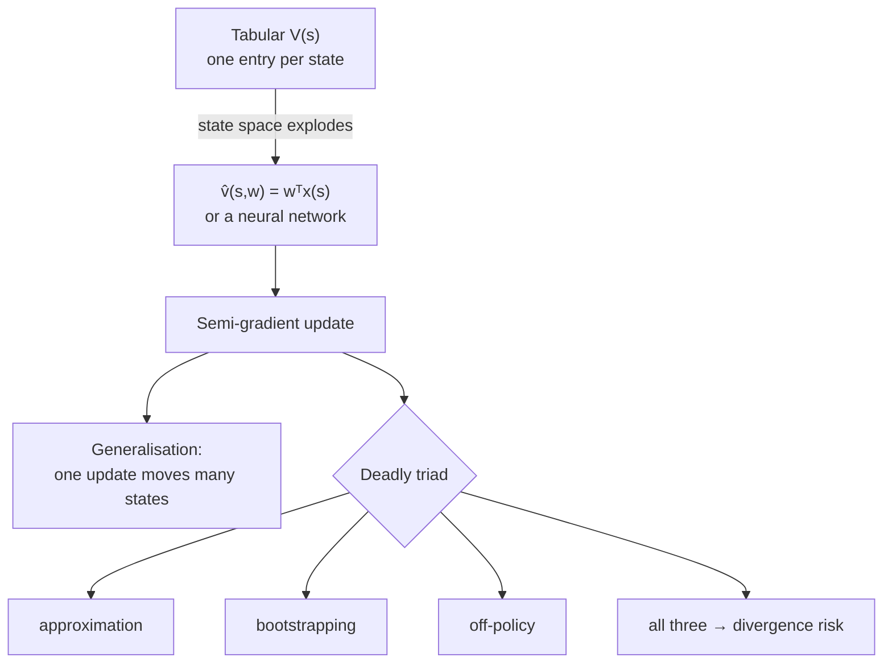

**In one line.** Once there are too many states to store, you fit a function to the value instead of tabulating it.

## The idea in plain words

A table needs one entry per state. Backgammon has 10²⁰ states; a camera image has more. So you **approximate**: `v̂(s,w) ≈ v(s)` with a parameter vector `w` far smaller than the state space.

This buys generalisation — updating one state now moves similar states too — and costs you every convergence guarantee dynamic programming had.

The update looks like supervised learning:

`w ← w + α [ target − v̂(s,w) ] ∇v̂(s,w)`

It is called a **semi-gradient** method because when the target itself contains `v̂` (bootstrapping), you deliberately ignore its dependence on `w`. That shortcut is what makes it fast and what makes it fragile.

The famous danger is the **deadly triad** — combine all three and divergence becomes possible:

1. Function approximation
2. Bootstrapping
3. Off-policy updates

Each pair is safe. All three together can send weights to infinity while the loss looks fine.



## How it works

### Why tables stop working

Too many states to visit them all in training, and too many to hold in memory. Worse — a table knows *nothing* about a state it hasn't seen.

:::tip

**Generalise.** Learning "cornered by a ghost is bad" should transfer to the near-identical board one pixel over. A table can't do that; an approximator can.

:::

### Linear value approximation

Describe the state by features **x(s)** and estimate **v̂(s,w) = wᵀx(s)**, with far fewer weights than states.

#### Semi-gradient TD update

Adjust the features, weights, reward and α. Watch the value estimate, TD error, and how *both* weights move.

:::tip

**Worked.** x(s)=[1,2], w=[0.5,0.1], r=1, γ=0.9, x(s′)=[0,1], α=0.1 → v̂=0.70, target 1.09, δ=0.39, w → **[0.539, 0.178]**.

:::

### SGD & semi-gradient methods

w ← w + α[U − v̂(s,w)]∇v̂(s,w). For linear approximation ∇v̂ = x(s), so the update is just **α·δ·x(s)**.

- **Monte Carlo target** — U = G (the full return) doesn't depend on w → this is **true** gradient descent. Unbiased, slower, higher variance.
- **TD target** — U = r + γv̂(s′,w) *does* depend on w. We ignore that → **semi-gradient**. Not a true gradient, but much faster.

### Constructing features

- **Coarse coding** — Overlapping circles over a continuous space; feature = 1 if the state is inside. Training a state updates every overlapping circle.
- **Tile coding** — Several offset grids; exactly one tile active per tiling. Efficient with a constant number of active features.
- **RBFs** — Like coarse coding but with smooth graded membership rather than 0/1.

:::note

**Why deep learning.** Hand-designed features are a needle in a combinatorial haystack. Neural networks *learn* the features instead — the subject of the next session.

:::

### Key takeaways

- **1 · Approximate** — v̂(s,w)=wᵀx(s); far fewer weights than states.
- **2 · Semi-gradient** — w ← w + αδx(s); the TD target depends on w and we ignore it.
- **3 · Features** — Coarse/tile coding, RBFs — or let a network learn them.

:::note

**The thread.** When the state space is too large to tabulate, we parameterise the value function and learn a small weight vector shared across states. Linear approximation makes the gradient the feature vector itself, so semi-gradient TD is a one-line update — and the choice of features decides how well the agent generalises.

:::

## A real system that works this way

**Ad and feed ranking** often keep a *linear* value head over engineered features rather than a deep network — it is predictable, debuggable, retrains in minutes and meets a 10 ms budget. Function approximation does not have to mean deep learning.

**Tile coding for control** (robot arms, vehicle dynamics) is still used where you need fast, stable, provably bounded updates without GPU inference in the loop.

## Code you can run

Linear semi-gradient TD(0) with simple features — you can see generalisation happening across states.

```python
import numpy as np

rng = np.random.default_rng(0)
N_STATES, GAMMA, ALPHA = 20, 0.95, 0.02

def features(s):
    """3 coarse, overlapping features instead of 20 table entries."""
    return np.array([1.0, s / (N_STATES - 1), (s / (N_STATES - 1)) ** 2])

def true_step(s):
    s2 = min(max(s + rng.choice([-1, 1]), 0), N_STATES - 1)
    reward = 1.0 if s2 == N_STATES - 1 else 0.0
    return s2, reward, s2 == N_STATES - 1

w = np.zeros(3)
for episode in range(3000):
    s = rng.integers(0, N_STATES)
    for _ in range(100):
        s2, r, done = true_step(s)
        x, x2 = features(s), features(s2)
        target = r + (0.0 if done else GAMMA * w @ x2)
        w += ALPHA * (target - w @ x) * x          # semi-gradient step
        if done:
            break
        s = s2

print("weights:", np.round(w, 3))
print("state :", [0, 5, 10, 15, 19])
print("v̂(s)  :", [round(float(w @ features(s)), 3) for s in [0, 5, 10, 15, 19]])
```

Three weights summarise twenty states, and values rise smoothly toward the goal — no state was ever stored individually.

## Designing with it

**Choosing the approximator**

| Option | Strengths | Use when |
| --- | --- | --- |
| Linear over engineered features | Fast, stable, interpretable, provable convergence on-policy | Low latency, regulated, small teams |
| Tile coding / RBF | Local generalisation, no catastrophic interference | Continuous control, modest dimensions |
| Neural network | Learns features from raw input | Images, text, large state spaces — and you can afford instability |

**Keeping it stable**

- Prefer **on-policy** updates (SARSA, actor-critic) when you cannot afford divergence.
- If you must be off-policy with a network, use the **DQN toolkit**: replay buffer, frozen target network, gradient clipping, and Huber loss.
- Normalise inputs and rewards. Unscaled rewards are the most common cause of exploding value estimates.
- **Monitor the value scale**, not just reward — a value function drifting to 10⁶ is the early warning of the triad biting.

**Failure mode:** catastrophic interference. A network trained on recent states forgets old ones. Replay buffers exist mainly to fix this.

## Where this stands in 2026

:::info Industry view

- Every deep RL system is this lecture plus a neural network — the **semi-gradient update is unchanged**, only the features are learned.
- The **deadly triad explains most real training failures**: silent divergence long before the reward curve reacts.
- Linear value heads over engineered features remain common in ads, trading and ranking, where latency and auditability beat raw accuracy.
- Target networks, replay and conservative offline objectives all exist to defuse one leg of the triad — know which leg each one addresses.

:::

## Practice questions

<details>
<summary><strong>Q1.</strong> Give two reasons tabular methods fail on large problems.</summary>

Too many states to visit them all during training, and too many to store a value table in memory. A table also generalises nothing to unseen states.<br /><em>Session 10 · conceptual</em>

</details>

<details>
<summary><strong>Q2.</strong> Write the linear value approximation and its gradient.</summary>

v̂(s,w) = wᵀx(s) = Σᵢ wᵢxᵢ(s). Its gradient is simply the feature vector: ∇v̂(s,w) = x(s).<br /><em>Session 10 · conceptual</em>

</details>

<details>
<summary><strong>Q3.</strong> x(s)=[1,2], x(s′)=[0,1], w=[0.5,0.1], r=1, γ=0.9, α=0.1. Do one semi-gradient TD(0) update.</summary>

v̂(s)=0.5(1)+0.1(2)=0.70; v̂(s′)=0.10; target=1+0.9(0.10)=1.09; δ=0.39; w ← [0.5,0.1]+0.1(0.39)[1,2] = [0.539, 0.178].<br /><em>Session 10 · numeric</em>

</details>

<details>
<summary><strong>Q4.</strong> Why is TD with function approximation called a *semi*-gradient method?</summary>

Because the TD target r+γv̂(s′,w) itself depends on w, but we take the gradient only of the estimate and ignore the target's dependence on w — so it is not a true gradient. It converges faster in practice.<br /><em>Session 10 · conceptual</em>

</details>

<details>
<summary><strong>Q5.</strong> Describe coarse coding and tile coding.</summary>

Coarse coding: overlapping circles/receptive fields; a feature is 1 if the state lies inside, so training one state updates all overlapping circles' weights. Tile coding: several offset grids where exactly one tile per tiling is active — efficient, constant number of active features.<br /><em>Session 10 · conceptual</em>

</details>

<details>
<summary><strong>Q6.</strong> What is the 'deadly triad' and why does it matter?</summary>

The combination of function approximation, bootstrapping and off-policy learning. Together they can make the weights diverge. On-policy semi-gradient TD with linear features is stable.<br /><em>Session 10 · conceptual</em>

</details>

## Further reading

- [Sutton & Barto, chapters 9–11](http://incompleteideas.net/book/the-book-2nd.html) — on-policy approximation, off-policy approximation and the deadly triad.
- [Deep Reinforcement Learning and the Deadly Triad (van Hasselt et al.)](https://arxiv.org/abs/1812.02648) — measures when the triad actually diverges in practice.
- [Source lecture: drl-s7-value-approximation](https://learning.bansal-ai.in/drl-s7-value-approximation/lecture.html) — the original interactive lecture these notes were built from.

- **[Lecture 6 slides — Value Function Approximation (PDF)](https://davidstarsilver.wordpress.com/wp-content/uploads/2025/04/lecture-6-value-function-approximation-.pdf)** `course`
  David Silver — Linear approximation, feature construction and the convergence issues in one place.
- **[Textbook — Chapter 9, On-policy Prediction with Approximation](http://incompleteideas.net/book/the-book-2nd.html)** `book`
  Sutton & Barto — Section 9.5 is the source for coarse coding, tile coding and RBFs. The free PDF is linked on that page.
