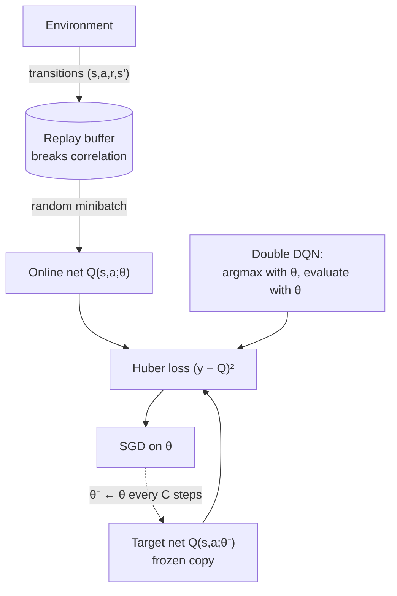

import MaxBiasLab from '@site/src/components/viz/MaxBiasLab';

**In one line.** Q-learning with a neural network, plus two tricks — a replay buffer and a frozen target — that stop it from destroying itself.

## The idea in plain words

Put a neural network in Q-learning and two things break.

**Problem 1: correlated data.** Consecutive frames are nearly identical, so the network overfits the last few seconds and forgets everything else. **Fix: experience replay** — store transitions in a buffer and train on random minibatches drawn from it.

**Problem 2: a moving target.** The target `r + γ max Q(s′,a)` uses the same network you are updating, so you chase your own tail. **Fix: a target network** — a frozen copy, synced every C steps.

There is a third, subtler problem that predates neural networks: **maximisation bias**. `max` over noisy estimates is biased upward — pick the largest of several noisy numbers and you systematically pick an overestimate. **Fix: Double Q-learning** — use one network to *choose* the action and the other to *evaluate* it.

That is the whole of DQN: Q-learning, replay, target network, and (in Double DQN) decoupled selection and evaluation.



<MaxBiasLab />

## How it works

### Approximating action values

Encode the action inside the feature vector: **q̂(s,a,θ) = θᵀφ(s,a)**, updated by θ ← θ + αδφ(s,a).

:::tip

**Running example (Chrome dino).** Features = [distance, height, action]. θ=[1.0, 0.5, 1.0], θ′=[0.1, 0.3, 1.0], γ=0.2, α=0.9. φ(S₁,0)=[1,0,0], φ(S₂,0)=[1,1,0], φ(S₂,1)=[1,1,1] → q̂(S₁,0)=**1.0**, q̂(S₂,0)=**1.5**, q̂(S₂,1)=**2.5**.

:::

### SARSA, Q-learning, Double Q

#### Target comparator

Switch method and watch the target, TD error and the updated weight θ₁ change on the same transition.

- **SARSA** — 2 + 0.2(1.5) = **2.30**, δ=1.30 → θ₁ = **2.17**
- **Q-learning** — 2 + 0.2(2.5) = **2.50**, δ=1.50 → θ₁ = **2.35**
- **Double Q** — 2 + 0.2(1.40) = **2.28**, δ=1.28 → θ₁ = **2.152**

### Maximisation bias

The max of *noisy* estimates is biased upward — and the same weights both choose and grade the action.

:::tip

**The fix.** Decouple: **select** the action with θ (a*=1), **evaluate** it with θ′ → q̂(S₂,1,θ′)=1.40 → target **2.28**. Roles swap at random over time.

:::

### Replay & target networks

Swap the linear model for a neural network and learning destabilises — consecutive game states are highly correlated. DQN adds two stabilisers.

- **Experience replay** — Store the last N transitions; overwrite old ones; train on **uniformly random mini-batches**. Breaks correlation and reuses data. Prioritised replay samples important transitions more often.
- **Target network** — Build targets from a frozen copy θ⁻, synced periodically — so the target doesn't chase the weights you're updating.

:::tip

**Double DQN.** y = r + γ·q̂(s′, argmax_a′ q̂(s′,a′,θ), θ⁻) — online net selects, target net evaluates.

:::

### Key takeaways

- **1 · q̂(s,a,θ)** — Action folded into the features; θ ← θ + αδφ(s,a).
- **2 · Max lies** — Maximisation bias: 2.50 vs true 2.40. Decouple → 2.28.
- **3 · DQN** — Experience replay + target network make deep RL stable.

:::note

**The thread.** Control with approximation folds the action into the features. Off-policy Q-learning converges faster but its max over noisy estimates systematically overestimates; Double Q-learning separates action selection from evaluation to fix that. Going deep adds correlation and instability, which experience replay and a frozen target network resolve — together these give DQN.

:::

## A real system that works this way

**Atari from pixels** was the original result, but the durable industrial uses are discrete, high-frequency decisions: **cache eviction and prefetching, bitrate selection in video streaming, ad-bid shading, and query routing**. All have cheap simulators and a small action set — exactly DQN's shape.

**Video streaming (ABR)** is the clearest case: choose the next chunk's bitrate from ~6 options to trade rebuffering against quality, trained in a network simulator and shipped as a small policy net.

## Code you can run

Maximisation bias in eight lines — the reason Double Q-learning exists. No deep learning needed to see it.

```python
import numpy as np

rng = np.random.default_rng(0)
N_ACTIONS, TRIALS, SAMPLES = 10, 20_000, 5

# every action's TRUE value is 0; estimates are noisy
single, double = [], []
for _ in range(TRIALS):
    est_a = rng.normal(0, 1, N_ACTIONS) / np.sqrt(SAMPLES)   # estimator A
    est_b = rng.normal(0, 1, N_ACTIONS) / np.sqrt(SAMPLES)   # estimator B

    single.append(est_a.max())                    # select AND evaluate with A
    best_by_a = int(np.argmax(est_a))
    double.append(est_b[best_by_a])               # select with A, evaluate with B

print(f"true value of every action     : 0.0000")
print(f"single estimator  max  → bias  : {np.mean(single):+.4f}   (systematically high)")
print(f"double estimator       → bias  : {np.mean(double):+.4f}   (unbiased)")
```

The single estimator is reliably optimistic; splitting selection from evaluation removes the bias. In DQN that is one line: `argmax` with the online network, value from the target network.

## Designing with it

**The knobs that decide whether it trains**

| Setting | Typical | Why it matters |
| --- | --- | --- |
| Replay capacity | 10⁵–10⁶ | Too small = correlated batches; too large = stale off-policy data |
| Target sync C | 1k–10k steps (or Polyak τ≈0.005) | Too fast = instability; too slow = stale targets, slow learning |
| Batch size | 32–256 | Bigger smooths gradients, costs throughput |
| Loss | Huber (smooth L1) | Caps the gradient from outlier TD errors |
| ε schedule | 1.0 → 0.05 over ~10% of training | Under-exploration early is the most common silent failure |

**The standard upgrades** (collectively "Rainbow"): Double DQN, duelling heads (separate V and advantage), prioritised replay (sample by |δ|), n-step returns, noisy nets, distributional critics. Double + n-step + prioritised replay give most of the benefit.

**Design constraints in production**

- Action space must be **small and discrete**. Continuous control belongs to policy-gradient methods.
- Inference must be one forward pass — that is why DQN suits latency-bound decisions.
- Keep an **off-policy evaluation harness**: you cannot A/B every candidate policy live.

**Failure mode:** exploding Q-values. If the mean predicted Q drifts far above the maximum achievable return, your target is feeding back on itself — shorten the sync interval, clip rewards, or lower γ.

## Where this stands in 2026

:::info Industry view

- Replay buffers and frozen targets are now **generic stability tools**, used in systems that never call themselves DQN.
- **Maximisation bias transfers far beyond RL** — the same error appears in greedy model selection, LLM-as-judge setups and any "pick the max of noisy scores" step.
- Value-based deep RL lives in discrete, high-frequency decisions: caching, bidding, routing, streaming bitrate.
- If you ship a DQN, start from a Rainbow-style baseline (Double + n-step + prioritised replay) rather than vanilla DQN.

:::

## Practice questions

<details>
<summary><strong>Q1.</strong> How is the action handled when approximating action values?</summary>

The action is encoded as part of the feature vector, giving q̂(s,a,θ) = θᵀφ(s,a), so one weight vector covers every state–action pair.<br /><em>Session 11 · conceptual</em>

</details>

<details>
<summary><strong>Q2.</strong> θ=[1.0,0.5,1.0], γ=0.2, α=0.9, r=2, φ(S₁,0)=[1,0,0], φ(S₂,0)=[1,1,0]. Do one SARSA update.</summary>

q̂(S₁,0)=1.0 and q̂(S₂,0)=1.5. Target = 2+0.2(1.5) = 2.30; δ = 1.30; θ ← [1.0,0.5,1.0]+0.9(1.30)[1,0,0] = [2.17, 0.5, 1.0].<br /><em>Session 11 · numeric</em>

</details>

<details>
<summary><strong>Q3.</strong> Same setup, φ(S₂,1)=[1,1,1]. Do one Q-learning update and compare.</summary>

q̂(S₂,1)=2.5, so max = 2.5. Target = 2+0.2(2.5) = 2.50; δ = 1.50; θ₁ → 2.35 — a bigger jump than SARSA's 2.17.<br /><em>Session 11 · numeric</em>

</details>

<details>
<summary><strong>Q4.</strong> Explain maximisation bias using the numbers above.</summary>

If the true values are q(S₂,0)=q(S₂,1)=2.0, the honest target is 2+0.2(2.0)=2.40. But the noisy estimates 1.5 and 2.5 make max = 2.5, giving 2.50 — an overestimate, because the same weights both select and evaluate the action.<br /><em>Session 11 · numeric/conceptual</em>

</details>

<details>
<summary><strong>Q5.</strong> Perform the Double Q-learning update (θ′=[0.1,0.3,1.0]).</summary>

Select with θ: argmax is a*=1 (2.5 > 1.5). Evaluate with θ′: q̂(S₂,1,θ′)=0.1+0.3+1.0=1.40. Target = 2+0.2(1.40) = 2.28; δ=1.28; θ₁ → 2.152 — closer to the true 2.40 than Q-learning's 2.50.<br /><em>Session 11 · numeric</em>

</details>

<details>
<summary><strong>Q6.</strong> What two mechanisms stabilise DQN, and what does each fix?</summary>

Experience replay — store transitions and sample random mini-batches, which breaks the correlation between consecutive states and reuses data. Target network — a periodically-synced frozen copy θ⁻ used to build targets, so the target stops chasing the weights being updated.<br /><em>Session 11 · conceptual</em>

</details>

## Further reading

- [Human-level control through deep reinforcement learning (Mnih et al., 2015)](https://www.nature.com/articles/nature14236) — the original DQN paper.
- [Deep RL with Double Q-learning (van Hasselt et al.)](https://arxiv.org/abs/1509.06461) — the bias demonstrated above, and the fix.
- [Rainbow: Combining Improvements in Deep RL](https://arxiv.org/abs/1710.02298) — which of the six additions actually matter.
- [CleanRL DQN implementation](https://docs.cleanrl.dev/rl-algorithms/dqn/) — single-file, readable, benchmarked reference code.
- [Source lecture: drl-s8-dqn](https://learning.bansal-ai.in/drl-s8-dqn/lecture.html) — the original interactive lecture these notes were built from.

- **[Deep Reinforcement Learning with Double Q-learning](https://arxiv.org/abs/1509.06461)** `paper`
  van Hasselt et al., 2015 — The paper behind this session: shows DQN really does overestimate, and that decoupling selection from evaluation fixes it.
- **[Prioritized Experience Replay](https://arxiv.org/abs/1511.05952)** `paper`
  Schaul et al., ICLR 2016 — The improvement to uniform replay mentioned in the lecture — replay important transitions more often.
- **[Lecture 6 slides — Value Function Approximation (PDF)](https://davidstarsilver.wordpress.com/wp-content/uploads/2025/04/lecture-6-value-function-approximation-.pdf)** `course`
  David Silver — Covers DQN's experience replay and target network as a stability fix.
