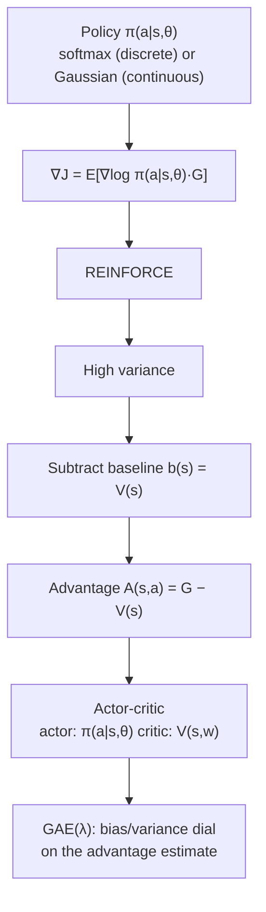

**In one line.** Instead of ranking actions by value and taking the max, nudge the probability of good actions up and bad ones down.

## The idea in plain words

Value methods have three limits: they need an `argmax` (so discrete, small action sets), they give a deterministic policy that flips on tiny value changes, and they cannot represent a genuinely stochastic optimum.

**Policy gradient methods parameterise the policy itself** — `π(a|s,θ)` — and climb the gradient of expected return. Discrete actions use a softmax over preferences; continuous actions output the mean of a Gaussian, which is how robots get controlled.

The key identity (the policy gradient theorem):

`∇J(θ) = E[ ∇log π(a|s,θ) · G ]`

**REINFORCE** turns that straight into an update: `θ ← θ + α·G·∇log π`. Take an action, see the return, make that action more likely in proportion to how good the return was.

It works, and it is **noisy**. The raw return `G` swings wildly, so updates jitter. The fix is a **baseline**: subtract something that does not depend on the action — ideally `V(s)`. What remains is the **advantage**:

`A(s,a) = G − V(s)` → "how much better than usual was this action?"

Learn `V(s)` with a second network and you have **actor-critic**: the actor picks actions, the critic scores them.



## How it works

### Why learn the policy directly?

Value methods need a max over actions (small discrete sets only) and give a deterministic policy where a tiny Q change flips the action — and they cannot represent a stochastic optimal policy. Policy methods parameterise π(a|s,θ) instead.

- **Advantages** — Continuous / high-dim actions (no argmax), genuinely stochastic policies, and smooth change → better convergence.
- **Disadvantages** — High variance, sample-inefficient, and typically converge to a *local* optimum.

:::tip

**Representing π.** Discrete → **softmax** over preferences h(s,a)=θ·x(s,a). Continuous → **Gaussian** π(a|s)=𝒩(μ_θ(s), σ²) — a network outputs the action's mean, so robots and continuous control become possible.

:::

### The policy gradient & REINFORCE

∇J = E[∇log π(a|s,θ) · G]. REINFORCE: θ ← θ + α·G·∇log π. For a softmax policy, ∇log π(a) = x(a) − average feature.

#### REINFORCE step

Set the two action preferences and the return; see the softmax policy and how one update shifts it.

:::tip

**Worked.** θ=[0.5,−0.2] → π=[0.668, 0.332]. Take action a, return G=2, α=0.1 → score [0.332,−0.332] → θ = **[0.566, −0.266]**. Action a is now more likely.

:::

### The variance problem & baselines

REINFORCE is unbiased but **high variance** — the raw return G is noisy, so updates jump around.

:::tip

**Fix.** Subtract a baseline b(s) that doesn't depend on the action (still unbiased). The best one is V(s), giving the **advantage** A(s,a) = G − V(s): "how much better than average was this action?"

:::

### Actor + Critic

Learn the baseline as a **critic** V(s,w), and use a one-step TD target so you update every step.

- **Actor** — π(a|s,θ) chooses actions. Updated by θ ← θ + αδ∇log π.
- **Critic** — V(s,w) evaluates states. Updated by w ← w + βδ∇V. Shared TD error δ = r + γV(s′) − V(s).

:::note

**Why it matters.** Lower variance than REINFORCE and online (no waiting for the episode to end). **A2C** batches it; **A3C** runs many actors in parallel.

:::

### TRPO & PPO: bound the step

Plain policy gradients are unstable — one big step can wreck the policy. Advanced methods limit **how far** the policy may move each update.

- **Natural gradient** — Measure distance in policy space (Fisher information), so steps are invariant to reparameterisation.
- **TRPO** — Maximise a surrogate objective subject to a KL constraint D_KL(π_old‖π_new) ≤ ε → monotonic improvement.
- **PPO** — Clip the ratio r=π_new/π_old to [1−ε,1+ε] in L^CLIP=E[min(rA, clip(r)A)]. Simple & today's default.

:::tip

**Worked (PPO clip).** A=+3, r=1.3, ε=0.2 → clip(1.3)=1.2 → objective = min(1.3·3, 1.2·3) = min(3.9, 3.6) = **3.6**. The update is capped — PPO won't over-commit to one sample.

:::

:::note

**Continuous control.** DDPG / TD3 / SAC pair a (deterministic or entropy-regularised) actor with a Q-critic for robotics.

:::

### Key takeaways

- **1 · Policy gradient** — ∇J = E[∇log π · Qπ]; learn π directly (softmax / Gaussian).
- **2 · REINFORCE + baseline** — θ ← θ + αG∇log π; subtract V(s) → advantage, less variance.
- **3 · Actor-critic → PPO** — TD-error critic; TRPO/PPO bound the step for stable improvement.

:::note

**The thread.** Policy-gradient methods optimise the policy directly by increasing the probability of actions that earned high return. REINFORCE does this with full returns (noisy); subtracting a learned value baseline gives the advantage, and actor-critic learns that baseline online — turning a high-variance idea into the workhorse of modern deep RL.

:::

## A real system that works this way

**Robotics and continuous control.** Anything with torques, steering angles or set-points uses actor-critic (PPO, SAC, TD3) because there is no max over a continuous action.

**LLM alignment is policy gradient.** The policy is the language model, the action is a generated response, and the advantage is the reward-model score minus a baseline. When people say "we RLHF'd the model", this is the maths underneath.

## Code you can run

REINFORCE with and without a baseline on a 3-armed problem — watch the variance, not just the mean.

```python
import numpy as np

rng = np.random.default_rng(0)
TRUE = np.array([0.2, 0.5, 0.9])          # expected reward per action
STEPS, RUNS, ALPHA = 400, 300, 0.1

def softmax(z):
    z = z - z.max()
    e = np.exp(z)
    return e / e.sum()

def train(use_baseline):
    finals = []
    for _ in range(RUNS):
        theta, baseline = np.zeros(3), 0.0
        for t in range(STEPS):
            pi = softmax(theta)
            a = rng.choice(3, p=pi)
            r = rng.normal(TRUE[a], 1.0)           # noisy reward
            adv = r - baseline if use_baseline else r
            grad = -pi
            grad[a] += 1.0                          # ∇log π(a)
            theta += ALPHA * adv * grad
            if use_baseline:
                baseline += 0.05 * (r - baseline)   # running V estimate
        finals.append(softmax(theta)[2])            # prob of the best action
    return np.mean(finals), np.std(finals)

for flag, name in [(False, "REINFORCE      "), (True, "with baseline  ")]:
    mean, sd = train(flag)
    print(f"{name} P(best action) = {mean:.3f}  ± {sd:.3f}")
```

Both learn the right action. The baseline version gets there with markedly less spread across runs — that reduced variance is what makes the method usable on real problems.

## Designing with it

**Which algorithm for which action space**

| Action space | Go-to method |
| --- | --- |
| Small and discrete | DQN family, or PPO if you want a stochastic policy |
| Large discrete (millions of items) | Policy gradient with sampled softmax, or a bandit |
| Continuous, low-dim | PPO, SAC, TD3 |
| Sequence generation (tokens) | PPO / GRPO with a KL leash to a reference model |

**Variance reduction, in the order you should apply it**

1. **Baseline / critic** — biggest single win.
2. **GAE(λ)** — λ≈0.95 trades a little bias for much less variance.
3. **Reward normalisation** — running mean/std on returns; unscaled rewards wreck the critic.
4. **More parallel environments** — averaging across workers beats a bigger step size.

**Entropy bonus.** Add `+β·H(π)` to keep the policy from collapsing to a single action early. β≈0.01 is a common start; decay it.

**Failure mode:** premature determinism. If entropy collapses in the first few thousand steps, the agent stops exploring and plateaus. Log policy entropy on every run — it is the most informative single curve in policy-gradient training.

## Where this stands in 2026

:::info Industry view

- **This is the family that trains modern LLMs** — PPO and GRPO are policy-gradient methods with a KL constraint.
- Actor-critic is the default for continuous control: robotics, autonomous-driving simulation, industrial process control, data-centre cooling.
- **GAE(λ) is in every serious implementation**; knowing why λ trades bias for variance is a standard senior interview probe.
- The score-function trick (`∇log π`) is the reason you can differentiate through sampling at all — it also underpins variational inference and discrete latent models.

:::

## Practice questions

<details>
<summary><strong>Q1.</strong> Give two advantages of policy-gradient methods over value-based methods.</summary>

They naturally handle continuous / large action spaces (no max needed) and can learn stochastic policies; they also change the policy smoothly, avoiding the brittle action-flips of value methods.<br /><em>Session 12-13 · conceptual</em>

</details>

<details>
<summary><strong>Q2.</strong> Write the REINFORCE update and the policy gradient it samples.</summary>

Gradient: ∇J = E[∇log π(a|s,θ) · G]. Update: θ ← θ + α·G·∇log π(aₜ|sₜ,θ).<br /><em>Session 12-13 · conceptual</em>

</details>

<details>
<summary><strong>Q3.</strong> θ=[0.5,−0.2], features x_a=[1,0], x_b=[0,1]. Give π, then one REINFORCE update after taking a with G=2, α=0.1.</summary>

π = softmax(0.5,−0.2) = [0.668, 0.332]. Score = x_a − E[x] = [1,0] − [0.668,0.332] = [0.332, −0.332]. θ ← [0.5,−0.2] + 0.1(2)[0.332,−0.332] = [0.566, −0.266].<br /><em>Session 12-13 · numeric</em>

</details>

<details>
<summary><strong>Q4.</strong> Why does REINFORCE have high variance, and how does a baseline help?</summary>

The raw return G is noisy, so updates vary wildly. Subtracting a baseline b(s) that doesn't depend on the action reduces variance while keeping the gradient unbiased; the best baseline is V(s), giving the advantage A = G − V(s).<br /><em>Session 12-13 · conceptual</em>

</details>

<details>
<summary><strong>Q5.</strong> In actor-critic, what do the actor and critic do, and what links them?</summary>

The actor π(a|s,θ) chooses actions; the critic V(s,w) estimates state value. Both are trained by the shared TD error δ = r + γV(s′) − V(s): θ ← θ + αδ∇log π and w ← w + βδ∇V.<br /><em>Session 12-13 · conceptual</em>

</details>

<details>
<summary><strong>Q6.</strong> How would you represent a policy for a continuous action (e.g. a steering angle)?</summary>

With a Gaussian policy π(a|s)=𝒩(μ_θ(s), σ²): a network outputs the mean action μ_θ(s) (and optionally σ) as a function of the state. Value-based argmax cannot do this.<br /><em>Session 12-13 · conceptual</em>

</details>

<details>
<summary><strong>Q7.</strong> What does TRPO constrain, and what does it guarantee?</summary>

TRPO maximises a surrogate objective subject to a KL-divergence trust region D_KL(π_old‖π_new) ≤ ε — limiting how far the policy moves each step, which guarantees monotonic improvement and stability.<br /><em>Session 12-13 · conceptual</em>

</details>

<details>
<summary><strong>Q8.</strong> PPO: advantage A=+3, ratio r=1.3, ε=0.2. What is the clipped objective value?</summary>

Clip r to [0.8,1.2] → clip(1.3)=1.2. Objective = min(rA, clip(r)A) = min(1.3·3, 1.2·3) = min(3.9, 3.6) = 3.6. The clipped term wins, so the update is capped — PPO avoids over-committing.<br /><em>Session 12-13 · numeric</em>

</details>

<details>
<summary><strong>Q9.</strong> Why is subtracting a baseline still unbiased? (one line)</summary>

Because E[∇log π(a|s) · b(s)] = 0 for any action-independent b(s), so it changes the variance but not the expected gradient.<br /><em>Session 12-13 · conceptual</em>

</details>

## Further reading

- [Sutton & Barto, chapter 13](http://incompleteideas.net/book/the-book-2nd.html) — the policy gradient theorem and REINFORCE with baseline.
- [Spinning Up — Intro to Policy Optimization](https://spinningup.openai.com/en/latest/spinningup/rl_intro3.html) — derivation plus working code.
- [High-Dimensional Continuous Control Using GAE (Schulman et al.)](https://arxiv.org/abs/1506.02438) — the advantage estimator everyone uses.
- [Lil'Log — Policy Gradient Algorithms](https://lilianweng.github.io/posts/2018-04-08-policy-gradient/) — the best single map of the whole family.
- [Source lecture: drl-s9-policy-gradients](https://learning.bansal-ai.in/drl-s9-policy-gradients/lecture.html) — the original interactive lecture these notes were built from.

- **[Reinforcement Learning: An Introduction](http://incompleteideas.net/book/the-book-2nd.html)** `book`
  Sutton & Barto — The RL book — the reference for everything in this course.
- **[Spinning Up in Deep RL](https://spinningup.openai.com/)** `docs`
  OpenAI — Policy gradients, actor-critic and model-based RL, explained to actually implement.
- **[David Silver's RL Course](https://www.youtube.com/watch?v=2pWv7GOvuf0)** `▶ video`
  David Silver, DeepMind — The canonical lecture series on MDPs, DP and value/policy methods.
