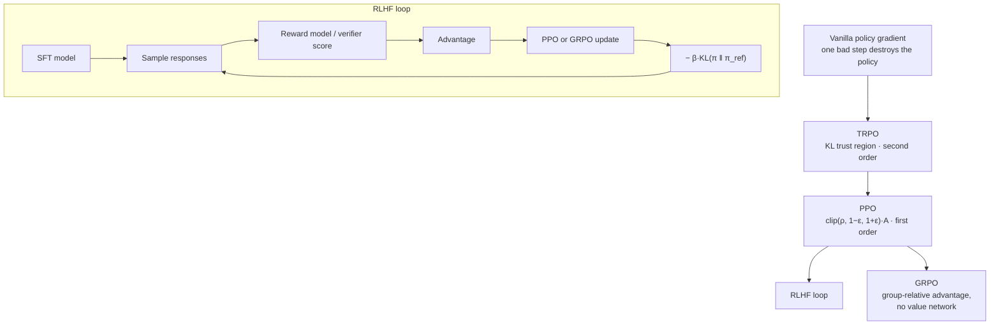

import PPOClipLab from '@site/src/components/viz/PPOClipLab';

**In one line.** PPO keeps each policy update small enough not to wreck the policy; GRPO drops the critic and scores answers against their own siblings.

## The idea in plain words

Vanilla policy gradients have a brutal failure mode: **one step that is slightly too large destroys the policy**, and because the policy generates the next batch of data, it never recovers.

**TRPO** fixed it properly — maximise improvement subject to a KL-divergence trust region — but needs second-order maths.

**PPO** got 95% of the benefit with a one-line trick. Take the importance ratio `ρ = π_new(a|s) / π_old(a|s)` and **clip** it:

`L = E[ min( ρ·A , clip(ρ, 1−ε, 1+ε)·A ) ]`

If an update tries to move the probability more than ~20% (ε=0.2), the objective flattens and the gradient vanishes. Simple, first-order, robust — which is why it became the default everywhere.

**GRPO** is the LLM-era variant. Training a value network for a language model is expensive, so GRPO deletes it: sample a **group** of G answers to the same prompt, and use each answer's reward minus the group mean (over the group std) as its advantage. The group *is* the baseline.

Around both sits the **KL leash**: a penalty against drifting too far from the reference (pre-RL) model. Without it, the policy finds whatever the reward model loves and collapses into it — that is **reward hacking**.



<PPOClipLab />

## How it works

### A3C & A2C

A single environment gives correlated data — bad for neural nets. Run many.

- **A3C (async)** — Independent workers push gradients to shared parameters without waiting — diverse, decorrelated experience.
- **A2C (sync)** — N environments collect NT steps under one policy, then one batched update — efficient and reproducible.

:::tip

**GAE.** Â_t = δ_t + γλδ_t+1 + (γλ)²δ_t+2 + … blends TD errors; λ trades bias vs variance. Worked: 1.0 + 0.8(−0.2) + 0.64(0.5) = **1.16**.

:::

### Proximal Policy Optimization

L^CLIP = E[min(r·Â, clip(r,1−ε,1+ε)·Â)], with r = π_new/π_old. Reuse a fresh batch without letting the policy drift too far.

#### PPO clip calculator

Set the ratio and advantage; see the unclipped term, the clipped term, and which one PPO selects.

:::tip

**Worked minibatch (ε=0.2).** (r,Â): (1.3,2)→2.40, (0.7,−1)→−0.80, (1.3,1)→1.20, (0.8,−2)→−1.60 → L^CLIP = **0.30**. The min must be applied *after* multiplying by  — that's why a negative-advantage row is handled correctly.

:::

### Text generation is a sequence of decisions

π_θ(y|x) = Π π_θ(y_t|x, y_&lt;t). State = prompt + prefix, action = next token, episode = one response, reward = response quality.

:::note

**PPO-RLHF.** Train a reward model r_φ on human preferences (Bradley–Terry), then improve the token policy with PPO — anchored to a frozen reference: r̃ = r_φ − β·log(π_θ/π_ref).

:::

### Direct Preference Optimization

DPO trains directly on fixed (x, y_w, y_l) pairs — no separate reward model, no online RL loop.

:::tip

**Margin & loss.** m_θ = [logπ_θ(y_w) − logπ_ref(y_w)] − [logπ_θ(y_l) − logπ_ref(y_l)], minimise −log σ(βm). Worked: m=0.7 → loss **0.403**; sharpen to m=1.3 → loss **0.241**.

:::

:::note

**GRPO.** Drop the value model: sample a group of G responses and use Â_i = (r_i − mean)/std. Great for math/code with auto-scoring.

:::

### Key takeaways

- **1 · Parallel + GAE** — A3C/A2C decorrelate data; GAE tunes bias vs variance.
- **2 · PPO** — Clipped ratio surrogate reuses a fresh batch conservatively.
- **3 · RLHF / DPO / GRPO** — Align LLMs from rewards or preferences; DPO skips the reward model.

:::note

**The thread.** The whole family is one idea — optimise a policy directly while keeping each update close to the data that justified it. PPO enforces that with clipping; RLHF applies it to learned rewards for language models; DPO and GRPO reshape the objective to learn from preferences without a full RL loop.

:::

## A real system that works this way

**Every major chat model.** The pipeline is: pre-train → supervised fine-tune → train a reward model on human preference pairs → optimise with PPO (or GRPO) under a KL penalty → evaluate for regressions.

**Reasoning models** shifted the reward from a learned preference model to **verifiable rewards** — did the unit test pass, is the final answer correct — and used GRPO to avoid a critic the size of the policy. That combination is what made long chain-of-thought training affordable.

## Code you can run

The two objectives, side by side, in NumPy. This is the actual arithmetic inside a PPO or GRPO trainer.

```python
import numpy as np

# ---------- PPO clipped objective ----------
def ppo_objective(ratio, advantage, eps=0.2):
    unclipped = ratio * advantage
    clipped = np.clip(ratio, 1 - eps, 1 + eps) * advantage
    return np.minimum(unclipped, clipped)

ratios = np.array([0.5, 0.9, 1.0, 1.1, 1.5, 2.0])
print("advantage = +1 (good action, we want more of it)")
for r in ratios:
    print(f"  ratio {r:4.1f} → objective {ppo_objective(r, +1.0):5.2f}")
print("advantage = -1 (bad action, we want less of it)")
for r in ratios:
    print(f"  ratio {r:4.1f} → objective {ppo_objective(r, -1.0):5.2f}")

# ---------- GRPO group-relative advantage ----------
def grpo_advantages(rewards):
    """No value network: the group of sampled answers IS the baseline."""
    r = np.asarray(rewards, dtype=float)
    return (r - r.mean()) / (r.std() + 1e-8)

group = [0.9, 0.4, 0.8, 0.1]        # reward for 4 answers to the SAME prompt
print("\nGRPO rewards   :", group)
print("GRPO advantages:", np.round(grpo_advantages(group), 3))
```

Read the PPO output carefully: once the ratio passes 1.2 with a positive advantage, the objective stops rewarding further movement — the gradient is switched off. That flat region *is* the trust region.

## Designing with it

**Building an RLHF/GRPO run**

| Component | Choice | Notes |
| --- | --- | --- |
| Reward | Learned reward model vs verifiable checker | Verifiable (tests, exact answer) is far harder to hack — prefer it where possible |
| Algorithm | PPO (has critic) vs GRPO (no critic) | GRPO saves ~half the memory; PPO is steadier on dense rewards |
| KL coefficient β | 0.01–0.1, often adaptive | Too low → reward hacking; too high → no learning |
| Group size G | 4–16 for GRPO | Smaller groups = noisier baseline; larger = more generation cost |
| ε (clip) | 0.1–0.2 | Lower for large models; the effective step size |

**Operational checklist**

- Keep a **frozen reference model** and log KL every step — it is the canary for collapse.
- Hold out a **prompt set the reward model never saw**; scoring gains there are real, gains only on train prompts are hacking.
- Watch **response length**. Sudden growth almost always means the reward model prefers verbosity, not quality.
- Budget for generation: in LLM RL, **sampling dominates cost**, not the gradient step.

**Failure mode:** reward hacking. The classic symptoms are length inflation, formulaic openings, sycophancy, and a reward curve that climbs while human preference falls. Fix the reward, not the optimiser.

## Where this stands in 2026

:::info Industry view

- **PPO is the workhorse** — the default in RLlib, Stable-Baselines3, TRL and most RLHF stacks, because it is robust to hyperparameters.
- **GRPO removed the critic**, cutting memory roughly in half; it is the method behind the recent wave of open reasoning models.
- **Verifiable rewards** (unit tests, exact-match answers, compiler success) are displacing learned preference models wherever the task allows checking.
- Expected senior answer to "how would you align a model": SFT → reward model or verifier → PPO/GRPO with a KL leash → eval for regressions and length inflation.

:::

## Practice questions

<details>
<summary><strong>Q1.</strong> Contrast A3C and A2C.</summary>

A3C runs asynchronous workers that push gradients to shared parameters without waiting (diverse, decorrelated data, possibly stale gradients). A2C is synchronous: N environments collect NT steps under one policy for a single batched update (efficient, reproducible).<br /><em>Session 13 · conceptual</em>

</details>

<details>
<summary><strong>Q2.</strong> Write the GAE advantage and compute a two-term estimate for δ_t=1.0, δ_\{t+1\}=−0.2, γλ=0.8 (with third term 0.5).</summary>

Â_t = δ_t + γλδ_t+1 + (γλ)²δ_t+2 + … = 1.0 + 0.8(−0.2) + 0.64(0.5) = 1.16. λ trades bias against variance.<br /><em>Session 13 · numeric</em>

</details>

<details>
<summary><strong>Q3.</strong> Write the PPO-Clip objective and explain what clipping actually limits.</summary>

L^CLIP = E[min(r·Â, clip(r,1−ε,1+ε)·Â)] with r = π_new/π_old. Clipping removes the extra objective benefit of moving a favourable ratio too far, while keeping the penalty for harmful moves — it does *not* force every ratio inside [1−ε, 1+ε].<br /><em>Session 13 · conceptual</em>

</details>

<details>
<summary><strong>Q4.</strong> PPO minibatch, ε=0.2: samples (r,Â) = (1.3,2), (0.7,−1), (1.3,1), (0.8,−2). Compute L^CLIP.</summary>

Contributions: min(2.6,2.4)=2.40; min(−0.7,−0.8)=−0.80; min(1.3,1.2)=1.20; min(−1.6,−1.6)=−1.60. L^CLIP = (2.40−0.80+1.20−1.60)/4 = 0.30.<br /><em>Session 13 · numeric</em>

</details>

<details>
<summary><strong>Q5.</strong> Why must PPO's min be applied after multiplying by the advantage, not by clipping the ratio alone?</summary>

For a negative advantage, clipping the ratio alone would *remove* the penalty for a harmful change. Applying min after multiplying by  makes the clipped product more negative, so the min correctly selects it and the harmful move stays penalised.<br /><em>Session 13 · conceptual</em>

</details>

<details>
<summary><strong>Q6.</strong> How is a language model a policy, and what are the state, action, episode and reward?</summary>

π_θ(y|x) = Π π_θ(y_t|x,y_&lt;t). State = prompt + generated prefix; action = next token; episode = one completed response; reward = a score/preference on response quality.<br /><em>Session 13 · conceptual</em>

</details>

<details>
<summary><strong>Q7.</strong> In RLHF, a response gets reward 3.0, sequence log-ratio to the reference 1.2, β=0.5. Compute the anchored reward and say what larger β does.</summary>

r̃ = 3.0 − 0.5·1.2 = 2.4. A larger β penalises drift from the reference more strongly, keeping the tuned model closer to the base behaviour.<br /><em>Session 13 · numeric</em>

</details>

<details>
<summary><strong>Q8.</strong> A DPO pair has policy-minus-reference log-ratios +0.4 (winner) and −0.3 (loser), β=1. Compute the margin, σ(βm) and the loss.</summary>

m = 0.4 − (−0.3) = 0.7; σ(0.7) = 0.668; loss = −log(0.668) = 0.403. Sharpening the margin lowers the loss (m=1.3 → 0.241).<br /><em>Session 13 · numeric</em>

</details>

<details>
<summary><strong>Q9.</strong> How does GRPO differ from PPO-RLHF and standard DPO?</summary>

GRPO drops the separate value model: it samples a group of G responses per prompt and uses the group-relative advantage Â_i = (r_i − mean)/std in a clipped objective. PPO-RLHF needs an explicit reward + value model and online generation; standard DPO uses fixed preference pairs with no reward model.<br /><em>Session 13 · conceptual</em>

</details>

## Further reading

- [Proximal Policy Optimization Algorithms (Schulman et al.)](https://arxiv.org/abs/1707.06347) — the clipped objective implemented above.
- [Trust Region Policy Optimization (Schulman et al.)](https://arxiv.org/abs/1502.05477) — the theory PPO approximates.
- [Hugging Face TRL documentation](https://huggingface.co/docs/trl/index) — production implementations of PPO, GRPO, DPO and reward modelling.
- [The 37 Implementation Details of PPO](https://iclr-blog-track.github.io/2022/03/25/ppo-implementation-details/) — why your PPO does not match the paper.
- [Source lecture: drl-s13-modern-policy-optimization](https://learning.bansal-ai.in/drl-s13-modern-policy-optimization/lecture.html) — the original interactive lecture these notes were built from.

- **[Reinforcement Learning: An Introduction](http://incompleteideas.net/book/the-book-2nd.html)** `book`
  Sutton & Barto — The RL book — the reference for everything in this course.
- **[Spinning Up in Deep RL](https://spinningup.openai.com/)** `docs`
  OpenAI — Policy gradients, actor-critic and model-based RL, explained to actually implement.
- **[David Silver's RL Course](https://www.youtube.com/watch?v=2pWv7GOvuf0)** `▶ video`
  David Silver, DeepMind — The canonical lecture series on MDPs, DP and value/policy methods.
