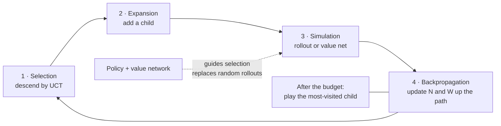

**In one line.** If you can simulate the future, you can search it — and search turns extra compute into better decisions without retraining.

## The idea in plain words

Model-free RL learns from experience alone. **Model-based RL uses a model of the environment** — given or learned — to *plan*: simulate ahead, see what happens, then act.

**Monte Carlo Tree Search** is the planning algorithm that made this famous. It builds an asymmetric tree, spending effort on promising branches, in four repeating phases:

1. **Selection** — walk down the tree picking children by UCT: `Q + c·√(ln N_parent / N_child)`. Same explore/exploit bonus as UCB.
2. **Expansion** — add a new child node at the frontier.
3. **Simulation** — estimate its value, originally by random rollout to the end of the game.
4. **Backpropagation** — push the result back up, updating visit counts and values along the path.

**AlphaGo / AlphaZero** replaced the weak parts with networks: a **policy network** to propose which moves are worth exploring and a **value network** to replace random rollouts. The search makes the network better; the improved play trains the network. That loop is the whole idea.

The catch for learned models: **compounding error**. Plan ten steps inside a slightly wrong model and step ten is fiction. Hence short horizons, ensembles, and replanning every step.



## How it works

### Model-free vs model-based

- **Model-free** — Learn values/policy straight from experience; no idea how the world works. Simple, but data-hungry.
- **Model-based** — Learn/know the dynamics P(s′|s,a) and rewards, then **plan** — simulate futures to choose actions.

:::tip

**Why it matters.** **Sample efficiency** — most experience is simulated, so far fewer real interactions. A chess player thinking ahead is planning with a model.

:::

:::note

**Model types.** A **distribution model** gives full P(s′,r|s,a); a **sample model** just generates a plausible next state/reward when asked (all MCTS needs).

:::

### Dyna: learn and plan together

Dyna-Q fuses model-free and model-based: every real step does **direct RL**, **model learning**, and **planning** — extra Q-updates on transitions the model imagines.

- **1 · Direct RL** — Update Q from the real transition (the usual TD update).
- **2 · Model learning** — Record (s,a) → (s′,r) so the model can replay it later.
- **3 · Planning** — Run n Q-updates on model-imagined transitions — same TD rule, simulated data.

:::tip

**Same update, real or imagined:** Q(s,a) ← Q(s,a) + α[r + γ·max Q(s′,a′) − Q(s,a)]. A few real steps + many planning steps learns far faster than model-free alone.

:::

### UCB action selection

UCB1(a) = Q̄(a) + c·√(ln N / n(a)) — exploit the good, but add a bonus for the uncertain.

#### UCB1 calculator

Set the mean value, exploration constant, total tries and this action's tries.

:::tip

**Worked.** Q̄=0.6, c=1.41, N=100, n=10 → bonus 1.41·√(4.605/10)=0.957 → UCB1 = **1.557**. A rarely-tried action (n=2) scores ~2.74, so it's explored first.

:::

### Monte-Carlo Tree Search

Build a search tree by repeating four steps thousands of times, then play the most-visited move.

- **1 · Select** — Walk down from the root by UCB until a node has untried actions.
- **2 · Expand** — Add one child for an untried action.
- **3 · Simulate** — Roll out to the end of the game for an outcome.
- **4 · Backup** — Propagate the outcome up the path, updating visits and values.

:::note

**Anytime.** More simulations → better move. Stop whenever time runs out, and you only need a simulator, not a full analytic model.

:::

### AlphaGo → AlphaGo Zero → MuZero

- **AlphaGo (2016)** — Four parts: a supervised policy net (human games), an RL policy net (self-play), a value net (who's winning), and MCTS guided by them.
- **AlphaGo Zero (2017)** — One net (policy + value), trained by **pure self-play**, no human data — MCTS is the teacher generating better targets each round. AlphaZero generalised it to chess/shogi.
- **MuZero** — **Learns the model** in latent space — never needs the true rules. One algorithm for Go, chess, shogi, Atari.
- **PlaNet / Dreamer** — Learn a latent world model and plan inside it for control from pixels.

### Key takeaways

- **1 · Plan** — Model-based = learn dynamics + plan; sample-efficient.
- **2 · UCB + MCTS** — Explore/exploit balance; select→expand→simulate→backup.
- **3 · AlphaGo/MuZero** — MCTS + nets; MuZero learns the model itself.

:::note

**The thread.** Model-based RL plans inside a learned model instead of learning purely by trial and error, buying sample efficiency. UCB decides what to try, MCTS turns simulations into a strong move, and combining that with self-trained neural networks produced the superhuman AlphaGo/MuZero family — as long as the model stays accurate.

:::

## A real system that works this way

**Chip floorplanning, compiler pass ordering and kernel scheduling** all use search-plus-learned-evaluation, because a simulator exists and a real trial is expensive.

**LLM inference-time search** is the same shape: sample several reasoning paths, score them with a verifier or reward model, and back up the best. Tree-of-thought, best-of-n with a verifier and MCTS-style decoding are direct descendants — the reason "thinking longer" improves answers without changing weights.

## Code you can run

A complete MCTS for tic-tac-toe in ~50 lines. It plays perfectly with enough simulations.

```python
import math, random
from collections import defaultdict

WINS = [(0,1,2),(3,4,5),(6,7,8),(0,3,6),(1,4,7),(2,5,8),(0,4,8),(2,4,6)]

def winner(b):
    for a, c, d in WINS:
        if b[a] and b[a] == b[c] == b[d]:
            return b[a]
    return None if any(x == "" for x in b) else "draw"

def moves(b):
    return [i for i, v in enumerate(b) if v == ""]

def play(b, i, mark):
    nb = list(b); nb[i] = mark; return tuple(nb)

def mcts(board, mark, budget=3000, c=1.4):
    N, W, children = defaultdict(int), defaultdict(float), {}

    def rollout(b, turn):                       # phase 3: random simulation
        while winner(b) is None:
            b = play(b, random.choice(moves(b)), turn)
            turn = "O" if turn == "X" else "X"
        w = winner(b)
        return 0.5 if w == "draw" else (1.0 if w == mark else 0.0)

    for _ in range(budget):
        b, turn, path = board, mark, []
        while winner(b) is None and b in children:      # 1: selection
            total = math.log(max(N[b], 1))
            b_next = max(children[b], key=lambda s: (W[s] / N[s] if N[s] else 1e9)
                         + c * math.sqrt(total / N[s]) if N[s] else 1e9)
            path.append(b_next); b = b_next
            turn = "O" if turn == "X" else "X"
        if winner(b) is None:                            # 2: expansion
            children[b] = [play(b, m, turn) for m in moves(b)]
            if children[b]:
                b = random.choice(children[b]); path.append(b)
                turn = "O" if turn == "X" else "X"
        value = rollout(b, turn)                         # 3: simulation
        for node in path:                                # 4: backpropagation
            N[node] += 1
            W[node] += value

    root_children = children.get(board, [play(board, m, mark) for m in moves(board)])
    best = max(root_children, key=lambda s: N[s])
    return [i for i in range(9) if best[i] != board[i]][0]

board = ("X", "O", "X",
         "",  "O", "",
         "",  "",  "")
print("MCTS plays square", mcts(board, "X"))   # must block O's column → 7
```

It finds the blocking move without any game-specific knowledge — only the rules and a simulation budget.

## Designing with it

**Model-based or model-free?**

| Situation | Choice |
| --- | --- |
| Rules are known and cheap to simulate (games, schedulers, routing) | Search — MCTS or exact planning |
| Simulator exists but is slow; real data is expensive | Learn a model, plan short horizons (Dyna, MBPO) |
| No model, plentiful cheap interaction | Model-free (PPO, DQN) |
| No model, expensive interaction | Offline RL from logs |

**Tuning the search**

- **Budget** is the product lever: more simulations = better play, linearly more latency. Expose it as a knob.
- **Exploration constant c** ≈ 1.4 for win-rate rewards in [0,1]; rescale if your rewards are not normalised.
- **Progressive widening** when the action space is large or continuous — only open new children as visits accumulate.
- **Play the most-visited child, not the highest-value one.** Visit counts are far more robust to noisy values.

**Failure mode:** model bias. Symptom — the plan looks excellent inside the model and fails in reality. Shorten the horizon, add model ensembles, and replan every step rather than committing to a long plan.

## Where this stands in 2026

:::info Industry view

- **Inference-time search is back in fashion** for LLMs: verifier-guided sampling, tree-of-thought and MCTS-style decoding all trade compute for quality without retraining.
- Model-based RL is the practical choice when real interaction is expensive — chip design, materials and drug discovery, robotics with a simulator, compiler tuning.
- The AlphaZero lesson worth quoting: **learned evaluation plus explicit search beats either alone**.
- MuZero-style methods learn the model in a latent space, removing the need for the true simulator — the direction most current research takes.

:::

## Practice questions

<details>
<summary><strong>Q1.</strong> How does model-based RL differ from model-free, and what's the payoff?</summary>

Model-free learns values/policy directly from experience with no model. Model-based learns/uses a model of dynamics P(s′|s,a) and rewards, then plans with it. The payoff is sample efficiency — most experience is simulated, so far fewer real interactions.<br /><em>Session 14 · conceptual</em>

</details>

<details>
<summary><strong>Q2.</strong> Write the UCB1 formula and explain each term.</summary>

UCB1(a) = Q̄(a) + c·√(ln N / n(a)): Q̄ is the action's mean value (exploit), and c·√(ln N / n) is an exploration bonus that is large for rarely-tried actions and shrinks as n(a) grows.<br /><em>Session 14 · conceptual</em>

</details>

<details>
<summary><strong>Q3.</strong> Compute UCB1 for Q̄=0.6, c=1.41, N=100, n=10.</summary>

bonus = 1.41·√(ln100/10) = 1.41·√(4.605/10) = 1.41·0.679 = 0.957; UCB1 = 0.6 + 0.957 = 1.557.<br /><em>Session 14 · numeric</em>

</details>

<details>
<summary><strong>Q4.</strong> List the four steps of MCTS in order.</summary>

Select (walk down by UCB), Expand (add a child for an untried action), Simulate (roll out to the end), Backup (propagate the outcome up, updating visits and values). Then play the most-visited move.<br /><em>Session 14 · conceptual</em>

</details>

<details>
<summary><strong>Q5.</strong> What did AlphaGo Zero add to MCTS, and how does MuZero go further?</summary>

AlphaGo Zero adds a neural network giving a policy and value, trained by self-play, to guide MCTS. MuZero learns the model itself in a latent space, so it never needs the true rules — one algorithm for Go, chess, shogi and Atari.<br /><em>Session 14 · conceptual</em>

</details>

<details>
<summary><strong>Q6.</strong> What is model bias and how is it mitigated?</summary>

If the learned model is wrong, planning optimises a fantasy and the policy fails in reality. Mitigate with frequent re-planning, short rollouts, or modelling only what affects value and reward.<br /><em>Session 14 · conceptual</em>

</details>

<details>
<summary><strong>Q7.</strong> Describe the three things a Dyna-Q agent does on every real step.</summary>

Direct RL (update Q from the real transition), model learning (record (s,a)→(s′,r)), and planning (run n extra Q-updates on model-imagined transitions, using the same TD rule). A few real steps plus many planning steps learns much faster.<br /><em>Session 14 · conceptual</em>

</details>

<details>
<summary><strong>Q8.</strong> Distinguish a distribution model from a sample model.</summary>

A distribution model returns the full probabilities P(s′,r|s,a); a sample model just generates one plausible (s′,r) when queried — cheaper, and all MCTS needs.<br /><em>Session 14 · conceptual</em>

</details>

<details>
<summary><strong>Q9.</strong> How does the original AlphaGo differ from AlphaGo Zero?</summary>

AlphaGo used a supervised policy net trained on human games plus an RL policy net, a value net and MCTS. AlphaGo Zero uses a single policy+value net trained by pure self-play with no human data — MCTS itself supplies the improved training targets.<br /><em>Session 14 · conceptual</em>

</details>

## Further reading

- [Mastering the game of Go without human knowledge (AlphaGo Zero)](https://www.nature.com/articles/nature24270) — search plus self-play, no human games.
- [A Survey of Monte Carlo Tree Search Methods (Browne et al.)](https://ieeexplore.ieee.org/document/6145622) — the canonical MCTS reference.
- [MuZero: Mastering Atari, Go, Chess and Shogi by Planning with a Learned Model](https://arxiv.org/abs/1911.08265) — planning without being given the rules.
- [Source lecture: drl-s10-model-based](https://learning.bansal-ai.in/drl-s10-model-based/lecture.html) — the original interactive lecture these notes were built from.

- **[Reinforcement Learning: An Introduction](http://incompleteideas.net/book/the-book-2nd.html)** `book`
  Sutton & Barto — The RL book — the reference for everything in this course.
- **[Spinning Up in Deep RL](https://spinningup.openai.com/)** `docs`
  OpenAI — Policy gradients, actor-critic and model-based RL, explained to actually implement.
- **[David Silver's RL Course](https://www.youtube.com/watch?v=2pWv7GOvuf0)** `▶ video`
  David Silver, DeepMind — The canonical lecture series on MDPs, DP and value/policy methods.
