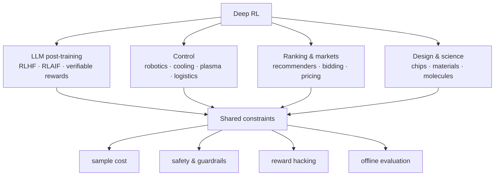

**In one line.** RL ships where a simulator or a reward model exists — and fails, when it fails, on reward design rather than on the algorithm.

## The idea in plain words

The honest summary of industrial RL:

- **It ships** when you can simulate cheaply (games, schedulers, networks), when you can score outcomes automatically (LLM post-training, verifiable tasks), or when the decision is short-horizon enough to be a bandit (ranking, pricing, notifications).
- **It struggles** when every trial costs money or safety, when the reward is a proxy for something you actually care about, and when the environment shifts under you.

Four topics you meet the moment you leave the textbook:

**Offline RL.** Learn from logged data only. The danger is *extrapolation error* — the policy proposes actions never seen in the data and the value function confidently hallucinates their value. CQL, IQL and decision transformers all constrain the policy toward the data.

**Safety.** Constrained MDPs, action shielding, and a rule-based veto layer. Always ship with a hard-coded fallback policy.

**Multi-agent.** Once other learning agents share the environment, it stops being stationary — the thing your policy was optimised against changes. Highly relevant to LLM agent systems and to markets.

**Evaluation.** Off-policy evaluation and staged rollout, because you cannot A/B test every candidate policy on live users.



## How it works

### Behavioural cloning & DAgger

BC = supervised learning: predict the expert action. L = −(1/N)Σ log π(a^E|s).

#### Cloning loss

How much loss does the policy pay for the demonstrated action, given the probability it assigns?

### Infer the objective

Two experts can take different paths with the same intent. Inverse RL recovers a reward r_w = wᵀf(s,a) that explains the behaviour, then optimises it.

:::tip

**Not unique.** A positive rescaling preserves the ordering, and unseen states are unconstrained — so aim for a **useful behavioural model**, not one true reward. GAIL matches occupancy; preference models learn from comparisons.

:::

### Markov games & CTDE

Several agents choose joint actions; the next state depends on all of them.

- **New difficulties** — Non-stationarity (others learn too), joint-action growth (mⁿ), credit assignment, partial observability.
- **CTDE** — Centralized Training, Decentralized Execution: joint info trains a better critic; each agent acts from local observations (MADDPG, QMIX, MAPPO).

### Human feedback & safety constraints

Human knowledge enters as demonstrations, corrections, scalar scores, or preferences. Safety is separate: high reward ≠ permitted behaviour.

:::tip

**Constrained form.** max_θ J_R(θ) subject to J_C(θ) ≤ d. Mechanisms: constrained policy optimisation, Lagrangian penalties, action shielding, human intervention.

:::

### From robots to LLM agents

RL fits repeated decisions whose current action changes future opportunities: robotics, driving, energy, recommenders, finance, and language-model agents (token, tool-call, code-edit as actions).

:::note

**Proxy caution.** A learned reward or verifier is only a proxy. If the policy scores well by exploiting the test harness, optimisation succeeds numerically while the real task fails — evaluate beyond the training reward.

:::

### Key takeaways

- **1 · Imitation** — BC clones; distribution shift; DAgger labels learner states.
- **2 · IRL & MARL** — Infer a (non-unique) reward; many agents need CTDE.
- **3 · Safe RL** — max J_R s.t. J_C ≤ d; reward is only a proxy.

:::note

**The thread.** Real problems rarely give you one agent, a clean reward, and unlimited safe interaction. These methods each relax one assumption — using demonstrations, inferred rewards, other agents, human feedback, or constraints — while keeping the same sequential-decision machinery underneath.

:::

## A real system that works this way

**Data-centre cooling** (DeepMind/Google): shadow mode → human veto → constrained autonomy, with a hard safety envelope the agent cannot cross. The deployment pattern matters more than the algorithm.

**Tokamak plasma control** (DeepMind/EPFL): trained entirely in simulation, transferred to hardware — a template for "simulate, then transfer" in physical systems.

**Recommendation and ads**: mostly contextual bandits plus off-policy evaluation, not deep RL, because short-horizon credit assignment is enough and evaluation is tractable.

## Code you can run

A minimal safety shield plus staged-rollout gate — the wrapper pattern almost every production agent needs.

```python
from dataclasses import dataclass

@dataclass
class Limits:
    min_setpoint: float = 18.0
    max_setpoint: float = 27.0
    max_delta: float = 0.5          # never move more than this per step

class ShieldedPolicy:
    """Wrap a learned policy in hard constraints and a fallback."""

    def __init__(self, learned, fallback, limits=Limits()):
        self.learned, self.fallback, self.limits = learned, fallback, limits
        self.vetoes = 0

    def act(self, state, current_setpoint):
        proposed = self.learned(state)
        safe = self._project(proposed, current_setpoint)
        if safe != proposed:
            self.vetoes += 1                       # log every correction
        if not self._in_distribution(state):
            return self.fallback(state)            # unknown state → known-good rule
        return safe

    def _project(self, value, current):
        low = max(self.limits.min_setpoint, current - self.limits.max_delta)
        high = min(self.limits.max_setpoint, current + self.limits.max_delta)
        return min(max(value, low), high)

    def _in_distribution(self, state):
        return all(-5.0 <= x <= 45.0 for x in state)   # stand-in for an OOD detector

aggressive = lambda s: 31.0                  # a learned policy that wants too much
rule_based = lambda s: 22.0                  # boring, safe, known to work

policy = ShieldedPolicy(aggressive, rule_based)
print("normal state :", policy.act([22.0, 30.0], current_setpoint=22.0))   # clipped
print("weird state  :", policy.act([99.0, 30.0], current_setpoint=22.0))   # fallback
print("vetoes logged:", policy.vetoes)
```

The learned policy asked for 31.0; the shield allowed 22.5, and an out-of-distribution reading handed control back to the rule. **Veto rate is the metric to alert on** — a rising veto rate means the policy is drifting away from what you validated.

## Designing with it

**The deployment ladder** — every successful RL rollout climbs it in order:

1. **Offline evaluation** on logs (weighted IS / doubly robust) — is the candidate even plausible?
2. **Shadow mode** — the policy runs and logs decisions, but nothing acts on them. Compare against the incumbent.
3. **Human-in-the-loop** — the policy proposes, a person or rule approves.
4. **Constrained autonomy** — the policy acts inside a shield, with a fallback and a kill switch.
5. **Full autonomy** on a traffic slice, expanding as metrics hold.

**What to monitor**

| Signal | Why |
| --- | --- |
| Veto / clip rate | Policy drifting outside validated behaviour |
| Action distribution shift | Environment changed or model degraded |
| Value estimate scale | Early warning of divergence |
| Reward vs true business metric | Detects reward hacking — the gap is the tell |
| Effective sample size in OPE | Whether your offline numbers mean anything |

**Reward design checklist:** write the reward, then ask "if an adversary maximised exactly this, what would they do?" If the answer is unpleasant, the reward is wrong. Add constraints or change the metric — do not try to out-tune a bad objective.

## Where this stands in 2026

:::info Industry view

- **Reward specification, not algorithm choice, causes most production incidents** in RL systems.
- Offline RL and off-policy evaluation are the growth area, because most companies have logs and no safe way to explore.
- Safety/constrained RL (CMDPs, shielding, conservative objectives) is a prerequisite for anything touching hardware, health or money.
- **Multi-agent non-stationarity is now literal in LLM agent systems** — each agent changes the environment the others learned in.

:::

## Practice questions

<details>
<summary><strong>Q1.</strong> A driving policy has 98% action accuracy on expert demos but drifts off the road when deployed. Explain, and say how DAgger helps.</summary>

A policy affects its own future inputs: a small error reaches states rare in the expert data, where accuracy is worse, so errors compound (distribution shift). DAgger collects expert labels on the states the learner actually visits and retrains, teaching recovery.<br /><em>Session 15 · conceptual</em>

</details>

<details>
<summary><strong>Q2.</strong> Compute the behavioural-cloning loss when the policy gives the expert action probability 0.8, and when 0.2.</summary>

L = −log p: −log(0.8) = 0.223; −log(0.2) = 1.609. Higher probability on the demonstrated action means lower loss.<br /><em>Session 15 · numeric</em>

</details>

<details>
<summary><strong>Q3.</strong> Why might inverse RL be preferable to cloning, and why is the inferred reward not unique?</summary>

Two experts can reach a goal by different paths with the same intent, so inferring the reward/objective generalises better than copying actions. It is not unique because a positive rescaling preserves trajectory ordering and unvisited states are unconstrained.<br /><em>Session 15 · conceptual</em>

</details>

<details>
<summary><strong>Q4.</strong> Name three difficulties that are specifically multi-agent, and what CTDE provides.</summary>

Non-stationarity (others are learning), joint-action growth (mⁿ), and credit assignment (shared reward hides who helped) — also partial observability. CTDE uses joint information to train a better critic while each agent acts from local observations at execution.<br /><em>Session 15 · conceptual</em>

</details>

<details>
<summary><strong>Q5.</strong> Write the constrained safe-RL objective and explain why high reward is not evidence of safety.</summary>

max_θ J_R(θ) subject to J_C(θ) ≤ d. A high mean return can hide rare catastrophic violations, so evaluation must report violation rates, tail outcomes, intervention frequency, and behaviour under distribution shift.<br /><em>Session 15 · numeric</em>

</details>

<details>
<summary><strong>Q6.</strong> What is GAIL, and how does it differ from classic inverse RL?</summary>

GAIL matches the expert's state–action occupancy using a discriminator that the policy tries to fool, rather than first recovering an interpretable reward. Its goal is behaviour matching, not reward recovery.<br /><em>Session 15 · conceptual</em>

</details>

<details>
<summary><strong>Q7.</strong> For an LLM coding agent, give two non-token actions and two verifiable outcome signals, and one exploitation risk.</summary>

Actions: run tests / edit a file / call a tool. Signals: unit-test pass rate and compiler/build success. Risk: the agent could exploit a weak verifier (e.g. hard-code a test's expected output) and score well without solving the task.<br /><em>Session 15 · conceptual</em>

</details>

<details>
<summary><strong>Q8.</strong> Why is a learned reward or verifier only a proxy, and what follows for evaluation?</summary>

Because the policy can obtain a high score by exploiting flaws in the reward/verifier rather than doing the intended task. Evaluation must therefore use measures that are not identical to the training reward (capability, safety, robustness, distribution-shift tests).<br /><em>Session 15 · conceptual</em>

</details>

## Further reading

- [Offline RL: Tutorial, Review, and Perspectives (Levine et al.)](https://arxiv.org/abs/2005.01643) — the reference for learning from logs.
- [Concrete Problems in AI Safety (Amodei et al.)](https://arxiv.org/abs/1606.06565) — reward hacking, safe exploration and distributional shift, stated precisely.
- [Magnetic control of tokamak plasmas through deep RL](https://www.nature.com/articles/s41586-021-04301-9) — a full sim-to-real deployment write-up.
- [Source lecture: drl-s15-selected-topics-applications](https://learning.bansal-ai.in/drl-s15-selected-topics-applications/lecture.html) — the original interactive lecture these notes were built from.

- **[Reinforcement Learning: An Introduction](http://incompleteideas.net/book/the-book-2nd.html)** `book`
  Sutton & Barto — The RL book — the reference for everything in this course.
- **[Spinning Up in Deep RL](https://spinningup.openai.com/)** `docs`
  OpenAI — Policy gradients, actor-critic and model-based RL, explained to actually implement.
- **[David Silver's RL Course](https://www.youtube.com/watch?v=2pWv7GOvuf0)** `▶ video`
  David Silver, DeepMind — The canonical lecture series on MDPs, DP and value/policy methods.
