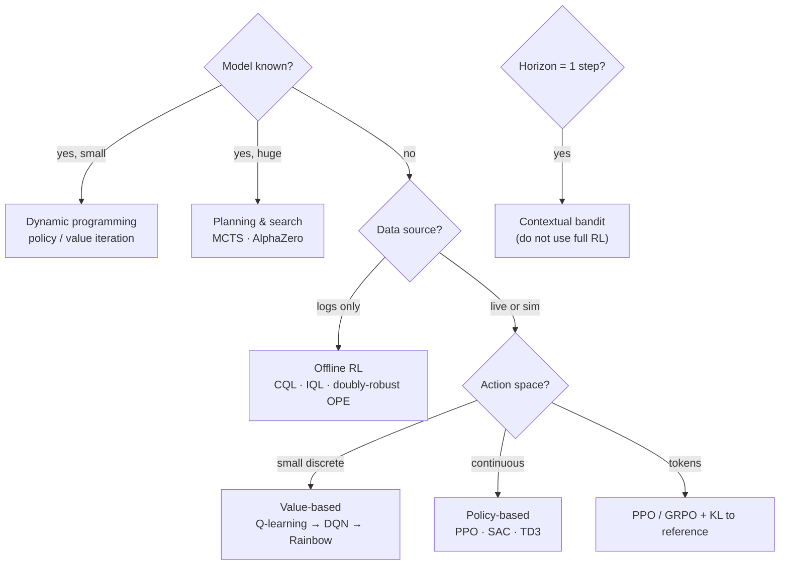

**In one line.** Four questions — model, action space, data source, horizon — narrow the whole field to one or two sensible algorithms.

## The idea in plain words

Every algorithm in this subject answers the same question differently. This is the decision path to run in an interview or a design review.

**1. Do you have a model of the environment?**
Yes and it is small → dynamic programming. Yes but huge → planning/search (MCTS). No → keep going.

**2. Where does data come from?**
Live interaction → online RL. Logs only → offline RL and off-policy evaluation. A cheap simulator → almost anything.

**3. What does the action space look like?**
Small and discrete → value-based (DQN family). Continuous or enormous → policy-based (PPO, SAC). Sequence generation → PPO/GRPO with a KL leash.

**4. How long is the horizon?**
One step → it is a **bandit**; do not use RL. Short → n-step or contextual bandit. Long → you need a critic and a careful advantage estimator.

And the three failures to name before anyone asks: **deadly triad** divergence, **reward hacking**, and **distribution shift** between the behaviour and target policies.



## How it works

### One problem, five choices

Every algorithm differs mainly in: what it learns, where its targets come from, whether it uses a model, whether it bootstraps, and how the data are generated.

:::tip

**Bellman everywhere.** v_π(s) = E[R + γv_π(S′)]; q_*(s,a) = E[R + γ max q_*(S′,a′)]. DP uses a model; TD/Q-learning use samples; DQN uses a network; actor-critic guides a policy.

:::

### Learning from experience

- **Bandits / DP** — Bandits isolate explore/exploit; DP plans with a known model (policy/value iteration, GPI).
- **MC / TD** — MC learns from complete returns (no bootstrap); TD updates after one transition and bootstraps.

#### TD error calculator

δ = R + γV(S′) − V(S). The one number a critic and an actor both use.

:::tip

**Worked.** R=2, γ=0.9, V(S)=1.0, V(S′)=1.5 → δ = 2 + 0.9·1.5 − 1.0 = **2.35**. Sarsa / Q-learning / Expected Sarsa differ only in the next-action term.

:::

### Approximation, DQN & policy gradients

- **Value-based** — Function approximation replaces the table; DQN adds replay + target network; Double DQN fixes max-bias.
- **Policy-based** — Δθ ∝ (quality signal)·∇log π. Signal = return (REINFORCE), advantage (baseline), or TD error (actor-critic); PPO clips the ratio.

### Three axes to keep separate

- **Model-based vs free** — Is a model used to predict/simulate consequences? A neural net alone doesn't make a method model-based.
- **Value vs policy** — Is the action rule read off values, or is the policy directly parameterised?
- **On- vs off-policy** — Does learning target the same policy that generated the data?

:::note

**They combine.** DQN = value-based, off-policy. PPO = policy-based, on-policy. MCTS = model-based decision-time planning.

:::

### Model first, then choose

- **1 · Interface first** — Agent(s), state, action, reward/feedback, horizon, data source, constraints, evaluation.
- **2 · Identify the signal** — Model expectation, sampled return, TD target, advantage, expert action, preference, or search result.
- **3 · Evaluate broadly** — Sample efficiency, robustness, safety, generalization — not just average return.

:::note

**The thread.** Reinforcement learning is one family for learning and planning under sequential consequences. The strongest understanding is seeing how the methods relate — each changes what information is available, how future consequences are estimated, and how that estimate improves behaviour. Formulate the problem first; the algorithm follows.

:::

## A real system that works this way

**A worked triage.** "Should we use RL to decide which push notification to send?" Horizon is effectively one step, feedback arrives in minutes, and you have logs with propensities. Answer: **contextual bandit with Thompson sampling**, evaluated off-policy. Reaching for PPO here is the classic over-engineering mistake.

**Second triage.** "Optimise a warehouse robot's picking route." Model is known, state space is large but structured, safety matters. Answer: **planning/search first**, RL only for the residual decisions a planner handles badly.

## Code you can run

The decision path, written down so it can be reviewed and argued with.

```python
def recommend(model_known, state_space, data, action_space, horizon):
    if horizon == 1:
        return "Contextual bandit (Thompson sampling) + off-policy evaluation"
    if model_known:
        return ("Dynamic programming (value/policy iteration)"
                if state_space == "small" else "Planning & search (MCTS / AlphaZero-style)")
    if data == "logs":
        return "Offline RL (CQL / IQL) + doubly-robust off-policy evaluation"
    if action_space == "discrete-small":
        return "Value-based: DQN + Double + n-step + prioritised replay"
    if action_space == "tokens":
        return "PPO or GRPO with a KL penalty to a frozen reference model"
    return "Policy-based actor-critic: PPO (on-policy) or SAC (off-policy, continuous)"

cases = [
    dict(model_known=False, state_space="large", data="logs",
         action_space="discrete-large", horizon=1),
    dict(model_known=True, state_space="small", data="sim",
         action_space="discrete-small", horizon=50),
    dict(model_known=False, state_space="large", data="sim",
         action_space="continuous", horizon=1000),
    dict(model_known=False, state_space="large", data="sim",
         action_space="tokens", horizon=200),
]
for c in cases:
    print(f"{c['action_space']:16} horizon={c['horizon']:<5} → {recommend(**c)}")
```

## Designing with it

**The comparison table worth memorising**

| Family | Needs a model | On/off-policy | Action space | Signature weakness |
| --- | --- | --- | --- | --- |
| Dynamic programming | Yes | — | Discrete, small | Needs full transition model |
| Monte Carlo | No | Either | Any | High variance; episodes must end |
| TD / SARSA / Q-learning | No | On / Off | Discrete | Bias from bootstrapping |
| DQN family | No | Off | Discrete | Deadly triad; needs replay + target net |
| REINFORCE | No | On | Any | Very high variance |
| Actor-critic / PPO | No | On (mostly) | Any | Sample-hungry; sensitive to advantage scaling |
| GRPO | No | On | Tokens | Needs several samples per prompt |
| MCTS / AlphaZero | Yes (or learned) | — | Discrete | Compute at decision time; model bias |
| Offline RL | No | Off | Any | Extrapolation error outside the data |

**Before you build anything, write down:** the state, the action, the reward, the horizon, where the data comes from, and how you will evaluate a candidate policy *without* deploying it. If any of those six is blank, that is the work to do first.

## Where this stands in 2026

:::info Industry view

- Use this map as the **interview spine** — nearly every RL question is "which branch, and what breaks there".
- Practical order of preference in industry: bandit → offline RL → simulator-based RL → online RL. Choose the simplest rung that solves the problem.
- Teams routinely over-reach for deep RL where a contextual bandit or a planner would ship faster and be auditable.
- Whatever you pick, the **evaluation harness is the deliverable** — a policy you cannot evaluate offline cannot be shipped safely.

:::

## Practice questions

Integrated review questions across the whole course.

<details>
<summary><strong>Q1.</strong> Name the five choices that distinguish RL algorithms.</summary>

What is learned, where the training targets come from, whether a model is used, whether it bootstraps, and how the learning data are generated.<br /><em>Session 16 · conceptual</em>

</details>

<details>
<summary><strong>Q2.</strong> For R=2, γ=0.9, V(S)=1.0, V(S′)=1.5, compute the TD error and say how the critic and actor each use it.</summary>

δ = 2 + 0.9·1.5 − 1.0 = 2.35. The critic uses it to update V(S) ← V(S) + αδ; the actor uses the same δ to scale the policy-score update θ ← θ + αδ∇log π.<br /><em>Session 16 · numeric</em>

</details>

<details>
<summary><strong>Q3.</strong> Distinguish state, reward, return and value.</summary>

State = the current situation; reward = one immediate signal; return = accumulated (discounted) future rewards; value = the expected return under a policy.<br /><em>Session 16 · conceptual</em>

</details>

<details>
<summary><strong>Q4.</strong> Give the three independent classifications and place DQN, PPO and MCTS on them.</summary>

Model-based vs model-free, value-based vs policy-based, on-policy vs off-policy. DQN = value-based, off-policy; PPO = policy-based, on-policy; MCTS = model-based decision-time planning.<br /><em>Session 16 · conceptual</em>

</details>

<details>
<summary><strong>Q5.</strong> A Q-learning agent is stable with a table but unstable after switching to a neural network. Which two DQN ideas help, and why?</summary>

Experience replay breaks correlations and reuses data; a target network gives a slowly-changing bootstrap target. Together they tame the instability from combining bootstrapping, off-policy data and nonlinear approximation (the 'deadly triad').<br /><em>Session 16 · conceptual</em>

</details>

<details>
<summary><strong>Q6.</strong> Write the reusable policy-gradient form and name the three common quality signals.</summary>

Δθ ∝ (quality signal)·∇log π(A|S). Signals: the return G (REINFORCE), the advantage G − V (baseline), or the TD error (actor-critic).<br /><em>Session 16 · conceptual</em>

</details>

<details>
<summary><strong>Q7.</strong> Explain the progression DP → MC → TD → function approximation → DQN/actor-critic → extensions in one connected line.</summary>

DP plans with a known model; MC replaces the model with sampled returns; TD bootstraps after each transition; function approximation generalises across large state spaces; DQN/actor-critic make this stable and direct with deep networks; and extensions (imitation, multi-agent, safe RL) relax the standard assumptions.<br /><em>Session 16 · conceptual</em>

</details>

<details>
<summary><strong>Q8.</strong> Why should a new RL problem be modelled before choosing an algorithm? Give three things to specify.</summary>

Because the interface, data source and constraints — not the action space — determine which methods are viable. Specify (any three): state/observation, action space, reward/feedback, horizon & terminals, data source, model availability, required output, constraints, evaluation metrics.<br /><em>Session 16 · conceptual</em>

</details>

## Further reading

- [Spinning Up — algorithm taxonomy](https://spinningup.openai.com/en/latest/spinningup/rl_intro2.html) — the standard family tree with trade-offs.
- [CleanRL](https://docs.cleanrl.dev/) — single-file, benchmarked implementations of most algorithms above.
- [Stable-Baselines3 documentation](https://stable-baselines3.readthedocs.io/) — the library you will most likely use in production.
- [Source lecture: drl-s16-course-review](https://learning.bansal-ai.in/drl-s16-course-review/lecture.html) — the original interactive lecture these notes were built from.

- **[Reinforcement Learning: An Introduction](http://incompleteideas.net/book/the-book-2nd.html)** `book`
  Sutton & Barto — The RL book — the reference for everything in this course.
- **[Spinning Up in Deep RL](https://spinningup.openai.com/)** `docs`
  OpenAI — Policy gradients, actor-critic and model-based RL, explained to actually implement.
- **[David Silver's RL Course](https://www.youtube.com/watch?v=2pWv7GOvuf0)** `▶ video`
  David Silver, DeepMind — The canonical lecture series on MDPs, DP and value/policy methods.
