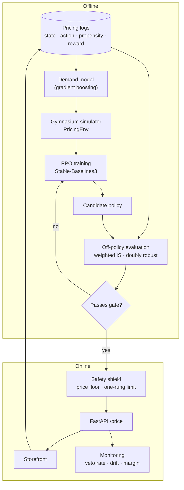

**In one line.** Build a pricing agent for an e-commerce catalogue that starts as a bandit, graduates to a PPO policy trained in a simulator, is validated offline against logged data, and ships behind a safety shield with monitoring.

This project deliberately touches **every concept in this subject**. Work through it in order; each step is runnable on a laptop.

## What you are building

A service that answers one question, thousands of times a day:

> Given this product, its stock level, its demand signal and the competitor price, **what price should we show for the next hour?**

| | |
| --- | --- |
| **Business objective** | Maximise gross margin over a season, without stocking out early or dumping inventory at the end |
| **Action** | A price multiplier from a discrete ladder: `[0.85, 0.90, 0.95, 1.00, 1.05, 1.10, 1.15]` × list price |
| **State** | Days remaining, stock remaining, recent sell-through rate, competitor price ratio, weekday, promo flag |
| **Reward** | Margin earned this step − stock-out penalty − end-of-season leftover penalty |
| **Horizon** | One season ≈ 90 decision steps — long enough to need a critic, short enough to simulate fast |
| **Constraint** | Price never moves more than one rung per step, never below cost + 5% |

**Why this problem.** It is a genuine MDP (today's price changes tomorrow's stock), the reward is real money, exploration is expensive, and you already have logs — which is exactly the situation where every concept in this subject earns its keep.

## Architecture



Note the loop: the storefront writes logs, the logs fit the demand model, the demand model *is* the simulator, and the simulator trains the policy that the storefront serves. **Closing that loop is the actual engineering work.**

## The stack, and why each piece is there

| Library | What it does here | Learn it from |
| --- | --- | --- |
| **NumPy / pandas** | Feature engineering, log processing, all the offline-evaluation maths | [pandas user guide](https://pandas.pydata.org/docs/user_guide/index.html) |
| **scikit-learn** | The demand model that turns logs into a simulator | [scikit-learn user guide](https://scikit-learn.org/stable/user_guide.html) |
| **Gymnasium** | The standard environment API — `reset()` / `step()` — so any RL library can train on your simulator | [Gymnasium docs](https://gymnasium.farama.org/) · [creating a custom env](https://gymnasium.farama.org/introduction/create_custom_env/) |
| **Stable-Baselines3** | Battle-tested PPO, DQN and SAC implementations; you should not write your own for production | [SB3 docs](https://stable-baselines3.readthedocs.io/) · [RL Tips and Tricks](https://stable-baselines3.readthedocs.io/en/master/guide/rl_tips.html) |
| **PyTorch** | The tensor layer underneath SB3; needed for custom policy networks | [PyTorch tutorials](https://pytorch.org/tutorials/) |
| **CleanRL** | Single-file reference implementations to read when SB3 behaviour surprises you | [CleanRL docs](https://docs.cleanrl.dev/) |
| **Optuna** | Hyperparameter search over learning rate, clip range, GAE λ | [Optuna docs](https://optuna.readthedocs.io/) |
| **MLflow** | Experiment tracking, model registry, the "which policy is in production" record | [MLflow docs](https://mlflow.org/docs/latest/index.html) |
| **FastAPI + Uvicorn** | The serving layer; async, typed, OpenAPI for free | [FastAPI docs](https://fastapi.tiangolo.com/) |
| **Pydantic** | Request/response validation — rejects malformed state before it reaches the policy | [Pydantic docs](https://docs.pydantic.dev/) |
| **pytest** | Tests for the env dynamics, the shield and the evaluation gate | [pytest docs](https://docs.pytest.org/) |
| **Docker** | Reproducible image for training and serving | [Docker getting started](https://docs.docker.com/get-started/) |
| **Evidently** | Data/prediction drift reports on the live feature stream | [Evidently docs](https://docs.evidentlyai.com/metrics/all_metrics) |

:::tip Install
```bash
pip install "gymnasium>=1.0" stable-baselines3 torch scikit-learn pandas numpy \
            optuna mlflow fastapi uvicorn pydantic pytest evidently
```
:::

## Step 1 — Formalise the MDP

Write the five elements down before any code. This is the artefact you review with the business.

```python
# mdp_spec.py — the contract everyone agrees on before modelling starts.
from dataclasses import dataclass, asdict
import json

@dataclass(frozen=True)
class PricingMDP:
    states: str = ("days_left, stock_frac, sell_through_7d, competitor_ratio, "
                   "weekday, promo_flag")
    actions: tuple = (0.85, 0.90, 0.95, 1.00, 1.05, 1.10, 1.15)
    reward: str = ("margin_this_step "
                   "- 2.0 * stockout_units "
                   "- 0.5 * leftover_units_at_end")
    gamma: float = 0.99          # ~100-step effective horizon, matches a season
    horizon: int = 90
    constraints: tuple = ("price >= cost * 1.05",
                          "|action_index_t - action_index_t-1| <= 1")

if __name__ == "__main__":
    print(json.dumps(asdict(PricingMDP()), indent=2))
```

**γ = 0.99** because the effective horizon `1/(1−γ) ≈ 100` matches the season length. This is a business decision, not a hyperparameter — see [MDPs and the Bellman Equations](/docs/theory/drl/mdps-and-bellman-equations).

## Step 2 — Build the simulator from your logs

You cannot explore on real customers, so the demand model becomes the environment. Fit it on logged `(price, context) → units_sold`, then wrap it in the Gymnasium API.

```python
# pricing_env.py
import numpy as np
import gymnasium as gym
from gymnasium import spaces

PRICE_LADDER = np.array([0.85, 0.90, 0.95, 1.00, 1.05, 1.10, 1.15])

class PricingEnv(gym.Env):
    """Season-long pricing MDP. Demand comes from a fitted elasticity model."""

    metadata = {"render_modes": []}

    def __init__(self, demand_model=None, horizon=90, start_stock=900,
                 list_price=50.0, unit_cost=30.0, seed=None):
        super().__init__()
        self.demand_model = demand_model or self._default_demand
        self.horizon, self.start_stock = horizon, start_stock
        self.list_price, self.unit_cost = list_price, unit_cost
        self.rng = np.random.default_rng(seed)

        self.action_space = spaces.Discrete(len(PRICE_LADDER))
        # days_left, stock_frac, sell_through, competitor_ratio, weekday/6, promo
        self.observation_space = spaces.Box(low=0.0, high=1.0, shape=(6,), dtype=np.float32)

    # --- demand: isoelastic with noise; replace with your fitted model -------
    def _default_demand(self, price_ratio, competitor_ratio, promo, weekday):
        base = 12.0 * (price_ratio ** -2.2)          # elasticity ≈ -2.2
        base *= 1.0 + 0.25 * promo
        base *= 1.0 + 0.15 * (competitor_ratio - 1.0) * 3
        base *= 1.0 + (0.20 if weekday >= 5 else 0.0)
        return max(0.0, self.rng.normal(base, base * 0.25))

    def _obs(self):
        return np.array([
            self.t_left / self.horizon,
            self.stock / self.start_stock,
            min(self.sell_through / 30.0, 1.0),
            min(self.competitor_ratio / 2.0, 1.0),
            self.weekday / 6.0,
            float(self.promo),
        ], dtype=np.float32)

    def reset(self, *, seed=None, options=None):
        super().reset(seed=seed)
        if seed is not None:
            self.rng = np.random.default_rng(seed)
        self.t_left, self.stock = self.horizon, self.start_stock
        self.sell_through, self.weekday = 10.0, 0
        self.competitor_ratio, self.promo = 1.0, 0
        self.last_action = 3                      # start at list price (index of 1.00)
        return self._obs(), {}

    def step(self, action):
        action = int(np.clip(action, 0, len(PRICE_LADDER) - 1))
        # constraint: move at most one rung per step
        action = int(np.clip(action, self.last_action - 1, self.last_action + 1))
        ratio = PRICE_LADDER[action]
        price = max(self.list_price * ratio, self.unit_cost * 1.05)   # price floor

        demand = self.demand_model(ratio, self.competitor_ratio, self.promo, self.weekday)
        sold = min(demand, self.stock)
        unmet = max(0.0, demand - self.stock)

        margin = sold * (price - self.unit_cost)
        reward = margin - 2.0 * unmet * (price - self.unit_cost)

        self.stock -= sold
        self.sell_through = 0.7 * self.sell_through + 0.3 * sold
        self.t_left -= 1
        self.weekday = (self.weekday + 1) % 7
        self.promo = int(self.rng.random() < 0.1)
        self.competitor_ratio = float(np.clip(
            self.competitor_ratio + self.rng.normal(0, 0.02), 0.8, 1.3))
        self.last_action = action

        terminated = self.t_left <= 0 or self.stock <= 0
        if terminated and self.stock > 0:                 # leftover penalty
            reward -= 0.5 * self.stock * (self.list_price - self.unit_cost)

        return self._obs(), float(reward), bool(terminated), False, {
            "price": price, "sold": sold, "margin": margin, "stock": self.stock}


if __name__ == "__main__":
    env = PricingEnv(seed=0)
    obs, _ = env.reset(seed=0)
    total = 0.0
    for _ in range(90):
        obs, r, done, _, info = env.step(3)            # always list price
        total += r
        if done:
            break
    print(f"always-list-price baseline margin: {total:,.0f}")
```

:::note Validate the simulator before you trust it
Back-test the demand model on held-out weeks. If simulated revenue for the **historical** price path does not match reality within a few percent, any policy you train is optimising a fantasy. This is the model-bias failure from [Model-Based RL and MCTS](/docs/theory/drl/model-based-rl-and-mcts).
:::

## Step 3 — Ship a bandit first

Before any deep RL, run a **contextual bandit**. It is simpler, safer, and often 80% of the value — exactly the argument from [Choosing an Algorithm](/docs/theory/drl/choosing-an-algorithm).

```python
# bandit_baseline.py — Thompson sampling over the price ladder, per product segment.
import numpy as np

class ThompsonPricer:
    """Gaussian Thompson sampling over discrete price rungs."""

    def __init__(self, n_actions=7, prior_mean=0.0, prior_var=1e4):
        self.n = n_actions
        self.mu = np.full(n_actions, prior_mean, dtype=float)
        self.var = np.full(n_actions, prior_var, dtype=float)
        self.count = np.zeros(n_actions)
        self.obs_var = 1.0

    def select(self, rng):
        sample = rng.normal(self.mu, np.sqrt(self.var))
        action = int(np.argmax(sample))
        # propensity matters for later off-policy evaluation: estimate it
        draws = rng.normal(self.mu[:, None], np.sqrt(self.var)[:, None], size=(self.n, 256))
        propensity = float((draws.argmax(axis=0) == action).mean())
        return action, max(propensity, 1e-3)

    def update(self, action, reward):
        prec = 1.0 / self.var[action] + 1.0 / self.obs_var
        self.mu[action] = (self.mu[action] / self.var[action] + reward / self.obs_var) / prec
        self.var[action] = 1.0 / prec
        self.count[action] += 1


if __name__ == "__main__":
    rng = np.random.default_rng(0)
    true_margin = np.array([4.0, 5.5, 6.8, 7.0, 6.2, 4.9, 3.1])   # unknown in reality
    pricer = ThompsonPricer()
    log = []
    for t in range(3000):
        a, p = pricer.select(rng)
        r = rng.normal(true_margin[a], 1.0)
        pricer.update(a, r)
        log.append((a, p, r))                      # ← propensity logged for OPE
    print("best rung (true):", int(true_margin.argmax()))
    print("chosen most often:", int(np.bincount([a for a, _, _ in log]).argmax()))
    print("pulls per rung:", pricer.count.astype(int))
```

**Log the propensity.** Without it you cannot evaluate any future policy offline — the single most common regret in bandit systems, from [Off-Policy Learning](/docs/theory/drl/off-policy-learning).

## Step 4 — Train PPO in the simulator

```python
# train_ppo.py
import gymnasium as gym
import mlflow
from stable_baselines3 import PPO
from stable_baselines3.common.env_util import make_vec_env
from stable_baselines3.common.evaluation import evaluate_policy
from stable_baselines3.common.monitor import Monitor
from pricing_env import PricingEnv

def build_env(seed=0, n_envs=8):
    return make_vec_env(lambda: Monitor(PricingEnv(seed=seed)), n_envs=n_envs)

def main():
    mlflow.set_experiment("pricing-agent")
    params = dict(
        learning_rate=3e-4,
        n_steps=512,          # rollout length per env
        batch_size=1024,
        gamma=0.99,           # matches the season horizon
        gae_lambda=0.95,      # bias/variance dial on the advantage
        clip_range=0.2,       # the PPO trust region
        ent_coef=0.01,        # keeps the policy from collapsing early
        vf_coef=0.5,
        max_grad_norm=0.5,
    )
    with mlflow.start_run():
        mlflow.log_params(params)
        model = PPO("MlpPolicy", build_env(), verbose=0, seed=0, **params)
        model.learn(total_timesteps=600_000, progress_bar=True)

        mean, std = evaluate_policy(model, Monitor(PricingEnv(seed=123)), n_eval_episodes=50)
        mlflow.log_metrics({"eval_margin_mean": mean, "eval_margin_std": std})
        model.save("ppo_pricing")
        mlflow.log_artifact("ppo_pricing.zip")
        print(f"eval margin {mean:,.0f} ± {std:,.0f}")

if __name__ == "__main__":
    main()
```

**What to watch while it trains** — the three curves from [Policy Gradients](/docs/theory/drl/policy-gradients-and-actor-critic):

| Curve | Healthy | Trouble |
| --- | --- | --- |
| `rollout/ep_rew_mean` | Rising, then plateau | Flat from step 0 → reward scaling or env bug |
| `train/entropy_loss` | Decreasing slowly | Collapses in the first 10% → raise `ent_coef` |
| `train/approx_kl` | ≈ 0.01–0.03 | Spikes above 0.05 → lower `learning_rate` or `clip_range` |

Tune with Optuna over `learning_rate`, `clip_range`, `gae_lambda` and `ent_coef` — those four explain most of the variance in final performance.

## Step 5 — Gate the policy with off-policy evaluation

Simulator performance is not evidence. Before the policy touches traffic, estimate its value **on logged data** with weighted importance sampling and a doubly-robust estimator.

```python
# evaluate_offline.py
import numpy as np

def weighted_is(target_probs, behaviour_probs, rewards):
    rho = target_probs / np.maximum(behaviour_probs, 1e-6)
    return float(np.sum(rho * rewards) / np.sum(rho)), rho

def doubly_robust(target_probs, behaviour_probs, rewards, q_hat, v_hat):
    """q_hat: reward model for the logged action. v_hat: E_π[q_hat] under target."""
    rho = target_probs / np.maximum(behaviour_probs, 1e-6)
    return float(np.mean(v_hat + rho * (rewards - q_hat)))

def effective_sample_size(rho):
    return float(rho.sum() ** 2 / np.sum(rho ** 2))


if __name__ == "__main__":
    rng = np.random.default_rng(0)
    n = 20_000
    behaviour_probs = rng.uniform(0.05, 0.35, n)     # logged propensities
    target_probs = np.clip(behaviour_probs * rng.uniform(0.5, 2.5, n), 1e-3, 1.0)
    rewards = rng.normal(7.0, 2.0, n)
    q_hat = rng.normal(6.8, 1.0, n)
    v_hat = q_hat + rng.normal(0.2, 0.3, n)

    wis, rho = weighted_is(target_probs, behaviour_probs, rewards)
    dr = doubly_robust(target_probs, behaviour_probs, rewards, q_hat, v_hat)
    ess = effective_sample_size(rho)

    print(f"logged policy value : {rewards.mean():.3f}")
    print(f"weighted IS         : {wis:.3f}")
    print(f"doubly robust       : {dr:.3f}")
    print(f"effective sample size: {ess:,.0f} of {n:,}")
    print("GATE:", "PASS" if ess > 1000 and dr > rewards.mean() * 1.02 else "FAIL")
```

**The gate is a hard rule, not a suggestion:** ship only if the doubly-robust estimate beats the incumbent by a margin *and* the effective sample size is large enough for that number to mean anything.

## Step 6 — Serve it behind a shield

```python
# service.py
from typing import Literal
import numpy as np
from fastapi import FastAPI
from pydantic import BaseModel, Field
from stable_baselines3 import PPO

PRICE_LADDER = [0.85, 0.90, 0.95, 1.00, 1.05, 1.10, 1.15]
VERSION = "ppo-2026-09-18"
app = FastAPI(title="Pricing Agent", version="1.0")
model = PPO.load("ppo_pricing")

STATS = {"requests": 0, "vetoes": 0, "fallbacks": 0}

class PriceRequest(BaseModel):
    days_left_frac: float = Field(ge=0, le=1)
    stock_frac: float = Field(ge=0, le=1)
    sell_through: float = Field(ge=0, le=1)
    competitor_ratio: float = Field(ge=0, le=1)
    weekday_frac: float = Field(ge=0, le=1)
    promo: Literal[0, 1]
    current_rung: int = Field(ge=0, le=6)
    unit_cost: float
    list_price: float

class PriceResponse(BaseModel):
    price: float
    rung: int
    source: Literal["policy", "shielded", "fallback"]
    policy_version: str

@app.post("/price", response_model=PriceResponse)
def price(req: PriceRequest) -> PriceResponse:
    STATS["requests"] += 1
    obs = np.array([[req.days_left_frac, req.stock_frac, req.sell_through,
                     req.competitor_ratio, req.weekday_frac, float(req.promo)]],
                   dtype=np.float32)

    if not np.isfinite(obs).all():                        # out-of-distribution guard
        STATS["fallbacks"] += 1
        return PriceResponse(price=req.list_price, rung=3,
                             source="fallback", policy_version=VERSION)

    rung = int(model.predict(obs, deterministic=True)[0])
    shielded = int(np.clip(rung, req.current_rung - 1, req.current_rung + 1))  # one rung
    raw = req.list_price * PRICE_LADDER[shielded]
    final = max(raw, req.unit_cost * 1.05)                # hard price floor

    source = "policy" if (shielded == rung and final == raw) else "shielded"
    if source == "shielded":
        STATS["vetoes"] += 1
    return PriceResponse(price=round(final, 2), rung=shielded,
                         source=source, policy_version=VERSION)

@app.get("/health")
def health():
    veto_rate = STATS["vetoes"] / max(STATS["requests"], 1)
    return {"status": "ok" if veto_rate < 0.25 else "degraded",
            "veto_rate": round(veto_rate, 4), **STATS}
```

Run it: `uvicorn service:app --port 8000`. **Alert on `veto_rate`** — a rising veto rate means the policy is drifting outside what you validated, and it fires long before margin moves.

## Step 7 — Test, package, automate

```python
# tests/test_env.py
import numpy as np
from pricing_env import PricingEnv

def test_price_floor_respected():
    env = PricingEnv(seed=0, list_price=50.0, unit_cost=48.0)
    env.reset(seed=0)
    _, _, _, _, info = env.step(0)                 # cheapest rung
    assert info["price"] >= 48.0 * 1.05

def test_one_rung_constraint():
    env = PricingEnv(seed=0)
    env.reset(seed=0)                               # starts at rung 3
    env.step(6)                                     # ask for the top rung
    assert env.last_action == 4                     # only one rung of movement allowed

def test_episode_terminates():
    env = PricingEnv(seed=1, horizon=90)
    env.reset(seed=1)
    steps = 0
    done = False
    while not done and steps < 200:
        _, _, done, _, _ = env.step(3)
        steps += 1
    assert done and steps <= 90

def test_determinism_given_seed():
    a = PricingEnv(seed=7); a.reset(seed=7)
    b = PricingEnv(seed=7); b.reset(seed=7)
    ra = [a.step(3)[1] for _ in range(10)]
    rb = [b.step(3)[1] for _ in range(10)]
    assert np.allclose(ra, rb)
```

```dockerfile
# Dockerfile
FROM python:3.12-slim
WORKDIR /app
COPY requirements.txt .
RUN pip install --no-cache-dir -r requirements.txt
COPY pricing_env.py service.py ppo_pricing.zip ./
EXPOSE 8000
HEALTHCHECK --interval=30s CMD python -c "import urllib.request;urllib.request.urlopen('http://localhost:8000/health')"
CMD ["uvicorn", "service:app", "--host", "0.0.0.0", "--port", "8000"]
```

```yaml
# .github/workflows/train-and-gate.yml
name: train-and-gate
on:
  schedule: [{cron: "0 3 * * 1"}]        # retrain weekly
  workflow_dispatch:

jobs:
  train:
    runs-on: ubuntu-latest
    steps:
      - uses: actions/checkout@v4
      - uses: actions/setup-python@v5
        with: {python-version: "3.12"}
      - run: pip install -r requirements.txt
      - run: pytest -q                     # env + shield invariants must hold
      - run: python train_ppo.py
      - run: python evaluate_offline.py | tee ope.txt
      - run: grep -q "GATE: PASS" ope.txt  # fail the build if the gate fails
      - uses: actions/upload-artifact@v4
        with: {name: policy, path: ppo_pricing.zip}
```

## The rollout plan

Follow the ladder from [RL in Production](/docs/theory/drl/reinforcement-learning-in-production) — never skip a rung:

1. **Week 1 — offline only.** Doubly-robust estimate beats the incumbent, ESS > 1000.
2. **Week 2 — shadow mode.** The service runs, logs a price, and the storefront ignores it. Compare with what humans/rules chose.
3. **Week 3 — 5% of low-risk SKUs.** Shield on, kill switch ready, daily margin review.
4. **Week 4–6 — expand to 50%** if margin holds and veto rate stays under 10%.
5. **Ongoing — weekly retrain**, monthly demand-model refit, automatic rollback if margin drops two days running.

## What to measure

| Metric | Target | Meaning |
| --- | --- | --- |
| Gross margin per SKU-day vs control | > +2% | The actual objective |
| Stock-out rate | ≤ baseline | The agent is not selling out early for short-term margin |
| End-of-season leftover | ≤ baseline | It is not hoarding |
| Veto rate | < 10% | Policy is staying inside the validated envelope |
| Price volatility (rung changes/week) | < 3 | Customer-visible thrash — a real complaint driver |
| OPE ESS at each gate | > 1000 | Offline numbers are trustworthy |

:::warning The failure mode to expect
The agent discovers it can maximise reward by pricing high, selling little, and avoiding the stock-out penalty entirely — then the leftover penalty bites on the last day. That is **reward hacking**, and the fix is the reward function, not the hyperparameters. Simulate the end-of-season penalty properly before you train.
:::

## Extensions once it works

- **Multi-product**: prices interact through substitution. This becomes multi-agent, and a shared critic with per-product actors is the usual first design.
- **Offline RL** (CQL/IQL) trained directly on logs, skipping the simulator — compare against the simulator-trained policy.
- **MCTS at decision time** for high-value SKUs: plan a few days ahead inside the demand model rather than acting one step at a time.
- **Contextual features from embeddings** — product text and images as state, which is where the PyTorch custom policy network earns its place.

## Further reading

- [Stable-Baselines3 RL Tips and Tricks](https://stable-baselines3.readthedocs.io/en/master/guide/rl_tips.html) — the single most useful page for getting real training runs to converge.
- [Gymnasium: creating a custom environment](https://gymnasium.farama.org/introduction/create_custom_env/) — the API contract your simulator must honour.
- [The 37 Implementation Details of PPO](https://iclr-blog-track.github.io/2022/03/25/ppo-implementation-details/) — why reimplementations underperform the paper.
- [Offline RL: Tutorial, Review and Perspectives](https://arxiv.org/abs/2005.01643) — for the log-only variant of this project.
- [MLflow model registry](https://mlflow.org/docs/latest/model-registry.html) — how to record which policy is live and roll back.
- [Evidently: data drift](https://docs.evidentlyai.com/metrics/all_metrics) — monitoring the feature stream that feeds the policy.
