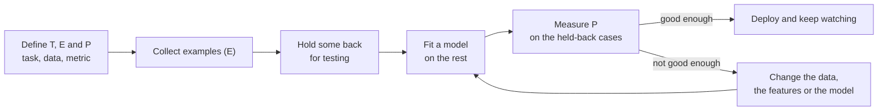

import Infographic from '@site/src/components/Infographic';
import BiasVarianceLab from '@site/src/components/viz/BiasVarianceLab';

**In one line.** Machine learning replaces hand-written rules with rules learned from examples, and the only score that counts is how well they work on cases the model has never seen.

## The idea in plain words

Ordinary programming runs in one direction. A person studies the problem, writes the rules, and the computer applies those rules to data to produce answers. Machine learning reverses the arrow: you supply **data together with the answers that went with it**, and the computer works out the rules for itself.

That reversal pays off when you cannot write the rules down. Nobody can list, in code, every feature of an email that makes it spam, or every combination of age, mileage and condition that sets the price of a used car. But anyone can collect ten thousand past emails marked spam or not spam, or ten thousand past sales with the price paid. The learning algorithm finds the pattern that links the first column to the second.

Mitchell's definition turns this into three decisions you must make before you choose any algorithm.

- **Task (T)**: what is to be predicted or decided. "The sale price of a used car."
- **Experience (E)**: the data the program learns from. "Past sales, each with its features and its price."
- **Performance (P)**: the number that says whether it is getting better. "Mean absolute error in pounds, measured on sales the model did not see."

A program *learns* if its P on T improves as E grows. The word that deserves underlining is *unseen*. A model that has memorised its examples scores perfectly on them and is useless on tomorrow's cars. Almost every technique in the later chapters, from train and test splits to regularisation to cross-validation, exists to measure and protect performance on data the model has not met.

Three questions place any machine learning problem on the map, and the lecture below answers each one. Is there a label at all (supervised, unsupervised, semi-supervised or reinforcement learning)? Is the label a category or a number (classification or regression)? Does the model keep its examples (instance-based) or only what it learned from them (model-based)?



<Infographic src="/img/ml/what-machine-learning-is-rules-to-learning.svg" alt="Two arrows contrasted: rules plus data give answers, data plus answers give rules, with the used-car test error falling from 962 to 764 pounds as the number of cars seen grows from 3 to 300." caption="Learning reverses the arrow. The numbers are from the first code block below." />

<Infographic src="/img/ml/what-machine-learning-is-paradigms.svg" alt="Four learning paradigms side by side with one measured result each: supervised, unsupervised, semi-supervised and reinforcement learning." caption="The four paradigms, each with the number the second code block prints." />

<Infographic src="/img/ml/what-machine-learning-is-fit.svg" alt="Three polynomial fits of the same 30 points: degree 1 underfits, degree 4 fits well, degree 15 overfits, with their training and test errors." caption="Underfitting, a good fit and overfitting, with the errors the last code block prints." />

## How it works

### What is ML, and when to use it

A program learns from experience E at task T measured by P if its P on T improves with E (Mitchell).

:::tip

**Use ML when** the rules are unknown or too complex to hand-code, the problem changes over time, or you need personalisation at scale (used-car pricing, employability, market segmentation).

:::

:::note

**Traditional vs ML.** Rules + data → answers becomes data + answers → rules.

:::

### Features, target, and the learning task

A row is an instance; input columns are features/attributes/predictors x; the predicted column is the target y.

:::tip

**Define T, E, P first.** What to predict, which data, and the metric — before picking an algorithm.

:::

### Supervised, unsupervised, semi & reinforcement

- **Supervised** — Labelled (x,y) → predict y. Classification (discrete) or regression (continuous).
- **Unsupervised** — Unlabelled → find structure: clustering, association, dimensionality reduction.
- **Semi-supervised** — A few labels + lots of unlabelled data.
- **Reinforcement** — Learn from a reward by interacting with an environment.

### Classification vs regression & data use

- **Classification** — Discrete label (spam, disease). Logistic regression, trees, SVM, neural nets.
- **Regression** — Continuous value (price, temperature). Linear/polynomial and regularised variants.

:::note

**By data use.** Batch vs online (stream), and instance-based (k-NN memorises) vs model-based (fit parameters, discard data).

:::

### Key takeaways

- **1 · Definition** — Improve P on T with E; learn rules from data.
- **2 · Paradigms** — Supervised, unsupervised, semi, reinforcement.
- **3 · Supervised split** — Classification (discrete) vs regression (continuous).

:::note

**The thread.** Machine learning is one idea — learn the rule from examples — organised by how much supervision the data carries and how the model uses it. Everything later is a specific algorithm inside this map.

:::

## A real system that works this way

**Used-car pricing** is the lecture's own example, and a good one because the hand-written alternative is so easy to picture. A dealer's rule of thumb says "start from a base price, take off so much per year of age and so much per kilometre". Those constants are guesses. They go stale every season, they differ by model, and nobody can say how age and mileage interact. A learning system is shown thousands of past sales (E), asked for the sale price (T), and marked by its average pound error on sales it never saw (P). The first code block below builds a small synthetic version of exactly this comparison.

**Employability prediction and market segmentation**, the lecture's other two examples, sit at opposite ends of the paradigm map. Employability has a label (hired or not), so it is supervised classification. Segmentation has no label: nobody tells the algorithm what the customer groups are, and finding them is the task, so it is unsupervised.

**A spam filter** is the textbook case of "the problem changes over time". Spammers rewrite their messages as soon as a rule catches them, so a fixed rule list decays, while a filter that is retrained on this month's flagged mail keeps pace. That is why retraining belongs to the job description rather than being an afterthought.

## Code you can run

Four blocks, each taking a few seconds on a laptop CPU and fully seeded, so your numbers will match the ones printed here.

**1. Rules versus learning, and what "improves with experience" looks like.** A hand-written dealer's rule is scored against a linear model trained on 3, 10, 30, ... 1,500 cars. Every score is measured on the same 500 held-back cars.

```python
import numpy as np
from sklearn.linear_model import LinearRegression
from sklearn.metrics import mean_absolute_error

rng = np.random.default_rng(0)

def make_cars(n):
    age = rng.uniform(1, 12, n)
    km = age * rng.uniform(8_000, 16_000, n)
    price = 21_000 * np.exp(-0.13 * age) - 0.035 * km + rng.normal(0, 600, n)
    return np.column_stack([age, km]), price

X_pool, y_pool = make_cars(2_000)
X_test, y_test = X_pool[:500], y_pool[:500]
X_train, y_train = X_pool[500:], y_pool[500:]

def hand_written_rule(X):
    return 20_000 - 1_300 * X[:, 0] - 0.03 * X[:, 1]

print(f"hand-written rule  MAE on test: £{mean_absolute_error(y_test, hand_written_rule(X_test)):7.0f}")
print()
print(" experience E (cars seen)   performance P (test MAE)")
for n in (3, 10, 30, 100, 300, 1_500):
    model = LinearRegression().fit(X_train[:n], y_train[:n])
    mae = mean_absolute_error(y_test, model.predict(X_test))
    print(f"{n:14d}                £{mae:8.0f}")
```

```text
hand-written rule  MAE on test: £   2108

 experience E (cars seen)   performance P (test MAE)
             3                £     962
            10                £     958
            30                £     792
           100                £     766
           300                £     764
          1500                £     771
```

Two things to notice. The learned model beats the hand-written rule by a wide margin (about £764 against £2,108 once it has seen 300 cars), and that is Mitchell's definition made visible: P improves as E grows. The curve also goes flat. From around 100 cars on, more experience does not help, because the generator makes prices fall exponentially with age and a straight line cannot bend to follow that. More data cannot rescue a model that is too simple. The last section of this chapter returns to that point.

**2. The four paradigms, one measured result each.** Classification and regression need labels. K-means never sees them. Label spreading gets six labels and a pool of unlabelled rows. The reinforcement learner receives only a reward after each choice.

```python
import numpy as np
from sklearn.cluster import KMeans
from sklearn.datasets import load_diabetes, load_iris
from sklearn.linear_model import LinearRegression, LogisticRegression
from sklearn.metrics import adjusted_rand_score
from sklearn.model_selection import train_test_split
from sklearn.semi_supervised import LabelSpreading

X, y = load_iris(return_X_y=True)
Xtr, Xte, ytr, yte = train_test_split(X, y, test_size=0.3, stratify=y, random_state=0)
clf = LogisticRegression(max_iter=500).fit(Xtr, ytr)
print(f"supervised, classification : iris test accuracy      {clf.score(Xte, yte):.3f}")

Xd, yd = load_diabetes(return_X_y=True)
Xdt, Xde, ydt, yde = train_test_split(Xd, yd, test_size=0.3, random_state=0)
reg = LinearRegression().fit(Xdt, ydt)
print(f"supervised, regression     : diabetes test R^2       {reg.score(Xde, yde):.3f}")

km = KMeans(n_clusters=3, n_init=10, random_state=0).fit(X)
print(f"unsupervised               : k-means vs species ARI  {adjusted_rand_score(y, km.labels_):.3f}  (labels never shown to k-means)")

labelled = np.concatenate([np.flatnonzero(y == c)[:2] for c in range(3)])
mask = np.ones(len(y), dtype=bool)
mask[labelled] = False
only_labelled = LogisticRegression(max_iter=500).fit(X[labelled], y[labelled])
y_partial = np.full(len(y), -1)
y_partial[labelled] = y[labelled]
spread = LabelSpreading(kernel="knn", n_neighbors=7).fit(X, y_partial)
print(f"semi-supervised, 6 labels  : labelled-only accuracy  {only_labelled.score(X[mask], y[mask]):.3f}")
print(f"                             label spreading          {(spread.transduction_[mask] == y[mask]).mean():.3f}")

rewards = np.array([0.2, 0.5, 0.8])
rng = np.random.default_rng(0)
estimate, pulls = np.zeros(3), np.zeros(3)
total = 0.0
for t in range(2_000):
    arm = rng.integers(3) if rng.random() < 0.1 else int(np.argmax(estimate))
    r = float(rng.random() < rewards[arm])
    pulls[arm] += 1
    estimate[arm] += (r - estimate[arm]) / pulls[arm]
    total += r
print(f"reinforcement              : estimates {np.round(estimate, 2)}, pulls {pulls.astype(int)}")
print(f"                             average reward {total / 2_000:.3f} vs random policy {rewards.mean():.3f}")
```

```text
supervised, classification : iris test accuracy      1.000
supervised, regression     : diabetes test R^2       0.393
unsupervised               : k-means vs species ARI  0.730  (labels never shown to k-means)
semi-supervised, 6 labels  : labelled-only accuracy  0.826
                             label spreading          0.951
reinforcement              : estimates [0.19 0.46 0.8 ], pulls [  81   72 1847]
                             average reward 0.766 vs random policy 0.500
```

Read each line on its own terms. Iris classification scores a perfect 1.000 because iris is an easy data set, not because classification is easy. The diabetes regression explains 39% of the variance (R squared of 0.393), a typical result for ten blunt clinical columns. K-means recovers the species with an adjusted Rand index of 0.730, where 1 means perfect agreement and 0 means chance. Six labelled flowers give a logistic regression 0.826 accuracy on the other 144, but letting label spreading see the unlabelled flowers lifts that to 0.951, because they show where the clusters lie. The bandit's arms pay out with probability 0.2, 0.5 and 0.8, so picking at random earns 0.500 per pull; the learner earns 0.766 by finding the 0.8 arm and pulling it 1,847 times out of 2,000.

**3. Instance-based versus model-based, batch versus online.** The lecture draws both distinctions in one sentence each. The code shows what they mean in memory.

```python
import numpy as np
from sklearn.datasets import load_breast_cancer
from sklearn.linear_model import LogisticRegression, SGDClassifier
from sklearn.model_selection import train_test_split
from sklearn.neighbors import KNeighborsClassifier
from sklearn.pipeline import make_pipeline
from sklearn.preprocessing import StandardScaler

X, y = load_breast_cancer(return_X_y=True)
Xtr, Xte, ytr, yte = train_test_split(X, y, test_size=0.25, stratify=y, random_state=0)

knn = make_pipeline(StandardScaler(), KNeighborsClassifier(n_neighbors=5)).fit(Xtr, ytr)
lr = make_pipeline(StandardScaler(), LogisticRegression(max_iter=1000)).fit(Xtr, ytr)
stored_by_knn = knn[-1]._fit_X.shape
stored_by_lr = lr[-1].coef_.size + lr[-1].intercept_.size
print(f"instance-based k-NN    : keeps {stored_by_knn[0]} x {stored_by_knn[1]} training table, test accuracy {knn.score(Xte, yte):.3f}")
print(f"model-based logistic   : keeps {stored_by_lr} numbers, test accuracy {lr.score(Xte, yte):.3f}")

scaler = StandardScaler().fit(Xtr)
online = SGDClassifier(loss="log_loss", random_state=0)
print()
print(" rows streamed so far   test accuracy of the online model")
for start in range(0, len(Xtr), 100):
    chunk = slice(start, start + 100)
    online.partial_fit(scaler.transform(Xtr[chunk]), ytr[chunk], classes=[0, 1])
    seen = min(start + 100, len(Xtr))
    print(f"{seen:12d}           {online.score(scaler.transform(Xte), yte):.3f}")
```

```text
instance-based k-NN    : keeps 426 x 30 training table, test accuracy 0.951
model-based logistic   : keeps 31 numbers, test accuracy 0.958

 rows streamed so far   test accuracy of the online model
         100           0.944
         200           0.888
         300           0.958
         400           0.965
         426           0.965
```

The k-nearest-neighbours model keeps the whole 426 by 30 training table and compares every new case to it at prediction time. The logistic regression keeps 31 numbers (30 weights and an intercept) and could throw the table away. Their accuracy is about the same. The online model never sees the whole table at once: it updates on 100 rows at a time, and its test accuracy wobbles (0.944, 0.888, 0.958, 0.965, 0.965) as each batch pulls it a little. A model that learns from a stream is always partly a function of its most recent data, which is the reason online systems need monitoring.

:::note Beyond the lecture: fitting versus generalising

The lecture says "learn the rule from examples". The first thing that goes wrong is learning the *examples* instead of the rule. Take 30 noisy points from a smooth curve and fit polynomials of increasing degree. A degree-1 line is too stiff to follow the curve: its error is high on both the data it saw and fresh data. That is **bias**, or underfitting. A degree-15 polynomial is flexible enough to thread through the noise: its training error is tiny, but fresh data exposes it. That is **variance**, or overfitting. Training error can only fall as the model gets more flexible. Test error falls and then rises, and the lowest point of that U is the model you want.

The noise in the data sets a floor. These points carry noise with standard deviation 0.3, so no model can do better than a mean squared error of 0.3 squared, which is 0.0900. A training error *below* that floor is not good news, it is the fingerprint of a model that has fitted noise.

:::

**4. Bias and variance, measured.** The same experiment as the note above, as a table.

```python
import math
import numpy as np

class Mulberry32:
    def __init__(self, seed):
        self.state = seed & 0xFFFFFFFF

    def random(self):
        self.state = (self.state + 0x6D2B79F5) & 0xFFFFFFFF
        t = self.state
        t = ((t ^ (t >> 15)) * (1 | t)) & 0xFFFFFFFF
        t = ((t + (((t ^ (t >> 7)) * (61 | t)) & 0xFFFFFFFF)) & 0xFFFFFFFF) ^ t
        return ((t ^ (t >> 14)) & 0xFFFFFFFF) / 4294967296

    def normal(self):
        u = max(self.random(), 1e-12)
        return math.sqrt(-2 * math.log(u)) * math.cos(2 * math.pi * self.random())

def truth(x):
    return np.cos(1.5 * np.pi * x)

def sample(n, seed, noise):
    rng = Mulberry32(seed)
    x = np.array([(i + rng.random()) / n for i in range(n)])
    y = truth(x) + noise * np.array([rng.normal() for _ in range(n)])
    return x, y

def design(x, degree):
    return np.vander(2 * x - 1, degree + 1, increasing=True)

x_train, y_train = sample(30, seed=11, noise=0.3)
x_test, y_test = sample(200, seed=12, noise=0.3)

print("noise variance (the floor no model can beat): 0.0900\n")
print(" degree   train MSE   test MSE")
for degree in (1, 2, 3, 4, 6, 9, 12, 15):
    w, *_ = np.linalg.lstsq(design(x_train, degree), y_train, rcond=None)
    train = np.mean((design(x_train, degree) @ w - y_train) ** 2)
    test = np.mean((design(x_test, degree) @ w - y_test) ** 2)
    print(f"{degree:6d}   {train:9.4f}   {test:8.4f}")
```

```text
noise variance (the floor no model can beat): 0.0900

 degree   train MSE   test MSE
     1      0.3154     0.2823
     2      0.1140     0.1314
     3      0.1022     0.1053
     4      0.0979     0.1051
     6      0.0928     0.1062
     9      0.0895     0.1144
    12      0.0814     0.1392
    15      0.0432     0.7246
```

Degree 1 is underfitting (0.3154 on the training points, 0.2823 on the fresh ones; the test set is a different sample, so it can come out lower). Degrees 3 and 4 sit just above the 0.0900 floor on test data (0.1053 and 0.1051). Degree 15 drives training error to 0.0432, which is under the floor, while test error jumps to 0.7246. The data come from a small seeded random-number generator that is written out in full in the code. The lab below runs the same generator in your browser, so its numbers match digit for digit.

<BiasVarianceLab />

The lab's defaults (degree 4, noise 0.30, 30 training rows, sample 1) show training error 0.0979 and test error 0.1051, the degree-4 row above. Slide the degree to 15 for 0.0432 and 0.7246. Then drag "training rows" up to 60 and watch overfitting recede: more data tames variance but does nothing for the bias of a degree-1 line. Open "show data" for the full table.

## Designing with it

**Frame the problem before touching data.** Answer these in writing. The answers fix the architecture, and changing them later is expensive.

| Question | Why it matters | Used-car example |
| --- | --- | --- |
| What is the task T, exactly? | Decides classification or regression, and what a label is | Predict the sale price in pounds |
| What is the experience E, and who labelled it? | Label quality caps model quality | Completed sales, price as paid |
| What is the performance P, and does it match the cost of mistakes? | The metric is the real requirement | Mean absolute error in pounds, on unseen sales |
| What is the dumbest thing that could work? | That is the baseline every model must beat | The dealer's rule of thumb: £2,108 error |
| What will the model see at prediction time? | Anything unavailable then must not be a feature | Age and mileage, yes; "days to sell", no |

**Which paradigm?**

| What you have | What you want | Paradigm |
| --- | --- | --- |
| Inputs with a known answer for each | Predict the answer for new inputs | Supervised (classification or regression) |
| Inputs only | Groups, structure, compression, odd cases | Unsupervised |
| A few labels and many unlabelled rows | Use both | Semi-supervised |
| An agent that acts and receives rewards | A policy that earns the most | Reinforcement |

**When not to use machine learning.** If the rules are known, stable and can be written down (a tax formula, a unit conversion), write them: they will be exact, testable and cheap. If you have almost no examples, a hand-built rule from a domain expert usually beats a model fitted to twenty rows. And if a wrong answer is unacceptable without a human check, the model needs a human in the loop or should not make the decision at all.

**A sensible first week.** Write the baseline rule and score it. Fit the simplest model that could work and score it on held-back data. Only then reach for something more flexible, and compare on the same held-back data every time. The `Pipeline` and held-out habits in the next two chapters make this routine.

:::tip

A metric is a requirement, not a detail. "Accuracy" for a fraud model and "mean absolute error in pounds" for a price model are statements about what the business cares about. Write down which error costs more before you train anything.

:::

## Where this stands in 2026

:::info Industry view

- The T, E and P framing is how most teams now write a model's requirements: a task, the data it may learn from, and the metric it will be judged on. It is a checklist, not an algorithm.
- For spreadsheet-shaped (tabular) problems, the first things to try remain a regularised linear model and a tree ensemble. Neural networks and language models dominate text, images and audio, and are covered elsewhere in these notes.
- scikit-learn is the reference library for the methods in this subject, and its user guide (version 1.9.1 when this chapter was written) is the primary documentation to read alongside it.
- Semi-supervised and reinforcement learning are less often used on their own and more often found as parts of larger systems, such as labelling pipelines or the reward-driven tuning of language models.

:::

## Practice questions

<details>
<summary><strong>Q1.</strong> State Mitchell's definition of machine learning.</summary>

A program learns from experience E at task T measured by performance P if its performance on T, as measured by P, improves with experience E.<br /><em>Module 1 · conceptual</em>

</details>

<details>
<summary><strong>Q2.</strong> When should you use ML instead of hand-coded rules?</summary>

When the rules are unknown or too complex to write, the problem changes over time, or you need personalisation at scale — e.g. used-car pricing, employability prediction, market segmentation.<br /><em>Module 1 · conceptual</em>

</details>

<details>
<summary><strong>Q3.</strong> Distinguish supervised, unsupervised, semi-supervised and reinforcement learning.</summary>

Supervised: labelled (x,y) to predict y. Unsupervised: find structure in unlabelled data. Semi-supervised: few labels + much unlabelled data. Reinforcement: learn from a reward by interacting with an environment.<br /><em>Module 1 · conceptual</em>

</details>

<details>
<summary><strong>Q4.</strong> Within supervised learning, contrast classification and regression with an example each.</summary>

Classification predicts a discrete label (e.g. spam/not-spam); regression predicts a continuous value (e.g. house price).<br /><em>Module 1 · conceptual</em>

</details>

<details>
<summary><strong>Q5.</strong> Distinguish instance-based from model-based learning.</summary>

Instance-based (e.g. k-NN) memorises the training examples and compares at query time; model-based fits parameters to the data and then discards the raw examples.<br /><em>Module 1 · conceptual</em>

</details>

<details>
<summary><strong>Q6.</strong> Name three unsupervised-learning tasks and an application of each.</summary>

Clustering (market/customer segmentation), association (market-basket analysis), and dimensionality reduction (compression/visualisation); anomaly detection and recommendation are also common.<br /><em>Module 1 · conceptual</em>

</details>

## Further reading

- [An Introduction to Statistical Learning](https://www.statlearning.com/) (James, Witten, Hastie, Tibshirani). Free PDFs of the R and Python editions; the clearest rigorous introduction to supervised learning and resampling.
- [Machine Learning (Tom Mitchell, 1997)](https://www.cs.cmu.edu/~tom/mlbook.html). The book that states the definition used in this chapter.
- [Underfitting vs. Overfitting (scikit-learn example)](https://scikit-learn.org/stable/auto_examples/model_selection/plot_underfitting_overfitting.html). Polynomial degrees 1, 4 and 15 on a cosine curve, scored by cross-validation: the same experiment as the lab.
- [Cross-validation: evaluating estimator performance (scikit-learn)](https://scikit-learn.org/stable/modules/cross_validation.html). How held-out evaluation is done in practice.
- Built from the course lecture "ml-m1-intro" (Lecture Library series).

- **[An Introduction to Statistical Learning](https://www.statlearning.com/)** `book`
  James, Witten, Hastie & Tibshirani — The friendliest rigorous intro to ML — free PDF plus R/Python labs.
- **[Stanford CS229 (Machine Learning)](https://cs229.stanford.edu/)** `course`
  Andrew Ng, Stanford — The rigorous derivations behind SVMs, GLMs, EM and learning theory.
- **[StatQuest](https://statquest.org/video-index/)** `▶ video`
  Josh Starmer — Short, wonderfully clear videos that build intuition step by step.

## Check yourself

- [ ] I can state Mitchell's definition and name the task, the experience and the performance measure for a problem I care about
- [ ] I can explain why performance has to be measured on cases the model has not seen, and what goes wrong if it is not
- [ ] I can place a problem on the map: supervised, unsupervised, semi-supervised or reinforcement; classification or regression
- [ ] I can say what an instance-based model keeps compared with a model-based one, and what online learning changes
- [ ] I can read a pair of training and test errors and say whether they signal underfitting, a good fit or overfitting
- [ ] I can explain why more data cannot rescue a model that is too simple, and why a training error below the noise floor is a warning sign
